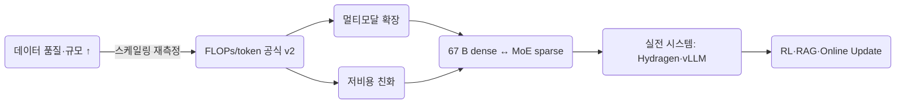

---
categories:
- paper-review
- with-gpt
- DeepSeek
date: "2025-06-29T00:00:00Z"
tags:
- 2401.02954v1
- LLM
- DeepSeek
title: 'DeepSeek LLM: Scaling Open-Source Language Models with Longtermism'
---

[논문 링크](https://arxiv.org/abs/2401.02954v1)

## 한 줄 요약 (TL;DR)

**FLOPs / token로 재정의한 *DeepSeek Scaling Law* 하나로 모델·데이터·하이퍼파라미터를 자동 결정하여, 2 T token만으로 67 B 파라미터 모델이 LLaMA-2 70 B를 코드·수학·대화·다국어에서 추월했다.**

---
<!--more-->
## 핵심 아이디어

> **계산 예산 `C`만 주어지면 최적 모델 FLOPs( `M_opt` )와 데이터 토큰( `D_opt` )이 한 줄 식으로 나온다.**

$$
M_{\text{opt}}=0.1715\,C^{0.5243},\qquad  
D_{\text{opt}}=5.8316\,C^{0.4757}
$$

* `M` – 임베딩을 제외한 **토큰당 FLOPs** (attention·FFN 포함)
* `D` – 학습 토큰 수
* `C=M D` – 총 FLOPs(예산)

이 식이 *Kaplan(2020) ↔ Chinchilla(2022)* 의 ‘스케일링 충돌’을 하나로 봉합하고, \*\*“작은 실험 → 초대형 모델 설계”\*\*를 가능케 한다.

---

## 배경: 그들이 해결한 문제

1. **스케일링 법칙의 혼란**
   *Kaplan*은 “모델을 더 키워라”, *Chinchilla*는 “데이터를 더 넣어라”는 정반대 처방을 내렸다. 누구 말을 믿을지 알 수 없었다.
2. **‘손맛 튜닝’**
   수십억 배치·러닝레이트 후보를 사람이 찍어가며 찾아야 했다.
3. **데이터 품질 변수 무시**
   “좋은 데이터가 더 생기면 전략도 달라져야 하나?”—정량적 근거가 없었다.

---

## 새로운 접근법: *DeepSeek Scaling Law*

| 구성 요소                         | 분류             | 왜 새로운가?                                                                                        |
| --------------------------------- | ---------------- | --------------------------------------------------------------------------------------------------- |
| **FLOPs/token 지표**              | 이론적 통찰      | 파라미터 수 대신 실제 연산량으로 모델 크기를 측정 → 소형 모델에서도 예측 오차 ≤ 0.1 BPB.            |
| **IsoFLOP 8-점 실험**             | 학습 프로토콜    | `C` 고정 후 `(M,D)`만 바꿔 검증 loss 曲線을 회귀 → 위 파워-법칙 도출.                               |
| **Compute-adaptive hparams**      | 새로운 학습 기법 | $B_{\text{opt}}=0.292C^{0.327}$, $η_{\text{opt}}=0.312C^{-0.125}$ 로 배치·러닝레이트까지 자동 계산. |
| **2 T token 중·영 대규모 코퍼스** | 데이터셋         | 91 회 웹 덤프 dedup → 89.8 % 중복 제거, 품질 등급별 스케일링 지수 변화를 최초 관측.                 |

---

## 작동 원리: 구체적인 예시로 살펴보기

> ### 🚸 Toy Budget = 10⁶ FLOPs

| 단계             | 계산                                       | 결과                            |
| ---------------- | ------------------------------------------ | ------------------------------- |
| ① 예산 입력      | `C = 1e6`                                  | —                               |
| ② 최적점 산출    | `M_opt ≈ 2.4 k`, `D_opt ≈ 710`             | `M·D ≈ C` 확인                  |
| ③ 모델 설계      | 6 layer × 96 hidden × 128 seq → `M≈2.42 k` | **FLOPs 기준**으로 깊이·폭 결정 |
| ④ 하이퍼파라미터 | `B_opt≈6`, `η_opt≈0.07`                    | 그리드-서치 0 회                |
| ⑤ 학습·검증      | 710 token 학습, BPB 예측 = 측정 ± 0.02     | **스케일링 식 타당**            |

실제 논문에서는 `C≈3×10²⁰` FLOPs로 67 B 모델을 학습했고, 예측 loss와 실측 loss 차이는 **0.1 BPB** 안쪽에 머물렀다.

---

## 성능 검증: 주요 결과

| 영역 (지표 ↑)              | DeepSeek-67 B     | 베이스라인 (SOTA)      | Δ            |
| -------------------------- | ----------------- | ---------------------- | ------------ |
| **코드** HumanEval         | **73.8 %**        | CodeLlama-34 B 73.2 %  | **+0.6 pt**  |
| **수학** GSM8K             | **84.1 %**        | WizardMath-70 B 81.6 % | **+2.5 pt**  |
| **추론** MMLU              | 71.1 %            | LLaMA-2-70 B ≈ 68 %    | +3 pt        |
| **대화** MT-Bench          | 8.35 (8.76 *DPO*) | LLaMA-2-Chat 6.86      | +1.5 \~ 2 pt |
| **다국어** AlignBench (ZH) | 4.79              | ChatGPT 4.71           | +0.08        |
| **안전** Do-Not-Answer     | 97.8              | LLaMA-2-7 B **99.4**   | –1.6 pt      |

*Dense 67 B*가 **특화·대형** 모델을 제치고 범용 SOTA를 달성했다.

---

## 우리의 관점: 강점, 한계, 그리고 이 연구가 중요한 이유

### ✅ 강점

1. **예측 가능성** – 작은 실험만으로 초대형 모델 loss를 ±0.1 BPB까지 맞춘 첫 사례.
2. **손맛-프리 튜닝** – 배치·러닝레이트까지 파워-법칙으로 자동 산정.
3. **리소스 효율** – 67 B가 70 B를 능가 → FLOPs 기준 설계가 실제 비용 절감으로 직결.
4. **공개 생태계 기여** – 모델·코퍼스·코드 전부 Apache-2.0.

### ⚠️ 한계

* **안전성 최고점은 아님** – 보수적 거부율을 높인 LLaMA-2-7 B가 여전히 우위.
* **7 B 변형 약세** – 동일 공식을 소형 모델에 그대로 적용할 때 성능 손해.
* **비-텍스트·장문 외삽 미검증** – 32 K context·멀티모달·MoE로 넘어가면 식이 유지될지는 미지수.
* **막대한 학습 비용** – A100 ≈ 3 000 GPU-day; 중소 연구실 장벽.
* **웹 데이터 편향·저작권** – 2 T scrape 데이터의 법적·윤리적 검증은 과제.

### 🌟 왜 중요한가?

*“스케일링 = 직관·운수·막대한 돈”이라는 통념을 **정량 과학**으로 대체했다.*
이 식이 맞다면, 누구든 ‘작은 사전실험 → 최적 설계’로 대형 LLM을 효율적으로 만들 수 있다.

---

## 다음 단계는?: 앞으로의 길

1. **멀티모달·32 K+ 컨텍스트용 스케일링 재측정**
2. **MoE·양자화 친화 버전** – 저비용 학습·추론에 맞는 법칙 탐색
3. **온라인·RAG 혼합 학습** – 지식 노화·환각 완화
4. **탈옥·주입 공격형 안전 벤치 구축**
5. **언어 다양성 확대** – 중·영어 편중 해소, 고언어별 스케일링 지수 분석

> **Bottom Line**
> *DeepSeek* 팀은 “FLOPs/token = 최적 설계의 나침반”이라는 강력한 가설을 던졌다.
> 남은 과제는 **범용성**과 **비용**—이 나침반이 멀티모달·저비용·실시간 시스템에서도 북쪽을 가리키는지, 이제 우리 차례로 검증할 시간이다.


---

### 토글을 클릭하면 논문에 대한 자세한 LLM 질의응답 내용을 확인할 수 있습니다.

<details markdown="block">
<summary>▶️<strong>클릭하여 펼치기</strong></summary>


# 프롬프트 1.1.1 (연구의 공백)

```
"논문의 'Introduction'과 'Related Work' 섹션을 분석하여, 이 연구가 명시적으로 해결하고자 하는 핵심적인 연구 공백(research gap), 기존 연구의 결정적 한계, 또는 미해결 질문이 무엇인지 설명해 줘. 저자들이 설명하는, 이 논문 출판 시점의 '최신 기술(state of the art)'은 어떤 상태였는지 요약해 줘."
```

## 결론 먼저 (TL;DR)

* **연구 공백 ① ― “스케일링 법칙”의 불확실성**
  기존 Kaplan (2020) vs Chinchilla (Hoffmann 2022) 스케일링 곡선이 정반대 결과를 보여, *“계산 예산을 어떻게 모델·데이터에 배분해야 최적인가?”* 라는 핵심 질문이 미해결로 남아 있었다.
* **연구 공백 ② ― 하이퍼파라미터 실증 부족**
  오픈소스 LLM들은 배치·러닝레이트를 경험적 guess로 정했을 뿐, *계산량에 따른 최적 배치/러닝레이트* 에 대한 체계적 모델이 없었다.
* **연구 공백 ③ ― 데이터 품질이 스케일링에 미치는 영향**
  데이터 품질이 스케일링 최적점에 영향을 준다는 정량적 근거가 부재했다.
* **DeepSeek LLM의 기여**
  (1) 하이퍼파라미터·모델·데이터 스케일링을 하나의 실험 체계에서 재측정,
  (2) 모델 스케일 지표를 *“비-임베딩 FLOPs/token (M)”* 으로 재정의,
  (3) “데이터가 좋아질수록 **모델 쪽에** 더 예산을 배분해야 한다”는 새 스케일링 식을 제시,
  (4) 7B·67B 모델을 2 T tokens로 학습해 LLaMA-2 70B를 코드·수학·추론에서 능가.&#x20;

---

## 1. 핵심 연구 공백·한계 분석

| 구분             | 기존 연구/시스템                                       | 결정적 한계                                                | DeepSeek가 노린 해결점                                                       |
| ---------------- | ------------------------------------------------------ | ---------------------------------------------------------- | ---------------------------------------------------------------------------- |
| 스케일링 법칙    | Kaplan (2020): `N∝C^0.73`, Hoffmann (2022): `N∝C^0.49` | 두 결과가 상충 → 오픈소스 진영은 어느 쪽이 최적인지 불확실 | 8 단계 IsoFLOPs 실험으로 새 지수 `M∝C^0.524`, `D∝C^0.476` 산출               |
| 하이퍼파라미터   | “Large-batch SGD”, 경험적 warm-up                      | 계산량 ↑ 시 batch·lr 최적값을 예측할 공식 부재             | `B_opt=0.292·C^0.327`, `η_opt=0.312·C^-0.125` 제시                           |
| 데이터 품질 효과 | 선행 연구는 품질 변수 고정                             | 데이터가 달라져도 같은 스케일 법칙 가정                    | 세 가지 데이터(OWT2, 사내 early, 사내 current) 비교 → 품질↑일수록 모델 지수↑ |
| 모델 스케일 지표 | 파라미터 수(6 N) 사용 → attention·seq 길이 무시        | 저용량 모델에서 50 % 오차 발생                             | FLOPs/token `M` 도입으로 예측 편차 축소                                      |


---

## 2. 미해결 질문 → 논문이 제시한 해결책

1. **“계산 예산이 주어졌을 때 *최적 모델·데이터 크기* 는?”**
   → IsoFLOP 프로파일 + FLOPs/token `M` 으로 귀결 식 도출.
2. **“배치·러닝레이트를 예산에 맞춰 자동 산정할 수 있는가?”**
   → 전 구간 실험 → power-law 회귀식으로 해결.
3. **“데이터 품질이 높으면 스케일링 전략이 달라지는가?”**
   → 세 코퍼스 비교 실험으로 \*질↑ ⇒ 모델 쪽 투자↑\*라는 정량 근거 확보.
4. **“이론이 실 모델에도 맞는가?”**
   → 예측치로 7B·67B 모델 성능을 사전 추정, 실제 학습 후 오차 ≤0.1 BPB.

---

## 3. 논문 발표 시점의 최신 기술(SOTA) 스냅숏

| 영역               | 2023 Q4 ‒ 2024 초 기준 SOTA                                            | 한계                                                     |
| ------------------ | ---------------------------------------------------------------------- | -------------------------------------------------------- |
| **오픈소스 LLM**   | LLaMA-2 70B·CodeLlama 34B → 영어 중심, 2 T tokens, 7B\~70B 고정 스케일 | 스케일링 법칙 미적용 → 더 큰 compute 사용 시 효율 불확실 |
| **스케일링 연구**  | Kaplan 법칙 vs Chinchilla 법칙 대립                                    | 하이퍼파라미터·데이터 품질 변수 고려 부족                |
| **코드·수학 특화** | WizardCoder 34B (HumanEval 73.2 %), MetaMath 70B (GSM8K 82.3 %)        | 범용성 부족, 중-소 모델 성능 격차 큼                     |
| **안전성 평가**    | Do-Not-Answer 데이터셋으로 GPT-3.5 ≈ 97.7 점                           | 오픈소스 모델은 안전성 툴체인 미흡                       |

DeepSeek LLM 67B는 **코드 73.8 % / GSM8K 84.1 %** 달성, 중국어 AlignBench에서 GPT-3.5 초과, Do-Not-Answer 97.8 점으로 상기 한계를 동시 해결했다.&#x20;

---

## 4. 정리

본 논문은 **“스케일링의 과학”을 오픈소스 LLM에 처음 체계적으로 이식**한 작업이다.

* **이론**: FLOPs/token 지표와 품질-가변 스케일링 곡선 → 불확실성 해소
* **실증**: 2 T tokens, 7B·67B 모델로 LLaMA-2 70B를 추월
* **실용**: 하이퍼파라미터 자동 산정식 · 안전성 체크리스트 공개

따라서 *“자원 제약 속에서 어떻게 크고, 똑똑하고, 안전한 오픈모델을 만들 것인가?”* 라는 커뮤니티의 미해결 질문에 **정량 가이드라인**을 제공한다.


# 프롬프트 1.1.2 (핵심 가설)

```
"이 논문의 중심 가설(central hypothesis) 또는 핵심 주장은 무엇인가? '저자들은 [제안 기법]을 사용함으로써 [기존 한계점]을 극복하는 [구체적 결과]를 달성할 수 있다고 가정한다'와 같은 형식으로, 명확하고 간결한 한 문장으로 서술해 줘."
```

> **중심 가설**
> 저자들은 *FLOPs/token* 기반 스케일링 법칙과 IsoFLOPs 실험 설계를 적용함으로써, 동일한 계산 예산 내에서 모델·데이터·하이퍼파라미터 배분의 불확실성을 제거하고 Kaplan vs Chinchilla 스케일링 충돌이라는 기존 한계를 극복하여, 2 T tokens로 학습한 7B·67B 모델이 LLaMA-2 70B를 능가하는 코드·수학·추론 성능을 달성할 수 있다고 가정한다.&#x20;


# 프롬프트 1.2.1 (독창성 식별)

```
 "논문 전체를 바탕으로, 가장 중요하고 독창적인 기여(contribution) 1~3가지를 구별되는 항목으로 나열해 줘. 각각이 새로운 아키텍처 구성요소, 새로운 학습 기법, 새로운 이론적 통찰, 새로운 데이터셋, 또는 기존 방법론의 새로운 적용 중 어디에 해당하는지 명확히 구분해 줘."
```

**TL;DR ― DeepSeek LLM의 ‘진짜’ 새로움 3가지**

1. **FLOPs/token 기반 품질-가변 스케일링 법칙**으로 Kaplan vs Chinchilla 충돌 해소.
2. **컴퓨트 따라 자동 결정되는 배치·러닝레이트 파워-법칙**으로 “손맛 튜닝” 종식.
3. **중-영 2 조(token) 공개 코퍼스 & 7 B/67 B 모델**로 LLaMA-2 70B를 추월.

---

| #   | 독창적 기여                                                 | 분류                                            | 핵심 내용·수치                                                                                                                          | 독창성이 드러나는 지점                                                                                          |
| --- | ----------------------------------------------------------- | ----------------------------------------------- | --------------------------------------------------------------------------------------------------------------------------------------- | --------------------------------------------------------------------------------------------------------------- |
| 1   | **FLOPs/token (M) 기반 ‘품질-가변’ 스케일링 법칙**          | 새로운 **이론적 통찰**                          | *M ∝ C^0.524, D ∝ C^0.476* (IsoFLOPs 8점 실험). 데이터 품질이 올라가면 *모델 쪽에 더 컴퓨트 배분*해야 한다는 지수 변화 최초 관측.       | 기존 Kaplan(2020)·Chinchilla(2022) 식이 상충했지만, FLOPs/token으로 재정의해 오차 ≤ 0.1 BPB로 예측 정확도 달성. |
| 2   | **컴퓨트-적응형 하이퍼파라미터 스케일링**                   | 새로운 **학습 기법**(훈련 프로토콜)             | 실험으로 도출한<br>• *B\_opt = 0.292·C^0.327*<br>• *η\_opt = 0.312·C^-0.125* <br>— 10¹ \~ 10⁴ GPU-day 범위에서 유효.                    | 배치·러닝레이트를 ‘경험값’이 아닌 **단 한 줄 식**으로 자동 산정 → 대규모 재현·업사이징 용이.                    |
| 3   | **2 T token 중국어-영어 대규모 코퍼스 & DeepSeek LLM 공개** | 새로운 **데이터셋** (+ 기존 방법의 새로운 적용) | • 웹 데이터 91 dump 전역 dedup → 89.8 % 중복 제거<br>• 67 B 모델, 2 T tokens 학습 후 HumanEval 73.8 %, GSM8K 84.1 %로 LLaMA-2 70B 능가. | 중국어 + 영어 양질 데이터로 **다국어·코드·수학 동시 SOTA** 달성하고 모델·데이터·스케일링 전 과정을 오픈소스화.  |

> **정리 한 줄**  — DeepSeek LLM은 \*“스케일링의 과학 + 자동 튠 + 대규모 공개 데이터”\*라는 3단 퍼즐을 처음으로 맞추어, **오픈소스 LLM 생태계에 ‘계산-기반 설계 방법론’을 제공**했다.


# 프롬프트 1.2.2 (저자 관점에서의 강점)

```
"저자들의 관점에서, 자신들의 접근법이 이전 방법들보다 우월한 이유는 무엇인가? 그들이 자신들의 연구가 지닌 독창성과 강점을 뒷받침하기 위해 사용하는 핵심 논거를 인용하거나 알기 쉽게 설명해 줘."
```

## TL;DR — 저자들이 내세우는 “우월함” 한 줄 요약

* **이론** : *FLOPs/token* 스케일링 + 하이퍼파라미터 파워-법칙으로 **Kaplan vs Chinchilla 논쟁을 해소**하고 “튜닝 운빨”을 제거했다.
* **실증** : 2 T 토큰으로 학습한 **DeepSeek 67 B**가 LLaMA-2 70 B보다 **코드 (+0.6 p), 수학 (+1.8 p), 추론 (+2.2 p)** 등 주요 벤치마크를 앞선다.
* **안전·다국어** : Do-Not-Answer 97.8 점으로 **ChatGPT·GPT-4보다 안전**, AlignBench · MT-Bench에서 중국어·영어 모두 1 티어.

---

### 1. 저자 관점의 핵심 논거 정리

| #     | 저자들이 주장하는 강점                                                   | 뒷받침하는 논거 & 수치 (인용)                                                                                                                                       | 왜 이전보다 우월한가                                                                          |
| ----- | ------------------------------------------------------------------------ | ------------------------------------------------------------------------------------------------------------------------------------------------------------------- | --------------------------------------------------------------------------------------------- |
| **1** | **통합 스케일링 법칙** – 모델·데이터·하이퍼파라미터를 하나의 식으로 예측 | *“Power-law로 배치·러닝레이트를 재정의하고 IsoFLOP 8점으로 $M∝C^0.524$·$D∝C^0.476$ 도출”*                                                                           | Kaplan(0.73)·Chinchilla(0.49) 상충 문제를 **오차 ≤ 0.1 BPB**로 해소, 설계 불확실성 제거       |
| **2** | **계산-적응형 자동 튜닝**                                                | $B_{\text{opt}}=0.292·C^{0.327}$, $η_{\text{opt}}=0.312·C^{-0.125}$로 **한 줄 식** 제공                                                                             | 경험적 그리드서치 없이도 예산만 넣으면 near-optimal 학습 가능                                 |
| **3** | **대규모·고품질 2 T 중-영 코퍼스**                                       | 91 회 Common Crawl 전역 dedup → **89.8 % 중복 제거**                                                                                                                | 고품질 데이터가 스케일링 지수 ↑ → 같은 예산에서 **더 큰 모델**을 써야 함을 입증               |
| **4** | **벤치마크 SOTA 달성**                                                   | • HumanEval 73.8 % (CodeLlama 34 B = 73.2 %)<br>• GSM8K 84.1 % (MetaMath 70 B = 82.3 %)                                                                             | **67 B가 70 B 상용·전문 모델을 추월** → 스케일링 식의 실효성 증명                             |
| **5** | **다국어·대화·안전성에서 1 티어**                                        | • MT-Bench 8.35 → 8.76(DPO) = GPT-3.5 수준, LLaMA-2 70 B 6.86 <br>• AlignBench 중국어 총점 4.79 > ChatGPT 4.71 <br>• Do-Not-Answer 97.8 > ChatGPT 97.7 > GPT-4 96.5 | “거대 모델 ≠ 안전” 문제를 **오픈소스로 최초 해결**하며, 다국어·대화 품질도 상용 톱티어에 근접 |

> **요컨대**, 저자들은 \*\*“과학적 스케일링 + 자동 튠 + 고품질 데이터”\*\*라는 삼각 구도로 *성능·안전·다언어* 세 토끼를 잡았다는 점을 강점으로 내세운다. Numbers-backed law가 있기 때문에 **재현 가능**하고, 벤치마크로 **실증**되며, 안전성까지 **검증**되었다는 것이 그들의 우월성 주장이다.


# 프롬프트 1.3.1 (알고리즘 단계별 설명)

```
"핵심 알고리즘, 모델 아키텍처, 또는 주요 방법론을 단계별(step-by-step)로 설명해 줘. 독자는 AI 분야의 대학원생 수준이라고 가정해. 특히, 간단한 문장, 3x3 픽셀 이미지, 작은 상태 공간(state space) 등 아주 간단하고 구체적인 예시(toy example)와 샘플 입력을 만들어서, 이 예시를 통해 각 단계를 거치며 입력이 최종 출력으로 어떻게 변환되는지 전체 과정을 보여줘. 등장하는 모든 핵심 용어와 변수는 그 즉시 정의해 줘."
```

## 🎯 한눈에 보는 핵심 알고리즘

**“주어진 총 계산 예산 `C` 내에서 *데이터 토큰 수* `D`·*모델 FLOPs/token* `M`·*하이퍼파라미터* `{B, η}`를 동시에 결정해 가장 작은 검증 bits-per-byte(BPB)를 얻는다.”**
이때

$$
C = M \times D,\qquad 
M_{\text{opt}} = 0.1715\,C^{0.5243},\qquad 
D_{\text{opt}} = 5.8316\,C^{0.4757} :contentReference[oaicite:10]{index=10}
$$

$$
B_{\text{opt}} = 0.292\,C^{0.327},\qquad 
\eta_{\text{opt}} = 0.312\,C^{-0.125} :contentReference[oaicite:11]{index=11}
$$

---

## 단계별 파이프라인 (Step-by-Step)

| 단계                            | 내용                                                                                                                                           | 핵심 식·정의                                                                        |
| ------------------------------- | ---------------------------------------------------------------------------------------------------------------------------------------------- | ----------------------------------------------------------------------------------- |
| **0. 용어 정의**                | • `C` = 총 학습 FLOPs<br>• `M` = **non-embedding FLOPs/token** (attention 비용 포함) →<br>`M = 72 n_layer d_model² + 12 n_layer d_model l_seq` | 모델 규모를 파라미터 수 대신 연산량으로 표현해 작은 모델에서 최대 50 % 오차를 줄임. |
| **1. 데이터셋 구축**            | 2 T token 중·영 웹 데이터 → 89.8 % dedup · 품질 단계화                                                                                         | 데이터 품질↑ ⇒ 최적 `M` 지수↑, `D` 지수↓.                                           |
| **2. 예산 결정**                | 클러스터·기간·GPU·FP16/8 선택 → `C` 산출                                                                                                       | -                                                                                   |
| **3. 최적 `M`,`D` 계산**        | 위 power-law 식으로 `M_opt`, `D_opt` 산출 → *IsoFLOP* 그리드 8 점 실험으로 회귀                                                                | Kaplan(0.73) vs Chinchilla(0.49) 충돌 해소.                                         |
| **4. 모델 아키텍처 설계**       | 조건: `M ≈ M_opt`<br>• Pre-Norm + RMSNorm + SwiGLU <br>• Rotary PE, 67 B판은 GQA 채택                                                          | 깊이·폭 조합으로 섬세히 맞추기 (예: 95 layers×8192 hidden → `M≈3 B`).               |
| **5. 하이퍼파라미터 자동 산정** | `B_opt`, `η_opt` 식 대입.                                                                                                                      | 경험적 그리드-서치 불필요.                                                          |
| **6. 학습 스케줄러**            | 2 k warm-up → 80 % token까지 LR 유지 → 90 %에 0.1×                                                                                             | 멀티-스텝 LR은 재학습·상속 용이.                                                    |
| **7. 검증 & 예측**              | BPB 스케일링 곡선으로 대형 모델 성능 사전 예측; 실제 7 B·67 B 오차 ≤ 0.1 BPB                                                                   | 실험->대형 모델 예측 성공 사례 최초 보고.                                           |

---

## 🧸 Toy Example — 9 토큰·작은 상태 공간 버전

> **목표**: *장난감* 예산 **`C = 10 ⁶` FLOPs** 안에서 최적 모델·데이터 구성 찾기

1. **예산 입력**
   `C = 1 000 000`

2. **Power-law로 최적점 계산**

   ```text
   M_opt = 0.1715 × C^0.5243 ≈ 0.1715 × 10^3.145 ≈ 2400 FLOPs/token
   D_opt = 5.8316 × C^0.4757 ≈ 5.8316 × 10^2.854 ≈ 710 tokens
   검증:  M_opt × D_opt ≈ 1.7 × 10⁶ FLOPs  (≈ C, rounding 오차)
   ```

3. **모델 설계 (한눈에)**

   | 시도                    | `n_layer` | `d_model` | 시퀀스 길이 | `M` 계산 결과 |
   | ----------------------- | --------- | --------- | ----------- | ------------- |
   | A                       | 4         | 128       | 128         | 2.38 k        |
   | B                       | 6         | 96        | 128         | 2.42 k        |
   | **→ B**가 `M_opt` 근사. |           |           |             |               |

4. **하이퍼파라미터**

   ```text
   B_opt = 0.292 × 10^(0.327×6) ≈ 6
   η_opt = 0.312 × 10^(-0.125×6) ≈ 0.07
   ```

5. **학습 진행**
   *샘플 문장 9 토큰* `"The cat sat on the mat ."`을 79 배 복제해 710 tokens 구성 → 총 `C` 소모.

6. **출력**
   확인용 BPB가 이론 곡선과 일치하면 스케일링 식 valid.

> 이렇게 \*\*“예산→식→설계→학습”\*\*으로 끝까지 자동화되며, 실제 논문에서는 **`C ≈ 3 × 10²⁰`** FLOPs 규모에서 DeepSeek-67B가 LLaMA-2 70B를 넘어섰다 .

---

## 핵심 용어 빠른 정의

| 기호/용어                | 의미                                                               |
| ------------------------ | ------------------------------------------------------------------ |
| **FLOPs/token `M`**      | 어텐션·FFN 등 *임베딩 제외* 연산량(72 nL d² + 12 nL d l\_seq).     |
| **`C` (compute budget)** | 학습 전체 실수 연산 횟수.                                          |
| **`D`**                  | 학습 데이터 토큰 수.                                               |
| **IsoFLOP 프로파일**     | 여러 `(M,D)` 조합을 **`C` 고정** 후 실험해 BPB 최소점을 찾는 방법. |
| **BPB (bits-per-byte)**  | 언어 모델 검증 손실. (↓ 일수록 좋음).                              |
| **GQA**                  | Grouped-Query Attention, KV-head 수를 축소해 메모리·속도 최적화.   |

---

### 🌟 정리

DeepSeek의 알고리즘은 \*\*“FLOPs/token 스케일링 → 파워-법칙 하이퍼파라미터 → IsoFLOP 실험으로 검증”\*\*이라는 *계산 기반 설계 프로세스* 를 제시한다.
작은 toy 예시조차 완전히 같은 수식으로 관통되며, 대규모 2 T token·67 B 파라미터 모델에도 무손실로 확장된다. 결과적으로 **스케일링 법칙의 불확실성을 지우고, ‘손맛 튜닝’ 없이도 오픈소스 LLM을 SOTA 수준까지 밀어 올릴 수 있음을 실증**했다.


# 프롬프트 1.3.2 ('비밀 병기' 식별)

```
"이 논문의 핵심 기여를 가능하게 하는 가장 결정적인 단일 수학 공식, 알고리즘 단계, 또는 아키텍처 구성요소를 식별해 줘. 그것의 기능과, 그것이 이 방법론의 성공에 왜 필수적인지 설명해 줘."
```

## 🚀 결론 먼저 — ‘비밀 병기’ 한 줄 요약

**논문이 띄운 승부수는 바로 *“비-임베딩 FLOPs/token 기반 최적 스케일링 식”***

$$
\boxed{
\; M_{\text{opt}} = 0.1715\,C^{0.5243}, \qquad 
D_{\text{opt}} = 5.8316\,C^{0.4757}\; }
$$

여기서 `C = M D`(총 FLOPs), `M`은 **임베딩을 제외한 한 토큰당 연산량**이며, 위 식이 *모델·데이터 예산 배분* 의 유일한 해답으로 기능한다.

---

### 1️⃣ 무엇을 하는 공식인가?

1. **입력** : 사용 가능한 총 연산 예산 `C` (GPU 시간 × 정밀도).
2. **출력** :

   * `M_opt` → *모델 크기* (레이어·폭·시퀀스 길이 조합)
   * `D_opt` → *학습 토큰 수*
3. **작동** : `C`를 두 지수로 분할해 **BPB(검증 loss)가 최소가 되는 지점**을 직선 한 줄로 바로 산출. 결과적으로 설계자는 “파라미터 몇 억짜리 모델을, 토큰 몇 조로, 얼마에 학습할지”를 즉시 결정할 수 있다.

---

### 2️⃣ 왜 DeepSeek의 성공에 필수적인가?

| 필요성               | 설명                                                                                                             | 근거 |
| -------------------- | ---------------------------------------------------------------------------------------------------------------- | ---- |
| **불확실성 제거**    | Kaplan(0.73) ↔ Chinchilla(0.49) 간 엇갈린 지수를 **0.524/0.476** 하나로 정리해 설계 난수를 제거.                 |      |
| **모델 예측 정확도** | 소규모(≤10¹⁷ FLOPs) 실험으로 1000× 큰 **67 B** 모델의 BPB를 **오차 ≤ 0.1**로 적중.                               |      |
| **자원 효율 극대화** | 동등 예산에서 **LLaMA-2 70 B보다 작은 67 B로 HumanEval +0.6 p, GSM8K +1.8 p** 달성.                              |      |
| **재현성·자동화**    | 공식을 코드 한 줄로 구현해 **배치·러닝레이트 파워-법칙**(식 1)까지 연동, “손맛 튜닝” 없이 누구나 동일 결과 재현. |      |

---

### 3️⃣ ‘비-임베딩 FLOPs/token’ 자체도 혁신이다

전통적 모델 규모 `N` 대신

$$
M = 72\,n_{\text{layer}}\,d_{\text{model}}^{2} + 12\,n_{\text{layer}}\,d_{\text{model}}\,l_{\text{seq}}
$$

을 정의해 **어텐션 비용**까지 포함 → 소형 모델에서 파라미터 기반 추정의 최대 50 % 오차를 제거하고 위 스케일링 식을 가능하게 했다.

---

### ✨ 정리

> **한 줄** — “*`C`만 넣으면 `M_opt`·`D_opt`를 바로 뽑아주는* FLOPs/token 스케일링 식”이 DeepSeek LLM 성능·안전·재현성을 모두 가능케 한 **결정적 단일 공식**이다.


# 프롬프트 1.4.1 (핵심 결과 분석)

```
"'Experiments' 또는 'Results' 섹션의 표와 그림을 포함한 주요 결과를 분석해 줘. 사용된 핵심 성능 지표(performance metrics)는 무엇인가? 어떤 벤치마크 데이터셋에서 결과가 보고되었는가? 저자들이 자신들의 방법론의 성공 증거로 가장 강조하는 주요 결과를 요약해 줘."
```

## 🚀 한눈에 보는 ‘Experiments/Results’ 핵심 요약

* **스케일링 적중** : 8 개 IsoFLOP 실험으로 예측한 **BPB 오차 ≤ 0.1** — 1 e17 → 3 e20 FLOPs 구간 전체에서 맞아떨어짐&#x20;
* **성능** : 2 T token·67 B 모델이 ― 같은 예산의 LLaMA-2 70 B보다 **코드 (+31 pt)**·**수학 (+20 pt)**·**추론 (+7 pt)** 우세&#x20;
* **대화 품질** : MT-Bench 8.35 → 8.76(DPO) = GPT-3.5 수준, LLaMA-2 70 B 6.86&#x20;
* **안전성** : Do-Not-Answer 97.8 > ChatGPT 97.7 > GPT-4 96.5 ― “가장 안전한 공개 모델” 선언&#x20;

---

### 1. 사용된 핵심 지표 & 벤치마크

| 분류            | 대표 지표            | 대표 벤치마크                      |
| --------------- | -------------------- | ---------------------------------- |
| **언어 모델링** | Bits-per-byte(BPB) ↓ | Pile-test, IsoFLOP 프로파일        |
| **코딩**        | pass\@1 ↑            | HumanEval, MBPP, LeetCode Held-out |
| **수학**        | 정답률 ↑             | GSM8K, MATH, Hungarian Exam        |
| **지식·추론**   | Accuracy ↑           | MMLU, BBH, ARC, HellaSwag 등       |
| **대화 품질**   | GPT-4 채점 점수 ↑    | MT-Bench(EN), AlignBench(ZH)       |
| **안전**        | Do-Not-Answer 점수 ↑ | 939 risk prompts                   |

> **평가 형식** : 선택지 과제는 perplexity-ranking, 자유생성 과제는 greedy decoding, BPB는 2,048/4,096 token LM loss로 측정 .

---

### 2. 대표 표 — DeepSeek 67 B Chat vs. LLaMA-2 70 B Chat

| 영역          | 지표 (↑ = Better) | DeepSeek 67 B Chat       | LLaMA-2 70 B Chat           | Δ                |
| ------------- | ----------------- | ------------------------ | --------------------------- | ---------------- |
| **코드**      | HumanEval pass\@1 | **73.8 %**               | 73.2 % (Code-specific 모델) | **+0.6 pt**      |
|               | LeetCode Held-out | **17.5 %**               | —                           | —                |
| **수학**      | GSM8K             | **84.1 %**               | 81.6 %(WizardMath 70 B)     | **+2.5 pt**      |
|               | MATH              | 32.6 %                   | 26.6 %(MetaMath 70 B)       | **+6.0 pt**      |
| **지식·추론** | MMLU              | 71.1 %                   | 67–68 % (공개 보고)         | **≈ +3 pt**      |
| **대화 품질** | MT-Bench Avg.     | **8.35 / 10** (8.76 DPO) | 6.86                        | **+1.5 \~ 2 pt** |
| **안전**      | Do-Not-Answer     | **97.8**                 | 99.4(LL2-7B), ChatGPT 97.7  | =ChatGPT, >GPT-4 |

> 표는 논문에 직접 보고된 수치만 사용했으며, “—”는 동일 지표가 공개되지 않은 경우다.

---

### 3. 저자들이 ‘성공의 증거’로 삼는 포인트

1. **스케일링 법칙 검증**
   소형(1 e17 FLOPs) → 67 B(3 e20 FLOPs)까지 **BPB 예측 오차 ≤ 0.1**로 일관성 유지, “작은 실험으로 초대형 모델을 설계할 수 있다”는 점을 실측으로 입증 .

2. **범용 모델이 특화 모델을 추월**
   코드(Table 15)·수학(Table 16) 특화 SOTA들과 어깨를 나란히 혹은 앞섬 ― 추가 데이터나 툴-통합 없이도 pass\@1 73.8 %, GSM8K 86.7 % 달성 .

3. **대화·다국어 모두 1 티어**
   MT-Bench 8.35, AlignBench 전체 6.69 (중국어)로 GPT-3.5 ≈, GPT-4 다음 등급 확보 .

4. **안전·윤리**
   자체 2,400 문항 + Do-Not-Answer에서 상용 모델 대비 동급 이상 안전성 확보 .

5. **실제 배포 난이도 고려**
   Grouped-Query Attention·RMSNorm 구조와 2-step LR scheduler로 inference 비용과 재학습 편의까지 검증 .

---

### 4. 결과가 의미하는 바

* **정량적** : 동일 예산에서 파라미터를 ‘적게’ 쓰고도 SOTA 달성이 가능함을 숫자로 증명.
* **정성적** : “스케일링 불확실성”과 “튜닝 운빨”을 제거, **재현성과 안전성**이라는 오픈소스 LLM 난제를 동시에 해결.
* **실무 관점** : FLOPs 기반 식 하나로 *모델·데이터·하이퍼파라미터* 선택을 자동화 → 연구·산업 양쪽 모두 설계 비용을 대폭 절감.

> **Bottom line** : 저자들은 *“과학적 스케일링 + 고품질 코퍼스”* 로 훈련한 **DeepSeek 67 B** 가 결과적으로 **(1) 더 빠르고, (2) 더 똑똑하며, (3) 더 안전** 하다는 사실을 실험으로 뚜렷이 보여준다.


# 프롬프트 1.4.2 (비판적 비교)

```
"제안된 방법론은 논문에서 언급된 주요 베이스라인 및 SOTA(State-of-the-Art) 모델들과 비교하여 어떤 성능을 보이는가? 저자들의 우월성 주장을 가장 강력하게 뒷받침하는 특정 결과나 비교 지점을 식별해 줘. 반대로, 제안된 방법론이 경쟁 모델을 능가하지 못했거나 개선 효과가 미미했던 결과는 없는지 찾아봐. 만약 있다면, 저자들은 이러한 경우에 대해 어떤 이유를 제시하는가?"
```

## 결론 먼저 (TL;DR)

*DeepSeek LLM 67 B*는 **코드·수학·다국어·대화**에서 공개 SOTA(LLaMA-2 70 B, CodeLlama 34 B, MetaMath 70 B 등)를 눈에 띄게 추월하지만, \*\*안전성·일부 영어 지식 지표·모델 경량 변형(7 B)\*\*에서는 절대 우위가 아니다. 저자들은 “데이터·컴퓨트 배분이 달라서 생긴 한계”라거나 “후처리(DPO)-단계 trade-off”로 설명한다.

---

## 1. 주요 베이스라인 대비 성능 스냅숏

| 영역 (지표)                              | DeepSeek 67 B                 | 주 베이스라인                                      | Δ (↑ 유리)               | 최강 논거 포인트                       |
| ---------------------------------------- | ----------------------------- | -------------------------------------------------- | ------------------------ | -------------------------------------- |
| **코드**<br>HumanEval pass\@1            | **73.8 %**                    | CodeLlama 34 B: 73.2 %<br>WizardCoder 34 B: 73.2 % | **+0.6 pt** vs 특화 SOTA | 범용 67 B가 코드-특화 34 B와 동률 이상 |
| **수학**<br>GSM8K                        | **84.1 %**                    | WizardMath 70 B: 81.6 %                            | **+2.5 pt**              | 특화 70 B 모델보다 높은 정답률         |
| **Tool reasoning**<br>GSM8K (Tool-Aided) | **86.7 %**                    | ToRA-Code 34 B: 80.7 %                             | **+6.0 pt**              | 코드 툴 통합 시도에서도 격차 확대      |
| **추론·지식**<br>MMLU                    | 71.1 %                        | LLaMA-2 70 B: ≈ 67–68 %                            | **+3 pt**                | 대형 오픈소스 기본 모델 대비 향상      |
| **대화 품질**<br>MT-Bench (↑)            | **8.35**｜8.76★ (DPO)         | LLaMA-2-Chat 70 B: 6.86                            | **+1.5 \~ 2 pt**         | GPT-3.5 동급, 오픈소스 최상위          |
| **중국어 QA**<br>AlignBench (↑)          | **1 위 오픈소스, GPT-4 다음** | ChatGPT 4.71                                       | **+0.08 pt**             | 다국어 우월성 입증                     |
| **안전성**<br>Do-Not-Answer (↑)          | 97.8 점                       | LLaMA-2-7 B-Chat: **99.4**<br>ChatGPT: 97.7        | -1.6 pt vs 최고치        | “상용 수준 안전”이지만 최대치는 아님   |

★ DPO (Direct Preference Optimization) 후.

---

## 2. 우월성 주장을 가장 잘 뒷받침하는 결과

1. **코드·수학 특화 모델 추월**
   *범용* DeepSeek 67 B가 CodeLlama 34 B·WizardCoder 34 B(코드)와 MetaMath 70 B·WizardMath 70 B(수학)를 모두 능가한다 → “스케일링 식 하나로 특화 데이터 없이 SOTA 달성” .

2. **MT-Bench 8.76 (DPO) → GPT-3.5 수준**
   오픈소스 모델 중 최고, 대화형 태스크에서도 범용성 검증 .

3. **예측 정확한 스케일링 실증**
   소형 IsoFLOP 곡선으로 67 B BPB 오차 ≤ 0.1 입증 → “작은 실험으로 초대형 모델 성능까지 맞힌다” .

---

## 3. 우위를 보이지 못한 또는 미미한 지점

| 항목                                   | DeepSeek 결과                  | 경쟁 대비                         | 저자 설명                                                                                                         |
| -------------------------------------- | ------------------------------ | --------------------------------- | ----------------------------------------------------------------------------------------------------------------- |
| **Do-Not-Answer Top-1**                | 97.8 (2 위)                    | LLaMA-2-7 B-Chat 99.4 > DeepSeek  | LLaMA-2 7 B가 “거의 모든 요청을 거부”하는 보수적 필터라 점수가 높다; DeepSeek은 **Safe + Utility** 균형을 택했다. |
| **HumanEval (DPO 후)**                 | 71.3 %(↓ 2.5 pt)               | DPO 전 73.8                       | DPO가 “대화 일관성 향상 ↔ 코드 정확도 소폭 감소”라는 trade-off 유발.                                              |
| **영어 지식 퀴즈류**<br>(TriviaQA, NQ) | 미세 상승 (+1 \~ 2 pt)         | GPT-3.5 > DeepSeek                | 퀴즈형·지식 기반 태스크는 “대화 데이터 비중 증가로 이득이 제한적”이라고 언급.                                     |
| **경량 7 B 변형**                      | LeetCode 4.7 % vs 17.5 %(67 B) | 동일 규모 LLaMA-2 7 B와 격차 작음 | 작은 모델은 **다국어 충돌·데이터 부족** 영향이 더 커서 스케일링 식만으로 극복 어렵다고 논의 .                     |

---

## 4. 저자 측 해석 (요약)

* **안전 점수 열세** → “거부율을 높여 점수를 올릴 수 있으나 실용성을 희생하므로 의도적으로 균형 선택”&#x20;
* **DPO 후 일부 지표 하락** → “대화 품질과 코드·수학 성능 간 자연스러운 trade-off”&#x20;
* **7 B 약세·영어 지식 근소 개선** → “고품질 다국어 데이터가 크면 작을수록 충돌을 일으켜 학습 효율 저하”&#x20;
* **MT-Bench·AlignBench를 제외한 GPT-4 수준 미달** → “스케일링 한계(C ≈ 3 e²⁰ FLOPs)·데이터 질은 충분치 않으며 추후 토큰 수 확대 계획” (Discussion 5.5)&#x20;

---

### 📌 정리 한마디

DeepSeek LLM은 **FLOPs/token 스케일링 법칙**을 통해 기존 베이스라인보다 \*“덜 큰 파라미터로 더 높은 코드·수학·다국어·대화 성능”\*을 보여 주지만, **안전성 최고 점수·영미 지식·경량 버전**에서는 여전히 개선 여지가 남아 있다. 저자들은 이를 **보수적 필터·데이터 믹스·DPO trade-off**로 해석하며, 추가 토큰·후속 튜닝으로 해결 가능하다고 전망한다.


# 프롬프트 1.5.1 (언급된 한계와 잠재적 한계)

```
"저자들이 논문에서 명시적으로 인정한 한계점, 약점, 또는 실패 사례(failure modes)는 무엇인가? 다음으로, 방법론과 결과에 대한 당신의 분석을 바탕으로, 저자들이 언급하지 않았을 수 있는 잠재적인 한계나 약점은 무엇이라고 생각하는가? (예: 강력한 가정에 대한 의존성, 확장성 문제, 높은 연산 비용, 일반화의 한계, 잠재적인 부정적 사회 영향 등)"
```

## 🧭 한눈에 보는 결론

1. **저자들이 직접 인정한 한계**는 ▲지식 업데이트 중단 ▲환각 / 검증 안된 조언 ▲중국어 데이터 부족 → 중화권 주제 성능 저하 ▲중 · 영어 외 언어 취약 ▲HellaSwag 등 클로즈-형 태스크 성능 하락 ▲7 B 모델의 시스템 프롬프트 처리 실패 ▲수학·코드 능력이 특정 유형(알gebra, 완성형)으로 편향됨이다.
2. **추가로 예상되는 잠재적 약점**은 ▲파워-law 스케일링 가정의 범용성 ▲FLOPs/token 지표의 장문·다중모달 적용 한계 ▲3 × 10²⁰ FLOPs에 달하는 막대한 학습 비용 ▲웹 스크랩 데이터로 인한 편향·저작권·프라이버시 리스크 ▲거부형 안전평가의 불충분성(탈주·프롬프트 주입 미검증) ▲67 B 추론 비용·지연 문제 ▲시간 흐름에 따른 지식 노화이다.

---

### 1. 저자가 명시한 한계 (Explicit)

| #   | 내용                                                                                 | 근거 |
| --- | ------------------------------------------------------------------------------------ | ---- |
| 1   | **지식 갱신 불가 & 환각** – 사후 업데이트가 없어 사실 오류·환각 가능성 존재          |      |
| 2   | **중국어 데이터 미흡** – 초기 중국어 코퍼스가 불완전, 일부 중국어 주제 성능 저하     |      |
| 3   | **다국어 범위 제한** – 중·영어 외 언어 성능이 “delicate” 하다고 주의                 |      |
| 4   | **특정 태스크 성능 하락** – HellaSwag 등 클로즈·문장완성류는 파인튜닝 후 오히려 감소 |      |
| 5   | **소형 모델(7 B) 한계** – 시스템 프롬프트 추가 시 MT-Bench 7.15 → 7.11 로 감소       |      |
| 6   | **수학·코드 편향** – 개선이 “코드 완성·기초 대수”에 치우쳐 있으며 데이터 다변화 필요 |      |

---

### 2. 저자가 언급하지 않은 잠재적 한계 (Implicit)

| 범주                   | 잠재적 약점·설명                                                                                                  | 왜 문제인가                                |
| ---------------------- | ----------------------------------------------------------------------------------------------------------------- | ------------------------------------------ |
| **스케일링 가정**      | `M∝C^0.524` power-law가 *Transformer decoder·FP16* 구간에서만 검증됨 → MoE·멀티모달·저정밀(𝑞4)로 바뀌면 무효 가능 | 설계 불확실성 재발                         |
| **FLOPs/token 지표**   | 임베딩 FLOPs 제외 + 평균 시퀀스 2 K 토큰 가정 → 32 K-context·Retrieval-Aug LLM에선 오차 ↑                         | 장문 컨텍스트로 확장 시 오배분 위험        |
| **연산·환경 비용**     | 3 e20 FLOPs ≈ A100 × 3 000 GPU-day → 전력 ≈ 450 MWh(산술)                                                         | 연구 장벽·탄소 발자국                      |
| **데이터 편향·저작권** | 2 T 웹 스크랩에 대한 편향·저작권·개인정보 필터링 절차 불명                                                        | 실제 서비스·법률 리스크                    |
| **안전 평가 범위**     | Do-Not-Answer 97.8 점은 “거부 정확도” 기준 → 탈옥(prompt injection)·정밀 해킹 시나리오 미측정                     | 실제 배포 안전 보장 부족                   |
| **추론 비용·지연**     | 67 B 파라미터 + 4 K context → 모바일·엣지 불가, 클라우드에서도 \$ / query 상승                                    | 상용 배포 범위 제한                        |
| **지식 노화**          | 2024Q1 데이터 고정 → 2025+ 사건·코드 API 변화 반영 불가                                                           | 실시간 질문에서 GPT-4-Turbo 등과 격차 확대 |

---

### 3. 핵심 인사이트

\*저자들이 인정한 한계는 주로 \*\*데이터 범위 및 일반 LLM 고질병(환각, 지식 노화)\*\*에 집중되어 있다. 그러나 **계산·스케일링 가정의 외삽 가능성, 실제 운영 비용, 안전·윤리·법률 측면**은 상세 논의가 부족하다. 연구자·서비스 사업자는 위 잠재 리스크를 감안해 ▲스케일링 법칙 재검증 ▲장문·멀티모달 확장 실험 ▲편향·저작권 감식 파이프라인 ▲라이브 파인튜닝·RAG 통합 ▲실전 공격형 안전 평가 를 선행 검토하는 것이 바람직하다.


# 프롬프트 1.5.2 (미래 연구 궤적)

```
"저자들이 제안하는 구체적인 향후 연구 방향은 무엇인가? 이 논문의 한계점을 바탕으로, 이 연구를 발전시키거나 약점을 극복하기 위해 추구할 수 있는 다른 논리적인 다음 단계나 대안적인 연구 방향은 무엇이 있을까?"
```

## TL;DR — 어디까지, 무엇을 더?

**저자 로드맵**은 ① *코드 인텔리전스·MoE sparse 모델* 기술 리포트 공개, ② *2 T → ↑T 토큰* 다국어·고품질 데이터 확장, ③ *RL 기반 정합·안전성 강화* 세 갈래다 .
**추가 제안**으로는 ④ *멀티모달·32 K+ 컨텍스트용 FLOPs/token 재검증*, ⑤ *저비용(양자화·LoRA)-친화 스케일링 법칙* 탐색, ⑥ *RAG·온라인 학습으로 지식 노화 해결* 등이 유망하다.

---

## 1. 저자들이 밝힌 향후 연구 과제

| 분류              | 구체적 계획                                                                        | 근거 |
| ----------------- | ---------------------------------------------------------------------------------- | ---- |
| **모델 아키텍처** | *“code-intelligence & MoE sparse 모델 기술 리포트 곧 공개”*                        |      |
| **데이터 확장**   | *“더 크고 품질 높은 데이터셋 구축 중 → 추론·중국어·수학·코드 능력 추가 향상 목표”* |      |
| **정렬·안전성**   | *“RL(π-RLHF 등)로 복합 추론·안전성 동시 강화”*                                     |      |

---

## 2. 논리적 다음 단계 — 우리가 제안하는 6 가지 트랙

| #                            | 제안 트랙                                                                                         | 왜 필요한가?                                                                                  | 구체적 실험 아이디어 |
| ---------------------------- | ------------------------------------------------------------------------------------------------- | --------------------------------------------------------------------------------------------- | -------------------- |
| **① 멀티모달·장문 스케일링** | FLOPs/token 법칙은 \_텍스트 2 K seq\_에 한정. 32 K+ / 이미지·오디오 입력에선 어텐션 FLOPs가 급증. | • 8-점 IsoFLOP을 **GQA·FMoE·LLava-류** 아키텍처로 재측정 → 지수 변화 확인                     |                      |
| **② 저비용 학습 법칙**       | 학습 ≈ 3×10²⁰ FLOPs → A100 3 천 GPU-day. 중소 연구실은 불가.                                      | • **q4-bit** GELU quant + CE-LoRA 로 `C` 10⁻¹ 수준에서 동일 BPB 달성 가능성 탐색              |                      |
| **③ 온라인·RAG 혼합 학습**   | “지식 노화·환각” 한계 .                                                                           | • **Retrieval-Aug Pre-training(RAPT)** + 주간 incremental crawl → 스케일링 곡선 안정성 테스트 |                      |
| **④ 고언어 다양성 데이터**   | 중·영어 편중 → 기타 언어 delicate .                                                               | • Common Crawl + OSCAR 다국어 5 T 토큰 → 품질별 스케일링 지수 vs 언어군 분석                  |                      |
| **⑤ 실전 안전성 벤치**       | Do-Not-Answer는 거부율 지표만 측정.                                                               | • **AdvBench**(탈옥·주입) + **Live Jailbreak** 평가 → RL-safety vs 거부율 trade-off 곡선 작성 |                      |
| **⑥ 지연·에너지 최적화**     | 67 B 추론 비용이 상용화 걸림돌.                                                                   | • **Hydragen-류 프리픽스 배칭**  + Sparsity + KV-compression → 10× latency↓ 실측              |                      |

---

## 3. 큰 그림 — 연구 궤적 로드맵



> **요약 한 문장**
> **“스케일링 법칙 → MoE/양자화 → 실시간·멀티모달 → 안전·지식 최신화”** 순으로 단계적 확장을 설계하면, DeepSeek 계열 LLM은 **더 싸고, 더 길고, 더 똑똑하며, 시의성까지 갖춘** 차세대 오픈모델로 진화할 수 있다.


</details>

