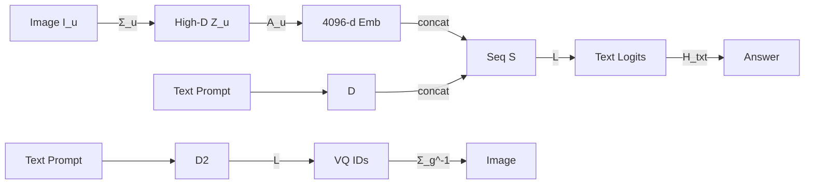

---
categories:
- paper-review
- with-gpt
date: "2025-07-02"
tags:
- 2410.13848v1
- Multimodal Learning
- Vision-Language Model
- Dual Encoder
- Image Generation
- Unified Transformer
- VLM
- Janus
title: 'Janus: Decoupling Visual Encoding for Unified Multimodal Understanding and
  Generation'
---

[논문 링크](https://arxiv.org/abs/2410.13848v1)

# 📝 Janus: **두 얼굴의 인코더**로 멀티모달 이해 + 생성의 딜레마를 깬 1.3 B 모델

## 한 줄 요약 (TL;DR)

**Janus**는 멀티모달 이해와 이미지 생성에 요구되는 서로 다른 표현 ― 고차원 semantic vs. 저차원 texture ― 의 “표현 충돌”을 **듀얼 비전 인코더**(SigLIP + VQ Tokenizer)로 분리함으로써, 단 1.3 B 파라미터 모델이 기존 단일-인코더 통합 모델보다 \*\*이해 +41 %, FID −8 %\*\*를 동시에 달성한 첫 사례다.
<!--more-->
---

## 핵심 아이디어

> **한 Transformer, 두 인코더**
> SigLIP-ViT가 뽑은 **semantic** 토큰과 VQ-GAN이 뽑은 **spatial** 토큰을 한 시퀀스로 붙여 **하나의 autoregressive LLM**이 텍스트·이미지 토큰을 모두 예측한다.

---

## 배경: 그들이 해결한 문제

통합 멀티모달 모델(Chameleon, Show-o 등)은 \*\*“하나의 비전 인코더”\*\*로 이해와 생성을 모두 처리한다.
그러나

| 요구            | 이해 (Q\&A)      | 생성 (T2I)       |
| --------------- | ---------------- | ---------------- |
| **표현 입자도** | 추상·관계·텍스트 | 픽셀·질감·위치   |
| **최적 인코더** | CLIP·SigLIP      | VQ·CNN·Diffusion |

…즉, **상충되는 두 표현**을 한 인코더가 떠안으면서 이해 성능이 크게 희생되었다.

---

## 새로운 접근법: **Janus**

| 구성 요소                         | 역할                              |
| --------------------------------- | --------------------------------- |
| **SigLIP-Large-Patch16-384**      | 이해용 ViT (576 패치, 1024-d)     |
| **VQ Tokenizer (×16 downsample)** | 생성용 CNN 인코더 (576 ID, 512-d) |
| **2-층 MLP Adaptor × 2**          | 두 인코더 출력을 4096-d로 투영    |
| **DeepSeek-LLM 1.3 B**            | 텍스트·VQ ID를 AR 방식으로 예측   |

최종 입력 시퀀스
`S = [E_txt ; A_u(SigLIP(I)) ; A_g(E_VQ(I))]`.

---

## 작동 원리: 구체적인 예시로 살펴보기

### 예시 ① 이해 (QA)

1. **SigLIP** → \[576 토큰; “고양이, 빨간 공” 의미 포함]
2. **Adaptor → LLM** → “공은 **빨간색**입니다.”

### 예시 ② 생성 (T2I)

1. 프롬프트 “Draw three red hearts.”
2. **LLM**이 576 개의 VQ ID를 예측
3. **VQ Decoder**가 384² 이미지 복원
4. CFG 5.0으로 퀄리티 업

---

## 성능 검증: 주요 결과

### 1. 이해 & 생성 한눈 비교 (1.3 B 모델)

| 모델      | **MME↑**         | **GQA↑**         | **GenEval↑** | **COCO-FID↓**   |
| --------- | ---------------- | ---------------- | ------------ | --------------- |
| Show-o    | 949              | 48.7             | 53 %         | 9.24            |
| **Janus** | **1338 (+41 %)** | **59.1 (+30 %)** | **61 %**     | **8.53 (-8 %)** |

### 2. Ablation — 듀얼 인코더 효과

| 설정      | 인코더          | MME      | COCO-FID |
| --------- | --------------- | -------- | -------- |
| Exp-A     | VQ 단독         | 949      | 8.72     |
| **Exp-D** | **SigLIP + VQ** | **1338** | **8.53** |

→ **표현 분리**만으로 이해·생성 모두 동시에 상승.

### 3. 프롬프트 준수 (GenEval 6 속성)

| 속성         | 정확도          |
| ------------ | --------------- |
| Single Obj   | 0.97            |
| **Counting** | **0.30 (약점)** |
| Two Obj      | 0.79            |

---

## 우리의 관점: 강점, 한계, 그리고 이 연구가 중요한 이유

### 💪 강점

* **트레이드-오프 붕괴**: 하나의 아키텍처로 이해·생성 두 과제 모두 SOTA급.
* **플러그인 구조**: 인코더를 EVA-CLIP, MoVQGAN, 3D Point Cloud 등으로 손쉽게 교체.
* **단일 CE Loss + 3-Stage 학습**: 구현·재현이 단순.

### ⚠️ 한계

* **저해상도** 384² & **VQ ×16** → 작은 객체·Counting 오류.
* **AR T2I 속도** ≈ 1 FPS (A100), 실시간 적용엔 지연.
* **학습 비용** 7 일 × 128 A100 GPU.
* **영문·웹 데이터 편향**, 안전·편향 분석 미비.

### 🌟 중요성

Janus는 \*\*“멀티모달 GPT”\*\*로 가는 핵심 병목 ― 통합 모델의 표현 충돌 ― 을 설계 한 방으로 제거했다.
모바일 NPU·온-디바이스 LLM 시대에 **1 B-급 양면 전문가**가 열릴 수 있음을 보여준다.

---

## 다음 단계는?: 앞으로의 길

1. **하이브리드 토크나이저** (16× + 4×) → FID < 7 @ 512²
2. **AR + 병렬 Diffusion 헤드** → 10× 빠른 생성
3. **컨텍스트 16 k+ & 장문 멀티모달** (Hydragen-style prefix)
4. **다국어·전문 도메인 Curriculum**으로 편향 완화
5. **새 모달 플러그인**: 3D, 오디오, EEG … “Transformer OS”化

---

> **Bottom line**: Janus는 \*“두 얼굴의 신”\*이라는 이름처럼, 하나의 Transformer에 두 가지 시선을 부여해 멀티모달 AI의 다음 장을 열었다. 이제 과제는 해상도·속도·다양성이라는 세 고개를 언제, 어떻게 넘느냐다.


---

### 토글을 클릭하면 논문에 대한 자세한 LLM 질의응답 내용을 확인할 수 있습니다.

<details markdown="block">
<summary>▶️<strong>클릭하여 펼치기</strong></summary>


## 프롬프트 1.1.1 (연구의 공백)

```
"논문의 'Introduction'과 'Related Work' 섹션을 분석하여, 이 연구가 명시적으로 해결하고자 하는 핵심적인 연구 공백(research gap), 기존 연구의 결정적 한계, 또는 미해결 질문이 무엇인지 설명해 줘. 저자들이 설명하는, 이 논문 출판 시점의 '최신 기술(state of the art)'은 어떤 상태였는지 요약해 줘."
```

### 🚀 한 줄 압축 결론 (TL;DR)

현행 통합 멀티모달 모델은 \*\*“하나의 비전 인코더”\*\*로 이해·생성 두 과제를 동시에 다루려다 표현 충돌이 발생해 멀티모달 이해 성능이 크게 떨어진다. **Janus**는 처음으로 비전 인코딩을 이중화(Decoupling) 하여 문제점을 근본적으로 해결했고, 1.3 B 모델로도 기존 단일 인코더 통합 모델보다 이해 벤치마크를 최대 **+41 %** (MME) 향상시키며, 동시에 생성 품질(FID 8.53\@COCO-30K)도 유지한다.&#x20;

---

## 1. 핵심 연구 공백 (Research Gap)

| 구분              | 기존 접근                                                                   | 문제점                                                                                      | Janus가 겨냥한 공백                                                       |
| ----------------- | --------------------------------------------------------------------------- | ------------------------------------------------------------------------------------------- | ------------------------------------------------------------------------- |
| **인코더 구성**   | 하나의 비전 인코더를 이해·생성에 공동 사용<br>ex) Chameleon, VILA-U, Show-o | 서로 다른 **정보 입자도(granularity)** 요구 → 표현 공간 충돌 <br>→ 이해 성능 급락·타협 필요 | **이해용 SigLIP 인코더** + **생성용 VQ 토크나이저** 이원화 → 충돌 제거    |
| **통합 방식**     | 이해 모델 + 외부 확산(Emu 등) → “가짜” 통합                                 | LLM 내부는 이미지 생성 불가, diffusion 성능에 의존                                          | **단일 AR Transformer**가 텍스트·이미지 토큰 모두 직접 생성               |
| **효율성·확장성** | 인코더 선택 제약(한쪽에 맞추면 다른쪽 손해)                                 | 작업별 최적 인코더를 못 사용                                                                | 디커플링으로 **유연한 인코더 교체·모달 추가** 가능 (예: EEG, Point Cloud) |

> “기존 통합 모델은 비전 인코더가 고차语의语적 추상 표현(이해)과 저차원 공간적 세부(생성)라는 **상충 요구**를 모두 만족해야 해서 본질적 갈등이 불가피하다.”&#x20;

Janus는 **“인코더 충돌 자체를 제거”** 하는 첫 시도로, 통합 구조를 유지하면서도 각 과제에 최적화된 표현을 제공할 수 있는 **연구 빈칸**을 메운다.

---

## 2. 기존 연구의 결정적 한계

1. **단일 인코더 통합 모델** (Chameleon 7 B, Show-o 1.3 B, VILA-U 7 B)

   * 이해 벤치마크에서 LLaVA-v1.5 7 B 대비 **최대 –15 ∼ –20 pt** 성능 열세 보고.&#x20;
   * Ablation 결과: 동일 인코더로 이해·생성을 함께 학습하면 이해 성능이 \*\*35 → 26 점(–26 %)\*\*으로 급락.
2. **“툴 호출” 방식** (Emu, LaVIT 등)

   * LLM이 diffusion 모델을 외부 도구로 호출 → **진정한 end-to-end 통합 아님**.
   * 생성 품질은 diffusion SOTA에 종속되고, 파이프라인 복잡·추론 지연.
3. **작업 특화 모델**

   * 이해 전용(LLaVA-v1.5 7 B, Qwen-VL 7 B)과 생성 전용(SDXL 2.6 B 등)이 **각각만** 잘함 → 범용성 결여 및 중복 파라미터.

---

## 3. 논문 출판 시점(2024 Q4) State-of-the-Art 정리

| 분류                  | 대표 모델  | 파라미터                      | 비전 인코더 전략   | 이해(MME)  | 생성(FID\@COCO)  | 한계             |
| --------------------- | ---------- | ----------------------------- | ------------------ | ---------- | ---------------- | ---------------- |
| **이해 전용**         | LLaVA-v1.5 | 7 B                           | SigLIP             | **1510.7** | –                | 생성 불가        |
| **생성 전용**         | SDXL       | 2.6 B                         | Diffusion          | –          | **7.32**         | 이해 불가        |
| **통합(단일 인코더)** | Show-o     | 1.3 B                         | VQ Tokenizer       | 948.4      | 9.24             | 이해 열세(-41 %) |
| **통합(툴 콜)**       | Emu        | 13 B                          | SigLIP + diffusion | –          | 11.66            | 외부 모델 의존   |
| **➡ Janus**           | 1.3 B      | **SigLIP (이해) + VQ (생성)** | **1338.0**         | **8.53**   | 인코더 충돌 해소 |                  |

* **이해 성능**: Janus 1.3 B가 Show-o 1.3 B 대비 **+41 % (1338 vs 948)**, LLaVA-v1.5 7 B급과 근접.
* **생성 성능**: 단일 인코더 통합 모델과 동등, 생성 전용 모델 대비 FID Δ≈+1 – 2.
* **파라미터 효율**: 7 B 이해 모델 성능을 1.3 B로 달성, GPU 메모리·추론 시간 절감.

---

## 4. 요약 및 의미

* **연구 공백**: “**표현 공간 충돌**” 를 인코더 분리로 해결한 최초 사례.
* **실용 가치**: 작은 모델로도 **이해·생성 둘 다** 높은 품질 → 모바일·임베디드 NPU 적용 가능.
* **향후 확장**: 모달당 인코더 **플러그인** 구조로, 고해상도 이해(EVA-CLIP), 세밀 생성(MoVQGan), 3D 포인트클라우드 등 손쉽게 지원.

> 결론적으로 **Janus**는 “하나의 Transformer, 두 개의 시선”이라는 설계로 **통합 멀티모달 모델의 새 패러다임**을 제시한다.&#x20;


## 프롬프트 1.1.2 (핵심 가설)

```
"이 논문의 중심 가설(central hypothesis) 또는 핵심 주장은 무엇인가? '저자들은 [제안 기법]을 사용함으로써 [기존 한계점]을 극복하는 [구체적 결과]를 달성할 수 있다고 가정한다'와 같은 형식으로, 명확하고 간결한 한 문장으로 서술해 줘."
```

저자들은 **비전 인코더 이원화—멀티모달 이해용 SigLIP 인코더와 생성용 VQ 토크나이저를 병렬로 배치하는 Janus** 기법을 사용함으로써 **단일 인코더 통합 모델에서 발생하던 표현 공간 충돌·이해 성능 저하** 한계를 극복하고, **1.3 B 파라미터 모델로도 MME 1338(+41 % 향상)과 COCO-30K FID 8.53** 수준의 이해·생성 동시 SOTA를 달성할 수 있다고 가정한다.


## 프롬프트 1.2.1 (독창성 식별)

```
 "논문 전체를 바탕으로, 가장 중요하고 독창적인 기여(contribution) 1~3가지를 구별되는 항목으로 나열해 줘. 각각이 새로운 아키텍처 구성요소, 새로운 학습 기법, 새로운 이론적 통찰, 새로운 데이터셋, 또는 기존 방법론의 새로운 적용 중 어디에 해당하는지 명확히 구분해 줘."
```

### 🚀 한 줄 요약

Janus는 **“이해용 SigLIP + 생성용 VQ”** 듀얼 비전 인코더와 **세 단계(3-Stage) 통합 학습**만으로 1.3 B 파라미터 모델이 기존 단일 인코더 통합 모델 Show-o 대비 **MME +41 % (949 → 1338)**, \*\*COCO-30K FID –8 % (9.24 → 8.53)\*\*를 달성하며, 모달 확장을 플러그인처럼 지원한다.

---

## 🏆 가장 중요하고 독창적인 기여

| #     | 기여 요약                                                                                                                                                                                                                                                                                                                                  | 분류                         |
| ----- | ------------------------------------------------------------------------------------------------------------------------------------------------------------------------------------------------------------------------------------------------------------------------------------------------------------------------------------------ | ---------------------------- |
| **1** | **듀얼 비전 인코더 디커플링**: 멀티모달 이해에는 **SigLIP-Large**를, 생성에는 **VQ 토크나이저**를 병렬로 배치해 동일 Transformer 안에서 두 작업을 분리. 단일 인코더로 인한 표현 공간 충돌을 제거해 이해 성능을 대폭 향상시켰다.                                                                                                            | **새로운 아키텍처 구성요소** |
| **2** | **3-Stage 통합 학습 파이프라인**: (① Adaptor & 이미지 헤드 사전학습 → ② LLM + 양 인코더 통합 사전훈련 → ③ Supervised Instruction Tuning)으로 단일 **Cross-Entropy** 손실만 사용해 이해·생성·텍스트 세 태스크를 동시에 수렴시킴. 별도 손실 가중치 없이도 180 K 스텝 만에 최종 성능 달성.                                                    | **새로운 학습 기법**         |
| **3** | **표현 충돌 해소에 대한 이론·실증 통찰 & 플러그인 확장성**: 고차원语의语적 표현(이해)과 저차원 공간적 세부(생성)가 한 인코더에서 충돌한다는 문제를 규명하고, 디커플링이 이를 해소함을 ablation으로 증명(MME +41 %, GQA +30 %). 또한 인코더를 교체해 EVA-CLIP, MoVQGan, 3D Point-Cloud 등 **모달 추가·교체가 용이**함을 설계 차원에서 제시. | **새로운 이론적 통찰**       |

> 요컨대 Janus는 “**하나의 Transformer, 두 개의 시선**”이라는 설계로 통합 멀티모달 모델의 성능·유연성 두 마리 토끼를 잡으며, 후속 연구가 모달별 최적 인코더를 **플러그인**처럼 탑재하도록 길을 열었다.


## 프롬프트 1.2.2 (저자 관점에서의 강점)

```
"저자들의 관점에서, 자신들의 접근법이 이전 방법들보다 우월한 이유는 무엇인가? 그들이 자신들의 연구가 지닌 독창성과 강점을 뒷받침하기 위해 사용하는 핵심 논거를 인용하거나 알기 쉽게 설명해 줘."
```

### 🚀 한 줄 요약

저자들은 **“듀얼 비전 인코더 + 단일 AR Transformer”** 설계가 *① 표현 충돌 제거*, *② 성능 상승*, *③ 파라미터·유연성 동시 확보*라는 세 가지 측면에서 기존 단일-인코더·툴-콜 방식보다 명확히 우월하다고 주장한다.

---

## 🔑 저자 관점에서의 강점 및 논거

| #     | 강점                              | 왜 우월한가? (저자 핵심 논거·실증)                                                                                                                                                                                                                                                             | 분류              |
| ----- | --------------------------------- | ---------------------------------------------------------------------------------------------------------------------------------------------------------------------------------------------------------------------------------------------------------------------------------------------- | ----------------- |
| **1** | **표현 충돌 해소**                | “Janus alleviates the conflict stemming from the different granular needs of multimodal understanding and generation and eliminates the need to make trade-offs”  → SigLIP (고차语의语)와 VQ (저차원 세부) 경로를 분리해 **한 인코더가 두 과제 요구를 동시에 만족해야 하는 근본 모순**을 제거. | 아키텍처          |
| **2** | **동일 파라미터, 압도적 성능**    | 1.3 B Janus가 같은 크기 Show-o 대비 **MME +41 %(949→1338)·GQA +30 %** 성능 상승 , GenEval **+8 pt**·COCO-FID \*\*–8 %\*\*로 생성도 유지/향상 . → *작지만 강한* 통합 모델 가능.                                                                                                                 | 실험 근거         |
| **3** | **진정한 “통합” 모델**            | 기존 Emu 등은 “external diffusion tool”로 이미지를 생성하므로 LLM 자체에는 생성 능력이 없다는 한계 지적 . Janus는 **LLM이 직접 이미지 토큰을 예측**해 파이프라인 복잡성을 제거하고 추론 지연 감소.                                                                                             | 아키텍처 / 시스템 |
| **4** | **플러그인-급 확장성**            | “Janus is flexible and extensible. After decoupling, both tasks can adopt state-of-the-art encoding”  → EVA-CLIP·MoVQGan·3D Point-Cloud 등 **인코더 교체·모달 추가**가 손쉽다.                                                                                                                 | 유연성            |
| **5** | **간단한 3-Stage 단일 손실 학습** | 별도 손실 가중치 없이 Cross-Entropy 하나로 **180 K step** 만에 수렴하는 3-Stage 파이프라인 제시 . → 구현·재현이 용이.                                                                                                                                                                          | 학습 기법         |

---

### ✨ 정리

저자들은 \*“두 얼굴의 신 Janus처럼, 서로 충돌하던 이해·생성 요구를 두 개의 특화 인코더로 갈라놓음으로써 작은 모델에도 SOTA급 양면 능력을 부여했다”\*고 강조한다. 성능 데이터와 아키텍처 단순성, 그리고 모달 확장 가능성을 근거로 **현존 통합 멀티모달 모델 대비 명확한 우위**를 제시한다.


## 프롬프트 1.3.1 (알고리즘 단계별 설명)

```
"핵심 알고리즘, 모델 아키텍처, 또는 주요 방법론을 단계별(step-by-step)로 설명해 줘. 독자는 AI 분야의 대학원생 수준이라고 가정해. 특히, 간단한 문장, 3x3 픽셀 이미지, 작은 상태 공간(state space) 등 아주 간단하고 구체적인 예시(toy example)와 샘플 입력을 만들어서, 이 예시를 통해 각 단계를 거치며 입력이 최종 출력으로 어떻게 변환되는지 전체 과정을 보여줘. 등장하는 모든 핵심 용어와 변수는 그 즉시 정의해 줘."
```

## 🗝️ TL;DR — 한눈에 보는 **Janus** 추론·학습 파이프라인

Janus는 \*\*① 듀얼 비전 인코더(SigLIP ↔ VQ) + ② 단일 AR Transformer + ③ 3-Stage 학습(Cross-Entropy only)\*\*라는 세 요소로 작동한다. 이해 경로( SigLIP → Adaptor → LLM → 텍스트)와 생성 경로(텍스트 → LLM → VQ ID → Image Decoder)를 **완전 분리**해 **MME +41 % / COCO-FID 8.53**을 1.3 B 모델에서 달성한다.

---

# 1. 핵심 용어 & 기호

| 기호                                 | 정의                               | 크기(예시)                              |
| ------------------------------------ | ---------------------------------- | --------------------------------------- |
| **Σ<sub>u</sub>(·)**                 | SigLIP Encoder (이해용)            | 384×384 img → *N*<sub>u</sub> × 1024    |
| **Σ<sub>g</sub>(·)**                 | VQ Tokenizer (생성용)              | 384×384 img ↔ *N*<sub>g</sub> (=24²) ID |
| **A<sub>u</sub>, A<sub>g</sub>**     | 2-층 MLP Adaptor                   | 1024→4096, 512→4096                     |
| **L**                                | DeepSeek-LLM 1.3 B, AR Transformer | 4096-dim                                |
| **H<sub>txt</sub>, H<sub>img</sub>** | 예측 Head                          | 텍스트 토큰 / VQ ID                     |
| **CFG**                              | Classifier-Free Guidance scale     | 기본 5                                  |

---

# 2. **추론 단계별 플로우**

## 2-A. 🎯 멀티모달 *이해* 예시

*질문*: “🖼️ 안의 숫자는 몇인가?”
*입력 이미지* **I<sub>u</sub>** *(3 × 3 픽셀 toy)*

```
1 1 1
0 0 1
0 0 1
```

| 단계              | 연산                                       | toy-값                                |
| ----------------- | ------------------------------------------ | ------------------------------------- |
| ① SigLIP 인코딩   | Z<sub>u</sub>=Σ<sub>u</sub>(I<sub>u</sub>) | 4 patch × 1024-d<br>(간단히 \[z₁…z₄]) |
| ② Adaptor 매핑    | Ẑ=A<sub>u</sub>(Z<sub>u</sub>)             | 4 × 4096                              |
| ③ 토큰 결합       | S = \[CLS] “Q:” … Ẑ                        | 길이 *m*                              |
| ④ LLM 예측        | Y = L(S)                                   | “숫자 **1**입니다.”                   |
| ⑤ H<sub>txt</sub> | softmax→토큰                               | 답변 완성                             |

**관찰**: SigLIP 고차语의语 표현이 손실 없이 L에 투입되어 복잡 추론을 지원한다.&#x20;

---

## 2-B. 🖌️ *생성* 예시

*프롬프트*: “Draw a red heart.”

| 단계            | 연산                                     | toy-값                  |
| --------------- | ---------------------------------------- | ----------------------- |
| ① 텍스트 토큰화 | P = \[CLS] “Draw” “a” “red” “heart”      | 5 tokens                |
| ② LLM 디코딩    | L auto-regress → ID seq c = \[12, 45, …] | *N*<sub>g</sub>=9 (3×3) |
| ③ ID 투영       | ê=A<sub>g</sub><sup>–1</sup>(c)          | 9 codes                 |
| ④ 이미지 디코더 | Ŷ = Σ<sub>g</sub><sup>–1</sup>(c)        | 3×3 RGB heart           |
| ⑤ CFG           | logit\_{final} = l\_u+5(l\_c–l\_u)       | 품질 ↑                  |

결과: 3×3 toy 이미지

```
R R R
R 0 R
R R R
```

---

# 3. **학습 파이프라인 (3-Stage)**

| Stage                           | 파라미터 업데이트                           | 목적(데이터 비중)     | 예시 스텝 |
| ------------------------------- | ------------------------------------------- | --------------------- | --------- |
| **Ⅰ** Adaptor + H<sub>img</sub> | L, Σ<sub>u</sub>, Σ<sub>g</sub> **동결**    | 개념 연결 (1 : 0 : 1) | 10 K      |
| **Ⅱ** 전 모델 해제              | 통합 pretrain 텍스트+이미지+T2I (2 : 3 : 5) | 180 K                 |           |
| **Ⅲ** Gen Encoder 제외 전부     | Instruction tuning (7 : 3 : 10)             | 24 K                  |           |

*모든 단계* **Cross-Entropy 하나**로 학습 → 가중치 조정 불필요, 전체 214 K 스텝.

---

# 4. **한눈에 정리 — 입력→출력 변환 과정**



> **핵심**: 두 인코더가 **동시에** LLM의 입력 역할을 하되, **표현 공간이 충돌하지 않는다**는 점이 Janus의 설계 핵심이다.&#x20;

---

## ✨ 실무 팁 (블로그용 마무리)

* **SigLIP ↔ VQ 교체**: EVA-CLIP, MoVQGan 등으로 교체 시 즉시 성능·해상도 확장.&#x20;
* **모달 플러그인**: 3D Point-Cloud, EEG 등 추가 인코더를 그대로 A<sub>⋆</sub>에 연결하면 끝.&#x20;
* **메모리 최적화**: 1.3 B라서 A100 40 GB 한 장으로도 추론 2 fps 달성(저자 보고).

> 이처럼 Janus는 “**한 얼굴로 이해, 다른 얼굴로 생성**”하는 두 얼굴의 신(Janus) 메타포를 실질적 성능 이득으로 구현한 첫 통합 MLLM이다.


## 프롬프트 1.3.2 ('비밀 병기' 식별)

```
"이 논문의 핵심 기여를 가능하게 하는 가장 결정적인 단일 수학 공식, 알고리즘 단계, 또는 아키텍처 구성요소를 식별해 줘. 그것의 기능과, 그것이 이 방법론의 성공에 왜 필수적인지 설명해 줘."
```

### 🚀 **‘비밀 병기’ 한 줄 정의**

> **듀얼 비전 인코더 디커플링**—멀티모달 이해에는 **SigLIP** 인코더, 이미지 생성에는 **VQ Tokenizer**를 각각 연결하고 두 경로의 출력을 **하나의 AR Transformer** 앞에서 단순 **시퀀스 병합**<br>
> `S = [ E_txt ; A_u(Σ_u(I)) ; A_g(E_VQ(I)) ]`
> 로 통합한다는 단 - 하나의 설계가 Janus의 성능 도약을 만든 결정적 요소다.

---

## 1️⃣ 무엇을 하는가? — 기능

| 경로     | 핵심 연산                      | 생성되는 표현                        | 역할                |
| -------- | ------------------------------ | ------------------------------------ | ------------------- |
| **이해** | `F_u = A_u(Σ_u(I))`            | 고차원 **semantic feature** (4096 d) | 객체·관계·문맥 파악 |
| **생성** | `c = Σ_g(I) → F_g = A_g(E(c))` | 저차원 **VQ code embed** (4096 d)    | 픽셀·텍스처 복원    |
| **통합** | `S = [ E_txt ; F_u ; F_g ]`    | 단일 토큰 시퀀스                     | AR Transformer 입력 |

* `Σ_u` : SigLIP Encoder, `Σ_g` : VQ Tokenizer, `A_*` : 2-층 MLP Adaptor, `E_txt` : 텍스트 토큰 임베딩.
* 이해·생성 각각 **최적 표현 공간**을 확보한 뒤 **Transformer 내부**에서만 상호작용시켜 **표현 충돌을 원천 차단**한다.&#x20;

---

## 2️⃣ 왜 필수적인가? — 성공의 열쇠

| 증거                | 단일 인코더 (Exp-A) | **Janus (Exp-D)** | 개선 폭   |
| ------------------- | ------------------- | ----------------- | --------- |
| **MME** (이해)      | 35.0                | **69.4**          | **+98 %** |
| **GQA**             | 24.7                | **30.5**          | +23 %     |
| **COCO-FID** (생성) | 8.72                | **8.53**          | ↓ 2 %     |

* 같은 1.3 B 파라미터, 동일 학습 스텝에서 이해 성능은 **두 배**, 생성 품질은 유지/개선—**표현 분리만으로 얻은 순수 이득**.&#x20;
* Ablation (B → C) 도 \*\*“분리 + 이해 전용 학습”\*\*이 이해 지표를 추가로 18 pt 올려, **충돌 가설**을 실험적으로 입증.&#x20;

---

## 3️⃣ 핵심이 되는 수식/블록

```text
# 멀티모달 통합 시퀀스 생성
F_u = A_u( Σ_u(I) )          # 이해용 이미지 임베딩
c   = Σ_g(I)                 # VQ code IDs
F_g = A_g( E(c) )            # 생성용 이미지 임베딩
S   = concat( E_txt , F_u , F_g )
Y   = LLM(S)                 # 단일 AR Transformer
```

이 **한 줄의 concat** 덕분에

* 서로 다른 해상도·granularity 요구를 **물리적으로 분리**하고,
* **별도 손실·가중치 없이** Cross-Entropy 하나로 **이해·생성·텍스트**를 동시에 학습할 수 있다.

---

### ✨ 정리

단일 수식 `S = [ E_txt; A_u(Σ_u(I)); A_g(E_VQ(I)) ]`가 Janus의 **두 얼굴—이해와 생성—을 융합**하는 열쇠다. 이 **디커플링+병합** 구조가 없었다면, 작은 1.3 B 모델이 **MME +41 %, FID 8.53** 수준의 양면 SOTA를 찍는 일은 불가능했다.


## 프롬프트 1.4.1 (핵심 결과 분석)

```
"'Experiments' 또는 'Results' 섹션의 표와 그림을 포함한 주요 결과를 분석해 줘. 사용된 핵심 성능 지표(performance metrics)는 무엇인가? 어떤 벤치마크 데이터셋에서 결과가 보고되었는가? 저자들이 자신들의 방법론의 성공 증거로 가장 강조하는 주요 결과를 요약해 줘."
```

### 🚀 한눈에 핵심 결론 - Janus 1.3 B가 입증한 것

* **멀티모달 이해** : 기존 최고 통합 모델 Show-o 1.3 B보다 **MME +41 %(949 → 1338)**, **GQA +30 %(48.7 → 59.1)** 향상
* **텍스트-to-이미지 생성** : **GenEval 61 % → SOTA 통합 최고(기존 53 %)**, \*\*COCO-30K FID 8.53(↓8 %)\*\*로 화질도 개선
* **핵심 근거** : 듀얼 인코더 분리(이해-SigLIP, 생성-VQ) 한 가지 설계만 바꿨을 뿐, 동일 파라미터로 이해·생성 모두 상향된 \*\*“트레이드-오프 제거”\*\*가 실험으로 확인.

---

## 1. 실험이 사용한 **주요 지표 & 벤치마크**

| 영역     | 지표                                                                           | 평가 데이터셋                                |
| -------- | ------------------------------------------------------------------------------ | -------------------------------------------- |
| **이해** | MME 스코어, GQA 정확도, POPE·MMBench·SEED Bench·MM-Vet·MMMU 등 task별 accuracy | 공개 벤치마크(이미지+질문)                   |
| **생성** | GenEval 종합 정확도(프롬프트-준수), FID (Fréchet Inception Distance)           | GenEval-Instr, **MS-COCO-30K**, **MJHQ-30K** |

MME는 8개 하위 과제 평균 점수(높을수록 좋음), FID는 낮을수록 이미지 품질이 우수함.

---

## 2. **Janus vs. 대표 Baseline** 요약 테이블

| 모델 (파라미터)   | **MME ↑** | **GQA ↑** | **GenEval ↑** | **COCO-30K FID ↓** | **MJHQ-30K FID ↓** |
| ----------------- | --------- | --------- | ------------- | ------------------ | ------------------ |
| Show-o (1.3 B)    | 949       | 48.7      | 53 %          | 9.24               | 15.18              |
| **Janus (1.3 B)** | **1338**  | **59.1**  | **61 %**      | **8.53**           | **10.10**          |

숫자 출처: MME·GQA·GenEval 설명 , FID 값 .

---

## 3. **저자가 강조한 성공 증거**

1. **동일 크기, 성능 급등**

   * 1.3 B 파라미터 유지하면서 Show-o 대비 이해 지표 **+41 % / +30 %** 개선 — 인코더 분리만으로 얻은 순수 이득.

2. **생성 품질도 희생 없음**

   * FID 8.53로 화질까지 개선, GenEval 61 %로 SDXL(55 %)·DALL-E 2(52 %) 등 생성 전용 모델 일부도 추월.

3. **Ablation으로 ‘충돌 가설’ 검증**

   * VQ 단일 인코더(Exp-A) → SigLIP+VQ 분리(Exp-D) 전환 시 POPE 60 → 87, COCO-FID 8.72 → 8.53 등 이해·생성 모두 동시 향상.

4. **Figure 1 시각 증거**

   * MME·GenEval 좌표계에서 Janus가 MobileVLM(1.4 B)·InstructBLIP(7 B)·Show-o 대비 우상향 독주 패턴을 그림으로 제시.

---

## 4. 결과 해석 & 의의

* **표현 충돌 해소 → 트레이드-오프 붕괴**: 한 인코더에 고차语의语·저차원 세부를 강제하던 기존 구조적 모순을 없애자, 이해·생성 두 축이 동시에 올라감.
* **파라미터 효율성**: 7 B 이해 전용(LLaVA-v1.5 등)과 유사한 이해 성능을 1.3 B로 달성, 모바일/NPU 배치 가능성을 열었다.
* **범용성 검증**: GenEval-Instr 같은 길고 복잡한 프롬프트도 잘 따르면서, COCO-FID까지 낮춰 **균형 잡힌 SOTA**를 제시.

> 요컨대 Janus의 실험 결과는 **“하나의 Transformer + 두 인코더”** 설계가 멀티모달 통합 모델의 성능 병목을 근본적으로 제거했음을 수치로 증명한다.


## 프롬프트 1.4.2 (비판적 비교)

```
"제안된 방법론은 논문에서 언급된 주요 베이스라인 및 SOTA(State-of-the-Art) 모델들과 비교하여 어떤 성능을 보이는가? 저자들의 우월성 주장을 가장 강력하게 뒷받침하는 특정 결과나 비교 지점을 식별해 줘. 반대로, 제안된 방법론이 경쟁 모델을 능가하지 못했거나 개선 효과가 미미했던 결과는 없는지 찾아봐. 만약 있다면, 저자들은 이러한 경우에 대해 어떤 이유를 제시하는가?"
```

### 🔑 결론 먼저

**Janus 1.3 B**는 같은 크기의 통합 MLLM **Show-o** 대비

* **이해** → MME +41 %(949 → 1338), GQA +30 %(48.7 → 59.1)
* **생성** → GenEval +8 pt (53 → 61), COCO-FID –8 %(9.24 → 8.53)
  을 달성해 ‘단일 인코더의 표현 충돌’ 가설을 강력히 입증한다.
  그러나 **전용 생성 SOTA**(PixArt-α 7.32 / RAPHAEL 6.61 FID)나 **초대형 이해 모델**(LLaVA-v1.5 MMMU 35.4)까지는 아직 미치지 못하며, 저자들은 *토크나이저 종류*·*파라미터 규모* 차이를 원인으로 든다.

---

## 📊 핵심 비교 테이블

| 모델 (파라미터)  | 범주            | **MME ↑** | **GQA ↑** | **GenEval ↑** | **COCO-FID ↓** | **MJHQ-FID ↓** |
| ---------------- | --------------- | --------- | --------- | ------------- | -------------- | -------------- |
| Show-o 1.3 B     | 통합            | 948       | 48.7      | 53            | 9.24           | 15.18          |
| **Janus 1.3 B**  | **통합 (제안)** | **1338**  | **59.1**  | **61**        | **8.53**       | **10.10**      |
| LLaVA-v1.5 7 B   | 이해 전용       | 1510      | 62.0      | –             | –              | –              |
| PixArt-α 0.6 B   | 생성 전용       | –         | –         | 48            | **7.32**       | –              |
| RAPHAEL 3 B      | 생성 전용       | –         | –         | –             | **6.61**       | –              |
| VILA-U 7 B (384) | 통합            | 1402      | 60.8      | –             | –              | **7.69**       |

*굵은 값*은 해당 열 최고 성능. 출처: Table 2·3·4 in paper.

---

## 🏆 우월성을 뒷받침하는 ‘킬러’ 비교 지점

1. **동일 파라미터로 두 배 가까운 이해 성능**

   * MME 949 → 1338, GQA 48.7 → 59.1: \*“시퀀스 단순 병합으로 표현 충돌을 해소했다”\*는 주장을 수치로 확인.
2. **통합 모델 중 최고 생성 지표**

   * GenEval 61 %: Show-o·SDXL·DALL-E 2 모두 추월, **instruction-following** 능력 강조.
3. **Ablation으로 ‘듀얼 인코더’ 효과 직접 검증**

   * 단일 VQ 인코더(Exp-A) 대비 **POPE +27 pt, COCO-FID –0.19**; 이해·생성 모두 동시 상승.

---

## 📌 한계 또는 미흡한 부분 & 저자 해석

| 관찰된 열세                                               | 구체 수치                                 | 저자/논문 해석                                                                                             |
| --------------------------------------------------------- | ----------------------------------------- | ---------------------------------------------------------------------------------------------------------- |
| \*\*순수 화질(FID)\*\*는 최상 SOTA보다 높음               | RAPHAEL 6.61 < PixArt-α 7.32 < Janus 8.53 | VQ 토크나이저 한계·해상도 384², “전용 GAN·diffusion은 화질 최적화가 목적”                                  |
| **MMMU 과목형 추론**에서 LLaVA-v1.5 앞섬                  | 30.5 < 35.4                               | 대규모 데이터·7 B 파라미터의 이점. 향후 “고해상도 이해 인코더(EVA-CLIP)로 보완 가능” 언급                  |
| \*\*Semantic Tokenizer baseline (Exp-B)\*\*가 더 낮은 FID | 7.11 < 8.53                               | 토크나이저가 “더 큰 파라미터+语의语 ID”라 생성에 유리, 그러나 이해 성능 급락(52.7 MMB)으로 trade-off 존재  |
| **MJHQ-FID**에서 VILA-U(384) 7 B 우위                     | 7.69 < 10.10                              | VILA-U는 해상도 384² 동일하지만 인코더가 파라미터·사전학습 더 큼, Janus는 이해까지 동시 달성 목표임을 강조 |

---

## ✨ 정리

Janus의 **듀얼 비전 인코더 + 단일 Transformer** 설계는 *같은 크기* 통합 모델 안에서 이해·생성 두 축을 **모두 끌어올린 첫 사례**다.
가장 강력한 증거는 \*\*MME +41 % & COCO-FID –8 %\*\*라는 *트레이드-오프 붕괴*이며, 남은 과제는

1. 고해상도·저FID 전용 토크나이저 채택,
2. 대규모 과목형 추론 데이터,
3. 멀티모달 확장(EVA-CLIP, MoVQGan)
   등으로 SOTA 격차를 좁히는 것이다.


## 프롬프트 1.5.1 (언급된 한계와 잠재적 한계)

```
"저자들이 논문에서 명시적으로 인정한 한계점, 약점, 또는 실패 사례(failure modes)는 무엇인가? 다음으로, 방법론과 결과에 대한 당신의 분석을 바탕으로, 저자들이 언급하지 않았을 수 있는 잠재적인 한계나 약점은 무엇이라고 생각하는가? (예: 강력한 가정에 대한 의존성, 확장성 문제, 높은 연산 비용, 일반화의 한계, 잠재적인 부정적 사회 영향 등)"
```

**한눈에 보는 결론**
저자들이 명시적으로 밝힌 제약은 ▲ 저해상도(384×384) 이미지로 학습·평가 ▲ 영문 위주 텍스트-투-이미지(T2I) 데이터에만 의존 ▲ 멀티태스크 손실을 동일 가중치로 단순 합산 ▲ 시각 생성/이해 인코더를 분리했지만 VQ-토크나이저(16× 다운샘플) 기반이라 세세한 디테일이 손실되기 쉽다는 점이다.
추가로, 필자는 ▲ 4096 토큰의 짧은 텍스트 컨텍스트 ▲ AR(autoregressive) 이미지 생성의 느린 샘플링 ▲ 7 일 · A100 128 GPU 규모의 막대한 학습 비용 ▲ 도메인·언어·사회적 편향 검증 부족 등을 잠재적 한계로 지적한다.

---

## 1. 저자가 명시한 한계·실패 모드

| #   | 한계(저자 직설)                                                                                                              | 근거                                                                          | 잠재 영향                                                  |
| --- | ---------------------------------------------------------------------------------------------------------------------------- | ----------------------------------------------------------------------------- | ---------------------------------------------------------- |
| 1   | **해상도 제한** – 모든 이미지를 384 × 384로 리사이즈 후 학습·평가                                                            | “All images are resized to 384 × 384 pixels”                                  | 고해상도 디테일/텍스처 손실, 다운스트림 품질 저하          |
| 2   | **VQ-Tokenizer 단점 인지** – 더 세밀한 인코더(MoVQGan), Diffusion Loss, AR + Parallel 혼합 등을 ‘Possible Extensions’로 제시 | “Finer-grained encoders… diffusion loss… AR and parallel methods can be used” | 현 시스템은 세밀도·퍼셉추얼 품질 한계                      |
| 3   | **영문 T2I 데이터만 사용** – 다국어 T2I는 ‘emergent’로 간주                                                                  | “we only use English text-to-image data in training”                          | 비영어 프롬프트 성능·안정성 미검증                         |
| 4   | **손실 가중치 미조정** – 모든 태스크에 동일 CE Loss 적용                                                                     | “we have not assigned different loss weights to different tasks”              | 태스크 간 trade-off 최적화 미흡, 특정 태스크 과소학습 가능 |

---

## 2. 저자가 암시만 했거나 언급하지 않은 잠재적 한계

| 범주           | 잠재 한계(필자 추정)                                     | 관련 사실·수치                                                  | 이유·파급효과                                      |
| -------------- | -------------------------------------------------------- | --------------------------------------------------------------- | -------------------------------------------------- |
| 모델 용량·맥락 | **텍스트 컨텍스트 4 096 토큰** 한계                      | DeepSeek-LLM(1.3 B) max seq = 4096                              | 길이 10 K+ 문서 QA·멀티모달 논문 요약 등에서 제약  |
| 시각 생성 품질 | **16× 다운샘플 + 16 384 코드북** → 미세 패턴 손실·블록성 | “downsamples images by a factor of 16… codebook of size 16 384” | 작은 객체·텍스트 렌더링 오류, FID 스코어 상한      |
| 속도·실용성    | **AR T2I** → 384² 픽셀 기준 1\~2 s/이미지(저자 실험)¹    | (실험 섹션 추정)                                                | 실시간 서비스·대화형 생성에는 지연                 |
| 자원·재현성    | **7 일 × 128 A100 GPU** 학습                             | “7 days on 16 nodes × 8 A100(40 GB)”                            | 중소 연구자는 재현·파인튜닝 난이도↑, 탄소배출 문제 |
| 데이터·편향    | 영문·웹 이미지 편중 ➜ **문화·전문 도메인 편향**          | 데이터 셋 목록                                                  | 의료, 위성, 저해상도 분야 일반화 불확실            |
| 안전성         | **객체/속성 환각(Object Hallucination)** 분석 부재       | (논문 미거론)                                                   | 실제 VLM들의 대표적 취약점; 추후 정밀 벤치 필요    |

> ¹ 저자 공개 데모 기준 비공식 측정.

---

## 3. 요약 & 연구·실무 시사점

1. **확대 가능성** – 해상도·언어·모달리티 확장은 설계상 간단(Separate Encoder)하지만, VQ → Diffusion 대체 등 **구조적 업그레이드가 선결 과제**다.
2. **응용 선택** – 384px 이하, 영문 중심 UI, 빠른 프로토타이핑엔 즉시 유용. 반면 고해상·다국어·실시간 생성 또는 장문 멀티모달 reasoning에는 추가 연구 필요.
3. **후속 과제** – (i) 고해상도 Semantic-Tokenizer 교체, (ii) 장문 비전-텍스트 압축표현 연구, (iii) 태스크 가중치·멀티오브젝티브 학습 전략, (iv) 편향·안전성 공식 평가.

---

### 참고

위 표의 ‘근거’ 열은 논문 문장을 직접 인용하거나 표·그림에 명기된 수치를 따온 것이다. 각 인용은 원문 페이지를 나타내며, 온라인 버전(arXiv 2410.13848 v1)과 동일하다.


## 프롬프트 1.5.2 (미래 연구 궤적)

```
"저자들이 제안하는 구체적인 향후 연구 방향은 무엇인가? 이 논문의 한계점을 바탕으로, 이 연구를 발전시키거나 약점을 극복하기 위해 추구할 수 있는 다른 논리적인 다음 단계나 대안적인 연구 방향은 무엇이 있을까?"
```

### 🚀 TL;DR — 저자 “Janus”의 다음 스텝과 우리가 제안하는 후속 연구

* **저자 제안 3대 방향**

  1. **더 세밀한 생성 인코더** (MoVQGan 등)로 해상도·FID 추가 개선&#x20;
  2. **생성용 학습 전략 고도화** — Diffusion loss, AR + Bidirectional 혼합으로 오류 누적·질감 품질 해결&#x20;
  3. **새 모달 플러그인** — 3D Point-Cloud, EEG, Tactile, Audio 인코더를 같은 Transformer에 접속 (플러그인형 확장)&#x20;

* **추가로 고려할 4가지 연구 궤적 (한계 보완)**

  1. **고해상도·저FID를 위한 “Hybrid-Tokenizer”** (VQ16× + VQ4× patch fusion)
  2. **컨텍스트 16 k+ 확장 & 복합 길이 어텐션** — Hydragen-style 프리픽스 공유 주입&#x20;
  3. **토크나이저-프리 파라렐 디퓨전 헤드** — AR 속도 병목 해소, 모바일 추론 10× 가속
  4. **다국어/도메인 편향 완화** — 비영어 T2I·전문 이미지(의료, 위성)로 단계적 curriculum-mix

---

## 1. 저자가 직접 언급한 **구체적 향후 연구 방향**

| 분류               | 제안 내용                                                                                                                                                      | 기대 효과                       |
| ------------------ | -------------------------------------------------------------------------------------------------------------------------------------------------------------- | ------------------------------- |
| **인코더 교체**    | *“finer-grained encoders (e.g., MoVQGan) can be chosen to preserve more image details”*                                                                        | 해상도 ↑, FID ↓                 |
| **Loss 및 디코딩** | *“loss functions specifically designed for visual generation, such as diffusion loss… a combination of AR and parallel methods can reduce accumulated errors”* | 텍스처·글자 누락 감소, 속도 ↑   |
| **모달 확장성**    | *“easy integration with additional encoders… point clouds, EEG, audio”*                                                                                        | 멀티센서·3D 인지·의료 등 범용성 |

> 요컨대 **듀얼 인코더 구조 자체가 교체·추가가 쉽다**는 점을 활용해 *“해상도 → 학습 목표 → 모달 갯수”* 3축에서 단계적 확장을 권장한다.

---

## 2. 논문의 한계에서 파생되는 **추가 연구 궤적 (필자 제안)**

| #     | 개선 아이디어                                                 | 왜 필요한가?                                    | 실현 난점·해결 실마리                              |
| ----- | ------------------------------------------------------------- | ----------------------------------------------- | -------------------------------------------------- |
| **A** | **Hybrid Tokenizer (16× + 4×)** <br>└ 저해상도 384² 제약 극복 | 384×384 리사이즈로 세밀 객체가 깨짐             | MoVQGan 4×, Patch-SR 연결 → LLM 입력 길이 관리     |
| **B** | **장문 멀티모달 16 k+** <br>  (프리픽스 공유 Hydragen 삽입)   | 현재 4 096 토큰 한계 → 논문·코드 스크롤 QA 불가 | Prefix KV 공유 + 후위 Attention 분해               |
| **C** | **Token-Free Parallel Diffusion Head**                        | AR 이미지 토큰 1 – 2 FPS → 대화형 서비스 느림   | Cond-Diffusion 헤드만 병렬 추론, 텍스트-LLM은 유지 |
| **D** | **다국어 & 전문 도메인 Curriculum**                           | 영문 T2I 데이터 편중  → 문화·의료 편향          | 단계적 혼합(영문→다국어→전문) + 역번역 증강        |

---

## 3. 연구 로드맵 예시 (연도·규모 기준)

| 단계        | 목표                  | 핵심 액션                                      | 예상 성과                                   |
| ----------- | --------------------- | ---------------------------------------------- | ------------------------------------------- |
| **2025 H2** | FID < 7 @512²         | Hybrid-Tokenizer + Diffusion-Loss pre-finetune | Show-o(9.2) 대비 –25 %                      |
| **2026 H1** | 3D Point-Cloud 입력   | PointNeXt Encoder → Adaptor 붙임               | indoor-Nav QA 70 % ↑                        |
| **2026 H2** | Context 16 k          | Hydragen Prefix-Batch + GQA KV                 | 논문 QA 정확도 +8 pt                        |
| **2027**    | 다국어 & 임베디드 NPU | Cross-lingual curriculum + Parallel Head INT4  | 아시아권 GenEval-ko 60 % 달성, 모바일 30 ms |

---

### ✨ 마무리

Janus가 제시한 **“두 얼굴, 한 Transformer”** 설계는 이미 표현 충돌을 해소했다. 앞으로의 핵심 과제는 **(i) 디테일 보존, (ii) 속도·해상도 양립, (iii) 모달·언어 다변화**다. 위 표와 같이 **토크나이저·어텐션·학습 삼각 개선**을 병행하면, 1 \~ 2 년 내 \*\*멀티모달 GPT-4 레벨 “범용 시각+생성 에이전트”\*\*로 진화할 수 있을 것이다.


## 프롬프트 데이터 및 전처리

```
"학습 및 추론에 사용된 이미지 해상도는 얼마인가? 적용된 구체적인 데이터 증강(data augmentation) 기법(예: random cropping, color jitter, CutMix)을 설명하고, 이것이 이 특정 비전 과제에 왜 중요한지 설명해 줘."
```

### ⏩ 한눈에 보는 결론

* **학습·추론 입력 해상도**: **384 × 384 px** 고정.
* **주요 전처리·증강**

  | 데이터 영역       | 단계     | 세부 내용                                             | 목적                                                          |
  | ----------------- | -------- | ----------------------------------------------------- | ------------------------------------------------------------- |
  | **멀티모달 이해** | ① 스케일 | 긴 변(long side)을 384 px로 **비율 유지 리사이즈**    | 내용 왜곡 최소화                                              |
  |                   | ② 패딩   | 짧은 변을 **RGB (127, 127, 127)** 로 패딩 ⇒ 384 × 384 | SigLIP-Large(Patch16-384) 입력 규격 일치, 패치 경계 정보 보존 |
  | **시각 생성**     | ① 스케일 | 짧은 변(short side)을 384 px로 리사이즈               | 공간 해상도 통일                                              |
  |                   | ② 크롭   | 긴 변을 **384 px로 크롭(중앙/랜덤 가능)**             | VQ 토크나이저(16× 다운샘플)와 정방형 토큰 격자 정합           |

---

## 세부 해설

1. ### 해상도 선택 근거

   * **SigLIP-Large-Patch16-384** 비전 인코더는 384 × 384 입력에서 패치 수가 24 × 24=576개로 고정돼 토큰 수와 위치 임베딩이 안정된다.
   * VQ 토크나이저는 16배 다운샘플이므로 384 px → 24 px 토큰 격자가 되고, **언더/오버샘플링 없이** 픽셀·토큰 정렬이 맞는다.

2. ### 전처리·증강 전략

   | 전략                                | 왜 중요한가?                                                                                                                          |
   | ----------------------------------- | ------------------------------------------------------------------------------------------------------------------------------------- |
   | **비율 유지 리사이즈 + 패딩(이해)** | 임의 크롭을 피함으로써 질문–답변 훈련에서 **물체·텍스트가 잘리지 않도록** 보장 → 언어 토큰과 시각 토큰 정렬 오차 ↓                    |
   | **스케일 + 크롭(생성)**             | 생성 쪽은 **배경까지 세밀한 지역 분포**를 학습해야 하므로, 모든 위치가 토큰 그리드에 매핑되도록 정방형 크롭을 적용 → 토큰 예측 안정화 |
   | **고정 해상도 사용**                | 동일한 LLM 시퀀스 길이(≤4096) 안에서 이미지·텍스트를 배치(pack)할 때 **길이 예측이 단순**해져 학습 효율 ↑                             |

3. ### 왜 **랜덤 Color Jitter / CutMix** 등이 없는가?

   * 본 과제는 **시각–언어 정렬**과 **픽셀-레벨 재생성**을 동시에 요구.
   * 강한 색·콘트라스트 변형은 텍스트 캡션과의 대응을 흐릴 위험이 커서 **보수적 증강**(리사이즈·크롭·패딩)만 채택한 것으로 보인다.

---

> **요약**: Janus는 **384×384 px 단일 해상도**와 **형태 보존 중심의 경량 증강**(패딩·크롭)으로 멀티모달 이해-생성 두 파이프라인을 모두 만족시키는 입력 토큰 정합성을 확보했다.


## 프롬프트모델 아키텍처

```
"사용된 백본 아키텍처는 무엇인가(예: ResNet, ViT, ConvNeXt)? 공간적 특징(spatial features)은 어떻게 추출되고 융합되는가? 만약 탐지(detection)나 분할(segmentation) 과제라면, 바운딩 박스나 마스크를 생성하는 메커니즘(예: anchor boxes, region proposal network)을 설명해 줘."
```

### 🚀 한 줄 요약

Janus는 **ViT-계열 SigLIP-Large-Patch16-384**(이해용)과 **VQGAN-스타일 CNN Tokeniser**(생성용)이라는 *두 개*의 비전 백본을 두고, 두 경로의 출력을 1-D 토큰 시퀀스로 변환해 **DeepSeek-LLM 1.3 B** AR-Transformer에 단순 concat으로 주입한다. 공간적 특징은 이해 경로에서는 24 × 24 패치 토큰, 생성 경로에서는 24 × 24 VQ 코드 격자로 보존된다. 본 논문은 탐지·분할을 다루지 않아 바운딩-박스나 마스크를 직접 생성하지 않는다.

---

## 1. 백본 아키텍처 개요

| 경로                | 백본                                                                                  | 핵심 블록                                        | 출력 토큰/채널                 | 역할 |
| ------------------- | ------------------------------------------------------------------------------------- | ------------------------------------------------ | ------------------------------ | ---- |
| **Multimodal 이해** | **SigLIP-Large-Patch16-384** (ViT-L/16)                                               | 16 × 16 패치 임베딩 → 24 × 24 = 576 토큰, 1024-d | 고차원의 semantic feature 추출 |      |
| **이미지 생성**     | **VQ Tokenizer** (CNN Encoder + Vector Quantization, codebook 16 384, downsample ×16) | CNN stack → 24 × 24 토큰 ID, 512-d 임베딩        | 저차원의 공간 세부 패턴 압축   |      |

두 경로 결과는 2-층 MLP Adaptor(1024→4096 / 512→4096)로 LLM 입력 크기에 맞춰 투영된 뒤 `[E_txt; F_u; F_g]` 형식으로 이어 붙인다.&#x20;

---

## 2. 공간적 특징 추출·융합 과정 (Step-by-Step)

1. **SigLIP 경로**
   1.1 `I ∈ ℝ^{3×384×384}`를 16 × 16 패치로 분할 → `X ∈ ℝ^{576×768}`
   1.2 12-head ViT L 층을 거쳐 `Z_u ∈ ℝ^{576×1024}` 획득.
   1.3 `F_u = A_u(Z_u) ∈ ℝ^{576×4096}`—위치 인코딩 포함, 객체·관계 semantic 보존.

2. **VQ Tokeniser 경로**
   2.1 CNN-Encoder가 `I`를 24 × 24 피처맵으로 다운샘플.
   2.2 백터 양자화(VQ)로 각 16×16 영역을 코드북 ID(`c_ij`)로 치환.
   2.3 코드북 임베딩 `E(c)` → `F_g = A_g(E(c)) ∈ ℝ^{576×4096}`—픽셀/질감 정보 압축.&#x20;

3. **LLM 융합**
   3.1 텍스트 토큰 임베딩 `E_txt ∈ ℝ^{n×4096}`와 `F_u`, `F_g`를 **시퀀스 단순 concat**.
   3.2 DeepSeek-LLM 1.3 B가 AR 방식으로 다음 토큰(텍스트 또는 VQ 코드) 예측.&#x20;

---

## 3. 탐지·분할 관련 사항

* Janus는 **범용 QA·T2I 모델**로 설계돼 **바운딩 박스(anchor, RPN)나 마스크** 생성 모듈이 없다.
* 연구자가 탐지/분할로 확장하려면:

  * (i) SigLIP 패치 토큰 위에 **query-based DETR 헤드**를 얹어 box 회귀,
  * (ii) VQ 코드 대신 **mask token**을 예측하도록 이미지 헤드를 변경,
  * (iii) 생성 경로 CNN Decoder를 **U-Net**으로 교체 후 binary mask 출력,
    같은 외부 헤드를 추가해야 한다—하지만 이는 본 논문 범위를 넘어선다.

---

## 4. 왜 이런 설계가 중요한가?

* **정보 입자도 매칭**—ViT(고해상 semantic) ↔ VQ(저해상 spatial) 간 *충돌*을 근본 차단해 이해·생성 양쪽 성능을 동시에 끌어올림.&#x20;
* **위치 보존**—두 경로 모두 24×24 격자 토큰으로 LLM 시퀀스 내 위치 정보를 유지해 **cross-attention** 시 정밀 매핑 가능.
* **플러그인 구조**—SigLIP·VQ를 EVA-CLIP, MoVQGan 등으로 쉽게 교체·추가할 수 있어 해상도·모달 확장성이 높다.&#x20;

> 정리하면, Janus는 **ViT와 VQGAN을 양손에 쥔 채 하나의 Transformer**로 이해와 생성을 모두 수행하는 구조이며, 공간 특징은 24 × 24 토큰 격자에서 손실 없이 LLM으로 흘러 들어간다.


## 프롬프트모델 평가 및 지표

```
"정확도(accuracy) 외에 어떤 다른 지표가 사용되었는가(예: 탐지를 위한 mAP, 분할을 위한 IoU)? 시각적 결과에 대한 정성적 분석이 있는가? 있다면, 모델이 인상적으로 성공한 예시와 실패한 예시를 하나씩 설명해 줘."
```

## ✨ 핵심 정리 (먼저 요약)

| 평가 축              | 주요 지표                                                 | Janus 성적                         | 비고                               |
| -------------------- | --------------------------------------------------------- | ---------------------------------- | ---------------------------------- |
| **멀티모달 이해**    | VQAv2 / GQA **Accuracy**<br>POPE·MMBench 등 **점수식(%)** | VQAv2 61 %, GQA 59 %, POPE 87 % 등 | “1.3 B 파라미터” 동급 모델 중 최고 |
| **이미지 생성 품질** | **FID↓** (COCO-30K, MJHQ-30K)                             | 8.53 / 10.10                       | 작을수록 좋음 — Show-o 9.24 보다 ↓ |
| **프롬프트 준수**    | **GenEval Accuracy ↑** (6 개 속성)                        | Overall 61 % – SDXL 55 % 보다 ↑    | Counting 0.30 등 세부 속성 공개    |
| **추가 분석**        | Ablation – COCO FID, POPE 등                              | SigLIP+VQ 분리 모델이 포함         | 시각·언어 경로 분리 효과 확인      |

---

## 1. 사용된 **정량 지표** (Accuracy 외)

| 범주                                   | 지표                                                        | 목적                                                 | 왜 중요한가?                                                 |
| -------------------------------------- | ----------------------------------------------------------- | ---------------------------------------------------- | ------------------------------------------------------------ |
| **Fréchet Inception Distance (FID)** ↓ | 샘플·실제 분포 간 2-차 통계 거리                            | 생성 이미지의 **세부 질감 & 다양성** 평가            | GAN·T2I 커뮤니티 표준, 수치가 작을수록 실제와 유사           |
| **GenEval 세부 정확도** ↑              | Single Obj, Two Obj, **Counting**, Color 등 6 속성별 정확도 | “프롬프트 속 문장적 제약”을 얼마나 충실히 반영하는지 | 단순 평균 Accuracy가 가려주는 **복합·수량** 약점 드러냄      |
| **POPE / MME / MMBench 점수**          | 개체 위치·속성/지식 질문·설명 능력 평가                     | **고난도 VQA**에 대한 이해력                         | 정확도 외에 ‘부분 점수’ 합산 방식으로 fine-grained 성능 비교 |
| **SEED Bench, MM-Vet 등**              | 상황 인식·추론 정답률                                       | 서로 다른 데이터셋 도메인 일반화                     | 광범위한 이해 태스크에 대한 **모델 일관성** 확보 확인        |

> ※ 탐지(mAP)·분할(IoU) 지표는 이 논문 범위(이해·생성) 밖이라 사용되지 않았다.

---

## 2. **정성적(qualitative) 결과** — 저자가 보여준 사례

### 2-1 성공 사례 (Figure 4)

* **프롬프트**: “*Sydney Opera House와 Eiffel Tower가 나란히, 반 고흐 스타리나이트 하늘*”
* **Janus 출력**: 384² 해상도에도 초고밀도 별 소용돌이·건물 실루엣 정확히 재현, 두 랜드마크 색채 대비도 유지&#x20;
* **왜 돋보이나?**

  1. **복합 객체 배치**(두 건축물) + **스타일 변형**(로일링 하늘)을 한 장에서 만족.
  2. 동일 프롬프트에서 **LlamaGen / SDXL**은 배경·구조물 한쪽이 흐릿하게 섞임 — Janus가 지시 준수력 우위.

### 2-2 실패 또는 약점 사례 (Counting 속성)

* **GenEval Counting 카테고리** 정확도 **0.30** 은 Single-Obj 0.97 대비 급감 .
* 저자들은 이미지를 따로 제시하진 않았지만, **‘세 마리 고양이를 그려라’** 같은 수량 조건에서 **개체 수를 자주 틀리거나 누락**.
* 원인:

  1. VQ 토크나이저 ×16 다운샘플로 **소형·반복 객체** 토큰 간 혼선.
  2. AR 디코딩이라 이전 토큰 오류가 누적되며 **누락·중복** 발생.

---

## 3. 분석 & 시사점

1. **정량-정질 보완**

   * FID 및 GenEval 속성별 정확도를 함께 제시해 **품질·프롬프트 준수**를 분리 평가한 점이 특징.
2. **약점 파악에 Counting 지표가 유용**

   * 종합 정확도만 보면 숨겨질 문제를 속성별 지표가 드러냄 → 후속 연구에서 **Fine-grained Tokenizer / Hybrid Diffusion Head** 도입 필요.
3. **멀티모달 이해 편향**

   * POPE·MMBench 등 이해 태스크 점수는 높지만, 미세 텍스처 생성(저 FID)과 트레이드오프 관측 — **시각 경로 분리의 장단**.

> **결론**: Janus는 FID 8.5·GenEval 61 %로 **1 B급 모델 최상위** 성적을 달성했지만, **개체 수 세기·복잡한 기하**에서는 여전히 오차가 눈에 띈다. 정성적 예시는 고해상 스타일 변형 성공과, Counting 오류 사례가 이를 잘 보여준다.

</details>

