[Paper Link](https://arxiv.org/abs/2505.09388v1)

# Qwen 3: The Evolution of a Giant MoE Language Model with Adjustable Reasoning Depth

## TL;DR (in one line)

**Qwen 3** couples a user-controllable *Thinking Budget* with a 128-expert MoE backbone, achieving closed-source–level performance and multilingual breadth while activating only **22 B** parameters out of a **235 B** total.

---

## Key Ideas

1. **Unifying Thinking ↔ Non-thinking Modes**  
   Toggle `/think` or `/no think` and set *Budget B* to trade reasoning depth for latency on the fly.

2. **235 B MoE, 22 B Active Parameters**  
   Route each token to just eight of 128 FFN experts—SOTA accuracy at a fraction of the FLOPs.

3. **36 T Tokens, 119 Languages + Stepwise Distillation**  
   Train on a massive multilingual corpus, then distill knowledge down to 0.6–14 B “edge” models.

---

## Background – Which Problems Are They Solving?

* **Performance Gap** Open-weight models still trail GPT-4o, Claude 3, etc. by 5–15 points.  
* **Inference Cost** 100 B-plus dense models are brutal to serve.  
* **Mode Bifurcation** Separate CoT and fast-chat checkpoints add ops overhead.  
* **Long-context + Multilingual Weakness** 4 k–8 k context, English-heavy data limits real-world utility.

---

## New Approach: **Thinking Budget MoE**

| Component                | Design Highlight                                                       | Expected Benefit                           |
| ------------------------ | ---------------------------------------------------------------------- | ----------------------------------------- |
| *Thinking Budget* `B`    | Max tokens allowed inside `<think>` block                              | Linear knob for quality vs. latency       |
| 128-Expert MoE           | Top-8 experts per token                                                | 22 B active ≈ 235 B dense quality         |
| GQA + RoPE + QK-Norm     | Cuts memory, stabilizes training, extends to 128 k context             | Safe long-context scaling                 |
| 4-Stage Post-Training    | Long-CoT SFT → Reasoning RL → Mode Fusion SFT → General RL             | Robust alignment and mode switching       |

---

## How It Works – A Toy Walk-through

> **Input**  
> `User: "What is 2 + 3?" /think (B = 4)`  
>
> **Step by Step**  
> 1. **Tokenize** prompt + flag.  
> 2. **Routing** – score each token, pick top-8 experts.  
> 3. **Reasoning** – append “2 plus 3 equals 5” inside `<think>` until `N < 4`.  
> 4. **Gate Trip** – at `N = 4`, emit `<stop-thinking>`.  
> 5. **Answer** – output `<think>…</think> 5`; in `/no think` mode the block is empty.

A simple counter mediates the real-time trade-off between *depth* and *speed*.

---

## Experimental Highlights

| Model                     | Active / Total Params | MMLU-Redux | GSM8K | EvalPlus | MMMLU |
| ------------------------ | --------------------- | ---------- | ----- | -------- | ----- |
| **Qwen 3-235B-A22B**     | **22 B / 235 B**      | **87.4 %** | **94.4 %** | **77.6 %** | **86.7 %** |
| DeepSeek-V3-Base         | 70 B / 671 B          | 86.9       | 90.5  | 73.2     | 85.8  |
| Qwen 2.5-72B             | 72 B / 72 B           | 83.9       | 88.1  | 65.9     | 84.4  |

* **14 of 15 leaderboard wins** over DeepSeek-V3 with ⅓ the live weights.  
* **32 B dense > 72 B dense** in 10 / 15 tasks.  
* **Edge models (0.6 B)** level-up via distillation.  
* Performance rises smoothly with larger *Budget B*.

---

## Our Take – Strengths, Limitations, Significance

### 💪 Strengths

1. **Efficiency without sacrifice** – 22 B live weights, SOTA accuracy.  
2. **Single-checkpoint ops** – seamless mode toggling.  
3. **Model-size continuum** – same recipe scales 0.6–235 B.

### ⚠️ Limitations

* Thinking mode hurts retrieval-heavy tasks (e.g., RULER).  
* 128-expert infra needs careful load-balancing.  
* 36 T crawl raises copyright / privacy compliance questions.

### 🌟 Why It Matters

Token-level control over “how much the model thinks” pioneers a new UX pattern and offers concrete evidence for **scalable intelligence-vs-cost trade-offs** in open-weight LLMs.

---

## What’s Next?

1. **Auto-Budget Scheduler** – predict task difficulty, tune `B` automatically.  
2. **Retrieval-Aware Switching** – auto `/no think` for search-style queries.  
3. **Greener MoE Infra** – on-demand expert pruning, cache reuse.  
4. **Data Governance Transparency** – open corpus catalogue + filtering pipeline.  
5. **Multimodal + Tool Integration** – extend Thinking Budget to vision / audio tokens.

> **Bottom Line** Token-budgeted reasoning + MoE efficiency widens the open-source LLM frontier. Tackling long-context, auto-budgeting, and compliance will push the roadmap toward next-gen universal AI engines.

---


### Click to view the full Q&A deep-dive

<details markdown="block">
<summary>▶️ **Expand**</summary>


### ✅ Part 1: Research Gap, Central Hypothesis, Contributions

#### **Prompt 1.1.1 – Research Gap**

> *“Analyze the 'Introduction' and 'Related Work' sections to identify the key research gap this paper aims to address. What limitations in prior work or open problems are they trying to solve?”*

##### 🧩 Identified Gaps

| Gap                                          | Description                                                                                                                                    | Qwen3’s Strategy                                                 |
| -------------------------------------------- | ---------------------------------------------------------------------------------------------------------------------------------------------- | ---------------------------------------------------------------- |
| **① Open LLM performance gap**               | Closed-source models like GPT-4o and Claude 3.7 dominate benchmarks, with open-weight models like Llama 3, Mixtral, DeepSeek-V3 still lagging. | Massive pretraining on 36T tokens with a 235B MoE design         |
| **② Dual-model inefficiency**                | Reasoning-heavy (CoT) and fast-chat models are deployed separately, increasing infra cost.                                                     | Unified model with mode toggling + token-based “Thinking Budget” |
| **③ Inference cost of large dense models**   | 100B+ dense models are too expensive to train and serve.                                                                                       | Use MoE with only 22B active weights per token                   |
| **④ Long-context and multilingual weakness** | Prior open models limited to 4–8k context, mostly English data.                                                                                | 32K context support + training on 119 languages                  |
| **⑤ Lack of reproducibility**                | SOTA models often rely on closed weights and data.                                                                                             | Fully open release (weights, code, training details)             |

---

#### **Prompt 1.1.2 – Central Hypothesis**

> *"What is the central claim of the paper? Write a single sentence like: 'The authors hypothesize that \[method] overcomes \[limitations] to achieve \[outcome].'"*

**The authors hypothesize that integrating thinking and non-thinking modes within a single MoE architecture, along with a controllable thinking budget, enables open-source LLMs to overcome mode bifurcation and efficiency challenges while achieving reasoning performance rivaling closed-source giants.**

---

#### **Prompt 1.2.1 – Novel Contributions**

> *"List the top 1–3 original contributions. Clearly classify whether each is a new architecture, training method, dataset, or repurposed existing technique."*

| #                                                                                                                                              | Contribution                                     | Type |
| ---------------------------------------------------------------------------------------------------------------------------------------------- | ------------------------------------------------ | ---- |
| **1. Dual-mode reasoning with controllable thinking budget** – One model supports both CoT and fast responses using a simple budget parameter. | New architecture + novel usage of prompting      |      |
| **2. 235B MoE model with only 22B active parameters outperforming 70B+ dense models**                                                          | New architecture                                 |      |
| **3. Massive multilingual pretraining (36T tokens, 119 languages) + two-stage strong-to-weak distillation pipeline**                           | New dataset + novel distillation training method |      |

---

#### **Prompt 1.2.2 – Claimed Advantages**

> *"According to the authors, why is their method better than previous ones? Summarize their strongest supporting arguments."*

| Argument                           | Summary                                                                                                  |
| ---------------------------------- | -------------------------------------------------------------------------------------------------------- |
| **Unified reasoning modes**        | No need to swap models; thinking/non-thinking toggled via prompt. Budget enables fine-grained control.   |
| **MoE efficiency**                 | 22B active parameters yield results rivaling 72B+ dense models.                                          |
| **Distillation-based portability** | Knowledge from large models is effectively passed down to 0.6–14B models.                                |
| **Benchmark dominance**            | Qwen3-235B-A22B outperforms DeepSeek-V3 on 14/15 tasks; 32B dense surpasses Qwen2.5-72B in most metrics. |


### ✅ Part 2: Algorithm, Key Mechanism, Performance Results

#### **Prompt 1.3.1 – Step-by-Step Algorithm Explanation**

> *"Explain the main algorithm or architecture in step-by-step fashion with a toy example (e.g. 3×3 pixels, short text). Define all terms/variables clearly."*

##### 🔧 Qwen3’s Core Mechanism – Explained Step-by-Step

We walk through how Qwen3’s **Thinking Mode + Budget Control** and **128-Expert MoE Routing** work using a simple example:

---

**1. Preliminaries & Definitions**

| Term                  | Description                                                                        |
| --------------------- | ---------------------------------------------------------------------------------- |
| `/think`, `/no think` | Prompt flags to toggle reasoning (CoT) mode on/off                                 |
| `<think>...</think>`  | Invisible token span for model-generated internal reasoning                        |
| `Thinking Budget B`   | Max token count allowed inside `<think>`; triggers `<stop-thinking>`               |
| `Expert Eᵢ`           | One of 128 FFNs; token routed to top-8 for parallel processing                     |
| `Router R`            | Learns softmax weights over all experts per token; uses global load balancing loss |

---

**2. Input – Toy Example**

* **Text Input**:
  `User: "What is 2 + 3?" /think (B = 4)`

* **Image Input (flattened)**:

  ```
  [  0 255 128
     64  32 192
    255   0  16 ] → 9 tokens
  ```

---

**3. Processing Pipeline**

| Step                              | Thinking Mode Flow                                                                                      | MoE Flow                                       |
| --------------------------------- | ------------------------------------------------------------------------------------------------------- | ---------------------------------------------- |
| **S0. Tokenization**              | Tokenize input prompt and flag                                                                          | Embed image tokens                             |
| **S1. Router Scoring**            | For each hidden state `h_t`, compute softmax over 128 experts                                           | Same                                           |
| **S2. Expert Dispatch**           | —                                                                                                       | Select top-8 experts; run parallel FFN         |
| **S3. Reasoning Generation**      | Initialize counter `N = 0`; generate CoT tokens until `N = B` → emit `<stop-thinking>` and final answer | Aggregated expert outputs passed to next layer |
| **S4. Output Formatting**         | Output is `<think>…</think> 5`. If `/no think`, output `<think></think> 5`                              | —                                              |
| **S5. Budget Scaling (Optional)** | Higher B yields better reasoning scores (shown in benchmarks)                                           | k=8 fixed; predictable memory usage            |

---

**4. Visual Flow Diagram (Mermaid)**

```mermaid
flowchart TD
    A[User Prompt<br>/think] --> B[Tokenizer]
    B --> C[Self-Attn + Router R]
    C --> D{Top-8 Experts}
    D -->|Parallel FFN| E[Aggregated Hidden]
    E --> F[Decoder<br>Generate <think> tokens]
    F --> G{B == 4?}
    G -- No --> F
    G -- Yes --> H[Insert stop-thinking]
    H --> I[Generate Final Answer]
    I --> J[Return <think>…</think> Answer]
```



---

**5. Summary Points**

* *Unified Mode with Budget Control*:
  `/think`, `/no think`, and `<think>` blocks allow one model to serve both modes.

* *Efficient MoE*:
  22 B active (out of 235 B total) with global load balancing.

* *Paired with Training*:
  4-stage post-training pipeline reinforces budget control and alignment.

---

**6. Quick Q\&A**

| Q                                      | A                                                  |
| -------------------------------------- | -------------------------------------------------- |
| What if `B = 0`?                       | Behaves like non-thinking mode automatically.      |
| What if 3 tokens all go to expert E₁?  | Load balancing loss penalizes overused experts.    |
| What happens if `/no think` and B > 0? | B is ignored; model emits empty `<think></think>`. |

---

#### **Prompt 1.3.2 – Secret Weapon: Thinking Budget Gating**

> *"Identify one crucial formula/component that enables Qwen3’s capabilities and explain its function."*

**🧠 Key Insight: Token-Gated Thinking Budget**

* User sets budget `B` (e.g. 8192 tokens)
* Model begins generating inside `<|think|>` span
* For each step t:

  $$
  N_t \leftarrow N_{t-1} + \mathbf{1}[ \text{token}_t \in \text{thinking} ]
  $$
* If $N_t \ge B$, stop reasoning, switch to answer mode.

**Why it's essential**:

1. **Balances quality & cost**
   Prevents runaway CoT while ensuring deep reasoning when needed.

2. **Enables mode fusion**
   Without gating, reasoning and chat modes couldn't coexist in one checkpoint.

3. **Scales predictably**
   Authors show performance grows smoothly with larger `B`.

> This one simple counter turns Qwen3 into a controllable, cost-aware LLM with dynamic depth—no separate models or rerouting needed.


### ✅ Part 3: Comparative Analysis, Limitations, and Future Directions

#### **Prompt 1.4.1 – Core Results Summary**

> *"Summarize key results from the ‘Experiments’ section. What benchmarks were used? Which metrics? What do the authors highlight as the most important evidence?"*

##### 📊 Evaluation Setup

* **Metrics**: Accuracy, pass\@1 / pass\@64 (for code), Codeforces Elo
* **Benchmarks**: MMLU-Redux, SuperGPQA, GSM8K, EvalPlus, MultiPL-E, MMMLU, INCLUDE, and more

##### 🏆 Key Highlights

| Model                     | Active / Total Params | Notable Scores                       | Takeaways                                                 |
| ------------------------- | --------------------- | ------------------------------------ | --------------------------------------------------------- |
| **Qwen3-235B-A22B**       | 22B / 235B            | MMLU 87.4, GSM8K 94.4, EvalPlus 77.6 | Beats DeepSeek-V3 in 14/15 tasks                          |
| **Qwen3-32B (Dense)**     | 32B / 32B             | MMLU-Pro 65.5, SuperGPQA 39.8        | Outperforms Qwen2.5-72B in 10/15; dominates LLaMA-4-Scout |
| **Small Models (0.6–8B)** | —                     | Better pass\@1/64 and STEM accuracy  | Strong gains via distillation vs Qwen2.5 and LLaMA-3      |

##### 📚 Long-Context & Budget Findings

* Achieves 95.0% average on RULER at 128K context
* Thinking mode sometimes hurts search tasks — may interfere with retrieval signal
* Budget (e.g. B=8192) prevents overthinking, balancing quality & latency

##### 🔁 Strong-to-Weak Distillation

* Large models (235B) distilled into 0.6–8B versions
* Pass\@k improves; training time drops 10× compared to RL

---

#### **Prompt 1.4.2 – Comparative & Critical Analysis**

> *"How does Qwen3 compare to baselines like DeepSeek, LLaMA? Where does it fail to improve? Did the authors explain why?"*

##### ✅ Strongest Evidence of Superiority

| Compared Against                | Highlight                                                                    |
| ------------------------------- | ---------------------------------------------------------------------------- |
| **DeepSeek-V3 (671B)**          | Qwen3-235B-A22B beats it in 14 of 15 benchmarks, with just 22B active params |
| **LLaMA-4-Maverick (402B)**     | Qwen3 uses smaller active weights (22B vs 17B) but wins in reasoning tasks   |
| **Qwen2.5-72B / LLaMA-4-Scout** | 32B model beats both in most tasks                                           |

##### ⚠️ Cases with Limited Gains

| Scenario              | Result                                          |
| --------------------- | ----------------------------------------------- |
| Qwen3-14B on GPQA     | Underperforms Qwen2.5-32B by 8 points           |
| Qwen3-235B on INCLUDE | Slightly trails DeepSeek-V3                     |
| Post-RL CoT Fusion    | Some drop in math/code (AIME’24, LiveCodeBench) |

##### 🧠 Author's Explanations

* **Trade-offs during RL**:
  General alignment hurt niche reasoning (math/code) slightly

* **Architectural differences**:
  Gains from QK-Norm, STEM-heavy data more visible in larger models

* **Budget still has headroom**:
  Performance rises with larger `B` — authors suggest this could close remaining gaps

---

#### **Prompt 1.5.1 – Limitations (Acknowledged + Latent)**

> *"Which limitations do the authors admit? What else might be a problem?"*

##### 📌 Acknowledged by Authors

| Issue                               | Description                                                   |
| ----------------------------------- | ------------------------------------------------------------- |
| **Retrieval hurt by thinking mode** | RULER tasks drop when CoT is active                           |
| **Post-RL performance dip**         | AIME’24, LiveCodeBench scores drop slightly                   |
| **Mode-switch errors**              | ThinkFollow only 88.7 after Stage 3; improved but not perfect |
| **No 32K+ budget tests yet**        | Future work planned                                           |

##### ⚠️ Additional Risks (Our View)

| Category                       | Concern                                                                 |
| ------------------------------ | ----------------------------------------------------------------------- |
| **Energy / Compute Cost**      | 235B params + 36T tokens → large carbon footprint despite MoE           |
| **Infrastructure Complexity**  | 128-expert routing requires load balancing + robust scheduling          |
| **Data Ethics**                | 119-language crawl lacks full license/PII audit transparency            |
| **Teacher Dependency**         | Distillation assumes access to huge teacher models like o3, DeepSeek-R1 |
| **Budget Hyperparam Tuning**   | Users must manually choose B; poor values = bad UX                      |
| **Multilingual inconsistency** | Still behind DeepSeek-V3 on INCLUDE (44 languages)                      |
| **Potential misuse**           | CoT blocks could leak bias/private data if exposed                      |
| **Trade-off dilemma**          | Hard to optimize for both generality and niche domains like math/code   |

---

#### **Prompt 1.5.2 – Future Directions**

> *"What future work do the authors suggest? What else could be worth pursuing?"*

##### 🛣️ Authors’ Roadmap

1. **More diverse pretraining data** (even beyond 36T)
2. **Better long-context modeling** (100K+ token generation)
3. **Agent-based RL with tool use**
4. **Budget scaling beyond 32K**

##### 💡 Our Additional Suggestions

| Direction                       | Why It Matters                 | Idea                                              |
| ------------------------------- | ------------------------------ | ------------------------------------------------- |
| **Retrieval-aware switching**   | CoT may harm search tasks      | Auto-detect query type and turn off thinking mode |
| **Auto-budget scheduling**      | Avoids manual tuning           | Predict optimal `B` via RL or bandits             |
| **Green MoE scaling**           | Save power, reduce latency     | Expert pruning, KV cache reuse                    |
| **Transparent data governance** | Enable reproducibility & audit | Open-source corpus catalog and filters            |
| **Super-tiny model support**    | Even 0.6B is too large for IoT | LoRA + quantization + vocab compression           |
| **Safe reasoning alignment**    | Prevent `<think>` leakage      | Red-team filters, `explain-only` mode             |
| **Multimodal fusion**           | CoT for vision/audio too       | Extend token budgeting to MM models (MoE-MM)      |


### ✅ Part 4: Model Architecture and Training Strategy

#### **Prompt – Architecture Details**

> *"If it uses a Transformer, explain attention structure (e.g. number of heads/layers). How is positional encoding handled? If it’s Seq2Seq, explain encoder-decoder interaction."*

##### 🏗️ Qwen3 Architecture Summary

* **Decoder-only Transformer** (like GPT); there’s no encoder-decoder split.
* Uses **Grouped Query Attention (GQA)** — many query heads, fewer key/value heads → lowers memory and compute.
* **RoPE (Rotary Positional Embedding)** allows extrapolation to long contexts (up to 128K tokens) without retraining.
* **QK-Norm** stabilizes large-scale attention layers by normalizing queries.

##### 📐 Configuration by Model Size

| Model Type | Params    | Layers | Q / KV Heads | Context Limit |
| ---------- | --------- | ------ | ------------ | ------------- |
| Dense      | 0.6B      | 28     | 16 / 8       | 32K           |
|            | 1.7B      | 28     | 16 / 8       | 32K           |
|            | 4B        | 36     | 32 / 8       | 128K          |
|            | 8B        | 36     | 32 / 8       | 128K          |
|            | 14B       | 40     | 40 / 8       | 128K          |
|            | 32B       | 64     | 64 / 8       | 128K          |
| MoE        | 30B-A3B   | 48     | 32 / 4       | 128K          |
|            | 235B-A22B | 94     | 64 / 4       | 128K          |

> RoPE handles positional encoding by rotating token embeddings in a complex plane — allowing better generalization to unseen sequence lengths compared to traditional absolute or learned embeddings.

##### ⚙️ Additional Stabilization Modules

* **RMSNorm (pre-norm)** improves gradient flow in deep layers.
* **SwiGLU** activation in FFNs for parameter efficiency and non-linearity.

> Since it’s not Seq2Seq, Qwen3 is purely autoregressive — a single transformer stack handles both input and output.

---

#### **Prompt – Training Objective & Optimization Strategy**

> *"What is the modeling objective (Causal LM, Masked LM, etc)? What pretraining corpus is used? Explain any fine-tuning or optimization steps."*

##### 🎯 Objective

* **Causal Language Modeling (CLM)** — predict next token given past.
* Optimized via standard cross-entropy loss, autoregressive left-to-right decoding.

---

##### 📚 Pretraining Corpus

| Stage       | Data                                                       | Tokens | Purpose                  |
| ----------- | ---------------------------------------------------------- | ------ | ------------------------ |
| **Stage 1** | Web, books, news, code (general domain)                    | \~30T  | Broad knowledge          |
| **Stage 2** | STEM + code + synthetic examples from Qwen2.5-Math / Coder | ⬆      | Improve reasoning/coding |
| **Stage 3** | Long documents (PDFs, OCR from Qwen2.5-VL)                 | ⬆      | Train for 32K+ context   |

> Total corpus spans **36 trillion tokens across 119 languages**. Multilinguality is central to performance.

---

##### 🔄 Post-training Pipeline (SFT + RL)

| Stage                  | Method                                            | Purpose                           |
| ---------------------- | ------------------------------------------------- | --------------------------------- |
| **1. Long-CoT SFT**    | Human-validated Chain-of-Thought samples          | Teach deep reasoning              |
| **2. Reasoning RL**    | Rule-based reward shaping on math/code            | Refine policies for correctness   |
| **3. Mode Fusion SFT** | Mix of /think and /no think samples               | Teach mode-switch awareness       |
| **4. General RL**      | Multi-reward from rules, model votes, preferences | Boost alignment, format, tool use |

> The entire pipeline unifies both reasoning and non-reasoning behavior in one checkpoint.

---

##### 🧪 Strong-to-Weak Distillation (for small models)

* Distills logits from large models (235B/32B) to smaller students (0.6–14B).
* **Off-policy → On-policy** distillation.
  On-policy alone beats RL in accuracy, using **1/10th the GPU hours**.

---

##### 🔁 Summary

* **Objective**: Causal LM
* **Corpus**: 36T tokens / 119 languages
* **Training**: 3-stage pretraining + 4-stage post-training
* **Compression**: Distillation makes edge models viable


</details>