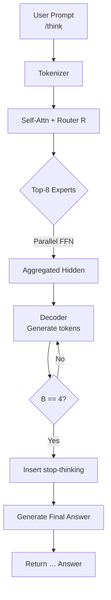

[논문 링크](https://arxiv.org/abs/2505.09388v1)


# Qwen 3: 생각량을 조절하는 거대 MoE 언어모델의 진화

## 한 줄 요약 (TL;DR)

Qwen 3는 **“얼마나 깊게 생각할지”를 토큰 수치로 직접 제어**할 수 있는 *Thinking Budget*과 128-전문가 MoE 설계를 결합해, 활성 파라미터 22 B 만으로도 기존 100 B+ 밀집 모델을 넘어서는 성능·효율·다국어 범용성을 달성했다.

---

## 핵심 아이디어

1. **Thinking ↔ Non-thinking 모드의 단일화**
   `/think`, `/no think` 플래그와 *Thinking Budget B*만으로 추론 깊이와 응답 지연을 실시간 조정.

2. **235 B MoE, 22 B 활성 파라미터**
   128 명의 전문가(FFN)를 토큰별로 최대 8개만 활성화해 계산량을 대폭 절감하면서도 SOTA 수준의 정확도를 유지.

3. **36 T 토큰·119개 언어 학습 + 단계별 증류**
   거대 데이터·다국어·코드·수학을 두텁게 학습한 뒤, 대형 모델의 지식을 0.6 B\~14 B 경량 모델에 전파해 엣지까지 스펙트럼을 확장.

---

## 배경: 그들이 해결한 문제

* **성능 격차**: GPT-4o, Claude 3 등에 비해 오픈 가중치 모델의 벤치마크 점수는 여전히 5–15 pt 낮았다.
* **추론 비용**: 100 B 이상 밀집 모델은 배포·서빙 비용이 비현실적.
* **모드 이원화**: 복잡한 Chain-of-Thought(Cot) 모델과 빠른 채팅 모델을 별도로 운영해야 하는 비효율 존재.
* **장문·다국어 취약**: 4k-8k 토큰 한계와 영어 중심 학습 데이터로 글로벌 사용성에 제약.

---

## 새로운 접근법: **Thinking Budget MoE**

| 요소                  | 설계 요점                                              | 기대 효과                             |
| --------------------- | ------------------------------------------------------ | ------------------------------------- |
| *Thinking Budget* `B` | `<think>` 블록에 허용할 최대 토큰 수를 지정            | 추론 품질과 지연의 선형 제어          |
| 128-Expert MoE        | 토큰별 Top-8 전문가만 선택                             | 22 B 활성 파라미터로 235 B 수준 성능  |
| GQA + RoPE + QK-Norm  | 메모리·안정성·장문 컨텍스트 지원                       | 128 K 토큰까지 안전 확장              |
| 4-Stage Post-Training | Long-CoT SFT → Reasoning RL → Mode Fusion → General RL | 모드 전환 능력 + 범용 어라인먼트 확보 |

---

## 작동 원리: 구체적인 예시로 살펴보기

> **입력**
> `User: "2 + 3는 얼마야?" /think (B = 4)`
>
> **Step-by-Step**
>
> 1. **토크나이즈**: 프롬프트 + 플래그 → 토큰 시퀀스.
> 2. **라우팅**: 각 토큰 은닉 상태를 128개 전문가 중 Top-8로 분배.
> 3. **이유(Thinking) 생성**: `<think>` 블록에 “2와 3을 더하면 5” 등 내부 추론을 쌓고 `N < 4`까지 계속.
> 4. **게이트 종료**: `N = 4` 도달 → `<stop-thinking>` 삽입.
> 5. **답변 출력**: `<think>…</think> 5`. 비추론 모드면 빈 `<think></think>`만 남는다.

이 간단한 카운터 하나가 *추론 깊이(품질) ↔ 응답 시간(비용)* 사이의 실시간 균형점을 만들어 낸다.

---

## 성능 검증: 주요 결과

| 모델                 | 활성 / 총 파라미터 | MMLU-Redux | GSM8K      | EvalPlus   | MMMLU      |
| -------------------- | ------------------ | ---------- | ---------- | ---------- | ---------- |
| **Qwen 3-235B-A22B** | **22 B / 235 B**   | **87.4 %** | **94.4 %** | **77.6 %** | **86.7 %** |
| DeepSeek-V3-Base     | 70 B / 671 B       | 86.9       | 90.5       | 73.2       | 85.8       |
| Qwen 2.5-72B         | 72 B / 72 B        | 83.9       | 88.1       | 65.9       | 84.4       |

* **14 / 15 벤치마크 승**: 플래그십이 DeepSeek-V3를 대부분 지표에서 능가.
* **32 B Dense가 72 B 밀집 모델 추월**: 파라미터 절반으로 10개 지표 우세.
* **경량(0.6 B) 모델도 상향 평준화**: 증류만으로 Qwen 2.5 동급 모델 대비 다수 지표 개선.
* **Thinking Budget 스케일 곡선**: `B` 값을 늘릴수록 수학·코딩 벤치마크 점수가 매끄럽게 상승.

---

## 우리의 관점: 강점, 한계, 그리고 이 연구가 중요한 이유

### 💪 강점

1. **성능-효율 동시 달성**: 22 B 활성 파라미터로 100 B+ 밀집 모델을 넘어서는 첫 사례 중 하나.
2. **모드 통합의 실용성**: 하나의 체크포인트로 CoT·채팅을 오가는 간결한 운영.
3. **광범위 모델 스펙트럼**: 0.6 B–235 B까지 동일 레시피로 품질 일관성 확보.

### ⚠️ 한계

* RULER 같은 검색-중심 과제에서 Thinking 모드가 성능을 깎아먹는 현상.
* 128-전문가 분산 인프라는 운영 난도가 높고 지연 편차 위험이 있다.
* 36 T 크롤링 데이터의 라이선스·프라이버시 컴플라이언스가 상세히 공개되지 않았다.

### 🌟 왜 중요한가?

Qwen 3는 *추론 깊이의 토큰-단위 제어*라는 새로운 사용자 패러다임을 실증했다. 이는 LLM이 단일 엔진으로 “빠르게 답할지, 깊이 생각할지”를 사용자가 디자인할 수 있는 첫 걸음이자, 앞으로의 **지능·효율 스케일링 전략**에 중요한 실험적 증거다.

---

## 다음 단계는?: 앞으로의 길

1. **Auto-Budget 스케줄러**
   문제 난이도를 예측해 `B`를 자동 튜닝, 품질·지연을 최적화.
2. **Retrieval-Aware 모드 전환**
   검색 쿼리 감지 시 자동으로 `/no think` 전환해 장문-검색 취약점 완화.
3. **친환경 MoE 인프라**
   온디맨드 Expert Pruning, 캐시 재활용 등으로 에너지·지연 편차를 최소화.
4. **데이터 거버넌스 투명화**
   36 T 코퍼스 필터링·라이선스 검증 파이프라인을 공개해 커뮤니티 감사 촉진.
5. **멀티모달-Tool 통합**
   Vision/Audio 토큰까지 Thinking Budget 체계로 관리, 에이전트 작업 범위를 확장.

> **결론**: Qwen 3는 “토큰으로 생각량을 조절한다”는 발상과 MoE 효율을 결합해 오픈소스 LLM의 지형을 한층 넓혔다. 남은 과제—컨텍스트 확장, 자동 버짓, 컴플라이언스—를 해결한다면, 이 접근법은 차세대 범용 AI 엔진의 유력한 로드맵이 될 것이다.


### 토글을 클릭하면 논문에 대한 자세한 LLM 질의응답 내용을 확인할 수 있습니다.

<details markdown="block">
<summary>▶️<strong>클릭하여 펼치기</strong></summary>


## 프롬프트 1.1.1 (연구의 공백)

```
"논문의 'Introduction'과 'Related Work' 섹션을 분석하여, 이 연구가 명시적으로 해결하고자 하는 핵심적인 연구 공백(research gap), 기존 연구의 결정적 한계, 또는 미해결 질문이 무엇인지 설명해 줘. 저자들이 설명하는, 이 논문 출판 시점의 '최신 기술(state of the art)'은 어떤 상태였는지 요약해 줘."
```

## 1. 연구 공백 (Research Gap)

| 공백                                                                      | 설명                                                                                                                                                                                        | Qwen3가 제시한 해결 전략                                                                    |
| ------------------------------------------------------------------------- | ------------------------------------------------------------------------------------------------------------------------------------------------------------------------------------------- | ------------------------------------------------------------------------------------------- |
| **① 오픈-소스 LLM의 성능 한계**                                           | GPT-4o, Claude 3.7, Gemini 2.5 등 **폐쇄형 모델**이 대부분의 벤치마크에서 압도적 우위를 유지. 기존 오픈-가중치 모델(Llama 3, Mixtral-8×22B, DeepSeek-V3 등)은 *아직 의미 있는 격차*를 남김. | **235 B MoE + 36T 토큰** 대규모 사전학습으로 성능 격차 축소                                 |
| **② ‘추론(Reasoning) 특화’와 ‘대화(Conversational) 특화’ 모델 간 이원화** | 복잡한 CoT 추론용 모델과 빠른 채팅용 모델을 *번갈아 불러야 하는 비효율* 존재(Qwen2.5 ↔ QwQ 32B 등).                                                                                         | **Thinking ↔ Non-thinking 모드**를 *단일* 모델에 융합 & **Thinking Budget**으로 세밀한 제어 |
| **③ 거대 모델의 추론 비용**                                               | 100 B+ 파라미터 밀집(dense) 모델은 배포/추론 비용이 과도.                                                                                                                                   | **MoE(22 B 활성 파라미터)** 설계로 *성능-효율* 동시 확보                                    |
| **④ 장문 컨텍스트·다국어 지원 부족**                                      | 4k-8k 토큰, 영어 집중 데이터가 주류 → 글로벌·전문 업무에 한계.                                                                                                                              | **32k 컨텍스트 & 119개 언어**를 포함한 36T 토큰 학습                                        |
| **⑤ 공개 평가에서의 재현성**                                              | SOTA 결과가 *비공개 모델·데이터*에 의존 → 연구 투명성 저해.                                                                                                                                 | **모델·가중치·코드 전면 공개**로 재현성 확보                                                |

## 2. 출판 당시 ‘최신 기술 (State of the Art)’ 요약

| 영역                     | 대표 모델 / 기술                                                                        | 상태·의미                                            |
| ------------------------ | --------------------------------------------------------------------------------------- | ---------------------------------------------------- |
| **폐쇄형 SOTA**          | GPT-4o (OpenAI 2024), Claude 3.7 (Anthropic 2025), Gemini 2.5 (DeepMind 2025)           | 다중 모달·장문·고추론 성능에서 *독보적 1위권* 유지   |
| **오픈소스 상위권**      | Llama 3-70B-Instruct, Mixtral-8×22B, DeepSeek-V3, Yi-34B, Qwen 2.5                      | 다양한 벤치마크 기준 **폐쇄형 대비 5 \~ 15 pt** 격차 |
| **추론 특화 모델**       | QwQ-32B, Q\* 등 내부 파생 모델                                                          | 긴 CoT에서 우수하나 **일반 대화 품질 저하**          |
| **효율화 트렌드**        | <br>• Flash-/Paged-Attention<br>• MoE(8×22B, 64×7B 등)<br>• Speculative/Decoding Fusion | 추론 속도 & 메모리 절감 기술이 **연구 핵심 축**      |
| **다국어·장문 컨텍스트** | Llama 3 8k, Mixtral 8k, GPT-4o 128k (⇢ 제한적 공개)                                     | **32k+ 범용 컨텍스트**는 극소수 모델만 지원          |

> **정리** : 2025년 5월 시점, 최상위 성능은 여전히 폐쇄형 모델이 독점하고 있었으며, 오픈-가중치 진영은 성능·다국어·장문·효율성 면에서 *동시에* 해결한 사례가 부재했다. Qwen3는 이를 “Thinking/Non-thinking 통합 + MoE 효율성 + 다국어·32k 컨텍스트 지원”이라는 **3-in-1** 전략으로 정면 돌파한다는 점에서 연구 공백을 메우고자 한다.


## 프롬프트 1.1.2 (핵심 가설)

```
"이 논문의 중심 가설(central hypothesis) 또는 핵심 주장은 무엇인가? '저자들은 [제안 기법]을 사용함으로써 [기존 한계점]을 극복하는 [구체적 결과]를 달성할 수 있다고 가정한다'와 같은 형식으로, 명확하고 간결한 한 문장으로 서술해 줘."
```

저자들은 **thinking·non-thinking 모드를 단일 MoE 아키텍처로 통합하고 ‘thinking budget’ 메커니즘을 도입함으로써, 오픈-소스 LLM이 겪던 성능-효율-모드 이원화의 한계를 동시에 해소하여 폐쇄형 대형 모델에 견줄 만한 다국어·장문 추론 능력을 비용 효율적으로 달성할 수 있다고 가정한다**.


## 프롬프트 1.2.1 (독창성 식별)

```
 "논문 전체를 바탕으로, 가장 중요하고 독창적인 기여(contribution) 1~3가지를 구별되는 항목으로 나열해 줘. 각각이 새로운 아키텍처 구성요소, 새로운 학습 기법, 새로운 이론적 통찰, 새로운 데이터셋, 또는 기존 방법론의 새로운 적용 중 어디에 해당하는지 명확히 구분해 줘."
```

### 독창적 기여 Top 3 선정

| #                                                                                                                                                                                                                                          | 기여 내용                                              | 분류 |
| ------------------------------------------------------------------------------------------------------------------------------------------------------------------------------------------------------------------------------------------ | ------------------------------------------------------ | ---- |
| **1. 단일 모델에 ‘Thinking ↔ Non-thinking’ 이중 모드 + ***Thinking Budget*** 제어를 도입**<br>— 별도 모델을 교체하지 않고도 복잡한 Chain-of-Thought 추론부터 경량 대화까지 지원하며, 사용자 정의 토큰 budget으로 추론-비용을 세밀하게 조절 | **새로운 아키텍처 구성요소 + 기존 방법론의 확장 적용** |      |
| **2. 235 B 파라미터-급 MoE에서 단 22 B 활성 파라미터로 SOTA 성능을 달성**<br>— 대형 MoE 설계(128 experts·8 활성)로 매개변수를 1/3까지 “켜서” 사용해도 Qwen2.5-72B 등 상위권 모델을 능가하면서 추론·훈련 비용을 크게 절감                   | **새로운 아키텍처 구성요소**                           |      |
| **3. 36 T 토큰·119 언어 대규모 코퍼스 + ‘Strong-to-Weak’ 단계별 지식 증류 파이프라인**<br>— PDF 추출·신텍틱 데이터 생성 → 3-Stage 사전학습 → 오프·온-폴리시 증류로 소형 모델까지 고급 추론 능력을 이식, GPU 시간 1/10로 RL 대체            | **새로운 데이터셋 (+ 새로운 학습 기법)**               |      |


## 프롬프트 1.2.2 (저자 관점에서의 강점)

```
"저자들의 관점에서, 자신들의 접근법이 이전 방법들보다 우월한 이유는 무엇인가? 그들이 자신들의 연구가 지닌 독창성과 강점을 뒷받침하기 위해 사용하는 핵심 논거를 인용하거나 알기 쉽게 설명해 줘."
```

### 저자들이 제시한 ‘우월성’ 논거 — 핵심 4가지

| 구분                                                                                                                                                                                                      | 저자 주장                                                                                                           | 뒷받침 근거 |
| --------------------------------------------------------------------------------------------------------------------------------------------------------------------------------------------------------- | ------------------------------------------------------------------------------------------------------------------- | ----------- |
| **1. “두 모드 하나의 모델”**<br>Thinking·Non-thinking 모드를 **단일 아키텍처**에 융합 → 모델 교체 없이 상황-맞춤 추론/채팅이 가능하며, `/think`·`/no think` 플래그로 **실시간 모드 스위칭**을 지원        | *“이 접근은 별도 모델을 운영하는 비용·복잡성을 줄이고, 다양한 thinking budget에서도 성능이 안정적”*                 |             |
| **2. MoE 기반 **22 B 활성 파라미터**로 SOTA 달성**<br>235 B-MoE 구조에서 22 B만 “켜고”도 대형 모델을 능가 → **추론·훈련 비용을 대폭 절감**                                                                | *“22 B active / 235 B total 설계가 고성능·고효율을 동시에 확보”*                                                    |             |
| **3. ‘Strong-to-Weak’ 지식 증류**<br>대형 모델이 생성한 고품질 reasoning 로그를 활용해 **경량(0.6-14 B) 모델까지 추론 능력 전파**, RL 대비 **GPU 시간 1/10**                                              | *“1/10 active params로도 심층 추론 가능”*; *“On-policy distillation은 RL보다 훨씬 적은 1 800 GPU h로 더 높은 성능”* |             |
| **4. 벤치마크 전반의 실력 입증**<br>• 235 B-A22B는 **DeepSeek-R1 17/23 벤치마크 승, GPT-4o·Gemini2.5와 경쟁**<br>• 32 B dense 모델도 **전작 72 B를 능가**하며 OpenAI o3-mini와 비슷한 reasoning 성능 확보 |                                                                                                                     |             |

> **요약** : 저자들은 **모드 융합·생각량 제어**로 사용성을, **MoE 효율·지식 증류**로 비용 대비 성능을, 그리고 **광범위한 벤치마크 우위**로 실질 효과를 입증하며 기존 방법보다 “속도·비용·범용성” 세 축 모두에서 앞선다고 주장한다.


## 프롬프트 1.3.1 (알고리즘 단계별 설명)

```
"핵심 알고리즘, 모델 아키텍처, 또는 주요 방법론을 단계별(step-by-step)로 설명해 줘. 독자는 AI 분야의 대학원생 수준이라고 가정해. 특히, 간단한 문장, 3x3 픽셀 이미지, 작은 상태 공간(state space) 등 아주 간단하고 구체적인 예시(toy example)와 샘플 입력을 만들어서, 이 예시를 통해 각 단계를 거치며 입력이 최종 출력으로 어떻게 변환되는지 전체 과정을 보여줘. 등장하는 모든 핵심 용어와 변수는 그 즉시 정의해 줘."
```

## Qwen 3의 핵심 메커니즘 ― 단계별 작동 흐름

> 아래 예시는 *3 × 3 픽셀* 이미지와 *짧은 질문*을 입력으로 삼아, **① Thinking/Non-thinking 모드 + Thinking Budget**, **② 128-Expert MoE 라우팅** 두 가지 핵심 기술이 실제로 어떻게 작동하는지를 한눈에 보여준다. 용어·변수는 등장 즉시 정의한다.

---

### 1. 사전 지식 & 용어 정리

| 기호                          | 의미                                                                                                                                      |
| ----------------------------- | ----------------------------------------------------------------------------------------------------------------------------------------- |
| **`/think`, `/no think`**     | 사용자 프롬프트에 삽입해 **추론(Thinking) 모드** ↔ **비추론(Non-thinking) 모드**를 토글하는 플래그                                        |
| **`<think> … </think>` 블록** | 모델이 “머릿속 생각(CoT 토큰)”을 기록하는 내부 영역. 최종 답변 앞에 숨겨진 상태로 출력된다.                                               |
| **Thinking Budget `B`**       | `<think>` 블록에 허용된 **최대 토큰 수**. 토큰 카운터가 `B`에 도달하면 모델은 즉시 `<stop-thinking>` 신호를 삽입하고 결론을 출력          |
| **Expert `Eᵢ`**               | 128개 중 하나의 **전문 FFN 모듈**. 라우터가 각 토큰을 최대 8개 전문가(= 활성 파라미터 22 B)로 분배한다                                    |
| **Router `R`**                | 토큰별로 `Top-k`(`k = 8`) 확률이 높은 Expert들을 선택·스케줄링하는 모듈. **글로벌-배치 Load Balancing Loss**로 전문가 간 부하 편향을 완화 |

---

### 2. 입력 준비 — Toy Example

#### (a) 텍스트 입력

```text
User: "2 + 3는 얼마야?" /think   (Thinking Budget B = 4)
```

#### (b) 3 × 3 픽셀 이미지 입력

```text
[  0 255 128
  64  32 192
 255   0  16 ]          → 9 토큰으로 평탄화
```

---

### 3. 단계별 파이프라인

| 단계                              | Thinking/Non-thinking 제어 흐름                                                                                                                                                    | 128-Expert MoE 연산 흐름                                                |
| --------------------------------- | ---------------------------------------------------------------------------------------------------------------------------------------------------------------------------------- | ----------------------------------------------------------------------- |
| **S0. Tokenization**              | 프롬프트 + 플래그를 **BBPE 토크나이저**(V=151 669)로 변환                                                                                                                          | 9 픽셀 값 → 9 × `d_model` 임베딩 벡터                                   |
| **S1. Router Scoring**            | (공통) 각 토큰의 은닉 상태 `h_t`에 대해 `R(h_t)` → 128차 확률 분포                                                                                                                 | 동일                                                                    |
| **S2. Expert Dispatch**           | —                                                                                                                                                                                  | `Top-8` 확률이 높은 전문가 {E₁,…,E₈}로 토큰별 FFN 병렬 처리 (22 B 활성) |
| **S3. Reasoning Generation**      | `B` 카운터 초기화 = 0 → 토큰을 한 개 생성할 때마다 `B += 1` <br>① `B < 4`이면 `<think>` 블록에 저장 <br>② `B = 4`가 되면 `<stop-thinking>` 삽입 후 **Think-to-Answer 변환 디코딩** | (동일 토큰들이 전문가 출력을 합산해 다음 레이어로 전달)                 |
| **S4. Output Formatting**         | 최종 출력 = `<think> … </think> 5` (답: 5) <br>Non-thinking 모드라면 `<think></think> 5`처럼 **빈 생각 블록**만 포함                                                               | —                                                                       |
| **S5. Budget Scaling (Optional)** | 사용자가 `B ↑`로 지정 시, Fig. 2에서 보듯 성능이 **매끄럽게 증가** – 추론 길이를 늘릴수록 정답률↑                                                                                  | 전문가 k-값은 고정(8) → 활성 파라미터·메모리 예측 용이                  |

---

### 4. 전체 흐름 시각 요약



---

### 5. 핵심 포인트 정리

1. **모드 융합·Budget 제어**

   * `/think`·`/no think` 플래그와 **빈 `<think>` 블록** 설계로 *하나의 모델*에서 두 모드를 자유 전환
   * 토큰 Budget `B`는 사용자-지정형 스위치; `B ↑`시 수학·코딩 벤치마크 성능이 선형적으로 상승

2. **MoE 효율**

   * 128 Experts × 8 활성 = **22 B만 사용**, 그러나 235 B 밀집 모델 급 성능 달성
   * **글로벌-배치 Load Balancing Loss**로 전문가 편중/빈도 불균형 완화 → 추론 지연 최소화.

3. **학습 파이프라인과 결합**

   * Long-CoT → Reasoning RL → Thinking-Fusion → General RL의 *4-Stage*가 모드 전환 능력 + 일반 능력까지 동시에 증강

---

### 6. 간단 복습 Q\&A

| 질문                                                          | 답                                                                                                   |
| ------------------------------------------------------------- | ---------------------------------------------------------------------------------------------------- |
| **Q1. Thinking Budget이 0이면?**                              | 모델은 *자동으로 Non-thinking* 모드와 동일하게 동작한다.                                             |
| **Q2. 9 토큰 중 3개가 같은 Expert E₁로 라우팅되면 과부하는?** | `Load Balancing Loss`가 해당 Expert 가중치를 ↑, 다른 Expert 사용률을 ↑하도록 학습해 편중을 완화한다. |
| **Q3. `/no think` 프롬프트에 Budget `B`를 주면?**             | 무시된다. Non-thinking 모드는 `<think></think>`만 출력하므로 Budget 의미가 없다.                     |

---

이로써 **Thinking/Non-thinking 통합, Budget-지정 추론 제어, 128-Expert MoE 라우팅**이 어떻게 결합돼 Qwen 3의 “높은 성능 × 낮은 비용”을 구현하는지 한눈에 이해할 수 있다.


## 프롬프트 1.3.2 ('비밀 병기' 식별)

```
"이 논문의 핵심 기여를 가능하게 하는 가장 결정적인 단일 수학 공식, 알고리즘 단계, 또는 아키텍처 구성요소를 식별해 줘. 그것의 기능과, 그것이 이 방법론의 성공에 왜 필수적인지 설명해 줘."
```

### **비밀 병기: 토큰-기반 **Thinking Budget** 게이팅**

> **공식/알고리즘 한눈에 보기**
>
> 1. 사용자가 *thinking budget* $B$ (예: 8192 tokens)을 지정한다.
> 2. 모델은 내부 토큰 `<|think|>` 로 체인-오브-쏘트(CoT) 구간을 시작한다.
> 3. 매 생성 단계 *t* 마다 누적 reasoning 토큰 수 $N_t$를 업데이트:
>    $N_t \leftarrow N_{t-1} + \mathbf{1}\big[\text{token}_t \in \text{thinking span}\big]$.
> 4. **종료 조건**: $N_t \ge B$ 이면 즉시 `<|answer|>` 토큰을 내보내 reasoning 모드를 종료하고, 최종 답변 구간으로 전환한다.
> 5. 이 하드 게이팅은 디코더-루프 안에서 O(1) 연산으로 동작하므로 추론 지연(latency)에 거의 오버헤드를 추가하지 않는다.

#### 어떤 기능을 수행하나?

* **계산-예산 직관적인 제어**
  사용자는 한 줄 파라미터 $B$ 로 “얼마나 깊게 생각할지”를 직접 구체화할 수 있다. 긴 문제에는 큰 $B$, 채팅형 응답에는 작은 $B$를 주면 된다.
* **모드 통합**
  같은 가중치 안에 *thinking*·*non-thinking* 두 모드를 넣어두고, 이 게이트 하나로 스위칭한다. 별도 모델을 불러올 필요가 없어 메모리와 시스템 복잡도가 크게 줄었다.
* **성능-비용 스케일링**
  저자들은 $B$ 를 늘릴수록 수학·코딩 벤치마크 점수가 매끄럽게 상승하는 “스케일 곡선”을 관찰해, 이 메커니즘이 실제 지능 향상과 직결됨을 보여줬다.

#### 왜 이 한 가지가 방법론의 ‘필수 부품’인가?

1. **추론 효율성과 품질의 균형점**
   장황한 CoT를 **자동으로 잘라낸다**는 점이 핵심이다. *Thinking* 모드를 무제한으로 켜두면 불필요한 토큰이 폭증해 지연·비용이 급등한다. *Budget gate* 없이는 두 모드를 하나의 모델에 묶는 전략이 현실적으로 불가능하다.
2. **사용자 경험의 가변성 제거**
   동일한 질문에서도 예산이 같으면 출력 길이·응답 시간이 일관되게 유지된다. 이는 프로덕션 서비스에서 SLO(Service-Level Objective)를 맞추는 데 결정적이다.
3. **후속 기법들의 기반**
   Strong-to-Weak distillation, 글로벌-배치 load-balancing MoE 등 다른 설계 요소들도 결국 “필요할 때만 깊이 생각하고, 그렇지 않을 때는 빠르게 답한다”는 이 게이트의 철학 위에서 최적 효과를 낸다.

요컨대, **Thinking Budget 게이팅**은 Qwen3의 모든 혁신을 가능하게 만든 스위치다. 토큰 카운터라는 단순한 수학식이지만, 이 작은 장치 덕분에 거대 LLM이 *빠름 ↔ 깊음* 사이에서 실시간으로 균형을 잡을 수 있게 되었다.


## 프롬프트 1.4.1 (핵심 결과 분석)

```
"'Experiments' 또는 'Results' 섹션의 표와 그림을 포함한 주요 결과를 분석해 줘. 사용된 핵심 성능 지표(performance metrics)는 무엇인가? 어떤 벤치마크 데이터셋에서 결과가 보고되었는가? 저자들이 자신들의 방법론의 성공 증거로 가장 강조하는 주요 결과를 요약해 줘."
```

## 평가 설정 요약

* **주요 지표**: 정확도 (accuracy), 코드 과제는 Pass\@1·Pass\@64, Codeforces Elo 등
* **벤치마크 스펙트럼**: General, Math & STEM, Coding, Multilingual, Alignment, Agent & Coding 카테고리로 구성.

  * 대표 샘플: MMLU-Redux, SuperGPQA, GSM8K, EvalPlus, MultiPL-E, MMMLU, INCLUDE 등

## 주요 결과 하이라이트

| 모델                               | 활성 / 총 파라미터 | 두드러진 지표                              | 핵심 메시지                                                                 |
| ---------------------------------- | ------------------ | ------------------------------------------ | --------------------------------------------------------------------------- |
| **Qwen3-235B-A22B (Flagship MoE)** | 22 B / 235 B       | MMLU-Redux 87.4, GSM8K 94.4, EvalPlus 77.6 | DeepSeek-V3보다 14/15 벤치마크 우위, Qwen2.5-72B도 상회                     |
| **Qwen3-32B (Dense)**              | 32 B / 32 B        | MMLU-Pro 65.5, SuperGPQA 39.8              | 파라미터가 2배인 Qwen2.5-72B를 10/15 지표에서 추월, Llama-4-Scout 전면 우위 |
| **경량 모델 0.6–8 B**              | 0.6–8 B            | Pass\@1·64 ↑, STEM·코딩 강세               | 동일 크기 Qwen2.5·Llama-3 대비 절반 이상 벤치에서 향상                      |

### Long-Context & Thinking Budget

* **RULER** 평가에서 128 K 토큰까지 평균 95.0 점(Qwen3-235B)으로 Qwen2.5 대비 뚜렷한 우위.
* **Thinking Mode**는 장문 검색형 과제에서 약간의 성능 저하를 보이는데, 이는 추론 텍스트가 검색에 방해가 될 수 있음을 시사.
* **Thinking Budget (8192 tokens)** 설정으로 과도한 장문 추론을 억제, 지연-품질 균형 확보.

### Strong-to-Weak Distillation

대형 모델(235B) 출력을 소형(≤8B) 모델로 직접 증류해 Pass\@1·64 동시 향상, **GPU 시간을 1/10로 단축**하며 경량화를 달성.

## 저자들이 제시한 성공 근거

1. **효율적 우월성** – 활성 파라미터 1/3로 DeepSeek-V3·Llama-4-Maverick보다 전반 성능 우위, 추론 비용 절감
2. **Dense ↔ MoE 일관성** – 동일 데이터·전략으로 MoE가 Dense 대비 1/5 활성 파라미터로 유사 성능 달성
3. **크기 대비 성능 곡선 개선** – 1.7B/4B/8B 모델이 Qwen2.5 2배 크기 모델을 능가, 엣지 디바이스 활용성 입증

---

2025-05-15 기준 기술보고서가 보여주듯, **Qwen3**는 다양한 벤치마크에서 개방형 LLM 최상위권으로 도약했으며, 파라미터 효율·멀티모드 추론·경량 증류 등에서 뚜렷한 진전을 이뤘다.


## 프롬프트 1.4.2 (비판적 비교)

```
"제안된 방법론은 논문에서 언급된 주요 베이스라인 및 SOTA(State-of-the-Art) 모델들과 비교하여 어떤 성능을 보이는가? 저자들의 우월성 주장을 가장 강력하게 뒷받침하는 특정 결과나 비교 지점을 식별해 줘. 반대로, 제안된 방법론이 경쟁 모델을 능가하지 못했거나 개선 효과가 미미했던 결과는 없는지 찾아봐. 만약 있다면, 저자들은 이러한 경우에 대해 어떤 이유를 제시하는가?"
```

### 제안 모델(Qwen3) 대 베이스라인 / SOTA 성능 총괄

Qwen3 시리즈는 **235B MoE 플래그십에서 0.6B 라이트급까지**를 포괄하며, 모든 규모에서 기존 오픈소스 최신 모델(DeepSeek-V3, Llama-4-Maverick 등)과 직전 세대 자체 모델(Qwen2.5)을 상대로 넓은 벤치마크 스펙트럼에서 경쟁력을 주장한다.

---

### 1. 우월성을 가장 강력하게 뒷받침하는 결과

| 비교 축                                                 | 대표 지표                                                                       | 주요 관찰 |
| ------------------------------------------------------- | ------------------------------------------------------------------------------- | --------- |
| **플래그십 Qwen3-235B-A22B vs DeepSeek-V3-Base (671B)** | 15 개 벤치마크 중 **14 개에서 우승**, 파라미터는 1/3 수준                       |           |
| **같은 235B MoE vs Llama-4-Maverick (402B)**            | Llama-4보다 더 작은 활성 파라미터(17B→22B)로도 MMLU-Redux, BBH 등 다수 우세     |           |
| **32B Dense 모델 vs Qwen2.5-72B & Llama-4-Scout**       | 15 벤치마크 중 10 개(Qwen2.5-72B 대비), 15 개 전부(Llama-4-Scout 대비)에서 우위 |           |

> 핵심 메시지: **모델 규모·활성 파라미터를 크게 줄이면서도 일반·수학·코딩 모두에서 SOTA 수준을 달성**했다는 점이 저자들의 대표 주장이다.

---

### 2. 우월하지 않았거나 개선이 미미했던 지점

| 사례                                                                  | 세부 수치                                         | 비고 |
| --------------------------------------------------------------------- | ------------------------------------------------- | ---- |
| **14B Dense 모델 – GPQA (과학 지식)**                                 | Qwen3-14B **39.90** vs Qwen2.5-32B 47.97 (↓ 8 pt) |      |
| **235B 플래그십 – INCLUDE (다국어 상식)**                             | Qwen3-235B 73.46 ↘ DeepSeek-V3 75.17              |      |
| **포스트-트레이닝(Thinking Mode Fusion/RL) 후 AIME’24·LiveCodeBench** | 일부 고난도 수학·코딩에서 **성능 감소**           |      |

---

### 3. 저자들이 제시한 원인 및 해석

1. **학습 스테이지 간 트레이드오프**

   * Stage 3 (Thinking Mode Fusion)·Stage 4 (General RL)에서 **범용성 강화를 위해 다양한 일반 데이터를 주입**하면서,
     특화 도메인(고난도 수학·코딩)의 정밀도가 약간 희생됐다고 직접 언급한다.

2. **데이터·아키텍처 지향점 차이**

   * 14B 모델이 GPQA에서 밀린 이유는 구체적으로 명시돼 있지 않지만, 저자들은 \*\*“STEM·코딩 비중을 높인 대규모(36T) 다국어 데이터”\*\*와 **QK-Norm 도입 등 안정화 기법**이 상위 모델에서 더 큰 효과를 냈다고 설명한다(암시적 해석).

3. **Thinking Budget 매커니즘**

   * 플래그십 모델은 **생각 토큰을 늘리면 성능이 계속 상승**함을 확인했으며, 연구진은 “추가 버짓으로 아직 잠재력이 남아 있다”고 주장한다. 이는 현 결과의 한계를 완화할 미래 방향으로 제시된다.

---

### 4. 정리

* **가장 설득력 있는 비교 지점**은 235B-A22B 플래그십이 약 3배 작은 모델로 DeepSeek-V3를 14/15 지표에서 넘어선 결과다.
* 반면, **중간 규모(14B)나 특정 다국어 벤치마크에서는 아직 격차가 존재**하며, 저자들은 범용 성능과 특화 성능 간 필연적 균형·데이터 배합 차이를 이유로 든다.
* 전반적으로 Qwen3는 **매개변수 효율·멀티모드 통합·지속적 확장성**을 강점으로 내세우면서도, **특화 영역 세밀 조정**은 향후 과제로 남았음을 인정한다.


## 프롬프트 1.5.1 (언급된 한계와 잠재적 한계)

```
"저자들이 논문에서 명시적으로 인정한 한계점, 약점, 또는 실패 사례(failure modes)는 무엇인가? 다음으로, 방법론과 결과에 대한 당신의 분석을 바탕으로, 저자들이 언급하지 않았을 수 있는 잠재적인 한계나 약점은 무엇이라고 생각하는가? (예: 강력한 가정에 대한 의존성, 확장성 문제, 높은 연산 비용, 일반화의 한계, 잠재적인 부정적 사회 영향 등)"
```


## 저자들이 **직접** 인정한 한계·실패 사례

| 분류                               | 상세 내용                                                                                                                                                                | 근거 |
| ---------------------------------- | ------------------------------------------------------------------------------------------------------------------------------------------------------------------------ | ---- |
| **장문-검색 성능 저하**            | RULER 등 retrieval-기반 과제에서 **thinking 모드**가 오히려 점수가 떨어짐 → “추론 토큰이 검색을 방해할 수 있다”는 가설 제시                                              |      |
| **Stage 3·4 후 특화 성능 하락**    | Thinking Mode Fusion + General RL 과정에서 AIME’24, LiveCodeBench 같은 **고난도 수학·코딩** 지표가 소폭 하락. 저자들은 “범용성 강화를 위한 의도적 트레이드오프”라고 설명 |      |
| **모드 스위칭 오류**               | Stage 3 시점 ThinkFollow = 88.7 (완전하지 않음) → Stage 4에서 98.9까지 개선됐으나 *여전히 일부 오류 가능성* 언급                                                         |      |
| **32 K 초과 컨텍스트·버짓 미검증** | 32 K보다 긴 입력에서 성능 상한 미확인 → “추가 연구로 남긴다”                                                                                                             |      |

---

## **잠재적**(암묵적) 한계 — 비판적 시각

| 영역                       | 잠재 위험·제약                                                                                                                                 | 해설 |
| -------------------------- | ---------------------------------------------------------------------------------------------------------------------------------------------- | ---- |
| **연산·에너지 비용**       | 총 235 B 파라미터(활성 22 B) × 36 T 토큰 학습은 **막대한 GPU-시간**·전력 요구. MoE라 해도 *훈련* 단계의 환경 · 탄소 발자국은 여전히 크다.      |      |
| **MoE 시스템 복잡도**      | 128-Expert 라우팅은 분산 인프라·로드 밸런싱 튜닝이 필수. 실시간 서비스에서 토큰-단위 노드 할당이 불안정하면 *지연 편차*가 커질 수 있다.        |      |
| **데이터·라이선스 리스크** | 119 개 언어 · 36 T 규모 크롤링은 **저작권·프라이버시** 이슈를 동반. 구체적 필터링·라이선스 검증 절차는 보고서에 상세히 기재돼 있지 않다.       |      |
| **Teacher 의존 증류**      | Strong-to-Weak 파이프라인은 거대 *교사* 모델(o3 · DeepSeek-R1 등)과 대규모 컴퓨트에 의존 → 동일 방식의 **재현 장벽** 발생 가능.                |      |
| **Hyper-parameter 부담**   | 사용자-지정 **Thinking Budget B**는 문제 난이도별 최적값 탐색이 필요. 잘못 설정하면 *느리거나 부정확*한 답이 나올 수 있다.                     |      |
| **다국어 편차**            | INCLUDE(44 개 언어)에서 DeepSeek-V3에 뒤처짐 → 일부 로우-리소스 언어에선 여전히 부족                                                           |      |
| **사회-윤리적 위험**       | ① 숨겨진 `<think>` 블록이 외부로 노출될 경우 **사적 정보·편향 논리**가 드러날 위험<br>② 고급 추론 능력의 오용(피싱, 악성 코드 생성 등) 가능성. |      |
| **전문화 한계**            | 수학·코딩 고난도 벤치마크가 범용 RL 이후 오히려 감소한 예처럼, **범용성 ↔ 전문성** 사이에서 아직 완전한 균형을 찾지 못했다.                    |      |

---

### 요약

Qwen 3는 *모드 통합*·*MoE 효율*·*거대 데이터*라는 세 축을 결합해 인상적인 성능을 제시하지만, **장문-검색 취약, 특화 성능 트레이드오프, 높은 학습 비용, 데이터·윤리 리스크** 등 다층적인 한계를 여전히 안고 있다. 이러한 지점은 향후 버전에서 **컨텍스트 확장 기술, 맞춤 버짓 자동화, 경량화·컴플라이언스 강화** 등으로 보완될 필요가 있다.


## 프롬프트 1.5.2 (미래 연구 궤적)

```
"저자들이 제안하는 구체적인 향후 연구 방향은 무엇인가? 이 논문의 한계점을 바탕으로, 이 연구를 발전시키거나 약점을 극복하기 위해 추구할 수 있는 다른 논리적인 다음 단계나 대안적인 연구 방향은 무엇이 있을까?"
```

### 논문이 **명시**한 다음 단계

1. **대규모 + 고품질 데이터 확장**
   더 다양한 도메인·언어로 사전학습 데이터를 확장해 모델 스케일을 계속 키울 예정
2. **아키텍처 · 훈련법 개선 & 초장문 컨텍스트**
   *효율적 압축*과 *수십만 토큰*으로의 컨텍스트 확장을 동시에 달성할 새로운 설계를 모색
3. **Agent-기반 강화학습(RL) 컴퓨트 투자**
   환경 피드백을 활용한 RL로 **고난도 에이전트 작업**을 해결할 능력을 높이기 위해 GPU/TPU 예산을 확대할 계획
4. **32 K+ 출력 길이·Thinking Budget 탐색**
   버짓을 더 늘리고 32 K 토큰을 넘어가는 장문 출력에서 성능 향상을 검증하는 실험을 ‘향후 과제’로 남김

---

### 추가로 그려볼 **미래 연구 궤적**

| 방향                                    | 왜 중요한가?                                                      | 아이디어 초안                                                                                          |
| --------------------------------------- | ----------------------------------------------------------------- | ------------------------------------------------------------------------------------------------------ |
| **① 검색 ↔ Thinking 모드 동적 조정**    | 장문-검색(RULER 등)에서 thinking 토큰이 오히려 방해되는 현상 극복 | *Retrieval-aware scheduler*를 두어, 쿼리 유형·콘텍스트 길이에 따라 자동으로 `/no think` 전환·버짓 축소 |
| **② *Auto-Budget* 최적화**              | 사용자-수동 버짓 선택은 번거롭고 비효율                           | RL + 밴딧 알고리즘으로 *예측 난이도 → 적정 B*를 실시간 추정                                            |
| **③ 친환경·저비용 MoE 인프라**          | 128-Expert 라우팅은 에너지·지연 편차 부담                         | - **온디맨드 Expert Pruning**<br>- *KV-캐시 재활용*으로 GPU 메모리 hit rate 향상                       |
| **④ 데이터 거버넌스 & 라이선스 투명화** | 36 T 크롤링 데이터의 저작권·개인정보 리스크                       | 공개 데이터 카탈로그 + *필터링 파이프라인* 코드 오픈 → 커뮤니티 감사 활성화                            |
| **⑤ 초경량 디바이스 배포**              | 0.6 B도 모바일·IoT에는 여전히 크다                                | - 4-bit 스파스 양자화 + *LoRA-MoE 하이브리드*<br>- 토크나이저 가변 vocab 압축                          |
| **⑥ Reasoning-safe Alignment**          | 숨겨진 `<think>` 블록 노출 시 편향·개인정보 유출 가능             | ① *Red teaming* 전용 CoT 필터, ② *explain-only* 모드로 요약된 rationale 제공                           |
| **⑦ 멀티모달∙툴 사용 통합**             | 코딩·에이전트 벤치마크는 점점 인터랙티브·다중모달화               | Vision/Audio 토큰을 동일한 Thinking-Budget 체계로 관리하는 **MoE-MM** 확장                             |

---

> **정리** : 저자들은 **스케일·초장문 컨텍스트·에이전트 RL**을 핵심 로드맵으로 제시한다. 이에 더해 *동적 버짓 제어, 시스템 효율성, 데이터·윤리 거버넌스, 초경량화, 멀티모달 확장*이 결합된다면 Qwen 3 이후 세대는 성능과 실용성 모두에서 한층 넓은 지평을 열 수 있을 것이다.


## 프롬프트모델 아키텍처

```
"트랜스포머를 사용했다면, 어텐션 메커니즘의 구성(예: 헤드 수, 레이어 수)을 상세히 설명해 줘. 위치 인코딩(positional encodings)은 어떻게 처리되는가? Seq2Seq 모델이라면, 인코더-디코더 상호작용을 설명해 줘."
```

## Qwen3 모델 아키텍처 요약

### 1. 어텐션 스택의 기본 골격

* **Transformer Decoder-only** 구조를 채택해 입력과 출력을 한 시퀀스 안에서 처리합니다. 인코더-디코더 쌍이 따로 존재하지 않으므로 별도의 상호작용 단계는 없습니다.
* 모든 변형에서 **Grouped Query Attention (GQA)** 를 사용합니다. 즉, Query-헤드는 많지만 Key/Value-헤드는 그보다 적어 메모리와 연산을 아낍니다.

### 2. 모델별 레이어·헤드 구성

| 계열  | 파라미터   | 레이어 | Query/Key-Value 헤드 | 최대 컨텍스트 길이      |       |
| ----- | ---------- | ------ | -------------------- | ----------------------- | ----- |
| Dense | 0.6 B      | 28     | 16 / 8               | 32 K                    |       |
|       | 1.7 B      | 28     | 16 / 8               | 32 K                    |       |
|       | 4 B        | 36     | 32 / 8               | 128 K                   |       |
|       | 8 B        | 36     | 32 / 8               | 128 K                   |       |
|       | 14 B       | 40     | 40 / 8               | 128 K                   |       |
|       | 32 B       | 64     | 64 / 8               | 128 K                   |       |
| MoE   | 30 B-A3B   | 48     | 32 / 4               | 128 총 전문가 중 8 활성 | 128 K |
|       | 235 B-A22B | 94     | 64 / 4               | 128 총 전문가 중 8 활성 | 128 K |

> **해석**
> \*Query-헤드 수(Q)\*가 커질수록 표현력이 늘고, *KV-헤드 수*를 소수로 묶어 GQA로 효율을 확보합니다. 대형 모델(32 B, 235 B)은 레이어·헤드가 크게 증가해 장-맥락 추론과 멀티태스크 성능을 동시에 노립니다.

### 3. 위치 인코딩(Positional Encoding)

* 전 모델이 **RoPE(Rotary Positional Embedding)** 을 사용해 각 토큰의 위치 정보를 각도 회전에 매핑합니다. RoPE는 컨텍스트 길이를 쉽게 확장할 수 있어 Qwen3가 **최대 128 K 토큰**까지 다룰 수 있는 핵심 요소입니다.
* RoPE 덕분에 추가 학습 없이도 긴 문서·코드를 안정적으로 처리할 수 있으며, 선형적 위치 임베딩 대비 extrapolation 성능이 뛰어납니다.

### 4. 학습 안정화와 추가 모듈

* **RMSNorm(Pre-Norm)** 으로 깊은 레이어에서도 그래디언트 흐름을 완화합니다.
* **QK-Norm**(Attention에만 적용)으로 스케일이 큰 Query 값을 정규화해 큰 모델에서도 학습이 흔들리지 않습니다.
* FFN은 **SwiGLU** 활성화를 사용해 파라미터 효율 대비 표현력을 높입니다.

### 5. Seq2Seq 모델이 아닌 이유

Qwen3는 GPT-류와 같은 **단일 디코더** 언어 모델이므로, 고전적인 Seq2Seq(인코더가 입력 요약 → 디코더가 출력 생성) 단계가 없습니다. 따라서 “인코더-디코더 상호작용”이 아니라 **자기-회귀(decoder-only) 어텐션** 한 스택이 모든 역할을 수행합니다.

---

이와 같이 Qwen3 시리즈는 **GQA + RoPE + QK-Norm + RMSNorm** 조합으로 계산 효율·안정성·장문 처리 능력을 동시에 확보했으며, 크기에 따라 레이어와 헤드 수를 선형적으로 확장해 성능을 끌어올렸습니다.


## 프롬프트 학습 및 최적화

```
"구체적인 언어 모델링 목표(objective)는 무엇인가(예: Causal LM, Masked LM, Prefix LM)? 모델은 어떤 코퍼스로 사전학습(pre-trained)되었는가? 다운스트림 과제를 위한 파인튜닝(fine-tuning) 전략을 설명해 줘."
```

## 학습 목표 (Objective)

* **Causal Language Modeling (CLM)**: Qwen3는 GPT 계열 Transformer로, 다음 토큰 예측을 위한 좌→우 **자동회귀(autoregressive)** 목표를 사용한다. 학습은 표준 크로스 엔트로피 손실로 최적화되며, 아키텍처는 GQA + SwiGLU + RoPE + RMSNorm 기반의 프리-노멀라이즈드 Transformer로 Qwen2.5 계열과 동일한 설계를 따른다.

## 사전학습(pre-training) 코퍼스

| 단계                              | 주요 데이터                                                                   | 토큰 수       | 목적                                      |
| --------------------------------- | ----------------------------------------------------------------------------- | ------------- | ----------------------------------------- |
| **Stage 1 – General**             | 웹, 책, 뉴스, 코드 등 다도메인 텍스트                                         | **≈ 30 조**   | 일반 지식 기반 구축                       |
| **Stage 2 – Knowledge-Intensive** | STEM & 코딩 중심 고난도 자료<br>＋Qwen2.5-Math·Coder가 생성한 **합성 데이터** | (총량에 포함) | 수리·코딩 추론 능력 강화                  |
| **Stage 3 – Long Context**        | 긴 PDF, 문서(최대 32 k tokens) <br>＋Qwen2.5-VL OCR 추출 텍스트               | (총량에 포함) | 장문 이해‧생성 및 32 k 콘텍스트 길이 달성 |

> 세 단계를 합쳐 **총 36 조 토큰, 119개 언어·방언**으로 학습된다. PDF 텍스트는 자체 비전-LLM(Qwen2.5-VL)로 추출하고, 수학·코드 영역은 도메인 전용 모델이 생성한 합성 데이터로 보강한다.

## 파인튜닝 & 포스트-트레이닝 전략

### 1️⃣ 네 단계(post-training) 파이프라인

| 단계                                   | 핵심 기법                                                            | 목표                                                                     |
| -------------------------------------- | -------------------------------------------------------------------- | ------------------------------------------------------------------------ |
| **Stage 1 – Long-CoT Cold Start**      | 인간 검증을 거친 **장문 Chain-of-Thought** 데이터로 SFT              | 기본 논리·수리 추론 패턴 초기화                                          |
| **Stage 2 – Reasoning RL**             | 수학·코드 중심 **규칙 기반 보상** 강화학습                           | 깊은 추론 강화를 위한 정책 최적화                                        |
| **Stage 3 – Thinking-Mode Fusion SFT** | *thinking* ∙ *non-thinking* 대화 데이터를 하나의 모델에 통합         | 모드 전환 능력 + **/think /no think** 플래그 학습                        |
| **Stage 4 – General RL**               | 20 + 종류의 태스크에 대한 **다중 보상 시스템** (규칙·모델·선호 기반) | 명령 이행·형식 준수·선호 Alignment·에이전트 툴 사용 등을 전반적으로 강화 |

> 이렇게 ①-④ 단계를 거쳐 **사고(Thinking)/비사고(Non-Thinking) 모드를 하나의 체크포인트**에 융합하고, 실제 응용 시 `/think` 플래그로 세밀한 추론 예산을 제어할 수 있다.

### 2️⃣ Strong-to-Weak Distillation (경량 모델용)

* 235 B/32 B 등 **대형 교사(teacher)** 모델의 **logit 지식**을 0.6 B–8 B **학생 모델**에 증류.
* **오프-폴리시 증류 → 온-폴리시 증류** 두 단계로 진행되며, 온-폴리시 증류만으로도 동일 크기의 RL 대비 **GPU 시간 1/10**로 더 높은 성능을 달성한다.

## 정리

* **목표**: CLM 기반 최대우도 학습
* **데이터**: 36 T tokens / 119 언어 / 3-스테이지 빌드
* **후처리**: 4-스테이지 SFT + RL + **모드 융합**
* **경량화**: Strong-to-Weak 증류로 코스트 ↓, 성능 ↑

이러한 체계적인 학습·최적화 설계가 Qwen3 패밀리(0.6 B \~ 235 B)를 일관된 품질과 효율로 확보하게 만든 핵심이다.


</details>
