[Paper Link](https://github.com/MoonshotAI/Kimi-K2/blob/main/tech_report.pdf)

# Kimi K2: An Open-Source LLM’s Leap Toward Agentic Intelligence

## TL;DR

With a 3-stage pipeline consisting of *MuonClip pretraining + large-scale agentic tool-use data + Verifiable RL alignment*, Kimi K2 achieves 66.1 on τ²-Bench and 65.8 on SWE-bench—outperforming previous open-source models by over 10 points and approaching GPT-4-level long-term reasoning and tool-use performance.

---

## Core Ideas

1. **Stability** – Prevents logit explosion from the Muon optimizer using `QK-Clip`.
2. **Data** – Automatically generates agentic behavior trajectories using 20K+ tools and thousands of agents across diverse rubric tasks.
3. **Alignment** – Combines verifiable rewards (RLVR) and rubric-based self-critique into a unified *Self-Critiqued Policy Optimization* framework for general-purpose RL alignment.

---

## Background: The Problem They Tackle

Most open-source LLMs remain stuck in *static imitation learning* and struggle with **multi-step reasoning, long-horizon planning, and tool use**.  
Moreover, at scale, the Muon optimizer has been prone to **loss spikes**, and acquiring **large-scale tool-use data** in real environments is inherently difficult.

---

## A New Approach: **The Kimi K2 Pipeline**


### MuonClip — The “Secret Weapon”

$$
\gamma_h=\min\left(1,\;\frac{\tau}{S_{\max}^{\,h}}\right),\quad
S_{\max}^{\,h}=\frac{1}{\sqrt{d}}\max_{i,j}(q_i^{\,h}\cdot k_j^{\,h})
$$

If the maximum attention logit \$S\_{\max}^{,h}\$ for a head \$h\$ exceeds the threshold \$\tau\$, the associated \$W\_q\$ and \$W\_k\$ matrices are rescaled by \$\sqrt{\gamma\_h}\$.
This mechanism allows training on **15.5 trillion tokens** without a single loss spike, maximizing token efficiency and training stability.


## How It Works: Step-by-Step with Concrete Examples

### 1. Toy Example for Preventing Logit Explosion

| Token | **Q**   | **K**   |
|:-----:|:------:|:------:|
| t₁    | (4, 4) | (5, 5) |
| t₂    | (1, 1) | (1, 1) |

1. Raw logit:  
   $S_{\max} \approx \frac{1}{\sqrt{2}}(4\cdot5 + 4\cdot5) = \frac{40}{\sqrt{2}} \approx 28.3 > \tau(=10)$

2. Clipping coefficient:  
   $\gamma \approx \frac{10}{28.3} \approx 0.354$

3. Rescale weights:  
   $W_q, W_k \leftarrow \sqrt{\gamma} \cdot W_q, W_k$  
   → New logit drops to ≈ 10 → stabilized

---

### 2. Synthetic Tool Trajectory Example

```json
{
  "tools": {
    "calc.add": "return a + b",
    "notes.write": "append text"
  },
  "task": "Calculate 7+5 using the web and write it into the notes"
}
```

A simulator generates:

1. `web.search("7+5")` → `"12"`
2. `notes.write("12")`

Then an LLM judge filters out low-quality completions and retains only successful trajectories for SFT training.

---

### 3. Self-Critiqued RL Loop

1. The actor model generates multiple completions.
2. A critic scores them using a combination of **verifiable reward signals + rubric-based self-assessments**.
3. The actor is updated using a PPO-style loss:

$$
\mathcal{L}_{\text{RL}} = \mathbb{E}_{x\sim D}\left[\frac{1}{K} \sum_{i=1}^{K} \left(r(x,y_i) - \bar{r}(x) - \tau \log \frac{\pi_\theta(y_i|x)}{\pi_{\text{old}}(y_i|x)}\right)^2\right]
$$

→ This loop refines both objective accuracy and subjective preferences like creativity and consistency.

---

## Performance Validation: Key Results

| Benchmark          | Metric    | **Kimi K2** | Best Baseline (Open) |
| ------------------ | --------- | ----------- | -------------------- |
| τ²‑Bench           | Pass\@1   | **66.1**    | DeepSeek-V3 48.8     |
| SWE-bench Verified | Success % | **65.8%**   | Claude Sonnet 54.6   |
| LiveCodeBench v6   | Pass\@1   | **53.7%**   | GPT-4.1 46.9         |
| AIME 2024          | Avg\@64   | 69.6%       | DeepSeek-V3 59.4     |
| MMLU               | EM        | 89.5%       | Comparable (89.4%)   |

> Kimi K2 achieves double-digit percentage gains over top open models in tool use and code-editing benchmarks and even outperforms closed-source models like Claude Sonnet and GPT-4.1 in some settings.


## Our Take: Strengths, Limitations, and Why This Work Matters

### ✅ Strengths

- **Stable Large-Scale Pretraining**: Thanks to QK-Clip, training completes with zero loss spikes—saving significant compute cost and engineering effort.
- **Expanded Data Coverage**: The tool-use trajectory synthesis pipeline enables training on realistic, diverse, multi-turn agentic tasks.
- **General-Purpose RL Alignment**: The combination of Verifiable RL and Self-Critique supports alignment for both objective and subjective tasks.

---

### ⚠️ Limitations

- **Factual Recall & Scientific QA**: Slightly underperforms GPT-4.1 by 2–3 points in knowledge-heavy domains like GPQA-Diamond.
- **Creative & Narrative Tasks**: Lags behind Claude Opus, likely due to the lack of human preference data in the RL phase.
- **Long Context Handling**: Currently limited to 64K tokens, while GPT-4o supports longer sequences (128K+).
- **Training Cost**: Pretraining required approximately 4.2 million GPU-hours, making full reproduction impractical for many labs.

---

### 🌍 Why It Matters

Kimi K2 is the **first open-source LLM to seriously challenge closed-source models** in long-horizon reasoning and tool use.  
Its release sets a new precedent for community-led development of agentic models—offering openness, reproducibility, and extensibility at scale.

---

## What’s Next?

1. **Adaptive QK-Clip** — Dynamically adjust the clipping threshold (τ) based on batch and domain.
2. **Real-World Tool Logs** — Incorporate anonymized usage logs to reduce synthetic data bias.
3. **Multi-Objective Reward Balancing** — Combine verifiable, preference, and safety rewards via Pareto optimization.
4. **128K+ Context Optimization** — Integrate Flash-Attention v3 or O(n log n) attention for real-time inference at scale.
5. **Agentic Firewall** — Introduce safeguards against malicious multi-tool behaviors through better permission and rate limiting.

---

> **Final Word**  
> By unifying stability (MuonClip), data scale (agentic synthesis), and alignment (Self-Critique RL), Kimi K2 proves that open-source LLMs can step into the realm of agentic intelligence.  
> What remains are the final frontiers: *bias, creativity, and efficiency*—the next stage of innovation.

<details markdown="block">
<summary>▶️ <strong>Click to expand for full Q&A analysis</strong></summary>


## Prompt 1.1.1 (Research Gap)

> *"Based on the 'Introduction' and 'Related Work' sections, what key research gap does this paper explicitly aim to address? What are the critical limitations of existing work or unanswered questions? Summarize the state of the art at the time of publication."*

### 1. Research Gap & Open Questions

**Agentic Intelligence**  
Previous LLMs focused mainly on *static imitation learning* and lacked the capacity to interact with environments, plan actions, and use tools across multiple steps.  
The authors highlight three missing pieces:

- Learning general knowledge with limited high-quality data
- Achieving *token-efficient learning* for multi-step reasoning and planning
- Generating and leveraging *massive high-quality agent behavior trajectories*

### Summary of the Core Gaps

| Category                  | Missing Component                                                                 |
|--------------------------|------------------------------------------------------------------------------------|
| **Pretraining**          | No method to maximize learning signal per token under limited high-quality tokens |
| **Optimizer Stability**  | Muon optimizer is prone to logit explosion at scale                               |
| **Agentic Data**         | Lack of large-scale, high-quality tool-use trajectories in both sim & real world  |
| **RL Alignment**         | Existing RL methods handle only verifiable tasks; subjective cases are neglected  |

### 2. Limitations of Prior Work

- **Unstable Muon Optimizer** at large scale; existing fixes like QK-Norm or SoftCap fail for MLA architecture
- **Limited Tool-Use Datasets**, such as AgentInstruct and ToolLLM, which have narrow coverage
- **RL rewards** are too rigid, favoring problems with clear success/failure (e.g. code, math) while ignoring creativity or safety

### 3. State of the Art (Mid-2025)

| Domain               | Leading Models                        | Limitation                                      |
|---------------------|----------------------------------------|------------------------------------------------|
| **Open-source LLMs**| DeepSeek-V3, Qwen3-235B                | Weak in agentic tool use vs. closed-source     |
| **Closed-source**   | GPT-4.1, Claude 4 (Opus/Sonnet)        | Not open, hard to reproduce                    |
| **Benchmarks**      | τ²‑Bench, ACEBench, SWE‑Bench          | Open models score in 45–55 range; GPT-4 ~70    |


> The diagram above shows how Kimi K2 addresses each of the key research gaps with targeted innovations in pretraining, data generation, and alignment.

---

## Prompt 1.1.2 (Central Hypothesis)

> *"State the paper’s core hypothesis in a single, clear sentence of the form: ‘The authors hypothesize that \[proposed method] can overcome \[limitation] and achieve \[result].’"*

**The authors hypothesize that combining MuonClip-based token-efficient pretraining, large-scale multi-tool behavior trajectories, and Verifiable-RL alignment can overcome the limitations of optimizer instability, agentic data scarcity, and limited supervision—enabling the first open model to reach GPT-4-level performance in long-term reasoning and tool use.**

---

## Prompt 1.2.1 (Key Contributions)

> *"List the 1–3 most novel and important contributions. Identify whether each is a new architecture, learning technique, dataset, or a new application of an existing method."*

### 🎯 Top 3 Contributions

| # | Contribution Title                                                                                         | Type                                |
| - | ---------------------------------------------------------------------------------------------------------- | ----------------------------------- |
| 1 | **MuonClip Optimizer** – Logit clipping method that resolves Muon instability via scaled QK suppression    | New **optimizer**                   |
| 2 | **Large-scale Agentic Tool-Use Dataset Generator** – Auto-generates tasks using 20K tools and rich rubrics | New **dataset + generation method** |
| 3 | **Verifiable RL + Self-Critique Rubric** – A closed-loop general-purpose RL alignment strategy             | New **learning technique**          |

> Together, these contributions allowed Kimi K2 to become the first open-source model to match GPT-4-level performance on long-horizon, multi-step reasoning tasks.

---

## Prompt 1.2.2 (Authors' Claimed Strengths)

> *"From the authors’ perspective, what makes their approach better than prior work? Explain their core arguments clearly."*

| Area                      | Claimed Advantage                                                                                                                      |
| ------------------------- | -------------------------------------------------------------------------------------------------------------------------------------- |
| **1. Stable Pretraining** | MuonClip enabled training on 15.5T tokens *without a single loss spike*, outperforming AdamW or base Muon in token efficiency          |
| **2. Agentic Tool Data**  | Simulated 20K+ tools, thousands of agents, and multi-rubric tasks—ensuring coverage and quality for realistic SFT                      |
| **3. General-Purpose RL** | Combines *verifiable signals* with *self-critique rubrics* in a closed-loop PPO framework to cover both objective and subjective tasks |
| **4. Benchmark Results**  | Achieves state-of-the-art performance in tool use, coding, reasoning—often outperforming both open and closed models                   |

> In short, the authors claim superiority through *training stability*, *dataset diversity*, *broad alignment capability*, and *competitive benchmark results*.


## Prompt 1.3.1 (Step-by-Step Algorithm)

> *"Explain the core algorithm or architecture in steps. Include a toy example and define all variables."*

### 🧠 The Kimi K2 Learning Pipeline (Overview)

Kimi K2 follows a 3-stage pipeline:

1. **MuonClip Pretraining** – Stable optimization using logit clipping  
2. **Agentic Tool-Use Data Generation** – Synthetic multi-tool multi-agent trajectories  
3. **Verifiable RL + Self-Critique** – Closed-loop general-purpose reward learning

---

### 🧪 Step 1: MuonClip Pretraining

| Step | Operation               | Description                                                                 |
|------|-------------------------|-----------------------------------------------------------------------------|
| ①    | **Muon Update**         | Optimizer using RMS and Newton-Schulz approximation for stable scaling     |
| ②    | **QK-Clip Check**       | For each head, compute max logit $S_{\max}^h$ and compare to threshold $\tau$ |
| ③    | **Weight Rescale**     | If $S_{\max}^h > \tau$, rescale $W_q$ and $W_k$ using $\sqrt{\gamma_h}$     |
| ④    | **Auto-Deactivation**  | QK-Clip disables itself after logit explosion subsides                      |

#### Toy Example (1 head, 2 tokens)

| Token | **Q**   | **K**   |
|:-----:|:------:|:------:|
| t₁    | (4, 4) | (5, 5) |
| t₂    | (1, 1) | (1, 1) |

1. Compute logit:  
   $S_{\max} = \frac{1}{\sqrt{2}}(4\cdot5 + 4\cdot5) = \frac{40}{\sqrt{2}} \approx 28.3 > \tau (=10)$

2. Compute clip factor:  
   $\gamma = \frac{10}{28.3} \approx 0.354$

3. Rescale weights:  
   $W_q \leftarrow \sqrt{\gamma} \cdot W_q$, $W_k \leftarrow \sqrt{\gamma} \cdot W_k$  
   → Resulting logit ≈ 10 (stable)

---

### 🧪 Step 2: Agentic Tool-Use Data Synthesis

```mermaid
flowchart LR
    A[Define Tool Spec] --> B[Generate Agents + Tasks]
    B --> C[Simulate Tool Trajectories]
    C --> D[Filter w/ LLM Judge]
    D --> E[High-quality SFT Data]
````

#### Example JSON Input

```json
{
  "tools": {
    "calc.add": "return a + b",
    "notes.write": "append text",
    "web.search": "return top result"
  },
  "task": "Search 7+5 on the web and write to notes"
}
```

> Simulated steps:
> 1️⃣ `web.search("7+5") → "12"`
> 2️⃣ `notes.write("12")` ✅

---

### 🧪 Step 3: Verifiable RL + Self-Critique Loop

1. **Actor Rollout**: Generate K responses \$y\_1, \dots, y\_K\$
2. **Critic Scoring**: Combine objective reward \$r(x, y)\$ + rubric-based self-evaluation
3. **Policy Update**:

$$
\mathcal{L}_{\text{RL}} = \mathbb{E}_{x\sim\mathcal{D}}\left[\frac{1}{K}\sum_{i=1}^{K} \left(r(x,y_i) - \bar{r}(x) - \tau \log \frac{\pi_\theta(y_i|x)}{\pi_{\text{old}}(y_i|x)} \right)^2\right]
$$

4. **Critic Retraining**: Continually retrained using verifiable feedback
5. **Rubric Expansion**: Generalizes to subjective tasks (e.g. creativity, safety)

---

## Prompt 1.3.2 (Key Mechanism – "Secret Weapon")

> *"What is the single most critical formula, step, or architecture component in this paper?"*

### 🔥 The Secret Weapon: **QK-Clip Logit Scaling**

$$
\boxed{
\gamma_h = \min\left(1,\;\frac{\tau}{S_{\max}^{\,h}}\right)},\quad
S_{\max}^{\,h} = \frac{1}{\sqrt{d}} \max_{i,j}(q_i^{\,h} \cdot k_j^{\,h})
$$

If the attention logit for any head exceeds the threshold \$\tau\$, it is scaled down via \$\gamma\_h\$, and the corresponding \$W\_q\$, \$W\_k\$ matrices are updated:

$$
W_q^{\,h} \leftarrow \sqrt{\gamma_h} W_q^{\,h}, \quad
W_k^{\,h} \leftarrow \sqrt{\gamma_h} W_k^{\,h}
$$

This is **essential** for preventing unstable optimization in large batches and allows the model to be trained on 15.5 trillion tokens **without any resets or spikes**.

---

## Prompt 1.4.1 (Key Results)

> *"What are the most important results from the Experiments/Results section? What metrics and benchmarks were used?"*

### 📊 Summary of Results

| Area                | Benchmark & Metric         | Kimi K2 Score | SOTA/Open Baseline  |
| ------------------- | -------------------------- | ------------- | ------------------- |
| **Tool Use**        | τ²‑Bench (Pass\@1)         | **66.1**      | DeepSeek‑V3: 48.8   |
|                     | ACEBench (Accuracy)        | **76.5%**     | GPT‑4.1: 80.1%      |
| **Software Repair** | SWE‑bench Verified         | **65.8%**     | Claude Sonnet: 54.6 |
|                     | LiveCodeBench v6 (Pass\@1) | **53.7%**     | GPT‑4.1: 46.9       |
| **STEM Reasoning**  | AIME 2024 (Avg\@64)        | **69.6%**     | DeepSeek‑V3: 59.4   |
|                     | GPQA‑Diamond (Avg\@8)      | **75.1%**     | GPT‑4.1: 78±        |
| **General QA**      | MMLU (EM)                  | **89.5%**     | DeepSeek‑V3: 89.4   |
|                     | MMLU-Redux (EM)            | **92.7%**     | GPT‑4.1: 92.4       |
|                     | SimpleQA                   | **31.0%**     | GPT‑4.1: 34.2       |

> Emphasis is placed on performance in **multi-tool orchestration** and **real software issue repair**, where Kimi K2 outperforms most baselines by a wide margin.

---

## Prompt 1.4.2 (Comparative Analysis)

> *"How does the proposed method compare to baselines and SOTA models? Any weaknesses?"*

### 🆚 Comparison Summary

| Benchmark          | Kimi K2 | Baseline / SOTA      | Difference    |
| ------------------ | ------- | -------------------- | ------------- |
| τ²‑Bench (Pass\@1) | 66.1    | DeepSeek‑V3: 48.8    | **+17.3 pts** |
| SWE-bench Verified | 65.8%   | Claude Sonnet: 54.6% | **+11.2 pts** |
| LiveCodeBench v6   | 53.7%   | GPT‑4.1: 46.9%       | **+6.8 pts**  |
| MMLU (EM)          | 89.5%   | DeepSeek-V3: 89.4%   | \~Equal       |
| GPQA-Diamond       | 75.1%   | GPT‑4.1: \~78        | −2\~3 pts     |
| SimpleQA           | 31.0%   | GPT‑4.1: 34.2        | −3.2 pts      |

### ⚠️ Areas Where Kimi K2 Falls Short

| Domain                        | Weakness                  | Authors' Explanation                                |
| ----------------------------- | ------------------------- | --------------------------------------------------- |
| **Scientific QA**             | Slightly behind GPT-4.1   | Limited access to closed academic data              |
| **Factual Recall (SimpleQA)** | Lower long-tail knowledge | No large-scale web crawl                            |
| **Creativity/Narration**      | Behind Claude Opus        | RL objective favors verifiable tasks                |
| **Context Length (>128K)**    | Limited to 64K tokens     | Memory constraints; 128K training in future roadmap |

---

## Prompt 1.5.1 (Limitations – Stated & Inferred)

> *"What limitations do the authors acknowledge, and what additional ones can be inferred?"*

### ✅ Stated by Authors

* **Poor long-tail factual recall** (no web-scale corpus)
* **Underperforms in expert-level QA** (e.g. GPQA)
* **Weak on creative/narrative tasks**
* **Context length limited to 64K tokens**
* **Training requires 4.2M GPU-hours**

---

### ⚠️ Additional Inferred Limitations

* **QK-Clip hyperparameter sensitivity** – Fixed \$\tau\$ may not generalize across domains
* **Synthetic trajectory bias** – May fail on unseen real-world tool sequences
* **Reward ambiguity** – Difficult to balance creativity, safety, and correctness
* **Inference latency** – QK-Clip may slow down real-time inference
* **Carbon footprint** – 1T MoE is compute-intensive for scaling and deployment
* **Security risks** – Enhanced tool-use abilities could be misused

---

## Prompt 1.5.2 (Future Directions)

> *"What future research directions do the authors propose? Any logical next steps?"*

### 📌 From the Paper

* **Broader RL environments** (OpenAI Gym–like framework)
* **Better uncertainty modeling**
* **Tool misuse prevention patches**
* **Toxicity/hallucination control in synthetic data**
* **Longer-context scaling optimization (128K+)**
* **Community-powered open-source ecosystem**

---

### 💡 Additional Ideas

* **Adaptive QK-Clip** – Dynamic thresholding based on input
* **Real tool logs** – Augment synthetic data with real usage
* **Pareto-optimal reward mixing** – Balance multi-goal alignment
* **Green AI scheduling** – Energy-efficient training methods
* **Agentic firewall** – Tool access control for safe deployment
* **Bias auditing** – Fairness testing for low-resource groups
* **Labor impact studies** – SWE-bench shows potential for job disruption

```mermaid
graph TB
    A[Stable Pretraining] --> B[Adaptive QK‑Clip]
    A --> C[128K+ Context]
    D[Agentic Data] --> E[Real-World Logs]
    D --> F[Bias & Fairness Study]
    G[Verifiable RL] --> H[Multi-Objective Reward]
    H --> I[Agentic Firewall]
    style B fill:#E8E8FF
    style E fill:#E8E8FF
    style H fill:#E8E8FF
```



</details>


## 📊 Prompt 1.7.x (Model Evaluation and Metrics)

> "What are the key performance metrics used for evaluation—latency, throughput, energy, or cost-efficiency? How does the system scale with more data, users, or compute nodes?"

### 🔑 Key Summary — In Two Sentences

* The evaluation focuses on **latency (seconds)**, **kernel throughput (TOPS)**, and **scalability with sequence length or batch size**.
* **SageAttention 3 / SageBwd** achieve **1038 TOPS (5× ↑)** and **2–3× end-to-end speedups**, while training speeds up by **1.67×** on RTX4090 — all scaling efficiently to **32K sequence lengths**, with no reported degradation.

---

## 1. Core Performance Metrics Used in the Paper

| Metric                       | Definition / Unit                          | Example Results (Sage vs. Baseline)                             |
| ---------------------------- | ------------------------------------------ | --------------------------------------------------------------- |
| **Kernel Throughput**        | Attention matmul FLOPs/sec → **TOPS**      | 1038 TOPS vs. FlashAttn2: 212 TOPS → **\~5× speedup**           |
| **End-to-End Latency**       | Wall-clock execution time (seconds)        | CogVideoX: 64s → **27s**, HunyuanVideo: 489s → **164s**         |
| **Training Iteration Time**  | Time per forward + backward pass (seconds) | Llama 16K: 6.0s → **5.2s**                                      |
| **Forward+Backward Speedup** | Total attention kernel acceleration        | Up to **1.67× faster**                                          |
| **Sequence Length Scaling**  | Throughput vs. SeqLen graph                | Flat up to **32K tokens**, while baselines OOM at 16K or beyond |

> 🔍 Metrics like energy efficiency (Watt), \$/token, or power usage are not directly measured. The focus is on speed, memory, and precision.

---

## 2. Scalability — Data, Users, Nodes

### 2-1 Sequence Length / Batch Size Scaling

* Supports up to **32K token** sequences without throughput drop
* FP4/INT8 quantization compresses memory footprint → **4× larger batches or context windows** can fit into same VRAM
* FlashAttention 2 and others **fail (OOM)** beyond 16K in same hardware setup

### 2-2 Concurrent Users Scaling

* Since latency drops 2–3×, each GPU can **handle more concurrent requests**
* Lower latency + KV-cache compression → **higher tokens/sec throughput**

### 2-3 Multi-GPU or Node Scaling

* The paper is **limited to single-GPU** tests
* However, the attention block is kernel-local and compatible with **data and tensor parallelism**, so multi-GPU scaling is **linearly feasible in theory**
* Authors point out that integrating with distributed attention frameworks like **RingAttention** remains **future work**

---

## 3. Cost vs. Quality Tradeoffs

| Category              | Result                                 | Interpretation                                 |
| --------------------- | -------------------------------------- | ---------------------------------------------- |
| **Quality Retention** | CLIPSIM, FID, GSM8K etc. within ±0.3pp | Speedup comes with **negligible quality loss** |
| **Memory Usage**      | 75% KV-cache reduction in FP4 vs. FP16 | Helps avoid OOM and enables longer sequences   |
| **Energy / \$ Cost**  | Not measured                           | Indirectly improved via shorter runtimes       |

---

### ✨ Summary

SageAttention 3 and SageBwd are evaluated on **four key axes**:

1. **Kernel-level throughput (TOPS)**
2. **End-to-end latency**
3. **Training step latency**
4. **Length & batch size scalability**

While all results are measured on **a single Blackwell GPU**, the design allows smooth scaling to longer sequences and larger batch sizes, and is conceptually compatible with **multi-GPU distributed systems**. However, real-world tests in distributed settings remain **future work**.

</details>