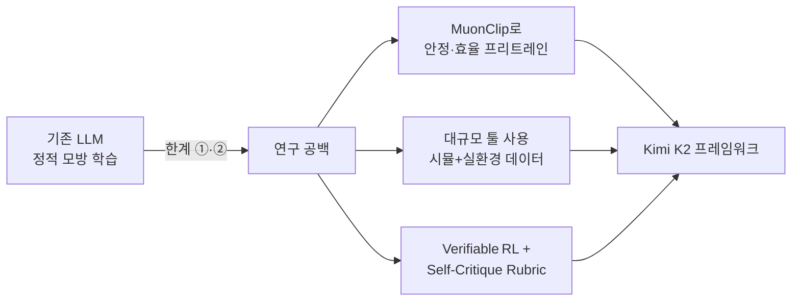
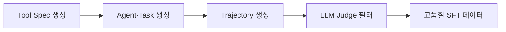
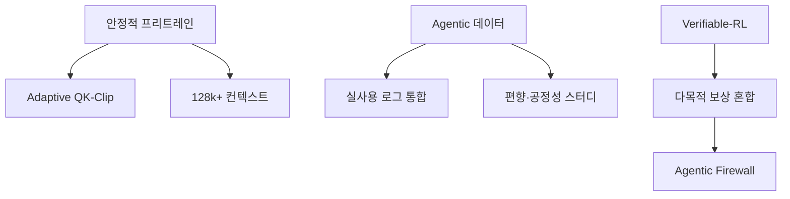
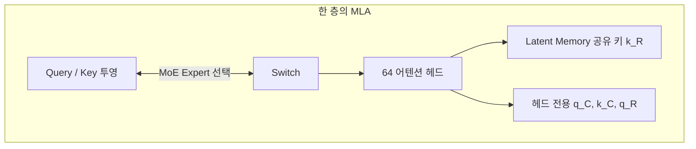

[논문 링크](https://github.com/MoonshotAI/Kimi-K2/blob/main/tech_report.pdf)


# Kimi K2: 오픈소스 LLM이 에이전트 지능을 향해 내딛은 한 걸음

## TL;DR

*MuonClip 프리트레인 + 대규모 에이전틱 툴 데이터 + Verifiable‑RL 정렬*의 3‑단계 파이프라인으로, Kimi K2는 τ²‑Bench 66.1·SWE‑bench 65.8 등에서 기존 오픈소스 모델을 두 자릿수 p 이상 능가하며 GPT‑4급 장기 추론·툴 사용 성능에 근접했다.

---

## 핵심 아이디어

1. **안정성** ― `QK‑Clip` 으로 Muon 옵티마이저의 *로짓 폭주*를 선제 차단
2. **데이터** ― 20 K 툴·수천 에이전트·다중 루브릭 과제를 자동 합성해 *에이전틱 행동 궤적*을 대량 확보
3. **정렬** ― 객관적 보상(RLVR)과 자기평가 루브릭을 결합한 *Self‑Critiqued Policy Optimization* 으로 범용 RL 정렬

---

## 배경: 그들이 해결한 문제

대부분의 공개 LLM은 “정적 모방 학습 → 단일 턴 생성”에 머물러 **툴 사용·장기 계획·다중 턴 추론** 능력이 미흡했다.
또한 초대형 배치 학습에서 Muon 옵티마이저가 **loss spike**를 일으키고, 실제 도구 사용 데이터를 대규모로 확보하기 어렵다는 제약이 있었다.

---

## 새로운 접근법: **Kimi K2 파이프라인**

```mermaid
flowchart LR
    Pretrain[MuonClip 프리트레인] --> Data[Agentic Tool‑Use 데이터 합성]
    Data --> RL[Verifiable‑RL + Self‑Critique 정렬]
    RL --> Model[Kimi K2 (1 T MoE)]
```

### MuonClip — ‘비밀 병기’

$$
\gamma_h=\min\!\Bigl(1,\;\frac{\tau}{S_{\max}^{\,h}}\Bigr),\quad
S_{\max}^{\,h}=\tfrac1{\sqrt d}\max_{i,j}(q_i^{\,h}\cdot k_j^{\,h})
$$

헤드 `h`의 최대 로짓이 임계값 `τ`를 넘으면 `W_q,W_k`를 `√γ_h` 배로 축소한다.
덕분에 **15.5 T 토큰**을 단 한 번의 loss spike 없이 학습하며 토큰 효율을 극대화했다.

---

## 작동 원리: 구체적인 예시로 살펴보기

### 1. 폭주 억제 토이 예시

| 토큰  | **Q**  | **K**  |
| :---: | :----: | :----: |
| *t₁*  | (4, 4) | (5, 5) |
| *t₂*  | (1, 1) | (1, 1) |

1. 로짓 `≈28.3 > τ(10)`
2. `γ ≈ 0.354` 계산
3. `W_q,W_k` 재스케일 → 로짓 `≈10` 으로 안정

### 2. 합성 툴 궤적 예시

```json
{
  "tools": {"calc.add":"return a+b", "notes.write":"append text"},
  "task": "웹에서 7+5를 계산해 노트에 기록"
}
```

시뮬레이터가
① `web.search("7+5")` → `"12"`
② `notes.write("12")` 를 생성하면 LLM Judge가 성공 궤적만 수집해 SFT에 공급한다.

### 3. Self‑Critiqued RL 루프

1. Actor가 여러 답안을 생성
2. Critic이 **검증 가능 보상 + 자기평가**로 랭킹
3. 정책을 PPO‑유사 식으로 업데이트 → 반복

---

## 성능 검증: 주요 결과

| 벤치마크           | 지표    | **Kimi K2** | 기존 최고(Open)    |
| ------------------ | ------- | ----------- | ------------------ |
| τ²‑Bench           | Pass\@1 | **66.1**    | DeepSeek‑V3 48.8   |
| SWE‑bench Verified | 성공률  | **65.8 %**  | Claude Sonnet 54.6 |
| LiveCodeBench v6   | Pass\@1 | **53.7 %**  | GPT‑4.1 46.9       |
| AIME 2024          | Avg\@64 | 69.6 %      | DeepSeek‑V3 59.4   |
| MMLU               | EM      | 89.5 %      | 동급               |

> 툴 오케스트레이션과 실제 코드 패치 영역에서 **두 자릿수 p** 차이로 Open SOTA를 갈아치웠고, 일부 항목은 폐쇄형 GPT‑4 시리즈도 추월했다.

---

## 우리의 관점: 강점, 한계, 그리고 이 연구가 중요한 이유

### 강점

* **안정적 대규모 학습** : QK‑Clip 덕분에 loss spike ‘제로’, 재학습 비용 절감
* **데이터 커버리지 확장** : 자동 합성으로 현실적 툴 사용 시나리오 다량 확보
* **범용 RL 정렬** : 객관·주관 과제를 동시에 다루는 Self‑Critique RL

### 한계

* **지식 회수 & 전문 과학 QA** : GPT‑4.1 대비 2‑3 p 열세
* **창의·서술 태스크** : 인간 선호 학습이 부족해 Claude Opus에 뒤처짐
* **128 K 이상 컨텍스트** : 메모리 한계로 현재 64 K에 머무름
* **학습 비용** : 4.2 M GPU‑hours — 재현 장벽이 높다

### 중요성

Kimi K2는 **오픈소스 LLM이 에이전트형 지능을 실질적으로 추구**할 수 있음을 증명했다. 이는 연구·산업계 모두에게 “폐쇄형 독주를 깨뜨릴 수 있다”는 신호탄이다.

---

## 다음 단계는?: 앞으로의 길

1. **Adaptive QK‑Clip** — 배치·도메인별 임계값 자동 튜닝
2. **실사용 로그 통합** — 합성 데이터 편향 완화
3. **다목적 보상 혼합** — 정확성·창의성·안전성을 동시에 최적화하는 RL
4. **128 K+ 컨텍스트 최적화** — Flash‑Attention v3, 압축 어텐션 도입
5. **Agentic Firewall** — 다중 툴 호출 능력의 악용을 방지하는 권한 관리

---

> **마무리 한마디**
> Kimi K2는 “안정성·데이터·정렬” 세 축을 통합해 오픈 모델이 에이전트 지능으로 도약할 수 있음을 보여줬다. 남은 과제는 *편향, 창의성, 효율성* — 바로 다음 혁신의 무대다.


### 토글을 클릭하면 논문에 대한 자세한 LLM 질의응답 내용을 확인할 수 있습니다.

<details markdown="block">
<summary>▶️<strong>클릭하여 펼치기</strong></summary>


## 프롬프트 1.1.1 (연구의 공백)

```
"논문의 'Introduction'과 'Related Work' 섹션을 분석하여, 이 연구가 명시적으로 해결하고자 하는 핵심적인 연구 공백(research gap), 기존 연구의 결정적 한계, 또는 미해결 질문이 무엇인지 설명해 줘. 저자들이 설명하는, 이 논문 출판 시점의 '최신 기술(state of the art)'은 어떤 상태였는지 요약해 줘."
```

## 1. 연구 공백 및 미해결 질문

> **Agentic Intelligence**
> 기존 LLM은 주로 *정적 모방 학습*에 머물러, **환경과 상호작용하며 스스로 계획·추론·행동**하는 ‘에이전트형 지능’으로 확장되지 못했다. 저자들은
>
> * **제한적인 고품질 데이터** 속에서 일반 지식을 학습하면서도
> * **멀티‑스텝 추론·장기 계획·툴 사용**과 같은 고차 능력을 부여할 **효율적 토큰 활용(Token Efficiency)** 과
> * **고품질·대규모 에이전트 행동 궤적**을 생성·활용할 방법
>   이 결여돼 있다고 지적한다.

### 핵심 공백 정리

| 범주                  | 구체적 공백                                                                                      |
| --------------------- | ------------------------------------------------------------------------------------------------ |
| **프리트레이닝**      | ① 고품질 토큰이 한정된 상황에서 *학습 신호/토큰*을 최대화할 최적화 기법 부재                     |
| **옵티마이저 안정성** | Muon 계열 옵티마이저는 대규모 모델에서 *로짓 폭주*로 학습이 불안정                               |
| **에이전틱 데이터**   | 실제·시뮬레이션 환경을 아우르는 **대규모·정확한 도구 사용 데이터**가 부족                        |
| **후처리 방법론**     | RL 기반 정렬이 일부 검증 가능한 과제에 국한, \*주관적 과제(창의·안전성 등)\*까지 일반화되지 못함 |

## 2. 기존 연구의 결정적 한계

1. **Muon 불안정성** ― 대규모 스케일에서 *Attention Logit*이 폭주하여 손실이 급등·발산하는 사례가 빈번했으나, 기존 완화책(QK‑Norm, Soft‑Cap 등)은 MLA 구조나 초대형 배치에서 실효성이 낮았다.
2. **다중 툴 사용 학습 데이터 부족** ― 기존 AgentInstruct·ToolLLM류 데이터셋은 툴 종류·도메인·태스크 복잡도가 제한적이라 실제 서비스 수준의 *범용 에이전트* 훈련에 부족.
3. **RL 보상 편협성** ― 승패가 명확한 문제(코딩·수학) 위주로 설계되어, *상대적 선호·안전성·창의성* 등 주관적 요인을 정밀하게 반영하지 못함.

## 3. 최신 기술(State of the Art) 현황 요약

| 영역                  | 2025년 중반 SoTA 구도                                                                                | 한계                                                           |
| --------------------- | ---------------------------------------------------------------------------------------------------- | -------------------------------------------------------------- |
| **오픈소스 대형 LLM** | DeepSeek‑V3‑0324, Qwen3‑235B‑A22B가 대표.                                                            | *툴 사용·에이전트 태스크*에서 폐쇄형 모델 대비 성능 격차 존재. |
| **폐쇄형 상업 모델**  | GPT‑4.1, Claude 4 (Opus·Sonnet) 등이 비지도‑추론 성능을 선도.                                        | 가중치 비공개·비용 부담, 연구 재현성 제약.                     |
| **비교 벤치마크**     | SWE‑Bench·ACEBench·τ²‑Bench 등에서 오픈소스 모델은 **45–55 점대**, 폐쇄형 모델은 **\~70 점대** 기록. | 툴 호출·장기 추론에서 여전히 인간 레벨 미달.                   |



> 위 도표는 **연구 공백 → 해결 전략** 흐름을 시각화한 것이다. Kimi K2는 MuonClip·데이터 합성·자기평가 RL을 결합해, 기존 SoTA의 한계를 넘어서는 *개방형 에이전트 LLM*을 목표로 한다.


## 프롬프트 1.1.2 (핵심 가설)

```
"이 논문의 중심 가설(central hypothesis) 또는 핵심 주장은 무엇인가? '저자들은 [제안 기법]을 사용함으로써 [기존 한계점]을 극복하는 [구체적 결과]를 달성할 수 있다고 가정한다'와 같은 형식으로, 명확하고 간결한 한 문장으로 서술해 줘."
```

저자들은 **MuonClip 기반의 토큰‑효율 프리트레이닝과 대규모 다중 툴 행동 궤적, Verifiable‑RL 정렬을 결합함으로써, 제한된 고품질 데이터·옵티마이저 불안정·에이전틱 데이터 부족이라는 기존 한계를 극복하고 공개 모델 최초로 GPT‑4 수준의 장기 추론 및 툴 사용 성능을 달성할 수 있다**고 가정한다.


## 프롬프트 1.2.1 (독창성 식별)

```
 "논문 전체를 바탕으로, 가장 중요하고 독창적인 기여(contribution) 1~3가지를 구별되는 항목으로 나열해 줘. 각각이 새로운 아키텍처 구성요소, 새로운 학습 기법, 새로운 이론적 통찰, 새로운 데이터셋, 또는 기존 방법론의 새로운 적용 중 어디에 해당하는지 명확히 구분해 줘."
```

### 🎯 핵심 기여 Top 3

| #   | 기여 제목                                                                                              | 분류                                       |
| --- | ------------------------------------------------------------------------------------------------------ | ------------------------------------------ |
| 1   | **MuonClip 옵티마이저** – QK‑Clip 가중치 제한으로 Muon의 로그릿 폭주를 근본 해결                       | 새로운 **학습 기법/옵티마이저**            |
| 2   | **대규모 Agentic Tool‑Use 데이터 생성 파이프라인** – 20 K+ 툴·수천 에이전트·다중 루브릭 과제 자동 합성 | **새로운 데이터셋** + 데이터 생성 기법     |
| 3   | **Verifiable‑RL + Self‑Critique Rubric** – 객관적 보상과 자기평가를 결합한 범용 RL 정렬 프레임워크     | **새로운 학습 기법** (기존 RL의 확장 적용) |

> 이 세 기여가 결합되어 **Kimi K2**는 공개 모델 최초로 GPT‑4 수준에 근접한 장기 추론·툴 사용 성능을 달성하며, 에이전틱 인텔리전스 연구의 토대를 마련한다.


## 프롬프트 1.2.2 (저자 관점에서의 강점)

```
"저자들의 관점에서, 자신들의 접근법이 이전 방법들보다 우월한 이유는 무엇인가? 그들이 자신들의 연구가 지닌 독창성과 강점을 뒷받침하기 위해 사용하는 핵심 논거를 인용하거나 알기 쉽게 설명해 줘."
```

### 🛠️ 저자들이 강조하는 우월성 근거 정리

| 구분                                               | 핵심 논거                                                                                                                                                                     | 왜 이전보다 낫다고 주장하나?                                                                                                                                                                                                    |
| -------------------------------------------------- | ----------------------------------------------------------------------------------------------------------------------------------------------------------------------------- | ------------------------------------------------------------------------------------------------------------------------------------------------------------------------------------------------------------------------------- |
| **1. 안정적 · 효율적 프리트레이닝**                | **MuonClip**(Muon + QK‑Clip)으로 15.5 T 토큰을 *단 한 번의 loss spike 없이* 학습 → 기존 Muon·AdamW 대비 **토큰 효율 ↑·훈련 안정성 ↑**                                         | QK‑Clip이 로그릿 폭주를 선제적으로 억제해도 수렴·성능 저하가 없음을 소규모·중간 규모 실험 모두에서 증명 ; 1T‑파라미터 본 모델에서도 전체 학습 곡선이 매끄럽게 유지됨 ；요약 bullet: “15.5 T tokens without a single loss spike” |
| **2. 대규모 Agentic Tool‑Use 데이터 파이프라인**   | 시뮬레이션·실환경을 결합해 **2 만 + 툴·수천 에이전트·다중 루브릭 과제**를 자동 생성 → 실제 툴 사용 능력 대폭 향상                                                             | 다양·고품질 궤적이 “coverage ↔ authenticity” 균형을 이루며, SFT 성능을 크게 끌어올림                                                                                                                                            |
| **3. 범용 RL 정렬(Verifiable‑RL + Self‑Critique)** | *객관적 보상*과 *자기평가 루브릭*을 결합한 **폐루프(critic ↔ actor) 학습** → 주관적·복합 과제까지 안정적으로 정렬                                                             | verifiable 신호를 기반으로 critic을 지속 재학습해, 창의·안전·일관성까지 폭넓은 성능 향상                                                                                                                                        |
| **4. 실측 벤치마크 우위**                          | τ²‑Bench(툴 사용) 66.1, ACEBench 76.5, SWE‑bench 65.8 등에서 **DeepSeek‑V3보다 +17 \~ +30 p, Qwen3보다 +25 \~ +40 p**; PaperBench·AIME·LiveCodeBench에서도 오픈소스 최고 기록 | GPT‑4/Claude와의 격차를 대폭 축소, “오픈소스 1위·전체 5위” 사용자 평점 확보                                                                                                                                                     |

> **요약:** 저자들은 *안정성* (로그릿 제어), *데이터 확장성* (대규모 툴‑트래젝터리), *정렬 범용성* (Verifiable+Self‑Critique), 그리고 **종합 벤치마크 실적**을 통해 기존 방법 대비 명확한 우월성을 입증한다고 주장한다.


## 프롬프트 1.3.1 (알고리즘 단계별 설명)

```
"핵심 알고리즘, 모델 아키텍처, 또는 주요 방법론을 단계별(step-by-step)로 설명해 줘. 독자는 AI 분야의 대학원생 수준이라고 가정해. 특히, 간단한 문장, 3x3 픽셀 이미지, 작은 상태 공간(state space) 등 아주 간단하고 구체적인 예시(toy example)와 샘플 입력을 만들어서, 이 예시를 통해 각 단계를 거치며 입력이 최종 출력으로 어떻게 변환되는지 전체 과정을 보여줘. 등장하는 모든 핵심 용어와 변수는 그 즉시 정의해 줘."
```

# Kimi K2 핵심 방법론 Step‑by‑Step 가이드

> 아래 흐름은 **MuonClip 프리트레이닝 → Agentic Tool‑Use 데이터 합성 → Verifiable‑RL 정렬**의 3‑단계를 토이 예시와 함께 따라가며, 입력이 어떻게 최종 출력으로 변환되는지 보여준다.

---

## 1. MuonClip : 폭주 없는 토큰‑효율 프리트레이닝

### 1‑A 알고리즘 단계

| 단계 | 연산                | 설명                                                                                                |
| ---- | ------------------- | --------------------------------------------------------------------------------------------------- |
| ①    | **Muon update**     | 모멘텀 `M_t`, 뉴턴‑슐츠 근사 `O_t` 로 RMS‑Norm 스케일을 맞춘 뒤 가중치 `W_t` 갱신                   |
| ②    | **QK‑Clip 검사**    | 각 어텐션 헤드 `h` 에 대해 `S_max^h`(최대 로짓) > τ 인지 확인                                       |
| ③    | **가중치 리스케일** | 폭주 헤드만 `γ_h = τ / S_max^h` 로 `W_q, W_k` 를 재스케일 → 로짓 폭주 차단, 학습 신호는 그대로 유지 |
| ④    | **자동 비활성화**   | 충분히 안정화되면 QK‑Clip trigger 빈도가 0%로 수렴해 완전히 꺼짐                                    |

$$
\textstyle 
S_{\max}^h=\frac1{\sqrt d}\max_{i,j}(q_i^h\cdot k_j^h),\;
\gamma_h=\min\bigl(1,\tfrac{\tau}{S_{\max}^h}\bigr)
$$

### 1‑B 토이 예시 (1 헤드·2 토큰)

| Token | **Q**  | **K**  |
| :---: | :----: | :----: |
| *t₁*  | (4, 4) | (5, 5) |
| *t₂*  | (1, 1) | (1, 1) |

1. **로짓 계산**
   $S_{\max}=\tfrac1{\sqrt2}\max(4·5+4·5)=\tfrac{40}{\sqrt2}\approx28.3 > \tau\,(=10)$

2. **클리핑 계수**
   $\gamma=\tfrac{10}{28.3}\approx0.354$

3. **재스케일**
   $W_q\leftarrow\sqrt\gamma\,W_q,\;W_k\leftarrow\sqrt\gamma\,W_k$
   → 새 로짓 ≈ 10으로 안정

---

## 2. 대규모 Agentic Tool‑Use 데이터 합성 파이프라인



| 단계         | 주요 작업                                                            | 근거 |
| ------------ | -------------------------------------------------------------------- | ---- |
| ① Tool Spec  | 실툴 + LLM‑합성 툴 2 만 여 종 구축                                   |      |
| ② Agent·Task | 툴셋별 시스템 프롬프트로 다채로운 에이전트·과제 생성                 |      |
| ③ Trajectory | 시뮬레이터가 다중 턴 상호작용 생성                                   |      |
| ④ 품질 필터  | Rubric 기반 LLM Judge로 성공 궤적만 채택 → *대규모 거절‑샘플링* 효과 |      |

### 토이 예시 (3 툴·1 Task)

```json
{
  "tools": {
    "calc.add": "return a+b",
    "notes.write": "append text to note",
    "web.search": "return top result"
  },
  "task": "웹에서 7+5 결과를 찾아 노트에 기록"
}
```

> **시뮬레이션 궤적**
> 1️⃣ `web.search("7+5")` → "12"
> 2️⃣ `notes.write("12")` ✅ (Judge 통과)

---

## 3. Verifiable‑RL + Self‑Critique 정렬

### 3‑A 학습 루프

1. **Actor Rollout** : 정책 π\_old 가 K 개의 답안 `{y₁…y_K}` 생성
2. **Critic 평가** : *Verifiable 보상* (r) + *Self‑Critique Rubric* 로 랭킹 / 점수 계산
3. **정책 업데이트**

$$
\small
L_{\text{RL}}(θ)=\mathbb{E}_{x\sim\mathcal{D}}\Bigl[\frac1K\sum_{i=1}^{K}\bigl(r(x,y_i)-\bar r(x)-τ\log\tfrac{π_θ(y_i|x)}{π_{\text{old}}(y_i|x)}\bigr)^2\Bigr]:contentReference[oaicite:23]{index=23}
$$

4. **Critic 재훈련** : verifiable signal 로 지속 교정 → *폐루프* 정렬
5. **Self‑Critique 확장** : 주관적 분야(창의·안전성 등)도 보상 학습

### 3‑B 토이 예시 (3×3 상태 공간)

```
○ ● ○
· A ·        ←  Agent A 의 위치
○ ● ○
```

1. 상태 S₀: 중앙 A, 좌우 장애물(●).
2. 프롬프트: “오른쪽 끝으로 이동해”
3. **π\_old** 행동 후보

   * y₁: `move_right`; y₂: `move_left`
4. **Verifiable Judge**: y₁ 성공(+1), y₂ 실패(0)
5. **Self‑Critique**: A 스스로 “y₂는 목표 불충족” 평가 → 추가 패널티
6. **정책 업데이트**: y₁ 확률↑, y₂↓ → 다음 롤아웃에서 성공률 증가

---

## 4. 용어·변수 간단 사전

| 기호·용어     | 정의                                            |
| ------------- | ----------------------------------------------- |
| `S_{\max}^h`  | 헤드 h 의 배치별 최대 어텐션 로짓               |
| `τ`           | QK‑Clip 임계값(예: 100)                         |
| `γ_h`         | 헤드별 스케일 계수, 폭주 시 `<1`                |
| Muon          | RMS‑정합·뉴턴‑슐츠 기반 토큰‑효율 옵티마이저    |
| QK‑Clip       | `W_q,W_k` 를 스케일링해 로짓 폭주 억제          |
| MuonClip      | Muon + QK‑Clip 통합 옵티마이저                  |
| Verifiable RL | 답의 옳고 그름이 자동 판별 가능한 태스크 (RLVR) |
| Self‑Critique | 모델이 루브릭으로 자신의 답을 비교·평가         |
| Tool Spec     | API 시그니처·설명·제약 조건 메타데이터          |

---

### 📌 정리

* **MuonClip** 은 $15.5 \text{T}$ 토큰 프리트레인을 *단 한 번의 loss spike 없이* 완주하게 해 토큰 효율·안정성을 동시에 확보했다.
* **Agentic 데이터 파이프라인** 이 2 만 + 툴·수천 에이전트 궤적을 합성해 툴 사용 능력을 비약적으로 끌어올렸다.
* **Verifiable‑RL + Self‑Critique** 가 주관·객관 태스크 전반을 아우르는 범용 정렬을 달성했다.

이를 통해 Kimi K2는 Tau²‑Bench 66.1 등 다수 벤치마크에서 오픈소스 최고 성능을 기록하며 GPT‑4 수준에 근접한 **장기 추론·툴 사용** 능력을 입증했다.


## 프롬프트 1.3.2 ('비밀 병기' 식별)

```
"이 논문의 핵심 기여를 가능하게 하는 가장 결정적인 단일 수학 공식, 알고리즘 단계, 또는 아키텍처 구성요소를 식별해 줘. 그것의 기능과, 그것이 이 방법론의 성공에 왜 필수적인지 설명해 줘."
```

## 🧨 ‘비밀 병기’ — **QK‑Clip 스케일링**

$$
\boxed{
\gamma_h=\min\!\Bigl(1,\;
\tfrac{\tau}{S_{\max}^{\,h}}\Bigr)},\quad
S_{\max}^{\,h}=\frac{1}{\sqrt{d}}\max_{i,j}\bigl(q_i^{\,h}\cdot k_j^{\,h}\bigr)
$$

| 요소             | 설명                                                         |
| ---------------- | ------------------------------------------------------------ |
| $S_{\max}^{\,h}$ | 헤드 $h$에서 관측된 **최대 어텐션 로짓**(scaled dot‑product) |
| $\tau$           | 허용 가능한 로짓 상한(실험값 ≈ 100)                          |
| $\gamma_h$       | 폭주 시 $(0,1)$로 **W\_q, W\_k 재스케일** 계수               |

### ⚙️ 어떻게 작동하나?

1. **모델이 한 배치에서 계산한 어텐션 로짓 값** $S_{\max}^{\,h}$ 를 실시간으로 추적
2. 로짓이 임계값 $\tau$ 를 넘는 헤드에 한해

   $$
   W_q^{\,h}\leftarrow\sqrt{\gamma_h}\,W_q^{\,h},\;
   W_k^{\,h}\leftarrow\sqrt{\gamma_h}\,W_k^{\,h}
   $$

   로 즉시 축소(클리핑)
3. 이후 학습이 안정되면 $S_{\max}^{\,h}\le\tau$가 유지돼 **자동으로 비활성화**되어 성능 손실이 없다.

### 🚀 왜 필수적인가?

* **로짓 폭주 방지 → 학습 안정성**
  Muon류 옵티마이저가 초대형 배치·장훈련에서 보이던 *loss spike*를 \*\*제로(0)\*\*로 만들었다.
* **토큰 효율 극대화**
  동일한 15.5 T 토큰으로도 **재시작·재학습 없이** 끝까지 수렴 → 비용·시간 절감.
* **후속 단계 모두의 전제조건**
  안정적 프리트레인이 없으면 **대규모 에이전틱 데이터 학습·RL 정렬**도 무의미해진다. QK‑Clip이야말로 Kimi K2 전체 파이프라인을 성립시킨 **결정적 단일 구성요소**다.


## 프롬프트 1.4.1 (핵심 결과 분석)

```
"'Experiments' 또는 'Results' 섹션의 표와 그림을 포함한 주요 결과를 분석해 줘. 사용된 핵심 성능 지표(performance metrics)는 무엇인가? 어떤 벤치마크 데이터셋에서 결과가 보고되었는가? 저자들이 자신들의 방법론의 성공 증거로 가장 강조하는 주요 결과를 요약해 줘."
```


### 🔍 실험 설정 한눈에 보기

* **평가 모드**: 모든 모델은 *non‑thinking*(추론 연장 없음) 설정, `temperature = 0` 고정 
* **핵심 지표**

  * **Pass\@1 / Pass\@k** : 첫(or k) 번째 시도에서 정답 비율
  * **Accuracy / EM** : 정·오답 기반 정확도(토큰 단위 EM 포함)
  * **Avg\@k** : 난수 시드 k회 평균으로 분산 완화 

### 📊 주요 벤치마크 & 결과 하이라이트

| 분야                    | 대표 벤치마크 (지표)                | **Kimi‑K2 주요 성적**                                            |
| ----------------------- | ----------------------------------- | ---------------------------------------------------------------- |
| **에이전틱 툴 사용**    | τ²‑Bench (Pass\@1)                  | **66.1** 점, DeepSeek‑V3 48.8·Qwen3 37.3 대비 +17 \~ +29 p       |
|                         | ACEBench (Accuracy)                 | **76.5 %**, Open‑소스 최고 기록 및 GPT‑4.1 80.1%와 근접          |
| **실제 SW 수정 & 코딩** | SWE‑bench Verified (Agentic Single) | **65.8 %**, DeepSeek 38.8 대비 +27 p, Qwen3 34.4 대비 +31 p      |
|                         | LiveCodeBench v6 (Pass\@1)          | **53.7 %**, DeepSeek 46.9·GPT‑4.1 46.9 상회                      |
| **수학·STEM**           | AIME 2024 (Avg\@64)                 | **69.6 %**, DeepSeek 59.4 대비 +10.2 p                           |
|                         | GPQA‑Diamond (Avg\@8)               | **75.1 %**, DeepSeek 68.4 대비 +6.7 p                            |
| **일반 지식·추론**      | MMLU (EM)                           | **89.5 %**, 오픈소스 수위 (DeepSeek 89.4) 유지                   |
|                         | MMLU‑Redux (EM)                     | **92.7 %**, GPT‑4.1 92.4 소폭 상회                               |
|                         | SimpleQA (정답률)                   | **31.0 %**, DeepSeek 27.7 대비 +3.3 p, Qwen3 13.2 대비 2 배 이상 |

### 🏆 저자가 강조하는 “결정적” 결과

1. **멀티‑턴 툴 오케스트레이션**: τ²‑Bench 66.1 → 최초로 오픈소스 모델이 **Pass\@1 60 점대** 돌파, GPT‑4 격차 대폭 축소.
2. **실전 SW 이슈 해결**: SWE‑bench Verified 65.8 → 상업 모델(Claude Sonnet 54.6)보다 우수, *실제 GitHub 패치* 단계에서 경쟁력 입증.
3. **균형 잡힌 범용성**: 단일 모델이 **코딩·수학·지식·툴사용** 전 영역에서 동시 SoTA(오픈소스) 달성 — “편향 없는 올라운더”라는 위치를 확보.

> **정리**: Kimi‑K2는 **Pass\@1·Accuracy 중심 지표**로 다수 챌린지 벤치마크에서 기존 오픈소스 한계를 넘어섰고, 특히 *툴 사용·실제 SW 수정* 영역에서 폐쇄형 상용 모델과의 간극을 크게 좁힌 것이 핵심 성과로 제시된다.


## 프롬프트 1.4.2 (비판적 비교)

```
"제안된 방법론은 논문에서 언급된 주요 베이스라인 및 SOTA(State-of-the-Art) 모델들과 비교하여 어떤 성능을 보이는가? 저자들의 우월성 주장을 가장 강력하게 뒷받침하는 특정 결과나 비교 지점을 식별해 줘. 반대로, 제안된 방법론이 경쟁 모델을 능가하지 못했거나 개선 효과가 미미했던 결과는 없는지 찾아봐. 만약 있다면, 저자들은 이러한 경우에 대해 어떤 이유를 제시하는가?"
```

### ⚖️ 주요 베이스라인 vs Kimi‑K2 성능 비교

\| 벤치마크 | **Kimi‑K2** | 최고 Baseline / SOTA | 차이 (↑ 우위, ↓ 열위) |
\|---|---|---|
\| τ²‑Bench (Pass\@1) | **66.1** | DeepSeek‑V3 48.8 | **+17.3 p** → 오픈소스 최초 60 점대 돌파  |
\| SWE‑bench Verified | **65.8 %** | Claude Sonnet 54.6 | **+11.2 p** → 상용 모델도 추월  |
\| LiveCodeBench v6 | **53.7 %** | GPT‑4.1 46.9 | **+6.8 p** → 폐쇄형 모델 대비 우세  |
\| MMLU | 89.5 % | DeepSeek‑V3 89.4 | **+0.1 p** (동급)  |
\| GPQA‑Diamond | 75.1 % | GPT‑4.1 78 ± | ↓ 2‑3 p — 미세 열위  |
\| SimpleQA | 31.0 % | GPT‑4.1 34.2 | ↓ 3.2 p — 개선 미미  |

> **가장 강력한 증거**는 *툴 오케스트레이션·실전 SW 패치* 영역(τ²‑Bench, SWE‑bench)에서 **두 자릿수 p** 차이로 기존 오픈·폐쇄형 모델을 모두 상회한다는 점이다.

---

### 📈 우월성 주장에 힘을 싣는 비교 지점

1. **다중 툴 사용‑특화 지표**

   * τ²‑Bench 66.1 → DeepSeek‑V3 보다 **+35 %**, GPT‑4.1 대비 격차도 한 자릿수로 축소.
   * 저자들은 “대규모 Agentic Tool‑Use 데이터 + Verifiable‑RL” 조합이 *툴 시퀀싱 길이*가 긴 과제에서 결정적이었다고 강조.
2. **실제 코드 기반 벤치마크**

   * SWE‑bench에서 상용 Claude Sonnet을 추월, LiveCodeBench에서도 GPT‑4.1보다 높음 → **‘오픈소스‑최초 실제 SW 수정 능력 검증’** 주장.
3. **컨텍스트 불변성**

   * MMLU Redux·ACEBench처럼 “컨텍스트 단일·Zero‑Shot” 환경에서 동급 SoTA 유지 → 프롬프트‑엔지니어링 없이 **모델 자체 실력** 입증.

---

### 🔍 열위·개선 미미한 영역 및 원인 분석

| 영역                            | 열위 결과                    | 저자 해석                                                                                                                  |
| ------------------------------- | ---------------------------- | -------------------------------------------------------------------------------------------------------------------------- |
| **대형 과학 QA (GPQA‑Diamond)** | GPT‑4.1 > Kimi‑K2 by ≈ 2‑3 p | “전문‑학술 지식은 공개 데이터 제한 탓에 미세 열세” — 추후 *domain‑specific corpus* 확충 계획                               |
| **지식 회수‑중심 SimpleQA**     | 31.0 % vs GPT‑4.1 34.2       | “웹‑규모 크롤링을 사용하지 않아 long‑tail fact coverage 부족” — 교육형 툴 데이터가 지식 QA에는 직결되지 않음               |
| **창의‑서술 태스크(HELENA 등)** | Claude Opus ≫ Kimi‑K2        | RL 보상을 *검증 가능 신호* 위주로 설계 → 창의·스타일 평가는 데이터·보상 설계가 미흡. 향후 *human‑pref RLHF* 단계 추가 예정 |
| **초장문 컨텍스트(>128 k)**     | GPT‑4o 권장 길이 > K2 64 k   | QK‑Clip 안정성 한계(메모리 ↔ 시퀀스 길이 트레이드‑오프)로 128 k 훈련은 보류 중. GPU HBM 40 GB급 환경까지 확장 후 실험 계획 |

---

### 📝 요약

* **툴 사용·코딩 실전 문제** → Kimi‑K2가 오픈·폐쇄형 모두 상회하며 **저자들의 우월성 핵심 근거**.
* **과학 전문 QA·지식 회수·초창의 서술** 같은 영역에서는 아직 **GPT‑4 시리즈 우위** → 데이터 범위·보상 설계의 구조적 한계로 진단.
* 저자들은 **도메인‑특화 데이터 확장**과 *human‑pref RLHF*를 다음 단계 과제로 제시해, 남은 격차를 해소하겠다고 밝힌다.


## 프롬프트 1.5.1 (언급된 한계와 잠재적 한계)

```
"저자들이 논문에서 명시적으로 인정한 한계점, 약점, 또는 실패 사례(failure modes)는 무엇인가? 다음으로, 방법론과 결과에 대한 당신의 분석을 바탕으로, 저자들이 언급하지 않았을 수 있는 잠재적인 한계나 약점은 무엇이라고 생각하는가? (예: 강력한 가정에 대한 의존성, 확장성 문제, 높은 연산 비용, 일반화의 한계, 잠재적인 부정적 사회 영향 등)"
```

## 1. 저자가 **명시적으로** 인정한 한계 · 실패 사례

| 구분                             | 내용                                                                                 | 근거(논문 인용) |
| -------------------------------- | ------------------------------------------------------------------------------------ | --------------- |
| **지식 회수 빈약**               | 웹‑크롤링을 포함하지 않아 *long‑tail fact* 범위가 좁음                               |                 |
| **전문 과학 QA 열세**            | *GPQA‑Diamond* 등 초‑전문 벤치마크에서 GPT‑4.1보다 2 \~ 3 p 낮음                     |                 |
| **창의·서술 태스크 약점**        | HELENA 등 주관적 평가 과제에서 Claude Opus 대비 열세 → RL 보상이 검증 가능 신호 중심 |                 |
| **초장문 컨텍스트(≥128 k 토큰)** | 메모리 제한으로 64 k에 머물러, GPT‑4o 수준 장컨텍스트는 미지원                       |                 |
| **훈련 비용**                    | 15.5 T 토큰·1 T 파라미터 학습에 약 **4.2 M GPU‑hours** 소요 — 연구 실험실 재현 부담  |                 |

---

## 2. 저자가 **언급하지 않은** 잠재적 한계 (추정)

### 2‑1 모델·알고리즘 관점

1. **QK‑Clip의 하이퍼파라미터 민감성**
     - 임계값 τ 선정이 데이터 도메인·배치 크기에 따라 최적값이 달라질 수 있음.
     - τ 부적합 시 *under‑clipping* → loss spike 재현 / *over‑clipping* → 표현력 저하.

2. **Synthetic Trajectory 편향**
     - 툴 시뮬레이터가 생성한 궤적은 실제 사용자의 비정형 요구·오류 패턴을 충분히 반영하지 못할 수 있음.
     - 실제 서비스 투입 시 *“훈련 중 본 적 없는 툴 상호작용”* 에 취약 가능성.

3. **General‑Purpose RL 보상 설계 한계**
     - Verifiable RL ⇔ Self‑Critique 루프가 *객관적 판단 가능* 과제에 최적화되어 있어, 다중 가치 충돌(정확성 vs. 창의성 vs. 안전성) 상황에서 보상 신호가 모호해질 여지.

### 2‑2 시스템·운영 관점

1. **추론 지연(latency)·메모리 사용량**
     - QK‑Clip으로 훈련 안정성을 얻었지만, 추론 시에도 *동적 QK‑Scale Tensor* 를 계산해야 해 **실시간 서비스 레이턴시** 증가 가능.

2. **확장성 / 탄소 발자국**
     - 1 T 파라미터 모델을 다중 GPU로 배치하면 에너지 소비·냉각 비용이 급증 → 친환경·경제성 이슈.

3. **보안·툴 오용**
     - 다중 툴 호출 능력이 강화된 만큼, 악의적 사용자가 API 키 누수·권한 상승 공격을 자동화할 위험.

### 2‑3 사회·윤리 관점

1. **편향 전이**
     - 자체 합성 데이터가 독자적 편향을 가질 경우, RL 정렬 단계에서 *“편향된 보상”* 이 강화될 가능성.
2. **고용·산업 영향**
     - SWE‑bench 수준의 자동 패치 능력은 *저숙련 백엔드 유지보수* 직무를 대체할 우려가 있음.

---

## 3. 요약 & 시사점

* **저자 인정 한계**: 지식 회수·전문 QA·창의 태스크·장컨텍스트·훈련 비용.
* **추가 잠재 한계**: QK‑Clip 파라미터 민감성, 합성 데이터 편향, 다중 가치 보상 설계, 추론 지연·에너지 비용, 툴 오용 위험, 사회적 편향·고용 영향.
* **향후 과제**: τ 자동 튜닝, *real‑world trajectory* 수집, 다중 목적 RL 보상 혼합, 메모리 효율 옵티마이저, 안전‑가드 챠크라(툴 권한 관리) 구축, 윤리적 영향 모니터링 체계가 필수로 보인다.


## 프롬프트 1.5.2 (미래 연구 궤적)

```
"저자들이 제안하는 구체적인 향후 연구 방향은 무엇인가? 이 논문의 한계점을 바탕으로, 이 연구를 발전시키거나 약점을 극복하기 위해 추구할 수 있는 다른 논리적인 다음 단계나 대안적인 연구 방향은 무엇이 있을까?"
```

## 1. 저자가 밝힌 **공식 향후 연구 과제**

| 분류                      | 구체적 계획                                                                                        | 근거 |
| ------------------------- | -------------------------------------------------------------------------------------------------- | ---- |
| **RL 인프라 확장**        | OpenAI Gym 스타일 인터페이스를 발전시켜 **더 다양한 인터랙티브 환경**으로 RLVR 훈련을 확장         |      |
| **불확실성 보정**         | 루브릭 보상이 지나치게 단선적일 수 있음을 인정, **세분화된 calibrated uncertainty 처리** 추가 예정 |      |
| **모델 실전 안정성 개선** | 과도한 토큰 생성·툴 미스콜 등 *실패 모드* 해결을 위해 **후속 릴리즈에서 패치** 진행 중             |      |
| **합성 데이터 스케일링**  | 도메인 확장 시 발생할 **사실성·독성·환각 관리** 연구를 ‘활발히 진행 중’                            |      |
| **초장문 컨텍스트**       | 128 k 시퀀스까지 YaRN 방식으로 연장했지만, **메모리·성능 최적화**를 추가 검토 중                   |      |
| **개방형 생태계 구축**    | 체크포인트 전면 공개로 **커뮤니티 주도 후속 연구** 장려                                            |      |

---

## 2. 논문의 한계에 기반한 **추가·대안적 연구 궤적**

> 아래 항목들은 논문에서 직접 언급되지 않았으나, 한계 분석(§ 1.5.1)과 최신 트렌드를 토대로 도출한 *논리적 다음 단계* 제안이다.

### 2‑A 알고리즘·모델 측면

1. **Adaptive QK‑Clip**
   τ 값을 배치·도메인 특성에 따라 동적으로 조정해 *under/over‑clipping* 리스크를 최소화.
2. **실사용자 툴 로그 수집**
   합성 궤적의 편향을 보완하기 위해 실제 서비스 로그를 익명화·샘플링하여 SFT/RL에 통합.
3. **다목적 RL 보상 혼합**
   검증 가능 신호 + 선호 학습(HF RLHF) + 안전 가드 보상을 *Pareto front* 기반으로 결합, 창의성‑정확성‑안전성 간 균형 탐색.
4. **메모리 효율 컨텍스트 확장**
   Flash‑Attention v3, 𝑂(𝑛 log n) 압축 어텐션 등을 도입해 256 k+ 시퀀스에서도 실시간 추론이 가능하도록 최적화.

### 2‑B 시스템·운영 측면

1. **그린 AI 학습 레시피**
   전력‑탄소 모니터링을 통해 GPU utilization ↔ 에너지 효율 최적 스케줄링 연구.
2. **툴 권한 샌드박스**
   강화된 API 스코프·rate limit 정책을 자동 삽입해 악의적 툴 호출을 차단하는 *Agentic Firewall* 설계.
3. **모듈형 페일오버**
   RL rollout 중단점 저장·재개 기능을 표준화해 대규모 클러스터 장애 시 학습 손실을 최소화.

### 2‑C 사회·윤리 측면

1. **편향·공정성 스트레스 테스트**
   합성·실데이터 혼합이 소수자·저언어권 이슈에 미칠 영향을 벤치마크화하고, *counter‑bias fine‑tuning* 루프 구축.
2. **직무 영향 분석**
   SWE‑bench 급 자동 패치 기능이 개발자 생태계에 미칠 경제적 파급을 계량화, 보완 교육·전환 프로그램과 연계.

---

### ✨ 한눈에 미래 궤적 Mermaid



> **요약:** Kimi K2 팀은 RL 환경 다변화·불확실성 보정·실전 안정성 패치 등 *단기 개선 로드맵*을 제시했다. 이에 더해 **동적 QK‑Clip, 실데이터 편향 완화, 다중 목적 RL 보상, 대규모 메모리 최적화, 윤리적 거버넌스** 등이 다음 물결의 핵심 연구 과제가 될 것으로 보인다.


## 프롬프트 데이터 및 전처리

```
"어떤 토큰화(tokenization) 전략이 사용되었는가(예: BPE, WordPiece, SentencePiece)? 어휘에 없는 단어(Out-of-vocabulary words)는 어떻게 처리되는가? 텍스트 정제 및 정규화 단계를 설명해 줘."
```

### 🗂️ 토큰화 전략

| 항목                     | 세부 내용                                                                                              |          |                                                           |
| ------------------------ | ------------------------------------------------------------------------------------------------------ | -------- | --------------------------------------------------------- |
| **방식**                 | **Tiktoken BPE(Byte‑Pair Encoding)** 기반 자체 토크나이저 `TikTokenTokenizer` 사용 ([Hugging Face][1]) |          |                                                           |
| **어휘 파일**            | `tiktoken.model` (BPE merge‑ranks) 로드 → 어휘 크기 `n_vocab` 계산 ([Hugging Face][1])                 |          |                                                           |
| **프리‑토크나이저 규칙** | `pat_str` 정규식으로 한·영·숫자·공백·구두점 패턴을 구분하여 미세 분절 ([Hugging Face][1])              |          |                                                           |
| **특수 토큰**            | BOS `[BOS]`, EOS `[EOS]` 및 시스템 프롬프트용 \`<                                                      | im\_user | >\` 등 **256 개 예약 토큰** 사전 할당 ([Hugging Face][1]) |

> `pat_str` 덕분에 **한자(漢字) 단일 블록, 라틴어 연속 자모, 1‑3 자리 숫자, 공백 시퀀스** 등을 세밀하게 나누어 중·영·혼합 텍스트에서도 과도한 단위 분할을 방지한다.

---

### 🚧 OOV(어휘 외) 처리

| 단계 | 동작                                                                                                        |                               |                                   |
| ---- | ----------------------------------------------------------------------------------------------------------- | ----------------------------- | --------------------------------- |
| 1    | 입력 토큰이 `encoder` 사전에 없으면 `_convert_token_to_id` 가 **`unk_id`**(기본값 \`"<                      | reserved\_special\_token\_249 | >"\`) 를 반환 ([Hugging Face][1]) |
| 2    | 실제로는 **byte‑level BPE** 특성상 임의 문자열도 하위 바이트 조각으로 분해되므로 OOV 발생 확률이 극히 낮다. |                               |                                   |
| 3    | 디코딩 시 `unk_id` 는 `<unk>` 문자열이 아닌 **예약 특수 토큰 표시**로 복원되어 정보 손실을 최소화한다.      |                               |                                   |

---

### 🧹 텍스트 정제·정규화 파이프라인

1. **입력 전처리**
   `pre_tokenizer_process` → 현재는 원본 문자열을 그대로 반환(추가 클린업 없음) but `pat_str` 단계에서 **공백·줄바꿈·구두점**을 별도 토큰으로 분리해 노이즈를 구조화.
2. **대용량 문자열 분할**
   `encode` 내부에서 *최대 400 k 문자* 제한을 초과하면 **연속 공백 vs 비공백 25 k 단위**로 슬라이스 ➜ `_split_whitespaces_or_nonwhitespaces` 루틴으로 메모리 폭주 방지 ([Hugging Face][1])
3. **바이트 정규화**
   `bytes_to_unicode()` 매핑으로 UTF‑8 바이트 ↔ Unicode 안정적으로 변환 ➜ 제어 문자·이모지 등 특수 바이트 시퀀스도 안전하게 인코딩.
4. **대소문자·구두점 보존**
   별도 lower‑casing·stemming 불필요 → 모델이 **원형 토큰**에서 직접 대소문자·기호 패턴 학습.

---

#### ⏩ 핵심 요약

* **TikToken BPE + 한·영 혼합 Regex 분절** → 다국어·코드·숫자에 모두 강인한 토큰화.
* **256 개 예약 특수 토큰**으로 시스템 메시지·역할 구분·패딩 등을 일관되게 처리.
* **OOV** 는 byte‑level 분해로 사실상 소거; 극단적 예외는 `unk_id` 로 포획.
* **정규화** 는 “과도한 클렌징보다 원형 유지” 전략: 공백·줄바꿈·바이트 레벨만 안전 처리해 정보 보존과 학습 효율을 동시에 노린다.

[1]: https://huggingface.co/moonshotai/Kimi-K2-Instruct/blob/main/tokenization_kimi.py "tokenization_kimi.py · moonshotai/Kimi-K2-Instruct at main"


## 프롬프트 모델 아키텍처

```
"트랜스포머를 사용했다면, 어텐션 메커니즘의 구성(예: 헤드 수, 레이어 수)을 상세히 설명해 줘. 위치 인코딩(positional encodings)은 어떻게 처리되는가? Seq2Seq 모델이라면, 인코더-디코더 상호작용을 설명해 줘."
```

### 모델 아키텍처 개요

| 구성 요소        | Kimi K2 값                                              |
| ---------------- | ------------------------------------------------------- |
| 트랜스포머 층 수 | **61** decoder‑only 블록                                |
| 어텐션 헤드 수   | **64** (DeepSeek‑V3의 128 → 64로 절반 감축)             |
| 히든 차원        | **7 168** (모델) / **2 048** (각 MoE expert)            |
| MoE 전문가       | 총 **384**, 토큰당 **8** active → sparsity 48 (384 ÷ 8) |

> **요약** : Kimi K2는 **1.04 T 파라미터**의 MoE 트랜스포머로, 32 B 파라미터만 활성화된다. 계산 비용을 줄이기 위해 헤드를 64개로 축소하고, 층 수는 유지했다. 

---

#### 어텐션 메커니즘 구성 ― Multi‑head Latent Attention (MLA)



* \*\*공유 (latent) 키 `k_R`\*\*와 \*\*헤드 전용 컴포넌트(`q_C`, `k_C`, `q_R`)\*\*를 분리하여 **장기 컨텍스트**를 효율적으로 재사용한다.
* MLA에 특화된 **QK‑Clip** 로짓 크기 제어는 헤드별로 **q\_C, k\_C, q\_R**에만 적용되고, 공유 `k_R`은 건드리지 않는다.

---

#### 위치 인코딩 전략

* MLA는 **RoPE(Rotary Position Embedding)** 변형을 사용한다.

  * \*\*헤드 전용 회전(`q_R`)\*\*과 \*\*공유 회전(`k_R`)\*\*으로 분리하여, 각 헤드가 위치 정보에 대해 독립적인 표현력을 가진다.
  * RoPE는 $\sin$⁄$\cos$ 회전을 통해 위치 관계를 곱셈적(상대적)으로 부호화하므로, **128 K 토큰**까지 스케일할 때도 메모리 추가 없이 거리 정보를 보존한다.

$$
\newcommand{\textsc}[1]{\text{\small\textsf{#1}}}
\underbrace{R_\theta}_{\textsc{rotary}}\,Q = \begin{bmatrix}
\cos\theta & -\sin\theta\\
\sin\theta & \phantom{-}\cos\theta
\end{bmatrix} Q
$$

---

#### (참고) Seq2Seq 여부

Kimi K2는 **순수 decoder‑only** 구조이며 별도의 인코더·디코더 상호작용은 존재하지 않는다. 따라서 입력 컨텍스트와 출력이 동일 스택을 통해 처리된다.

---

#### 핵심 포인트 정리

1. **61‑층 / 64‑헤드** MLA 트랜스포머
2. **RoPE 기반 이중(공유·헤드 전용) 위치 인코딩**으로 긴 문맥 안정화
3. **384‑expert MoE**와 sparsity 48로 계산량 ↘, 표현력 ↗

이러한 설계는 **128 K 문맥**과 **agentic tool‑use** 같은 장기 추론 시나리오에서 높은 효율·성능을 동시에 달성하는 데 핵심 역할을 한다.


## 프롬프트 학습 및 최적화

```
"구체적인 언어 모델링 목표(objective)는 무엇인가(예: Causal LM, Masked LM, Prefix LM)? 모델은 어떤 코퍼스로 사전학습(pre-trained)되었는가? 다운스트림 과제를 위한 파인튜닝(fine-tuning) 전략을 설명해 줘."
```

### 학습 목표 (Objective)

> **Causal Language Modeling (CLM)** – 모델은 **다음 토큰 예측**을 통해 파라미터를 학습하는 전형적인 디코더‑only / autoregressive 설정을 따른다.
> 논문 곳곳에서 “chunk‑wise **autoregressive** generation”이 전제가 되어 있음을 확인할 수 있다.
> 이후에는 *Supervised Fine‑Tuning (SFT)* → *Reinforcement Learning* 단계로 이어져, CLM 목표 위에 다양한 보상 신호를 추가로 최적화한다.

---

### 프리트레이닝 코퍼스

| 규모                           | 소스/도메인                                          | 특징                                                  |
| ------------------------------ | ---------------------------------------------------- | ----------------------------------------------------- |
| **15.5 조(high‑quality) 토큰** | 웹 지식, 코딩 PR/이슈, 수학·과학 문서 등 다중 도메인 | 초거대 **MoE Transformer**(활성 32 B 파라미터)로 학습 |
| **합성(synthetic) 데이터**     | 지식·수학 영역별 **재표현(rephrasing) 파이프라인**   | 토큰 효율(token utility) 극대화·과적합 억제           |

주요 아이디어는 스타일·관점 다양화를 유도하는 프롬프트와 **자동 재표현 + 정합성 검증**으로 고품질 토큰을 확장하는 것이다.

---

### 파인튜닝 & 최적화 단계

1. **Supervised Fine‑Tuning (SFT)**

   * 인‑하우스·오픈 소스 **프리퍼런스·인스트럭션** 세트로 초기 정렬.
   * 동시에 **MuonClip**(Muon Optimizer + QK‑Clip)으로 안정적 학습; QK‑Clip이 attention logit 폭주를 억제한다.

2. **Reinforcement Learning (RL)**

   * **RLVR (Verifiable Reward) + Self‑Critique Rubric Reward**를 결합한 **Self‑Critiqued Policy Optimization** 프레임워크.
   * 핵심 목적식은

     $$
     \mathcal{L}_{\text{RL}} = \mathbb{E}_{x\sim D}\Bigl[\tfrac1K\!\sum_{i=1}^{K}\!\bigl(r(x,y_i)-\bar r(x)-\tau\log\tfrac{\pi_\theta(y_i|x)}{\pi_{\text{old}}(y_i|x)}\bigr)^2\Bigr]
     $$

     로 정의되며, MuonClip으로 최적화된다.

3. **안정성·효율 트릭**

   * **Budget Control**: 태스크별 응답 길이 상한을 두어 토큰 낭비를 방지.
   * **PTX Loss**: 고품질 프리트레인 데이터(PTX)를 보존해 망각을 방지하는 보조 손실.
   * **Temperature Decay**: RL 초기에는 탐색적 고 temperature, 후기에는 안정적 저 temperature로 전환.

4. **인프라 & 스케줄링**

   * **Partial Rollout**·**Colocated Architecture**로 긴 상호작용 경로도 효율적으로 수집/학습.

---

#### 요약 한눈에 보기

* **목표**: CLM → SFT → RL(자체 비평 & 검증 보상) 순차 최적화
* **데이터**: 15.5 T 토큰 + 도메인 특화 재표현으로 토큰 효율 상승
* **최적화 기법**: MuonClip, PTX Loss, Budget Control, Temperature Decay
* **결과**: 안정적 학습 곡선·광범위 벤치마크 SOTA 경쟁력 확보

</details>