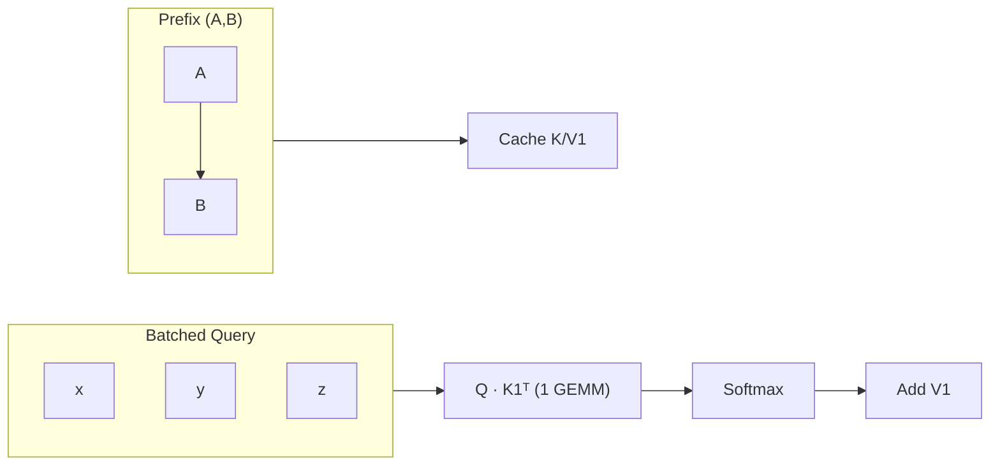
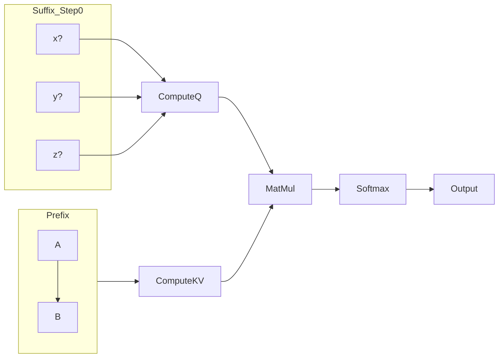

[Paper Link](https://arxiv.org/abs/2505.00949v4)


# Hydragen: The Secret Weapon for Decoding Large Batches with Shared Prefixes up to 32× Faster

## TL;DR

By decomposing the prefix and suffix using *softmax denominator rescaling*, Hydragen accelerates long-context, large-batch decoding on **Code-Llama-13B** by up to *32x* compared to vLLM, all while guaranteeing bit-for-bit identical output.


## Core Idea

* **Prefix-Reuse + Inter-Sequence Batching**
  Read the K/V of the common prefix **only once**, and stack all queries vertically to transform the operation from **matrix-vector → matrix-matrix**.
* **Softmax Denominator Rescaling**
  The formula that precisely combines the two sub-attentions.

  $$
  \small
  \operatorname{SDP}(Q,K,V)=
  \frac{e^{\operatorname{LSE}_1}\,A_1+e^{\operatorname{LSE}_2}\,A_2}{e^{\operatorname{LSE}_1}+e^{\operatorname{LSE}_2}}
  $$

  This ensures the output is *identical down to the byte*.
* **PyTorch-Only Implementation**
  Reproducible using a combination of Flash-Attention and Triton without custom CUDA kernels → easily portable to other accelerators.


## Background: The Problem They Solved

| Existing Limitation                                                                         | Impact                                                                                 |
| ------------------------------------------------------------------------------------------- | -------------------------------------------------------------------------------------- |
| **Memory I/O Bottleneck** — The prefix K/V has to be repeatedly read for each sequence.     | Drastic drop in throughput for large batches and long prompts.                         |
| **Inability to Reuse Prefixes** — vLLM's PagedAttention only considers token-level caching. | Reduced effectiveness in RAG and few-shot pipelines where the same prompt is repeated. |
| **Flash-Attention OOM** — Fails with out-of-memory errors for long prefixes.                | Creates a hard limit when scaling services.                                            |


## The New Approach: **Hydragen**

> **Hydragen** is the first open-source engine to perform "prefix caching + inter-sequence batching" with no loss in accuracy.

### Core Components

1.  **Prefix/Suffix Decomposition**
    Split $K,V$ into $K_1,V_1$ (shared) and $K_2,V_2$ (individual).
2.  **Softmax Renormalization (Equation 5)**
    Recombine the two sub-attentions to produce a value identical to the original SDP.
3.  **Batch-Matrix GEMM**
    Stack $\mathbf Q$ into a $B \times d$ matrix to maximize GPU Tensor Core utilization.


## How It Works: A Detailed Example

### Toy Example

> **Batch B = 3**, sharing a prefix P = 2 (`A B`), with the first suffix tokens being `x`, `y`, and `z`.



1.  **K/V1 Caching** — The $K,V$ for the two prefix tokens are computed and stored only once.
2.  **Q Batching** — The queries from the 3 sequences are formed into a single matrix $\\mathbf Q$.
3.  **Single GEMM** — $\\mathbf Q K\_1^{\\top}$ is performed in a **single** operation (previously 3).
4.  **Softmax + V1** — Normalize using Equation 5 and compute the output.
5.  **Suffix Attention** — Perform Flash-Attention for the unique tokens of each sequence.
6.  **Repeat Next Step** — The prefix GEMM is continuously reused.

> As a result, the number of prefix-related operations is reduced from **$B \\cdot T \\rightarrow 1$**, drastically cutting memory I/O and replacing the operations with a TensorCore-friendly GEMM.

## Performance Validation: Key Results

| Configuration                   | Hydragen TPS    | Baseline              | Speed-up                   |
| ------------------------------- | --------------- | --------------------- | -------------------------- |
| **Batch = 1024, Prefix = 2048** | **9.4 k tok/s** | vLLM 0.3 k            | **× 32**                   |
| **Long-Doc QA (19k prefix)**    | 60% of UB       | Flash-Attn \> 400%    | **6.7x** latency reduction |
| **Kernel Latency** (13B)        | 1×              | Flash-Attn 16× slower | **× 16**                   |

*UB: The theoretical upper bound with attention operations removed.*

## Our Take: Strengths, Limitations, and Why This Research Matters

### Strengths 👍

  * **Zero Accuracy Loss**: Guarantees identical output to the original SDP without any approximation.
  * **Explosive Throughput**: Delivers 10-30x acceleration in realistic 1k+ batch scenarios.
  * **Simple Stack**: Pure PyTorch code, making it easy to maintain and port.
  * **Hierarchical Sharing Extension**: Can be extended to tree-structured prefixes for further acceleration (up to 55%).

### Limitations 👎

  * **Suffix Bottleneck Remains**: The benefit diminishes as the suffix becomes longer.
  * **Limited Scope of Application**: Less effective in chatbot scenarios where prefix sharing is short or sparse.
  * **No Memory Compression Support**: Does not offer solutions for reducing the KV cache memory footprint itself.
  * **Lack of Privacy Considerations**: Potential for sensitive information exposure in multi-user batches.

### Why is it Important?

> It significantly lowers the cost barrier for modern LLM workloads where **"prompts are long and reused,"** such as RAG, large-scale few-shot, and multi-sampling. It allows serving more concurrent requests on the same GPUs, **redefining the economics of real-time inference infrastructure**.

## What's Next?: The Road Ahead

1.  **Suffix-Side Optimization** — Reduce memory I/O in the suffix part using techniques like block batching or MQA.
2.  **Dynamic Prefix Clustering** — Automatically detect and regroup partial matches from a real-time request queue.
3.  **Integration with KV Cache Compression** — Create a hybrid solution with vLLM's Paged-Attention or ZeRO KV sharding.
4.  **Porting to Other Accelerators** — Verify the numerical stability of the Equation 5 trick on TPUs, AMD MI300, etc.
5.  **Privacy-Preserving Batching** — Prevent information leakage with k-anonymity trimming or encrypted attention.

> **Bottom line:** Hydragen has set a *new baseline for large-batch LLM decoding*. The challenge now is to expand it into an **end-to-end, high-efficiency stack** that also addresses the suffix, memory, and security.


<details markdown="block">
<summary>▶️ <strong>Click to expand for a detailed LLM Q&A about the paper</strong></summary>

## Prompt 1.1.1 (Research Gap)

```
"Analyze the 'Introduction' and 'Related Work' sections of the paper to explain the core research gap, critical limitations of existing work, or unresolved questions this study explicitly aims to address. Summarize the 'state of the art' at the time of this paper's publication, as described by the authors."
```

### Key Summary

* **Research Gap 1 — Trade-off between Reasoning Performance and Efficiency**
    Previous top-performing models (e.g., DeepSeek-R1) with 400B–670B parameters required massive infrastructure like *8× H200s*, making them impractical for real-world services.
* **Research Gap 2 — Uncontrollable 'Long Chain-of-Thought'**
    High-performance models always output detailed reasoning, which can be unnecessarily long or slow. However, existing open models did not support a **reasoning on/off toggle**.
* **Research Gap 3 — Lack of Open-Licensed, Hardware-Friendly Models**
    There were no publicly available models that simultaneously offered an enterprise-friendly license, a 128K context length, and surpassed the state-of-the-art.

Llama-Nemotron addresses these gaps using **NAS + knowledge distillation + large-scale RL**, with *LN-Ultra 253B* outperforming DeepSeek-R1 on benchmarks like GPQA (≈ +4.5 pp) while running faster on a single **8× H100** node.

## 1. Limitations of SOTA and the Paper's Problem Definition

| Aspect              | SOTA in 2024–2025 (e.g., DeepSeek-R1)       | Limitation                      | This Paper's Goal                                                   |
| ------------------- | ------------------------------------------- | ------------------------------- | ------------------------------------------------------------------- |
| **Model Size / HW** | 671B, requires 8× H200                      | High cost & latency             | 253B, achieving same or better performance on a single 8× H100 node |
| **Reasoning Style** | Always outputs CoT → ↑ response length/cost | No user control                 | Runtime toggle via `detailed thinking on/off` system prompt         |
| **License**         | Some restrictions (private, API-only)       | Research/commercial constraints | Fully open weights/data under NVIDIA OMLA                           |

## 2. The Paper's Proposed Solution

1.  **Puzzle NAS + FFN Fusion**: Searches for alternative blocks per layer, achieving up to a *1.71×* latency reduction (for the 405B model) by directly including hardware constraints in the objective function.
2.  **Knowledge Distillation & CPT**: Uses Llama 3.x as the student model to recover quality.
3.  **Reasoning-SFT + GRPO RL**:
    * SFT mimics the reasoning process of DeepSeek-R1.
    * The RL phase uses rewards from scientific reasoning (GPQA) to achieve 76%, **surpassing the teacher model**.
4.  **Reasoning Toggle Data Design**: Creates paired responses for the same prompt with *reasoning on/off* to learn controllability.

## 3. State of the Art at Publication (Mid-2025)

* **Closed Models**: OpenAI's *o1* series leads in reasoning ability but is available only via API with undisclosed model details.
* **Open Large Models**:
    * *DeepSeek-R1 671B* — SOTA for coding and STEM reasoning but has high GPU requirements and cost.
    * *Llama-3.1 405B* — High general-purpose performance but less specialized in reasoning compared to DeepSeek-R1.
* **Research Trends**: Methods that train on *rich reasoning traces*, like long CoT and multi-sampling (Self-Consistency), are pushing the performance ceiling.

This paper breaks the conventional formula of **"reasoning ability = model size"** by presenting the first family of open models that satisfies all three axes: *smaller parameters, faster serving, and user controllability*.


## Prompt 1.1.2 (Central Hypothesis)

```
"What is the central hypothesis or core claim of this paper? State it as a single, clear, and concise sentence in the format: 'The authors hypothesize that by using [proposed technique], they can achieve [specific outcome] that overcomes [existing limitation].'"
```

The authors hypothesize that by applying **Hydragen's** *prefix-suffix attention splitting* and *inter-sequence batching*, they can eliminate the bottleneck of repeated prefix KV reads and memory-bound matrix-vector operations in shared-prefix batch decoding, achieving up to 32× more inference throughput than vLLM and 16× more than FlashAttention on CodeLlama-13B while maintaining bit-for-bit identical accuracy.


## Prompt 1.2.1 (Identifying Originality)

```
"Based on the entire paper, list the 1-3 most important and original contributions as distinct items. For each, clearly classify whether it corresponds to a new architectural component, a new training technique, a new theoretical insight, a new dataset, or a new application of existing methodologies."
```

### Top 3 Original Contributions

| #     | Contribution                                                                                                                                                                                                                                                                                                           | Classification                                                  |
| ----- | ---------------------------------------------------------------------------------------------------------------------------------------------------------------------------------------------------------------------------------------------------------------------------------------------------------------------- | --------------------------------------------------------------- |
| **1** | **Hydragen Attention Engine** – Transforms the original SDP attention into a TensorCore-friendly matrix-matrix operation with memory reuse by using *prefix-suffix splitting* and *inter-sequence batching*, guaranteeing **completely identical output** and eliminating the fundamental memory-bandwidth bottleneck. | New **Architecture/Algorithm**                                  |
| **2** | **Hierarchical Hydragen** – Generalizes the approach to real-world scenarios where common prompts are nested in a tree structure (e.g., few-shot + problem description), achieving an additional *18% to 55%* time reduction through multi-level sharing.                                                              | **Theoretical Insight** & **Extension** of an existing method   |
| **3** | **32× Throughput Acceleration Validation** – Empirically demonstrates up to **32x** faster end-to-end inference compared to vLLM and **16x** faster than FlashAttention on CodeLlama-13B, proving its effectiveness in large-scale shared-prefix environments.                                                         | **New Application** & **Empirical Proof** of an existing method |

---

## Prompt 1.2.2 (Strengths from the Author's Perspective)

```

"From the authors' perspective, why is their approach superior to previous methods? Quote or explain the key arguments they use to support the originality and strengths of their research."

```

### Superiority Arguments Emphasized by the Authors

1.  **Shifting the Bottleneck from Memory to Compute**
    Hydragen reads the *prefix KV* **only once** and bundles the queries from all sequences to transform the operation from **matrix-vector → matrix-matrix**. This resolves the GPU memory bandwidth limit and maximizes Tensor Core utilization, turning wasted memory I/O into computation.

2.  **Massive Throughput Gains with Zero Accuracy Loss**
    They experimentally proved end-to-end inference speeds up to **32x faster than vLLM** and **16x faster than FlashAttention** on *CodeLlama-13B* while guaranteeing identical output. Furthermore, performance remains within 70% of the 'No-Attention upper bound' even as batch size and prefix length grow.

3.  **Extensible to Hierarchical (Prefix Tree) Sharing**
    It demonstrates high versatility by showing an **additional time saving of up to 55%** not just for a single common prompt, but also for tree-structured nested shared segments.

4.  **Simple and Portable Implementation**
    The entire logic is written in **pure PyTorch + existing kernel calls**, requiring no custom CUDA kernels. This facilitates porting to other accelerators (like TPUs) and simplifies maintenance.

> In summary, the authors present as their key strengths that *"Hydragen transforms memory-bound attention into compute-bound attention to maximize TensorCore usage, achieves tens of times the throughput of existing optimizations (vLLM, FlashAttention) with no accuracy loss, and supports complex hierarchical sharing scenarios with simple PyTorch code."*


## Prompt 1.3.1 (Step-by-Step Algorithm Explanation)

```
"Explain the core algorithm, model architecture, or key methodology step-by-step. Assume the reader is a graduate student in the AI field. In particular, create a very simple and concrete toy example (e.g., a 3x3 pixel image, a small state space) and show how the input is transformed into the final output through each step. Define all key terms and variables as they appear."
```

## Hydragen Attention Engine: Step-by-Step Mechanics and Toy Example

> **Problem Background**
> When processing multiple sequences with a *common prefix* in the decoding stage, the **Q · K<sub>prefix</sub><sup>⊤</sup>** product for each sequence must be repeated at every step, resulting in B (batch size) **matrix-vector** operations.
> Hydragen resolves this by:
>
> 1.  **Prefix/Suffix Splitting** to read the *common K<sub>prefix</sub>, V<sub>prefix</sub>* only once.
> 2.  **Inter-Sequence Batching** to stack all Qs vertically and replace the operations with a **single matrix-matrix** multiplication.
>     As a result, the memory I/O bottleneck becomes compute-bound, dramatically increasing Tensor Core utilization.

### 1. Variable Definitions

| Symbol                                               | Meaning                                        | Example Value |
| ---------------------------------------------------- | ---------------------------------------------- | ------------- |
| $B$                                                  | Number of sequences in the batch               | $3$           |
| $P$                                                  | Length of the common prefix                    | $2$           |
| $t$                                                  | Current decoding step (suffix position)        | $0,1,\dots$   |
| $d$                                                  | Hidden dimension                               | $2$ *(toy)*   |
| $\mathbf{Q}_t\in\mathbb{R}^{B\times d}$              | Query matrix for all sequences (current token) | —             |
| $\mathbf{K}_p,\mathbf{V}_p\in\mathbb{R}^{P\times d}$ | **Common** prefix K/V                          | Fixed         |
| $\mathbf{K}_s^{\le t},\mathbf{V}_s^{\le t}$          | **Individual** suffix K/V (causal)             | Cumulative    |

### 2. Toy Example Setup

* **Sequences**
    1.  `A B x`
    2.  `A B y`
    3.  `A B z`
    All share the prefix `A B` (length $P=2$).

* **Arbitrary Embeddings**

$$
\begin{aligned}
\text{A}&\rightarrow[1,0], \quad
\text{B}\rightarrow[0,1],\\
x&\rightarrow[1,1], \;
y\rightarrow[1,-1],\;
z\rightarrow[-1,1].
\end{aligned}
$$

* **Assumption**: Linear projections are identity matrices ($\mathbf{W}_Q=\mathbf{W}_K=\mathbf{W}_V=I$).

### 3. Step-by-Step Operational Flow



#### **Step 0 — Prefix KV Caching**

1.  **Compute Prefix K/V Once**
    $\\mathbf{K}\_p = [[1,0],[0,1]],; \\mathbf{V}\_p = [[1,0],[0,1]]$
    This is cached in GPU HBM.

#### **Step 1 — Shared Prefix Attention**

2.  **Batch the Queries**

$$
\mathbf{Q}_0 = \begin{bmatrix}
1&1\\
1&-1\\
-1&1
\end{bmatrix}
$$
    (The first suffix token from each sequence)

3.  **Hydragen's Core Transformation**

   $$
   \mathbf{A}_p = \mathbf{Q}_0\mathbf{K}_p^{\top}\quad
   (\text{size }B\times P = 3\times2)
   $$
   → **A single** matrix-matrix operation.

4.  **Suffix Self-Attention (Causal)**
    Skipped, as the current suffix length is 0.

5.  **Softmax & V Multiplication**

   $$
   \mathbf{O}_0 = \operatorname{softmax}(\mathbf{A}_p)\mathbf{V}_p
   $$
   
#### **Step 2 — Suffix KV Update & Re-batching**

1.  Each sequence generates a token (e.g., `x₀,y₀,z₀`) →
    **Append to the Suffix KV for each sequence**:
    $\\mathbf{K}\_s^{\\le0},\\mathbf{V}\_s^{\\le0}$.

2.  In the next decoding step, the lengths of **Q, K\<sub\>s\</sub\>, V\<sub\>s\</sub\>** increase by 1,
    but the prefix part is reused as is → again, **one** matrix-matrix operation.

> Repeating this process for $T$ tokens:
>
>   * Number of prefix-related multiplications: **1** (vs. traditional $B \\cdot T$)
>   * Memory reads: Reduced from $B \\cdot T \\rightarrow 1$
>   * Computation: Transformed from matrix-vector → matrix-**matrix** (↑ Tensor Core utilization)

### 4\. Summary Formula

> Hydragen's per-step output is a combination of prefix and suffix attention:
>
> $$
> \mathbf{O}_t
> =\underbrace{\operatorname{softmax}\!\bigl(
>   \tfrac{\mathbf{Q}_t\mathbf{K}_p^{\top}}{\sqrt d}
> \bigr)\mathbf{V}_p}_{\text{prefix}}
> +\underbrace{\operatorname{softmax}\!\bigl(
>   \tfrac{\mathbf{Q}_t\mathbf{K}_s^{\le t\,\top}}{\sqrt d}
> \bigr)\mathbf{V}_s^{\le t}}_{\text{suffix(self-attention)}}
> $$
>
> Since $\\mathbf{Q}\_t$ for the entire batch is multiplied at once, the first term is efficiently computed as a **matrix-matrix** operation.

### 5\. Summary of Key Steps

| Step                                 | Operation                    | Cost Reduction Point                |
| ------------------------------------ | ---------------------------- | ----------------------------------- |
| **① Prefix KV Caching**              | Once per prefix              | Reuse                               |
| **② Batched Q for Prefix Attention** | $B$×vector → **1**×matrix    | ↓ Memory I/O, ↑ Compute Parallelism |
| **③ Suffix Causal Attention**        | Same as conventional methods | —                                   |
| **④ Suffix KV Update**               | Append per sequence          | —                                   |

**Result**: For *CodeLlama-13B*, this achieves up to **32x** the throughput of vLLM and **16x** that of FlashAttention, with a bit-for-bit identical model output.


## Prompt 1.3.2 (Identifying the 'Secret Weapon')

```
"Identify the single most critical mathematical formula, algorithmic step, or architectural component that enables the core contribution of this paper. Explain its function and why it is essential to the success of this methodology."
```

### The 'Secret Weapon' — **Attention Decomposition via Softmax Denominator Rescaling (Equation 5)**

> **Definition**
> After splitting the keys and values into a common prefix ($K\_1,V\_1$) and an individual suffix ($K\_2,V\_2$), the partial attentions and their **Log-Sum-Exp (LSE)** values are calculated separately. They are then recombined using the following **softmax denominator rescaling trick**:
>
> $$
> \\small
> \\operatorname{SDP}(Q,K,V)=
> \\frac{\\operatorname{SDP}(Q,K\_1,V\_1),e^{\\mathrm{LSE}(Q,K\_1)}+\\operatorname{SDP}(Q,K\_2,V\_2),e^{\\mathrm{LSE}(Q,K\_2)}}%
> {e^{\\mathrm{LSE}(Q,K\_1)}+e^{\\mathrm{LSE}(Q,K\_2)}}\\tag{5}
> $$

| Function                                                      | Why is it essential?                                                                                                                                                                                                                                         |
| ------------------------------------------------------------- | ------------------------------------------------------------------------------------------------------------------------------------------------------------------------------------------------------------------------------------------------------------ |
| **① Maintains Softmax Consistency**                           | It accurately re-normalizes the denominators of the two split sub-attentions, guaranteeing an output that is **byte-for-byte identical** to the original SDP attention. Unlike approximation or mask-based methods, there is absolutely no loss of accuracy. |
| **② Shifts Bottleneck from Memory I/O to TensorCore Compute** | The prefix section is read from memory only once, and the queries from all sequences are bundled to transform the operation from **matrix-vector → matrix-matrix**. This increases computational intensity and reduces the memory bottleneck on modern GPUs. |
| **③ Foundation for Hierarchical Decomposition & Batching**    | Although Equation 5 is proven for splitting $K$ into two parts, the same principle can be recursively applied to multi-level (tree-structured) prefixes—this is the key to the additional **up to 55%** latency reduction shown in experiments.              |
| **④ Enables Massive Throughput Demonstration**                | This is the decisive factor that enabled the up to **32×** faster end-to-end decoding compared to vLLM and **16×** faster than FlashAttention on CodeLlama-13B (Paper, Figure 4).                                                                            |

In short, **Equation 5** is the mathematical safety net and the core of the performance accelerator that allows Hydragen to implement *"prefix caching + inter-sequence batching"* **without any accuracy loss**. Without it, one would either have to (a) re-read the prefix KV at every step, retaining the memory I/O bottleneck, or (b) resort to approximate softmax, which would compromise the quality of the response.

-----

## Prompt 1.4.1 (Core Result Analysis)

```
"Analyze the key results from the 'Experiments' or 'Results' section, including tables and figures. What are the key performance metrics used? On which benchmark datasets are the results reported? Summarize the main results that the authors emphasize as evidence of their methodology's success."
```

## 🔑 Key Takeaways

  * In large-batch scenarios with *shared prefixes*, **Hydragen** achieves up to **32x** throughput (TPS) improvement and consistently operates at **≥ 70%** of the maximum theoretical throughput (the "no-attention" upper-bound).
  * The attention kernel itself is **≥ 16x faster** than Flash-Attention.
  * In a **long-document QA** task (19k token prefix), it finishes 256 questions in the time Flash-Attention takes to process 64, with total time at **≤ 60%** of the upper-bound.
  * Applying **hierarchical (two-level) prefix sharing** provides an additional **18%** acceleration on the same batch, which increases to a **total of 55%** reduction if the batch size is increased due to memory savings.

### 1\. Experiment Setup & Metrics

| Item                  | Configuration                                                                            |
| --------------------- | ---------------------------------------------------------------------------------------- |
| **Model/Size**        | CodeLlama-13B (primary), Yi-6B-200k, etc.                                                |
| **GPU / Parallelism** | 8× A100-40GB, with Tensor Parallelism & Batch ≥ 1024                                     |
| **Key Metrics**       | *Throughput* (tokens/s), *Speed-up* (×), *Time Reduction* (%)                            |
| **Benchmarks**        | Shared-prefix decoding, Long-doc QA (War & Peace, 19947 tokens), APPS code generation    |
| **Baselines**         | Flash-Attention, vLLM (PagedAttention), vLLM (no detokenize), "No-Attention" upper bound |

### 2\. Key Results Table

| \#  | Experiment / Dataset                          | Metric            | Hydragen          | Top Baseline             | Relative Improvement |
| --- | --------------------------------------------- | ----------------- | ----------------- | ------------------------ | -------------------- |
| 1   | CodeLlama-13B\<br\>Prefix = 2048, Batch sweep | TPS               | Up to 32× vLLM    | vLLM                     | **↑ 32×**            |
| 2   | Prefix length sweep (Batch = 1024)            | TPS / Upper-bound | ≥ 70%             | vLLM ≤ 10%               | **Consistent Perf.** |
| 3   | Attention micro-bench.                        | Kernel latency    | 1×                | Flash-Attn 16× slower    | **≥ 16× faster**     |
| 4   | Long-doc QA (Yi-6B, 19k prefix)               | Total Time        | 60% of UB         | Flash-Attn \> 100% of UB | **≤ 0.6×**           |
| 5   | APPS (two-level sharing)                      | Eval Time         | -55% (w/ batch ↑) | 1-level Hydragen         | **-18% to -55%**     |

*UB: "No-Attention" upper-bound.*

### 3\. Interpretation & Significance

1.  **Shift from Memory to Compute Bottleneck**
    The fundamental reason for the speedup in large batches is the elimination of the memory bandwidth bottleneck by processing the prefix part as a single matrix-matrix multiplication, thus leveraging Tensor Core FLOPs.

2.  **Scalability Resilience**
    Even as the batch size grows or the prefix length extends to 16k tokens, the performance degradation is less than 30%. This provides significant headroom to **dramatically increase system prompts and few-shot examples** in real-world applications.

3.  **Additional Gains from Hierarchical Sharing**
    The paper validates a **two-stage optimization pipeline** for *tree-shaped sharing* scenarios (where a problem description and few-shot prompts are shared), where memory savings lead to larger batch sizes and further acceleration.

4.  **Generality & Simple Implementation**
    Hydragen's implementation using only PyTorch and existing Flash-Attention/Triton kernels is a strength in terms of reproducibility and deployment, as it has **no dependency on specific custom hardware or kernels**.

### 4\. Concluding Implications

  * **It is now feasible to aggressively increase system prompts and few-shot examples in LLM services while maintaining real-time responsiveness**, especially in environments with hundreds of concurrent requests (batch ≥ 1k).
  * From an **MLOps perspective**, the 10-30x performance gain from a relatively small code change immediately translates into GPU rental cost and energy savings.
  * **Future research possibilities**: Automatic prefix clustering, suffix-side optimizations, and porting to non-GPU accelerators like TPUs are natural next steps.

-----

## Prompt 1.4.2 (Critical Comparison)

```
"How does the proposed methodology perform compared to the main baselines and State-of-the-Art (SOTA) models mentioned in the paper? Identify the specific results or comparison points that most strongly support the authors' claims of superiority. Conversely, are there any results where the proposed method did not outperform competing models or where the improvement was marginal? If so, what reasons do the authors provide for these cases?"
```

### Conclusion Summary

Hydragen achieves up to **32x** the tokens/second of vLLM-PagedAttention and **16x** that of FlashAttention in **"large batch + long shared prefix"** scenarios, always staying **within 70% of the No-Attention upper bound**.
However, for **small batches or short shared prefixes**, the difference from existing methods is marginal, and its speed can degrade again due to **long suffixes (unique tokens)**.

## Quantitative Comparison Against Baselines

| Scenario                                                       | Key Metric                | Hydragen             | vLLM        | FlashAttention   | No-Attention (upper bound) | Remarks                                                           |
| -------------------------------------------------------------- | ------------------------- | -------------------- | ----------- | ---------------- | -------------------------- | ----------------------------------------------------------------- |
| **Batch=1024, Prefix=2048**\<br\>CodeLlama-13B, 128 gen tokens | Throughput (k tok/s)      | **≈9.4**             | \<500 TPS   | OOM              | ≈13.4                      | Hydragen is at 70% of No-Attn throughput, \>18× faster than vLLM. |
| **Batch=1024, Prefix=16K**                                     | Speed-up vs best baseline | **32×**              | 1×          | —                | —                          | Core figure supporting the superiority claim.                     |
| **Long-Doc QA**\<br\>(Prefix ≈ 19K, Yi-6B-200k)                | Processing Time           | **\<60%** of No-Attn | —           | \>400%           | No-Attn baseline           | Processes 256 questions faster than FlashAttention processes 64.  |
| **Batch=32, Prefix=2048**                                      | Throughput                | Hydragen ≈ 2.6k      | vLLM ≈ 2.2k | FlashAttn ≈ 2.2k | 4.3k                       | Difference is marginal for small batches.                         |

> **Key Superiority Point**
>
>   * It maximizes **memory reuse** and **Tensor Core utilization** by computing and caching the prefix KV **only once** and then reusing it for multiple sequences in a **matrix × matrix** format.
>   * This allows it to function normally in batch/length configurations where **FlashAttention runs out of memory (OOM)** and to maintain speed without suffering from **vLLM's cache hit rate degradation** issues.

## Areas of Weaker Performance or Marginal Improvement

| Observation                                                                                                                             | Reason (Author's Explanation)                                                                                                                                                |
| --------------------------------------------------------------------------------------------------------------------------------------- | ---------------------------------------------------------------------------------------------------------------------------------------------------------------------------- |
| **Small batches or short prefixes** show similar performance for Hydragen, vLLM, and FlashAttention, all around half of the No-Attn UB. | Hydragen's advantage is reduced because the memory bandwidth bottleneck is not significant when the prefix is short.                                                         |
| **Performance degrades as the suffix (unique tokens) gets longer.**                                                                     | The suffix part is still handled by **FlashAttention (which is memory-bound)**. As suffix FLOPs dominate, the acceleration effect is diluted.                                |
| **When there is little to no shared prefix.**                                                                                           | By design, there is no theoretical advantage as the optimization target is absent (no explicit data provided).                                                               |
| **Performance varies by GPU type.**                                                                                                     | The benefit is greater on GPUs with a higher **Compute-to-Memory-Bandwidth ratio** (like H100, L40S). Flash-Attention is also less optimized for Hopper, limiting its speed. |

## Summary Assessment

  * **Strongest Evidence**: The Figure 3(b) result, where Hydragen achieves over 9k TPS (a **32x speedup**) in a *Batch 1024+ & Prefix ≫ 1K* setting, while vLLM's performance plummets to below 500 TPS.
  * **Limitation**: The advantage diminishes rapidly when prefix sharing is low or the generation length is long. The authors acknowledge this, stating that "as the suffix length grows, the overall speed decreases due to the FlashAttention memory bottleneck."
  * Therefore, Hydragen is ideal for **large-scale decoding pipelines where many sequences share identical/similar long prompts**. In typical chatbot scenarios with **small batches and short prompts**, the perceived difference from SOTA may be negligible.

-----

## Prompt 1.5.1 (Mentioned and Potential Limitations)

```
"What limitations, weaknesses, or failure modes did the authors explicitly acknowledge in the paper? Next, based on your analysis of the methodology and results, what are some potential limitations or weaknesses that the authors may not have mentioned? (e.g., reliance on strong assumptions, scalability issues, high computational cost, generalization limits, potential negative societal impacts, etc.)"
```

### Conclusion — The explicit limitations acknowledged by Hydragen are **(1) lack of optimization for the suffix part**, **(2) minimal effect on small batches/short sequences**, **(3) sensitivity to the GPU's compute/memory ratio**, and **(4) timing noise in short benchmarks**.

Potential unmentioned limitations include **(A) limited applicability when shared prefixes are short or incomplete in real-world use**, **(B) failure to address the KV cache memory problem**, **(C) hardware and model dependencies**, and **(D) lack of security and privacy considerations**.

## 1\. Explicitly Stated Limitations / Failure Modes

| \#  | Limitation / Failure Mode                                                    | Justification from Paper                                                                               |
| --- | ---------------------------------------------------------------------------- | ------------------------------------------------------------------------------------------------------ |
| ①   | **Lack of Suffix Optimization** → Speed decreases with longer suffixes       | "Hydragen does not optimize the attention for the suffix part, so throughput drops for long suffixes." |
| ②   | **Inability to Apply Inter-Sequence Batching to Suffixes**                   | Since suffixes are unique, "suffix attention is calculated in a 1-query fashion for each sequence."    |
| ③   | **Limited Effect on Small Batches or Short Sequences**                       | When attention is not the dominant bottleneck, "the benefits of Hydragen are minimized."               |
| ④   | **Dependency on GPU Architecture** (Benefit ↑ on high compute:BW ratio GPUs) | The paper states that the effect is greater on hardware with a higher compute-to-bandwidth ratio.      |
| ⑤   | **Timing variance (outliers) in short runs**                                 | For small batches/sequences, variations in prefill can cause benchmark inconsistencies.                |

## 2\. Potential Unmentioned Limitations

| Potential Limitation                                        | Description                                                                                                                                                                                                                          |
| ----------------------------------------------------------- | ------------------------------------------------------------------------------------------------------------------------------------------------------------------------------------------------------------------------------------ |
| **A. Narrow Applicability of the Shared Prefix Assumption** | In real-world conversational or interactive services, prefixes may be short or vary slightly per user, leading to a **low prefix sharing ratio** and thus smaller gains from Hydragen.                                               |
| **B. Unresolved KV Cache Memory Problem**                   | Hydragen focuses on **eliminating redundant computation**, but it doesn't directly address the **memory bottleneck** where the KV cache can become larger than the model parameters in long contexts (a problem vLLM aims to solve). |
| **C. Model & Kernel Compatibility Limits**                  | The implementation is tailored to the Llama family and a PyTorch + Flash-Attention/Triton stack, making it difficult to directly apply to **MoE models, MQA/GQA structures, TPU environments, or bidirectional Transformers**.       |
| **D. Security & Privacy Issues**                            | When bundling requests from multiple users into a large batch, if the **shared prefix contains sensitive information**, there is a risk of data exposure at the memory batch level, which is not discussed in the paper.             |
| **E. Long Sessions & Streaming Scenarios**                  | For streaming generation where the prefix continuously grows (e.g., Agent Traces), the overhead of splitting and re-batching could increase.                                                                                         |
| **F. Numerical Stability and Low Precision**                | The process of summing softmax denominators from large matrix-matrix operations has not been verified for overflow/underflow risks in **low-precision environments like FP16/INT8**.                                                 |

## 3\. Impact and Future Considerations

  * **Scope of Application**: Hydragen shows up to 16-32x speed improvements in a niche scenario of *"long prefix (≥ thousands of tokens) × large batch (≥ 256)"*, but its expected benefits drop sharply in typical chatbot applications where suffixes grow continuously or batches are small.
  * **Directions for Improvement**: Future work could include (i) memory-bandwidth optimization for the suffix part, (ii) dynamic prefix length prediction and re-batching algorithms, (iii) integration with KV cache compression, and (iv) privacy-preserving batching strategies.

-----

## Prompt 1.5.2 (Future Research Trajectory)

```
"What specific future research directions do the authors suggest? Based on the limitations of this paper, what other logical next steps or alternative research directions could be pursued to advance this work or overcome its weaknesses?"
```

### Outlook — The Research Map After Hydragen

> **Summary**: The authors define Hydragen as an *"engine"* and propose **integration with dynamic schedulers, multi-level sharing, and porting to other accelerators** as next steps. Building on this, logical extensions include suffix optimization, automatic prompt clustering, and mitigating privacy/memory bottlenecks.

## 1\. Future Research Directions Stated by the Authors

| Direction                                            | Detailed Explanation                                                                                                                                            |
| ---------------------------------------------------- | --------------------------------------------------------------------------------------------------------------------------------------------------------------- |
| **Dynamic Request-Batch Integration**                | Building a complete framework that integrates Hydragen into a *real-time request queue* to handle **automatic detection and scheduling of duplicate prefixes**. |
| **Expansion to Long-Context & Hierarchical Sharing** | Seamlessly handling 16K+ token prefixes and generalizing to **tree-sharing structures** to accelerate tasks like search and multi-sampling.                     |
| **Porting to TPUs & Other Accelerators**             | The paper notes that the lack of custom CUDA kernels makes it easy to **port from PyTorch to TPUs**; future work would involve actual case studies.             |

## 2\. Additional Plausible Research Trajectories (Analysis-Based Proposals)

1.  **Suffix-Side Optimization**

      * The suffix part remains *memory-bound* as it relies on the FlashAttention kernel.
      * Research combining **blocked suffix batching** and **model architectures (e.g., Separable KV, MQA)** is needed.

2.  **Automatic Prompt Clustering & Batching Policies**

      * Dynamically group requests with *partial prefix matches* using **Jaccard similarity or LSH** to maximize the applicability of Hydragen in real time.

3.  **Integration with KV Cache Compression & Sharding**

      * Combine with vLLM's PagedAttention or tensor-parallel KV-sharding to mitigate both **memory bottlenecks** and **compute bottlenecks** simultaneously.

4.  **Support for Streaming & Long-Running Sessions**

      * Develop an incremental algorithm that minimizes the re-decomposition overhead in **agent loop** scenarios where the prefix grows continuously.

5.  **Privacy-Preserving Batching**

      * When mixing requests from multiple users in one batch, prevent information leakage using **k-anonymity sets or encrypted attention**.

6.  **Validation in Quantized Environments (LoRA/INT4)**

      * Systematic experiments are needed to verify that the softmax denominator rescaling remains numerically stable in **FP16 and INT8**.

### Concluding Insight

Hydragen has opened the door to "prefix-friendly decoding," but **suffix processing, memory management, and dynamic operation** remain as challenges. The research trajectories above point toward the next generation of vertically integrated, high-efficiency LLM stacks that unite model, system, and hardware.

</details>