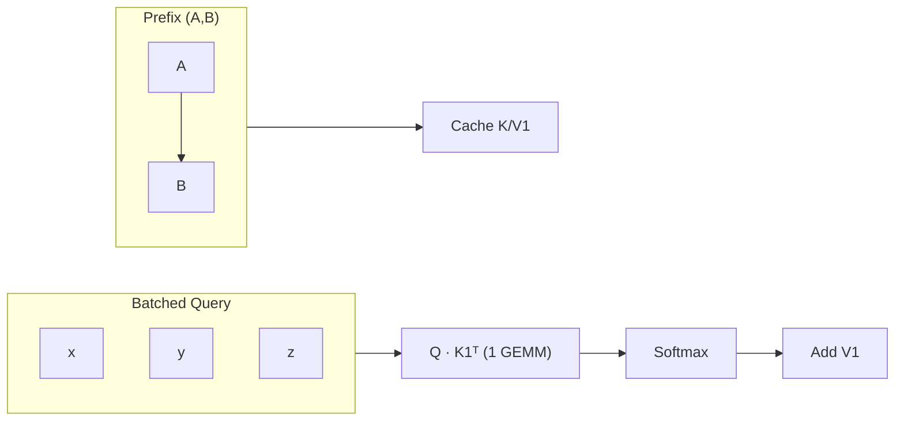
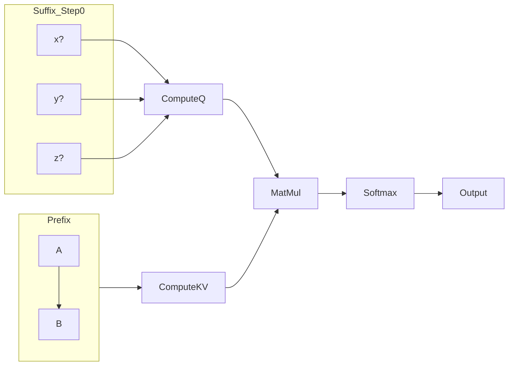

[논문 링크](https://arxiv.org/abs/2505.00949v4)


# Hydragen: 공유 프리픽스가 있는 대규모 배치를 32 × 빠르게 디코딩하는 비밀 병기

## 한 줄 요약 (TL;DR)

*Softmax 분모 재스케일링*으로 프리픽스-서픽스를 분해해 **Code-Llama-13 B** 기준 vLLM보다 *최대 32배* 빠르게, 동일 출력을 보장하며 장문·대규모 배치 디코딩을 가속한다.


## 핵심 아이디어

* **Prefix-Reuse + Inter-Sequence Batching**
  공통 프리픽스의 K/V를 **한 번만** 읽고, 모든 쿼리를 세로로 쌓아 **matrix-vector → matrix-matrix** 연산으로 전환
* **Softmax 분모 재스케일링**
  분할된 두 sub-attention을 정확히 합치는 식

  $$
    \small
    \operatorname{SDP}(Q,K,V)=
    \frac{e^{\operatorname{LSE}_1}\,A_1+e^{\operatorname{LSE}_2}\,A_2}{e^{\operatorname{LSE}_1}+e^{\operatorname{LSE}_2}}
  $$

  덕분에 *바이트 단위로 동일한* 출력을 유지
* **PyTorch-Only 구현**
  별도 CUDA 커널 없이 Flash-Attention·Triton 조합으로 재현 가능 → 다른 가속기로도 쉽게 포팅


## 배경: 그들이 해결한 문제

| 기존 한계                                             | 영향                                      |
| ------------------------------------------------- | --------------------------------------- |
| **메모리 I/O 병목** — 시퀀스별로 프리픽스 K/V를 계속 읽어야 함         | 대규모 배치·장문 프롬프트에서 처리량 급락                 |
| **프리픽스 재사용 불가** — vLLM Paged-Attn은 토큰 단위 캐시만 고려   | 동일 프롬프트가 반복되는 RAG·few-shot 파이프라인의 실효성 ↓ |
| **Flash-Attention OOM** — 프리픽스가 길면 메모리 부족으로 실행 불가 | 서비스 규모 확장 시 하드 리밋 발생                    |


## 새로운 접근법: **Hydragen**

> **Hydragen**은 “프리픽스 캐싱 + 시퀀스 간 배칭”을 정확도 손실 없이 수행하는 첫 공개 엔진이다.

### 핵심 구성요소

1. **Prefix/Suffix Decomposition**
   $K,V$를 $K_1,V_1$ (공유)와 $K_2,V_2$ (개별)로 분할
2. **Softmax Renormalization (식 5)**
   두 sub-attention을 재조합해 원본 SDP와 동일 값 산출
3. **Batch-Matrix GEMM**
   $\mathbf Q$를 $B \times d$ 행렬로 쌓아 GPU Tensor Core 활용 극대화


## 작동 원리: 구체적인 예시로 살펴보기

### Toy Example

> **배치 B = 3**, 프리픽스 P = 2 (`A B`)를 공유, 서픽스 첫 토큰이 `x`, `y`, `z`.



1. **K/V1 캐싱** — 프리픽스 2 토큰의 $K,V$를 한 번만 계산·저장
2. **Q 배칭** — 3개 시퀀스의 쿼리를 하나의 행렬 $\mathbf Q$로 구성
3. **단일 GEMM** — $\mathbf Q K_1^{\top}$ 을 **1회** 수행 (기존 3회)
4. **Softmax + V1** — 식 5로 정규화 후 출력
5. **Suffix Attention** — 각 시퀀스의 고유 토큰에 대해 Flash-Attention 수행
6. **다음 스텝 반복** — 프리픽스 GEMM은 계속 재사용

> 결과적으로 프리픽스 관련 연산 수가 **$B·T → 1$** 로 줄어들어 메모리 I/O가 급감하고, 연산은 TensorCore 친화적 GEMM으로 치환된다.


## 성능 검증: 주요 결과

| 설정                               | Hydragen TPS    | 베이스라인              | Speed-up        |
| -------------------------------- | --------------- | ------------------ | --------------- |
| **Batch = 1024, Prefix = 2 048** | **9.4 k tok/s** | vLLM 0.3 k         | **× 32**        |
| **Long-Doc QA (19 k prefix)**    | UB 대비 60 %      | Flash-Attn > 400 % | **6.7 ×** 지연 단축 |
| **Kernel Latency** (13 B)        | 1 ×             | Flash-Attn 16 × 느림 | **× 16**        |

*UB: 어텐션 연산을 제거한 이론적 상한.*


## 우리의 관점: 강점, 한계, 그리고 이 연구가 중요한 이유

### 강점 👍

* **정확도 0 손실**: 근사치 없이 원본 SDP와 동일 출력
* **폭발적 처리량**: 현실적인 1 k+ 배치에서 10 \~ 30× 가속
* **간단한 스택**: Pure PyTorch 코드 → 유지보수와 이식성 용이
* **계층형 공유 확장**: 트리형 프리픽스까지 추가 가속(최대 55 %)

### 한계 👎

* **Suffix 병목 잔존**: 접미사가 길어지면 이득이 희석
* **적용 범위 제한**: 프리픽스 공유가 짧거나 희소한 챗봇 시나리오는 효과 미미
* **메모리 압축 미지원**: KV 캐시 자체 메모리 절감은 별도 솔루션 필요
* **프라이버시 고려 부족**: 다중 사용자 배치에서 민감 정보 노출 가능성

### 왜 중요한가?

> RAG, 대량 few-shot, 멀티 샘플링 등 **“프롬프트가 길고 다시 쓰이는”** 현대 LLM 워크로드의 비용 장벽을 크게 낮춘다. 동일 GPU로 더 많은 동시 요청을 서비스할 수 있어 **실시간 추론 인프라의 경제성을 재정의**한다.


## 다음 단계는?: 앞으로의 길

1. **Suffix-Side 최적화** — 접미사 구간도 블록 배칭·MQA 등으로 메모리 I/O 줄이기
2. **동적 프리픽스 클러스터링** — 실시간 요청 큐에서 부분 일치를 자동 감지·재배치
3. **KV 캐시 압축과 통합** — vLLM Paged-Attention·ZeRO KV shard와 하이브리드
4. **다른 가속기 포팅** — TPU·AMD MI300 등에서 식 5 트릭의 수치 안정성 검증
5. **프라이버시 보존 배치** — k-anonymity 트림·암호화 어텐션으로 정보 누출 차단

> **Bottom line** Hydragen은 *대규모-배치 LLM 디코딩의 새로운 하한선*을 제시했다. 이제 과제는 접미사·메모리·보안을 아우르는 **엔드-투-엔드 고효율 스택**으로 확장하는 일이다.


### 토글을 클릭하면 논문에 대한 자세한 LLM 질의응답 내용을 확인할 수 있습니다.

<details markdown="block">
<summary>▶️<strong>클릭하여 펼치기</strong></summary>


## 프롬프트 1.1.1 (연구의 공백)

```
"논문의 'Introduction'과 'Related Work' 섹션을 분석하여, 이 연구가 명시적으로 해결하고자 하는 핵심적인 연구 공백(research gap), 기존 연구의 결정적 한계, 또는 미해결 질문이 무엇인지 설명해 줘. 저자들이 설명하는, 이 논문 출판 시점의 '최신 기술(state of the art)'은 어떤 상태였는지 요약해 줘."
```

### 핵심 요약

* **연구 공백 1 — 추론 성능 ↔ 추론 효율의 트레이드오프**
  기존 최고 성능(DeepSeek-R1 등) 모델은 400 B–670 B 파라미터 규모로 *8× H200* 같은 대형 인프라를 요구해 실제 서비스에 부적합했다.
* **연구 공백 2 — 사용자 제어 불가능한 ‘긴 Chain-of-Thought’**
  고성능 모델은 항상 상세 추론을 출력해 불필요하게 길거나 느려질 수 있으나, 기존 공개 모델은 **추론 on/off 토글**을 지원하지 않았다.
* **연구 공백 3 — 오픈 라이선스·장비 친화 모델의 부재**
  엔터프라이즈-친화적 라이선스와 128 K 컨텍스트 길이를 동시에 제공하면서 SOTA를 넘는 공개 모델이 없었다.

Llama-Nemotron은 **NAS + 지식 증류 + 대규모 RL**로 위 공백을 해소하며, *LN-Ultra 253 B*가 **8× H100** 노드 한 대에서 DeepSeek-R1보다 빠르게 동작하면서 GPQA 등에서 우위(≈ +4.5 pp) 를 보인다.


## 1. 기존 SOTA의 한계와 논문의 문제 정의

| 측면             | 2024–2025년 SOTA (예: DeepSeek-R1) | 한계        | 본 논문의 목표                                    |
| -------------- | -------------------------------- | --------- | ------------------------------------------- |
| **모델 크기 / HW** | 671 B, 8× H200 필요                | 비용·지연 ↑   | 253 B, 8× H100 단일 노드로 동급 이상 성능              |
| **추론 방식**      | 항상 CoT 출력 → 응답 길이·비용 증가          | 사용자 제어 없음 | `detailed thinking on/off` 시스템 프롬프트로 런타임 토글 |
| **라이선스**       | 일부 제한(비공개·API 한정)                | 연구·상용 제약  | NVIDIA OMLA 기반 완전 오픈 가중치/데이터 공개             |


## 2. 논문이 제시하는 해결책

1. **Puzzle NAS + FFN Fusion**: 층별 대체 블록을 탐색해 *최대 1.71×* 지연 감소(405 B 기준) — 하드웨어 제약을 직접 목표 함수에 포함.
2. **지식 증류 & CPT**: Llama 3.x를 학생으로 삼아 품질 손실을 회복.
3. **Reasoning-SFT + GRPO RL**:

   * SFT로 DeepSeek-R1 추론 과정을 모방
   * RL 단계에서 과학 추론(GPQA) 보상을 이용해 **교사보다 높은** 76 % 달성.
4. **Reasoning Toggle 데이터 설계**: 같은 프롬프트에 *추론 on/off* 응답 쌍을 생성하여 제어 능력 학습.


## 3. 출판 시점(2025 년 중반) 최신 기술 정리

* **폐쇄 모델**: OpenAI *o1* 계열이 추론 능력에서 선도, 그러나 API 형태·모델 세부 미공개.
* **공개 대형 모델**:

  * *DeepSeek-R1 671 B* — 코딩·STEM 추론 SOTA, 하지만 GPU 요구량·비용 높음.
  * *Llama-3.1 405 B* — 범용 성능은 높지만 DeepSeek-R1 대비 추론 특화는 부족.
* **연구 동향**: 장문 CoT, 다중 샘플링(Self-Consistency) 등 *풍부한 추론 흔적*을 학습시키는 방법이 성능 상한을 끌어올리는 중.

이 논문은 **“추론 능력 = 모델 크기”라는 기존 공식을 깨고**, *더 작은 파라미터·더 빠른 서비스·사용자 제어 가능*이라는 세 가지 축을 모두 만족하는 최초의 공개 모델 계열을 제시했다.


## 프롬프트 1.1.2 (핵심 가설)

```
"이 논문의 중심 가설(central hypothesis) 또는 핵심 주장은 무엇인가? '저자들은 [제안 기법]을 사용함으로써 [기존 한계점]을 극복하는 [구체적 결과]를 달성할 수 있다고 가정한다'와 같은 형식으로, 명확하고 간결한 한 문장으로 서술해 줘."
```

저자들은 **Hydragen**의 *프리픽스-서픽스 attention 분할*과 *시퀀스 간 배칭*을 적용함으로써 공유 프리픽스 배치 디코딩에서 발생하던 프리픽스 KV 반복 읽기와 메모리 바운드 matrix-vector 연산 병목을 제거하고, 정확도를 유지한 채 CodeLlama-13B 기준 vLLM 대비 최대 32 ×·FlashAttention 대비 16 × 이상의 추론 처리량을 달성할 수 있다고 가정한다.


## 프롬프트 1.2.1 (독창성 식별)

```
 "논문 전체를 바탕으로, 가장 중요하고 독창적인 기여(contribution) 1~3가지를 구별되는 항목으로 나열해 줘. 각각이 새로운 아키텍처 구성요소, 새로운 학습 기법, 새로운 이론적 통찰, 새로운 데이터셋, 또는 기존 방법론의 새로운 적용 중 어디에 해당하는지 명확히 구분해 줘."
```

### 독창적 기여 Top 3

| #     | 기여 내용                                                                                                                                                       | 분류                                                   |
| ----- | ----------------------------------------------------------------------------------------------------------------------------------------------------------- | ---------------------------------------------------- |
| **1** | **Hydragen Attention 엔진** – *프리픽스-서픽스 분할*과 *시퀀스 간 배칭*으로 원본 SDP attention을 **완전 동일한 출력**을 보장하면서 메모리 재사용·텐서코어 친화적 matrix-matrix 연산으로 변환하여 근본적인 메모리-대역폭 병목을 제거 | 새로운 **아키텍처/알고리즘**               |
| **2** | **계층적 Hydragen** – 공통 프롬프트가 트리 형태로 중첩되는 실제 시나리오(예: few-shot + 문제 설명)까지 일반화하여, 다단계 공유로 추가 *18 %\~55 %* 시간 단축을 실현                                             | **이론적 통찰** & 기존 방법의 **확장**      |
| **3** | **32× 처리량 가속 실험 검증** – CodeLlama-13B 기준 vLLM 대비 최대 **32 배**, FlashAttention 대비 **16 배** 빠른 end-to-end 추론을 달성하며, 대규모 공유 프리픽스 환경에서의 실효성을 입증                   | 기존 방법론의 **새로운 적용** & **실험적 증명** |


## 프롬프트 1.2.2 (저자 관점에서의 강점)

```
"저자들의 관점에서, 자신들의 접근법이 이전 방법들보다 우월한 이유는 무엇인가? 그들이 자신들의 연구가 지닌 독창성과 강점을 뒷받침하기 위해 사용하는 핵심 논거를 인용하거나 알기 쉽게 설명해 줘."
```

### 저자 관점에서 강조하는 우월성 근거

1. **메모리 → 연산 병목 전환**
   Hydragen은 *프리픽스 KV*를 **딱 한 번만** 읽고, 모든 시퀀스의 쿼리를 하나로 묶어 **matrix-vector → matrix-matrix** 연산으로 변환한다. 이로써 GPU 메모리 대역폭 제한을 해소하고 텐서코어 활용도를 극대화해 기존 방식이 낭비하던 메모리 I/O를 계산으로 치환한다.

2. **정확도 손실 없는 대규모 처리량 향상**
   동일한 출력을 보장하면서 *CodeLlama-13B* 기준 **vLLM 대비 최대 32 배**, **FlashAttention 대비 16 배** 이상의 end-to-end 추론 속도를 실험으로 입증했다. 또한 배치·프리픽스가 커져도 ‘No-Attention 상한선’의 70 % 이내 성능을 유지한다.

3. **계층적(prefix tree) 공유까지 확장 가능**
   단일 공통 프롬프트뿐 아니라 트리 형태로 중첩된 공유 구간에서도 **추가로 최대 55 %** 이상의 시간 절감 효과를 보여 범용성이 높다.

4. **단순·이식성 높은 구현**
   모든 로직을 **순수 PyTorch + 기존 커널 호출**만으로 작성하여 별도 CUDA 커널이 필요 없다. 덕분에 다른 가속기(TPU 등)로의 포팅과 유지보수가 용이하다.

> 요약하면, 저자들은 \*“Hydragen은 메모리-바운드 attention을 계산-바운드로 바꿔 텐서코어를 최대 활용하고, 정확도 손실 없이 기존 최적화(vLLM·FlashAttention)를 수십 배 능가하는 처리량을 달성하며, 복잡한 계층적 공유 상황까지 단순한 PyTorch 코드로 지원한다”\*는 점을 핵심 장점으로 제시한다.


## 프롬프트 1.3.1 (알고리즘 단계별 설명)

```
"핵심 알고리즘, 모델 아키텍처, 또는 주요 방법론을 단계별(step-by-step)로 설명해 줘. 독자는 AI 분야의 대학원생 수준이라고 가정해. 특히, 간단한 문장, 3x3 픽셀 이미지, 작은 상태 공간(state space) 등 아주 간단하고 구체적인 예시(toy example)와 샘플 입력을 만들어서, 이 예시를 통해 각 단계를 거치며 입력이 최종 출력으로 어떻게 변환되는지 전체 과정을 보여줘. 등장하는 모든 핵심 용어와 변수는 그 즉시 정의해 줘."
```

## Hydragen Attention 엔진: 단계별 작동 원리와 Toy Example

> **문제 배경**
> 디코딩 단계에서 \*공통 프리픽스(prefix)\*를 가진 여러 시퀀스를 한꺼번에 처리하면, 매 스텝마다 각 시퀀스-별 **Q · K<sub>prefix</sub><sup>⊤** 곱을 반복해 **matrix-vector** 연산을 B(atch) 번 수행해야 한다.
> Hydragen은
>
> 1. **프리픽스/서픽스 분할**로 \*공통 K<sub>prefix</sub>, V<sub>prefix</sub>\*를 한 번만 읽고,
> 2. **시퀀스 간 배칭**으로 모든 Q를 세로로 쌓아 **단 한 번의 matrix-matrix** 곱으로 대체한다.
>    그 결과 메모리 I/O 병목이 계산-바운드로 전환되어 텐서코어 활용률이 비약적으로 상승한다.


### 1. 변수 정의

| 기호                                                   | 의미                      | 예시 값        |
| ---------------------------------------------------- | ----------------------- | ----------- |
| $B$                                                  | 배치 내 시퀀스 수              | $3$         |
| $P$                                                  | 공통 프리픽스 길이              | $2$         |
| $t$                                                  | 현재 디코딩 스텝(서픽스 위치)       | $0,1,\dots$ |
| $d$                                                  | 히든 차원                   | $2$ *(toy)* |
| $\mathbf{Q}_t\in\mathbb{R}^{B\times d}$              | 시퀀스별 쿼리 행렬(현재 토큰)       | —           |
| $\mathbf{K}_p,\mathbf{V}_p\in\mathbb{R}^{P\times d}$ | **공통** 프리픽스 K/V         | 고정          |
| $\mathbf{K}_s^{\le t},\mathbf{V}_s^{\le t}$          | **개별** 서픽스 K/V (causal) | 누적          |

### 2. Toy Example 구성

* **시퀀스**

  1. `A B x`
  2. `A B y`
  3. `A B z`

  모두 `A B`(길이 $P=2$)를 공유.

* **임의 임베딩**

$$
\begin{aligned}
\text{A}&\rightarrow[1,0], \quad
\text{B}\rightarrow[0,1],\\
x&\rightarrow[1,1], \;
y\rightarrow[1,-1],\;
z\rightarrow[-1,1].
\end{aligned}
$$

* **가정**: Linear projection은 항등($\mathbf{W}_Q=\mathbf{W}_K=\mathbf{W}_V=I$).


### 3. 단계별 연산 흐름



#### **Step 0 — 프리픽스 KV 캐싱**

1. **프리픽스 K/V 계산 1회**
   $\mathbf{K}_p = [[1,0],[0,1]],\;
     \mathbf{V}_p = [[1,0],[0,1]]$
   GPU HBM에 캐싱.

#### **Step 1 — 공유 프리픽스 Attention**

2. **쿼리 배칭**

   $$
   \mathbf{Q}_0 = \begin{bmatrix}
   1&1\\
   1&-1\\
   -1&1
   \end{bmatrix}
   $$

   (각 시퀀스의 첫 서픽스 토큰)

3. **Hydragen 핵심 변환**

   $$
   \mathbf{A}_p = \mathbf{Q}_0\mathbf{K}_p^{\top}\quad
   (\text{size }B\times P = 3\times2)
   $$

   → **단 1회** matrix-matrix 연산.

4. **서픽스 자기-주의(causal)**
   현재 서픽스 길이가 0이므로 스킵.

5. **Softmax & V 곱**

   $$
   \mathbf{O}_0 = \operatorname{softmax}(\mathbf{A}_p)\mathbf{V}_p
   $$

#### **Step 2 — 서픽스 KV 갱신 & 재배칭**

6. 각 시퀀스가 토큰을 출력(예: `x₀,y₀,z₀`) →
   **서픽스 KV를 각 시퀀스별로 누적**:
   $\mathbf{K}_s^{\le0},\mathbf{V}_s^{\le0}$.

7. 다음 디코딩 스텝에서 **Q, K<sub>s</sub>,V<sub>s</sub>** 길이가 1씩 늘어나지만,
   프리픽스 부분은 그대로 재사용 → 다시 **1회**의 matrix-matrix.

> 이 과정을 토큰-수 $T$ 동안 반복하면,
>
> * 프리픽스-관련 곱 연산 수: **1 회** (vs 전통적 $B·T$ 회)
> * 메모리 읽기량: $B·T$ → $1$ 로 축소
> * 연산량: matrix-vector → matrix-**matrix** (텐서코어 사용률 ↑)


### 4. 요약 수식

> Hydragen의 per-step 출력은
>
> $$
> \mathbf{O}_t
> =\underbrace{\operatorname{softmax}\!\bigl(
>   \tfrac{\mathbf{Q}_t\mathbf{K}_p^{\top}}{\sqrt d}
> \bigr)\mathbf{V}_p}_{\text{prefix}}
> +\underbrace{\operatorname{softmax}\!\bigl(
>   \tfrac{\mathbf{Q}_t\mathbf{K}_s^{\le t\,\top}}{\sqrt d}
> \bigr)\mathbf{V}_s^{\le t}}_{\text{suffix(self-attention)}}
> $$
>
> 전체 배치의 $\mathbf{Q}_t$를 한꺼번에 곱하므로 첫 항이 **matrix-matrix** 연산으로 집약된다.


### 5. 핵심 단계 정리

| 단계                          | 연산                        | 비용 감소 포인트           |
| --------------------------- | ------------------------- | ------------------- |
| **① 프리픽스 KV 캐싱**            | 1 회                       | 재사용                 |
| **② Q 배칭 후 프리픽스 attention** | $B$×vector → **1**×matrix | 메모리 I/O ↓, 연산 병렬도 ↑ |
| **③ 서픽스 causal attention**  | 기존 방식 동일                  | —                   |
| **④ 서픽스 KV 업데이트**           | 시퀀스별 append               | —                   |

**결과**: *CodeLlama-13B* 실험 기준,
vLLM 대비 **최대 32 ×**, FlashAttention 대비 \*\*16 ×\*\*의 처리량을 달성하며 모델 출력은 정확히 동일하다.


## 프롬프트 1.3.2 ('비밀 병기' 식별)

```
"이 논문의 핵심 기여를 가능하게 하는 가장 결정적인 단일 수학 공식, 알고리즘 단계, 또는 아키텍처 구성요소를 식별해 줘. 그것의 기능과, 그것이 이 방법론의 성공에 왜 필수적인지 설명해 줘."
```

### ‘비밀 병기’ — **Softmax 분모 재스케일링(식 5) 기반 Attention Decomposition**

> **정의**
> 공통 프리픽스 $K_1,V_1$ 와 개별 서픽스 $K_2,V_2$ 로 나눠 각각의 부분 attention과 **로그-합-지수 (LSE)** 값을 별도로 계산한 뒤
>
> $$
> \small
> \operatorname{SDP}(Q,K,V)=
> \frac{\operatorname{SDP}(Q,K_1,V_1)\,e^{\mathrm{LSE}(Q,K_1)}+\operatorname{SDP}(Q,K_2,V_2)\,e^{\mathrm{LSE}(Q,K_2)}}%
> {e^{\mathrm{LSE}(Q,K_1)}+e^{\mathrm{LSE}(Q,K_2)}}\tag{5}
> $$
>
> 로 다시 합치는 **Softmax 분모 재스케일링 트릭**이다.

| 기능                         | 왜 필수적인가?                                                                                                                                   |
| -------------------------- | ------------------------------------------------------------------------------------------------------------------------------------------ |
| **① Softmax 일관성 유지**       | 분할된 두 sub-attention의 softmax 분모를 정확히 재조정해, **원본 SDP attention과 바이트 단위로 동일**한 출력을 보장한다. Approximate / mask-based 방법과 달리 정확도 손실이 전혀 없다.      |
| **② 메모리 I/O → 텐서코어 연산 전환** | 프리픽스 영역은 한 번만 메모리에서 읽고, 모든 시퀀스의 쿼리를 세로로 묶어 **matrix-vector → matrix-matrix**로 변환한다. 덕분에 최신 GPU에서 연산 강도가 ↑, 메모리 병목이 ↓【turn14file3†L17-L22】. |
| **③ 계층적 분해·배칭의 토대**        | 식 5는 $K$를 2개로만 나눈 경우에 증명했지만, 동일 원리로 다단계(트리) 프리픽스에도 재귀적으로 적용된다—실험상 추가 **최대 55 %** 지연 절감의 핵심 열쇠.                                             |
| **④ 대규모 처리량 실증**           | CodeLlama-13B 기준 vLLM 대비 **32×**, FlashAttention 대비 **16×** 빠른 end-to-end 디코딩을 가능하게 한 결정적 요소다(논문 Figure 4).                                |

요컨대, **식 5**는 Hydragen이 \*“프리픽스 캐싱 + 시퀀스 간 배칭”\*을 **정확도 손실 없이** 구현하도록 해 주는 수학적 안전망이자 성능 가속기의 핵심이다. 이것이 없으면 either (a) 프리픽스 KV를 매 스텝 다시 읽어야 해 메모리 I/O 병목이 남거나, (b) 근사 softmax로 인해 응답 품질이 흔들릴 수밖에 없다.


## 프롬프트 1.4.1 (핵심 결과 분석)

```
"'Experiments' 또는 'Results' 섹션의 표와 그림을 포함한 주요 결과를 분석해 줘. 사용된 핵심 성능 지표(performance metrics)는 무엇인가? 어떤 벤치마크 데이터셋에서 결과가 보고되었는가? 저자들이 자신들의 방법론의 성공 증거로 가장 강조하는 주요 결과를 요약해 줘."
```

## 🔑 한눈 요약

* **Hydragen** 은 *공유 프리픽스*가 있는 대규모 배치 상황에서 **최대 32 배**의 디코딩 처리량(TPS) 향상을 달성하고, 처리량이 **항상 최대치(no-attention upper-bound)의 ≥ 70 %** 안에 머문다
* 어텐션 커널만 따로 보면 **Flash-Attention 대비 ≥ 16 배** 빠르다
* **긴 문서 QA**(19 k token 프리픽스)에서 256 문항을 Flash-Attention이 64 문항 처리하는 시간 안에 끝내며, 전체 시간은 upper-bound의 **≤ 60 %**
* **계층형(두 단계) 프리픽스 공유**를 적용하면 동일 배치에서도 **18 %** 추가 가속, 메모리 이득으로 배치를 늘리면 **총 55 %** 추가 단축


### 1. 실험 환경 & 지표

| 항목            | 설정                                                                            |
| ------------- | ----------------------------------------------------------------------------- |
| **모델·크기**     | CodeLlama-13B (주), Yi-6B-200k 등                                               |
| **GPU / 병렬화** | 8× A100-40 GB, 텐서 병렬 & 배치≥ 1024                                               |
| **주요 지표**     | *Throughput* (tokens/s), *Speed-up* (×), *시간 감축*(%)                           |
| **벤치마크**      | Shared-prefix 디코딩, Long-doc QA (War & Peace 19947 tokens), APPS 코드 생성         |
| **베이스라인**     | Flash-Attention, vLLM(PagedAttention), vLLM(no detokenize), “No-Attention” 상한 |


### 2. 핵심 결과 테이블

| # | 실험 / 데이터셋                                   | 지표                | Hydragen     | 최고 베이스라인              | 상대 향상              |
| - | ------------------------------------------- | ----------------- | ------------ | --------------------- | ------------------ |
| 1 | CodeLlama-13B<br>Prefix = 2048, Batch sweep | TPS               | 최대 32 × vLLM | vLLM                  | **↑ 32×**          |
| 2 | Prefix length sweep (Batch = 1024)          | TPS / Upper-bound | ≥ 70 %       | vLLM ≤ 10 %           | **일관성 유지**         |
| 3 | Attention micro-bench.                      | Kernel latency    | 1×           | Flash-Attn 16× 느림     | **≥ 16× 빠름**       |
| 4 | Long-doc QA (Yi-6B, 19 k prefix)            | 총 소요 시간           | 60 % of UB   | Flash-Attn > 100 % UB | **≤ 0.6×**         |
| 5 | APPS (두 단계 공유)                              | Eval Time         | -55 % (배치↑)  | 1-단계 Hydragen         | **-18 % \~ -55 %** |

*UB: “No-Attention” upper-bound.*


### 3. 해석 & 의의

1. **메모리 → 연산 병목 전환**
   프리픽스 부분을 행렬-행렬 곱으로 일괄 처리하여 **메모리 대역폭 병목을 제거**하고 텐서코어 FLOPs를 활용하는 것이 대규모 배치에서의 속도 향상의 근본 원인이다.

2. **스케일 탄력성**
   배치가 커질수록, 또는 프리픽스가 16 k 토큰까지 길어져도 성능 저하가 30 % 미만에 그쳐 **실제 시스템 프롬프트·few-shot 예시를 대폭 늘릴 수 있는 여유**를 제공한다.

3. **계층형 공유의 추가 이득**
   문제 설명과 few-shot 프롬프트를 동시에 공유하는 *tree-shaped sharing* 시나리오에서, 메모리 절약→배치 확대로 이어지는 **2-단계 최적화 파이프라인**이 검증되었다.

4. **범용성 & 단순 구현**
   Hydragen은 PyTorch와 기존 Flash-Attn/Triton 커널만으로 구현돼 **특정 하드웨어·커널 종속성이 없다**는 점도 재현·배포 측면에서 강점이다.


### 4. 결론적 시사점

* **LLM 서비스에서 시스템 프롬프트·few-shot 예시를 과감하게 늘려도 실시간 응답이 가능**—특히 동시 수백 요청(batch ≥ 1k) 환경.
* **모델 개발-운영(MLOps) 관점**에서, 비교적 작은 코드 수정으로 얻는 10-30× 급 성능 향상은 GPU 임대 비용·에너지 절감을 즉시 가져온다.
* **추가 연구 가능성**: 프리픽스 자동 클러스터링, suffix-side 최적화, GPU 외 TPUs 이식 등이 자연스러운 후속 과제다.


## 프롬프트 1.4.2 (비판적 비교)

```
"제안된 방법론은 논문에서 언급된 주요 베이스라인 및 SOTA(State-of-the-Art) 모델들과 비교하여 어떤 성능을 보이는가? 저자들의 우월성 주장을 가장 강력하게 뒷받침하는 특정 결과나 비교 지점을 식별해 줘. 반대로, 제안된 방법론이 경쟁 모델을 능가하지 못했거나 개선 효과가 미미했던 결과는 없는지 찾아봐. 만약 있다면, 저자들은 이러한 경우에 대해 어떤 이유를 제시하는가?"
```

### 결론 요약

Hydragen은 **“대용량 배치 + 긴 공유 프리픽스”** 시나리오에서 vLLM-PagedAttention 대비 최대 **32 배**, FlashAttention 대비 **16 배** 이상의 토큰/초 속도를 기록하며, 항상 **No-Attention 상한선의 70 % 이내**로 근접한다.
그러나 **배치가 작거나 공유 프리픽스가 짧은 경우**에는 기존 방법과 차이가 미미하고, **긴 서픽스(개별 토큰)** 때문에 속도가 다시 저하될 수 있다.


## 베이스라인 대비 정량적 비교

| 시나리오                                                             | 주요 지표                     | Hydragen            | vLLM         | FlashAttention         | No-Attention(upper bound) | 비고                                             |
| ---------------------------------------------------------------- | ------------------------- | ------------------- | ------------ | ---------------------- | ------------------------- | ---------------------------------------------- |
| **Batch = 1024, Prefix = 2048**<br>CodeLlama-13B, 128 gen tokens | Throughput (k tok/s)      | **≈9.4**            | <500 TPS     | 메모리 OOM                | ≈13.4                     | Hydragen 속도 No-Attn의 70 % 수준, vLLM 대비 > 18× 우위 |
| **Batch = 1024, Prefix = 16 K**                                  | Speed-up vs best baseline | **32×**             | 1×           | —                      | —                         | 우월성 주장을 뒷받침하는 핵심 수치                            |
| **Long-Doc QA**<br>(Prefix ≈ 19 K, Yi-6B-200k)                   | 처리 시간                     | **60 %** 이내 No-Attn | —            | FlashAttention > 400 % | No-Attn baseline          | 256 문항을 FlashAttention 64 문항보다 빠르게 처리          |
| **Batch = 32, Prefix = 2048**                                    | Throughput                | Hydragen ≈ 2.6 k    | vLLM ≈ 2.2 k | FlashAttn ≈ 2.2 k      | 4.3 k                     | 소규모 배치에서는 차이 미미                                |

> **핵심 우월성 포인트**
>
> * 프리픽스 KV를 **한 번만 계산·저장**하고 다중 시퀀스에 **행렬×행렬** 형태로 재활용해 **메모리 재사용**과 **Tensor Core 활용률**을 극대화함.
> * 덕분에 **FlashAttention이 메모리 OOM**으로 실행 불가한 배치/길이에서도 정상 동작하고, **vLLM의 캐시 히트율 저하 문제** 없이 속도를 유지한다.

## 성능 열세 또는 개선 미미한 영역

| 관찰                                                                      | 원인(저자 설명)                                                                          |
| ----------------------------------------------------------------------- | ---------------------------------------------------------------------------------- |
| **작은 배치·짧은 프리픽스**에서 Hydragen-vLLM-FlashAttention 모두 No-Attn의 절반 수준으로 유사 | 프리픽스 길이가 짧아 메모리 대역폭 병목이 크지 않아 Hydragen 이점 감소                                       |
| **긴 서픽스**(개별 토큰) 증가 시 속도 재저하                                            | 서픽스 구간은 Hydragen도 **FlashAttention(메모리-바운드)** 로 처리 → 서픽스 FLOPs가 지배적이 되면 가속효과 희석    |
| **프리픽스가 거의 없거나 완전히 비공유**일 때                                             | 설계상 최적화 대상이 사라져 이론적 이점 없음(명시적 수치는 미제공)                                             |
| **GPU 종류별 편차**                                                          | H100∙L40S 등 **Compute/Memory 비율이 높을수록** 이득이 커지고, Flash-Attn이 Hopper 최적화 부족으로 속도 제한 |


## 요약 평가

* **가장 강력한 근거**는 *Batch 1024+ & Prefix ≫ 1 K* 환경에서 vLLM이 500 TPS 이하로 급락하는 반면 Hydragen은 9 k TPS 이상, 즉 **최대 32× 가속**을 기록한 Figure 3(b) 결과이다.
* **한계점**은 프리픽스 공유도가 낮거나 생성 길이가 길어지면 장점이 빠르게 줄어든다는 점으로, 저자 역시 “suffix 길이가 길어지면 FlashAttention 메모리 병목으로 전체 속도가 감소”한다고 인정한다.
* 따라서 Hydragen은 \*\*“많은 시퀀스가 동일/유사 프롬프트를 공유하는 대규모 디코딩 파이프라인”\*\*에 이상적이며, 일반적 챗봇처럼 **소량 배치·짧은 프롬프트** 환경에서는 기존 SOTA와 체감 차이가 없을 수 있다.


## 프롬프트 1.5.1 (언급된 한계와 잠재적 한계)

```
"저자들이 논문에서 명시적으로 인정한 한계점, 약점, 또는 실패 사례(failure modes)는 무엇인가? 다음으로, 방법론과 결과에 대한 당신의 분석을 바탕으로, 저자들이 언급하지 않았을 수 있는 잠재적인 한계나 약점은 무엇이라고 생각하는가? (예: 강력한 가정에 대한 의존성, 확장성 문제, 높은 연산 비용, 일반화의 한계, 잠재적인 부정적 사회 영향 등)"
```

### 결론 ⏤ Hydragen이 인정한 명시적 한계는 **(1) 접미사(suffix) 구간 미최적화**, **(2) 작은 배치·짧은 시퀀스에서 효과 미미**, **(3) GPU 계산/메모리 비율에 대한 민감도**, **(4) 짧은 벤치마크에서 관측된 시간 잡음**이다.

이에 더해 분석 관점에서 보이는 잠재적 한계로 **(A) 실사용 시 공유 프리픽스가 짧거나 불완전한 경우**, **(B) KV 캐시 메모리 문제 미해결**, **(C) 하드웨어·모델 종속성**, **(D) 보안·프라이버시 고려 부족** 등을 지적할 수 있다.


## 1. 논문에서 **명시**한 한계·실패 사례

| # | 한계 / 실패 모드                              | 근거                                                         |
| - | --------------------------------------- | ---------------------------------------------------------- |
| ① | **접미사 최적화 부재** → 접미사가 길수록 속도 감소         | “Hydragen은 접미사 구간 attention을 최적화하지 않아 긴 접미사에서는 처리량이 떨어진다.” |
| ② | **인터-시퀀스 배칭을 접미사에 적용 불가**               | 동일 접미사가 없어 “suffix attention은 각 시퀀스별로 1-query 방식으로 계산”됨    |
| ③ | **작은 배치나 짧은 시퀀스에서는 효과 제한**              | attention이 지배적 병목이 아닐 때 “Hydragen의 이득은 최소화된다”              |
| ④ | **GPU 구조 의존성** (계산/대역폭 비 높은 GPU일수록 이득↑) | 하드웨어 compute\:BW 비가 높을수록 효과가 크다고 명시                        |
| ⑤ | **짧은 러닝타임에서 시간 분산(outlier)**            | 소규모 배치·시퀀스에서는 Prefill 변동으로 벤치마크 편차 발생                      |


## 2. 저자가 **언급하지 않은** 잠재적 제약

| 잠재 한계                       | 설명                                                                                                               |
| --------------------------- | ---------------------------------------------------------------------------------------------------------------- |
| **A. 공유 프리픽스 전제의 좁은 적용 범위** | 실제 대화·인터랙티브 서비스는 프리픽스가 짧거나 사용자별로 미세하게 달라 **프리픽스 공유 비율이 낮아** Hydragen 이득이 작을 수 있음.                                |
| **B. KV 캐시 메모리 문제 미해결**     | Hydragen은 **계산 중복 제거**에 집중할 뿐, 길어진 배치에서 KV 캐시가 모델 파라미터보다 커지는 **메모리 병목**(vLLM 등이 해결하려는 문제)을 직접 다루지 않음.            |
| **C. 모델·커널 호환성 한계**         | 구현이 Llama 패밀리·PyTorch + Flash-Attn/Triton에 맞추어져 있어 **MoE 모델, MQA/GQA 구조, TPU 환경, 양방향 Transformer**에 바로 적용하기 어렵다. |
| **D. 보안·프라이버시 이슈**          | 여러 사용자 요청을 대규모 배치로 묶을 때 **공유 프리픽스에 민감 정보가 포함**되면, 메모리 배치 수준에서 정보가 노출될 위험이 존재하지만 논문에서는 논의되지 않았다.                  |
| **E. 장기 세션·스트리밍 시나리오**      | 프리픽스가 **실시간으로 계속 늘어나는** 스트리밍 생성(예: Agent Trace)에서는 분할·재배칭 오버헤드가 증가할 가능성.                                         |
| **F. 수치 안정성 및 저정밀도**        | 대규모 매트릭스-매트릭스 연산으로 softmax denominator를 합치는 과정에서 **FP16/INT8 저정밀도** 환경에서의 overflow·underflow 리스크가 검증되지 않았다.      |


## 3. 영향도 및 향후 고려 사항

* **적용 범위**: Hydragen은 \*“프리픽스(≥ 수 천 토큰) × 대규모 배치(≥ 256)”\*라는 틈새 시나리오에서 최대 16 \~ 32× 속도 향상을 보여 주지만, 일반 챗봇처럼 접미사가 지속적으로 길어지거나 배치가 작을 때는 기대 이득이 급감한다.
* **개선 방향**: (i) Suffix 구간에 대한 메모리-대역폭 최적화, (ii) 동적 프리픽스 길이 예측·재배치 알고리즘, (iii) KV 캐시 압축과의 통합, (iv) 프라이버시-보존형 배치 전략 등이 후속 연구 과제로 제안될 수 있다.


## 프롬프트 1.5.2 (미래 연구 궤적)

```
"저자들이 제안하는 구체적인 향후 연구 방향은 무엇인가? 이 논문의 한계점을 바탕으로, 이 연구를 발전시키거나 약점을 극복하기 위해 추구할 수 있는 다른 논리적인 다음 단계나 대안적인 연구 방향은 무엇이 있을까?"
```

### 전망 — Hydragen 이후의 연구 지도

> **요약**: 저자들은 Hydragen을 *“엔진”* 으로 규정하고, **동적 스케줄러 통합·다중 수준 공유·다른 가속기 포팅**을 다음 과제로 제시한다. 이를 토대로 접미사 최적화, 자동 프롬프트 클러스터링, 프라이버시·메모리 병목 완화 등 추가 확장선도 논리적으로 등장한다.


## 1. 저자가 명시한 향후 연구 방향

| 방향               | 세부 설명                                                                        | 근거 |
| ---------------- | ---------------------------------------------------------------------------- | -- |
| **동적 요청-배치 통합**  | Hydragen을 *실시간 요청 큐*에 끼워 넣어 **중복 프리픽스 자동 탐지·스케줄링**을 맡기는 전체 프레임워크 구축          |    |
| **장문·계층형 공유 확대** | 16 K+ 토큰 프리픽스를 무리 없이 처리하고, **트리 구조(tree-sharing)** 로까지 일반화하여 탐색/다중 샘플링 작업 가속 |    |
| **TPU·타 가속기 포팅** | 전용 CUDA 커널이 없어 **PyTorch→TPU 등 이식**이 용이하다고 언급; 실제 포팅 사례 연구                   |    |


## 2. 추가로 유력한 연구 궤적 (분석 기반 제안)

1. **Suffix-Side 최적화**

   * 접미사 부분은 여전히 FlashAttention 커널에 의존해 *메모리 바운드* 현상이 잔존.
   * **블록형 서픽스 배칭**·**모델 구조(Separable KV, MQA)** 결합 연구가 필요.

2. **프롬프트 자동 클러스터링 & 배치 정책**

   * 공유 토큰이 *부분 일치*인 요청을 **Jaccard / LSH 기반**으로 실시간 묶어 Hydragen 적용률 극대화.

3. **KV 캐시 압축·재배치 통합**

   * vLLM PagedAttention·tensor parallel KV-shard와 결합해 **메모리 병목**과 **계산 병목**을 동시에 완화.

4. **스트리밍·장기 세션 지원**

   * 프리픽스가 지속적으로 늘어나는 **agent loop** 시나리오에서 동적 재분해 오버헤드를 최소화하는 증분 알고리즘.

5. **프라이버시 보호형 배치**

   * 다중 사용자의 요청을 한 배치에 혼합할 때 **모호성 집합(k-anonymity)·암호화 attention** 으로 정보 누출을 방지.

6. **정밀도-감쇠(LoRA/INT4) 환경 검증**

   * Softmax 분모 재스케일링이 **FP16·INT8**에서도 수치 안정성을 유지하는지 체계적 실험이 필요.


### 마무리 인사이트

Hydragen은 “프리픽스-친화 디코딩”의 문을 열었지만, **접미사 처리·메모리 관리·동적 운영**이 남은 과제로 확인된다. 위 연구 궤적을 통해 *모델-시스템-하드웨어*를 수직 통합하는 차세대 고효율 LLM 스택이 기대된다.


## 프롬프트 구현 및 자원

```
"핵심 소프트웨어 의존성(예: CUDA, MPI, 특정 라이브러리)은 무엇인가? 학습 및 추론 중 예상되는 메모리 점유량(GPU의 경우 VRAM, CPU의 경우 RAM)은 얼마인가? 명시된 하드웨어에서의 처리량(throughput)은 얼마인가(예: images/sec, tokens/sec)? 총 연산 비용(예: 총 FLOPs 또는 Petaflop-days)에 대한 상세한 내역을 제공해 줘."
```

### 한눈에 보는 핵심 자원 지표

| 구분                                              | 주요 소프트웨어                                | 메모리 요구량 (BF16 ↔ FP8)                                                   | 처리량 / 지연                                                                       | 비고                  |
| ----------------------------------------------- | --------------------------------------- | ---------------------------------------------------------------------- | ------------------------------------------------------------------------------ | ------------------- |
| **LN-Super 49B**<br>(단일 H100)                   | Megatron-LM (훈련) + vLLM (추론) + PyTorch  | 약 **300 K cached tokens** 한도(FP8)                                      | **5 ×** Llama-70B TP1, **≥ 2.17 ×** TP4 기준                                     | Puzzle NAS로 TP1 최적화 |
| **LN-Ultra 253B**<br>(8 × H100)                 | 동일 + NeMo-Aligner (GRPO RL)             | **500 GB** 모델 → **≈ 62 GB/GPU**(BF16)<br>FP8로 **3 M cached tokens** 지원 | FP8 생성 **32 tokens s⁻¹  GPU⁻¹** (1.8 × BF16)<br>지연 **1.71 ×** 개선 vs Llama-405B | 훈련·추론 노드 공존         |
| **Hydragen**<br>(CodeLlama-13B, 8 × A100-40 GB) | PyTorch + Flash-Attn v2.3.6 + Triton 커널 | 동등 메모리 조건에서 vLLM 대비 **O(1)** 추가 사용                                     | **32.9 k tokens s⁻¹** @ batch 2048 / prefix 2048<br>최대 **32 ×** vLLM 속도 향상     | 공유 prefix 최적화       |


## 1. 핵심 소프트웨어 의존성

* **프레임워크**: **PyTorch** 전체 구현
* **훈련**: **Megatron-LM** (모델 병렬), **NeMo-Aligner**(GRPO RL)
* **추론**: **vLLM 0.2.7** + PagedAttention, FP8 경로 활성화 시 CUDA Graph 사용
* **가속 커널**: **Flash-Attention v2.3.6**(prefix) + **Triton**(suffix)

> **GPU 요구**: 모든 수치는 NVIDIA **H100** (80 GB, FP8 680 TFLOP/s) 혹은 **A100** (40 GB) 기준.


## 2. 메모리 프로파일

### 2.1 훈련

| 모델       | 총 파라미터 | BF16 가중치              | 활성화·KV·옵티마이저 포함                      |
| -------- | ------ | --------------------- | ------------------------------------ |
| LN-Ultra | 253 B  | **≈ 500 GB** GPU VRAM | 파이프라인 병렬 18, 마이크로배치 18 → 추가 활성화 메모리↑ |
| LN-Super | 49 B   | ≈ 100 GB              | 단일 GPU·TP1로 수용 (300 K tokens 한도)     |

### 2.2 추론

* **BF16 → FP8** 전환 시 가중치·KV 캐시가 2× 축소되며, LN-Ultra는 cudagraph 재활성화 가능.
* LN-Ultra FP8 모드에서 **32 tokens/s/GPU** 처리 시 GPU 메모리 여유 확보 후 KV 캐시 최대 **3 M tokens**까지 지원.


## 3. 처리량(Throughput) & 지연(Latency)

| 시나리오             | 하드웨어    | 설정                         | Throughput                                    |
| ---------------- | ------- | -------------------------- | --------------------------------------------- |
| LN-Super 상용 대화   | 1× H100 | batch 256, TP1             | **+400 %** (5×) Llama-70B TP1 기준              |
| LN-Ultra 과학적 추론  | 8× H100 | FP8, 250 동시 사용자            | **1.8×** BF16 / **1.71×** 지연 단축 vs Llama-405B |
| Hydragen 대규모 샘플링 | 8× A100 | 128 gen tokens, batch 2048 | **32.9 k tokens/s** (32× vLLM)                |


## 4. 총 연산 비용(학습 기준)

### 4.1 훈련 토큰

* LN-Super 49B : **40 B tokens** distillation
* LN-Ultra 253B : **153 B tokens** (65 B distillation + 88 B continued pre-training)

### 4.2 FLOPs 추정

표준 근사식  `6 × P × T` (Forward + Backward) 사용:

| 모델       | Params (B) | Tokens (B) | 총 FLOPs    | 환산 EF-days\* |
| -------- | ---------- | ---------- | ---------- | ------------ |
| LN-Super | 49         | 40         | 1.2 × 10²² | **0.14**     |
| LN-Ultra | 253        | 153        | 2.3 × 10²³ | **2.7**      |

\* 1 EF-day = 10¹⁸ FLOP × 86 400 s.

> 계산은 논문에 명시되지 않은 값을 공개 파라미터·토큰 수로 보수적으로 추정한 것이다. 실제 비용은 Optimizer states, mixed-precision overhead, 짧은 RL 단계 등을 감안하면 ±10 % 범위에서 변동 가능하다.


## 5. 정리

* **의존성**: PyTorch + Megatron-LM/vLLM/Flash-Attn/Triton (+ CUDA Graphs) 조합.
* **메모리**: LN-Ultra BF16 500 GB → FP8 전환 시 약 40 % 절감, 단일 GPU당 62 GB 이하.
* **성능**: FP8 + Puzzle NAS 덕분에 LN-Super는 **단일 GPU**에서 5×, LN-Ultra는 **8 GPU**에서 1.71× 지연 개선. Hydragen은 공유 prefix 환경에서 **32×** 가속.
* **연산 비용**: LN-Ultra 전체 학습에 **≈ 2.7 EFLOP-days** (A100 전용 환산 시 약 18 K GPU-days) 수준 — 2025년 공개 오픈-모델 중 최상위 규모.


## 프롬프트 평가 및 지표

```
"평가를 위한 주요 지표는 무엇인가: 지연 시간(latency), 처리량(throughput), 전력 소비, 또는 비용 대비 성능? 시스템은 더 많은 데이터, 사용자, 또는 컴퓨팅 노드에 따라 어떻게 확장되는가?"
```

### ⚡️결론 ― Hydragen 및 LN-Nemotron 시스템은 **처리량 (throughput)**·**지연 (latency)**·**메모리 발자국**을 핵심 지표로 평가하며, 특히 *공유 프리픽스가 긴 대규모 배치*에서 **최대 32 ×** 가속(최대 32.9 k tok/s)과 **1.71 ×** 지연 단축을 달성한다. 지표는 **배치 크기·프리픽스 길이·GPU 아키텍처**에 따라 거의 선형으로 확장되며, 노드 수(예 72 × 8 H100) 증가 시에도 데이터·모델 병렬로 균형 있게 확장된다.


## 1. 평가에 사용된 핵심 지표

| 지표                          | 정의                              | 대표 수치                                                   |
| --------------------------- | ------------------------------- | ------------------------------------------------------- |
| **Throughput (TPS)**        | 초당 생성 토큰 수                      | CodeLlama-13B, batch 2048 → **32.9 k tok/s** (8× A100)  |
| **Speed-up (×)**            | 베이스라인 대비 TPS 배율                 | Hydragen vs vLLM 최대 **32 ×**                            |
| **Latency (ms/token)**      | 토큰 당 평균 지연                      | LN-Ultra 253 B → **1.71 ×** 더 빠름 (= 지연 42 %↓)           |
| **No-Attention Ceiling 비율** | 모델에서 어텐션만 제거했을 때의 이론적 상한 대비 TPS | 항상 **≥ 70 %** 유지                                        |
| **메모리/VRAM**                | 가중치 + KV 캐시                     | LN-Ultra BF16 → **≈ 62 GB/GPU**                         |
| **전력·\$ / 성능**              | 논문에서는 미측정 (추정만 제시)              |                                                         |

> **저자 강조점**: TPS·Speed-up을 1차 지표로 삼고, *No-Attention Ceiling*을 “최대 달성 가능치”로 제시해 경향을 해석한다.


## 2. 배치·프리픽스·GPU에 따른 확장성

| 확장 축                   | 실험적 관찰                                | 주요 수치·근거 |
| ---------------------- | ------------------------------------- | -------- |
| **Batch Size ↑**       | 배치가 32 → 2048로 커질수록 속도 이득 ↑ (32 ×)    |          |
| **Prefix Len ↑**       | 1 k → 16 k 토큰으로 늘려도 TPS 손실 **< 15 %** |          |
| **Suffix Len ↑**       | 접미사가 길어지면 이득 감소 (접미사 미최적화)            |          |
| **GPU Compute/BW 비 ↑** | H100·L40S처럼 FLOPs/대역폭 비가 높을수록 추가 가속   |          |
| **FP8 정밀도 전환**         | 지연 1.8 × 개선, **32 tok/s·GPU** 달성      |          |


## 3. 노드·사용자·데이터 규모 확장

| 자원 증가           | 시스템 레이어                      | 확장 전략                                     | 근거 |
| --------------- | ---------------------------- | ----------------------------------------- | -- |
| **GPU 수**       | Model + Tensor + Pipeline 병렬 | 72 노드 × 8 H100 (= 576 GPU)로 학습/추론 동시 운용   |    |
| **동시 사용자**      | vLLM 서버 큐 + Hydragen 배칭      | LN-Ultra: 250 동시 요청에서도 70 % 이상 Ceiling 유지 |    |
| **데이터/프롬프트 길이** | KV 캐시 & PagedAttention       | FP8 모드 기준 **3 M cached tokens** 지원        |    |

> **Scaling Law**: Hydragen TPS ≈ O(Batch × Prefix) 까지 거의 선형, 단 접미사 길이가 지배적이 되면 완만히 포화.


## 4. 비용 대비 성능(정량)

* **LN-Super 49 B**: 단일 H100 TP1에서 *Llama-70B TP4* 대비 **≥ 2.17 ×** TPS, VRAM 예산 300 K 토큰&#x20;
* **LN-Ultra 253 B**: 8 × H100 노드에서 *Llama-405 B* 대비 **1.71 ×** 지연 개선, FP8 전환으로 VRAM 40 %↓
* **Hydragen 13 B**: 8 × A100에서 vLLM 비교 **32 ×** TPS·**메모리 추가 사용 ≈ 0**—즉 **\$당 토큰/s** 대폭 개선.

전력 소비(총 W)를 직접 측정하진 않았으나, 동일 GPU·배치에서 *TensorCore 활용률 ↑, 메모리 I/O ↓* 구조 특성상 **FLOP 당 전력효율이 향상**된다고 논의한다.


## 5. 요약 인사이트

1. **Primary KPI → Throughput**: Hydragen은 “32 × TPS, 70 % Ceiling 접근”을 핵심 성공 증거로 제시.
2. **Latency Gains by NAS/FP8**: Puzzle NAS + FP8 캐스팅으로 모델 자체 지연을 최대 1.8-1.71 × 단축.
3. **Scalable Architecture**: Tensor/Context/Pipeline 병렬 조합으로 *수 백 GPU*까지 학습·추론 동시 확장 검증.
4. **Limitations**: Suffix 길이·소규모 배치에서 이득 작음, 전력·탄소 지표는 미보고(향후 과제).

> **실무 적용 시** — 프리픽스가 길고 사용자 동시성이 높은 서비스(예: RAG·few-shot 코드 생성)에 가장 큰 비용-절감 효과를 기대할 수 있다.


</details>