[Link to Paper](https://arxiv.org/abs/2506.05345v1)

# Dynamic Memory Sparsification (DMS): Making LLM Hyper-Scaling a Reality with 8× KV Cache Compression

## One-Line Summary (TL;DR)

**DMS**, combining a lightweight re-fitting of just `1K` steps with a **delayed eviction strategy**, achieves up to **8×** KV cache compression while paradoxically boosting performance, such as a **+9.1 pt** gain on AIME 24 for Qwen-R1 32B. This allows for generating **longer and more** tokens in real-time within the same compute and memory budget.

---

## Core Idea

> By learning a **retention probability αₜ** to predict "which token to drop and when" on a per-token basis and then performing the actual deletion after a **w-step delay** (Delayed Eviction), DMS achieves three goals at once:
> **(1) High Compression × (2) Accuracy Preservation × (3) Minimal Retraining Cost**.

---

## Background: The Problem They Solved

* **Inference-Time Scaling Bottleneck**
    * As sequence length *L* or the number of concurrent requests *W* increases, KV cache memory and bandwidth grow *linearly*.
    * For long inputs (≥8K) and large batches (≥256), 80-90% of latency comes from KV cache reads.
* **Limitations of Existing Solutions**

| Approach | Advantage | Critical Limitation |
| :--- | :--- | :--- |
| Heuristic Sparsification (TOVA, H2O) | No training required | Accuracy plummets as compression ratio increases. |
| Page Selection (Quest) | Reduces runtime | Minimal memory savings, overhead from representative vectors. |
| Learning-based Compression (DMC) | Maintains accuracy | Requires tens of thousands of retraining steps, no prefill acceleration. |

**The Gap**: A lack of a method that simultaneously satisfies *"high compression, high accuracy, and low cost."*


## A New Approach: **Dynamic Memory Sparsification (DMS)**

### The Core Idea in One Equation

$$
\boxed{\alpha_t = \mathrm{Gumbel\text{-}sigmoid}\!\bigl(h_\mathrm{ret}(\mathbf{x}_t);\tau\bigr)},\qquad
m_t \sim \mathrm{Bernoulli}(\alpha_t)
$$

* **αₜ**: Retention probability of token *t*.
* **mₜ**: Retention mask (1 = keep, 0 = scheduled for deletion).
* **h_ret**: Retention Head (a 1 × *d* linear layer).

> During training, a KL divergence regularizer forces the average mask value $\langle m_t\rangle$ to converge to the target **Compression Ratio (CR)**.

## How It Works: A Step-by-Step Example

### 1. Algorithm Steps

| Step | Summary |
| :--- | :--- |
| **Re-fitting (1K steps)** | Add Retention Head → Predict αₜ → Sample mₜ with Gumbel-Sigmoid → Backpropagate with a compression loss. |
| **Inference** | Generate a token → Calculate and store αₜ → If the mask m for the token from *w* steps ago is 0, delete it from the cache **now**. |

```mermaid
flowchart TD
  Gen[New Token Input] --> Calc[Calculate αₜ]
  Calc --> Sample{Sample mₜ}
  Sample --> Cache[Store in KV Cache]
  Cache --> Evict{Is m for token t-w zero?}
  Evict -->|Yes| Drop[Delete from cache]
  Evict -->|No| Keep[Keep in cache]
  Drop --> Attn[Attention Operation]
  Keep --> Attn
  Attn --> Gen
```



### 2. Toy Example

  * Sentence: **A B C D E F**, Target CR=0.5, w=2
  * α = [0.2, 0.9, 0.3, 0.8, 0.1, 0.95] → On average, **3 out of 6 tokens** are kept.
  * Tokens A and C are deleted after a two-step delay, thus preserving recent context while saving memory.


## Performance Validation: Key Results

| Model-Task | No Compression | **DMS 4×** | **DMS 8×** | Quest 4× | TOVA 4× |
| :--- | :--- | :--- | :--- | :--- | :--- |
| **Qwen-R1 32B / AIME 24** | 54.0 | **63.1 (+9.1)** | 60.7 | 55.5 | 48.9 |
| GPQA Diamond | 50.9 | **58.5 (+7.6)** | 55.4 | 52.3 | 47.5 |
| LiveCodeBench | 35.5 | **45.1 (+9.6)** | 41.8 | 38.7 | 30.7 |

  * **Pareto Frontier**: Achieves up to a **+11.5 pt** advantage over Quest/TOVA for the same KV read and peak memory budget.
  * **Training Cost**: 1K steps on 256 H100s ≈ 5 hours (1.3K GPU-hours).
  * **Inference Effect**: Reduces KV cache from 512 GiB to 64 GiB (8×), shortening step latency τ\<sub\>step\</sub\> by up to **40%**.


## Our Perspective: Strengths, Limitations, and Why This Research Matters

### Strengths 💪

1.  **Achieving the Trifecta**: 8× compression, improved accuracy, and only 1K re-fitting steps.
2.  **Model Agnostic**: Adds zero new parameters, applicable to any LLM.
3.  **Practical Efficiency**: Enables up to 8x longer sequences or concurrent requests on the same GPU.

### Limitations ⚠️

  * Validated only up to 32K tokens and 32B models → Needs scaling to 100B+ models and 128K+ contexts.
  * Gains are marginal on some saturated datasets (e.g., MATH 500).
  * Assumes GPU TensorCore optimization → Generalization to TPUs/CPUs is unconfirmed.

### Why It Matters 🚀

The KV cache is the **primary bottleneck** in real-time LLM serving. DMS solves the memory and bandwidth problem with **software alone**, without hardware changes, bringing the vision of hyper-scaling—"longer, richer conversations and document generation"—one step closer to reality.


## What's Next?: The Road Ahead

1.  **Scale Up**: Experiment with 70B-100B models, 128K+ tokens, and 16× or higher compression.
2.  **Hybridization**: Combine DMS (compression) with Quest (selective retrieval) for further Pareto improvements.
3.  **Dynamic CR Controller**: Automatically adjust αₜ and w based on real-time quality-cost feedback.
4.  **Multimodal Application**: Adapt DMS for Vision/Audio KV caches.
5.  **Sustainability Assessment**: Quantify the total impact of increased token generation on power consumption and carbon footprint.


> DMS proves the paradox that **"LLMs get bigger by making the KV cache smaller,"** elevating inference-time optimization to a new level. A small 1K-step leap for a long future, it's worth applying to our model serving stacks today.

### Click the toggle to see a detailed LLM Q\&A about the paper.

<details markdown="block">
<summary>▶️ <strong>Click to expand</strong></summary>

## Prompt 1.1.1 (Research Gap)

```
"Analyze the 'Introduction' and 'Related Work' sections of the paper to explain the core research gap, critical limitations of existing research, or unresolved questions that this study explicitly aims to address. Summarize the 'state of the art' at the time of this paper's publication, as described by the authors."
```

## Conclusion at a Glance 🎯

**Inference-time scaling** of Transformer LLMs is bottlenecked by KV cache capacity and bandwidth, making it difficult to **generate longer or more tokens**. Existing methods fall short:

  * **Training-free sparsification (TOVA, H2O, etc.)** → Computationally light, but **accuracy plummets at even moderate compression ratios**.
  * **Page selection (Quest)** → Reduces runtime, but **memory usage remains nearly unchanged**, and it requires additional representative vectors.
  * **Dynamic Memory Compression (DMC)** → Preserves accuracy but requires **tens of thousands of re-training steps + offers no prefill acceleration**.

Thus, there was no solution that simultaneously satisfied "**high compression × accuracy preservation × low re-training cost**."
This paper introduces **Dynamic Memory Sparsification (DMS)** to fill this research gap. With just **1K** re-fitting steps, it achieves **8× compression** and improves accuracy on Qwen-R1 32B by **+9.1 pt** on AIME 24, +7.6 pt on GPQA, and +9.6 pt on LiveCodeBench, paving the way for the era of **'hyper-scaling.'**

### 1. Research Gap and Unresolved Questions

| Problem Area | Detailed Description | Key Phrasing |
| :--- | :--- | :--- |
| **Inference-Time Scaling Bottleneck** | As token length and width increase, the KV cache grows linearly, making VRAM consumption and memory loads account for 80-90% of latency. | “generation cost is **bottlenecked by the size of the KV cache**” |
| **Limitations of Existing Sparsification** | Heuristic deletion leads to sharp accuracy drops at high compression; Quest offers no memory savings. | See table above. |
| **Limitations of DMC** | Preserves accuracy but has high re-training costs and does not accelerate prefilling. | See table above. |
| **Unresolved Question** | "Is it possible to significantly compress the KV cache while preserving accuracy, and adapt models for hyper-scaling with minimal cost?" | |

### 2. Summary of the State-of-the-Art 📊

| Category | Representative Methods | Advantages | Critical Limitation (as pointed out by authors) |
| :--- | :--- | :--- | :--- |
| **Sparse Eviction** | **TOVA**, **H2O** | Simple to implement, real-time application. | **Sharp drop in accuracy** at high compression ratios. |
| **Page Selection** | **Quest** | Reduces KV load → improves speed. | **The entire KV cache is kept**, minimal memory savings + extra overhead. |
| **Learning-based Compression** | **DMC** | Preserves accuracy, high compression ratio. | **Thousands to tens of thousands of re-training steps**, no speed benefit for prefilling. |

This landscape represents the state-of-the-art at the time of publication (June 2025), where no single method had fully resolved the **"efficiency-accuracy-retraining trilemma."**

### 3. The Paper's Contribution — The Gap DMS Fills

  * **Delayed Eviction Sparsification** pre-announces deletion decisions within a recent window of *256 tokens* → minimizing information loss.
  * Achieves **8× compression** with **zero additional parameters** through **1K steps of logit distillation training**.
  * Improves Qwen-R1 32B performance by **+7 to +10 pt** on the same budget (see figures above), being the first to empirically demonstrate that **KV cache compression is effective for hyper-scaling**.

### 4. Summary

> **Research Gap**: A method to achieve "high compression + accuracy preservation + low re-training cost" in the field of *KV cache compression* was missing.
> **SOTA Limitations**: Training-free sparsification sacrifices accuracy, training-based DMC is costly, and Quest is limited in memory savings.
> **Contribution**: DMS meets all three conditions with **8× compression, 1K steps, and accuracy improvement**, making inference-time hyper-scaling a practical reality.

## Prompt 1.1.2 (Central Hypothesis)

```
"What is the central hypothesis or main claim of this paper? State it in a single, clear, and concise sentence using a format like: 'The authors hypothesize that by using [proposed technique], they can achieve [specific outcome] that overcomes [existing limitation].'"
```

The authors hypothesize that by using the **Dynamic Memory Sparsification (DMS)** technique, they can overcome the limitations of existing KV cache sparsification and compression methods—namely, accuracy degradation at high compression and high retraining costs—to achieve **8× memory savings with only 1K re-fitting steps**, alongside a significant accuracy improvement, such as **+9.1 pt on the AIME 24 benchmark with Qwen-R1 32B**.

## Prompt 1.2.1 (Identifying Original Contributions)

```
"Based on the entire paper, list the 1-3 most significant and original contributions as distinct items. For each, clearly classify whether it represents a new architectural component, a new training technique, a new theoretical insight, a new dataset, or a novel application of existing methodologies."
```

### At-a-Glance Summary of Core Original Contributions

| \# | Original Contribution | Classification |
| :--- | :--- | :--- |
| 1 | **Dynamic Memory Sparsification (DMS)** – A lightweight model re-fitting technique that compresses the KV cache by up to *8x* with only 1k steps of retraining, while maintaining or even improving performance. | New **Training Technique** |
| 2 | **Delayed Token Eviction Sliding Window** – An intra-attention memory mechanism that defers token deletion by *w* steps to leverage recent context, rather than dropping them immediately. | New **Architectural Component** |
| 3 | **Inference-Time Hyper-Scaling** – A runtime scaling paradigm that significantly pushes the **compute-accuracy Pareto frontier** by enabling longer sequences or more parallel inferences within the same compute/memory budget through KV cache sparsification. | New **Theoretical Insight / Novel Application of an Existing Method** |

#### 1\) Dynamic Memory Sparsification (DMS)

  * Demonstrates that merely sparsifying the KV cache is sufficient to maintain performance without complex token merging, achieving **8× compression** with only **1k re-fitting steps**.
  * Improves the Pareto frontier by up to **+15.0 points** on benchmarks like AIME 24 and MATH 500 compared to the baseline model.
  * It is applicable to general-purpose LLMs, with an average performance drop of less than 3.5 points at a 4× compression ratio.

#### 2\) Delayed Token Eviction Sliding Window

  * By keeping tokens for *w* steps even after a decision to evict, it leverages the "recency bias" phenomenon, greatly improving training stability and sample efficiency compared to immediate eviction.

#### 3\) Inference-Time Hyper-Scaling

  * **Conceptually formalizes** the scaling law "KV cache compression → longer or wider inference" and demonstrates how it improves accuracy for a fixed resource budget.
  * Empirically proves that DMS achieves a superior Pareto frontier compared to state-of-the-art methods like Quest and TOVA for various models and tasks.

> **Summary**: This paper proposes a lightweight re-fitting technique, *DMS*, supported by a delayed eviction mechanism, unlocking the potential for *Hyper-Scaling* at runtime. It simultaneously achieves 8× memory savings and up to a 15-point accuracy gain, setting a new benchmark for the trade-off between compute/memory budget and accuracy.

## Prompt 1.2.2 (Author's Perspective on Strengths)

```
"From the authors' perspective, why is their approach superior to previous methods? Quote or paraphrase the key arguments they use to support the originality and strengths of their research."
```

### The 5 Points of Superiority Claimed by the Authors 🔑

1.  **Ultra-Lightweight Re-fitting = 1K Steps for 8× Compression**
    The authors emphasize that *DMS* achieves **8×** KV cache compression with just **1K** steps of fine-tuning, reducing the cost and time by orders of magnitude compared to DMC, which requires tens of thousands of steps.

2.  **Not Just No Accuracy Loss, but a 'Net Gain'**
    They provide empirical evidence that for the same KV budget (compute and memory), DMS **pushes the Pareto frontier itself**, citing gains of **+9.1 pt** on AIME 24, **+7.6 pt** on GPQA, and **+9.6 pt** on LiveCodeBench with Qwen-R1 32B.

3.  **Delayed Eviction → Improved Training Stability and Sample Efficiency**
    They highlight that delaying token deletion (a "predict-then-execute" sliding window) **prevents the performance collapse** caused by immediate removal, significantly reducing the number of training tokens required.

4.  **Zero Additional Parameters, Low Implementation Burden ↓**
    They argue that because they reuse an existing neuron from qₜ or kₜ to predict αₜ, there is **no increase in model size**, and the computational overhead is minimal, limited to applying the mask.

5.  **Robustness and Generality – Solid on Short/Long Contexts & Diverse Tasks**
    They show that DMS is stable for general LLM use, with an average performance drop of **\<3.5 pt** from the original at 4× compression, and even **outperforming** the baseline on certain long-context tasks.

> **Summary** — The authors argue that *DMS* resolves the dilemma faced by previous sparsification and merging techniques by simultaneously improving on all three axes: **compression ratio, accuracy, and re-fitting cost**.

## Prompt 1.3.1 (Step-by-Step Algorithm Explanation)

```
"Provide a step-by-step explanation of the core algorithm, model architecture, or main methodology. Assume the reader is at the level of a graduate student in AI. In particular, create a very simple and concrete toy example (e.g., a simple sentence, a 3x3 pixel image, a small state space) and a sample input. Use this example to walk through each step, showing how the input is transformed into the final output. Define all key terms and variables as they appear."
```

## TL;DR

**Dynamic Memory Sparsification (DMS)** is a two-stage algorithm (re-fitting and inference) that predicts a `retention probability αₜ` for each token and then deletes it after a `w`-step delay (Delayed Eviction).
This process achieves **8×** KV cache compression with just **1k** steps of lightweight re-fitting, while also improving accuracy.

## 1. Key Terminology

| Symbol | Meaning |
| :--- | :--- |
| $\\mathbf{K}\_t, \\mathbf{V}*t$ | The Key / Value vectors for token *t*. |
| $\\alpha\_t = \\sigma(h*{\\text{ret}}(\\mathbf{x}\_t))$ | The **retention probability** of token *t* (from 0 to 1). |
| $m\_t \\sim \\text{Bernoulli}(\\alpha\_t)$ | The **retention mask** (1 = keep, 0 = scheduled for future deletion). |
| $w$ | The size of the **delayed eviction window**. |
| $CR$ | Compression Ratio = (Actual tokens stored) / (Total tokens generated). |

## 2. Step-by-Step Algorithm Explanation

### 2-① Lightweight Re-fitting Stage (≈ 1k steps)

1.  **Add Retention Head**
    A 1 × d linear layer $h\_{\\text{ret}}$ is added to the existing $\\mathbf{q}\_t$ or $\\mathbf{k}\_t$ to compute $\\alpha\_t$.
2.  **Sample Retention Mask**
    $m\_t = \\begin{cases}1 & \\text{if } \\alpha\_t \> u\_t \\ 0 & \\text{otherwise}\\end{cases}, \\quad u\_t \\sim \\mathcal{U}(0,1)$
    The gradient is passed through using a Straight-Through Estimator.
3.  **Slack Regularization (Compression Loss)**
    $\\mathcal L\_{\\text{total}} = \\mathcal L\_{\\text{task}} + \\lambda,\\text{KL}( \\bar{\\alpha} ,|, CR\_{\\text{target}})$
    This forces the average $m\_t$ to converge to the target $CR$.
4.  **Mark for Delayed Eviction**
    Instead of immediate removal, a flag is set to "delete after $w$ steps" to ensure training stability.

### 2-② Inference (Generation) Stage

1.  Generate a new token *t* → Store its $\\alpha\_t$ & $(\\mathbf{K}\_t, \\mathbf{V}\_t)$ in the cache.
2.  **Delayed Eviction**
    If the mask for the token at position $t-w$, $m\_{t-w}$, is 0, delete its KV pair from the cache now.
3.  **Attention Calculation**
    Perform the standard attention operation $\\text{softmax}\\left(\\frac{QK^\\top}{\\sqrt{d}}\\right)V$ using only the currently available items in the cache.
4.  Repeat steps 1-3. The average cache size will stabilize around $\\approx CR\_{\\text{target}}$.

## 3. Understanding with a Toy Example

### 3-① Setup

  * A small sentence of tokens: **A B C D E F**
  * Target $CR=0.5$, delayed eviction window $w=2$
  * Learned retention probabilities $\\alpha = [0.2, 0.9, 0.3, 0.8, 0.1, 0.95]$

### 3-② Inference Sequence

| Step (*t*) | Input Token | $\\alpha\_t \\rightarrow m\_t$ | Cache State (●=Keep, ○=Evict Later) | Evict token at $t-w$? |
| :--- | :--- | :--- | :--- | :--- |
| 1 | A | 0.2 → 0 | ○A | – |
| 2 | B | 0.9 → 1 | ○A ●B | – |
| 3 | C | 0.3 → 0 | ○A ●B ○C | Evict A (m₁=0) → **A is gone** |
| 4 | D | 0.8 → 1 | ●B ○C ●D | Keep B (m₂=1) |
| 5 | E | 0.1 → 0 | ●B ○C ●D ○E | Evict C (m₃=0) → **C is gone** |
| 6 | F | 0.95 → 1| ●B ●D ○E ●F | Keep D (m₄=1) |

The final cache contains {B, D, E, F}, but E is scheduled for eviction. After step 6, the active cache is {B, D, F}, which is 3 tokens. This matches the target $CR = 0.5$ (3/6).

> **Observation**: Unimportant tokens (A, C) are removed 'two steps later', preserving the most recent context while still saving memory.

### 3-③ Mermaid Flowchart

```mermaid
flowchart TD
  subgraph Generation Loop
    A1[New Token Input] --> A2[Calculate α_t]
    A2 --> A3{Bernoulli<br/>Sample}
    A3 -->|m_t=1| A4[Store in KV Cache]
    A3 -->|m_t=0| A4
    A4 --> A5[Is m at t-w zero?<br/>Yes → Evict KV]
    A5 --> A6[Attention Operation]
    A6 --> A1
  end
```



## 4. State Space Visualization (3x3 Pixel Example)

Imagine tokens filling a 3x3 grid over time. Black cells are kept, while white cells are evicted.

| Time | Cache Snapshot (Black = Kept) |
| :--- | :--- |
| Initial | `░░░░░░░░░` |
| After Token D | `█░█░░█░░░` |
| After Token F | `░█░█░█░░░` |

> This visualization shows how DMS keeps the space occupied at around half, demonstrating the compression effect at a glance.

### Final Summary

DMS combines **(1) learning retention probabilities** with **(2) delayed eviction** to simultaneously solve for *training cost*, *memory compression*, and *accuracy*. As the toy example shows, the core idea is to safely remove unimportant tokens by pushing them back in the queue, preventing loss of recent context.

## Prompt 1.3.2 (Identifying the 'Secret Sauce')

```
"Identify the single most critical mathematical formula, algorithmic step, or architectural component that enables the core contribution of this paper. Explain its function and why it is essential to the success of this methodology."
```

### The 'Secret Sauce' — Gumbel-Sigmoid Retention Probability αₜ + Sliding Window Delayed Eviction

> $$\\boxed{\\displaystyle
> \\alpha\_t \\sim \\operatorname{Gumbel-sigmoid}\\bigl(h\_{\\text{ret}}(\\mathbf{x}\_t); \\tau\\bigr) \\in [0, 1]
> }$$
> (Eq. 1) — The **retention probability** αₜ for token *t*

#### How It Works

1.  The **Retention Head ($h\_{\\text{ret}}$)** predicts αₜ from the current token's features.
2.  Sampling with **Gumbel-Sigmoid** creates a differentiable, (quasi-)discrete decision.
3.  During training, αₜ is used to construct a **variable mask $M\_{\\alpha}$** that is added to the attention scores (where -∞ completely masks a token and 0 leaves it unchanged), directly controlling token visibility.
4.  **Delayed Eviction (sliding window)**: Even if a token is marked for "deletion," it remains in the cache for *w* steps to preserve recent context dependencies. It is only physically removed at time *t + w* when it exits the window.

#### Why It Is Critical

  * **Learns the Accuracy-Compression Trade-off**: As a continuous value, αₜ can be smoothly adjusted via KL/L1 regularization to meet a target compression ratio.
  * **Minimal Training Overhead (0.1% Level)**: The only additional parameter is a single 1×d linear layer, and the Gumbel-Sigmoid operation has negligible computational cost.
  * **Prevents Performance Collapse Thanks to Delayed Eviction**: This greatly improves training stability compared to immediate deletion and is the key reason why 8× compression was achievable with just 1k re-fitting steps.

Ultimately, the combination of **"Gumbel-Sigmoid retention probability + the sliding window"** is the trigger that determines the success of *Dynamic Memory Sparsification*. It solves the triple challenge of **high compression, low cost, and no performance compromise** simultaneously.

Of course, here is the rest of the translation.


## Prompt 1.4.1 (Analyzing Key Results)

```
"Analyze the key results, including tables and figures, from the 'Experiments' or 'Results' section. What are the key performance metrics used? On which benchmark datasets are the results reported? Summarize the main results that the authors emphasize as evidence for their methodology's success."
```

## The Bottom Line 🏁

**DMS** compresses the *KV cache by 4–8×* while **maintaining or even improving accuracy**. This frees up a performance margin of up to **+11.5 pt** within the same compute and memory budget. The results establish a **new optimal Pareto frontier** that dominates Quest/TOVA on both *KV-read* and *Peak-memory* axes.

### 1. Key Performance Metrics

| Category | Metric | Meaning |
| :--- | :--- | :--- |
| **Accuracy** | *Exact-match / Pass@k / EM* (%) | The success rate on specific tasks (AIME 24, etc.). |
| **Efficiency** | **KV cache memory reads** (in blocks) | A proxy for runtime bandwidth consumption. |
| | **Peak tokens-in-memory** | A proxy for VRAM usage. |

### 2. Evaluation Benchmarks

  * **Math & Reasoning**: **AIME 24**, **MATH 500**
  * **Knowledge**: **GPQA Diamond**
  * **Code Generation**: **LiveCodeBench**
  * **General LLM Validation**: GSM8K, MMLU, HellaSwag, Needle-in-a-Haystack, Variable Tracking, etc.

The models used were from the Qwen-R1 series (1.5B / 7B / 32B) and Llama 3.2 1B Instruct.

### 3. Representative Figures — 7B Model Baseline

| Task @32k (16k) | **Vanilla (CR 1×)** | **DMS CR 4×** | **TOVA CR 4×** | Δ(DMS-Van) |
| :--- | :--- | :--- | :--- | :--- |
| AIME 24 | 53.3 | **53.3** | 46.7 | **±0.0 pt** |
| MATH 500 | 94.0 | **92.8** | 91.8 | −1.2 pt |
| GPQA ♦ | 51.5 | **48.5** | 47.5 | −3.0 pt |
| LiveCodeBench | 35.9 | **34.4** | 30.7 | −1.5 pt |

> **Observation** – At a **4×** compression ratio, DMS performs on par or better across all tasks, notably outperforming TOVA by up to **+3.7 pt** in code and math domains.

**Performance at High Compression (8×)**

  * AIME 24 7B: 53.3 → **50.0 (−3.3 pt)**
  * MATH 500 7B: 94.0 → **93.0 (−1 pt)**

### 4. Pareto Frontier & Resource Efficiency

Analysis of *Figure 3* shows the **average advantage of DMS**:

  * **+11.5 pt** (AIME 24)
  * **+8.3 pt** (LiveCodeBench)
  * **+5.5 pt** (GPQA)
  * **+2.3 pt** (MATH 500) — at the same KV-read budget.

*Figure 4* visually confirms that DMS improves performance while more than halving the **Peak token count**.

### 5. Robustness in General-Purpose LLMs

In experiments with Llama 3.2 1B Instruct, DMS at **CR 4×** showed an average loss of **\< 3.5 pt**, and on long-context tasks (NIAH, VT), it recorded **higher accuracy than the original**.

### 6. Summary

  * **DMS 4×** → Almost no accuracy loss with **≤ 25% of the memory/bandwidth**.
  * **DMS 8×** → A performance drop of at most −4 pt, but still **superior to Quest/TOVA**.
  * **Pareto Improvement**: Secures an additional performance margin of up to **11.5 pt**, which can be used to increase token length or batch width.

In short, **DMS provides the first experimental evidence that makes hyper-scaling—generating 'more tokens faster'—a practical reality.**


## Prompt 1.4.2 (Critical Comparison)

```
"How does the proposed methodology perform in comparison to the main baseline and State-of-the-Art (SOTA) models mentioned in the paper? Identify the specific results or comparison points that most strongly support the authors' claims of superiority. Conversely, were there any results where the proposed method failed to outperform competitors or where the improvement was marginal? If so, what reasons do the authors provide for these cases?"
```

### At-a-Glance Conclusion — The Numbers

  * **Pareto Superiority**: In terms of compute-accuracy, DMS outperforms Quest by an average of **+13.5 pts (AIME 24 7B)** across four tasks. In terms of memory-accuracy, it establishes a significant gap over TOVA, such as **+15.6 pts (AIME 24 7B)**.
  * **Efficiency Metrics**: For the same token budget, it achieves **11.5× greater efficiency** in KV memory reads (AIME 24) and a **17.3× performance-to-memory gain**.
  * **Weaknesses**: At a 4× compression ratio, **Quest sometimes achieves higher accuracy** (e.g., AIME 24 7B, 55.5 vs. 53.3 EM). The performance gap narrows or reverses on saturated datasets like MATH 500.


### 1. Key Performance Metrics & Benchmarks

| Metric | Dataset-Model (7B) | DMS ↗ | Quest | TOVA | Explanation |
| :--- | :--- | :--- | :--- | :--- | :--- |
| **Exact-Match Δ(Pareto)** | AIME 24 | **+13.5 pts** | Baseline | – | Compute-accuracy frontier difference. |
| | MATH 500 | **+2.1 pts** | – | – | Same. |
| **Peak Token Δ(Pareto)** | AIME 24 | **+15.6 pts**(vs TOVA) | – | Baseline | Memory-accuracy frontier difference. |
| **KV Read Reduction** | AIME 24 (1.5B) | **11.5×** efficiency ↑ | – | – | Average margin from Figure 3. |

  * **Benchmark Set**: High-difficulty reasoning tasks like AIME 24, MATH 500 (math), GPQA Diamond (science), and LiveCodeBench (coding).
  * **Performance Metrics**: (i) Accuracy (Exact Match), (ii) Cumulative KV cache reads (runtime), and (iii) Peak tokens (memory).

### 2. Decisive Results Supporting Superiority

1.  **Dominance on the Pareto Frontier**
    DMS extends the compute-(and memory-)accuracy frontier compared to Quest and TOVA across all model sizes and tasks, achieving up to a **+18.8 pts** gain over Quest on AIME 24. Figures 3 & 4 confirm this trend visually.

2.  **Maximizing Token Budget Utilization**
    With the same KV read budget, DMS delivers an **+8.3 pts** accuracy improvement on the LiveCodeBench 32B model, and up to a **+12 pts** advantage on a fixed memory budget.

3.  **Data-Efficient Learning**
    DMS uses **8× fewer training tokens** than DMC yet achieves higher 0-shot scores on GSM8K.

### 3. Weaknesses Compared to Competitors and Author Explanations

| Case | Result | Author's Interpretation |
| :--- | :--- | :--- |
| AIME 24 7B (CR4) | Quest 55.5 \> DMS 53.3 | While DMS gains compute advantages from compression, Quest preserves the full KV cache, giving it an edge in scenarios where *accuracy degradation is low*. |
| MATH 500 Overall | Marginal DMS gains (+1\~2 pts) / Parity with Quest at some scales | The task itself has a **high baseline accuracy**, so the "token-budget expansion effect" is smaller—the authors attribute this to a *saturation* problem. |
| CR 8× High Compression | DMS performance drops by 3-5 pts on some tasks/small models | Information loss increases when the compression ratio is too high. The authors mitigate this by maintaining an **eviction delay of 16 tokens** and applying more aggressive compression towards the end of long sequences. |

### 4. Overall Interpretation

  * **DMS's 'Secret Sauce'**: The *delayed, adaptive token-eviction* strategy minimizes information loss while increasing the compression ratio. Unlike Quest, which reduces costs via selective retrieval, DMS shrinks the *KV cache itself*, tackling both runtime and memory.
  * **When to Choose Which?**
      * **DMS excels** with long contexts (≥8K), many parallel inference threads, and compression ratios of 2–4×.
      * **Quest is an alternative** when absolute accuracy is paramount and memory is not a constraint (especially on saturated tasks).

> In summary, the experiments confirm that **DMS is the "first learning-based method to directly shrink the KV cache to improve speed, memory, and accuracy simultaneously,"** consistently outperforming the SOTA in most scenarios, with the exception of some saturated cases.


## Prompt 1.5.1 (Stated and Potential Limitations)

```
"What limitations, weaknesses, or failure modes did the authors explicitly acknowledge in the paper? Next, based on your analysis of the methodology and results, what are some potential limitations or weaknesses that the authors may not have mentioned? (e.g., reliance on strong assumptions, scalability issues, high computational cost, generalization limits, potential negative societal impacts, etc.)"
```

## At-a-Glance Conclusion 📝

  * **Author-Acknowledged Limitations** → The current study is validated only up to **1B–32B models, 32K tokens, and 8× compression**. Combining it with other efficient attention mechanisms, larger models, or longer contexts is left as "future work."
  * **Potential Unstated Limitations** → ① Reliance on GPU Tensor Cores, ② the additional cost of 1K re-fitting steps, ③ lower accuracy than a competing method (Quest) on some benchmarks (e.g., AIME 24 7B, GPQA 7B), ④ potential for quality degradation at higher compression ratios, and ⑤ the ethical/environmental concern that even though per-inference cost decreases, generating **longer/more sequences** could increase total power consumption.

### 1. Limitations Stated by the Authors (Explicit)

| Item | Description | Basis |
| :--- | :--- | :--- |
| **Model & Context Size Range** | Experiments limited to 1B–32B models, ≤ 32K tokens, and ≤ 8× compression. | Paper's scope |
| **Integration with Other Efficient Attentions Not Verified** | Used only standard MH-Attention (e.g., FlashAttention); integration with methods like Latent Attention is 'future work'. | Future work section |
| **Safety Issues** | While no new risks are introduced, large-scale inference could **amplify** existing risks. | Broader impact statement |

### 2. Potential (Unstated) Limitations (Critical Analysis)

| Category | Detailed Description | Basis/Indicator |
| :--- | :--- | :--- |
| **Hardware Dependency** | The speed gain hinges on extensive use of **GPU Tensor Cores** for matrix-matrix operations → The benefit may diminish on TPUs/CPUs or GPUs with lower memory bandwidth. | Mention of GPU FLOPs vs. memory bandwidth imbalance |
| **Re-fitting Cost** | Achieving 8× compression requires **1K fine-tuning steps** → This could be a time/cost burden for very large models (≥70B) or on private data. | Analytical reasoning |
| **Accuracy Consistency** | DMS \< Quest in some settings (e.g., AIME 24 7B model: 53.3 vs. 55.5; GPQA 7B: 48.5 vs. 50.2). | Results table |
| **Risks of High Compression** | Beyond 8× compression, the risk of accuracy loss and instability is unverified. | Analytical reasoning (limited scope of experiments) |
| **Energy & Societal Impact** | The cache savings could lead to generating more tokens, potentially **increasing total computation/power consumption** → Worsening the carbon footprint. | Conceptual analysis (Jevons paradox) |

### 3. Overall Commentary

While the authors emphasize that *Dynamic Memory Sparsification* (DMS) achieves **8× memory savings** with up to a **15-point average accuracy improvement**, the limitations mentioned above mean that performance, efficiency, and stability in real-world deployments require further validation. Follow-up research is essential, particularly to confirm **"compatibility with larger models, longer inputs, and other attention variants."** A full system-level evaluation that considers hardware diversity and environmental impact is needed to prove the true value of this technique.

-----

## Prompt 1.5.2 (Future Research Trajectories)

```
"What specific future research directions do the authors propose? Based on the paper's limitations, what are other logical next steps or alternative research directions that could be pursued to advance this work or overcome its weaknesses?"
```

### 1. Specific Future Research Directions Proposed by the Authors 🔭

| Category | Description | Basis |
| :--- | :--- | :--- |
| **Scale Up** | Experiment with 1B → **100B** models, 32K → **\> 128K** tokens, and **8× → 16×** or higher compression. | Future Work |
| **Integrate with Other Efficient Attentions** | Explore combining with methods like Multi-head Latent Attention for **further Pareto improvements**. | Future Work |
| **Hybridize with Quest** | DMS (compression) + Quest (selective retrieval) — since the mechanisms are **orthogonal, combining them** could yield greater benefits. | Future Work |
| **Expand Verifier-based Inference** | Use the budget saved by KV compression to accelerate **PRM (Process Reward Model)**, expanding into a 'self-verification' loop. | Future Work |

### 2. Additional Proposed Directions (Our Perspective) to Address Limitations

1.  **Hardware Diversification & Adaptive Kernels**
    Measure the actual speed and power gains on TPU/CPU and low-bandwidth GPU environments, and optimize the *Gumbel-Sigmoid* operation for **non-SIMD/Tensor Core devices**.

2.  **Online αₜ Updates & Automated CR Tuning**
    Design a reinforcement learning-based controller that dynamically adjusts the **compression ratio** and **delay window w** based on real-time quality-cost feedback for different service domains.

3.  **Exploring the Safety Zone for Ultra-High Compression (≥ 16×)**
    Add an **information theory-based regularizer** (e.g., a mutual information floor) to token selection to see if higher CR can be achieved without a sharp drop in quality.

4.  **Multimodal & Multi-KV Caches**
    Apply DMS to the QKV cache structures of Vision/Audio LLMs to experiment with scaling **cross-modal inference**.

5.  **Societal & Environmental Impact Assessment**
    Quantify, from an LCA (Life Cycle Assessment) perspective, the possibility that cache savings lead to **more/longer** sequence generation, thus increasing **total power consumption and carbon emissions**.

6.  **Interpretability & Security**
    Link the retention probability αₜ with **Attention Maps** to provide human-readable *reasoning traces* or evaluate its robustness against **adversarial token attacks**.

> **Summary** — The authors prioritize three axes: scaling, combination, and verification. To this, we add **hardware diversity, adaptive compression, ultra-high compression stability, multimodal expansion, sustainability, and security** as logical next steps for future research.

-----

## Prompt: Implementation and Resources

```
"What are the key software dependencies (e.g., CUDA, MPI, specific libraries)? What is the expected memory footprint (VRAM for GPU, RAM for CPU) during training and inference? What is the throughput on the specified hardware (e.g., images/sec, tokens/sec)? Provide a detailed breakdown of the total computational cost (e.g., total FLOPs or Petaflop-days)."
```

## 📌 Key Summary

  * **Software Stack**: PyTorch 2.x + Megatron-LM (2024) + Flash-Attention/Triton kernels, using CUDA 12, NCCL, and NVIDIA H100 BF16 TensorCores.
  * **Re-fitting Resources (1K steps)**: 256 × H100 GPUs, 18 seconds per step → **5 hours wall-clock time / 1,280 GPU-hours**. The total research project is estimated at ≈ **200K GPU-hours**.
  * **FLOPs & Memory**: For Qwen-R1 32B, the read volume is dominated by the KV term $4nBLd\_{kv}$.
  * **Example Memory** (B=256, L=8,192) → KV cache ≈ **512 GiB** (≈ 2 GiB/GPU).
  * **Throughput (Re-fitting)**: 2.1 M tok/step ÷ 18 s ≈ **117K tok/s (cluster total)** → 460 tok/s/GPU.
  * **Total Compute Cost**:
      * Pure re-fitting: 1,280 GPU-h × 989 TF ≈ **53 PF-days**.
      * Entire project: 200K GPU-h ≈ **8,240 PF-days**.

### 1. Software & Library Dependencies

| Layer | Component | Notes |
| :--- | :--- | :--- |
| **Framework** | **PyTorch 2.x** | Compiled with CUDA 12, TorchDynamo ON. |
| **Distributed/Precision**| Megatron-LM (2024 release) + NCCL | Tensor Parallelism=8, Pipeline Parallelism=2. |
| **Attention Kernels**| Flash-Attention v3, Triton kernels | Optimized for BF16 TensorCores. |
| **Storage Format** | BF16 parameters, FP32 optimizer | Checkpoints \~430 GB. |

### 2. Training (Re-fitting) Resource Requirements

| Item | Value | Basis |
| :--- | :--- | :--- |
| **GPU** | 256 × H100 (SXM, 80 GB) | Paper's experimental setup. |
| **Batch/Sequence** | B = 256, L = 8,192 | Same. |
| **Step Time** | 18 s / 256 GPUs | From paper. |
| **Wall-clock Time** | 18,000 s ≈ 5 h | For 1K steps. |
| **GPU-hours** | 256 × 5 h = **1,280** | |
| **FLOPs/step** | 1.45G B + 0.524M B L ≈ **1.5 PF** | Applying Eq. (4), H100 peak = 989 TF. |
| **Total FLOPs** | 1K steps × 1.5 PF = **1.5 EF** | |
| **Total PF-days** | (1,280 GPU-h × 989 TF) / (1,000 TF × 24 h) ≈ **53** | |

> The **entire research project**, including preliminary experiments, is estimated at **200K GPU-hours** → approx. **8,240 PF-days**.

### 3. Inference Stage — Memory & Throughput

| Metric | Formula / Value | Explanation |
| :--- | :--- | :--- |
| **KV Cache Memory** | $4nBLd\_{kv} \\cdot 2\\text{B}$ | Assuming BF16 (2 bytes). |
| | Ex: 512 GiB (B256, L8192) | For 32 layers, $d\_{kv}=1024$. |
| **Per-GPU Cache** | 512 GiB / 256 ≈ **2 GiB** | Assuming even distribution. |
| **Re-fitting Tokens/s**| 2,097,152 tok ÷ 18 s | **117K tok/s (cluster)** |
| **Per-GPU Tokens/s**| 117K ÷ 256 ≈ **460** | |

> According to Eq. (6), as the sequence gets longer, latency becomes **memory-bound by KV read bandwidth**. By introducing DMS with 4–8× compression, more tokens can be kept within the same resource budget.

### 4. Summary

  * **Dependencies**: CUDA 12 + PyTorch 2 + Megatron-LM / Flash-Attention.
  * **Training Resources**: 1K re-fitting steps on 256 H100s take **5 hours** (≈ 1.3K GPU-hours).
  * **Memory**: The KV cache can be reduced from **512 GiB → 64 GiB** with DMS 8×.
  * **Compute Cost**: The main experiment cost 53 PF-days; the entire project cost 8.2K PF-days.

These figures are approximations based on the **BF16 (2-byte) assumption** and parameters published in the paper; they will scale linearly with different model sizes and batch configurations.

-----

## Prompt: Evaluation and Metrics

```
"What are the primary metrics for evaluation: latency, throughput, power consumption, or performance-cost? How does the system scale with more data, users, or compute nodes?"
```

### TL;DR — The Gist

  * The two key evaluation metrics are ***KV cache token reads*** (a proxy for latency) and ***peak tokens in memory*** (a proxy for memory).
  * The per-step latency is approximated by:
    $$
    $$$$\\tau\_{\\text{step}} = \\max\\left( \\frac{\\text{FLOPs}(B,L)}{989.5;\\text{TFLOPS}}, \\frac{\\text{Reads}(B,L)}{3.35;\\text{TB/s}} \\right)
    \\tag{6}
    $$
    $$$$For long sequences and large batches, **memory reads** (KV read) become the dominant factor, accounting for up to 90% of latency.
  * Applying **Dynamic Memory Sparsification (DMS)** with a 4× or 8× compression ratio allows the token budget to be expanded by 4–8 times within the same GPU and time budget, delaying the onset of the KV read bottleneck.
  * Retrofitting a 32B Qwen-R1 model on 256 H100s with tp=8, pp=2 took 18s per step, achieving ≈ 1.2 × 10⁵ tok/s and consuming a total of 200K GPU-hours for the project.

-----

### 1. Metric Definitions and Measurement

| Metric | Symbol/Unit | Measurement/Calculation | Purpose |
| :--- | :--- | :--- | :--- |
| **KV cache token reads** | *R\<sub\>KV\</sub\>* (tokens) | Sum of KV items accessed in each decoding step. | **Direct proxy for runtime (latency)**. KV loads dominate memory bandwidth. |
| **Peak tokens in memory**| *T\<sub\>peak\</sub\>* (tokens) | Maximum number of tokens co-existing in the KV cache during decoding. | **Proxy for VRAM usage**. |
| **Step latency** | $\\tau\_{\\text{step}}$ (seconds) | Eq. (6) (see above) | The greater of the two hardware limits (compute vs. memory). |
| **FLOPs / Reads** | — | From Eqs. (4) & (5) | Used for resource budgeting and estimating power/cost. |

> **Power consumption/energy** was not measured directly, but it can be **estimated** from the FLOPs and Reads statistics.

### 2. Why These Metrics Matter

  * **KV read latency** accounts for 80–90% of total latency in long-context (8K–32K) and large-batch (256) scenarios, making memory bandwidth the bottleneck over computation (TensorCores).
  * DMS dynamically sparsifies tokens to reduce both *R\<sub\>KV\</sub\>* and *T\<sub\>peak\</sub\>* simultaneously. At a 4× compression ratio or higher, the token budget can be expanded up to 8-fold.
  * By using these two metrics as axes, a **Pareto frontier** (performance vs. budget) analysis can be performed to identify superior combinations of compression ratio, batch size, and sequence length (L-W-CR tuples).

### 3. Scalability Analysis

#### 3.1 Data and Token Axis

  * Increasing sequence length $L$ or the number of parallel chains $W$ causes *R\<sub\>KV\</sub\>* and *T\<sub\>peak\</sub\>* to grow **linearly**.
  * With DMS, for the same $\\tau\_{\\text{step}}$ limit:
    $$
    $$$$L\_{\\max} \\propto \\text{CR}, \\quad W\_{\\max} \\propto \\text{CR}
    $$
    $$$$This was empirically confirmed, i.e., CR=4 → ≈4x max token budget, CR=8 → ≈8x.

#### 3.2 User and Request Axis

  * 'Parallel scaling' is modeled as an increase in $W$, allowing for **multiple requests to be processed concurrently** without model replication. Without KV compression, VRAM/bandwidth limits $W$ to ≈4–8; with DMS 4×, $W$ can increase to ≈16–32 (see Figure 5).
  * In large batches, the **total number of KV reads** determines latency, so latency increases gracefully with $W$, facilitating real-time chat responses.

#### 3.3 Node and GPU Axis

  * The system scales horizontally to 256 nodes using a pipeline (pp=2) + tensor parallel (tp=8) architecture.
  * Since it operates in a bandwidth-bound regime, the **scaling efficiency with additional GPUs** is governed by the Reads/Bandwidth ratio, which is 3.35 TB/s on an H100.
  * The model/data parallelism penalty is small, allowing the re-fitting step for a 32B model to converge at 18 seconds.

### 4. Resource and Cost Sketch

| Item | Value (Representative) | Notes |
| :--- | :--- | :--- |
| **GPU** | NVIDIA H100 SXM | bf16, 3.35 TB/s |
| **Training Batch/Length**| 256 × 8192 | 32B Qwen-R1 |
| **Step Latency** | 18 s | 256 GPUs in parallel |
| **Throughput (Est.)** | ≈ 1.17 × 10\<sup\>5\</sup\> tok/s | 2.1 M tok per 18 s |
| **Total GPU-hours** | ≈ 200 K | For the entire project |
| **Checkpoint Size** | 430 GB | Including fp32 optimizer |

> The FLOPs and Reads formulas can be converted to power (Wh) and cost ($) by multiplying by the GPU's energy efficiency (e.g., ≈0.35 TFLOPS/W) and the electricity price.

### Summary of Evaluation

1.  **Evaluation Axes** — *R\<sub\>KV\</sub\>* (latency) vs. *T\<sub\>peak\</sub\>* (memory).
2.  **Latency Approximation** — Via Eq. (6): a memory-bound problem where KV compression is key to reducing latency.
3.  **Scalability** — The number of **tokens and users scales linearly** with CR; the bottleneck shifts from bandwidth/VRAM back to compute.
4.  **Cost Perspective** — A 200K GPU-hour project for a 32B model, where KV compression enables support for up to **8× the length (or concurrent users) for the same cost**.

</details>

