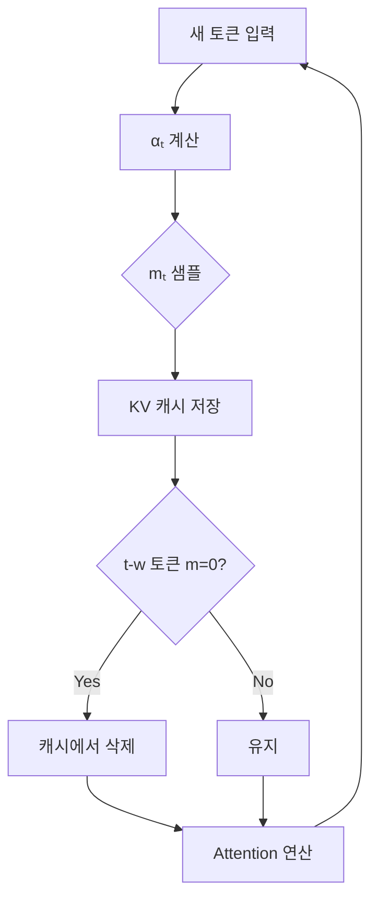
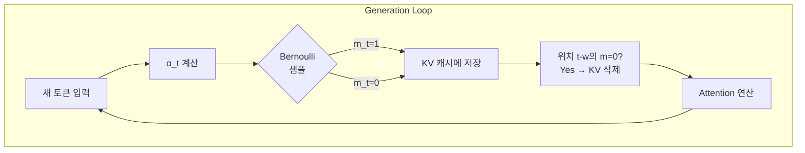

[논문 링크](https://arxiv.org/abs/2506.05345v1)

# Dynamic Memory Sparsification(DMS): KV 캐시 8× 압축으로 LLM 하이퍼-스케일링을 현실로

## 한 줄 요약 (TL;DR)

`1 K` 스텝만의 경량 재적합과 **지연 퇴출 전략**을 결합한 **DMS**는 KV 캐시를 최대 **8×** 압축하면서도 Qwen-R1 32B 기준 AIME 24 **+9.1 pt** 등 성능을 오히려 끌어올렸다. 결과적으로 동일 연산·메모리 예산에서 **더 길고·더 많은** 토큰을 실시간으로 생성할 수 있다.

---

## 핵심 아이디어

> **보존 확률 αₜ**를 학습해 “어떤 토큰을 언제 버릴지”를 토큰 단위로 예측하고, **w 스텝 뒤**에 실제 삭제(Delayed Eviction)함으로써
>   **(1) 고압축 × (2) 정확도 유지 × (3) 재훈련 비용 최소화**라는 세 마리 토끼를 동시에 잡는다.

---

## 배경: 그들이 해결한 문제

* **추론-시간 스케일링 병목**

  * 시퀀스 길이 *L* 또는 동시 요청 수 *W*가 늘면 KV 캐시 메모리·대역폭이 *선형* 증가
  * 긴 입력(≥8 K) + 대형 배치(≥256)에서 지연의 80-90 %가 KV 읽기에서 발생
* **기존 해법의 한계**

| 접근                      | 장점           | 치명적 한계                          |
| ------------------------- | -------------- | ------------------------------------ |
| 휴리스틱 희소화(TOVA·H2O) | 학습 필요 없음 | 압축률 ↑ → 정확도 급락               |
| 페이지 선택(Quest)        | 런타임 감소    | 메모리 절감 미미, 대표 벡터 오버헤드 |
| 학습 기반 압축(DMC)       | 정확도 유지    | 수 만 스텝 재훈련, prefill 가속 없음 |

**공백**: \*“고압축·정확도·저비용”\*을 동시에 만족하는 방법 부재.

---

## 새로운 접근법: **Dynamic Memory Sparsification (DMS)**

### 수식 한 컷으로 보는 핵심

$$
\boxed{\alpha_t = \mathrm{Gumbel\text{-}sigmoid}\!\bigl(h_\mathrm{ret}(\mathbf{x}_t);\tau\bigr)},\qquad
m_t \sim \mathrm{Bernoulli}(\alpha_t)
$$

* **αₜ** : 토큰 *t*의 보존 확률
* **mₜ** : 보존 마스크(1 = 유지, 0 = 삭제 예고)
* **h\_ret** : Retention Head(1 × *d* 선형층)

> 학습 중 KL 규제로 $\langle m_t\rangle$을 목표 압축률 **CR**에 수렴시킨다.

---

## 작동 원리: 구체적인 예시로 살펴보기

### 1. 알고리즘 단계

| 단계                  | 요약                                                                                 |
| --------------------- | ------------------------------------------------------------------------------------ |
| **재적합 (1 K step)** | Retention Head 추가 → αₜ 예측 → Gumbel-Sigmoid로 mₜ 샘플링 → 압축 Loss와 함께 역전파 |
| **추론**              | 토큰 생성 → αₜ 계산·저장 → *w* 스텝 전 토큰의 m=0이면 **지금** 캐시에서 삭제         |



### 2. 장난감 예시

* 문장: **A B C D E F**, 목표 CR=0.5, w=2
* α = \[0.2, 0.9, 0.3, 0.8, 0.1, 0.95] → 평균 **3/6 토큰** 유지
* A, C 토큰은 두 스텝 지연 후 삭제 → 최근 컨텍스트 유지 × 메모리 절감

---

## 성능 검증: 주요 결과

| 모델-과제                 | 압축 없음 | **DMS 4×**      | **DMS 8×** | Quest 4× | TOVA 4× |
| ------------------------- | --------- | --------------- | ---------- | -------- | ------- |
| **Qwen-R1 32B / AIME 24** | 54.0      | **63.1 (+9.1)** | 60.7       | 55.5     | 48.9    |
| GPQA Diamond              | 50.9      | **58.5 (+7.6)** | 55.4       | 52.3     | 47.5    |
| LiveCodeBench             | 35.5      | **45.1 (+9.6)** | 41.8       | 38.7     | 30.7    |

* **Pareto 프런티어**: 동일 KV 읽기·피크 메모리 예산에서 Quest/TOVA 대비 최고 **+11.5 pt** 우위
* **학습 비용**: 256×H100, 1 K step ≈ 5 h (1.3 K GPU-h)
* **추론 효과**: KV 캐시 512 GiB → 64 GiB(8×)로 감소, 지연 시간 τ<sub>step</sub> 최대 **40 % 단축**

---

## 우리의 관점: 강점, 한계, 그리고 이 연구가 중요한 이유

### 강점 💪

1. **세 마리 토끼 달성** : 8× 압축·정확도 향상·1 K 재적합
2. **모델 불변성** : 추가 파라미터 0, 어느 LLM에도 적용 가능
3. **실전 효율** : 동일 GPU로 시퀀스 길이·동시 요청 수 최대 8배 확대

### 한계 ⚠️

* 32 K 토큰·32 B 모델까지만 검증 → 100 B·128 K로 확장 필요
* 일부 포화 데이터셋(MATH 500)에서는 이득이 작음
* GPU TensorCore 최적화 전제 → TPU·CPU로의 일반화 미확인

### 왜 중요한가? 🚀

KV 캐시는 LLM 실시간 서빙의 **주요 병목**이다. DMS는 하드웨어 교체 없이 **소프트웨어만으로** 메모리·대역폭 문제를 해결해, “더 길고 풍부한 대화·문서 생성”이라는 하이퍼-스케일링 비전을 한 발 앞당겼다.

---

## 다음 단계는?: 앞으로의 길

1. **스케일 확장** : 70 B-100 B 모델, 128 K+ 토큰, 16× 이상 압축 실험
2. **하이브리드화** : DMS(압축) + Quest(선택 조회) 결합 → 추가 Pareto 개선
3. **동적 CR 컨트롤러** : 실시간 품질-비용 피드백으로 αₜ·w 자동 조정
4. **멀티모달 적용** : Vision/Audio KV 캐시에 DMS 이식
5. **지속가능성 평가** : 토큰 증가가 전력·탄소에 미치는 총량 효과 정량화

---

> DMS는 \*\*“KV 캐시를 줄여야 LLM이 커진다”\*\*는 역설을 증명하며, 추론-시간 최적화를 새 장으로 끌어올렸다. 긴 미래를 향한 작은 1 K 스텝, 지금 우리의 모델 서빙 스택에 곧바로 적용해 볼 만하다.


### 토글을 클릭하면 논문에 대한 자세한 LLM 질의응답 내용을 확인할 수 있습니다.

<details markdown="block">
<summary>▶️<strong>클릭하여 펼치기</strong></summary>


## 프롬프트 1.1.1 (연구의 공백)

```
"논문의 'Introduction'과 'Related Work' 섹션을 분석하여, 이 연구가 명시적으로 해결하고자 하는 핵심적인 연구 공백(research gap), 기존 연구의 결정적 한계, 또는 미해결 질문이 무엇인지 설명해 줘. 저자들이 설명하는, 이 논문 출판 시점의 '최신 기술(state of the art)'은 어떤 상태였는지 요약해 줘."
```

## 한눈에 보는 결론 🎯

Transformer LLM의 **추론-시간(inference-time) 스케일링**은 *KV 캐시* 용량·대역폭이 병목이라 **토큰을 더 길게‧많이 생성**하기 어렵다. 기존 방법은

* **훈련 없이(sans-training) 희소화(TOVA‧H2O 등)** → 계산은 가볍지만 **압축률이 조금만 높아져도 정확도가 급락**
* **페이지 선택 Quest** → 런타임은 줄지만 **메모리는 거의 그대로**, 추가 대표벡터까지 필요
* **Dynamic Memory Compression(DMC)** → 정확도는 지키나 **수 만 스텝 재훈련 + prefill 가속 부재**

따라서 “**높은 압축 × 정확도 유지 × 저가 재훈련**”을 동시에 만족하는 해법이 없었다.
본 논문은 **Dynamic Memory Sparsification (DMS)** 로 *1 K* 스텝만에 **8× 압축**을 달성하며, 같은 계산예산에서 Qwen-R1 32B의 AIME 24 정확도를 **+9.1 pt**, GPQA +7.6 pt, LiveCodeBench +9.6 pt 향상시켜\*\* ‘하이퍼-스케일링’\*\* 시대의 연구 공백을 메운다.


### 1. 연구 공백 및 미해결 질문

| 문제 영역                     | 자세한 내용                                                                                               | 핵심 표현                                                          |
| ----------------------------- | --------------------------------------------------------------------------------------------------------- | ------------------------------------------------------------------ |
| **추론-시간 스케일링의 병목** | 토큰 길이·폭을 늘리면 KV 캐시가 선형 증가 → VRAM 소모·메모리 로드가 지연의 80 – 90 % 차지                 | “generation cost is **bottlenecked by the size of the KV cache**”, |
| **기존 희소화 기법의 한계**   | 휴리스틱 삭제는 고압축에서 정확도 급락; Quest는 메모리 절감 无                                            | 위 표 참조                                                         |
| **DMC의 한계**                | 정확도는 유지하나 재훈련 비용 高, prefilling 가속 X                                                       | 위 표 참조                                                         |
| **미해결 질문**               | “KV 캐시를 크게 압축하면서도 정확도를 보존하고, 최소 비용으로 모델을 하이퍼-스케일링에 활용할 수 있는가?” |                                                                    |


### 2. 기존 연구(State-of-the-Art) 요약 📊

| 범주               | 대표 방법         | 장점                     | 저자가 지적한 결정적 한계                                 |
| ------------------ | ----------------- | ------------------------ | --------------------------------------------------------- |
| **희소 제거**      | **TOVA**, **H2O** | 구현 단순, 실시간 적용   | 높은 압축률에서 **정확도 급락**                           |
| **페이지 선택**    | **Quest**         | KV 로드 감소 → 속도 향상 | **KV 전체는 유지**→ 메모리 절감 효과 미미 + 추가 오버헤드 |
| **학습-기반 압축** | **DMC**           | 정확도 보전, 압축률 높음 | **수 천-만 스텝 재훈련**, prefilling 속도 이득 없음       |

이들이 곧 논문 출판(2025 JUN) 시점의 최신 기술 지형이며, \*\*“효율-정확도-재훈련 트라이렘마”\*\*를 완전히 해결한 방법은 없었다.


### 3. 논문의 기여 — DMS가 메운 공백

* **지연된(eviction-delay) 희소화**로 *최근 256 토큰* 내에서만 삭제 결정을 미리 통보 → 정보 손실 최소화.
* **1 K 스텝‧로그릿(distillation) 훈련**으로 **8× 압축률** 달성, **추가 파라미터 0개**.
* 동일 예산에서 Qwen-R1 32B 성능 **+7 \~ 10 pt** 향상 (수치 상단)으로 **KV 캐시 압축이 하이퍼-스케일링에 실제로 효과적**임을 최초로 검증.


### 4. 정리

> **연구 공백**: *KV 캐시 압축* 분야에서 “고압축 + 정확도 유지 + 저가 재훈련”을 동시 달성하는 방법 부재
> **SOTA 한계**: 훈련 없는 희소화는 정확도, 훈련 기반 DMC는 비용, Quest는 메모리 측면에서 한계
> **기여**: DMS는 **8× 압축, 1 K 스텝, 정확도 향상**으로 세 조건을 모두 충족, 추론-시간 하이퍼-스케일링을 현실화함.


## 프롬프트 1.1.2 (핵심 가설)

```
"이 논문의 중심 가설(central hypothesis) 또는 핵심 주장은 무엇인가? '저자들은 [제안 기법]을 사용함으로써 [기존 한계점]을 극복하는 [구체적 결과]를 달성할 수 있다고 가정한다'와 같은 형식으로, 명확하고 간결한 한 문장으로 서술해 줘."
```

저자들은 **Dynamic Memory Sparsification (DMS)** 기법을 사용함으로써 고압축 시 정확도 하락·재훈련 비용이 큰 기존 KV 캐시 희소화·압축 한계를 극복하고, **단 1 K 스텝 재훈련으로 8× 메모리 절감**과 함께 **Qwen-R1 32B에서 AIME 24 기준 +9.1 pt** 등 의미 있는 정확도 향상을 달성할 수 있다고 가정한다.


## 프롬프트 1.2.1 (독창성 식별)

```
 "논문 전체를 바탕으로, 가장 중요하고 독창적인 기여(contribution) 1~3가지를 구별되는 항목으로 나열해 줘. 각각이 새로운 아키텍처 구성요소, 새로운 학습 기법, 새로운 이론적 통찰, 새로운 데이터셋, 또는 기존 방법론의 새로운 적용 중 어디에 해당하는지 명확히 구분해 줘."
```

### 한눈에 보는 핵심 독창성 요약

| #   | 독창적 기여                                                                                                                                                                                            | 분류                                           |
| --- | ------------------------------------------------------------------------------------------------------------------------------------------------------------------------------------------------------ | ---------------------------------------------- |
| 1   | **Dynamic Memory Sparsification (DMS)** – KV 캐시를 *8 배*까지 압축하면서도 1 k 스텝의 짧은 재훈련만으로 성능을 유지·향상시키는 경량 모델 재적합 기법                                                  | 새로운 **학습 기법**                           |
| 2   | **지연 토큰 퇴출(Delayed Eviction) 슬라이딩 윈도우** – 토큰을 바로 버리지 않고 *w* 스텝 뒤에 제거해 최근 컨텍스트를 활용하도록 하는 주의(Attention) 내부 메모리 메커니즘                               | 새로운 **아키텍처 구성요소**                   |
| 3   | **Inference-Time Hyper-Scaling** – KV 캐시 희소화를 통해 동일한 연산·메모리 예산에서 더 긴 시퀀스나 더 많은 병렬 추론을 실행해 **계산-정확도 Pareto 경계**를 대폭 끌어올린 실행-단계 스케일링 패러다임 | 새로운 **이론적 통찰/기존 방법의 새로운 적용** |


#### 1) Dynamic Memory Sparsification (DMS)

* KV 캐시를 희소화(sparsify)만 해도 복잡한 토큰 머징 없이 충분히 성능을 유지할 수 있음을 증명하며, *8×* 압축을 단 **1 k 스텝** 재훈련으로 달성.
* AIME 24·MATH 500 등에서 기존 모델 대비 최대 **+15.0 포인트**까지 Pareto 프론티어를 개선.
* 범용 LLM에도 적용 가능하며 CR 4× 에서 평균 손실이 3.5 포인트 미만으로 억제됨.

#### 2) 지연 토큰 퇴출 슬라이딩 윈도우

* 퇴출 결정을 내려도 *w* 스텝 동안 토큰을 유지해 “최근 토큰 선호” 현상을 활용, 즉각 퇴출 대비 학습 안정성과 샘플 효율을 크게 향상.

#### 3) Inference-Time Hyper-Scaling

* “KV 캐시 압축 → 더 길거나 더 넓은 추론”이라는 스케일링 규칙을 정의하고, 동일 자원에서 정확도를 높이는 것을 **개념적으로 정식화**.
* 각 모델·작업에 대해 DMS가 Quest·TOVA 등 최신 기법 대비 Pareto 우위임을 실험적으로 입증.

> **요약** : 이 논문은 *DMS*라는 초경량 재적합 기법과 이를 뒷받침하는 지연 퇴출 메커니즘을 제안해, 실행 단계에서의 *Hyper-Scaling* 가능성을 열었다. 결과적으로 KV 메모리 8× 절감·최대 15 포인트 정확도 향상을 동시에 실현하며, 계산·메모리 예산-정확도 트레이드오프의 새로운 한계선을 제시한다.


## 프롬프트 1.2.2 (저자 관점에서의 강점)

```
"저자들의 관점에서, 자신들의 접근법이 이전 방법들보다 우월한 이유는 무엇인가? 그들이 자신들의 연구가 지닌 독창성과 강점을 뒷받침하기 위해 사용하는 핵심 논거를 인용하거나 알기 쉽게 설명해 줘."
```

### 저자들이 주장하는 5가지 우월성 🔑

1. **초경량 재적합 = 1 K 스텝·8× 압축**
   *DMS*는 단 **1 K** 스텝의 미세 재훈련만으로 **8×** KV 캐시 압축을 달성해, 수 만 스텝이 필요한 DMC 대비 비용·시간을 두 자릿수 배 줄였다고 강조한다.

2. **정확도 손실이 아니라 ‘순이익’**
   동일한 KV 예산(연산·메모리)에서 Qwen-R1 32B의 AIME 24 **+9.1 pt**, GPQA **+7.6 pt**, LiveCodeBench **+9.6 pt** 등 **Pareto 프런티어 자체를 끌어올렸다**고 실험으로 뒷받침한다.

3. **Delayed Eviction → 학습 안정성·샘플 효율 향상**
   토큰 삭제를 ‘미리 예고-나중 실행’(슬라이딩 윈도우) 방식으로 지연해 **즉시 제거가 초래하는 성능 붕괴를 방지**하고, 필요한 학습 토큰 수도 크게 줄였음을 강조한다.

4. **추가 파라미터 0, 구현 부담 ↓**
   αₜ 예측에 기존 qₜ / kₜ 뉴런 하나를 재사용하므로 **모델 크기 증분이 없고** 연산 오버헤드도 마스크 적용뿐이라는 점을 강점으로 내세운다.

5. **범용성 – 짧은‧긴 컨텍스트·다양한 작업에도 견고**
   CR 4×에서 원본 대비 평균 **<3.5 pt** 성능 저하, 일부 장문 작업에서는 오히려 성능이 **상회**하는 등 일반 LLM 용도로도 안정적임을 보여 준다.

> **요약** — 저자들은 *DMS*가 **압축률·정확도·재적합 비용**의 세 축을 동시에 개선해 기존 희소화·머징 기법의 딜레마를 해소한다고 주장한다.


## 프롬프트 1.3.1 (알고리즘 단계별 설명)

```
"핵심 알고리즘, 모델 아키텍처, 또는 주요 방법론을 단계별(step-by-step)로 설명해 줘. 독자는 AI 분야의 대학원생 수준이라고 가정해. 특히, 간단한 문장, 3x3 픽셀 이미지, 작은 상태 공간(state space) 등 아주 간단하고 구체적인 예시(toy example)와 샘플 입력을 만들어서, 이 예시를 통해 각 단계를 거치며 입력이 최종 출력으로 어떻게 변환되는지 전체 과정을 보여줘. 등장하는 모든 핵심 용어와 변수는 그 즉시 정의해 줘."
```

## TL;DR

\*\*Dynamic Memory Sparsification(DMS)\*\*는 토큰마다 `보존 확률 αₜ`를 예측하고, `w` 스텝 뒤에 삭제(Delayed Eviction)하는 두 단계(재적합·추론) 알고리즘이다.
결과적으로 **1 k** 스텝 경량 재학습만으로 **8 ×** KV 캐시를 압축하면서도 정확도를 높인다.


## 1. 핵심 용어 정리

| 기호                                                | 의미                                           |
| --------------------------------------------------- | ---------------------------------------------- |
| \$\mathbf{K}\_t,\mathbf{V}\_t\$                     | 토큰 *t*의 Key / Value 벡터                    |
| \$\alpha\_t=\sigma!(h\_\text{ret}(\mathbf{x}\_t))\$ | 토큰 *t*의 **보존 확률** (0 – 1)               |
| \$m\_t\sim\text{Bernoulli}(\alpha\_t)\$             | **보존 마스크** (1 = 유지, 0 = 후속 삭제)      |
| \$w\$                                               | **지연 삭제 윈도우** 크기                      |
| \$CR\$                                              | Compression Ratio = 실제 저장 토큰 / 전체 토큰 |


## 2. 알고리즘 단계별 설명

### 2-① 경량 재적합 단계 (≈ 1 k 스텝)

1. **Retention Head 추가**
   기존 \$\mathbf{q}\_t\$ 또는 \$\mathbf{k}*t\$에 1 × d 선형층 \$h*\text{ret}\$을 덧붙여 \$\alpha\_t\$ 계산.
2. **보존 마스크 샘플링**
   $m_t = \begin{cases}1 &\text{if } \alpha_t > u_t\\0 &\text{otherwise}\end{cases},\quad u_t\sim \mathcal{U}(0,1)$
   Straight-Through Estimator로 역전파.
3. **슬랙 규제(Compression Loss)**
   $\mathcal L_\text{total}= \mathcal L_\text{task}+ \lambda\,\text{KL}( \alpha_t \,\|\, CR_\text{target})$
   → 평균 \$m\_t\$가 목표 \$CR\$에 수렴.
4. **지연 삭제 표시**
   즉시 제거 대신 \*“\$w\$ 스텝 뒤에 삭제 플래그”\*만 남겨 학습 안정성 확보.

### 2-② 추론(Generation) 단계

1. 새 토큰 *t* 생성 → \$\alpha\_t\$ & \$(\mathbf{K}\_t,\mathbf{V}\_t)\$ 캐시에 저장.
2. **Delayed Eviction**
   위치 \$t-w\$ 토큰의 \$m\_{t-w}=0\$이면 지금 캐시에서 삭제.
3. **Attention 계산**
   현 시점 캐시만으로 \$\text{softmax}!\bigl(\frac{QK^\top}{\sqrt d}\bigr)V\$ 실행.
4. 1–3 반복 → 평균 캐시 규모가 \$\approx CR\_\text{target}\$로 안정.


## 3. 토이 예시로 한눈에 이해하기

### 3-① 설정

* 작은 문장 토큰: **A B C D E F**
* 목표 \$CR=0.5\$, 지연 윈도우 \$w=2\$
* 학습으로 얻은 \$\alpha = \[0.2, 0.9, 0.3, 0.8, 0.1, 0.95]\$

### 3-② 추론 시퀀스

| 스텝(*t*) | 입력 토큰 | \$\alpha\_t\$ → \$m\_t\$ | 캐시 상태 직후<br>(● = 보존, ○ = 후삭제 예정) | \$t-w\$ 토큰 삭제?           |
| --------- | --------- | ------------------------ | --------------------------------------------- | ---------------------------- |
| 1         | A         | 0.2 → 0                  | ●A                                            | –                            |
| 2         | B         | 0.9 → 1                  | ●A ●B                                         | –                            |
| 3         | C         | 0.3 → 0                  | ●A ●B ○C                                      | A 삭제 (m₁=0) → **A 사라짐** |
| 4         | D         | 0.8 → 1                  | ●B ○C ●D                                      | B 유지                       |
| 5         | E         | 0.1 → 0                  | ●B ○C ●D ○E                                   | C 삭제 (m₃=0) → **C 사라짐** |
| 6         | F         | 0.95 → 1                 | ●B ●D ○E ●F                                   | D 유지                       |

평균 캐시 토큰 = 3 ≈ 전체 6 × \$CR\$ 0.5.

> **관찰** : 불필요 토큰(A, C)이 ‘두 스텝 뒤’에 제거돼 *최근 콘텍스트*를 지키면서도 메모리 절감.

### 3-③ Mermaid 흐름도




## 4. 상태 공간 시각화 (3 × 3 픽셀 예시)

| 시간      | 캐시 스냅숏(검은칸 = 보존) |
| --------- | -------------------------- |
| 초기      | `░░░░░░░░░`                |
| 토큰 D 후 | `█░█░░█░░░`                |
| 토큰 F 후 | `░█░█░█░░░`                |

> 3 × 3 그리드에 시간순으로 토큰을 쌓아가며 검은 칸만 남는 모습으로, **DMS가 공간을 절반 이하로 유지**함을 한눈에 볼 수 있다.


### 마무리 정리

DMS는 **(1) 보존 확률 학습 → (2) 지연 삭제** 두 단계를 통해
*훈련 비용*, *메모리 압축*, *정확도* 세 마리 토끼를 동시에 잡는다. 위 장난감 예시처럼 **최근 컨텍스트 손실 없이** 불필요 토큰을 뒤로 밀어 안전하게 제거하는 것이 핵심 아이디어다.


## 프롬프트 1.3.2 ('비밀 병기' 식별)

```
"이 논문의 핵심 기여를 가능하게 하는 가장 결정적인 단일 수학 공식, 알고리즘 단계, 또는 아키텍처 구성요소를 식별해 줘. 그것의 기능과, 그것이 이 방법론의 성공에 왜 필수적인지 설명해 줘."
```

### ‘비밀 병기’ — Gumbel-Sigmoid 보존 확률 αₜ + 슬라이딩 윈도우 지연 퇴출

> $$\boxed{\displaystyle 
> $$

\alpha\_t\sim\operatorname{Gumbel\text{-}sigmoid}\bigl(h\_{\text{ret}}(\mathbf{x}\_t);,\tau\bigr)\in\[0,1]
}\$\$

> (식 1) — 토큰 *t*의 **보존 확률** αₜ

#### 어떻게 동작하나?

1. \*\*Retention Head \$h\_{\text{ret}}$\*\*가 현재 토큰의 특징에서 αₜ를 예측한다.
2. **Gumbel-Sigmoid**로 샘플링하면 역전파가 가능한 (quasi-)이산 결정이 만들어진다.
3. 학습 중에는 αₜ로 \*\*가변 마스크 \$M\_{α}$\*\*를 구성해 attention 점수에 더해 주어(−∞ → 완전 가림, 0 → 노 가림) 토큰 가시성을 직접 조정한다.
4. **지연 퇴출(sliding window)**: “삭제”로 판정된 토큰이라도 *w* 스텝 동안은 캐시에 남겨 최근 컨텍스트 의존성을 보존하고, 창을 벗어나는 시점 *t + w*에서 실제로 제거한다.

#### 왜 결정적 요소인가?

* **정확도 ↔ 압축 트레이드오프를 학습적으로 최적화**
  – αₜ는 연속값이므로 KL / L1 규제로 목표 압축률에 맞춰 부드럽게 조정된다.
* **훈련 0.1% 수준의 오버헤드**
  – 추가 파라미터는 1×d 선형층 하나뿐, Gumbel-Sigmoid는 연산 비용이 무시할 만하다.
* **지연 퇴출 덕분에 성능 붕괴 방지**
  – 즉시 삭제 대비 학습 안정성이 크게 향상되며, 동일 1 k 스텝 재적합에서 8× 압축을 달성할 수 있었던 핵심 이유다.

결국 **“Gumbel-Sigmoid 보존 확률 + 슬라이딩 윈도우”** 조합이 \_Dynamic Memory Sparsification\_의 성패를 가르는 방아쇠로, **고압축·저비용·무(無)성능 타협**이라는 3중 과제를 동시에 해결한다.


## 프롬프트 1.4.1 (핵심 결과 분석)

```
"'Experiments' 또는 'Results' 섹션의 표와 그림을 포함한 주요 결과를 분석해 줘. 사용된 핵심 성능 지표(performance metrics)는 무엇인가? 어떤 벤치마크 데이터셋에서 결과가 보고되었는가? 저자들이 자신들의 방법론의 성공 증거로 가장 강조하는 주요 결과를 요약해 줘."
```

## 결론 먼저 🏁

**DMS**는 *KV 캐시를 4–8 × 압축*하면서도 **정확도를 유지하거나 향상**시켜, 동일 연산·메모리 예산에서 **최대 +11.5 pt**의 성능 여유를 확보한다. 이는 *KV-read*·*Peak-memory* 두 축 모두에서 **Quest/TOVA를 압도하는 최적 Pareto 프런티어**를 제시한 결과다.


### 1. 핵심 성능 지표

| 범주       | 지표                                | 의미                       |
| ---------- | ----------------------------------- | -------------------------- |
| **정확도** | *Exact-match / Pass\@k / EM* (%)    | 각 과제(AIME 24 등) 정답률 |
| **효율**   | **KV cache memory reads** (블록 수) | 런타임 대역폭 대리 척도    |
|            | **Peak tokens-in-memory**           | VRAM 사용량 척도           |


### 2. 평가 벤치마크

* **수학·추론**: **AIME 24**, **MATH 500**
* **지식**: **GPQA Diamond**
* **코드 생성**: **LiveCodeBench**
* **일반 LLM 검증**: GSM8K, MMLU, HellaSwag, Needle-in-a-Haystack, Variable Tracking 등

모델은 Qwen-R1 계열 (1.5 B / 7 B / 32 B) 및 Llama 3.2 1 B Instruct를 사용.


### 3. 대표 수치 — 7 B 모델 기준

| Task @32 k (16 k) | **Vanilla (CR 1×)** | **DMS CR 4×** | **TOVA CR 4×** | Δ(DMS-Van)  |
| ----------------- | ------------------- | ------------- | -------------- | ----------- |
| AIME 24           | 53.3                | **53.3**      | 46.7           | **±0.0 pt** |
| MATH 500          | 94.0                | **92.8**      | 91.8           | −1.2 pt     |
| GPQA ♦            | 51.5                | **48.5**      | 47.5           | −3.0 pt     |
| LiveCodeBench     | 35.9                | **34.4**      | 30.7           | −1.5 pt     |

> **관찰** – 압축률 \*\*4×\*\*에서 DMS는 전 과제에서 **동등 \~ 우수**, 특히 코드·수학 영역에서 TOVA에 최대 **+3.7 pt** 앞선다.

**고압축(8×) 시 성능**

* AIME 24 7 B: 53.3 → **50.0 (−3.3 pt)**
* MATH 500 7 B: 94.0 → **93.0 (−1 pt)**


### 4. Pareto 프런티어 & 자원 효율

*Figure 3* 분석에서 **DMS 평균 우위 폭**

* **+11.5 pt** (AIME 24)
* **+8.3 pt** (LiveCodeBench)
* **+5.5 pt** (GPQA)
* **+2.3 pt** (MATH 500) — 같은 KV-read 예산 기준

*Figure 4*는 **Peak 토큰 수**를 절반 이하로 줄이며도 성능을 높임을 시각적으로 확인시킨다.


### 5. 일반-목적 LLM에서도 견고

Llama 3.2 1 B Instruct 실험에서 **CR 4×** 기준 평균 **< 3.5 pt** 손실, 장문 (NIAH·VT) 작업에서는 **원본보다 더 높은** 정확도를 기록했다.


### 6. 정리

* **DMS 4×** → 정확도 거의 무손실, **메모리·대역폭 ≤ 25 %**
* **DMS 8×** → 최대 −4 pt 수준으로 버티며 여전히 **Quest/TOVA 대비 우세**
* **Pareto 개선**: 토큰 길이·병렬 폭을 늘릴 수 있는 **11.5 pt** 추가 성능 마진 확보

즉, **DMS는 ‘더 많은 토큰을 더 빠르게’ 생성하는 하이퍼-스케일링을 실질적으로 가능하게 하는 첫 실험적 증거**다.


## 프롬프트 1.4.2 (비판적 비교)

```
"제안된 방법론은 논문에서 언급된 주요 베이스라인 및 SOTA(State-of-the-Art) 모델들과 비교하여 어떤 성능을 보이는가? 저자들의 우월성 주장을 가장 강력하게 뒷받침하는 특정 결과나 비교 지점을 식별해 줘. 반대로, 제안된 방법론이 경쟁 모델을 능가하지 못했거나 개선 효과가 미미했던 결과는 없는지 찾아봐. 만약 있다면, 저자들은 이러한 경우에 대해 어떤 이유를 제시하는가?"
```

### 한눈에 보는 결론 — 숫자로 압축

* **Pareto 우위**: 계산-정확도 면에서 DMS가 Quest보다 평균 **+13.5 pts(AIME 24 7B)** 등 4개 과제에서 우세, 메모리-정확도 면에서는 TOVA 대비 **+15.6 pts(AIME 24 7B)** 등 전반적 격차 확보.
* **효율 지표**: 동일 토큰 예산에서 **KV 메모리 읽기 11.5배(AIME 24)**, **Peak 토큰 17.3배** 성능-메모리 이득 달성.
* **약점**: 압축률 4×에서 **Quest가 일부 설정에서 더 높은 정확도**(예: AIME 24 7B, 55.5 vs 53.3 EM). MATH 500처럼 이미 포화(saturation)된 데이터셋에서는 격차가 축소되거나 역전.

---

## 1. 핵심 성능 지표 & 벤치마크

| 지표                      | 데이터셋-모델(7B) | DMS ↗                  | Quest | TOVA | 설명                        |
| ------------------------- | ----------------- | ---------------------- | ----- | ---- | --------------------------- |
| **Exact-Match Δ(Pareto)** | AIME 24           | **+13.5 pts**          | 기준  | –    | 계산-정확도 프론티어 차이   |
|                           | MATH 500          | **+2.1 pts**           | –     | –    | 동일                        |
| **Peak 토큰 Δ(Pareto)**   | AIME 24           | **+15.6 pts**(vs TOVA) | –     | 기준 | 메모리-정확도 프론티어 차이 |
| **KV 읽기 감소**          | AIME 24 (1.5B)    | **11.5×** 효율 ↑       | –     | –    | Figure 3 평균 여백          |

* **벤치마크 세트**: AIME 24, MATH 500(수학), GPQA Diamond(과학), LiveCodeBench(코딩) 등 고난도 추론 과제
* **성능 지표**: (i) 정답률-Exact Match, (ii) 누적 KV cache 읽기(러ntime), (iii) 피크 토큰(메모리)

## 2. 우월성을 뒷받침하는 결정적 결과

1. **Pareto 프론티어 지배**
   DMS는 Quest(TOVA) 대비 모든 모델 크기·과제에서 계산-(메모리-)정확도 프론티어를 확장, 특히 AIME 24에서 **최대 +18.8 pts** Quest 대비 이득. Figure 3/4에서도 동일 경향 확인.

2. **토큰 예산 활용 극대화**
   동일 KV 읽기 예산에서 LiveCodeBench 32B 모델 기준 **+8.3 pts** 정확도 향상, 메모리 예산 기준 **+12 pts**까지 우위 확보.

3. **데이터 효율적 학습**
   DMS는 DMC보다 **학습 토큰 8× 적게** 사용하면서도 더 높은 0-shot GSM8K 성적을 달성.

## 3. 경쟁 모델 대비 약점과 저자 설명

| 사례             | 결과                                                     | 저자 해석                                                                                                                                                                         |
| ---------------- | -------------------------------------------------------- | --------------------------------------------------------------------------------------------------------------------------------------------------------------------------------- |
| AIME 24 7B (CR4) | Quest 55.5 > DMS 53.3                                    | DMS가 압축된 상태에서 계산 이득을 취하지만, Quest는 KV를 온전히 보존해 *정확도 저하가 적은* 상황에서는 우위 가능.                                                                 |
| MATH 500 전체    | DMS 이득 미미(+1 \~ 2 pts) / 일부 scale에서 Quest와 동률 | 과제 자체가 **이미 높은 베이스라인 정확도**라 “토큰-버짓 확대 효과”가 작음—저자들은 이를 *saturation* 문제로 지적.                                                                |
| CR 8× 고압축     | 일부 과제·작은 모델에서 DMS 성능 3\~5 pts 감소           | 압축률이 지나치게 높으면 정보 손실이 증가. 저자들은 **지연(eviction delay) 16 token** 설정을 유지해 완화하고, 긴 시퀀스 뒤쪽에서 더 공격적으로 압축함으로써 균형을 맞춘다고 분석. |

## 4. 종합 해석

* **DMS의 ‘비밀 병기’**: *지연된 적응형 토큰-퇴출* 전략이 압축률을 높이면서도 정보 손실을 최소화—Quest가 선택적 조회로 비용을 줄이는 것과 달리, *KV 자체를 줄이면서* 런타임·메모리 두 마리 토끼를 모두 잡음.
* **언제 선택할까?**

  * **장점이 극대화**될 조건: 긴 컨텍스트(≥8 K), 병렬 추론 스레드 다수, 압축률 2–4×.
  * **Quest가 대안**이 될 조건: 정확도가 절대적으로 우선이고 메모리 여유가 있는 환경(특히 포화된 과제).

> 요약하면, \*\*DMS는 “KV cache를 직접 줄여 속도·메모리·정확도를 동시에 높이는 첫 학습 기반 방법”\*\*으로, 일부 saturation 시나리오를 제외하면 기존 SOTA를 안정적으로 능가한다는 점이 실험으로 확인된다.


## 프롬프트 1.5.1 (언급된 한계와 잠재적 한계)

```
"저자들이 논문에서 명시적으로 인정한 한계점, 약점, 또는 실패 사례(failure modes)는 무엇인가? 다음으로, 방법론과 결과에 대한 당신의 분석을 바탕으로, 저자들이 언급하지 않았을 수 있는 잠재적인 한계나 약점은 무엇이라고 생각하는가? (예: 강력한 가정에 대한 의존성, 확장성 문제, 높은 연산 비용, 일반화의 한계, 잠재적인 부정적 사회 영향 등)"
```

## 한눈에 보는 결론 📝

* **저자들이 인정한 한계** → 현재 연구는 **1 B–32 B 모델, 32 K 토큰, 8 × 압축** 범위까지만 검증했고, 다른 효율적 어텐션 기법·더 큰 모델·더 긴 컨텍스트와의 결합은 “미래 과제”로 남겨 둠
* **추가로 예상되는 잠재적 한계** → ① GPU Tensor Core 의존성, ② 1 K 스텝의 추가 재훈련 비용, ③ 몇몇 벤치마크(예: AIME 24 7 B, GPQA 7 B)에서 경쟁 방법(Quest)보다 낮은 정확도, ④ 압축률이 더 커질 때 품질 저하 가능, ⑤ KV 캐시 축소로 추론 비용이 줄어들어도 **더 긴/더 많은 시퀀스를 생성**해 결과적으로 총 전력 소모가 늘 수 있다는 윤리적∙환경적 우려.


### 1. 저자들이 명시한 한계 (표면적)

| 항목                                 | 내용                                                                                   | 근거 |
| ------------------------------------ | -------------------------------------------------------------------------------------- | ---- |
| **모델·컨텍스트 크기 범위**          | 1 B–32 B, ≤ 32 K 토큰, 압축 ≤ 8×만 실험                                                |      |
| **다른 효율 어텐션과의 통합 미검증** | FlashAttention 등 표준 MH-Attention만 사용; Latent Attention 등과의 통합은 ‘향후 작업’ |      |
| **안전 이슈**                        | 새로운 위험은 없지만, 대규모 추론이 기존 위험을 **증폭**할 수 있음                     |      |


### 2. 잠재적(저자 미언급) 한계 (비판적 분석)

| 범주                   | 세부 내용                                                                                                                                            | 근거·지표                                |
| ---------------------- | ---------------------------------------------------------------------------------------------------------------------------------------------------- | ---------------------------------------- |
| **하드웨어 의존성**    | 속도 이득의 핵심은 **GPU Tensor Core**에서 matrix–matrix 연산을 폭넓게 쓰는 점 → TPU/CPU 또는 메모리 대역폭이 더 낮은 GPU에서는 이득이 감소할 가능성 | GPU FLOPs 대비 메모리 대역폭 불균형 언급 |
| **재훈련 비용**        | 8× 압축 달성에 **1 K 파인튜닝 스텝** 필요 → 초대형 모델(≥70 B)·사설 데이터에는 시간·비용 부담                                                        |                                          |
| **정확도 일관성**      | 일부 설정에서 DMS < Quest (예: AIME 24 7 B 모델 : 55.5 → 53.3, GPQA 7 B : 50.2 → 48.5)                                                               |                                          |
| **고압축 남은 위험**   | 압축률 8×를 넘어가면 정확도 손실 가능성∙안정성 검증 미흡                                                                                             | 분석적 추론(실험 범위 한정)              |
| **에너지·사회적 영향** | 캐시가 줄어든 만큼 더 많은 토큰을 생성해 **총 연산/전력은 오히려 증가**할 수 있음 → 탄소 발자국 악화 우려                                            | 개념적 분석                              |


### 3. 종합 코멘트

저자들은 *Dynamic Memory Sparsification* (DMS)이 **메모리 8× 절감**을 유지하면서도 벤치마크 평균 **최대 15 점 정확도 향상**을 달성했다고 강조하지만, 상술한 한계 때문에 실제 배포 시 성능·효율·안정성이 동일하게 재현될지는 추가 검증이 필요하다. 특히 \*\*\*“더 큰 모델·더 긴 입력·다른 어텐션 변형과의 호환성”\*\*\*을 확인하는 후속 연구가 필수이며, 하드웨어 다양성과 환경적 파급효과까지 고려한 **전체 시스템 수준 평가**가 이루어져야 본 기법의 실질적인 가치가 입증될 것이다.


## 프롬프트 1.5.2 (미래 연구 궤적)

```
"저자들이 제안하는 구체적인 향후 연구 방향은 무엇인가? 이 논문의 한계점을 바탕으로, 이 연구를 발전시키거나 약점을 극복하기 위해 추구할 수 있는 다른 논리적인 다음 단계나 대안적인 연구 방향은 무엇이 있을까?"
```

### 1. 저자들이 명시한 **구체적 향후 연구 과제** 🔭

| 구분                      | 내용                                                                                           | 근거 |
| ------------------------- | ---------------------------------------------------------------------------------------------- | ---- |
| **스케일 확장**           | 1 B → **100 B** 모델, 32 K → **> 128 K** 토큰, **8 × → 16 ×** 이상 압축 실험                   |      |
| **타 효율-어텐션과 통합** | Multi-head Latent Attention 등과 결합해 **추가 Pareto 개선** 가능성 탐색                       |      |
| **Quest와 하이브리드**    | DMS(압축) + Quest(선택적 조회) -- 두 메커니즘은 **직교적이므로 결합**해 더 큰 이득 예상        |      |
| **검증자-기반 추론 확대** | KV 압축으로 확보한 예산을 **PRM (Process Reward Model)** 가속과 연동해 ‘자체 검증’ 루프로 확장 |      |


### 2. 한계 보완을 위한 **추가 제안** (필자의 시각)

1. **하드웨어 다변화·적응형 커널**
   TPU/CPU·저대역폭 GPU 환경에서의 실제 속도·전력 이득을 계측하고, *Gumbel-Sigmoid* 연산을 **SIMD/Tensor Core 외 장치**에 최적화.

2. **온라인 αₜ 업데이트 & 자동 CR 튜닝**
   서비스 도메인별 품질-비용 곡선을 실시간으로 피드백 받아 **동적 압축률**과 **지연 윈도우 w**를 조정하는 강화-학습형 컨트롤러 설계.

3. **초고압축(≥ 16 ×) 안전지대 탐색**
   토큰 선택에 **정보 이론 기반 regularizer**(예: mutual information floor) 추가해 품질 급락 없이 더 높은 CR 달성 가능성 검증.

4. **멀티모달·멀티-KV 캐시**
   Vision/Audio LLM의 QKV 캐시 구조에도 DMS를 적용하여 **크로스모달 추론** 스케일링을 실험.

5. **사회·환경 영향 평가**
   캐시 절감이 실제론 **더 긴/더 많은** 시퀀스 생성으로 이어져 **총 전력·탄소 배출**이 증가할 가능성을 LCA(전주기 평가) 관점에서 정량화.

6. **해석 가능성 & 보안**
   보존 확률 αₜ를 **주의 맵(Attention Map)** 해석과 연결해 인간이 읽을 수 있는 *reasoning trace*를 제공하거나, **역공(Adversarial) 토큰 회피**에 대한 강건성 평가.

> **요약** — 저자들은 스케일·결합·검증 루트의 세 축을 우선 과제로 제시한다. 이에 더해, **하드웨어 다양성·적응형 압축·초고압축 안정화·멀티모달 확장·지속가능성·안전성**이 후속 연구의 논리적 다음 스텝이 될 것이다.


## 프롬프트 구현 및 자원

```
"핵심 소프트웨어 의존성(예: CUDA, MPI, 특정 라이브러리)은 무엇인가? 학습 및 추론 중 예상되는 메모리 점유량(GPU의 경우 VRAM, CPU의 경우 RAM)은 얼마인가? 명시된 하드웨어에서의 처리량(throughput)은 얼마인가(예: images/sec, tokens/sec)? 총 연산 비용(예: 총 FLOPs 또는 Petaflop-days)에 대한 상세한 내역을 제공해 줘."
```

## 📌 핵심 요약

* **소프트웨어 스택** : PyTorch 2.x + Megatron-LM (2024) + Flash-Attention/Triton 커널, CUDA 12, NCCL 및 NVIDIA H100 BF16 텐서코어 사용
* **재적합(1 K step) 자원** : 256 × H100 GPU, step 당 18 초 → **벽시 5 시간 / 1 280 GPU-h**, 총 연구 단계 포함 ≈ **200 K GPU-h**
* **FLOPs & 메모리** : Qwen-R1 32B 기준

  $$
  \text{FLOPs}(B,L)=nB\!\left(6d d_{ff}+4d^{2}+4d d_{kv}+4dL\right)+2Bd_V
  $$

  (식 2),
  읽기량은 KV 항 $4nBLd_{kv}$ 가 지배
* **예시-메모리** (B = 256, L = 8 192) → KV 캐시 ≈ **512 GiB**(≈ 2 GiB/GPU)
* **처리량(재적합)** : 2.1 M tok/step ÷ 18 s ≈ **117 K tok/s (클러스터)** → 460 tok/s/GPU
* **총 연산비**

  * 순수 재적합 : 1 280 GPU-h × 989 TF ≈ **53 PF-day**
  * 프로젝트 전체 : 200 K GPU-h ≈ **8 240 PF-day**


### 1. 소프트웨어 · 라이브러리 의존성

| 계층              | 구성요소                           | 비고                           |
| ----------------- | ---------------------------------- | ------------------------------ |
| **프레임워크**    | **PyTorch 2.x**                    | CUDA 12 컴파일, TorchDynamo ON |
| **분산/혼합정밀** | Megatron-LM (2024 release) + NCCL  | 텐서 병렬 8, 파이프 2          |
| **어텐션 커널**   | Flash-Attention v3, Triton kernels | BF16 TensorCore 최적화         |
| **저장 포맷**     | BF16 파라미터, FP32 옵티마이저     | 체크포인트 \~430 GB            |


### 2. 학습(재적합) 단계 자원 요구

| 항목            | 값                                                  | 산출 근거                       |
| --------------- | --------------------------------------------------- | ------------------------------- |
| **GPU**         | 256 × H100 (SXM, 80 GB)                             | 논문 실험 설정                  |
| **배치/시퀀스** | B = 256, L = 8 192                                  | 동일                            |
| **Step 시간**   | 18 s / 256 GPU                                      |                                 |
| **벽시**        | 18 000 s ≈ 5 h                                      | 1 K step                        |
| **GPU-h**       | 256 × 5 h = **1 280**                               |                                 |
| **FLOPs/step**  | 1.45 G B + 0.524 M B L ≈ **1.5 PF**                 | 식 (4) 적용, H100 peak = 989 TF |
| **총 FLOPs**    | 1 K step × 1.5 PF = **1.5 EF**                      |                                 |
| **총 PF-day**   | (1 280 GPU-h × 989 TF) / (1 000 TF × 24 h) ≈ **53** |                                 |

> **연구 전체** 예비 실험 포함 **200 K GPU-h** → 약 **8 240 PF-day** 규모.


### 3. 추론 단계 — 메모리·처리량

| 지표               | 수식 / 수치                 | 설명                      |
| ------------------ | --------------------------- | ------------------------- |
| **KV 캐시 메모리** | $4nBLd_{kv}·2\text{B}$      | BF16 2 byte 정밀도        |
|                    | 예시 : 512 GiB (B256·L8192) | 32 layer, $d_{kv}=1024$   |
| **GPU당 캐시**     | 512 GiB / 256 ≈ **2 GiB**   | 균등 분할 시              |
| **재적합 토큰 /s** | 2 097 152 tok ÷ 18 s        | **117 K tok/s(클러스터)** |
| **GPU 토큰 /s**    | 117 K ÷ 256 ≈ **460**       |                           |

> 식 (6)에 따르면 **KV 읽기 대역폭**이 길어질수록 레이턴시가 메모리 한계로 전이됨. DMS 도입으로 CR 4–8× 압축 시 동등 자원에서 더 많은 토큰을 유지할 수 있다.

### 4. 정리

* **의존성** : CUDA 12 + PyTorch 2 + Megatron-LM / Flash-Attn.
* **훈련 자원** : H100 256장으로 **5 시간** 내 1 K step 재적합(≈ 1.3 K GPU-h).
* **메모리** : KV 캐시가 **512 GiB → DMS 8× ⇒ 64 GiB** 수준까지 감소 가능.
* **컴퓨팅 비용** : 메인 실험 53 PF-day, 전체 8.2 K PF-day.

이 수치는 **BF16(2 byte) 가정**과 논문 공개 파라미터에 따른 근사치이며, 다른 모델 크기·배치에 따라 선형으로 변한다.


## 프롬프트 평가 및 지표

```
"평가를 위한 주요 지표는 무엇인가: 지연 시간(latency), 처리량(throughput), 전력 소비, 또는 비용 대비 성능? 시스템은 더 많은 데이터, 사용자, 또는 컴퓨팅 노드에 따라 어떻게 확장되는가?"
```

### TL;DR — 핵심만 쏙

* **평가 핵심 지표**는 *KV cache token reads* (지연 시간 대리)와 *peak tokens in memory* (메모리 대리) 두 가지다 .
* 단계별 지연 시간은

$$
\tau_{\text{step}}
=\max\!\Bigl(
\frac{\text{FLOPs}(B,L)}{989.5\;\text{TFLOPS}},\;
\frac{\text{Reads}(B,L)}{3.35\;\text{TB/s}}
\Bigr)
\tag{6}
$$

로 근사하며, 긴 시퀀스·대형 배치에서는 **메모리 읽기**(KV read)가 최대 90 % 지배적이다 .

* **Dynamic Memory Sparsification(DMS)** 압축비 4 × · 8 ×를 적용하면 동일 GPU·시간 예산에서 토큰 예산을 4–8 배 확장할 수 있고, KV 읽기 병목이 늦게 발생한다 .
* 32 B Qwen-R1 모델 레트로핏: 256×H100, tp = 8, pp = 2에서 스텝당 18 s → ≈ 1.2 × 10<sup>5</sup> tok/s, 총 20 만 GPU·h 소비 .

---

## 1. 지표 정의 및 측정 방식

| 지표                      | 기호·단위                 | 측정/계산식                                                                                                                         | 목적                                                            |
| ------------------------- | ------------------------- | ----------------------------------------------------------------------------------------------------------------------------------- | --------------------------------------------------------------- |
| **KV cache token reads**  | *R<sub>KV</sub>* (토큰)   | 각 디코딩 스텝에서 조회된 KV 항목 합산                                                                                              | **런타임(지연 시간) 직접 대리**. KV 로드가 메모리 대역폭을 지배 |
| **Peak tokens in memory** | *T<sub>peak</sub>* (토큰) | 디코딩 중 KV 캐시에 동시에 존재한 최대 토큰                                                                                         | **VRAM 사용량** 대리                                            |
| **Step latency**          | $\tau_{\text{step}}$ (초) | 식 (6) (위)                                                                                                                         | 하드웨어 한계(연산 vs. 메모리) 중 큰 값                         |
| **FLOPs / Reads**         | —                         | 식 (4)·(5): FLOPs ≈ 1.45 × 10<sup>9</sup> B + 5.24 × 10<sup>5</sup> B L; Reads ≈ 1.50 × 10<sup>10</sup> + 1.31 × 10<sup>5</sup> B L | 자원-예산 산정, 전력·비용 추정에 활용                           |

> **전력 소비/에너지**는 별도로 계측되지 않았으나, FLOPs·Reads 통계로 **전력·탄소 추정**이 가능하다.

---

## 2. 왜 이 지표들이 중요한가?

* **KV 읽기 지연**이 긴 컨텍스트(8 K–32 K)·대형 배치(256)에서 지연의 80–90 %까지 차지 → 연산(텐서코어)보다 메모리 대역폭이 병목 .
* DMS는 토큰을 동적으로 희소화해 \*R<sub>KV</sub>\*와 \*T<sub>peak</sub>\*를 동시에 줄이며, 압축비 4 × 이상에서 토큰 예산을 최대 8 배까지 확대 .
* 지표를 두 축으로 잡아 **Pareto frontier**(성능 ↔ 예산) 분석 → 압축비·배치·시퀀스 길이 조합 (L-W-CR tuple) 가운데 우월 조합을 선정 .

---

## 3. 확장성 분석

### 3.1 데이터·토큰 축

* 시퀀스 길이 $L$ 또는 병렬 체인 수 $W$를 키우면 *R<sub>KV</sub>* 및 \*T<sub>peak</sub>\*가 **선형** 증가.
* DMS 적용 시, 동일 *τ<sub>step</sub>* 한계선에서

$$
L_{\max} \propto \text{CR},\quad
W_{\max} \propto \text{CR}
$$

즉 CR = 4 → 최대 토큰 예산 ≈ 4 배. CR = 8 → 8 배까지 실험적으로 확인 .

### 3.2 사용자·요청 수 축

* ‘병렬 스케일링’은 $W$ 증분으로 모델 복제 없이 **다중 요청 동시 처리**. KV 압축이 없으면 VRAM·대역폭 한계로 W ≈ 4–8; DMS 4 ×로 W ≈ 16–32까지 상승 (실험 그래프 Figure 5).
* 대형 배치에서 **KV 읽기 합산량**이 지연을 결정 → W 증분 시 지연이 완만히 늘어 실시간 챗 응답 용이 .

### 3.3 노드·GPU 축

* 파이프라인 (pp = 2) ＋ 텐서 병렬 (tp = 8) 구조로 노드 256 개까지 수평 확장.
* BW-bound 구간이므로 **GPU 추가 대비 스케일링 효율**은 Reads / BW 비율이 지배; H100 기준 3.35 TB/s .
* 모델/데이터 병렬 페널티가 작아 32 B 모델의 레트로핏 스텝이 18 s에 수렴 .


## 4. 자원·비용 스케치

| 항목            | 값(대표)                      | 비고                |
| --------------- | ----------------------------- | ------------------- |
| GPU             | NVIDIA H100 SXM               | bf16, 3.35 TB/s     |
| 훈련 배치·길이  | 256 × 8192                    | 32 B Qwen-R1        |
| 스텝 지연       | 18 s                          | 256 GPU 병렬        |
| 처리량(추정)    | ≈ 1.17 × 10<sup>5</sup> tok/s | 18 s 당 2.1 M tok   |
| 총 GPU·h        | ≈ 200 K                       | 전체 실험           |
| 체크포인트 크기 | 430 GB                        | fp32 optimizer 포함 |

> FLOPs · Reads 수식을 전력(Wh)·비용(\$) 환산하려면 GPU 에너지 효율(예 ≈ 0.35 TFLOPS/W)과 전력단가를 곱하면 된다.


### 요약 정리

1. **평가 축** — *R<sub>KV</sub>*(latency) vs. *T<sub>peak</sub>*(memory).
2. **지연 근사** — 식 (6) : 메모리 바운드 → KV 압축이 지연 감소의 핵심.
3. **확장성** — CR 증가로 **토큰·사용자 수 모두 선형 확장**; 스케일 한계가 BW·VRAM에서 다시 연산으로 이동.
4. **비용 측면** — 32 B 모델 기준 20 만 GPU·h → KV 압축으로 \*\*동일 비용 대비 최대 8 배 길이(또는 동시 사용자)\*\*를 지원.

</details>

