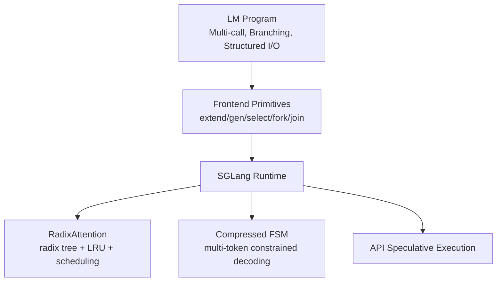

[Paper Link](https://arxiv.org/abs/2312.07104v2)


# SGLang & RadixAttention: How Execution Optimization for "LM Programs" Achieved a 6.4x Speedup

## TL;DR

By combining a language-runtime **co-design** with **RadixAttention (radix tree-based KV cache + scheduling)**, **Compressed FSM (multi-token constrained decoding)**, and **API speculative execution**, this work achieves up to **6.4x higher throughput**, **3.7x lower latency**, **1.7x lower average TTFT**, **1.6x faster JSON/Regex decoding**, and **~6x faster multimodal performance** across various LM programs. Even with no cache reuse opportunities, the **overhead is <0.3%**.


## Core Ideas

*   **Leveraging LM Programs**: Co-designing **primitive languages** like `extend/gen/select/fork/join` with a **dedicated runtime** that understands them.
*   **RadixAttention**: Managing prompts and intermediate results in a **radix tree** and minimizing **KV recomputation** with **Longest-Shared-Prefix-First (LSPF) ≡ DFS** scheduling.
*   **Compressed FSM**: Performing **constrained decoding** for formats like Regex/JSON in a single **multi-token** step.
*   **API Speculative Execution**: **Pre-generating subsequent calls** in black-box API models to reduce **input token costs by ~3x**.


## Background: The Problem They Solved

The center of gravity has shifted from simple chats to **"programs that include LMs (LM Programs)."** The entanglement of multiple calls, branching (forks), structured I/O (JSON), and agentic control flows has created practical bottlenecks in **(1) systematic reuse of shared prefixes**, **(2) constrained decoding**, and **(3) the cost of multiple API model calls**. Existing systems only partially addressed prefix sharing (e.g., simple system prompt sharing) or focused on kernel optimizations, failing to comprehensively solve **scheduling and cache policies**.


## A New Approach: **SGLang (Language + Runtime Co-design)**

| Component               | One-Line Definition                                                               | Why It's Important                                                               |
| ----------------------- | --------------------------------------------------------------------------------- | -------------------------------------------------------------------------------- |
| **Frontend Primitives** | Explicitly define LM calls and branches with `extend/gen/select/fork/join`.       | The runtime receives **branch/prefix hints** to optimize **reuse and batching**. |
| **RadixAttention**      | Radix tree + **LRU Cache** + **LSPF (≡DFS) Scheduling**.                          | Automatically captures **tree-like sharing**, approaching **optimal hit rates**. |
| **Compressed FSM**      | Compresses "single transition chains" in an FSM for **multi-token** decoding.     | Eliminates the token-level bottleneck in **formatted outputs** like JSON/Regex.  |
| **API Speculative**     | Generates a longer initial call, then **matches and reuses** in subsequent calls. | Reduces **input token costs and latency** for API models.                        |


## How It Works: A Look at Concrete Examples

### 1) RadixAttention (KV Cache Reuse)

**Scenario (Toy Example)**
Two requests with the same prompt prefix:

*   A: `Q: Capital of Fra` + `nce?` → “France?”
*   B: `Q: Capital of Fra` + `nkfurt?` → “Frankfurt?” (An incorrect question, but for example's sake)

**Radix Tree Structure**


*   The **K,V** values computed during the prefill for `R→C→O→F` are stored **only once**.
*   The scheduler sorts requests based on the **shared prefix length (=4 tokens)** (**LSPF**). This is effectively **equivalent to a DFS traversal**, so after processing A, request B gets a **full hit** for `R→…→F`.

**Key Formula (Prefill Computation Lower Bound)**

$$
C^* =\sum_{e\in E(T)}|e|, \qquad \text{DFS achieves }C=C^*
$$


> The lower bound is achieved by computing the KV for each tree edge (e) only once. This results in **higher hit rates↑** and **lower TTFT/latency↓**.


### 2) Compressed FSM (Accelerating Constrained Decoding)

**Problem**: Even a fixed prefix like the regex `\{"summary":\s*"` must be processed **token by token**, leading to multiple steps.

**Solution**: Chains of transitions with an **out-degree=1** in the FSM are **compressed into a single transition**. The model runner recognizes this and processes **multiple tokens in a single forward pass**.
→ **~1.6x higher throughput for JSON/Regex decoding**.


### 3) API Speculative Execution (Black-Box Models)

*   The first call generates a **longer sequence**, ignoring the stop token.
*   Subsequent calls **match and reuse relevant spans** from the first result.
  → **≈3x lower input token cost**, with a corresponding reduction in round-trip latency (gains may be smaller if the over-generation fails to match).


## Performance Validation: Key Results

| Category                 |                     Representative Figure (Summary) | Interpretation                                                |
| ------------------------ | --------------------------------------------------: | ------------------------------------------------------------- |
| **E2E (Open Weights)**   | **Up to 6.4x↑ throughput**, **Up to 3.7x↓ latency** | Combined effect of radix tree reuse and frontend parallelism. |
| **TTFT** (Production)    |                                          **~1.7x↓** | Observation from Chatbot Arena batches (real-world validity). |
| **Cache Hit Rate**       |                     **50–99%**, **~96%** of optimal | Empirical validation of LSPF (≡DFS) scheduling.               |
| **Constrained Decoding** |                                **1.6x↑ throughput** | Effect of multi-token decoding with Compressed FSM.           |
| **Multimodal (LLaVA)**   |        **0.18→1.15 image/s**, **0.02→0.10 frame/s** | ~6x improvement thanks to image/frame **KV reuse**.           |
| **API Model Cost**       |                           **≈3x↓ input token cost** | Significant gains when speculative matching succeeds.         |
| **No Cache Opportunity** |                  **No speedup**, **<0.3% overhead** | Safe to keep enabled even when there is no reuse.             |

> **Boundary Condition**: Gains diminish for **long outputs (256–512+)** as the process becomes **decoding-bound**.


## Our Perspective: Strengths, Limitations, and Why This Research Matters

### What Are Its Key Strengths?

1.  **Formal Scheduling Rationale**: The theorem that "**LSPF ≡ DFS** achieves **optimal hit rate**" provides a **principled guide**, moving beyond simple engineering.
2.  **Effectiveness of the Co-design Philosophy**: Since the runtime **directly consumes** frontend hints (branches, prefixes), caching, batching, and scheduling are optimized in the **same context**.
3.  **Broad Applicability**: Provides **engine-agnostic improvements** for text, multimodal, and API models.

### Limitations (Author-Mentioned and Analyzed)

*   **Reliance on Strong Assumptions**: The optimality theorem depends on the assumption that **cache size ≥ max request length**. With long contexts and high concurrency, **evictions and recomputations** may increase.
*   **Long Output Limitation**: As it's focused on prefill optimization, gains are limited in **decoding-bound** scenarios.
*   **Accuracy Risk of Compressed FSM**: Sensitive to tokenizer boundaries and vocabulary changes, with a potential for **distribution skew**.
*   **API Speculative Failure Cases**: If matching fails, it leads to **increased over-generation costs and bias risks**.
*   **Operational Aspects**: In multi-tenant environments, challenges include **cache isolation/security**, and in distributed settings, the trade-off between **meta-tree locality vs. parallelism**.

### Why Is It Important?

As LLMs become **programmable execution targets**, **"how to run them"** has become as critical as accuracy. This research provides a **systematic answer** by weaving together **data structures (radix tree) × scheduling (DFS) × language primitives** into a unified whole.


## What's Next?: The Road Ahead

*   **Extension to Multi-Level Memory Hierarchies**: Incorporate **prefetching/spilling** based on **radix node heat and reuse probability** across HBM↔DRAM↔SSD to **minimize hit rate loss**.
*   **SLO/Fairness Scheduling**: Add **p99 latency guards (EDF/SRTF weighting)** on top of the base LSPF to **prevent starvation**.
*   **Graphing Data-Dependent Control Flow**: Create a **branch-sensitive IR** through tracing and partial evaluation to expand **static scheduling and memory planning**.
*   **FSM-Tokenizer Adaptation**: Assign **token-set labels** to transitions and use **pre-compilation/caching** to achieve both accuracy and performance.
*   **Multi-tenancy Isolation**: Prevent **cache leakage** with tenant tagging and quota-based LRU.
*   **Addressing Long Outputs**: Tackle decoding-bound scenarios by integrating with **speculative decoding, local attention, and output splitting**.


### Appendix: One-Page Summary Table

| Axis            | One-Line Summary                                                                                    | Quantitative Point                           |
| --------------- | --------------------------------------------------------------------------------------------------- | -------------------------------------------- |
| **Problem**     | In the era of LM Programs, **prefix sharing, constrained decoding, and API costs** are bottlenecks. | —                                            |
| **Method**      | **SGLang Language+Runtime**, **RadixAttention**, **Compressed FSM**, **API speculative**.           | —                                            |
| **Core Mech.**  | **Radix Tree + LSPF (≡DFS)** to **minimize KV recomputation**.                                      | Hit rate **50–99%**, **~96%** of optimal.    |
| **Performance** | **6.4x↑ throughput**, **3.7x↓ latency**, **1.7x↓ TTFT**.                                            | JSON **1.6x↑**, Multimodal **~6x↑**.         |
| **Boundary**    | **No cache opportunity** & **Long outputs**.                                                        | **No/small gain**, but **<0.3% overhead**.   |
| **Next Steps**  | **Multi-level caching, SLO scheduling, branch-sensitive compilation**.                              | Improve operational stability, tail latency. |


### (Reference) KaTeX Summary Equations

$$
\textbf{Prefill Cost Lower Bound: }\quad
C^* =\sum_{e\in E(T)}|e|,\qquad
\text{DFS/LSPF achieves }C=C^*
$$

$$
\textbf{Hit Ratio: } \quad
\mathrm{hit} = 1-\frac{C^*}{\sum_{r\in\mathcal{R}} \mathrm{prefill}(r)}
$$


**Conclusion**
SGLang demonstrates why **"language-runtime co-design"** is necessary and how combining **data structures × scheduling × primitives** can push the limits of **system performance**. For practitioners and researchers who want to treat inference engines from a **compiler perspective**, this paper is akin to a **practical design blueprint**.


### Click the toggle to see a detailed LLM Q&A about the paper.

<details markdown="block">
<summary>▶️<strong>Click to expand</strong></summary>


## Prompt 1.1.1 (Research Gap)

```
"Analyze the 'Introduction' and 'Related Work' sections of the paper to explain the core research gap, critical limitations of existing research, or unresolved questions that this study explicitly aims to address. Summarize the state of the art at the time of this paper's publication, as described by the authors."
```


## 1.1.1 Research Gap (Summary of Introduction & Related Work)

### 🔎 Conclusion (Condensed)

*   **Core Gap**: (1) The absence of a **coherent programming language + runtime (co-design)** for **LM Programs** with multi-calls, control flow, and structured I/O. (2) The lack of an execution layer that systematically handles **multi-level (shared-prefix/tree) KV cache reuse**. (3) The **token-level bottleneck in constrained (Regex/JSON) decoding** and the unoptimized cost of **multiple calls to black-box API models**.
*   **Proposal**: SGLang addresses these gaps by co-designing a frontend language (primitives like extend/gen/select/fork/join) and a runtime, incorporating **RadixAttention (KV cache reuse + LRU + scheduling)**, **Compressed FSM (multi-token constrained decoding)**, and **API speculative execution**.
*   **SOTA Limitations (at publication)**: vLLM/ChunkedAttention only partially support **simple prefix sharing**. PromptCache suffers up to **43% accuracy drop**. Hydragen/FlashInfer/ChunkedAttention are **kernel-optimization-centric**, lacking comprehensive **LRU/scheduling/tree-sharing**. Frameworks like LMQL/Guidance/DSPy are not **integrated runtime optimization systems**.


### Background: The Rise of LM Programs and the System Gap

*   **LM Program**: Programmatic interactions involving multiple LLM calls, control flow, structured I/O (e.g., JSON), and agentic workflows. This trend shifts from "chat" to "programs scheduling/controlling LLM generation."
*   **The Gap**: The lack of an **efficient system to program and execute** such applications (on both language and runtime fronts). SGLang proposes a **frontend language + execution runtime** to solve this.


### Core Research Gaps Defined by the Authors

1.  **A General Solution for KV Cache Reuse**

    *   Real-world LM Programs frequently exhibit **multi-level shared tree** patterns from chained calls and forks. Existing systems handle only a few cases manually or **recompute for every request**. → **Automatic, systematic reuse** is needed.
2.  **The Token-by-Token Bottleneck in Constrained Decoding**

    *   Traditional FSM-guided decoding is stuck at **one step per token**; even long constant strings (e.g., `{"summary": "`) require multiple steps. → **Integrate FSM with the model runner** to process **multiple tokens at once**.
3.  **Overhead of Multiple Calls to API (Black-Box) Models**

    *   For API-only models like OpenAI's, the **input token cost and latency** of multi-step calls are high. → Use **speculative execution** to **pre-generate and reuse parts of subsequent calls**, reducing the number of calls and costs.


### Critical Limitations of Related Work (Author's Perspective)

*   **KV Cache Reuse (System Layer)**

    *   **vLLM, ChunkedAttention**: Focus on **simple prefix sharing** (e.g., system prompts), with **no support for multi-level tree sharing or LRU**.
    *   **PromptCache**: Attempts modular reuse beyond prefixes but risks up to **43% accuracy degradation**.
    *   **Hydragen/FlashInfer/ChunkedAttention**: Emphasize **CUDA/kernel optimizations**, lacking the concept of an **LRU cache**.
    *   **API Serve/LLM-SQL**: Limited to **specific application domains**, lacking **radix trees and scheduling**.
*   **LLM Programming Frameworks**

    *   **Guidance, LMQL, DSPy, LangChain, AutoGen, LLM Compiler**, etc., provide **programming models** but are not **integrated with runtime optimizations**. SGLang's distinction is its **language-runtime co-optimization**.


### SGLang's Proposed Solutions (In a Nutshell)

*   **RadixAttention**: Treats the KV cache as a **radix tree-based LRU cache**, introducing the **first** execution strategy to encompass **multi-level sharing, cache-aware scheduling, frontend hints (co-scheduling), and distribution**. This proves that **Longest-Shared-Prefix-First** sorting is equivalent to **DFS for optimal hit rate** (Theorem 3.1).
*   **Compressed FSM**: Combines **consecutive single transitions** to **decode multiple tokens at once**, a general technique for accelerating constrained decoding.
*   **API Speculative Execution**: **Pre-generates subsequent `gen` calls** to reduce the **number of calls and input token costs**.


### SOTA at the Time (Author's Description) - Summary Table

| Category                      | Representative/Example                   | SOTA Strength                                               | Limitation (Gap)                                          |
| ----------------------------- | ---------------------------------------- | ----------------------------------------------------------- | --------------------------------------------------------- |
| KV Cache Management (General) | vLLM, ChunkedAttention                   | Eliminates redundant prefix storage, supports some sharing. | **Lacks tree-like multi-level sharing, LRU, scheduling.** |
| KV Cache Reuse (Extended)     | PromptCache                              | Attempts modular reuse beyond prefixes.                     | **Risk of up to 43% accuracy drop.**                      |
| Kernel/Runtime Optimization   | Hydragen, FlashInfer, ChunkedAttention   | High throughput via CUDA/batching/kernel optimizations.     | **No LRU, radix tree, or cache-aware scheduling.**        |
| LLM Programming               | LMQL, Guidance, DSPy, LangChain, AutoGen | Provides low/high-level languages, rich ecosystem.          | **Not an integrated runtime optimization system.**        |


### (Reference) Quantitative Clues on SGLang's Contributions from the Authors

*   **Compressed FSM**: **~1.6x↑** throughput in JSON decoding (without pre-computation reuse, it's **~2.4x↓**).
*   **RadixAttention Overhead**: **<0.3%** (out of 74.3s for 100 ShareGPT requests, only 0.2s was management overhead).
*   **Production Observations**: In Chatbot Arena batches, cache hit rates were **52.4% for LLaVA-Next-34B** and **74.1% for Vicuna-33B**, leading to a **~1.7x↓ TTFT for Vicuna-33B**.


### Small Concept Map (Mermaid)




#### One-Line Summary

SGLang **co-designs the "programming model (language)" and the "execution layer (runtime)"** to **integrate tree-friendly KV reuse, accelerated constrained decoding, and API call cost reduction into a single system**, elevating the fragmented, partial optimizations of the then-SOTA to a **systematic execution optimization**.


## Prompt 1.1.2 (Central Hypothesis)

```
"What is the central hypothesis or core claim of this paper? State it in a single, clear, and concise sentence, following a format like: 'The authors hypothesize that by using [proposed technique], they can overcome [existing limitation] to achieve [specific result].'"
```


The authors hypothesize that by applying **RadixAttention (tree-based LRU KV cache reuse)**, **Compressed FSM (multi-token constrained decoding)**, and **API speculative execution** on top of a **frontend language-runtime co-design**, they can overcome the **prefix sharing limitations, token-wise constrained decoding, and multi-call overhead of API models** in existing SOTA inference systems to achieve up to a **6.4x improvement in throughput** (across various LLM and multimodal benchmarks) and a **1.7x reduction in average TTFT**.


## Prompt 1.2.1 (Identifying Originality)

```
 "Based on the entire paper, list 1-3 of the most important and original contributions as distinct items. For each, clearly distinguish whether it corresponds to a new architectural component, a new training technique, a new theoretical insight, a new dataset, or a new application of an existing methodology."
```

### At-a-Glance Summary

*   **Three Core Contributions**: (1) **SGLang Frontend Language + Runtime Co-design**, standardizing parallelism and sharing in LM programs to achieve up to **6.4x↑ throughput and 3.7x↓ latency**, generalized to multimodal. (2) **RadixAttention**: A **radix tree-based KV cache + cache-aware scheduling** with a proof of **offline optimality (DFS≡Longest-Shared-Prefix-First)**, achieving **50–99% cache hits** in practice, **close to 96% of optimal**, and a **1.7x↓ TTFT** in production batches. (3) **Compressed FSM (Constrained Decoding)**: Compresses a regex FSM to **decode multiple tokens at once**, leading to a **1.6x↑ throughput in JSON decoding**.


### Original Contributions 1–3 (Categorized and Summarized)

| #   | Contribution (Gist)                               | Category                                                  | Core Idea / Mechanism                                                                                                                                                                                      | Quantitative Effect (Representative)                                                           |
| --- | ------------------------------------------------- | --------------------------------------------------------- | ---------------------------------------------------------------------------------------------------------------------------------------------------------------------------------------------------------- | ---------------------------------------------------------------------------------------------- |
| 1   | **SGLang Frontend Language + Runtime Co-design**  | **New Architectural Component (Language/Runtime)**        | Standardizes programmed LM calls with primitives (gen/fork/join) and exchanges hints with the runtime to maximize parallelism and sharing.                                                                 | **Up to 6.4x↑ throughput, 3.7x↓ latency** (Llama family, etc.), applicable to multimodal.      |
| 2   | **RadixAttention (Radix Tree KV Cache + Sched.)** | **New Architectural Component** + **Theoretical Insight** | Manages request prompts in a radix tree; **Longest-Shared-Prefix-First** scheduling is **equivalent to DFS**, guaranteeing **offline optimal cache hit rate**; extends to DP with a distributed meta-tree. | **50–99% cache hits**, **96% of optimal achieved**, **1.7x↓ TTFT** (in production).            |
| 3   | **Compressed FSM-based Constrained Decoding**     | **New Algorithm/Runtime Technique**                       | Synthesizes **single-transition chains** in a regex FSM into a **single compressed transition**, allowing **multiple tokens to be accepted in one forward pass**.                                          | **1.6x↑ throughput for JSON decoding**, reducing latency/computation via multi-token decoding. |

> Ancillary Element (beyond the main 3): **API Speculative Execution** reduces the **input token cost by ≈3x** for multi-call programs on **black-box API models (e.g., GPT-3.5)** while maintaining accuracy with few-shot examples.


### Why Are They Original? (Brief Rationale)

*   **Language-Runtime Co-design**: Existing systems were bifurcated into high-level control (e.g., LMQL/Guidance) or low-level inference engines (vLLM). SGLang enables the runtime scheduler to **directly receive frontend hints (like fork prefixes)**, opening optimization pathways. It also introduces IR-based graph execution, paving the way for future **compiler optimizations (like code motion)**.
*   **Theoretical Guarantee of RadixAttention**: Proving that a **DFS traversal achieves the optimal cache hit rate** and that **Longest-Shared-Prefix-First ≡ DFS** (offline) provides **justification** for the cache scheduling policy. This offers **formal optimality**, moving beyond mere engineering.
*   **Compressed FSM**: Previous FSM-based constrained decoding proceeded only **token-by-token**, causing frequent, unnecessary steps. By **tightly coupling the FSM-runner and the model runner**, this work demonstrates a **practical runtime design** that processes **multiple tokens** at once, proving its performance benefits.


### Mapping Each Contribution

*   **Architecture/System**: SGLang Language/Runtime, RadixAttention.
*   **Theoretical Insight**: The **optimality theorem (DFS≡LSPF)** for RadixAttention scheduling.
*   **Algorithm/Runtime Technique**: **Compressed FSM** (multi-tokenization of regex-constrained decoding).
*   **Application Extension** (Reference): **API Speculative Execution** (reducing cost/latency for black-box models).


## Prompt 1.2.2 (Strengths from the Authors' Perspective)

```
"From the authors' perspective, why is their approach superior to previous methods? Quote or explain the key arguments they use to support the originality and strength of their research."
```


### 🔎 Conclusion (Condensed)

The authors argue that by creating a **language-runtime co-design** where primitives (extend/gen/select/fork/join, etc.) and the execution layer **directly exchange signals**, and by integrating **RadixAttention (tree-based LRU+scheduling)**, **Compressed FSM (multi-token constrained decoding)**, and **API speculative execution**, they **automatically handle sharing patterns that existing systems could not**, provide **offline optimality guarantees**, and demonstrate **up to 6.4x higher throughput and 3.7x lower latency** across diverse workloads.


### Key Arguments (Author's Claims) 1–5

1.  **Language-Runtime Co-design as a Prerequisite for Optimization**

    *   SGLang is a **low-level language** accompanied by its **own runtime (SRT)**, adopting a **design focused on runtime efficiency** compared to existing frameworks like LMQL/Guidance (this serves as the foundation for the optimizations introduced later). This point is explicitly made in a comparison table.
    *   Consequently, it provides opportunities for optimization (cache reuse, constrained decoding, API inference shortening) within a single system.

2.  **RadixAttention: Automatic, Systematic KV Reuse + Optimality Theorem**

    *   It **automatically handles four typical patterns, including irregular tree-like sharing**, in the runtime, which existing systems **cannot all support automatically**.
    *   With a **radix tree + LRU + cache-aware scheduling**, they prove that **Longest-Shared-Prefix-First ≡ DFS** (offline), leading to an **optimal cache hit rate**.
    *   They claim it is **compatible with continuous batching, PagedAttention, and tensor parallelism**, with **negligible overhead when there are no hits**.
    *   **Distributed Data Parallelism**: A router's **meta-tree** manages worker sub-trees, observing **linear scaling and optimal hit rates**.

3.  **Compressed FSM: Eliminating the Token-by-Token Bottleneck**

    *   Existing systems apply FSMs only **one step per token**, requiring multiple steps even for constant strings. → By **combining the model runner and the FSM**, they **compress consecutive single transitions** to **decode multiple tokens at once**.

4.  **API Speculative Execution: Reducing Cost and Latency for Black-Box Models**

    *   To reduce the input token cost of **multiple calls** on API-only models (like GPT-4/3.5), the **first call ignores the stop token and generates extra content**. → Subsequent calls **match and reuse the results**, **reducing call/token costs**. An experimental example shows an **≈3x reduction in input token cost** (for extracting 3 fields).

5.  **Broad Empirical Validation: Diverse Models, Tasks, and Production**

    *   Achieved **up to 6.4x higher throughput** and **up to 3.7x lower latency** on workloads including **open-weight models** (LLaMA/Mixtral/multimodal) and **API models**.
    *   **Cache hit rates of 50–99%**, approaching the **theoretical optimum by 96% on average**.
    *   **Production (Chatbot Arena)**: Observed **52.4% hit rate for LLaVA-Next-34B** and **74.1% for Vicuna-33B**, leading to a **1.7x lower TTFT for Vicuna-33B**.


### Claim ↔ Evidence Summary Table

| Strength (Author's Claim)               | Core Mechanism/Theory                                                      |                   Empirical Figure (Representative) | Rationale |
| --------------------------------------- | -------------------------------------------------------------------------- | --------------------------------------------------: | --------- |
| Co-design enables runtime optimization  | Low-level language + dedicated runtime (SRT)                               |                                                   — |           |
| **Automatic** KV reuse for tree-sharing | RadixAttention: radix-tree+LRU+cache-aware scheduling, LSPF≡DFS (optimal)  |  Hit rate **50–99%**, **96%** of optimal approached |           |
| **Accelerated constrained decoding**    | Compressed FSM for **multi-token 1-pass**                                  |         JSON/formatted output speedup (qualitative) |           |
| **Reduced black-box API cost/latency**  | API speculative execution (first call over-generates for reuse)            |      Input token cost **≈3x↓** (3-field extraction) |           |
| **Broad performance improvements**      | Combination of prefix reuse, program parallelism, and constrained decoding | Throughput **up to 6.4x↑**, Latency **up to 3.7x↓** |           |
| **Production validity**                 | Arena batch observations                                                   |            TTFT **1.7x↓**, Hit rate **52.4%/74.1%** |           |

---

### One-Line Summary

The authors claim superiority by implementing **generalized automation of sharing patterns (RadixAttention) + multi-tokenization of constrained decoding (Compressed FSM) + shortening of API inference** within a **single co-designed system**, supporting their claims with **theory (optimality)** and **extensive experimental and production metrics**.


## Prompt 1.3.1 (Step-by-Step Algorithm Explanation)

```
"Explain the core algorithm, model architecture, or main methodology step-by-step. Assume the reader is at the level of a graduate student in AI. In particular, create a very simple and concrete toy example (e.g., a simple sentence, a 3x3 pixel image, a small state space) and show the entire process of how the input is transformed into the final output through each step. Define all key terms and variables as they appear."
```

### Conclusion Summary

*   **Programming Layer**: Describes LM programs using primitives like `extend/gen/select/fork/join` and executes them asynchronously and in parallel with an interpreter (or graph execution). This layer passes **prefix hints** to the runtime to trigger optimizations.
*   **RadixAttention**: Maintains prompts and generated results in a **radix tree**, maximizing **KV cache** reuse with **LRU** and **Longest-Shared-Prefix-First** scheduling. In offline batches, a **DFS traversal guarantees an optimal hit rate**, and it is proven that LSPF≡DFS.
*   **Compressed FSM**: Converts a regular expression (e.g., JSON spec) into an FSM, then compresses **consecutive single transitions** to decode **multiple tokens in a single forward pass**.
*   **API Speculative Execution**: Reduces cost and latency for multi-call programs even on black-box API models by **speculating** on subsequent inferences.


## A. SGLang Programming Model: Primitives & Execution Modes

### A-1. Core Primitives

*   `gen(name, regex=…)`: Calls the model and stores the result in the `name` variable. `regex` can be used to enforce a structured format.
*   `select(options)`: Chooses the option with the highest probability among candidates.
*   `extend` or `+=`: Appends a string or primitive to the prompt. `s["var"]` references a previous generation.
*   `fork/join`: Forks and merges the prompt state for parallel evaluation. Also supports image and video inputs.

### A-2. Execution Modes

*   **Interpreter**: Treats the prompt as an **asynchronous stream**, executing it concurrently with Python logic (similar to a kernel launch).
*   **Compiler Mode (Graph Execution)**: Allows for further optimizations (the paper primarily uses the interpreter mode).

> **Three Runtime Optimization Opportunities**: **KV cache reuse**, **accelerated constrained decoding**, and **API speculative execution**.


## B. RadixAttention: Step-by-Step Operation (KV Cache Reuse)

### B-0. Problem Setup and Data Structure

*   **KV Cache**: Stores the **Self-Attention K/V** values computed during prefill for reuse in decoding. **If prefixes are identical, they can be reused**.
*   **Radix Tree**: A structure for storing, searching, inserting, and evicting prompt and generated token sequences based on **shared prefixes**. It is combined with **LRU** and a **cache-aware scheduler**.
*   **Frontend Hint**: When `fork` is called, it sends the branch **prefixes first**, simplifying correct insertion, matching, and scheduling in the tree.

### B-1. Scheduling Theorem

*   **Theorem 3.1**: A **DFS traversal** of a batch request's radix tree achieves an **optimal cache hit rate** when the cache size is ≥ the maximum request length. Furthermore, **LSPF (Longest-Shared-Prefix-First) ≡ DFS**.
*   **Proof Core**: The KV for each edge (e) is computed **only once** and remains a hit during the subtree computation. → The total computation cost is (C=\sum_{e\in E(T)}|e|), and the hit rate reaches its upper bound.

> **Cache-Aware Scheduler (Pseudocode)**: Sorts queued requests by **matched prefix length**, selects them for a batch, evicts from the tree and allocates memory if needed, and updates the tree upon completion. Input/output variables: (T,P,B,Q).

### B-2. Formulas (KaTeX)

*   Total Computation Lower Bound:
    [
    C;\ge;\sum_{e\in E(T)}|e|\quad\Rightarrow\quad C=\sum_{e\in E(T)}|e|\ \text{(achieved by DFS)}
    ]

*   **Cache Hit Rate** (prefill-based):
    [
    \text{hit} ;=;1-\frac{C}{\sum_{r\in R}\text{prefill}(r)}
    ]


### B-3. Toy Example (Sentence Branching; 7 tokens, K=1)

Assumption: BPE tokenization of
`s0 = "Q: Capital of Fra"` → `["Q:", " Capital", " of", " Fra"]`
Branches:

*   **A**: `"nce?"` → full `"Q: Capital of France?"`
*   **B**: `"nkfurt?"` → `"Q: Capital of Frankfurt?"` (incorrect question, but serves as a prefix sharing example)

**1) Radix Tree Construction**


*   `R→C→O→F` is the **shared prefix**, and `A/B` are leaves. The runtime computes and stores the KV for `R→C→O→F` during prefill.

**2) Scheduling (Batching)**

*   Queue: ({A,B}). **LSPF** finds that both `A` and `B` have a matched prefix length of 4, so they are tied. Let's say `A` is chosen. During its execution, `R→…→F` are all **hits**. When `B` is subsequently executed, it **reuses** `R→…→F`, and only the new suffix `"nkfurt?"` is computed. (DFS/LSPF intuition)

**3) Eviction & Expansion (on memory limit)**

*   When a new request arrives, old nodes are evicted via LRU to free up the required capacity. (Algorithm 1)

**Effect**: The KV for the 4-token prefix is **computed only once** and shared between the two requests, bringing the cost (C) close to its lower bound.


## C. Compressed FSM: Step-by-Step Operation (Accelerating Constrained Decoding)

### C-1. Background and Inefficiency

*   Constrained decoding, which uses an FSM converted from a regex to allow **only valid tokens**, typically proceeds **token-by-token**, making even constant strings require multiple steps.

### C-2. Core Idea

*   Compresses consecutive **"single-allowed-transition"** segments (string transitions with an out-degree of 1) in the FSM into a **single unit**, allowing the corresponding **multiple tokens to be processed in one forward pass** (requires integration between the model runner and the FSM).

### C-3. Toy Example (Simple JSON Header)

Regex: `\{"summary":\s*"` (includes quotes and whitespace)

*   **Standard FSM**: `{`→`"`→`s`→…→`"` → requires about 10 tokens, each taking **one step**.
*   **Compressed FSM**: The above chain of transitions is merged into a **single compressed edge**. The runtime recognizes this and decodes it all in **one forward pass**. (Concept from Fig. 4)

**Steps**

1.  Convert regex to FSM (construct state-transition graph).
2.  **Compression**: Find and merge consecutive transitions with an out-degree of 1 into a single transition.
3.  During decoding, if the current state enters a compressed transition, approve the **multi-token** sequence and configure the logit mask for that chunk → call the model once. (Conceptual diagram)

> **Note**: The mapping between strings and tokens is not 1:1 (due to runtime BPE boundaries), so the compressed FSM must be built reflecting the **tokenization results**.


## D. API Speculative Execution: Step-by-Step Operation (Black-Box Models)

### D-1. Background

*   **API-only models** like those from OpenAI/Anthropic do not provide access to internal KV states, and multi-call LM programs incur high **input token costs and round-trip latency**.

### D-2. Core Idea

*   **Speculative Generation**: The first call **ignores the stop token** and generates a longer sequence (including potential subsequent responses).
*   **Reuse**: Subsequent calls **match** against the first result to reuse necessary parts, reducing the **number of calls and input tokens**. (LM program example: character description → attribute extraction)

### D-3. Toy Example

*   Step 1: `gen("desc")` speculatively generates a long **character description** (more than immediately needed).
*   Step 2: Information that would have required separate calls like `gen("age")` and `gen("job")` is **parsed/matched** from the result of Step 1, **skipping additional tokens and calls**. (Conceptual flow)


## E. Full Pipeline Summary (Mermaid)


*   The frontend provides a **prefix hint** (left), and the runtime applies **KV reuse** via a radix tree, **LSPF scheduling**, and **Compressed FSM**. For API models, it uses **Speculative Execution** to save calls and tokens.


## F. Appendix: Mini Example Code Sketch (Conceptual)

```python
s += "Q: Capital of Fra"
f = s.fork(2)                       # Two branches
f[0] += "nce?"
f[1] += "nkfurt?"
ans0 = f[0].gen("a0")               # Common prefix KV is reused
ans1 = f[1].gen("a1")
s.join(f)
s += '\n{"summary": "'              # Constrained decoding: multi-token with Compressed FSM
s.gen("j", regex=r'\{"summary":\s*".*"\}')
```

*   The **prefill KV** for the prefix `"Q: Capital of Fra"` is computed once and shared across both branches (stored in the radix tree). The JSON header is decoded in one go using a **Compressed FSM**.


### Note: Distributed and Parallel Extension

*   It is compatible with tensor parallelism. For data parallelism, a router manages worker sub-trees with a **meta-tree** (dispatching based on prefix matching).


## Prompt 1.3.2 (Identifying the 'Secret Sauce')

```
"Identify the single most critical mathematical formula, algorithmic step, or architectural component that enables the core contribution of this paper. Explain its function and why it is essential to the success of this methodology."
```


### Conclusion (One-Liner)

The decisive element of this paper is **RadixAttention's "Longest-Shared-Prefix-First (LSPF) ≡ DFS" scheduling theorem**—the proposition that a **DFS traversal of the prompt radix tree guarantees offline optimal KV reuse** (maximum hit rate, minimum prefill recomputation).

---
### What Is It? (Definition & Function)

*   **Radix Tree**: Stores all request prompts and intermediate generated tokens in a prefix-sharing structure.
*   **KV Cache**: Stores the (K,V) pairs computed during the prefill of each edge (token segment) for reuse in subsequent decoding.
*   **LSPF Scheduling**: Sorts and batches waiting requests based on the "**longest shared prefix**," which is equivalent to a **DFS traversal** of the radix tree.
*   **Core Theorem (Intuition)**: When the cache capacity is sufficient, the lower bound for the **total prefill computation cost** over the set of edges (E(T)) in the radix tree is
    [
    C^* ;=; \sum_{e\in E(T)} |e|
    ]
    and a **DFS traversal achieves this lower bound exactly** (by computing the KV for each edge **exactly once**). The **hit rate** for the prefill stage is then directly calculated as
    [
    \text{hit} ;=; 1 - \frac{C^*}{\sum_{r\in \mathcal R}\text{prefill}(r)}
    ]

In short, with the right **scheduling** (=DFS/LSPF), you can structurally improve throughput and TTFT by **natively preventing recomputation**, even with the same model, batching, and kernels.


### Why Is It Essential? (3 Necessary Conditions for Success)

1.  **Foundation for 'Fully Automatic' Sharing Patterns**
    LM programs constantly generate **tree-like branches** with `fork/join`. Without a radix tree + LSPF≡DFS, each branch could cause **cache thrashing**, leading to recomputation and memory waste. This theorem provides a **formal answer** to "**how to run things to maximize sharing**."

2.  **A Solid Baseline Throughput for Higher-Level Optimizations**
    Individual techniques like Compressed FSM (multi-token constrained decoding) and API speculative execution are **local accelerations**. In contrast, LSPF≡DFS is a **global optimization** that applies to **all workloads**, creating a **common foundation** that allows the gains from higher-level techniques to be **summed without leakage**.

3.  **Direct Mapping to a Practical Scheduler Design**
    The theorem translates directly into an **execution algorithm**. The runtime simply needs to:

    *   (i) Sort requests by **matched prefix length** (LSPF),
    *   (ii) Group/batch and perform prefill,
    *   (iii) Maintain the KV of completed paths with **LRU**.
    This procedure provides an **online approximation that approaches offline optimality** and is naturally compatible with distributed systems (meta-tree), continuous batching, and PagedAttention.


### Summary Pseudocode (Scheduler Core)

```text
Input: pending requests Q, radix tree T, KV-cache with LRU
loop:
  for r in Q:
    r.match_len ← length of longest prefix match in T
  B ← top-K requests from Q sorted by r.match_len (LSPF)
  run prefill/decoding for B using KV hits from T
  update T with new edges; update LRU for KV nodes
  remove finished from Q
```

*   **Core Effect**: It reduces the (\sum) prefill recomputation cost to the **sum of the tree's edge lengths** (achieving the ideal lower bound), which in turn leads to **higher cache hit rate↑, lower TTFT↓, and higher throughput↑**, **independent of the model/kernel**.


### One-Line Summary

**RadixAttention's LSPF≡DFS theorem** provides the scheduling discipline to "never waste a shared prefix," which **mathematically grounds** all the performance gains of this system (hit rate, throughput, TTFT) and makes it **immediately implementable** in an execution engine.


## Prompt 1.4.1 (Analysis of Key Results)

```
"Analyze the key results from the 'Experiments' or 'Results' section, including tables and figures. What are the key performance metrics used? On which benchmark datasets are the results reported? Summarize the main results that the authors emphasize as evidence of their methodology's success."
```


### 🔎 Conclusion (Condensed)

*   **Metrics**: The primary metrics are **throughput (programs/sec)** and **latency**, supplemented by **TTFT (Time to First Token)** and **cache hit rate**.
*   **Key Achievements**: Across open-weight and programming workloads, they report up to **6.4x higher throughput** and **3.7x lower latency**. For multimodal (LLaVA), throughput increased by **~6x**. In a production-like service (Arena), they observed a **1.7x lower TTFT** and **52–74% cache hit rates**.
*   **Factor Analysis**: Each component—RadixAttention (radix tree + scheduling), Compressed FSM, and frontend hints/parallelism—is shown to be **effective**. Even with no cache reuse opportunities, the **overhead is <0.3%**.


### Summary of Experimental Setup

*   **Models/Data**: Llama-2 (7B–70B), Mixtral-8x7B, **LLaVA-v1.5-7B (image)/LLaVA-NeXT-34B (video)**, and API **GPT-3.5**. Workloads include **MMLU (5-shot)**, **HellaSwag (20-shot)**, **ReAct/Generative Agents trace replay**, **Tree-of-Thought (GSM-8K)**, **Skeleton-of-Thought**, **LLM judge (Branch-Solve-Merge)**, **JSON (Regex) decoding**, **multi-turn chat (short/long)**, and **DSPy RAG**.
*   **Metric Calculation**: Throughput is measured in **programs/second (p/s)**, and latency is the **average for a single instance**.
*   **Baselines**: Guidance, vLLM, and LMQL (with non-result-changing optimizations disabled for fair comparison).
*   **Environment**: Primarily AWS **A10G (24GB)**, with larger models using tensor parallelism and some on **A100-80GB**.


### Key Results (Based on Tables/Figures)

#### 1) E2E Performance (Open-Weight Workloads)

*   **Throughput↑ & Latency↓**: Achieved up to **6.4x higher throughput** and **3.7x lower latency** across various benchmarks (Fig. 5, Fig. 6).
*   **Relationship with Cache Hit Rate**: As cache hit rate increases, **batch size↑ → throughput↑, and TTFT/total latency↓** (Fig. 8a,b).
*   **Ablation Study**: Disabling any single component (**No Cache / No Tree / FCFS / Random / No Frontend Parallelism / No Frontend Hint**) degrades performance, confirming the contribution of the **frontend-runtime co-design** (Fig. 8c).
*   Even with **no cache reuse opportunity (ShareGPT)**, maintaining RadixAttention has a **negligible overhead of <0.3%** (0.2s out of 74.3s for 100 requests).

#### 2) Constrained Decoding (JSON/Regex)

*   **Compressed FSM** enables **multi-token decoding**, leading to a **1.6x higher throughput**. Not reusing FSM pre-computation between batches results in a **2.4x lower throughput** (i.e., pre-computation reuse is essential).

#### 3) Multimodal (LLaVA)

*   **LLaVA-v1.5-7B (llava-bench-in-the-wild)**, **LLaVA-NeXT-34B (ActivityNet)**: Compared against the authors' own implementation as a baseline due to limited support in other systems. **SGLang achieves up to ~6x higher throughput**.
    *   0.18 → **1.15 image/s**, 0.02 → **0.10 frame/s** (Table 2).
    *   The gain is attributed to **reusing image token KV** when multiple questions are asked about the same image.

#### 4) API Models (GPT-3.5)

*   **Speculative Execution** leads to an **≈3x reduction in input token cost** (on a 3-field extraction prompt from a Wikipedia article). Matching accuracy is maintained using **few-shot** examples.

#### 5) Production (Arena) Observations

*   **Cache Hit Rate**: **52.4%** for LLaVA-NeXT-34B, **74.1%** for Vicuna-33B.
    **Effect**: **Average TTFT for Vicuna-33B decreased by 1.7x**.


### "What Drove the Performance?" — Author's Interpretation

*   **Broad Capture of KV Reuse Patterns**: Achieved **50–99% cache hit rates** in multi-turn, ToT, and RAG scenarios, approaching the **theoretical optimum by 96%** (Fig. 13, Appendix). → This is a direct effect of the scheduler and radix tree design.
*   **Impact of Output Length**: Gains are significant for **short outputs (4–8 tokens)**, but for **long outputs (256–512 tokens)**, the process is decoding-bound, resulting in minimal speedup.


### Key Metrics & Benchmarks Summary Table

| Category          | Metric                                     | Benchmark/Data                                                                       | Key Result                                                                                  |
| ----------------- | ------------------------------------------ | ------------------------------------------------------------------------------------ | ------------------------------------------------------------------------------------------- |
| Open-Weight E2E   | Throughput (p/s), Latency (s)              | MMLU, HellaSwag, ReAct, ToT(GSM-8K), SoT, LLM Judge, JSON, Multi-turn Chat, DSPy RAG | **Up to 6.4x↑ throughput**, **Up to 3.7x↓ latency**.                                        |
| Cache-Perf. Corr. | Hit Rate vs. TTFT/Latency/Batch/Throughput | ToT                                                                                  | Hit Rate↑ ⇒ **Batch↑, Throughput↑, Latency↓** (Fig. 8a,b).                                  |
| Ablation          | Normalized Throughput                      | Llama-7B on multiple workloads                                                       | **Each component (Cache, Tree, Sched., Frontend Parallelism, Hint) contributes** (Fig. 8c). |
| Constrained Dec.  | Throughput                                 | JSON (Regex)                                                                         | **Compressed FSM 1.6x↑**, without pre-computation reuse **2.4x↓**.                          |
| Multimodal        | Throughput                                 | llava-bench-in-the-wild, ActivityNet                                                 | **0.18→1.15 image/s**, **0.02→0.10 frame/s**.                                               |
| API Cost          | Input Token Cost                           | GPT-3.5 (3-field extraction)                                                         | **≈3x cost reduction**, accuracy maintained with few-shot.                                  |
| Production        | TTFT, Hit Rate                             | Chatbot Arena                                                                        | **1.7x↓ TTFT**, **52–74% hit rate**.                                                        |


### Commentary (Interpretation)

*   The **coordination of scheduling, data structures, and the frontend consistently improves metrics**: E2E, ablation, and production metrics are all **coherent** (hit rate → batch size/TTFT/throughput).
*   **Boundary Conditions for Effectiveness**: In workloads with **few shared prefixes and long outputs** (e.g., long multi-turn chat), the gain is limited as the task is decoding-bound. This characteristic should be considered alongside **program design (maximizing branches/sharing)** in practical applications.

> The appendix provides details on **distributed RadixAttention (meta-tree, 4-worker linear scaling)** and the **detailed experimental environment**.


## Prompt 1.4.2 (Critical Comparison)

```
"How does the proposed methodology perform compared to the main baseline and State-of-the-Art (SOTA) models mentioned in the paper? Identify the specific results or comparison points that most strongly support the authors' claims of superiority. Conversely, find any results where the proposed methodology did not outperform competing models or where the improvement was marginal. If so, what reasons do the authors provide for these cases?"
```


### 🔎 Conclusion (Condensed)

*   **Overall Superiority**: On Llama-7B, SGLang shows up to **6.4x higher throughput** and **3.7x lower latency** in E2E benchmarks, outperforming vLLM, Guidance, and LMQL. This **trend is replicated** on Mixtral-8x7B and Llama-70B (with tensor parallelism).
*   **Specific Strengths**: In multimodal tasks, it achieves **0.18→1.15 image/s** and **0.02→0.10 frame/s** (up to **≈6x**). In a production-like service (Arena), it recorded a **1.7x lower average TTFT** and **52–74% hit rates**.
*   **Marginal Improvement/Limitations**: For **multi-turn chat with long outputs (256–512 tokens)**, there is **almost no speedup** as the task is decoding-bound. On a trace with **zero cache reuse opportunities (ShareGPT)**, there is **no speedup** (but the **overhead is <0.3%**).


### Comparison Setup (Baselines & Metrics)

*   **Baselines**: Guidance (v0.1.8, with llama.cpp), vLLM (v0.2.5; a version before RadixAttention was partially integrated, for fairness), LMQL (v0.7.3, with HF Transformers). Optimizations that change results were disabled to **ensure identical outputs**. Metrics are **throughput (p/s)** and **average latency**.


### Strong Evidence (Comparison Points Supporting Author's Claims)

1.  **Broad E2E Superiority (Small Models)**
    On Llama-7B across numerous workloads (MMLU, HellaSwag, ReAct/Generative Agents, ToT/SoT, LLM Judge, JSON, multi-turn chat, DSPy-RAG), SGLang achieved up to **6.4x higher throughput** and **3.7x lower latency**. The speedup is attributed to **KV reuse, internal program parallelism, and accelerated constrained decoding**.

2.  **Generalization to Large Models & Tensor Parallelism**
    The **same trend** holds for **Mixtral-8x7B and Llama-70B** (shown in normalized throughput/latency graphs). Guidance/LMQL were excluded from some comparisons due to **inefficiencies with tensor parallelism**.

3.  **Absolute Improvement in Multimodal Tasks**
    LLaVA-v1.5-7B (**0.18→1.15 image/s**), LLaVA-NeXT-34B (**0.02→0.10 frame/s**). The key to this speedup is the **reuse of image/frame KV**. The comparison was against the **authors' own implementation (HF Transformers)** due to a lack of support in other systems.

4.  **Production Validation**
    One month of observations from Chatbot Arena batches showed: **52.4% hit rate for LLaVA-NeXT-34B** and **74.1% for Vicuna-33B**, leading to a **1.7x lower TTFT for Vicuna-33B**.


### Cases of Marginal or No Improvement and Their Interpretation

| Scenario                                          | Observation                                                                                                         | Author's Interpretation                                                                                                                                                     |
| ------------------------------------------------- | ------------------------------------------------------------------------------------------------------------------- | --------------------------------------------------------------------------------------------------------------------------------------------------------------------------- |
| **Multi-turn Chat (Long, 256–512 tokens)**        | **Almost no speedup.**                                                                                              | **Decoding-bound**: Prefix reuse primarily reduces prefill time, whereas decoder time dominates in long-output scenarios.                                                   |
| **Trace with 0 Cache Opportunity (ShareGPT)**     | **No performance improvement**, but **overhead is <0.3%** (0.2s for tree management out of 74.3s for 100 requests). | The **linear and small constant overhead** of radix tree maintenance and scheduling makes it **harmless to keep enabled by default**.                                       |
| **Exclusion of LMQL/Guidance in some benchmarks** | Comparison absent.                                                                                                  | **LMQL**: **Too slow** due to token-wise processing and unoptimized backend. **Guidance**: **Lacks batching/parallelism**. (i.e., those SOTAs have functional limitations). |

> Note: The authors specify that the comparison with vLLM was performed against an older version (v0.2.5), as a later version **partially integrated RadixAttention (experimentally)**. Therefore, the gap with the **latest vLLM** may be **smaller** (a note on fairness).


### Summary Table (Key Comparison Highlights)

| Category    | Dataset/Model                 | SGLang vs. Baselines               |                                          Figure/Point |
| ----------- | ----------------------------- | ---------------------------------- | ----------------------------------------------------: |
| E2E (Small) | Llama-7B, various benchmarks  | **Superior** to vLLM/Guidance/LMQL |   **Up to 6.4x↑ Throughput**, **Up to 3.7x↓ Latency** |
| Large/TP    | Mixtral-8x7B, Llama-70B       | **Same trend** vs. vLLM            | **Consistent improvement** shown in normalized graphs |
| Multimodal  | LLaVA-v1.5-7B, LLaVA-NeXT-34B | **~6x↑** vs. vLLM                  |          **0.18→1.15 image/s**, **0.02→0.10 frame/s** |
| Production  | Chatbot Arena                 | —                                  |                   **1.7x↓ TTFT**, **52–74% hit rate** |
| Limitation  | Multi-turn long output        | —                                  |                   **Almost no gain** (decoding-bound) |
| Limitation  | 0 cache opportunity           | —                                  |                    **No speedup**, **<0.3% overhead** |


---

## Prompt 1.5.1 (Stated Limitations and Potential Limitations)

### 🔎 Summary (Compressed)

* **Stated limitations (6 points)**: (1) **Incomplete extension to output modalities**, (2) **RadixAttention not yet applied to multi-tier memory (DRAM/Disk)**, (3) **No support for semantic fuzzy prefix matching**, (4) **Absence of higher-level primitives**, (5) **Cache-aware scheduling may induce starvation**, (6) **No static scheduling/memory planning optimizations implemented** (left as future work). In addition, **programs with data-dependent control flow cannot run in graph execution mode**, **compressed FSM may distort probability distributions**, and **practical recomputation may occur contrary to Theorem 3.1’s assumptions**.
* **Potential limitations (analysis)**: (A) Reliance on **strong assumptions in offline optimality theorem (cache ≥ max length)**, (B) **Sensitivity to memory pressure/evictions** and **meta-tree consistency/communication overhead** in distributed settings, (C) **Accuracy and tokenizer-dependence of constrained decoding**, (D) **Failure of API speculation increases cost or introduces bias**, (E) **Cache-sharing raises multi-tenancy and security isolation risks**.

---

### Stated Limitations / Weaknesses / Failure Modes

| Category                | Key Point                                                                                                 | Evidence (Section/Appendix)                                                                                                   |
| ----------------------- | --------------------------------------------------------------------------------------------------------- | ----------------------------------------------------------------------------------------------------------------------------- |
| Modality Extension      | Needs support for **additional output modalities** beyond text/multimodal prototypes                      | “Future directions… extending SGLang to support additional output modalities.” (Sec. **8**)                                   |
| Memory Hierarchy        | **RadixAttention** not yet extended to **multi-level memory (DRAM, Disk, etc.)**                          | “adapting RadixAttention to operate across multiple levels of the memory hierarchy (e.g., DRAM, Disk)” (Sec. **8**)           |
| Fuzzy Matching          | Lack of **semantic fuzzy prefix matching**                                                                | “enabling fuzzy semantic matching within RadixAttention” (Sec. **8**)                                                         |
| Scheduling Fairness     | **Cache-aware scheduling may cause starvation**                                                           | “fixing starvation in cache-aware scheduling” (Sec. **8**)                                                                    |
| Compiler Optimizations  | Absence of **static optimizations** (scheduling, memory planning)                                         | “enhancing the SGLang compiler to perform advanced static optimizations such as scheduling and memory planning.” (Sec. **8**) |
| Graph Execution Limits  | Programs with **data-dependent control flow** cannot run in compiled (graph) mode                         | “limited to programs without data-dependent control flow… plan to address in future work.” (App. **D**)                       |
| Compressed FSM Accuracy | Risk of **probability distortion** due to token–string mismatch                                           | “distorted/skewed probability distribution… need further research to improve the compressed FSM’s accuracy.” (App. **B.3**)   |
| Theory vs. Practice     | **KV recomputation** may still happen despite Theorem 3.1’s assumptions                                   | “in practice… unpredictable number of output tokens can cause the recomputation of the KV cache.” (Footnote **2**)            |
| Distributed Scaling     | Trade-off between **locality vs. parallelism** is acknowledged as open research                           | “trade-off between maximizing data locality and parallel processing efficiency… area for future research.” (App. **A.4**)     |
| “Zero-hit” Case         | **No benefit** in workloads with **zero reuse** (e.g., ShareGPT), but overhead remains negligible (<0.3%) | “negligible overhead of <0.3%… 100 requests took 74.3s; management 0.2s.” (Sec. **6**, Fig. 8)                                |


### Potential Limitations (Unstated or Partially Addressed) — Technical Analysis

| Potential Limitation                                     | Why It Matters (Mechanism)                                                                                                                                                                                             | Symptoms / Boundary Conditions                                                                                             | Practical Mitigation Ideas                                                                                                                      |
| -------------------------------------------------------- | ---------------------------------------------------------------------------------------------------------------------------------------------------------------------------------------------------------------------- | -------------------------------------------------------------------------------------------------------------------------- | ----------------------------------------------------------------------------------------------------------------------------------------------- |
| **Strong Assumptions in Offline Theorem**                | Theorem 3.1 guarantees DFS ≡ LSPF optimality only when **cache size ≥ maximum request length**. In practice, long contexts or deep branching often break this assumption, leading to **recomputations and evictions**. | Long outputs, extended contexts (8k–32k), or high concurrency cause **volatile hit rates** and unstable performance gains. | **Hierarchical caching (Cold KV → CPU/Disk)**, **approximate DFS/LSPF with continuous batching**, **longer shared prefixes in program design**. |
| **Sensitivity to Memory Pressure / Eviction**            | Tree-structured LRU favors **hot-path bias**, but in **multi-branch RAG/ToT** workloads, subtrees can explode → frequent evictions → effective hit rate drop.                                                          | Large models, high concurrency, no KV paging → **VRAM OOM risk**.                                                          | Adopt **PagedAttention/offloading**, design **branch-friendly prompt structures**, use **QoS-weighted LRU policies**.                           |
| **Distributed Meta-tree Consistency / Network Overhead** | Weakly consistent updates reduce overhead, but introduce **scheduling errors and KV migration costs**. If KV transfers dominate, benefits vanish.                                                                      | Cross-worker prefix sharing with limited network bandwidth → degraded performance.                                         | **Topology-aware routing**, **worker pinning with locality-first scheduling**, **incremental meta-tree synchronization**.                       |
| **Compressed FSM Accuracy / Tokenizer Dependence**       | Multi-token jumps are sensitive to token boundaries and BPE vocabularies. This can **distort distributions** and hurt structured output fidelity.                                                                      | Multilingual cases, rare tokens, or fixed-format text (e.g., JSON headers) → mismatches and false positives.               | Use **on-device validators**, **FSM–token consistency checks**, **precompiled dictionaries per tokenizer**.                                     |
| **API Speculative Execution Failure Risk**               | If speculation is wasted, overhead rises (extra tokens, latency). Worse, speculative text may **bias subsequent outputs**.                                                                                             | Branch-heavy programs, filtering/determinism-sensitive use cases.                                                          | Limit speculation window, dynamically scale back based on failure statistics, enforce strict stop/few-shot constraints.                         |
| **Multi-tenancy / Security**                             | Shared **KV cache / radix tree** across tenants risks **prompt leakage and side-channel attacks**.                                                                                                                     | Shared infra, heterogeneous workloads → requires stronger isolation.                                                       | **Tenant-isolated trees**, **KV tagging/encryption**, **sensitivity-based cache exclusion policies**.                                           |
| **Limited Gains in Long Outputs**                        | Approach is most effective when **prefix reuse is high**. In decoding-dominated regimes (outputs 256–512+), gains taper off.                                                                                           | Long-form generation, multi-turn dialogues, code/document outputs.                                                         | Combine with **speculative decoding, local attention, or structured chunking** to restore gains.                                                |

---

### Commentary & Context

* The authors are candid in noting that **core success assumptions can break**: e.g., **graph mode blocked by data-dependent control flow**, **compressed FSM skewing distributions**, or **KV recomputation under realistic memory constraints** (Sec. 8, App. B.3, App. D, Footnote 2).
* **Practical implications for deployment**:

  1. Design workloads to **maximize prefix sharing** (prompt templates, branching structures).
  2. Use **PagedAttention/offloading** to approximate the “cache ≥ request length” assumption.
  3. Explicitly handle **fairness (starvation)** and **security isolation** in scheduling.


좋습니다 🚀 이제 **Prompt 1.5.2 (Future Research Trajectories)** 부분을 영어로 번역해드리겠습니다. 기술 블로그 톤을 살려 구조적으로 옮겼습니다.

---

## Prompt 1.5.2 (Future Research Trajectories)

### 🔎 Summary (Compressed)

* **Authors’ proposals (6 items):** (1) Expanding support for **output modalities**, (2) Extending **RadixAttention across multi-level memory (HBM/DRAM/SSD)**, (3) Adding **semantic fuzzy prefix matching**, (4) Providing **higher-level programming primitives**, (5) Addressing **starvation in cache-aware scheduling**, (6) Strengthening **compiler-based static optimizations (scheduling and memory planning)**.
* **Logical next steps (analysis):** Introducing **multi-tier KV caching & prefetching**, **SLO-driven fairness & multi-tenancy isolation scheduling**, **graph execution with data-dependent control flow**, **robust compressed FSM/tokenizer alignment**, **distributed meta-tree optimization for locality vs. parallelism**, and **methods for long-output (decode-dominated) workloads**.

---

### A. Future Directions Explicitly Stated by the Authors

| Axis           | Proposal                                                                     | Source |
| -------------- | ---------------------------------------------------------------------------- | ------ |
| Modality       | Extend beyond text, supporting **additional output modalities**              | Sec. 8 |
| Memory         | Adapt RadixAttention to **multi-level hierarchies (DRAM/SSD, not just HBM)** | Sec. 8 |
| Matching       | Enable **semantic fuzzy prefix matching**                                    | Sec. 8 |
| Language-level | Provide **higher-level primitives** for programming                          | Sec. 8 |
| Scheduling     | Solve **starvation issues** in cache-aware scheduling                        | Sec. 8 |
| Compiler       | Enhance **static compiler optimizations** (scheduling, memory planning)      | Sec. 8 |

> Related limitation: programs with **data-dependent control flow** cannot be compiled into graph execution (Appendix D).
> Distributed RadixAttention also faces a **locality–parallelism trade-off**, motivating advanced scheduling research (Appendix A.4).

---

### B. Logical Next Steps & Alternative Research Directions

| Proposal                                | Goal / Hypothesis                                                                                           | Key Idea                                                                                                | Evaluation Metrics                                                                   |
| --------------------------------------- | ----------------------------------------------------------------------------------------------------------- | ------------------------------------------------------------------------------------------------------- | ------------------------------------------------------------------------------------ |
| **Multi-tier KV Cache & Prefetching**   | “Preserving LSPF-like ordering across GPU–DRAM–SSD tiers minimizes hit-rate loss and improves E2E latency.” | Attach **heat/reuse probabilities** to radix nodes; coordinate cross-tier prefetch & eviction policies. | Hit rate, TTFT, end-to-end latency vs. vLLM paging; ensure overhead <0.3%.           |
| **SLO-driven Fairness Scheduling**      | “Adding SLO-aware constraints reduces tail latency without large hit-rate loss.”                            | LSPF baseline with **EDF/SRTF-style weighting**; bypass cache loss if SLO violation is predicted.       | p99 latency, throughput, hit-rate stability under starvation scenarios.              |
| **Multi-tenancy Isolation**             | “Tenant-level radix subtrees and tagging prevent cache leakage under shared infrastructure.”                | Use **tenant tags, quota-based LRU**, whitelist for allowed shared prefixes.                            | Zero leakage incidents, <5% throughput drop under mixed workloads.                   |
| **Graph Execution with Control Flow**   | “Partial evaluation + tracing expands compiler coverage to data-dependent programs.”                        | Attach **branch probabilities/cost models** to IR, automate prefix hoisting/code motion.                | % of programs executable in graph mode, overhead reduction vs. interpreter fallback. |
| **Fuzzy Prefix Matching**               | “Approximate prefix reuse improves hit rates despite tokenizer/string mismatch.”                            | Use **n-gram/MinHash** or signature-based matching at subword granularity.                              | Hit rate gain, TTFT improvement, accuracy impact of false matches.                   |
| **FSM Accuracy & Tokenizer Adaptation** | “Tokenizer-aware FSM alignment reduces errors in multi-token jumps.”                                        | Map FSM states to **BPE-id sets**; precompile caches; fallback to 1-token when partial mismatch occurs. | Structured task accuracy (JSON/Regex), throughput gain vs. baseline FSM.             |
| **Distributed Meta-tree Optimization**  | “Balancing worker locality and parallelism preserves near-linear scaling.”                                  | Route requests with a **composite score (locality × load balance)**.                                    | Scaling efficiency, hit rate, network traffic reduction.                             |
| **Handling Long Outputs**               | “Combining speculative/local decoding offsets diminishing gains in decode-heavy regimes.”                   | Integrate **Compressed FSM + speculative decoding**; apply **chunk-wise local attention**.              | End-to-end latency and token throughput for long outputs (256–512+).                 |

---

### C. Supporting Context

* **Fairness & starvation:** Authors admit cache-aware scheduling may induce starvation (Sec. 8).
* **Compiler scope expansion:** Overcoming data-dependent branching constraints broadens static optimization space.
* **Distributed trade-offs:** Locality vs. parallelism is explicitly recognized as an open problem.
* **FSM baseline:** Compressed FSM yields **1.6× throughput gain**, but also accuracy risks — highlighting the need for tokenizer-aware improvements.

---

### D. Illustrative Idea — Multi-tier Memory RadixAttention


**Goal:** Perform prefetch/spill while preserving **LSPF-approximate order**, minimizing hit-rate loss while stabilizing **tail latency**.

---

### One-line Takeaway

The authors highlight **five axes of future work — modality, memory, matching, scheduling, compiler**. Building on that, extending with **multi-tier caching, fairness & isolation policies, control-flow–aware compilation, tokenizer-robust FSM, distributed locality optimization, and long-output handling** would enhance SGLang’s **co-design philosophy** and make it more resilient in real-world deployment.

</details>
