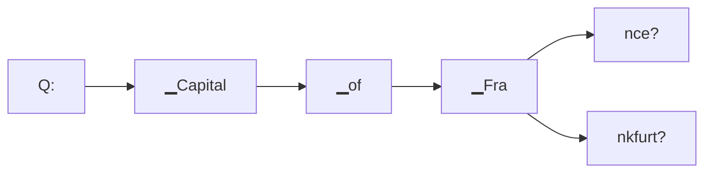
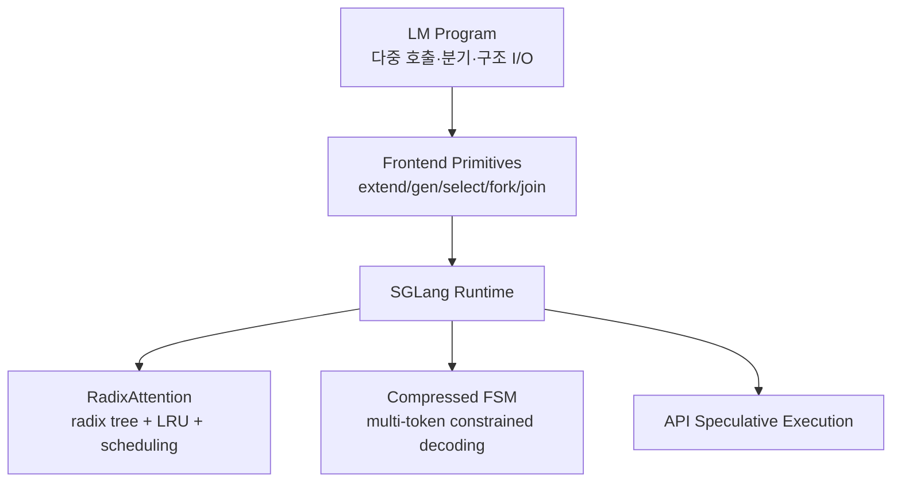
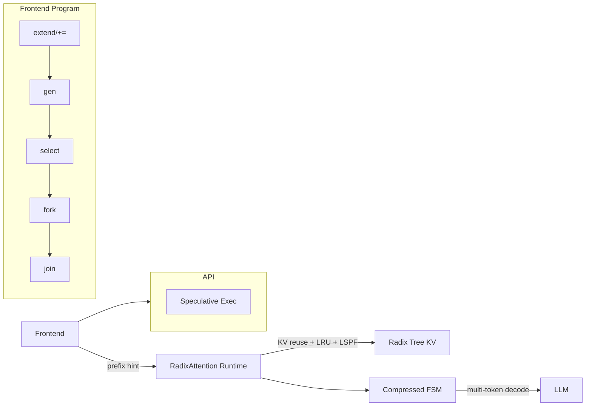
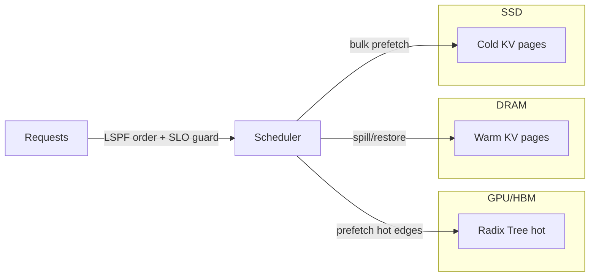

[논문 링크](https://arxiv.org/abs/2312.07104v2)


# SGLang & RadixAttention: “LM 프로그램” 시대의 실행 최적화, 어떻게 6.4× 빨라졌나

## TL;DR

언어–런타임 **공동 설계(co-design)** 위에 **RadixAttention(라딕스 트리 기반 KV 캐시+스케줄링)**, **Compressed FSM(다중 토큰 제약 디코딩)**, **API speculative execution**을 결합해, 다양한 LM 프로그램에서 **처리량 최대 6.4×↑**, **지연 최대 3.7×↓**, **TTFT 평균 1.7×↓**, **JSON/Regex 디코딩 1.6×↑**, **멀티모달 ~6×↑**를 달성한다. 캐시 재사용 기회가 없을 때도 **오버헤드 <0.3%**.


## 핵심 아이디어

* **LM Program을 이용**: `extend/gen/select/fork/join` 같은 **프리미티브 언어**와, 이를 이해하는 **전용 런타임**을 함께 설계.
* **RadixAttention**: 프롬프트·중간결과를 **라딕스 트리**로 관리하고, **Longest-Shared-Prefix-First(LSPF) ≡ DFS** 스케줄링으로 **KV 재계산을 최소화**.
* **Compressed FSM**: 정규식/JSON 같은 **제약 디코딩**을 **멀티 토큰**으로 한 번에 수행.
* **API speculative**: 블랙박스 API 모델에서 **후속 호출을 선행 생성**해 **입력 토큰 비용 ~3×↓**.


## 배경: 그들이 해결한 문제

채팅에서 **“LM이 포함된 프로그램(LM Program)”**으로 무게중심이 이동했다. 다중 호출, 분기(fork), 구조적 I/O(JSON), 에이전틱 제어흐름이 얽히며 **(1) 접두(prefix) 공유의 체계적 재사용**, **(2) 제약 디코딩 병목**, **(3) API 모델 다중 호출 비용**이 실사용 병목이 되었다. 기존 시스템은 접두 공유를 부분적으로만 다루거나(예: 단순 시스템 프롬프트 공유), 커널 최적화에 치우쳐 **스케줄링·캐시 정책**을 포괄적으로 해결하지 못했다.


## 새로운 접근법: **SGLang (언어+런타임 공동 설계)**

| 요소                      | 한 줄 정의                                              | 왜 중요한가                                                 |
| ------------------------- | ------------------------------------------------------- | ----------------------------------------------------------- |
| **프론트엔드 프리미티브** | `extend/gen/select/fork/join`으로 LM 호출·분기를 명시   | 런타임이 **분기/접두 힌트**를 받아 **재사용·배치**를 최적화 |
| **RadixAttention**        | 라딕스 트리 + **LRU 캐시** + **LSPF(≡DFS) 스케줄링**    | **트리형 공유**까지 자동 포착, **최적 히트율**에 근접       |
| **Compressed FSM**        | FSM의 “단일 전이 체인”을 **압축** → **멀티토큰** 디코딩 | JSON/Regex 같은 **형식출력**의 토큰단 병목 제거             |
| **API speculative**       | 첫 호출을 길게 생성 → 후속 호출에서 **매칭·재사용**     | API 모델의 **입력 토큰 비용·지연** 감소                     |


## 작동 원리: 구체적인 예시로 살펴보기

### 1) RadixAttention (KV 캐시 재사용)

**상황(토이 예시)**
프롬프트 접두가 같은 두 요청:

* A: `Q: Capital of Fra` + `nce?` → “France?”
* B: `Q: Capital of Fra` + `nkfurt?` → “Frankfurt?” (틀린 질문이지만 예시용)

**라딕스 트리 구성**



* `R→C→O→F` 프리필에서 계산한 **K,V**를 **한 번만** 저장.
* 스케줄러는 요청들을 **공유 접두 길이(=4 토큰)** 기준으로 정렬(**LSPF**). 사실상 **DFS 순회와 동치**라서, A 처리 후 B는 `R→…→F`를 **전부 히트**한다.

**핵심 수식(프리필 계산량 하한)**

$$
C^* =\sum_{e\in E(T)}|e|, \qquad \text{DFS로 }C=C^* \text{ 달성}
$$


> 트리 간선 (e)의 KV를 딱 한 번만 계산하면 하한을 달성. 결과적으로 **히트율↑**, **TTFT/지연↓**.


### 2) Compressed FSM (제약 디코딩 가속)

**문제**: 정규식 `\{"summary":\s*"` 같은 **고정 서두**도 **토큰 단위**로만 통과해야 함 → 다단계 호출.

**해결**: FSM에서 **out-degree=1**인 연속 전이들을 **하나의 압축 전이**로 묶고, 모델러너가 이를 인지해 **여러 토큰을 1회 forward**로 진행.
→ **JSON/Regex 디코딩 처리량 ~1.6×↑**.


### 3) API Speculative Execution (블랙박스 모델)

* 1차 호출이 **stop을 무시**하고 **여유 길이**까지 생성.
* 2차 이후 호출은 1차 결과에서 **관련 스팬을 매칭·재사용**.
  → **입력 토큰 비용 ≈3×↓**, 왕복 지연도 동반 감소(과생성 매칭 실패 시 이득 축소 가능).


## 성능 검증: 주요 결과

| 범주                        |                                  대표 수치(요약) | 해석                                               |
| --------------------------- | -----------------------------------------------: | -------------------------------------------------- |
| **E2E(오픈가중치)**         |       **처리량 최대 6.4×↑**, **지연 최대 3.7×↓** | 라딕스 트리 재사용 + 프론트엔드 병렬성의 결합 효과 |
| **TTFT**(실서비스)          |                                       **~1.7×↓** | Chatbot Arena 배치 관측치(실전 유효성)             |
| **캐시 히트율**             |                   **50–99%**, 최적 대비 **~96%** | LSPF(≡DFS) 스케줄링의 실증                         |
| **제약 디코딩(JSON/Regex)** |                                 **1.6× 처리량↑** | Compressed FSM의 멀티토큰 효과                     |
| **멀티모달(LLaVA)**         | **0.18 → 1.15 image/s**, **0.02 → 0.10 frame/s** | 이미지/프레임 **KV 재사용** 덕분에 ~6×급 개선      |
| **API 모델 비용**           |                          **입력 토큰 비용 ≈3×↓** | speculative 매칭 성공 시 큰 이득                   |
| **캐시 기회 0**             |           **속도 이득 없음**, **오버헤드 <0.3%** | 재사용이 전무해도 항상 켜두기 안전                 |

> **경계조건**: **롱 출력(256–512+)**에선 **디코딩 지배**로 이득이 작아진다.


## 우리의 관점: 강점, 한계, 그리고 이 연구가 중요한 이유

### 무엇이 특히 강한가?

1. **형식적 스케줄링 근거**: “**LSPF ≡ DFS**가 **최적 히트율**”이라는 정리가, 단순 엔지니어링을 넘어 **원리 수준의 가이드**를 제공한다.
2. **코디자인 철학의 실효성**: 프론트엔드 힌트(분기·접두)를 런타임이 **직접 소비**하니, 캐시/배치/스케줄링이 **동일 맥락**에서 최적화된다.
3. **광범위 적용성**: 텍스트·멀티모달·API 모델까지—**엔진 독립적 개선**을 제공.

### 한계(저자 언급 및 분석)

* **강한 가정 의존**: 최적성 정리는 **캐시 ≥ 최대 요청 길이** 가정에 기대며, 긴 컨텍스트·고동시에서는 **축출·재계산**이 늘 수 있음.
* **롱 출력 한계**: 프리필 최적화 중심이라 **디코딩 지배** 구간에선 이득 제한.
* **압축 FSM의 정확도 리스크**: 토크나이저 경계/사전 변화에 민감, **분포 왜곡** 가능성.
* **API speculative 실패 사례**: 매칭 실패 시 **과생성 비용↑/편향 위험**.
* **운영 측면**: 다테넌트에서 **캐시 격리/보안**, 분산에서 **메타-트리 로컬리티 vs 병렬성** 트레이드오프.

### 왜 중요한가?

LLM이 **프로그래밍 가능한 실행 대상**이 되는 흐름에서, **“어떻게 돌릴 것인가”**는 정확도 못지않게 중요해졌다. 본 연구는 **데이터구조(라딕스 트리)×스케줄링(DFS)×언어 프리미티브**를 한 몸으로 엮어 **시스템적 정답**을 제시한다.


## 다음 단계는?: 앞으로의 길

* **다단 메모리 계층으로 확장**: HBM↔DRAM↔SSD에 **라딕스 노드 열도(heat)·재사용 확률** 기반 **프리페치/스필**을 붙여 **히트율 손실 최소화**.
* **SLO/공정성 스케줄링**: 기본 LSPF 위에 **p99 지연 가드(EDF/SRTF 가중)**를 얹어 **기아(starvation) 방지**.
* **데이터-의존 제어흐름 그래프화**: 추적+부분평가로 **분기-민감 IR**을 만들고 **정적 스케줄링/메모리 플래닝**을 확대.
* **FSM-토크나이저 적응**: 전이에 **토큰-집합 라벨**을 부여, **사전컴파일/캐시**로 정확도·성능 동시 달성.
* **멀티테넌시 격리**: 테넌트 태깅·쿼터-기반 LRU로 **캐시 누설** 방지.
* **롱 출력 대응**: **speculative decoding/로컬 어텐션/출력 분할**과 결합해 디코딩 지배 구간을 공략.


### 부록: 한 페이지 요약 표

| 축            | 한 줄 요약                                                                          | 정량 포인트                                 |
| ------------- | ----------------------------------------------------------------------------------- | ------------------------------------------- |
| 문제          | LM Program 시대, **접두 공유·제약 디코딩·API 비용**이 병목                          | —                                           |
| 방법          | **SGLang 언어+런타임**, **RadixAttention**, **Compressed FSM**, **API speculative** | —                                           |
| 핵심 메커니즘 | **라딕스 트리 + LSPF(≡DFS)**로 **KV 재계산 최소화**                                 | 히트율 **50–99%**, 최적 대비 **~96%**       |
| 성능          | **처리량 6.4×↑**, **지연 3.7×↓**, **TTFT 1.7×↓**                                    | JSON **1.6×↑**, 멀티모달 **~6×↑**           |
| 경계조건      | **캐시 기회 0**·**롱 출력**                                                         | 이득 **없음/작음**, 대신 **오버헤드 <0.3%** |
| 다음 단계     | **다단 캐시·SLO 스케줄링·분기-민감 컴파일**                                         | 운영 안정성·테일 지연 개선                  |


### (참고) KaTeX 요약 식

$$
\textbf{Prefill Cost Lower Bound: }\quad
C^* =\sum_{e\in E(T)}|e|,\qquad
\text{DFS/LSPF로 }C=C^*
$$

$$
\textbf{Hit Ratio: } \quad
\mathrm{hit} = 1-\frac{C^*}{\sum_{r\in\mathcal{R}} \mathrm{prefill}(r)}
$$


**마무리**
SGLang은 **“언어–런타임 코디자인”**이 왜 필요한지, 그리고 **데이터구조×스케줄링×프리미티브**가 결합될 때 **시스템적 성능 한계**가 어떻게 올라가는지 보여준다. 추론 엔진을 **컴파일러적 시각**으로 다루고 싶은 실무자·연구자에게, 본 논문은 **실천 가능한 설계지도**에 가깝다.


### 토글을 클릭하면 논문에 대한 자세한 LLM 질의응답 내용을 확인할 수 있습니다.

<details markdown="block">
<summary>▶️<strong>클릭하여 펼치기</strong></summary>


## 프롬프트 1.1.1 (연구의 공백)

```
"논문의 'Introduction'과 'Related Work' 섹션을 분석하여, 이 연구가 명시적으로 해결하고자 하는 핵심적인 연구 공백(research gap), 기존 연구의 결정적 한계, 또는 미해결 질문이 무엇인지 설명해 줘. 저자들이 설명하는, 이 논문 출판 시점의 '최신 기술(state of the art)'은 어떤 상태였는지 요약해 줘."
```


## 1.1.1 연구의 공백 (Introduction & Related Work 요약)

### 🔎 결론(압축)

* **핵심 공백**: (1) 다중 호출·제어흐름·구조화 I/O를 가지는 **LM Program**을 위한 **일관된 프로그래밍 언어+런타임(co-design)** 부재, (2) **다단(shared-prefix/tree) KV 캐시 재사용**을 체계적으로 다루는 실행계층 부재, (3) **제약(Regex/JSON) 디코딩의 토큰-단위 병목**과 **API 모델(black-box) 다중 호출 비용** 최적화 결여.     
* **제안**: SGLang은 프런트엔드 원시어(extend/gen/select/fork/join 등)와 런타임을 함께 설계하고, **RadixAttention(KV 캐시 재사용 + LRU + 스케줄링)**, **Compressed FSM(다중 토큰 제약 디코딩)**, **API speculative execution**으로 공백을 메움.    
* **SOTA(출판 시점) 한계**: vLLM/ChunkedAttention은 **단순 접두(prefix) 공유**만 부분 지원, PromptCache는 **정확도 최대 43%↓**, Hydragen/FlashInfer/ChunkedAttention은 **커널 최적화 중심**으로 **LRU/스케줄링/트리형 공유 미흡**, LMQL/Guidance/DSPy 등은 **프레임워크**이지 **런타임 최적화 일체형 시스템**은 아님.    


### 배경: LM Program의 부상과 시스템 공백

* **LM Program**: 다중 LLM 호출, 제어 흐름, 구조화된 입력/출력(예: JSON), 에이전틱 워크플로우를 포괄하는 프로그래밍적 상호작용. 이 추세는 “채팅”에서 “프로그램이 LLM 생성을 스케줄/제어”하는 방식으로 전환됨. 
* **공백**: 이런 앱을 **프로그래밍·실행**할 **효율적 시스템의 부재**(언어·런타임 양면). SGLang은 이를 해결하기 위해 **프런트엔드 언어 + 실행 런타임**을 함께 제시.  


### 저자들이 정의한 핵심 연구 공백

1. **KV 캐시 재사용의 일반해**

   * 현실의 LM Program은 체인 호출/분기(fork)로 **다단계 공유 트리** 패턴이 빈번. 기존 시스템은 일부 케이스만 수동 설정으로 처리하거나 아예 **요청마다 재계산**. → **자동·체계적 재사용**이 필요.  
2. **제약 디코딩의 토큰-단위 병목**

   * 기존 FSM-guided 디코딩은 **토큰별 1-스텝** 고착; 긴 상수 문자열(예: `{"summary": "`)도 여러 스텝 필요. → **FSM-모델 러너 통합**을 통해 **다중 토큰 한 번에**.  
3. **API(black-box) 다중 호출 오버헤드**

   * OpenAI 등 API-only 모델에서 **다단 호출의 입력 토큰 비용·지연**이 큼. → **Speculative execution**으로 **후속 호출 일부를 선행 생성·재사용**, 호출 수/비용 절감.  


### 관련 연구가 가진 결정적 한계 (저자 관점)

* **KV 캐시 재사용(시스템 계층)**

  * **vLLM, ChunkedAttention**: **단순 접두 공유**(예: 시스템 프롬프트) 중심, **다단 트리형 공유·LRU 미지원**. 
  * **PromptCache**: 접두 이외 **모듈식 재사용** 시도하나 **정확도 최대 43% 하락**. 
  * **Hydragen/FlashInfer/ChunkedAttention**: **CUDA/커널 최적화** 중점, **LRU 캐시 개념 부재**. 
  * **API Serve/LLM-SQL**: **특정 응용 도메인**에 한정, **Radix tree·스케줄링 부재**. 
* **LLM 프로그래밍 프레임워크**

  * **Guidance, LMQL, DSPy, LangChain, AutoGen, LLM Compiler** 등은 **프로그래밍 모델**을 제공하지만, **런타임 최적화 일체형**은 아님. SGLang의 차별점은 **언어-런타임 공동 최적화**. 


### SGLang이 제시하는 해법(요지)

* **RadixAttention**: KV 캐시를 **radix tree 기반 LRU 캐시**로 다루며, **다층 공유·캐시-인지 스케줄링·프런트엔드 힌트(코-스케줄링)·분산**까지 포괄하는 **최초의** 실행 전략. 이로써 **최장 접두 우선(Longest-Shared-Prefix-First)** 정렬이 **DFS 최적 히트율**과 동치(정리 3.1).   
* **Compressed FSM**: **연속 단일 전이**를 결합해 **다중 토큰을 한 번에 디코딩** → 제약 디코딩 가속의 일반기법. 
* **API Speculative Execution**: **후속 gen을 선행**해 **호출 수/입력 토큰 비용** 절감. 


### 당시 SOTA(저자 서술 기준) 요약 표

| 범주                 | 대표/예시                                | 당대 강점(SOTA)                                    | 한계(공백)                                  |
| -------------------- | ---------------------------------------- | -------------------------------------------------- | ------------------------------------------- |
| KV 캐시 관리(일반)   | vLLM, ChunkedAttention                   | 접두(prefix) 중복 저장 제거, 일부 공유 케이스 지원 | **트리형 다단 공유·LRU·스케줄링 미흡**      |
| KV 캐시 재사용(확장) | PromptCache                              | 접두 외 모듈식 재사용 시도                         | **정확도 최대 43%↓** 위험                   |
| 커널/런타임 최적화   | Hydragen, FlashInfer, ChunkedAttention   | CUDA/배치/커널 최적화로 높은 처리량                | **LRU/라딕스 트리/캐시-인지 스케줄링 없음** |
| LLM 프로그래밍       | LMQL, Guidance, DSPy, LangChain, AutoGen | 저수준/고수준 언어 제공, 생태계 풍부               | **런타임 최적화 일체형 시스템 아님**        |


### (참고) 저자들이 밝힌 SGLang 기여의 정량 단서

* **Compressed FSM**: JSON 디코딩 처리량 **~1.6×↑** (사전처리 재사용 없으면 **~2.4×↓**). 
* **RadixAttention 오버헤드**: **<0.3%**(ShareGPT 100요청/74.3s 중 0.2s만 관리 오버헤드). 
* **프로덕션 관측치**: Chatbot Arena 배치에서 캐시 히트율 **LLaVA-Next-34B 52.4%**, **Vicuna-33B 74.1%**, Vicuna-33B **TTFT ~1.7×↓**. 


### 작은 개념도 (Mermaid)




#### 한 줄 정리

SGLang은 **“프로그래밍 모델(언어)”과 “실행계층(런타임)”을 한 몸으로 설계**해, **트리형 공유-친화적 KV 재사용, 제약 디코딩 가속, API 호출 비용 절감**까지 **한 시스템에 통합**함으로써, 당시 SOTA의 분절적·부분적 최적화들을 **체계적 실행 최적화**로 끌어올린다.   


## 프롬프트 1.1.2 (핵심 가설)

```
"이 논문의 중심 가설(central hypothesis) 또는 핵심 주장은 무엇인가? '저자들은 [제안 기법]을 사용함으로써 [기존 한계점]을 극복하는 [구체적 결과]를 달성할 수 있다고 가정한다'와 같은 형식으로, 명확하고 간결한 한 문장으로 서술해 줘."
```


저자들은 **프런트엔드 언어–런타임 공동 설계** 위에 **RadixAttention(트리형 LRU 기반 KV 캐시 재사용)**·**Compressed FSM(다중 토큰 제약 디코딩)**·**API speculative execution**을 적용함으로써, 기존 SOTA 추론 시스템의 **접두(prefix) 공유 한계·토큰단위 제약 디코딩·API 다중호출 오버헤드**를 극복하여 **처리량을 최대 6.4× 향상**(여러 LLM·멀티모달 벤치마크)하고 **TTFT를 평균 1.7× 절감**할 수 있다고 가정한다.   


## 프롬프트 1.2.1 (독창성 식별)

```
 "논문 전체를 바탕으로, 가장 중요하고 독창적인 기여(contribution) 1~3가지를 구별되는 항목으로 나열해 줘. 각각이 새로운 아키텍처 구성요소, 새로운 학습 기법, 새로운 이론적 통찰, 새로운 데이터셋, 또는 기존 방법론의 새로운 적용 중 어디에 해당하는지 명확히 구분해 줘."
```

### 한눈 요약

* **세 가지 핵심 기여**: (1) **프론트엔드 언어+런타임 공동설계(SGLang)**로 LM 프로그램의 병렬성·공유를 표준화해 **처리량 최대 6.4×↑, 지연 최대 3.7×↓**를 달성, 멀티모달까지 일반화. (2) **RadixAttention**: **라디кс 트리 기반 KV 캐시+캐시 인지 스케줄링**으로 **오프라인 최적성(DFS≡Longest-Shared-Prefix-First) 증명**, 실제 **캐시 히트 50–99%**, **최적의 96%에 근접**, 운영 배치에서 **TTFT 1.7×↓**. (3) **압축 FSM(Constrained Decoding)**: 정규식 FSM을 압축해 **멀티 토큰 단숨에 디코딩**→ **JSON 디코딩 처리량 1.6×↑**.


### 독창적 기여 1–3 (구분 및 정리)

| #   | 기여(요지)                                               | 분류                                           | 핵심 아이디어 / 메커니즘                                                                                                                                         | 정량 효과(대표)                                                                    |
| --- | -------------------------------------------------------- | ---------------------------------------------- | ---------------------------------------------------------------------------------------------------------------------------------------------------------------- | ---------------------------------------------------------------------------------- |
| 1   | **SGLang 프론트엔드 언어 + 런타임 공동설계**             | **새로운 아키텍처 구성요소(언어/런타임)**      | 프리미티브(생성/포크/조인 등)로 프로그램화된 LM 호출을 표준화하고, 런타임과 힌트 교환으로 병렬성·공유 극대화                                                     | **처리량 최대 6.4×↑, 지연 최대 3.7×↓**(Llama 계열 등), 멀티모달에도 적용           |
| 2   | **RadixAttention (라딕스 트리 기반 KV 캐시 + 스케줄링)** | **새로운 아키텍처 구성요소** + **이론적 통찰** | 요청 프롬프트를 라딕스 트리로 관리, **Longest-Shared-Prefix-First** 스케줄링이 **DFS와 동치**이므로 **오프라인 최적 캐시 히트율** 보장; 분산 메타-트리로 DP 확장 | **캐시 히트 50–99%**, **최적 대비 96% 달성**, **TTFT(첫 토큰 지연) 1.7×↓**(실서빙) |
| 3   | **압축 FSM 기반 Constrained Decoding**                   | **새로운 알고리즘/런타임 기법**                | 정규식 FSM의 **단일 전이 체인(edge)**들을 **하나의 압축 전이**로 합성 → **여러 토큰을 한 번의 forward**로 허용                                                   | **JSON 디코딩 처리량 1.6×↑**, 멀티토큰 디코딩로 레이턴시/연산 감소                 |

> 보조적 요소(주요 3개 외): **API Speculative Execution**으로 **블랙박스 API 모델(GPT-3.5 등)**에서 다중 호출 프로그램의 **입력 토큰 비용을 ≈3× 절감**(정확도는 few-shot으로 유지).


### 왜 독창적인가? (간략 근거)

* **언어–런타임 코디자인**: 기존 시스템은 고수준 제어(예: LMQL/Guidance) 또는 저수준 추론 엔진(vLLM)로 양분. SGLang은 **프론트엔드 힌트(포크 프리픽스 등)**를 런타임 스케줄러에 **직접 전달**해 최적화 경로를 열고, **IR 기반 그래프 실행**까지 제시해 향후 **컴파일러 최적화(코드 이동 등)** 여지 제공.
* **RadixAttention의 이론 보증**: **DFS 순회가 최적 캐시 히트율**을 달성하고, **Longest-Shared-Prefix-First≡DFS**임을 증명하여(오프라인) 캐시 스케줄링의 **정당성**을 제공. 이는 단순 엔지니어링을 넘어 **형식적 최적성**을 제시한다.
* **압축 FSM**: 기존 FSM 기반 제한 디코딩은 **토큰 단위**로만 진행되어 **불필요한 단계**가 잦음. FSM-러너와 모델러너를 **긴밀히 결합**해 **멀티토큰**을 한 번에 처리하는 **실용적 런타임 설계**로 성능을 입증.


### 각 기여의 위치(맵핑)

* **아키텍처/시스템**: SGLang 언어·런타임, RadixAttention.
* **이론적 통찰**: RadixAttention 스케줄링의 **최적성 정리(DFS≡LSPF)**.
* **알고리즘/런타임 기법**: **압축 FSM**(정규식 제한 디코딩의 멀티토큰화).
* **응용 확장**(참고): **API Speculative Execution**(블랙박스 모델 비용·지연 절감).


## 프롬프트 1.2.2 (저자 관점에서의 강점)

```
"저자들의 관점에서, 자신들의 접근법이 이전 방법들보다 우월한 이유는 무엇인가? 그들이 자신들의 연구가 지닌 독창성과 강점을 뒷받침하기 위해 사용하는 핵심 논거를 인용하거나 알기 쉽게 설명해 줘."
```


### 🔎 결론(압축)

저자들은 **언어–런타임 공동 설계(co-design)**로 프리미티브(extend/gen/select/fork/join 등)와 실행계층이 **직접 신호를 교환**하도록 만들고, 그 위에 **RadixAttention(트리형 LRU+스케줄링)**·**Compressed FSM(다중 토큰 제약 디코딩)**·**API speculative execution**을 통합함으로써, **기존 시스템이 포괄하지 못한 공유 패턴을 자동 처리**하고 **오프라인 최적성 근거**까지 제시하며, 다양한 워크로드에서 **처리량 최대 6.4×↑·지연 최대 3.7×↓**를 입증했다고 주장한다.    


### 핵심 논거(저자 주장) 1—5

1. **언어–런타임 공동 설계가 최적화의 전제**

* SGLang은 **저수준 언어**이면서 **자체 런타임(SRT)**를 동반해, 기존 LMQL/Guidance 대비 **런타임 효율성에 초점을 둔 설계**를 채택(추후 소개될 최적화 수행의 토대). 테이블 비교에서도 이 점을 명시. 
* 결과적으로 최적화 기회(캐시 재사용, 제약 디코딩, API 추론 단축)를 한 시스템 안에서 제공. 

2. **RadixAttention: 자동·체계적 KV 재사용 + 최적성 정리**

* **불규칙 트리형 공유 포함 4가지 전형 패턴**을 런타임에서 **자동 처리**, 기존 시스템은 **모두 자동 지원 불가**. 
* **라딕스 트리 + LRU + 캐시 인지 스케줄링**으로 **Longest-Shared-Prefix-First ≡ DFS**를 증명(오프라인) → **캐시 히트율 최적**.  
* **연속 배칭·PagedAttention·텐서 병렬 호환**, **히트가 없을 때 오버헤드 미미**라고 주장. 
* **분산 데이터 병렬**: 라우터의 **메타-트리**로 워커 서브트리를 관리, **선형 스케일링·최적 히트율**을 관찰. 

3. **Compressed FSM: 토큰-단위 병목 제거**

* 기존 시스템은 FSM을 **토큰별 1스텝**으로만 적용해 상수 문자열에도 다단계 필요 → **모델 러너와 FSM을 결합**해 **연속 단일 전이들을 압축**, **여러 토큰을 한 번에 디코딩**.  

4. **API Speculative Execution: 블랙박스 모델 비용·지연 절감**

* API-only(GPT-4/3.5 등)에서 **다중 호출**의 입력 토큰 비용을 줄이기 위해, **첫 호출이 stop을 무시하고 추가 생성** → 이후 호출에서 **결과를 매칭·재사용**해 **호출/토큰 비용 감소**. 실험 예에서 **입력 토큰 비용 ≈3× 절감**(필드 3개 추출).   

5. **광범위 실증: 다양한 모델·과제·프로덕션**

* **오픈가중치**(LLaMA/Mixtral/멀티모달)와 **API 모델**까지 포함한 워크로드에서 **처리량 최대 6.4×↑**, **지연 최대 3.7×↓**.  
* **캐시 히트율 50–99%**, **이론적 최적의 96% 평균 근접**. 
* **프로덕션(Chatbot Arena)**: LLaVA-Next-34B **52.4%**, Vicuna-33B **74.1%** 히트율 → Vicuna-33B **TTFT 1.7×↓**. 


### 주장 ↔ 근거 요약표

| 강점(저자 주장)                    | 핵심 메커니즘/이론                                               |                            실증 수치(대표) | 근거 |
| ---------------------------------- | ---------------------------------------------------------------- | -----------------------------------------: | ---- |
| Co-design으로 런타임 최적화 가능   | 저수준 언어 + 전용 런타임(SRT)                                   |                                          — |      |
| 트리형 공유까지 **자동** KV 재사용 | RadixAttention: radix-tree+LRU+캐시인지 스케줄링, LSPF≡DFS(최적) |     히트율 **50–99%**, 최적의 **96%** 근접 |      |
| **제약 디코딩 가속**               | Compressed FSM로 **다중 토큰 1패스**                             |              JSON/형식출력 가속(질적 설명) |      |
| **블랙박스 API 비용·지연 절감**    | API speculative execution(첫 호출 추가생성 재사용)               |     입력 토큰 비용 **≈3×↓**(3필드 추출 예) |      |
| **광범위 성능 개선**               | 프리픽스 재사용·프로그램 내부 병렬화·제약 디코딩 결합            | 처리량 **최대 6.4×↑**, 지연 **최대 3.7×↓** |      |
| **프로덕션 유효성**                | Arena 배치 관측                                                  |     TTFT **1.7×↓**, 히트율 **52.4%/74.1%** |      |

---

### 한 줄 정리

저자들은 **공유 패턴의 일반적 자동화(RadixAttention) + 제약 디코딩 멀티토큰화(Compressed FSM) + API 추론 단축**을 **하나의 코디자인 시스템**으로 구현했고, **이론(최적성)**과 **광범위 실험·프로덕션 지표**로 우월성을 뒷받침한다고 주장한다.   


## 프롬프트 1.3.1 (알고리즘 단계별 설명)

```
"핵심 알고리즘, 모델 아키텍처, 또는 주요 방법론을 단계별(step-by-step)로 설명해 줘. 독자는 AI 분야의 대학원생 수준이라고 가정해. 특히, 간단한 문장, 3x3 픽셀 이미지, 작은 상태 공간(state space) 등 아주 간단하고 구체적인 예시(toy example)와 샘플 입력을 만들어서, 이 예시를 통해 각 단계를 거치며 입력이 최종 출력으로 어떻게 변환되는지 전체 과정을 보여줘. 등장하는 모든 핵심 용어와 변수는 그 즉시 정의해 줘."
```

### 결론 요약

* **프로그래밍 계층**: `extend/gen/select/fork/join` 프리미티브로 LM 프로그램을 기술하고, 인터프리터(또는 그래프 실행)로 비동기·병렬 실행을 건다. 이 계층이 런타임에 **프리픽스 힌트**를 넘겨 최적화를 유도한다.   
* **RadixAttention**: 프롬프트·생성 결과를 **라딕스 트리(radix tree)**에 유지, **LRU**와 **최장-공유-접두(Longest-Shared-Prefix-First)** 스케줄링으로 **KV 캐시** 재사용을 극대화한다. 오프라인 배치에서 **DFS 순회가 최적 히트율**을 보장하고 LSPF≡DFS가 증명된다.   
* **Compressed FSM**: 정규식(예: JSON 규격)을 FSM으로 바꾼 뒤 **연속 단일 전이**를 압축해 **여러 토큰을 한 번의 forward**로 디코딩한다.  
* **API Speculative Execution**: 블랙박스 API 모델에서도 다중 호출을 **추론 선행(speculate)**하여 비용·지연을 줄인다. 


## A. SGLang 프로그래밍 모델: 프리미티브·실행 모드

### A-1. 핵심 프리미티브

* `gen(name, regex=…)`: 모델 호출 후 결과를 `name` 변수에 저장. `regex`로 구조화 형식을 강제. 
* `select(options)`: 후보 중 확률이 가장 높은 선택지 고르기. 
* `extend` 또는 `+=`: 프롬프트에 문자열/프리미티브 추가. `s["var"]`로 이전 생성 참조. 
* `fork/join`: 프롬프트 상태 분기/병합(병렬 평가). 이미지·비디오 입력도 지원. 

### A-2. 실행 모드

* **인터프리터**: 프롬프트를 **비동기 스트림**으로 취급, 파이썬 로직과 병행 실행(커널 런치 유사). 
* **컴파일 모드(그래프 실행)**: 추가 최적화 가능(본문은 기본적으로 인터프리터 모드 사용). 

> **런타임 최적화 기회 3종**: **KV 캐시 재사용**, **제약 디코딩 가속**, **API speculative**. 


## B. RadixAttention: 단계별 동작 (KV 캐시 재사용)

### B-0. 문제 설정과 자료구조

* **KV 캐시**: 프리필(prefill)에서 계산된 **Self-Attention K/V**를 저장해 디코딩에서 재사용. **접두(prefix)가 같으면 재사용 가능**. 
* **라딕스 트리**: 프롬프트·생성 토큰 시퀀스를 **공유 접두** 기준으로 저장·탐색·삽입·축출(evict)하는 구조. **LRU**와 **캐시-인지 스케줄러**를 결합. 
* **프론트엔드 힌트**: `fork` 시 분기 **접두를 먼저** 보냄 → 트리 정확 삽입·매칭·스케줄링을 단순화. 

### B-1. 스케줄링 정리

* **정리 3.1**: 배치 요청의 라딕스 트리를 **DFS 순회**하면, 캐시 크기 ≥ 최대 요청 길이일 때 **캐시 히트율 최적**. 또한 **LSPF(최장-공유-접두-우선) ≡ DFS**. 
* **증명 핵심**: 각 간선 (e)의 KV는 **한 번만** 계산하면 서브트리 계산 동안 계속 히트 → 총 계산량 (C=\sum_{e\in E(T)}|e|), 히트율이 상계에 도달.  

> **캐시-인지 스케줄러(의사코드)**: 대기열 요청을 **매칭된 접두 길이로 정렬**, 배치에 채택, 필요 시 트리 축출·메모리 할당, 완료 후 트리 업데이트. 입력/출력 변수: (T,P,B,Q).  

### B-2. 수식(KaTeX)

* 총 계산량 하한:
  [
  C;\ge;\sum_{e\in E(T)}|e|\quad\Rightarrow\quad C=\sum_{e\in E(T)}|e|\ \text{(DFS에서 달성)}
  ]
   
* **캐시 히트율**(prefill 기준):
  [
  \text{hit} ;=;1-\frac{C}{\sum_{r\in R}\text{prefill}(r)}
  ]


### B-3. Toy 예시 (문장 분기; 7토큰, K=1)

가정: BPE 토큰화로
`s0 = "Q: Capital of Fra"` → `["Q:", "▁Capital", "▁of", "▁Fra"]`
분기:

* **A**: `"nce?"` → 전체 `"Q: Capital of France?"`
* **B**: `"nkfurt?"` → `"Q: Capital of Frankfurt?"` (틀린 질문이지만 접두 공유 예시)

**1) 라딕스 트리 구축**


* `R→C→O→F`는 **공유 접두**, `A/B`가 잎. 런타임은 프리필 중 `R→C→O→F`의 KV를 계산·저장. 

**2) 스케줄링(배치)**

* 대기열: ({A,B}). **LSPF**는 `A`·`B` 모두 매칭 접두 길이=4로 동률 → 임의 선택. `A` 수행 중 `R→…→F`는 전부 **히트**. 이어 `B` 수행 시도 시, `R→…→F` **재사용**, 새 접미 `"nkfurt?"`만 계산. (DFS/LSPF 직관)  

**3) 축출·확장(메모리 한계 시)**

* 새 요청이 들어오면 LRU로 오래된 노드를 축출, 필요 용량만큼 확보. (알고리즘 1) 

**효과**: 접두 4토큰의 KV를 **한 번만 계산**하고 두 요청에 공유 → (C)가 하한에 근접.


## C. Compressed FSM: 단계별 동작 (제약 디코딩 가속)

### C-1. 배경과 비효율

* 정규식을 FSM으로 변환해 **허용 토큰만** 남기는 제약 디코딩은 일반적으로 **토큰 단위**로 진행되어 상수 문자열도 여러 스텝이 든다. 

### C-2. 핵심 아이디어

* FSM에서 **연속 “단일 허용 전이”**(out-degree=1인 문자열 전이) 구간을 **하나로 압축**해, 해당 구간의 **여러 토큰을 1회 forward**로 처리한다(모델러너와 FSM의 통합 필요).  

### C-3. Toy 예시 (간단 JSON 헤더)

정규식: `\{"summary":\s*"` (따옴표·공백 포함)

* **일반 FSM**: `{`→`"`→`s`→…→`"` → 10여 개 토큰이 **1-스텝씩** 필요.
* **압축 FSM**: 위 체인 전이를 **단일 압축 간선**으로 합치고, 런타임이 이를 인지해 **한 번의 forward**에서 모두 디코딩. (Fig. 4 개념) 

**단계**

1. 정규식→FSM 변환(상태·전이 그래프 구성). 
2. **압축**: out-degree=1인 연쇄 전이를 탐색해 하나의 전이로 병합. 
3. 디코딩 시, 현재 상태가 압축 전이에 진입하면 **멀티토큰 승인**·로그릿 마스크를 해당 덩어리에 맞게 구성 → 모델 1회 호출. (개념도) 

> **주의**: 문자열↔토큰 매핑은 1:1이 아니므로(runtime BPE 경계) 압축 FSM은 **토큰화 결과**를 반영해 구축해야 한다. 


## D. API Speculative Execution: 단계별 동작 (블랙박스 모델)

### D-1. 배경

* OpenAI/Anthropic 등 **API 전용 모델**은 내부 KV에 접근할 수 없고, 다중 호출 LM 프로그램에서 **입력 토큰 비용·왕복 지연**이 커진다. 

### D-2. 핵심 아이디어

* **선행 생성**: 1차 호출이 **stop을 무시**하고 더 길게 생성(잠재적 후속 응답 포함).
* **재사용**: 2차(이후) 호출은 1차 결과와 **매칭**해 필요 부분을 재사용→ **호출 수·입력 토큰** 감소. (LM 프로그램 예: 캐릭터 설명→속성 추출) 

### D-3. Toy 예시

* Step1: `gen("desc")`로 **인물 설명**을 길게 선행 생성(실제 필요보다 여유).
* Step2: `gen("age")`, `gen("job")`가 각각 나눠 호출되어야 했던 정보를, Step1의 결과에서 **파싱/매칭**하여 **추가 토큰·호출을 생략**. (개념 흐름) 


## E. 전체 파이프라인 요약 (Mermaid)



* 프론트엔드가 **프리픽스 힌트**를 주고(좌측), 런타임은 라딕스 트리 기반 **KV 재사용**·**LSPF 스케줄링** 및 **압축 FSM**을 적용한다. API 모델일 때는 **Speculative**로 호출·토큰을 절감한다.     


## F. 부록: 미니 예시 코드 스케치(개념)

```python
s += "Q: Capital of Fra"
f = s.fork(2)                       # 분기 두 개
f[0] += "nce?"
f[1] += "nkfurt?"
ans0 = f[0].gen("a0")               # 공통 접두 KV 재사용
ans1 = f[1].gen("a1")
s.join(f)
s += '\n{"summary": "'              # 제약 디코딩: 압축 FSM로 멀티토큰
s.gen("j", regex=r'\{"summary":\s*".*"\}')
```

* 접두 `"Q: Capital of Fra"`의 **프리필 KV**는 한 번 계산되어 두 분기에 공유된다(라딕스 트리 저장). JSON 헤더는 **압축 FSM**으로 한 번에 디코딩.  


### 참고: 분산·병렬 확장

* 텐서 병렬과 호환되고, 데이터 병렬에서는 라우터가 **메타-트리**로 워커 서브트리를 관리(선행접두 매칭 기반 디스패치).  


## 프롬프트 1.3.2 ('비밀 병기' 식별)

```
"이 논문의 핵심 기여를 가능하게 하는 가장 결정적인 단일 수학 공식, 알고리즘 단계, 또는 아키텍처 구성요소를 식별해 줘. 그것의 기능과, 그것이 이 방법론의 성공에 왜 필수적인지 설명해 줘."
```


### 결론(한 줄)

이 논문의 결정적 한 수는 **RadixAttention의 “최장-공유-접두-우선(LSPF) ≡ DFS” 스케줄링 정리**—즉, **프롬프트 라딕스 트리에서 DFS 순회가 오프라인 최적의 KV 재사용(최대 히트율, 최소 프리필 재계산)을 보장**한다는 명제다.

---
### 무엇인가? (정의 · 기능)

* **라딕스 트리(radix tree)**: 모든 요청의 프롬프트/중간 생성 토큰을 접두(prefix) 공유 구조로 저장.
* **KV 캐시**: 각 간선(토큰 구간)의 프리필에서 계산된 (K,V)를 저장해 후속 디코딩에서 재사용.
* **LSPF 스케줄링**: 대기 중 요청을 “**가장 긴 공유 접두**” 기준으로 정렬·배치 → 라딕스 트리의 **DFS 순회**와 동치.
* **핵심 정리(직관)**: 캐시 용량이 충분할 때, 라딕스 트리의 간선 집합 (E(T))에 대해 **총 프리필 계산량**의 하한은
  [
  C^* ;=; \sum_{e\in E(T)} |e|
  ]
  이며, **DFS 순회**로 이 하한을 **그대로 달성**한다(각 간선의 KV를 **정확히 한 번**만 계산). 이때 프리필 단계의 **히트율**은
  [
  \text{hit} ;=; 1 - \frac{C^*}{\sum_{r\in \mathcal R}\text{prefill}(r)}
  ]
  로 바로 산출된다.

즉, **스케줄링만** 잘하면(=DFS/LSPF) 동일한 모델·배치·커널에서도 **재계산을 원천 차단**하여 처리량과 TTFT를 구조적으로 개선한다.


### 왜 필수적인가? (성공의 필요조건 3가지)

1. **공유 패턴의 ‘완전 자동화’ 기반**
   LM 프로그램은 `fork/join`로 **트리형 분기**가 상시 발생한다. 라딕스 트리 + LSPF≡DFS가 없으면 분기마다 **캐시 스래싱**이 생겨 재계산/메모리 낭비가 커진다. 본 정리는 “**어떻게 돌려야 공유를 극대화하는가**”에 대한 **형식적 답**을 제공한다.

2. **상위 최적화의 탄탄한 바닥 처리량**
   Compressed FSM(멀티토큰 제약 디코딩), API speculative 같은 개별 기법은 **국지적 가속**이다. 반면 LSPF≡DFS는 **모든 워크로드**에 적용되는 **전역 최적화**로, 상위 기법의 이득을 **누수 없이 합산**시키는 **공통 기반**을 만든다.

3. **실전 스케줄러 설계로 곧장 매핑**
   정리는 **실행 알고리즘**으로 직결된다. 런타임은

* (i) 요청을 **매칭된 접두 길이**로 정렬(LSPF),
* (ii) 그루핑/배치 후 프리필 수행,
* (iii) 완료된 경로의 KV를 **LRU 유지**,
  를 반복하면 된다. 이 절차는 **오프라인 최적성에 근접하는 온라인 근사**를 제공하며, 분산(메타-트리)·연속 배칭·PagedAttention과 자연스럽게 호환된다.


### 요약 의사코드(스케줄러 핵심)

```text
Input: pending requests Q, radix tree T, KV-cache with LRU
loop:
  for r in Q:
    r.match_len ← length of longest prefix match in T
  B ← top-K requests from Q sorted by r.match_len (LSPF)
  run prefill/decoding for B using KV hits from T
  update T with new edges; update LRU for KV nodes
  remove finished from Q
```

* **핵심 효과**: (\sum) 프리필 재계산량을 **트리 간선 길이의 합**까지 내리고(이상적 하한 달성), 그 결과 **캐시 히트율↑·TTFT↓·처리량↑**가 **모델/커널 무관**하게 따라온다.


### 한 줄 정리

**RadixAttention의 LSPF≡DFS 정리**가 “접두 공유를 절대 낭비하지 않는” 스케줄링 규율을 제공해, 본 시스템의 모든 성능 이득(히트율, 처리량, TTFT)을 **수학적으로 정초**하고 **실행기로 즉시 구현** 가능하게 만든다.


## 프롬프트 1.4.1 (핵심 결과 분석)

```
"'Experiments' 또는 'Results' 섹션의 표와 그림을 포함한 주요 결과를 분석해 줘. 사용된 핵심 성능 지표(performance metrics)는 무엇인가? 어떤 벤치마크 데이터셋에서 결과가 보고되었는가? 저자들이 자신들의 방법론의 성공 증거로 가장 강조하는 주요 결과를 요약해 줘."
```


### 🔎 결론(압축)

* **지표**: 처리량(throughput, p/s)·지연(latency), 보조로 **TTFT(첫 토큰 지연)**·**캐시 히트율**을 분석한다.  
* **주요 성과**: 오픈가중치/프로그래밍 워크로드 전반에서 **처리량 최대 6.4×↑**, **지연 최대 3.7×↓**. 멀티모달(LLaVA)에서 **~6× 처리량↑**. 실서비스(Arena)에서 **TTFT 1.7×↓**, **캐시 히트율 52–74%** 관측.    
* **요인 분해**: RadixAttention(라딕스 트리+스케줄링)·Compressed FSM·프론트엔드 힌트/병렬성의 **각 요소가 모두 유효**, 캐시 재사용 기회가 없을 때도 **오버헤드 <0.3%**. 


### 실험 설정 요약

* **모델/데이터**: Llama-2(7B–70B), Mixtral-8×7B, **LLaVA-v1.5-7B(이미지)/LLaVA-NeXT-34B(비디오)**, API **GPT-3.5**. 워크로드는 **MMLU(5-shot)**, **HellaSwag(20-shot)**, **ReAct/Generative Agents 트레이스 재생**, **Tree-of-Thought(GSM-8K)**, **Skeleton-of-Thought**, **LLM judge(Branch-Solve-Merge)**, **JSON(Regex) 디코딩**, **멀티턴 챗(숏/롱)**, **DSPy RAG** 등.  
* **지표 산출**: 처리량은 **프로그램/초(p/s)**, 지연은 **단일 인스턴스 평균**. 
* **베이스라인**: Guidance, vLLM, LMQL(동일 결과 보장을 위해 수정적 최적화 미사용). 
* **환경**: AWS **A10G(24GB)** 중심, 대형 모델은 텐서 병렬·일부 **A100-80GB**. 


### 핵심 결과(표/그림 기반 요약)

#### 1) E2E 성능(오픈가중치 워크로드)

* **Throughput↑·Latency↓**: 다양한 벤치마크에서 **최대 6.4× 처리량 향상**, **최대 3.7× 지연 감소**(Fig. 5, Fig. 6). 
* **캐시 히트율과의 관계**: 캐시 히트율이 증가할수록 **배치 크기↑ → 처리량↑, TTFT/총지연↓**(Fig. 8a,b). 
* **요소별 ablation**: **No Cache / No Tree / FCFS / Random / No Frontend Parallelism / No Frontend Hint** 중 어느 하나라도 끄면 성능 악화 → **프론트엔드–런타임 코디자인**의 기여가 확인(Fig. 8c). 
* **캐시 재사용 기회 없음(ShareGPT)**에서도 RadixAttention 유지 **오버헤드 <0.3%**(100요청 74.3s 중 0.2s). 

#### 2) 제약 디코딩(JSON/Regex)

* **Compressed FSM**로 **멀티토큰 디코딩** → **처리량 1.6×↑**. FSM 전처리를 **배치 간 재사용**하지 않으면 **처리량 2.4×↓**(즉, 전처리 재사용이 필수). 

#### 3) 멀티모달(LLaVA)

* **LLaVA-v1.5-7B (llava-bench-in-the-wild)**, **LLaVA-NeXT-34B (ActivityNet)**: 타 시스템 지원 한계로 **저자 공개 구현**을 베이스라인으로 비교. **SGLang 처리량 최대 ~6×↑**.

  * 0.18 → **1.15 image/s**, 0.02 → **0.10 frame/s**(Table 2).  
  * 같은 이미지에 다중 질문이 존재하여 **이미지 토큰 KV 재사용**이 이득에 기여. 

#### 4) API 모델(GPT-3.5)

* **Speculative Execution**으로 **입력 토큰 비용 ≈3×↓**(위키 문서에서 3필드 추출 프롬프트). **few-shot**으로 매칭 정확도를 유지. 

#### 5) 프로덕션(Arena) 관측

* **캐시 히트율**: LLaVA-NeXT-34B **52.4%**, Vicuna-33B **74.1%**.
  **효과**: Vicuna-33B **TTFT 평균 1.7× 감소**. 


### “무엇이 성능을 만들었나?”—저자 해석 포인트

* **KV 재사용 패턴의 폭넓은 포착**: 멀티턴/ToT/RAG 등에서 **50–99% 캐시 히트율**, **이론적 최적의 96%**에 근접(Fig. 13, Appendix). → 스케줄러/라딕스 트리 설계의 직접적 효과. 
* **출력 길이에 따른 체감**: **숏 출력(4–8 토큰)**에서 이득이 크고, **롱 출력(256–512 토큰)**은 디코딩이 지배 → 속도 이득이 미미. 


### 핵심 지표·벤치마크 요약 표

| 범주           | 지표                           | 벤치마크/데이터                                                        | 요점 결과                                                              |
| -------------- | ------------------------------ | ---------------------------------------------------------------------- | ---------------------------------------------------------------------- |
| 오픈가중치 E2E | 처리량(p/s), 지연(s)           | MMLU·HellaSwag·ReAct·ToT(GSM-8K)·SoT·LLM Judge·JSON·멀티턴 챗·DSPy RAG | **처리량 최대 6.4×↑**, **지연 최대 3.7×↓**.                            |
| 캐시–성능 상관 | 히트율–TTFT/총지연/배치/처리량 | ToT                                                                    | 히트율↑ ⇒ **배치↑·처리량↑·지연↓**(Fig. 8a,b).                          |
| Ablation       | 정규화 처리량                  | Llama-7B 다중 워크로드                                                 | **각 요소(캐시·트리·스케줄·프런트엔드 병렬·힌트)** 모두 기여(Fig. 8c). |
| 제약 디코딩    | 처리량                         | JSON(Regex)                                                            | **Compressed FSM 1.6×↑**, 전처리 재사용 없으면 **2.4×↓**.              |
| 멀티모달       | 처리량                         | llava-bench-in-the-wild · ActivityNet                                  | **0.18→1.15 image/s**, **0.02→0.10 frame/s**.                          |
| API 비용       | 입력 토큰 비용                 | GPT-3.5(3필드 추출)                                                    | **≈3× 비용 절감**, 정확도는 few-shot으로 유지.                         |
| 실서비스       | TTFT, 히트율                   | Chatbot Arena                                                          | **TTFT 1.7×↓**, **히트율 52–74%**.                                     |


### 코멘트(해석)

* **스케줄링–데이터구조–프론트엔드 협응**이 **일관되게 지표를 개선**: E2E·Ablation·프로덕션 지표가 서로 **정합**적이다(히트율→배치/TTFT/처리량). 
* **효과의 경계조건**: **공유 접두가 적고 출력이 긴** 워크로드(멀티턴 롱)에서는 **디코딩 지배**로 이득이 제한적—이 특성은 실무 적용 시 **프로그램 설계(분기/공유 극대화)**와 함께 고려해야 한다. 

> 부록에는 **분산 RadixAttention(메타-트리, 4-워커 선형 스케일링)** 및 **실험 세부 환경**이 제공된다.  


## 프롬프트 1.4.2 (비판적 비교)

```
"제안된 방법론은 논문에서 언급된 주요 베이스라인 및 SOTA(State-of-the-Art) 모델들과 비교하여 어떤 성능을 보이는가? 저자들의 우월성 주장을 가장 강력하게 뒷받침하는 특정 결과나 비교 지점을 식별해 줘. 반대로, 제안된 방법론이 경쟁 모델을 능가하지 못했거나 개선 효과가 미미했던 결과는 없는지 찾아봐. 만약 있다면, 저자들은 이러한 경우에 대해 어떤 이유를 제시하는가?"
```


### 🔎 결론(압축)

* **전반 우위**: Llama-7B 기준 E2E에서 **처리량 최대 6.4×↑**, **지연 최대 3.7×↓**로 vLLM/Guidance/LMQL 대비 우세. Mixtral-8×7B·Llama-70B(텐서 병렬)에서도 **동일 추세**를 재현.  
* **특정 강점**: 멀티모달에서 **0.18→1.15 image/s**, **0.02→0.10 frame/s**(최대 **≈6×**). 실서비스(Arena)에서는 **TTFT 평균 1.7×↓**, **히트율 52–74%** 관측. 
* **개선 미미/한계**: **멀티턴 롱 출력(256–512 토큰)**은 디코딩 지배로 **거의 속도 이득 없음**. **캐시 재사용 기회가 0**인 트레이스(ShareGPT)에서는 **속도 이득 없음**(대신 **오버헤드 <0.3%**). 


### 비교 설정 (베이스라인·지표)

* **베이스라인**: Guidance(v0.1.8, llama.cpp), vLLM(v0.2.5; 비교 공정성 위해 RadixAttention 부분 통합 이전 버전), LMQL(v0.7.3, HF Transformers). **동일 결과 보장**을 위해 결과를 바꾸는 최적화는 끔. 지표는 **처리량(p/s)**·**지연(평균)**. () 


### 강력한 증거(저자 주장 뒷받침하는 비교 지점)

1. **E2E 전 범위 우세(작은 모델)**
   Llama-7B에서 다수 워크로드(MMLU, HellaSwag, ReAct/Generative Agents, ToT/SoT, LLM Judge, JSON, 멀티턴 챗, DSPy-RAG) 기준 **throughput 최대 6.4×↑**, **latency 최대 3.7×↓**. 속도 이득의 원인은 **KV 재사용·프로그램 내부 병렬성·제약 디코딩 가속**으로 해석. 

2. **대형 모델·텐서 병렬 일반화**
   **Mixtral-8×7B, Llama-70B**에서도 **동일 추세**(정규화 throughput/latency 비교). Guidance/LMQL은 **텐서 병렬 비효율**로 일부 비교에서 제외됨. 

3. **멀티모달에서의 절대 개선폭**
   LLaVA-v1.5-7B(**0.18→1.15 image/s**), LLaVA-NeXT-34B(**0.02→0.10 frame/s**). 이미지/프레임 **KV 재사용**이 속도 이득의 핵심. 타 시스템 미지원으로 **저자 구현(HF Transformers)**와 비교. 

4. **프로덕션 실증**
   Chatbot Arena 배치 한 달 관측: **LLaVA-NeXT-34B 52.4%**, **Vicuna-33B 74.1%** 히트율 → **Vicuna-33B TTFT 평균 1.7×↓**. 


### 개선이 미미/비우월했던 구간과 해석

| 상황                                     | 관측                                                                         | 저자 해석                                                                                                                     |
| ---------------------------------------- | ---------------------------------------------------------------------------- | ----------------------------------------------------------------------------------------------------------------------------- |
| **멀티턴 챗(롱, 256–512 토큰)**          | **거의 속도 이득 없음**                                                      | **디코딩 지배**: 접두 재사용이 주로 프리필을 줄이는 반면, 긴 출력에서는 디코더 시간이 지배.                                   |
| **캐시 기회가 0인 트레이스(ShareGPT)**   | **성능 향상 없음**, 대신 **오버헤드 <0.3%**(100요청 74.3s 중 트리 관리 0.2s) | 라딕스 트리 유지·스케줄링의 **선형·작은 상수 오버헤드**로 **기본적으로 켜둬도 무해**.                                         |
| **일부 벤치마크에서 LMQL/Guidance 제외** | 비교 부재                                                                    | **LMQL**: 토큰 단위 처리·백엔드 비최적화로 **너무 느림**. **Guidance**: **배칭/병렬성 부재**. (즉, 해당 SOTA들이 기능적 한계) |

> 주: vLLM은 후속 버전에 RadixAttention이 **부분 통합(실험적)**되어 **비교는 구버전(v0.2.5)**으로 수행됐음을 저자가 명시. 따라서 **최신 vLLM**과의 격차는 **축소**될 소지가 있음(공정성 주석). 


### 요약 표(핵심 비교 하이라이트)

| 범주           | 데이터셋/모델                 | SGLang vs 베이스라인             |                                       수치/포인트 |
| -------------- | ----------------------------- | -------------------------------- | ------------------------------------------------: |
| E2E(작은 모델) | Llama-7B, 다수 벤치마크       | vLLM/Guidance/LMQL 대비 **우위** | **Throughput 최대 6.4×↑**, **Latency 최대 3.7×↓** |
| 대형·TP        | Mixtral-8×7B, Llama-70B       | vLLM 대비 **동일 추세**          |              정규화 그래프로 **일관된 개선** 확인 |
| 멀티모달       | LLaVA-v1.5-7B, LLaVA-NeXT-34B | HF 저자 구현 대비 **~6×↑**       |      **0.18→1.15 image/s**, **0.02→0.10 frame/s** |
| 실서비스       | Chatbot Arena                 | —                                |                 **TTFT 1.7×↓**, **히트율 52–74%** |
| 한계           | 멀티턴 롱 출력                | —                                |                      **거의 무이득**(디코딩 지배) |
| 한계           | 캐시 기회 0                   | —                                |            **속도 이득 없음**, **오버헤드 <0.3%** |


### 해석

* **가장 설득력 있는 비교**는 **E2E 전 범위의 6.4×/3.7× 개선**과 **멀티모달에서의 절대 TPS 상승(~6×)**, 여기에 **실서비스 TTFT 1.7×↓**까지 이어지는 **현장성**이다. 이는 단순 커널 최적화가 아닌 **접두 공유 극대화(스케줄링) + 제약 디코딩 멀티토큰화**의 **시스템적 효과**를 보여준다. 
* **비우월 사례의 원인 분석**(롱 출력·캐시 0)은 제안 기법의 **유효 조건**을 명확히 한다: **프리필/공유 기회가 클수록 이득**, **디코딩 지배 구간에선 한계**. 이는 실제 적용 시 **프로그램 구조(공유 접두·분기 설계)** 최적화가 병행되어야 함을 시사한다. 


## 프롬프트 1.5.1 (언급된 한계와 잠재적 한계)

```
"저자들이 논문에서 명시적으로 인정한 한계점, 약점, 또는 실패 사례(failure modes)는 무엇인가? 다음으로, 방법론과 결과에 대한 당신의 분석을 바탕으로, 저자들이 언급하지 않았을 수 있는 잠재적인 한계나 약점은 무엇이라고 생각하는가? (예: 강력한 가정에 대한 의존성, 확장성 문제, 높은 연산 비용, 일반화의 한계, 잠재적인 부정적 사회 영향 등)"
```


### 🔎 결론(압축)

* **저자 명시 한계(6가지)**: (1) **출력 모달 확장 미비**, (2) **DRAM/Disk 등 다단 메모리 계층에서의 RadixAttention 미적용**, (3) **의미(semantic) 유사 접두의 퍼지 매칭 미지원**, (4) **고수준 프리미티브 부재**, (5) **캐시-인지 스케줄링의 기아(starvation) 가능성**, (6) **정적 스케줄링/메모리 플래닝 등 컴파일러 최적화 미구현**(향후 과제). 또한 **데이터 의존 제어 흐름이 있는 프로그램은 그래프 실행 불가**, **압축 FSM은 확률 왜곡 위험**, **Theorem 3.1의 가정과 다른 실전 재계산**이 발생함을 인정.
* **잠재 한계(분석)**: (A) 오프라인 최적성 정리의 **강한 가정(캐시 ≥ 최대 길이)** 의존, (B) **메모리 압박·축출 민감도** 및 분산 시 **메타-트리 일관성/네트워크 오버헤드**, (C) **제약 디코딩의 정확도·토크나이저 의존성**, (D) **API speculative의 실패 시 비용 증가·응답 편향**, (E) **멀티테넌시/보안 관점의 캐시 격리 이슈**.


### 저자들이 명시적으로 인정한 한계·약점·실패 모드

| 범주             | 내용(요지)                                                                                                  | 근거(섹션/부록)                                                                                                               |
| ---------------- | ----------------------------------------------------------------------------------------------------------- | ----------------------------------------------------------------------------------------------------------------------------- |
| 모달리티 확장    | **추가 출력 모달** 지원 필요(현재 텍스트/일부 멀티모달 중심)                                                | “Future directions… extending SGLang to support additional output modalities.” (Sec. **8**)                                   |
| 메모리 계층      | **RadixAttention**을 **DRAM/Disk 등 다단 메모리**로 확장 필요                                               | “adapting RadixAttention to operate across multiple levels of the memory hierarchy (e.g., DRAM, Disk)” (Sec. **8**)           |
| 퍼지 매칭        | **의미 기반(semantic) 퍼지 접두 매칭 미지원**                                                               | “enabling fuzzy semantic matching within RadixAttention” (Sec. **8**)                                                         |
| 스케줄링 공정성  | **캐시-인지 스케줄링의 기아(starvation) 해결** 필요                                                         | “fixing starvation in cache-aware scheduling” (Sec. **8**)                                                                    |
| 컴파일러 최적화  | **스케줄링/메모리 플래닝 등 정적 최적화 미구현**(향후 강화 필요)                                            | “enhancing the SGLang compiler to perform advanced static optimizations such as scheduling and memory planning.” (Sec. **8**) |
| 그래프 실행 한계 | **데이터 의존 제어 흐름**이 있으면 **컴파일 모드 제한**                                                     | “limited to programs without data-dependent control flow… plan to address in future work.” (App. **D**)                       |
| 압축 FSM 정확도  | **문자열–토큰 간극으로 확률 분포 왜곡** 문제(정확도 저하 위험)                                              | “distorted/skewed probability distribution… need further research to improve the compressed FSM’s accuracy.” (App. **B.3**)   |
| 정리–현실 괴리   | **Theorem 3.1**과 달리 **실전에서는 출력 길이 불확실성으로 KV 재계산** 발생 가능                            | “in practice… unpredictable number of output tokens can cause the recomputation of the KV cache.” (각주 **2**)                |
| 분산 스케일링    | **데이터 지역성 vs 병렬성 트레이드오프**, 고급 스케줄링은 **향후 연구 과제**                                | “trade-off between maximizing data locality and parallel processing efficiency… area for future research.” (App. **A.4**)     |
| ‘0 히트’ 환경    | **재사용 기회 0**(ShareGPT)에서도 **오버헤드 <0.3%**(74.3s 중 관리 0.2s) — “이득 없음” 사례를 투명하게 보고 | “negligible overhead of <0.3%… 100 requests took 74.3s; management 0.2s.” (Sec. **6**, Fig. 8 주변)                           |


### 잠재적 한계(저자 비언급/부분 언급) — 기술적 해설

| 잠재 한계                             | 왜 문제가 되는가(메커니즘)                                                                                                                                | 증상/경계조건                                                                      | 실무적 완화 아이디어                                                                                           |
| ------------------------------------- | --------------------------------------------------------------------------------------------------------------------------------------------------------- | ---------------------------------------------------------------------------------- | -------------------------------------------------------------------------------------------------------------- |
| **오프라인 정리의 강한 가정**         | Theorem 3.1은 **캐시 크기 ≥ 최대 요청 길이**에서 DFS≡LSPF 최적성을 보장. **긴 컨텍스트**·**다수 분기** 현실에선 이 가정이 자주 깨져 **재계산/축출** 증가. | 긴 출력·롱 컨텍스트(>8k~32k), 동시성↑에서 **히트율 변동성↑**, 성능 이득 불안정     | **메모리 계층화(Cold KV→CPU/Disk)**, **부분 DFS/LSPF 근사 + 연속 배칭** 병행, **프로그래밍 측 접두 길이 증대** |
| **메모리 압박/축출 민감도**           | 트리형 LRU는 **hot 경로 편향**에 강점이나, **다-분기 RAG/ToT**에서 **폭발적 서브트리**로 축출 빈발 → 실효 히트율↓                                         | 대형 모델·고동시(배치↑), KV 페이징 미사용 시 **VRAM OOM 위험**                     | **PagedAttention/오프로딩** 적극 사용, **프런트엔드 힌트로 공유-친화적 분기 설계**, **LRU 정책 가중(QoS)**     |
| **분산 메타-트리 일관성/네트워크**    | **약한 일관성** 업데이트는 저오버헤드지만 **스케줄링 오차**·**데이터 이동** 발생. 워커 간 **KV 이동 비용**이 커지면 이득 상쇄                             | 크로스-워커 접두 공유가 잦고 **네트워크 대역 제한**일 때 성능 편차                 | **Topology-aware 라우팅**, **워커 고정화(pin)·로컬리티 우선** 스케줄링, **메타-트리 증분 동기화**              |
| **압축 FSM의 정확도/토크나이저 의존** | **멀티토큰 점프**는 토큰 경계·BPE 사전에 민감. **재토크나이즈·확률 왜곡**이 구조화 출력의 **정밀도**를 낮출 위험                                          | 다국어/드문 토큰·긴 고정문자열(예: JSON header)에서 **불일치/오검출**              | **검증용 샘플링/온-디바이스 validator**, **FSM-토큰 동기검사**, **토큰 사전별 사전컴파일**                     |
| **API Speculative 실패 리스크**       | 선행 생성이 **재사용 불가**하면 **토큰 과소비·지연 증가**. 또한 선행 텍스트가 **후속 호출을 편향** 가능                                                   | 구조가 크게 달라지는 **브랜치형 프로그램**, 콘텐츠 필터링/Determinism 요구 높을 때 | **짧은 speculate 윈도우**, **matching 실패 통계로 동적 톤다운**, **few-shot/stop 규율 엄격화**                 |
| **멀티테넌시·보안**                   | **KV 캐시/라딕스 트리**가 테넌트 간 공유되면 **프롬프트/응답 누출** 위험(사이드채널 포함)                                                                 | 공유 인프라·서로 다른 고객 워크로드 혼재 시 **격리 요구**                          | **테넌트 격리 트리**, **KV 태깅/암호화**, **민감도 기반 캐시 금지 규칙**                                       |
| **롱 출력에서 이득 제한**             | 본 방법은 **프리필·접두 재사용** 중심. **디코딩 지배**(출력 256–512+) 구간에선 **속도 이득 미미**                                                         | 멀티턴·롱폼 생성, 코드/문서 생성                                                   | **스펙추레이티브 디코딩/로컬 어텐션·캐시 재사용 결합**, **출력 구조 분할**                                     |


### 해설 & 맥락

* **저자들은 ‘코디자인’·‘라딕스 트리+LSPF’의 구조적 강점**을 입증하면서도, **그래프 모드의 데이터 의존 제어 흐름**, **확률 왜곡을 동반할 수 있는 압축 FSM**, **현실적 메모리 제약으로 인한 재계산** 등 **핵심 성공 가정이 흔들리는 지점**을 비교적 솔직히 기록하고 있다(Sec. 8, App. B.3, App. D, 각주 2).
* **실전 적용 포인트**: (i) **접두 공유 극대화**가 가능한 프로그램 구조(프롬프트 템플릿·분기 설계), (ii) **PagedAttention/오프로딩**으로 **캐시 ≥ 요청 길이** 가정에 최대한 근접, (iii) **공정성(기아 방지)·격리** 정책 명시가 중요하다.

> 인용 근거: “Future Directions and Conclusion”의 한계·향후 과제(섹션 8), “Compiler Mode”(부록 D)의 데이터 의존 제어 흐름 제한, “Compressed FSM”(부록 B.3)의 확률 왜곡 언급, 각주(2)의 실전 재계산 가능성, “Overhead of RadixAttention”의 오버헤드 수치 및 분산 메타-트리의 트레이드오프 설명.


## 프롬프트 1.5.2 (미래 연구 궤적)

```
"저자들이 제안하는 구체적인 향후 연구 방향은 무엇인가? 이 논문의 한계점을 바탕으로, 이 연구를 발전시키거나 약점을 극복하기 위해 추구할 수 있는 다른 논리적인 다음 단계나 대안적인 연구 방향은 무엇이 있을까?"
```


### 🔎 결론(압축)

* **저자 제안(6)**: (1) **출력 모달 확대**, (2) **RadixAttention의 다단 메모리 계층(HBM/DRAM/SSD) 확장**, (3) **의미 기반 퍼지(prefix) 매칭**, (4) **상위 수준 프리미티브 제공**, (5) **캐시-인지 스케줄링의 기아(starvation) 해결**, (6) **컴파일러 정적 최적화(스케줄링·메모리 플래닝) 강화**. 
* **합리적 다음 단계(제안)**: **다단(KV) 캐시 정책·프리페치**, **SLO·공정성·멀티테넌시 격리 스케줄링**, **데이터-의존 제어흐름을 포함하는 그래프 실행**, **압축 FSM의 토크나이저 의존/정확도 개선**, **분산 메타-트리의 로컬리티-병렬성 최적화**, **롱출력(디코딩 지배) 대응** 등.


### A. 저자들이 명시한 향후 연구 방향

| 축          | 제안 요지                                              | 근거 |
| ----------- | ------------------------------------------------------ | ---- |
| 모달리티    | 텍스트 중심을 넘어 **추가 출력 모달** 지원             |      |
| 메모리 계층 | RadixAttention을 **DRAM/디스크 등 다층 메모리**로 확장 |      |
| 매칭        | **퍼지(semantic) 접두 매칭** 활성화                    |      |
| 언어 레벨   | **상위 수준 프리미티브** 제공                          |      |
| 스케줄링    | **캐시-인지 스케줄링의 기아 문제** 해결                |      |
| 컴파일러    | **정적 스케줄링·메모리 플래닝** 등 **컴파일러 강화**   |      |

> 관련 한계 맥락: **데이터-의존 제어흐름**이 있으면 현 그래프(컴파일) 실행이 제한됨(향후 해결 과제). 
> 분산 RadixAttention은 **로컬리티–병렬성 트레이드오프**가 있어 **고급 스케줄링 정책** 연구 필요. 


### B. 논리적 다음 단계·대안적 연구 방향(제안)

| 제안                                | 목표/가설(1문장)                                                                                     | 핵심 아이디어(스케치)                                                                                                           | 검증 실험·지표                                                                                         |
| ----------------------------------- | ---------------------------------------------------------------------------------------------------- | ------------------------------------------------------------------------------------------------------------------------------- | ------------------------------------------------------------------------------------------------------ |
| **다단 KV 캐시 & 프리페치**         | “GPU↔DRAM↔SSD 3계층에서 LSPF-근사 순서를 보존하면 **히트율 손실 최소화**로 E2E 지연을 낮출 수 있다.” | 라딕스 노드에 **열도(heat)/재사용 확률**을 붙여 **층간 배치·프리페치**; LRU를 **LRFU**나 **그룹-고정(prefix pinning)**으로 대체 | ShareGPT/ToT 트레이스 재생, **TTFT/총지연/히트율** vs vLLM paging; **오버헤드(<0.3%)** 유지 여부 추적. |
| **SLO·공정성 스케줄링**             | “기아 방지를 위해 SLO(지연 목표) 제약을 도입하면 **히트율 손실 ≤ε**로 **테일 지연**을 줄일 수 있다.” | **LSPF**를 기본으로 하되, **SRTF/EDF** 가중치로 재정렬; **SLO 위반 예측** 시 캐시 손실 최소 배치로 우회                         | **p99 지연·히트율·처리량** 공동 최적관계 보고; 기아 사례 재현 후 완화 확인.                            |
| **멀티테넌시 격리**                 | “테넌트별 라딕스 서브트리 격리·태깅으로 **캐시 누설 없이** 공존 가능하다.”                           | **테넌트 태그**·**쿼터 기반 LRU**, **공유 허용 접두 화이트리스트**                                                              | **격리 침해 0건**, 처리량 손실<5% 목표; 운영 로그 기반 평가. (저자 제시 X—실무 확장)                   |
| **데이터-의존 제어흐름 그래프화**   | “추적+부분평가로 분기-민감 IR을 만들면 **그래프 실행**을 **더 넓은 클래스**로 확장할 수 있다.”       | 분기 노드에 **확률/코스트 모델** 부착, **분기-후 접두 통합(code motion)** 자동화                                                | **그래프 실행 커버리지**(프로그램 비율), **재해석(인터프리트) 오버헤드↓**.                             |
| **퍼지 접두 매칭**                  | “**문자열≈토큰** 비정합을 감안한 퍼지 매칭으로 **부분 공유**를 늘리면 히트율↑.”                      | 토큰화 민감성을 고려해 **n-gram/서브워드 해시**·**MinHash**·**서명 기반 근사 매칭**                                             | **히트율·TTFT**, 잘못된 매칭에 따른 **정확도 변화** 측정.                                              |
| **압축 FSM 정확도/토크나이저 적응** | “토크나이저별 **FSM-토큰 정합 계층**을 두면 **멀티토큰 점프**에 따른 오류를 줄일 수 있다.”           | FSM 전이에 **토큰-집합 라벨**(BPE-id set)을 매핑, **사전컴파일/캐시**; 부분 일치 시 **fallback 1-토큰**                         | **JSON·Regex 정확도/처리량(1.6×↑)** 재현 + **오류율** 추적.                                            |
| **분산 메타-트리 최적화**           | “라우터의 **로컬리티 점수**와 워커 부하를 함께 최적화하면 **선형 스케일링** 유지.”                   | 메타-트리에 **워커 친화도(접두 길이)**·**부하 예측**을 결합한 **복합 스코어**로 라우팅                                          | **스케일링 효율·히트율** vs 기본 정책; **네트워크 전송량** 측정.                                       |
| **롱출력(디코딩 지배) 대응**        | “접두 재사용 이득이 작은 롱출력에 **스펙·디코딩/로컬 어텐션**을 결합하면 **총지연**을 줄일 수 있다.” | **Compressed FSM + speculative decoding** 결합, **chunk-wise 로컬 주의**                                                        | **롱출력(256–512+)**에서 **총지연/토큰당 시간** 개선을 보고. (저자 관찰에서 동기)                      |


### C. 보조 메모(근거와 맥락)

* **기아 방지·공정성**: 저자도 캐시-인지 스케줄링이 **기아**를 유발할 수 있음을 언급(미래 과제). 
* **컴파일러화의 범위 확대**: 현재 **데이터-의존 제어흐름**은 그래프 실행의 제약 요인. 이를 해결하면 **정적 계획**·**코드 이동** 최적화 여지가 커짐.  
* **분산 로컬리티–병렬성**: 저자도 트레이드오프를 명시하고 이를 **향후 연구**로 제시. 
* **압축 FSM 실험 기준선**: 멀티토큰 디코딩으로 **1.6× 처리량↑**, 전처리 미재사용 시 **2.4×↓** — 향후 정확도 측면 보강 필요. 


### D. 간단 아이디어 그림 (다단 메모리 계층형 RadixAttention)



> 목표: **LSPF 근사 순서**를 해치지 않으면서 **프리페치/스필**을 수행해 **히트율 손실 최소화**와 **테일 지연 안정화**를 동시에 달성. (저자 제안의 메모리 계층 확장 구체화) 


### 한 줄 정리

저자들은 **모달·메모리·매칭·스케줄링·컴파일러**의 다섯 축을 다음 단계로 제시했고, 여기에 **다단 캐시 정책·SLO 공정성·멀티테넌시 격리·분기-민감 그래프화·토크나이저-인식 FSM·분산 로컬리티 최적화·롱출력 대응**을 더하면, SGLang의 **코디자인 철학**을 유지한 채 **현실 배치 환경에서의 견고성**을 한 단계 끌어올릴 수 있다.   


</details>
