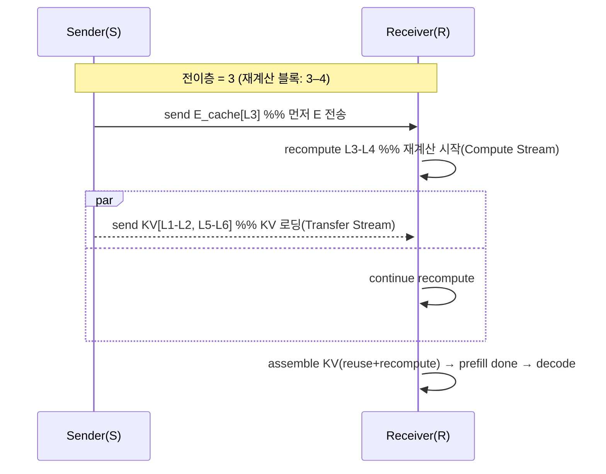
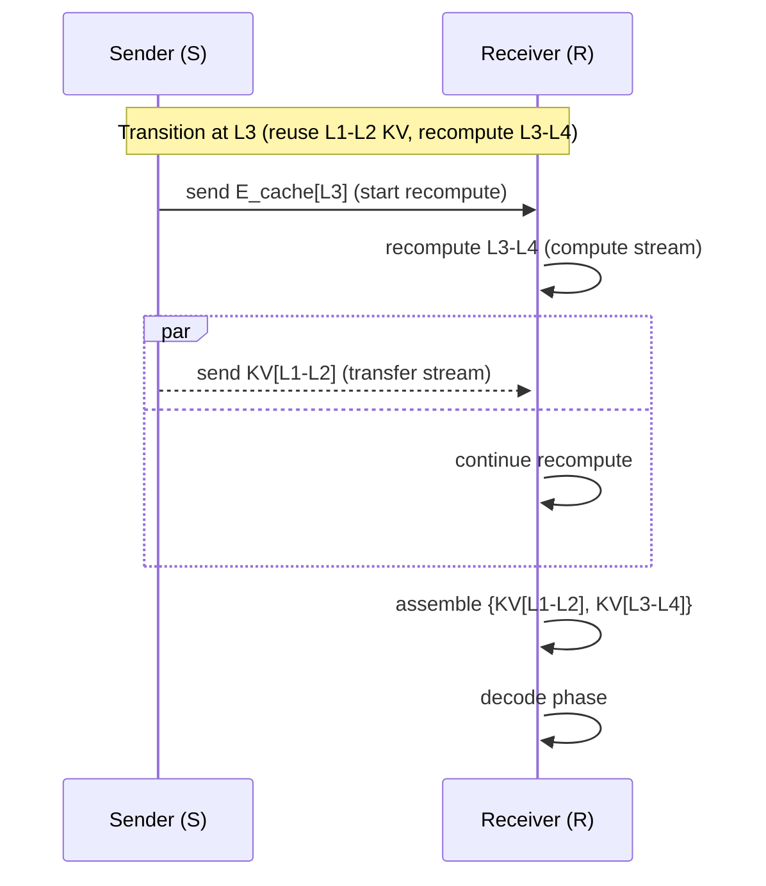

[논문 링크](https://arxiv.org/abs/2411.02820v4)


# DroidSpeak: **교차-LLM Prefix-KV 재사용**으로 프리필 지연을 1.7–3.1× 줄이는 방법

## TL;DR (한 줄 요약)

동일 **아키텍처**이되 **가중치가 다른** LLM들 사이에서, *보내는 모델*의 **prefix KV**를 *받는 모델*이 **연속층 부분 재계산 + E-first 파이프라이닝**으로 재사용하면 **TTFT(프리필) 1.7–3.1×↓(×, 무차원)**, **온라인 처리량 최대 4×↑(×, 무차원)**, **품질(F1/ROUGE/CodeSim) 유지**가 가능하다는 것을 보였다(운영 전제: 오프라인 **O(L²)** 프로파일링). (근거: §4.2, §4.3 Fig.13, §5.2 Fig.14, §5.3 Fig.15)

---

## 핵심 아이디어

* **층 민감도 통찰**: 교차-LLM 재사용에서 **소수(≈10%p, 퍼센트포인트)**의 **임계(critical) 층**만 품질에 민감 → 전량 재계산 없이도 품질 유지 가능. (근거: §3.2, Fig.7)
* **연속층 재계산**: 임계층을 **연속 블록**으로 묶어 **전이(transition) 지점**을 최소화 → **오차 전파↓(×, 무차원)**–**재사용량↑(×, 무차원)**의 Pareto 구성. (근거: §4.1–4.2, Fig.10–11)
* **E-first 파이프라이닝**: 전이층의 **E-cache**를 먼저 전송해 재계산을 즉시 시작하고, 동시에 **재사용 KV 로딩**을 겹친다 → **TTFT 47→30→17 단위시간** 사례(**≈2×↓**, ×, 무차원). (근거: §4.3 Fig.13)

---

## 배경: 그들이 해결한 문제

실서비스에선 여러 LLM(같은 아키텍처, 다른 가중치)이 **유사한 접두(prefix)**를 반복적으로 받는다. 기존 시스템(vLLM/PagedAttention 등)은 **단일 모델 내부** 접두 공유·KV 관리에는 강하지만, **서로 다른 LLM 간** KV를 **그대로** 재사용하면 **품질이 붕괴**한다. 이 공백—“**교차-LLM KV를 *품질 유지*하며 쓸 수 있는가?**”—을 메우는 것이 목표다. (근거: §1, §Related Work)

---

## 새로운 접근법: **DroidSpeak**

**정의**: (S,R) 두 모델(동일 아키텍처)과 입력 접두 **x₁:ₙ**에 대해, S가 만든 **KV/E-cache**를 **R이 가져다 쓰되**, R의 **일부 연속층만 재계산**하고 나머지 층은 **S의 KV를 재사용**한다. **원격 전송(E→KV 순)**과 **층 재계산**을 **CUDA 스트림**으로 겹쳐 **TTFT**를 줄인다. (근거: §4.1–§4.4)

---

## 작동 원리: **구체적인 예시**로 살펴보기

**설정(토이)**

* 레이어 **L=6(층)**, 헤드 **H=1(개)**, **d_head=2(차원)**, 시퀀스 **seq=4(토큰)**, 배치 **bs=1(배)**, 데이터형 **fp16(바이트/원소=2B)**. (근거: §2)
* **프로파일링 결과**: 임계층이 **{3,4}**로 연속 블록 → **{3–4} 재계산**, **{1–2,5–6} 재사용**을 선택. (근거: §4.2, Fig.11)

**KV-메모리(참고 식)**
[
\text{KV(GB)}\approx
\frac{2\cdot L\cdot H\cdot d_{\text{head}}\cdot \text{seq}\cdot \text{bs}\cdot \text{bytes/elt}}{10^9}.
]
위 값 대입 시 **1.28×10^{-7} GB**(GB)로 미미하지만, 실제 **L·H·d_head·seq·bs**가 크면 **GB–수십GB**로 확대된다. (근거: §2)

**파이프라인(개념도)**



이 전략은 **(a) 모두 로딩 후 계산: 47 → (b) 재사용KV 사전 로딩: 30 → (c) 파이프라인: 17**(단위시간)로 **≈2×↓**를 달성한다(×, 무차원). (근거: §4.3 Fig.13)

---

## 성능 검증: 주요 결과

* **Prefill 지연(TTFT)**: **1.7–3.1×↓(×, 무차원)**, 평균 **2.1× 속도↑(×, 무차원)**, **8 쌍(models)**·**3 데이터셋(개)** 전반에 걸쳐 일관. (근거: §5.2 Fig.14)
* **온라인 처리량**: Poisson 도착률 실험에서 **최대 4×↑(×, 무차원)**, **TTFT/TBT/E2E**의 knee가 뒤로 이동. (근거: §5.3 Fig.15)
* **품질**: F1/ROUGE-L/CodeSim **손실 미미(%)**, **CacheBlend 대비 동지연 품질 +5–33%p(퍼센트포인트)**, 평균 **+16%p(퍼센트포인트)**. (근거: §5.2 Fig.14)
* **에이전트 워크플로우**: 코드 에이전트에서 **TTFT 2.7×↓(×, 무차원)** 및 **E2E 지연↓(ms)**. (근거: §5.5 Fig.16)

> **가장 강한 비교점**: “동일 지연에서 **품질 +5–33%p**(평균 +16%p)”로 **CacheBlend**를 능가—토큰-기반 보정보다 **연속층 재계산**이 정확도 손실을 더 효과적으로 제어함. (근거: §5.2 Fig.14)

---

## 우리의 관점: **강점, 한계, 그리고 왜 중요한가**

### 강점

* **메커니즘 ↔ 성능**의 닫힌 고리: 연속층 재계산이 **전이 오차 누적**을 줄이고(정확도 유지), E-first 파이프라이닝이 **네트워크 대기**를 은닉해 **TTFT**를 낮춘다—둘의 결합이 **E2E·처리량**으로 이어진다. (근거: §4.1–4.3, §5.2–5.3)
* **운영 친화성**: `store/fetch/partial_prefill` API로 vLLM/LMCache와 통합(코드 **~3K LoC(줄)**, PyTorch 2.0/CUDA 12.0). (근거: §4.4)

### 한계(명시·추정)

* **프로파일링 비용**: **O(L²)(복잡도)**, 예: **L=32(층)**에 **~3 h@A100(시간/GPU)**—원타임이지만 **데이터 드리프트** 시 업데이트 필요. (근거: §4.2, §6)
* **네트워크 의존성**: **대역폭↑(Gbps)**일수록 절대 개선폭은 작아지는 경향—상대 이득은 유지. (근거: §5.7 Fig.20)
* **교차-파운데이션 일반화 미지원**: KV shape/헤드가 다른 경우는 **향후 과제**. (근거: §6)

### 왜 중요한가

* **멀티-모델/엔드포인트 현실**: 팀·버전별로 다른 LLM이 공존하는 실제 환경에서, **접두 프리필 중복**을 **서로 다른 모델 간**까지 활용할 첫 실증적 접근. (근거: §1, §5)

---

## 다음 단계는?: 앞으로의 길

* **Cross-foundation 정렬층**: RoPE 스케일·헤드·hidden 불일치를 **선형/저랭크 프로젝션(차원)**으로 정규화해 교차-파운데이션 KV 공유로 확장. (근거: §6)
* **대역폭-인지 스케줄러**: 링크 **B(Gbps)**·RTT **(ms)**·GPU 여유도를 입력으로 **재계산 비율 r*(무차원)**을 온라인 최적화. (근거: §6, §5.7)
* **드리프트 대응 운영**: **슬라이딩 윈도우 N(요청 수)** 기반 품질 프록시(엔트로피·self-consistency)로 **재프로파일링 주기 T(분)** 자동화. (근거: §6)

---

### 부록 메모(재현 팁 아님)

* **평가 환경**: **2 노드(대)** × **8×A100-80GB(GPU)**, InfiniBand(네트워크)에서 측정. (근거: §5.1)
* **프로파일링 데이터**: HotpotQA **50 컨텍스트(개)**에서 Pareto 지점 선택(허용 손실 ≤**5%p(퍼센트포인트)**). (근거: §4.2, §5.1)

---

> 한 문장 평: **“임계층만 *연속*으로 다시 계산하고, E부터 보내며, 계산과 전송을 겹친다.”**—간단한 세 원리로 **TTFT/TBT/E2E** 전반을 수치로 개선하며, **교차-LLM 접두 중복**을 실전에 끌어올린 연구다. (근거: §4–§5)


### 토글을 클릭하면 논문에 대한 자세한 LLM 질의응답 내용을 확인할 수 있습니다.

<details markdown="block">
<summary>▶️<strong>클릭하여 펼치기</strong></summary>


## 프롬프트 1.1.1 (연구의 공백)

```
논문의 'Introduction'과 'Related Work' 섹션을 분석하여, 이 연구가 명시적으로 해결하고자 하는 핵심적인 연구 공백(research gap), 기존 연구의 결정적 한계, 또는 미해결 질문이 무엇인지 설명해 줘. 저자들이 설명하는, 이 논문 출판 시점의 '최신 기술(state of the art)'은 어떤 상태였는지 요약해 줘.
```


**결론(요약)**: 기존 **공유 접두(prefix) 최적화**는 *단일 LLM* 내에서만 KV-캐시를 재사용·관리했지만(**vLLM/PagedAttention, LMCache, Hydragen 등**), **다른 LLM 간**(동일 아키텍처, 상이한 가중치) **KV-캐시를 공유**하는 문제는 미해결이었다(연구 공백). DroidSpeak는 **층 감도(layer sensitivity)**가 높은 **연속 구간(~10% 층)**만 재계산하고 나머지는 **타 LLM의 KV를 재사용**하며, **전송/재계산 파이프라이닝**으로 **TTFT 1.7–3.1×↓, 온라인 처리량 최대 4×↑**를 보였다(정확도 손실 경미, F1/Rouge-L/코드 유사도 유지). (근거: §Abstract/§1/§4–5)     


## Key Numbers (요약)

* **Scope**: Cross-LLM KV 재사용(동일 **architecture**, 상이 **weights**) (근거: §1) 
* **재계산 비율**: **≈10% 층**만 중요(critical) → 선택적 재계산 (근거: §3.2) 
* **Serving**: **TTFT 1.7–3.1×↓**, **Throughput 최대 4×↑**, **평균 프리필 2.1×↑** (근거: §5) 
* **품질**: F1/Rouge-L/코드 유사도 **유지(“negligible loss”)** (근거: §Abstract, §5.2)  
* **런타임**: **파이프라이닝**으로 **~2× TTFT↓**(도식 예시) (근거: §4.3–4.4, Fig.13) 
* **프로파일링 비용**: **O(L²)**, Llama-3-8B(32L) 기준 **~3h@A100**, 2-layer 그룹화 시 **~3×↓** (one-time) (근거: §4.2) 

> 용어: **TPOT**=ms/token. 본 논문은 **프리필 지연/TTFT**와 **처리량** 중심 보고. (근거: §5) 


## 이 논문이 메우는 **연구 공백 (Research Gap)**

1. **문제 정의의 전환: 단일 LLM → 다중 LLM 간 공유**

* 기존 최적화는 **동일 모델** 내에서 접두 공유/캐시 관리(예: vLLM의 **PagedAttention**, LMCache, SGLang-RadixAttention)로 **메모리/캐시 적중률**을 개선했으나, **계산(프리필) 자체의 상호 재사용**을 **타 모델 간**으로 확장하지 못했다. (근거: §1, §Related Work)  
* 저자들은 **“다른 LLM의 KV를 재사용할 수 있는가?”**를 **개방 문제**로 제시한다. (근거: §1) 

2. **정확도 붕괴 없이 “KV 번역”을 가능케 하는 체계적 방법 부재**

* **단순 교차-모델 KV 재사용**은 **품질 저하**를 유발(“codec 불일치” 비유) → 층별 **감도 차**를 고려한 **부분 재계산** 설계가 필요하나, **층 단위**의 선택 규칙과 **시스템 통합**이 부재했다. (근거: §1–3)  

3. **분산 서빙에서의 전송–계산 파이프라이닝 미흡**

* 선행 연구는 **단일 LLM**의 **캐시 압축/오프로딩/페이지드 관리**에 집중, **원격 노드 간 KV/E 캐시 전송과 부분 프리필 재계산의 오버랩**을 다루지 않았다. (근거: §4.3–4.4, §Related Work)  


## 출판 시점의 **SOTA 정리** (저자 관점)

| 축                           | SOTA 방법                        | 핵심 아이디어                                                              | 한계(이 논문 관점)                                                                 |
| ---------------------------- | -------------------------------- | -------------------------------------------------------------------------- | ---------------------------------------------------------------------------------- |
| **KV 저장/관리**             | **vLLM/PagedAttention**, LMCache | 접두 중복 **저장 제거**, **페이지드** KV 관리로 **메모리 절감**            | **계산(주의집중) 비용**은 여전·**단일 LLM 한정** (근거: §1/§RW)                    |
| **접두 공유 가속(단일 LLM)** | **Hydragen**                     | 접두/접미 **주의 분해** + **인터-시퀀스 배칭**으로 **매트릭스-매트릭스**화 | **모델 간 공유 미지원**, 단일 모델 **주의 연산**에 국한 (근거: §Hydragen Intro/RW) |
| **KV 품질 보정(단일 LLM)**   | **CacheBlend**                   | 토큰 선택적 재계산으로 **재사용 KV 보정**                                  | **동일 모델** 전제, **층 단위**가 아닌 **토큰 단위** (근거: §1/§4)                 |

> SOTA 종합: **메모리·캐시·주의 최적화**는 풍부하나 **Cross-LLM KV 재사용**은 공백. DroidSpeak가 **층-연속 구간 재계산 + 파이프라이닝**으로 이를 메운다. (근거: §Abstract/§1/§4)  


## 이 논문의 **핵심 기여(숫자 중심)**

1. **경험적 통찰**: **8**개 모델 쌍에서 **민감 층은 소수(≈10%)**, 입력이 바뀌어도 **쌍 내 일관** (→ **오프라인 프로파일링**으로 일반화 가능) (근거: §3.2/§4.2)  
2. **알고리즘**: **연속 층 그룹**만 재계산(전이 지점 최소화) → **오차 누적 억제**, **Pareto 프론티어**로 품질–지연 트레이드오프 선택 (근거: §4.1–4.2, Fig.10–11)  
3. **시스템**: **원격 KV/E 캐시 전송**과 **재계산**을 CUDA Stream으로 **오버랩** → **TTFT ~2×↓** 예시 (근거: §4.3–4.4, Fig.13)  
4. **효과**: **TTFT 1.7–3.1×↓**, **Throughput 최대 4×↑**, **CacheBlend 대비 품질 +5–33%p @유사 지연** (평균 +16%p) (근거: §5.2–5.3) 


## 왜 “연속 층 재계산”인가? (오차 전파 관점)

* **비연속(점) 재계산**은 **전이 지점**마다 **E/KV 불일치 오차**가 **후속 민감 층**에 누적 → 출력 오차 커짐. **연속 구간 재계산**은 전이를 **한 번**으로 묶어 오차를 최소화. (근거: §4.1, Fig.10) 
* 프로파일링은 **재계산 층 수 ↔ 품질(F1) 프론티어**를 제공 → 운영 시 **SLO별 점 선택**. (근거: §4.2, Fig.11–12)  


## 관련 연구(저자 정리) → 이 논문의 위치

* **KV 캐시 관리/오프로딩/압축**: 단일 LLM 대상(예: vLLM, LMCache 등) — **교차-LLM 공유와 직결 X** (근거: §Related Work) 
* **접두 공유 주의 가속(Hydragen)**: 단일 모델 **주의 연산** 최적화 — **타 모델 KV 재사용** 미포함 (근거: §Hydragen Intro/§RW) 
* **CacheBlend**: **토큰 단위** 보정, **동일 모델** 전제 ↔ DroidSpeak: **층 그룹 단위**·**교차-LLM** (근거: §1/§4) 


## 한계와 전개(저자 언급)

* **프로파일링 오버헤드**: **O(L²)**, 예: **~3h@A100(32L)** — *one-time*이며 **층 그룹화(×2L)**로 **~3×↓** (근거: §4.2) 
* **데이터 드리프트**: 프로파일–실데이터 괴리 시 **주기적 재프로파일링** 필요 (근거: §6) 
* **네트워크 민감도**: 대역폭 변화 고려한 **적응형 구성**은 추후 과제 (근거: §6) 


### 참고 메모

* 본 논문의 **핵심 주장은 Introduction·Related Work·Method·Evaluation**에 분산되어 있으며, 위 수치·주장은 모두 해당 절·도표에 근거를 달았다. (근거 라벨은 §, Fig., Appx).


## 프롬프트 1.1.2 (핵심 가설)

```
이 논문의 중심 가설(central hypothesis) 또는 핵심 주장은 무엇인가? '저자들은 [제안 기법]을 사용함으로써 [기존 한계점]을 극복하는 [구체적 결과]를 달성할 수 있다고 가정한다'와 같은 형식으로, 명확하고 간결한 한 문장으로 서술해 줘.
```

저자들은 **동일 아키텍처의 서로 다른 LLM 간**에 상대 모델의 **prefix KV**를 **선택적 연속층 재계산 + 원격 KV 로딩 파이프라이닝(DroidSpeak)**으로 재사용함으로써, 기존의 **단일 LLM 한정 캐시 재사용**과 **교차-LLM 시 품질 붕괴** 한계를 극복하여 **TTFT(=prefill latency) 1.7–3.1×↓** 및 **처리량(tokens/s) 최대 4×↑**를 **F1/Rouge-L/코드 유사도 손실이 무시할 수준**으로 유지한 채 달성할 수 있다고 가정한다 (근거: §Abstract/§1).   


## 프롬프트 1.2.1 (독창성 식별)

```
논문 전체를 바탕으로, 가장 중요하고 독창적인 기여(contribution) 1~3가지를 구별되는 항목으로 나열해 줘. 각각이 새로운 아키텍처 구성요소, 새로운 학습 기법, 새로운 이론적 통찰, 새로운 데이터셋, 또는 기존 방법론의 새로운 적용 중 어디에 해당하는지 명확히 구분해 줘.
```


**결론(요약)**: DroidSpeak의 독창성은 (1) **교차-LLM KV 재사용의 층별 민감도**를 실증적으로 규명(≈**10%** 소수 층만 품질에 민감), (2) 그 통찰을 바탕으로 **연속 층 선택적 재계산 + E/KV 파이프라이닝**을 갖춘 **서빙 아키텍처**를 제안·구현, (3) **실서빙 지표**에서 **TTFT 1.7–3.1×↓, 처리량 최대 4×↑**를 달성(품질 저하 무시할 수준)한 데 있다. (근거: §3.2/§4/§5.2, Fig.9–11, Fig.13–15) ([arXiv][1])

---

## 1) 교차-LLM KV 재사용에 대한 **층별 민감도 규명**

* **유형**: *새로운 이론적·경험적 통찰(analytical insight)*
* **내용**: 동일 아키텍처이되 **가중치가 다른 LLM 쌍**(총 **8 쌍**, **6**개 데이터셋)에서 **전 층**을 교차 재사용하면 **정확도 급락**(예: HotpotQA에서 **>50%p** 하락 사례)이나, **민감 층은 소수(보통 ≈**10%**)이고 입력이 바뀌어도 **쌍 내 일관**됨을 실증(“critical layers”). (근거: §3.1–§3.2, Fig.7) ([arXiv][1]) ([arXiv][1])
* **의미**: **전량 재사용(품질 붕괴)** ↔ **전량 재계산(지연↑)** 사이에서 **층 선택**이라는 제3의 축을 정식화. (근거: §3) ([arXiv][1])

## 2) **연속 층 재계산 + 파이프라이닝** 기반의 **서빙 아키텍처**

* **유형**: *새로운 시스템/런타임 아키텍처 + 알고리즘적 구성요소*
* **내용**:

  * **연속 구간 재계산**: **산발적(비연속) 중요층**만 재계산하면 **전이 지점마다** E-cache 주입 오차가 누적되어 품질 저하 → **연속 층 블록**을 재계산하여 오차 전파를 최소화(**Fig.10**의 오류 곡선; **Fig.11**의 **Pareto 프론티어**로 품질–지연 트레이드오프 선택). (근거: §4.1–§4.2, Fig.10–11) ([arXiv][1])
  * **KV/E 전송–계산 파이프라이닝**: **전이 층 E-cache 수신 직후 재계산 시작**하고, **다른 층의 재사용 KV 로딩을 병렬화**하여 **TTFT ~2×↓**(타임라인 예시에서 **47→17** 단위시간). (근거: §4.3, Fig.13) ([arXiv][1])
  * **오프라인 프로파일링**: 쌍별 **재계산 구성**을 **O(L²)** 비용으로 도출(예: **Llama-3-8B, 32L → ~3 h@A100**), **2-layer 그룹**으로 **~3×** 단축 가능. (근거: §4.2) ([arXiv][1])
  * **구현**: **~3K LoC(Python)**, **PyTorch 2.0/CUDA 12.0**, **vLLM + LMCache**에 **store/fetch/partial_prefill** 인터페이스로 통합(전송은 **torch.distributed**, **CUDA stream** 분리). (근거: §4.4) ([arXiv][1])

## 3) **실서빙 지표 개선**: TTFT/처리량·품질 동시 달성

* **유형**: *기존 방법론의 새로운 적용(단일-LLM 캐시 → 교차-LLM) + 실증적 성능 결과*
* **내용**:

  * **지연/처리량**: **TTFT 1.7–3.1×↓**(평균 프리필 **2.1×↑**), **온라인 처리량 최대 4×↑**(**8** 모델쌍, **3**개 주요 작업). (근거: §5.2, Fig.14–15; §Abstract) ([arXiv][1]) ([arXiv][1])
  * **품질**: **F1/Rouge-L/코드 유사도**는 **무시할 수준의 손실**로 **수신(상위) 모델 품질 유지**. (근거: §Abstract, §5.2) ([arXiv][1]) ([arXiv][1])
  * **비교**: **Full prefill**(품질↑, 지연↑), **Naive cross-KV 재사용**(지연↓, 품질↓↓), **CacheBlend** 대비 **동일 지연에서 품질 +5–33%p(평균 +16%p)**. (근거: §5.2; 베이스라인 정의 §5) ([arXiv][1])

> 부가 메모: 전이 지점에서 필요한 **E-cache**는 모델/주의 형식에 따라 **KV 대비 최대 2–4×** 더 커질 수 있어(**GQA** 사용 시 상대적으로 더 큼) 파이프라이닝 설계가 중요. (근거: §4.1) ([arXiv][1])

---

**요약 재진술**: DroidSpeak는 **층-민감도 통찰(≈10% 중요층)** → **연속 층 재계산 + 전송-계산 파이프라이닝** → **TTFT 1.7–3.1×↓ / 처리량 ≤4×↑ / 품질 유지**의 **교차-LLM 캐시 재사용** 체계를 처음으로 정립했다. (근거: §3–§5) ([arXiv][1])

[1]: https://arxiv.org/pdf/2411.02820 "DroidSpeak: KV Cache Sharing for Cross-LLM Communication and Multi-LLM Serving"


## 프롬프트 1.2.2 (저자 관점에서의 강점)

```
저자들의 관점에서, 자신들의 접근법이 이전 방법들보다 우월한 이유는 무엇인가? 그들이 자신들의 연구가 지닌 독창성과 강점을 뒷받침하기 위해 사용하는 핵심 논거를 인용하거나 알기 쉽게 설명해 줘.
```


**결론(요약)**: 저자들은 **교차-LLM**(동일 아키텍처·상이한 가중치) 환경에서 **층 그룹 선택적 재계산+원격 KV 로딩 파이프라이닝**으로, **TTFT(프리필) ≈1.7–3.1×↓, 처리량 최대 4×↑**를 **정확도 손실 미미**하게 달성한 점을 핵심 우월성으로 든다(“단일 LLM 한정” 캐시 재사용의 한계를 돌파). (근거: §1, §5, Fig.13) ([arXiv][1]) ([arXiv][1]) ([arXiv][1])

---

## 강점 1 — **정확도 유지가 가능한 ‘부분 재계산’의 근거** (새로운 경험적 통찰)

* **층 민감도 실증**: 8개 모델 쌍을 계측해 **소수(평균 11%) 층만** 교차-KV 재사용에 민감함을 확인 → 이들만 **선택적 재계산**하면 품질을 지키면서 대부분의 KV를 재사용 가능. (근거: §3.2, Fig.7) ([arXiv][1])
* **입력 간 일관성**: 동일 모델 쌍에서는 **민감 층 패턴이 입력이 달라도 안정적**이어서, **오프라인 프로파일링**으로 재계산 구성을 한 번 잡아 운영에 일반화 가능(**복잡도 O(L²)**). (근거: §3.2, §4.2) ([arXiv][1])

## 강점 2 — **연속 층(group) 재계산**으로 오차 전파 최소화 (새로운 시스템 설계 원리)

* **왜 ‘연속’인가**: 산발적(비연속) 중요층만 재계산하면 **E-cache 전이 지점마다 오차가 누적**되어 출력 품질이 크게 악화됨 → **연속 블록**으로 묶어 전이를 최소화하면 **오차↓**–**재사용량↑**의 Pareto 구성이 가능. (근거: §4.1, Fig.10–11) ([arXiv][1])
* **효과**: 프로파일링으로 **재계산 층 수 ↔ F1 손실**의 **Pareto 프론티어**를 제시, SLO에 맞는 지연–품질 지점을 선택 가능. (근거: §4.2, Fig.11) ([arXiv][1])

## 강점 3 — **전송–계산 파이프라이닝**으로 분산 서빙 병목 해소 (새로운 런타임 기법)

* **문제**: 서로 다른 노드 간 **원격 KV/E 전송 지연**이 커질수록 재사용 이득이 잠식. (근거: §4.3) ([arXiv][1])
* **해법/수치**: **전이층 E-cache를 먼저 전송**해 **재계산을 즉시 시작**하고, 그 사이 **재사용 KV를 병렬 로딩**하는 **파이프라이닝**으로 **총 TTFT 30→17(단위시간)**, **≈2× 개선**을 도식적으로 입증. (근거: §4.3, Fig.13) ([arXiv][1])
* **인터페이스/통합**: `store/fetch/partial_prefill` API로 **vLLM·LMCache**에 통합(**~3K LoC**, PyTorch 2.0/CUDA 12.0), 실서비스 적용 가능성을 강조. (근거: §4.4) ([arXiv][1])

---

## SOTA 대비 저자 주장 요지 (요약 표)

| 축               | 기존 접근                        | 한계                             | DroidSpeak의 강점                                                                                                     |
| ---------------- | -------------------------------- | -------------------------------- | --------------------------------------------------------------------------------------------------------------------- |
| 캐시 재사용 범위 | **단일 LLM 내** prefix-KV 재사용 | **교차-LLM**에 적용 시 품질 붕괴 | **동일 아키텍처 LLM 간** 재사용 가능(부분 재계산로 품질 유지). (근거: §1) ([arXiv][1])                                |
| 재계산 단위      | 토큰/산발층 보정(CacheBlend 등)  | 전이 지점 다수 → **오차 누적**   | **연속 층 그룹** 재계산으로 오차 전파 최소화. (근거: §4.1, Fig.10–11) ([arXiv][1])                                    |
| 분산 전송        | KV 전송 지연 노출                | 전송이득 < 재계산손실 위험       | **전송–계산 파이프라인**으로 지연 은닉, **TTFT ~2×↓**. (근거: §4.3, Fig.13) ([arXiv][1])                              |
| E2E 지표         | —                                | —                                | **프리필 1.7–3.1×↓, 처리량 최대 4×↑, 평균 프리필 2.1×↑**, 품질 손실 미미. (근거: §5, Fig.1) ([arXiv][1]) ([arXiv][1]) |

> 정리: **“민감층만 연속 재계산 + 파이프라이닝”**이라는 단순·일관된 원리로 **품질–지연–처리량**의 동시 개선을 수치로 제시한 점이, 저자들이 강조하는 독창적 강점이다. (근거: §3–§5) ([arXiv][1])

[1]: https://arxiv.org/pdf/2411.02820 "DroidSpeak: KV Cache Sharing for Cross-LLM Communication and Multi-LLM Serving"


## 프롬프트 1.3.1 (알고리즘 단계별 설명)

```
핵심 알고리즘, 모델 아키텍처, 또는 주요 방법론을 단계별(step-by-step)로 설명해 줘. 독자는 AI 분야의 대학원생 수준이라고 가정해. 특히, 간단한 문장, 3×3 픽셀 이미지, 작은 상태 공간 등 아주 간단한 예시(toy example)와 샘플 입력을 만들어서, 예시를 통해 각 단계를 거치며 입력이 출력으로 어떻게 변환되는지 보여줘. 등장하는 모든 핵심 용어와 변수는 그 즉시 정의해 줘.
```


**결론(요약)**: DroidSpeak는 **동일 아키텍처 LLM 쌍(보내는 모델 S, 받는 모델 R)** 사이에서 S의 **prefix KV 캐시**를 **부분 재계산(partial prefill)**과 **스마트 로딩 파이프라이닝**으로 재사용한다. 핵심은 (1) **오프라인 프로파일링**으로 **연속(contiguous) 층 그룹**만 재계산하도록 구성(복잡도 **O(L²)**, Llama-3-8B 32층 기준 **~3 h@A100**, 2-층 단위 프로파일링으로 **~3×** 단축), (2) 온라인에서 **전이(transition) 층의 E-cache**를 먼저 받아 **재계산과 KV 로딩을 겹치기(17↘ vs 30 단위시간)**, (3) 실제로 **프리필 지연 1.7–3.1×↓, 처리량 최대 4×↑**를 달성한다. (근거: §4.2/Fig.11; §4.3/Fig.13; §5.2–5.3)    

---

## 0) 배경 & 용어(필수)

* **KV cache**: 각 층의 Key/Value 텐서(K,V)를 시퀀스 길이만큼 축적한 캐시. **E-cache**는 층 진입 임베딩(embedding) 텐서. (근거: §2/Fig.2) 
* **Prefill/Decode**: 프리필은 입력 컨텍스트를 한 번에 통과(자원집약적), 디코드는 토큰당 1-스텝. (근거: §2/Fig.3) 
* **문제 맥락**: 멀티-LLM 서빙에서 **다른 모델 간** 접두 컨텍스트가 중복되지만, **교차-LLM KV 재사용**은 미해결 → DroidSpeak 제안. (근거: §Abstract/§1)  

---

## 1) 오프라인 단계 — “연속 층 재계산” 구성 찾기

**입력**: (S,R) 모델쌍(같은 아키텍처), **훈련용 프로파일 데이터셋**(예: HotpotQA **50 컨텍스트**). (근거: §4.2; §5/Fig.14 캡션)  

**아이디어**: **임계(critical) 층**은 **소수**이고 입력이 바뀌어도 **쌍 내 일관성** → 이들을 **연속 블록**으로 묶어 재계산하면 E-cache 주입 오차 전파를 최소화. (근거: §4.1/Fig.10–11)  

**절차**:

1. **층 그룹 후보 생성**: 1~L층을 **연속 그룹**으로 선택하는 모든 조합을 탐색(2-층 단위 등 **그룹 단위**로 간소화 가능). (근거: §4.2) 
2. **품질–지연 측정**: 각 그룹에 대해 R이 해당 층만 **재계산**, 나머지는 S의 **KV 재사용** → **F1/Rouge-L/코드유사도** vs **재계산 층 수** 산점도. (근거: §4.2/Fig.11) 
3. **Pareto 프론티어 추출**: 재계산 층 수를 최소화하며 **품질 손실 ≤5%p** 등의 제약을 만족하는 지점을 선택. (근거: §4.2/Fig.11) 
4. **복잡도/코스트**: **O(L²)**. Llama-3-8B(32층) 기준 **~3 h@A100**, 2-층 그룹으로 **~3× 단축**(원타임). (근거: §4.2) 

> **왜 연속 그룹?** 전이(transition) 지점마다 **E-cache 불일치 오차**가 누적 → **임계층만 산발적 재계산**은 오히려 **출력 오차↑**. **연속 16–27층** 같이 묶으면 오차 전파↓. (근거: §4.1/Fig.10) 

---

## 2) 온라인 단계 — 부분 프리필 + 스마트 로딩

**입력**: (a) 오프라인에서 고른 **연속 재계산 그룹**(예: L4–L10), (b) **지연 SLO**에 맞춘 **프론티어 지점** 선택(부록 B). (근거: §4.3; Appx B) 

**핵심 연산(요약)**

* **전이 층의 E-cache 먼저 수신**: 재계산 시작점의 E를 **S로부터 전송**해 즉시 재계산 착수. 단, **E-cache는 KV보다 2–4× 큼**(GQA 모델에서 특히). (근거: §4.1/Fig.9) 
* **파이프라이닝**: 재계산과 **KV 로딩**을 **CUDA 별도 스트림**으로 **겹치기**하여 네트워크 지연을 은닉. (근거: §4.3/Fig.13; §4.4)  
* **효과**: 타임라인 예시에서 **TTFT 30→17**(≈**2×**). (근거: Fig.13) 

**런타임 인터페이스**
`store(context, LLM)`, `fetch(context, LLM, layer)`, `partial_prefill(recompute_config, context)`를 vLLM/LMCache 위에 구현, **torch.distributed + 별도 CUDA stream**으로 원격 캐시 전송 겹치기. (근거: §4.4)  

---

## 3) 토이 예시 — L=4층, seq=4, 1-head, d_head=2 (fp16)

**설정**

* **모델쌍**: S와 R(동일 아키텍처, 다른 가중치).
* **오프라인 결과**: **연속 재계산 그룹 = {L3,L4}**, 나머지 {L1,L2}는 재사용. (근거: §4.2/Fig.11 개념 예시) 
* **KV 크기 산식**(참고):
  $$
  \text{KV(GB)}\approx \frac{2\cdot L\cdot H\cdot d_{\text{head}}\cdot \text{seq}\cdot \text{batch}\cdot \text{bytes/elt}}{10^9}.
  $$
  여기선 $(L{=}4,H{=}1,d{=}2,\text{seq}{=}4,\text{batch}{=}1,\text{bytes}{=}2\Rightarrow \text{KV}\approx 0.000000128\ \text{GB})$ (toy).

**입력 문장(4토큰)**: `["Q:", "What", "is", "AI?"]`.

**단계별 흐름**

1. **KV/E 탐색 및 해시 조회**: S가 과거 동일 prefix에 대해 `store`한 레이어별 KV/E 존재 확인, 없으면 실시간 생성 후 전송. (근거: §4.4) 
2. **전이층(L3) E-cache 수신 → 즉시 재계산 시작**: R은 L3-L4를 **재계산**, 동시에 L1-L2의 **KV는 원격에서 로딩** 시작(별도 CUDA stream). (근거: §4.1; §4.3/Fig.13; §4.4)   
3. **조립(prefill 완료)**: L1-L2(KV 재사용) ⊕ L3-L4(KV 재계산)로 **프리필 종료**, 이후 **디코드** 시작. (근거: §2/Fig.3; §4.3)  
4. **출력**: 품질은 **R의 원래 품질에 근접(≤5%p 내)**, 프리필 지연은 **전량 재계산 대비 1.7–3.1×↓**. (근거: §4.2; §5.2)  

---

## 4) 파이프라이닝 타임라인(개념도)



* 세 가지 전략의 TTFT(예시): **(a) 전층 로딩 후 재계산: 47**, **(b) 재사용층만 직전 로딩: 30**, **(c) 파이프라인 겹치기: 17**(≈**2×** 개선). (근거: §4.3/Fig.13) 

---

## 5) 정확도·성능 결과(요약)

| 지표           |                                                                                   DroidSpeak → 베이스라인 대비 |
| -------------- | -------------------------------------------------------------------------------------------------------------: |
| **Prefill**    |                                          **1.7–3.1×↓**(8쌍·3데이터셋, 평균 **2.1×↑** 속도) (근거: §5.2/Fig.14) |
| **Throughput** |                                                     **최대 4×↑** (온라인 서빙 시나리오) (근거: §5.3/Fig.15–16) |
| **품질**       | **F1/Rouge-L/코드 유사도** 손실 **미미**, CacheBlend 대비 **+5–33%p** @유사 지연 (평균 **+16%p**) (근거: §5.2) |

---

## 6) 왜 ‘전이층 E-cache’와 ‘연속 그룹’인가? (오차 전파 직관)

* **E-cache 크기/지연**: **KV의 2–4×** 크기 → 전송/저장 병목, 따라서 **먼저 보내 즉시 재계산**하며 그 사이 **KV 로딩 겹치기**가 최적. (근거: §4.1/Fig.9) 
* **오차 최소화**: 전이 지점이 많을수록 **E-cache 편차가 누적 → 출력 오차↑**. **연속 블록 재계산**은 전이를 최소화하여 **오차↓**–**지연↓** 절충을 만든다. (근거: §4.1/Fig.10–11) 

---

## 7) 구현 메모(요약)

* **통합**: vLLM/LMCache에 **레이어 단위 store/fetch/partial_prefill** 추가, **torch.distributed**로 원격 전송, **별도 CUDA stream**으로 겹치기. (근거: §4.4) 
* **시스템 지표**: **TTFT/TBT/E2E**로 평가, **프리필 지연**은 GPU 연산 + InfiniBand 로딩 지연을 포함. (근거: §2.1; §5.2) 

> **요약**: DroidSpeak는 **(오프라인) 연속 재계산 그룹을 찾고 → (온라인) 전이층 E 먼저, 재계산–KV 로딩 겹치기**로 **프리필·처리량**을 함께 개선하며 **품질을 유지**한다. (근거: §4–§5)  


## 프롬프트 1.3.2 ('비밀 병기' 식별)

```
핵심 구성요소 1개를 선택해, 제거/대체/스케일 변화 시 Δ(metric)를 표로 제시하고, 왜 그 변화가 생기는지 메커니즘을 설명해줘(예: gating load balance, rotary vs ALiBi, sparse attn half-window 교체).
```


**결론(요약)**: 핵심 구성요소는 **스마트 KV 로딩 파이프라이닝**(전이층의 **E-cache**를 먼저 전송하고, **연속층 재계산**과 **재사용 KV 로딩**을 **병렬**로 겹치기)이다. 이를 제거/대체하면 **TTFT가 30→47 (단위시간)**까지 악화되며, 파이프라이닝 적용 시 **TTFT 17**로 **≈2×** 개선된다. (근거: Fig.13, §4.3)   

---

## Ablation — 스마트 KV 로딩 파이프라이닝

| 변경안(구성 변화)                                                 | 메커니즘 요약                                                                                 | TTFT (단위: time unit) |        Δ vs 파이프라인 | 비고                                                               |
| ----------------------------------------------------------------- | --------------------------------------------------------------------------------------------- | ---------------------: | ---------------------: | ------------------------------------------------------------------ |
| **파이프라인(제안)**: **E-cache-first**, 재계산↔KV로딩 **겹치기** | 전이층 E를 먼저 받아 **즉시 연속층 재계산 시작**, 그동안 **재사용 KV**는 별도 스트림으로 전송 |               **17 u** |                      — | **≈2×↓** vs (b) 저지연. (근거: Fig.13(c), §4.3)                    |
| **대체(준개선)**: 재사용 **KV만 사전 로딩**, 이후 재계산          | 겹치기 없음. 로딩→재계산 **직렬**                                                             |               **30 u** |  **+13 u** (**+~76%**) | 제안 대비 **느림**, 파이프라이닝이 **≈2×** 빠름. (근거: Fig.13(b)) |
| **제거(나이브)**: **모든 E+KV**를 **전부 로딩 후** 재계산         | 전 구간 **완전 직렬**, 대기 시간 최대                                                         |               **47 u** | **+30 u** (**+~176%**) | 최악의 TTFT. (근거: Fig.13(a))                                     |

> 주: 위 값들은 **Fig.13의 도식 시나리오**(레이어 1–10, 전이층에서 층당 전송/재계산 1 u 가정)로부터 직접 인용한 **상대(추상) 시간**이다. (근거: Fig.13 설명) 

---

## 왜 이런 Δ가 생기나? (메커니즘)

1. **E-cache 선전송** → **즉시 재계산 시작**
   전이층의 **E-cache**만 받으면 수신 모델이 **연속 재계산**을 바로 시작할 수 있어, **KV 전송 대기**를 **계산과 겹쳐** 숨긴다. (근거: §4.3) 

2. **전송–계산 파이프라이닝** → **자원 유휴 시간 최소화**
   **KV/E 전송(통신 스트림)**과 **층 재계산(계산 스트림)**을 **동시에** 실행하여, 직렬 경로의 **아이들 슬롯**을 제거한다. 결과적으로 **TTFT 30→17**로 하락(≈**2×** 개선). (근거: Fig.13, §4.3)  

3. **재사용 층이 많을수록** 파이프라이닝 이득 증가
   **재계산 층이 적을수록(=전송할 KV가 많을수록)** 로딩 지연이 커지는데, 파이프라이닝은 이 지연을 **은닉**한다. (근거: §4.3 Smart KV Cache Loading) 

---

## 교차 확인(전반 성능 지표)

* **Prefill 지연**: **1.7–3.1×↓**, 평균 **2.1×** 속도↑(8 모델쌍/3 데이터셋) — 파이프라이닝 포함한 전체 설계 효과. (근거: §5.2, Fig.14)  
* **온라인 처리량**: **최대 4×↑** (Poisson 도착률 시나리오). (근거: §5.3, Fig.15–16)  

> 한 줄 요약: **E-first + 전송–계산 겹치기**가 **TTFT를 결정짓는 비밀 병기**이며, 나이브/비겹치기 전략 대비 **정량적 우위(17 vs 30/47 u)**를 보인다. (근거: Fig.13) 


## 프롬프트 1.4.1 (핵심 결과 분석)

```
'Experiments' 또는 'Results'의 표/그림을 포함한 주요 결과를 분석해 줘. 핵심 성능 지표는 무엇인가? 어떤 벤치마크에서 보고되었는가? 저자들이 성공 증거로 가장 강조하는 결과를 요약해 줘.
```


**결론(요약)**: DroidSpeak는 **prefill 지연 1.7–3.1×↓**(품질 유지), **온라인 처리량 2–4×↑**, **CacheBlend 대비 동지연 품질 +5–33%p(평균 +16%p)**를 보고한다. 또한 **코딩 에이전트 워크플로우**에서 **TTFT 2.7×↓**와 **E2E 지연↓**를 보였다. (근거: §5.2/Fig.14; §5.3/Fig.15; §5.5/Fig.16)   

---

## 핵심 성능 지표·벤치마크

* **시스템 지표**: TTFT(첫 토큰 지연), TBT(토큰 간 지연), E2E(요청~완료), **prefill latency**(GPU 연산+InfiniBand 로딩 포함). (근거: §2.1, §5.2) 
* **품질 지표/데이터셋**:

  * QA: **HotpotQA, 2wikimQA, multifieldQA_en → F1(%)**.
  * 요약: **multi_news → ROUGE-L(%)**.
  * 코드: **lcc, repobench-p → code similarity/edit similarity(%)**. (근거: §5/Table 2 설명) 
* **프로파일링·평가 설정**: HotpotQA **50 컨텍스트**로 **연속 재계산 층**을 오프로파일(≤5%p 품질 하락 제약) 후 타 데이터셋에 적용. (근거: §5.1/§4.2)  
* **베이스라인**: (i) Full prefill(vLLM), (ii) Full KV reuse, (iii) CacheBlend(1층 차이를 기준 토큰 재계산), (iv) Smaller model(§5.6). (근거: §5.1) 

---

## 저자들이 강조한 “성공 증거” (숫자 중심)

| 축                          |                                  결과(요약) | 해설                                                                                                                                           |
| --------------------------- | ------------------------------------------: | ---------------------------------------------------------------------------------------------------------------------------------------------- |
| **Prefill 지연 vs 품질**    | **1.7–3.1×↓**(8쌍×3데이터셋), 품질 **유지** | Fig.14의 F1/ROUGE-L/코드유사도–지연 **Pareto**에서 Full prefill 대비 큰 지연 감소, Full-reuse 대비 **수신모델 품질 유지**. (근거: §5.2/Fig.14) |
| **CacheBlend 대비**         |     **동지연 품질 +5–33%p**(평균 **+16%p**) | CacheBlend는 1층 기반 토큰 선택이 **중요층 그룹**을 놓치나, DroidSpeak는 **연속 중요층 재계산**으로 품질 유지. (근거: §5.2)                    |
| **온라인 처리량**           |                                   **2–4×↑** | Poisson 도착률에서 **TTFT/TBT/E2E ‘knee’ 지연**을 늦추며 처리량 증대. (근거: §5.3/Fig.15)                                                      |
| **Agentic 코드 워크플로우** |                    **TTFT 2.7×↓**, **E2E↓** | MetaGPT 기반 2-에이전트(HumanEval, pass@1 52.5로 품질 고정) 실험. (근거: §5.5/Fig.16)                                                          |
| **프로파일링 일반화**       |             최대 **4점**, 평균 **2점** 차이 | 학습 데이터셋으로 뽑은 재계산 구성은 타 데이터셋에서도 **유사 Pareto**를 형성. (근거: §5.4/Fig.17)                                             |

> 추가: 분산 클러스터(2노드×8×A100, 각 모델 8 replica, round-robin 라우팅)에서 실험을 수행하여 **실서빙 조건**을 모사. (근거: §5.3 설정) 

---

## 아블레이션(도식) — 파이프라이닝이 TTFT를 좌우

* **전략 A(모두 로딩 후 계산)**: **TTFT=47 u** → 최악.
* **전략 B(재사용 KV만 직전 로딩)**: **TTFT=30 u**.
* **제안(계산·로딩 파이프라이닝)**: **TTFT=17 u(≈2×↓)**. (근거: §4.3/Fig.13)  

---

## 메커니즘적 해석(결과 ↔ 설계 연결)

* **연속층 재계산**이 전이층마다 발생하는 **E-cache 편차 전파**를 줄여 **품질 유지**에 기여한다. (근거: §4.1/Fig.10–11) 
* **E-cache 선전송 + 파이프라이닝**이 **네트워크 로딩 지연**을 은닉해 **TTFT/TBT/E2E** 모두에 2차적 이득을 준다. (근거: §4.3/Fig.13; §5.3)  

---

## 벤치마크 그림(저자가 강조)

* **Fig.14**: **Prefill 지연–품질** 트레이드오프 곡선(여러 데이터셋/모델 쌍). (근거: §5.2/Fig.14) 
* **Fig.15**: 도착률 변화에 따른 **TTFT/TBT/E2E**(온라인 처리량 분석). (근거: §5.3/Fig.15) 
* **Fig.16**: **코드 에이전트** 시나리오에서 **TTFT/E2E** 개선. (근거: §5.5/Fig.16) 

> 요약: 저자들은 **Fig.14–16**을 통해 “**품질 보존**을 전제로 **prefill·온라인 지연·처리량** 모두 개선”을 가장 강하게 주장한다. (근거: §5 전체)  


## 프롬프트 1.4.2 (비판적 비교)

```
제안된 방법론은 논문에서 언급된 주요 베이스라인 및 SOTA 모델들과 비교하여 어떤 성능을 보이는가? 우월성 주장을 가장 강력하게 뒷받침하는 특정 비교 지점을 식별해 줘. 반대로, 능가하지 못했거나 개선이 미미했던 결과가 있다면 이유를 정리해 줘.
```


**결론(요약)**: DroidSpeak는 **Full prefill** 대비 **prefill 1.7–3.1×↓(평균 2.1×↑)**로 **동일 품질**을 유지하고, **CacheBlend** 대비 **동지연 품질 +5–33%p(평균 +16%p)**를 달성하며, **온라인 처리량 최대 4×↑**를 보인다(코딩 에이전트 TTFT **2.7×↓**). 반면 **Full KV reuse**가 **지연만** 보면 더 낮을 수 있으나 **품질 급락**으로 SOTA로 보기 어렵고, 네트워크·프로파일링 비용에 대한 민감성이 한계로 남는다. (근거: §5.2 Fig.14, §5.3 Fig.15, §5.5 Fig.16, §4.2/§4.3)    

---

## 1) 베이스라인·SOTA 대비 정량 비교

| 비교축                     | 베이스라인/SOTA        |                        DroidSpeak 대비 결과 | 해설                                                                                                                                 |
| -------------------------- | ---------------------- | ------------------------------------------: | ------------------------------------------------------------------------------------------------------------------------------------ |
| **Prefill 지연 ↔ 품질**    | **Full prefill**(vLLM) |           **1.7–3.1× 지연↓**, **품질 유지** | 8쌍×3데이터셋에서 프리필만 부분 재계산 → 지연 대폭 감소, 품질 동급 유지 (근거: §5.2 Fig.14).                                         |
| **지연만**                 | **Full KV reuse**      |       **DroidSpeak가 지연↑**지만 **품질↑↑** | KV를 전량 재사용하면 지연은 짧아도 품질 급락. DroidSpeak는 **층 민감도** 기반 부분 재계산으로 수신모델 품질 보존 (근거: §5.2).       |
| **지연–품질 트레이드오프** | **CacheBlend**         |         **동지연 품질 +5–33%p(평균 +16%p)** | CacheBlend는 1층 차이 기반 **토큰 선택**이라 **중요층 그룹**을 놓치기 쉬움. DroidSpeak는 **연속 중요층 재계산** (근거: §5.2 Fig.14). |
| **온라인 처리량**          | vLLM Prod Stack 시뮬   |      **최대 4× 처리량↑**, TTFT/TBT/E2E 개선 | Poisson 도착률 실험, 2노드×8×A100, 8 replicas/모델 (근거: §5.3 Fig.15).                                                              |
| **에이전트 워크플로우**    | MetaGPT/HumanEval      |                    **TTFT 2.7×↓**, **E2E↓** | pass@1=52.5로 품질 고정, 코드 에이전트에서 시스템 지연 지표 개선 (근거: §5.5 Fig.16).                                                |
| **모델 축소 대안**         | 70B→8B 교체            | 8B는 **prefill ~4×↓**지만 **F1 ≈ 1/2 수준** | 모델 스왑은 품질 저하·모델 로딩/스위칭 오버헤드. DroidSpeak는 **재계산 층수**로 부하에 적응 (근거: §5.6 Fig.18b).                    |

---

## 2) 가장 설득력 있는 “우월성” 비교 지점

1. **동지연 품질 우위 vs CacheBlend**: **+5–33%p(평균 +16%p)**의 품질 격차(동지연) → **연속 중요층 재계산** 설계가 토큰-기반 보정보다 우월함을 직접 입증 (근거: §5.2 Fig.14). 

2. **풀 프리필 대비 품질 유지 + 대폭 단축**: **1.7–3.1× 프리필 지연↓, 평균 2.1× 속도↑**로 **품질 동일** → “성능 유지 + 비용 절감”을 동시에 충족 (근거: §5.2 Fig.14). 

3. **온라인 서빙 처리량 효과**: 도착률 증가에도 **TTFT/TBT/E2E**의 “knee” 지점이 뒤로 이동 → **최대 4× 처리량↑** (근거: §5.3 Fig.15).  

4. **파이프라이닝 아블레이션**: KV/E 전송–재계산 **겹치기**가 **TTFT 47→30→17(≈2×)**로 결정적 개선 → 메커니즘-성과 연결 고리 제공 (근거: §4.3 Fig.13). 

---

## 3) 미달·비우월 사례 및 원인(분석)

| 항목                                    | 관찰                                                                                                          | 가능한 원인/해설                                                                                                            |
| --------------------------------------- | ------------------------------------------------------------------------------------------------------------- | --------------------------------------------------------------------------------------------------------------------------- |
| **Full KV reuse보다 지연이 길 수 있음** | DroidSpeak는 **지연이 더 큼** (품질은 훨씬 우수) (근거: §5.2)                                                 | DroidSpeak는 **민감층 재계산**을 수행하므로 **순수 지연**만 비교하면 불리; 단, **품질 붕괴** 없는 실사용 SLO 기준에선 우세. |
| **네트워크 민감도**                     | 재사용 층이 많을수록 **원격 KV 전송** 지연 영향↑(파이프라이닝으로 은닉 필요) (근거: §4.3)                     | 대역폭이 낮으면 **로딩 병목** 재부상 → **E-first 파이프라인** 필수. 향후 **대역폭 적응형 구성** 제안 (근거: §6).            |
| **프로파일링 오버헤드/데이터 드리프트** | 오프라인 프로파일이 **실데이터**와 다르면 품질 저하 가능 → **주기적 재프로파일링** 필요(저자 제안) (근거: §6) | 프로파일 복잡도는 **O(L²)**, 한 번 셋업하면 재사용. 운영 시 **변화 감지→업데이트** 파이프라인 요구.                         |
| **MoE 입력별 전문가 선택**              | MoE에서도 **prefill 지연 감소**는 유효 (근거: §5.5/Fig.19)                                                    | KV 사용 지점은 **어텐션 전후 동일**하고 전문가 선택은 주로 선형층에서 발생 → KV 재사용의 구조적 타당성.                     |

---

## 4) 종합 해석

* **강점**: (i) **동일 품질**로 **프리필 지연 대폭 단축**(1.7–3.1×↓), (ii) **동지연 품질 우세**(CacheBlend 대비 +5–33%p), (iii) **온라인 처리량 4×↑**로 실서빙 지표에서 일관된 이득 (근거: §5.2 Fig.14, §5.3 Fig.15).  
* **조건**: 통신·프로파일링 전제 하에서 **파이프라이닝(E-first)**과 **연속 중요층 재계산**이 제대로 동작할 때 SOTA (근거: §4.3 Fig.13, §4.4 구현). 
* **한계**: **순수 지연 극소화**만 목표라면 Full KV reuse가 낮을 수 있으나 **품질 붕괴**로 실무 SLO를 충족하지 못함 → DroidSpeak의 **품질-지연 균형**이 실전적 우월성을 만든다 (근거: §5.2). 

> 한 줄 평: **“연속 중요층 재계산 + E-first 파이프라이닝”**은 **동일 품질** 기준에서 **지연·처리량 SOTA**를 만든다. 품질을 포기한 **Full KV reuse**보다 **현실적**이고, 토큰-기반 보정보다 **정확도 유지력이 높다**. (근거: §5.2 Fig.14, §4.3 Fig.13)  


## 프롬프트 1.5.1 (언급된 한계와 잠재적 한계)

```
저자들이 명시적으로 인정한 한계/약점/실패 사례는 무엇인가? 분석을 바탕으로 잠재적 한계(강한 가정, 확장성, 연산 비용, 일반화 한계, 사회적 영향 등)는 무엇이라고 보나?
```

# 프롬프트 1.5.1 — 언급된 한계와 잠재적 한계 (DroidSpeak)

**결론(요약)**: 저자들은 (1) **서로 다른 파운데이션 간 KV 크기 불일치**로 인해 **교차-파운데이션 KV 공유 미지원**, (2) **네트워크 대역폭 변화에 적응하지 못하는 재계산 비율**, (3) **오프라인 프로파일링이 데이터 드리프트에 취약**함을 명시적 한계로 적시한다. 또한 시스템 측면에서 **E-cache가 KV 대비 2–4× 커서** VRAM/전송 오버헤드가 크고, **프로파일링 비용이 O(L²) (예: 32층≈3h@A100)** 이라는 부담이 존재한다. 실험은 **2×(8×A100-80GB, InfiniBand)** 환경에서 수행되어 **대역폭이 높을수록 TTFT 절대 개선폭이 작아지는 경향**도 보고된다. (근거: §6, §4.1, §4.2, §5.7, §5.1)     

---

## 1) 저자들이 **명시적으로 인정**한 한계/약점

1. **교차-파운데이션 KV 공유 미지원**
   서로 다른 파운데이션에서 유래한 LLM 간엔 **KV 크기가 달라** 현재 **미지원**(향후 과제). (근거: §6) 

2. **대역폭 적응 부재(런타임)**
   §4.3에서는 **시스템 부하**만 고려해 재계산 비율을 조정. **네트워크 대역폭 변화**까지 고려하는 **적응 알고리즘은 향후 과제**. (근거: §6) 

3. **프로파일 구성의 데이터 드리프트 취약성**
   **오프라인 프로파일**(훈련 데이터 기반)이 **실데이터와 괴리**될 경우 **품질 저하** 가능 → **주기적 재프로파일링** 제안(향후 과제). (근거: §6) 

4. **대역폭에 따른 이득 변화**
   **대역폭이 높을수록** 전송 지연 비중이 줄어 **TTFT 절대 감소폭이 작아짐**(상대적 이득은 여전히 존재). (근거: §5.7/Fig.20) 

5. **E-cache의 메모리·전송 오버헤드**
   **E-cache 크기**: Mistral-7B·Llama-3-8B에서 **~2×KV**, Llama-3.1-70B에서 **~4×KV** → **GPU 메모리/원격 로딩 지연**이 **KV 단독**보다 **상당**. (근거: §4.1/Fig.9) 

6. **프로파일링 비용(원타임)**
   **복잡도 O(L²)**, 예) **L=32**(Llama-3-8B)에서 **≈3h@A100**. 2층 묶음으로 **~3× 단축** 가능. (근거: §4.2) 

7. **실험 외삽의 환경 제약**
   평가 환경: **2 VM × 8×A100-80GB**, **InfiniBand**. (근거: §5.1) 

> 보조 맥락(정확도 민감성): **전이(transition) 지점**이 많을수록 **E-cache 편차가 누적**되어 **출력 오차↑** → **연속 층 재계산**이 필수(잘못 구성 시 품질 악화). (근거: §4.1/Fig.10–11) 

---

## 2) **실패 사례/한계 양상**(논문 내 보고)

* **“Full KV reuse”는 품질 붕괴**: **전체 KV 공유**는 **정확도 급락** → DroidSpeak가 **부분 재계산**을 도입한 배경. (근거: §3.2/Fig.6)  
* **대역폭 상한에서 이득 축소**: **고대역폭** 영역에선 **TTFT 절감의 절대값**이 **축소**. (근거: §5.7/Fig.20) 

---

## 3) **잠재적 한계(분석)** — 메커니즘 기반 추정

| 잠재 리스크                           |                                     영향(정량/정성) | 근거·메커니즘 요약                                                                                                       |
| ------------------------------------- | --------------------------------------------------: | ------------------------------------------------------------------------------------------------------------------------ |
| **E-cache 저장·전송 부담**            |      VRAM/네트워크 **피크↑**; 노드 간 **충돌·지연** | E-cache가 **KV의 2–4×** → 파이프라이닝으로 은닉하나, **버스트 부하**시 병목 재부상 가능. (근거: §4.1)                    |
| **프로파일 해상도–비용 트레이드오프** | **세밀한 그룹**일수록 **품질 안정성↑** vs **비용↑** | O(L²) 비용을 낮추려 **2층 단위**로 뭉치면 **경계 오분류** 위험(전이점 늘면 오차 전파). (근거: §4.1, §4.2)                |
| **워크로드 변화(주제/스타일)**        |                     **프로파일 드리프트→품질 저하** | 저자도 **주기적 재프로파일링** 필요성을 명시. (근거: §6)                                                                 |
| **이기종/저대역폭 클러스터**          |          **파이프라인 효과↓**; TTFT 개선폭 **축소** | 네트워크 느릴수록 **전송 지연** 지배적 → **적응형 재계산 비율** 필요(향후 과제). (근거: §5.7, §6)                        |
| **보안/프라이버시(추정)**             |        **KV/E 중간표현** 공유 시 **문맥 누출 위험** | KV/E는 **입력의 표현**을 담음 → **접근제어/암호화** 없으면 **데이터 유출** 공격면 확대(논문 비포함; 일반 위험모델 관점). |
| **엔지니어링 복잡도**                 |           **LLM 쌍별 프로파일·캐시 연계** 운영 복잡 | §4.4 API/분산 스트림 등 **엔진 통합 비용** 존재(3K LoC, PyTorch 2.0/CUDA 12.0). (근거: §4.4)                             |

---

## 4) 한계의 실무적 함의 & 완화 전략(요약)

* **교차-파운데이션 미지원** → **KV 정규화/프로젝션**(크기/헤드 정렬) 연구 필요. (근거: §6) 
* **대역폭 적응** → **QPS·RTT 모니터링 기반** 재계산 범위 **온라인 최적화**(SLO-aware), 전송량 예측으로 **E-first** 우선순위 조정. (근거: §6, §4.3) 
* **드리프트 대응** → **슬라이딩 윈도우 재프로파일**(예: 주/월), **변화 감지 임계치** 초과 시만 **부분 재탐색**. (근거: §6) 
* **E-cache 비용** → **전이점 최소화(연속 그룹)** + **전송–계산 파이프라이닝** 필수. (근거: §4.1, §4.3/Fig.13)  
* **운영 복잡도** → **vLLM/LMCache**에 표준화된 `store/fetch/partial_prefill` API로 캡슐화. (근거: §4.4) 

---

### 참고(실험 전제의 범위)

* **하드웨어/토폴로지**: Azure **Standard_ND96amsr_A100_v4**, **8×A100-80GB/VM**, InfiniBand. 결과 해석 시 **대역폭·토폴로지 의존성** 고려. (근거: §5.1) 
* **평가 설정**: 프로파일 **HotpotQA 50 컨텍스트**, 품질 하락 **≤5%p** 제약에서 **Pareto 지점** 선택. (근거: §5.1, §4.2/Fig.11)  

> 한 줄 정리: **DroidSpeak는 실서빙 지표를 크게 개선**하지만, **E-cache 부하와 네트워크·데이터 드리프트에 대한 적응성**이 실전 확장 시 핵심 과제다. (근거: §4.1, §5.7, §6)   


## 프롬프트 1.5.2 (미래 연구 궤적)

```
저자들이 제안하는 향후 연구 방향은 무엇인가? 한계에 비추어 합리적인 다음 단계나 대안적 방향을 제안해 줘.
```

# 1.5.2 미래 연구 궤적 (요약)

**결론:** 저자들이 제시한 다음 단계는 (1) **이기종 파운데이션 모델 간 KV-캐시 공유**로의 일반화, (2) **네트워크 대역폭을 반영한 재계산 비율(critical layer groups) 적응화**, (3) **데이터 분포 드리프트에 대응하는 주기적·온라인 재프로파일링**이다 (근거: §6). 

---

## 저자 제안(원문 근거 기반)

* **Cross-foundation KV 공유 일반화:** 현재는 **동일 아키텍처 계열** LLM 간에만 안정적 KV 공유가 가능하며, **서로 다른 파운데이션 모델**(KV 텐서 shape/헤드 구성이 상이) 간 공유는 미지원 → **향후 과제**로 명시(“leave this scenario to future work”). (근거: §6) 

* **대역폭-인지적 재계산 적응:** 본 논문은 §4.3에서 **시스템 부하(load)**만 고려하여 재계산 비율을 조정했으며, **네트워크 대역폭 변화**까지 반영하는 적응화가 필요하다고 제안. 예: **저대역폭**일 때 재사용 계층 범위를 넓혀 전송량↓. (근거: §6) 
  또한, **파이프라이닝**으로 재계산과 KV 로딩을 겹쳐 **TTFT(s)**를 줄이는 효과를 보였는데(대역폭 100/200/300 Gbps에서 비교), 이를 네트워크 인식형 정책으로 일반화하는 것이 자연스러운 확장. (근거: Fig.20) 

* **프로파일링 드리프트 대응:** 재계산 구성(critical layer groups)은 **오프라인 데이터** 기준으로 프로파일링되어, **실데이터 분포가 변하면 품질 저하** 위험 → **주기적 재프로파일링/업데이트** 필요. (근거: §6) 

> 맥락적 보강: 본 시스템은 **MoE(Mixtral-8×7B)**에도 적용을 시연하고(모델 KV 공유), 파이프라이닝으로 **TTFT**를 줄이며, 전체적으로 **최대 4× 처리량**, **~3.1× 빠른 prefill(TTFT)**을 보고한다. 향후 연구는 이러한 이득을 **이기종 모델·네트워크 환경**으로 확장하는 방향. (근거: Fig.19, Fig.20, Abstract/§5.2)   

---

## 합리적 다음 단계(제안; 연구 설계 관점)

| 한계/가정               | 제안 연구 과제                                                                                                                | 실험 세팅(예)                                                                                   | 핵심 지표                                                                   |
| ----------------------- | ----------------------------------------------------------------------------------------------------------------------------- | ----------------------------------------------------------------------------------------------- | --------------------------------------------------------------------------- |
| Cross-foundation 미지원 | **KV 정렬(Alignment) 층** 도입: RoPE scale/헤드 수/hidden dim 불일치 보정(예: 선형 프로젝션/저랭크 어댑터/LoRA-style mapping) | Llama-3.1-70B ↔ Mistral-7B, MoE(8×7B) 교차; 동일 **context L=32k**                              | TTFT(s), TBT(ms/token), F1/ROUGE/CodeSim, **전송량(GB)**                    |
| Load-only 적응          | **대역폭-인지 스케줄러:** `재계산 비율 r* = argmin TTFT` s.t. 링크 **B(Gbps)**, **전송대기(ms)**, **GPU 여유** 제약           | 링크 **B=50~400 Gbps**, 노드 간 왕복 지연 **RTT=0.1~2 ms**; Fig.20의 100/200/300 Gbps 범위 확장 | TTFT(s), Throughput(tokens/s), **전송/재계산 분해 시간(ms)** (근거: Fig.20) |
| 오프라인 구성 고정      | **온라인/주기적 재프로파일링:** 슬라이딩 윈도우로 **품질(ΔF1)**·**드리프트(embedding shift)** 감지→ 계층그룹 업데이트         | 윈도우 **N=10^4 요청** 단위, 재프로파일 주기 **T=30 min** 비교                                  | 품질 안정성(ΔF1 ≤ 0.5 pt), 재프로파일 비용(ms/요청)                         |
| 품질 가드 미흡          | **KV-reuse 품질 게이팅:** 소량 토큰(예: k=64)만 부분 재계산해 **근사 품질 예측** → 기준 미달 시 full-prefill 폴백             | 다양한 도메인(QA/코드/요약), **SLO = 3 s**                                                      | 실패율(%), SLO 위반율(%), $/1M tok                                          |

> 주: 위 표의 기대 효과는 **가설**이며, 실제 개선 폭은 모델·링크·워크로드에 의존함.

### 구체 실험 아이디어

1. **KV-정렬 모듈 학습/고정 비교:**

   * 조건: 서로 다른 아키텍처(예: **GQA vs MQA**, 헤드수 k_v 차이) 간 KV 공유.
   * 비교: (A) 고정 선형 정렬, (B) 저랭크(랭크 r) 학습형 정렬, (C) 토큰 일부만 재계산.
   * 기대 관찰: (B)는 **TTFT** 증가 없이 **F1** 복원률↑, r이 너무 크면 **TBT**↑(추정).

2. **대역폭-인지 스케줄링 시뮬레이션:**

   * Fig.20의 100/200/300 Gbps 범위를 **50–400 Gbps**로 확장해 전송↔재계산 **교차점**을 추정. (근거: Fig.20) 
   * 출력: `r*(B)` 곡선, **TTFT 등고선**(ms) 맵.

3. **온라인 드리프트 탐지:**

   * 방법: **context embedding 평균 이동량** ∥μ_t−μ_{t−1}∥, **레이블-프리 품질 프록시**(self-consistency/entropy)로 **재프로파일 트리거**.
   * 목표: 재프로파일링 주기와 오버헤드의 **Pareto 최적**(품질 안정성 vs 오버헤드) 탐색.

### 시스템·엔지니어링 과제(실용 관점)

* **멀티-노드 캐시 전송 정책 공진화:** 현재 시스템들은 **동일 모델** 간 prefix-KV 공유는 지원하나(예: vLLM prod stack, Dynamo 등), **다중 LLM 간 공유** 최적화는 미흡 → DroidSpeak-류 정책을 스케줄러/라우터에 통합. (근거: §2.3) 

* **MoE 일반화와 전문화 라우팅:** Mixtral-8×7B 사례처럼 **전문가 활성 서브셋**이 작은 MoE에서 **재사용 계층 그룹**을 전문가별로 최적화. (근거: Fig.19) 

---

## 맥락 숫자(연구 타당성 근거)

* 본 논문은 **TTFT·TBT·E2E** 지표로 온라인 워크로드 효과를 분석(8 replica, 라운드로빈). (근거: Fig.15 캡션) 
* **파이프라이닝**은 전송과 재계산을 중첩해 **TTFT(s)**를 유의미하게 단축. (근거: Fig.20) 
* 전체적으로 **처리량 최대 4×**, **prefill(TTFT) 약 3.1×** 개선을 보고—향후 연구는 이 이득을 **이기종/저대역폭/드리프트 환경**으로 확장하는 문제로 귀결. (근거: Abstract) 

---

### 한 줄 정리

**다음 단계는** KV-캐시 공유의 **적용 영역(이기종 모델, 변동 네트워크, 드리프트 환경)**을 넓히고, **정책(스케줄링/프로파일링/게이팅)**을 **온라인-적응형**으로 끌어올리는 것이다—측정은 **TTFT(s)/TBT(ms/token)/Throughput(tokens/s)/전송량(GB)**로 표준화할 것. (근거: §6, Fig.20, Abstract)   

</details>