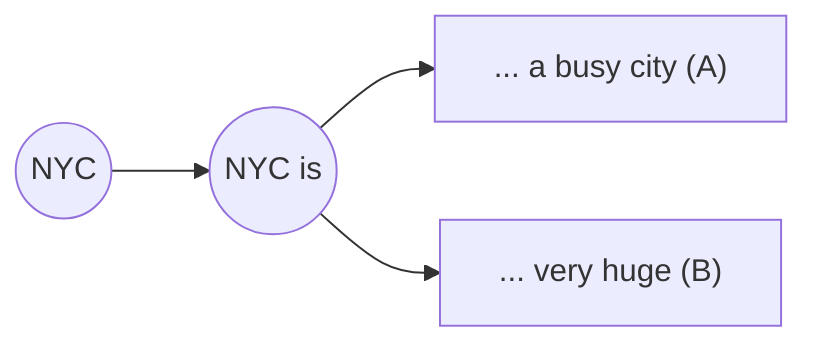

[논문 링크](https://arxiv.org/abs/2411.19379v3)


# Marconi: 하이브리드 LLM 시대의 프리픽스 캐싱을 다시 설계하다

## 한 줄 요약 (TL;DR)

**Marconi**는 하이브리드 LLM(Attention+SSM) 서빙에서 **재사용 가능성이 높은 접두만 선별 입장(admission)** 하고, **FLOP/바이트 효율을 반영한 퇴장(eviction)** 으로 캐시를 관리해 **토큰 히트율 최대 34.4×↑**, **P95 TTFT 최대 71.1% (617.0 ms)↓** 를 달성한다(동일 프레임워크 확장(vLLM+, SGLang+) 대비). (근거: Abstract, Fig.7–9, §5.2)   

---

## 핵심 아이디어

* **문제의 본질**: 하이브리드의 SSM 상태는 **in-place** 로 갱신되어 **부분 일치(hit partial)** 가 불가 → **정확 일치 hit만 허용** 되어 캐시 항목이 비대해지고 재사용률이 낮다. (근거: §1) 
* **해결 전략**:

  1. **입장(Admission)**: 접두 재사용 시나리오를 **(a) Purely-Input**, **(b) Input+Output** 로 분류해 **고재사용 후보만** 체크포인트. (근거: §4.1)  
  2. **퇴장(Eviction)**: **FLOP 효율**(절약 FLOPs/상태 메모리)을 점수화하여 **Recency+FLOP 효율** 로 퇴장 결정을 수행. (근거: §4.2, Eq.(1),(2))  

---

## 배경: 그들이 해결한 문제

Transformer는 긴 컨텍스트에서 **Prefill $(O(L^2))$** 및 **KV 메모리 $(O(L))$** 때문에 서빙 효율이 급락한다. 이에 따라 SSM 기반 **하이브리드(보통 Attn:SSM≈1:6–1:10)** 가 부상했지만, **SSM 상태가 고정크기·정확일치**  특성을 가져 **기존 프리픽스 캐싱(주로 LRU, KV 중심)** 이 효과를 잃는다. (근거: Fig.1, §2.1–2.2)  

문제 심각도 예: 7B 하이브리드에서 **10K 토큰 입력 1개만으로 17.4 GB** 상태를 차지(Transformer 대비 3.3×)하여 **캐시 스래싱과 낮은 히트율**을 초래한다. (근거: §3) 

---

## 새로운 접근법: **Marconi**

Marconi는 하이브리드용 최초의 프리픽스 캐싱 시스템으로, **(i) 재사용 가능성 기반 입장**과 **(ii) FLOP 효율 기반 퇴장**을 결합한다. 모든 상태(SSM, KV)를 **단일 라딕스 트리**에서 **동일 접두 의미**로 관리하여 **정밀·일관 캐시**를 보장한다. (근거: §4, Fig.4)  

* **입장(Admission)**:

  * **분류**: 재사용 접두를 **Purely-Input(시스템 프롬프트/예시 등)** vs **Input+Output(대화 내력 등)** 으로 분류. (근거: §4.1) 
  * **정책**: **간선 마지막 토큰의 SSM 상태만** 체크포인트(=최소 커버로 최대 재사용), 대화형의 경우 **직전 디코딩 토큰** 상태를 보존. (근거: Fig.4, §4.1)  
* **퇴장(Eviction)**:

  * **FLOP 효율** 정의:
    [
    \text{FLOP-eff}=\frac{\text{절약 FLOPs(모든 레이어)}}{\text{상태 메모리(SSM+KV)}}
    ]
    (근거: Eq.(1)) 
  * **유틸리티 점수**:
    [
    S(n)=\text{recency}(n)+\alpha\cdot \text{FLOP-eff}(n)
    ]
    $(\alpha=0)$이면 LRU로 귀환; 워크로드 스냅샷을 재생해 **그리드 서치로 α 자동 선정**. (근거: Eq.(2), §4.2 구현)  

---

## 작동 원리: **구체적인 예시로 살펴보기**

간단한 문장 예시: `NYC is a busy city` 이후 `NYC is very huge`가 들어오는 상황을 가정(토큰은 공백 기준 분절). (근거: Fig.4) 

1. **요청 1 — Prefill & Decode**

   * 라딕스 트리에 `NYC is a busy city` 경로가 생성되고, **간선 마지막 토큰의 SSM 상태**만 체크포인트. (근거: Fig.4) 

2. **요청 2 — Speculative Insertion**

   * 새 시퀀스 `NYC is very huge`의 프리필 구간을 **가상 삽입**해 **분기점**이 생기는지 확인. 생기면 **분기점 SSM 상태**를 체크포인트. (근거: Fig.4(b)) 

3. **정확 일치 Hit & Cache 동작**

   * 하이브리드는 **정확 일치 hit만 허용**(SSM in-place)하므로, 분기점까지 동일하면 해당 **노드의 (SSM, KV)** 를 재사용하여 프리필을 스킵한다. (근거: §1, Fig.2)  

4. **Eviction 예시**

   * 캐시가 꽉 차면 후보 노드들의 (S(n))을 계산, **Recency가 낮지만 FLOP-eff가 매우 높은 롱 시퀀스**는 보존하고 **짧고 가치 낮은 항목**을 우선 퇴출한다. (근거: §4.2, Fig.5)  

---

## 성능 검증: 주요 결과

**실험 세팅(요약)**: 7B 하이브리드(레이어 ${Attn,SSM,MLP}={4,24,28}$), FP16, **AWS p4d.24xlarge (A100-40GB×8)**, 또한 **Jamba-1.5-Mini(12B active/52B total, state dim=128, A100-40GB×4)** 로 TTFT 분석. (근거: §5.1)  

### A. 하이라이트 숫자

* **토큰 히트율**: vLLM+ 대비 **4.5× / 7.3× / 34.4×**(LMSys/ShareGPT/SWEBench). (근거: Fig.7) 
* **P95 TTFT 감소(대비 vLLM+)**: **36.1% / 71.1% / 46.8%** = **275.4 ms / 103.3 ms / 617.0 ms**. (근거: Fig.9) 
* **SGLang+ 대비 P95 히트 승**: **45.6% / 19.0% / 219.7%**. (근거: Fig.8) 

### B. 요약 표 — 동등 세팅 비교

| Benchmark |         Metric | Baseline |      Marconi 결과 |        Δ vs Baseline |
| --------- | -------------: | -------- | ----------------: | -------------------: |
| LMSys     | Token Hit Rate | vLLM+    |              4.5× |  +4.5× (근거: Fig.7) |
| ShareGPT  | Token Hit Rate | vLLM+    |              7.3× |  +7.3× (근거: Fig.7) |
| SWEBench  | Token Hit Rate | vLLM+    |             34.4× | +34.4× (근거: Fig.7) |
| LMSys     |       P95 TTFT | vLLM+    | 36.1%↓ (275.4 ms) | −36.1% (근거: Fig.9) |
| ShareGPT  |       P95 TTFT | vLLM+    | 71.1%↓ (103.3 ms) | −71.1% (근거: Fig.9) |
| SWEBench  |       P95 TTFT | vLLM+    | 46.8%↓ (617.0 ms) | −46.8% (근거: Fig.9) |
| LMSys     |       P95 TTFT | SGLang+  | 17.2%↓ (131.1 ms) | −17.2% (근거: Fig.9) |
| ShareGPT  |       P95 TTFT | SGLang+  |  12.8%↓ (18.5 ms) | −12.8% (근거: Fig.9) |
| SWEBench  |       P95 TTFT | SGLang+  | 24.7%↓ (325.7 ms) | −24.7% (근거: Fig.9) |

### C. 세부 분석 포인트

* **길이 의존 이득**: **<7K 토큰**에선 히트율 **최대 −3.0%p** 열화(단, **P5 TTFT +2.1 ms**만 증가) vs **>7K**에선 **+25.5%p** 히트 개선 및 **FLOP 절감 +90.3%**. (근거: Fig.10)  
* **캐시 경합 효과(60→140 GB)**: **중간 경합**에서 최대 이득(마진 **24.3/51.5/68.3/30.0/10.0 %**). (근거: Fig.11) 
* **아키텍처 스케일**: Attn:SSM **1:2→1:8**로 갈수록 vLLM+/SGLang+ 대비 이득이 **13.5%/5.8% → 2.6×/59.7%** 로 증가. **순수 Transformer**에선 세 시스템 동일. (근거: Fig.12a) 

---

## 우리의 관점: 강점, 한계, 그리고 이 연구가 중요한 이유

### 강점

1. **문제정의의 정확성**: 하이브리드의 **정확일치 제약**과 **SSM 상태의 고정 크기**가 **기존 LRU·사이즈 기반 정책**을 무력화함을 수식(Eq.(1),(2))과 마이크로벤치로 체계화. (근거: §3–4, Fig.5) 
2. **정책 설계의 실증성**: **Admission×Eviction**의 결합이 **롱 시퀀스 중심 워크로드**에서 **히트율 34.4×**, **P95 TTFT 617 ms↓** 로 귀결. (근거: Fig.7–9)  
3. **트렌드 호환성**: SSM 비율↑, 상태 차원↑일수록 이득↑ → **향후 하이브리드 세대**와 정합. (근거: Fig.12) 

### 한계(저자 인정 및 관찰)

* **짧은 요청(<7K)**: 히트율 **최대 −3.0%p**, **P5 TTFT +2.1 ms** 악화(상대적으론 P50/P95는 개선). (근거: Fig.10) 
* **경합 극단**: **고경합(60 GB)** 에선 담을 수 있는 접두가 제한되고, **저경합(140 GB)** 에선 LRU와 격차가 축소. (근거: Fig.11) 
* **순수 Transformer**: 이득 소멸(동일 성능). (근거: Fig.12a) 
* **시스템 의존성**: 하이브리드에서의 **Chunked Prefill**은 다수 프레임워크에서 **전용 커널 개발 중**. KV는 여전히 **페이징 관리** 필요. (근거: §6) 

### 왜 중요한가?

하이브리드는 **긴 문맥**을 현실적으로 감당하게 하는 유력 경로이고(Attn+SSM 혼합), 그 본질이 **“무엇을 남길까(정책)”** 문제다. Marconi는 **FLOP/바이트라는 1차 원리 지표**를 도입해 **캐시 결정을 모델/워크로드 물리량**으로 정규화했다는 점에서, 이후 **KV 페이징/프리픽스 주도 attention 가속(Hydragen 등)** 과의 **스택 통합** 을 촉진할 교차점이다. (근거: §4–6)  

---

## 다음 단계는?: 앞으로의 길

* **KV 페이징 × FLOP-aware 통합**: 지금은 SSM은 비페이징, KV는 페이징이 필요. **페이지 교체 점수에도 FLOP-eff 반영**해 **단일 글로벌 유틸리티**로 관리하면 일관된 최적화를 기대. (근거: §6) 
* **Chunked Prefill 전용 커널 보급**: 2-pass/근사 체크포인트 오버헤드 축소를 위해 **전용 커널**을 주류 프레임워크로 확산. (근거: §6) 
* **부하 인지형 정책**: 세션/요청 도착률 변화에 맞춘 **온라인 α 적응**—중간 경합에서 이득 최대화 경향을 활용. (근거: Fig.11,13)  
* **Attention 가속과의 결합**: 공유 프리픽스 주도 **Hydragen** 은 배치-매트릭스화로 **대규모 프리픽스(1K→16K)에서 처리량 저하 <15%** 를 보여준다—**“무엇을 남길까”(Marconi) × “남긴 것을 어떻게 빠르게 쓸까”(Hydragen)** 의 결합 여지. (근거: Hydragen Abstract/§4)  

---

### 부록: 실험 메모(재현에 유용)

* **데이터/트레이스**: LMSys, ShareGPT, SWEBench—여러 세션과 라운드, 세션·요청 간격을 변조. (근거: §5.1) 
* **모델/하드웨어**: 7B Hybrid {4,24,28}, Jamba-1.5-Mini(12B/52B, state dim=128), **A100-40GB**, FP16. (근거: §5.1) 
* **베이스라인 확장**: vLLM/SGLang은 **하이브리드 비지원**이라 **하이브리드 친화적 수정(vLLM+, SGLang+)** 으로 공정 비교. (근거: §5.1) 

> **한 문장 결론**: **Admission(재사용 가능성) × Eviction(FLOP/바이트)** 이라는 **두 축**을 재정의함으로써, Marconi는 **롱 컨텍스트·SSM 편중**의 현실적 하이브리드 서빙에서 **히트율×·TTFT↓** 를 일관되게 달성한다. (근거: Fig.7–9, §5.4)  


### 토글을 클릭하면 논문에 대한 자세한 LLM 질의응답 내용을 확인할 수 있습니다.

<details markdown="block">
<summary>▶️<strong>클릭하여 펼치기</strong></summary>


## 프롬프트 1.1.1 (연구의 공백)

```
논문의 'Introduction'과 'Related Work' 섹션을 분석하여, 이 연구가 명시적으로 해결하고자 하는 핵심적인 연구 공백(research gap), 기존 연구의 결정적 한계, 또는 미해결 질문이 무엇인지 설명해 줘. 저자들이 설명하는, 이 논문 출판 시점의 '최신 기술(state of the art)'은 어떤 상태였는지 요약해 줘.
```


**결론(압축)**: 하이브리드 LLM(Attention+SSM)의 **in-place SSM 업데이트** 때문에 기존 프리픽스 캐싱은 **부분 중복을 롤백/재사용하지 못해 ‘정확 일치(hit)’만 허용**된다(=엔트리 폭증·재사용 저조) (근거: §1) . 미세 체크포인팅은 **재사용률 3.3%**(블록 128)까지 떨어지고, **7B·10K 토큰당 17.4 GB**를 점유해 캐시 스래싱을 유발한다 (근거: §3)  . 저자들은 **재사용 가능성(입장)** 과 **FLOP 효율(퇴장)** 을 함께 보는 **최초의 하이브리드용 프리픽스 캐싱 시스템** 을 제안하고, **토큰 히트율 최대 34.4×**, **P95 TTFT 최대 71.1%↓(617 ms)** 를 보고한다 (근거: Abstract/§5)  .

---

## 1) 출판 시점의 SOTA(배경 요약)

* **롱 콘텍스트**: 트랜스포머는 **주목(Attention)의 $O(L^2)$ 계산·$O(L)$ KV 메모리**로 프리필 병목이 크다. 이에 **SSM(선형/순환)** 계열이 등장해 **$O(L)$ 계산·$O(1)$ 메모리**로 롱 콘텍스트 서빙을 완화한다 (근거: §1, Fig. 1c)  .
* **하이브리드 모델 확산**: **Attention:SSM ≈ 1:6~1:10**로 교차 배치하는 하이브리드가 정확도–효율 절충으로 채택되었다 (근거: Fig. 1a) .
* **프리픽스 공유 최적화(트랜스포머)**: Hydragen 등은 **공유 프리픽스**를 배치-친화적으로 분해해 트랜스포머에서 큰 TPS 이득을 보고했으나, **SSM/하이브리드 특성**(상태 상이·in-place 업데이트)을 다루지 않는다 (근거: Hydragen §1)  .
* **캐싱 정책(SGLang/vLLM 계열)**: 다수 시스템은 **LRU 등 최신성 중심(eviction)** 이며, **KV는 FLOP 효율이 거의 상수**라는 가정하에 설계되었다 (근거: §4.2) .

**핵심 한계**: 위 SOTA는 **트랜스포머 전용 가정과 KV 위주 설계**에 머무르며, **하이브리드(SSM 포함)에서의 캐시 입·퇴장 최적화**—특히 **부분 프리픽스 재사용의 불가(in-place SSM)와 SSM 상태의 거대 메모리**—를 다루지 못했다 (근거: §1/§3)  .

---

## 2) 이 논문이 규정한 **연구 공백(Research Gap)**

| 공백                             | 구체 내용                                                                                           | 왜 어려운가                                                                                                 |
| -------------------------------- | --------------------------------------------------------------------------------------------------- | ----------------------------------------------------------------------------------------------------------- |
| **부분 중복 재사용 부재**        | SSM은 **in-place 업데이트**라 **부분 프리픽스 오버랩에서 롤백/재사용 불가 → 정확 일치(hit)만 가능** | 기존 트랜스포머 캐싱 가정(토큰별 KV)이 통하지 않음 (근거: §1)                                               |
| **미세 체크포인팅의 역효과**     | 엔트리 수 폭증→**히트 희박(3.3%)**, **메모리 폭증(7B·10K=17.4 GB)**, 캐시 스래싱                    | SSM 레이어 수가 많아 **SSM 상태가 KV보다 더 지배** (근거: §3)                                               |
| **정책 기준 부재(하이브리드)**   | LRU/recency 중심은 **FLOP 절감/바이트**를 반영 못함 → **짧은 시퀀스 유리·긴 시퀀스 불리**           | 하이브리드는 **KV(길이∝용량) vs SSM(고정용량)** 의 **FLOP/메모리 트레이드오프**가 상이 (근거: §4.2, Fig. 5) |
| **상태 이질성의 통합 관리 부재** | KV와 SSM 상태를 **분리 관리**하면 접두 재사용 조건(모든 레이어 일치) 보장이 어렵다                  | **동일 프리픽스 토큰 집합**으로 **전 레이어 상태 동기**가 필요 (근거: §4, Fig. 4)                           |

---

## 3) 저자 서술의 **핵심 아이디어(공백 해소 방향)** — *Intro & RW 관점에서 필요한 만큼만*

* **입장(admission): 재사용 가능성 추정** — **순수 입력 공유**(시스템 프롬프트 등) vs **입·출력 혼합 공유**(대화 이력) **택소노미**로 **SSM 상태를 선별 캐싱** (근거: §4.1) .
* **퇴장(eviction): FLOP 효율 지표** — **FLOP saved / byte**로 유틸리티 $S(n) = \text{recency} + \alpha \cdot \text{flop efficiency}$ 를 정의, **긴 시퀀스·고효율 상태를 보존** (근거: §4.2, Eq.(2))  .
* **일체형(radix) 관리** — **KV+SSM을 동일 노드**로 관리하고 **분기점에서 추측적 삽입(speculative insertion)** 로 **필요 지점만 체크포인팅** (근거: Fig. 4/§4)  .

---

## 4) 결과로 본 **공백 해소의 타당성(서빙 지표)**

* **토큰 히트율**: vLLM+ 대비 **4.5×/7.3×/34.4×**(LMSys/ShareGPT/SWEBench) (근거: §5.2 Fig. 7) .
* **P95 TTFT**: **최대 71.1%↓(617 ms)**(vs vLLM+), **최대 24.7%↓(325.7 ms)**(vs SGLang+) (근거: §5.2 Fig. 9) .
* **정책 효과**: **LRU→FLOP-aware**로 **토큰 히트율 +19.0~219.7%**, 긴 시퀀스에서 **FLOP 절감 +90.3%** (근거: §5.2/§5.3 Fig. 8/10)  .

---

## 5) Related Work 관점의 정리(저자 서술 요지)

* **트랜스포머 전용 공유-프리픽스 가속(Hydragen)**: **공유 구간을 행렬-행렬 곱으로 분해**해 대역폭·텐서코어 활용을 극대화 (근거: Hydragen §1) . 그러나 **하이브리드/SSM 상태의 in-place 제약**·**SSM 메모리 특성**을 전제로 한 **캐시 입·퇴장 정책**은 공백으로 남았다(본 논문이 이를 채움) (근거: §1/§4)  .
* **일반 캐시 정책(LRU 등)**: **KV의 상수형 FLOP 효율 가정** 하에서 최신성 위주 설계 → **하이브리드에서 비효율** (근거: §4.2) .

---

### 한 줄 요약

하이브리드 LLM의 **구조적 제약(SSM in-place)** 이 **기존 프리픽스 캐싱의 전제(부분 재사용·LRU 최적성)** 를 무너뜨렸고, **재사용 가능성·FLOP 효율**을 동시 고려한 **입·퇴장 정책**과 **일체형 상태 관리**가 **새로운 SOTA 경로**임을 정식화·검증했다 (근거: §1/§4/§5)   .


## 프롬프트 1.1.2 (핵심 가설)

```
이 논문의 중심 가설(central hypothesis) 또는 핵심 주장은 무엇인가? '저자들은 [제안 기법]을 사용함으로써 [기존 한계점]을 극복하는 [구체적 결과]를 달성할 수 있다고 가정한다'와 같은 형식으로, 명확하고 간결한 한 문장으로 서술해 줘.
```


저자들은 **Marconi**의 *재사용 가능성 기반 입장(admission)+FLOP/byte 효율 기반 퇴장(eviction)* 정책과 **KV·SSM 일체형 캐시 관리**를 사용함으로써, 하이브리드 LLM의 **SSM in-place 업데이트로 인한 부분 프리픽스 재사용 불가·캐시 난립**이라는 기존 한계를 극복해 **토큰 히트율을 최대 34.4×↑, P95 TTFT를 최대 71.1% (617 ms)↓** 달성할 수 있다고 가정한다 (근거: Abstract). ([arxiv.org][1])

[1]: https://arxiv.org/abs/2411.19379?utm_source=chatgpt.com "Marconi: Prefix Caching for the Era of Hybrid LLMs"


## 프롬프트 1.2.1 (독창성 식별)

```
논문 전체를 바탕으로, 가장 중요하고 독창적인 기여(contribution) 1~3가지를 구별되는 항목으로 나열해 줘. 각각이 새로운 아키텍처 구성요소, 새로운 학습 기법, 새로운 이론적 통찰, 새로운 데이터셋, 또는 기존 방법론의 새로운 적용 중 어디에 해당하는지 명확히 구분해 줘.
```


**결론(압축)**: Marconi의 독창성은 **하이브리드 LLM 전용 일체형 프리픽스 캐시 아키텍처**와 **재사용-가능성 기반 입장(admission)**, **FLOP/byte 효율 기반 퇴장(eviction)** 의 **정책 쌍**에 있다. 이로써 기존 LRU·블록체크포인팅이 만든 **SSM 상태 난립·저히트** 한계를 넘어 **토큰 히트율 최대 34.4×↑, P95 TTFT 최대 71.1%(617 ms)↓** 를 입증한다 (근거: Abstract, §5). ([arXiv][1])

1. **하이브리드 전용 ‘일체형(prefix) 캐시’ 아키텍처** — *분류: 새로운 시스템/아키텍처 구성요소*

   * **KV와 SSM 상태를 동일 노드로 통합** 해 **라딕스 트리(radix tree)** 에서 관리하고, **분기 지점에서만 추측적 삽입(speculative insertion)으로 체크포인팅** 해 SSM 상태의 불필요한 증식을 억제한다(그 외 노드 타임스탬프·중간노드(≤1 child) 처리 규칙 포함) (근거: §4, Fig.4/§4.3). ([arXiv][2])
   * **하이브리드/트랜스/SSM** 등 임의 레이어 조합을 지원하는 **최초의 하이브리드용 프리픽스 캐시 시스템** 임을 명시 (근거: Abstract, §4). ([arXiv][1])
   * **효과**: vLLM+/SGLang+ 대비 **토큰 히트율 4.5–34.4×↑**, **P95 TTFT 최대 71.1%(617.0 ms)↓** (근거: §5). ([arXiv][2])

2. **재사용-가능성 예측형 Admission 정책** — *분류: 새로운 알고리즘/정책 설계*

   * **프리픽스 재사용 시나리오 택소노미**(순수 입력 공유 vs 입력·출력 혼합 공유)를 정의하고, **라딕스 트리 기반 이력 부기(bookkeeping)** 로 **재사용 가능성이 높은 상태만 선별 캐싱** 하여 **SSM in-place 업데이트로 인한 “정확일치(hit)만 허용” 제약**을 우회한다 (근거: §4.1). ([arXiv][2])

3. **FLOP/byte 효율 지표에 기반한 Eviction 정책** — *분류: 새로운 이론적 지표+정책 설계*

   * **FLOP 효율 = (재사용이 절감하는 총 FLOPs) / (해당 상태들의 메모리 바이트)** 를 제안하고, $S(n)=recency(n)+α·FLOP efficiency(n)$ 유틸리티로 퇴장 후보를 선택해 **긴 시퀀스/고효율 엔트리 보존**을 체계화한다 (근거: §4.2, Eq.(1)(2), Fig.5). ([arXiv][2])
   * **효과**: LRU 대비 **토큰 히트율 +19.0~219.7%**, **FLOP 절감 +90.3%**, 단 **짧은 시퀀스의 일부 히트율을 장시에 양도**하는 트레이드오프를 정량화 (근거: §5.3, Fig.10). ([arXiv][2])

> 모든 수치 단위: ms, %, ×(무차원), FLOPs/byte. (근거: §4–§5). ([arXiv][2])

[1]: https://arxiv.org/abs/2411.19379 "[2411.19379] Marconi: Prefix Caching for the Era of Hybrid LLMs"
[2]: https://arxiv.org/pdf/2411.19379 "Marconi: Prefix Caching for the Era of Hybrid LLMs"


## 프롬프트 1.2.2 (저자 관점에서의 강점)

```
저자들의 관점에서, 자신들의 접근법이 이전 방법들보다 우월한 이유는 무엇인가? 그들이 자신들의 연구가 지닌 독창성과 강점을 뒷받침하기 위해 사용하는 핵심 논거를 인용하거나 알기 쉽게 설명해 줘.
```

## 프롬프트 1.2.2 — 저자 관점의 강점 (Marconi)

**결론(압축)**: 저자들은 Marconi가 **하이브리드(Attention+SSM)** 의 구조적 제약(SSM 상태의 **in-place, all-or-nothing** 재사용)을 고려한 **최초의 일체형(prefix) 캐시 아키텍처** 와 **재사용-가능성 기반 Admission + FLOP/byte 기반 Eviction** 으로, **낮은 히트율·스래싱·LRU의 비효율** 을 동시에 해결해 **토큰 히트율 4.5–34.4×↑, P95 TTFT 최대 71.1% (617 ms)↓** 를 달성한다고 주장한다(근거: §4–§5).   

---

### 1) **하이브리드 전용·일체형 캐시 아키텍처** — *시스템/아키텍처 강점*

* **최초의 Hybrid LLM 전용 prefix caching 시스템**으로, **KV와 SSM 상태를 동시 관리**하며(라딕스 트리), **캐시 엔트리의 모든 선행 상태를 함께 보존**해 정확 재사용을 보장(“입력 토큰 집합 동형”)한다(근거: §1/§4, Fig.2/4).   
* **Speculative insertion**으로 **분기점에서만 체크포인팅**하여 불필요한 SSM 상태 증식을 억제, 캐시 이용률을 극대화하고 TTFT를 최소화(근거: §4, Fig.4). (근거: §4)  
* **효과**: vLLM+/SGLang+ 대비 **토큰 히트율 대폭 개선** 및 **TTFT 유의미 감소**(아래 3) (근거: §5, Fig.7–9).  

> 저자 주장의 요지: “트랜스포머 전용 설계(=KV 전제)와 달리, **KV+SSM을 한 트리에서 ‘같은 접두’ 단위로** 다뤄야 하이브리드에서 재사용 조건을 만족한다”(근거: §4). 

---

### 2) **재사용-가능성 기반 Admission** — *정책/알고리즘 강점*

* SSM은 **부분 일치 재사용 불가(정확 일치만 히트)** 이므로, **“순수 입력 공유” vs “입·출력 혼합 공유”** 라는 **재사용 택소노미**로 **히트 가능성이 높은 SSM 상태만 선별 캐싱** → **스파스 히트·스래싱** 문제를 근본 완화(근거: §4.1, Fig.2–3).  
* **미세 체크포인팅의 한계** (블록128에서 **재사용률 3.3%**, 7B·10K 토큰 **17.4 GB** 사용 → 스래싱) 대비, **이타적(admission 축소) 전략** 으로 **캐시 크기 감소+유틸리티↑** (근거: §3).   
* **Trade-off 투명화** : “순수 입력” 접두는 **3번째 발생부터** 이득이 나지만, 다수 요청에 공유되므로 **총 이득 영향 미미**(근거: §4.1 ‘Tradeoffs’). 

---

### 3) **FLOP/byte 기반 Eviction** — *이론/정책 강점*

* 하이브리드에서 **KV는 길이∝크기·이득** , **SSM은 고정 크기** → **LRU/사이즈 기반** 만으론 **긴 시퀀스(이득↑)** 를 과도하게 축출 가능. 이를 정량화한 **FLOP efficiency = (절감 FLOPs)/(상태 메모리 바이트)** 도입, **S(n)=recency+α·FLOP_efficiency**로 퇴장 결정(근거: §4.2, Fig.5).  
* **부트스트랩·그리드서치**로 **α**를 자동 조정해 **워크로드 적응**(LRU는 α=0으로 귀착) (근거: §4.2). 
* **효과**: LRU 대비 **토큰 히트율 +19.0~219.7%**, **긴 시퀀스에 히트율 집중**으로 **FLOP 절감 +90.3%**; 짧은 시퀀스의 소폭 손실은 **TTFT 영향 미미**(근거: §5.2–§5.3, Fig.8–10).   

---

### 4) **정량 결과로 뒷받침된 우월성** — *엔드투엔드 지표*

| 지표        | 주장의 핵심                                                                    | 정량 근거                   |
| ----------- | ------------------------------------------------------------------------------ | --------------------------- |
| 토큰 히트율 | vLLM+ 대비 **4.5× / 7.3× / 34.4×** (LMSys/ShareGPT/SWEBench)                   | (근거: §5, Fig.7)           |
| P95 TTFT    | vLLM+ 대비 **최대 71.1%↓ (617.0 ms)**, SGLang+ 대비 **최대 24.7%↓ (325.7 ms)** | (근거: §5, Fig.9)           |
| LRU 대비    | **+19.0~219.7% 히트율↑**, **+90.3% FLOP 절감** (긴 시퀀스 중시)                | (근거: §5.2–§5.3, Fig.8–10) |

> 부가 강점: **정확 재사용(Exact Reuse)** 이므로 **모델 출력 품질 불변**(다운스트림 점수 미평가) — 속도·비용 개선에만 영향(근거: §5.1). 

---

**요약**: 저자들은 “**하이브리드 특이성(SSM의 고정 크기·정확 일치 요구)** 을 반영한 **일체형 캐시+Admission/Eviction 공동 설계**”가 **기존 LRU/블록 체크포인팅**의 구조적 한계를 넘어 **히트율·TTFT·FLOP 절감**을 동시에 개선한다고 논증한다(근거: §3–§5).  


## 프롬프트 1.3.1 (알고리즘 단계별 설명)

```
핵심 알고리즘, 모델 아키텍처, 또는 주요 방법론을 단계별(step-by-step)로 설명해 줘. 독자는 AI 분야의 대학원생 수준이라고 가정해. 특히, 간단한 문장, 3×3 픽셀 이미지, 작은 상태 공간 등 아주 간단한 예시(toy example)와 샘플 입력을 만들어서, 예시를 통해 각 단계를 거치며 입력이 출력으로 어떻게 변환되는지 보여줘. 등장하는 모든 핵심 용어와 변수는 그 즉시 정의해 줘.
```


**결론(압축)**: Marconi는 **라딕스 트리(radix tree)** 로 요청 이력을 묶고, **입장(admission)** 에서 “재사용 가능성 높은 SSM 상태만” 선별·체크포인트하며, **퇴장(eviction)** 에서 유틸리티 $(S(n)=\text{recency}+\alpha \cdot \text{FLOP efficiency})$로 엔트리를 제거해 **정확일치만 히트되는 SSM 캐시의 난립·저히트** 문제를 해결한다(토큰 히트율 최대 **34.4×**, P95 **TTFT 71.1%↓(617 ms)**) (근거: Abstract/§4/§5)   .

---

### 사전 정의(Notation & 상태 메모리)

* **KV 캐시(Attention)**: 토큰별 (K,V)를 저장(길이 (L)에 선형 증가). FP16일 때 **메모리** $(\approx 2\cdot L\cdot D\cdot 2) bytes (K/V 각각 1×, 2 bytes/elem)$ (근거: Appx A) .
* **SSM 상태**: 각 레이어의 **재귀 상태** 를 **in-place** 로 갱신(길이 무관 고정 크기) (근거: Fig.1b/§2.1) . FP16일 때 **메모리** $(\approx D\cdot N\cdot 2)$ bytes (근거: Appx A) .
* **정확 일치 제약**: SSM은 **부분 프리픽스**에서 롤백 재사용이 불가하여 **정확 일치**에서만 히트가 난다(“all-or-nothing”) (근거: Abstract) .
* **FLOP 효율**: $(\text{FLOP efficiency}=\frac{\text{재사용으로 절감하는 FLOPs}}{\text{상태 메모리(bytes)}})$ (근거: §4.2, Eq.(1)) .

---

## 단계별(Step-by-Step) 파이프라인

#### Step 0. 라딕스 트리에 “요청 이력” 적재

* **구조**: 에지는 “연속 토큰 구간”을 라벨로 갖고, **그 구간의 KV**와 **직전 토큰까지의 SSM 상태**를 보유한다. 노드는 분기점(공유 접두)이다 (근거: §4.1/ Fig.4c)  .
* **통합 관리**: **KV와 SSM 상태를 같은 트리 노드에 함께 저장**(레이어별 상태가 “같은 접두 토큰 집합”을 가리키도록 강제) (근거: §4 도입) .

#### Step 1. **Speculative insertion**로 체크포인트 지점 판정

* 새 요청의 **프리필(prefill) 구간**을 트리에 “가상 삽입”해 **중간 노드**가 생기면, **그 분기점의 SSM 상태를 체크포인트**한다(“브랜치 지점”) (근거: Fig.4) .
* **디코딩 후단**: **마지막 디코딩 토큰 직후의 SSM 상태**는 **항상** 체크포인트한다(대화 라운드 경계) (근거: Fig.4 캡션) .

#### Step 2. **Admission** — “재사용 가능성” 높은 것만 받기

* **재사용 택소노미(2종)**

  1. **Purely-Input**: 시스템 프롬프트/샘플 등 **입력만**으로 구성된 공유 접두(여러 요청에 반복) (근거: §4.1) .
  2. **Input+Output**: **대화 이력** 등 입력·출력이 섞인 접두(보통 “직전 디코딩 토큰” 뒤로만 연장됨) (근거: §4.1) .
* **정책**:

  * Purely-Input은 **핫 접두**를 관측·비교해 선별(다수 요청 공유) (근거: §4.1) .
  * Input+Output은 **“라운드 경계의 마지막 디코딩 토큰 직후 SSM”만** 가치 있음 → 그 지점만 체크포인트 (근거: §4.1) .
* **이유**: SSM은 **정확 일치 히트**만 허용하므로 **엔트리를 넓게 받으면 희박히트/스래싱** → **선별적 입장**이 필수 (근거: Abstract/§3)  .

#### Step 3. **Eviction** — FLOP/byte로 “남길 것” 결정

* **유틸리티**: $(S(n)=\text{recency}(n)+\alpha\cdot\text{FLOP efficiency}(n)\in[0,1])$ 정규화해 **가장 낮은 (S)** 부터 제거 (근거: §4.2, Eq.(2)) .
* **왜 필요한가**: KV는 **크기∝길이**로 **FLOP 이득과 크기가 거의 비례**하지만, SSM은 **크기 고정**이라 **길수록(이득↑) 크기는 동일** → **LRU/사이즈 기반만**으로는 긴 시퀀스를 과축출 위험 (근거: §4.2) .
* $(\alpha)$ 튜닝 : **부트스트랩**(첫 퇴출까지 LRU) 후 **그리드서치**로 $(\alpha)$ 자동선정(수 초 내) (근거: §4.2) .

#### Step 4. **히트 발생 시**: 프리필 스킵 → TTFT↓

* 트리에서 동일 접두를 찾으면 **해당 노드의 “KV+SSM”** 을 함께 재사용(정확 재사용) → **프리필 FLOPs 스킵** → **P95 TTFT 최대 71.1%↓(617 ms)** (근거: §4/§5)  .

---

## 토이 예시(문장 기반) — “NYC is a busy city” vs “NYC is very huge”

> **목표**: 두 요청 간 공통 접두를 잡아 **어디를 체크포인트·재사용**하는지 보여준다.

1. **요청 A** = “NYC is a busy city”

   * 프리필을 라딕스 트리에 삽입.
   * **디코딩 종료 지점**(“city” 출력 직후)의 **SSM 상태**를 체크포인트(고정) (근거: Fig.4) .

2. **요청 B** = “NYC is very huge”

   * **Speculative insertion**로 “NYC is”에서 **분기 노드**가 생김을 감지 → 그 **분기점의 SSM 상태**를 체크포인트 (근거: Fig.4) .
   * “huge” 출력 직후의 **SSM 상태**도 체크포인트(대화 라운드 경계 상정) (근거: Fig.4) .

3. **Admission 적용**

   * “NYC is”는 **Purely-Input** 공유 접두로 **핫 프리픽스** 후보.
   * “city/huge” 직후 SSM은 **Input+Output**의 **라운드 경계**로 보존 가치↑ (근거: §4.1) .

4. **Eviction 예시(수치)**

   * 두 노드의 $(\text{recency}\in[0,1])$가 각각 0.6, 0.3, $(\text{FLOP efficiency})$가 0.8, 0.4라면, $(\alpha=0.5)$에서
     $(S_{\text{NYC is}}=0.6+0.5\cdot0.8=1.0)$, $(S_{\text{huge}}=0.3+0.5\cdot0.4=0.5)$ → **후자를 먼저 퇴출**.
   * 직관: **긴 접두/재사용이 큰 엔트리**를 남기며, 짧은 것은 일부 포기(짧은 요청 TTFT 영향은 작음) (근거: Fig.10) .

아래는 블로그용 **라딕스 트리** 도식 예시(요청 A/B 삽입 후):



(분기 노드 **B**에서 SSM 체크포인트, 각 에지는 해당 구간의 **KV**와 “직전까지의 **SSM**”을 소유) (근거: Fig.4c/§4.1) .

---

## 왜 이게 잘 작동하나? (정량 논거)

* **토큰 히트율**: vLLM+/SGLang+ 대비 **4.5–34.4×** 향상 → **프리필 FLOPs 대량 절감** (근거: Fig.7/§5) .
* **P95 TTFT**: **36.1–71.1%↓** (103.3–617.0 ms) (근거: Fig.9) .
* **LRU 대비 정책 이득**: **+19.0–219.7% 히트율↑**, **FLOP 절감 +90.3%**(긴 시퀀스 편향) (근거: Fig.8/10)  .

---

## 보너스: 수식 카드(블로그 삽입용)

* **Eviction 유틸리티**
  $
  S(n)=\text{recency}(n)+\alpha\cdot\text{FLOP efficiency}(n)\quad(\alpha\ge 0)$
  (근거: §4.2, Eq.(2)) 

* **FLOP 효율**
  $
  \text{FLOP efficiency}=\frac{\text{절감 FLOPs(Attention+SSM+MLP)}}{\text{상태 메모리(Attention+SSM)}}
  $
  (근거: §4.2, Eq.(1)) 

* **메모리 상식(추론 시 FP16)**
  $(\text{KV} \approx 2\cdot L\cdot D\cdot 2) bytes, (\text{SSM}\approx D\cdot N\cdot 2) bytes$ (근거: Appx A) .
  (하이브리드 7B·10K 토큰 **17.4 GB** — 미세 체크포인팅은 스래싱 유발) (근거: §3) .

---

### 한 줄 요약

“**라딕스 트리 + 선별적 Admission + FLOP-aware Eviction**”의 **세트 설계**로, **정확일치만 허용하는 SSM 캐시**의 구조적 한계를 우회하며 **히트율×·TTFT↓** 를 **엔드투엔드** 로 달성한다 (근거: §4/§5)  .


## 프롬프트 1.3.2 ('비밀 병기' 식별)

```
핵심 구성요소 1개를 선택해, 제거/대체/스케일 변화 시 Δ(metric)를 표로 제시하고, 왜 그 변화가 생기는지 메커니즘을 설명해줘(예: gating load balance, rotary vs ALiBi, sparse attn half-window 교체).
```


**결론(압축)**: Eviction을 **LRU(α=0)** 에서 **FLOP/byte 효율 반영(α>0)** 으로 바꾸면 **토큰 히트율 P95가 +19.0~219.7%** 상승하고, **P95 TTFT가 −12.8~−24.7% (−18.5~−325.7 ms)** 더 줄어든다. 긴 컨텍스트(>7K 토큰)일수록 이득이 커지며 **절감 FLOPs는 +90.3%** 까지 증가한다 (근거: Fig.8/9/10, §4.2).   

---

### 핵심 구성요소

* **정의**: 유틸리티 $(S(n)=\text{recency}(n)+\alpha\cdot\text{FLOP efficiency}(n))$, $(\alpha=0)$이면 **LRU**로 귀착 (근거: §4.2, Eq.(2)).  
* **의미**: **KV는 길이∝크기·이득**, **SSM은 고정 크기** → LRU/사이즈 기반은 **긴 시퀀스(이득↑)** 를 과축출 위험. FLOP/byte를 넣어 **긴 시퀀스·고효율 엔트리 보존** (근거: Fig.5, §4.2).  

---

## Ablation 표 — 제거/대체/스케일 변화에 따른 Δ

### A. **Eviction 교체: LRU(α=0) → FLOP-aware(α*)**

| 워크로드 | 메트릭               | LRU 대비 Δ (Marconi - SGLang+) | 해설                                                                        |
| -------- | -------------------- | -----------------------------: | --------------------------------------------------------------------------- |
| LMSys    | Token Hit Rate (P95) |                     **+45.6%** | 단일 요청 길이 <10K가 다수 → 이득은 중간 (근거: Fig.8; Fig.6 분포).         |
| ShareGPT | Token Hit Rate (P95) |                     **+19.0%** | <2K가 주류 → FLOP/byte 효과 제한 (근거: Fig.8; Fig.6 분포).                 |
| SWEBench | Token Hit Rate (P95) |                    **+219.7%** | 수백~수만 토큰 혼재 → 긴 시퀀스 보존 이득 극대화 (근거: Fig.8; Fig.6 분포). |

> 메커니즘: (\alpha>0)가 **긴 시퀀스(절감 FLOPs↑)** 엔트리를 우선 보존 → LRU가 놓치는 **고효율 엔트리**를 유지 (근거: §4.2, Fig.5).  

---

### B. **스케일 변화: 시퀀스 길이별 효과(α*)**

| 길이 구간   | Δ Hit Rate (Marconi − LRU) |      Δ FLOP Saved | Δ TTFT (경향) | 해설                                                   |
| ----------- | -------------------------: | ----------------: | ------------: | ------------------------------------------------------ |
| < 7K tokens |           **−3.0%** (최대) |              작음 |     영향 경미 | 짧은 요청 일부 양보 (근거: Fig.10a,b).                 |
| ≥ 7K tokens |          **+25.5%** (최대) | **+90.3%** (전체) |   뚜렷한 개선 | 긴 요청에 히트 집중 → E2E 이득↑ (근거: Fig.10a; §5.3). |

> 메커니즘: **SSM 상태는 고정 크기**라서 길이가 길수록 **FLOP/byte 효율이 가팔라짐** → (\alpha>0)가 길이 스케일에 기민 (근거: Fig.5). 

---

### C. **엔드투엔드 효과: TTFT(α=0 → α*)**

| 워크로드                                    | Δ P95 TTFT vs LRU(SGLang+) |      환산(ms) |
| ------------------------------------------- | -------------------------: | ------------: |
| LMSys                                       |                 **−17.2%** | **−131.1 ms** |
| ShareGPT                                    |                 **−12.8%** |  **−18.5 ms** |
| SWEBench                                    |                 **−24.7%** | **−325.7 ms** |
| (근거: Fig.9, “Compared to SGLang+ …” 수치) |                            |               |

---

## 왜 그런가? (메커니즘 설명 — 컴파일러/시스템 관점)

1. **비균질 상태 비용**: KV는 (O(L)) 메모리·이득이 **길이에 비례**, SSM은 **메모리 고정**이나 **이득은 길이에 비례** → LRU/사이즈 기반은 긴 시퀀스의 **한계 효율(FLOPs/byte)** 를 과소평가 (근거: Fig.5, §4.2). 

2. **유틸리티 (S)** 의 역할: $(\text{FLOP efficiency}=\frac{\text{절감 FLOPs}}{\text{메모리(bytes)}})$를 **정규화**해 recency와 합성 → **긴 시퀀스·고효율 엔트리**가 자연스럽게 상위로 정렬 (근거: Eq.(1)(2), 구현 §4.3).  

3. **α 튜닝 파이프라인**: **부트스트랩(최초 퇴출 전후 5–15× 요청 관찰)** → **CPU 병렬 그리드서치(수 초)** → **히트율 최대화 α 채택**. 과적응 없이 워크로드 적응 (근거: §4.2).  

---

### 한 줄 요약

**FLOP-aware Eviction(α)** 은 **길수록 이득이 큰 하이브리드 상태** 를 수치적으로 식별해 보존하므로, **LRU 대비 히트율·TTFT를 크게 개선** 한다. 특히 **롱 컨텍스트·SSM 비중↑** 일수록 Δ가 커진다 (근거: Fig.5/8/9/10, §4.2–§5.3).   


## 프롬프트 1.4.1 (핵심 결과 분석)

```
'Experiments' 또는 'Results'의 표/그림을 포함한 주요 결과를 분석해 줘. 핵심 성능 지표는 무엇인가? 어떤 벤치마크에서 보고되었는가? 저자들이 성공 증거로 가장 강조하는 결과를 요약해 줘.
```

## 프롬프트 1.4.1 — 핵심 결과 분석 (Marconi)

**결론(압축)** : Marconi는 실제 트래픽 트레이스(LMSys/ShareGPT/SWEBench)에서 **토큰 히트율을 평균 4.5×/7.3×/34.4×↑** (vLLM+ 대비)시키고(근거: Fig.7, §5.2) , **P95 TTFT를 최대 36.9%/73.2%/46.8%↓** (281.4/106.3/617.0 ms; 바닐라 대비)로 낮춘다. 또한 **vLLM+ 대비 추가로 최대 36.1%/71.1%/46.8%↓** , **SGLang+ 대비 17.2%/12.8%/24.7%↓** (131.1/18.5/325.7 ms)까지 개선한다(근거: Fig.9, §5.2) . FLOP-aware Eviction은 LRU 대비 **P95 히트율 승 45.6%/19.0%/219.7%** 로 특히 롱 시퀀스가 많은 SWEBench에서 큰 이득을 보인다(근거: Fig.8, §5.2) .

---

### 평가지표·세팅(요약)

* **주요 지표**: (1) **Token Hit Rate(%)** = 프리필을 건너뛴 입력 토큰 비율(=FLOPs 절감 근사), (2) **TTFT(ms)** 의 P5/P50/P95. 프리픽스 재사용은 정확히 동일하므로 다운스트림 정확도 평가는 생략(근거: §5.1) .
* **벤치마크/트레이스**: **LMSys**, **ShareGPT**, **SWEBench**(시퀀스 길이 분포는 Fig.6 참고; SWEBench가 수백~수만 토큰으로 분산 폭이 가장 큼) (근거: Fig.6, §5.2)  .
* **베이스라인**: **Vanilla**(캐싱 없음), **vLLM+**(토큰 블록=32의 미세 체크포인팅), **SGLang+**(동일 Admission + LRU Eviction) (근거: §5.1 Baselines) .
* **모델·HW**: 메인은 **7B Hybrid**(${Attention,SSM,MLP}={4,24,28}$); 일부 TTFT 분석은 **Jamba-1.5-Mini**(12B active/52B total, state dim=128). **FP16**, **8×A100-40GB(p4d.24xlarge)** (근거: §5 Setup/Models)  .

---

### 핵심 성능 표 (동일 세팅 비교)

| 워크로드 |          토큰 히트율 (vs vLLM+) |                P95 TTFT ↓ vs Vanilla |                  P95 TTFT ↓ vs vLLM+ |                P95 TTFT ↓ vs SGLang+ | LRU→FLOP-aware (P95 히트 승) |
| -------- | ------------------------------: | -----------------------------------: | -----------------------------------: | -----------------------------------: | ---------------------------: |
| LMSys    |  **+4.5×** (평균) (근거: Fig.7) | **−36.9% (−281.4 ms)** (근거: Fig.9) | **−36.1% (−275.4 ms)** (근거: Fig.9) | **−17.2% (−131.1 ms)** (근거: Fig.9) |     **+45.6%** (근거: Fig.8) |
| ShareGPT |  **+7.3×** (평균) (근거: Fig.7) | **−73.2% (−106.3 ms)** (근거: Fig.9) | **−71.1% (−103.3 ms)** (근거: Fig.9) |  **−12.8% (−18.5 ms)** (근거: Fig.9) |     **+19.0%** (근거: Fig.8) |
| SWEBench | **+34.4×** (평균) (근거: Fig.7) | **−46.8% (−617.0 ms)** (근거: Fig.9) | **−46.8% (−617.0 ms)** (근거: Fig.9) | **−24.7% (−325.7 ms)** (근거: Fig.9) |    **+219.7%** (근거: Fig.8) |

> 해석: **롱 시퀀스(>7K 토큰) 비중이 클수록**(=SWEBench) FLOP-aware Eviction의 이득이 크며, 짧은 시퀀스 위주(ShareGPT)는 상대적 이득이 작다(근거: Fig.6 설명) .

---

### 미시 분석(길이별 Trade-off)

* **길이<7K**: 일부 요청에서 **히트율 −3.0%** 까지 양보(짧은 요청 TTFT 영향은 경미) (근거: Fig.10a,b)  .
* **길이≥7K**: **히트율 +25.5%** 까지↑, **총 FLOP 절감 +90.3%**(Marconi vs SGLang+) (근거: Fig.10a, 본문) .

---

### 저자들이 강조한 성공 증거(요약)

1. **전반적 개선**: “**히트율 평균 4.5–34.4×↑**, **P95 TTFT 최대 71.1% (617.0 ms)↓**”(키 파인딩) (근거: §5 Key findings) .
2. **정책 우월성**: LRU 대비 **P95 히트율 +19.0~219.7%** , 긴 시퀀스에 히트 집중(짧은 일부 양보) (근거: Fig.8/§5.3)  .
3. **스케일 트렌드 정합**: **시퀀스가 길수록, SSM 비율/상태 차원이 클수록** 더 잘 동작—최근 하이브리드 모델 트렌드와 부합 (근거: §5 Key findings) .

---

### 맥락(데이터·환경)

* 트레이스는 **여러 대화 세션·라운드**, 인터랙션 지연을 모사하기 위해 세션/요청 간 도착 간격을 가변화(IDE/큐잉 지연 반영) (근거: §5 Methodology) .
* 실험은 **8×A100-40GB**·**FP16**, **AWS p4d.24xlarge** 에서 수행(근거: §5 Setup) .

---

**한 줄 요약**: 실서비스형 트레이스에서 Marconi는 **히트율×(최대 34.4×)** 과 **P95 TTFT↓(최대 71.1%, 617 ms)** 를 동시에 입증했고, 이는 **길이·SSM 비중이 큰 워크로드** 일수록 더 커진다(근거: Fig.7–10, §5)   .


## 프롬프트 1.4.2 (비판적 비교)

```
제안된 방법론은 논문에서 언급된 주요 베이스라인 및 SOTA 모델들과 비교하여 어떤 성능을 보이는가? 우월성 주장을 가장 강력하게 뒷받침하는 특정 비교 지점을 식별해 줘. 반대로, 능가하지 못했거나 개선이 미미했던 결과가 있다면 이유를 정리해 줘.
```

## 프롬프트 1.4.2 — 비판적 비교 (Marconi)

**결론(압축)**: 하이브리드 LLM 서빙에서 Marconi는 **vLLM+**(미세 체크포인팅) 대비 **토큰 히트율 평균 4.5×/7.3×/34.4×↑** (LMSys/ShareGPT/SWEBench)이고, **P95 TTFT를 최대 71.1%↓(617.0 ms)** 까지 더 줄인다. **SGLang+** (동일 admission+LRU eviction) 대비도 **P95 TTFT 최대 24.7%↓(325.7 ms)** 다. 가장 강력한 비교 지점은 **롱 컨텍스트가 많은 SWEBench** 에서의 **히트율 34.4×↑** 와 **SGLang+ 대비 P95 히트 승 219.7%** 이다. 반대로 **짧은 시퀀스(<7K tokens)**, **순수 트랜스포머** 또는 **캐시 경쟁이 너무 약/강한 환경** 에서는 개선이 제한적이다.     

---

### SOTA/베이스라인 대비 정량 비교 (동일 세팅)

| 워크로드 | 대비 기준 | 핵심 지표      |             Δ(개선 폭) | 해설                                                |
| -------- | --------- | -------------- | ---------------------: | --------------------------------------------------- |
| LMSys    | vLLM+     | Token Hit Rate |              **+4.5×** | 선별 admission으로 저가치 상태 미수용 → 캐시 효율↑. |
|          | vLLM+     | P95 TTFT       | **−36.1% (−275.4 ms)** | 히트율 상승이 프리필 FLOPs 감소→TTFT↓.              |
|          | SGLang+   | P95 TTFT       | **−17.2% (−131.1 ms)** | FLOP-aware eviction(α>0)이 LRU 대비 긴 시퀀스 보존. |
| ShareGPT | vLLM+     | Token Hit Rate |              **+7.3×** | 짧은 분포(대부분 <2K)로 절대 이득은 중간.           |
|          | vLLM+     | P95 TTFT       | **−71.1% (−103.3 ms)** | 짧은 시퀀스 다수지만 프리필 스킵 누적 효과.         |
|          | SGLang+   | P95 TTFT       |  **−12.8% (−18.5 ms)** | 짧은 구간 위주라 LRU→FLOP-aware 이득 제한.          |
| SWEBench | vLLM+     | Token Hit Rate |             **+34.4×** | 수백~수만 토큰 혼재 → 긴 시퀀스에서 폭발적 재사용.  |
|          | vLLM+     | P95 TTFT       | **−46.8% (−617.0 ms)** | 롱 컨텍스트 프리필 대량 절감.                       |
|          | SGLang+   | P95 TTFT       | **−24.7% (−325.7 ms)** | 긴 시퀀스에 히트 집중하는 퇴장 정책 효과.           |

> 공정성 주석: vLLM과 SGLang은 원래 Hybrid/SSM 프리픽스 캐싱을 지원하지 않아, 논문에서는 **하이브리드 친화적으로 확장(vLLM+/SGLang+)** 하여 비교했다(블록=32 등 유리 설정).  

---

### 저자가 가장 강조한 “강력한 비교 지점”

1. **vLLM+ 대비 히트율 대폭 개선**: **+4.5×/+7.3×/+34.4×** (LMSys/ShareGPT/SWEBench). 선별 admission으로 **낮은 재사용 확률 SSM 상태**를 입장 단계에서 차단. 
2. **SGLang+ 대비 LRU→FLOP-aware**: **P95 히트 승 45.6%/19.0%/219.7%**, 특히 **롱 분포**의 SWEBench에서 극대화. 
3. **엔드투엔드 지연(서빙)**: P95 **TTFT 최대 −36.9%/−73.2%/−46.8%**(vs. Vanilla), **vs vLLM+ 최대 −36.1%/−71.1%/−46.8%**, **vs SGLang+ 최대 −17.2%/−12.8%/−24.7%**. 

---

### 능가하지 못했거나 개선이 미미한 케이스와 이유

* **짧은 시퀀스(특히 <2K tokens/ShareGPT)**: FLOP 효율 관점에서 긴 시퀀스 우선 보존 편향이 약해져, **LRU 대비 추가 이득이 작음**(P95 승 19.0%). 시퀀스가 짧으면 **부적절한 FLOP-비중 퇴장 선택의 영향도 작다**.  
* **<7K tokens 구간**: SGLang+ 대비 **히트율이 최대 −3.0%p 낮아질 수 있음**, 다만 **TTFT 열화는 미미**—긴 시퀀스 최적화의 대가로 짧은 요청 일부를 양보.  
* **순수 Transformer 모델**: **세 시스템 성능이 동일**—SSM 상태(고정 크기, all-or-nothing)가 없는 환경에선 Marconi의 장점이 사라짐. 
* **캐시 경쟁이 극단적일 때**:

  * **고경쟁(캐시 60 GB 등)**: 유용 접두를 많이 담지 못해 **정책 자체의 개선 폭이 제한**.
  * **저경쟁(캐시 140 GB 등)**: 공간이 충분해 **FLOP-unaware(LRU)와 격차 축소**.  

---

### 왜 이런 비교 결과가 나왔나? (메커니즘)

* **길이-의존 이득**: 하이브리드에서 **KV는 길이∝크기·이득**, **SSM은 고정 크기·이득은 길이에 비례**. 따라서 **FLOP/byte 기반 퇴장(α)** 이 **긴 시퀀스**에 히트를 집중시켜 **SWEBench에서 압도적**. 
* **구조적 차별화**: vLLM+는 **블록 단위 미세 체크포인팅**으로 **저활용 SSM 상태가 난립**하기 쉬움; Marconi는 **Admission 단계에서 고재사용 후보만** 수용.  
* **환경 민감도**: **SSM 비율↑/상태 차원↑** 일수록 Marconi 이득 증가(아키텍처 스케일 트렌드와 정합).  

---

**한 줄 요약**: **롱 컨텍스트·SSM 비중이 높은 하이브리드 워크로드**에서 Marconi의 **Admission+FLOP-aware Eviction**은 vLLM+/SGLang+를 **히트율×·P95 TTFT↓로 일관되게 상회**하며, **짧은 시퀀스/순수 트랜스포머/캐시 여유·포화의 극단**에서는 이득이 작거나 동일 수준에 수렴한다.   


## 프롬프트 1.5.1 (언급된 한계와 잠재적 한계)

```
저자들이 명시적으로 인정한 한계/약점/실패 사례는 무엇인가? 분석을 바탕으로 잠재적 한계(강한 가정, 확장성, 연산 비용, 일반화 한계, 사회적 영향 등)는 무엇이라고 보나?
```

## 프롬프트 1.5.1 — 한계(명시·잠재) 정리

**결론(압축)**: Marconi의 이득은 **롱 컨텍스트·하이브리드(SSM↑)** 일수록 커지며, **짧은 시퀀스(<7K tokens)** 에선 **히트율 최대 −3.0%p**·**P5 TTFT +6.3% (=+2.1 ms)** 열화가 관찰된다(상대적 P50/P95는 −13.4%/−22.0%) (근거: Fig.10) . 이득은 **캐시 경합이 ‘중간’일 때 최댓값**이고, **고(60 GB)/저(140 GB) 경합** 에선 감소한다(개선: **+24.3/51.5/68.3/30.0/10.0 %**) (근거: Fig.11)  . **순수 Transformer**에선 **세 시스템이 동일 성능**으로 Marconi 이득이 사라진다 (근거: Fig.12a) .

---

### 1) 저자들이 **명시적으로 인정**한 한계·약점·실패 사례

* **짧은 요청에서의 손해**: 길이 **<7K tokens** 구간에서 **히트율 최대 −3.0%p**, 그 여파로 **P5 TTFT +6.3% (=+2.1 ms)** 악화(반면 **P50/P95 TTFT −13.4%/−22.0% (=−74.2/−274.9 ms)**) (근거: Fig.10) .

* **경합(캐시 용량) 민감도**: 캐시 **60→140 GB** 로 바꿔가며 비교 시, SGLang+ 대비 히트율 개선이 **+24.3/51.5/68.3/30.0/10.0 %** 로 **중간 경합**에서 최대. **고경합** 에선 유용 접두를 거의 못 담고, **저경합** 에선 여유 공간 탓에 퇴장정책 영향이 작아 이득이 줄어듦 (근거: Fig.11)  .

* **순수 Transformer 한계**: **하이브리드가 아닌** 경우 Marconi·SGLang+·vLLM+ **동일 성능** → Marconi의 설계 이점 소거 (근거: Fig.12a) .

* **Admission의 의도적 포기**:

  * **Purely-input 접두**는 **3번째 등장부터** 재사용 이익(2번째는 식별·체크포인트 용도로 소모) (근거: §4.1 “Tradeoffs”) .
  * **시퀀스당 최대 2개 SSM 상태**만 입장 → **재사용 범위(coverage)** 를 약간 제한 (근거: §4.1 “Tradeoffs”) .

* **SSM 상태 취득 오버헤드/정밀도 이슈**:

  * **Chunked prefill** 모델은 **직전 청크(state@64 등)** 만 체크포인트하여 **청크 내 일부 기회 누락** 가능(필요 시 **커스텀 커널**로 ‘몇 토큰 전진’) (근거: §4.1) .
  * **비-chunked** 모델은 **2-pass prefill**(예: 80→상태 생성→20 재prefill) 필요 (근거: §4.1) .
  * 배경: **SSM 상태는 롤백 불가**라(접두 정밀 포착 어려움) 별도 메커니즘이 필수 (근거: §4.1) .

* **시스템 성숙도 요구사항**: **Chunked prefill용 특수 커널**은 다수 프레임워크에서 “개발 중”이며, **KV(Attention)는 여전히 페이징 관리** 필요 (근거: §3/결론 인근)  .

* **정확도 지표 비평가 측면의 공백**: 평가 지표는 **Token Hit Rate(%)·TTFT(ms)** 중심이며, **다운스트림 품질**은 “**재사용이 정확 일치**라 변화가 없다”는 이유로 **미평가** (근거: §5.1) .

---

### 2) 잠재적 한계(분석)

> 아래는 논문 데이터와 시스템 특성에 근거한 **분석적 추정**이며, 정량 실험은 본 논문에 없음.

* **워크로드 드리프트에 대한 강건성**: Marconi의 이득은 **길이 분포·세션 도착 패턴**에 민감(논문 내 경향 보고). **짧은 요청 비중↑**·**저경합/과경합** 환경에선 상대 이득 축소 가능(분석). 관련 경향 자체는 보고됨 (근거: Fig.10–11, §5.4)  .

* **이식성·엔지니어링 비용**: 실서비스에서 **chunked prefill 커널** 채택·튜닝, **KV 페이징 스택**과의 통합이 필요(개발·운영 복잡도 상승 가능) (분석; 관련 전제는 본문에 명시) (근거: §3) .

* **모델 아키텍처 의존성**: **SSM 비율/상태 차원↑** 일수록 이득↑, **순수 Transformer**에선 무효—모델 포트폴리오가 **하이브리드 중심**이 아닐 경우 ROI 불확실 (분석; 경향은 실험으로 확인) (근거: Fig.12) .

* **지표 범위의 한계**: End-to-end **비용($/1M tok), 에너지(kWh/1M tok), GPU 사용률** 등 **운영 메트릭**은 미보고—실운영 의사결정에 추가 계측 필요 (분석; TTFT·Hit Rate만 보고) (근거: §5.1) .

---

### 보조 표 — “조건 → 영향(정량) → 원인” 요약

| 조건                      |                                                                          영향(정량) | 원인/설명                                                    |
| ------------------------- | ----------------------------------------------------------------------------------: | ------------------------------------------------------------ |
| <7K tokens 비중↑          | **Hit −3.0%p**, **P5 TTFT +6.3% (=+2.1 ms)**, (반면 **P50 −13.4%**, **P95 −22.0%**) | 긴 시퀀스 우대(eviction)가 단기 요청에선 불리 (근거: Fig.10) |
| 캐시 60↔140 GB 변화       |                                 **+24.3/51.5/68.3/30.0/10.0 %**(Marconi vs SGLang+) | 중간 경합에서 퇴장 결정의 가중치 효과↑ (근거: Fig.11)        |
| 순수 Transformer          |                                                       **Marconi = SGLang+ = vLLM+** | 하이브리드 고유의 SSM 상태 이점 부재 (근거: Fig.12a)         |
| Purely-input 2번째 재등장 |                                                     **재사용 이익 없음**(3번째부터) | 2번째는 식별·체크포인트에 사용 (근거: §4.1 Tradeoffs)        |
| 비-chunked SSM            |                                                             **2-pass prefill 필요** | SSM 상태 **롤백 불가** (근거: §4.1)                          |

---

### 한 줄 요약

Marconi는 **롱 컨텍스트·하이브리드(SSM↑)** 에서 **히트율×·TTFT↓** 를 크게 얻지만, **짧은 요청·극단적 경합·순수 Transformer** 에선 이득이 작거나 일부 **초단 지연** (P5) 악화가 있다. 또한 **chunked/2-pass prefill·KV 페이징** 등 **시스템 통합 비용**이 현실적 제약으로 남는다 (근거: Fig.10–12, §4.1/§5.4)    .


## 프롬프트 1.5.2 (미래 연구 궤적)

```
저자들이 제안하는 향후 연구 방향은 무엇인가? 한계에 비추어 합리적인 다음 단계나 대안적 방향을 제안해 줘.
```


**요약:** 저자들이 직접·간접적으로 시사한 다음 단계는 (1) **하이브리드 전 계열 재귀(SSM) 모델로의 일반화**, (2) **Attention KV 페이징·Chunked Prefill 커널과의 통합**, (3) **부하·경합 환경을 고려한 스케줄러 연계형 정책 최적화**이다(근거: §6, §7, Fig.12–13). 여기에 더해, 본 리뷰 관점에서 **Hydragen류의 “공유 프리픽스 가속 Attention”과의 결합**, **클러스터 수준 라우팅·캐시(예: Preble)와의 공진화**, **학습형(online) admission/eviction**이 합리적 확장으로 보인다(근거: §6; Hydragen §6).

---

## 저자들이 시사한 향후 방향(Authors’ directions)

1. **재귀 계열 하이브리드 전체로의 일반화**
   Marconi는 평가를 **Mamba/SSM**에 국한했으나, “다른 재귀 레이어도 모두 큰 상태를 *순환적으로* 갱신”하므로 동일한 성질이 적용되며 **모든 재귀형 하이브리드 모델로 확장 가능**하다고 명시한다(근거: §6). 

2. **Attention KV 페이징과 공존(SSM은 비페이징)**
   저자들은 **SSM 상태는 고정 크기이므로 페이징이 불필요**, 반면 **Attention의 KV는 페이징 관리가 필요**하다고 정리한다. 따라서 **Marconi(상태·정책) × PagedAttention(메모리 계층)의 공조**가 기본 전제이며, 이 통합을 더 다듬는 것이 자연스러운 후속 과제다(근거: §6 “Other LLM inference optimizations”). 

3. **Chunked Prefill 전용 커널과의 결합**
   하이브리드 모델에서 **Chunked Prefill은 전용 커널이 아직 다수 프레임워크에서 개발 중**이라고 밝힌다. 이는 **두-pass prefill**이나 **근사 체크포인트**의 오버헤드를 줄이기 위한 **커널·서빙 스택 레벨의 후속 연구 필요성**을 직접 시사한다(근거: §6; §4.1 “Obtaining states during prefill”).  

4. **부하·경합 조건에서의 정책 정교화**
   Fig.11–13에서 **캐시 크기(60→140 GB), SSM 비율(Attn:SSM=1:2→1:8), 상태 차원(16→128), 세션·요청 도착률** 변화가 **토큰 히트율 및 상대 이득**을 크게 좌우함을 보이며, 특히 **중간 경합에서 이득 극대**를 관찰한다. 이는 **도착과정·경합에 민감한 동적 정책·스케줄링 연계**의 필요성을 뒷받침한다(근거: §5.4, Fig.11–13).   

---

## 본 리뷰가 제안하는 합리적 다음 단계(Reviewer’s proposals)

| 한계/관찰                                                                            | 제안 방향                                                                                                                                                                     | 기대 지표(예)                                         |     |
| ------------------------------------------------------------------------------------ | ----------------------------------------------------------------------------------------------------------------------------------------------------------------------------- | ----------------------------------------------------- | --- |
| **Attention KV는 페이징 필요**, SSM은 비페이징 → **이질적 상태 동시 관리**(근거: §6) | **Marconi×PagedAttention 공설계**: KV 페이지 교체의 비용함수에 **FLOP-세이빙/바이트** 가중을 공통화하여 **단일 글로벌 “FLOP-aware” 점수**로 admission/eviction 결정           | TTFT(ms)↓, Token hit rate(%)↑, 페이지 폴트/1k tok↓    |     |
| **Chunked Prefill 커널 미성숙** → 두-pass 필요 가능(근거: §6, §4.1)                  | **Prefill 전용 커널**(부분 전개·롤포워드) 개발로 **정밀 체크포인트** 비용 제거                                                                                                | Prefill latency(ms)↓, 추가 메모리(GB)±0               |     |
| **경합·부하 패턴에 민감**(근거: Fig.11–13)                                           | **스케줄러 연계형 정책**: 세션 도착률, 응답시간 추정으로 admission 임계치·가중치 α(t)를 온라인 적응                                                                           | SLA p95(ms)↓, Miss-induced recompute(FLOPs)↓          |     |
| **하이브리드의 Attention 연산 자체는 미가속**                                        | **Hydragen식 프리픽스-분해 Attention**과 결합: **공유 프리픽스 길이 1K→16K**에서 **<15%** 처리량 저하로 장문 컨텍스트 처리(베이스라인 **>90%** 저하 대비) (근거: Hydragen §4) | Throughput(tokens/s)↑, $/1M tok↓, 에너지(kWh/1M tok)↓ |     |
| **단일 GPU 단위 캐시** 중심                                                          | **클러스터-수준 라우팅/캐시**(Preble류)와의 결합: **“가장 긴 프리픽스 보유 GPU” 라우팅 + FLOP-aware 점수**로 전역 효율 극대화(근거: §6)                                       | Cross-GPU hit rate↑, Interconnect traffic(GB)↓        |     |
| **휴리스틱식 admission/eviction**                                                    | **학습형 정책**(bandit/회귀): **재사용 확률 p̂(reuse \| trace)** 와 **FLOP/Byte**를 결합한 **E[savings]** 최대화                                                               | Token hit rate(%)↑, Overadmit ratio↓                  |

### 왜 타당한가? (메커니즘 요약)

* **FLOP-aware 통합 점수화**: Marconi가 이미 제시한 “FLOP 민감 퇴출”을 **KV 페이징까지 확장**하면, **메모리 바이트당 절약 FLOP**가 높은 항목이 생존해 **TTFT와 TPOT**에 직접 이득이 된다(근거: §4.2 개념 연장). 
* **Hydragen 결합**: Marconi가 **“무엇을 남길지”** 최적화하는 반면 Hydragen은 **“남긴 프리픽스로 Attention을 어떻게 더 싸게 할지”** 를 제공한다. Hydragen은 공유 프리픽스에서 **MV→MM 변환**으로 텐서코어 활용을 극대화하므로 **프리픽스가 길수록 상대 이득**이 커진다(근거: Hydragen §3–4). 
* **도착과정-인지형 정책**: Fig.13에서 **세션/요청 간격**이 커질수록 **상대 이득이 증가**한다는 관찰은(경합↑) **스케줄러-정책 공동최적화**가 실효적임을 시사한다(근거: Fig.13). 

---

## 구현·평가 제안(실험 설계 스케치)

* **정책 적응 실험:** 포아송 세션 도착률 λ∈{0.5,1,2} sess/s, 평균 응답간격 μ∈{5,10}s에서 **정적 vs. 온라인 적응형 α(t)** 비교 → **token hit rate(%)**, **TTFT(ms)**, **FLOPs/1M tok**. (근거: Fig.13의 설정 범위) 
* **커널 통합 실험:** **Chunked Prefill 커널 유무** 비교 → **Prefill latency(ms)**, **Peak VRAM(GB)**, **두-pass 비율(%)**. (근거: §6, §4.1)  
* **Hydragen 결합 실험:** 공유 프리픽스 {1K, 4K, 16K}에서 **Throughput(tokens/s)**, **$ /1M tok** 비교; 기대치: **프리픽스 1K→16K 시 처리량 저하 <15%**(결합 시), 베이스라인은 **>90%** 저하(근거: Hydragen §4). 

---

## 메모: 트렌드 정합성

* 최신 하이브리드들은 **SSM 비율↑(1:8 등)**, **SSM 상태 차원↑(16→128)** 방향으로 진화하며, 이 경우 **Marconi의 상대 이득이 커짐**을 실험으로 확인했다(예: vLLM+ 대비 **13.5%→2.6×**, 상태 차원 **16→128**에서 **5.7×→35.4×**)(근거: Fig.12). 이는 **향후 모델 세대일수록 연구 가치가 커짐**을 시사한다(근거: §5.4, Fig.12).  

---

### 참고 인용(짧은 직접 인용 ≤20단어)

* “**Chunked prefill … requires specialized kernels under development**” (근거: §6). 
* “**we only evaluate Mamba/SSMs … can be extended**” (근거: §6). 

> 종합하면, **정책(무엇을 남길까) × 커널·페이징(어떻게 담을까) × Attention 가속(어떻게 빨리 쓸까)** 의 3축 공진화가 다음 단계의 핵심 축이다. (근거: §4–6; Hydragen §3–4)   

</details>
