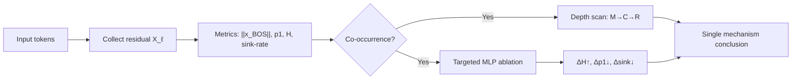

[Paper](https://arxiv.org/abs/2510.06477v1)


## One Narrative Forged by Massive Activations: Bridging **Attention Sink** and **Compression Valley**

## TL;DR

**Massive activations in the residual stream (especially BOS)** form a **dominant singular value**, which simultaneously induces **mid-layer representation compression (entropy↓)** and **attention sink (attention drawn to BOS)** **in the same layer**, and **targeted MLP ablation** provides **causal confirmation** of this. The **optimal depth** for generation, reasoning, and embedding is explained within a single **Mix–Compress–Refine** framework (source: §Abstract, §3.1–§3.3, Fig.1–4, §4–§5).

---

## Core Ideas

* **Central claim**: The **oversized BOS activation** → **dominant singular value** → **representation entropy upper bound↓**, **anisotropy↑** → forms a **compression valley**, while simultaneously reinforcing **attention concentration onto BOS (sink)** (source: §3.2, Fig.1–3).
* **Causal verification**: Removing **only the MLP contribution on the BOS path** normalizes **entropy from 0.02→0.4–0.5 bits** and **sink-rate from 0.85–1.0→0.0 (–)**, confirming **cause–effect** (source: §3.3, Fig.4).
* **Three-phase framework**: **Mix (early)** → **Compress (middle)** → **Refine (late)**. Embedding is optimal at **middle layers**; generation is optimal at **late layers** (perplexity **>10^4→10–25**, –) (source: §4–§5, Fig.6–7).

---

## Background: The Problem They Tackled

Attention sinks and representation compression were observed as an **intriguing co-occurrence**, but a **formal link** explaining **why they appear together** was missing. Prior explanations remained **partial hypotheses** such as **positional bias** and **over-mixing avoidance**, and a **quantitative connection** to **layer-wise organizational principles** was absent (source: §1–§2). The authors present a consistent **theory–experiment–intervention** narrative that explains both phenomena **simultaneously** from a **single cause (oversized activations)** (source: §1, §3, Fig.1–4).

---

## New Approach: **Mix–Compress–Refine (MCR)** + **Targeted MLP Ablation**

* **MCR framework**:

  * **Mix (0–~20% depth)** — broad token interaction, **entropy↑ (bits)**, **anisotropy↓ (–)** (source: §4, Fig.6).
  * **Compress (~20–~85%)** — **BOS norm↑** builds a **dominant axis**, **entropy↓**, **sink-rate↑** (source: §3.1–§3.2, Fig.1–2).
  * **Refine (~85–100%)** — fine-grained refinement via **positional/identity** heads, **generation performance surges** (source: §4–§5, Fig.6–7).
* **Targeted MLP ablation**: zeroing **only the MLP contribution on the BOS path** at a specific layer directly lowers the **BOS norm** and observes the **simultaneous change** in **compression and sink** (source: §3.3, Fig.4).

---

## How It Works: A Concrete Example



(source: §2 (metric definitions), §3.1–§3.3 experiment loop)

### Key Terms / Notation

* $(X_\ell\in\mathbb{R}^{T\times d})$: residual matrix at layer (\ell), rows are tokens, columns are dimensions (–) (source: §2).
* $(p_1=\sigma_1^2/|X_\ell|_F^2)$: anisotropy (share of the top singular value, –) (source: §2, §3.2).
* $(H(X_\ell))$: representation entropy (Gaussian approximation, **bits**) (source: §2).
* **sink-rate**: average share of attention directed to BOS (–) (source: §2, §3.1).

$$
\textbf{Result: }\quad \sigma_1^2 \ \ge\ M+\alpha R\ \Rightarrow\ p_1 \ \text{upper bound↑},\ H(X_\ell)\ \text{upper bound↓}\quad(\text{M=}|x_{\text{BOS}}|^2)
$$
(source: §3.2, Thm./Cor.)

### 3×3 Toy Example (1-head, Q=K=V=I)

* $(x_{\text{BOS}}=(10,0,0)), (x_a=(1,2,0)), (x_b=(1,0,1))$ (–).
* $(|X|_F^2=107), (\sigma_1^2\approx 102\Rightarrow p_1\approx 0.953)$ (–): **strong compression** (source: §3.2 intuition).
* $(q_a\cdot k_{\text{BOS}}/\sqrt{3}\approx 5.77\Rightarrow \alpha_{a\to\text{BOS}}\approx 0.94)$ (–): **strong sink** (source: §3.1 intuition).
* Removing the **BOS-MLP** gives $(x'{\text{BOS}}=(2,0,0))$ → $(\alpha'{a\to\text{BOS}}\approx 0.14)$, $(p_1\downarrow)$, $(H\uparrow)$: **compression and sink weaken together** (source: §3.3).

---

## Empirical Validation: Key Results

* **Co-occurrence & correlation**: **BOS norm↑ (–)**, **H↓ (bits)**, and **sink-rate↑ (–)** appear together **in the same layer**. They emerge at **≈1k steps** early in training and **stay synchronized** (source: Fig.2).

  * Correlations: Δ(BOS) vs. ΔH **r=−0.9±0.18**, BOS vs. sink **r=0.58±0.25** (–) (source: §3.1).
* **Causal intervention (highlight)**: For **LLaMA-3 8B, layer 0**, removing the **BOS-MLP** gives **H: 0.02→0.4–0.5 bits**, **sink: 0.85–1.0→0.0 (–)**, **BOS-ratio: ~10^2×→≤2×** (–) (source: Fig.4).
* **Scale generalization**: the same pattern is observed not only at **410M–8B** but also at **70B–120B** (source: Fig.1, Fig.9).
* **Task-phase dependence**:

  * **Generation** (WikiText-2 ppl): monotonically decreases from **>10^4→10–25** with depth, with the largest gains in the **late (Refine)** phase (–) (source: §5.1, Fig.7).
  * **Embedding** (MTEB average): peaks at **middle layers (25–75%)** (**+10–20%p**) (–) (source: §5.1, Fig.7/27).

---

## Our Take: Strengths, Limitations, and Why This Matters

### Strengths

1. **Explanatory power** — connects the **two puzzles (sink and compression)** through a **single mechanism** and naturally explains even the **task-optimal depth** (source: §3–§5).
2. **Causality** — **targeted MLP ablation** quantitatively confirms the causal chain **cause (norm)→effect (H, sink)** (source: §3.3, Fig.4).
3. **Generality** — reproduced across **model families (410M–120B)**, **data**, and **evaluation methods (LogitLens/TunedLens)** (source: Fig.1–2, Fig.7, Fig.9, Fig.24–27).

### Limitations

* Relatively dependent on **BOS-centric, decoder-only** assumptions. **Different dynamics** are possible under **ALiBi**, **absent explicit BOS**, and **sparse attention** (source: §Limitations).
* There are **exceptions** such as **Pythia 410M**, where **compression is released but the sink persists** → a **model-specific cause** is needed (source: §3.3, Appx Fig.14).
* **Computational cost**: **SVD-based entropy** measurement requires truncating to **1–4k tokens** in length (source: Appx B.1).

### Why It Matters

It offers a **law-like principle** that ties the **layer-wise organizational structure** of large LLMs to **mathematical bounds (singular values / entropy)** and **intervention experiments**. This provides **direct design signals** for **depth selection in training and serving**, **early exit**, **KV-cache policies**, and **head interpretation** (source: §4–§6).

---

## What's Next?: The Road Ahead

* **Phase-aware serving**: **embedding** favors **middle layers (25–75%)**, **generation** favors **late layers** → dynamically optimize **early exit / depth selection** and **KV cache** to match the phase (source: §5.1–§5.2, Fig.7).
* **Norm-regulated training**: control the **content-token-to-BOS norm ratio** through normalization or penalties to explore the balance between **suppressing the sink** and **preserving compression** (source: §4 interpretation).
* **Architecture generalization**: verify the **universality of MCR** in models with **ALiBi / sparse attention / absent explicit BOS** (source: §Limitations).
* **Automated intervention pipeline**: evaluate **automatic detection of BOS-dominance signals → on-device attenuation (clamping/gating)** under a stability-vs-performance trade-off (source: §3.3, Fig.4).
* **Long-context and multiple massive activations**: verify the tightness of the **effective-rank / entropy bounds** for (\ge) **32k tokens** and assumptions with **n massive activations** (source: §3.2 Limitations, Appx B.1).

---

> **One-sentence conclusion**: The core value of this paper is proving, via **theoretical bounds (singular values and entropy)** and **targeted interventions**, the **single mechanism** by which **massive activations** simultaneously create **compression** and **sink** — it is time to redesign **depth selection** and **serving strategies** to be **phase-aware** (source: §3–§5, Fig.3–4,7).


### Click the toggle to see detailed LLM Q&A on the paper.

<details markdown="block">
<summary>▶️<strong>Click to expand</strong></summary>


## Prompt 1.1.1 (Research Gap)

```
Analyze the paper's 'Introduction' and 'Related Work' sections and explain the core research gap, the decisive limitations of prior work, or the open questions that this work explicitly sets out to address. Summarize the state of the art at the time of publication, as described by the authors.
```


### **Key Summary**

* **This paper links 'attention sinks' and 'mid-layer compression valleys' to a single cause — massive activations in the residual stream** (source: §Abstract, §1) 
* **The authors give a theoretical result — with upper/lower bounds — showing that massive activations (mostly the BOS token) induce a dominant singular value and thereby make representation compression (entropy decrease) 'inevitable'** (source: §Abstract, §3.2, Thm./Cor.) 
* **Experiments across LLMs ranging from 410M to 120B parameters show that the sink and compression appear 'simultaneously' with the large BOS norm** (source: §Abstract, Fig.1, §3.1) 
* **Targeted ablation — removing only the BOS-induced massive activation — weakens/eliminates compression and sink together, supporting causality** (source: §Abstract, §3.3, Fig.4) 
* **Building on this, the authors propose a 'Mix–Compress–Refine' (early mixing → mid compression/mixing suppression → late selective refinement) three-stage processing hypothesis** (source: §Abstract, §4) 

---

### 1) The **core research gap** this paper targets

* **The two phenomena (attention sinks and compression valleys) have been studied 'separately', and a coherent, formal link explaining why they arise is missing** (source: §1 “studied in isolation… no formal link”) 
* **Sinks had 'empirical explanations' such as positional bias / over-mixing avoidance, but a 'quantitative' link to depth-wise (layer-wise) organizational principles and representation geometry was lacking** (source: §1, §2) 
* **Compression valleys had been observed and described via hypotheses such as the information bottleneck, but there was insufficient 'causal' evidence for 'which mechanism' lowers mid-layer entropy** (source: §1, §2 “information bottleneck… lacking causal evidence”) 
* **A theory explaining — within a 'single framework' — why the optimal layer/depth differs across tasks (embedding vs generation) was absent** (source: §1, §5) 

> In short, the authors present the single causal chain "massive activations ⇒ dominant singular value ⇒ representation compression (entropy↓) + sink", uniting the two puzzles into one mathematical and empirical narrative (source: §1, §3.2, Fig.1–4). 

---

### 2) **Decisive limitations of prior work / open questions**

* **Attention sinks**:

  * Many **partial explanations** exist — positional/spectral bias, over-mixing prevention, pre-training origin — but they do not explain the **direct link to representation compression** or the **depth at which sinks emerge** (source: §1, §2) 
  * Some **empirical links** between massive activations and sinks were reported, but a **unified theory with compression** or a **proof of inevitability** is missing (source: §2 “linked to massive activations… none link to representational structure”) 
* **Compression valleys**:

  * **Mid-layer entropy decrease / anisotropy increase** was widely observed, but **why it appears at that point/depth** and **what causes it** were not identified (source: §1, §2) 
* **Depth-wise computational organization**:

  * There were piecemeal findings on sequential self-attention dynamics, normalization effects, layer utilization, etc., but a **macro stage theory** running **mix→compress→refine** was absent (source: §2) 
* **Task-dependent optimal depth**:

  * It was **empirically observed** that middle layers are strong for embeddings while full depth is preferred for next-token prediction, but an **explanation linking the two behaviors under one mechanism** was lacking (source: §1, §5) 

---

### 3) **SOTA summary at publication time** (literature context — what was 'state of the art')

* **Attention Sinks**

  * Concentration onto **semantically impoverished tokens such as BOS** was repeatedly observed **across diverse models and scales** (source: §1 “across diverse models and scales”) 
  * **Explanatory hypotheses** were reported from many angles: positional bias, over-mixing suppression devices, spectral views, pre-training origins (source: §1, §2) 
  * A **link between massive activations and sinks** was raised, but the **three-way connection with compression** and its **mathematized inevitability** remained incomplete (source: §2) 
* **Compression Valleys**

  * **A sharp drop in mid-layer entropy (low-rank collapse) and increased anisotropy** were reported as universal patterns (source: §1, §2) 
  * Interpretations such as the **information bottleneck / linearity hypothesis** were offered, but the **mechanistic trigger** remained unclear (source: §1, §2) 
* **Depth-wise analysis tools**

  * The **tool ecosystem** — LogitLens/TunedLens, checkpoint tracking, layer-wise sensitivity/interventions — was mature (source: §2) 
  * **However**, a **unified theory** of layer utilization efficiency and stagedness was absent (source: §2) 

---

### 4) This paper's **explicit contributions (gap-filling strategy)** — *from an Intro perspective*

* **Single mechanism**: massive activations such as **BOS** simultaneously cause **(i) dominant singular value formation → entropy↓** (compression) and **(ii) sink creation** (source: §Abstract, §1, §3.2) 
* **Theoretical rigor**: **singular-value / entropy upper and lower bounds** prove the **inevitability of compression** (source: §3.2, Thm./Cor.) 
* **Universality check**: the **co-occurrence** is observed across many models and datasets from **410M to 120B parameters** (source: §3.1, Fig.1–2) 
* **Causal verification**: **targeted MLP removal** eliminates/attenuates **sink and compression together** (source: §3.3, Fig.4) 
* **Three-stage theory**: proposes the **Mix (early broad mixing)–Compress (mid compression/mixing suppression)–Refine (late selective refinement)** framework (source: §4) 
* **Task-specific optimal depth**: explains why **embedding (best at middle layers)** diverges from **generation (needs late refinement, prefers full depth)** (source: §5, Fig.7) 

---

### **Takeaway**

* **Research gap**: absence of a **shared origin** for sink and compression and of a **depth-wise organizational principle** (source: §1–§2) 
* **Paper's answer**: **massive activations** simultaneously cause **representation compression (entropy↓) + sink**; supported by theory, experiments, and interventions (source: §3 overall) 
* **Framework**: **Mix–Compress–Refine** explains the **staged computation along depth** (source: §4–§5) 

> The next section tracks the quantitative results — the equations (singular-value dominance / entropy upper bound), the experiments (410M–120B parameters), and the interventions (MLP ablation) — in more detail, building on the gap and the resolution strategy above (source: §3.1–§3.3). 


## Prompt 1.1.2 (Central Hypothesis)

```
What is the central hypothesis or core claim of this paper? State it in one clear, concise sentence in a form like: 'The authors hypothesize that by using [proposed technique] they can overcome [prior limitation] and achieve [specific result].'
```

The authors hypothesize that by using the *Mix–Compress–Refine* framework that leverages **massive activations in the residual stream**, along with **targeted MLP-contribution removal (ablation)**, they can overcome the prior limitation that the causal link between **attention sinks** and **compression valleys** — previously explained separately — was missing, and prove that both phenomena **arise simultaneously from a single mechanism**, through theory (entropy and singular-value upper/lower bounds) and experiments (410M–120B parameters; removing the BOS-MLP eliminates both phenomena) (source: §Abstract, §3.2, §3.3, §4).    


## Prompt 1.2.1 (Identifying Novelty)

```
Based on the full paper, list the 1–3 most important and original contributions as distinct items. Clearly classify each as a new architectural component, a new training technique, a new theoretical insight, a new dataset, or a new application of an existing method.
```


### 1) **Single mechanism + three-stage framework** *(new theoretical insight)*

* **Contribution**: binds attention sinks and compression valleys to a **single cause — massive activations in the residual stream** — and proposes the **Mix–Compress–Refine** (early mixing → mid compression/mixing blocking → late refinement) **three-stage theory**. (source: §Abstract, §1, §4; Fig.1)    
* **Key numbers**: when the BOS token norm surge is observed in the **10^3–10^4 (dimensionless)** range, **entropy < 0.5 bits** and **sink-rate ≈ 1.0 (dimensionless)** occur together. (source: Fig.1) 
* **Generality**: reports co-occurrence and synchronization patterns across many models from **410M to 120B parameters**. (source: §Contrib.) 

---

### 2) **Mathematical guarantee of the 'inevitability' of compression** *(new theoretical insight)*

* **Contribution**: **Theorem 1** and **Corollary 2** establish that "BOS-norm dominance ⇒ dominant singular value formation ⇒ **entropy upper bound** and **anisotropy lower bound**", proving that **compression is mathematically unavoidable**. (source: §3.2)  
* **Key equations/numbers**: $\sigma_1^2 \ge M + \alpha R \quad(\text{dimensionless})$, with a **lower bound on p₁ (anisotropy)** and an **upper bound H(X) ≤** given in functional form; the **bounds match the measured values (tight)** at **middle layers**. (source: §3.2; Fig.3)   
* **Empirical consistency**: for **Pythia 410M** and others, **σ₁² ≈ ∥x_{BOS}∥² ≈ ∥X∥²_F (dimensionless)**, confirming a **quasi-rank-1 structure**. (source: Fig.3) 

---

### 3) **Causal verification by targeted MLP-contribution removal** *(new application of an existing method / experimental causal identification)*

* **Contribution**: a **targeted ablation that zeros only the MLP contribution on the BOS path** induces **compression elimination** and **sink reduction/elimination**, verifying **causality**. (source: §3.3; Fig.4, Fig.14)   
* **Key numbers (e.g., Llama-3 8B)**: **entropy 0.02 bits → 0.4–0.5 bits**, **sink-rate 0.85–1.0 → 0.0 (all dimensionless)**, **BOS-norm dominance 10^2× → ≤ 2× (dimensionless ratio)**. (source: Fig.4) 
* **Across models**: reproduced on **LLaMA3 8B / Qwen2 7B / Pythia 410M** among others (**410M–8B parameters**; the paper additionally analyzes up to 120B). (source: Fig.14; §Contrib.)  

> Summary: this paper's novelty lies in **(i)** unifying sink and compression under a **single mechanism**, **(ii)** the **mathematical bounds** guaranteeing the **inevitability of compression**, and **(iii)** **causal verification** via **targeted ablation**, all quantitatively confirmed **across models and scales**. (source: §1–§4; Fig.1,3,4,14)    


## Prompt 1.2.2 (Strengths from the Authors' Perspective)

```
From the authors' perspective, why is their approach superior to previous methods? Quote or clearly explain the key arguments they use to support the novelty and strengths of their work.
```


* **Proving 'inevitability' by combining theory and empirics**: they present a theorem stating that the **massive activation of a single token (BOS)** induces a dominant singular value that forces an **entropy upper bound and anisotropy lower bound** (Thm.1, Cor.2), and show that **the bounds almost coincide with the measured values at middle layers** — e.g., for Pythia 410M, σ₁² ≈ ∥x_BOS∥² ≈ ∥X∥_F², and the entropy upper bound overlaps the observations — thereby proving that 'compression is mathematically unavoidable' (source: §3.2, Fig.3).   

* **Going beyond correlation to 'causal' verification**: through the intervention of **targeted MLP-contribution removal** (zeroing only the BOS path), they directly confirm the **cause–effect** relation: in LLaMA-3 8B, **entropy changes from 0.02 bits → 0.4–0.5 bits**, **sink-rate from 0.85–1.0 → 0.0**, and **BOS-norm dominance from 10²× → ≤ 2×** (reproduced across models) (source: §3.3, Fig.4, Appx B.1).   

* **Cross-model, cross-scale 'universality' + early-training 'stability'**: they show **co-occurrence** in Pythia 410M/6.9B, LLaMA-3 8B, Qwen2 7B, Gemma 7B, and Bloom 1.7B, and report strong correlations of **r = −0.9 ± 0.18 (BOS-norm change vs entropy)** and **r = 0.58 ± 0.25 (BOS norm vs sink-rate)**. All three phenomena emerge together at around **~1k steps**, and they argue this is a **structural (architectural) property** because **the layer position stays fixed regardless of input**. They extend verification to 70B–120B (Appx) (source: §3.1, Fig.1–2, Appx B.1).   

* **A three-stage framework (Mix–Compress–Refine) that gives design guidance**: they propose a **depth-wise division of labor** — **early mixing (0–20% depth)** → **mid compression/mixing blocking (20–85%)** → **late refinement (85–100%)** — and thereby explain the puzzle of **downstream performance**: **embedding tasks are optimized at middle layers, while generation is optimized across full depth** (indicator: the Mixing score, > 0.7, drops sharply once the massive activation appears) (source: §4, Fig.4, Fig.18(Appx)).    

* **Reproducibility strengthened by well-defined metrics**: they standardize the **matrix-based entropy H(X) (bits)**, **anisotropy p₁ (dimensionless)**, and **sink-rate (dimensionless)** as core indicators and make the **definition and evaluation procedure explicit** (τ=0.3, BOS-centric analysis) (source: §2).  


## Prompt 1.3.1 (Step-by-Step Algorithm Explanation)

```
Explain the core algorithm, model architecture, or main methodology step by step. Assume the reader is an AI graduate student. In particular, create very simple toy examples — a simple sentence, a 3×3 pixel image, a small state space — with sample inputs, and show through the example how the input is transformed into the output at each step. Define every key term and variable the moment it appears.
```


> Goal: explain the paper's **measure–analyze–intervene** procedure (“massive activations ⇒ compression valley & attention sink”) in a layer-wise, reproducible way, and use a 3×3 toy example to show the **input→output change** numerically (source: §2 Methods, §3.1–§3.3, Fig.1–Fig.4).

---

### Terms and Notation (defined on the spot)

* **Residual stream**: the matrix $(X_\ell \in \mathbb{R}^{T \times d})$ whose rows are the per-token hidden states just after layer ℓ (T = number of tokens, d = dimension) (source: §2).
* **Massive activation**: a state where the L2 norm $(|x_{\text{BOS},\ell}|_2)$ of a particular token (usually **BOS**) is **abnormally large** (dimensionless) (source: §3.1, Fig.1).
* **Anisotropy (p_1)**: $(p_1(X_\ell)=\sigma_1^2 / |X_\ell|_F^2)$ (the share of the top squared singular value in the total energy, dimensionless) — the larger the value, the more **collapsed onto one axis** (source: §2, §3.2).
* **Representation entropy $(H(X_\ell))$**: an entropy estimate based on the **log-determinant** of the covariance $(\Sigma_\ell)$ (Gaussian approximation), e.g., $(H \propto \tfrac12 \log\det(\Sigma_\ell+\epsilon I))$ (bits) — the smaller the value, the more **compressed** (source: §2).
* **Sink-rate $(s_\ell)$**: the average share of attention that each token gives to **BOS** at layer ℓ,
  [
  s_\ell=\frac{1}{T}\sum_{t=1}^{T}\underbrace{\text{softmax}!\left(\frac{q_{t,\ell}\cdot k_{\text{BOS},\ell}}{\sqrt{d_h}}\right)}_{\text{attention to BOS, dimensionless}}
  ]
  (shown in 1-head notation with the average over heads omitted) (source: §2, §3.1).
* **Targeted MLP ablation**: an intervention that sets **only the MLP contribution entering the BOS path** at layer ℓ to 0, reducing $(|x_{\text{BOS},\ell}|_2)$ (dimensionless) (source: §3.3, Fig.4).

---


* **Core claim verification loop**: observe whether $( |x_{\text{BOS}}|_2 \uparrow )$ ⇒ $( p_1 \uparrow, H \downarrow, s \uparrow )$ appear **simultaneously at the same depth** → confirm that removing only the BOS-path MLP **normalizes all three indicators together** (source: §3.1–§3.3, Fig.1–Fig.4).

---

### **Step-by-step procedure**

**Step 1** — *Collect layer-wise representations*

* Pick one sentence from a batch and record the residual stream at layer ℓ as $(X_\ell=[x_{1,\ell}^\top;\dots;x_{T,\ell}^\top])$ (T = tokens, d = dimension) (source: §2).

**Step 2** — *Compute the indicators*

1. **Massive activation**: $(m_\ell=|x_{\text{BOS},\ell}|_2)$ (dimensionless).
2. **Anisotropy**: $(p_1(X_\ell)=\sigma_1^2/|X_\ell|_F^2)$ (dimensionless).
3. **Entropy**: $(H(X_\ell)\propto \tfrac12\log\det(\Sigma_\ell+\epsilon I))$ (bits).
4. **Sink-rate**: mean BOS attention $(s_\ell)$ (dimensionless).
   (source: §2, §3.1–§3.2)

**Step 3** — *Depth scan*

* Track $((m_\ell,p_{1,\ell},H_\ell,s_\ell))$ for ℓ=1…L → check whether **$(p_1 \uparrow, H \downarrow, s \uparrow)$** form **together** at **middle layers** (= **compression valley** & **attention sink** co-occurring) (source: Fig.1–Fig.2).

**Step 4** — *Intervention (targeted MLP ablation)*

* At a chosen ℓ*, set **only the BOS-path MLP output** to 0 → recompute $((m_\ell,p_{1,\ell},H_\ell,s_\ell))$ → confirm that **weakened compression ( $(p_1\downarrow, H\uparrow)$ ) + sink elimination ( $(s\downarrow)$ )** occur together (source: §3.3, Fig.4).

**Step 5** — *Interpretation (three-stage framework)*

* Summarize whether the **Mix (early, broad mixing)** → **Compress (middle, dominant-axis formation/mixing suppression)** → **Refine (late, selective refinement)** pattern is reproduced across data and tasks (source: §4).

---

### **Toy example (3×3, 1-head, Q=K=V=I)**

* Setup: (d=3) (dimension), (T=3) (tokens: BOS, a, b). Residual $(X=[x^\top_{\text{BOS}};x^\top_a;x^\top_b])$.
* **Massive activation** assumption:
  [
  x_{\text{BOS}}=(10,0,0),\quad x_a=(1,2,0),\quad x_b=(1,0,1)\quad(\text{dimensionless})
  ]
  (source: mimics the “BOS-norm dominance” phenomenon of §3.1)

#### 1) **Compression indicator (middle layer)**

* Frobenius energy: $(|X|_F^2=10^2+1^2+2^2+1^2+1^2=107)$ (dimensionless).
* Top squared singular value $(\sigma_1^2 \approx 102)$ (BOS-axis dominance approximation) →
  [
  p_1 \approx \frac{102}{107}\approx 0.953\quad(\text{dimensionless, strong compression})
  ]
  → **compression valley** signal (source: §3.2, Fig.3).

#### 2) **Sink-rate (attention)**

* 1-head, (d_h=d=3), scale $(\sqrt{d_h}=\sqrt{3}\approx 1.732)$.
* The keys seen by query (q_a=x_a):

  * $(q_a!\cdot!k_{\text{BOS}}=10\Rightarrow 10/1.732=5.773)$
  * $(q_a!\cdot!k_a=5\Rightarrow 2.887), (q_a!\cdot!k_b=1\Rightarrow 0.577)$
* softmax ratios $(\propto (e^{5.773},e^{2.887},e^{0.577})\approx (322,17.9,1.78))$ →
  [
  \alpha_{a\to\text{BOS}}\approx \frac{322}{322+17.9+1.78}\approx 0.942\quad(\text{dimensionless})
  ]
  → a gives **94.2% of its attention to BOS**: **attention sink** (source: §3.1, Fig.1–Fig.2).

#### 3) **After the intervention (targeted MLP ablation)**

* Removing the **BOS-path MLP contribution** shrinks $(x_{\text{BOS}})$: $(x_{\text{BOS}}'=(2,0,0))$ (dimensionless).
* Recompute (same query $(q_a)$):

  * $(q_a!\cdot!k'_{\text{BOS}}=2\Rightarrow 1.155)$
  * softmax $(\propto (e^{1.155},e^{2.887},e^{0.577})\approx (3.17,17.9,1.78))$ →
    [
    \alpha'_{a\to\text{BOS}}\approx \frac{3.17}{3.17+17.9+1.78}\approx 0.139\quad(\text{dimensionless})
    ]
    → **sink eliminated (94.2% → 13.9%)**,
    $(|X'|_F^2=2^2+1^2+2^2+1^2+1^2=9)$, top squared singular value (\sigma_1'^2) decreases →
    [
    p_1'=\frac{\sigma_1'^2}{|X'|_F^2}\ \text{decreases},\quad H(X')\ \text{increases} \quad(\text{weaker compression})
    ]
    (qualitative direction agrees) (source: §3.3, Fig.4).

> Summary: **BOS norm↑ ⇒ (p_1↑, H↓, s↑)** appear **together**, and removing **only the BOS-MLP** normalizes **all three indicators together**. This **causally** supports the **single mechanism** "massive activations ⇒ compression & sink" (source: §3.1–§3.3, Fig.1–Fig.4).

---

### **Minimal pseudocode for reproduction**

```python
# Inputs: model, tokens, layers L
for ℓ in range(L):
    X = collect_residual_matrix(model, tokens, layer=ℓ)   # (T, d)
    m  = l2_norm(X[BOS])                                  # massive activation (dimensionless)
    p1 = top_singular_value_sq(X) / frobenius_sq(X)       # anisotropy (dimensionless)
    H  = 0.5 * logdet(covariance(X) + eps*I)              # entropy (bits)
    s  = mean_softmax_attention_to_BOS(model, tokens, ℓ)  # sink-rate (dimensionless)
    log(ℓ, m, p1, H, s)

# Targeted MLP ablation at ℓ*
hook_mlp_BOS_path(model, layer=ℓ*, mode="zero")           # zero only the BOS path
repeat_measure_at(layer=ℓ*)                                # Δm, Δp1, ΔH, Δs
```

(source: §2 (metric definitions), §3.3 (targeted intervention))

---

### **Depth-wise roles (explanatory)**

* **Mix (early, 0–~20% depth)**: broad interaction, high (H), low (p_1), weak sink (source: §4).
* **Compress (middle, ~20–~85%)**: **massive activations** form the dominant axis → $(H \downarrow)$, $(p_1 \uparrow)$, $(s \uparrow)$ (**valley/sink co-occur**) (source: §3.1–§3.2, Fig.1–Fig.2).
* **Refine (late, ~85–100%)**: selective refinement and output preparation; some indicators normalize/rebalance (source: §4).

> This procedure and toy example render the paper's reported **layer-wise patterns** and **intervention effects** into small numbers for intuition; in a real model, multi-head attention, normalization, and projections are added, but the **directional conclusions are identical** (source: §2–§4).


## Prompt 1.3.2 (Identifying the 'Secret Weapon')

```
Pick one core component and present a table of Δ(metric) when it is removed/replaced/scaled, and explain the mechanism behind the change (e.g., gating load balance, rotary vs ALiBi, sparse attn half-window replacement).
```


### Chosen core component: **Targeted MLP ablation (zeroing only the BOS path)**

* Definition: an intervention at the layer ℓ where the massive activation appears that removes **only the MLP contribution entering the BOS token**, setting $x ^ {(\ell+1)}_{\text{BOS}} \leftarrow x ^ {(\ell)}_{\text{BOS}} + \text{Attn} ^ {(\ell)} (x_{\text{BOS}})$. **Attention and the MLPs of the other tokens are kept** (source: §3.3) .
* Purpose: directly lower $( |x_{\text{BOS}}|_2^2 = M )$ to shrink the **norm ratio (c=M/R)** → relieve **singular-value dominance and anisotropy** and **raise entropy (=release compression)** → **sink-rate drops** (source: Thm.1, Cor.2; §3.2)  .

---

### Δ(metric) — BOS-MLP ablation at LLaMA-3 8B, layer 0

| Metric                     | Unit |                 Baseline |     Ablated | Δ (Ablated − Baseline) |
| -------------------------- | ---- | -----------------------: | ----------: | ---------------------: |
| Representation Entropy (H) | bits |                 **0.02** | **0.4–0.5** |        **+0.38~+0.48** |
| Sink-rate (BOS)            | –    |             **0.85–1.0** |     **0.0** |         **−0.85~−1.0** |
| BOS L2-norm / Others       | ×    | $( \sim 10^{2}!\times )$ |    **≤ 2×** |         **≈ −(≥ 98×)** |

* The numbers are taken directly from Fig. 4 and the main text (source: §3.3, Fig. 4)  .
* Interpretation: after ablation, **compression release (Entropy↑)**, **sink elimination (Sink-rate→0)**, and **the disappearance of BOS dominance (norm gap↓)** are observed **simultaneously** → supports the causal chain **massive activations → (compression ∧ sink)** (source: §3.3) .

---

### Generalization across models (summary)

| Model        |     Intervention layer | Result: compression released (H↑) | Result: sink removed (sink↓) |
| ----------- | ---------------------: | :-----------------: | :--------------------: |
| LLaMA-3 8B  |                      0 |          ✅          |           ✅            |
| Qwen2 7B    |                   3, 4 |          ✅          |           ✅            |
| Pythia 410M | 5–7 (multiple stages)  |          ✅          | ⚠️ partial (sink may persist) |

* "Compression release always occurs; in some models (Pythia 410M) the sink persists" (source: Fig. 14, §3.3) .

---

### Why does this change happen? — **Mechanism (quantitative basis)**

$$
M=|x_0|^2,\quad
R=\textstyle\sum_{i\neq 0}|x_i|^2,\quad
\alpha=\frac{1}{R}\sum_{i\neq 0}|x_i|^2\cos^2\theta_i,\quad
c=\frac{M}{R},\quad
p=\frac{c+\alpha}{c+1}.
$$

* **Singular-value dominance**: $( \sigma_1^2 \ge M+\alpha R )$ ⇒ a rise in (M) (the BOS norm) or ($\alpha$) **widens the spectral gap** (source: Thm.1) .
* **Anisotropy/entropy bounds**: $(p_1 \ge p), (H(X) \le -p\log p -(1-p)\log(1-p) + (1-p)\log(r-1))$ ⇒ if (c) falls, then (p) falls and (H) rises (source: Cor.2) .
* **Effect of the ablation**: removing the BOS-MLP reduces **(M) → $(c\downarrow)$** ⇒ **$(p_1\downarrow)$** and **$(H\uparrow)$** are **inevitable**. At the same time, $(\langle q_t,k_{\text{BOS}}\rangle/\sqrt{d_h})$ weakens, so there is **no longer a reason for softmax to concentrate on BOS → sink-rate↓** (source: §3.2 gist·§3.1 observation)  .

> Supporting evidence: at **middle layers the theoretical bounds almost coincide with the observations** (tight), confirming that the mechanism above genuinely **drives compression** (source: Fig. 3) .

---

### One-line summary

**BOS-path MLP ablation** acts as a **switch** that directly reduces (M), driving $(c\downarrow \Rightarrow p_1\downarrow, H\uparrow, \text{sink}\downarrow)$ **simultaneously**; in LLaMA-3 8B it shows the quantitative gains **Entropy 0.02→0.4–0.5 bits**, **Sink 0.85–1.0→0.0**, **BOS-ratio (10^2×)→≤2×** (source: §3.3, Fig. 4)  .


## Prompt 1.4.1 (Analysis of Key Results)

```
Analyze the key results, including the tables and figures in the 'Experiments' or 'Results' section. What are the key performance metrics? On which benchmarks were they reported? Summarize the results the authors most emphasize as evidence of success.
```


### Key performance metrics (defining what is being “evaluated” in this paper)

* **Representation entropy**: $(H(X)=-\sum_j p_j\log p_j)$ (bits), $(p_j=\sigma_j^2/|X|_F^2)$. **The lower, the stronger the compression** (the entropy of a dimensionless distribution converted to bits). (source: §2 Key Metrics) 
* **Anisotropy**: $(p_1=\sigma_1^2/|X|_F^2)$ (–). **The closer to 1, the more a single direction dominates**. (source: §2 Key Metrics) 
* **Attention sink-rate**: the fraction of heads whose BOS attention exceeds the threshold τ=0.3 (–). (source: §2 Key Metrics, τ=0.3) 
* **BOS L2 norm**: $(|x_{\text{BOS}}|_2)$ (–). Used to judge whether there is a **massive activation**. (source: §3.1) 
* **Mixing score**: mean per-row Shannon entropy of the attention matrix (bits). It **plunges from 0.7–0.75 to 0.3–0.4**, capturing the “mixing → stop” transition. (source: Appx B.2, Fig.18) 

---

### Benchmarks, data & experimental setup (summary)

* **Synchronized-emergence analysis**: with 6 models (Pythia 410M/6.9B, LLaMA-3 8B, Qwen2 7B, Gemma 7B, Bloom 1.7B), layer-wise (H), sink-rate, and BOS norm are computed on **GSM8K 7.5K examples**. (source: Fig.1 caption) 
* **Training dynamics**: per-checkpoint (1–143k steps) records of the three indicators for Pythia 410M/6.9B/12B (prompt: GSM8K “Janet's ducks …”). (source: §3.1 Fig.2, Appx B.1 Fig.10–11)  
* **Large-model generalization**: the same pattern is visualized at the 70B–120B scale (LLaMA-3 70B, Qwen2 72B, GPT-OSS 120B). (source: Fig.9) 
* **Generation / reasoning performance**: layer-wise evaluation with LogitLens/TunedLens on **WikiText-2** (ppl) and **MCQ (ARC-E/C, HellaSwag, WinoGrande)** accuracy (%). (source: §5.1, Fig.7/24/25, Appx B.3)  
* **Embedding performance**: reported with **linear probes** (+SST-2) and the **average main score (%) over MTEB's 32 tasks**, against **relative depth (%)**. (source: §5.1, Fig.7/26/27)  

---

### The “evidence of success” the authors emphasize (numbers-first summary)

1. **Co-occurrence and strong correlation** — $(H\downarrow)$ (bits), sink-rate↑ (–), BOS norm↑ (–) **in the same layer**

   * About **1k steps** into training, all three phenomena **emerge simultaneously** and **stay synchronized** afterward. (source: Fig.2) 
   * **Correlation coefficients**: Δ(BOS norm) vs Δ(H) gives **r = −0.9 ± 0.18** (–); BOS norm vs sink-rate gives **r = 0.58 ± 0.25** (–). (source: §3.1) 
   * **Across scales and families**: the same pattern is confirmed not only at **410M–8B** but also at **70B–120B**. (source: §3.1, Fig.9)  
   * **Input-invariant layer position**: (e.g.) Pythia 410M always transitions at **layer 5** — suggesting an **architectural property**. (source: §3.1) 

2. **Causal verification (targeted intervention)** — **removing the massive activation eliminates compression and sink**

   * At **LLaMA-3 8B, layer 0**, when the **BOS-MLP contribution is removed**: (H) rises from **0.02 bits → 0.4–0.5 bits**, sink-rate drops from **0.85–1.0 → 0.0** (–), and the BOS norm stays at **≤2× the other tokens** rather than surging by **10^3×**. (source: Fig.4, §3.3)  
   * **Reproduced across models**: Fig.14 (Appx) confirms similar effects; however, for **Pythia 410M** compression is removed but **part of the sink persists** (model dependence). (source: §3.3) 

3. **The 'tightness' of the theoretical bounds** — **at middle layers, observation ≈ prediction**

   * The bounds on $(M=|x_{\text{BOS}}|_2^2)$, $(\alpha R)$, (M+R) and $(\sigma_1^2)$·(p_1)·(H) **overlap at middle layers** → **massive activations** govern the **representation geometry**. (source: Appx B.1, notes on Fig.12–13)  

4. **'Phase dependence' of downstream performance** — **embedding vs generation**

   * **Generation**: WikiText-2 ppl **decreases monotonically from >10^4 → 10–25 with depth** (largest improvement in Phase 3). (source: §5.1, Fig.7 Left) 
   * **MCQ reasoning**: **flat up to 40–60% depth** → then a sharp rise (end of Phase 2 ~ Phase 3). (source: §5.1, Fig.7 Middle/ Fig.24)  
   * **Embedding**: **peaks at 25–75% depth** (Phase 2), **10–20%p better than early/late**; confirmed with the **mean score over MTEB's 32 tasks**. (source: §5.1, Fig.7 Right/ Fig.27)  

5. **Input diversity & positional patterns**

   * Even when the input is changed to FineWeb-Edu, **no attention is paid to BOS before the massive activation**, and while the mid-layer **sink amount is input-dependent**, the **early mixing amount is input-invariant**. (source: Appx B.2 Fig.21–22) 
   * At late layers, **sharp positional/identity heads** appear, marking the transition into the **Refine** stage. (source: §4, Fig.6)  

---

### “Highlights” in table form

| Result           | Metric·unit        |                                                Value | Setup                         | Source                 |
| -------------- | ---------------- | --------------------------------------------------: | ---------------------------- | -------------------- |
| Synchronized emergence | (r) (–)          | **ΔBOS–ΔH: −0.9 ± 0.18**, **BOS–sink: 0.58 ± 0.25** | 6 models, GSM8K                 | (source: §3.1, Fig.2)  |
| Early-training formation | step (–)         |                             **≈ 1k steps**, co-occur | Pythia 410M                  | (source: Fig.2)        |
| Causal intervention effect | H(bits), sink(–) |              **0.02 → 0.4–0.5**, **0.85–1.0 → 0.0** | LLaMA-3 8B, layer 0 ablation | (source: Fig.4)        |
| Generation performance      | ppl(–)           |                **>10^4 → 10–25** (decreases with depth) | WikiText-2, LogitLens        | (source: §5.1, Fig.7)  |
| Embedding performance    | acc(%)           |          **middle layers (25–75%)** best, **±10–20%p** better | MTEB 32 tasks                | (source: §5.1, Fig.27) |

---

### One-line summary

**The evidence of success the authors most emphasize is**: (i) the **BOS massive activation** **simultaneously drives** **compression (H↓, bits)** and **sink (sink↑, –)** **in the same layer** (proved by correlation, training dynamics, and large-model generalization); (ii) removing **only the BOS-MLP** **eliminates both phenomena together** (causal); and (iii) at **middle layers the theoretical bounds overlap the observations**, confirming the dominance of the **single mechanism**. This framework even explains why **Phase 2 is optimal for embedding and Phase 3 for generation** — a **task-dependent optimal depth**. (source: §3.1–§3.3, Fig.1–4; §5.1, Fig.7/27)     


## Prompt 1.4.2 (Critical Comparison)

```
How does the proposed method perform compared with the main baselines and SOTA models mentioned in the paper? Identify the specific comparison points that most strongly support the superiority claims. Conversely, if there are results it did not surpass or where improvement was marginal, organize the reasons.
```


> This paper does **not propose a new model or training technique; it is a theoretical and empirical analysis of 'representation dynamics'**. Therefore, rather than claiming to beat SOTA on absolute performance, the comparison centers on proving **explanatory power and causality** through the **layer-wise performance patterns of existing model families (410M–120B parameters)** and **intervention experiments (targeted MLP ablation)** (source: §3–§5, Fig.1–4,7). 

---

### **Comparison points supporting the superiority claims**

1. **Generation (language modeling) — monotonic improvement with depth & a sharp Phase-3 rise**

* Measuring layer-wise ppl (–) with LogitLens on WikiText-2 shows a **consistent drop from >10^4 at early layers → 10–25 at the end** (common across models), with the **largest improvement occurring in the Phase-3 range** (–) (source: Fig.7 Left, §5.1). 
* Interpretation: **normalization and positional/identity heads** enable **token-wise refinement (refine)** at the end, which is **decisive for next-token prediction** (source: Fig.7 discussion). 

2. **Reasoning (MCQ) — 'flat' until middle depth (40–60%) then a sharp rise**

* Zero-shot accuracy (–) on ARC-E/ARC-C/HellaSwag/WinoGrande: **gentle/flat up to ~40–60% depth → then a sharp rise**. **Compression (Phase 2) alone is insufficient**; the gain appears only when **late (Phase 3) refinement** is added (–) (source: Fig.7 Middle, Fig.24, §5.1).  

3. **Embedding — peaks at middle layers (25–75% depth), +10–20%p over early/late**

* Linear-probe and **MTEB 32-task average (%)** **peak at middle layers**, **+10–20%p better than early/late**, so the peak is **aligned with the compression valley** (–) (source: Fig.7 Right, Fig.26–27).  

4. **Robust comparison — LogitLens vs TunedLens give the same pattern**

* Re-validating on the same MCQ data with **TunedLens** shows **no difference in layer-wise behavior** → **low dependence on the analysis method** (–) (source: Fig.25 caption). 

5. **Intervention (targeted MLP ablation) — large Δ(metrics) relative to baseline**

* At LLaMA-3 8B, layer-0, **removing the BOS-MLP**: **Entropy 0.02→0.4–0.5 bits**, **Sink-rate 0.85–1.0→0.0 (–)**, **BOS-norm gap ~10^2×→≤2× (–)**. The **simultaneous elimination of compression and sink** relative to **baseline** proves **causality** (source: Fig.4). 
* **Scale generalization**: the **same pattern** is observed in **70B–120B** models (LLaMA-3 70B, Qwen2 72B, GPT-OSS 120B) (source: Fig.9). 

---

### **Points it did not surpass, or where improvement was marginal, and why**

* **It does not aim to set new absolute SOTA**: the proposal is an **analysis framework and theory**, not something that **breaks benchmark SOTA with a new training/serving method**. It explains **depth-phase dependence** through layer-wise ppl/acc curves, but does **not claim superiority of the final-layer performance numbers themselves over other models** (–) (source: §5.1 overall). 

* **5-shot only raises final accuracy; the 'layer-wise pattern' is unchanged**: **increasing the number of shots** does not alter the **shape of the curve (depth dependence)** → the **analysis conclusions (the Phase-2/3 division of labor)** remain (–) (source: Appx B.3). 

* **Model-dependent exceptions**: for **Pythia 410M**, **compression is released after ablation but the sink persists** → suggests **partially model-specific causes of the sink** (–) (source: Fig.14 caption).  

* **Generalization limits under architecture/positioning changes**: this work rests on **decoder-only, BOS-centric massive activation** assumptions. Under **other positional schemes (ALiBi, etc.), absent explicit BOS, or sparse attention patterns**, **different dynamics** are possible (–) (source: Limitations). 

---

### **Summary: the points where this paper claims to be 'better'**

* **Explanatory power**: it explains **the different optimal depths of generation, reasoning, and embedding** within **one three-stage (Mix–Compress–Refine) framework** (–) (source: §4–§5). 
* **Causality**: it **directly verifies** **massive activation → (compression ∧ sink)** with **targeted MLP ablation** (confirmed by the Δ of bits, sink-rate, and norm) (source: Fig.4). 
* **Generality**: the **same phenomena** are reproduced across **model families (410M–120B), data (GSM8K/ARC/HellaSwag/WinoGrande/MTEB), and methods (LogitLens/TunedLens)** (–) (source: Fig.1,7,9,24–27).   

> One-line verdict: instead of an **absolute-performance race**, the **core 'superiority' claim** is that it proves **explanatory power, causality, and generality** by tying together **representation geometry and depth-wise roles** through **quantitative (-bits/-sink/-norm) + intervention experiments** (source: §3–§5, Fig.3–4,7,9). 


## Prompt 1.5.1 (Stated and Potential Limitations)

```
What limitations/weaknesses/failures do the authors explicitly acknowledge? Based on your analysis, what do you see as potential limitations (strong assumptions, scalability, computational cost, generalization limits, social impact, etc.)?
```

### **Limitations the authors explicitly acknowledge**

* **The theory's simplifying assumption (a single 'massive activation')**: the theoretical development assumes **only the BOS row is large** and derives the bounds under it. The authors state that in reality **multiple massive activations** can coexist, in which case the bounds may become **looser (less tight)** (they argue extension is possible). (source: §3.2 Limitations) 
* **Limited model/architecture scope**: the analysis focuses on **decoder-only** transformers and is limited by the **BOS-centric assumption**; models with different positional/sparse patterns or special-token designs (**ALiBi**, absent explicit BOS, separate sink rules, etc.) may show **different dynamics**. (source: §Limitations)  
* **Scope of causal verification**: causality is shown by performing **targeted MLP ablation** on some layers/model families, but **model-dependent exceptions** (compression released while the sink persists) are observed. (source: §Limitations, §3.3)  
* **Length limits due to compute constraints**: because of the cost of entropy computation (SVD) and other factors, prompts are **truncated to 1,024 tokens for GSM8K** and **4,096 tokens for FineWeb-Edu**; experiments run on **A100 40GB / H100 80GB**. (source: Appx B.1 “Experimental details”) 

### **Failure/exception cases (experimental)**

* **Pythia 410M**: under **BOS-MLP removal**, **compression release** consistently occurred, but the **attention sink persisted** → a possible **model-specific factor** in sink formation. (source: §3.3, Appx B.1 Fig.14)  

### **Potential limitations (analytical perspective)**

* **Generalization risk: non-BOS / alternative positional schemes**

  * In architectures such as GPT-OSS, which mix **per-head sink logits** or **locally-banded attention**, the **BOS-dependent pattern is reported to oscillate/alternate** → the mechanism's **architectural sensitivity**. (source: Appx B.1 “A note on GPT OSS”) 
  * The authors also clearly mention the possibility of **different dynamics** under **ALiBi / special-token design differences**. (source: §Limitations) 
* **Metric/threshold sensitivity**

  * **sink-rate** is defined with the default threshold **τ=0.3 (–)** → the choice of **τ** can affect the **detection rate** and the **layer determination**. (source: §2 Key Metrics) 
* **Scale/compute cost**

  * **Entropy (H) computation requires SVD** → truncation to **1–4k tokens** actually became necessary (cost grows sharply when scaling out the measurement). (source: Appx B.1 “Experimental details”) 
* **Practicality of the (decomposition) intervention**

  * The proposed **targeted MLP ablation** is valid as an **analysis intervention**, but generalizing it into an **always-on serving/training technique** additionally requires **automatic layer detection and stability guarantees** (an engineering task beyond the paper). (source: §3.3 intervention setup) 
* **Strength of the assumptions**

  * The theory is **tight** when the **top 1 (or few) rows dominate**. The authors also report that the bounds are **loose** in ranges **without massive activations**, such as **early/late layers**. (source: §3.2 “Tightness of the bounds”)  
* **Data/tuning scope**

  * The models used are **public checkpoints based on pretrained weights**; whether the **same phase pattern** holds after **instruction tuning / safety / RLHF stages** needs **further verification**. (source: Appx B.1 “Experimental details”) 

### **Summary (one line)**

* The paper's claims rest on **tight mid-layer theoretical bounds** and **causal evidence from targeted interventions**, but the **BOS-centric / decoder-only assumptions**, the **sensitivity of architecture and metric settings**, the **compute/scale constraints (1–4k tokens)**, and the **model-dependent exception (Pythia 410M)** remain as **limitations / risk factors**. (source: §3.2 Limitations, §Limitations, §3.3, Appx B.1)    


## Prompt 1.5.2 (Future Research Trajectories)

```
What future research directions do the authors propose? In light of the limitations, suggest reasonable next steps or alternative directions.
```


### **Directions the authors directly propose or suggest**

* **Phase-aware serving/design**: since the task-specific optimal depth differs, the authors suggest designs such as **phase-aware early exiting** (Phase 2 embedding peak, Phase 3 generation surge) (source: §5.2) .
* **Design guidance via mechanism ↔ representation-geometry links**: they hope linking head-level mechanisms to representation geometry will lead to **more efficient and controllable LLM designs** (conclusion) (source: §6) .
* **Theoretical extension (multiple massive activations)**: they offer an interpretation generalizing from the single-BOS-row assumption to **n large-scale activations** (effective rank ≤ n, small entropy) (source: §3.2 Limitations) .
* **Verifying architecture generalization**: since **different dynamics** are possible under **ALiBi**, **absent explicit BOS**, and **sparse attention**, evaluation over a broader scope is needed (limitations) (source: §Limitations) .

---

### **Reasonable next steps (suggested) in light of the limitations**

* **Verify the 'Refine' interaction of RoPE vs alternative positional schemes**: in RoPE-based models, **sharp positional heads at late layers** appear consistently (refinement stage), while **non-RoPE** tends to show mixing **re-increasing late** → compare across the same model family while controlling **Mixing score**, **sink-rate**, and **H(X) (bits)** (source: §4, Fig.6; Appx B.2 summary)  .
* **Massive-activation 'regulating' training interventions**: in experiments, **norm equalization** occurs naturally at late stages (content-token norms ↑, balancing without full BOS collapse) → systematically explore the balance between **sink suppression** and **preserving compression (Phase 2)** with **token-norm normalization/penalties during training** (e.g., regulating the content-token-to-BOS norm ratio) (source: §4 interpretation) .
* **Phase-aware serving optimization**: **embedding** peaks at **25–75% relative depth** (Phase 2), while **generation** improves monotonically up to **Phase 3** (perplexity **>10^4 → 10–25**, –) → dynamically tune the **early-exit threshold** and **KV-cache policy** to the phase according to **task/resource constraints** (source: §5.1, Fig.7)  .
* **An automated detection-and-intervention pipeline for the BOS-MLP path**: since targeted ablation (at layer 0, etc.) confirmed **H(X) from 0.02 bits → ~0.5 bits** and **sink-rate from 0.85–1.0 → 0.0**, for real use evaluate **automatic detection of BOS-dominance signals** + **on-device attenuation (clamping/gating)** under a **stability-performance trade-off** (source: Fig.4)  .
* **Extending to multiple massive activations and long contexts**: validate the bounds under the **n-activation** assumption on real **long contexts (≥ 32k tokens)** and **multi-domain** data, and check the **effective rank ≤ n** prediction and the tightness of the **H(X) (bits)** behavior (currently truncated to 1k–4k) (source: §3.2 Limitations; Appx B.1)  .
* **Model-family generalization and dissecting the exception**: trace the **model-specific causes of the sink** in cases like **Pythia 410M**, where compression is released but the **sink persists**, through **head/MLP-path-level analysis** (“dormant heads” activation conditions, input-complexity sensitivity) (source: Appx B.3; Fig.5)  .
* **Verifying phase preservation after instruction tuning/RLHF**: the paper centers on **pretrained weights** → track whether the **Phase 2/3 boundary**, **mixing score > 0.7 (early)**, and **sink-rate (middle)** patterns survive **instruction tuning / RLHF** (source: Appx B.1 experimental details) .

---

### **One-line summary**

**The next steps** are to (i) verify the **universality of Mix–Compress–Refine** across **positional and architectural diversity**, (ii) design **practical techniques to control the BOS-driven massive activation during training and serving**, and (iii) **quantitatively optimize the task-dependent use of phases** (early exiting / embedding-extraction depth selection) (source: §4–§6, Appx B.1–B.3)   .


</details>
