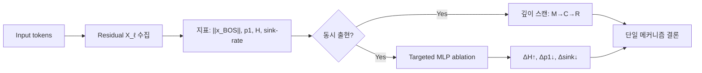

[논문 링크](https://arxiv.org/abs/2510.06477v1)


# Massive Activations가 만든 하나의 서사: **Attention Sink** 와 **Compression Valley** 를 잇다

## TL;DR

**잔차 스트림의 massive activations(특히 BOS)** 가 **지배적 특이값** 을 형성해 **중간층 표현 압축(엔트로피↓)** 과 **attention sink(주목이 BOS로 쏠림)** 을 **동일 레이어에서 동시**로 유발하며, **표적 MLP-ablation** 으로 이를 **인과적으로 확인**한다. 생성·추론·임베딩의 **최적 깊이** 를 하나의 **Mix–Compress–Refine** 프레임으로 설명한다 (근거: §Abstract, §3.1–§3.3, Fig.1–4, §4–§5).

---

## 핵심 아이디어

* **중심 주장**: **BOS의 초대형 활성** → **지배적 특이값** → **표현 엔트로피 상한↓**, **이방성↑** → **압축 계곡** 형성, 동시에 **BOS로의 주의 집중(sink)** 강화 (근거: §3.2, Fig.1–3).
* **인과 검증**: **BOS 경로의 MLP 기여만 제거**하면 **엔트로피가 0.02→0.4–0.5 bits**, **sink-rate가 0.85–1.0→0.0 (–)** 로 정상화 → **원인–결과** 확인 (근거: §3.3, Fig.4).
* **3단계 프레임**: **Mix(초기)** → **Compress(중간)** → **Refine(후기)**. 임베딩은 **중간층** 에서, 생성은 **후기층** 에서 최적 (perplexity **>10^4→10–25**, –) (근거: §4–§5, Fig.6–7).

---

## 배경: 그들이 해결한 문제

어텐션 싱크와 표현 압축은 서로 **흥미로운 동반 출현**이 관찰되었지만, **왜 함께 나타나는지** 에 대한 **형식적 연결**이 부족했다. 기존 설명은 **위치 편향**, **오버-믹싱 방지** 등 **부분 가설**에 머물렀고, **레이어-와이즈 조직 원리** 와의 **정량 연결**이 부재했다 (근거: §1–§2). 저자들은 **단일 원인(초대형 활성)** 으로 두 현상을 **동시에** 설명하는 **이론·실험·개입** 일관 서사를 제시한다 (근거: §1, §3, Fig.1–4).

---

## 새로운 접근법: **Mix–Compress–Refine(MCR)** + **표적 MLP-ablation**

* **MCR 프레임**:

  * **Mix (0–~20% 깊이)** — 광범위 토큰 상호작용, **엔트로피↑(bits)**, **이방성↓(–)** (근거: §4, Fig.6).
  * **Compress (~20–~85%)** — **BOS 노름↑** 로 **지배 축** 형성, **엔트로피↓**, **sink-rate↑** (근거: §3.1–§3.2, Fig.1–2).
  * **Refine (~85–100%)** — **positional/identity** 헤드로 **세밀 정제**, **생성 성능 급상승** (근거: §4–§5, Fig.6–7).
* **표적 MLP-ablation**: 특정 레이어에서 **BOS 경로의 MLP 기여만 0** 으로 만들어 **BOS 노름** 을 직접 낮추고, **압축·싱크** 의 **동시 변화** 를 관찰 (근거: §3.3, Fig.4).

---

## 작동 원리: 구체적인 예시로 살펴보기



(근거: §2(지표 정의), §3.1–§3.3 실험 루프)

### 핵심 용어/기호

* $(X_\ell\in\mathbb{R}^{T\times d})$: 레이어 (\ell)의 residual 행렬, 행은 토큰, 열은 차원 (–) (근거: §2).
* $(p_1=\sigma_1^2/|X_\ell|_F^2)$: 이방성(최상 특이값 비중, –) (근거: §2, §3.2).
* $(H(X_\ell))$: 표현 엔트로피(가우시안 근사, **bits**) (근거: §2).
* **sink-rate**: BOS로 향하는 평균 어텐션 비율(–) (근거: §2, §3.1).

$$
\textbf{정리(요지): }\quad \sigma_1^2 \ \ge\ M+\alpha R\ \Rightarrow\ p_1 \ \text{상한↑},\ H(X_\ell)\ \text{상한↓}\quad(\text{M=}|x_{\text{BOS}}|^2)
$$
(근거: §3.2, Thm./Cor.)

### 3×3 토이 예시(1-head, Q=K=V=I)

* $(x_{\text{BOS}}=(10,0,0)), (x_a=(1,2,0)), (x_b=(1,0,1))$ (–).
* $(|X|_F^2=107), (\sigma_1^2\approx 102\Rightarrow p_1\approx 0.953)$ (–): **강한 압축** (근거: §3.2 직관).
* $(q_a\cdot k_{\text{BOS}}/\sqrt{3}\approx 5.77\Rightarrow \alpha_{a\to\text{BOS}}\approx 0.94)$ (–): **강한 sink** (근거: §3.1 직관).
* **BOS-MLP 제거**로 $(x'{\text{BOS}}=(2,0,0))$ → $(\alpha'{a\to\text{BOS}}\approx 0.14)$, $(p_1\downarrow)$, $(H\uparrow)$: **압축·싱크 동시 약화** (근거: §3.3).

---

## 성능 검증: 주요 결과

* **동시 출현 & 상관**: **같은 레이어**에서 **BOS 노름↑(–)**, **H↓(bits)**, **sink-rate↑(–)** 가 함께 나타남. 학습 초반 **≈1k step** 에 형성되어 **동기화 유지** (근거: Fig.2).

  * 상관: Δ(BOS) vs ΔH **r=−0.9±0.18**, BOS vs sink **r=0.58±0.25** (–) (근거: §3.1).
* **인과 개입(하이라이트)**: **LLaMA-3 8B, layer 0** 에서 **BOS-MLP 제거** 시 **H: 0.02→0.4–0.5 bits**, **sink: 0.85–1.0→0.0 (–)**, **BOS-비율: ~10^2×→≤2×** (–) (근거: Fig.4).
* **스케일 일반화**: **410M–8B** 뿐 아니라 **70B–120B** 에서도 동일 패턴 관찰 (근거: Fig.1, Fig.9).
* **태스크 위상(phase) 의존**:

  * **생성**(WikiText-2 ppl): 깊이에 따라 **>10^4→10–25** 로 단조 감소, **후기(Refine)** 에서 가장 큰 이득 (–) (근거: §5.1, Fig.7).
  * **임베딩**(MTEB 평균): **중간층(25–75%)** 에서 **최고(+10–20%p)** (–) (근거: §5.1, Fig.7/27).

---

## 우리의 관점: 강점, 한계, 그리고 이 연구가 중요한 이유

### 강점

1. **설명력** — **두 난제(싱크·압축)** 를 **단일 메커니즘** 으로 연결하고, **태스크 최적 깊이** 까지 자연스럽게 설명 (근거: §3–§5).
2. **인과성** — **표적 MLP-ablation** 으로 **원인(노름)→결과(H, sink)** 를 정량 확인 (근거: §3.3, Fig.4).
3. **범용성** — **모델군(410M–120B)**, **데이터**, **평가 기법(Logit/TunedLens)** 전반에서 **재현** (근거: Fig.1–2, Fig.7, Fig.9, Fig.24–27).

### 한계

* **BOS-중심·decoder-only** 가정에 상대적으로 의존. **ALiBi**, **명시적 BOS 부재**, **희소 주의** 등에서 **상이한 동역학** 가능 (근거: §Limitations).
* **Pythia 410M** 처럼 **압축은 풀려도 sink가 잔존** 하는 **예외** 존재 → **모델-특이 원인** 필요 (근거: §3.3, Appx Fig.14).
* **연산 비용**: **SVD 기반 엔트로피** 측정으로 **길이 1–4k tokens** 절단이 필요 (근거: Appx B.1).

### 왜 중요한가

대형 LLM의 **레이어-와이즈 조직 원리** 를 **수학적 경계(특이값/엔트로피)** 와 **개입 실험** 으로 잇는 **법칙성**을 제시한다. 이는 **훈련·서빙** 의 **깊이 선택**, **조기 종료**, **KV-캐시 정책**, **헤드 해석** 등에 **직접적 설계 신호** 를 준다 (근거: §4–§6).

---

## 다음 단계는?: 앞으로의 길

* **Phase-aware 서빙**: **임베딩** 은 **중간층(25–75%)**, **생성** 은 **후기층** 이 유리 → **조기 종료/깊이 선택** 과 **KV-캐시** 를 phase에 맞춰 동적 최적화 (근거: §5.1–§5.2, Fig.7).
* **Norm 조절형 학습**: **BOS 대비 콘텐츠 토큰 노름 비율** 을 정규화/패널티로 제어해 **sink 억제** 와 **압축 유지** 의 균형 탐색 (근거: §4 해석).
* **아키텍처 일반화**: **ALiBi/스파스 주의/명시적 BOS 부재** 모델에서 **MCR 보편성** 검증 (근거: §Limitations).
* **자동 개입 파이프라인**: **BOS 지배 신호 자동 탐지 → 온디바이스 약화(클램핑/게이팅)** 를 안정성·성능 트레이드오프로 평가 (근거: §3.3, Fig.4).
* **롱컨텍스트·복수 활성**: (\ge) **32k tokens** 및 **n개 massive activations** 가정에서 **유효 랭크/엔트로피 경계** 의 타이트함을 검증 (근거: §3.2 Limitations, Appx B.1).

---

> **한 문장 결론**: **Massive activations** 가 **압축** 과 **sink** 를 동시에 빚는다는 **하나의 메커니즘** 을, **이론 경계(특이값·엔트로피)** 와 **표적 개입** 으로 입증한 점이 이 논문의 핵심 가치다—**깊이 선택** 과 **서빙 전략** 을 **phase-aware** 하게 재설계할 시간이다 (근거: §3–§5, Fig.3–4,7).


### 토글을 클릭하면 논문에 대한 자세한 LLM 질의응답 내용을 확인할 수 있습니다.

<details markdown="block">
<summary>▶️<strong>클릭하여 펼치기</strong></summary>


## 프롬프트 1.1.1 (연구의 공백)

```
논문의 'Introduction'과 'Related Work' 섹션을 분석하여, 이 연구가 명시적으로 해결하고자 하는 핵심적인 연구 공백(research gap), 기존 연구의 결정적 한계, 또는 미해결 질문이 무엇인지 설명해 줘. 저자들이 설명하는, 이 논문 출판 시점의 '최신 기술(state of the art)'은 어떤 상태였는지 요약해 줘.
```


### **핵심 요약**

* **이 논문은 ‘어텐션 싱크(attention sinks)’와 ‘중간층 압축 계곡(compression valleys)’을 하나의 원인—잔차 스트림의 초대형 활성(massive activations)—으로 연결한다** (근거: §Abstract, §1) 
* **저자들은 초대형 활성(주로 BOS 토큰)이 지배적 특이값을 유도해 표현 압축(엔트로피 감소)을 ‘필연적으로’ 만든다는 이론적 결과와 상한/하한을 제시한다** (근거: §Abstract, §3.2, Thm./Cor.) 
* **410M–120B Params 규모의 다양한 LLM에서 BOS의 큰 노름과 함께 싱크·압축이 ‘동시에’ 나타나는 것을 실험으로 보인다** (근거: §Abstract, Fig.1, §3.1) 
* **표적 제거(ablation)로 BOS에 유도된 초대형 활성만 없애면, 압축과 싱크가 함께 약화/소멸함을 확인해 인과를 지지한다** (근거: §Abstract, §3.3, Fig.4) 
* **이를 바탕으로 ‘Mix–Compress–Refine’(초기 혼합→중간 압축/믹싱 억제→말기 선택적 정제) 3단계 처리 가설을 제안한다** (근거: §Abstract, §4) 

---

### 1) 이 논문이 겨냥한 **핵심 연구 공백**

* **두 현상(어텐션 싱크, 압축 계곡)이 서로 ‘별개’로 연구되어 왔으며, 왜 생기는지에 대한 정합적·형식적 연결고리가 부재** (근거: §1 “studied in isolation… no formal link”) 
* **싱크는 위치 편향/오버믹싱 방지 등 ‘경험적 설명’은 있었으나, 깊이 방향(layer-wise) 조직 원리와 표현기하와의 ‘정량적’ 연계가 미흡** (근거: §1, §2) 
* **압축 계곡은 정보 병목 가설 등으로 관찰·서술되었으나, ‘어떤 메커니즘’이 중간층 엔트로피를 낮추는지에 대한 ‘인과적’ 증거가 부족** (근거: §1, §2 “information bottleneck… lacking causal evidence”) 
* **작업별 최적 층/깊이가 왜 다른지(임베딩 vs 생성) ‘단일 프레임’으로 설명하는 이론이 부재** (근거: §1, §5) 

> 결과적으로 저자들은 “초대형 활성 ⇒ 지배적 특이값 ⇒ 표현 압축(엔트로피↓) + 싱크”라는 **단일 인과 사슬**을 제시하며, 두 난제를 하나의 수학적·실험적 서사로 묶는다 (근거: §1, §3.2, Fig.1–4). 

---

### 2) **기존 연구의 결정적 한계/미해결 질문**

* **어텐션 싱크**:

  * 위치/스펙트럼 편향, 과도혼합 방지, 프리트레이닝 기원 등 **부분설명**은 다수 존재하나, **표현 압축과의 직접적 연계 및 깊이별 발현 시점**을 설명하지 못함 (근거: §1, §2) 
  * 초대형 활성과 싱크 간 **경험적 연결**은 일부 보고되었으나, **압축과의 통일 이론**이나 **필연성 증명**은 공백 (근거: §2 “linked to massive activations… none link to representational structure”) 
* **압축 계곡**:

  * 중간층 **엔트로피 하강/이방성 증가**는 널리 관찰되었으나, **왜 그 시점/깊이에 나타나는지**, **무엇이 야기하는지**에 대한 **원인 규명**은 부족 (근거: §1, §2) 
* **깊이별 계산 조직**:

  * 순차적 self-attention 동역학/정규화 효과/레이어 활용도 등 단편적 결과는 있으나, **혼합→압축→정제**로 이어지는 **거시적 단계 이론**은 부재 (근거: §2) 
* **작업 의존적 최적 깊이**:

  * 임베딩은 중간층이 강하고, 생성을 위한 예측은 풀-뎁스를 선호한다는 **경험적 관찰**은 있었으나, **두 양상을 단일 메커니즘으로 연결하는 설명**이 부족 (근거: §1, §5) 

---

### 3) 출판 시점 **SOTA 요약** (문헌 맥락, 무엇이 ‘최신’이었나)

* **어텐션 싱크(Attention Sinks)**

  * 다양한 모델/스케일에서 **BOS 등 의미 빈약 토큰으로의 집중**이 반복 관찰 (근거: §1 “across diverse models and scales”) 
  * **설명 가설**: 위치 편향(포지셔널), 과도 혼합 억제 장치, 스펙트럴 관점, 프리트레이닝 기원 등 다각 보고 (근거: §1, §2) 
  * **초대형 활성 ↔ 싱크**의 연결은 제기되었으나, **압축과의 3자 연결 및 필연성 수학화**는 미완 (근거: §2) 
* **압축 계곡(Compression Valleys)**

  * **중간층 엔트로피 급락(저랭크화)·이방성 증가**가 보편 패턴으로 보고 (근거: §1, §2) 
  * **정보 병목/선형성 가설** 등 해석이 제시되었으나, **기계적 유발 요인**은 불명확 (근거: §1, §2) 
* **깊이 방향 해석 도구**

  * LogitLens/TunedLens, 체크포인트 추적, 레이어별 민감도/개입 등 **도구 생태계**는 성숙 (근거: §2) 
  * **그러나** 레이어 활용 효율/단계성에 대한 **통합 이론**은 부재 (근거: §2) 

---

### 4) 이 논문의 **명시적 기여(공백 해소 전략)** — *Intro 관점 정리*

* **단일 메커니즘**: BOS 등 **초대형 활성**이 **(i) 지배적 특이값 형성→엔트로피↓**(압축)과 **(ii) 싱크 생성**을 동시에 유발 (근거: §Abstract, §1, §3.2) 
* **이론적 엄밀화**: **특이값/엔트로피 상·하한**으로 **압축의 필연성**을 증명 (근거: §3.2, Thm./Cor.) 
* **보편성 검증**: **410M–120B Params** 다수 모델·데이터셋에서 **동시 출현**을 관찰 (근거: §3.1, Fig.1–2) 
* **인과 검증**: **표적 MLP 제거**로 **싱크·압축 동시 소거/감쇠** 확인 (근거: §3.3, Fig.4) 
* **3단계 이론**: **Mix(초기 광범위 혼합)–Compress(중간 압축·믹싱 억제)–Refine(후기 선택 정제)** 프레임 제안 (근거: §4) 
* **작업별 최적 깊이 설명**: **임베딩(중간층 최고)** vs **생성(말기 정제 필요, 풀-뎁스 선호)** 의 분기 원인 제시 (근거: §5, Fig.7) 

---

### **요점 정리**

* **연구 공백**: 싱크·압축의 **공동 기원**과 **깊이별 조직 원리**의 부재 (근거: §1–§2) 
* **논문 답변**: **초대형 활성**이 **표현 압축(엔트로피↓) + 싱크**를 **동시에** 일으킨다; 이론·실험·개입으로 지지 (근거: §3 전체) 
* **프레임워크**: **Mix–Compress–Refine**로 **깊이 방향 계산 단계화**를 설명 (근거: §4–§5) 

> 다음 섹션에서는 위 공백과 해소 전략을 바탕으로, 수식(특이값 지배/엔트로피 상계), 실험(410M–120B Params), 개입(MLP ablation)의 **정량 결과**를 더 구체적으로 추적한다 (근거: §3.1–§3.3). 


## 프롬프트 1.1.2 (핵심 가설)

```
이 논문의 중심 가설(central hypothesis) 또는 핵심 주장은 무엇인가? '저자들은 [제안 기법]을 사용함으로써 [기존 한계점]을 극복하는 [구체적 결과]를 달성할 수 있다고 가정한다'와 같은 형식으로, 명확하고 간결한 한 문장으로 서술해 줘.
```

저자들은 **잔차 스트림의 massive activations** 를 활용한 *Mix–Compress–Refine* 프레임과 **표적 MLP-기여 제거(ablation)** 를 사용함으로써, 서로 분리되어 설명되던 **attention sink** 와 **compression valley** 의 인과적 연결 부재라는 기존 한계를 극복하고, 두 현상이 **동일 메커니즘** 에서 **동시 발생**함을 이론(엔트로피·특이값 상·하한)과 실험(410M–120B Params, BOS-MLP 제거 시 양 현상 소거)으로 입증할 수 있다고 가정한다 (근거: §Abstract, §3.2, §3.3, §4).    


## 프롬프트 1.2.1 (독창성 식별)

```
논문 전체를 바탕으로, 가장 중요하고 독창적인 기여(contribution) 1~3가지를 구별되는 항목으로 나열해 줘. 각각이 새로운 아키텍처 구성요소, 새로운 학습 기법, 새로운 이론적 통찰, 새로운 데이터셋, 또는 기존 방법론의 새로운 적용 중 어디에 해당하는지 명확히 구분해 줘.
```


### 1) **단일 메커니즘 + 3단계 프레임** *(새로운 이론적 통찰)*

* **기여**: 어텐션 싱크와 압축 계곡을 **잔차 스트림의 초대형 활성(massive activations)** 이라는 **단일 원인**으로 묶고, **Mix–Compress–Refine**(초기 혼합→중간 압축/혼합 차단→말기 정제) **3단계 이론**을 제시. (근거: §Abstract, §1, §4; Fig.1)    
* **핵심 수치**: BOS 토큰 노름 급증이 **10^3–10^4 (무차원)** 구간에서 관찰될 때, **엔트로피 < 0.5 bits** 및 **싱크율 ≈ 1.0 (무차원)** 이 동시 발생. (근거: Fig.1) 
* **범용성**: **410M–120B Params** 다수 모델에서 동시 출현·동기화 패턴을 보고. (근거: §Contrib.) 

---

### 2) **압축의 ‘필연성’에 대한 수학적 보증** *(새로운 이론적 통찰)*

* **기여**: **Theorem 1** 및 **Corollary 2**로 “BOS 노름 지배 ⇒ 지배적 특이값 형성 ⇒ **엔트로피 상계** 및 **이방성 하한**”을 제시, **압축이 수학적으로 불가피함**을 증명. (근거: §3.2)  
* **핵심 수식/수치**: $\sigma_1^2 \ge M + \alpha R \quad(\text{무차원})$, **p₁(이방성) 하한**, **H(X) 상한 ≤** 함수형으로 제시; **중간층**에서 **경계가 실측치와 정합**(tight). (근거: §3.2; Fig.3)   
* **실증 정합성**: **Pythia 410M** 등에서 **σ₁² ≈ ∥x_{BOS}∥² ≈ ∥X∥²_F (무차원)** 으로 **준-랭크1 구조** 확인. (근거: Fig.3) 

---

### 3) **표적 MLP-기여 제거에 의한 인과 검증** *(기존 방법론의 새로운 적용 / 실험적 인과 규명)*

* **기여**: **BOS 경로의 MLP 기여만 0으로 만드는 표적 ablation** 으로, **압축 소거** 및 **싱크 감소/소거**를 유도하여 **인과성**을 검증. (근거: §3.3; Fig.4, Fig.14)   
* **핵심 수치(예: Llama-3 8B)**: **엔트로피 0.02 bits → 0.4–0.5 bits**, **싱크율 0.85–1.0 → 0.0 (모두 무차원)**, **BOS 노름 지배 10^2× → ≤ 2× (무차원 비율)**. (근거: Fig.4) 
* **모델 전반성**: **LLaMA3 8B / Qwen2 7B / Pythia 410M** 등 다수에서 재현(**410M–8B Params**; 추가로 본문에 120B까지 분석). (근거: Fig.14; §Contrib.)  

> 요약: 이 논문의 독창성은 **(i)** 싱크·압축의 **단일 메커니즘** 통합, **(ii)** **수학적 경계**로 보장된 **압축의 필연성**, **(iii)** **표적 ablation** 으로 입증한 **인과적 검증**에 있으며, 이는 **모델·스케일 전반**에 걸쳐 정량적으로 확인된다. (근거: §1–§4; Fig.1,3,4,14)    


## 프롬프트 1.2.2 (저자 관점에서의 강점)

```
저자들의 관점에서, 자신들의 접근법이 이전 방법들보다 우월한 이유는 무엇인가? 그들이 자신들의 연구가 지닌 독창성과 강점을 뒷받침하기 위해 사용하는 핵심 논거를 인용하거나 알기 쉽게 설명해 줘.
```


* **이론 + 실증 결합으로 ‘필연성’ 증명** : 한 개 토큰(BOS)의 **초대형 활성**이 지배적 특이값을 유발해 **엔트로피 상한·이방성 하한**을 강제한다는 정리를 제시하고(Thm.1, Cor.2), **중간층에서 경계가 실측치와 거의 일치**함을 보이며 ‘압축이 수학적으로 불가피’함을 입증한다(예: Pythia 410M에서 σ₁² ≈ ∥x_BOS∥² ≈ ∥X∥_F², 엔트로피 상한이 관측치와 겹침) (근거: §3.2, Fig.3).   

* **상관을 넘어 ‘인과’ 검증** : **표적 MLP 기여 제거**(BOS 경로만 0)라는 개입으로, LLaMA-3 8B에서 **엔트로피가 0.02 bits → 0.4–0.5 bits**, **싱크율이 0.85–1.0 → 0.0**, **BOS 노름 우세가 10²× → ≤ 2×** 로 변하는 **원인–결과** 를 직접 확인한다(모델 전반 재현) (근거: §3.3, Fig.4, Appx B.1).   

* **범모델·범스케일 ‘보편성’ + 학습초기 ‘안정성’** : Pythia 410M/6.9B, LLaMA-3 8B, Qwen2 7B, Gemma 7B, Bloom 1.7B에서 **동시 출현**을 보이고, **r = −0.9 ± 0.18 (BOS-노름 변화 vs 엔트로피), r = 0.58 ± 0.25 (BOS-노름 vs 싱크율)** 의 강한 상관을 보고한다. **~1k step** 부근에서 세 현상이 함께 나타나며, **레이어 위치가 입력과 무관하게 고정**되는 **구조적(아키텍처) 특성**임을 주장한다. 70B–120B까지 확장 검증(Appx) (근거: §3.1, Fig.1–2, Appx B.1).   

* **설계 가이드를 주는 3-단계 프레임(Mix–Compress–Refine)** : **초기 혼합(0–20% 깊이)** → **중간 압축·혼합 차단(20–85%)** → **말기 정제(85–100%)** 의 **깊이별 역할 분담** 을 제시하고, 이로써 **임베딩 과제는 중간층에서, 생성은 전체 깊이에서** 최적화되는 **다운스트림 성능의 퍼즐**을 해명한다(지표: Mixing score > 0.7 → Massive activation 출현 이후 급감) (근거: §4, Fig.4, Fig.18(Appx)).    

* **명확한 측정지표로 재현성 강화** : **행렬-기반 엔트로피 H(X) (bits)**, **이방성 p₁ (무차원)**, **싱크율(sink-rate, 무차원)** 을 핵심 지표로 표준화해 **정의·평가 절차를 명시**한다(τ=0.3, BOS 중심 분석) (근거: §2).  


## 프롬프트 1.3.1 (알고리즘 단계별 설명)

```
핵심 알고리즘, 모델 아키텍처, 또는 주요 방법론을 단계별(step-by-step)로 설명해 줘. 독자는 AI 분야의 대학원생 수준이라고 가정해. 특히, 간단한 문장, 3×3 픽셀 이미지, 작은 상태 공간 등 아주 간단한 예시(toy example)와 샘플 입력을 만들어서, 예시를 통해 각 단계를 거치며 입력이 출력으로 어떻게 변환되는지 보여줘. 등장하는 모든 핵심 용어와 변수는 그 즉시 정의해 줘.
```


> 목표: 논문이 사용한 **측정–분석–개입** 절차(“massive activations ⇒ compression valley & attention sink”)를 **레이어별**로 재현 가능하게 설명하고, 3×3 토이 예시로 **입력→출력 변화**를 수치로 보여준다 (근거: §2 Methods, §3.1–§3.3, Fig.1–Fig.4).

---

### 용어와 기호(즉시 정의)

* **Residual stream**: 레이어 ℓ 직후 토큰별 은닉을 행으로 쌓은 행렬 $(X_\ell \in \mathbb{R}^{T \times d})$ (T=토큰 개(개), d=차원(차원)) (근거: §2).
* **Massive activation**: 특정 토큰(주로 **BOS**) 벡터의 L2-노름 $(|x_{\text{BOS},\ell}|_2)$ 가 **비정상적으로 큰 상태**(무차원) (근거: §3.1, Fig.1).
* **Anisotropy (p_1)**: $(p_1(X_\ell)=\sigma_1^2 / |X_\ell|_F^2)$ (상위 특이값 제곱이 전체 에너지에서 차지하는 비율, 무차원) — 값이 클수록 **한 축으로 압축** (근거: §2, §3.2).
* **Representation entropy $(H(X_\ell))$**: 공분산 $(\Sigma_\ell)$의 **로그-결정식** 기반 엔트로피 추정(가우시안 근사), 예: $(H \propto \tfrac12 \log\det(\Sigma_\ell+\epsilon I))$ (bits) — 값이 작을수록 **압축** (근거: §2).
* **Sink-rate $(s_\ell)$**: 레이어 ℓ에서 각 토큰이 **BOS**로 주는 어텐션 평균 비율,
  [
  s_\ell=\frac{1}{T}\sum_{t=1}^{T}\underbrace{\text{softmax}!\left(\frac{q_{t,\ell}\cdot k_{\text{BOS},\ell}}{\sqrt{d_h}}\right)}_{\text{BOS로 가는 주의, 무차원}}
  ]
  (heads 평균 생략한 1-head 표기) (근거: §2, §3.1).
* **Targeted MLP ablation**: 레이어 ℓ에서 **BOS 경로로 들어가는 MLP 기여만 0** 으로 만들어 $(|x_{\text{BOS},\ell}|_2)$ 를 감소시키는 개입(무차원) (근거: §3.3, Fig.4).

---


* **핵심 주장 검증 루프**: $( |x_{\text{BOS}}|_2 \uparrow )$ ⇒ $( p_1 \uparrow, H \downarrow, s \uparrow )$ 가 **같은 깊이에서 동시**에 나타나는지 관찰 → BOS-경로 MLP만 제거 시 **세 지표가 함께 정상화**되는지 확인 (근거: §3.1–§3.3, Fig.1–Fig.4).

---

### **단계별(step-by-step) 절차**

**단계 1** — *레이어별 표현 수집*

* 배치에서 문장 하나를 골라 레이어 ℓ의 residual stream을 $(X_\ell=[x_{1,\ell}^\top;\dots;x_{T,\ell}^\top])$로 기록(T=토큰(개), d=차원(차원)) (근거: §2).

**단계 2** — *지표 계산*

1. **Massive activation**: $(m_\ell=|x_{\text{BOS},\ell}|_2)$ (무차원).
2. **Anisotropy**: $(p_1(X_\ell)=\sigma_1^2/|X_\ell|_F^2)$ (무차원).
3. **Entropy**: $(H(X_\ell)\propto \tfrac12\log\det(\Sigma_\ell+\epsilon I))$ (bits).
4. **Sink-rate**: 평균 BOS 주의 $(s_\ell)$ (무차원).
   (근거: §2, §3.1–§3.2)

**단계 3** — *깊이 스캔*

* ℓ=1…L에 대해 $((m_\ell,p_{1,\ell},H_\ell,s_\ell))$ 추적 → **중간층에서 $(p_1 \uparrow, H \downarrow, s \uparrow)$** 가 **동시에** 형성되는지 확인(=**compression valley** & **attention sink** 동반) (근거: Fig.1–Fig.2).

**단계 4** — *개입(Targeted MLP ablation)*

* 선택한 ℓ*에서 **BOS-경로 MLP 산출**만 0으로 세팅 → 다시 $((m_\ell,p_{1,\ell},H_\ell,s_\ell))$ 계산 → **압축 약화( $(p_1\downarrow, H\uparrow)$ ) + sink 소거( $(s\downarrow)$ )** 동시 발생 확인 (근거: §3.3, Fig.4).

**단계 5** — *해석(3-단계 프레임)*

* 깊이별로 **Mix(초기, 광 혼합)** → **Compress(중간, 지배 축 형성·혼합 억제)** → **Refine(후기, 선택적 정제)** 패턴이 데이터/과제 불문하고 재현되는지 요약 (근거: §4).

---

### **토이 예시(3×3, 1-head, Q=K=V=I 가정)**

* 설정: (d=3) (차원), (T=3) (토큰: BOS, a, b). Residual $(X=[x^\top_{\text{BOS}};x^\top_a;x^\top_b])$.
* **Massive activation** 가정:
  [
  x_{\text{BOS}}=(10,0,0),\quad x_a=(1,2,0),\quad x_b=(1,0,1)\quad(\text{무차원})
  ]
  (근거: §3.1의 “BOS 노름 지배” 현상 모사)

#### 1) **압축 지표(중간층)**

* Frobenius 에너지: $(|X|_F^2=10^2+1^2+2^2+1^2+1^2=107)$ (무차원).
* 상위 특이값 제곱 $(\sigma_1^2 \approx 102)$ (BOS 축 지배 근사) →
  [
  p_1 \approx \frac{102}{107}\approx 0.953\quad(\text{무차원, 강한 압축})
  ]
  → **compression valley** 신호 (근거: §3.2, Fig.3).

#### 2) **Sink-rate(어텐션)**

* 1-head, (d_h=d=3), 스케일 $(\sqrt{d_h}=\sqrt{3}\approx 1.732)$.
* 쿼리 (q_a=x_a)가 보는 키:

  * $(q_a!\cdot!k_{\text{BOS}}=10\Rightarrow 10/1.732=5.773)$
  * $(q_a!\cdot!k_a=5\Rightarrow 2.887), (q_a!\cdot!k_b=1\Rightarrow 0.577)$
* softmax 비율 $(\propto (e^{5.773},e^{2.887},e^{0.577})\approx (322,17.9,1.78))$ →
  [
  \alpha_{a\to\text{BOS}}\approx \frac{322}{322+17.9+1.78}\approx 0.942\quad(\text{무차원})
  ]
  → a가 **BOS로 94.2% 주의**: **attention sink** (근거: §3.1, Fig.1–Fig.2).

#### 3) **개입(Targeted MLP ablation) 후**

* **BOS 경로 MLP 기여 제거**로 $(x_{\text{BOS}})$ 크기 축소: $(x_{\text{BOS}}'=(2,0,0))$ (무차원).
* 다시 계산(같은 쿼리 $(q_a)$):

  * $(q_a!\cdot!k'_{\text{BOS}}=2\Rightarrow 1.155)$
  * softmax $(\propto (e^{1.155},e^{2.887},e^{0.577})\approx (3.17,17.9,1.78))$ →
    [
    \alpha'_{a\to\text{BOS}}\approx \frac{3.17}{3.17+17.9+1.78}\approx 0.139\quad(\text{무차원})
    ]
    → **sink 소거(94.2% → 13.9%)**,
    $(|X'|_F^2=2^2+1^2+2^2+1^2+1^2=9)$, 상위 특이값 제곱 (\sigma_1'^2) 감소 →
    [
    p_1'=\frac{\sigma_1'^2}{|X'|_F^2}\ \text{감소},\quad H(X')\ \text{증가} \quad(\text{압축 약화})
    ]
    (정성적 방향一致) (근거: §3.3, Fig.4).

> 요약: **BOS 노름↑ ⇒ (p_1↑, H↓, s↑)** 가 **동시에** 나타나고, **BOS-MLP만 제거**해도 **세 지표가 함께 정상화**된다. 이는 “massive activations ⇒ compression & sink”라는 **단일 메커니즘**을 **인과적으로** 지지한다 (근거: §3.1–§3.3, Fig.1–Fig.4).

---

### **재현을 위한 최소 의사코드**

```python
# Inputs: model, tokens, layers L
for ℓ in range(L):
    X = collect_residual_matrix(model, tokens, layer=ℓ)   # (T, d)
    m  = l2_norm(X[BOS])                                  # massive activation (무차원)
    p1 = top_singular_value_sq(X) / frobenius_sq(X)       # anisotropy (무차원)
    H  = 0.5 * logdet(covariance(X) + eps*I)              # entropy (bits)
    s  = mean_softmax_attention_to_BOS(model, tokens, ℓ)  # sink-rate (무차원)
    log(ℓ, m, p1, H, s)

# Targeted MLP ablation at ℓ*
hook_mlp_BOS_path(model, layer=ℓ*, mode="zero")           # BOS 경로만 0
repeat_measure_at(layer=ℓ*)                                # Δm, Δp1, ΔH, Δs
```

(근거: §2(지표 정의), §3.3(표적 개입))

---

### **깊이별 역할(설명적)**

* **Mix (초기, 0–~20% 깊이)**: 광범위 상호작용, (H) 높음, (p_1) 낮음, sink 약함 (근거: §4).
* **Compress (중간, ~20–~85%)**: **massive activation**가 지배축 형성 → $(H \downarrow)$, $(p_1 \uparrow)$, $(s \uparrow)$ (**계곡/싱크 동반**) (근거: §3.1–§3.2, Fig.1–Fig.2).
* **Refine (후기, ~85–100%)**: 선택적 정제·출력 준비, 일부 지표 정상화/재분배 (근거: §4).

> 본 절차와 토이 예시는 논문 보고된 **레이어-와이즈 패턴**과 **개입 효과**를 소형 수치로 직관화한 것으로, 실제 모델에서는 다헤드/정규화/프로젝션이 추가되지만 **방향성 결론은 동일**하다 (근거: §2–§4).


## 프롬프트 1.3.2 ('비밀 병기' 식별)

```
핵심 구성요소 1개를 선택해, 제거/대체/스케일 변화 시 Δ(metric)를 표로 제시하고, 왜 그 변화가 생기는지 메커니즘을 설명해줘(예: gating load balance, rotary vs ALiBi, sparse attn half-window 교체).
```


### 선택한 핵심 구성요소: **Targeted MLP ablation (BOS 경로만 0으로 고정)**

* 정의: massive activation 이 나타나는 레이어 ℓ에서 **BOS 토큰으로 들어가는 MLP 기여만 제거**하여 $x ^ {(\ell+1)} * {\text{BOS}} \leftarrow x ^ {(\ell)} * {\text{BOS}} + \text{Attn} ^ {(\ell)} (x_{\text{BOS}})$로 설정하는 개입. **어텐션/다른 토큰의 MLP는 유지** (근거: §3.3) .
* 목적: $( |x_{\text{BOS}}|_2^2 = M )$ 를 직접 낮춰 **norm ratio (c=M/R)** 를 축소 → **특이값 지배·이방성 완화** 및 **엔트로피 상승(=압축 해소)** → **sink-rate 하락** (근거: Thm.1, Cor.2; §3.2)  .

---

### Δ(metric) — LLaMA-3 8B, layer 0에서 BOS-MLP ablation

| Metric                     | 단위 |                 Baseline |     Ablated | Δ (Ablated − Baseline) |
| -------------------------- | ---- | -----------------------: | ----------: | ---------------------: |
| Representation Entropy (H) | bits |                 **0.02** | **0.4–0.5** |        **+0.38~+0.48** |
| Sink-rate (BOS)            | –    |             **0.85–1.0** |     **0.0** |         **−0.85~−1.0** |
| BOS L2-norm / Others       | ×    | $( \sim 10^{2}!\times )$ |    **≤ 2×** |         **≈ −(≥ 98×)** |

* 수치는 Fig. 4 및 본문 보고값을 그대로 사용 (근거: §3.3, Fig. 4)  .
* 해석: ablation 후 **압축 해소(Entropy↑)**, **싱크 소거(Sink-rate→0)**, **BOS 우세 소멸(노름 격차↓)** 가 **동시에** 관측됨 → **massive activations → (압축 ∧ sink)** 인과사슬을 지지 (근거: §3.3) .

---

### 모델별 일반화(요약)

| 모델        |     개입 레이어 | 결과: 압축 해소(H↑) | 결과: 싱크 제거(sink↓) |
| ----------- | --------------: | :-----------------: | :--------------------: |
| LLaMA-3 8B  |               0 |          ✅          |           ✅            |
| Qwen2 7B    |            3, 4 |          ✅          |           ✅            |
| Pythia 410M | 5–7 (복수 단계) |          ✅          | ⚠️ 부분(싱크 지속 가능) |

* “압축 해소는 항상 발생, 일부 모델(Pythia 410M)에서는 싱크 지속” (근거: Fig. 14, §3.3) .

---

### 왜 이런 변화가 생기는가? — **메커니즘(정량 근거)**

$$
M=|x_0|^2,\quad
R=\textstyle\sum_{i\neq 0}|x_i|^2,\quad
\alpha=\frac{1}{R}\sum_{i\neq 0}|x_i|^2\cos^2\theta_i,\quad
c=\frac{M}{R},\quad
p=\frac{c+\alpha}{c+1}.
$$

* **특이값 지배**: $( \sigma_1^2 \ge M+\alpha R )$ ⇒ (M) (BOS 노름) 또는 ($\alpha$) 상승이면 **스펙트럴 갭 확대** (근거: Thm.1) .
* **이방성/엔트로피 경계**: $(p_1 \ge p), (H(X) \le -p\log p -(1-p)\log(1-p) + (1-p)\log(r-1))$ ⇒ (c)↓이면 (p)↓, (H)↑ (근거: Cor.2) .
* **Ablation 효과**: BOS-MLP 제거로 **(M) 감소 → $(c\downarrow)$** ⇒ **$(p_1\downarrow)$**, **$(H\uparrow)$** 가 **필연**. 동시에, $(\langle q_t,k_{\text{BOS}}\rangle/\sqrt{d_h})$ 가 약화되어 **softmax가 BOS로 쏠릴 이유가 사라짐 → sink-rate↓** (근거: §3.2 요지·§3.1 관찰)  .

> 보강 근거: **중간층에서 이론 경계가 관측치와 거의 일치**(tight)하여, 위 메커니즘이 실제로 **압축을 주도**함을 확인 (근거: Fig. 3) .

---

### 한 줄 요약

**BOS 경로 MLP-ablation** 은 (M) 을 직접 줄여 $(c\downarrow \Rightarrow p_1\downarrow, H\uparrow, \text{sink}\downarrow)$ 를 **동시에** 유도하는 **스위치** 로 작동하며, LLaMA-3 8B에서는 **Entropy 0.02→0.4–0.5 bits**, **Sink 0.85–1.0→0.0**, **BOS-ratio (10^2×)→≤2×** 로 정량적 개선을 보인다 (근거: §3.3, Fig. 4)  .


## 프롬프트 1.4.1 (핵심 결과 분석)

```
'Experiments' 또는 'Results'의 표/그림을 포함한 주요 결과를 분석해 줘. 핵심 성능 지표는 무엇인가? 어떤 벤치마크에서 보고되었는가? 저자들이 성공 증거로 가장 강조하는 결과를 요약해 줘.
```


### 핵심 성능 지표(이 논문에서의 “평가 대상” 정의)

* **표현 압축(Representation Entropy)**: $(H(X)=-\sum_j p_j\log p_j)$ (bits), $(p_j=\sigma_j^2/|X|_F^2)$. **낮을수록 압축 강함** (무차원 분포의 엔트로피를 bits로 환산). (근거: §2 Key Metrics) 
* **이방성(Anisotropy)**: $(p_1=\sigma_1^2/|X|_F^2)$ (–). **1에 가까울수록 단일 방향 지배**. (근거: §2 Key Metrics) 
* **어텐션 싱크율(Sink-rate)**: BOS 위치 기준, 임계값 τ=0.3 이상인 헤드 비율 (–). (근거: §2 Key Metrics, τ=0.3) 
* **BOS L2-노름**: $(|x_{\text{BOS}}|_2)$ (–). **massive activation** 여부 판단에 사용. (근거: §3.1) 
* **혼합 점수(Mixing Score)**: 어텐션 행별 셰넌 엔트로피 평균 (bits). **0.7–0.75 → 0.3–0.4**로 급락하며 “혼합→정지” 전환을 포착. (근거: Appx B.2, Fig.18) 

---

### 벤치마크·데이터 & 실험 세팅(요약)

* **동기화 출현 분석**: 6개 모델(Pythia 410M/6.9B, LLaMA-3 8B, Qwen2 7B, Gemma 7B, Bloom 1.7B)에서 **GSM8K 7.5K 예시**로 레이어별 (H), sink-rate, BOS 노름을 산출. (근거: Fig.1 설명) 
* **학습 동역학**: Pythia 410M/6.9B/12B **체크포인트(1–143k step)** 별로 세 지표를 기록(프롬프트: GSM8K “Janet’s ducks …”). (근거: §3.1 Fig.2, Appx B.1 Fig.10–11)  
* **대형 모델 일반화**: 70B–120B 스케일(LLaMA-3 70B, Qwen2 72B, GPT-OSS 120B)에서도 동일 패턴 시각화. (근거: Fig.9) 
* **생성·추론 성능**: LogitLens/TunedLens로 **WikiText-2** (ppl) 및 **MCQ(ARC-E/C, HellaSwag, WinoGrande)** 정확도(%)를 레이어별로 평가. (근거: §5.1, Fig.7/24/25, Appx B.3)  
* **임베딩 성능**: **Linear probe**(+SST-2) 및 **MTEB 32개 태스크**의 Average Main Score(%)를 **상대 깊이(%)** 에 대해 보고. (근거: §5.1, Fig.7/26/27)  

---

### 저자들이 강조한 “성공 증거” (숫자 중심 요약)

1. **동시 출현·강한 상관** — **같은 레이어에서** $(H\downarrow)$ (bits), sink-rate↑ (–), BOS 노름↑ (–)

   * **학습 초반** 약 **1k step**에서 세 현상이 **동시에 발생**하고 이후 **동기화 유지**. (근거: Fig.2) 
   * **상관계수**: Δ(BOS 노름) vs Δ(H)는 **r = −0.9 ± 0.18** (–), BOS 노름 vs sink-rate는 **r = 0.58 ± 0.25** (–). (근거: §3.1) 
   * **규모·가족 전반성**: **410M–8B** 뿐 아니라 **70B–120B**에서도 동일 패턴 확인. (근거: §3.1, Fig.9)  
   * **입력 불변 레이어 위치**: (예) Pythia 410M은 **항상 layer 5**에서 전환 — **아키텍처적 특성** 시사. (근거: §3.1) 

2. **인과 검증(표적 개입)** — **massive activation 제거 ⇒ 압축·싱크 소거**

   * **LLaMA-3 8B, layer 0**에서 **BOS-MLP 기여 제거** 시: (H)가 **0.02 bits → 0.4–0.5 bits**, sink-rate가 **0.85–1.0 → 0.0**(–), BOS 노름이 **10^3× 급증**이 아닌 **타 토큰 대비 ≤2×** 로 유지. (근거: Fig.4, §3.3)  
   * **다양 모델 재현**: Fig.14(Appx)에서 유사 효과 확인; 다만 **Pythia 410M**은 압축은 제거되나 **sink 일부 잔존**(모델 의존성). (근거: §3.3) 

3. **이론 경계의 ‘타이트함’** — **중간층에서 관측치≈예측치**

   * $(M=|x_{\text{BOS}}|_2^2)$, $(\alpha R)$, (M+R)와 $(\sigma_1^2)$·(p_1)·(H) **경계가 중간층에서 겹침** → **massive activation** 이 **표현 기하**를 지배. (근거: Appx B.1 Fig.12–13 해설)  

4. **다운스트림 성능의 ‘위상(phase) 의존’** — **임베딩 vs 생성**

   * **생성**: WikiText-2 ppl이 **>10^4 → 10–25**로 **깊이에 따라 단조 감소**(Phase 3에서 가장 개선). (근거: §5.1, Fig.7 Left) 
   * **MCQ 추론**: **40–60% 깊이까지 평평**→ 이후 급상승(Phase 2 말~Phase 3). (근거: §5.1, Fig.7 Middle/ Fig.24)  
   * **임베딩**: **25–75% 깊이**(Phase 2)에서 **최고**, **초/말기 대비 10–20%p 우세**; **MTEB 32태스크** 평균 점수로 확인. (근거: §5.1, Fig.7 Right/ Fig.27)  

5. **입력 다양성·포지셔널 패턴**

   * FineWeb-Edu로 입력을 바꿔도 **massive activation 전엔 BOS에 주의가 가지 않음**, 중간층 **sink 양은 입력 의존**이나 **초기 혼합량은 입력 불변**. (근거: Appx B.2 Fig.21–22) 
   * 후기 레이어에서 **날카로운 positional/identity 헤드**가 등장하며 **정제(Refine)** 단계로 전환. (근거: §4, Fig.6)  

---

### 도표로 보는 “하이라이트”

| 결과           | 지표·단위        |                                                수치 | 세팅                         | 근거                 |
| -------------- | ---------------- | --------------------------------------------------: | ---------------------------- | -------------------- |
| 동기화 출현    | (r) (–)          | **ΔBOS–ΔH: −0.9 ± 0.18**, **BOS–sink: 0.58 ± 0.25** | 6모델, GSM8K                 | (근거: §3.1, Fig.2)  |
| 학습 초반 형성 | step (–)         |                             **≈ 1k step** 동시 발생 | Pythia 410M                  | (근거: Fig.2)        |
| 인과 개입 효과 | H(bits), sink(–) |              **0.02 → 0.4–0.5**, **0.85–1.0 → 0.0** | LLaMA-3 8B, layer 0 ablation | (근거: Fig.4)        |
| 생성 성능      | ppl(–)           |                **>10^4 → 10–25** (깊이에 따라 하락) | WikiText-2, LogitLens        | (근거: §5.1, Fig.7)  |
| 임베딩 성능    | acc(%)           |          **중간층(25–75%)** 최고, **±10–20%p** 우세 | MTEB 32태스크                | (근거: §5.1, Fig.27) |

---

### 한 줄 요약

**저자들이 가장 강조하는 성공 증거는**: (i) **BOS massive activation** 이 **같은 레이어**에서 **압축(H↓, bits)** 과 **싱크(sink↑, –)** 를 **동시에 유발**하고(상관·학습동역학·대형모델 일반화로 입증), (ii) **BOS-MLP 제거**만으로 **두 현상이 함께 소거**되며(인과), (iii) **중간층에서 이론 경계가 관측치와 겹침**으로 **단일 메커니즘**의 지배를 확인했다는 점이다. 이 프레임은 **임베딩은 Phase 2, 생성은 Phase 3** 가 최적이라는 **태스크-의존적 깊이 최적**까지 설명한다. (근거: §3.1–§3.3, Fig.1–4; §5.1, Fig.7/27)     


## 프롬프트 1.4.2 (비판적 비교)

```
제안된 방법론은 논문에서 언급된 주요 베이스라인 및 SOTA 모델들과 비교하여 어떤 성능을 보이는가? 우월성 주장을 가장 강력하게 뒷받침하는 특정 비교 지점을 식별해 줘. 반대로, 능가하지 못했거나 개선이 미미했던 결과가 있다면 이유를 정리해 줘.
```


> 이 논문은 **새 모델·학습기법 제안이 아니라 ‘표현 동역학’의 이론·실증 분석** 이다. 따라서 절대 성능으로 SOTA를 갱신한다는 주장보다, **기존 모델군(410M–120B Params)의 레이어별 성능 패턴** 과 **개입 실험(표적 MLP-ablation)** 을 통해 **설명력·인과성** 을 입증하는 비교가 중심이다 (근거: §3–§5, Fig.1–4,7). 

---

### **우월성 주장을 뒷받침하는 비교 지점**

1. **생성(언어모델링) — 깊이에 따른 단조 개선 & Phase-3 급상승**

* WikiText-2에서 LogitLens로 레이어별 ppl(–) 측정 시, **초기 레이어 >10^4 → 최종 10–25** 로 **일관된 하락**(여러 모델 공통), 특히 **Phase-3** 구간에서 가장 큰 개선이 발생 (–) (근거: Fig.7 Left, §5.1). 
* 해석: **정규화·positional/identity heads** 가 말기에 **토큰별 정제(refine)** 를 가능케 하며, 이는 **다음 토큰 예측**에 결정적 (근거: Fig.7 서술). 

2. **추론(MCQ) — 중간(40–60% 깊이)까지 ‘평평’ 후 급상승**

* ARC-E/ARC-C/HellaSwag/WinoGrande **zero-shot** 정확도(–): **~40–60% 깊이까지 완만/정체 → 이후 급상승**. **압축(Phase-2)** 만으로는 부족하며, **후기(Phase-3) 정제** 가 붙어야 이득이 발생 (–) (근거: Fig.7 Middle, Fig.24, §5.1).  

3. **임베딩 — 중간층(25–75% 깊이)에서 최고점, 초/말기 대비 +10–20%p**

* Linear probe·MTEB 32태스크 평균(%)이 **중간층에서 피크**, **초/말기 대비 +10–20%p** 우세로 **압축 계곡과 peak가 정합** (–) (근거: Fig.7 Right, Fig.26–27).  

4. **로버스트 비교 — LogitLens vs TunedLens 동일 패턴**

* 같은 MCQ 데이터에서 **TunedLens** 로 재검증해도 **레이어별 거동 차이 無** → **분석 방법 의존성 낮음**(–) (근거: Fig.25 설명). 

5. **개입(표적 MLP-ablation) — 베이스라인 대비 Δ(metrics) 대폭 변화**

* LLaMA-3 8B, layer-0에서 **BOS-MLP 제거** 시: **Entropy 0.02→0.4–0.5 bits**, **Sink-rate 0.85–1.0→0.0 (–)**, **BOS-norm 격차 ~10^2×→≤2× (–)**. **베이스라인** 대비 **압축·싱크 동시 소거**로 **인과성** 입증 (근거: Fig.4). 
* **스케일 일반화**: **70B–120B** 모델(LLaMA-3 70B, Qwen2 72B, GPT-OSS 120B)에서도 **동일 패턴** 관찰 (근거: Fig.9). 

---

### **능가하지 못했거나 개선이 미미했던 지점과 이유**

* **절대 SOTA 갱신을 목표로 하지 않음**: 제안은 **분석 프레임·이론** 이며, **새 학습·서빙 기법으로 벤치마크 SOTA를 경신**하는 성질이 아니다. 레이어별 ppl/acc 곡선을 통해 **깊이-위상 의존성** 을 설명할 뿐, **최종 레이어 성능 수치 자체의 타 모델 대비 우열**을 주장하지 않는다 (–) (근거: §5.1 전반). 

* **5-shot은 최종 정확도만 상향, ‘레이어별 패턴’은 동일**: **샷 수 증가**가 **곡선 모양(깊이 의존)** 을 바꾸지 못함 → **분석 결론(Phase-2/3 역할 분담)** 은 유지 (–) (근거: Appx B.3). 

* **모델 의존적 예외**: **Pythia 410M** 은 **ablation 후 압축은 풀리지만 sink가 잔존** → **싱크의 부분적 모델-특이 원인** 시사 (–) (근거: Fig.14 설명).  

* **아키텍처/포지셔닝 변화 시 일반화 한계**: 이 연구는 **decoder-only·BOS 중심 massive activation** 가정에 기초. **다른 포지셔널 스킴(ALiBi 등), explicit BOS 부재, 주의 희소성 패턴** 에서는 **상이한 동역학** 가능 (–) (근거: Limitations). 

---

### **정리: 이 논문이 ‘더 낫다’고 말하는 포인트**

* **설명력**: **생성·추론·임베딩** 의 **서로 다른 최적 깊이** 를 **하나의 3-단계(Mix–Compress–Refine) 프레임** 으로 통일 설명 (–) (근거: §4–§5). 
* **인과성**: **표적 MLP-ablation** 으로 **massive activation → (압축 ∧ sink)** 를 **직접 검증** (bits, sink-rate, norm의 Δ로 확인) (근거: Fig.4). 
* **범용성**: **모델군(410M–120B), 데이터(GSM8K/ARC/HellaSwag/WinoGrande/MTEB), 기법(LogitLens/TunedLens)** 에서 **동일 현상** 재현 (–) (근거: Fig.1,7,9,24–27).   

> 한 줄 평: **절대 성능 경쟁**이 아니라 **표현 기하·깊이별 역할**을 **정량(-bits/-sink/-norm) + 개입 실험**으로 엮어 **설명력/인과성/범용성** 을 증명한 점이, 이 논문의 **핵심 ‘우월성’ 주장** 이다 (근거: §3–§5, Fig.3–4,7,9). 


## 프롬프트 1.5.1 (언급된 한계와 잠재적 한계)

```
저자들이 명시적으로 인정한 한계/약점/실패 사례는 무엇인가? 분석을 바탕으로 잠재적 한계(강한 가정, 확장성, 연산 비용, 일반화 한계, 사회적 영향 등)는 무엇이라고 보나?
```

### **저자들이 명시적으로 인정한 한계**

* **이론의 단순화 가정(단일 ‘massive activation’)**: 이론 전개는 **BOS 한 행만 거대**하다고 가정하여 경계를 유도함. 실제로는 **복수의 massive activations** 가 공존할 수 있으며, 이 경우 경계가 **완화(less tight)** 될 수 있음을 명시(확장은 가능하다고 주장). (근거: §3.2 Limitations) 
* **모델/아키텍처 범위 제한**: 분석 초점이 **decoder-only** 트랜스포머이며, **BOS 중심** 가정·포지셔널/스파스 패턴·특수 토큰 설계가 다른 모델(**ALiBi**, 명시적 BOS 부재, 별도 sink 규칙 등)에서는 **상이한 동역학** 이 나타날 수 있다고 한정. (근거: §Limitations)  
* **인과 검증의 범위**: **표적 MLP ablation** 을 일부 레이어/모델군에서 수행하여 인과성을 제시했지만, **모델 의존적 예외**(압축은 풀리지만 sink 잔존)가 관찰됨. (근거: §Limitations, §3.3)  
* **연산 제약으로 인한 길이 제한**: 엔트로피 계산(SVD) 등 비용 때문에 **GSM8K는 1,024 tokens**, **FineWeb-Edu는 4,096 tokens** 로 **프롬프트 절단**; 실험은 **A100 40GB / H100 80GB** 에서 수행. (근거: Appx B.1 “Experimental details”) 

### **실패/예외 사례(실험적)**

* **Pythia 410M**: **BOS-MLP 제거** 시 **압축 해소** 는 일관되게 일어났으나 **attention sink** 는 **잔존** → sink 형성에 **모델-특이 요인** 가능성. (근거: §3.3, Appx B.1 Fig.14)  

### **잠재적 한계(분석 관점)**

* **일반화 리스크: 비-BOS/대체 포지셔널**

  * GPT-OSS처럼 **헤드별 sink logit** 혹은 **로컬-밴디드 주의** 가 섞인 아키텍처에서는 **BOS 의존 패턴이 진동/교대** 하는 양상 보고 → 메커니즘의 **아키텍처 민감도**. (근거: Appx B.1 “A note on GPT OSS”) 
  * 저자들도 **ALiBi/특수토큰 설계 차이** 시 **상이한 동역학** 가능성을 명확히 언급. (근거: §Limitations) 
* **지표·스레숄드 민감도**

  * **sink-rate** 는 임계치 **τ=0.3 (–)** 를 기본으로 정의됨 → **τ 선택** 이 **탐지율** 과 **레이어 판정** 에 영향을 줄 수 있음. (근거: §2 Key Metrics) 
* **스케일/연산 비용**

  * **엔트로피(H) 계산에 SVD 필요** → **길이 1–4k tokens** 수준에서 **절단 필요**가 실제로 발생했음(측정 스케일 아웃 시 비용 급증). (근거: Appx B.1 “Experimental details”) 
* **분해(개입) 가능성의 실무성**

  * 제시된 **표적 MLP ablation** 은 **분석용 개입** 으로 유효하나, **서빙/학습 파이프라인의 상시 기법** 으로 일반화하려면 **레이어 자동 탐지·안정성 보장** 이 추가로 필요(논문 바깥의 구현 과제). (근거: §3.3 개입 설정) 
* **가정의 강도**

  * 이론은 **상위 1개(또는 소수) 행이 지배** 하는 경우에 **타이트**. **초기/말기 레이어** 등 **massive activation 부재 구간** 에서는 **경계가 느슨** 함을 저자도 보고. (근거: §3.2 “Tightness of the bounds”)  
* **데이터/튜닝 범위**

  * 사용 모델은 **사전학습(pretrained) 가중치** 위주의 공개 체크포인트로, **지시튜닝·안전/RLHF 후속 단계** 에서도 **동일 위상(phase) 패턴** 이 유지되는지는 **추가 검증 필요**. (근거: Appx B.1 “Experimental details”) 

### **요약(한 줄)**

* 이 논문의 주장은 **타이트한 중간층 이론 경계** 와 **표적 개입의 인과 증거** 에 기반하지만, **BOS-중심/decoder-only 가정**, **아키텍처·지표 설정의 민감도**, **연산 스케일 제약(1–4k tokens)**, **모델 의존적 예외(Pythia 410M)** 가 **한계/위험요인** 으로 남는다. (근거: §3.2 Limitations, §Limitations, §3.3, Appx B.1)    


## 프롬프트 1.5.2 (미래 연구 궤적)

```
저자들이 제안하는 향후 연구 방향은 무엇인가? 한계에 비추어 합리적인 다음 단계나 대안적 방향을 제안해 줘.
```


### **저자들이 직접 제안·시사한 방향**

* **Phase-aware 서빙/설계**: 태스크별 최적 깊이가 상이하므로 **phase-aware early exiting** 같은 설계가 유망하다고 제안(Phase 2 임베딩 피크, Phase 3 생성 급상승) (근거: §5.2) .
* **메커니즘↔표현기하 연결을 통한 설계 가이드**: 헤드 수준 메커니즘과 표현 기하를 연결해 **더 효율적·제어가능한 LLM 설계**로 이어지길 기대(결론) (근거: §6) .
* **이론 확장(복수 massive activations)**: 단일 BOS 행 가정에서 **n개 대규모 활성**으로 일반화하는 해석을 제시(유효 랭크 ≤ n, 엔트로피 작음) (근거: §3.2 Limitations) .
* **아키텍처 일반화 검증**: **ALiBi**, **명시적 BOS 부재**, **스파스 주의** 등에서는 **상이한 동역학**이 가능하므로 범위를 넓힌 평가 필요(한계) (근거: §Limitations) .

---

### **한계에 비춘 합리적 다음 단계(제안)**

* **RoPE vs 대안 포지셔널의 ‘정제(Refine)’ 상호작용 검증**: RoPE 기반 모델에서 **후기 레이어의 날카로운 positional heads** 가 일관적으로 나타나고(정제 단계), **비-RoPE** 는 후기 혼합이 재증가하는 경향 보고 → 동일 모델군에서 **Mixing score**, **sink-rate**, **H(X) (bits)** 를 통제해 비교 (근거: §4, Fig.6; Appx B.2 요약)  .
* **Massive activation ‘조절형’ 학습 개입**: 실험에서는 **norm equalization** 이 말기에 자연발생(콘텐츠 토큰 노름 ↑, BOS 완전 붕괴 없이 균형) → 학습 시 **토큰-노름 정규화/패널티**(예: BOS 대비 콘텐츠-토큰 노름 비율 규제)로 **sink 억제**와 **압축(Phase 2) 유지**의 균형을 체계적으로 탐색 (근거: §4 해석) .
* **Phase-aware 서빙 최적화**: **임베딩**은 상대 깊이 **25–75%** 에서 최고(Phase 2), **생성**은 **Phase 3** 까지 단조 개선(퍼플렉시티 **>10^4 → 10–25**, –) → **태스크/리소스 제약** 에 따라 **조기종료 임계** 와 **KV-캐시 정책** 을 phase에 맞춰 동적으로 조정 (근거: §5.1, Fig.7)  .
* **BOS-MLP 경로의 자동 탐지·개입 파이프라인**: 표적 ablation(레이어 0 등)으로 **H(X) 0.02 bits → ~0.5 bits**, **sink-rate 0.85–1.0 → 0.0** 를 확인했으므로, 실사용을 위해 **BOS 지배 신호 자동 탐지** + **온디바이스 약화(클램핑/게이팅)** 를 **안정성·성능 트레이드오프** 로 평가 (근거: Fig.4)  .
* **복수 massive activations·롱컨텍스트 확장**: **n개 활성** 가정의 상한을 실제 **롱컨텍스트(≥ 32k tokens)**, **멀티-도메인** 데이터로 검증하고, **유효 랭크 ≤ n** 예상과 **H(X) (bits)** 거동의 타이트함을 체크(현재 1k–4k로 절단) (근거: §3.2 Limitations; Appx B.1)  .
* **모델 패밀리 일반화 & 예외 해부**: **Pythia 410M** 처럼 압축은 풀리나 **sink 잔존** 사례의 **헤드/MLP 경로 수준 분석**(“dormant heads” 활성 조건, 입력 복잡도 민감도)로 **sink의 모델-특이 원인** 을 추적 (근거: Appx B.3; Fig.5)  .
* **지시튜닝·RLHF 이후 위상 유지성 검증**: 본문은 **사전학습 가중치** 중심 → **지시튜닝/RLHF** 이후에도 **Phase 2/3 경계**, **mixing score > 0.7(초기)**, **sink-rate(중기)** 패턴이 유지되는지 추적 (근거: Appx B.1 실험 세부) .

---

### **요약 한 줄**

**다음 단계**는 (i) **포지셔널·아키텍처 다양성** 에서 Mix–Compress–Refine의 **보편성** 을 검증하고, (ii) **BOS 주도 massive activation** 을 **학습·서빙 단계에서 제어** 하는 실용 기법을 설계하며, (iii) **태스크-의존적 phase 활용**(조기종료/임베딩 추출 깊이 선정)을 **정량 최적화** 하는 것이다 (근거: §4–§6, Appx B.1–B.3)   .


</details>