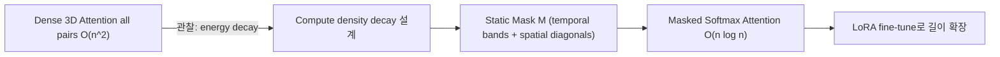

[논문 링크](https://arxiv.org/abs/2506.19852v1)


## Radial Attention: O(n log n) Sparse Attention with Energy Decay로 “긴 비디오”를 싸게 뽑기

## 한 줄 요약 (TL;DR)

사후(softmax 이후) attention 에너지가 거리(시간/공간)와 함께 **지수적으로 감쇠** 한다는 관찰을 바탕으로, 계산 밀도도 같은 방식으로 감쇠시키는 **정적(static) 마스크**를 설계해 긴 비디오 생성의 훈련/추론 비용을 크게 줄인다. (근거: §4.1–§4.2, Eq.3–Eq.4) 

---

## Key Numbers (요약)

* Params: (방법론) N/A | 평가 모델: Mochi 1 10B Params / HunyuanVideo 13B Params / Wan2.1 14B Params (근거: §5.1) 
* Context: 예) HunyuanVideo 5s 720p 생성에 약 115K tokens 필요 (근거: §3) 
* Architecture: Dense self-attn 대체용 Sparse self-attn 마스크(softmax 유지) (근거: §3–§4, Eq.2) 
* Complexity: Attention O(n^2) → O(n log n) (근거: Abstract, Fig.2)  
* **Serving**  (end-to-end latency, 단일 H100)

  * 기본 길이: HunyuanVideo 1649s → 876s (1.88×) / Wan2.1-14B 1630s → 917s (1.77×) (근거: Tab.1) 
  * 4× 길이(Hunyuan): 2895s → 781s (3.71×) (근거: Tab.2) 
* **Training**  (LoRA 기반 길이 확장)

  * 4× 길이(Hunyuan): 93.6h → 21.4h (4.37×) (근거: Tab.2) 
* Attention fidelity: 출력 MSE 3.9e-3 (SVG 4.4e-3, STA 1.5e-2 대비 낮음) (근거: §5/§6 Discussion) 

> 용어: **TPOT**  는 본 논문에서 핵심 지표로 직접 보고되진 않고, 대신 video diffusion의 end-to-end latency(s)와 훈련 시간(h), Vision Reward 등으로 비교한다. (근거: Tab.1–Tab.2) 

---

## 핵심 아이디어

이 논문의 중심 주장은 “비디오 diffusion 모델의 attention 은 토큰 간 시간/공간 거리가 멀어질수록 post-softmax score가 감쇠(Spatiotemporal Energy Decay)하며, 이를 **계산 밀도 감소**로 변환한 정적 희소 마스크(Radial Attention)를 쓰면 **softmax를 유지한 채** 긴 비디오에서 훈련/추론을 O(n log n)로 줄이면서 품질을 유지/개선할 수 있다”이다. (근거: Abstract, §4.1–§4.3)  

---

## 배경: 그들이 해결한 문제

### 왜 “긴 비디오”가 비싸지는가?

* 비디오는 시간 축이 추가되어 토큰 수가 급증하고, 3D dense attention 이 n×n 행렬을 만들기 때문에 시간/메모리가 O(n^2)로 터진다. (근거: §3) 
* 예시로 HunyuanVideo 에서 5초 720p 생성이 약 115K tokens 수준이라, 해상도/프레임 증가가 곧바로 attention 병목으로 이어진다. (근거: §3) 

### 기존 SOTA는 어디까지 왔나?

* 최신 비디오 생성 SOTA는 DiT backbone 위에 3D dense attention 을 채택해 장거리 의존을 잡지만, 프레임 수에 대해 비용이 제곱으로 늘어 훈련/서빙이 부담된다. (근거: Related Work) 
* 비디오 특화 sparse 방법(STA, SVG 등)은 효율은 올리지만, STA는 고정 receptive field 한계가 있고, SVG는 런타임 프로파일링 기반이라 **긴 비디오 분포**에서 신뢰성이 떨어지고 훈련에 바로 쓰기 어렵다는 문제가 지적된다. (근거: §1, §2, Fig.3)   
* 선형 attention 류는 전역 receptive field를 주지만, 로컬 디테일을 놓치며 품질 저하가 발생할 수 있어 “dense(O(n^2)) vs linear(O(n))” 사이의 설계 공간이 남아있다. (근거: Related Work) 

---

## 새로운 접근법: Radial Attention

Radial Attention 은 “거리 기반 energy decay”를 가정/관찰하고, 그에 맞춰 **시간 방향은 밴드(band)별로 밀도를 반감**, **공간 방향은 프레임 간 블록에서 대각선(diagonal) 주변만 유지**하는 방식으로 희소 마스크를 만든다. (근거: §4.1–§4.2, Fig.5, Eq.4) 

### 1) 관찰: Spatiotemporal Energy Decay

* post-softmax attention score가 시간/공간 거리 증가에 따라 감쇠하며, 회귀 분석으로 지수 함수가 잘 맞는다고 주장한다. (근거: §4.1, Fig.4, Fig.9)  
* 이를 Eq.3 형태(거리의 선형 결합에 대한 exp 감쇠)로 모델링한다. (근거: Eq.3) 

### 2) 설계: “에너지 감쇠 → 계산 밀도 감쇠”

* 시간 방향: 메인 대각선 주변을 여러 band 로 나누고, 바깥 band 로 갈수록 compute density를 1/2로 줄이며, band 폭은 2배로 키워 band 당 총 계산량이 상수로 제한되게 한다. (근거: §4.2, Fig.5(a))  
* 공간 방향: 프레임 i↔j 블록에서 같은(혹은 가까운) spatial 위치의 상호작용이 크다는 관찰을 반영해, 대각선 주변 폭을 시간 거리에 따라 줄인다. (근거: §4.2) 
* 대각선 폭이 1 미만으로 떨어질 땐, 더 좁히는 대신 특정 프레임 간 블록에서만 대각선을 남기는 “frequency 감소” 규칙을 둔다. (근거: §4.2, Fig.5(b)) 
* 추가로 attention sink(모든 토큰이 1st frame을 본다)를 넣어 품질을 보완한다. (근거: §4.2, Fig.5(c)) 

### 3) 결과: O(n log n) + 하드웨어 친화

* 마스크의 0 개수(허용 연결 수)에 대한 상계를 통해 O(n log n)을 도출한다. (근거: §4.2, Eq.5–Eq.6, Appx A.1)  
* 구현은 128×128 block sparsity로 현대 GPU에서 실행 가능하게 한다. (근거: §4.2 Hardware-friendly block sparsity) 

---

## 작동 원리: 구체적인 예시로 살펴보기

아주 작은 toy video 를 두고, Radial Attention 마스크가 어떻게 “가까운 건 촘촘히, 먼 건 성글게”를 구현하는지 단계별로 보자. (근거: §4.2) 

### Toy setting

* 프레임 수 f=4 (frame 0..3), 프레임당 토큰 수 s=4 (spatial position 0..3)라고 하자. (근거: §4.2 notation n=fs) 
* query 토큰은 (frame i, pos k), key 토큰은 (frame j, pos l)로 표기한다. (근거: Eq.4 정의) 

### Step 1) 시간 거리로 band 를 정한다

* |i−j|=0 은 band 0 (100% density)로 두고, |i−j|가 커질수록 바깥 band 로 분류하며 band 별 density를 1/2씩 줄인다. (근거: §4.2 Temporal density decay) 

예를 들어 i=0일 때 j=0은 band 0, j=1은 band ±1, j=2는 더 바깥 band 가 된다. (근거: §4.2 band indexing) 

### Step 2) 프레임-프레임 블록 내부는 “대각선 근처만” 남긴다

* i와 j가 가까우면 (k≈l) 주변의 여러 대각선을 남기고, 멀어질수록 허용 대각선 폭을 줄인다. (근거: §4.2 Spatial density decay) 

toy로 “폭=1”이라고 하면, (k=l)만 남기는 형태가 된다. (근거: Eq.4의 k=l 조건 케이스) 

### Step 3) 너무 멀어 폭<1 이 되면 “간헐적으로만” 연결한다

* 먼 프레임 쌍은 모든 (k=l)을 남기는 대신, 특정한 (i,j) 블록에만 대각선을 남겨 평균 밀도를 맞춘다. (근거: §4.2 diagonal frequency rule) 

### Step 4) attention sink 로 1st frame 을 항상 본다

* 모든 토큰이 frame 0의 토큰을 볼 수 있게 하여 안정적인 전역 기준점을 제공한다. (근거: §4.2 attention sink) 

아래는 “dense → radial” 흐름을 단순화한 다이어그램이다. (근거: Fig.3 개념) 



---

## 성능 검증: 주요 결과

### 1) 기본 길이(default length)에서 “품질 유지 + 속도 향상”

* HunyuanVideo (117 frames)에서 Ours 는 PSNR 27.3, LPIPS 0.114, latency 876s로 1.88× speedup을 보고한다. (근거: Tab.1) 
* Wan2.1-14B (69 frames)에서 Ours 는 PSNR 23.9, LPIPS 0.163, latency 917s로 1.77× speedup을 보고한다. (근거: Tab.1) 
* 동일 표에서 SVG 대비 속도는 유사(예: 1.90× vs 1.88×)하되, 정적 마스크로 훈련/길이 확장까지 노린다는 포지션을 강조한다. (근거: Tab.1, Fig.3 설명)  

### 2) 2×/4× 길이 확장에서는 “LoRA로 싸게 늘리기”

* HunyuanVideo 4×(509 frames)에서 Ours 는 sparsity 88.3%, training 21.4h(4.37×), inference 781s(3.71×), Vision Reward 0.134를 보고한다. (근거: Tab.2) 
* Mochi 1 4×(667 frames)에서 Ours 는 sparsity 85.5%, training 17.4h(2.83×), inference 386s(2.57×), Vision Reward 0.113을 보고한다. (근거: Tab.2) 

### 3) “지수 감쇠 가정”의 경험적 타당성

* Fig.9에서 decay curve를 exp(−ax+b)로 적합했을 때 R^2 > 0.985라고 보고한다. (근거: Fig.9) 

---

## 우리의 관점: 강점, 한계, 그리고 이 연구가 중요한 이유

### 강점

* **softmax attention을 유지**  하면서 “중요한 관계만 쳐낸다”는 설계라, 구조를 크게 바꾸는 linear attention류 대비 **사전학습 가중치 보존 + 소량 튜닝**에 유리한 방향이다. (근거: Abstract, §4.3)  
* **정적(static) 마스크**  라서 SVG의 런타임 프로파일링 오류/훈련 미적용 문제를 회피하며, “긴 비디오 분포”에 바로 적응시키는 목적에 맞는다. (근거: §1, §2, Fig.3)  
* LoRA 관점에서 dense attention에서는 LoRA가 full fine-tuning보다 뒤처지다가 4×에서 따라잡는 반면, Radial Attention에서는 LoRA가 full fine-tuning을 match/상회할 수 있다고 주장한다. (근거: Fig.9(a) 설명) 

### 한계

* attention score를 “지수 감쇠”로 모델링(Eq.3)하는 가정이 자연 비디오의 복잡한 구조를 단순화한다는 한계를 저자들이 명시한다. (근거: Limitations) 
* Eq.6에서 보이듯 프레임 수에 대해선 O(n log n)이지만, **해상도(resolution)에 대해선 여전히 quadratic** 성분이 남는다고 인정한다. (근거: Limitations, Eq.6 언급) 

### 왜 중요한가?

* 비디오 생성에서 “길이 확장”은 실무적으로 곧바로 비용 문제(튜닝/서빙)로 연결되는데, 이 논문은 **사전학습 모델을 크게 바꾸지 않고** 길이만 늘리는 경로(마스크 + LoRA)를 정교하게 제시한다. (근거: §4.3, Tab.2)  

---

## 다음 단계는?: 앞으로의 길

* 저자들은 Radial Attention 을 현재는 “길이 확장 fine-tuning”에만 쓰지만, NSA/MoBA 같은 맥락처럼 **pre-training 단계에 도입**해 “긴 비디오를 native 지원”하는 방향을 future work로 남긴다. (근거: Limitations/Discussion) 
* 또 해상도에 대한 quadratic 병목을 줄이는 더 스케일러블한 attention 메커니즘을 후속 과제로 제시한다. (근거: Limitations) 

---

## ‘비밀 병기’ 하나만 꼽기: “Radial(통합) 마스크” vs Spatial-only / Temporal-only

HunyuanVideo 4×(509 frames)에서, 단순히 spatial/temporal 방향만 남긴 변형 대비 “통합 마스크(Ours)”가 Vision Reward를 크게 끌어올린다. (근거: Tab.2) 

| Variant  | Sparsity | Train Time (h) | Train Speedup | Infer Time (s) | Infer Speedup | Vision Reward | Δ Vision Reward vs Ours |
| -------- | -------: | -------------: | ------------: | -------------: | ------------: | ------------: | ----------------------: |
| Spatial  |    88.3% |          20.7h |         4.52× |           755s |         3.83× |         0.112 |                  -0.022 |
| Temporal |    88.2% |          21.1h |         4.44× |           774s |         3.74× |         0.083 |                  -0.051 |
| **Ours** |    88.3% |          21.4h |         4.37× |           781s |         3.71× |         0.134 |                   0.000 |

* 해석상, spatial-only는 프레임 간 동일 위치(대각선) 구조는 잡지만 시간 축 band 설계로 “가까운 프레임”에 더 촘촘히 쓰는 이점을 덜 활용하고, temporal-only는 반대로 프레임 간 흐름을 남겨도 프레임 내부 로컬 디테일을 덜 잡아 품질 손실이 커진다고 볼 수 있다. (근거: §4.2 설계 의도, Tab.2 결과)  


### 토글을 클릭하면 논문에 대한 자세한 LLM 질의응답 내용을 확인할 수 있습니다.

<details markdown="block">
<summary>▶️<strong>클릭하여 펼치기</strong></summary>


## 프롬프트 1.1.1 (연구의 공백)

```
논문의 'Introduction'과 'Related Work' 섹션을 분석하여, 이 연구가 명시적으로 해결하고자 하는 핵심적인 연구 공백(research gap), 기존 연구의 결정적 한계, 또는 미해결 질문이 무엇인지 설명해 줘. 저자들이 설명하는, 이 논문 출판 시점의 '최신 기술(state of the art)'은 어떤 상태였는지 요약해 줘.
```


## 문제 설정: 왜 “긴 비디오”에서 병목이 Attention으로 이동했나 (근거: §1, §3)

* 비디오는 시간 축이 추가되어 latent token 수가 급증하며, 예로 HunyuanVideo에서 **5s, 720p** 비디오 생성에 약 **115K tokens** 가 필요하다고 든다. (근거: §3) 
* latent를 과도하게 압축하면 품질 저하가 발생해 token 감소에는 사실상 하한이 생긴다고 설명한다. (근거: §3) 
* 최근 비디오 확산 모델들은 시공간 상관을 잡기 위해 **3D dense attention** 을 사용하고, attention 행렬이 **$n \times n$** 이라 시간/메모리 복잡도가 **$O(n^2)$** 로 커진다고 정리한다. (근거: §3) 
* FlashAttention류가 메모리는 줄여도 **시간의 quadratic 병목은 남아**, 고해상도/장시간 비디오에서 핵심 제약이 된다고 주장한다. (근거: §3) 

## 기존 방법들의 결정적 한계: “효율”과 “긴 비디오 일반화/학습 가능성”의 충돌 (근거: §1, §2, §3)

* **SVG** 는 head를 spatial/temporal로 **온라인 프로파일링** 해 마스크를 고르는데, 더 긴 비디오 같은 **unseen length 분포** 에서 head 분류가 틀릴 수 있고 그 오류가 학습 중 강화되어 성능 저하로 이어질 수 있다고 지적한다. (근거: §1) 
* 또한 SVG류의 동적 마스킹은 “길이 한계 자체를 넘지 못하고”, 긴 비디오 분포에 대해 안정적으로 학습에 쓰기 어렵다는 대비를 명시한다. (근거: Fig.3, §2) 
* **선형 attention 대체** 계열은 softmax attention을 바꾸기 때문에 **구조 변경이 크고**, “약한” 파인튜닝만으로 원래 품질을 회복하기 어렵다고 말한다. (근거: §1) 
* **STA** 같은 정적(satic) 로컬 윈도우 계열은 receptive field가 고정되어 **장거리 의존성** 에 제약이 있고, 긴 비디오에서 취약하다고 정리한다. (근거: §2) 
* LLM에서 쓰이던 sparse 패턴(예: Power-of-two 거리)은 비디오의 **공간·시간 구조** 를 무시해 비디오 생성에는 suboptimal일 수 있다고 주장한다. (근거: §2) 
* “긴 비디오 생성” 축에서, RoPE 주파수 조정으로 **2× extrapolation** 을 하는 **RIFLEx** 같은 training-free 연장도 언급하지만, 이는 근본적으로 quadratic attention 비용 문제 자체를 해소하는 계열로 소개되지는 않는다. (근거: §2) 

## 논문이 명시적으로 겨냥하는 핵심 연구 공백 (Research Gap) (근거: §3)

* 저자들이 던지는 미해결 질문은 “**동적 sparse(mask) 수준의 표현력** 을 가지면서도, **정적(static) 패턴** 으로 **학습에도 적용 가능** 하고, **하드웨어 친화적** 으로 실행되는 attention 패턴을 설계할 수 있는가”이다. (근거: §3) 
* 즉, 기존의 선택지는 (1) **3D dense** 로 품질은 좋지만 $O(n^2)$ 로 훈련/서빙이 막히거나, (2) **동적 sparse** 로 추론은 빨라져도 **긴 비디오 분포에서 안정적 학습/일반화가 어려워지거나**, (3) **선형화/대규모 구조 변경** 으로 품질 회복이 어려운 쪽으로 양분되어 있었다는 것이 저자 관점의 “공백”이다. (근거: §1, §2, §3)   

## 저자들이 서술하는 출판 시점 SOTA 상태 요약 (근거: §2)

* 비디오 확산 모델은 Sora 이후 **DiT 백본** 으로 이동했고, Latte가 **spatial/temporal decoupled attention** 을 제안한 흐름 위에서, 최근 SOTA는 **3D dense attention** 으로 “joint spatiotemporal dynamics”를 더 강하게 모델링하는 방향을 택했다고 정리한다. (근거: §2) 
* 하지만 이 SOTA(3D dense) 선택은 decoupled 대비 **orders-of-magnitude** 로 무거울 수 있고, 프레임 수에 대해 **quadratic scaling** 이라 훈련/배포 모두에 큰 장벽을 만든다고 명시한다. (근거: §2) 
* 효율화 축에서는 distillation/caching/quantization/분산추론 등이 비디오에도 적용되지만, 비디오가 3D dense attention에 의존하면서 병목이 FFN이 아니라 **attention 레이어로 이동** 했다고 설명한다. (근거: §2) 
* 비디오 전용 sparse로는 **STA(슬라이딩 3D 윈도우)** 와 **SVG(동적 head별 패턴 선택)** 이 대표로 언급되며, 둘 다 효율을 높이지만 “긴 비디오”에서 각각 (STA: long-range 제한, SVG: unseen length에서 profiling 신뢰성 저하) 문제가 남는다고 요약한다. (근거: §2) 

## Key Numbers (gap 관련 최소 요약) (근거: §3, Fig.2)

* Token scale 예시: **115K tokens** @ **5s, 720p** (HunyuanVideo). (근거: §3) 
* 병목 복잡도 대비: Dense attention $O(n^2)$ → 목표는 $O(n \log n)$ 로의 전환. (근거: Fig.2, §1) 
* 긴 비디오(예: **500-frame, 720p**) 사례에서 attention compute **9× 감소**, 추론 **3.7×** 가속, 튜닝 비용 **4.6×** 절감이라는 문제의식/동기 그림을 제시한다. (근거: Fig.2) 


## 프롬프트 1.1.2 (핵심 가설)

```
이 논문의 중심 가설(central hypothesis) 또는 핵심 주장은 무엇인가? '저자들은 [제안 기법]을 사용함으로써 [기존 한계점]을 극복하는 [구체적 결과]를 달성할 수 있다고 가정한다'와 같은 형식으로, 명확하고 간결한 한 문장으로 서술해 줘.
```


저자들은 비디오의 시공간 구조를 반영한 정적(static) $O(n \log n)$ Radial Attention 마스크를 사용함으로써 (근거: §2) 3D dense attention의 $O(n^2)$ 비용 병목과 (근거: §2) 기존 sparse/linear 계열의 긴 비디오 분포 불안정성·품질 저하 문제를 피하면서도 (근거: §2) dense와 유사한 생성 품질을 유지한 채 (근거: §5.2, Fig.6) 기본 길이 추론에서 HunyuanVideo와 Wan2.1-14B 기준 end-to-end 1.9×/1.8× 가속을 달성하고 더 긴 비디오 확장을 효율적으로 가능하게 할 수 있다고 가정한다 (근거: §5.2).


## 프롬프트 1.2.1 (독창성 식별)

```
논문 전체를 바탕으로, 가장 중요하고 독창적인 기여(contribution) 1~3가지를 구별되는 항목으로 나열해 줘. 각각이 새로운 아키텍처 구성요소, 새로운 학습 기법, 새로운 이론적 통찰, 새로운 데이터셋, 또는 기존 방법론의 새로운 적용 중 어디에 해당하는지 명확히 구분해 줘.
```


### 1) **Radial Attention: 비디오 시공간 구조를 반영한 정적(static) $O(n \log n)$ sparse mask 설계**  *(새로운 아키텍처 구성요소)*

* Radial Attention은 3D dense attention의 $O(n^2)$ 병목을 $O(n \log n)$ 로 낮추는 **정적** sparse attention 메커니즘을 제안한다. (근거: Fig.2, §1) 
* 이 마스크는 시간 거리(프레임 간 간격)에 따라 attention compute density가 **지수적으로 감소** 하도록 band 구조(대각 폭/밀도 변화)를 갖게 설계되어, 가까운 프레임은 촘촘히, 먼 프레임은 성기게 본다. (근거: Fig.5, §4) 
* 또한 “attention sink”를 추가해 모든 토큰이 **첫 프레임** 을 참조할 수 있도록 하여 품질을 보강한다. (근거: §4) 
* 500-frame, 720p 설정에서 attention compute **9×** 감소 및 end-to-end latency **3.7×** 가속을 동기 사례로 제시해, 긴 비디오에서의 실용적 효율을 강조한다. (근거: Fig.2) 

### 2) **Spatiotemporal Energy Decay: 거리 증가에 따른 attention score 감소 현상 모델링**  *(새로운 이론적 통찰)*

* 저자들은 post-softmax attention score가 공간·시간 거리 증가에 따라 감소하는 현상을 **Spatiotemporal Energy Decay** 로 정의하고, 이를 공간·시간 거리의 **지수함수적 감쇠** 로 모델링한다. (근거: §1) 
* 이 관찰을 “계산 밀도(computation density) 감쇠”로 번역해, 단순하지만 하드웨어 친화적인 **정적 마스크** 로 구현하는 것이 핵심 설계 원리로 연결된다. (근거: §1, §4)  

### 3) **기존 비디오 확산 모델을 “길이 확장”으로 저비용 적응시키는 LoRA 기반 파인튜닝 프레임**  *(새로운 학습 기법 / 기존 방법론의 새로운 적용)*

* Radial Attention은 softmax attention 자체를 바꾸지 않고 “중요하지 않은 토큰 관계만 pruning”하는 방식이라, 기존 사전학습 비디오 확산 모델을 **LoRA** 같은 경량 튜닝으로 더 긴 시퀀스에 적응시키는 것을 가능하게 한다. (근거: §1) 
* 길이 확장 LoRA가 기존 **style LoRA** 와도 호환된다고 명시해, 실제 워크플로(스타일/길이 동시 제어) 관점의 확장성을 기여로 제시한다. (근거: §1, §5.2) 
* 4× longer 비디오 생성에서 튜닝 비용 **4.4×** 절감 및 추론 **3.7×** 가속(품질 유지)을 주장하며, “훈련/서빙 동시 스케일”을 목표로 한다. (근거: §1, Fig.2)  


## 프롬프트 1.2.2 (저자 관점에서의 강점)

```
저자들의 관점에서, 자신들의 접근법이 이전 방법들보다 우월한 이유는 무엇인가? 그들이 자신들의 연구가 지닌 독창성과 강점을 뒷받침하기 위해 사용하는 핵심 논거를 인용하거나 알기 쉽게 설명해 줘.
```

## 1.2.2 저자 관점의 강점: “정적 마스크로 동적 표현력 + 훈련/서빙 동시 스케일”

### **강점 1** : 동적(sparse) 계열의 “학습 불가/불안정”을 정적(static) 패턴으로 해결 (근거: §1, Fig.3)

* 저자들은 SVG류 동적 마스킹이 **unseen length 분포** 에서 head profiling 오분류를 일으키고, 그 오류가 최적화 과정에서 강화되어 성능 저하로 이어질 수 있다고 본다. (근거: §1) 
* 동시에 “동적 마스킹은 패턴을 on-the-fly로 결정하는 오버헤드가 있고 **training에는 적용되지 않는다** ”는 점을 한계로 든다. (근거: §4) 
* 그에 대한 해법으로, Radial Attention은 **정적 sparse mask** 로 “energy decay → computation density decay”를 구현해 **훈련에도 그대로 사용할 수 있는 패턴** 을 목표로 한다. (근거: §1, §4)  

### **강점 2** : “물리적 감쇠(energy decay)” 관찰을 설계 원리로 고정해, 단순하지만 효과적인 마스크를 정당화 (근거: §1, Fig.4)

* 저자들은 post-softmax attention score가 공간·시간 거리 증가에 따라 감소하는 현상을 **Spatiotemporal Energy Decay** 로 정의하고, 이를 공간·시간 거리의 **지수 함수 감쇠** 로 모델링했다고 주장한다. (근거: §1, Fig.4)  
* 이 관찰을 바탕으로, SVG의 spatial/temporal head 분리를 **Radial Attention으로 통합** 하고 계산 복잡도를 $O(n \log n)$ 으로 낮춘다고 설명한다. (근거: §1, Fig.2) 

### **강점 3** : 하드웨어 친화성 + 최소 구조 변경(softmax 유지)로 “실전 배포/튜닝”에 유리 (근거: §2, §1)

* 저자들은 기존 $O(n \log n)$ 계열(예: LSH/계층/멀티해상도/fast multipole)이 **하드웨어 비친화적** 이고 대규모에서 확장성이 제한적이라고 정리한 뒤, 자신들은 “**simple static attention mask** ”로 하드웨어 친화성과 스케일을 동시에 얻는다고 대비한다. (근거: §2) 
* 또한 softmax attention 자체를 바꾸지 않고 “중요하지 않은 token relation만 pruning”하기 때문에, 기존 프리트레인 비디오 확산 모델을 **LoRA** 같은 경량 튜닝으로 긴 시퀀스에 적응시킬 수 있다고 주장한다. (근거: §1) 

### **강점 4** : 같은 연산 예산에서의 품질-효율 트레이드오프를 수치로 제시 (근거: Tab.1, §2)

* 기본 길이(default length)에서 저자들은 **동일 compute budget** 조건하에, Radial Attention이 STA/PA 대비 **PSNR(dB)**, **SSIM**, **LPIPS**에서 일관되게 우수하고 SVG와 **유사한 비디오 fidelity** 를 보인다고 요약한다. (근거: Tab.1) 
* **HunyuanVideo (117 frames)** 에서 Ours는 **339 TFLOPs**, **876 s** 로 **1.88×** speedup을 보고하며, PSNR **27.3 dB**, SSIM **0.886**, LPIPS **0.114** 를 제시한다. (근거: Tab.1) 
* **Wan2.1-14B (69 frames)** 에서 Ours는 **323 TFLOPs**, **917 s** 로 **1.77×** speedup을 보고하며, PSNR **23.9 dB**, SSIM **0.842**, LPIPS **0.163** 을 제시한다. (근거: Tab.1) 
* 추가로 긴 비디오 예시로 **509-frame, 720p** 에서 dense 대비 attention computation을 **9×** 줄였다고 서술한다. (근거: §2, Fig.2) 
* 4× longer 비디오 생성에서는 튜닝 비용 **4.4×** 절감, 추론 **3.7×** 가속(품질 유지)을 주장하며 “훈련/서빙 동시 스케일”을 강조한다. (근거: §1) 


## 프롬프트 1.3.1 (알고리즘 단계별 설명)

```
핵심 알고리즘, 모델 아키텍처, 또는 주요 방법론을 단계별(step-by-step)로 설명해 줘. 독자는 AI 분야의 대학원생 수준이라고 가정해. 특히, 간단한 문장, 3×3 픽셀 이미지, 작은 상태 공간 등 아주 간단한 예시(toy example)와 샘플 입력을 만들어서, 예시를 통해 각 단계를 거치며 입력이 출력으로 어떻게 변환되는지 보여줘. 등장하는 모든 핵심 용어와 변수는 그 즉시 정의해 줘.
```

## 1.3.1 알고리즘 단계별 설명: Radial Attention 마스크 생성 → SparseAttention 적용 → LoRA로 길이 확장

### 용어·변수 정의 (근거: §3, §4)

* **$f$** : 프레임 수 (frames). (근거: §4) 
* **$s$** : 프레임당 토큰 수 (tokens/frame). (근거: §4) 
* **$n$** : 전체 토큰 수, $n = f s$ (tokens). (근거: §4) 
* **$Q,K,V \in \mathbb{R}^{n\times d}$** : attention의 query/key/value 행렬, $d$는 임베딩 차원 (dim). (근거: §3) 
* **$M \in {-\infty, 0}^{n\times n}$** : sparsity mask (logit에 더해짐). (근거: §3) 
* **$\tilde{M} \in {-\infty, 0}^{f\times f\times s\times s}$** : (frame,frame,spatial,spatial) 4D 마스크. (근거: §4.2) 

---

### Step 0 **기본 Attention / SparseAttention 공식** (근거: §3)

Dense attention은 다음과 같이 계산된다. (근거: §3) 

$$
\mathrm{Attention}(Q,K,V)=\mathrm{softmax}!\left(\frac{QK^\top}{\sqrt{d}}\right)V
$$

Sparse attention은 logit에 마스크 $M$을 더해 일부 쌍을 제거한다. (근거: §3) 

$$
\mathrm{SparseAttention}(Q,K,V)=\mathrm{softmax}!\left(\frac{QK^\top+M}{\sqrt{d}}\right)V
$$

---

### Step 1 **관찰: Spatiotemporal Energy Decay를 지수 감쇠로 모델링** (근거: Fig.4, Eq.3)

저자들은 softmax 이후 attention score가 **시간 거리** 및 **공간 거리** 가 커질수록 감소한다고 보고 이를 **Spatiotemporal Energy Decay** 로 정의한다. (근거: Fig.4, §4.1) 

특정 query 토큰(프레임 $i_0$, 위치 $k_0$)에 대해, 프레임 $j$의 위치 $l$ 토큰으로 가는 확률 $p_{js+l}$ 이 다음 형태로 상계된다고 둔다. (근거: Eq.3) 

$$
p_{js+l} \le C_{\mathrm{rel}} e^{-\alpha|j-i_0|-\beta|l-k_0|}, p_{i_0 s + k_0}
$$

* **$\alpha$** : temporal decay rate (per frame). (근거: Eq.3) 
* **$\beta$** : spatial decay rate (per spatial-index). (근거: Eq.3) 

---

### Step 2 **핵심 설계: “에너지 감쇠”를 “계산 밀도 감쇠(compute density decay)”로 변환** (근거: §4.2, Fig.5)

#### Step 2-A **시간 축: 밴드(band)로 나누고 밴드가 멀어질수록 계산 밀도를 절반씩 감소** (근거: §4.2, Fig.5a)

프레임 $i$와 $j$ 사이의 temporal distance에 따라 compute density를 다음처럼 두는 규칙을 사용한다. (근거: §4.2) 

$$
\rho_t(i,j)=\left(\frac{1}{2}\right)^{\left\lfloor \log_2(\max(|i-j|,1))\right\rfloor}
$$

이 규칙은 attention map을 **대각선 중심 band** 들로 분할하고, 중심에서 멀어질수록 각 band의 밀도를 **1/2씩** 줄이는 구조를 만든다. (근거: §4.2, Fig.5a) 

#### Step 2-B **공간 축: frame-to-frame 블록 내부에서 “대각선(비슷한 위치)”만 남기되, 멀수록 대각 폭을 줄임** (근거: §4.2, Fig.5b)

저자들은 에너지가 “비슷한 spatial location”에 집중된다고 보고, 프레임 블록 내부에서는 **대각선 형태** 의 상호작용을 남긴다. (근거: §4.2) 

프레임 $i$와 $j$ 블록에서 남길 대각 폭(정확히는 half-diagonal width에 해당)을 다음처럼 둔다. (근거: §4.2) 

$$
w(i,j)=\left\lfloor \frac{s}{2^{\left\lfloor \log_2(\max(|i-j|,1))\right\rfloor}} \right\rfloor
$$

#### Step 2-C **대각 폭이 1 미만으로 떨어지면: 대각선 “빈도(frequency)”를 줄여 샘플링** (근거: Fig.5 caption, Eq.4)

대각 폭이 너무 작아지면(직관적으로 “더 줄일 대각 폭이 없음”), 저자들은 **대각선을 유지하되 프레임 블록을 서브샘플링** 해서 “동일한 amortized density decay”를 맞춘다고 설명한다. (근거: Fig.5 caption) 

---

### Step 3 **정식 마스크 $\tilde{M}$ 정의 및 2D 마스크 $M$으로 평탄화(flatten)** (근거: Eq.4, §4.2)

Radial Attention의 4D 마스크는 다음 조건으로 정의된다. (근거: Eq.4) 

* **허용(0)** : (i) temporal band에서 대각 폭 조건을 만족하는 near-diagonal 쌍, 또는 (ii) 먼 프레임에서는 조건을 만족하는 대각선 샘플. (근거: Eq.4) 
* **차단($-\infty$)** : 그 외 모든 토큰 쌍. (근거: Eq.4) 

그리고 실제 attention 연산(식 (2))에는 2D 마스크 $M$이 필요하므로, frame/spatial 인덱스를 펼쳐서 다음처럼 만든다. (근거: §4.2) 

$$
M_{is+k,; js+l} = \tilde{M}_{i,j,k,l}
$$

---

### Step 4 **품질 보강: Attention Sink(첫 프레임을 모두가 보도록)** (근거: §4.2, Eq.8)

비디오 품질 향상을 위해, 모든 토큰이 **첫 프레임(frame 0)** 토큰들에 attend하도록 attention sink를 추가한다. (근거: §4.2) 

부록에서는 이를 $j=0$ 으로의 허용을 포함하는 형태로 별도 마스크로 정의한다. (근거: Appx A.1, Eq.8) 

---

### Step 5 **실행 관점: 토큰 단위가 아니라 블록 단위 block-sparse로 계산** (근거: §4.2)

현대 하드웨어 효율을 위해 attention을 **블록 단위** 로 계산하며, 구현은 **128×128 (tokens×tokens) 블록 크기** 를 사용한다고 명시한다. (근거: §4.2) 

---

### Step 6 **긴 비디오로 적응: Radial Attention + LoRA를 attention projection에 삽입** (근거: §4.3)

사전학습 모델은 짧은 비디오 분포에서 학습되었기 때문에, 긴 비디오로의 직접 학습은 비용이 크다고 전제한다. (근거: §4.3) 

Radial Attention은 $O(n\log n)$ 로 fine-tuning 비용을 f낮추고, 추가로 LoRA를 결합해 오버헤드를 더 줄이는 구성을 제안한다. (근거: §4.3) 

LoRA 적용 위치는 attention 레이어의 **Q/K/V/O projection** 이다. (근거: §4.3) 

---

## Toy Example로 따라가기 (3×3 토큰 프레임, 4프레임)


### 설정

* 프레임 수: $f=4$ (frames)
* 프레임당 토큰 수: $s=9$ (tokens/frame)  → 3×3 격자를 row-major로 펼침
* 전체 토큰 수: $n=fs=36$ (tokens)

각 프레임의 spatial index는 다음처럼 둔다.

```
(0) (1) (2)
(3) (4) (5)
(6) (7) (8)
```

### 목표

Query 토큰을 **프레임 $i_0=2$, 위치 $k_0=4$(중앙)** 로 잡고, 어떤 key 토큰들이 마스크로 **허용(0)** 되는지 단계적으로 본다.

---

### (A) 같은 프레임($j=2$)

* temporal distance: $|2-2|=0$
* $$\left\lfloor \log_2(\max(0,1))\right\rfloor = 0$$
* 대각 폭: $$w = \left\lfloor \frac{s}{2^0} \right\rfloor = 9$$

직관적으로 “가까우니 거의 다 본다”에 해당한다.
→ 프레임 2 내부에서는 (k=4)가 프레임 2의 많은 위치에 attend 가능.

---

### (B) 이웃 프레임($j=1$ 또는 $j=3$)

* temporal distance: $|2-j|=1$
* $$\left\lfloor \log_2(1)\right\rfloor = 0$$
* 대각 폭: $$w = \left\lfloor \frac{9}{1} \right\rfloor = 9$$

이웃 프레임은 여전히 높은 밀도.
→ 프레임 1/3에서도 (k=4)가 비교적 넓게 attend 가능.

---

### (C) 더 먼 프레임($j=0$)

* temporal distance: $|2-0|=2$
* $$\left\lfloor \log_2(2)\right\rfloor = 1$$
* 대각 폭: $$w = \left\lfloor \frac{9}{2} \right\rfloor = 4$$

이제 “멀어질수록 비슷한 위치 중심만 본다”가 작동한다.
논문 식(4)의 near-diagonal 조건을 단순히 “$|k-l|$ 가 작아야 한다”로 보면,
→ 프레임 0에서 (k=4)는 대략 **l=1..7** 중 일부(대각 주변)에만 attend(폭이 줄었기 때문).

---

### (D) Attention Sink 보너스

Attention sink를 켜면, 어떤 query든 **첫 프레임(frame 0)** 토큰으로의 attend가 추가로 열려서
→ (C)에서 줄어든 연결을 “품질 보강용 전역 앵커”로 일부 회복시키는 느낌이 된다. (근거: §4.2) 

---


## 프롬프트 1.3.2 ('비밀 병기' 식별)

```
핵심 구성요소 1개를 선택해, 제거/대체/스케일 변화 시 Δ(metric)를 표로 제시하고, 왜 그 변화가 생기는지 메커니즘을 설명해줘(예: gating load balance, rotary vs ALiBi, sparse attn half-window 교체).
```

## 1.3.2 ‘비밀 병기’ : **$O(n\log n)$ 마스크의 “감쇠 형태” 선택 (Radial vs Harmonic Series)**

선택한 핵심 구성요소는 **sparsity pattern(마스크 패턴)** 이다 (근거: Appx C.3). 
저자들은 Radial Attention을 **Harmonic Series Decay(HS)** 패턴(대각선 폭이 메인 대각선으로부터의 거리와 **역비례**)로 **대체** 하는 ablation을 수행한다 (근거: Appx C.3). 

### 제거/대체 시 Δ(metric) (HunyuanVideo, 117 frames, Default Length)

| Setting       |           PSNR (dB) ↑ | ΔPSNR (dB) |          SSIM (—) ↑ |  ΔSSIM |         LPIPS (—) ↓ | ΔLPIPS |  VisionReward (—) ↑ |    ΔVR |
| ------------- | --------------------: | ---------: | ------------------: | -----: | ------------------: | -----: | ------------------: | -----: |
| HS (replace)  | 27.0 dB (근거: Tab. A)  |          — | 0.881 (근거: Tab. A)  |      — | 0.119 (근거: Tab. A)  |      — | 0.136 (근거: Tab. A)  |      — |
| Radial (Ours) | 27.3 dB (근거: Tab. A)  |    +0.3 dB | 0.886 (근거: Tab. A)  | +0.005 | 0.114 (근거: Tab. A)  | −0.005 | 0.139 (근거: Tab. A)  | +0.003 |

### 왜 이런 변화가 생기나: “에너지 감쇠와 계산 예산 재분배” 메커니즘

* 저자 가정은 **post-softmax attention score가 공간/시간 거리와 함께 감소** 하며, 이 감쇠가 **지수(exponential) 형태로 잘 맞는다** 는 것이다 (근거: §1, §4.1).  
* Radial은 이 관찰을 그대로 “**compute density도 지수적으로 줄이자**”로 번역해, 시간 거리 $|i-j|$ 가 커질수록 band별 계산 밀도를 **절반씩 감소** 시키는 규칙을 쓴다 (근거: §4.2, Fig.5).  
* 또한 프레임 간 거리가 멀어질수록 frame-to-frame 블록 내부에서 **대각선 폭을 축소** 하고, 폭이 1 미만이면 **대각선 빈도(frequency)를 낮춰 샘플링** 해 “먼 프레임에는 더 적은 예산”을 강제한다 (근거: §4.2, Fig.5).  
* 반면 HS는 “거리의 역수” 감쇠로 대각 폭을 정하는 패턴이라 (근거: Appx C.3), Radial이 가정한 **지수 감쇠(energy decay)** 에 비해 **먼 프레임/저에너지 영역에 상대적으로 더 많은 계산을 배정** 하게 된다 (근거: Appx C.3, §4.2).  
* 결과적으로 동일한 $O(n\log n)$ 제약 하에서 Radial은 예산을 **시간적으로 가까운 토큰(고에너지 상호작용)** 에 더 몰아주고(근거: §4.2), HS 대비 **PSNR/SSIM 상승, LPIPS 하락, VisionReward 상승** 으로 관측되는 품질 이득이 나타난다는 논리다 (근거: §4.2, Tab. A).  


## 프롬프트 1.4.1 (핵심 결과 분석)

```
'Experiments' 또는 'Results'의 표/그림을 포함한 주요 결과를 분석해 줘. 핵심 성능 지표는 무엇인가? 어떤 벤치마크에서 보고되었는가? 저자들이 성공 증거로 가장 강조하는 결과를 요약해 줘.
```


## 무엇이 핵심 성능 지표인가

* 저자들은 **영상 품질/일관성 지표** 로 PSNR(dB) / SSIM(unitless) / LPIPS(unitless) 및 Vision Reward(unitless)를 사용한다(근거: Tab.1).
* 저자들은 **효율 지표** 로 attention 연산량 TFLOPs, end-to-end latency(s), 그리고 speedup(×)을 보고한다(근거: Tab.1).
* 더 긴 비디오(2×/4× 길이)에서는 Vision Reward(unitless)와 VBench의 하위 지표(Subject Consistency / Aesthetic Quality / Image Quality, 모두 unitless)를 함께 보고하며, 추가로 LoRA 튜닝 시간(h)과 training/inference speedup(×)을 제시한다(근거: Tab.2).

## 어떤 벤치마크/모델에서 측정했나

* 실험 대상은 Mochi 1(10B Params), HunyuanVideo(13B Params), Wan2.1-14B(14B Params) 3종의 text-to-video diffusion 모델이다(근거: §5.1).
* “기본 길이(default length)” 정량 비교는 HunyuanVideo(117 frames)와 Wan2.1-14B(69 frames)에서 수행되며, 단일 H100 GPU 조건을 명시한다(근거: Tab.1).
* “길이 확장(length extension)” 정량 비교는 2× 및 4× 프레임 수에서 수행되며, Wan2.1-14B는 비용/메모리 제약으로 2×만 보고한다(근거: Tab.2; §Long video generation).

---

## 기본 길이(default length)에서의 정량 결과: 품질을 유지하면서 1.8× 내외 가속

**HunyuanVideo (117 frames)** (근거: Tab.1)

| Method   | PSNR (dB) |  SSIM | LPIPS | Vision Reward |     TFLOPs | Latency (s) | Speedup |
| -------- | --------: | ----: | ----: | ------------: | ---------: | ----------: | ------: |
| STA(FA3) |   26.7 dB | 0.866 | 0.167 |         0.132 | 331 TFLOPs |       719 s |   2.29× |
| PA       |   22.1 dB | 0.764 | 0.256 |         0.140 | 339 TFLOPs |      1002 s |   1.65× |
| SVG      |   27.2 dB | 0.895 | 0.114 |         0.144 | 340 TFLOPs |       867 s |   1.90× |
| **Ours** |   27.3 dB | 0.886 | 0.114 |         0.139 | 339 TFLOPs |       876 s |   1.88× |

* 저자 주장(표 캡션 요지): 동일 computation budget에서 Ours가 STA/PA 대비 PSNR·SSIM·LPIPS를 일관되게 개선하고, SVG와 유사한 fidelity를 보이며, HunyuanVideo/Wan2.1-14B에서 **약 1.8×** speedup을 달성한다(근거: Tab.1).

**Wan2.1-14B (69 frames)** (근거: Tab.1)

| Method   | PSNR (dB) |  SSIM | LPIPS | Vision Reward |     TFLOPs | Latency (s) | Speedup |
| -------- | --------: | ----: | ----: | ------------: | ---------: | ----------: | ------: |
| STA(FA3) |   22.9 dB | 0.830 | 0.171 |         0.132 | 322 TFLOPs |       812 s |   2.01× |
| PA       |   22.4 dB | 0.790 | 0.176 |         0.126 | 324 TFLOPs |       978 s |   1.67× |
| SVG      |   23.2 dB | 0.825 | 0.202 |         0.114 | 324 TFLOPs |       949 s |   1.71× |
| **Ours** |   23.9 dB | 0.842 | 0.163 |         0.128 | 323 TFLOPs |       917 s |   1.77× |

* 기본 길이에서 Ours는 Wan2.1-14B 기준 PSNR 23.9 dB, latency 917 s, speedup 1.77×를 보고한다(근거: Tab.1).

---

## 길이 확장(2×/4×)에서의 정량 결과: “튜닝 비용 절감 + 추론 가속 + 품질 유지”를 핵심 성공 증거로 제시

### HunyuanVideo: 4×(509 frames)에서 **training 4.37×** + **inference 3.71×**

* 4×(509 frames)에서 Ours는 sparsity 88.3%, training time 21.4 h, training speedup 4.37×, inference time 781 s, inference speedup 3.71×, Vision Reward 0.134를 보고한다(근거: Tab.2).
* 같은 4×(509 frames)에서 Dense(Full)는 training time 93.6 h, inference time 2895 s, Vision Reward 0.133을 보고하여, Ours가 speedup 열 기준으로 큰 가속을 제공하면서 Vision Reward는 근접한 값을 보인다(근거: Tab.2).
* Figure 7 시각 비교에서도 4× 길이에서 “Dense Attention(LoRA) baseline” 대비 Radial Attention(LoRA)이 더 높은 평균 Vision Reward를 보고한다(예: Dense Attention 0.133 vs Ours 0.134, unitless)(근거: Fig.7).

### 2×(253 frames)에서도 “품질 vs 효율” 트레이드오프를 표로 강조

* 2×(253 frames)에서 Ours는 sparsity 80.8%, training time 16.2 h, training speedup 2.78×, inference time 339 s, inference speedup 2.35×, Vision Reward 0.126을 보고한다(근거: Tab.2).
* 같은 2×(253 frames)에서 RIFLEx는 sparsity 0.00%, inference time 797 s, Vision Reward 0.128을 보고하며(“training-free” 항목으로 해석 가능한 형태), 저자들은 4×에서는 RIFLEx의 품질이 악화된다고 서술한다(근거: Tab.2; §Long video generation).

### Mochi 1: 4×(667 frames)에서도 Ours가 Vision Reward 최고값으로 제시

* 4×(667 frames)에서 Ours는 sparsity 85.5%, training time 17.4 h, training speedup 2.83×, inference time 386 s, inference speedup 2.57×, Vision Reward 0.113, VBench S.C. 0.958 / A.Q. 0.618 / I.Q. 0.638을 보고한다(근거: Tab.2).
* 같은 4×(667 frames)에서 PA는 Vision Reward 0.107, VBench S.C. 0.956 / A.Q. 0.633 / I.Q. 0.650을 보고하며, 저자들은 Appendix Figure D에서 “Radial Attention이 가장 높은 Vision Reward”를 강조한다(근거: Tab.2; Appx Fig.D).

### Wan2.1-14B: 2×(161 frames)에서 2× 내외 가속(표/예시로 제시)

* Wan2.1-14B 2×(161 frames)에서 Ours는 sparsity 73.6%, training time 14.5 h, training speedup 1.93×, inference time 2847 s, inference speedup 2.01×를 보고한다(근거: Tab.2).
* Appendix 예시에서는 Wan2.1-14B의 Dense Attention(LoRA)이 latency 5735 s, Vision Reward 0.094인 반면 Ours는 latency 2847 s, Vision Reward 0.165를 제시한다(근거: Appx Fig.D 서술).

---

## 저자들이 “성공 증거”로 가장 강조하는 메시지(숫자 중심)

* 기본 길이에서: HunyuanVideo 기준 speedup 1.88×(876 s vs 1649 s)이며 PSNR/LPIPS가 SVG와 유사한 수준으로 보고된다(근거: Tab.1).
* 긴 길이에서: HunyuanVideo 4×(509 frames)에서 **training 4.37×** (21.4 h vs 93.6 h) + **inference 3.71×** (781 s vs 2895 s)로 “튜닝 비용과 추론 비용을 동시에 줄이면서” Vision Reward 0.134 수준을 유지하는 것을 전면에 둔다(근거: Tab.2; Fig.1).
* 스케일링 경향으로: 500-frame 720p 조건에서 attention computation 9× 감소, end-to-end speedup 3.7×, tuning cost 4.6× 절감을 Figure 2로 요약한다(근거: Fig.2).


## 프롬프트 1.4.2 (비판적 비교)

```
제안된 방법론은 논문에서 언급된 주요 베이스라인 및 SOTA 모델들과 비교하여 어떤 성능을 보이는가? 우월성 주장을 가장 강력하게 뒷받침하는 특정 비교 지점을 식별해 줘. 반대로, 능가하지 못했거나 개선이 미미했던 결과가 있다면 이유를 정리해 줘.
```


## 1) 기본 길이(Training-free, 기본 프레임)에서의 비교

### 가장 강한 우월성 포인트: “동일 compute(TFLOPs)에서 품질 유지 + STA/PA 대비 품질 우수”

* **HunyuanVideo (117 frames)**:

  * Ours **PSNR 27.3**로 STA/PA보다 높고, **LPIPS 0.114**로 SVG와 동급(낮을수록 좋음).
  * 속도는 **1.88×**로 SVG(1.90×)와 거의 동급의 가속. 
* **Wan2.1-14B (69 frames)**:

  * Ours가 **PSNR 23.9 / SSIM 0.842 / LPIPS 0.163**로 STA/PA/SVG 대비 전반적으로 좋게 나옴.
  * 속도는 **1.77×**. 
* 논문 해석(이유): PA는 O(n log n)이라도 **비디오의 시공간 locality를 무시**해서 실전 품질이 떨어지고, STA는 **속도는 빠를 수 있으나 품질 저하가 관찰**된다고 설명함. 

### 못 이겼거나 애매한 지점

* **HunyuanVideo 기본 길이에서 Vision Reward**는 SVG(0.144)나 Original(0.141)보다 **Ours(0.139)가 낮음**. 즉 “기본 길이에서 품질이 완전히 SOTA를 압도”라기보단 **SVG와 ‘대체로 동급’**에 가깝게 읽힘. 
* **속도**도 SVG보다 “확실히 더 빠르다”기보단 **거의 비슷(1.88× vs 1.90×)**. 
* STA는 Hunyuan에서 **2.29×로 속도만 보면 더 빠르지만**, 논문은 그 대신 **시각 품질 저하**를 단점으로 짚고, 또 구현상 STA는 FA-3를 쓰는 반면 Ours는 FA-2 기반이라 공정 비교 맥락을 제공함. 

---

## 2) 길이 확장(2×/4×)에서의 비교

### 가장 강한 우월성 포인트: “4×에서 Dense(Full/LoRA) 수준 품질을 유지하면서 비용/지연을 크게 절감”

* **HunyuanVideo 4×(509 frames)**

  * Ours: **Vision Reward 0.134**, Full dense fine-tune(0.133)와 동급 이상이면서
  * **Training 21.4h (4.37×)**, **Inference 781s (3.71×)**로 비용/지연이 크게 감소. 
* **Mochi 1 4×(667 frames)**

  * Ours: **Vision Reward 0.113**, Full(0.099)보다 높고, 속도/학습비도 큰 폭 절감. 
* 논문 해석(이유):

  * Spatial/Temporal 마스크는 **receptive field가 제한**되고,
  * LongLoRA/PA는 전역은 보지만 **시공간 상관을 못 잡아 품질 저하**,
  * SANA(선형 attention 치환)는 **대규모 재학습이 필요하고** 길이 확장 파인튜닝에 부적합하다고 정리. 
  * 반면 Ours는 softmax를 유지한 채 “덜 중요한 관계만 prune”하는 정적 마스크라 **LoRA로도 길이 확장이 잘 된다**는 논지를 폄. 

### 못 이겼거나 개선이 미미했던 지점

* **HunyuanVideo 2×(253 frames)**에서 RIFLEx가 **Vision Reward 0.128**로 Ours(0.126)보다 약간 높음(아주 근소). 

  * 논문도 “2×에서는 RIFLEx가 개선하지만, 더 길게 가면 한계”라고 서술. 
* **Wan2.1-14B 2×(161 frames)**에서 Ours Vision Reward(0.145)가 Full(0.150)보다 낮아 **최고 품질은 Full이 앞섬**. 대신 Ours는 **2.01× 추론 가속, 1.93× 학습 시간 절감**이 장점. 

---

## 3) “주장 뒷받침”을 더 강하게 해주는 보조 비교(품질 보존 근거)

* attention 출력 MSE 비교에서 **Ours가 SVG/STA보다 낮은 오차**(3.9e-3 vs 4.4e-3 / 1.5e-2)를 보여, “희소화했지만 원래 attention을 더 잘 근사한다”는 근거를 추가로 제시함. 


## 프롬프트 1.5.1 (언급된 한계와 잠재적 한계)

```
저자들이 명시적으로 인정한 한계/약점/실패 사례는 무엇인가? 분석을 바탕으로 잠재적 한계(강한 가정, 확장성, 연산 비용, 일반화 한계, 사회적 영향 등)는 무엇이라고 보나?
```


## 1.5.1 언급된 한계와 잠재적 한계

### 저자들이 **명시적으로** 인정한 한계/약점

| 구분       | 저자 언급 한계                                                                                                 | 의미/영향                                                                             | 저자 제안 후속 방향                                                                   |
| -------- | -------------------------------------------------------------------------------------------------------- | --------------------------------------------------------------------------------- | ----------------------------------------------------------------------------- |
| 모델링 가정   | 어텐션 점수의 **지수 감쇠(exponential decay)** 가정(Eq.3)이 자연 비디오의 복잡한 시공간 의존성을 단순화한다.(근거: §6, Eq.3)                 | 감쇠 형태가 데이터/헤드/상황에 따라 달라지면, 마스크 설계의 근거가 약해져 효율–품질 트레이드오프가 악화될 수 있다.(근거: §6)        | “기저 데이터 구조를 더 깊이 이해/모델링”해 효율·성능을 개선할 여지가 있다고 말한다.(근거: §6)                     |
| 계산 복잡도   | 프레임 길이 측면에서는 $O(n\log n)$ 를 달성하지만, **해상도(resolution)에 대해선 여전히 quadratic** 복잡도가 남는다(Eq.6).(근거: §6, Eq.6)  | “긴 비디오(f↑) + 고해상도(s↑)”에서 해상도 축이 병목이 되어, 고해상도 장편 생성에서 이득이 제한될 수 있다.(근거: §6, Eq.6)  | “고해상도 비디오 생성을 위한 더 확장 가능한 어텐션”을 향후 탐색한다고 명시한다.(근거: §6)                        |
| 학습/적용 범위 | 현재는 **길이 확장 목적의 파인튜닝**에만 Radial Attention을 사용하며, **프리트레이닝 적용**은 하지 않았다.(근거: §6)                          | “native long-video” 지원을 위해선 사전학습 단계에서의 안정성/일반화 검증이 남아 있다.(근거: §6)                 | NSA, MoBA와 유사하게 프리트레이닝에도 적용 가능하나 향후 과제로 남긴다.(근거: §6)                          |
| 사회적 영향   | 악의적 사용자가 **딥페이크/허위정보** 생성에 악용할 수 있고, 최소 연산자원 접근성 격차로 **디지털 디바이드**를 악화시킬 수 있다고 언급한다.(근거: §D)              | 효율 개선이 곧 “생성 도구의 확산”으로 이어질 수 있어, 안전장치 없는 배포는 위험을 키울 수 있다.(근거: §D)                 | 책임 있는 배포, 윤리 기준 준수, 탐지(detection) 방법 개발을 권고하며 코드/모델 라이선스를 명시하겠다고 한다.(근거: §D)  |

---

### 잠재적 한계(분석 기반)

* Radial Attention은 “거리(시간/공간)에 따른 감쇠”를 근거로 **정적(static) 마스크**를 쓰며, 토큰이 “유사한 공간 위치”를 더 보도록 설계된다.(근거: §1, Fig.3(b)) 

  * 따라서 “먼 시공간 거리지만 의미적으로 중요한 상호작용(예: 장기 복선, 장면 전환 후 재등장)”이 많은 비디오에서는 과감한 프루닝이 품질 저하로 이어질 **가능성**이 있다.(근거: §1, Fig.3(b)) 

* 저자 스스로 Eq.3의 **지수 감쇠 가정**이 단순화라고 적었기 때문에, 감쇠가 지수 형태에서 벗어나는 데이터 분포에서는 “마스크가 잘라내는 관계”가 실제로 중요할 **가능성**이 있다.(근거: §6, Eq.3) 

* 복잡도 상한은 “프레임 수 $f$ 가 크고 공간 해상도 토큰 수 $s$ 가 고정”일 때 $O(n\log n)$ 로 해석된다고 본문이 명확히 말한다.(근거: §4.2, Eq.6) 

  * 즉, 해상도(= $s$ )가 함께 커지는 시나리오(고해상도·장편)에서는 이점이 줄고, 결국 저자 한계로 언급된 “resolution quadratic”이 지배적일 **가능성**이 있다.(근거: §6, Eq.6) 

* 구현은 하드웨어 효율을 위해 **블록 스파스(block sparsity)** 를 쓰며 블록 크기를 128×128로 둔다.(근거: §4.2) 

  * 이 경우 실제 속도는 이론적 $O(n\log n)$ 외에도 “블록 정렬/희소 패턴의 커널 효율/밀도”에 크게 좌우될 수 있어, 특정 해상도·프레임 조합에서 이득이 덜할 **가능성**이 있다.(근거: §4.2) 

* 품질 향상을 위해 **attention sink**(모든 토큰이 첫 프레임을 어텐드)를 추가한다.(근거: §4.2, Fig.5(c)) 

  * 이는 “초기 프레임 조건”을 강하게 고정하는 방향의 바이어스를 만들 수 있어, 장기적으로 내용이 크게 변하는 영상에서 제약으로 작동할 **가능성**이 있다.(근거: §4.2) 

* 실험은 3개 T2V 확산모델(Mochi 1: 10B Params, HunyuanVideo: 13B Params, Wan2.1: 14B Params)과 기본 해상도(480p/720p) 설정을 중심으로 보고된다.(근거: §5.1) 

  * 따라서 “아키텍처/해상도/길이 분포”가 크게 다른 비디오 생성기에서의 일반화는 추가 검증이 필요하다고 보는 것이 자연스럽다.(근거: §5.1) 

* 라이선스 측면에서 OpenVid-1M은 “명시적 라이선스가 없다”고 적시한다.(근거: §E) 

  * 이는 재현성(repro)이나 파생 배포 시 법적/운영적 리스크가 될 수 있다.(근거: §E) 


## 프롬프트 1.5.2 (미래 연구 궤적)

```
저자들이 제안하는 향후 연구 방향은 무엇인가? 한계에 비추어 합리적인 다음 단계나 대안적 방향을 제안해 줘.
```

# 1.5.2 미래 연구 궤적

## 저자들이 제안하는 향후 연구 방향 (명시적)

* **감쇠 가정 고도화**: attention score의 **지수 감쇠(exponential decay)** 가정(Eq.3)이 자연 비디오의 복잡한 시공간 의존성을 단순화하므로, **데이터 구조를 더 깊이 이해/모델링** 해서 효율과 성능을 함께 개선할 수 있다고 말한다. (근거: §6) 
* **고해상도 확장**: 현재 방법이 해상도(resolution)에 대해선 **quadratic complexity** 가 남으므로(Eq.6), **고해상도 비디오 생성을 위한 더 확장 가능한 attention** 을 탐색하겠다고 한다. (근거: §6) 
* **프리트레이닝 적용**: 지금은 Radial Attention을 **길이 확장 fine-tuning** 에만 사용하지만, NSA/MoBA처럼 **pre-training에 적용** 해 “native long video”를 지원하는 방향을 미래 과제로 남긴다. (근거: §6) 
* **LoRA 병합 품질(스타일 바이어스) 완화**: length-extension LoRA와 style LoRA를 병합했을 때 스타일이 미묘하게 달라질 수 있으며, 이는 length-extension LoRA 학습 데이터가 상대적으로 작아서 생긴 바이어스일 수 있고, **더 포괄적 데이터셋** 으로 완화 가능하다고 제안한다. (근거: §5.3) 

---

## 한계에 비추어 합리적인 다음 단계 / 대안적 방향 (분석)

* **감쇠(energy→density) 규칙의 “학습 가능화”**: 지수 감쇠가 잘 맞는다는 회귀 적합($R^2 > 0.985$)은 관찰 근거로는 강하지만(근거: Fig.9), 실제 최적 마스크는 레이어/헤드/데이터에 따라 달라질 수 있다. (근거: Fig.9) 

  * 다음 단계로, $$\alpha,\beta$$ (temporal/spatial decay rate) 또는 band density를 **레이어별/헤드별로 학습** 하거나, **piecewise(근거리=조밀, 원거리=희소) 혼합 스케줄** 로 두어 “고정 규칙”의 리스크를 줄일 수 있다. (분석)

* **해상도 축 병목 해소를 위한 2D/다중해상도 결합**: 저자 한계처럼 resolution에 대한 quadratic을 깨려면(근거: §6), 시간축의 $$O(n\log n)$$ 만으로는 부족하다. (근거: §6) 

  * 대안으로 (i) **공간 토큰을 계층적으로 병합(멀티스케일)** 하거나, (ii) **공간은 로컬/윈도우 sparse + 시간은 radial** 로 factorize해 “시간·공간 동시 서브쿼드라틱”을 노리는 조합이 자연스럽다. (분석)

* **프리트레이닝 적용 시의 안정성 전략**: 저자도 pre-training 적용을 열어두지만 미탐색 상태다. (근거: §6) 

  * 합리적 다음 단계는 **dense→radial로 점진적 커리큘럼**(초기 dense, 이후 sparsity 증가) 또는 **일부 레이어/헤드만 radial** 로 시작해 학습 안정성을 확인하는 것이다. (분석)

* **장거리 의미 의존성 평가 강화**: Radial은 “먼 프레임일수록 예산을 줄이는” 설계이므로(근거: §4.2), 장면 전환/재등장처럼 “멀지만 중요한” 상호작용에서 취약할 수 있다. (근거: §4.2) 

  * 다음 단계로, 장거리 의존이 핵심인 프롬프트/벤치(예: 반복 등장 객체, 장기 목표 유지)에서 **실패 모드 분해** 와 sink 대체(learned memory token 등)를 검토하는 것이 타당하다. (분석)

* **LoRA 병합(스타일/길이)에서 데이터·정규화 개선**: 스타일 바이어스 원인을 데이터 규모로 지목했으므로(근거: §5.3), 더 큰 데이터 외에도 **병합 시 regularization/adapter routing** 등으로 상호 간섭을 줄이는 방향이 후속으로 합리적이다. (근거: §5.3) 


</details>
