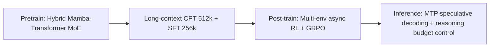

[Paper](https://research.nvidia.com/labs/nemotron/files/NVIDIA-Nemotron-3-White-Paper.pdf)

## NVIDIA Nemotron 3: Pushing the "Accuracy/Throughput" Frontier with a Hybrid Mamba–Transformer MoE

**Nemotron 3** combines an MoE hybrid Mamba–Transformer, **LatentMoE**, **MTP**, **NVFP4** training, and **multi-environment RL** to push up "accuracy-to-inference-throughput," presenting **contexts up to 1M tokens** and **3.3× relative throughput** as its core message (source: §Intro/§2.2/§2.3/§2.4/§2.5/§2.6/Fig.2).

---

## Core Idea

- **Research gap**: In the Transformer/MoE line of models, (1) the KV-cache/sequence-length scaling cost of attention and (2) the all-to-all communication + expert weight load of MoE become inference bottlenecks, making it hard to improve **inference throughput/latency** while maintaining "SOTA accuracy." This is attacked head-on (source: §2.1).
- **Central hypothesis**: The authors argue that combining an **MoE hybrid Mamba–Transformer architecture** with **LatentMoE (communication/load reduction)** and **MTP (speculative-decoding friendly)** as well as **NVFP4 (low-precision large-scale training)** and **multi-environment RL (agentic generality)** can mitigate existing inference bottlenecks, improve the **accuracy/throughput frontier**, and reach the level of a **1M-token context** with **up to 3.3× relative throughput** (source: §Intro/§2.1/§2.2/§2.3/§2.4/§2.5/Fig.2).
- **Openness/transparency**: Emphasis is placed on releasing the model weights, training recipes, and datasets (**10T+ tokens** in total) (source: Abstract/§Intro).

### Key Numbers (range verifiable in the paper)

- Model family: **Nano / Super / Ultra** (source: Abstract/Fig.2).
- Context: **up to 1M tokens** (source: §Intro/§2.5).
- LatentMoE reduction ratio: **d/ℓ**, e.g., **d=4096, ℓ=1024 → 4×** reduction (source: §2.2).
- MTP: claims an average accuracy gain of **+2.4%p**, with **~97% acceptance (first 2 tokens)** in speculative decoding (source: §2.3/Tab.2).
- NVFP4: claims stable pretraining up to **25T tokens**, and states that FP4 peak throughput on GB300 is **3×** that of FP8 (source: §2.4).
- Long-context training: CPT **512k tokens**, SFT **256k tokens**, RL long-context env input **32k tokens** (source: §2.5).

---

## Background: The Problem They Address

The axis Nemotron 3 repeatedly stresses is **inference efficiency** on "agentic workloads" (source: §Intro).
Agentic environments (a) lengthen the context through multi-turn history/large documents/RAG and (b) inflate **sampling/rollout volume** through tool calls, multi-agent setups, coding, math, and so on. The result is that a "good model" alone is not enough; a "fast model" is required (source: §Intro/§2.6).

Yet in conventional Transformer-centric scaling,

- Attention accumulates KV-cache/compute burden as sequence length grows (source: §2.1), and
- MoE bottlenecks on all-to-all communication and expert weight load (source: §2.1),

so the starting point is that it is hard to "raise accuracy while maintaining inference throughput/latency" (source: §2.1).

---

## New Approach: Mixture-of-Experts Hybrid Mamba–Transformer + LatentMoE + MTP (+ NVFP4, RL)

In one sentence, Nemotron 3's methodology amounts to "**reduce attention to the necessary minimum, cut MoE communication/load further, make decoding itself cheaper, and then raise agentic generality with RL**" (source: §2.1–§2.7).

The following four core components in particular map directly onto "systems-level" concerns.

1. **Hybrid Mamba–Transformer (MoE)**: the share of Mamba-2 layers is made large and the ratio of attention layers low, while MoE lowers the cost per unit of capacity (source: §2.1/§Intro).
2. **LatentMoE**: MoE routing computation and the all-to-all payload are pushed down to a **latent dimension ℓ**, cutting communication/load by **d/ℓ**; the savings go toward more experts/more active experts (source: §2.2/Fig.3b).
3. **MTP (Multi-Token Prediction)**: predicts multiple future tokens to enrich the learning signal and, at the same time, serves as draft tokens for speculative decoding, aiming for acceleration **without a separate draft model** (source: §2.3).
4. **NVFP4 + multi-environment RL + budget control**: NVFP4 for large-scale training efficiency, multi-environment RL for agentic generality, and a thinking budget at inference time to expose the cost/accuracy trade-off (source: §2.4/§2.6/§2.7).

---

## How It Works: A Closer Look with Concrete Examples

### End-to-End Pipeline (Conceptual Diagram)



- CPT **512k tokens**, SFT **256k tokens**, RL long-context env input **32k tokens** are specified (source: §2.5).
- RL optimizes multiple environments "simultaneously," decouples inference from training via async RL, and uses GRPO + masked importance sampling, per the description (source: §2.6).

---

### (Step-by-step) LatentMoE: "Push communication/load down to ℓ and raise K and N with the savings"

**Terminology**

- $d$: the original hidden dimension (e.g., 4096) (source: §2.2).
- $\ell$: the latent dimension, $\ell<d$ (e.g., 1024) (source: §2.2).
- $N$: total number of experts, $K$: number of active (top-$K$) experts per token (source: §2.2).
- "All-to-all traffic/weight load" is identified as the MoE bottleneck (source: §2.1).

**The steps of LatentMoE as presented in the paper**

1. Each token embedding is **projected** from $d \rightarrow \ell$ (source: §2.2/Fig.3b).
2. Routing/expert computation is performed **in the latent space (dimension $\ell$)** (source: §2.2).
3. Expert outputs are back-projected from $\ell \rightarrow d$ (source: §2.2).
4. The paper states that all-to-all payload and expert weight load are thereby reduced **by a factor of $d/\ell$** (source: §2.2).
5. The saved budget is used to raise the number of experts/active experts to $N' = N\cdot(d/\ell)$, $K' = K\cdot(d/\ell)$ (source: §2.2).

**Toy example (intuition)**

- Suppose the original $d=6$ and latent $\ell=2$ (source: toy).
- Multiply the token vector $x\in \mathbb{R}^6$ by $P\in\mathbb{R}^{2\times 6}$ to reduce it to $z=Px\in\mathbb{R}^2$ (source: toy).
- The router picks the top-$K$ experts, and each expert only performs a $\mathbb{R}^2\rightarrow\mathbb{R}^2$ transform (source: toy).
- Thus, if "per-token communication/load payload" scales linearly with the hidden dimension, going from $d=6 \rightarrow \ell=2$ reduces the payload by roughly $d/\ell = 3\times$ (source: the description in §2.2 condensed into a toy).

---

### (Step-by-step) MTP: "Thicken the learning signal + get a speculative-decoding draft for free"

**Terminology**

- MTP: a technique that, at one step, predicts not just "the next token" but "several future tokens" as an auxiliary objective (source: §2.3).
- acceptance: the rate at which draft tokens pass base-model verification in speculative decoding (source: §2.3).

**What the paper claims**

- MTP is claimed to give consistent gains in validation loss and across diverse downstream tasks (knowledge/code/common sense/RC/math) (source: §2.3/Tab.2).
- It is described as enabling speculative-decoding acceleration without a separate draft model (source: §2.3).
- It reports **~97% acceptance** on the "first 2 predicted tokens" (source: §2.3).

**Toy example (2-step draft)**

- When the current prefix is "`The capital of France is`," the base model generates only the next token, but MTP also emits the token after "`Paris`" (e.g., "`.`") as a draft (source: toy).
- In verification, if the 2 draft tokens are accepted consecutively, the number of base decoding calls is reduced by that much (source: the speculative-decoding synergy explanation in §2.3).

---

## Performance Validation: Key Results

### 1) The Quantitative Message of the "Accuracy/Throughput Frontier": Fig.2

Nemotron 3 plots **Relative Throughput (output tokens/s/GPU)** together with **accuracy** across several benchmarks to stress the "frontier shift" (source: Fig.2).

- Comparison models: **DeepSeek-R1-Distill-Qwen-32B**, **Llama-3.1-70B**, **Qwen3-235B-A22B** are named (source: Fig.2).
- Nemotron 3 Ultra (**253B-A22B**) shows **3.3× relative throughput** on some benchmarks (source: Fig.2).
- As an example, on Arena-Hard-v2 Nemotron 3 Ultra reports **+4.6 score** and **3.3×** together (source: Fig.2).

> Interpretation (systems view): the numbers are reported as "relative tok/s/GPU," not absolute tok/s, but the goal is clearly positioning for "high throughput that favors agentic rollout/sampling" (source: §Intro/§2.6 + Fig.2).

---

### 2) A Component to View as the "Secret Weapon": LatentMoE (Tab.1)

LatentMoE's core claim is that "pushing routing computation and communication down into a latent space lets you use far richer experts under the same budget" (source: §2.2).

#### Δ(metric) upon removal/replacement: Standard MoE vs LatentMoE (same 73B total / 8B active / 1T tokens)

(The paper's table reproduced as-is)

| Model            | Total Score | Code Score | Math Score | Commonsense Score | Conditions                                       |
| ---------------- | ----------: | ---------: | ---------: | ----------------: | ------------------------------------------------ |
| Standard MoE     |        35.1 |       37.8 |       43.4 |              23.9 | 73B Params / 8B active / 1T tokens (source: Tab.1) |
| LatentMoE        |        36.9 |       40.5 |       44.8 |              25.8 | 73B Params / 8B active / 1T tokens (source: Tab.1) |
| Δ (Latent − Std) |        +1.8 |       +2.7 |       +1.4 |              +1.9 | Same conditions (source: Tab.1)                    |

(source: Tab.1).

Also, as a sample configuration from Tab.1, Standard MoE uses **d=4096, experts=128, active=6** while LatentMoE uses **ℓ=1024, experts=512, active=22** (source: §2.2/Tab.1).

**Why it helps (mechanism)**

- The paper specifies a structure that lowers all-to-all traffic and expert weight load into the latent space, cutting **payload by d/ℓ**, then scales up $N, K$ with the savings (source: §2.2).
- In other words, the story is that it makes "using more/more diverse experts" possible **within a communication/memory budget**, thereby raising quality (source: §2.2).

---

### 3) MTP's Quantitative Effect: Tab.2 (+ speculative-decoding acceptance)

The paper presents a table showing that adding MTP to an 8B-active Transformer MoE base (**trained on 1T tokens**) improves results broadly as follows (source: Tab.2).

| Task                              | Baseline | + MTP |     Δ |
| --------------------------------- | -------: | ----: | ----: |
| MMLU (5-shot, acc)                |    70.06 | 71.26 | +1.20 |
| MMLU-Pro (5-shot, CoT EM)         |    45.05 | 47.84 | +2.79 |
| ARC-Challenge (25-shot, acc_norm) |    86.43 | 88.05 | +1.62 |
| GSM8K (8-shot, acc)               |    82.49 | 84.46 | +1.97 |

(source: Tab.2).

And from the speculative-decoding perspective, **~97% acceptance** on the "first 2 tokens" is reported (source: §2.3).

---

### 4) NVFP4: "25T tokens"-Scale Training + High-Precision Exceptions for Sensitive Layers

- The paper states that NVFP4 enables stable/accurate pretraining of the hybrid Mamba-MoE on up to **25T tokens** (source: §2.4).
- It specifies that, in the NVFP4 recipe, the **last 15% of the network is kept at high precision** for stability (source: §2.4).
- It also states that pushing the Mamba output projection down to NVFP4 can produce **flush-to-zero rates of up to 40%**, so exceptions are handled with MXFP8 and the like (source: §2.4).
- On the loss side, the relative NVFP4-vs-BF16 loss gap is given as **<1%** for Nano and **<0.6%** for the larger MoE (8B active) (source: Fig.4).

---

### 5) Long Context: RoPE Removal + Robustness at 1M Tokens (RULER)

- Nemotron 3 specifies support for **contexts up to 1M tokens** (source: §2.5).
- The paper states that RoPE can become an obstacle to context extension and that, because Mamba layers provide implicit positional information, **RoPE is not used in the attention layers** (source: §2.5).
- On RULER, it shows in a table that the MoE hybrid (Nemotron-3-Nano-30B-A3B-Base) exhibits **more graceful degradation at 1M** than the Dense Hybrid (Nemotron-Nano-12B-v2-Base) (source: Tab.3).

| Model                                     |  128k |  256k |  512k |    1M |
| ----------------------------------------- | ----: | ----: | ----: | ----: |
| Nemotron-Nano-12B-v2-Base (Dense Hybrid)  | 85.13 | 79.85 | 75.12 | 23.43 |
| Nemotron-3-Nano-30B-A3B-Base (MoE hybrid) | 74.48 | 71.67 | 66.02 | 54.19 |

(source: Tab.3).

Additionally, for code sequences (**1M+ tokens**), it presents in a figure the trend of NLL decreasing as token position moves later, together with a power-law fit of **R²=0.883** (source: Fig.6).

---

## Our Perspective: Strengths, Limitations, and Why This Research Matters

### Strengths

- **A combination of components that confronts the bottleneck "head-on"**: tying LatentMoE (communication/load), MTP (decoding), NVFP4 (training efficiency), and multi-environment RL (generality) into a single product-family design gives the message consistency (source: §Intro/§2.2–§2.7).
- **An "end-to-end" claim that includes the open stack**: the RL stack (NeMo-RL, NeMo-Gym) is stated to be open-sourced under **Apache 2.0** (source: §2.6).
- **The length-extrapolation narrative backed by numbers**: "no RoPE + 512k training + 1M evaluation" is connected via Tab.3/Fig.6 (source: §2.5/Tab.3/Fig.6).

### Limitations (questions the paper leaves open)

- **Absence of absolute serving metrics**: the key figures center on "Relative Throughput (output tokens/s/GPU)," making it hard to directly estimate TTFT (ms), TPOT (ms/token), or memory/batch/concurrency conditions in real serving (source: Fig.2 is presented as relative values).
- **The 'exception-handling' cost of NVFP4**: operational complexity of "mixed precision" remains—keeping the last **15% at high precision** for stability, keeping some layers in MXFP8, and so on (source: §2.4).
- **Long-context RL input is stated as 32k tokens**, so whether "1M-token context" is directly handled in the RL stage (e.g., training tool-use long-horizon up to 1M) appears to require separate extension (source: §2.5/§2.6).

---

## What's Next?: The Road Ahead

- **Strengthening consistency between long-context training and post-training**: the length schedule specified as 512k/256k/32k for CPT/SFT/RL respectively needs additional quantification of how stability, reward design, and sampling cost change when extended to longer RL inputs (e.g., 128k+ tokens) (source: §2.5/§2.6).
- **Decomposing MTP × speculative decoding's "real-serving" effect**: an acceptance rate of **~97%** is encouraging, but showing how it decomposes into actual TPOT (ms/token), TTFT (ms), and across varied batch/length distributions would support the relative-throughput message of Fig.2 more strongly (source: §2.3/Fig.2).
- **Publishing LatentMoE systems-cost (communication/load) profiling**: since LatentMoE is stated to reduce payload by d/ℓ, presenting NCCL all-to-all bytes, expert weight paging/caching, and routing distribution (load-balancing) metrics together would make "why it is faster" directly verifiable (source: §2.2/§2.1).

### Click the toggle to see detailed LLM Q&A about the paper.

<details markdown="block">
<summary>▶️<strong>Click to expand</strong></summary>

## Prompt 1.1.1 (Research Gap)

```
Analyze the paper's 'Introduction' and 'Related Work' sections to explain the core research gap(s), decisive limitations of prior work, or open questions this study explicitly sets out to address. Summarize what the state of the art was at the time of publication, as the authors describe it.
```

The core gap Nemotron 3 targets is an "**open** model design that, while maintaining high accuracy on **agentic/reasoning workloads**, simultaneously solves (1) the **KV-cache/attention cost** at inference, (2) the **memory-bandwidth and all-to-all bottleneck of MoE**, (3) **RoPE-based long-context extension fragility**, and (4) the **staged-training instability of RL post-training (capability collapse, reward hacking)**." (source: §1, §2.1, §2.2, §2.5, §2.6)

---

## 1) Problem definition the authors "explicitly" set (based on the Introduction)

- Nemotron 3 targets **agentic AI applications**, with pushing the "accuracy ↔ inference throughput" frontier as its primary goal. (source: §1)
- Support for **contexts up to 1M tokens** is set as a core requirement. (source: §1)
- **Reasoning budget control** at inference (e.g., a thinking-trace token budget) is included as a "product feature." (source: §1, §2.7)
- The strategy of training **multiple RL environments simultaneously** in post-training to raise generality across tool use/competitive coding/math and more is placed front and center. (source: §1, §2.6)

---

## 2) Research gap and the "decisive limitations" of existing approaches

The four items below are the **core gaps** that emerge from this document along with what effectively serves as Related Work (§2 technical descriptions + citations). (source: throughout §2.1–§2.7)

### (G1) "Transformer MoE = attention is expensive" → inference throughput limit

- The premise is that in Transformer models, self-attention's **KV-cache grows linearly during generation**, and this dominates inference cost. (source: §2.1)
- Hence designs that "densely interleave MoE with attention," as before, are seen as disadvantageous from an **inference-efficiency (throughput)** standpoint. (source: §2.1)

**Nemotron 3's gap definition:** "Can we keep SOTA-level accuracy while minimizing attention layers to reduce KV-cache-driven cost and thereby raise inference throughput?" (source: §2.1, Fig.1, Fig.2)

---

### (G2) MoE's bottleneck differs by "deployment mode (latency vs throughput)"

- In latency-focused settings, the paper lays out that MoE operates as **memory-bandwidth-bound** (dominated by expert weight reads). (source: §2.2)
- In throughput-focused settings, **all-to-all communication volume** for token dispatch/aggregate is the bottleneck, and it specifies that this communication volume scales **linearly with K (number of active experts) and d (hidden dim)**. (source: §2.2)

**Nemotron 3's gap definition:** "Is a hardware-aware architecture needed that raises quality by enlarging MoE's nonlinear budget (roughly (K × m)) while simultaneously suppressing **memory and communication cost**?" (source: §2.2)

---

### (G3) Ultra-long context extension: the RoPE OOD problem collides with the systems requirement (1M tokens)

- The premise is that RoPE is **an obstacle to context extension beyond the trained length**. (source: §2.5)
- Nemotron 3 pins down that **RoPE is not used in the attention layers** because "Mamba provides implicit positional info." (source: §2.5)

**Nemotron 3's gap definition:** "Can we structurally eliminate the RoPE-based extrapolation risk while achieving 'graceful degradation' from 512k training all the way to 1M?" (source: §2.5, Tab.3)

---

### (G4) RL post-training: instability of staged training and cross-capability trade-offs

- Past approaches (the authors' "previous models") used task-wise **staged training**, and the paper points out that this can lead to **reward hacking** and **degradation of certain capabilities**. (source: §2.6)
- Nemotron 3 therefore claims that training **multiple RL environments simultaneously** is "more stable." (source: §2.6)

**Nemotron 3's gap definition:** "Can we secure training stability while **jointly optimizing** heterogeneous capabilities such as agentic/reasoning/coding/long-context?" (source: §2.6, Fig.7)

---

## 3) "What was the SOTA at the time of the paper?" (per the document's own comparisons/descriptions)

The SOTA reference this white paper sets is summarized as "**accuracy and throughput versus comparable-class (30B-A3B etc.) MoE models**, plus **1M-token long context**." (source: §1, Fig.2)

### SOTA snapshot (comparison points stated in the document)

| Axis               | SOTA/comparison baseline at the time (in-document)                                                                    | Presented limitation of existing work                                                        | Direction Nemotron 3 targets                                                                                  |
| ------------------ | ------------------------------------------------------------------------------------------------------------------- | ---------------------------------------------------------------------------------------- | ----------------------------------------------------------------------------------------------------------- |
| Inference throughput | Relative throughput comparison of Nemotron-3-Nano-30B-A3B vs Qwen3-30B-A3B(-Thinking-2507) (source: Fig.2)             | Awareness that Transformer MoE is throughput-limited because attention+KV-cache cost is large (source: §2.1) | Minimize attention layers to a "select few," mainly Mamba-2 + MoE (source: Fig.1, §2.1)                       |
| Long context (1M)  | "context lengths up to 1M tokens" set as a product requirement (source: §1, Abstract)                                    | RoPE OOD problem as a representative obstacle to context extension (source: §2.5)          | No RoPE in attention layers + CPT 512k/SFT 256k + RL long-context env (input 32k) (source: §2.5)             |
| MoE efficiency/quality | LatentMoE is stated to cut routed load and all-to-all traffic by (d/ℓ) (usually about 4×) (source: Fig.3)                 | In latency mode BW-bound, in throughput mode all-to-all is the bottleneck (source: §2.2)    | Move routing/compute into latent space and scale N, K by (d/ℓ) to raise "accuracy per byte" (source: §2.2, Fig.3) |
| RL post-training stability | Multi-env RL is trained "jointly," with async structure + MTP for rollout efficiency (source: §2.6)                     | Staged training risks reward hacking and capability degradation (source: §2.6)           | Stability secured via GRPO + masked importance sampling, as mentioned (source: §2.6)                        |

---

## 4) Reconstructed in "limitations/open questions" form (review checkpoints)

- Because the document does not have a separate "Related Work" section and instead substitutes §2's technical descriptions, **the setting of the comparison target (SOTA) is restricted to a Fig.2-centric view**. (source: Fig.2, §2 organization)
- "Accuracy" is shown through multiple benchmark bar charts and tables, but **fully specifying identical prompt/decoding settings** is deferred outside this white paper's scope ("see the technical report"). (source: Fig.2 caption)
- The strength at 1M context is quantified on the basis of RULER (e.g., Nemotron-3-Nano-30B-A3B-Base 54.19 at 1M vs Nemotron-Nano-12B-v2-Base 23.43), and **extrapolation to task generalization (e.g., real RAG or whole-codebase edits)** needs further evidence. (source: Tab.3)

## Prompt 1.1.2 (Central Hypothesis)

```
What is this paper's central hypothesis or core claim? State it in one clear, concise sentence in a form like: 'The authors hypothesize that by using [proposed technique] they can achieve [specific result] that overcomes [existing limitation].'
```

- The authors hypothesize that by using a **Mamba-2-based hybrid architecture (a few Attention layers + MoE/LatentMoE)** they can simultaneously mitigate the **KV-cache/Attention cost of conventional Transformer-MoE, the MoE all-to-all communication and memory bottleneck, and RoPE-based long-context extension fragility**, thereby improving the **accuracy–inference-throughput frontier at 1M-token context**. (source: §1, §2.1, §2.2, §2.5, Fig.2)

## Prompt 1.2.1 (Identifying Originality)

```
Based on the full paper, list the 1-3 most important and original contributions as distinct items. Clearly classify each as a new architectural component, a new training technique, a new theoretical insight, a new dataset, or a novel application of an existing method.
```

## Three original contributions (based on the full paper)

| # | Contribution                                                      | Classification                  | What is "new"                                                                                                                                                                                              | Key points confirmed as evidence (including numbers)                                                                                                                                                                                                                                                                                                                                                                                                                                                             |
| -: | ----------------------------------------------------------------- | ------------------------------ | -------------------------------------------------------------------------------------------------------------------------------------------------------------------------------------------------------- | ----------------------------------------------------------------------------------------------------------------------------------------------------------------------------------------------------------------------------------------------------------------------------------------------------------------------------------------------------------------------------------------------------------------------------------------------------------------------------------------------------------------- |
| 1 | **Hybrid Mamba-Transformer MoE architecture**                     | New architectural component     | Instead of densely **interleaving MoE with expensive self-attention**, it explicitly adopts a hybrid layer pattern that mainly interleaves **MoE ↔ Mamba-2** and keeps **only a few attention layers**, with "inference efficiency (especially reasoning)" as the optimization goal. (source: §2.1, Fig.1) | It is premised that self-attention is expensive because **KV-cache grows linearly** during generation, contrasted with Mamba-2, which needs to store only a **constant state during generation**. (source: §2.1) Also, Nemotron-3-Nano-30B-A3B reports **3.3× relative throughput (output tokens/s/GPU)** over Qwen3-30B-A3B. (source: Fig.2, §2.1)                                                                                                                                                                   |
| 2 | **LatentMoE**                                                      | New architectural component + new theoretical insight | Building on a per-deployment-mode bottleneck analysis ("in latency mode the MoE bottleneck is **memory BW**, in throughput mode it is **all-to-all communication**"), it proposes a structure that reduces the routed path to a **latent dimension (ℓ)** to cut **communication and weight load** together. (source: §2.2, Fig.3) | Routed parameter loads and all-to-all traffic are reduced by **(d/ℓ)**, stated in the document as **typically about 4×**. (source: Fig.3) The savings are used to scale the number of experts to **(N' = N · d/ℓ)** and top-K to **(K' = K · d/ℓ)**. (source: §2.2) As a concrete example, Standard MoE is set to **d=4096, total experts=128, active=6** and LatentMoE to **ℓ=1024, total experts=512, active=22**. (source: Tab.1) Under identical conditions (**~8B active / ~73B total params, trained on 1T tokens**), LatentMoE reports superiority on several aggregated benchmarks (e.g., MMLU-Pro **48.30→52.87**, MMLU **70.10→72.11**). (source: Tab.1) |
| 3 | **Multi-environment RL post-training (joint training) + efficient RL systems design** | New training technique          | Relative to past "task-wise staged RL," it places at the center a strategy of **jointly training diverse RL environments—math/coding/tool use/long context—in a single RL run**, claiming this is **more stable and less prone to reward hacking**. (source: §2.6, Fig.7) | It states that **training-inference decoupling (asynchronous RL)** and **multi-token prediction (MTP)-based rollout acceleration** are used for rollout efficiency. (source: §2.6) For training stabilization it describes using **GRPO (Shao et al., 2024) + masked importance sampling**. (source: §2.6) It also mentions **NeMo-RL (Apache 2.0)** and **NeMo-Gym** as the post-training stack. (source: §2.6)                                                                                                                                                                                                                                  |

## Prompt 1.2.2 (Strengths from the Authors' Perspective)

```
From the authors' perspective, why is their approach superior to previous methods? Quote or clearly explain the key arguments they use to support the originality and strengths of their work.
```

## Summary of key strengths from the authors' perspective

Nemotron 3's superiority argument is that it (1) structurally reduces self-attention (KV-cache) cost via the **Hybrid Mamba-Transformer MoE**, improving the **accuracy–inference-throughput frontier**; (2) redesigns MoE's **memory-BW/All-to-All bottleneck** from a hardware perspective via **LatentMoE**; and (3) satisfies the integrated real-world requirements of "agentic + reasoning" through **1M-token long context + simultaneous multi-environment RL + reasoning budget control**. (source: §1, §2.1, §2.2, §2.5, §2.6, §2.7, Fig.2, Fig.3, Tab.3)

---

## Core arguments for "why superior" as presented by the authors

### 1) Inference efficiency: minimize self-attention, whose KV-cache grows, and use Mamba-2 as the main path

Nemotron 3 states that, instead of densely mixing MoE layers with "expensive self-attention," it mainly interleaves MoE with **Mamba-2** and keeps only a "select few" attention layers. (source: §2.1, Fig.1)
The rationale for this design choice contrasts self-attention, which must reference a **linearly growing KV-cache** at every token during generation, with Mamba-2, which needs to store only a **constant state** during generation. (source: §2.1)
As a result, Nemotron-3-Nano-30B-A3B reports **3.3× relative throughput (output tokens/s/GPU)** over Qwen3-30B-A3B (at ISL/OSL=8k/16k) while claiming SOTA-level accuracy on reasoning and 1M long-context (RULER@1M). (source: Fig.2, §2.1)

### 2) "Per-deployment-mode bottleneck" of MoE reflected head-on in the model design

The authors decompose MoE as being **memory-BW-bound (dominated by weight reads)** in latency-focused settings and bottlenecked by **all-to-all communication (token dispatch/aggregate)** in throughput-focused settings. (source: §2.2)
They further specify that all-to-all communication volume scales **linearly with top-K active experts (K) and hidden dim (d)**, using as an argument that "raising quality (larger (K))" directly translates to "worsened communication bottleneck." (source: §2.2)

### 3) LatentMoE: cut MoE all-to-all/weight load by (d/ℓ) and reinvest that budget into quality

LatentMoE claims to move the routed path into a latent dim (ℓ < d), cutting **routed parameter loads + all-to-all traffic** by **(d/ℓ)** (typically about **4×**). (source: Fig.3, §2.2)
It explains that the saved budget scales the number of experts to (N' = N · d/ℓ) and top-K to (K' = K · d/ℓ), improving **accuracy per byte** while keeping the overall inference cost roughly constant. (source: §2.2, Fig.3)
As concrete configuration examples, Standard MoE is **(d=4096), experts=128, active=6** and LatentMoE is **(ℓ=1024), experts=512, active=22**. (source: §2.2)
Under identical conditions (Active ≈ 8B params, Total ≈ 73B params, trained on **1T tokens**), LatentMoE is reported to be consistently better than Standard MoE, e.g., MMLU-Pro **48.30%→52.87%**, MMLU **70.10%→72.11%**. (source: Tab.1)

### 4) 1M-token long context: structurally avoiding the RoPE OOD problem and stressing "graceful degradation"

Nemotron 3 states support for **contexts up to 1M tokens** as a core goal for agentic reasoning. (source: §1, §2.5)
The authors treat RoPE as a "known hurdle when extending context beyond the training length" and claim that because Mamba provides implicit positional info, **RoPE is not used in the attention layers, so the OOD RoPE issue does not arise**. (source: §2.5)
For training/post-processing, they describe including CPT **512k tokens**, SFT **256k tokens**, and RL long-context env inputs **up to 32k tokens**. (source: §2.5)
On RULER, Nemotron-3-Nano-30B-A3B-Base scores **54.19** at 1M and Nemotron-Nano-12B-v2-Base **23.43**, with the former interpreted as **graceful degradation** from 512k→1M and the latter as an **abrupt dropoff**. (source: Tab.3)

### 5) Post-training (RL): mitigating staged RL's side effects (capability degradation/reward hacking) with "simultaneous multi-environment RL"

The authors state that in previous models they performed staged training with RL split per task, which can lead to **reward hacking** and **degradation** of some capabilities. (source: §2.6)
Nemotron 3 **jointly trains diverse RL environments—math/science reasoning, competitive coding, instruction following, SW engineering, search, chat, tool use, long context—in a single RL run**, claiming this is **more stable and less prone to reward hacking**. (source: §2.6, Fig.7)
For large-scale rollout, it describes using **async RL (training-inference decoupling)** and **MTP-based rollout acceleration**, plus **GRPO + masked importance sampling** for stabilization. (source: §2.6)

### 6) MTP: a lever that brings "slightly higher accuracy + inference acceleration (especially speculative decoding)" at once

The authors summarize MTP as effective for both accuracy and inference efficiency, giving speculative-decoding acceleration benefits without a separate draft model. (source: §2.3)
In an ablation (8B-active Transformer MoE base), MTP reports an average improvement of **about 2.4%** across benchmarks, e.g., MMLU (5-shot) **70.06%→71.26%**, GSM8K (8-shot) **82.49%→84.46%**. (source: §2.3, Tab.2)
It also states that a "lightweight MTP module" achieves **about 97% acceptance** on the first 2 predicted tokens, citing this as evidence for latency gains in long-sequence generation and batch-size=1 scenarios. (source: §2.3)

### 7) Productization: exposing the "accuracy↔efficiency" trade-off through inference-time reasoning budget control

Nemotron 3 supports **inference-time budget control**, where the user specifies the maximum number of tokens to use for the thinking trace, and upon reaching the budget a `</think>` is appended to move on to the next generation. (source: §2.7)
This feature presents the accuracy–efficiency trade-off versus reasoning budget as a Figure. (source: Fig.8)

### 8) Openness: citing "open" as a differentiator

The authors state they will release the model weights, a **10T+ token dataset**, and training recipes, offering this as the basis of being "open and transparent." (source: §1)

---

## The 'overall logic' the authors implicitly build, in one line

**Secure tokens/s through the hybrid (attention minimization), raise quality by cutting the MoE bottleneck by (d/ℓ) with LatentMoE, and cover the end-to-end real-world needs of agentic/reasoning through 1M context + simultaneous multi-environment RL + budget control** — this is the authors' "superiority" narrative. (source: §1, §2.1, §2.2, §2.5, §2.6, §2.7, Fig.2, Fig.3, Tab.1, Tab.3)

## Prompt 1.3.1 (Step-by-Step Algorithm Explanation)

```
Explain the core algorithm, model architecture, or main methodology step by step. Assume the reader is a graduate student in AI. In particular, create a very simple example (toy example) and sample input—such as a simple sentence, a 3×3 pixel image, or a small state space—and show through the example how the input is transformed into output at each step. Define every key term and variable the moment it appears.
```

## 

Nemotron 3's "core methodology" combines **(A) a hybrid layer pattern that mainly interleaves MoE ↔ Mamba-2 and keeps only a few self-attention layers** with **(B) an MoE redesign—LatentMoE—that reduces the routed path to a latent dimension (ℓ), cutting all-to-all/weight load by a factor of (d/ℓ)**. (source: §2.1, Fig.1) (source: §2.2, Fig.3)

---

## 0) Term/variable definitions (defined immediately)

- (T): sequence length (tokens)
- (x_{1:T}): input token sequence
- (d): model hidden dimension (e.g., 4096) (source: §2.3/Tab.1 description)
- (ℓ): latent dimension used for the routed path in LatentMoE, (ℓ < d) (source: §2.2)
- (N): (total) number of experts, (K): number of active (top-(K)) experts per token (source: §2.2)
- (h_t ∈ ℝ^d): hidden state of the t-th token
- (z_t ∈ ℝ^ℓ): latent state of the LatentMoE routed path
- **KV-cache**: a cache that stores and reuses the K/V of past tokens in self-attention decoding (grows linearly with length) (source: §2.1)
- **Mamba-2 layer**: a sequence-modeling layer that stores **only a constant state** during generation (source: §2.1)
- **LatentMoE**: an MoE that reduces routed-expert input from (d → ℓ) to cut **routed parameter loads + all-to-all traffic by a factor of (d/ℓ)** (source: Fig.3)

---

## 1) Viewing the overall architecture in "blocks" (step-by-step)

Nemotron 3 is mostly **Mamba-2 + MoE**, including **self-attention only as a "select few"**. (source: §2.1, Fig.1)
It also states that overall it uses a "balanced combination" of **MoE (sparse parameter scaling), attention (high-quality all-to-all routing), and Mamba-2 (constant inference memory/compute)**. (source: §2.1)


---

## 2) Core block 1: hybrid layer pattern (MoE ↔ Mamba-2, attention minimized)

### Step 2.1: Why reduce attention?

The paper states that self-attention is "expensive" because it must reference a **linearly growing KV-cache at every token** during generation. (source: §2.1)

### Step 2.2: Why add Mamba-2?

It presents the logic that Mamba-2 needs to store **only a constant state** during generation, so it is advantageous in terms of inference memory/compute compared with attention. (source: §2.1)

### Step 2.3: So what is done?

Rather than densely mixing MoE layers with "expensive self-attention," **MoE is mainly interleaved with Mamba-2**, keeping **only some attention layers**. (source: §2.1)

---

## 3) Core block 2: LatentMoE (step-by-step)

LatentMoE explains that it reduces the token's routed path from (d) to (ℓ), shrinking the **communication/memory bottleneck by a factor of (d/ℓ)**, and uses the savings to raise the number of experts and top-(K) by the same multiple, improving "accuracy per byte." (source: Fig.3)

### Step 3.1: Down-project ((d → ℓ))

Each token hidden state (h_t ∈ ℝ^d) is projected down to a latent (z_t ∈ ℝ^ℓ). (source: §2.2)

### Step 3.2: Route (gating) + top-(K) selection

The gate produces scores for the experts from (z_t), activating only the top-(K) experts. Because the routed path is in the latent space, **the all-to-all payload and expert weight load decrease by (d/ℓ)**. (source: §2.2/Fig.3)

### Step 3.3: Expert compute in latent space

The selected experts perform an FFN (or MLP) transform **in the latent space only**. (source: §2.2)

### Step 3.4: Aggregate + Up-project ((ℓ → d))

The expert outputs are combined with gate weights and then projected back to (d). (source: §2.2)

### Step 3.5: Cost/scaling rule (core formula)

The paper states that, in proportion to the reduction in routed cost, the number of experts and top-(K) are scaled up as
[
N' = N \cdot \frac{d}{\ell}, \quad K' = K \cdot \frac{d}{\ell}
]
(source: §2.2)

---

## 4) Following "input → output" directly through a toy example (small, with numbers)

Here we **trace by hand** one LatentMoE pass plus one (simplified) Mamba-2 pass. The numbers below are a toy setting for understanding and are unrelated to Nemotron 3's actual dimensions/parameters.

### 4.1 Sample input: viewing a 3×3 image as tokens

Flatten a 3×3 black-and-white image (0/1) left→right, top→bottom into 9 tokens.

```
I =
1 0 1
0 1 0
1 0 0
```

- Token sequence (x_{1:9} = [1,0,1,0,1,0,1,0,0])
- Sequence length (T=9)

### 4.2 Toy dimensions/hyperparameters

- hidden dim (d=6)
- latent dim (ℓ=3)  (i.e., (d/ℓ = 2), mimicking a 2× reduction in routed payload) (source: the "(d/ℓ)" rule in Fig.3)
- experts (N=4), active (K=2)

---

## 5) Step-by-step: LatentMoE forward pass for one token (t) (numeric example)

### Step 5.1 Suppose the hidden state (h_t) is obtained after embedding

Assume the following hidden state for the toy:

[
h_t =
\begin{bmatrix}
2\0\1\-1\0\1
\end{bmatrix} \in \mathbb{R}^6
]

### Step 5.2 Down-project (z_t = W_down h_t)

For the toy, assume "take only the first 3 components":

[
z_t =
\begin{bmatrix}
2\0\1
\end{bmatrix} \in \mathbb{R}^3
]

### Step 5.3 Compute gating scores, then select top-(K)=2

The gate scores (example) are
[
\text{score} = z_t^\top W_g = [3,;1,;-2,;0]
]
and the softmax probabilities are roughly
[
p \approx [0.839,;0.114,;0.006,;0.042]
]
→ Top-2 experts are (e_0, e_1).

### Step 5.4 Experts transform in the latent space

Assume toy expert functions (linear):

- (e_0(z_t) = [2,0,1])
- (e_1(z_t) = [0,2,1])

### Step 5.5 Weighted aggregate (assume the selected 2 are normalized and summed)

Normalizing the two selected probabilities:
[
w_0 \approx 0.881,\quad w_1 \approx 0.119
]
hence
[
z^{\text{out}}_t = w_0 e_0(z_t) + w_1 e_1(z_t)
= [1.7616,;0.2384,;1.0000]
]

### Step 5.6 Up-project

For the toy, assume "fill only the first 3 slots again":

[
h^{\text{MoE}}_t =
\begin{bmatrix}
1.7616\0.2384\1.0000\0\0\0
\end{bmatrix} \in \mathbb{R}^6
]

We have thus followed LatentMoE's core behavior of "doing routing/compute in (ℓ) and returning the final output to (d)." (source: computing in the latent space then returning to (d) per §2.2)

---

## 6) Step-by-step: intuition for Mamba-2's "constant state" (ultra-simplified SSM toy)

Nemotron 3 explains that Mamba-2 stores **only a constant state** during generation. (source: §2.1)
To show this intuitively, assume a toy recurrence with a single scalar state (s_t) (the real Mamba-2 has a more complex vector state).

- State update (example):
  [
  s_t = 0.5 s_{t-1} + 0.1 \cdot \text{sum}(h_t)
  ]
- Output (example):
  [
  y_t = h_t + s_t
  ]

With initial (s_0=0) and input hidden states fed in order
[
h_1=[1,0,0,0,0,0],; h_2=[0,1,0,0,0,0],; h_3=[0,0,1,0,0,0]
]:

- (t=1): (s_1=0.1), (y_1=[1.1,0.1,0.1,0.1,0.1,0.1])
- (t=2): (s_2=0.15), (y_2=[0.15,1.15,0.15,0.15,0.15,0.15])
- (t=3): (s_3=0.175), (y_3=[0.175,0.175,1.175,0.175,0.175,0.175])

The key point is that the memory that must be stored is (s_t) (constant size) (= it does not grow with length (T)). This intuition connects to the white paper's claim of a "constant state during generation." (source: §2.1)

## 7) (Optional) the role played when self-attention layers are included

Nemotron 3 states that it includes only a "few" self-attention layers, positioning attention as a component that provides **high-fidelity all-to-all information routing**. (source: §2.1)

## Prompt 1.3.2 (Identifying the 'Secret Weapon')

```
Choose one core component and present a table of Δ(metric) under removal/replacement/scale changes, and explain the mechanism for why that change occurs (e.g., gating load balance, rotary vs ALiBi, sparse-attn half-window replacement).
```

## 'Secret weapon' chosen: **LatentMoE** (source: §2.2, Fig.3)

Replacing (i.e., removing) LatentMoE with a **Standard MoE** lowers accuracy broadly under the same scale (about **8B active / 73B total params**), the same training (**1T tokens**, same hyperparameters). (source: Tab.1, §2.2)

### Δ(metric) under removal/replacement/scale changes

| Variant              | Change                                     | (d, ℓ)           | (N_total, K_active) | MMLU-Pro (%) | Δ vs LatentMoE (pp) | MMLU (%) | Δ (pp) | Code (%) | Δ (pp) | Math (%) | Δ (pp) | Commonsense (%) | Δ (pp) |
| -------------------- | ---------------------------------------- | ---------------- | ------------------- | -----------: | ------------------: | -------: | -----: | -------: | -----: | -------: | -----: | --------------: | -----: |
| **LatentMoE** (baseline) | routed compute/traffic moved into the latent space | (d=4096, ℓ=1024) | (N=512, K=22)       |        52.87 |                0.00 |    72.11 |   0.00 |    55.14 |   0.00 |    80.19 |   0.00 |           82.10 |   0.00 |
| Standard MoE (replace/remove) | latent path removed (= standard routed)   | (d=4096, ℓ=—)    | (N=128, K=6)        |        48.30 |               -4.57 |    70.10 |  -2.01 |    51.95 |  -3.19 |    78.32 |  -1.87 |           81.73 |  -0.37 |

- The (d, N, K) settings above are the comparison configurations stated in the document. (source: §2.2)
- The accuracy figures follow Tab.1's downstream aggregated scores (e.g., "Code/Math/Commonsense Understanding"). (source: Tab.1)

---

## Why this Δ arises: the bottleneck → design → reinvestment mechanism

### 1) The MoE bottleneck differs by "deployment mode" (source: §2.2)

- In **latency-focused** settings, the cost of reading expert weights from memory dominates, and since the expert matrix is (d × m), the paper concludes that **reducing BW cost requires decreasing (d) or (m)**. (source: §2.2)
- In **throughput-focused** settings, **all-to-all communication** for token dispatch/aggregate is the bottleneck, and it specifies that communication volume scales **linearly with (K) and (d)** and is independent of (m). (source: §2.2)

$$
\text{All-to-all comm volume} \propto K \cdot d \quad (\text{independent of } m)
$$
(source: §2.2)

### 2) LatentMoE reduces the routed path from (d → ℓ), shrinking the "payload that directly feeds the bottleneck" (source: Fig.3, §2.2)

- After projecting the token embedding from (d) to (ℓ < d), it **runs the experts only in the latent space** and projects back to (d). (source: §2.2)
- This reduces **per-expert weight load + all-to-all payload** by a factor of (d/ℓ), which the document writes as "typically about **4×**." (source: Fig.3)

### 3) The saved budget is reinvested in "nonlinear budget and expert diversity" (source: Fig.3, §2.2)

- It states that the savings are used to scale **the number of experts (N)** and **top-(K) active experts (K)** by the same multiple (d/ℓ). (source: §2.2)
- Per the document, the cost reduction from shrinking (ℓ) offsets the increase in (N) and (K), a structure that **keeps overall inference cost roughly constant while raising quality (accuracy per byte)**. (source: Fig.3)

### 4) Hence accuracy rises even at "the same active/total params and the same training tokens" (source: Tab.1)

- Standard MoE and LatentMoE are compared at **~8B active / ~73B total params**, **1T-token training**, and **identical hyperparameters**; under those conditions LatentMoE reports improvements of MMLU-Pro **+4.57pp**, MMLU **+2.01pp**, Code **+3.19pp**, etc. (source: Tab.1, §2.2)

---

Note: an additional ablation of "scale changes (changing ℓ)" is not directly given numerically in the document. (source: within the scope of §2.2/Tab.1)

## Prompt 1.4.1 (Analyzing Key Results)

```
Analyze the key results, including the tables/figures in 'Experiments' or 'Results'. What are the core performance metrics? On which benchmarks were they reported? Summarize the results the authors emphasize most as evidence of success.
```
## Key Takeaways

- **Hybrid MoE (Nemotron-3-Nano-30B-A3B)** achieves **3.3× output throughput** over a comparable Transformer-MoE while holding **accuracy superiority (6/7)** on key agentic/reasoning benchmarks. (source: Fig.2)
- **LatentMoE**, at the **same 8B Active / ~73B Total** scale, shows consistent quality gains over Standard MoE, e.g., **MMLU-Pro +4.57 pp, Code +3.19 pp**. (source: Tab.1)
- **MTP**, on an 8B-Active MoE (trained on 1T tokens), reports **accuracy gains on all 7 tasks (+0.86 to +2.79 pp, average +1.58 pp)** together with **initial-2-token acceptance ≈97%**, which favors speculative decoding. (source: Tab.2, §2.3)
- **NVFP4 pretraining** achieves a **loss gap of <1% (Nano) and <0.6% (8B Active)** versus BF16, with downstream accuracy curves **tracking BF16 closely**. (source: Fig.4, Fig.5, §2.4)
- On **long context**, at 1M input the **RULER score is 54.19 vs 23.43**, highlighting **1M extrapolation robustness** over the previous dense-hybrid trained up to 512k. (source: Tab.3)

---

## 1) The results the authors put front and center as "evidence of success"

### 1.1. Accuracy (%) × throughput frontier

Nemotron-3-Nano-30B-A3B presents **accuracy (%)** across 7 benchmarks together with a separate **relative throughput (output tokens/s/GPU)**, arguing for an improved "accuracy-to-throughput frontier." (source: Fig.2)

| Benchmark                 |                                    Metric | Setting        | Model                       |             Size | Result | Δ vs Qwen3 |
| ------------------------- | ----------------------------------------: | --------- | --------------------------- | ---------------: | -----: | ---------: |
| Arena-Hard-v2-Avg (Chat)  |                              Accuracy (%) | (as labeled in the figure) | Nemotron-3-Nano-30B-A3B     | 30B (A3B Active) |   67.7 |    +9.9 pp |
|                           |                                           |           | Qwen3-30B-A3B-Thinking-2507 | 30B (A3B Active) |   57.8 |          - |
|                           |                                           |           | GPT-OSS-20B-A4B             | 20B (A4B Active) |   48.5 |          - |
| AIME25 (Math)             |                              Accuracy (%) | (as labeled in the figure) | Nemotron-3-Nano-30B-A3B     | 30B (A3B Active) |   89.1 |    +4.1 pp |
| IFBench (Inst. Following) |                              Accuracy (%) | (as labeled in the figure) | Nemotron-3-Nano-30B-A3B     | 30B (A3B Active) |   71.5 |   +20.5 pp |
| 2-Bench (Tool Use)        |                              Accuracy (%) | (as labeled in the figure) | Nemotron-3-Nano-30B-A3B     | 30B (A3B Active) |   49.0 |    +1.3 pp |
| SWE-Bench (Coding)        |                              Accuracy (%) | (as labeled in the figure) | Nemotron-3-Nano-30B-A3B     | 30B (A3B Active) |   38.8 |   +16.8 pp |
| LCB v6 (Coding)           |                              Accuracy (%) | (as labeled in the figure) | Nemotron-3-Nano-30B-A3B     | 30B (A3B Active) |   68.2 |    +2.2 pp |
| RULER @ 1M (Long Ctx)     |                              Accuracy (%) | (as labeled in the figure) | Nemotron-3-Nano-30B-A3B     | 30B (A3B Active) |   86.3 |    +8.8 pp |
| ISL/OSL 8k/16k            | Relative Throughput (output tokens/s/GPU) | 8k/16k    | Nemotron-3-Nano-30B-A3B     | 30B (A3B Active) |   3.3× |      +3.3× |
|                           |                                           |           | Qwen3-30B-A3B-Thinking-2507 | 30B (A3B Active) |   1.0× |          - |
|                           |                                           |           | GPT-OSS-20B-A4B             | 20B (A4B Active) |   1.5× |          - |

- Interpretation point: in the same-class (30B-A3B) comparison, Nemotron's simultaneous **accuracy lead + 3.3× throughput** is the closest thing to a "marketing headline" in this white paper. (source: Fig.2)

---

## 2) Key results by component (architecture/training technique)

### 2.1. LatentMoE's downstream quality gains (Accuracy, %)

Under the same **Active Params ≈8B, Total Params ≈73B** conditions, LatentMoE improves over Standard MoE on every aggregated metric. (source: Tab.1)

| Metric (Accuracy, %)    | Standard MoE (8.09B active / 72.6B total) | LatentMoE (8.02B active / 72.8B total) | Δ (pp) |
| ----------------------- | ----------------------------------------: | -------------------------------------: | -----: |
| MMLU-Pro                |                                     48.30 |                                  52.87 |  +4.57 |
| MMLU                    |                                     70.10 |                                  72.11 |  +2.01 |
| Code (aggregate)        |                                     51.95 |                                  55.14 |  +3.19 |
| Math (aggregate)        |                                     78.32 |                                  80.19 |  +1.87 |
| Commonsense (aggregate) |                                     81.73 |                                  82.10 |  +0.37 |

- Structure of the authors' claim: "transfer the byte/communication constraint into the latent dimension and **reinvest in expert diversity/nonlinear budget**, and quality rises" is quantitatively demonstrated via Tab.1. (source: §2.2, Tab.1)

---

### 2.2. MTP's quality gains + speculative-decoding affinity

Adding MTP to an 8B-Active MoE base (trained on 1T tokens) improves every item. (source: Tab.2)

| Task           | Metric               | Baseline |  +MTP | Δ (pp) |
| -------------- | -------------------- | -------: | ----: | -----: |
| MMLU           | 5-shot acc (%)       |    70.06 | 71.26 |  +1.20 |
| MMLU-Pro       | 5-shot CoT EM (%)    |    45.05 | 47.84 |  +2.79 |
| MBPP-Sanitized | 3-shot (%)           |    65.58 | 66.89 |  +1.31 |
| ARC-Challenge  | 25-shot acc_norm (%) |    86.43 | 88.05 |  +1.62 |
| WinoGrande     | 0-shot acc (%)       |    74.59 | 75.45 |  +0.86 |
| RACE           | 0-shot acc (%)       |    84.02 | 85.36 |  +1.34 |
| GSM8K          | 8-shot acc (%)       |    82.49 | 84.46 |  +1.97 |

- The average gain across the 7 tasks above is **+1.58 pp** (computed directly). (source: Tab.2)
- The authors also report that MTP favors speculative decoding, with **≈97% acceptance on the first 2 predicted tokens** in an ablation. (source: §2.3)

---

## 3) Long-context performance: the part that pins "1M tokens" down with numbers

### 3.1. RULER: 1M extrapolation comparison after 512k training

Under the condition that both models were **trained up to 512k sequence length**, the paper claims Nemotron 3 (MoE hybrid) degrades more gracefully at 1M. (source: Tab.3)

| Model                                     |  128k |  256k |  512k |    1M |
| ----------------------------------------- | ----: | ----: | ----: | ----: |
| Nemotron-Nano-12B-v2-Base (Dense Hybrid)  | 85.13 | 79.85 | 75.12 | 23.43 |
| Nemotron-3-Nano-30B-A3B-Base (MoE hybrid) | 74.48 | 71.67 | 66.02 | 54.19 |

- The gap at 1M is presented as **+30.76 pp (54.19 − 23.43)**. (source: Tab.3)
- Conversely, in the 128k–512k range the dense hybrid is higher, but the authors' narrative fixes on "**the shape of the drop-off at 1M extrapolation**" as the key point. (source: Tab.3)

### 3.2. NLL vs token position: evidence that prediction does "not worsen" out to 1M

On repository-level code sequences (>1M tokens), as token position grows, the cumulative average NLL decreases, with a power-law fit of **R²=0.883** also shown. (source: Fig.6)

---

## 4) Training/systems-level results: evidence of NVFP4 stability

- The NVFP4-vs-BF16 loss gap is reported to shrink to **<1%** for Nano and **<0.6%** at the 8B-Active MoE scale. (source: §2.4, Fig.4)
- In downstream evaluation, the accuracy trajectory of the NVFP4-trained model is shown to **closely track** BF16 (evaluation performed in BF16). (source: Fig.5)
- In addition, a recipe that keeps certain "sensitive layers" at high precision is described as improving train/val loss. (source: §2.4, Fig.4)

## Prompt 1.4.2 (Critical Comparison)

```
Compared with the main baselines and SOTA models mentioned in the paper, how does the proposed method perform? Identify the specific comparison point that most strongly supports the claim of superiority. Conversely, if there are results it did not surpass or where improvement was marginal, summarize why.
```

## 1.4.2 Critical comparison: performance positioning against baselines/SOTA

### Summary conclusion

- **Nemotron-3-Nano-30B-A3B is a comparison aimed at "maintaining (or improving) accuracy while sharply improving decoding throughput,"** presenting a **relative throughput of 3.3 (output tokens/s/GPU)** in Fig.2. (source: Fig.2)
- However, on the **math benchmark (AIME25), GPT-OSS-20B-A4B is shown higher**, so this is not an "always-best-accuracy" position. (source: Fig.2)
- For ultra-long context, on RULER it stresses **more graceful degradation at 1M extrapolation after 512k training**. (source: Tab.3)

---

### Comparison targets / settings (scope stated in the paper)

- Fig.2 comparison models: **Nemotron-3-Nano-30B-A3B**, **Qwen3-30B-A3B-Thinking-2507**, **GPT-OSS-20B-A4B**. (source: Fig.2)
- Fig.2 reported items: Arena-Hard-v2-Avg, AIME25, IFBench, 2-Bench, SWE-Bench, LCB v6, RULER @ 1M, and **Relative Throughput (Output tokens/s/GPU)**. (source: Fig.2)
- Throughput measurement-condition hint: **ISL/OSL 8k/16k** is labeled in Fig.2. (source: Fig.2)

---

### The "specific comparison point" that most strongly supports the superiority claim

| Point          |                                    Metric | Nemotron-3-Nano-30B-A3B | Qwen3-30B-A3B-Thinking-2507 | GPT-OSS-20B-A4B |                                        Δ (Nemotron − Baseline) |
| -------------- | ----------------------------------------: | ----------------------: | --------------------------: | --------------: | -------------------------------------------------------------: |
| **Throughput lead** | Relative Throughput (Output tokens/s/GPU) |                     3.3 |                         1.0 |             1.5 | vs Qwen: **+2.3 (×3.3)** / vs GPT: **+1.8 (×2.2)** (source: Fig.2) |
| **Chat (preference)** |          Arena-Hard-v2-Avg (Chat), acc(%) |                    67.7 |                        57.8 |            48.5 |          vs Qwen: **+9.9%p** / vs GPT: **+19.2%p** (source: Fig.2) |

- Per the authors' description, Nemotron 3's **hybrid Mamba-Transformer MoE** is claimed to achieve "throughput improvement over a similarly sized Transformer MoE + SOTA accuracy" simultaneously. (source: Fig.2)
- This "throughput lead" is explained in §2.1 as a structure that **lowers the share of self-attention layers (mainly MoE ↔ Mamba-2) and cuts the cost of self-attention, whose KV-cache grows linearly**. (source: §2.1, Fig.2)

---

### Points it did not surpass (or where improvement was marginal) and interpretation

| Case        | Benchmark             | Nemotron |     Stronger Baseline |                    Gap |
| ----------- | --------------------- | -------: | --------------------: | ---------------------: |
| **Below (accuracy)** | AIME25 (Math), acc(%) |     89.1 | GPT-OSS-20B-A4B: 91.7 | **-2.6%p** (source: Fig.2) |
| **Small gain** | AIME25 (Math), acc(%) |     89.1 |   Qwen3-30B-A3B: 85.0 | **+4.1%p** (source: Fig.2) |

**Why this pattern arises (mechanism view, interpretation grounded in the paper)**

- Nemotron 3 strongly orients its design goal toward "inference efficiency on reasoning workloads" and adopts a hybrid configuration that **minimizes expensive self-attention**. (source: §2.1)
- As a result, it gains **greatly in throughput**, but within the scope of Fig.2 the claim/result does not hold that it "always guarantees the highest accuracy" on pure math/precision reasoning (GPT-OSS is higher on AIME25). (source: Fig.2)
- This can be explained (hypothetically) as a **model/training-recipe difference optimized more toward the throughput side of the "accuracy–throughput frontier."** (source: §2.1, Fig.2)

---

### Long-context comparison: viewing the "won points" and "lost points" together

RULER is also covered in Fig.2, but the paper presents a clearer **per-length (128k/256k/512k/1M) comparison** in Tab.3. (source: Tab.3)

| Model                                     |  128k |  256k |  512k |    1M |
| ----------------------------------------- | ----: | ----: | ----: | ----: |
| Nemotron-Nano-12B-v2-Base (Dense Hybrid)  | 85.13 | 79.85 | 75.12 | 23.43 |
| Nemotron-3-Nano-30B-A3B-Base (MoE hybrid) | 74.48 | 71.67 | 66.02 | 54.19 |

- **At 1M the MoE hybrid is far ahead, by +30.76 points (=54.19−23.43)**, which the authors interpret as "more robust length extrapolation, graceful degradation." (source: Tab.3)
- Conversely, **at 128k the Dense hybrid is higher, by +10.65 points (=85.13−74.48)** — a point that is also visible. (source: Tab.3)
- As the long-context mechanism, Nemotron 3 describes **not using RoPE in the attention layers (Mamba's implicit positional information) and performing CPT at 512k**. (source: §2.5)

---

### Summary: the "strongest single punch" and "counterexamples to watch"

- The strongest single punch is the "efficiency-accuracy simultaneous improvement" point fronted by **3.3 relative throughput on output tokens/s/GPU**. (source: Fig.2, §2.1)
- As counterexample/caveat, **GPT-OSS is shown higher on AIME25**, so reading it as a "fixed-highest-accuracy" model would be wrong. (source: Fig.2)
- For long context, Tab.3 clearly shows the two-sidedness: **strong at 1M extrapolation (54.19), but the dense hybrid is higher at short context (85.13 at 128k)**. (source: Tab.3)

## Prompt 1.5.1 (Stated Limitations and Potential Limitations)

```
What limitations/weaknesses/failure cases do the authors explicitly acknowledge? Based on your analysis, what do you see as potential limitations (strong assumptions, scalability, computational cost, generalization limits, social impact, etc.)?
```

## 1.5.1 Stated limitations and potential limitations

### Summary conclusion

The limitations that the Nemotron 3 white paper **directly exposes** are (1) **the 1M context is "supported," but training is only specified up to 512k**, so performance degrades in the length-extrapolation regime; (2) **NVFP4 training/inference must keep "sensitive layers" at high precision to retain stability/accuracy**; and (3) **data release centers on "portions for which redistribution rights are held,"** which may constrain reproducibility. (source: Abstract, §2.4, §2.5, Tab.3)

---

### Limitations/weaknesses/failure factors the authors **explicitly acknowledge or expose**

| Item                                   | "Constraint" confirmed from the authors' descriptions                                                                                                      | Why it is a limitation                                                                          |                                                      Observation/figures | Evidence Tag          |
| ------------------------------------ | --------------------------------------------------------------------------------------------------------------------------------------------------- | ------------------------------------------------------------------------------------------ | -----------------------------------------------------------------------: | --------------------- |
| (Release scope) Super/Ultra not yet released | Nano is released with the white paper; Super/Ultra are slated for release "within the coming months" (source: Abstract, §3)                                | At present, **same-condition verification/reproduction** is limited to Nano (source: Abstract)       |                                                                        — | Abstract, §3          |
| (Data-release constraint) release centered on "rights-held" portions | It states it will release only data "for which we hold redistribution rights" (source: Abstract)                                                             | The full pretraining corpus may not be released 1:1 → **constraint on full reproduction** (source: Abstract) |                              summarized only as "over 10 trillion tokens" (source: §1) | Abstract, §1          |
| (Ultra-long-context training scope) 1M "support" vs 512k training | Context "up to 1M tokens" is supported (source: Abstract, §1). But "Both models were trained up to 512k sequence length" (source: Tab.3)                   | 512k→1M is a **length-extrapolation** regime where performance degradation structurally occurs (source: Tab.3) | Nemotron-3-Nano RULER: degrades from **66.02** at 512k to **54.19** at 1M (source: Tab.3) | Abstract, §2.5, Tab.3 |
| (Ultra-long RL scope) RL's long-context input is 32k | The RL stage includes long-context environments with "inputs up to 32k tokens" (source: §2.5)                                                              | Even if 1M-context "inference" is possible, whether **tool-use/reasoning habits (policy learned via RL)** generalize beyond 32k needs separate verification (source: §2.5) |                                                                        — | §2.5                  |
| (Low-precision fragility) NVFP4 requires keeping "sensitive layers" at high precision | The Mamba output proj observes **flush-to-zero of up to 40%** under NVFP4 (source: §2.4) → mitigated by keeping MXFP8 (source: §2.4). Also, the **last 15% of the network is kept at high precision** for stability (source: §2.4) | Means "all-NVFP4" does not directly hold: **accuracy/stability/format constraints** exist (source: §2.4) |                                 flush-to-zero **40%** (Nano) (source: §2.4) | §2.4, Fig.4           |
| (Avoiding RL fragility) reward-hacking risk is mentioned | Joint multi-env training is described as "less prone to reward hacking" (source: §2.6)                                                                    | The authors' own wording presupposes that **reward hacking was a real problem** (source: §2.6)         |                                                                        — | §2.6                  |

---

### **Potential limitations** based on analysis (not explicitly stated; inferred from the design/experiment descriptions)

| Potential risk                         | What is the concern                                                                         | Mechanism hypothesis                                                                                                                                                                                   | Evidence Tag          |
| -------------------------------- | ------------------------------------------------------------------------------------ | --------------------------------------------------------------------------------------------------------------------------------------------------------------------------------------------- | --------------------- |
| "Accurate" ultra-long reasoning/tool-use consistency at 1M context | Even if 1M context is "supported," training is only specified up to 512k, so 1M is an extrapolation zone (source: Abstract, Tab.3) | In the extrapolation regime, retrieval/aggregation accuracy tends to drop; indeed RULER **decreases from 512k→1M (66.02→54.19)** (source: Tab.3), so rather than "adding more long text keeps improving things," there may be a regime where performance bends in a "graceful degradation" shape (source: Tab.3) | Abstract, §2.5, Tab.3 |
| Generalization of RL-learned agent behavior at ultra-long (>32k) context | RL long-context environment input is specified only at 32k (source: §2.5)                 | If policy learning is optimized for 32k, then at 1M context tool use/multi-hop planning may **not improve in proportion to the increase in context length** (inferred) (source: §2.5)                               | §2.5                  |
| Practical difficulty of low-precision (NVFP4) operation | Some layers had to be left in BF16/MXFP8 under NVFP4 (source: §2.4), and the last 15% had to be kept at high precision (source: §2.4) | A "mixed-precision recipe" increases exception handling across the HW/kernel/compiler/serving stack, so even the same model can show **larger performance-accuracy variance by deployment environment** (inferred) (source: §2.4) | §2.4, Fig.4           |
| Reproducibility/audit limits from partial data release | The data release is stated to center on "portions for which redistribution rights are held" (source: Abstract) | It is hard for outside researchers to fully reconstruct the same distribution/filtering, so in turn **verification of training-data bias/contamination** may be limited (inferred) (source: Abstract) | Abstract              |

---

### Summary memo (review perspective)

- This white paper does not systematically address "safety/social-impact"-type limitations (bias, harm, misuse, etc.) in a dedicated section (i.e., that aspect is hard to assess from this document alone). (source: document organization centered on §1–§3)

## Prompt 1.5.2 (Future Research Trajectory)

```
What future research directions do the authors propose? In light of the limitations, propose reasonable next steps or alternative directions.
```

## Conclusion

The "future directions" this document **explicitly** presents are (1) **the sequential release of Super/Ultra and the expansion of the open release** and (2) the roadmap to **productize/scale NVFP4 + LatentMoE + MTP + multi-env RL** along the way. (source: Abstract, §3)

---

## Future research/development directions proposed by the authors (per "explicit" statements in the document)

- It announces that **Super/Ultra will be released "within the coming months."** (source: Abstract, §3)
- The release method targets expanding "open/transparency" to include **model weights + pre/post-training SW + recipes + (redistribution-rights-held) data**. (source: Abstract)
- Super/Ultra are described as scaling the composition including **NVFP4 training**, **LatentMoE**, and **MTP** at the "family" level. (source: Abstract, §1)
- On the post-training side, it emphasizes **multi-environment RL** and the **open-source stack (NeMo-RL / NeMo-Gym)** for it. (source: §2.6)

> Memo: the document itself has almost no "Future Work" section in the traditional sense; the items above effectively play that roadmap role. (source: §3, Abstract)

---

## Reasonable next steps in light of the limitations (proposal)

Below are "immediately verifiable" tracks for follow-up research, based on the technical constraints/observations the document exposes. (source: §2.4, §2.5, §2.6)

| Next step (proposal)                                             | Verification metric                                   | Why needed (mechanism/risk)                                                                                                                                                                                                                                   |
| ---------------------------------------------------------- | ------------------------------------------------- | --------------------------------------------------------------------------------------------------------------------------------------------------------------------------------------------------------------------------------------------------------------- |
| **Shrink NVFP4's "high-precision exception zones"** (e.g., revisiting the keep-last-15%-in-BF16 strategy) | train/val loss gap (%), downstream acc, step-time | Currently the paper states that **the last 15% must be kept at high precision** for stability. (source: §2.4) → Going forward, reducing or auto-selecting the "exception zones" based on per-layer sensitivity would increase FP4's effective efficiency. (source: §2.4)                  |
| **Solve FP4 fragility of the Mamba output projection** (mitigating flush-to-zero) | flush-to-zero rate (%), loss/acc changes            | Under NVFP4 quantization, **flush-to-zero of up to 40%** was observed in the **Mamba output projection**. (source: §2.4) → scaling/format design (keeping MXFP8 vs improved FP4) is the bottleneck point. (source: §2.4)                                                  |
| **Narrow the training-inference gap of "1M-context support"** (raise training length / redesign curriculum) | RULER@1M, NLL@position, long-context agent task    | Both models were **trained only up to 512k**, yet performance at 1M diverges (the 12B dense drops sharply, the 30B-A3B MoE degrades gently). (source: Tab.3, §2.5) → to solidify 1M "support," training/alignment out to 1M should be increased, or long-context RL should be pushed to longer inputs. (source: §2.5) |
| **Extend the input length of long-context RL** (32k → 256k/512k/1M) | tool-use success@long ctx, retrieval/multi-hop     | The RL-stage long-context environment is written with **input of 32k**. (source: §2.5) → whether "an agent actually uses tools in a 1M context" is a separate question, so extending the RL environments themselves to long context is reasonable. (source: §2.5, §2.6)                |
| **Systematize interference/generalization diagnosis of multi-environment RL** | per-environment reward/acc trajectory, interference score | Simultaneous multi-env RL is claimed to be **more stable and less reward-hack-prone**. (source: §2.6) → the next step is to quantify "damage to existing capabilities when a new environment is added" and automate environment sampling/weighting policy. (source: §2.6)                    |

</details>
