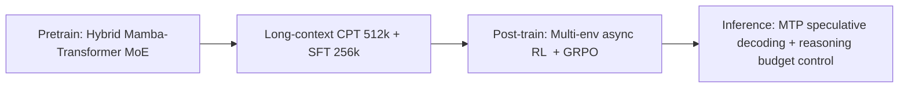

[논문 링크](https://research.nvidia.com/labs/nemotron/files/NVIDIA-Nemotron-3-White-Paper.pdf)


## NVIDIA Nemotron 3: 하이브리드 Mamba–Transformer MoE로 “정확도/처리량” 프런티어를 당기다


**Nemotron 3** 는 MoE 하이브리드 Mamba–Transformer, **LatentMoE** , **MTP** , **NVFP4** 학습, **멀티-환경 RL** 을 결합해 “정확도 대비 추론 처리량(accuracy-to-inference-throughput)”을 끌어올리고, **최대 1M tokens 컨텍스트** 와 **상대 처리량 3.3×** 를 핵심 메시지로 제시한다 (근거: §Intro/§2.2/§2.3/§2.4/§2.5/§2.6/Fig.2).      

---

## 핵심 아이디어

* **연구의 공백(research gap)**: Transformer/MoE 계열에서 (1) Attention의 KV-cache/시퀀스 길이 스케일링 비용, (2) MoE의 all-to-all 통신 + expert weight load가 추론 병목이 되며, “SOTA 정확도”를 유지하면서도 **추론 처리량/지연** 을 함께 개선하기 어렵다는 문제를 정면으로 겨냥한다 (근거: §2.1). 
* **중심 가설(central hypothesis)**: 저자들은 **MoE 하이브리드 Mamba–Transformer 아키텍처** 에 **LatentMoE(통신/로드 축소)** 와 **MTP(스펙 디코딩 친화)** 및 **NVFP4(저정밀 대규모 학습)**, **멀티-환경 RL(에이전틱 범용성)** 을 결합함으로써, 기존의 추론 병목을 완화하고 **정확도/처리량 프런티어** 를 개선하며, **1M tokens 컨텍스트** 와 **상대 처리량 최대 3.3×** 수준의 성과를 달성할 수 있다고 주장한다 (근거: §Intro/§2.1/§2.2/§2.3/§2.4/§2.5/Fig.2).      
* **오픈/투명성**: 모델 가중치, 학습 레시피, 데이터셋(총 **10T+ tokens** ) 공개를 강조한다 (근거: Abstract/§Intro).  

### Key Numbers (논문에서 확인 가능한 범위)

* Model family: **Nano / Super / Ultra** (근거: Abstract/Fig.2).  
* Context: **up to 1M tokens** (근거: §Intro/§2.5).  
* LatentMoE 축소비: **d/ℓ** , 예시로 **d=4096, ℓ=1024 → 4×** 축소 (근거: §2.2).  
* MTP: 평균 정확도 **+2.4%p**(평균) 주장, 스펙 디코딩에서 **~97% acceptance(첫 2 토큰)** (근거: §2.3/Tab.2).  
* NVFP4: **최대 25T tokens** 까지 안정적 pretrain 주장, GB300에서 FP4 peak throughput이 FP8 대비 **3×** 라고 서술 (근거: §2.4). 
* Long-context 학습: CPT **512k tokens**, SFT **256k tokens**, RL long-context env input **32k tokens** (근거: §2.5). 

---

## 배경: 그들이 해결한 문제

Nemotron 3가 반복해서 강조하는 축은 “에이전틱(agentic) 워크로드”에서의 **추론 효율** 이다 (근거: §Intro). 
에이전틱 환경은 (a) 멀티턴 히스토리/대형 문서/RAG로 컨텍스트가 길어지고, (b) 툴 호출·다중 에이전트·코딩·수학 등으로 **샘플링/롤아웃량** 이 커지며, 결과적으로 “좋은 모델”만으로는 부족하고 “빠른 모델”이 필요해진다 (근거: §Intro/§2.6).  

하지만 기존 Transformer 중심 스케일링에서는

* Attention은 시퀀스 길이 증가에 따라 KV-cache/연산 부담이 누적되고 (근거: §2.1), 
* MoE는 all-to-all 통신과 expert weight load가 병목이 되어 (근거: §2.1), 
  “정확도는 올리되 추론 처리량/지연을 유지”하기가 어렵다는 것이 출발점이다 (근거: §2.1). 

---

## 새로운 접근법: Mixture-of-Experts Hybrid Mamba–Transformer + LatentMoE + MTP (+ NVFP4, RL)

Nemotron 3의 방법론은 한 문장으로 “**attention을 ‘필요 최소한’으로 줄이고, MoE 통신/로드를 더 줄이고, 디코딩 자체도 더 싸게 만든 뒤, RL로 에이전틱 범용성을 올린다** ”에 가깝다 (근거: §2.1~§2.7).     

핵심 구성요소는 다음 4개가 특히 “시스템 관점”에서 직결된다.

1. **하이브리드 Mamba–Transformer(MoE)**: Mamba-2 레이어 비중을 크게 두고 attention 레이어 비율을 낮추며, MoE로 용량 대비 비용을 낮춘다 (근거: §2.1/§Intro).  
2. **LatentMoE**: MoE 라우팅 연산과 all-to-all payload를 **latent 차원 ℓ** 로 내리고, 통신/로드를 **d/ℓ** 만큼 줄여서 절감분으로 전문가 수/활성 전문가 수를 키운다 (근거: §2.2/Fig.3b). 
3. **MTP(Multi-Token Prediction)**: 여러 미래 토큰을 예측해 학습 신호를 풍부하게 하고, 동시에 스펙 디코딩용 draft 토큰으로 사용해 **별도 draft model 없이** 가속을 노린다 (근거: §2.3). 
4. **NVFP4 + 멀티-환경 RL + budget control**: NVFP4로 대규모 학습 효율을, 멀티-환경 RL로 에이전틱 범용성을, 추론 시 thinking budget으로 비용/정확도 트레이드오프를 제공한다 (근거: §2.4/§2.6/§2.7).   

---

## 작동 원리: 구체적인 예시로 살펴보기

### 전체 파이프라인(개념도)



* CPT **512k tokens** , SFT **256k tokens** , RL long-context env input **32k tokens** 를 명시한다 (근거: §2.5). 
* RL은 여러 환경을 “동시에” 최적화하고, async RL로 inference와 training을 분리하며, GRPO + masked importance sampling을 사용한다고 서술한다 (근거: §2.6). 

---

### (Step-by-step) LatentMoE: “통신/로드를 ℓ로 내리고, 절감분으로 K와 N을 올린다”

**용어 정의**

* $d$ : 원래 hidden dimension (예: 4096) (근거: §2.2). 
* $\ell$ : latent dimension, $\ell<d$ (예: 1024) (근거: §2.2). 
* $N$ : 전체 expert 개수, $K$ : token당 활성(top-$K$) expert 수 (근거: §2.2). 
* “all-to-all traffic/weight load”는 MoE 병목으로 지목된다 (근거: §2.1). 

**논문이 제시하는 LatentMoE 단계**

1. 각 token embedding을 $d \rightarrow \ell$ 로 **투영(projection)** 한다 (근거: §2.2/Fig.3b). 
2. 라우팅/전문가 연산을 **latent 공간(차원 $\ell$ )** 에서 수행한다 (근거: §2.2). 
3. 전문가 출력은 다시 $\ell \rightarrow d$ 로 역투영한다 (근거: §2.2). 
4. 이때 all-to-all payload와 expert weight load가 **$d/\ell$ 배 감소**한다고 서술한다 (근거: §2.2). 
5. 절감된 예산을 사용해 $N' = N\cdot(d/\ell)$ , $K' = K\cdot(d/\ell)$ 로 전문가 수/활성 전문가 수를 늘린다고 제시한다 (근거: §2.2). 
**toy example (직관용)**

* 원래 $d=6$ , latent $\ell=2$ 라고 하자 (근거: toy).
* token 벡터 $x\in \mathbb{R}^6$ 를 $P\in\mathbb{R}^{2\times 6}$ 로 곱해 $z=Px\in\mathbb{R}^2$ 로 내린다 (근거: toy).
* 라우터가 top-$K$ 전문가를 고르고, 각 expert는 $\mathbb{R}^2\rightarrow\mathbb{R}^2$ 변환만 수행한다 (근거: toy).
* 따라서 “토큰당 통신/로드 payload”가 hidden 차원에 선형 비례한다고 보면, $d=6 \rightarrow \ell=2$ 로 바뀌며 payload가 약 $d/\ell = 3\times$ 감소하는 형태가 된다 (근거: §2.2의 서술을 toy로 축약). 

---

### (Step-by-step) MTP: “학습 신호를 두껍게 + 스펙 디코딩 draft를 공짜로”

**용어 정의**

* MTP: 한 스텝에서 “다음 1토큰”뿐 아니라 “여러 미래 토큰”을 보조적으로 예측하는 기법 (근거: §2.3). 
* acceptance: 스펙 디코딩에서 draft 토큰이 base 모델 검증을 통과하는 비율 (근거: §2.3). 

**논문이 말하는 효과**

* MTP는 validation loss와 다양한 다운스트림(지식/코드/상식/RC/수학)에서 일관된 개선을 주장한다 (근거: §2.3/Tab.2).  
* 별도 draft model 없이 스펙 디코딩 가속을 가능하게 한다고 설명한다 (근거: §2.3). 
* “첫 2개 예측 토큰”에서 **~97% acceptance** 를 달성했다고 서술한다 (근거: §2.3). 

**toy example (2-step draft)**

* 현재 prefix가 “`The capital of France is`”일 때, base는 다음 토큰 1개를 생성하지만, MTP는 “`Paris`” 다음에 올 토큰(예: “`.`”)까지 함께 draft로 낸다고 보자 (근거: toy).
* 검증 단계에서 draft 2토큰이 연속으로 accept되면, 그만큼 base 디코딩 호출 횟수가 줄어든다 (근거: §2.3의 스펙 디코딩 시너지 설명). 

---

## 성능 검증: 주요 결과

### 1) “정확도/처리량 프런티어”의 정량 메시지: Fig.2

Nemotron 3는 여러 벤치마크에서 **Relative Throughput (output tokens/s/GPU)** 와 **정확도** 를 함께 그려 “프런티어 이동”을 강조한다 (근거: Fig.2). 

* 비교 모델: **DeepSeek-R1-Distill-Qwen-32B** , **Llama-3.1-70B** , **Qwen3-235B-A22B** 를 명시한다 (근거: Fig.2).  
* Nemotron 3 Ultra( **253B-A22B** )는 일부 벤치마크에서 **상대 처리량 3.3×** 를 제시한다 (근거: Fig.2). 
* 예시로 Arena-Hard-v2에서 Nemotron 3 Ultra는 **+4.6 score** 와 **3.3×** 를 함께 표기한다 (근거: Fig.2). 

> 해석(시스템 관점): 절대 tok/s가 아니라 “상대 tok/s/GPU”로 제시하지만, 목표는 명확히 “에이전틱 롤아웃/샘플링에 유리한 고처리량” 포지셔닝이다 (근거: §Intro/§2.6 + Fig.2).   

---

### 2) “비밀 병기”로 볼 구성요소: LatentMoE (Tab.1)

LatentMoE의 핵심 주장은 “라우팅 계산과 통신을 latent로 내리면, 동일 예산에서 전문가를 훨씬 풍부하게 쓸 수 있다”는 것이다 (근거: §2.2). 

#### 제거/대체 시 Δ(metric): Standard MoE vs LatentMoE (동일 73B total / 8B active / 1T tokens)

(논문 표를 그대로 재정리)

| Model            | Total Score | Code Score | Math Score | Commonsense Score | 조건                                             |
| ---------------- | ----------: | ---------: | ---------: | ----------------: | ---------------------------------------------- |
| Standard MoE     |        35.1 |       37.8 |       43.4 |              23.9 | 73B Params / 8B active / 1T tokens (근거: Tab.1) |
| LatentMoE        |        36.9 |       40.5 |       44.8 |              25.8 | 73B Params / 8B active / 1T tokens (근거: Tab.1) |
| Δ (Latent − Std) |        +1.8 |       +2.7 |       +1.4 |              +1.9 | 동일 조건 (근거: Tab.1)                              |

(근거: Tab.1).  

또한 Tab.1의 설정 예시로, Standard MoE는 **d=4096, experts=128, active=6** 이고 LatentMoE는 **ℓ=1024, experts=512, active=22** 를 사용한다 (근거: §2.2/Tab.1).  

**왜 좋아지나(메커니즘)**

* all-to-all traffic 및 expert weight load를 latent로 내려 **payload를 d/ℓ 만큼 감소**시킨 뒤, 그 절감분으로 $N, K$ 를 스케일 업하는 구조를 명시한다 (근거: §2.2). 
* 즉, “더 많은/더 다양한 expert 활용”을 “통신·메모리 예산” 안에서 가능하게 만들어 품질을 끌어올린다는 스토리다 (근거: §2.2). 

---

### 3) MTP의 정량 효과: Tab.2 (+ 스펙 디코딩 acceptance)

8B active Transformer MoE base( **1T tokens 학습** )에서 MTP를 넣으면 아래처럼 전반적으로 개선됨을 표로 제시한다 (근거: Tab.2). 

| Task                              | Baseline | + MTP |     Δ |
| --------------------------------- | -------: | ----: | ----: |
| MMLU (5-shot, acc)                |    70.06 | 71.26 | +1.20 |
| MMLU-Pro (5-shot, CoT EM)         |    45.05 | 47.84 | +2.79 |
| ARC-Challenge (25-shot, acc_norm) |    86.43 | 88.05 | +1.62 |
| GSM8K (8-shot, acc)               |    82.49 | 84.46 | +1.97 |

(근거: Tab.2). 

그리고 스펙 디코딩 관점에서 “첫 2 토큰” **~97% acceptance** 를 보고한다 (근거: §2.3). 

---

### 4) NVFP4: “25T tokens” 규모 학습 + 민감 레이어 예외처리

* NVFP4로 **최대 25T tokens** 까지 hybrid Mamba-MoE에서 안정적/정확한 pretrain을 시연했다고 서술한다 (근거: §2.4). 
* NVFP4 레시피에서 안정성을 위해 **마지막 15% 네트워크를 high precision** 으로 유지했다고 명시한다 (근거: §2.4). 
* 또한 Mamba output projection을 NVFP4로 내리면 **flush-to-zero가 최대 40%** 까지 발생할 수 있어 MXFP8 등으로 예외처리한다고 서술한다 (근거: §2.4).  
* 손실 관점에서는 NVFP4 vs BF16 상대 loss gap을 Nano에서 **<1%** , 더 큰 MoE(A8B active)에서 **<0.6%** 로 제시한다 (근거: Fig.4). 

---

### 5) Long-context: RoPE 제거 + 1M tokens에서의 강건성(RULER)

* Nemotron 3는 **최대 1M tokens 컨텍스트** 지원을 명시한다 (근거: §2.5). 
* RoPE가 컨텍스트 확장에 장애가 될 수 있고, Mamba 레이어가 implicit positional 정보를 제공하므로 attention 레이어에서 **RoPE를 사용하지 않는다** 고 서술한다 (근거: §2.5). 
* RULER에서 Dense Hybrid(Nemotron-Nano-12B-v2-Base) 대비 MoE hybrid(Nemotron-3-Nano-30B-A3B-Base)가 **1M에서 더 완만한 성능 저하(graceful degradation)** 를 보였다고 표로 제시한다 (근거: Tab.3). 

| Model                                     |  128k |  256k |  512k |    1M |
| ----------------------------------------- | ----: | ----: | ----: | ----: |
| Nemotron-Nano-12B-v2-Base (Dense Hybrid)  | 85.13 | 79.85 | 75.12 | 23.43 |
| Nemotron-3-Nano-30B-A3B-Base (MoE hybrid) | 74.48 | 71.67 | 66.02 | 54.19 |

(근거: Tab.3). 

추가로, code 시퀀스( **1M+ tokens** )에서 token position이 뒤로 갈수록 NLL이 감소하는 경향 및 power-law fit **R²=0.883** 를 그림으로 제시한다 (근거: Fig.6).  

---

## 우리의 관점: 강점, 한계, 그리고 이 연구가 중요한 이유

### 강점

* **병목을 “정면”으로 다룬 구성의 조합**: LatentMoE(통신/로드), MTP(디코딩), NVFP4(학습 효율), 멀티-환경 RL(범용성)을 한 제품군 설계로 묶었다는 점이 메시지 일관성이 있다 (근거: §Intro/§2.2~§2.7).    
* **오픈 스택까지 포함한 “엔드투엔드” 주장**: RL 스택(NeMo-RL, NeMo-Gym)을 **Apache 2.0** 으로 오픈소스한다고 명시한다 (근거: §2.6). 
* **길이 외삽(length extrapolation) 서사를 수치로 제시**: “RoPE 미사용 + 512k 학습 + 1M 평가”를 Tab.3/Fig.6로 연결했다 (근거: §2.5/Tab.3/Fig.6).   

### 한계(논문이 남기는 질문)

* **절대 서빙 지표의 부재**: 핵심 도표가 “Relative Throughput (output tokens/s/GPU)” 중심이라, 실제 서빙에서의 TTFT(ms), TPOT(ms/token), 메모리/배치/동시성 조건을 직접 추정하기는 어렵다 (근거: Fig.2가 상대치로 제시). 
* **NVFP4의 ‘예외처리’ 비용**: 안정성을 위해 마지막 **15% high precision** 유지, 일부 레이어 MXFP8 유지 등 “혼합 정밀” 운용 복잡성이 남는다 (근거: §2.4). 
* **Long-context RL 입력은 32k tokens** 로 서술되어, “1M tokens 컨텍스트”를 RL 단계에서 직접 다루는지(예: tool-use long-horizon을 1M으로 학습하는지)는 별도의 확장이 필요해 보인다 (근거: §2.5/§2.6).  

---

## 다음 단계는?: 앞으로의 길

* **Long-context 학습/후처리의 일관성 강화**: CPT/SFT/RL에서 각각 512k/256k/32k로 명시된 길이 스케줄을, 더 긴 RL 입력(예: 128k+ tokens)으로 확장할 때 안정성·보상설계·샘플링 비용이 어떻게 변하는지 추가 정량이 필요하다 (근거: §2.5/§2.6).  
* **MTP × 스펙 디코딩의 “실서빙” 효과 분해**: acceptance **~97%** 는 고무적이지만, 이를 실제 TPOT(ms/token)·TTFT(ms)·다양한 배치/길이 분포에서 분해해 보여주면, Fig.2의 상대 처리량 메시지를 더 강하게 뒷받침할 수 있다 (근거: §2.3/Fig.2).  
* **LatentMoE의 시스템 비용(통신/로드) 프로파일링 공개**: LatentMoE는 d/ℓ로 payload를 줄인다고 명시하므로, NCCL all-to-all bytes, expert weight paging/캐싱, 라우팅 분산(로드밸런싱) 지표를 함께 제시하면 “왜 빨라지는지”가 더 직접적으로 검증된다 (근거: §2.2/§2.1).  


### 토글을 클릭하면 논문에 대한 자세한 LLM 질의응답 내용을 확인할 수 있습니다.

<details markdown="block">
<summary>▶️<strong>클릭하여 펼치기</strong></summary>


## 프롬프트 1.1.1 (연구의 공백)

```
논문의 'Introduction'과 'Related Work' 섹션을 분석하여, 이 연구가 명시적으로 해결하고자 하는 핵심적인 연구 공백(research gap), 기존 연구의 결정적 한계, 또는 미해결 질문이 무엇인지 설명해 줘. 저자들이 설명하는, 이 논문 출판 시점의 '최신 기술(state of the art)'은 어떤 상태였는지 요약해 줘.
```


Nemotron 3가 겨냥하는 핵심 공백은 “**에이전틱/추론 워크로드에서** 높은 정확도를 유지하면서도, **(1) 추론 시 KV-cache/attention 비용**, **(2) MoE의 메모리 대역폭·all-to-all 병목**, **(3) RoPE 기반 장문 컨텍스트 확장 취약성**, **(4) RL post-training의 staged 학습 불안정성(능력 붕괴·reward hacking)** 을 동시에 해결하는 ‘오픈’ 모델 설계”이다. (근거: §1, §2.1, §2.2, §2.5, §2.6)     

---

## 1) 저자들이 “명시적으로” 설정한 문제 정의 (Introduction 기반)

* Nemotron 3는 **agentic AI 애플리케이션**을 목표로 하며, “정확도 ↔ 추론 처리량” 프런티어를 밀어붙이는 것을 1차 목표로 둔다. (근거: §1) 
* **최대 1M tokens 컨텍스트** 지원을 핵심 요구조건으로 둔다. (근거: §1) 
* 추론 시 **reasoning budget control**(예: thinking trace 토큰 예산)을 “제품 기능”으로 포함한다. (근거: §1, §2.7)  
* post-training에서 **다양한 RL 환경을 동시에** 학습시켜 tool use/경쟁 코딩/수학 등 범용성을 올리는 전략을 전면에 둔다. (근거: §1, §2.6)  

---

## 2) 연구 공백 (Research Gap)과 기존 접근의 “결정적 한계”

아래 4개가 이 문서에서 사실상 Related Work 역할(§2 기술 설명 + 인용)과 함께 드러나는 **핵심 공백**이다. (근거: §2.1–§2.7 전반)     

### (G1) “Transformer MoE = attention이 비싸다” → 추론 처리량 한계

* Transformer 계열에서 self-attention은 **생성 과정에서 KV-cache가 선형 증가**하며, 이것이 추론 비용을 지배한다는 문제의식을 전제한다. (근거: §2.1) 
* 그래서 기존처럼 “MoE + attention을 촘촘히 interleave”하는 설계는 **추론 효율(throughput)** 관점에서 불리하다고 본다. (근거: §2.1) 

**Nemotron 3의 공백 정의:** “정확도는 SOTA급을 지키되, attention 층을 최소화해서 KV-cache 기반 비용을 줄여 추론 처리량을 끌어올릴 수 있나?” (근거: §2.1, Fig.1, Fig.2)  

---

### (G2) MoE의 병목이 “배포 모드(지연 vs 처리량)”에 따라 다르다

* 지연(latency) 중심에서는 MoE가 **메모리 대역폭 bound**(expert weight read가 지배)로 동작한다고 정리한다. (근거: §2.2) 
* 처리량(throughput) 중심에서는 token dispatch/aggregate의 **all-to-all 통신량**이 병목이며, 이 통신량은 **K(활성 expert 수)·d(hidden dim)** 에 선형 비례한다고 명시한다. (근거: §2.2) 

**Nemotron 3의 공백 정의:** “MoE의 비선형 예산(대략 (K \times m))을 키워 품질을 올리면서도, **메모리·통신 비용**을 동시에 억제할 하드웨어-인지적 구조가 필요한가?” (근거: §2.2) 

---

### (G3) 초장문 컨텍스트 확장: RoPE OOD 문제가 시스템 요구(1M tokens)와 충돌

* RoPE가 **학습 길이를 넘어서는 컨텍스트 확장의 장애물**이라는 점을 전제로 둔다. (근거: §2.5) 
* Nemotron 3는 “Mamba가 implicit positional info를 제공”하므로 attention layer에서 **RoPE를 쓰지 않는다**고 못 박는다. (근거: §2.5) 

**Nemotron 3의 공백 정의:** “RoPE 기반 extrapolation 리스크를 구조적으로 제거하면서, 512k 학습 이후 1M까지 ‘graceful degradation’이 가능한가?” (근거: §2.5, Tab.3) 

---

### (G4) RL post-training: staged 학습의 불안정성과 능력 간 트레이드오프

* 과거 방식(저자들의 “previous models”)은 task별 **staged training**을 썼고, 이 방식이 **reward hacking** 및 **일부 능력 degradation**으로 이어질 수 있다고 지적한다. (근거: §2.6) 
* 그래서 Nemotron 3에서는 **여러 RL 환경을 동시에** 학습시키는 것이 “더 안정적”이라고 주장한다. (근거: §2.6) 

**Nemotron 3의 공백 정의:** “에이전틱/추론/코딩/장문 등 이질적 능력을 **동시 최적화**하면서도 학습 안정성을 확보할 수 있나?” (근거: §2.6, Fig.7) 

---

## 3) 논문 시점의 “SOTA는 어떤 상태였나?” (문서 내 비교/서술 기준)

이 화이트페이퍼가 제시하는 SOTA 기준은 “**동급(30B-A3B 등) MoE 대비 정확도와 처리량**, 그리고 **1M tokens 장문 컨텍스트**”로 요약된다. (근거: §1, Fig.2)  

### SOTA 스냅샷(문서에 명시된 비교 포인트)

| 축                    | 당시 SOTA/비교 기준(문서 내)                                                                 | 기존 한계로 제시된 점                                                           | Nemotron 3가 겨냥한 방향                                                                                |
| -------------------- | ----------------------------------------------------------------------------------- | ---------------------------------------------------------------------- | ------------------------------------------------------------------------------------------------- |
| 추론 처리량               | Nemotron-3-Nano-30B-A3B vs Qwen3-30B-A3B(-Thinking-2507) 상대 처리량 비교 (근거: Fig.2)      | Transformer MoE는 attention+KV-cache 비용이 커서 처리량이 제한된다는 문제의식 (근거: §2.1)  | Mamba-2 + MoE 위주로 attention 층을 “select few”로 최소화 (근거: Fig.1, §2.1)                                |
| 장문 컨텍스트(1M)          | “context lengths up to 1M tokens”을 제품 요구조건으로 설정 (근거: §1, Abstract)                  | RoPE OOD 문제가 컨텍스트 확장의 대표 장애물 (근거: §2.5)                                | attention layer에서 RoPE 미사용 + CPT 512k/SFT 256k + RL long-context env(입력 32k) (근거: §2.5)           |
| MoE 효율/품질            | LatentMoE는 routed load와 all-to-all traffic을 (d/\ell) (보통 약 4×) 줄인다고 명시 (근거: Fig.3)  | latency 모드에서는 BW-bound, throughput 모드에서는 all-to-all이 병목 (근거: §2.2)     | latent space로 routing/compute를 옮겨 N, K를 (d/\ell) 배 확장해 “accuracy per byte”를 올림 (근거: §2.2, Fig.3)  |
| RL post-training 안정성 | multi-env RL을 “동시 학습”하고, rollout 효율을 위해 async 구조+MTP를 사용 (근거: §2.6)                 | staged 학습은 reward hacking 및 capability degradation 위험 (근거: §2.6)       | GRPO + masked importance sampling을 언급하며 안정성을 확보 (근거: §2.6)                                        |

---

## 4) “한계/미해결 질문” 형태로 재구성 (리뷰 관점 체크포인트)

* 문서가 “Related Work” 섹션을 별도로 두지 않고 §2 기술 서술로 대체하기 때문에, **비교 대상(SOTA)의 설정이 Fig.2 중심으로 제한**되어 있다. (근거: Fig.2, §2 구성)  
* “정확도”는 여러 벤치마크 막대그래프 및 테이블로 제시되지만, **동일 프롬프트/디코딩 세팅의 완전 명시**는 이 화이트페이퍼 범위 밖(“technical report를 보라”)로 위임한다. (근거: Fig.2 캡션) 
* 1M 컨텍스트에서의 강점은 RULER 기반으로 수치화되며(예: Nemotron-3-Nano-30B-A3B-Base 1M에서 54.19 vs Nemotron-Nano-12B-v2-Base 23.43), **태스크 일반화(예: 실제 RAG/코드베이스 전체 수정)** 까지의 외삽은 추가 근거가 필요하다. (근거: Tab.3) 


## 프롬프트 1.1.2 (핵심 가설)

```
이 논문의 중심 가설(central hypothesis) 또는 핵심 주장은 무엇인가? '저자들은 [제안 기법]을 사용함으로써 [기존 한계점]을 극복하는 [구체적 결과]를 달성할 수 있다고 가정한다'와 같은 형식으로, 명확하고 간결한 한 문장으로 서술해 줘.
```

* 저자들은 **Mamba-2 기반 하이브리드 아키텍처(소수의 Attention 층 + MoE/LatentMoE)** 를 사용함으로써 기존 **Transformer-MoE의 KV-cache/Attention 비용 및 MoE all-to-all 통신·메모리 병목, 그리고 RoPE 기반 장문 컨텍스트 확장 취약성** 을 동시에 완화하고, 결과적으로 **1M tokens 컨텍스트에서 정확도–추론 처리량 프런티어를 개선** 할 수 있다고 가정한다. (근거: §1, §2.1, §2.2, §2.5, Fig.2)     


## 프롬프트 1.2.1 (독창성 식별)

```
논문 전체를 바탕으로, 가장 중요하고 독창적인 기여(contribution) 1~3가지를 구별되는 항목으로 나열해 줘. 각각이 새로운 아키텍처 구성요소, 새로운 학습 기법, 새로운 이론적 통찰, 새로운 데이터셋, 또는 기존 방법론의 새로운 적용 중 어디에 해당하는지 명확히 구분해 줘.
```

## 독창적 기여(contribution) 3가지 (논문 전체 기준)

|  # | Contribution                                                  | 분류                         | 무엇이 “새로운가”                                                                                                                                                                                    | 근거로 확인되는 핵심 포인트(숫자 포함)                                                                                                                                                                                                                                                                                                                                                                                                                                                                                                |
| -: | ------------------------------------------------------------- | -------------------------- | --------------------------------------------------------------------------------------------------------------------------------------------------------------------------------------------- | --------------------------------------------------------------------------------------------------------------------------------------------------------------------------------------------------------------------------------------------------------------------------------------------------------------------------------------------------------------------------------------------------------------------------------------------------------------------------------------------------------------------- |
|  1 | **Hybrid Mamba-Transformer MoE 아키텍처**                         | 새로운 아키텍처 구성요소              | MoE를 **비싼 self-attention과 촘촘히 interleave** 하는 대신, **MoE ↔ Mamba-2** 를 주로 interleave하고 **attention layer는 소수만** 두는 하이브리드 레이어 패턴을 “추론 효율(특히 reasoning)” 최적화 목표로 명시적으로 채택했다. (근거: §2.1, Fig.1)   | 생성 중 self-attention은 **KV-cache가 선형 증가** 하므로 expensive하다고 전제하고, Mamba-2는 **generation 중 constant state** 만 저장하면 된다고 대비한다. (근거: §2.1)   또한 Nemotron-3-Nano-30B-A3B가 Qwen3-30B-A3B 대비 **3.3× 상대 throughput( output tokens/s/GPU )** 를 제시한다. (근거: Fig.2, §2.1)                                                                                                                                                                                                                                                           |
|  2 | **LatentMoE**                                                 | 새로운 아키텍처 구성요소 + 새로운 이론적 통찰 | “MoE 병목은 latency 모드에서는 **메모리 BW**, throughput 모드에서는 **all-to-all 통신**”이라는 배포-모드별 병목 분석 위에서, routed 경로를 **latent dimension(ℓ)** 로 축소해 **통신·가중치 로드**를 함께 줄이는 구조를 제안한다. (근거: §2.2, Fig.3)        | routed parameter loads와 all-to-all traffic을 **(d/ℓ)** 배 줄이며, 문서에서는 **통상 약 4×** 라고 명시한다. (근거: Fig.3)   절감분으로 experts 수를 **(N' = N \cdot d/ℓ)**, top-K를 **(K' = K \cdot d/ℓ)** 로 키운다고 서술한다. (근거: §2.2)   구체 예로 Standard MoE는 **d=4096, total experts=128, active=6**, LatentMoE는 **ℓ=1024, total experts=512, active=22** 로 설정했다. (근거: Tab.1)   동일 조건( **~8B active / ~73B total params, 1T tokens 학습** )에서 LatentMoE가 여러 aggregated 벤치마크에서 우세(예: MMLU-Pro **48.30→52.87**, MMLU **70.10→72.11** )를 보고한다. (근거: Tab.1)   |
|  3 | **Multi-environment RL post-training(동시 학습) + 효율적 RL 시스템 설계** | 새로운 학습 기법                  | 과거 “task별 staged RL” 대비, 수학/코딩/툴유즈/롱컨텍스트 등 **다양한 RL 환경을 하나의 RL 런에서 동시 학습** 하는 전략을 전면에 두고, 이를 **더 안정적이며 reward hacking에 덜 취약** 하다고 주장한다. (근거: §2.6, Fig.7)                                     | rollout 효율을 위해 **훈련-추론 분리(asynchronous RL)** 및 **multi-token prediction(MTP) 기반 rollout 가속** 을 사용한다고 명시한다. (근거: §2.6)   학습 안정화를 위해 **GRPO(Shao et al., 2024) + masked importance sampling** 을 사용한다고 서술한다. (근거: §2.6)   또한 post-training 스택으로 **NeMo-RL( Apache 2.0 )**, **NeMo-Gym** 을 언급한다. (근거: §2.6)                                                                                                                                                                                                               |


## 프롬프트 1.2.2 (저자 관점에서의 강점)

```
저자들의 관점에서, 자신들의 접근법이 이전 방법들보다 우월한 이유는 무엇인가? 그들이 자신들의 연구가 지닌 독창성과 강점을 뒷받침하기 위해 사용하는 핵심 논거를 인용하거나 알기 쉽게 설명해 줘.
```

## 저자 관점의 핵심 강점 요약 

Nemotron 3의 우월성 논거는 (1) **Hybrid Mamba-Transformer MoE** 로 self-attention(KV-cache) 비용을 구조적으로 줄여 **정확도–추론 처리량 프런티어** 를 개선하고, (2) **LatentMoE** 로 MoE의 **메모리 BW/All-to-All 병목** 을 하드웨어 관점에서 재설계하며, (3) **1M tokens 장문 컨텍스트 + 동시 멀티환경 RL + reasoning budget control** 로 “agentic + reasoning” 실사용 요구를 통합적으로 만족한다는 주장이다. (근거: §1, §2.1, §2.2, §2.5, §2.6, §2.7, Fig.2, Fig.3, Tab.3)     

---

## 저자들이 제시하는 “우월한 이유”의 핵심 논거

### 1) 추론 효율: KV-cache가 커지는 self-attention을 최소화하고 Mamba-2를 주 경로로 사용 **

Nemotron 3는 MoE 층을 “비싼 self-attention”과 촘촘히 섞는 대신, MoE를 주로 **Mamba-2** 와 interleave하고 attention 층은 “select few”만 둔다고 명시한다. (근거: §2.1, Fig.1)  
이 설계 선택의 근거로, self-attention은 생성 중 **선형으로 증가하는 KV-cache** 를 매 토큰 참조해야 하지만, Mamba-2는 생성 중 **constant state** 만 저장하면 된다고 대비한다. (근거: §2.1) 
그 결과로 Nemotron-3-Nano-30B-A3B는 (ISL/OSL=8k/16k 설정에서) Qwen3-30B-A3B 대비 **3.3× 상대 throughput (output tokens/s/GPU)** 를 제시하면서도, reasoning 및 1M long-context(RULER@1M)에서 SOTA급 정확도를 달성한다고 주장한다. (근거: Fig.2, §2.1)  

### 2) MoE의 “배포 모드별 병목”을 정면으로 모델 설계에 반영 **

저자들은 MoE가 latency 중심에서는 **메모리 BW-bound(가중치 read 지배)** 이고, throughput 중심에서는 **all-to-all 통신(토큰 dispatch/aggregate)** 이 병목이라고 분해한다. (근거: §2.2) 
또한 all-to-all 통신량이 **top-K active experts (K)** 와 **hidden dim (d)** 에 선형 비례한다고 명시해, “품질 향상(더 큰 (K))”이 곧 “통신 병목 악화”로 직결됨을 논거로 삼는다. (근거: §2.2)  

### 3) LatentMoE: MoE all-to-all/weight load를 (d/\ell) 배 줄이고 그 예산을 품질로 재투자 **

LatentMoE는 routed 경로를 latent dim $(\ell < d)$로 옮겨 **routed parameter loads + all-to-all traffic** 를 **$(d/\ell)$ 배(통상 약 4×)** 절감한다고 주장한다. (근거: Fig.3, §2.2)  
절감된 예산으로 experts 수를 $(N' = N \cdot d/\ell)$, top-K를 $(K' = K \cdot d/\ell)$로 키워 **accuracy per byte** 를 개선하되, 전체 추론 비용은 대략 일정하게 유지한다고 설명한다. (근거: §2.2, Fig.3)  
구체 설정 예로 Standard MoE는 **(d=4096), experts=128, active=6** 이고 LatentMoE는 **$(\ell=1024)$, experts=512, active=22** 로 제시한다. (근거: §2.2) 
동일 조건(Active $(\approx)$ 8B params, Total $(\approx)$ 73B params, 학습 **1T tokens** )에서 LatentMoE가 Standard MoE 대비 MMLU-Pro **48.30%→52.87%**, MMLU **70.10%→72.11%** 등으로 일관되게 우수하다고 보고한다. (근거: Tab.1)  

### 4) 1M tokens 장문 컨텍스트: RoPE OOD 문제를 구조적으로 회피하고 “graceful degradation”을 강조 **

Nemotron 3는 agentic reasoning을 위해 **최대 1M tokens 컨텍스트** 지원을 핵심 목표로 명시한다. (근거: §1, §2.5)  
저자들은 RoPE가 “학습 길이 밖으로 컨텍스트를 확장할 때의 known hurdle”이라고 두고, Mamba가 implicit positional info를 제공하므로 **attention layer에서 RoPE를 쓰지 않아 OOD RoPE 이슈를 겪지 않는다** 고 주장한다. (근거: §2.5) 
학습/후처리로는 CPT **512k tokens**, SFT **256k tokens**, RL의 long-context env 입력 **최대 32k tokens** 를 포함했다고 서술한다. (근거: §2.5) 
RULER 기준으로 Nemotron-3-Nano-30B-A3B-Base는 1M에서 **54.19**, Nemotron-Nano-12B-v2-Base는 1M에서 **23.43** 을 제시하며, 전자는 512k→1M에서 **graceful degradation**, 후자는 **abrupt dropoff** 라고 해석한다. (근거: Tab.3) 

### 5) Post-training(RL): staged RL의 부작용(능력 저하/보상 해킹)을 “동시 멀티환경 RL”로 완화 **

저자들은 과거 모델에서 task별로 RL을 분리한 staged training을 했고, 이것이 **reward hacking** 및 일부 능력 **degradation**으로 이어질 수 있다고 명시한다. (근거: §2.6) 
Nemotron 3는 수학·과학 추론, 경쟁 코딩, instruction following, SW engineering, search, chat, tool use, long context 등 **다양한 RL 환경을 단일 RL 런에서 동시 학습** 하며, 이를 **더 안정적이고 reward hacking에 덜 취약** 하다고 주장한다. (근거: §2.6, Fig.7) 
대규모 rollout을 위해 **async RL(훈련-추론 분리)** 과 **MTP 기반 rollout 가속**, 그리고 안정화를 위한 **GRPO + masked importance sampling** 을 사용한다고 기술한다. (근거: §2.6) 

### 6) MTP: “정확도 소폭 상승 + 추론 가속(특히 speculative decoding)”을 동시에 가져오는 레버리지 **

저자들은 MTP가 정확도와 추론 효율 모두에 효과적이며, speculative decoding에서 별도의 draft model 없이도 가속 이점을 준다고 정리한다. (근거: §2.3) 
Ablation(8B active transformer MoE base)에서 MTP가 벤치마크 평균 **약 2.4%** 개선을 보고하며, 예로 MMLU(5-shot)는 **70.06%→71.26%**, GSM8K(8-shot)는 **82.49%→84.46%** 를 제시한다. (근거: §2.3, Tab.2)  
또한 “lightweight MTP module”이 첫 2개 예측 토큰에서 **약 97% acceptance** 를 보였다고 서술하며, 이를 긴 문장 생성 및 batch-size=1 시나리오의 지연 개선 근거로 든다. (근거: §2.3) 

### 7) 제품성: inference-time reasoning budget control로 “정확도↔효율” 트레이드오프를 노출 **

Nemotron 3는 “thinking trace에 사용할 최대 토큰 수”를 유저가 지정하고, 예산 도달 시 `</think>` 를 append해 다음 생성으로 넘어가는 **inference-time budget control** 을 지원한다고 설명한다. (근거: §2.7) 
이 기능은 추론 예산에 따른 정확도–효율 트레이드오프를 Figure로 제시한다. (근거: Fig.8) 

### 8) 공개성: “오픈”을 차별점으로 명시 **

저자들은 모델 가중치, **10T+ tokens 데이터셋**, 학습 레시피를 릴리즈하겠다고 명시하며, 이를 “open and transparent”의 근거로 내세운다. (근거: §1) 

---

##  저자들이 암묵적으로 만드는 ‘종합 논리’ 한 줄로 정리 **

**Hybrid(Attention 최소화)로 tokens/s를 확보하고, LatentMoE로 MoE 병목을 (d/\ell) 만큼 줄여 품질을 올리며, 1M 컨텍스트 + 동시 멀티환경 RL + 예산 제어로 agentic/reasoning 실사용 요구를 end-to-end로 커버한다** 는 것이 저자들의 “우월성” 서사다. (근거: §1, §2.1, §2.2, §2.5, §2.6, §2.7, Fig.2, Fig.3, Tab.1, Tab.3)     


## 프롬프트 1.3.1 (알고리즘 단계별 설명)

```
핵심 알고리즘, 모델 아키텍처, 또는 주요 방법론을 단계별(step-by-step)로 설명해 줘. 독자는 AI 분야의 대학원생 수준이라고 가정해. 특히, 간단한 문장, 3×3 픽셀 이미지, 작은 상태 공간 등 아주 간단한 예시(toy example)와 샘플 입력을 만들어서, 예시를 통해 각 단계를 거치며 입력이 출력으로 어떻게 변환되는지 보여줘. 등장하는 모든 핵심 용어와 변수는 그 즉시 정의해 줘.
```


## 

Nemotron 3의 “핵심 방법론”은 **(A) MoE ↔ Mamba-2를 주로 interleave하고 self-attention은 소수만 두는 하이브리드 레이어 패턴** 과 **(B) LatentMoE로 routed 경로를 latent 차원 $(\ell)$ 로 축소해 all-to-all/weight load를 $(\frac{d}{\ell})$ 배 줄이는 MoE 재설계** 를 결합하는 것이다. (근거: §2.1, Fig.1)  (근거: §2.2, Fig.3) 

---

## 0) 용어/변수 정의 (즉시 정의)

* $(T)$: 시퀀스 길이(tokens)
* $(x_{1:T})$: 입력 토큰 시퀀스
* $(d)$: 모델 hidden dimension (예: 4096) (근거: §2.3/Tab.1 서술부) 
* $(\ell)$: LatentMoE에서 routed 경로에 쓰는 latent dimension, $(\ell < d)$ (근거: §2.2) 
* $(N)$: (전체) experts 수, $(K)$: 토큰당 활성(top-$(K)$) experts 수 (근거: §2.2) 
* $(h_t \in \mathbb{R}^d)$: $t$번째 토큰의 hidden state
* $(z_t \in \mathbb{R}^{\ell})$: LatentMoE routed 경로의 latent state
* **KV-cache**: self-attention 디코딩에서 과거 token의 K/V를 저장해 재사용하는 캐시(길이에 따라 선형 증가) (근거: §2.1) 
* **Mamba-2 layer**: 생성 중 **constant state만 저장** 하는 시퀀스 모델링 레이어 (근거: §2.1) 
* **LatentMoE**: routed expert 입력을 $(d \rightarrow \ell)$ 로 축소해 **routed parameter loads + all-to-all traffic를 $(\frac{d}{\ell})$ 배 감소** 시키는 MoE (근거: Fig.3) 
---

## 1) 전체 아키텍처를 “블록” 단위로 보기 (step-by-step)

Nemotron 3는 **Mamba-2 + MoE** 가 대부분이고, **self-attention은 “select few”만 포함** 한다. (근거: §2.1, Fig.1) 
또한 전체적으로 **MoE(희소 파라미터 스케일링), attention(고품질 all-to-all 라우팅), Mamba-2(고정 추론 메모리/연산)** 의 “밸런스 조합”을 사용한다고 명시한다. (근거: §2.1) 


---

## 2) 핵심 블록 1: Hybrid 레이어 패턴 (MoE ↔ Mamba-2, attention 최소화)

### Step 2.1: 왜 attention을 줄이나?

self-attention은 생성 중 **선형으로 증가하는 KV-cache를 매 토큰 참조** 해야 “expensive”하다고 서술한다. (근거: §2.1) 

### Step 2.2: Mamba-2를 왜 넣나?

Mamba-2는 생성 중 **constant state만 저장** 하면 되므로 attention 대비 추론 메모리/연산 관점에서 유리하다는 논리를 제시한다. (근거: §2.1) 

### Step 2.3: 그래서 무엇을 하느냐?

MoE 레이어를 “expensive self-attention”과 촘촘히 섞지 않고, **MoE를 주로 Mamba-2와 interleave** 하며 **attention layer는 일부만** 둔다. (근거: §2.1) 

---

## 3) 핵심 블록 2: LatentMoE (step-by-step)

LatentMoE는 토큰의 routed 경로를 $(d)$에서 $(\ell)$로 줄여 **통신/메모리 병목을 $(\frac{d}{\ell})$ 배 축소** 하고, 절약분으로 experts 수와 top-$(K)$를 같은 배수로 늘려 “accuracy per byte”를 높인다고 설명한다. (근거: Fig.3) 

### Step 3.1: Down-project ( $(d \rightarrow \ell)$ )

각 토큰 hidden $(h_t \in \mathbb{R}^d)$ 를 projection으로 latent $(z_t \in \mathbb{R}^{\ell})$ 로 내린다. (근거: §2.2) 

### Step 3.2: Route (gating) + Top-$(K)$ 선택

gate가 $(z_t)$ 로부터 experts에 대한 점수를 만들고, top-$(K)$ experts만 활성화한다. 이때 routed 경로가 latent 공간이므로 **all-to-all payload와 expert weight load가 $(\frac{d}{\ell})$ 만큼 감소** 한다. (근거: §2.2/Fig.3) 

### Step 3.3: Expert compute in latent space

선택된 experts가 **latent 공간에서만** FFN(또는 MLP) 변환을 수행한다. (근거: §2.2) 

### Step 3.4: Aggregate + Up-project ( $(\ell \rightarrow d)$ )

expert 출력들을 게이트 가중치로 합성한 뒤, 다시 $(d)$ 로 projection한다. (근거: §2.2) 

### Step 3.5: 비용/스케일링 규칙(핵심 공식)

routed 비용을 줄인 만큼 experts 수와 top-$(K)$를
[
N' = N \cdot \frac{d}{\ell}, \quad K' = K \cdot \frac{d}{\ell}
]
로 늘린다고 명시한다. (근거: §2.2) 

---

## 4) Toy Example로 “입력 → 출력”을 직접 따라가기 (작게, 숫자로)

여기서는 LatentMoE 한 번 + Mamba-2(단순화) 한 번을 **손으로 추적** 한다. 아래 숫자는 이해를 위한 toy 설정이며, 실제 Nemotron 3의 차원/파라미터와 무관하다.

### 4.1 샘플 입력: 3×3 픽셀을 토큰으로 본다면

3×3 흑백 이미지(0/1)를 좌→우, 상→하로 펼쳐 9개의 토큰으로 만든다.

```
I =
1 0 1
0 1 0
1 0 0
```

* 토큰 시퀀스 (x_{1:9} = [1,0,1,0,1,0,1,0,0])
* 시퀀스 길이 (T=9)

### 4.2 Toy 차원/모수 설정

* hidden dim (d=6)
* latent dim $(\ell=3)$  (즉 $(\frac{d}{\ell} = 2)$, routed payload가 2× 줄어드는 형태를 흉내) (근거: Fig.3의 “$(\frac{d}{\ell})$” 규칙) 
* experts (N=4), 활성 (K=2)

---

## 5) Step-by-step: 한 토큰 (t) 에 대한 LatentMoE forward (숫자 예시)

### Step 5.1 Embed 후 hidden $(h_t)$ 를 얻었다고 하자

toy로 다음 hidden을 가정:

[
h_t =
\begin{bmatrix}
2\0\1\-1\0\1
\end{bmatrix} \in \mathbb{R}^6
]

### Step 5.2 Down-project $(z_t = W_{\text{down}} h_t)$

toy로 “앞 3개 성분만 취한다”고 두면:

[
z_t =
\begin{bmatrix}
2\0\1
\end{bmatrix} \in \mathbb{R}^3
]

### Step 5.3 Gating 점수 계산 후 Top-(K)=2 선택

gate 점수(예시)는
[
\text{score} = z_t^\top W_g = [3,;1,;-2,;0]
]
이고 softmax 확률은 대략
[
p \approx [0.839,;0.114,;0.006,;0.042]
]
라 하자.
→ Top-2 experts는 ($e_0$, $e_1$).

### Step 5.4 Experts가 latent에서 변환

toy expert 함수(선형)로 두면:

* $(e_0(z_t) = [2,0,1])$
* $(e_1(z_t) = [0,2,1])$

### Step 5.5 Weighted aggregate (선택된 2개만 정규화해 합친다고 가정)

선택된 두 확률만 정규화하면
[
w_0 \approx 0.881,\quad w_1 \approx 0.119
]
따라서
[
z^{\text{out}}_t = w_0 e_0(z_t) + w_1 e_1(z_t)
= [1.7616,;0.2384,;1.0000]
]

### Step 5.6 Up-project

toy로 “앞 3개 슬롯에만 다시 채운다”고 두면

[
h^{\text{MoE}}_t =
\begin{bmatrix}
1.7616\0.2384\1.0000\0\0\0
\end{bmatrix} \in \mathbb{R}^6
]

이로써 “routing/compute는 $(\ell)$에서 하고, 최종 출력은 $(d)$로 복귀”라는 LatentMoE 핵심 동작을 따라갔다. (근거: §2.2의 latent에서 compute 후 $(d)$로 복귀) 

---

## 6) Step-by-step: Mamba-2의 “constant state” 직관 (초단순 SSM toy)

Nemotron 3는 Mamba-2가 생성 중 **constant state만 저장** 한다고 설명한다. (근거: §2.1) 
이를 직관적으로 보여주기 위해, 상태 $(s_t)$ 가 스칼라 1개인 toy recurrence를 가정한다(실제 Mamba-2는 더 복잡한 벡터 상태).

* 상태 업데이트(예시):
  [
  s_t = 0.5 s_{t-1} + 0.1 \cdot \text{sum}(h_t)
  ]
* 출력(예시):
  [
  y_t = h_t + s_t
  ]

초기 (s_0=0), 입력 hidden을 순서대로
[
h_1=[1,0,0,0,0,0],; h_2=[0,1,0,0,0,0],; h_3=[0,0,1,0,0,0]
]
로 두면:

* $(t=1)$: $(s_1=0.1)$, $(y_1=[1.1,0.1,0.1,0.1,0.1,0.1])$
* $(t=2)$: $(s_2=0.15)$, $(y_2=[0.15,1.15,0.15,0.15,0.15,0.15])$
* $(t=3)$: $(s_3=0.175)$, $(y_3=[0.175,0.175,1.175,0.175,0.175,0.175])$


핵심은 저장해야 할 메모리가 $(s_t)$ (상수 크기) 라는 점이다(= 길이 $(T)$에 비례해 커지지 않음). 이 직관이 white paper의 “constant state during generation” 주장과 연결된다. (근거: §2.1) 


## 7) (선택) self-attention 레이어가 들어갈 때의 역할

Nemotron 3는 self-attention 레이어를 “소수”만 포함한다고 밝히며, attention은 **high-fidelity all-to-all 정보 라우팅** 을 제공하는 구성요소로 위치시킨다. (근거: §2.1) 


## 프롬프트 1.3.2 ('비밀 병기' 식별)

```
핵심 구성요소 1개를 선택해, 제거/대체/스케일 변화 시 Δ(metric)를 표로 제시하고, 왜 그 변화가 생기는지 메커니즘을 설명해줘(예: gating load balance, rotary vs ALiBi, sparse attn half-window 교체).
```

## ‘비밀 병기’ 선택: **LatentMoE**  (근거: §2.2, Fig.3) 

LatentMoE를 **Standard MoE로 대체(=제거)** 하면, 동일 규모(약 **8B active / 73B total Params** ), 동일 학습(**1T tokens** , 동일 hyperparameters) 조건에서 정확도가 전반적으로 하락한다. (근거: Tab.1, §2.2)  

### 제거/대체/스케일 변화에 따른 Δ(metric)

| Variant              | 변경 내용                              | (d, ℓ)           | (N_total, K_active) | MMLU-Pro (%) | Δ vs LatentMoE (pp) | MMLU (%) | Δ (pp) | Code (%) | Δ (pp) | Math (%) | Δ (pp) | Commonsense (%) | Δ (pp) |
| -------------------- | ---------------------------------- | ---------------- | ------------------- | -----------: | ------------------: | -------: | -----: | -------: | -----: | -------: | -----: | --------------: | -----: |
| **LatentMoE** (기준) | routed compute/traffic를 latent로 이동 | (d=4096, ℓ=1024) | (N=512, K=22)       |        52.87 |                0.00 |    72.11 |   0.00 |    55.14 |   0.00 |    80.19 |   0.00 |           82.10 |   0.00 |
| Standard MoE (대체/제거) | latent 경로 제거(=standard routed)     | (d=4096, ℓ=—)    | (N=128, K=6)        |        48.30 |               -4.57 |    70.10 |  -2.01 |    51.95 |  -3.19 |    78.32 |  -1.87 |           81.73 |  -0.37 |

* 위 표의 (d, N, K) 설정은 문서가 명시한 비교 구성이다. (근거: §2.2) 
* 정확도 수치는 Tab.1의 다운스트림 aggregated score(“Code/Math/Commonsense Understanding” 등) 기준이다. (근거: Tab.1) 

---

## 왜 이런 Δ가 생기나: 병목→설계→재투자 메커니즘

### 1) MoE 병목이 “배포 모드”에 따라 다르다  (근거: §2.2) 

* **Latency-focused** 에서는 expert weight를 메모리에서 읽는 비용이 지배적이며, expert 행렬 크기는 $(d \times m)$ 이라 **BW 비용을 줄이려면 (d) 또는 (m) 감소가 필요** 하다고 정리한다. (근거: §2.2) 
* **Throughput-focused** 에서는 token dispatch/aggregate의 **all-to-all 통신** 이 병목이며, 통신량은 (K) 와 (d) 에 선형 비례하고 (m) 과는 무관하다고 명시한다. (근거: §2.2)  

$$
\text{All-to-all comm volume} \propto K \cdot d \quad (\text{independent of } m)
$$
(근거: §2.2) 

### 2) LatentMoE는 routed 경로를 $(d \rightarrow \ell)$ 로 축소해 “병목에 직결되는 payload”를 줄인다  (근거: Fig.3, §2.2) 

* 토큰 임베딩을 (d) 에서 (\ell < d) 로 project한 뒤, **experts를 latent space에서만 동작** 시키고 다시 (d) 로 project-back 한다. (근거: §2.2) 
* 이로 인해 **per-expert weight load + all-to-all payload** 가 $(\frac{d}{\ell})$ 배 감소하며, 문서는 “typically about **4×**”라고 적는다. (근거: Fig.3) 

### 3) 절감된 예산을 “비선형 예산과 expert 다양성”으로 재투자한다  (근거: Fig.3, §2.2) 

* 절감분을 이용해 **experts 수 (N)** 와 **top-(K) active experts (K)** 를 동일 배수 $(\frac{d}{\ell})$ 로 키운다고 명시한다. (근거: §2.2) 
* 문서의 설명대로라면, $(\ell)$ 축소로 생긴 비용 감소가 (N), (K) 증가를 상쇄해 **overall inference cost를 대략 일정하게 유지하면서** 품질(accuracy per byte)을 올리는 구조다. (근거: Fig.3) 

### 4) 그래서 “같은 active/total Params, 같은 학습 토큰”에서도 정확도가 오른다  (근거: Tab.1) 

* Standard MoE와 LatentMoE는 **~8B active / ~73B total Params** 이고 **1T tokens 학습** 및 **identical hyperparameters** 로 비교되며, 그 조건에서 LatentMoE가 MMLU-Pro **+4.57pp** , MMLU **+2.01pp** , Code **+3.19pp** 등 개선을 보고한다. (근거: Tab.1, §2.2)  

---

메모: “스케일 변화(ℓ 변경)”의 추가 ablation은 문서에 수치로 직접 제시되지 않았다. (근거: §2.2/Tab.1 범위) 


## 프롬프트 1.4.1 (핵심 결과 분석)

```
'Experiments' 또는 'Results'의 표/그림을 포함한 주요 결과를 분석해 줘. 핵심 성능 지표는 무엇인가? 어떤 벤치마크에서 보고되었는가? 저자들이 성공 증거로 가장 강조하는 결과를 요약해 줘.
```
## 핵심 결과 요약 (Key Takeaways)

* **Hybrid MoE(Nemotron-3-Nano-30B-A3B)** 가 동급 Transformer-MoE 대비 **출력 처리량 3.3×** 를 확보하면서도, 주요 에이전틱/추론 벤치마크에서 **정확도 우위(6/7)** 를 보인다. (근거: Fig.2)
* **LatentMoE** 는 **동일 8B Active / ~73B Total** 조건에서 Standard MoE 대비 **MMLU-Pro +4.57 pp, Code +3.19 pp** 등 일관된 품질 향상을 보인다. (근거: Tab.1)
* **MTP** 는 8B Active MoE(1T tokens 학습)에서 **7개 태스크 모두 정확도 상승(+0.86~+2.79 pp, 평균 +1.58 pp)** 과 함께 speculative decoding에 유리한 **초기 2토큰 acceptance ≈97%** 를 보고한다. (근거: Tab.2, §2.3)
* **NVFP4 사전학습** 은 BF16 대비 **loss gap <1% (Nano), <0.6% (8B Active)** 를 달성하고, downstream 정확도 곡선이 **BF16과 유사하게 추종** 한다. (근거: Fig.4, Fig.5, §2.4)
* **Long-context** 에서 1M 입력 기준 **RULER 54.19 vs 23.43** 로, 동일하게 512k까지 학습한 이전 dense-hybrid 대비 **1M extrapolation 강건성** 을 강조한다. (근거: Tab.3)

---

## 1) 저자들이 “성공 증거”로 가장 전면에 둔 결과들

### 1.1. 정확도(Accuracy, %) × 처리량(Throughput) 프런티어

Nemotron-3-Nano-30B-A3B는 7개 벤치마크에서 **정확도(%)** 를, 별도로 **상대 처리량(Relative Throughput, output tokens/s/GPU)** 를 함께 제시해 “accuracy-to-throughput frontier” 개선을 주장한다. (근거: Fig.2)

| Benchmark                 |                                    Metric | Setting   | Model                       |             Size | Result | Δ vs Qwen3 |
| ------------------------- | ----------------------------------------: | --------- | --------------------------- | ---------------: | -----: | ---------: |
| Arena-Hard-v2-Avg (Chat)  |                              Accuracy (%) | (그림 내 표기) | Nemotron-3-Nano-30B-A3B     | 30B (A3B Active) |   67.7 |    +9.9 pp |
|                           |                                           |           | Qwen3-30B-A3B-Thinking-2507 | 30B (A3B Active) |   57.8 |          - |
|                           |                                           |           | GPT-OSS-20B-A4B             | 20B (A4B Active) |   48.5 |          - |
| AIME25 (Math)             |                              Accuracy (%) | (그림 내 표기) | Nemotron-3-Nano-30B-A3B     | 30B (A3B Active) |   89.1 |    +4.1 pp |
| IFBench (Inst. Following) |                              Accuracy (%) | (그림 내 표기) | Nemotron-3-Nano-30B-A3B     | 30B (A3B Active) |   71.5 |   +20.5 pp |
| 2-Bench (Tool Use)        |                              Accuracy (%) | (그림 내 표기) | Nemotron-3-Nano-30B-A3B     | 30B (A3B Active) |   49.0 |    +1.3 pp |
| SWE-Bench (Coding)        |                              Accuracy (%) | (그림 내 표기) | Nemotron-3-Nano-30B-A3B     | 30B (A3B Active) |   38.8 |   +16.8 pp |
| LCB v6 (Coding)           |                              Accuracy (%) | (그림 내 표기) | Nemotron-3-Nano-30B-A3B     | 30B (A3B Active) |   68.2 |    +2.2 pp |
| RULER @ 1M (Long Ctx)     |                              Accuracy (%) | (그림 내 표기) | Nemotron-3-Nano-30B-A3B     | 30B (A3B Active) |   86.3 |    +8.8 pp |
| ISL/OSL 8k/16k            | Relative Throughput (output tokens/s/GPU) | 8k/16k    | Nemotron-3-Nano-30B-A3B     | 30B (A3B Active) |   3.3× |      +3.3× |
|                           |                                           |           | Qwen3-30B-A3B-Thinking-2507 | 30B (A3B Active) |   1.0× |          - |
|                           |                                           |           | GPT-OSS-20B-A4B             | 20B (A4B Active) |   1.5× |          - |

* 해석 포인트: 동급(30B-A3B) 비교에서 Nemotron이 **정확도 우위 + 처리량 3.3×** 를 동시에 제시했다는 점이, 본 화이트페이퍼에서 가장 “마케팅 헤드라인”에 해당한다. (근거: Fig.2)

---

## 2) 구성요소별(아키텍처/학습기법) 핵심 결과

### 2.1. LatentMoE의 다운스트림 품질 이득 (Accuracy, %)

동일한 **Active Params ≈8B, Total Params ≈73B** 조건에서 Standard MoE 대비 LatentMoE가 모든 집계 지표에서 개선된다. (근거: Tab.1)

| Metric (Accuracy, %)    | Standard MoE (8.09B active / 72.6B total) | LatentMoE (8.02B active / 72.8B total) | Δ (pp) |
| ----------------------- | ----------------------------------------: | -------------------------------------: | -----: |
| MMLU-Pro                |                                     48.30 |                                  52.87 |  +4.57 |
| MMLU                    |                                     70.10 |                                  72.11 |  +2.01 |
| Code (aggregate)        |                                     51.95 |                                  55.14 |  +3.19 |
| Math (aggregate)        |                                     78.32 |                                  80.19 |  +1.87 |
| Commonsense (aggregate) |                                     81.73 |                                  82.10 |  +0.37 |

* 저자 주장 구조: “byte/통신량 제약을 latent 차원으로 전이해 **expert 다양성/비선형 예산을 재투자** 하면 품질이 오른다”를 Tab.1로 정량 입증한다. (근거: §2.2, Tab.1)

---

### 2.2. MTP의 품질 이득 + Speculative Decoding 친화성

8B Active MoE base(1T tokens 학습)에서 MTP 추가 시 전 항목이 개선된다. (근거: Tab.2)

| Task           | Metric               | Baseline |  +MTP | Δ (pp) |
| -------------- | -------------------- | -------: | ----: | -----: |
| MMLU           | 5-shot acc (%)       |    70.06 | 71.26 |  +1.20 |
| MMLU-Pro       | 5-shot CoT EM (%)    |    45.05 | 47.84 |  +2.79 |
| MBPP-Sanitized | 3-shot (%)           |    65.58 | 66.89 |  +1.31 |
| ARC-Challenge  | 25-shot acc_norm (%) |    86.43 | 88.05 |  +1.62 |
| WinoGrande     | 0-shot acc (%)       |    74.59 | 75.45 |  +0.86 |
| RACE           | 0-shot acc (%)       |    84.02 | 85.36 |  +1.34 |
| GSM8K          | 8-shot acc (%)       |    82.49 | 84.46 |  +1.97 |

* 위 7개 태스크 기준 평균 향상은 **+1.58 pp** 이다(직접 계산). (근거: Tab.2)
* 또한 저자들은 MTP가 speculative decoding에 유리하며, ablation에서 **첫 2개 예측 토큰 acceptance ≈97%** 를 보고한다. (근거: §2.3)

---

## 3) Long-context 성능: “1M 토큰”을 수치로 잡아 보여준 파트

### 3.1. RULER: 512k 학습 후 1M extrapolation 비교

두 모델 모두 **최대 512k sequence length까지 학습** 했다는 조건에서, 1M에서 Nemotron 3(MoE hybrid)이 더 완만한 성능 저하를 보인다고 주장한다. (근거: Tab.3)

| Model                                     |  128k |  256k |  512k |    1M |
| ----------------------------------------- | ----: | ----: | ----: | ----: |
| Nemotron-Nano-12B-v2-Base (Dense Hybrid)  | 85.13 | 79.85 | 75.12 | 23.43 |
| Nemotron-3-Nano-30B-A3B-Base (MoE hybrid) | 74.48 | 71.67 | 66.02 | 54.19 |

* 1M에서의 격차는 **+30.76 pp (54.19 − 23.43)** 로 제시된다. (근거: Tab.3)
* 반대로 128k~512k 구간에서는 dense-hybrid가 더 높지만, 저자 서사는 “**1M extrapolation에서의 drop-off 형태** ”를 핵심 논점으로 잡는다. (근거: Tab.3)

### 3.2. NLL vs Token Position: 1M 구간에서 예측이 “나빠지지 않는다”는 근거

Repository-level code 시퀀스(>1M tokens)에서 token position이 커질수록 cumulative average NLL이 감소하며, power-law fit **R²=0.883** 를 함께 제시한다. (근거: Fig.6)

---

## 4) 학습/시스템 관점 결과: NVFP4 안정성 근거

* NVFP4 vs BF16의 loss gap이 Nano에서 **<1%** , 8B Active MoE 규모에서 **<0.6%** 로 감소한다고 보고한다. (근거: §2.4, Fig.4)
* Downstream 평가에서 NVFP4 학습 모델의 정확도 궤적이 BF16을 **가깝게 추종** 한다고 제시한다(평가는 BF16로 수행). (근거: Fig.5)
* 추가로, 특정 “민감 레이어”를 고정밀로 유지하는 레시피가 train/val loss를 개선했다고 설명한다. (근거: §2.4, Fig.4)


## 프롬프트 1.4.2 (비판적 비교)

```
제안된 방법론은 논문에서 언급된 주요 베이스라인 및 SOTA 모델들과 비교하여 어떤 성능을 보이는가? 우월성 주장을 가장 강력하게 뒷받침하는 특정 비교 지점을 식별해 줘. 반대로, 능가하지 못했거나 개선이 미미했던 결과가 있다면 이유를 정리해 줘.
```

## 1.4.2 비판적 비교: 베이스라인/SOTA 대비 성능 포지셔닝

### 결론 요약

* **Nemotron-3-Nano-30B-A3B는 “정확도 유지(또는 개선) + 디코딩 처리량 대폭 개선”을 동시에 노린 비교** 로, Fig.2에서 **상대 Throughput 3.3 (output tokens/s/GPU)** 를 제시한다. (근거: Fig.2)
* 다만 **수학 벤치(AIME25)에서는 GPT-OSS-20B-A4B가 더 높게 표기** 되어 “항상 최고 정확도” 포지션은 아니다. (근거: Fig.2)
* 초장문 컨텍스트는 RULER 기준으로 **512k 학습 후 1M extrapolation에서 더 완만한 성능 저하** 를 강조한다. (근거: Tab.3)

---

### 비교 대상 / 세팅(논문 내 명시 범위)

* Fig.2 비교 모델: **Nemotron-3-Nano-30B-A3B**, **Qwen3-30B-A3B-Thinking-2507**, **GPT-OSS-20B-A4B**. (근거: Fig.2)
* Fig.2 리포트 항목: Arena-Hard-v2-Avg, AIME25, IFBench, 2-Bench, SWE-Bench, LCB v6, RULER @ 1M, 그리고 **Relative Throughput (Output tokens/s/GPU)**. (근거: Fig.2)
* Throughput 측정 조건 힌트: **ISL/OSL 8k/16k** 가 Fig.2에 함께 표기된다. (근거: Fig.2)

---

### 우월성 주장을 가장 강하게 뒷받침하는 “특정 비교 지점”

| Point          |                                    Metric | Nemotron-3-Nano-30B-A3B | Qwen3-30B-A3B-Thinking-2507 | GPT-OSS-20B-A4B |                                        Δ (Nemotron − Baseline) |
| -------------- | ----------------------------------------: | ----------------------: | --------------------------: | --------------: | -------------------------------------------------------------: |
| **처리량 우위**     | Relative Throughput (Output tokens/s/GPU) |                     3.3 |                         1.0 |             1.5 | vs Qwen: **+2.3 (×3.3)** / vs GPT: **+1.8 (×2.2)** (근거: Fig.2) |
| **대화(선호도) 계열** |          Arena-Hard-v2-Avg (Chat), acc(%) |                    67.7 |                        57.8 |            48.5 |          vs Qwen: **+9.9%p** / vs GPT: **+19.2%p** (근거: Fig.2) |

* 저자 서술 상, Nemotron 3의 **hybrid Mamba-Transformer MoE** 가 “유사 규모 Transformer MoE 대비 throughput 개선 + SOTA 정확도”를 동시에 달성한다고 주장한다. (근거: Fig.2)
* 이 “처리량 우위”는 §2.1에서 **self-attention 레이어 비중을 낮추고(MoE ↔ Mamba-2 위주), KV-cache가 선형 증가하는 self-attention 비용을 줄이는 구조** 로 설명한다. (근거: §2.1, Fig.2)

---

### 능가하지 못했거나(혹은 개선이 미미했던) 지점과 해석

| Case        | Benchmark             | Nemotron |     Stronger Baseline |                    Gap |
| ----------- | --------------------- | -------: | --------------------: | ---------------------: |
| **미달(정확도)** | AIME25 (Math), acc(%) |     89.1 | GPT-OSS-20B-A4B: 91.7 | **-2.6%p** (근거: Fig.2) |
| **개선 폭 작음** | AIME25 (Math), acc(%) |     89.1 |   Qwen3-30B-A3B: 85.0 | **+4.1%p** (근거: Fig.2) |

**왜 이런 패턴이 나오는가(메커니즘 관점, 논문 근거 기반 해석)**

* Nemotron 3는 설계 목표를 “추론 워크로드에서 inference efficiency”에 강하게 두고, **expensive self-attention을 최소화** 한 하이브리드 구성을 채택한다. (근거: §2.1)
* 그 결과, **처리량(throughput)은 크게 이득** 을 보지만, 순수 수학/정밀 추론에서 “항상 최고 정확도”까지 보장한다는 형태의 주장/결과는 Fig.2 범위에서는 성립하지 않는다(AIME25에서 GPT-OSS가 더 높음). (근거: Fig.2)
* 이는 (추정) **“정확도-처리량 프런티어”에서 처리량 쪽으로 더 강하게 최적화된 모델/학습 레시피 차이** 로 설명 가능하다. (근거: §2.1, Fig.2)

---

### 장문 컨텍스트 비교: “이긴 지점”과 “졌던 지점”을 같이 보기

RULER는 Fig.2에서도 다루지만, 논문은 Tab.3에서 **컨텍스트 길이별(128k/256k/512k/1M) 비교** 를 더 명확히 제시한다. (근거: Tab.3)

| Model                                     |  128k |  256k |  512k |    1M |
| ----------------------------------------- | ----: | ----: | ----: | ----: |
| Nemotron-Nano-12B-v2-Base (Dense Hybrid)  | 85.13 | 79.85 | 75.12 | 23.43 |
| Nemotron-3-Nano-30B-A3B-Base (MoE hybrid) | 74.48 | 71.67 | 66.02 | 54.19 |

* **1M에서는 MoE hybrid가 +30.76 점(=54.19−23.43)으로 크게 우위** 를 보이며, 저자는 이를 “length extrapolation에 더 robust, graceful degradation”으로 해석한다. (근거: Tab.3)
* 반대로 **128k에서는 Dense hybrid가 +10.65 점(=85.13−74.48)으로 더 높다** 는 점도 동시에 드러난다. (근거: Tab.3)
* 장문 확장 관련 메커니즘으로, Nemotron 3는 **attention layer에서 RoPE를 쓰지 않으며(Mamba의 implicit positional information), CPT를 512k로 수행** 했다고 기술한다. (근거: §2.5)

---

### 정리: “가장 강한 한 방”과 “주의해야 할 반례”

* 가장 강한 한 방은 **output tokens/s/GPU 기준 상대 Throughput 3.3** 를 전면에 둔 “효율-정확도 동시 개선” 포인트다. (근거: Fig.2, §2.1)
* 반례/주의점은 **AIME25에서 GPT-OSS가 더 높게 표기** 되어 “최고 정확도 고정” 모델로 읽으면 곤란하다는 점이다. (근거: Fig.2)
* 장문은 **1M extrapolation에서 강하지만(54.19), 짧은 컨텍스트(128k)에서는 dense hybrid가 더 높다(85.13)** 는 양면성을 Tab.3가 명확히 보여준다. (근거: Tab.3)


## 프롬프트 1.5.1 (언급된 한계와 잠재적 한계)

```
저자들이 명시적으로 인정한 한계/약점/실패 사례는 무엇인가? 분석을 바탕으로 잠재적 한계(강한 가정, 확장성, 연산 비용, 일반화 한계, 사회적 영향 등)는 무엇이라고 보나?
```


## 1.5.1 언급된 한계와 잠재적 한계

### 결론 요약

Nemotron 3 백서가 **직접적으로 드러내는 한계** 는 (1) **1M 컨텍스트는 “지원” 이지만 학습은 512k까지만 명시** 되어 길이 외삽 구간에서 성능 저하가 발생하고, (2) **NVFP4 학습/추론은 “민감 레이어” 를 고정밀로 남겨야 안정/정확도를 유지** 하며, (3) **데이터 공개는 “재배포 권리 보유분” 중심** 으로 재현성에 제약이 생길 수 있다는 점이다. (근거: Abstract, §2.4, §2.5, Tab.3)    

---

### 저자들이 **명시적으로 인정/드러낸** 한계·약점·실패 요인

| 항목                                   | 저자 서술로 확인되는 “제약”                                                                                                                                 | 왜 한계인가                                                                                    |                                                                    관측/수치 | Evidence Tag          |
| ------------------------------------ | ------------------------------------------------------------------------------------------------------------------------------------------------ | ----------------------------------------------------------------------------------------- | -----------------------------------------------------------------------: | --------------------- |
| (릴리즈 범위) Super/Ultra 미출시             | Nano는 백서와 함께 공개, Super/Ultra는 “향후 수개월 내” 공개 예정 (근거: Abstract, §3)                                                                                | 현 시점에 **동일 조건 검증/재현** 이 Nano 중심으로 제한됨 (근거: Abstract)                                      |                                                                        — | Abstract, §3          |
| (데이터 공개 제약) “권리 보유분” 중심 공개           | “재배포 권리 보유 데이터” 만 공개하겠다고 명시 (근거: Abstract)                                                                                                       | 전체 프리트레인 코퍼스가 1:1로 공개되지 않을 가능성 → **완전 재현** 에 제약 (근거: Abstract)                            |                            “over 10 trillion tokens” 라고만 요약 표기 (근거: §1)  | Abstract, §1          |
| (초장문 컨텍스트 학습 범위) 1M “지원” vs 학습 512k  | 컨텍스트는 “up to 1M tokens” 지원 (근거: Abstract, §1)   하지만 “Both models were trained upto 512k sequence length” (근거: Tab.3)                             | 512k→1M 는 **길이 외삽(extrapolation)** 구간이며 성능 저하(“degradation”)가 구조적으로 발생 (근거: Tab.3)        | Nemotron-3-Nano RULER: 512k **66.02** → 1M **54.19** 점으로 저하 (근거: Tab.3)  | Abstract, §2.5, Tab.3 |
| (초장문 RL 범위) RL의 long-context 입력은 32k | RL 단계에 long-context 환경을 “inputs up to 32k tokens” 로 포함 (근거: §2.5)                                                                                | 1M 컨텍스트 “추론” 은 가능하더라도, **도구사용/추론 습관(RL로 학습된 정책)** 이 32k 이상으로 일반화되는지는 별도 검증 필요 (근거: §2.5)  |                                                                        — | §2.5                  |
| (저정밀 취약점) NVFP4에서 “민감 레이어” 고정밀 유지 필요 | Mamba output proj는 NVFP4 시 **flush-to-zero가 최대 40%** 라고 관측 (근거: §2.4)  → MXFP8 유지로 완화 (근거: §2.4)  또한 안정성을 위해 **마지막 15% 네트워크 고정밀 유지** (근거: §2.4)  | “전부 NVFP4” 가 곧바로 성립하지 않음을 의미: **정확도/안정성/형식 제약** 이 존재 (근거: §2.4)                           |                                 flush-to-zero **40%** (Nano) (근거: §2.4)  | §2.4, Fig.4           |
| (RL 취약점 회피) reward hacking 위험을 언급    | multi-env 동시 학습이 “less prone to reward hacking” 이라고 서술 (근거: §2.6)                                                                                | 저자 표현 자체가 **reward hacking이 실제로 문제였음** 을 전제 (근거: §2.6)                                    |                                                                        — | §2.6                  |

---

### 분석 기반 **잠재적 한계** (명시적 언급은 아니며, 설계/실험 서술로부터의 추정)

| 잠재 리스크                           | 무엇이 걱정 포인트인가                                                                     | 메커니즘 가설                                                                                                                                                                                         | Evidence Tag          |
| -------------------------------- | -------------------------------------------------------------------------------- | ----------------------------------------------------------------------------------------------------------------------------------------------------------------------------------------------- | --------------------- |
| 1M 문맥에서의 “정확한” 장문 추론·도구사용 일관성    | 1M 컨텍스트를 “지원” 하더라도, 학습은 512k까지만 명시되어 1M은 외삽 영역 (근거: Abstract, Tab.3)             | 외삽 구간에서는 retrieval/aggregation 정확도가 저하되기 쉬운데, 실제로 RULER가 512k→1M 에서 **감소(66.02→54.19)** 하므로 (근거: Tab.3) , “장문을 더 넣으면 더 좋아진다” 가 아니라 “graceful degradation” 형태로 성능이 꺾이는 구간이 존재할 수 있음 (근거: Tab.3)  | Abstract, §2.5, Tab.3 |
| 초장문(>32k)에서 RL로 학습된 에이전트 행동의 일반화 | RL long-context 환경 입력은 32k로만 명시 (근거: §2.5)                                       | 정책 학습이 32k에 맞춰 최적화되면, 1M 컨텍스트에서 도구사용/멀티홉 계획이 **문맥 길이 증가에 비례해 개선되지 않을** 수 있음 (추정) (근거: §2.5)                                                                                                     | §2.5                  |
| 저정밀(NVFP4) 운영의 실무 난이도            | NVFP4에서 특정 레이어를 BF16/MXFP8로 남겨야 했고 (근거: §2.4) , 마지막 15% 고정밀 유지가 필요했음 (근거: §2.4)  | “혼합 정밀 레시피” 는 HW/커널/컴파일러/서빙 스택에서 예외 처리를 늘려, 동일 모델이라도 배포 환경에 따라 **성능-정확도 편차** 가 커질 가능성 (추정) (근거: §2.4)                                                                                           | §2.4, Fig.4           |
| 부분 데이터 공개로 인한 재현성/감사(audit) 한계   | 데이터는 “재배포 권리 보유분” 중심으로만 공개한다고 명시 (근거: Abstract)                                  | 외부 연구자가 동일 분포·동일 필터링을 100% 복원하기 어렵고, 결과적으로 **훈련 데이터 편향/오염 검증** 이 제한될 수 있음 (추정) (근거: Abstract)                                                                                                   | Abstract              |

---

### 정리 메모 (리뷰 관점)

* 이 백서는 “안전/사회적 영향” 류의 한계(편향, 유해성, 오남용 등)를 별도 섹션으로 체계적으로 다루지 않는다(즉, 본 문서만으로는 그 부분을 평가하기 어렵다). (근거: 문서 구성 §1–§3 중심)  


## 프롬프트 1.5.2 (미래 연구 궤적)

```
저자들이 제안하는 향후 연구 방향은 무엇인가? 한계에 비추어 합리적인 다음 단계나 대안적 방향을 제안해 줘.
```


## 결론

이 문서가 **명시적으로** 제시하는 “향후 방향”은 (1) **Super/Ultra의 순차 공개 및 오픈 릴리즈 확대** 와 (2) 그 과정에서 **NVFP4 + LatentMoE + MTP + multi-env RL** 을 제품화/확장하는 로드맵이다. (근거: Abstract, §3)  

---

## 저자들이 제안하는 향후 연구/개발 방향 (문서 내 “명시” 기준)

* **Super/Ultra를 “향후 수개월 내” 공개** 하겠다고 밝힌다. (근거: Abstract, §3)  
* 공개 방식은 **모델 가중치 + pre/post-training SW + 레시피 + (재배포 권한 보유) 데이터** 까지 포함하는 “오픈/투명성” 확대를 목표로 한다. (근거: Abstract) 
* Super/Ultra는 **NVFP4 학습** 과 **LatentMoE** 및 **MTP** 를 포함하는 구성을 “가족(family)” 차원에서 확장한다고 서술한다. (근거: Abstract, §1)  
* post-training 측면에서는 **multi-environment RL** 과 그를 위한 **오픈소스 스택(NeMo-RL / NeMo-Gym)** 을 강조한다. (근거: §2.6) 

> 메모: 문서 자체에는 전통적 의미의 “Future Work” 섹션이 거의 없고, 위 항목들이 사실상 로드맵 역할을 한다. (근거: §3, Abstract)  

---

## 한계에 비추어 합리적인 다음 단계 (제안)

아래는 문서가 드러낸 기술적 제약/관찰을 기반으로, 다음 연구로 “바로 검증 가능한” 트랙을 정리한 것이다. (근거: §2.4, §2.5, §2.6)   

| Next step (제안)                                             | 검증 지표 (Metric)                                    | 왜 필요한가 (메커니즘/리스크)                                                                                                                                                                             |
| ---------------------------------------------------------- | ------------------------------------------------- | --------------------------------------------------------------------------------------------------------------------------------------------------------------------------------------------- |
| **NVFP4 “고정밀 예외구간” 축소** (예: 마지막 15% BF16 유지 전략 재검토)        | train/val loss gap (%), downstream acc, step-time | 현재는 **마지막 15%를 고정밀로 유지** 해야 안정적이라고 명시한다. (근거: §2.4)   → 향후에는 레이어별 민감도 기반으로 “예외구간”을 더 줄이거나 자동 선택해야 FP4의 실효 효율이 커진다. (근거: §2.4)                                                                 |
| **Mamba output projection의 FP4 취약성 해결** (flush-to-zero 완화) | flush-to-zero 비율 (%), loss/acc 변화                 | NVFP4로 양자화 시 **Mamba output projection에서 flush-to-zero가 최대 40%** 라고 관찰했다. (근거: §2.4)   → 스케일링/포맷(MXFP8 유지 vs 개선된 FP4) 설계가 병목 포인트다. (근거: §2.4)                                                 |
| **“1M context 지원”의 학습-추론 갭 축소** (학습 길이 상향/커리큘럼 재설계)        | RULER@1M, NLL@position, long-context agent task   | 두 모델 모두 **512k 까지만 학습** 했는데, 1M에서 성능이 갈린다(12B dense는 급락, 30B-A3B MoE는 완만 저하). (근거: Tab.3, §2.5)   → 1M “지원”을 더 공고히 하려면 1M까지의 학습/정렬을 늘리거나, long-context RL 을 더 긴 입력으로 끌어올릴 필요가 있다. (근거: §2.5)  |
| **long-context RL 의 입력 길이 확장** (32k → 256k/512k/1M)        | tool-use success@long ctx, retrieval/multi-hop    | RL 단계의 long-context environment 는 **입력 32k** 로 적혀 있다. (근거: §2.5)   → “에이전트가 1M 문맥에서 실제로 도구를 쓰는가”는 별개 문제라, RL 환경 자체를 장문으로 확장하는 것이 타당하다. (근거: §2.5, §2.6)                                       |
| **multi-environment RL 의 간섭/일반화 진단 체계화**                   | 환경별 reward/acc 추이, interference score             | simultaneous multi-env RL 이 **더 안정적이고 reward hacking이 덜하다** 고 주장한다. (근거: §2.6)   → 다음 단계는 “새 환경 추가 시 기존 능력 훼손”을 정량화하고, 환경 샘플링/가중치 정책을 자동화하는 것이다. (근거: §2.6)                                   |


</details>
