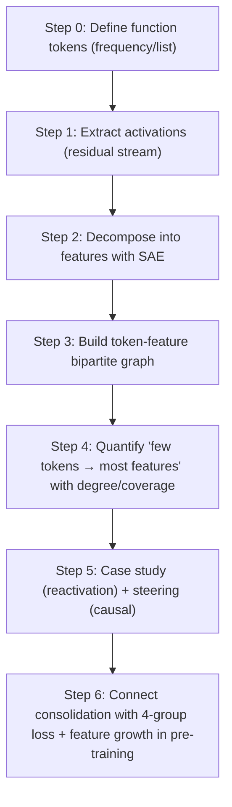

[Paper](https://arxiv.org/abs/2510.08203v1)

## Function Token Hypothesis: Why Punctuation and Newlines Gate LLM "Memory Retrieval"

## One-line Summary (TL;DR)

This paper defines LLM memory as "reactivation of features (retrieval) + feature expansion through learning (consolidation)", and presents the **Function Token Hypothesis** that **function tokens** (high-frequency tokens) context-conditionally reignite the features needed for prediction at inference time, while in pre-training **function→content** prediction dominates optimization and grows the feature count — argued through quantitative (coverage/degree), qualitative (reactivation trace), causal (steering), and learning-dynamics (loss decomposition) evidence. (source: §1, Fig.1, §3.1, Tab.1, §3.2, Fig.6, Fig.7, §4.2, Fig.8, §4.3, Fig.9)

---

## Core Ideas

* It treats **memory** not as "knowledge stored in parameters" but as **the set of features/circuits extractable with SAEs**, redefining **retrieval** as "feature activation during inference" and **consolidation** as "feature expansion during training". (source: §1, §2.1, §4.2)
* It hypothesizes that **function tokens**, which appear evenly throughout documents, act as **hubs** in the token–feature graph, "accessing" a large fraction of feature space (coverage) and recombining the needed feature combinations depending on context to dominate next-token prediction. (source: §1, §2.2, §3.1, Fig.5, Tab.1, §3.2, Fig.6)
* In pre-training, when next-token prediction is decomposed by function/content type, the **function→content** transition in particular carries high loss and large scaling gains, and therefore drives learning (=consolidation). (source: §4.3, Fig.9)

---

## Background: The Problem They Solved

The existing interpretability literature was strong at decomposing and showing "what features exist inside the model and what they mean" with SAEs and related tools. (source: §2.1)
But at **inference time**, "which tokens use contextual information to switch those features back on (to determine the next token)" was relatively less formalized. (source: §1)
And at **training time**, it was difficult to connect "which kind of prediction task most strongly drives parameter updates and increases the feature count" at the token-type level. (source: §4, §4.3)

This paper attempts to fill that gap with a token class called **function tokens** and a quantitative frame called the **token–feature bipartite graph**. (source: §1, §3.1, Fig.4)

---

## New Approach: Function Token Hypothesis

The "method name" of this paper is effectively the **Function Token Hypothesis** itself. (source: §1, Fig.1)
The core is a two-part claim.

1. **Retrieval hypothesis**: at inference, **function tokens** reactivate the most predictive features from context and dominate the next token. (source: §1, Fig.1, §3.2, Fig.6)
2. **Consolidation hypothesis**: in pre-training, **function→content** prediction is difficult and important, so optimization is driven along that axis, which leads to feature expansion. (source: §4.3, Fig.9, §4.2, Fig.8)

To support this, the authors (a) define function tokens by frequency, (b) build features with SAEs, (c) construct a token–feature graph to measure hubness/coverage, (d) show "operation" with reactivation traces and steering, and (e) connect loss decomposition and feature-count growth in pre-training. (source: §2.2, §3.1, Fig.4, §3.2, Fig.6, Fig.7, §4.2, Fig.8, §4.3, Fig.9)

---

## How It Works: A Concrete Walkthrough

### Step 1) Defining Function Tokens / Content Tokens

The authors sample **1B tokens** from SlimPajama-627B to build frequency statistics, and define function tokens as "the top-frequency tokens accumulated until they cover **40%** of all token occurrences", reporting that **122 tokens** are labeled as function tokens as a result. (source: §2.2)

They also show, from a document coverage perspective, that function tokens appear more uniformly across documents, while content tokens appear in a bursty pattern concentrated in a subset of documents. (source: Fig.3a, Fig.3b, Fig.3c, §2.2)

---

### Step 2) Decomposing Activations into Features with SAEs

They use Gemma Scope SAEs on Gemma2-9B to decompose residual stream activations at each layer into features. (source: §3.1, Fig.4)
Here the SAE dictionary width is set to $2^{20}$, handling a feature space of **1,048,576 features**. (source: §3.1)

$$
\text{(e.g.)}\quad z=\text{SAE-Enc}(h),;;\hat{h}=\text{SAE-Dec}(z)
$$

(The above is intuitive notation; the JumpReLU-SAE form used in the pre-training experiments is given in the appendix.) (source: Appx C)

---

### Step 3) Building the Token–Feature Bipartite Graph

With a token node set $T$ and a feature node set $F_l$, they build a bipartite graph at a given layer $l$ where a token–feature edge is added "if the token activates the feature even once in some context". (source: §3.1, Fig.4)
Repeated activations count as a single edge per token–feature pair, no matter how many times they occur. (source: §3.1)

---

### Step 4) Building Intuition for "Coverage" with a Toy Example

Instead of 3×3 pixels, consider a toy space with 3 features.

* Tokens: `{ "of", "Tokyo", ".", "\n" }`
* Features: `{ f_loc, f_japan, f_boundary }`

Toy assumptions:

* When `"Tokyo"` appears, $f_{japan}$ activates.
* When `"of"` appears, $f_{loc}$ activates.
* When `"."` or `"\n"` appears, $f_{boundary}$ activates.

Then if the Top-2 frequent tokens are `{".", "of"}`,

* union of active features = `{ f_boundary, f_loc }`
* coverage = $2/3=66.7%$

The paper extends this idea to the real SAE feature space ($2^{20}$) and quantifies "how many features the top-frequency tokens cover" as cumulative coverage. (source: §3.1, Tab.1)

---

### Step 5) Observing "Reactivation (Retrieval)" and Causally Confirming the "Gate"

The authors track interpretable feature examples in Gemma2-9B-it corresponding to **'Speak Chinese'**, **'Russia'**, **'UK'** and others, showing a pattern in which feature activations ignited by content tokens are regenerated/forwarded during function-token spans such as `:`, `the`, and `\n`. (source: §3.2, Fig.6, Appx A)

And they show cases where steering only the activation at the final function token position of the prompt (e.g., `\n`) changes the output language/content, arguing that function-token positions can serve as effective control levers. (source: §3.2, Fig.7, Appx A)

---

## Validation: Main Results

The "performance" of this paper is not conventional benchmark accuracy (MMLU and the like), but **how convincingly it demonstrates feature-access structure and learning dynamics**. (source: §3, §4)

### 1) Top-k High-Frequency Tokens Cover Most of Feature Space

They run Gemma2-9B over SlimPajama validation **10,000 docs**, about **5M tokens**, and analyze the token–feature graph at layers **9/20/31**. (source: §3.1)
The numbers of connected feature nodes are reported as **965,635 / 947,341 / 919,220 features** at layers 9/20/31, respectively. (source: §3.1, Fig.5)
With dictionary width $2^{20}$, activation rates are reported as **92.1% / 90.3% / 87.7%** at layers 9/20/31, respectively. (source: §3.1, Fig.5)

In particular, Tab.1 gives Top-10 frequent tokens' cumulative feature coverage by layer, reaching **76.46%** at layer 20. (source: Tab.1)

| Layer | Top-10 cumulative feature coverage |
| ----- | ---------------------------------: |
| 9     |                 48.52% (source: Tab.1) |
| 20    |                 76.46% (source: Tab.1) |
| 31    |                 68.27% (source: Tab.1) |

They also present the token degree distribution as heavy-tailed in log-log form in Fig.5, supporting the "a few tokens activate most features" scale-free-structure interpretation. (source: Fig.5, §3.1, §7)

---

### 2) Function Tokens Recombine Different "Predictive Feature" Combinations Depending on Context

The same function tokens activate different predictive feature combinations for different questions (e.g., the capital of Russia/the UK in Chinese), shown as per-token-position feature activation traces. (source: §3.2, Fig.6)

---

### 3) Editing Only the Final Function-Token Position Changes the Output

Steering by adding a steering vector to the activation at the final `\n` position shifts English responses to Chinese or moves the output toward a specific concept (e.g., country-related), as shown with examples. (source: §3.2, Fig.7, Appx A)

---

### 4) In Pre-training, Consolidation Is Observed as Feature Expansion

They train from scratch with the LLaMA-3.1-8B architecture, training **1.5B params (2 layers)** and **8B params (32 layers)** models for comparison. (source: §4.1)
The data uses **1 epoch = 627B tokens** from SlimPajama-627B, with batch size **1024 sequences/step**, max seq length **4095 tokens**, LR $8\times10^{-5}$ after **8,000 steps** of warmup, cosine decay down to LR $8\times10^{-7}$, using **128×GPU (80GB)**. (source: §4.1)

Due to compute constraints, feature decomposition is performed only on the **1.5B params** model, training per-checkpoint SAEs on 2nd-layer activations to track feature-count growth. (source: §4.2)
As a result, learned features increase from **3,000 steps: 1,942 → 50,000 steps: 42,822 → 130,000 steps: 64,042 features**. (source: §4.2, Fig.8a)

---

### 5) The Center of Training Difficulty Is the Function→Content Transition

Next-token prediction is split into 4 groups depending on whether (current, next) are function/content, and losses are compared, showing that **function→content** is the "hard" prediction with the largest loss. (source: §4.3, Fig.9)
They also report that on scaling up from 1.5B to 8B, the loss reduction is larger on function→content and content→content, at **0.61 (CE loss)**. (source: §4.3)

---

## Our Perspective: Strengths, Limitations, and Why This Research Matters

### Strengths

* **Good problem framing**: it binds retrieval (inference) and consolidation (training) into one hypothesis from a "feature perspective", lifting fragmented prior observations (the importance of punctuation/newlines and the like) into a unified frame. (source: §1, Fig.1, §6)
* **Quantification creates persuasion**: the token–feature graph and coverage (%) turn "interpretability" into something measurable. (source: §3.1, Fig.4, Tab.1)
* **One step further with causal experiments (steering)**: cases where editing only the final function-token position changes the output provide strong supporting evidence for the question "are hub tokens really the gate". (source: §3.2, Fig.7, Appx A)
* **Extension to learning dynamics**: jointly showing feature-count growth and loss decomposition in pre-training addresses "why function tokens become special" from a learning perspective. (source: §4.2, Fig.8, §4.3, Fig.9)

### Limitations

* **The definition is approximate**: the function/content split is a frequency-based heuristic, which the authors acknowledge is used as an approximation. (source: §1)
* **Scale and scope constraints**: feature decomposition is confined to the 1.5B model due to compute constraints, and the token–feature graph is representatively analyzed on 10k docs/5M tokens and 3 layers. (source: §4.2, §3.1)
* **The core mechanism remains open**: why/how function tokens acquire "special power", how their role changes in post-training, what causes middle-layer steerability, and related questions are left as open questions. (source: §7)
* **Possible methodological stability issues**: they note that SAE decomposition becomes harder and takes longer as pre-training progresses. (source: Appx C)

### Why It Matters

The message of this paper is closer to "the entrance to features is biased" than "features exist". (source: §3.1, Fig.5, Tab.1)
If a few function tokens structurally monopolize access to feature space, then (a) why prompt formatting determines performance, (b) why specific control works well at middle layers and specific token positions, and (c) around which transitions learning is organized all become much more concrete. (source: §3.2, Fig.6, Fig.7, §4.3, Fig.9)

---

## What Next?: Paths Forward

The open questions posed by the authors fall into 4 broad axes: (1) the cause of function-token capability acquisition, (2) the effect of post-training (SFT/RL), (3) the cause of the scale-free distribution, and (4) the mechanism of middle-layer steerability. (source: §7)

Reasonable next experiments reuse "the quantitative metrics the paper already built" while perturbing causal variables.

* **Loss re-weighting / curriculum**: experiments that vary the weight of the function→content transition during training and track how grouped loss (CE), feature growth (learned features count), and coverage (%) change. (source: §4.3, Fig.9, §4.2, Fig.8)
* **Topology comparison before/after post-training**: experiments checking whether Top-k coverage (%), degree-distribution tails, and steering success patterns are rearranged across Pre-training only vs +SFT vs +RL conditions. (source: §7, §3.1, Tab.1, Appx A)
* **Tokenizer/language/domain generalization**: verifying whether function token sets defined by the same "40% occurrences cover" rule show the same hubness across different tokenizers, languages, and corpora (code/dialogue/math and the like). (source: §2.2, Fig.3, §3.1)
* **Middle-layer cause decomposition**: recording per-layer steering success rates together with feature sparsity/entropy and attention/FFN path contributions to structurally decompose "why the middle becomes the control lever". (source: §7, Appx A)


### Click the toggle to see detailed LLM Q&A on the paper.

<details markdown="block">
<summary>▶️<strong>Click to expand</strong></summary>


## Prompt 1.1.1 (Research Gap)

```
Analyze the paper's 'Introduction' and 'Related Work' sections and explain the core research gap this study explicitly aims to solve, the decisive limitations of prior work, or the open questions. Summarize what the authors describe as the 'state of the art' at the time of publication.
```


* Prior LLM interpretation research showed a lot about "which features/circuits exist", but lacked a token-level frame explaining **'when/by what' those features are reactivated (retrieval) at inference time**. (source: §1)
* The authors attempt to fill this gap with the hypothesis that **function tokens (high-frequency tokens)** "reactivate the most predictive features from context to determine the next token". (source: §1, Fig.1)
* They also connect "why function tokens in particular hold feature access" through the observation that **parameter updates/feature expansion (consolidation) in pre-training are dominated by 'function→content' prediction difficulty**. (source: §4, Fig.9, §5)

---

## The Research Gaps This Paper Explicitly Targets

### Gap 1) The Memory Retrieval Mechanism at Inference Is Unclear

* The authors take LLM "memory" to be **a virtual store of parameters and features derivable from parameters**, and define **memory retrieval as feature/circuit activation**. (source: §1)
* Yet they point out that while analysis of "which neurons/features represent what" has progressed, **which kinds of tokens contextually reactivate features during sequence unfolding to dominate next-token prediction** remained a core open question. (source: §1)
* To this end, they argue the **function token vs content token** distinction is useful for dissecting memory retrieval, proposing the view that function tokens "switch back on" the predictive features of the context. (source: §1, Fig.1, §3.2)

### Gap 2) It Is Unclear "What Drives" Memory Consolidation in Pre-training

* The authors define **memory consolidation as the process by which features/circuits form and expand through parameter learning**. (source: §1)
* They view prior perspectives (e.g., interpreting FFNs as key-value memories) as explaining "where knowledge is stored", but as failing to decompose **which prediction tasks most strongly drive parameter updates and grow the feature count (expressivity)** from a token-type viewpoint. (source: §2.1, §4)
* Their framing of the gap culminates in the claim that **predicting content tokens right after function tokens (function→content)** is the "hardest" axis in pre-training and leads feature expansion. (source: §4.3, Fig.9, §5)

---

## SOTA at Publication Time as Summarized by the Authors (Based on Introduction + Related Work)

### 1) The Frame Interpreting "Knowledge/Memory" via Parameters and Activations Was Mature

* The view interpreting Transformer **FFNs as key-value memories** is widely known, and attention is likewise assumed to be viewable as a similar key-value memory. (source: §2.1)
* Methodologies explaining neuronal activations as sparse combinations of human-interpretable features through **superposition** and **SAE (Sparse Autoencoder)-based feature decomposition** had also advanced. (source: §1, §2.1)
* That feature steering (changing output behavior by modulating specific feature activations) is possible was already an observed trend. (source: §2.1, §6)

### 2) Observations That "Specific Tokens (Especially Delimiters/Formatting Tokens) Are Disproportionately Important" Had Accumulated

* They mention reports of **abnormally large activation magnitudes** on initial tokens, periods, newlines, and the like. (source: §5, §6)
* Observations that semantically thin separator tokens **exert disproportionate influence on attention** are also cited as a related trend. (source: §5, §6)
* There is strong practical/empirical recognition that **formatting (e.g., `\n`) plays a large role** in post-training, and they cite observations that pivot tokens matter for response accuracy. (source: §6, §5)
* They also connect the recent trend that **training focused on high-entropy tokens improves performance**. (source: §5, §6)

### 3) But an Integrated Hypothesis Linking "Phenomena → Mechanism" Was Missing (Author View)

* While the above phenomena were individually known, the authors view the field as lacking a formulation that groups them into a single category of **function tokens (high-frequency, grammatical/connective functions)** and states a mechanistic hypothesis jointly explaining **memory retrieval and consolidation**. (source: §1, §5, §6)

---

## Reframing the "Decisive Limitations" in the Authors' Framing

| Observation/trend                                                                 | Representative explanation up to that point                     | Limitation as seen by the authors (=gap)                                                           | Link this paper aims at                                           |
| ------------------------------------------------------------------------- | --------------------------------------------- | ---------------------------------------------------------------------------------- | --------------------------------------------------------------------- |
| Features can be extracted with SAEs and behavior modulated with steering (source: §2.1, §6)      | "Features exist and are manipulable" (source: §2.1)   | **Which tokens contextually reignite features** was weak (source: §1)          | Function tokens reactivate predictive features from context (source: §3.2, Fig.6) |
| Separator/formatting tokens strongly affect attention/activations (source: §5, §6) | "Specific tokens look important" (source: §6)        | The reason for importance was not generalized to the "token class" level (source: §6)                  | Categorization into function tokens + retrieval/consolidation integrated hypothesis (source: §5)  |
| Expressivity/features grow as training proceeds (source: §4.2, Fig.8)                 | "Scale/training increases features" (source: §4.2) | **Which prediction items drive updates to grow features** was unclear (source: §4.3) | Function→content prediction is hardest and dominates optimization (source: §4.3, Fig.9) |

---

## Summary: The "State of the Art (SOTA)" State as Defined by This Paper

* The field had reached the stage of (1) interpreting FFN/attention as memory, (2) decomposing features with SAEs, (3) controlling some behaviors with feature steering, and (4) observing the abnormal importance of separator/formatting tokens. (source: §2.1, §6)
* However, explaining **retrieval and consolidation together under the integrated hypothesis that "a few high-frequency function tokens act as gates for context-based feature reactivation"** was still lacking, and this paper directly addresses that gap. (source: §1, §5, §6)

---


## Prompt 1.1.2 (Core Hypothesis)

```
What is the central hypothesis or core claim of this paper? State it in one clear, concise sentence of the form 'The authors assume that by using [proposed technique] they can overcome [existing limitation] to achieve [concrete result]'.
```

The authors assume that by proposing the **Function Token Hypothesis**, they can explain the previously under-explained LLM memory retrieval and consolidation mechanisms with an integrated model: "at inference, function tokens activate the most predictive features from context to dominate next-token prediction, and in pre-training, predicting content tokens after function tokens drives parameter updates and feature expansion". (source: §1, Fig.1)


## Prompt 1.2.1 (Identifying Originality)

```
Based on the full paper, list the 1-3 most important and original contributions as distinct items. For each, clearly distinguish whether it is a new architecture component, a new training technique, a new theoretical insight, a new dataset, or a new application of an existing methodology.
```

## Original Contributions (3 items)

### **Contribution 1: Unifying "Retrieval + Consolidation" in One Frame with the Function Token Hypothesis**

* Type: **new theoretical insight** (source: §Abstract, §1, Fig.1, §5)
* The authors present the integrated hypothesis that **at inference, function tokens reactivate the most predictive features from context to dominate next-token prediction, while in pre-training, predicting (usually) content tokens after function tokens drives feature-count growth and parameter updates**. (source: §Abstract, §1, Fig.1, §5)

---

### **Contribution 2: Quantifying "A Few Function Tokens Activate Most Features" with an SAE-based Token–Feature Bipartite Graph**

* Type: **new application of an existing methodology** (extending SAE interpretation to token–feature graph/coverage analysis) (source: §3.1, Fig.4, Fig.5, Tab.1)
* On Gemma2-9B, with SAE dictionary width $2^{20}$ (≈ 1,048,576 features), they build a bipartite graph whose edges are token–feature activation pairs and quantify tokens' **feature coverage**. (source: §3.1, Fig.4)
* Feeding 10,000 documents (SlimPajama validation) (≈ 5M tokens) and analyzing layers 9/20/31, the feature node counts are observed at 965,635 / 947,341 / 919,220 respectively (connected-feature basis), with activation rates reported at 92.1% / 90.3% / 87.7%. (source: §3.1, Fig.5)
* Top-10 frequent tokens alone reach a cumulative feature coverage of 76.46% at layer 20 (e.g., ".", ",", "the", "\n", "and", "to", "of" and others), providing quantitative grounds for the claim that **high-frequency function tokens have "universal access" to feature space**. (source: Tab.1, §3.1)
* They also visualize cases where the same function tokens "regenerate/propagate" different feature combinations in different contexts to produce different outputs, via activation patterns of predictive features (e.g., 'Speak Chinese', 'Russia', 'UK'). (source: §3.2, Fig.6)

---

### **Contribution 3: Linking Pre-training Dynamics to Token-type Loss + Feature Expansion, Showing "Function→Content Prediction Dominates Optimization"**

* Type: **new theoretical insight** (mechanistic claim about learning dynamics) + **new application of an existing methodology** (tracking feature growth with checkpoint SAEs) (source: §4, §4.2, Fig.8, §4.3, Fig.9)
* They train 8B (32 layers) and 1.5B (2 layers) models from scratch with the LLaMA-3.1-8B architecture, using SlimPajama-627B (627B tokens) for 1 epoch to track memory consolidation during pre-training. (source: §4.1)
* Training settings are stated as batch size 1024, max seq length 4095 tokens, warmup 8,000 steps → LR $8\times10^{-5}$, cosine decay → LR $8\times10^{-7}$, using 128×GPU (80GB VRAM). (source: §4.1)
* They train JumpReLU-SAEs per checkpoint on 2nd-layer activations of the 1.5B model (500,000 activations per checkpoint), showing learned feature counts growing from 1,942 at 3,000 steps → 42,822 at 50,000 steps → 64,042 at 130,000 steps, thus **quantifying consolidation as feature expansion**. (source: §4.2, Fig.8a)
* Splitting next-token prediction into 4 groups by whether (current token, next token) are function/content and analyzing loss trajectories, they present the core conclusion that early in pre-training function-token prediction is relatively more prominent, while later **function→content** prediction in particular dominates optimization (loss reduction). (source: §4, §4.3, Fig.9)


## Prompt 1.2.2 (Strengths from the Authors' Perspective)

```
From the authors' perspective, why is their approach superior to prior methods? Quote or clearly explain the key arguments they use to support their work's originality and strengths.
```

## Strengths from the Authors' Perspective: Why They See It as "Superior" to Prior Methods

### 1) **It "Integrates" Retrieval and Consolidation into a One-sentence Hypothesis Instead of Listing Phenomena**

* The authors see prior interpretation as strong at showing that "features exist/are manipulable", but as struggling to bind **which tokens reignite features when to dominate prediction** into a single mechanism. (source: §1, §2.1)
* This paper connects both axes in a single frame: **function tokens reactivate predictive features at inference (retrieval), while in pre-training function→content prediction drives parameter updates and feature expansion (consolidation)**. (source: §1, Fig.1, §5)

### 2) **It Turns "Explainability" into Quantitative Metrics, Making Interpretation Measurable**

* They build an SAE-based token–feature **bipartite graph** and compute per-token **feature coverage** to quantify "how much of feature space each token can access". (source: §3.1, Fig.4)
* In particular, the result that Top-10 frequent tokens alone push cumulative feature coverage up to 76.46% at layer 20 provides quantitative grounds for the authors' claim that **a few function tokens have 'universal access' to most features**. (source: Tab.1, §3.1)
* Because this approach quantifies the **token-driven activation structure itself** rather than stopping at "which features exist", the authors argue it lifts prior observations (e.g., the importance of specific punctuation/newline tokens) into a generalized analytical frame. (source: §5, §6)

### 3) **It Presents 'Operational' Evidence That the Same Tokens Reconstruct Different Feature Sets by Context**

* They show with visualizations not merely that "frequent tokens are large", but that the same function tokens activate different predictive feature combinations in different contexts to produce different next tokens. (source: §3.2, Fig.6)
* They cite as a strength that this presents function tokens as **gates (entrances) of retrieval** as a "mode of operation" rather than a mere "correlation". (source: §3.2, Fig.6)

### 4) **It Broadens Explanatory Scope to "Why Function Tokens in Particular" by Connecting Pre-training Dynamics**

* The authors quantify consolidation as feature expansion and track with SAEs how learned feature counts grow strongly over checkpoints. (source: §4.2, Fig.8)
* They also decompose next-token prediction by (current/next) function/content combinations, using loss trajectories to support the interpretation that **training is strongly structured around function tokens**, especially with **function→content** prediction dominating optimization. (source: §4.3, Fig.9, §5)

### 5) **It Adds a "Higher-level Organizing Principle" Without Discarding Existing Methodology**

* While reusing existing interpretability tools such as SAEs, activation analysis, and token-importance observations, they reinterpret results under a **function-token-centric organizing principle** to create greater explanatory power, which they present as grounds for superiority. (source: §2.1, §3, §6)

---

### Comparison Summary: Core Points of the Claimed "Superiority"

| Axis     | Prior approaches (author summary)                                 | This paper's approach (author claim)                                                    |
| ----- | -------------------------------------------- | ----------------------------------------------------------------- |
| Goal    | Focused on identifying feature existence/meaning (source: §2.1)               | Identifying feature "access rights" and "reignition tokens" (source: §1, §3.1)                         |
| Form    | Accumulation of cases/observations (source: §6)                           | **Function token** categorization + quantification (coverage) (source: §3.1, Tab.1, §5) |
| Mechanism  | Retrieval vs consolidation discussed separately (source: §1) | Retrieval and consolidation connected in a single hypothesis (source: §1, Fig.1)                |
| Learning dynamics | At the level of "training increases representations" (source: §4.2)                | Function→content prediction drives updates/feature expansion (source: §4.3, Fig.9)        |

---


## Prompt 1.3.1 (Step-by-step Algorithm Explanation)

```
Explain the core algorithm, model architecture, or main methodology step-by-step. Assume the reader is a graduate student in AI. In particular, use very simple examples (simple sentences, 3x3 pixel images, tiny state spaces) and sample inputs to show how the input transforms into output through each step. Define every key term and variable immediately when it appears.
```

## Methodology Overview

The core methodology of this paper is a pipeline that (1) defines **function tokens** by frequency, (2) quantifies the token-to-**feature** relation built from SAE-extracted **features** as a **token–feature bipartite graph**, (3) shows "retrieval" with **feature reactivation/steering at function-token positions** through cases + causality, and (4) connects "consolidation" via **loss decomposition + feature-count tracking** in pre-training. (source: §2.2, §3.1, Fig.4, §3.2, Fig.6, Fig.7, §4.2, Fig.8, §4.3, Fig.9)



(source: §2.2, §3.1, Fig.4, Fig.5, Tab.1, §3.2, Fig.6, Fig.7, §4, Fig.8, Fig.9)

---

## Step-by-step: Core Algorithm (Token→Feature Graph)

### Step 0. Defining **Function Tokens** and **Content Tokens**

* The paper classifies a specific token set as **function tokens** (a high-frequency token list) and the rest as **content tokens**. (source: Appx D, Tab.2, §2.2)
* To see "how broadly a token is used", it defines **document coverage** as follows. (source: §2.2, Fig.3c)

$$
\text{DocCov}(t)=\frac{|{d\in D: t\in d}|}{|D|}
$$
(source: §2.2, Fig.3c)

#### Toy Example (Document Coverage)

For explanation, consider two documents.

* d1 = `"of Tokyo"`
* d2 = `"of Paris"`

Here `of` has DocCov = 2 docs / 2 docs = 1.0, while `Tokyo` has DocCov = 1 docs / 2 docs = 0.5.
(This example is an arbitrary construction for understanding.)

---

### Step 1. Extracting Activations: Fixing Model, Data, and Layers

* On Gemma2-9B, they sample **10,000 docs** from SlimPajama validation for inference at a total scale of **~5,000,000 tokens** and extract residual stream activations. (source: §3.1)
* Analysis layers are set to **layer 9 / layer 20 / layer 31 (layer indices)**. (source: §3.1)

Notation from here on (definitions for explanation):

* $l$: layer index
* $i$: token position in the sequence
* $t_i$: i-th token id
* $h_{l,i}\in\mathbb{R}^d$: i-th activation vector of the residual stream at layer $l$

---

### Step 2. Decomposing into Features with SAEs

* For each layer, they apply that layer's SAE to decompose token activations into sparse features. (source: §3.1, Fig.4)
* Here the paper uses the Gemma Scope SAEs with **dictionary width = $2^{20}$ features**. (source: §3.1)

Intuitively, think of the SAE as follows:

* The encoder maps $h_{l,i}$ to a sparse code $z_{l,i}$,
* The decoder reconstructs $\hat{h}_{l,i}$ from $z_{l,i}$.

(For reference, the equation form of the JumpReLU-SAE used in the pre-training experiments is stated in the appendix.) (source: Appx C, Eq.(7), Eq.(8))

$
z=\text{JumpReLU}* \theta(W* {\text{enc}}x+b_{\text{enc}})
$
(source: Appx C, Eq.(7))

$
\hat{x}=W_{\text{dec}}z+b_{\text{dec}}
$
(source: Appx C, Eq.(8))

---

### Step 3. Building the Token–Feature Bipartite Graph

* The authors place tokens and features as two different node types and build a **bipartite graph** whose edges are **token-feature activation pairs**. (source: §3.1, Fig.4)
* Edge rule: "if token $t$ activates feature $f$ in some context (if the token has ever 'switched on' that feature), connect $t\leftrightarrow f$." (source: §3.1)
* The same token-feature pair gets **at most 1 edge**, even if activation occurs multiple times. (source: §3.1)

Reported graph scale (on a connected-feature-node basis):

* Feature node counts are tallied at **965,635 features / 947,341 features / 919,220 features** for layers 9/20/31, respectively. (source: §3.1)
* With dictionary width $2^{20}$ features, activation rates are reported at **92.1% / 90.3% / 87.7%**, respectively. (source: §3.1)

---

### Step 4. Quantitative Metrics: Token Degree and Cumulative Feature Coverage

* Figure 5 presents the **token degree distribution (log-log)** in the token–feature bipartite graph. (source: Fig.5)
* Table 1 summarizes the **cumulative feature coverage (%)** of the **top-10 frequent tokens (Top-10 frequent tokens)** by layer. (source: Tab.1)
* In particular, the cumulative feature coverage of the Top-10 frequent tokens at layer 20 is reported at **76.46%**. (source: Tab.1)

#### Toy Example (Bipartite Graph & Coverage)

For explanation, assume a vocabulary of 5 and 3 features.

* Tokens: `{ "the", "of", "Tokyo", ".", "\n" }`
* Features: `{ f_loc, f_japan, f_boundary }`

Observations (assumptions for explanation):

* When `"Tokyo"` appears, $f_{japan}$ turns on.
* When `"of"` appears, $f_{loc}$ turns on.
* `"."` and `"\n"` mark sentence boundaries and turn on $f_{boundary}$.

Then the bipartite edges are, for example:

* `"of" ↔ f_loc`
* `"Tokyo" ↔ f_japan`
* `"." ↔ f_boundary`, `"\n" ↔ f_boundary`

If the Top-2 frequent tokens are `"of", "."`, cumulative feature coverage is

* union of active features = `{ f_loc, f_boundary }` → 2 features / 3 features = 66.7%
  (This example is an arbitrary construction for understanding.)

---

## Step-by-step: Experiments Showing "Reactivation" (Cases + Causality)

### Step 5. Case Study: The Same Function Tokens Reactivate Different Features by Context

* The authors select interpretable features in Gemma2-9B-it (identification method described in the appendix), using as examples **feature 15261 = 'Speak Chinese'**, **feature 9591 = 'Russia'**, **feature 13751 = 'UK'**. (source: §3.2, Appx A)
* On two prompts ("capital of Russia in Chinese?", "capital of the UK in Chinese?"), they record per-token feature activations and present the interpretation that function tokens such as `:`, `the`, and `\n` **carry/regenenerate (conduit)** those activations. (source: §3.2, Fig.6)

---

### Step 6. Steering: "Causal" Evidence That Manipulating Only Function-Token Positions Changes Outputs

* The authors change model outputs by adding a steering vector to **the activation at the prompt's final function token (newline `\n`) position**. (source: §3.2, Fig.7, Appx A)
* Appendix A organizes (1) constructing contrastive prompts, (2) layer selection, (3) narrowing down features with SAEs, and (4) steering with the final features as a **4-step procedure**. (source: Appx A)

Key equations (paper notation):

* Hidden-space steering to activate a top-k feature set $S_k$: (source: Appx A, Eq.(5))

$
v^{S_k} * l=\alpha\cdot W * {\text{dec}}\sum_{i\in S_k} e_i
$
(source: Appx A, Eq.(5))

* Steering with a single feature $i$: (source: Appx A, Eq.(6))

$
v^i_l=\alpha_i\cdot W_{\text{dec}}e_i
$
(source: Appx A, Eq.(6))

* Figure 7 presents cases where **steering only the activation of the final function token (`\n`)** in Prompts 3/4/5 changes the response language/content. (source: §3.2, Fig.7)
* They add the interpretation that activating the 'Russia' feature does not simply emit the "Russia" token but yields contextually plausible place/institution names, indicating the feature carries high-level meaning. (source: §3.2)

#### Toy Example (Steering Intuition)

For intuition, call the "answer in Chinese" trait the $f_{CN}$ feature.
Adding a vector in the $f_{CN}$ direction at the final `\n` position tilts subsequent generation toward a Chinese distribution — that is the paper's claimed structure.
(This example is for intuitive illustration.)

---

## Step-by-step: Pre-training Analysis of "Consolidation"

### Step 7. Fixing the Pre-training Setup

* The authors train **8B params (32 layers)** and **1.5B params (2 layers)** models from scratch with the LLaMA-3.1-8B architecture. (source: §4.1)
* Data uses SlimPajama-627B, training **1 epoch = 627B tokens**. (source: §4.1)
* Key hyperparameters are **batch size 1024 sequences/step**, **max sequence length 4095 tokens**, **warmup 8,000 steps → LR $8\times10^{-5}$**, cosine decay → **LR $8\times10^{-7}$**, **128 GPUs × 80GB VRAM/GPU**. (source: §4.1)

---

### Step 8. Quantifying Consolidation as Feature Expansion

* Feature decomposition is performed only on the **1.5B model** due to compute cost constraints. (source: §4.2)
* They train SAEs at multiple checkpoints on **second-layer activations** to track the "learned feature count". (source: §4.2, Fig.8a)
* The SAE uses **JumpReLU-SAE + tanh penalty**, described as superior to TopK-SAE/Gated-SAE. (source: §4.2)
* Checkpoints use **3,000 steps / 50,000 steps / 130,000 steps**, tallying feature counts with **500,000 activations** per checkpoint. (source: §4.2, Fig.8a)
* Figure 8a shows feature counts increasing as pre-training proceeds, interpreted as an indicator of memory consolidation. (source: §4.2, Fig.8a)

---

### Step 9. Decomposing Loss into 4 Groups to See "Which Predictions Dominate Training"

* Next-token prediction $$p(\text{next} \mid \text{current}, \text{context})$$ is split into **4 groups (function→function, function→content, content→function, content→content)** by whether current/next are function/content, tracking loss trajectories. (source: §4.3, Fig.9)
* The authors interpret that early in pre-training function-token prediction is learned faster, while later **function→content** prediction in particular dominates optimization. (source: §4.3, Fig.9)
* For scaling comparison, group loss (CE loss, unitless) from 1.5B→8B drops from **1.90→1.64 (Δ=0.26)** for content→function and **2.12→1.87 (Δ=0.25)** for function→function, versus larger drops of **4.88→4.27 (Δ=0.61)** for function→content and **3.69→3.08 (Δ=0.61)** for content→content. (source: §4.3)

#### Toy Example (4-group Intuition)

For explanation, allow only two token types: F=function, C=content.
If a sequence is `F F C F C`, its next-token transitions decompose into:

* F→F, F→C, C→F, F→C.
  The paper plots the loss curves of these 4 transition types separately to see "which transition governs learning". (source: §4.3, Fig.9)

---


## Prompt 1.3.2 (Identifying the 'Secret Weapon')

```
Select 1 core component, present Δ(metric) under removal/replacement/scale change in a table, and explain the mechanism behind the change (e.g., gating load balance, rotary vs ALiBi, sparse attn half-window replacement).
```

## **Secret Weapon**: The "Universal Access" (Feature Coverage) That Top-**k** High-Frequency **Function Tokens** Hold over Feature Space

### Selected Core Component

* **Component**: the design that takes **Top-k** high-frequency tokens (mostly **function tokens**) in the token–feature **bipartite graph** as a "hub token set" and quantifies them with **cumulative feature coverage** (source: §3.1, Fig.4, Fig.5, Tab.1)

### Metric Definition (Δ in This Section Is Coverage Change in **pp**)

* The fraction of features "accessible" to a token set $T_k={t_1,\dots,t_k}$ (in descending frequency) at layer $l$ is defined as follows. (source: §3.1, Fig.4)

$$
\text{Cov}(k,l)=\frac{\left|\bigcup_{t\in T_k} \mathcal{N}_l(t)\right|}{|F_l|}\times 100%
$$

* $\mathcal{N}_l(t)$: the feature set connected by edges to token $t$ in the bipartite graph at layer $l$ (source: §3.1, Fig.4)
* $F_l$: the full feature set "connected to at least one token" at layer $l$ (source: §3.1)

---

## Δ(metric) under Removal/Replacement/Scale Change

### (A) Scale Change: How Fast Coverage Fills as **k** Grows

Below are the reported cumulative coverage of Top-10 frequent tokens and the **marginal gain (Δ) of adding one token**. (source: Tab.1)

|  k | token added   | Cov(L9) % | Δ(L9) pp | Cov(L20) % | Δ(L20) pp | Cov(L31) % | Δ(L31) pp |
| -: | ------------- | --------: | -------: | ---------: | --------: | ---------: | --------: |
|  1 | `.`           |    23.19% | +23.19pp |     51.32% |  +51.32pp |     37.21% |  +37.21pp |
|  2 | `,`           |    32.01% |  +8.82pp |     62.45% |  +11.13pp |     49.78% |  +12.57pp |
|  3 | `the`         |    36.88% |  +4.87pp |     66.93% |   +4.48pp |     55.15% |   +5.37pp |
|  4 | `\n`          |    39.68% |  +2.80pp |     71.30% |   +4.37pp |     59.86% |   +4.71pp |
|  5 | `and`         |    41.21% |  +1.53pp |     71.97% |   +0.67pp |     61.48% |   +1.62pp |
|  6 | `to`          |    43.16% |  +1.95pp |     73.07% |   +1.10pp |     63.30% |   +1.82pp |
|  7 | `of`          |    46.00% |  +2.84pp |     74.43% |   +1.36pp |     65.16% |   +1.86pp |
|  8 | `white space` |    47.44% |  +1.44pp |     75.70% |   +1.27pp |     67.08% |   +1.92pp |
|  9 | `a`           |    47.96% |  +0.52pp |     76.12% |   +0.42pp |     67.74% |   +0.66pp |
| 10 | `in`          |    48.52% |  +0.56pp |     76.46% |   +0.34pp |     68.27% |   +0.53pp |

**Observation (the core of scaling)**

* At layer 20, **k=1 (.)** alone achieves **51.32%** coverage, rising to **62.45%** at **k=2 (., ,)**. (source: Tab.1)
* At **k=4 (., ,, the, \n)** it already reaches **71.30%**, and adding further tokens yields sharply smaller marginal gains, mostly **≤ 1.36pp/token**. (source: Tab.1)
* That is, the metric reveals that "feature access" is **concentrated in an extremely small set of hub tokens**. (source: Fig.5, Tab.1)

---

### (B) Removal: How Fast Coverage Collapses When the Hub Token Set Shrinks

Below is the **abbreviated** version at the same layer 20. (source: Tab.1)

| Variant    | token set (top frequency)   | Cov(L20) % | Δ vs k=10 (76.46%) pp |
| ---------- | ------------------- | ---------: | --------------------: |
| Remove-all | k=0 (∅)             |      0.00% |              -76.46pp |
| Scale-down | k=2 (`.`, `,`)      |     62.45% |              -14.01pp |
| Scale-down | k=4 (+`the`, +`\n`) |     71.30% |               -5.16pp |
| Full       | k=10 (Top-10)       |     76.46% |               +0.00pp |

* In effect, shrinking **k=10 → k=4** loses only **-5.16pp**, but shrinking **k=4 → k=2** loses a larger **-8.85pp**. (source: Tab.1)
* That means "removal sensitivity" is **concentrated in the top 1–4 token range**. (source: Tab.1)

---

### (C) Replacement: Why Replacing Hub Tokens with Non-hub Tokens Loses So Much (Explaining Δ via Marginal Gains)

* **Fact (reported Δ)**: at layer 20, the marginal gain of `.` is **+51.32pp**, while that of a tail token (e.g., `in` at k=10) is only **+0.34pp**. (source: Tab.1)
* Thus "replacing 1 hub token with 1 tail token" amounts to swapping a **~+51pp-scale contribution for a ~+0pp-scale contribution** in coverage terms, so a **large Δ loss structurally follows**. (source: Tab.1, Fig.5)
* The paper presents token degree as heavy-tailed in Fig.5, arguing that the structure itself — a few tokens holding edges to most features — creates replacement sensitivity. (source: Fig.5, §3.1)

---

## Why These Δs Arise: Mechanism (Author Logic)

1. **Token-degree heavy tail → hub tokens become "routers" of feature space**

* Token degree is extremely skewed in the bipartite graph (log-log distribution), showing a structure in which a few tokens activate many features. (source: Fig.5, §3.1)
* Tab.1's coverage scaling shows this structure as a cumulative metric, with punctuation/newlines creating **overwhelming marginal gains in the early-k range**. (source: Tab.1)

2. **Function tokens appearing "uniformly and densely" across documents → connections to diverse features through diverse contexts**

* The authors summarize that high-frequency tokens are distributed **relatively uniformly** across documents, while low-frequency (content) tokens appear burstily in only a few documents. (source: §2.2)
* As an example, they contrast function token `of`, which appears densely throughout documents, with content token `Tokyo`, which appears in only some documents. (source: Fig.3a, Fig.3b, §2.2)
* The paper's proposed causal chain is therefore that function tokens see greater "context diversity", which enlarges $\mathcal{N}_l(t)$ and thus coverage. (source: §2.2, §3.1, Fig.4)

3. **From a "retrieval" view: the same function tokens reactivate different predictive feature combinations by context**

* The authors present cases where the same function tokens activate different predictive feature combinations (e.g., 'Speak Chinese', 'Russia', 'UK') for different questions to produce different next tokens. (source: §3.2, Fig.6)
* That is, they interpret hub tokens not as simply "switching on a lot", but as **recombining and forwarding (conduit) the needed features conditioned on context**. (source: §3.2, Fig.6)

4. **Steering evidence that removal/replacement can affect real outputs (causal)**

* They present cases where steering activations toward feature directions at the final function token (e.g., `\n`) position changes generation, supporting that function-token positions can act as "gates". (source: §3.2, Fig.7, Appx A)

---


## Prompt 1.4.1 (Core Results Analysis)

```
Analyze the main results including tables/figures in 'Experiments' or 'Results'. What are the key performance metrics? On which benchmarks were they reported? Summarize the results the authors emphasize most as evidence of success.
```


## Core Results Analysis: What the Authors Offer as "Evidence of Success" in Experiments / Results

### **Key Performance Metrics** ("Metrics" in This Paper)

* **Feature coverage (%)**: how large a fraction of all SAE features a set of top-frequency tokens (mostly **function tokens**) can "activate at least once". (source: §3.1, Fig.4, Tab.1)
* **Token degree (log-log)**: in the token–feature bipartite graph, the distribution of how many features a token connects to (activates) (whether heavy-tailed). (source: Fig.5, §3.1)
* **Feature reactivation patterns (qualitative)**: whether the same function tokens "carry/regenerate (conduit)" different predictive feature combinations by context. (source: §3.2, Fig.6)
* **Steering causal effect (qualitative)**: whether editing only the final function-token-position activation changes the output (causal). (source: §3.2, Fig.7, Appx A)
* **Learned features (count)**: whether the number of SAE-decomposable features grows over pre-training steps (= quantifying consolidation as feature expansion). (source: §4.2, Fig.8a)
* **Grouped next-token loss (unitless CE loss)**: the metric of splitting next tokens into 4 groups by (current/next) function/content combinations and examining loss trajectories and scale effects. (source: §4.3, Fig.9)

---

## On Which "Benchmarks/Settings" Were They Reported

| Purpose                                | Model                                                                                                  | Data/input scale                                                                    | Figure/table mainly reporting results      |
| --------------------------------- | --------------------------------------------------------------------------------------------------- | ---------------------------------------------------------------------------- | ------------------- |
| Token statistics (frequency/document coverage)              | LLaMA-3.1 tokenizer                                                                                 | **1B tokens** sampled from SlimPajama-627B (source: §2.2, Fig.2)                      | Fig.2, Fig.3        |
| Token→feature linking structure at inference   | Gemma2-9B (**9B Params** ) + Gemma Scope SAE (width **2^20 features** ) (source: §3.1, Fig.5)        | SlimPajama validation **10,000 docs**, about **5M tokens** (source: §3.1, Fig.5) | Fig.4, Fig.5, Tab.1 |
| Context-conditional feature reactivation       | Gemma2-9B-it (**9B Params** ) (source: §3.2, Fig.6)                                                   | 2 QA prompts (requiring answers in Chinese) (source: §3.2, Fig.6)                                    | Fig.6               |
| Function-token-position editing (steering) causal | Gemma2-9B-it (**9B Params** ) (source: §3.2, Fig.7)                                                   | 3 prompts + editing activation at final `\n` position (source: §3.2, Fig.7)                      | Fig.7               |
| Consolidation dynamics in pre-training   | Scratch training on LLaMA-3.1-8B arch: **1.5B Params (2 layers)**,** 8B Params (32 layers)**(source: §4.1) | SlimPajama-627B** 627B tokens / 1 epoch ** (source: §4.1)                       | Fig.8, Fig.9        |

---

## "Evidence of Success" the Authors Emphasize Most

### 1) **A Few Function Tokens Access Most of Feature Space** (Quantitative: Coverage/Degree)

* In the token–feature bipartite graph, connected feature node counts are reported at **965,635 / 947,341 / 919,220 features** for layers 9/20/31, respectively. (source: Fig.5, §3.1)
* With SAE dictionary width **2^20 features (= 1,048,576 features)**, the connected-feature-based activation rates are reported at **92.1% / 90.3% / 87.7%** for layers 9/20/31, respectively. (source: Fig.5, §3.1)
* **Key point (author claim)**: the token degree distribution is heavy-tailed in log-log, and Fig.5 is presented as the structure where "a small function-token set activates most features". (source: Fig.5, §3.1)
* In Tab.1, Top-10 frequent tokens alone yield cumulative feature coverage of **76.46%** at layer 20, and **48.52% / 68.27%** at layers 9/31, respectively. (source: Tab.1)
* Citing the prior observation that the middle layer is "most expressive and interpretable", they emphasize that Top tokens there can activate **70%+ features**. (source: §3.1, Tab.1)

**Tab.1 Key Numbers (Top-10 Cumulative Feature Coverage)** (source: Tab.1)

| Rank | Token         | Cov(L9) % | Cov(L20) % | Cov(L31) % |
| ---: | ------------- | --------: | ---------: | ---------: |
|    1 | `.`           |    23.19% |     51.32% |     37.21% |
|    2 | `,`           |    32.01% |     62.45% |     49.78% |
|    3 | `the`         |    36.88% |     66.93% |     55.15% |
|    4 | `\n`          |    39.68% |     71.30% |     59.86% |
|    5 | `and`         |    41.21% |     71.97% |     61.48% |
|    6 | `to`          |    43.16% |     73.07% |     63.30% |
|    7 | `of`          |    46.00% |     74.43% |     65.16% |
|    8 | `white space` |    47.44% |     75.70% |     67.08% |
|    9 | `a`           |    47.96% |     76.12% |     67.74% |
|   10 | `in`          |    48.52% |     76.46% |     68.27% |

---

### 2) **The "Why Are Function Tokens Strong?" Is Supported by Data Distribution (Document Coverage)** (Quantitative: Token Fraction / Doc Coverage)

* They build token frequency statistics by sampling 1B tokens from SlimPajama-627B, presenting the Zipf's law background of token frequency in Fig.2. (source: §2.2, Fig.2)
* For function/content classification, they take function tokens as "accumulating from the top-frequency tokens until **40% token occurrences** are covered", stating that **122 tokens** are labeled as function tokens as a result. (source: §2.2)
* In Fig.3 they visualize the example that `of` (function token) is distributed **uniformly/densely** across documents, while `Tokyo` (content token) is distributed **burstily in few documents**. (source: Fig.3a, Fig.3b)
* They also present the relation that higher token rank leads to lower document coverage in Fig.3c. (source: Fig.3c)

**Fig.2(b) Distribution/Document Coverage Examples of "Top 15 Tokens"** (source: Fig.2b)

* The cumulative fraction of the top 15 tokens is reported at **22.58%**. (source: Fig.2b)
* Example: `,` token fraction **3.60%**, document coverage **95.00%**. (source: Fig.2b)
* Example: `the` token fraction **3.19%**, document coverage **90.92%**. (source: Fig.2b)
* Example: `.` token fraction **2.23%**, document coverage **95.80%**. (source: Fig.2b)

---

### 3) **Function Tokens Reactivate "Predictive Features" by Context** (Qualitative: Reactivation Trace)

* They select 3 interpretable features in Gemma2-9B-it for tracking, using as examples **feature 15261 = 'Speak Chinese'**, **feature 9591 = 'Russia'**, **feature 13751 = 'UK'**. (source: §3.2, Fig.6, Appx A)
* On two prompts ("capital of Russia/UK in Chinese"), they present in Fig.6 the pattern that after content tokens (e.g., 'Chinese', 'Russia', 'UK') first ignite the corresponding features, function tokens such as `:`, `the`, `\n` **forward/regenerate (conduit)** those activations. (source: §3.2, Fig.6)
* They interpret that the same function tokens orchestrate different feature combinations in the two prompts to produce different outputs. (source: §3.2, Fig.6)

---

### 4) **Editing Only the Final Function-Token Position Changes the Output** (Qualitative: Causal Steering)

* Fig.7 presents examples where steering only the activation at the prompt's final function token `\n` position changes the response. (source: §3.2, Fig.7)
* In Prompt 3, they present the case where the base response is English 'Japan', but activating the 'Speak Chinese' feature at the `\n` position switches it to Chinese '日本'. (source: Fig.7, §3.2)
* Likewise they show "feature combination → output change" examples such as 'Russia' response on activating the 'Russia' feature, and '英国' response on jointly activating 'Speak Chinese' + 'UK'. (source: Fig.7, §3.2)

---

### 5) **In Pre-training, Consolidation Is Observed as Feature Expansion** (Quantitative: Learned Features Count)

* They state that feature decomposition is performed only on the **1.5B Params** model due to compute constraints. (source: §4.2)
* They train per-checkpoint SAEs on second-layer activations and tally feature counts with **500,000 activations** per checkpoint. (source: §4.2, Fig.8)
* Learned feature counts at checkpoints **3,000 steps / 50,000 steps / 130,000 steps** grow to **1,942 / 42,822 / 64,042 features**, respectively. (source: Fig.8a, §4.2)
* They describe that in Fig.8b, as checkpoints progress, the token degree distribution shows a growing tendency for "function tokens to keep activating more features". (source: Fig.8b, §4.2)

---

### 6) **The Center of Training Difficulty Is Function→Content Prediction, with Large Scaling Gains There** (Quantitative: Grouped Loss)

* Next-token prediction is split into **4 groups** by whether (current, next) are function/content, tracking loss. (source: §4.3, Fig.9)
* In 1.5B pre-training, group losses at training step ~130,000 are marked as **function→content 4.88**, **content→content 3.69**, **all-tokens 3.31**, **function→function 2.12**, **content→function 1.90** (CE loss, unitless). (source: Fig.9a)
* In 8B pre-training, group losses at training step ~130,000 are marked as **function→content 4.27**, **content→content 3.08**, **all-tokens 2.84**, **function→function 1.87**, **content→function 1.64** (CE loss, unitless). (source: Fig.9b)
* The authors emphasize that function→content has the largest loss as a "hard prediction", and that loss reduction on scaling 1.5B→8B is relatively large along this axis. (source: Fig.9a, Fig.9b, §4.3)
* Fig.9c presents loss trajectories for predicting specific representative function tokens (e.g., `.`, `,`, `the`, `and`, `to`, `a`) as next tokens. (source: Fig.9c)

---

## Summary: The "Core Result" This Paper Claims in One Line

* **It jointly presents with Fig/Tab evidence that a few high-frequency function tokens hold access (coverage/degree) to most of feature space, reactivate predictive features by context, that editing activations only at the final function-token position changes outputs, that feature counts grow in pre-training, and that function→content prediction sits at the center of training from a loss perspective.** (source: Tab.1, Fig.5, Fig.6, Fig.7, Fig.8, Fig.9, §3.1, §3.2, §4.2, §4.3)


## Prompt 1.5.1 (Stated Limitations and Potential Limitations)

```
What limitations/weaknesses/failure cases do the authors explicitly acknowledge? Based on analysis, what do you see as potential limitations (strong assumptions, scalability, compute cost, generalization limits, societal impact, etc.)?
```

According to a document from October 10, 2025, below are the limitations/open questions the authors themselves leave, and the potential limitations that naturally follow from them. (source: §1).

---

## Author-stated Limitations, Weaknesses, and Open Questions

* **The definition itself is an approximation**: the authors state they broadly split tokens into **function tokens / content tokens** but use it as an "approximation". (source: §1).

* **Limited scope (model family)**: the LLMs in this discussion assume **GPT-type decoder-only Transformers**, targeting models after pre-training + post-training (SFT/RL). (source: §1).

* **Core mechanisms remain "open"**: in the conclusion, the authors pose the following as open questions. (source: §7).

  * How do function tokens acquire the ability to **"govern"** feature activation? (source: §7).
  * Why does **pre-training** strengthen the "special power" of function tokens? (source: §7).
  * The mechanism of steerability observed in the **middle layer** remains unclear. (source: §7).
  * What is the role of function tokens in **post-training (SFT/RL)**? (source: §7).

* **Compute/experimental-design constraints (=narrowed observation scope)**

  * They state feature decomposition was performed only on the **1.5B params** model due to **compute constraints**. (source: §4.2).
  * They state they trained SAEs at multiple checkpoints on **2nd-layer activations** to track "feature expansion". (source: §4.2).
  * In building the token–feature graph, they sample only **10,000 documents**, about **5M tokens**, and representatively analyze only **layers 9/20/31**. (source: §5).

* **Near-failure/difficulty observations (methodological difficulty)**: they note in the appendix that SAE-based decomposition becomes **harder and takes longer** as pre-training progresses. (source: Appx.C).

---

## Analysis-based Potential Limitations (Inferred)

Below are potential risks that directly follow from "choices the paper actually made" (i.e., not refutations of the claims themselves, but **bottlenecks for application/reproduction/extension**).

| Category                        | Potential limitation (summary)                                                                                                              | Why it can be a problem                                                                                    | Source                               |
| ------------------------- | ----------------------------------------------------------------------------------------------------------------------- | ----------------------------------------------------------------------------------------------- | -------------------------------- |
| **Strong assumption/definition**| Function tokens are defined by "token frequency" (adding top-frequency tokens until **40%** of corpus occurrences are covered → **122 tokens**), so the definition can be sensitive to corpus/language/tokenizer | "Function" may not map 1:1 to linguistic function words, and on a different corpus the token set filling 40% coverage may differ, weakening/altering the phenomenon       | (source: §3.1).                      |
| **Generalization limits**                | Assuming GPT-type decoder-only models, generalization to encoder-decoder, multimodal, retrieval-augmented setups and the like is unverified                       | Whether "function tokens dominate memory access" is invariant to architecture/training-objective changes is unclear                          | (source: §1).                        |
| **Scalability/compute cost**| SAE-based feature decomposition is the core tool, but the authors themselves confine some analysis to **1.5B params** due to compute constraints                                       | Scaling to larger models/more layers/more checkpoints sharply increases activation-dump, SAE-training, and graph-building costs, which can hurt practical applicability | (source: §4.2).                      |
| **Observation bias (sample/layer selection)**| Token–feature graph analysis is limited to **10k documents / 5M tokens** and **3 layers**                                              | When layer/domain (code/dialogue/math) distributions change, whether "function-token dominance" reproduces identically is uncertain                              | (source: §5).                        |
| **Methodological instability**             | The observation that decomposition gets harder as pre-training progresses suggests "interpretation of later checkpoints" may be more fragile                                                    | As feature space grows more complex late in training, SAE reconstruction/sparsity trade-offs worsen, and feature-count/meaning estimates can wobble  | (source: Appx.C).                    |
| **Causality (mechanism) incomplete**          | The authors themselves leave core "why/how" mechanisms open                                                                                    | It is hard to pin down whether observed correlations (e.g., function token ↔ feature activation) are "causes" or byproducts of learning dynamics               | (source: §7).                        |
| **Societal impact (dual use of steering)** | Function-token-based "steerability" can be useful for alignment/safety, but can also be misused as a manipulation tool to induce specific behaviors more easily                   | The simpler internal control levers become, the larger the misuse (bias reinforcement, intentional manipulation) risks can grow                                             | (source: §7, context where steerability is discussed). |

---

In short, the limitations of this paper arise less from "weak claims" than from (1) corpus dependence of the function-token definition, (2) scaling costs of SAE-based analysis, and (3) incomplete mechanisms at middle layers and in post-training (which the authors themselves declare open). (source: §3.1, §4.2, §7).


## Prompt 1.5.2 (Future Research Trajectory)

```
What future research directions do the authors propose? Given the limitations, propose reasonable next steps or alternative directions.
```


## Future Research Directions Proposed by the Authors (Author-stated)

The authors explicitly pose **4 open questions** in the conclusion. (source: §7)


1. **How function tokens acquire the ability to "dynamically" activate predictive features unlike content tokens** must be determined. (source: §7)

* They mention the possibility that this ability emerges from the **interaction of architecture, data properties, training loss, and learning algorithms**. (source: §7)


2. **How post-training (SFT/RL)** changes function-token activation patterns is still unknown. (source: §7)

* Post-training changes instruction following / CoT reasoning / agent behavior substantially in **few steps**, and they cite observations that **RL targeting only function tokens improves reasoning**. (source: §7)


3. Scale-up (more data/compute/model size) lowers loss and increases learned feature counts, and the token–feature degree distribution shows a **power law (=scale-free)**, but the **cause of feature-formation dynamics and scale-freeness** is unclear. (source: §7)


4. They re-confirm prior results that the **middle layer is good for interpretability/steerability**, but there is no **mechanistic explanation** for why it concentrates in the middle rather than shallow/deep layers. (source: §7)


---

## Reasonable Next Steps Given the Limitations (Recommended Next Steps)

Below, the above open questions are split into "measurable experiment units" designed to connect **directly** to the metrics the paper already used (coverage/degree, grouped loss, steering success rate, etc.). (source: §3.1, §4.3, Appx A)

### 1) Decomposing the Causes of "Capability Acquisition": Separating Loss/Data/Architecture Contributions

The authors assume function-token capability comes from the **interaction of architecture, data, loss, and algorithms**. (source: §7)


**Next steps (proposed)**

* **Loss re-weighting**: vary the weight of the **function→content** term during training and jointly track (a) grouped loss curves, (b) feature growth (learned features count), and (c) token–feature coverage changes. (source: §4.3, Fig.9, §4.2, Fig.8)
* **Data-mix ablation**: compare whether function-token coverage concentration holds between formatting-heavy corpora with high document coverage (dialogue/code/markdown and the like) vs narrative text. (source: §2.2, Fig.3, §3.1)

### 2) Reducing Post-training's Role to "Measurement": Activation Topology Changes Before/After SFT/RL

The authors note post-training changes capabilities substantially in few steps and mention RL centered on function tokens is possible, but leave **how activation patterns change** as an open question. (source: §7)


**Next steps (proposed)**

* Build 3 conditions on the same base model — **Pre-training only vs +SFT vs +RL** — and

  * **Top-k cumulative feature coverage (%)** (source: §3.1, Tab.1)
  * **tail slope of the token–feature degree distribution** (whether scale-free holds) (source: §7)
  * **steering success rate at the final function token** (source: Appx A)
    compare before/after to separate whether post-training "merely activates latent capabilities" or rearranges topology itself.

### 3) Identifying the Cause of Scale-free (Power Law): Micro-tracking "Feature Formation Dynamics"

The authors argue token–feature degree distributions are power-law and scale-free, but say the **cause and principle** are unclear. (source: §7)


**Next steps (proposed)**

* Sample checkpoints more densely than 3 (3,000 / 50,000 / 130,000 steps) and jointly track **degree-distribution shape changes** and **learned features count growth**. (source: §4.2, Fig.8)
* In particular, connect Fig.9's observation that "function→content dominates optimization" to when the degree distribution's scale-freeness becomes fixed (early fixation vs late emergence). (source: §4.3, Fig.9)

### 4) Why the Middle Layer: Exploring Structural Causes (Circuits/Representation Bottlenecks) of Concentrated Steerability

The authors state it is unclear why steerability concentrates in the middle layer. (source: §7)


**Next steps (proposed)**

* As in Appx A's procedure, **select the "most informative layer" by success rate**, but per layer jointly record

  * (a) steering success rate,
  * (b) feature sparsity/activation entropy of that layer,
  * (c) whether attention or FFN paths maintain features more stably
    to decompose "the conditions under which the middle becomes the control lever". (source: Appx A)

---

## Alternative Directions (Alternative Trajectories)

While keeping the paper's frame, alternative tracks that ease methodological bottlenecks (SAE cost/definition sensitivity) are as follows.

| Track                  | Core idea                                                                                                   | Expected effect        | Risk                                 |
| ------------------- | --------------------------------------------------------------------------------------------------------- | ------------ | ----------------------------------- |
| Tokenization/language generalization | Check whether coverage concentration reproduces when languages/tokenizers change under the same "40% occurrence cover" rule for defining function token sets (source: §2.2)   | Test universality of hypothesis   | Results may be corpus-dependent           |
| Reducing SAE dependence          | Estimate hubness with lower-cost proxies (e.g., activation norm, attention entropy) alongside/instead of SAEs, with precise SAE analysis only on few layers | Improve scale extensibility   | Proxies may lose "feature-level" explanatory power |
| Connecting to training-algorithm design      | Use the observation that function→content dominates optimization to design curricula that schedule training sampling/weights toward "hard transitions" (source: §4.3, Fig.9)     | Possible performance/efficiency gains | Stability/bias impact needs assessment                     |

---

## Conclusion: "Coordinate System for Next Research"

The future research trajectory of this paper converges on (1) **decomposing capability-acquisition causes**, (2) **measuring post-training topology changes**, (3) **identifying principles of scale-free dynamics**, and (4) **explaining middle-layer steerability mechanisms**. (source: §7)

</details>
