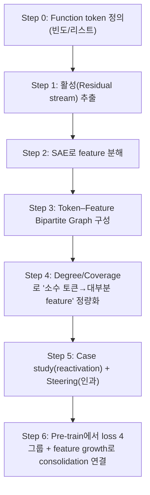

[논문 링크](https://arxiv.org/abs/2510.08203v1)

## Function Token Hypothesis: LLM “기억 검색”의 게이트는 왜 구두점과 개행인가

## 한 줄 요약 (TL;DR)

이 논문은 LLM의 기억을 “feature의 재활성화(retrieval) + 학습을 통한 feature 확장(consolidation)”으로 정의하고, **function token**(고빈도 토큰)이 추론 시점에 예측에 필요한 feature들을 문맥-조건부로 재점화하며, 사전학습에서는**function→content**예측이 최적화를 지배해 feature 수를 키운다는**Function Token Hypothesis** 를 정량(coverage/degree)·정성(reactivation trace)·인과(steering)·학습동학(loss decomposition)으로 엮어 제시한다. (근거: §1, Fig.1, §3.1, Tab.1, §3.2, Fig.6, Fig.7, §4.2, Fig.8, §4.3, Fig.9)

---

## 핵심 아이디어

* **기억(memory)** 을 “파라미터에 저장된 지식”이 아니라,**SAE로 추출되는 feature/circuit의 집합**으로 보고,**retrieval**을 “추론 중 feature 활성화”,**consolidation** 을 “학습 중 feature 확장”으로 재정의한다. (근거: §1, §2.1, §4.2)
* 문서 전반에 고르게 등장하는 **function token**이 token–feature 그래프에서**hub** 로 작동해, feature space의 큰 비율을 “접근”하고(coverage), 문맥에 따라 필요한 feature 조합을 재구성하여 다음 토큰 예측을 지배한다는 가설을 세운다. (근거: §1, §2.2, §3.1, Fig.5, Tab.1, §3.2, Fig.6)
* 사전학습에서는 next-token 예측을 function/content 타입으로 분해했을 때, 특히 **function→content** 전이가 높은 loss를 가지며 스케일링 이득도 커서 학습(=consolidation)을 구동한다고 주장한다. (근거: §4.3, Fig.9)

---

## 배경: 그들이 해결한 문제

기존 interpretability 흐름은 “모델 안에 어떤 feature가 있고 무엇을 의미하는가”를 SAE 등으로 분해해 보여주는 데 강했다. (근거: §2.1)
하지만 **추론 시점** 에는 “어떤 토큰이 문맥 정보를 이용해 그 feature들을 다시 켜서(next-token을) 결정하는가”가 상대적으로 덜 정식화되어 있었다. (근거: §1)
또한 **학습 시점** 에는 “어떤 종류의 예측 과제가 파라미터 업데이트를 가장 강하게 구동해 feature 수를 늘리는가”를 토큰 타입 수준으로 연결해 설명하기 어려웠다. (근거: §4, §4.3)

이 논문은 이 공백을 **function token**이라는 토큰 클래스와,**token–feature bipartite graph** 라는 정량 프레임으로 메우려 한다. (근거: §1, §3.1, Fig.4)

---

## 새로운 접근법: Function Token Hypothesis

이 논문의 “방법 이름”은 사실상 **Function Token Hypothesis** 다. (근거: §1, Fig.1)
핵심은 2단 결합이다.

1. **Retrieval 가설**: 추론에서 **function token** 이 문맥에서 가장 예측적인 feature를 재활성화해 다음 토큰을 지배한다. (근거: §1, Fig.1, §3.2, Fig.6)
2. **Consolidation 가설**: 사전학습에서 **function→content** 예측이 어렵고 중요해서 최적화가 그 축에 의해 구동되며, 이것이 feature 확장으로 이어진다. (근거: §4.3, Fig.9, §4.2, Fig.8)

이를 뒷받침하기 위해, 저자들은 (a) function token을 빈도 기반으로 정의하고, (b) SAE로 feature를 만들고, (c) token–feature 그래프를 구축해 hubness/coverage를 측정하고, (d) reactivation trace와 steering으로 “작동”을 보여주고, (e) pre-training에서 loss 분해와 feature 수 증가를 연결한다. (근거: §2.2, §3.1, Fig.4, §3.2, Fig.6, Fig.7, §4.2, Fig.8, §4.3, Fig.9)

---

## 작동 원리: 구체적인 예시로 살펴보기

### Step 1) Function token / Content token 정의

저자들은 SlimPajama-627B에서 **1B tokens**를 샘플링해 빈도 통계를 만들고, “빈도 상위 토큰을 누적해 전체 token occurrences의**40%**를 덮을 때까지”를 function token으로 두며, 그 결과**122 tokens** 가 function token으로 라벨링된다고 제시한다. (근거: §2.2)

또한 문서 커버리지(document coverage) 관점에서 function token은 문서 전반에 더 균일하게 등장하고, content token은 일부 문서에 bursty하게 등장하는 패턴을 시각화로 보여준다. (근거: Fig.3a, Fig.3b, Fig.3c, §2.2)

---

### Step 2) SAE로 activation을 feature로 분해

Gemma2-9B에서 Gemma Scope SAE를 사용해, 레이어별 residual stream activation을 feature로 분해한다. (근거: §3.1, Fig.4)
이때 SAE dictionary width는 $2^{20}$ 로 설정되어 **1,048,576 features** 규모의 feature space를 다룬다. (근거: §3.1)

$$
\text{(예:)}\quad z=\text{SAE-Enc}(h),;;\hat{h}=\text{SAE-Dec}(z)
$$

(위 식은 직관적 표기이며, pre-training 실험에서 사용한 JumpReLU-SAE 형태는 부록에 제시된다.) (근거: Appx C)

---

### Step 3) Token–Feature bipartite graph 구성

토큰 노드 집합 $T$ 와 feature 노드 집합 $F_l$ 를 두고, 특정 레이어 $l$ 에서 “토큰이 어떤 문맥에서 feature를 한 번이라도 활성화하면” token–feature edge를 연결하는 bipartite graph를 만든다. (근거: §3.1, Fig.4)
중복 활성화는 여러 번 발생해도 token–feature pair당 edge는 1개로 취급한다. (근거: §3.1)

---

### Step 4) Toy example로 “coverage” 직관 만들기

3×3 픽셀 대신, 3-feature짜리 장난감 공간을 쓰자.

* Tokens: `{ "of", "Tokyo", ".", "\n" }`
* Features: `{ f_loc, f_japan, f_boundary }`

가정(토이):

* `"Tokyo"`가 나오면 $f_{japan}$ 활성.
* `"of"`가 나오면 $f_{loc}$ 활성.
* `"."` 또는 `"\n"` 이 나오면 $f_{boundary}$ 활성.

그럼 Top-2 frequent tokens가 `{".", "of"}` 라면,

* 활성 feature 합집합 = `{ f_boundary, f_loc }`
* coverage = $2/3=66.7%$

논문은 이 아이디어를 실제 SAE feature space( $2^{20}$ )로 확장해, “상위 빈도 토큰이 얼마나 많은 feature를 덮는가”를 누적 coverage로 계량한다. (근거: §3.1, Tab.1)

---

### Step 5) “재활성화(retrieval)”를 관찰하고, “게이트”를 인과로 확인한다

저자들은 Gemma2-9B-it에서 interpretable feature 예시로 **‘Speak Chinese’**, **‘Russia’**, **‘UK’** 등에 해당하는 feature들을 추적하며, content token이 점화한 feature 활성화가 `:`, `the`, `\n` 같은 function token 구간에서 다시 재생성/전달되는 패턴을 제시한다. (근거: §3.2, Fig.6, Appx A)

그리고 prompt 마지막의 function token(예: `\n`) 위치 activation만 steering해도 출력 언어/내용이 바뀌는 사례를 들어, function token 위치가 실질적인 제어 레버가 될 수 있음을 보인다. (근거: §3.2, Fig.7, Appx A)

---

## 성능 검증: 주요 결과

이 논문의 “성능”은 전통 벤치마크 정확도(MMLU 등)가 아니라, **feature access 구조와 학습동학을 얼마나 설득력 있게 보여주는가** 로 구성된다. (근거: §3, §4)

### 1) Top-k 고빈도 토큰이 feature space 대부분을 덮는다

Gemma2-9B를 SlimPajama validation **10,000 docs**, 약 **5M tokens**로 구동하고, 레이어**9/20/31** 에서 token–feature 그래프를 분석한다. (근거: §3.1)
연결된 feature 노드 수는 레이어 9/20/31에서 각각 **965,635 / 947,341 / 919,220 features** 로 보고된다. (근거: §3.1, Fig.5)
dictionary width가 $2^{20}$ 일 때 activation rate는 레이어 9/20/31에서 각각 **92.1% / 90.3% / 87.7%** 로 보고된다. (근거: §3.1, Fig.5)

특히 Tab.1은 Top-10 frequent tokens의 cumulative feature coverage를 레이어별로 제시하며, 레이어 20에서 **76.46%** 까지 도달한다. (근거: Tab.1)

| Layer | Top-10 cumulative feature coverage |
| ----- | ---------------------------------: |
| 9     |                 48.52% (근거: Tab.1) |
| 20    |                 76.46% (근거: Tab.1) |
| 31    |                 68.27% (근거: Tab.1) |

또한 token degree 분포가 log-log에서 heavy-tail임을 Fig.5로 제시해 “소수 토큰이 대부분 feature를 활성화하는 scale-free 구조” 해석을 뒷받침한다. (근거: Fig.5, §3.1, §7)

---

### 2) Function token은 문맥에 따라 다른 “예측 feature” 조합을 재구성한다

동일한 function token들이 서로 다른 질문(예: 중국어로 러시아/영국 수도)에서 서로 다른 예측적 feature 조합을 활성화하며, 이를 토큰 위치별 feature activation trace로 보여준다. (근거: §3.2, Fig.6)

---

### 3) 마지막 function token 위치만 조작해도 출력이 바뀐다

마지막 `\n` 위치 activation에 steering vector를 더해, 영어 응답이 중국어로 바뀌거나 특정 개념(예: 국가 관련)으로 출력이 이동하는 사례를 제시한다. (근거: §3.2, Fig.7, Appx A)

---

### 4) Pre-training에서 consolidation은 feature expansion으로 관측된다

LLaMA-3.1-8B 아키텍처로 scratch 학습을 수행하며, **1.5B params(2 layers)**및**8B params(32 layers)** 모델을 학습해 비교한다. (근거: §4.1)
데이터는 SlimPajama-627B에서 **1 epoch = 627B tokens**를 사용하며, batch size**1024 sequences/step**, max seq length **4095 tokens**, warmup **8,000 steps**후 LR $8\times10^{-5}$, cosine decay로 LR $8\times10^{-7}$ 까지 내리고,**128×GPU(80GB)** 를 사용한 설정을 제시한다. (근거: §4.1)

연산 제약으로 feature decomposition은 **1.5B params** 모델에서만 수행하며, 2nd-layer activation에 대해 checkpoint별 SAE를 학습해 feature 수 증가를 추적한다. (근거: §4.2)
그 결과 learned features가 **3,000 steps: 1,942 → 50,000 steps: 42,822 → 130,000 steps: 64,042 features** 로 증가한다. (근거: §4.2, Fig.8a)

---

### 5) 학습 난이도의 중심은 function→content 전이다

next-token 예측을 (current, next)가 function/content인지에 따라 4그룹으로 나눠 loss를 비교하며, **function→content** 가 가장 큰 loss를 갖는 “어려운” 예측임을 보인다. (근거: §4.3, Fig.9)
또한 1.5B→8B 스케일업 시 loss 감소 폭이 function→content와 content→content에서 **0.61 (CE loss)** 로 더 크게 나타난다고 수치를 제시한다. (근거: §4.3)

---

## 우리의 관점: 강점, 한계, 그리고 이 연구가 중요한 이유

### 강점

* **문제 설정이 좋다** : retrieval(추론)과 consolidation(학습)을 “feature 관점”에서 하나의 가설로 묶어, 기존의 파편화된 관찰(구두점/개행의 중요성 등)을 통합 프레임으로 끌어올린다. (근거: §1, Fig.1, §6)
* **정량화가 설득력을 만든다** : token–feature 그래프와 coverage(%)는 “해석 가능성”을 측정 가능한 대상으로 만든다. (근거: §3.1, Fig.4, Tab.1)
* **인과 실험(steering)로 한 단계 더 간다** : 마지막 function token 위치만 편집해 출력이 달라지는 사례는, “hub 토큰이 정말 게이트인가”라는 질문에 강한 보조증거가 된다. (근거: §3.2, Fig.7, Appx A)
* **학습 동학으로 확장** : pre-training에서 feature 수 증가와 loss 분해를 함께 보여 “왜 function token이 특별해지는가”를 학습 관점에서 건드린다. (근거: §4.2, Fig.8, §4.3, Fig.9)

### 한계

* **정의가 근사다** : function/content 구분은 빈도 기반 휴리스틱이며, 저자도 근사로 사용함을 인정한다. (근거: §1)
* **스케일·범위 제약** : feature decomposition은 연산 제약으로 1.5B 모델에 국한되고, token–feature 그래프도 10k docs/5M tokens 및 3개 레이어로 대표 분석한다. (근거: §4.2, §3.1)
* **핵심 메커니즘은 여전히 오픈** : function token이 왜/어떻게 “special power”를 획득하는지, post-training에서 역할이 어떻게 바뀌는지, middle layer steerability의 원인이 무엇인지 등을 미해결 질문으로 남긴다. (근거: §7)
* **방법론적 안정성 이슈 가능성** : pre-training이 진행될수록 SAE 분해가 더 어려워지고 오래 걸린다는 점을 언급한다. (근거: Appx C)

### 왜 중요한가

이 논문이 던지는 메시지는 “feature가 있다”가 아니라 “feature로 가는 입구가 편향되어 있다”에 가깝다. (근거: §3.1, Fig.5, Tab.1)
만약 소수 function token이 feature space에 대한 접근권을 구조적으로 독점한다면, (a) prompt formatting이 성능을 좌우하는 이유, (b) 특정 제어가 middle layer와 특정 토큰 위치에서 잘 먹히는 이유, (c) 학습이 어떤 transition을 중심으로 조직되는지에 대한 해석이 훨씬 구체화된다. (근거: §3.2, Fig.6, Fig.7, §4.3, Fig.9)

---

## 다음 단계는?: 앞으로의 길

저자들이 제시한 open question은 크게 4개 축으로 정리된다: (1) function token 능력 획득 원인, (2) post-training(SFT/RL)의 영향, (3) scale-free 분포의 원인, (4) middle layer steerability의 메커니즘. (근거: §7)

여기서 합리적인 다음 실험은 “논문이 이미 만든 계량 지표”를 그대로 쓰면서 원인 변수를 흔드는 것이다.

* **Loss re-weighting / curriculum**: 학습에서 function→content 전이의 가중치를 변화시키고 grouped loss(CE)와 feature growth(learned features count), coverage(%)가 어떻게 바뀌는지 추적하는 실험. (근거: §4.3, Fig.9, §4.2, Fig.8)
* **Post-training 전후 topology 비교**: Pre-training only vs +SFT vs +RL 조건에서 Top-k coverage(%)와 degree 분포 tail, steering 성공 양상이 재배열되는지 확인하는 실험. (근거: §7, §3.1, Tab.1, Appx A)
* **토크나이저/언어/도메인 일반화**: 동일한 “40% occurrences 커버” 규칙으로 정의된 function token set이 다른 토크나이저·언어·코퍼스(코드/대화/수학 등)에서도 동일한 hubness를 보이는지 검증. (근거: §2.2, Fig.3, §3.1)
* **Middle layer 원인 분해**: layer별 steering 성공률과 feature sparsity/entropy, attention/FFN 경로 기여를 함께 기록해 “왜 middle이 제어 레버가 되는가”를 구조적으로 분해. (근거: §7, Appx A)


### 토글을 클릭하면 논문에 대한 자세한 LLM 질의응답 내용을 확인할 수 있습니다.

<details markdown="block">
<summary>▶️<strong>클릭하여 펼치기</strong></summary>


## 프롬프트 1.1.1 (연구의 공백)

```
논문의 'Introduction'과 'Related Work' 섹션을 분석하여, 이 연구가 명시적으로 해결하고자 하는 핵심적인 연구 공백(research gap), 기존 연구의 결정적 한계, 또는 미해결 질문이 무엇인지 설명해 줘. 저자들이 설명하는, 이 논문 출판 시점의 '최신 기술(state of the art)'은 어떤 상태였는지 요약해 줘.
```


* 기존 LLM 해석 연구는 “어떤 feature/회로가 존재하는가”는 많이 보여줬지만, **추론 시점에 그 feature들이 ‘언제/무엇에 의해’ 재활성화(retrieval)되는지** 를 토큰 단위로 설명하는 프레임이 부족했다. (근거: §1)
* 저자들은 이 공백을 **function token(고빈도 토큰)** 이 “문맥에서 가장 예측적인 feature를 재활성화해 다음 토큰을 결정”한다는 가설로 메우려 한다. (근거: §1, Fig.1)
* 또한 **사전학습(pre-training)에서의 파라미터 업데이트/feature 확장(consolidation)이 ‘function→content’ 예측 난이도에 의해 지배된다** 는 관찰을 통해, “왜 하필 function token이 feature 접근권을 가지는가”를 연결한다. (근거: §4, Fig.9, §5)

---

## 이 논문이 명시적으로 겨냥하는 연구 공백 (Research Gap)

### 공백 1) 추론(inference)에서의 기억 검색(retrieval) 메커니즘이 불명확함

* 저자들은 LLM “기억”을 **파라미터 및 파라미터로부터 유도 가능한 feature들의 가상 저장소** 로 두고, **기억 검색(retrieval)을 feature/circuit activation으로 정의** 한다. (근거: §1)
* 그러나 기존에는 “어떤 뉴런/feature가 무엇을 표현하는가” 수준의 분석은 진전되었지만, **토큰 시퀀스 전개 중 어떤 종류의 토큰이 feature를 ‘문맥 기반으로 재활성화’하며 다음 토큰 예측을 지배하는지** 가 핵심 질문으로 남아있다고 지적한다. (근거: §1)
* 이를 위해 저자들은 **function token vs content token** 구분이 기억 검색을 해부하는 데 유용하다고 주장하며, function token이 문맥의 예측적 feature를 “다시 켠다”는 관점을 제안한다. (근거: §1, Fig.1, §3.2)

### 공백 2) 사전학습(pre-training)에서의 기억 공고화(consolidation)가 “무엇에 의해” 일어나는지 불명확함

* 저자들은 **기억 공고화(consolidation)를 파라미터 학습을 통해 feature/circuit이 형성·확장되는 과정** 으로 정의한다. (근거: §1)
* 기존 관점(예: FFN을 key-value memory로 보는 해석)은 “지식이 어디에 저장되는가”는 설명하지만, **학습 중 어떤 예측 과제가 파라미터 업데이트를 가장 강하게 구동하며 feature 수(표현력)를 키우는가** 를 토큰 타입 관점에서 분해하지 못했다고 본다. (근거: §2.1, §4)
* 저자들의 공백 설정은 특히 **function token 직후 content token 예측(function→content)** 이 사전학습에서 가장 “어려운” 축이며, 그 결과가 feature 확장을 주도한다는 주장으로 귀결된다. (근거: §4.3, Fig.9, §5)

---

## 저자들이 요약하는 출판 시점 SOTA 상태 (Introduction + Related Work 기반)

### 1) “지식/기억”을 파라미터와 activation으로 해석하는 프레임은 성숙

* Transformer의 **FFN을 key-value memory로 해석** 하는 관점이 널리 알려져 있으며, attention도 유사한 key-value 메모리로 볼 수 있다고 전제한다. (근거: §2.1)
* 또한 **superposition** 및 **SAE(Sparse Autoencoder) 기반 feature 분해** 를 통해, 뉴런 activation을 인간 해석 가능한 feature들의 희소 조합으로 설명하는 방법론이 발전했다. (근거: §1, §2.1)
* feature steering(특정 feature activation 조절로 출력 행동을 바꾸는 것)이 가능하다는 점도 이미 관찰된 흐름으로 정리한다. (근거: §2.1, §6)

### 2) “특정 토큰(특히 구분자/서식 토큰)이 비정상적으로 중요하다”는 현상 관찰은 축적

* 초기 토큰, period, newline 등에서 **activation magnitude가 비정상적으로 큰 패턴** 이 보고되었다고 언급한다. (근거: §5, §6)
* 의미적으로 빈약한 separator token이 **attention에 과도한 영향을 준다** 는 관찰도 관련 흐름으로 든다. (근거: §5, §6)
* post-training에서 **formatting(예: `\n`)이 큰 역할** 을 한다는 실무적·경험적 인식이 강하며, pivot token이 응답 정확도에 중요하다는 관찰도 인용한다. (근거: §6, §5)
* 또한 **high-entropy token에 집중한 학습이 성능을 개선** 한다는 최근 흐름도 연결한다. (근거: §5, §6)

### 3) 하지만 “현상 → 메커니즘”을 잇는 통합 가설이 부족 (저자 관점)

* 위 현상들은 개별적으로는 알려져 있으나, 저자들은 이를 **function token(고빈도·문법/연결 기능)이라는 단일 범주** 로 묶어 **기억 검색(retrieval)과 공고화(consolidation)을 함께 설명하는 메커니즘 가설** 로 정식화한 점이 기존 대비 부족했다고 본다. (근거: §1, §5, §6)

---

## SOTA 대비 “결정적 한계”를 저자 프레이밍으로 재정리

| 관찰/흐름                                                                 | 당시까지의 대표적 설명 축                     | 저자들이 보는 한계(=gap)                                                           | 이 논문이 겨냥하는 연결고리                                           |
| ------------------------------------------------------------------------- | --------------------------------------------- | ---------------------------------------------------------------------------------- | --------------------------------------------------------------------- |
| SAE로 feature를 뽑고, steering으로 행동을 조절 가능 (근거: §2.1, §6)      | “feature는 존재하며 조작 가능” (근거: §2.1)   | **어떤 토큰이 문맥 기반으로 feature를 재점화하는가** 가 약함 (근거: §1)          | function token이 문맥의 예측적 feature를 재활성화 (근거: §3.2, Fig.6) |
| separator/formatting 토큰이 attention·activation에 큰 영향 (근거: §5, §6) | “특정 토큰이 중요해 보인다” (근거: §6)        | 중요성의 이유가 “토큰 클래스” 수준으로 일반화되지 않음 (근거: §6)                  | function token 범주화 + retrieval/consolidation 통합 가설 (근거: §5)  |
| 학습이 진행되며 표현력/feature가 성장 (근거: §4.2, Fig.8)                 | “스케일/학습이 feature를 늘린다” (근거: §4.2) | **어떤 예측 항목이 업데이트를 지배해 feature를 키우는가** 가 불명확 (근거: §4.3) | function→content 예측이 가장 어렵고 최적화를 지배 (근거: §4.3, Fig.9) |

---

## 요약: 이 논문이 정의하는 “최신 기술(SOTA)”의 상태

* (1) FFN/attention을 메모리로 해석하고, (2) SAE로 feature를 분해하며, (3) feature steering으로 일부 행동을 제어하고, (4) separator/formatting 토큰의 비정상적 중요성을 관찰하는 단계까지는 와 있었다. (근거: §2.1, §6)
* 그러나 **“function token이라는 소수 고빈도 토큰이 문맥 기반 feature 재활성화의 게이트로 동작한다”는 통합 가설로 retrieval과 consolidation을 함께 설명** 하는 수준은 부족했으며, 그 공백을 본 논문이 정면으로 다룬다. (근거: §1, §5, §6)

---


## 프롬프트 1.1.2 (핵심 가설)

```
이 논문의 중심 가설(central hypothesis) 또는 핵심 주장은 무엇인가? '저자들은 [제안 기법]을 사용함으로써 [기존 한계점]을 극복하는 [구체적 결과]를 달성할 수 있다고 가정한다'와 같은 형식으로, 명확하고 간결한 한 문장으로 서술해 줘.
```

저자들은 **Function Token Hypothesis** 를 제안함으로써, 기존에 충분히 설명되지 않았던 LLM의 memory retrieval·consolidation 메커니즘을 “추론(inference)에서는 function token이 문맥(context)에서 가장 예측적인 feature를 활성화해 다음 토큰 예측을 지배하고, 사전학습(pre-training)에서는 function token 다음의 content token 예측이 파라미터 업데이트와 feature 확장을 구동한다”는 통합 모델로 설명할 수 있다고 가정한다. (근거: §1, Fig.1)


## 프롬프트 1.2.1 (독창성 식별)

```
논문 전체를 바탕으로, 가장 중요하고 독창적인 기여(contribution) 1~3가지를 구별되는 항목으로 나열해 줘. 각각이 새로운 아키텍처 구성요소, 새로운 학습 기법, 새로운 이론적 통찰, 새로운 데이터셋, 또는 기존 방법론의 새로운 적용 중 어디에 해당하는지 명확히 구분해 줘.
```

## 독창적 기여(Contributions) 3가지

### **기여 1: Function Token Hypothesis로 “retrieval + consolidation”을 하나의 프레임으로 통합**

* 유형: **새로운 이론적 통찰** (근거: §Abstract, §1, Fig.1, §5)
* 저자들은 **추론(inference)에서는 function token이 문맥(context)에서 가장 예측적인 feature를 재활성화해 next-token prediction을 지배하고, 사전학습(pre-training)에서는 function token 뒤에 오는 (대개) content token 예측이 feature 수 증가 및 파라미터 업데이트를 구동한다** 는 통합 가설을 제시한다. (근거: §Abstract, §1, Fig.1, §5)

---

### **기여 2: SAE 기반 Token–Feature bipartite graph로 “소수 function token이 대부분 feature를 활성화”를 정량화**

* 유형: **기존 방법론의 새로운 적용** (SAE 해석을 token–feature 그래프/coverage 분석으로 확장) (근거: §3.1, Fig.4, Fig.5, Tab.1)
* Gemma2-9B를 대상으로, SAE dictionary width를 $2^{20}$ (≈ 1,048,576 features)로 두고 token–feature activation pair를 edge로 하는 bipartite graph를 구성해 token의 **feature coverage** 를 계량한다. (근거: §3.1, Fig.4)
* 10,000 documents( SlimPajama validation )를 입력(≈ 5M tokens)하고 layer 9/20/31에서 분석했을 때, feature node 수가 각각 965,635 / 947,341 / 919,220개로 관측되며(연결된 feature 기준), activation rate가 92.1% / 90.3% / 87.7%로 보고된다. (근거: §3.1, Fig.5)
* Top-10 frequent tokens만으로 cumulative feature coverage가 layer 20에서 76.46%에 도달하며(예: “.”, “,”, “the”, “\n”, “and”, “to”, “of” 등), 이는 **고빈도 function token이 feature space에 “universal access”를 가진다** 는 주장에 정량 근거를 제공한다. (근거: Tab.1, §3.1)
* 또한 동일한 function token들이 서로 다른 문맥에서 서로 다른 feature 조합을 “재생성/전파”하여 출력이 달라지는 사례를, 예측적 feature(예: ‘Speak Chinese’, ‘Russia’, ‘UK’) 활성 패턴으로 시각화한다. (근거: §3.2, Fig.6)

---

### **기여 3: Pre-training 동학을 token-type loss + feature expansion으로 연결해 “function→content 예측이 최적화를 지배”함을 제시**

* 유형: **새로운 이론적 통찰** (학습 동학에 대한 메커니즘 주장) + **기존 방법론의 새로운 적용** (checkpoint SAE로 feature growth 추적) (근거: §4, §4.2, Fig.8, §4.3, Fig.9)
* LLaMA-3.1-8B 아키텍처로 8B(32 layers) 및 1.5B(2 layers) 모델을 scratch에서 학습하고, SlimPajama-627B(627B tokens) 1 epoch를 사용해 pre-training 동안의 memory consolidation을 추적한다. (근거: §4.1)
* 학습 설정으로 batch size 1024, max seq length 4095 tokens, warmup 8,000 steps→LR $8\times10^{-5}$, cosine decay→LR $8\times10^{-7}$, 128×GPU(80GB VRAM) 사용을 명시한다. (근거: §4.1)
* 1.5B 모델의 2nd-layer activation에 대해 JumpReLU-SAE로 checkpoint별 SAE를 학습(각 checkpoint마다 500,000 activations)하고, learned feature 수가 3,000 steps에서 1,942개 → 50,000 steps에서 42,822개 → 130,000 steps에서 64,042개로 증가함을 보여 **consolidation을 feature expansion으로 계량** 한다. (근거: §4.2, Fig.8a)
* next-token prediction을 (current token, next token)이 function/content인지에 따라 4그룹으로 나누어 loss trajectory를 분석한 결과, pre-training 초반에는 function token 예측이 상대적으로 두드러지며 이후에는 특히 **function→content** 예측이 최적화(손실 감소)를 지배한다는 핵심 결론을 제시한다. (근거: §4, §4.3, Fig.9)


## 프롬프트 1.2.2 (저자 관점에서의 강점)

```
저자들의 관점에서, 자신들의 접근법이 이전 방법들보다 우월한 이유는 무엇인가? 그들이 자신들의 연구가 지닌 독창성과 강점을 뒷받침하기 위해 사용하는 핵심 논거를 인용하거나 알기 쉽게 설명해 줘.
```

## 저자 관점에서의 강점: 왜 이전 방법보다 “우월”하다고 보는가

### 1) **현상 나열이 아니라, retrieval·consolidation을 한 문장 가설로 “통합”한다**

* 기존 해석은 “feature가 있다/조작 가능하다”를 보여주는 데 강했지만, **어떤 토큰이 언제 feature를 재점화해 예측을 지배하는지** 를 하나의 메커니즘으로 묶기 어려웠다고 저자들은 본다. (근거: §1, §2.1)
* 본 논문은 **function token이 inference에서 예측적 feature를 재활성화(retrieval)하고, pre-training에서는 function→content 예측이 파라미터 업데이트와 feature 확장을 구동(consolidation)한다** 는 단일 프레임으로 두 축을 연결한다. (근거: §1, Fig.1, §5)

### 2) **“설명 가능”을 정량 지표로 바꿔, 해석을 측정 가능한 문제로 만든다**

* SAE 기반 token–feature **bipartite graph** 를 구성하고, 토큰별 **feature coverage** 를 계산해 “어떤 토큰이 feature space에 얼마나 접근하는가”를 수치화한다. (근거: §3.1, Fig.4)
* 특히 Top-10 frequent tokens만으로 cumulative feature coverage가 layer 20에서 76.46%까지 올라간다는 결과는, **소수의 function token이 대부분 feature에 ‘universal access’** 를 가진다는 저자 주장에 정량 근거를 제공한다. (근거: Tab.1, §3.1)
* 이 접근은 “어떤 feature가 있다”에서 끝나지 않고, **토큰-주도(token-driven) activation 구조 자체를 계량** 하므로 기존 관찰(예: 특정 구두점/개행 토큰의 중요성)을 일반화된 분석 프레임으로 끌어올린다고 저자들은 주장한다. (근거: §5, §6)

### 3) **동일 토큰이 문맥에 따라 다른 feature 세트를 재구성한다는 ‘동작적’ 증거를 제시한다**

* 단순히 “빈번한 토큰이 크다”가 아니라, 동일한 function token이 서로 다른 문맥에서 서로 다른 예측적 feature 조합을 활성화해 다음 토큰을 달리 만든다는 사례를 시각화로 제시한다. (근거: §3.2, Fig.6)
* 이로써 function token을 **retrieval의 게이트(입구)** 로 보는 해석이 “상관”이 아니라 “작동 방식”으로 제시된다는 점을 강점으로 든다. (근거: §3.2, Fig.6)

### 4) **pre-training 동학과 연결해 “왜 하필 function token인가”까지 설명 범위를 넓힌다**

* 저자들은 consolidation을 feature expansion으로 계량하고, checkpoint 진행에 따라 learned feature 수가 크게 증가하는 양상을 SAE로 추적한다. (근거: §4.2, Fig.8)
* 또한 next-token 예측을 (current/next)의 function/content 조합으로 분해해, 특히 **function→content** 예측이 최적화를 지배한다는 손실 궤적을 근거로 “학습이 function token 주변에서 강하게 구조화된다”는 해석을 뒷받침한다. (근거: §4.3, Fig.9, §5)

### 5) **기존 방법론을 버리지 않고 “상위 레벨의 조직 원리”를 추가한다**

* SAE, activation 분석, token 중요도 관찰 등 기존 interpretability 도구들을 그대로 활용하면서도, 결과를 **function token 중심의 조직 원리** 로 재해석해 더 큰 설명력을 만든다는 점을 우월성 근거로 제시한다. (근거: §2.1, §3, §6)

---

### 비교 요약: 저자들이 주장하는 “우월성”의 핵심 포인트

| 축     | 기존 접근(저자 요약)                                 | 본 논문 접근(저자 주장)                                                    |
| ----- | -------------------------------------------- | ----------------------------------------------------------------- |
| 목표    | feature 존재/의미 규명 중심 (근거: §2.1)               | feature “접근권”과 “재점화 토큰” 규명 (근거: §1, §3.1)                         |
| 형태    | 사례·관찰의 누적 (근거: §6)                           | **function token** 으로 범주화 + 정량화(coverage) (근거: §3.1, Tab.1, §5) |
| 메커니즘  | retrieval vs consolidation이 분리되어 논의 (근거: §1) | retrieval·consolidation을 단일 가설로 연결 (근거: §1, Fig.1)                |
| 학습 동학 | “학습하면 표현이 늘어난다” 수준 (근거: §4.2)                | function→content 예측이 업데이트/feature 확장을 구동 (근거: §4.3, Fig.9)        |

---


## 프롬프트 1.3.1 (알고리즘 단계별 설명)

```
핵심 알고리즘, 모델 아키텍처, 또는 주요 방법론을 단계별(step-by-step)로 설명해 줘. 독자는 AI 분야의 대학원생 수준이라고 가정해. 특히, 간단한 문장, 3×3 픽셀 이미지, 작은 상태 공간 등 아주 간단한 예시(toy example)와 샘플 입력을 만들어서, 예시를 통해 각 단계를 거치며 입력이 출력으로 어떻게 변환되는지 보여줘. 등장하는 모든 핵심 용어와 변수는 그 즉시 정의해 줘.
```

## 방법론 전체 개요

이 논문의 핵심 방법론은 (1) **function token** 을 빈도 기반으로 정의하고, (2) SAE로 추출한 **feature** 와 token의 관계를 **token–feature bipartite graph** 로 정량화한 뒤, (3) **function token 위치에서의 feature reactivation/steering** 으로 “retrieval”을 사례+인과로 보이고, (4) pre-training에서 **loss 분해 + feature 수 추적** 으로 “consolidation”까지 연결하는 파이프라인이다. (근거: §2.2, §3.1, Fig.4, §3.2, Fig.6, Fig.7, §4.2, Fig.8, §4.3, Fig.9)



(근거: §2.2, §3.1, Fig.4, Fig.5, Tab.1, §3.2, Fig.6, Fig.7, §4, Fig.8, Fig.9)

---

## Step-by-step: 핵심 알고리즘(토큰→feature 그래프)

### Step 0. **function token** 과 **content token** 정의

* 논문은 특정 토큰 집합을 **function token** 으로 분류하고(빈도 상위 토큰 리스트), 나머지를 **content token** 으로 분류한다. (근거: Appx D, Tab.2, §2.2)
* 토큰이 “얼마나 넓게 쓰이는지”를 보기 위해 **document coverage** 를 다음처럼 둔다. (근거: §2.2, Fig.3c)

$$
\text{DocCov}(t)=\frac{|{d\in D: t\in d}|}{|D|}
$$
(근거: §2.2, Fig.3c)

#### Toy example (document coverage)

여기서는 설명을 위해 문서 2개를 둔다.

* d1 = `"of Tokyo"`
* d2 = `"of Paris"`

이때 `of`는 DocCov=2 docs / 2 docs = 1.0, `Tokyo`는 DocCov=1 docs / 2 docs = 0.5가 된다.
(이 예시는 이해를 위한 임의 구성이다.)

---

### Step 1. 활성(activation) 추출: 모델·데이터·레이어 고정

* 저자들은 Gemma2-9B를 대상으로, SlimPajama validation에서 **10,000 docs** 를 샘플링해 총 **~5,000,000 tokens** 규모로 inference를 수행하고 residual stream activations를 추출한다. (근거: §3.1)
* 분석 레이어는 **layer 9 / layer 20 / layer 31 (layer indices)** 로 설정한다. (근거: §3.1)

여기서부터 표기를 정리한다(설명용 정의):

* $l$: layer index
* $i$: 시퀀스 내 토큰 위치
* $t_i$: i번째 token id
* $h_{l,i}\in\mathbb{R}^d$: layer $l$ residual stream의 i번째 activation 벡터

---

### Step 2. SAE로 feature 분해

* 각 레이어에 대해, 해당 레이어의 SAE를 적용해 토큰 activation을 sparse feature들로 분해한다. (근거: §3.1, Fig.4)
* 이때 논문은 Gemma Scope의 SAEs 중 **dictionary width = $2^{20}$ features** 인 구성을 사용한다. (근거: §3.1)

설명용으로 SAE를 다음처럼 생각하자:

* Encoder가 $h_{l,i}$ 를 sparse code $z_{l,i}$ 로 바꾸고,
* Decoder가 $z_{l,i}$ 로부터 $\hat{h}_{l,i}$ 를 복원한다.

(참고로 pre-training 실험에서 사용한 JumpReLU-SAE의 수식 형태는 Appendix에 명시되어 있다.) (근거: Appx C, Eq.(7), Eq.(8))

$
z=\text{JumpReLU}* \theta(W* {\text{enc}}x+b_{\text{enc}})
$
(근거: Appx C, Eq.(7))

$
\hat{x}=W_{\text{dec}}z+b_{\text{dec}}
$
(근거: Appx C, Eq.(8))

---

### Step 3. Token–Feature bipartite graph 구성

* 저자들은 token과 feature를 서로 다른 노드 타입으로 두고, **token-feature activation pair** 를 edge로 하는 **bipartite graph** 를 구성한다. (근거: §3.1, Fig.4)
* edge 규칙: “token $t$ 가 어떤 context에서 feature $f$ 를 활성화하면(token이 그 feature를 ‘켠’ 적이 있으면) $t\leftrightarrow f$ 를 연결한다.” (근거: §3.1)
* 동일 token-feature pair는 activation이 여러 번 발생해도 **최대 1개 edge** 만 둔다. (근거: §3.1)

논문에서 보고한 그래프 규모(연결된 feature 노드 기준):

* feature 노드 수가 layer 9/20/31에서 각각 **965,635 features / 947,341 features / 919,220 features** 로 집계된다. (근거: §3.1)
* dictionary width가 $2^{20}$ features일 때, activation rate가 각각 **92.1% / 90.3% / 87.7%** 로 보고된다. (근거: §3.1)

---

### Step 4. 정량 지표: token degree와 cumulative feature coverage

* Figure 5는 token–feature bipartite graph에서 **token degree 분포(로그-로그)** 를 제시한다. (근거: Fig.5)
* Table 1은 **상위 10개 빈도 토큰(Top-10 frequent tokens)** 의 **cumulative feature coverage(%)** 를 레이어별로 요약한다. (근거: Tab.1)
* 특히 layer 20에서 Top-10 frequent tokens의 cumulative feature coverage가 **76.46%** 로 보고된다. (근거: Tab.1)

#### Toy example (bipartite graph & coverage)

설명용으로 vocabulary 5개와 feature 3개를 둔다.

* Tokens: `{ "the", "of", "Tokyo", ".", "\n" }`
* Features: `{ f_loc, f_japan, f_boundary }`

관찰(설명용 가정):

* `"Tokyo"`가 나오면 $f_{japan}$ 이 켜진다.
* `"of"`가 나오면 $f_{loc}$ 가 켜진다.
* `"."`와 `"\n"`는 문장 경계를 나타내며 $f_{boundary}$ 를 켠다.

그러면 bipartite edges는 예를 들어:

* `"of" ↔ f_loc`
* `"Tokyo" ↔ f_japan`
* `"." ↔ f_boundary`, `"\n" ↔ f_boundary`

Top-2 frequent tokens가 `"of", "."` 라고 하면 cumulative feature coverage는

* 활성 feature 합집합 = `{ f_loc, f_boundary }` → 2 features / 3 features = 66.7%
  (이 예시는 이해를 위한 임의 구성이다.)

---

## Step-by-step: “reactivation”을 보이는 실험(사례 + 인과)

### Step 5. Case study: 같은 function token이 문맥에 따라 다른 feature를 재활성화

* 저자들은 Gemma2-9B-it에서 해석 가능한 feature를 고르고(식별 방법은 Appendix에 기술), 예시로 **feature 15261 = ‘Speak Chinese’**,** feature 9591 = ‘Russia’**, ** feature 13751 = ‘UK’** 를 사용한다. (근거: §3.2, Appx A)
* 두 개 프롬프트(“중국어로 러시아 수도?”, “중국어로 영국 수도?”)에서 토큰별 feature activation을 기록해, `:`, `the`, `\n` 같은 **function token들이 activation을 전달/재생성(conduit)** 한다는 해석을 제시한다. (근거: §3.2, Fig.6)

---

### Step 6. Steering: function token 위치만 조작해 출력이 바뀌는 “인과” 증거

* 저자들은 **prompt의 마지막 function token(뉴라인 `\n`) 위치 activation** 에 steering vector를 더하는 방식으로 모델 출력을 변화시키는 실험을 수행한다. (근거: §3.2, Fig.7, Appx A)
* Appendix A는 (1) contrastive prompts 구성, (2) layer 선택, (3) SAE로 feature를 좁히는 과정, (4) 최종 feature로 steering 하는 과정을 **4단계 절차** 로 정리한다. (근거: Appx A)

핵심 수식(논문 표기):

* top-k feature 집합 $S_k$ 를 활성화하기 위한 hidden-space steering: (근거: Appx A, Eq.(5))

$
v^{S_k} * l=\alpha\cdot W * {\text{dec}}\sum_{i\in S_k} e_i
$
(근거: Appx A, Eq.(5))

* 특정 feature $i$ 하나로 steering: (근거: Appx A, Eq.(6))

$
v^i_l=\alpha_i\cdot W_{\text{dec}}e_i
$
(근거: Appx A, Eq.(6))

* Figure 7은 Prompt 3/4/5에서 **마지막 function token(`\n`)의 activation만 steering** 해도 응답 언어/내용이 바뀌는 사례를 제시한다. (근거: §3.2, Fig.7)
* 또한 ‘Russia’ feature를 활성화하면 단순히 “Russia” 토큰을 내는 것이 아니라 문맥상 그럴듯한 지명/기관을 산출하는 등, feature가 고수준 의미를 담는다는 해석을 덧붙인다. (근거: §3.2)

#### Toy example (steering 직관)

설명용으로 “답을 중국어로 하라”는 trait를 $f_{CN}$feature라고 하자.
마지막 `\n` 위치에서 $f_{CN}$ 방향의 vector를 더하면, 이후 생성이 중국어 분포로 기울어진다는 것이 논문의 주장 구조다.
(이 예시는 직관 전달용이다.)

---

## Step-by-step: “consolidation”을 보는 pre-training 분석

### Step 7. Pre-training 세팅 고정

* 저자들은 LLaMA-3.1-8B 아키텍처로 **8B params (32 layers)** 와 **1.5B params (2 layers)** 모델을 scratch에서 학습한다. (근거: §4.1)
* 데이터는 SlimPajama-627B를 사용하고, **1 epoch = 627B tokens** 를 학습한다. (근거: §4.1)
* 주요 하이퍼파라미터로 **batch size 1024 sequences/step**, **max sequence length 4095 tokens**, **warmup 8,000 steps → LR $8\times10^{-5}$**, cosine decay → **LR $8\times10^{-7}$**, **128 GPUs × 80GB VRAM/GPU** 를 제시한다. (근거: §4.1)

---

### Step 8. Feature expansion으로 consolidation을 계량

* 계산 비용 제약으로 feature decomposition은 **1.5B 모델** 에서만 수행한다. (근거: §4.2)
* **second-layer activations** 에 대해 여러 checkpoint에서 SAE를 학습해 “학습된 feature 수”를 추적한다. (근거: §4.2, Fig.8a)
* SAE는 **JumpReLU-SAE + tanh penalty** 를 사용하며, TopK-SAE/Gated-SAE 대비 우수하다고 서술한다. (근거: §4.2)
* checkpoint는 **3,000 steps / 50,000 steps / 130,000 steps** 를 사용하고, 각 checkpoint마다 **500,000 activations** 로 feature 수를 집계한다. (근거: §4.2, Fig.8a)
* Figure 8a는 pre-training이 진행될수록 feature 수가 증가함을 보여, 이를 memory consolidation의 지표로 해석한다. (근거: §4.2, Fig.8a)

---

### Step 9. Loss를 4그룹으로 분해해 “어떤 예측이 학습을 지배하는가”를 본다

* next-token 예측 $$p(\text{next} \mid \text{current}, \text{context})$$ 을 current/next가 function/content인지에 따라 **4그룹(function→function, function→content, content→function, content→content)** 으로 나눠 loss trajectory를 추적한다. (근거: §4.3, Fig.9)
* 저자들은 pre-training 초기에 function token 예측이 더 빠르게 학습되고, 이후에는 특히 **function→content** 예측이 최적화를 지배한다고 해석한다. (근거: §4.3, Fig.9)
* 스케일링 비교로, 1.5B→8B에서 group loss(CE loss, unitless)가 content→function은 **1.90→1.64 (Δ=0.26)**, function→function은** 2.12→1.87 (Δ=0.25)**인 반면, function→content는** 4.88→4.27 (Δ=0.61)**, content→content는 ** 3.69→3.08 (Δ=0.61)** 로 더 크게 감소한다고 보고한다. (근거: §4.3)

#### Toy example (4그룹 직관)

설명용으로 token type을 2개로만 두자: F=function, C=content.
시퀀스가 `F F C F C` 라면 next-token transition은:

* F→F, F→C, C→F, F→C 로 분해된다.
  논문은 이 4종 transition 각각의 loss 곡선을 따로 그려 “어느 transition이 학습을 좌우하는지”를 보는 구조다. (근거: §4.3, Fig.9)

---


## 프롬프트 1.3.2 ('비밀 병기' 식별)

```
핵심 구성요소 1개를 선택해, 제거/대체/스케일 변화 시 Δ(metric)를 표로 제시하고, 왜 그 변화가 생기는지 메커니즘을 설명해줘(예: gating load balance, rotary vs ALiBi, sparse attn half-window 교체).
```

## **비밀 병기** : Top-**k** 고빈도 **function token** 들이 feature space에 갖는 “universal access” (feature coverage)

### 선택한 핵심 구성요소

* **구성요소** : token–feature **bipartite graph** 에서 **Top- k** 고빈도 토큰(대부분 **function token** )을 “hub token set”으로 두고 **cumulative feature coverage** 로 정량화하는 설계 (근거: §3.1, Fig.4, Fig.5, Tab.1)

### Metric 정의(이 절에서의 Δ는 coverage의 **%p** 변화)

* 레이어 $l$ 에서 토큰 집합 $T_k={t_1,\dots,t_k}$ (빈도 내림차순) 가 “접근 가능한” feature 비율을 다음처럼 둔다. (근거: §3.1, Fig.4)

$$
\text{Cov}(k,l)=\frac{\left|\bigcup_{t\in T_k} \mathcal{N}_l(t)\right|}{|F_l|}\times 100%
$$

* $\mathcal{N}_l(t)$ : 레이어 $l$ 의 bipartite graph에서 토큰 $t$ 와 edge로 연결된 feature 집합 (근거: §3.1, Fig.4)
* $F_l$ : 레이어 $l$ 에서 “최소 1개 토큰과 연결된” feature 전체 집합 (근거: §3.1)

---

## 제거/대체/스케일 변화에 따른 Δ(metric)

### (A) 스케일 변화: **k** 를 늘리면 coverage가 어디까지 빨리 차오르는가

아래는 논문이 보고한 Top-10 frequent tokens의 누적 coverage와 **토큰 1개 추가 시의 marginal gain(Δ)** 이다. (근거: Tab.1)

|  k | token added   | Cov(L9) % | Δ(L9) %p | Cov(L20) % | Δ(L20) %p | Cov(L31) % | Δ(L31) %p |
| -: | ------------- | --------: | -------: | ---------: | --------: | ---------: | --------: |
|  1 | `.`           |    23.19% | +23.19%p |     51.32% |  +51.32%p |     37.21% |  +37.21%p |
|  2 | `,`           |    32.01% |  +8.82%p |     62.45% |  +11.13%p |     49.78% |  +12.57%p |
|  3 | `the`         |    36.88% |  +4.87%p |     66.93% |   +4.48%p |     55.15% |   +5.37%p |
|  4 | `\n`          |    39.68% |  +2.80%p |     71.30% |   +4.37%p |     59.86% |   +4.71%p |
|  5 | `and`         |    41.21% |  +1.53%p |     71.97% |   +0.67%p |     61.48% |   +1.62%p |
|  6 | `to`          |    43.16% |  +1.95%p |     73.07% |   +1.10%p |     63.30% |   +1.82%p |
|  7 | `of`          |    46.00% |  +2.84%p |     74.43% |   +1.36%p |     65.16% |   +1.86%p |
|  8 | `white space` |    47.44% |  +1.44%p |     75.70% |   +1.27%p |     67.08% |   +1.92%p |
|  9 | `a`           |    47.96% |  +0.52%p |     76.12% |   +0.42%p |     67.74% |   +0.66%p |
| 10 | `in`          |    48.52% |  +0.56%p |     76.46% |   +0.34%p |     68.27% |   +0.53%p |

**관찰(스케일링의 핵심)**

* layer 20에서 **k=1 (.)** 만으로 **51.32%** coverage를 달성하고, **k=2 (., ,)** 에서 **62.45%** 까지 올라간다. (근거: Tab.1)
* **k=4 (., ,, the, \n)** 에서 이미 **71.30%** 이며, 이후 토큰을 더해도 marginal gain이 대체로 **≤ 1.36%p/token** 로 급격히 작아진다. (근거: Tab.1)
* 즉, “feature 접근권”이 **극단적으로 소수 hub token에 집중** 되어 있다는 것이 이 지표가 드러내는 결론이다. (근거: Fig.5, Tab.1)

---

### (B) 제거: hub token set을 줄이면 coverage가 얼마나 빠르게 붕괴하는가

아래는 같은 layer 20에서의 **축약판** 이다. (근거: Tab.1)

| Variant    | token set (빈도 상위)   | Cov(L20) % | Δ vs k=10 (76.46%) %p |
| ---------- | ------------------- | ---------: | --------------------: |
| Remove-all | k=0 (∅)             |      0.00% |              -76.46%p |
| Scale-down | k=2 (`.`, `,`)      |     62.45% |              -14.01%p |
| Scale-down | k=4 (+`the`, +`\n`) |     71.30% |               -5.16%p |
| Full       | k=10 (Top-10)       |     76.46% |               +0.00%p |

* 실질적으로 **k=10 → k=4** 로 줄여도 손실은 **-5.16%p** 에 그치지만, **k=4 → k=2** 로 줄이면 손실이 **-8.85%p** 로 더 커진다. (근거: Tab.1)
* “제거 민감도”가 **상위 1~4개 토큰 구간에 집중** 되어 있음을 의미한다. (근거: Tab.1)

---

### (C) 대체: hub token을 non-hub 토큰으로 바꾸면 왜 손실이 커지는가 (Δ의 근거를 marginal gain으로 설명)

* **사실(보고된 Δ)** : layer 20에서 `.` 의 marginal gain은 **+51.32%p** 인 반면, tail 쪽 토큰(예: k=10의 `in`) marginal gain은 **+0.34%p** 에 불과하다. (근거: Tab.1)
* 따라서 “hub token 1개를 tail 토큰 1개로 대체”는 coverage 관점에서 **대략 +51%p 규모의 기여를 +0%p대 기여로 치환** 하는 셈이며, 결과적으로 **대규모 Δ 손실이 구조적으로 발생** 한다. (근거: Tab.1, Fig.5)
* 이 논문은 token degree가 heavy-tail임을 Fig.5로 제시하며, 소수 토큰이 대부분 feature에 edge를 가지는 구조 자체가 대체 민감도를 만든다는 논리를 편다. (근거: Fig.5, §3.1)

---

## 왜 이런 Δ가 생기는가: 메커니즘(저자 논리)

1. **token degree heavy-tail → hub token이 feature space의 “라우터”가 됨**

* bipartite graph에서 token degree가 극단적으로 치우쳐 있으며(로그-로그 분포), 소수 토큰이 다수 feature를 활성화하는 구조가 나타난다. (근거: Fig.5, §3.1)
* Tab.1의 coverage scaling은 이 구조를 누적 지표로 보여주며, 특히 punctuation/개행이 **초기 k 구간에서 압도적 marginal gain** 을 만든다. (근거: Tab.1)

2. **문서 전반에 “균일·조밀”하게 등장하는 function token → 다양한 문맥을 통해 다양한 feature와 연결**

* 저자들은 고빈도 토큰이 문서들에 **비교적 균일(uniform)하게 분포** 하는 반면, 저빈도(content) 토큰은 소수 문서에서만 bursty하게 등장한다고 정리한다. (근거: §2.2)
* 예시로 function token `of`는 문서 전반에 조밀하게 등장하지만, content token `Tokyo`는 일부 문서에만 등장한다고 대비한다. (근거: Fig.3a, Fig.3b, §2.2)
* 결과적으로 function token은 “등장 문맥의 다양성”이 커서 $\mathcal{N}_l(t)$ 가 커지고, coverage가 커지는 방향으로 작동한다는 것이 논문이 제시하는 인과 사슬이다. (근거: §2.2, §3.1, Fig.4)

3. **“retrieval” 관점에서: 같은 function token이 문맥에 따라 다른 예측 feature 조합을 재활성화**

* 저자들은 같은 function token이 서로 다른 질문에서 서로 다른 예측 feature 조합(예: ‘Speak Chinese’, ‘Russia’, ‘UK’)을 활성화해 다음 토큰을 달리 만든 사례를 제시한다. (근거: §3.2, Fig.6)
* 즉 hub token은 단순히 “많이 켠다”가 아니라, **문맥-조건부로 필요한 feature를 재구성해 전달(conduit)** 한다는 해석을 제공한다. (근거: §3.2, Fig.6)

4. **대체/제거가 실제 출력에도 영향(인과) 가능함을 보여주는 steering 근거**

* 마지막 function token(예: `\n`) 위치에서 feature 방향으로 activation을 steering하면 생성 결과가 바뀌는 사례를 제시해, function token 위치가 “게이트”로 작동할 수 있음을 뒷받침한다. (근거: §3.2, Fig.7, Appx A)

---


## 프롬프트 1.4.1 (핵심 결과 분석)

```
'Experiments' 또는 'Results'의 표/그림을 포함한 주요 결과를 분석해 줘. 핵심 성능 지표는 무엇인가? 어떤 벤치마크에서 보고되었는가? 저자들이 성공 증거로 가장 강조하는 결과를 요약해 줘.
```


## 핵심 결과 분석: Experiments / Results에서 저자들이 “성공 증거”로 드는 것들

### **핵심 성능 지표** (이 논문에서의 “metric”)

* **Feature coverage (%)** : 상위 빈도 토큰(대부분 **function token** ) 집합이 전체 SAE feature 중 얼마나 많은 비율을 “한 번이라도 활성화”할 수 있는지. (근거: §3.1, Fig.4, Tab.1)
* **Token degree (log-log)** : token–feature bipartite graph에서 토큰이 연결(활성화)하는 feature 개수 분포(heavy-tail 여부). (근거: Fig.5, §3.1)
* **Feature reactivation 패턴(정성)** : 동일한 function token들이 문맥에 따라 다른 예측적 feature 조합을 “전달/재생성(conduit)”하는지. (근거: §3.2, Fig.6)
* **Steering causal effect(정성)** : 마지막 function token 위치 activation만 편집해도 출력이 바뀌는지(인과). (근거: §3.2, Fig.7, Appx A)
* **Learned features (count)** : pre-training 진행(step)에 따라 SAE로 분해 가능한 feature 수가 증가하는지(= consolidation을 feature expansion으로 계량). (근거: §4.2, Fig.8a)
* **Grouped next-token loss (unitless CE loss)** : next-token을 (current/next)의 function/content 조합 4그룹으로 나눠 loss 궤적 및 스케일 효과를 보는 지표. (근거: §4.3, Fig.9)

---

## 어떤 “벤치마크/세팅”에서 보고되었나

| 목적                                | 모델                                                                                                  | 데이터/입력 규모                                                                    | 결과가 주로 담긴 그림/표      |
| --------------------------------- | --------------------------------------------------------------------------------------------------- | ---------------------------------------------------------------------------- | ------------------- |
| token 통계(빈도/문서 커버리지)              | LLaMA-3.1 tokenizer                                                                                 | SlimPajama-627B에서 **1B tokens** 샘플링 (근거: §2.2, Fig.2)                      | Fig.2, Fig.3        |
| inference에서 token→feature 연결 구조   | Gemma2-9B (**9B Params** ) + Gemma Scope SAE(width **2^20 features** ) (근거: §3.1, Fig.5)        | SlimPajama validation **10,000 docs**, 약 **5M tokens** (근거: §3.1, Fig.5) | Fig.4, Fig.5, Tab.1 |
| 문맥-조건부 feature reactivation       | Gemma2-9B-it (**9B Params** ) (근거: §3.2, Fig.6)                                                   | 2개 QA prompt(중국어 답변 요구) (근거: §3.2, Fig.6)                                    | Fig.6               |
| function token 위치 편집(steering) 인과 | Gemma2-9B-it (**9B Params** ) (근거: §3.2, Fig.7)                                                   | 3개 prompt + 마지막 `\n` 위치 activation 편집 (근거: §3.2, Fig.7)                      | Fig.7               |
| pre-training에서 consolidation 동학   | LLaMA-3.1-8B arch 기반 scratch 학습: **1.5B Params (2 layers)**,** 8B Params (32 layers)**(근거: §4.1) | SlimPajama-627B** 627B tokens / 1 epoch ** (근거: §4.1)                       | Fig.8, Fig.9        |

---

## 저자들이 가장 강조하는 “성공 증거” 요약

### 1) **소수의 function token이 feature space 대부분에 접근한다** (정량: coverage/degree)

* token–feature bipartite graph에서 연결된 feature 노드 수가 layer 9/20/31에서 각각 **965,635 / 947,341 / 919,220 features** 로 보고된다. (근거: Fig.5, §3.1)
* SAE dictionary width가 **2^20 features (= 1,048,576 features)** 일 때, 위 연결 feature 기준 activation rate가 layer 9/20/31에서 각각 **92.1% / 90.3% / 87.7%** 로 보고된다. (근거: Fig.5, §3.1)
* ** 핵심 포인트(저자 주장)** : token degree 분포가 log-log에서 heavy-tail이며, “작은 function token 집합이 대부분 feature를 활성화”한다는 구조를 Fig.5로 제시한다. (근거: Fig.5, §3.1)
* Tab.1에서 Top-10 frequent tokens만으로 cumulative feature coverage가 layer 20에서 **76.46%** 로 보고되며, layer 9/31에서도 각각 **48.52% / 68.27%** 로 보고된다. (근거: Tab.1)
* 특히 middle layer가 “가장 expressive하고 interpretable”하다는 기존 관찰을 인용하며, 해당 레이어에서 Top tokens가 **70%+ features** 를 활성화할 수 있음을 강조한다. (근거: §3.1, Tab.1)

**Tab.1 핵심 수치(Top-10 cumulative feature coverage)** (근거: Tab.1)

| Rank | Token         | Cov(L9) % | Cov(L20) % | Cov(L31) % |
| ---: | ------------- | --------: | ---------: | ---------: |
|    1 | `.`           |    23.19% |     51.32% |     37.21% |
|    2 | `,`           |    32.01% |     62.45% |     49.78% |
|    3 | `the`         |    36.88% |     66.93% |     55.15% |
|    4 | `\n`          |    39.68% |     71.30% |     59.86% |
|    5 | `and`         |    41.21% |     71.97% |     61.48% |
|    6 | `to`          |    43.16% |     73.07% |     63.30% |
|    7 | `of`          |    46.00% |     74.43% |     65.16% |
|    8 | `white space` |    47.44% |     75.70% |     67.08% |
|    9 | `a`           |    47.96% |     76.12% |     67.74% |
|   10 | `in`          |    48.52% |     76.46% |     68.27% |

---

### 2) **“왜 function token이 강한가?”를 데이터 분포(문서 커버리지)로 뒷받침한다** (정량: token fraction / doc coverage)

* SlimPajama-627B에서 1B tokens를 샘플링해 token 빈도 통계를 만들고, token 빈도가 Zipf’s law를 따른다는 배경을 Fig.2로 제시한다. (근거: §2.2, Fig.2)
* function/content 분류는 “빈도 상위부터 누적 **40% token occurrences** 를 덮을 때까지”를 function token으로 두며, 그 결과 **122 tokens** 가 function token으로 라벨링된다고 명시한다. (근거: §2.2)
* Fig.3에서 예시로 `of`(function token)가 문서 전반에 **균일·조밀** 하게 분포하는 반면 `Tokyo`(content token)는 **소수 문서에 bursty** 하게 분포함을 시각화한다. (근거: Fig.3a, Fig.3b)
* 또한 token rank가 높을수록 document coverage가 감소하는 관계를 Fig.3c로 제시한다. (근거: Fig.3c)

**Fig.2(b) “상위 15개 토큰”의 분포/문서 커버리지 예시** (근거: Fig.2b)

* 상위 15개 토큰의 cumulative fraction이 **22.58%** 로 보고된다. (근거: Fig.2b)
* 예: `,` token fraction **3.60%**, document coverage **95.00%** 로 보고된다. (근거: Fig.2b)
* 예: `the` token fraction **3.19%**, document coverage **90.92%** 로 보고된다. (근거: Fig.2b)
* 예: `.` token fraction **2.23%**, document coverage **95.80%** 로 보고된다. (근거: Fig.2b)

---

### 3) **function token은 문맥에 따라 “예측적 feature”를 재활성화한다** (정성: reactivation trace)

* Gemma2-9B-it에서 interpretable feature 3개를 선정해 추적하며, 예로 **feature 15261 = ‘Speak Chinese’**,** feature 9591 = ‘Russia’**, ** feature 13751 = ‘UK’** 를 사용한다. (근거: §3.2, Fig.6, Appx A)
* “중국어로 러시아 수도/영국 수도” 두 프롬프트에서, content token(예: ‘Chinese’, ‘Russia’, ‘UK’)이 해당 feature를 처음 점화한 뒤, `:`, `the`, `\n` 같은 function token들이 그 activation을 ** 전달·재생성(conduit)** 한다는 패턴을 Fig.6으로 제시한다. (근거: §3.2, Fig.6)
* 동일한 function token들이 두 프롬프트에서 서로 다른 feature 조합을 orchestrate하여 출력이 달라진다고 해석한다. (근거: §3.2, Fig.6)

---

### 4) **마지막 function token 위치만 편집해도 출력이 바뀐다** (정성: causal steering)

* Fig.7은 prompt의 마지막 function token인 `\n` 위치 activation만 steering해도 응답이 바뀌는 예시를 제시한다. (근거: §3.2, Fig.7)
* Prompt 3에서 기본 응답이 영어 ‘Japan’인데, `\n` 위치에서 ‘Speak Chinese’ feature를 활성화하면 중국어 ‘日本’으로 바뀌는 사례를 제시한다. (근거: Fig.7, §3.2)
* 같은 방식으로 ‘Russia’ feature 활성화 시 ‘Russia’ 응답, ‘Speak Chinese’ + ‘UK’ 동시 활성화 시 ‘英国’ 응답 등 “feature 조합 → 출력 변화”를 예시로 보여준다. (근거: Fig.7, §3.2)

---

### 5) **pre-training에서 consolidation은 feature expansion으로 관측된다** (정량: learned features count)

* 계산 제약으로 feature decomposition은 **1.5B Params** 모델에서만 수행한다고 명시한다. (근거: §4.2)
* second-layer activations에 대해 checkpoint별 SAE를 학습하고, 각 checkpoint에서 **500,000 activations** 로 feature 수를 집계한다. (근거: §4.2, Fig.8)
* checkpoint **3,000 steps / 50,000 steps / 130,000 steps** 에서 learned features 수가 각각 **1,942 / 42,822 / 64,042 features** 로 증가한다. (근거: Fig.8a, §4.2)
* Fig.8b에서 token degree 분포가 checkpoint가 진행될수록 “function token 쪽이 지속적으로 더 많은 feature를 활성화”하는 경향이 커진다고 서술한다. (근거: Fig.8b, §4.2)

---

### 6) **학습 난이도의 중심은 function→content 예측이며, 스케일링 이득도 여기서 크다** (정량: grouped loss)

* next-token prediction을 (current, next)가 function/content인지로 나눠 **4그룹** 으로 loss를 추적한다. (근거: §4.3, Fig.9)
* 1.5B pre-training에서 training step ~130,000에서 group loss가 **function→content 4.88** ,**content→content 3.69**, **all-tokens 3.31** ,**function→function 2.12**, ** content→function 1.90** 로 표시된다(CE loss, unitless). (근거: Fig.9a)
* 8B pre-training에서 training step ~130,000에서 group loss가 **function→content 4.27** ,**content→content 3.08**, **all-tokens 2.84** ,**function→function 1.87**, **content→function 1.64** 로 표시된다(CE loss, unitless). (근거: Fig.9b)
* 저자들은 function→content가 가장 큰 loss를 갖는 “어려운 예측”이며, 1.5B→8B 스케일업 시 이 축에서 loss 감소 폭이 상대적으로 크다는 점을 강조한다. (근거: Fig.9a, Fig.9b, §4.3)
* Fig.9c는 특정 대표 function token(예: `.`, `,`, `the`, `and`, `to`, `a`)을 next token으로 예측할 때의 loss 궤적을 제시한다. (근거: Fig.9c)

---

## 정리: 이 논문이 내세우는 “핵심 결과” 한 줄

* **소수의 고빈도 function token이 feature space 대부분에 대한 접근권(coverage/degree)을 갖고, 문맥에 따라 예측적 feature를 재활성화하며, 마지막 function token 위치만의 activation 편집으로 출력이 바뀌고, pre-training에서는 feature 수가 증가하며 loss 관점에서 function→content 예측이 학습의 중심이라는 증거를 Fig/Tab로 묶어 제시한다.** (근거: Tab.1, Fig.5, Fig.6, Fig.7, Fig.8, Fig.9, §3.1, §3.2, §4.2, §4.3)


## 프롬프트 1.5.1 (언급된 한계와 잠재적 한계)

```
저자들이 명시적으로 인정한 한계/약점/실패 사례는 무엇인가? 분석을 바탕으로 잠재적 한계(강한 가정, 확장성, 연산 비용, 일반화 한계, 사회적 영향 등)는 무엇이라고 보나?
```

According to a document from October 10, 2025, 아래는 저자들이 스스로 남긴 한계/미해결 질문과, 그로부터 자연스럽게 파생되는 잠재적 한계를 정리한 것이다. (근거: §1).

---

## 저자들이 명시적으로 인정한 한계·약점·미해결 질문 (Author-stated)

* **정의 자체가 근사(approximation)**: 저자들은 토큰을 **function token / content token** 으로 “넓게” 구분하되, 이를 “근사”로 사용한다고 명시한다. (근거: §1).

* **적용 범위의 제한(모델 패밀리)**: 본 논의의 LLM은 **GPT-type decoder-only Transformer** 를 전제로 하며, pre-training + post-training(SFT/RL) 후의 모델을 대상으로 한다. (근거: §1).

* **핵심 메커니즘이 “오픈”으로 남아 있음**: 저자들은 결론에서 다음을 미해결 질문으로 제시한다. (근거: §7).

  * function token이 **feature activation을 “govern”** 하는 능력을 어떻게 획득하는가? (근거: §7).
  * 왜 **pre-training** 이 function token의 “special power”를 강화하는가? (근거: §7).
  * **middle layer** 에서 관찰되는 steerability의 메커니즘은 여전히 불명확하다. (근거: §7).
  * **post-training(SFT/RL)** 에서 function token의 역할은 무엇인가? (근거: §7).

* **연산/실험 설계상의 제약(=관찰 범위 축소)**

  * feature decomposition은 **연산 제약**때문에**1.5B params** 모델에서만 수행했다고 밝힌다. (근거: §4.2).
  * “feature expansion”을 추적하기 위해 **2nd-layer activation** 에서 여러 체크포인트로 SAE를 학습했다고 명시한다. (근거: §4.2).
  * token–feature 그래프 구성 시 **10,000 documents**, 약 **5M tokens**만 샘플링하고,**layer 9/20/31** 3개 레이어만 대표로 분석한다. (근거: §5).

* **실패/난점에 가까운 관찰(방법론적 어려움)**: pre-training이 진행될수록 SAE 기반 분해가 **더 어렵고 더 오래 걸린다** 고 부록에서 언급한다. (근거: Appx.C).

---

## 분석 기반 잠재적 한계 (Inferred)

아래는 “논문이 실제로 한 선택”에서 직접 따라나오는 잠재적 리스크다(즉, 주장 자체의 반박이 아니라 **적용·재현·확장 시 병목**).

| 범주                        | 잠재적 한계(요지)                                                                                                              | 왜 문제가 될 수 있나                                                                                    | 근거                               |
| ------------------------- | ----------------------------------------------------------------------------------------------------------------------- | ----------------------------------------------------------------------------------------------- | -------------------------------- |
| **강한 가정/정의**| function token을 “토큰 빈도”로 정의(상위 빈도 토큰을 누적해 말뭉치 발생의**40%**를 덮을 때까지 추가 →**122 tokens** )하므로, 정의가 코퍼스/언어/토크나이저에 민감할 수 있다 | “function”이 언어학적 기능어와 1:1로 대응하지 않을 수 있고, 다른 말뭉치에서는 40% 커버를 채우는 토큰 집합이 달라져 현상이 약화/변형될 수 있다       | (근거: §3.1).                      |
| **일반화 한계**                | GPT-type decoder-only 를 전제하므로 encoder-decoder, multimodal, retrieval-augmented 등으로의 일반화는 검증되지 않았다                       | “function token이 memory access를 지배한다”는 결론이 아키텍처/학습목표 변화에 대해 불변인지 불명확하다                          | (근거: §1).                        |
| **확장성/연산 비용**| SAE 기반 feature decomposition이 핵심 도구인데, 저자도 연산 제약으로**1.5B params** 에 국한한 분석이 존재한다                                       | 더 큰 모델/더 많은 레이어/더 많은 체크포인트로 스케일링할수록 activation dump, SAE 학습, graph 구축 비용이 급증하며 실무 적용성이 떨어질 수 있다 | (근거: §4.2).                      |
| **관찰 편향(샘플·레이어 선택)**| token–feature graph 분석이**10k documents / 5M tokens**, **3 layers** 로 제한된다                                              | 레이어/도메인(코드·대화·수학)별 분포가 달라질 때 “function token 우세”가 동일하게 재현되는지 불확실하다                              | (근거: §5).                        |
| **방법론적 불안정성**             | pre-training이 진행될수록 분해가 어려워진다는 관찰은, “후반 체크포인트의 해석”이 더 취약할 수 있음을 시사한다                                                    | 후반부로 갈수록 feature space가 복잡해져 SAE의 재구성/희소성 trade-off가 불리해지고, feature count/meaning 추정이 흔들릴 수 있다  | (근거: Appx.C).                    |
| **인과성(메커니즘) 미완**          | 저자 스스로 “왜/어떻게”에 대한 핵심 메커니즘을 오픈으로 남겼다                                                                                    | 관찰된 상관(예: function token ↔ feature activation)이 “원인”인지, 혹은 학습 동역학의 부산물인지 확정하기 어렵다               | (근거: §7).                        |
| **사회적 영향(steering의 양면성)** | function token 기반 “steerability”는 alignment/안전성 측면에서 유용할 수 있으나, 반대로 특정 행동을 더 쉽게 유도하는 조작 도구로도 악용될 수 있다                   | 모델 내부 제어 레버가 단순해질수록 오남용(편향 강화, 의도적 조종) 리스크도 커질 수 있다                                             | (근거: §7, steerability가 논의되는 맥락). |

---

요약하면, 이 논문의 한계는 “주장의 약함”이라기보다 (1) function token 정의의 코퍼스 의존성, (2) SAE 기반 분석의 스케일링 비용, (3) middle layer 및 post-training에서의 메커니즘 미완성(저자도 오픈으로 선언)에서 발생한다. (근거: §3.1, §4.2, §7).


## 프롬프트 1.5.2 (미래 연구 궤적)

```
저자들이 제안하는 향후 연구 방향은 무엇인가? 한계에 비추어 합리적인 다음 단계나 대안적 방향을 제안해 줘.
```


## 저자들이 제안하는 향후 연구 방향(Author-stated)

저자들은 결론에서 **4개의 open question** 을 명시적으로 제시한다. (근거: §7)


1. **Function token이 content token과 달리 예측적 feature를 “동적으로” 활성화하는 능력을 어떻게 획득하는가** 를 규명해야 한다. (근거: §7)

* 이 능력은 **아키텍처·데이터 특성·training loss·학습 알고리즘의 상호작용** 에서 emergent될 가능성을 언급한다. (근거: §7)


2. **Post-training(SFT/RL)** 이 function token의 activation pattern을 어떻게 바꾸는지 아직 모른다. (근거: §7)

* Post-training은 **적은 step**으로 instruction following / CoT reasoning / agent behavior 등을 크게 바꾸며,**function token만을 대상으로 한 RL이 reasoning을 향상** 시킨다는 관찰을 인용한다. (근거: §7)


3. 스케일업(더 많은 데이터/컴퓨트/모델 크기)이 loss를 낮추고 learned feature 수를 늘리며, token–feature degree 분포가 **power law(=scale-free)**를 보인다는 점은 관찰되지만,**feature formation 동학과 scale-free의 원인** 은 불명확하다. (근거: §7)


4. **Middle layer가 interpretability/steerability가 좋다**는 기존 결과를 재확인했지만, 왜 이것이 shallow/deep이 아니라 middle에 집중되는지**mechanistic explanation** 이 없다. (근거: §7)


---

## 한계에 비추어 합리적인 다음 단계(Recommended next steps)

아래는 위 open question을 “측정 가능한 실험 단위”로 쪼개서, 논문이 이미 사용한 지표(coverage/degree, grouped loss, steering success rate 등)에 **직접 연결** 되게 설계한 다음 단계다. (근거: §3.1, §4.3, Appx A)

### 1) “능력 획득”의 원인 분해: loss/데이터/아키텍처 요인의 기여도 분리

저자들은 function token의 능력이 **architecture·data·loss·algorithm의 상호작용** 에서 나온다고 가정한다. (근거: §7)


**다음 단계(제안)**

* **Loss re-weighting**: 학습 중 **function→content** 항의 가중치를 변화시키고, (a) grouped loss 곡선, (b) feature growth(learned features count), (c) token–feature coverage의 변화를 함께 추적. (근거: §4.3, Fig.9, §4.2, Fig.8)
* **데이터 믹스 ablation**: 문서 커버리지가 높은 formatting-heavy 코퍼스(대화/코드/마크다운 등) vs 서술형 텍스트에서 function token의 coverage 집중도가 유지되는지 비교. (근거: §2.2, Fig.3, §3.1)

### 2) Post-training의 역할을 “측정”으로 환원: SFT/RL 전후의 activation topology 변화

저자들은 post-training이 적은 step으로 capability를 크게 바꾸며, function token을 중심으로 한 RL이 가능하다고 언급하지만, **activation pattern이 어떻게 바뀌는지** 는 open question으로 남긴다. (근거: §7)


**다음 단계(제안)**

* 동일 베이스 모델을 대상으로 **Pre-training only vs +SFT vs +RL** 3조건을 만들고,

  * **Top- k cumulative feature coverage(%)** (근거: §3.1, Tab.1)
  * **token–feature degree 분포의 tail slope** (scale-free 유지 여부) (근거: §7)
  * **마지막 function token에서의 steering 성공률** (근거: Appx A)
    를 전후 비교해 post-training이 “latent capability의 단순 활성화”인지, topology 자체를 재배열하는지 분리.

### 3) Scale-free( power law )의 원인 규명: “feature formation 동학”의 미시 추적

저자들은 token–feature degree 분포가 power law를 보이며 scale-free라고 주장하지만, 그 **원인과 원리** 는 불명확하다고 한다. (근거: §7)


**다음 단계(제안)**

* 체크포인트를 3개(3,000 / 50,000 / 130,000 steps)가 아니라, 더 촘촘히 샘플링해 **degree 분포의 형태 변화**와**learned features count 증가** 를 동시 추적. (근거: §4.2, Fig.8)
* 특히 Fig.9가 말하는 “function→content가 최적화를 지배한다”는 관찰과, degree 분포의 scale-free가 어떤 시점에 고정되는지(early fixation vs late emergence)를 연결. (근거: §4.3, Fig.9)

### 4) 왜 middle layer인가: steerability 집중의 구조적 원인(회로/표현 병목) 탐색

저자들은 middle layer에 steerability가 집중되는 이유가 불명확하다고 명시한다. (근거: §7)


**다음 단계(제안)**

* Appx A의 절차처럼 **“가장 informative layer”를 success rate로 선택** 하되, layer별로

  * (a) steering 성공률,
  * (b) 해당 layer의 feature sparsity/활성 엔트로피,
  * (c) attention/FFN 중 어느 경로에서 feature가 더 안정적으로 유지되는지
    를 함께 기록하면 “middle이 제어 레버가 되는 조건”을 분해할 수 있다. (근거: Appx A)

---

## 대안적 방향(Alternative trajectories)

논문이 제시한 프레임을 유지하면서도, 방법론적 병목(SAE 비용/정의 민감도)을 완화하는 대안 트랙은 다음과 같다.

| 트랙                  | 핵심 아이디어                                                                                                   | 기대 효과        | 리스크                                 |
| ------------------- | --------------------------------------------------------------------------------------------------------- | ------------ | ----------------------------------- |
| Tokenization/언어 일반화 | 동일한 “40% occurrence 커버” 규칙으로 function token set을 정의했을 때 언어·토크나이저가 바뀌어도 coverage 집중이 재현되는지 확인 (근거: §2.2)   | 가설의 보편성 검증   | 결과가 corpus-dependent일 가능성           |
| SAE 의존도 완화          | SAE 대신(또는 병행해) 더 저비용의 proxy(예: activation norm, attention entropy 등)로 hubness를 추정하고, SAE는 소수 레이어에서만 정밀 분석 | 스케일 확장성 개선   | proxy가 “feature-level” 설명력을 잃을 수 있음 |
| 학습 알고리즘 설계로 연결      | function→content가 최적화를 지배한다는 관찰을 이용해, 학습 샘플링/가중치 스케줄을 “고난도 transition”에 맞추는 커리큘럼 설계 (근거: §4.3, Fig.9)     | 성능/효율 개선 가능성 | 안정성/편향 영향 평가 필요                     |

---

## 결론: “다음 연구의 좌표계”

이 논문의 미래 연구 궤적은 (1) **능력 획득 원인 분해**, (2)**post-training의 topology 변화 측정**, (3)**scale-free 동학의 원리 규명**, (4)**middle-layer steerability의 메커니즘 해명** 으로 수렴한다. (근거: §7)

</details>
