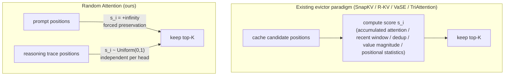

[Paper](https://arxiv.org/abs/2609.03430v1)
## The Scores Were a Waste: The Paradox Where 'Random Sampling' Ties the Strongest in KV Cache Eviction — An In-Depth Review of Random Attention

> **TL;DR** — Research on reasoning-specific KV cache eviction has always been the problem of **scoring** "which tokens will matter later" and picking the top-K. Random Attention forcibly preserves only the prompt with +∞ and evicts the rest **without any scores, uniformly at random per head**. Across 4 models and 6 reasoning tasks it matches the strongest baseline (TriAttention) in accuracy (statistical advantage in 31 of 60 comparison cells, significantly worse in just 1), and since vLLM serving has no scoring pass it delivers **32–43% higher throughput** (source: §1, Fig. 1, Tab. 1, Tab. 4).

- **Paper**: Random Attention: Rethinking KV Cache Eviction for Efficient Reasoning (arXiv:2609.03430v1 [cs.CL], 2026-09-03)
- **Authors**: Heng Wang, Jielin Qiu, Wenting Zhao et al. — Salesforce AI Research + UIUC
- **License / Code**: paper CC BY 4.0, code released (github.com/SalesforceAIResearch/Random-Attention) (source: pdf metadata, §1)
- **Category**: hybrid of cs.CL (theory/empirics) + cs.DC (serving systems) — a training-free reasoning technique

---

## 1. The Core Idea in One Figure

The thesis the authors overturn is this: *"The accuracy of an evictor is decided by what it protects, not by how it ranks the rest"* (source: §1, 14-word direct quote). In other words, the success of eviction hinges on **what it protects (the prompt)**, and **how the remaining trace is ranked is almost irrelevant**. The whole paper defends this thesis through (a) a large-scale gap experiment, (b) three controlled experiments, and (c) a measured vLLM serving benchmark.

---

## 2. Background: The Problem They Were Solving (Research Gap)

### 2.1 Why the KV Cache of Reasoning Models

- Reasoning models generate more than 10,000-token chains of thought in response to questions as short as ~200 tokens (source: §2). Measured average generation lengths, for Qwen3-4B, are 5.3k (MATH500), 17.0k (AIME), 18.4k (HMMT), and 11.1k (LiveCodeBench) tokens (source: Tab. 7).
- The KV cache grows **linearly** with generation length, becoming a VRAM bottleneck. In serving, the KV for a single 32k sequence exceeds 8 GB with Qwen3-32B (source: Appx G).
- **Eviction** permanently discards key-value pairs once the cache reaches a budget K, bounding memory usage for certain. This is fundamentally different from sparse attention, which keeps all tokens in memory and uses only a subset of attention (source: §2).

### 2.2 SOTA at Publication Time: A Lineage of "Better Scores"

The prior work the paper surveys is all a variation on the same paradigm — `score + top-K` (source: §1, §2):

| Method | What score $s_i$ is | Year |
|---|---|---|
| H2O | accumulated attention since entering the cache | 2023 |
| SnapKV | attention of the recent $w$ queries (max-pool) | 2024 |
| R-KV | SnapKV score + key cos-similarity dedup penalty ($\lambda$ Mixing) | 2025 |
| VaSE | value-vector range based + probabilistic fill using the SnapKV score | 2026 |
| TriAttention | head-calibrated trigonometric positional statistics + $|k_i|$ | 2026 |

**Explicit research gap**: the premise of all this work — "scores determine accuracy under compression" — had **never itself been verified**. Each score was proposed based on an observed correlation with task accuracy, but "how much it actually earns over random sampling under identical budget and protection conditions" was never controlled (source: §1). Moreover, each paper used a **different prompt-protection rule** — TriAttention preserves the entire input by default, while SnapKV/R-KV/VaSE keep only sink tokens and leave the rest to the score — so comparisons among prior work were not score comparisons but **protection-regime comparisons** (source: §5.1, §7; borrowing the same critique from Chen et al. 2026). Even the earlier evaluation studies (Liu et al. 2025, Yuan et al. 2026) reporting that "random baselines lag far behind" did so because THEIR random baseline lost the prompt — this is the starting point of this paper's experimental design (source: §5.1).

### 2.3 The Central Hypothesis (One Sentence)

> The authors hypothesize that by using **[forced prompt preservation + per-head uniform random eviction]** they can achieve **[accuracy on par with the strongest scorer + 32–43% more throughput from removing the scoring pass]**, overcoming the **[limitation that the benefit of learned scores is actually an illusion arising from prompt preservation]**.

---

## 3. The New Approach: Random Attention

### 3.1 Formalization — The Periodic Eviction Framework

Follows the decode-phase framework of Cai et al. (2025) and Chang et al. (2026) (source: §2):

- Per-head permanent budget $K$ + recent $r$ buffer (unconditionally preserved, $r=64$ in implementation) (source: Appx F).
- One pair is added each decode step, triggering eviction every $r$ steps. From the candidate set $C_t$ excluding the buffer, keep the $K$ with the highest $s_i$:

$$
S_t = \operatorname{top-}K_{\,i \in C_t}\; s_i
$$

- **Monotonic eviction**: discarded pairs are permanently gone (memory-bounded deployment assumption). All decisions are independent per layer and per KV head.
- Every existing method is expressed as a choice of this $s$ — the §2.2 table is exactly an instance of this formalization.

### 3.2 The Method — A Four-Line Algorithm

The entirety of Random Attention:

$$
s_i = \begin{cases} +\infty, & i \le \ell_p \quad (\text{prompt}) \\ u_i \sim \mathrm{Uniform}(0,1), & \text{otherwise} \end{cases}
\qquad u_i \text{ independent per eviction and per KV head}
$$

Algorithm 1 (source: §3, Alg. 1) is literally four lines:

1. `s ← rand(B, H_kv, S)` — uniform scores over all candidate positions
2. `s[:, :, 0:ℓ_p] ← +∞` — force-keep the question
3. `keep ← topk(s, K)` — per-head independent top-K
4. `return keep`

Variable definitions: $B$ batch size, $H_{kv}$ number of KV heads, $S$ cache length, $\ell_p$ prompt length, $K$ per-head budget. **Per-eviction cost is one rand + one topk** — no scoring pass, no calibration, no hyperparameters (source: §3).

The authors frame it under two identities: a deployable method in its own right and a **"null hypothesis"**. A score that cannot beat Random Attention under identical budget and protection "fails to extract any useful information from the signal" (source: §3).

### 3.3 Toy Example — Following Along with 16 Positions, K=8, r=4

For simplicity the example absorbs the buffer concept and is drawn as "16 cache positions (4 prompt + 12 trace), keeping $K=8$ on eviction". In the actual implementation the recent $r=64$ always survive and only the candidates are drawn (source: §2, Appx F).

Uniform scores received by two heads at one eviction event (excerpt):

| position | 1–4 (prompt) | 5 | 6 | 7 | 8 | 9 | 10 | 11 | 12 | 13 | 14 | 15 | 16 |
|---|---|---|---|---|---|---|---|---|---|---|---|---|---|
| head A's $u_i$ | +∞ | 0.62 | 0.11 | 0.87 | 0.05 | 0.73 | 0.29 | 0.94 | 0.40 | 0.18 | 0.66 | 0.52 | 0.31 |
| head A keep (4 of top-8−4=4) | ✅✅✅✅ | ✅ |  | ✅ |  | ✅ |  | ✅ |  |  |  |  |  |
| head B keep | ✅✅✅✅ |  | ✅ |  |  |  |  | ✅ | ✅ | ✅ |  |  |  |

- Head A keeps positions 5, 7, 9, 11, and head B keeps 6, 11, 12, 13. **The same token can die in one head while surviving in another.**
- For any trace token, the probability of "surviving in at least one head" rises sharply. With 8 heads drawing independently, the probability a given position is cut **in all heads simultaneously** converges to $(1-p)^8$.
- Survival rate decays geometrically with age: the probability of still being alive after $n$ evictions is $\left(\frac{K-\ell_p}{K+r-\ell_p}\right)^n$, about $0.94^n$ for $K=1024, r=64$ — i.e., Random Attention is effectively a **soft recency window with a different tail per head** (source: Appx D).

GQA handling: query groups share the keep-set of their corresponding KV head, keys are stored in post-RoPE state, and compaction physically moves data via gather (source: Appx F). There is no training or fine-tuning at all — the model's tokenizer, prompt template, and sampling settings all use the released defaults (Qwen3 temp 0.6, Phi-4 temp 0.8, nucleus $p=0.95$) (source: §4.1). In the planted-fact probe it exploits that a 4-digit numeric value becomes exactly 4 tokens in the Qwen3 digit tokenizer (source: Appx B).

---

## 4. How It Works: Why No Scores Are Needed — Three Controlled Experiments

All accuracy claims were validated with paired, problem-clustered percentile bootstrap (95% CI) plus an exact sign test, and significantly lower cells were shaded gray (source: §4.1).

### 4.1 Experiment 1 — The Prompt Is the Fragile Part of the Cache

Results of giving every method the **same rule** of "preserve the prompt" and comparing against the score-only performance (Qwen3-4B, Tab. 2):

| Method | MATH500 (score-only → +rule) | GPQA-D (score-only → +rule) | Interpretation |
|---|---|---|---|
| Recency window | 0.246 → 0.843 (**+59.7**) | 0.093 → 0.519 (+42.6) | collapses because it preserves 0 prompt tokens |
| **Random (ours)** | 0.459 → 0.874 (+41.5) | 0.231 → 0.530 (+29.9) | preserves some even without the rule, since it samples randomly |
| SnapKV | 0.703 → 0.829 (+12.6) | 0.369 → 0.492 (+12.3) | the score loses the most prompt |
| VaSE | 0.809 → 0.812 (+0.3) | 0.461 → 0.470 (+0.9) | good prompt preservation |
| R-KV | 0.810 → 0.812 (+0.2) | 0.482 → 0.471 (−1.1) | already preserves most |

(source: Tab. 2, §5.1) — the gain magnitude aligns exactly with "the amount of prompt that score had been losing". In the logged measurements too, per-head prompt survival is 0.994–0.999 for Random, whereas SnapKV is worst at 0.32–0.42 union / 0.11–0.22 per-head (source: Appx D).

**What the result means**: once the same rule is applied, the three baselines converge to within 2.2 points of each other across all settings, and on Phi-4 come within about 2 points of Random, which does no ranking at all. The remaining residual actually favors Random (4–6 points on Qwen3-4B) — **when the prompt is safe, even learned scores lose to a ranking-free policy** (source: §5.1). A large gap like Phi-4-LiveCodeBench (SnapKV score-only 0.314) becomes a statistical tie with Random (0.666 vs 0.667) with a single rule (source: Tab. 6, Appx C).

### 4.2 Experiment 2 — The Trace Protects Itself: Double Redundancy

The reason is that the trace is **stored redundantly at two levels**:

1. **Text level**: the model restates values it is still using as it moves forward. A restated value does not live in a single position (source: §5.1–5.2, inheriting R-KV's dedup observation).
2. **Cross-head level**: every KV head caches its own copy of every token, and eviction independently decides, per head, "which copy dies". A token is lost only when **all heads discard it at once** (source: §5.2).

What proved this is the **planted-fact probe**. It embeds a synthetic fact like `Let zq = 4729;` into a real model-generated MATH500 trace in a 16-token box, then appends a question asking for the value after 1,536 tokens (= 15 evictions). Variable names and values are fresh each run. The only thing controlled is "how many heads the fact is pinned in" (source: §5.2, Appx B).

- **Copies pool across heads**: of Qwen3-4B's 8 KV heads, only 3 alone preserve the trace (retrieval-head specialization, consistent with Wu et al. 2025). Yet the best single-head retention rate is 3%, the second-best 1% → 2 heads 60% → 3 heads 83% → 8 heads 99%, which is **superadditive**. Two facts stored in different heads also jointly reach 0.31, exceeding the sum of individual recalls of 0.26 (source: Fig. 3a, 3b).
- **The shape of the copy is irrelevant**: even if the fact is chopped so no head can read it token-by-token, retrieval is 0.33 (vs 0.39 for preserving the original), and graded recall $R$ = 0.75 vs 0.76 — essentially identical. In real traces, keeping contiguous blocks costs nothing from block size 1→64 tokens, only dropping when the number of blocks per head falls to 4 (=K:1024) or 2 (=K:512) — what matters is **the number of blocks per head, not the block length** (source: §5.2, Fig. 3c).
- **Conclusion**: the answer depends only on "whether a usable copy of the needed value is alive somewhere"; which copy, which head, or which shape is irrelevant. Per-head independent draws maximize exactly this condition (source: §5.2).
- As an aside, in real traces even the second redundancy is unnecessary: the shared-draw control, where all heads share the **same** draw, gives 0.871 vs Random's 0.874 on MATH500 (K=1024), and 0.788 vs 0.789 (K=512) — because text-level redundancy already secures restated copies. The two redundancies are substitutes, and random preserves both (source: Appx D).

### 4.3 Experiment 3 — The Exception Where Signal Truly Earns Its Keep: Facts Stated Once

A passcode experiment that announces a fact the model never restates, only once, and asks about it 57 rounds later (source: §5.3, Tab. 3):

| Policy | Retr. (re-generation rate) | log $p$ (log-prob of correct answer) |
|---|---:|---:|
| Random Attention | 0.000 | −18.35 |
| SnapKV | 0.004 | −11.11 |
| TriAttention | 0.016 | −11.11 |
| VaSE | 0.344 | −3.88 |
| R-KV | **0.836** | **−0.71** |

- For a single fact with no infinite repetition, it clearly loses. The retrieval rate tracks each score's **historical-statistics nature** — R-KV, which uses full-history accumulated attention, finds 84%, while recent-window scores (SnapKV, TriAttention) find almost nothing (source: §5.3, Tab. 3).
- Yet needle-finding skill and aggregate performance do not imply each other: R-KV, the best needle-finder, ranks first in only 1 column in Tab. 1, and the strongest baseline TriAttention retrieves almost nothing in this probe (source: §5.3, Tab. 1). And in real reasoning traces, "a value stated once and never restated" is rare — the model keeps restating the values it uses (source: §5.3).

### 4.4 Analyzing the 'Secret Weapon': The Forced-Preservation Rule

The core component is not randomness but the **+∞ prompt-preservation rule**. Δ upon removal/substitution (Qwen3-4B, accuracy points):

| Variant | MATH500 | GPQA-D | Δ (points) | Mechanism |
|---|---:|---:|---|---|
| Random Attention (rule + per-head random) | 0.874 | 0.530 | baseline | — |
| Rule removed (prompt also drawn) | 0.459 | 0.231 | −41.5 / −29.9 | losing the question under monotonic eviction = irreversible collapse |
| random → SnapKV, rule kept | 0.829 | 0.492 | −4.5 / −3.8 | recent-window score re-evicts the prompt |
| random → R-KV, rule kept | 0.812 | 0.471 | −6.2 / −5.9 | dedup penalty erases restated copies |
| random → VaSE, rule kept | 0.812 | 0.470 | −6.2 / −6.0 | value-magnitude bias (freezes the old 'cherished' tail) |
| per-head independence removed (shared draw) | 0.871 | — | −0.3, within noise | in real traces text redundancy substitutes (Appx D) |

(source: Tab. 2, Appx C·D — Δ includes estimates reconstructed from combinations of the authors' controlled experiments)

---

## 5. Performance Validation: Key Results

### 5.1 Experimental Setup

- **Models**: Qwen3-4B / 14B / 32B, Phi-4-reasoning(14B) — all dense + GQA (Qwen3 family 8 KV heads, Phi-4 has 40 layers × 10 KV heads) (source: §4.1, Appx G).
- **Tasks**: MATH500 (500 problems), GPQA-Diamond (198), AIME 2025+2026 (30-problem pools each), HMMT (60, MathArena), LiveCodeBench-v6 medium (383, pass@1 scored by actual test execution) (source: §4.1).
- **Budget**: ~4× compression of each task's average trace — MATH500 $K=1024$, GPQA-D $K=2048$, AIME/HMMT $K=4096$, LiveCodeBench $K=3072$ (~3×). Max generation 32,768 tok (source: §4.1, Appx F).
- **Repetition**: MATH500 2 runs, GPQA-D/LCB 4 runs, AIME/HMMT 16 independent samplings, averaged (source: §4.1).

### 5.2 Main Gap Table (Tab. 1 Summary)

Full attention is the ceiling. Bold = best column among eviction methods, [†] = significantly worse than Random (source: Tab. 1):

**Qwen3-4B (K=1024 / 2048 / 4096 / 4096 / 3072)**

| Method | MATH500 | GPQA-D | AIME | HMMT | LiveCodeBench |
|---|---:|---:|---:|---:|---:|
| Full | 0.939 | 0.562 | 0.642 | 0.462 | 0.807 |
| SnapKV | 0.703 | 0.369 | 0.418 | 0.395 | 0.507 |
| R-KV | 0.810 | 0.482 | 0.494 | 0.371 | 0.712 |
| VaSE | 0.809 | 0.461 | 0.596 | 0.421 | 0.700 |
| TriAttention | **0.864** | **0.533** | 0.592 | **0.437** | **0.755** |
| Random Attention | 0.874 | 0.530 | **0.610** | 0.438 | 0.744 |

**Phi-4-reasoning**

| Method | MATH500 | GPQA-D | AIME | HMMT | LiveCodeBench |
|---|---:|---:|---:|---:|---:|
| Full | 0.922 | 0.707 | 0.677 | 0.444 | 0.697 |
| SnapKV | 0.844 | 0.442 | 0.502 | 0.343 | 0.314 |
| R-KV | **0.909** | 0.636 | 0.643 | 0.440 | 0.621 |
| VaSE | 0.853 | 0.562 | 0.520 | 0.354 | 0.373 |
| TriAttention | 0.891 | **0.684** | 0.633 | 0.431 | 0.652 |
| Random Attention | 0.910 | 0.678 | **0.662** | 0.430 | **0.667** |

**Qwen3-32B**

| Method | MATH500 | GPQA-D | AIME | HMMT | LiveCodeBench |
|---|---:|---:|---:|---:|---:|
| Full | 0.950 | 0.703 | 0.715 | 0.559 | 0.886 |
| SnapKV | 0.816 | 0.476 | 0.541 | 0.450 | 0.609 |
| R-KV | 0.857 | 0.638 | 0.613 | 0.472 | 0.779 |
| VaSE | 0.868 | 0.597 | **0.680** | **0.524** | 0.797 |
| TriAttention | 0.887 | 0.683 | 0.677 | 0.508 | **0.834** |
| Random Attention | **0.891** | 0.683 | 0.664 | 0.509 | 0.806 |

Pattern summary (source: §4.2):

- **In math/science, scores buy nothing**: on MATH500·GPQA-D, Random significantly beats VaSE·SnapKV on every model, and no scorer significantly beats it on those tasks (TriAttention's 0.3–0.6 point leads are within noise).
- **The same holds for competition math (AIME/HMMT)**: even in the small samples with run-to-run variance of ±5 points from 16 repeats and 30–60 problems, SnapKV et al. are significantly worse; VaSE's 32B lead (+1.7/+1.5 points) is within one standard deviation. Tighter budgets widen the gap **in Random's favor** (source: §4.2, Fig. 2).
- **The only significant loss is code × Qwen3-32B** (TriAttention +~3 points). The cause is not the signal but the **prompt length**: LiveCodeBench averages 557 tok (6× MATH500), with the longest consuming up to half of $K=3072$ — Random pins the whole prompt, so a large, variable share of the budget is consumed before selection (source: §4.2, Tab. 1).
- **16× compression sweep** (2×→16×, Qwen3-4B·Phi-4): at 2× everyone is near full; as the budget tightens, Random stays tied with TriAttention while its gap over VaSE keeps widening (source: §4.3, Fig. 2).
- The accuracy tie is not bought with longer generations: in the 5-task average generation length, Random is the shortest evictor on 4B and 14B and within ~5% of the shortest on the other models (source: Tab. 7, Appx E).
- Of 60 comparison cells: **31 wins, 1 loss**; the Qwen3-14B appendix (A) reproduces the pattern plus 3 additional losses (TriAttention's MATH500 +2.1, code +2.6, VaSE's AIME +2.6; $p\le.02$) (source: §4.2, Appx A).

### 5.3 Serving Efficiency — Where the Scoring Pass Disappeared

**vLLM + PagedAttention, 1× H200, $K=2048$, 1k prompt / 32k generation, 128 requests** (Tab. 4):

| Model | Full (tok/s) | TriAttention | Random Attention | ours over Tri |
|---|---:|---:|---:|---:|
| Qwen3-4B | 1296 (1.00×) | 1494 (1.15×) | 2046 (1.58×) | **+37%** |
| Phi-4-reasoning | 780 (1.00×) | 1212 (1.55×) | 1737 (2.23×) | **+43%** |
| Qwen3-14B | 925 (1.00×) | 1303 (1.41×) | 1819 (1.97×) | **+40%** |
| Qwen3-32B | 346 (1.00×) | 700 (2.02×) | 923 (2.67×) | **+32%** |

(source: Tab. 4; vLLM v0.19.0, bf16, CUDA graphs·prefix caching off, only one selector function added to the TriAttention release plugin)

Breaking down why it reaches this level (source: §6, Appx G, Tab. 9):

- **The per-round cost itself is small**: 1 eviction round = Random 0.30 ms (0.57% of decode) vs TriAttention 1.47–1.64 ms (2.49–2.67%). SnapKV 0.37 ms, R-KV 0.58 ms, VaSE 0.74 ms. On a single stream it is a "few percent" difference.
- **Serving amplifies that difference along two axes**: (1) 128 concurrent requests each compress every 64 tok → about 62,000 compressions per workload, and every compression happens at a **barrier (synchronization point)** between batch steps, making all other 127 requests wait — TriAttention's excess 910 s in the Qwen3-14B 32k run = about 15 ms of total waiting per compression. (2) In a paged environment, content-dependent scores are more expensive — selectors that read cache statistics need an extra pass traversing the block table, and attention-weight-based selectors need recomputation or kernel changes because **the fusion kernel does not materialize the weights**. Random needs neither and only compacts (source: §6, Appx G).
- This edge is not confined to a particular operating point: it holds at max batch (+41/+42%), at 64 requests (+35/+30%), and with short 8k generations (+35–42%), while with a single request the two methods are within 1% — precisely revealing that the serving margin is the product of **barrier × call count**, not kernel-time difference. Off-barrier async scoring could reduce the margin, but no released implementation exists (source: Appx G).

**Max batch of each method under the same memory (143 GB H200)** ($K=3072$, 32k generation, unpaged FlashAttention-2 stack): full attention tops out at 28 (4B) / 20 (14B) concurrent runs, while compressed caches run 109–200. Here most of the 3–10× speedup comes from the **common good of cache reduction**, and it is the scoring pass that decides the remaining ranking. Random Attention burns the max batch (200 / 120) with minimal footprint (101 GB / 89 GB) for **10.0× / 8.8×** full-attention throughput (1779 / 1436 tok/s). At the tighter $K=1024$ it reaches batch 584, **28.8×** (source: §6, Tab. 10–11, Fig. 5). Note, however, that this table's TriAttention row is an unfused reimplementation, so its 2.7–3.0× gap is an implementation cost, not the method itself — the authors state this explicitly and anchor the fair comparison in the vLLM table (source: Appx G).

A sense of KV cache scale follows the standard formula:

$$
\text{KV (GB)} \approx \frac{2 \cdot L \cdot H_{kv} \cdot d_{head} \cdot \text{seq} \cdot \text{bytes/elt}}{10^9}
$$

Example: Qwen3-32B (L=64, H_kv=8, d_head=128, bf16) ≈ 0.26 MB/token → about 8.0 GB for a 32k sequence, matching the paper's "over 8 GB" report exactly (source: Appx G; layer·head counts are estimates from public specs). Compressing to $K+r=2112$ gives about 0.5 GB per sequence.

---

## 6. Our Perspective: Strengths, Limitations, and Why This Work Matters

### 6.1 Strengths

- **A paper designed as a paradigm refutation**: it does not add yet another score; it refutes the paradigm's premise by treating it as a null hypothesis. The single table showing "with just one +∞ rule, the three baselines converge to within 2.2 points of each other" (source: §5.1) invalidates much of the cross-comparison in this field.
- **Confound control and statistical discipline**: unified protection rules, identical engine·budget·trigger, paired clustered bootstrap + sign test, and explicit shading of significant losses. It even backs up with measured logs (19 policy-cell logs × 10⁴–10⁵ rounds) why prior numeric competitions were unreliable (protection-regime confounding, Chen et al. 2026) (source: §5.1, Appx D, §7).
- **Engineering honesty**: it finds and fixes pitfalls such as the vLLM benchmarker ignoring request output length when measuring full attention, and the dedup guard silently disabling compression, then documents them in the appendix. It exposes every reproduction risk — the admission that R-KV is 7–9 points better at $\lambda=0.5$ than the recommended $\lambda=0.1$ and was therefore used, and that TriAttention's official harness runs with the chat template off (source: Appx F·G).
- **An immediately deployable artifact**: a four-line algorithm with no calibration, tuning, or scoring. It was added to the TriAttention plugin as a single function, and the reason vLLM integration is easy (no attention-weight kernel changes needed) is clear (source: §3, Appx G). A new baseline has been set: "every future eviction signal must beat this and prompt protection."
- **Strong mechanistic proof**: the planted-fact probe's head-pooling curve (1 head 3% → 8 heads 99%; two-fact superadditivity 0.31 > 0.10+0.16) causally explains, without correlation, "why random works" (source: Fig. 3, §5.2).

### 6.2 Limitations Acknowledged by the Authors

- **Prompt-budget consumption on code tasks**: Random pins the whole prompt, so on LiveCodeBench up to half of the budget $K=3072$ is consumed before selection. Compressing scaffolding such as I/O formats and harness instructions remains an open task, deliberately left undone to preserve the "nothing to tune" null-hypothesis status (source: §4.2).
- **Loss of facts stated once**: complete failure on the passcode probe (Retr. 0.000, log $p$ −18.35). For pointer-chasing-style non-redundant tasks, random also loses in theory (citing Wang 2026) (source: §5.3, Tab. 3).
- **Scaling gap from 14B onward**: significantly worse in 3 cells, and "post-protection residuals" like 32B GPQA-D do not fully disappear (source: Appx A·C).

### 6.3 Potential Limitations as We See Them

- **Head-count dependence**: half the mechanism is "per-head independent copies", yet all tested models are GQA with only 8–10 KV heads. In MHA models, or MQA models with different head pooling, the cross-head pooling curve could change shape — how the paper's superadditivity curve depends on head count is unreported (source: §5.2, Appx G).
- **Serving cost and variance of randomness itself**: since every eviction is random, extra output variance is introduced (probe values move 1–2 points on rerun, Appx B), and reproducibility under a fixed-seed policy must be managed pipeline-wide. Serving-contract metrics like TTFT, TPOT, and SLO are not reported — only throughput and round time.
- **No coupling with quantization**: KV cache memory reduction is orthogonal to quantization (KIVI, KVQuant, etc.), yet the interaction between vLLM's fp8/int8 KV path and random eviction is not measured (source: §7; elaboration added by this review).
- **Energy and cost unreported**: without H200 fleet, per-token, and kWh data, a `$`/1M tok comparison is impossible (source: Appx F; elaboration added by this review).
- **Concurrency with competing work**: policies of the same philosophy — "recency + prompt" (Prefix Sliding, Muennighoff et al. 2026; eviction-in-training in Kontonis et al. 2026) — appeared at the same time, so Random's priority claim may reduce to speed alone without an accuracy gap. Still, this paper's per-head independent dispersion and null-hypothesis normalization remain distinct contributions (source: §7).

### 6.4 Why This Work Matters

This paper sets **two new standards** in the active field of "reasoning-specific KV compression": (1) comparisons must **match the protection conditions**, and (2) a new score must beat **random + speed to beat (32–43%) under matched budget and matched protection**. Follow-up research is now pushed from score design onto the remaining terrain of *prompt budget* and *rare single-occurrence facts* (source: §1, §5.3).

---

## 7. What's Next?: The Road Ahead

**Directions suggested by the authors** (source: §1, §5.3):

1. **Long-prompt budgeting** — especially on code tasks. Rules that compress or summarize scaffolding instead of pinning it all (Random reserves this because of its "no tuning" status).
2. **Restoring facts stated once** — a regime only content-dependent signals can protect; phase-separated research that captures both needle retrieval and aggregate accuracy at once.

**Our reasonable extension proposals**:

- **Hybrid**: lay Random Attention down as the default policy and add a small content detector that reacts only to low-frequency needles (e.g., a VaSE-style value-range or R-KV-style accumulated attention as a low-frequency, low-cost trigger) to cover both regimes — Tab. 9 already shows 0.44–0.58 ms of headroom versus a 0.30 ms round.
- **Off-barrier scoring architecture**: if the TriAttention camp moves compression to an async pass, the serving margin can shrink — the authors have already measured that "the integration margin is a function of barrier × count" (source: Appx G). This would be the experiment that paradoxically proves Random's strength is a systems invention (the absence of a score).
- **Eviction-aware training**: strengthening restatement behavior during training, as in Kontonis et al. 2026, would make the model generate traces that maintain redundancy on its own, making random compression safer — the decomposition of "prompt preservation = 41.5 points, trace redundancy = the rest" indicates where training intervention should act.
- **Head-count and architecture generalization**: re-examine the cross-head pooling curve and the shared-draw contrast on MHA models (32–64 heads) and MLA structures (DeepSeek-style latent compression).
- **Quantization-stack measurement**: verify the orthogonality of bf16 random eviction ⊗ 4-bit KV quantization — whether the $0.94^n$ tail is sustainable when the memory budget is halved.

---

## 8. Appendix: Reproduction Checklist and Released Assets

- [x] Code released: github.com/SalesforceAIResearch/Random-Attention · paper CC BY 4.0 (source: §1)
- [x] Engine/hyperparameters fully specified: VaSE-engine based, $r=64$, task-specific $K$ (1024/2048/4096/3072), post-RoPE keys, chronological compaction, monotonic eviction (source: Appx F)
- [x] Baseline settings specified (pitfalls included): R-KV $\lambda=0.5$ (recommended 0.1 is 7–9 points worse), VaSE $n_{large}=K/4$, TriAttention's official per-head variant and per-model calibration (source: Appx F)
- [x] Sampling protocol: each model's public settings + max-gen 32k, per-task repeat counts (source: §4.1)
- [x] Serving protocol: vLLM v0.19.0, PagedAttention on, CUDA graphs·prefix caching off, 128 requests, two benchmarker pitfalls fixed (source: Appx G)
- [ ] Unreleased items: GPU-time/node ledger, energy/unit-cost data (absent from the paper), Qwen3-14B protection-rule grid (Appx C not run), vLLM compression run measured once (though rerun variance of ±1.1% is reported) (source: Appx F·G)

$$
\text{One-line summary: }\;\underbrace{\text{protect}}_{\text{prompt}} \gg \underbrace{\text{rank}}_{\text{selection signal}},\qquad \text{the price tag is } +32\text{–}43\%\ \text{throughput.}
$$
