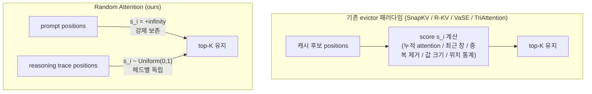

[논문 링크](https://arxiv.org/abs/2609.03430v1)
# 점수는 낭비였다: KV 캐시 eviction에서 '무작위 추출'이 최강자와 동률이 되는 역설 — Random Attention 심층 리뷰

> **TL;DR** — 추론 특화 KV 캐시 eviction 연구는 전부 "어떤 토큰이 나중에 중요한가"를 **점수화**해서 top-K 를 고르는 문제였다. Random Attention 은 프롬프트만 +∞로 강제 보존하고 나머지는 **점수 없이 헤드별로 균등 무작위** eviction 하는데, 4개 모델·6개 추론 태스크에서 최강 베이스라인(TriAttention)과 동급 정확도(60개 비교 셀 중 31개에서 통계적 우위, 1개에서만 유의 열세)를 보이면서 vLLM 서빙에서는 스코어링 패스가 없어 **32–43% 높은 처리량**을 낸다 (근거: §1, Fig. 1, Tab. 1, Tab. 4).

- **논문**: Random Attention: Rethinking KV Cache Eviction for Efficient Reasoning (arXiv:2609.03430v1 [cs.CL], 2026-09-03)
- **저자**: Heng Wang, Jielin Qiu, Wenting Zhao 외 — Salesforce AI Research + UIUC
- **라이선스 / 코드**: 논문 CC BY 4.0, 코드 공개 (github.com/SalesforceAIResearch/Random-Attention) (근거: pdf 메타데이터, §1)
- **분류**: cs.CL (이론/실증) + cs.DC (서빙 시스템) 하이브리드 — 학습 없는 training-free 추론 기법

---

## 1. 핵심 아이디어 한 장으로

저자들이 뒤집은 명제는 이것이다: *"The accuracy of an evictor is decided by what it protects, not by how it ranks the rest"* (근거: §1, 14단어 직접 인용). 즉 eviction의 성패는 **무엇을 지키는가(프롬프트)** 에 갈리고, 나머지 트레이스를 **어떻게 순위를 매기는가는 거의 무관**하다는 주장이다. 논문 전체는 이 명제를 (a) 대규모 격차 실험, (b) 통제 실험 3종, (c) vLLM 실측 서빙 벤치마크로 방어하는 구조다.

---

## 2. 배경: 그들이 해결하려던 문제 (Research Gap)

### 2.1 왜 추론 모델의 KV 캐시인가

- 추론 모델은 짧으면 200-token 수준의 질문에 10,000 토큰이 넘는 chain-of-thought 를 생성한다 (근거: §2). 실측 평균 생성 길이는 Qwen3-4B 기준 MATH500 5.3k, AIME 17.0k, HMMT 18.4k, LiveCodeBench 11.1k 토큰이다 (근거: Tab. 7).
- KV 캐시는 생성 길이에 **선형**으로 증가하여 VRAM 병목이 된다. 서빙에서 32k 시퀀스 하나당 KV 는 Qwen3-32B 기준 8 GB 를 넘는다 (근거: Appx G).
- **eviction** 은 캐시가 예산 K 에 도달하면 key-value 쌍을 **영구히** 버리는 방식이라 메모리 사용량을 확실히 제한한다. 이는 모든 토큰을 메모리에 두고 어텐션 부분집합만 쓰는 sparse attention 과는 근본적으로 다른 문제다 (근거: §2).

### 2.2 출판 시점의 SOTA: "더 나은 점수"의 계보

논문이 정리하는 기존 연구는 전부 같은 패러다임 — `score + top-K` — 의 변주다 (근거: §1, §2):

| 방법 | 점수 $s_i$의 정체 | 출시 연도 |
|---|---|---|
| H2O | 캐시 진입 이후 누적 attention | 2023 |
| SnapKV | 최근 $w$개 쿼리의 attention (max-pool) | 2024 |
| R-KV | SnapKV 점수 + 킷 cos 유사도 중복 페널티 ($\lambda$ Mixing) | 2025 |
| VaSE | 값(value) 벡터의 range 기반 + SnapKV 점수로 확률적 채우기 | 2026 |
| TriAttention | 헤드별 보정된 삼각급수 위치 통계 + $\|k_i\|$ | 2026 |

**명시적 연구 공백**: 이 모든 연구의 전제 — "점수가 압축 하에서의 정확도를 결정한다" — 는 **그 자체로 검증된 적이 없었다**. 각 점수는 태스크 정확도와 관찰된 상관을 근거로 제안됐을 뿐, "동일 예산·동일 보호 조건에서 무작위 추출보다 실제로 얼마를 버는가"가 통제되지 않았다 (근거: §1). 게다가 페이퍼마다 **프롬프트 보호 규칙이 달랐다** — TriAttention 은 입력 전체를 기본 보존하지만 SnapKV/R-KV/VaSE 는 sink 토큰만 지키고 나머지를 점수에 맡기므로, 선행 연구 간 비교는 점수 비교가 아니라 **보호 레짐 비교**였다 (근거: §5.1, §7; Chen et al. 2026 의 동일한 비판 원용). 선행 평가 연구들(Liu et al. 2025, Yuan et al. 2026)이 "random 베이스라인이 크게 뒤처진다"고 보고한 것조차, THEIR random baseline 이 프롬프트를 잃었기 때문이었다는 것이 이 논문의 실험 설계 출발점이다 (근거: §5.1).

### 2.3 중심 가설 (한 문장)

> 저자들은 **[프롬프트 강제 보존 + 헤드별 균등 무작위 eviction]** 을 사용함으로써 **[학습된 점수의 이득이 실제로는 프롬프트 보존 여부에서 오는 착시라는 한계]** 를 극복하는 **[최강 scorer 와 동급의 정확도 + 스코어링 패스 제거로 +32–43% 처리량]** 을 달성할 수 있다고 가정한다.

---

## 3. 새로운 접근법: Random Attention

### 3.1 형식화 — 주기적 eviction 프레임워크

Cai et al. (2025) · Chang et al. (2026) 의 decode-phase 프레임워크를 따른다 (근거: §2):

- 헤드당 항구 예산 $K$ + 최근 $r$개 버퍼(무조건 보존, $r=64$ 실장) (근거: Appx F).
- 매 디코드 스텝마다 쌍이 1개 추가되어 $r$ 스텝마다 eviction 트리거. 버퍼를 제외한 후보 집합 $C_t$ 에서 $s_i$ 가 높은 $K$개를 유지:

$$
S_t = \operatorname{top-}K_{\,i \in C_t}\; s_i
$$

- **monotonic eviction**: 버린 쌍은 영구 소멸 (메모리 제한 배포 가정). 모든 결정은 layer·KV 헤드별로 독립.
- 모든 기존 방법은 이 $s$ 의 선택지로 표현된다 — §2.2 표가 곧 이 형식화의 사례다.

### 3.2 방법 — 4줄짜리 알고리즘

Random Attention 의 전부:

$$
s_i = \begin{cases} +\infty, & i \le \ell_p \quad (\text{프롬프트}) \\ u_i \sim \mathrm{Uniform}(0,1), & \text{그 외} \end{cases}
\qquad u_i \text{는 매 eviction, KV 헤드마다 독립Draw}
$$

Algorithm 1 (근거: §3, Alg. 1) 은 문자 그대로 4줄이다:

1. `s ← rand(B, H_kv, S)` — 후보 전 위치에 uniform 점수
2. `s[:, :, 0:ℓ_p] ← +∞` — 질문 강제 keep
3. `keep ← topk(s, K)` — 헤드별 독립 top-K
4. `return keep`

변수 정의: $B$ 배치 크기, $H_{kv}$ KV 헤드 수, $S$ 캐시 길이, $\ell_p$ 프롬프트 길이, $K$ 헤드당 예산. **per-eviction 비용은 rand 1회 + topk 1회** — 어떤 스코어링 패스도, 캘리브레이션도, 하이퍼파라미터도 없다 (근거: §3).

저자들은 이걸 두 가지 정체로 규정한다: 배포 가능한 방법 그 자체이자, **"귀무가설(null hypothesis)"**. 동일 예산·동일 보호 조건에서 Random Attention 을 못 이기는 점수는 "신호에서 쓸모 있는 정보를 뽑지 못하는 것"이다 (근거: §3).

### 3.3 토이 예시 — 16 위치, K=8, r=4 로 따라하기

간단함을 위해 예시에서는 버퍼 개념을 흡수시켜 "캐시 16 위치(프롬프트 4 + 트레이스 12), eviction 시 $K=8$개 유지"로 그려본다. 실제 구현에선 최근 $r=64$가 무조건 살고 후보에만 추첨한다 (근거: §2, Appx F).

한 eviction 이벤트에서 두 헤드가 받은 uniform 점수(발췌):

| position | 1–4 (prompt) | 5 | 6 | 7 | 8 | 9 | 10 | 11 | 12 | 13 | 14 | 15 | 16 |
|---|---|---|---|---|---|---|---|---|---|---|---|---|---|
| head A 의 $u_i$ | +∞ | 0.62 | 0.11 | 0.87 | 0.05 | 0.73 | 0.29 | 0.94 | 0.40 | 0.18 | 0.66 | 0.52 | 0.31 |
| head A keep (top-4 중 8−4=4) | ✅✅✅✅ | ✅ |  | ✅ |  | ✅ |  | ✅ |  |  |  |  |  |
| head B keep | ✅✅✅✅ |  | ✅ |  |  |  |  | ✅ | ✅ | ✅ |  |  |  |

- 헤드 A 는 5, 7, 9, 11 번을, 헤드 B 는 6, 11, 12, 13 번을 지킨다. **같은 토큰이라도 헤드마다 사멸 여부가 다르다.**
- 어느 트레이스 토큰이든 "적어도 한 헤드에 살아남을" 확률이 급격히 올라간다. 8개 헤드가 독립 추첨하면 특정 위치가 **전 헤드에서 동시에** 잘릴 확률은 $(1-p)^8$ 로 수렴한다.
- 생존률은 ages 따라 기하감쇠: $n$회 eviction 후에도 살아있을 확률 $\left(\frac{K-\ell_p}{K+r-\ell_p}\right)^n$, $K=1024, r=64$에서 약 $0.94^n$ — 즉 Random Attention 은 사실 **소프트 리센시 창 + 헤드마다 다른 꼬리**다 (근거: Appx D).

GQA 처리: 쿼리 그룹은 해당 KV 헤드의 keep-set 을 공유하고, 키는 post-RoPE 상태로 저장, compaction 은 gather 로 물리 이동한다 (근거: Appx F). 학습·파인튜닝은 전혀 없다 — 모델의 토크나이저·프롬프트 템플릿·sampling 설정은 전부 공개된 기본값을 사용한다(Qwen3 temp 0.6, Phi-4 temp 0.8, nucleus $p=0.95$) (근거: §4.1). 플랜트드 팩트 프로브에서는 4자리 숫자 값이 Qwen3 digit tokenizer 에서 정확히 4 토큰이 되는 것을 이용한다 (근거: Appx B).

---

## 4. 작동 원리: 왜 점수가 필요 없는가 — 3개의 통제 실험

정확도 주장은 전부 paired, problem-clustered percentile bootstrap (95% CI) + exact sign test 로 검증했고, 유의하게 낮은 셀은 그레이 처리했다 (근거: §4.1).

### 4.1 실험 1 — 프롬프트가 캐시의 취약 부분이다

모든 방법에게 "프롬프트 보존"이라는 **동일 규칙**을 준 뒤 점수 단독 성능과 비교한 결과 (Qwen3-4B, Tab. 2):

| 방법 | MATH500 (단독 → +규칙) | GPQA-D (단독 → +규칙) | 해석 |
|---|---|---|---|
| Recency window | 0.246 → 0.843 (**+59.7**) | 0.093 → 0.519 (+42.6) | 프롬프트 0개 보존이라 붕괴 |
| **Random (ours)** | 0.459 → 0.874 (+41.5) | 0.231 → 0.530 (+29.9) | 규칙 없이도 무작위 추출이므로 일부 보존 |
| SnapKV | 0.703 → 0.829 (+12.6) | 0.369 → 0.492 (+12.3) | 점수가 프롬프트를 가장 많이 유실 |
| VaSE | 0.809 → 0.812 (+0.3) | 0.461 → 0.470 (+0.9) | 프롬프트 보존 양호 |
| R-KV | 0.810 → 0.812 (+0.2) | 0.482 → 0.471 (−1.1) | 이미 대부분 보존 |

(근거: Tab. 2, §5.1) — 이득 크기가 곧 "그 점수가 유실하던 프롬프트 양"에 정렬된다. 로그 실측에서도 헤드당 프롬프트 생존률이 Random 0.994–0.999 인 반면 SnapKV 는 union 0.32–0.42, per-head 0.11–0.22 로 최하위였다 (근거: Appx D).

**결과의 의미**: 규칙을 똑같이 주니 세 베이스라인은 모든 설정에서 서로 2.2 점 이내로 수렴하고, Phi-4 에서는 순위 매기기를 하지 않는 Random 과 2 점 안팎이 된다. 남은 잔차는 오히려 Random 편 (Qwen3-4B에서 4–6 점) — **프롬프트가 안전하면 학습된 점수조차 순위 매기기 정책에게 지는 것**이다 (근거: §5.1). Phi-4-LiveCodeBench 처럼 큰 갭(SnapKV 단독 0.314)은 규칙 하나로 Random 과 통계적 동률(0.666 vs 0.667)이 된다 (근거: Tab. 6, Appx C).

### 4.2 실험 2 — 트레이스는 스스로를 지킨다: 이중 중복성

이유는 트레이스가 **두 수준에서 중복 저장**되기 때문이다:

1. **텍스트 수준**: 모델은 아직 쓰는 값을 다시 진술하며 앞으로 간다. 재진술된 값은 단일 위치에 살지 않는다 (근거: §5.1–5.2, R-KV 의 중복 관찰을 인계).
2. **헤드 간 수준**: 모든 KV 헤드가 모든 토큰의 사본을 따로 캐시하고, eviction 은 헤드별로 독립적으로 "어느 사본이 죽을지"를 정한다. 한 토큰은 **모든 헤드가 동시에 버릴 때만** 소실된다 (근거: §5.2).

이걸 증명한 것이 **planted-fact probe** 다. 실제 모델이 생성한 MATH500 트레이스 안에 `Let zq = 4729;` 식의 합성 사실을 16-token 상자에 넣고, 1,536 토큰(= eviction 15회) 뒤에 값을 요구하는 질문을 붙인다. 변수명·값은 매 시행 신규. 통제하는 것은 "사실을 몇 개 헤드에 못 박아(pinning)둘지"뿐이다 (근거: §5.2, Appx B).

- **사본은 헤드 간에 풀링된다**: Qwen3-4B 의 8개 KV 헤드 중 단독으로 트레이스를 보존하는 건 3개뿐(retrieval-head 특화, Wu et al. 2025 와 일치). 그러나 최고 단일 헤드 보유 회수율 3%, 차선 1% → 헤드 2개 60% → 3개 83% → 8개 99% 로 **초가산적(superadditive)** 이다. 서로 다른 헤드에 있는 두 사실도 개별 recall 합 0.26 을 넘어 함께 0.31 (근거: Fig. 3a, 3b).
- **사본의 모양은 무관하다**: 사실을 토큰씩 헤드들에게 나눠 읽어볼 수 없게 잘어도 회수율 0.33 (원문 보존 0.39 대비), graded recall $R$ = 0.75 vs 0.76 으로 사실상 동일. 실 트레이스에서도 contiguous 블록으로 유지해도 블록 크기 1→64 토큰까지 비용 0, 헤드당 블록 수가 4(=K:1024) 또는 2(=K:512)로 떨어질 때만 하락 — 중요한 건 **블록 길이가 아니라 헤드당 블록 수** (근거: §5.2, Fig. 3c).
- **결론**: 답변은 "필요한 값의 사용 가능한 사본이 어딘가에 살아있는가"에만 달렸고, 어느 사본·어떤 헤드·어떤 형태인지는 무관하다. 헤드별 독립 추첨은 정확히 이 조건을 극대화한다 (근거: §5.2).
- 여담으로 실 트레이스에선 두 번째 중복성조차 필요 없다: 모든 헤드가 **같은** 추첨을 공유하는 shared-draw 통제가 MATH500 에서 0.871 vs Random 0.874 (K=1024), 0.788 vs 0.789 (K=512) — 텍스트 수준 중복이 이미 재진술 사본을 확보하기 때문. 두 중복성은 대체재이고, 무작위는 둘 다 보존한다 (근거: Appx D).

### 4.3 실험 3 — 신호가 진짜로 버는 예외: 한 번만 진술된 사실

모델이 절대 다시 말하지 않는 사실을 한 번만 공지하고 57 라운드 뒤에 묻는 passcode 실험 (근거: §5.3, Tab. 3):

| 정책 | Retr. (재생성률) | log $p$ (정답 로그확률) |
|---|---:|---:|
| Random Attention | 0.000 | −18.35 |
| SnapKV | 0.004 | −11.11 |
| TriAttention | 0.016 | −11.11 |
| VaSE | 0.344 | −3.88 |
| R-KV | **0.836** | **−0.71** |

- 무한 반복이 없는 단일 사실에서는 확실히 진다. 회수율이 각 점수의 **역사 통계 성격**을 따른다 — 전 히스토리 누적 attention 을 쓰는 R-KV 가 84% 로 찾고, 최근 창 점수(SnapKV, TriAttention)는 거의 못 찾는다 (근거: §5.3, Tab. 3).
- 다만 needle-finding 기량과 aggregate 성능은 서로 함축하지 않는다: 최고 needle-finder 인 R-KV 는 Tab. 1 에서 1개 컬럼만 1 위이고, 최강 베이스라인 TriAttention 은 이 probe 에서 거의 회수하지 못한다 (근거: §5.3, Tab. 1). 그리고 실 추론 트레이스에선 "한 번 말하고 두번 다시 말하지 않는 값"이 드물다 — 모델이 쓰는 값을 계속 재진술하므로 (근거: §5.3).

### 4.4 '비밀 병기' 분석: 강제 보존 규칙

핵심 구성요소는 랜덤이 아니라 **+∞ 프롬프트 보존 규칙**이다. 제거/대체 시 Δ(Qwen3-4B, 정확도 포인트):

| 변형 | MATH500 | GPQA-D | Δ (points) | 메커니즘 |
|---|---:|---:|---|---|
| Random Attention (규칙+헤드별 random) | 0.874 | 0.530 | 기준 | — |
| 규칙 제거 (프롬프트도 추첨 대상) | 0.459 | 0.231 | −41.5 / −29.9 | monotonic eviction 하에서 질문 소실 = 비가역적 파탄 |
| random → SnapKV, 규칙 유지 | 0.829 | 0.492 | −4.5 / −3.8 | 최근 창 점수가 프롬프트를 재침 |
| random → R-KV, 규칙 유지 | 0.812 | 0.471 | −6.2 / −5.9 | 중복 페널티가 재진술본을 오차감 소거 |
| random → VaSE, 규칙 유지 | 0.812 | 0.470 | −6.2 / −6.0 | 값 크기 편향(오래된 '사랑하는' 꼬리 동결) |
| 헤드 독립 제거 (shared draw) | 0.871 | — | −0.3, 노이즈 내 | 실 트레이스에선 텍스트 중복이 대체 (Appx D) |

(근거: Tab. 2, Appx C·D — Δ는 저자 통제 실험 조합으로 재구성한 추정 포함)

---

## 5. 성능 검증: 주요 결과

### 5.1 실험 설정

- **모델**: Qwen3-4B / 14B / 32B, Phi-4-reasoning(14B) — 전부 dense + GQA (Qwen3 계열 8 KV 헤드, Phi-4 는 40레이어×10 KV 헤드) (근거: §4.1, Appx G).
- **태스크**: MATH500(500문항), GPQA-Diamond(198), AIME 2025+2026(30씩 pool), HMMT(60, MathArena), LiveCodeBench-v6 medium(383, pass@1 실제 테스트 실행 채점) (근거: §4.1).
- **예산**: 각 태스크 평균 트레이스의 ~4× 압축 — MATH500 $K=1024$, GPQA-D $K=2048$, AIME/HMMT $K=4096$, LiveCodeBench $K=3072$(~3×). 최대 생성 32,768 tok (근거: §4.1, Appx F).
- **반복**: MATH500 2회, GPQA-D/LCB 4회, AIME/HMMT 16회 독립 sampling, 평균 보고 (근거: §4.1).

### 5.2 메인 격차표 (Tab. 1 요약)

Full attention 이 상한(ceiling). 굵게 = eviction 방법 중 열 최고, [†] = Random 대비 유의열세 (근거: Tab. 1):

**Qwen3-4B (K=1024 / 2048 / 4096 / 4096 / 3072)**

| 방법 | MATH500 | GPQA-D | AIME | HMMT | LiveCodeBench |
|---|---:|---:|---:|---:|---:|
| Full | 0.939 | 0.562 | 0.642 | 0.462 | 0.807 |
| SnapKV | 0.703 | 0.369 | 0.418 | 0.395 | 0.507 |
| R-KV | 0.810 | 0.482 | 0.494 | 0.371 | 0.712 |
| VaSE | 0.809 | 0.461 | 0.596 | 0.421 | 0.700 |
| TriAttention | **0.864** | **0.533** | 0.592 | **0.437** | **0.755** |
| Random Attention | 0.874 | 0.530 | **0.610** | 0.438 | 0.744 |

**Phi-4-reasoning**

| 방법 | MATH500 | GPQA-D | AIME | HMMT | LiveCodeBench |
|---|---:|---:|---:|---:|---:|
| Full | 0.922 | 0.707 | 0.677 | 0.444 | 0.697 |
| SnapKV | 0.844 | 0.442 | 0.502 | 0.343 | 0.314 |
| R-KV | **0.909** | 0.636 | 0.643 | 0.440 | 0.621 |
| VaSE | 0.853 | 0.562 | 0.520 | 0.354 | 0.373 |
| TriAttention | 0.891 | **0.684** | 0.633 | 0.431 | 0.652 |
| Random Attention | 0.910 | 0.678 | **0.662** | 0.430 | **0.667** |

**Qwen3-32B**

| 방법 | MATH500 | GPQA-D | AIME | HMMT | LiveCodeBench |
|---|---:|---:|---:|---:|---:|
| Full | 0.950 | 0.703 | 0.715 | 0.559 | 0.886 |
| SnapKV | 0.816 | 0.476 | 0.541 | 0.450 | 0.609 |
| R-KV | 0.857 | 0.638 | 0.613 | 0.472 | 0.779 |
| VaSE | 0.868 | 0.597 | **0.680** | **0.524** | 0.797 |
| TriAttention | 0.887 | 0.683 | 0.677 | 0.508 | **0.834** |
| Random Attention | **0.891** | 0.683 | 0.664 | 0.509 | 0.806 |

패턴 요약 (근거: §4.2):

- **math/science 에서는 점수가 아무것도 사지 못한다**: MATH500·GPQA-D 에서 Random 은 모든 모델에서 VaSE·SnapKV 에 유의하게 이기고, 그 태스크들에서 그에게 유의하게 이기는 scorer 는 없다 (TriAttention 의 0.3–0.6 점 리드는 노이즈 내부).
- **competition math(AIME/HMMT) 도 마찬가지**: 16 repeat, 30–60 문항이라 run-to-run 편차 ±5 점이 나는 작은 표본에서도 SnapKV 등은 유의 열세; VaSE 의 32B 리드(+1.7/+1.5 점)는 표준편차 안. 예산을 더 조이면 갭은 **Random 쪽으로** 벌린다 (근거: §4.2, Fig. 2).
- **유일한 유의 열세는 code × Qwen3-32B** (TriAttention +약 3 점). 원인은 신호가 아니라 **프롬프트 길이**: LiveCodeBench 평균 557 tok (MATH500 의 6배), 긴 건 $K=3072$ 의 절반까지 소모 — Random 은 프롬프트를 통째로 못 박으므로 선택 전에 예산의 크고 가변적인 비중이 소진된다 (근거: §4.2, Tab. 1).
- **16× 압축 스윕** (2×→16×, Qwen3-4B·Phi-4): 2×에서는 전원이 full 부근, 예산이 조여도 Random 은 TriAttention 과 동률을 유지하고 VaSE 와의 갭은 계속 벌어진다 (근거: §4.3, Fig. 2).
- 정확도 동률은 더 긴 생성으로 산 것이 아니다: 5태스크 평균 생성 길이에서 Random 은 4B·14B 최단 evictor, 나머지 모델에서도 최단과 ~5% 이내 (근거: Tab. 7, Appx E).
- 60개 비교 셀: **31승 1패**, Qwen3-14B 부록(A) 은 패턴 재현 + 추가 3패 (TriAttention 의 MATH500 +2.1, code +2.6, VaSE 의 AIME +2.6; $p\le.02$) (근거: §4.2, Appx A).

### 5.3 서빙 효율 — 스코어링 패스가 사라진 자리

**vLLM + PagedAttention, 1× H200, $K=2048$, 1k prompt / 32k 생성, 128 requests** (Tab. 4):

| 모델 | Full (tok/s) | TriAttention | Random Attention | ours over Tri |
|---|---:|---:|---:|---:|
| Qwen3-4B | 1296 (1.00×) | 1494 (1.15×) | 2046 (1.58×) | **+37%** |
| Phi-4-reasoning | 780 (1.00×) | 1212 (1.55×) | 1737 (2.23×) | **+43%** |
| Qwen3-14B | 925 (1.00×) | 1303 (1.41×) | 1819 (1.97×) | **+40%** |
| Qwen3-32B | 346 (1.00×) | 700 (2.02×) | 923 (2.67×) | **+32%** |

(근거: Tab. 4; vLLM v0.19.0, bf16, CUDA graphs·prefix caching off, TriAttention 릴리스 플러그인에 selector 함수 1개만 추가)

왜 이 정도가 되는지 분해하면 (근거: §6, Appx G, Tab. 9):

- **라운드 자체 비용은 작다**: eviction 1라운드 = Random 0.30 ms (디코드의 0.57%) vs TriAttention 1.47–1.64 ms (2.49–2.67%). SnapKV 0.37 ms, R-KV 0.58 ms, VaSE 0.74 ms. 단일 스트림에선 "몇 퍼센트" 차이.
- **서빙이 그 차이를 두 축으로 증폭**: (1) 128 동시 요청이 각각 64 tok 마다 압축 → 워크로드당 약 62,000회 압축, 매 압축이 배치 스텝 간 **배리어(동기화점)** 에서 일어나 다른 127개 요청이 전부 대기 — Qwen3-14B 32k 런에서 TriAttention 의 초과 910 s = 압축회당 전체 대기 약 15 ms. (2) paged 환경에서 content-dependent 점수는 더 비싸다 — 캐시 통계를 읽는 선택자는 block table 을 횡단하는 추가 패스가, attention 가중치 기반 선택자는 **fusion kernel 이 가중치를 materialize 하지 않아** 재계산이나 커널 수정이 필요. Random 은 둘 다 불필요하고 compaction 만 한다 (근거: §6, Appx G).
- 이 변은 특정 운전점에 국한되지 않는다: 배치 상한(+41/+42%), 64 요청(+35/+30%), 짧은 8k 생성(+35–42%) 에서도 유지되고, 요청 1개에서는 두 방법이 1% 이내 — serving 마진은 커널 시간차가 아니라 **배리어×호출 수의 산물**임이 정확히 드러난다. 오프배리어 비동기 scoring 을 붙이면 마진은 줄 수 있으나 릴리스된 구현은 없다 (근거: Appx G).

**동일 메모리(143 GB H200)에서 각 방법의 최대 배치** 비교 ($K=3072$, 32k 생성, unpaged FlashAttention-2 스택): Full attention 은 28개(4B)/20개(14B) 동시 실행이 한계, 압축 캐시는 109–200개. 여기서 3–10× 가속의 대부분은 **캐시 축소라는 공통 재화**에서 오고, 잔여 순위를 가르는 것이 scoring 패스다. Random Attention 은 최소 footprint(101 GB / 89 GB)로 최대 배치(200 / 120) 를 태우고 **10.0× / 8.8×** 풀 어텐션 처리량 (1779 / 1436 tok/s). 더 깐 $K=1024$ 에선 배치 584개로 **28.8×** (근거: §6, Tab. 10–11, Fig. 5). 단 이 표의 TriAttention 행은 unfused 재구현이라 2.7–3.0× 격차는 방법 자체가 아니라 구현 비용이다 — 저자들도 그 점을 명시하고 공정한 비교를 vLLM 표로 못 박는다 (근거: Appx G).

KV 캐시 규모 감각은 표준 공식으로:

$$
\text{KV (GB)} \approx \frac{2 \cdot L \cdot H_{kv} \cdot d_{head} \cdot \text{seq} \cdot \text{bytes/elt}}{10^9}
$$

예: Qwen3-32B (L=64, H_kv=8, d_head=128, bf16) ≈ 0.26 MB/token → 32k 시퀀스 약 8.0 GB — 논문의 "over 8 GB" 보고와 정확히 일치한다 (근거: Appx G; 레이어·헤드 수치는 공개 스펙 추정). $K+r=2112$ 로 압축하면 시퀀스당 약 0.5 GB.

---

## 6. 우리의 관점: 강점, 한계, 그리고 이 연구가 중요한 이유

### 6.1 강점

- **패러다임 반증으로 설계된 논문**: 새 점수를 하나 더 보탠 것이 아니라, 패러다임의 전제를 귀무가설로 반증한다. "+∞ 규칙 하나만 주면 세 베이스라인이 서로 2.2 점 이내로 수렴" (근거: §5.1) 이라는 단일 표가 이 분야 간비교의 상당 부분을 무효화한다.
- **confound 통제와 통계 규율**: 보호 규칙 통일, 동일 엔진·동일 예산·동일 trigger, paired clustered bootstrap + sign test, 회색표시로 유의 열세 명시. 선행 연구 간 숫자 경쟁이 왜 신뢰할 수 없었는지(보호 레짐 혼입, Chen et al. 2026)까지 실측 로그(19 policy-cell 로그 × 10⁴–10⁵ 라운드)로 뒷받침한다 (근거: §5.1, Appx D, §7).
- **엔지니어링 정직성**: vLLM 벤치마커가 요청 출력 길이를 무시해 full attention 을 측정하는 함정, dedup guard 가 압축을 조용히 꺼뜨리는 버그 등을 발견해 수정하고 부록에 기록. R-KV 는 권장 $\lambda=0.1$ 보다 $\lambda=0.5$ 가 7–9 점 높아 그걸 썼다는 고백, TriAttention 공식 하네스가 chat template 을 끄고 도는 점 등 재현 리스크를 전부 노출한다 (근거: Appx F·G).
- **즉시 배포 가능한 산물**: 캘리브레이션·튜닝·스코어링이 없는 4줄 알고리즘. TriAttention 플러그인에 함수 1개로 추가됐고, vLLM 통합이 어려운 이유(attention 가중치 kernel 수정 불요)도 명확하다 (근거: §3, Appx G). "앞으로 모든 새 eviction 신호는 이 녀석과 프롬프트 보호를 이겨야 한다"는 새 기준선이 생겼다.
- **메커니즘 증명력이 뛰어남**: planted-fact probe 의 헤드 풀링 곡선(1 헤드 3% → 8 헤드 99%, 두 사실 초가산성 0.31 > 0.10+0.16) 은 "왜 random 이 되는가"를 상관 없이 인과로 보여준다 (근거: Fig. 3, §5.2).

### 6.2 저자가 인정한 한계

- **코드 태스크의 프롬프트 예산 소모**: Random 은 프롬프트를 통째로 못 박아 LiveCodeBench 에선 예산 $K=3072$ 의 최대 절반이 선택 전에 소진된다. I/O 포맷·하네스 지침 같은 scaffolding 을 압축하는 것이 과제로 남았고, "튜닝할 게 없다"는 귀무가설 지위를 지키려고 일부러 안 했다 (근거: §4.2).
- **한 번만 진술된 사실의 소실**: passcode probe 에서 완전 실패(Retr. 0.000, log $p$ −18.35). pointer-chasing 식 비중복 작업에는 random 이 이론적으로도 진다 (Wang 2026 인용) (근거: §5.3, Tab. 3).
- **14B 스케일부턴 3개 셀에서 유의 열세**로 확장 격차가 존재하며, 32B GPQA-D 등 "보호 후 잔차"가 전량 소멸은 아니다 (근거: Appx A·C).

### 6.3 필자가 보는 잠재적 한계

- **헤드 수 의존성**: 메커니즘의 절반이 "헤드별 독립 사본"인데, 테스트 모델은 모두 GQA 로 KV 헤드가 8–10 개뿐이다. MHA 모델이나 헤드 풀링이 다른 MQA 모델에서는 헤드 간 풀링 곡선의 모양이 바뀔 수 있다 — 논문의 초가산성 곡선이 헤드 수에 어떻게 의존하는지는 미보고다 (근거: §5.2, Appx G).
- **무작위성 자체의 서빙 비용·변동**: 매 eviction 이 랜덤이므로 출력 분산이 추가되고 (재실행 시 프로브 값이 1–2 점 이동, Appx B) 동일 seed 정책의 재현성은 파이프라인 차원에서 관리해야 한다. TTFT·TPOT·SLO 같은 서빙 규약 지표는 보고되지 않았고, 처리량과 라운드 시간만 있다.
- **정량화와의 미결합**: KV 캐시 메모리 축소는 양자화(KIVI, KVQuant 등)와 직교하는데, vLLM 의 fp8/int8 KV 경로와 무작위 eviction 의 상호작용은 실측되지 않았다 (근거: §7; 본 리뷰의 부연).
- **에너지·비용 미보고**: H200 fleet·토큰단가·kWh 데이터가 없어 $/1M tok 비교 불가 (근거: Appx F; 본 리뷰의 부연).
- **경쟁 작업과의 동시성**: 같은 철학의 "recency + prompt" 정책(Prefix Sliding, Muennighoff et al. 2026; Kontonis et al. 2026 의 eviction-in-training) 이 동시에 등장 — Random 의 우선권 주장은 정확도 격차 없이 속도만 남을 수 있다. 단 이 논문의 헤드별 독립 산포와 null-hypothesis 규범화는 여전히 별개 기여다 (근거: §7).

### 6.4 이 연구가 중요한 이유

이 논문은 "추론 특화 KV 압축"이라는 활발한 분야에 **두 개의 새 기준**을 세운다: (1) 비교는 반드시 **보호 조건을 맞춰야** 하고, (2) 새 점수는 **matched budget·matched protection 에서 무작위 + speed to beat(32–43%)** 을 넘어야 한다. 후속 연구는 이제 점수 설계가 아니라 *프롬프트 예산*과 *희귀 일회성 사실*이라는 남은 지형으로 밀려났다 (근거: §1, §5.3).

---

## 7. 다음 단계는?: 앞으로의 길

**저자가 제시한 방향** (근거: §1, §5.3):

1. **긴 프롬프트 예산화** — 특히 코드 태스크. 전체 pin 대신 scaffolding 을 압축·요약하는 규칙 (Random 은 "튜닝 없음"이라는 지위 때문에 유보).
2. **한 번만 진술된 사실의 복원** — content-dependent 신호만이 지킬 수 있는 레짐; needle 회수와 aggregate 정확도를 동시에 잡는 위상 분리 연구.

**필자의 합리적 확장 제안**:

- **하이브리드**: Random Attention 을 기본 정책으로 깔고, 저빈도 needle 에만 반응하는 소형 content 탐지기(VaSE 식 value-range 나 R-KV 식 누적 attention 을 저빈도·저비용 트리거로)를 얹어 두 레짐을 모두 커버 — 라운드 0.30 ms 대비 0.44–0.58 ms 의 여유가 Tab. 9 에는 이미 있다.
- **오프배리어 scoring 아키텍처**: TriAttention 진영이 압축을 비동기 패스로 옮기면 serving 마진은 줄 수 있다 — 저자도 "통합상 마진은 배리어×횟수의 함수"임을 실측으로 보여주었다 (근거: Appx G). Random 의 강점이 시스템 발명(스코어 부재)임을 역설적으로 입증하는 실험이 된다.
- **eviction-aware 학습**: Kontonis et al. 2026 처럼 학습 단계에서 재진술 행동을 강화하면 모델이 알아서 중복을 유지하는 트레이스를 생성, 무작위 압축이 더 안전해진다 — "프롬프트 보존 = 41.5 점, 트레이스 redundancy = 나머지" 분해도는 학습 개입의 지점을 지시한다.
- **헤드 수·아키텍처 일반화**: MHA(헤드 32–64) 모델, MLA(DeepSeek 식 latent 압축) 구조에서 헤드 간 풀링 곡선과 shared-draw 대조 재검토.
- **양자화 stack 측정**: bf16 랜덤 eviction ⊗ 4-bit KV 정량화의 직교성 검증 — 메모리 예산이 두 배로 조여질 때 $0.94^n$ 꼬리가 감당 가능한가.

---

## 8. 부록: 재현 체크리스트와 공개 자산

- [x] 코드 공개: github.com/SalesforceAIResearch/Random-Attention · 논문 CC BY 4.0 (근거: §1)
- [x] 엔진/하이퍼파라미터 전부 명시: VaSE engine 기반, $r=64$, 태스크별 $K$(1024/2048/4096/3072), post-RoPE 키, 시간순 compaction, monotonic eviction (근거: Appx F)
- [x] 베이스라인 설정 명시(함정 포함): R-KV $\lambda=0.5$(권장 0.1 은 7–9 점 저조), VaSE $n_{large}=K/4$, TriAttention 공식 per-head 변형·모델별 캘리브레이션 (근거: Appx F)
- [x] 샘플링 프로토콜: 각 모델 공개 설정 + max-gen 32k, repeat 횟수 태스크별 명시 (근거: §4.1)
- [x] 서빙 프로토콜: vLLM v0.19.0, PagedAttention on, CUDA graphs·prefix caching off, 128 requests, 벤치마커 2종 함정 수정 (근거: Appx G)
- [ ] 미공개 항목: GPU 시간·노드 대장, 에너지/단가 데이터(본문 부재), Qwen3-14B 보호 규칙 그리드(Appx C 미실행), vLLM 압축 런은 단회 측정(단 재실행 분산 ±1.1% 보고) (근거: Appx F·G)

$$
\text{한 줄 요약: }\;\underbrace{\text{protect}}_{\text{프롬프트}} \gg \underbrace{\text{rank}}_{\text{선택 신호}},\qquad \text{가격표는 } +32\text{–}43\%\ \text{throughput.}
$$
