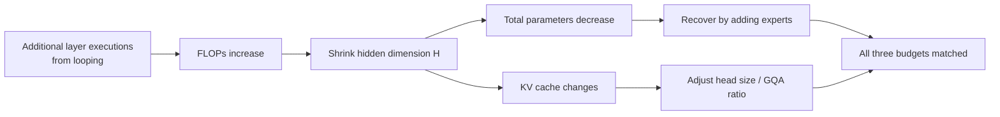

[Paper](https://arxiv.org/abs/2609.01343)
# SMELT: Scaling Laws for Compute-Matched MoE Loop Transformers

## TL;DR

Loop transformers scale depth by executing a layer block repeatedly, but most prior work fixed **only the parameter count** and let FLOPs grow, racking up "free wins." SMELT shows that looping is a pure architectural gain even while matching all three budgets — **per-token FLOPs, total parameters, and KV cache** — simultaneously (source: §1). On the compute-optimal frontier it saves **6.8–18.0% of training FLOPs**, and these gains come out larger downstream than validation loss predicts (source: §4.3, §5.1).

## Core Idea

SMELT stands for **S**parse **M**oE Transformer **middle layers Loop Twice** (source: §1). The core claim reduces to a single sentence.

> "The authors hypothesize that by using an MoE loop architecture that **repeats the middle 50% of layers twice** — thereby performing the **comparison with compute, parameters, and KV cache all fixed at once that prior loop research had not managed** — they can achieve **lower loss and a faster loss-decay rate even at equal budget**."

Three design rules distilled from ablations support this claim (source: §3.3–§3.5).

1. **Loop only the middle half** — repeat the middle 50% of layers rather than the whole stack (source: §3.3).
2. **A larger effective depth-to-width ratio** — allow more executed depth than the Baseline (source: §3.4).
3. **Two passes** — two iterations beat three or four (source: §3.5).

### Key Numbers (summary)

| Item | Value |
|---|---|
| **Params** | up to 54B non-embedding (1.6B active, S≈97%) |
| **Context** | 4096 tokens (packed, segment-level mask) |
| **Architecture** | MoE (top-8 experts, total expert pool up to 504/layer) |
| **Attention** | GQA (Grouped-Query Attention) |
| **Pretrain Data** | 205B tokens (stable phase) + 10B decay branches ≈ 215B |
| **Train Compute** | 1.3×10¹⁹ ~ 2.2×10²¹ cumulative FLOPs (fitting window) |
| **CE Gain** | 6.8–18.0% training FLOPs saved (compute-optimal frontier) |
| **Scale Grid** | 4 scales × 4 sparsity = 16 cells, 96 matched pairs |

$$ L(F,S,D) = E + \frac{A(1-S)^b}{F^a} + \frac{K}{D^c} $$

## Background: The Problem They Tackled

### The Appeal and the Pitfall of Loop Transformers

Loop transformers increase effective depth by **repeating a shared block** rather than stacking new layers (source: §2). The idea traces back to the Universal Transformer and has since been extended by Huginn, Ouro, and others, with a growing body of results showing strong performance "for a given parameter count" (source: §2, Tab. 1).

The authors, however, point out a decisive flaw: **what counts toward the parameter budget is not what drives the compute bill.**

> Running a loop so that 12 layers execute as 24 stores only half the weights, but **per-token FLOPs are on par with a 24-layer model** and **KV cache for 24 layers** is required as well (source: §1).

Existing evaluations fall into two camps, each with its own problem.

- **Fixed parameters + more repeated depth** (Huginn, Ouro, Prairie et al.): the architectural gain is entangled with uncontrolled extra FLOPs.
- **Fixed FLOPs** (Schwethelm et al.): fixing FLOPs shrinks a loop model's unique parameters, so it is impossible to separate whether the loss comes from looping itself or from having fewer parameters. They concluded that one repeated pass corresponds to `r^0.46` unique blocks (source: §2).

The **research gap** is therefore clear. The question — "does looping pay off beyond parameter efficiency, even when compute is controlled?" — had no answer. Answering it requires fixing three budgets simultaneously — ① per-token FLOPs, ② total parameters, ③ KV cache — and none of the prior work closed all three (source: Tab. 1).

### Why MoE Is the Solution

MoE is precisely what makes matching all three budgets at once feasible, because it **decouples total parameters from per-token FLOPs** (source: §2). A loop model pays for the second visit by **shrinking the hidden dimension** and can win back the lost capacity by **increasing the number of experts**. The KV cache is then matched separately by adjusting head size and the GQA ratio (source: §3.2).

## The New Approach: SMELT

### Budget Matching as a Compute-Allocation Problem

When comparing a Baseline (non-looped MoE) with a Looped Transformer, the authors match the three budgets to within ~1–4% error (source: Tab. 2).

The residual update of each sublayer within the loop region is scaled by `1/r` (the number of loop passes), so that weight-tied updates do not inflate the residual stream on every revisit (source: §3.1).

### A New Metric: "Compute-Equivalent Sparsity"

The authors redefine sparsity as a ratio of FLOPs. Let F₀ be the per-token FLOPs of the fully-active control (all experts active) and N₀ its parameters (source: §3.1):

$$ N_{\text{act}}^{eq} = \frac{F}{F_0} N_0, \qquad S = 1 - \frac{N_{\text{act}}^{eq}}{N} $$

This metric lets dense and sparse models be compared along a single axis and lets a loop model be aligned with a Baseline of "equal compute intensity." The reported matched pairs sit at three sparsity levels, S≈85%, 95%, and 97% (source: §3.1).

## How It Works: A Concrete Example

Take the 200M, S≈95% cell as a toy example (source: §3.2).

The **Baseline** has physical depth L=12, hidden dimension H=1280, 192 experts per layer, and top-8 routing. Its per-token FLOPs are 1.33×10⁹ and its total parameters 3.87×10⁹.

**SMELT** runs **the middle 6 of 12 layers twice**, executing 18 layers in total. But those six extra layer executions eat FLOPs. So:

1. **Shrink H from 1280 to 1056** to bring per-token FLOPs back down.
2. Because shrinking H thins every expert's FFN and cuts total parameters, **raise the number of experts from 192 to 288** to recover.
3. Result: per-token FLOPs of 1.37×10⁹ (+2.9%), total parameters of 3.89×10⁹ (+0.4%), and KV cache within 4%.

That is, at the same price you get a model that **executes more deeply**. This is the essence of SMELT.

### Three Ablations Lock In the Recipe

At 200M scale, three questions are answered in order (source: §3.3–§3.5).

**① Which layers should loop?** Sweeping the loop region from 0 (no looping) to 12 layers (the whole stack) shows validation loss is minimized at a **50% span** (source: Tab. 3). This is consistent with the earlier finding that first and last layers benefit from independent parameters for specialized roles, making the middle blocks the better choice to repeat (source: §3.3).

**② How deep?** Sweeping the depth-to-width ratio, the Baseline is optimal at physical depth 12, while the Looped Transformer is optimal at **12/18** (physical 12, executed 18) (source: Tab. 4). The authors interpret this as shared layers collecting gradient contributions across visits, which lets the short-path signals in the latter portion make the deeper serial computation easier to optimize (source: §3.4).

**③ How many passes?** Comparing 2 (18 layers), 3 (24 layers), and 4 (30 layers) passes, **2 passes wins across the board**. At 3 and 4 passes, the matched-FLOPs ceiling forces the model thinner, which actually degrades it (source: Tab. 5).

These three rules define SMELT. All later experiments extend this recipe over a 4×4 grid of four scales (100M/200M/600M/1.6B) × four sparsity levels (0%/85%/95%/97%) (source: §4.1).

## Validation: Main Results

### Fitting Separate Scaling Laws

A Chinchilla-style surface is fit **separately for each architecture** (source: §4.2), using per-token FLOPs F in place of parameters N and scaling the capacity term by sparsity S. The fitted coefficients are (source: Tab. 6):

| Arch | E | a (capacity exponent) | c (data exponent) | b (sparsity exponent) |
|---|---|---|---|---|
| **Baseline** | 1.4439 | 0.3703 | 0.6594 | 0.1530 |
| **SMELT** | 1.4493 | 0.3892 | 0.7011 | 0.1460 |

The key point is that both exponents are larger for SMELT. The combined frontier exponent is:

$$ \gamma = \frac{ac}{a+c}, \quad \gamma_{\text{base}} = 0.237,\ \gamma_{\text{SMELT}} = 0.250 $$

SMELT's loss therefore falls **5.5% faster per unit of compute** (source: §4.3). The 0.005 nat difference in E is smaller than the fitting RMSE and is read as fitting noise (source: §4.3).

### CE Gain: The Compute Actually Saved at the Frontier

The **compute efficiency gain** is defined by inverting the compute needed to reach an equal loss (source: §4.2):

$$ \text{CE Gain} = 1 - \frac{C_{\text{tgt}}}{C_{\text{ref}}} $$

| SMELT budget | S≈85% | S≈95% | S≈97% |
|---|---|---|---|
| 10²⁰ FLOPs | 10.0% | 7.8% | 6.8% |
| 10²¹ FLOPs | 18.0% | 15.8% | 14.7% |
| 10²² FLOPs † | 23.5% | 20.9% | 19.6% |

† Extrapolated beyond the fitting window (source: Tab. 7).

Because γ is larger, the frontier gap **compounds** across the compute range. Interestingly, the optimal allocation (Tokens Per Parameter) is nearly identical for the two architectures (within 6%, source: Tab. 8). SMELT's savings thus do not come from allocating the budget differently, but from **reaching lower loss at the same allocation** (source: §4.3).

### Downstream Gains Exceed Validation-Loss Predictions

The raw win rates over 96 pairs are **96 wins** on DCLM Completion, **83 wins** on DCLM Core, and 29/30 wins on MMLU (source: §5.1). The authors do not stop there, though. They fit a **loss→score sigmoid** on the Baseline's 96 endpoints and then compute SMELT's residuals (source: §5.1). The residuals are positive on all three benchmarks and **increase monotonically with scale** — meaning SMELT's downstream gains exceed what the validation-loss improvement alone accounts for (source: Fig. 9a).

These gains concentrate in **structured data**. Domain-wise CE Gain is (source: Fig. 10a):

- Code **20.4%** > Finance 16.8% > Math/STEM 16.6% > Knowledge 14.9% > Web 14.8%

Gains also grow on **long samples** (the gain in the 512–4096 token range is 1.52× that in the 32–256 range, source: Fig. 11a) and with **more in-context examples** (0.9pp at k=0, widening to 1.9pp once demonstrations are provided, source: Fig. 11b). On the Dyck-language task the gap keeps widening — 29.8% vs 26.4% at k=32 (source: Fig. 11c).

### What Happens Inside the Second Visit

The mechanistic analyses show consistent signatures (source: §6).

- **Routing**: the two visits reuse a core subset of experts and diversify the rest. Even at S≈97%, an overlap of 2–3 experts far exceeds chance level (source: Fig. 12).
- **Residual writes**: the second visit's update norms are 1.2–3.5× larger and directionally aligned (mean cross-visit cosine of 0.56 vs 0.16 for mismatched pairs, source: Fig. 13–15). **The second visit does not overwrite the first — it amplifies it.**
- **Attention**: Q and K stay at 0.89–0.93 while V diverges to 0.65–0.74 (source: Fig. 16). In other words, the retrieval coordinates are kept fixed while what gets read changes.
- **Attention sinks**: on the second visit the sink shrinks sharply and mass moves to content-related tokens. In the Dyck setting, BOS mass drops from 0.60 to 0.02 while mass on the demonstration answers rises from 0.24 to 0.85 (source: Fig. 18). This reproduces on generic data and **reverses** the general depth trend in which sinks strengthen with depth (source: Fig. 19).

## Our Take: Strengths, Limitations, and Why It Matters

### Strengths

The biggest contribution is the **honesty of the comparison protocol itself**. It clearly calls out that the "parameter efficiency" narrative of prior loop research may have leaned on uncontrolled extra FLOPs, and it exploits MoE's parameter–FLOPs decoupling to close all three budgets at once (source: §2, Tab. 1). Fitting **architecture-specific scaling surfaces** also meaningfully upgrades point observations into extrapolable, attributable claims (source: §4.2). Being the **first multi-scale** study to close all three budgets under block-level looping meets the bar for originality (source: §2).

The mechanistic analysis is another strength: it goes beyond plain performance reporting to offer explanatory clues about the "why." The framing of "looping = a refinement stage" lends credence to the claim that this is not mere capacity addition (source: §7).

### Limitations

The limitations the authors themselves acknowledge come in three strands (source: §7).

1. **The design ablations are fixed at 200M scale.** The optimal span and loop count could shift at larger scales.
2. **Only the simplest form of looping was studied.** Only contiguous repeated blocks with full weight sharing were covered; per-visit LoRA, adaptive recursion depth, and learned halting were not.
3. **FLOPs, parameters, and KV cache were matched — but not wall-clock cost.** Serial re-execution and sparse routing can create hardware-efficiency gaps.

There are also potential limitations on the analytical side. **The CE Gain compute savings rest on a single metric, validation loss**, and even the largest value (18.0%) carries a wide bootstrap interval of [8, 28]% at 10²¹ FLOPs (source: Tab. 7). The 10²² FLOPs figures are extrapolations outside the fitting window, with confidence intervals widening to [0, 51]%. In addition, the sigmoid mapping in the residual analysis is fit only to Baseline endpoints, so it cannot structurally separate factors beyond loss (e.g., differential gains across capabilities) (source: §5.1). From a practitioner's standpoint, the closed training data and internal model family also limit reproducibility (source: Appx. A).

### Why It Matters

This paper gives the first rigorous **yes** to the old question of whether looping delivers more than parameter efficiency. With MoE already mainstream, depth reuse has the potential to become a **fourth scaling axis** alongside width, depth, and expert count (source: §7). The fact that gains are largest on code, structured data, and ICL is especially relevant, since those are exactly the areas that dominate real-world LLM workloads today (source: §5.2–§5.3).

## What's Next?: The Road Ahead

The directions the authors propose are (1) re-validating the design at larger scales, (2) budget-matching validation of richer loop variants (per-visit LoRA, adaptive depth, learned halting, block-selective sharing, cross-token state reuse), (3) system-level optimization to close the wall-clock gap, and (4) moving from mechanistic explanations toward causal identification (source: §7).

A few reasonable next steps can be added. First, confirming the **scale dependence of the design rules (middle 50%, two passes)** on genuinely large runs is low-hanging fruit. Second, verifying that CE Gain survives as **wall-clock time and real token throughput** — in particular, that the latency cost of serial re-execution is not diluted away — is needed to complete the deployment story. Third, intervention experiments (e.g., sink-suppression ablations) that isolate whether the reduction in attention sinks is the **causal driver** of the observed ICL gains would elevate "looping = refinement" from hypothesis to testable theory (source: §6, §7).
