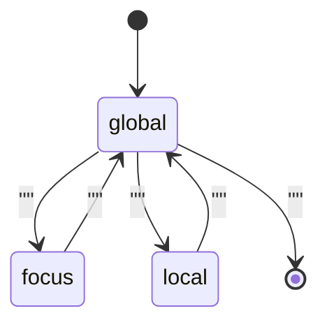

[Paper](https://arxiv.org/abs/2609.02737v1)
## Language Models Control Their Own Attention: Declarative Attention

**TL;DR** — Existing sparse attention methods still paid $O(N)$ per decoding step by *approximating externally* which tokens matter. This paper flips the direction: it lets the model **"declare"** directly, inside Chain-of-Thought (CoT), **where it will look**. The inference engine parses this declaration like a tool call and skips most KV cache reads. Without any training (zero-shot), Gemma-4-31B cuts decoding attention cost by **52.0%** with only a **1.27pp** accuracy drop (source: §1, §5.1).

---

## Key Numbers (summary)

- **Params**: 31B (Gemma-4-31B) / 27B (Qwen-3.6-27B) | **Context**: up to 244K tokens (native 256K − 8K generation − 4K prompt) (source: §4, Appx D.1)
- **Architecture**: Dense hybrid — global attention + SWA (Gemma, window 1024) or GDN (Qwen) (source: Appx B)
- **Positional**: Not stated in the paper (product default retained) | **Attention**: Full causal global + Sliding Window / Linear (GDN)
- **Pretrain Data**: N/A (uses existing off-the-shelf models, no additional training) (source: §4)
- **Train Compute**: 0 FLOPs (zero-shot prompting only) (source: §1, §5.2)
- **Serving**: roofline decoding wall-time **269.1 ms → 192.3 ms** (Gemma, **0.71×**) / **306.2 ms → 237.3 ms** (Qwen, **0.77×**) (source: Tab. 3)
- **KV-Cache**: Gemma-4-31B 10 global layers × KV **81,920 B/token**; Qwen-3.6-27B 16 × **65,536 B/token** (bf16) (source: Tab. 4)
- **Cost**: No dollar/token conversion given — reported instead as roofline wall-time reductions (0.71×/0.77×) (source: §5.4)

$$
\text{KV-Cache(GB)} \approx
\frac{2 \cdot L \cdot H \cdot d_\text{head} \cdot \text{seq} \cdot \text{batch} \cdot \text{bytes/elt}}{10^9}
$$

> Terminology: **TPOT = Time Per Output Token**. (also written as "TBT = TPOT" when relevant) — rather than targeting TPOT, this paper approaches the problem by reducing the KV bytes read per decoding step.

---

## Core Idea

Because transformers compute attention over **every preceding token** at each decoding step, KV cache memory-access latency dominates decoding time in long contexts. For example, Qwen-3.5-397B-A17B with a 1M-token context must read about **15 GB** of KV cache per step — a memory-bandwidth requirement on par with loading its 17B active parameters (source: §1).

Yet real attention scores concentrate on a handful of tokens, and the true attention matrix is **unknowable before it is computed** (source: §1). Existing approaches fall into two main camps.

- **Static heuristics** (recency, past attention magnitude): cannot predict which tokens future queries will need, so long-context performance degrades (source: §1).
- **Lightweight scans** (QUEST, DeepSeek Sparse Attention, etc.): approximate the mask by cheaply scanning the KV each step, but this only shrinks the constant — it is still **$O(N)$** (source: §1, Appx A.1).

The paper's core insight starts from a one-line question. *"Doesn't the model already know which parts matter?"* Recent work has shown that models encode information about future tokens in their hidden states, and that CoT prompting surfaces this latent computation as interpretable text (source: §1). **Declarative Attention (DA)** extends this from *what to think* to *where to look*.

> **Core hypothesis**: the authors hypothesize that by having the model explicitly declare its attention scope inside CoT, they can eliminate the $O(N)$ selection cost without any external scorer and drastically cut the KV read cost of long-context reasoning.

---

## Background: The Problem They Set Out to Solve

The research gap is clear. Sparse attention's defining limitation was a circular logic: **you must choose what to attend to without knowing the attention scores** (source: §1). Both existing research lines paid a *selection cost* to sidestep it.

1. **Dynamic sparse attention (decoding)** — scans a cheap surrogate of the full context each step to pick the top-$k$ tokens. Reducing the constant does not change the $O(N)$ complexity (source: Appx A.1).
2. **KV cache eviction** — permanently removes unneeded KV entries. But it risks having already discarded a token needed later, and that error is unrecoverable (source: Appx A.2).

At the paper's publication time (September 2026), the SOTA had already spread this direction to industrial scale. DeepSeek-V3.2's DSA used a trained lightweight indexer to select tokens each step, and within a year it had propagated to open frontier models such as GLM-5, Qwen3.8-Flash-Next (QSA), and MiniMax-M3 (MSA) (source: Appx A.1). Still, all of them kept a **per-step $O(N)$ scan**. That residual cost is exactly what DA targets.

Another important backdrop is the **"attention-dominated serving regime."** At large batch sizes and long contexts, the FFN converges to compute-bound while attention KV reads are memory-bound. As context grows, attention's roofline wall-time scales as the product of context length and the number of decoding steps, overwhelming the FFN (source: §3, Appx C.7).

---

## The New Approach: Declarative Attention

DA elicits attention scopes from off-the-shelf models with **a single fixed prompt** — no training, no fine-tuning, no auxiliary scorer. Generation is split into three modes (source: §2).

| Mode | What it can see | Purpose | Attention cost |
|---|---|---|---|
| `<global>` | All context segments | Navigation — finding the segment to attend next | $O(N)$ (full) |
| `<focus magic_chunks="K">` | Only the named segment K | Extracting values verbatim from a specific region | $O(1)$ |
| `<local>` | No context segments (response so far only) | Synthesizing extracted values into an answer | $O(1)$ |

Three design elements are central.

- **Scaffold + context separation**: the system instruction, question, and instruction text (the scaffold) are always visible in every mode; only the varying context is masked by the state machine (source: §2.1).
- **Magic chunks**: split the context into ~2048-token units and wrap them in a *simulated tool-use dialogue* (`get_magic_chunk` call → `Magic Chunk N` response). Laying segment boundaries on the user/assistant/tool special tokens the model knows from post-training lets it track segments far more reliably than with arbitrary delimiters (source: §2.2).
- **DA state machine**: parses tag transitions in the decoding stream and rewrites the KV cache block table each step. Masks are rounded to block granularity (16–32 tokens) so existing kernels like FlashAttention run unmodified (source: §2.3, Appx B).

---

## How It Works: A Concrete Example

Let's borrow the paper's example. Suppose the question is *"How many years after Acme Corp was founded did it go public?"* (source: §2). The document is split into seven magic chunks, with the founding year in Chunk 2 and the IPO year in Chunk 7.

**Step 1 — `<global>` (navigation)**: the model scans the whole context and works out that "the founding year should be in Chunk 2 and the IPO year in Chunk 7."

```text
<global>
I need the founding year and the IPO year. The company history in Magic Chunk 2
should state the founding.
</global>
```

**Step 2 — `<focus magic_chunks="2">` (extraction)**: only Chunk 2 is kept; the remaining segments are masked.

```text
<focus magic_chunks="2">"Acme Corp was founded in 2003 in San Jose."</focus>
```

**Step 3 — `<global>` → `<focus magic_chunks="7">`**: navigates again to find the IPO year, then focuses on Chunk 7.

```text
<focus magic_chunks="7">"Acme Corp went public on the NYSE in 2011."</focus>
```

**Step 4 — `<local>` (synthesis)**: computes from just-extracted values alone, without looking at the context at all.

```text
<local>2011 - 2003 = 8 years.</local>
<answer>8 years</answer>
```

From the state machine's perspective, this flow looks like the following.



**The "secret weapon" is the attention mask itself.** To isolate it, the paper runs an ablation called `DA-nm` (the same prompt template as DA but with **full causal attention**). Two comparisons prove the point (source: §5.1, Fig. 2, Tab. 2).

| Metric | Vanilla | DA-nm (no mask) | DA (mask) | Net effect of the mask |
|---|---|---|---|---|
| Attended tokens (Gemma, M/sample) | 13.43 | 22.31 | 6.45 | **−71.1%** vs DA-nm |
| Attended tokens (Qwen, M/sample) | 22.54 | 29.02 | 15.52 | **−46.5%** vs DA-nm |
| Accuracy (Gemma, %) | 87.01 | 87.01 | 85.74 | **−1.27pp** vs DA-nm |

The chunked prompt format itself is nearly lossless (Gemma 87.01→87.01%), but the *longer generations* the DA protocol induces actually push attended tokens **66.2% (Gemma) / 28.8% (Qwen)** above vanilla (source: §5.1). The mask flips this overhead into a net win. This cleanly isolates the source of the savings: **the mask, not the prompting format**.

---

## Evaluation: Key Results

Evaluation covered **15 long-context sources** drawn from RULER, LongBench v1/v2, LooGLE, and ZeroSCROLLS, at context lengths up to 244K tokens, across 6 models from the Gemma-4 and Qwen-3.5/3.6 families (source: §4, Tab. 1). Answer grading used an LLM-as-a-judge (local Qwen-3.5-4B), validated against frontier Gemini-3.1-Pro with **98.53%** agreement ($\kappa=0.940$, $r=0.992$) (source: Appx D.2, Tab. 9).

### Headline: costs drop sharply, accuracy dips only slightly

| Model | Accuracy (Vanilla → DA) | Attended tokens (Vanilla → DA) | Reduction |
|---|---|---|---|
| Gemma-4-31B | 87.01% → 85.74% (**−1.27pp**) | 13.43M → 6.45M | **−52.0%** |
| Qwen-3.6-27B | 85.31% → 82.56% (**−2.75pp**) | 22.54M → 15.52M | **−31.1%** |

(source: §5.1, Tab. 2)

Losses are larger in multi-span reasoning (Gemma −2.28pp, Qwen −3.59pp) than in single-span tasks (Gemma −0.78pp, Qwen −2.34pp) (source: §5.1). Conversely, the largest per-task gains are Qwen's `code_repo` (**+5.6pp**) and Gemma's `longdep_qa` (**+3.1pp**) (source: §5.1). Absolute token savings peak at the longest contexts, saving **41.8M** tokens for Gemma and **52.0M** for Qwen on `code_repo` (source: §5.1).

### Scaling: the accuracy gap narrows as models grow

DA's relative accuracy rises monotonically with model scale: Gemma from **29%** at E4B to **99%** at 31B, Qwen from **64%** at 4B to **97%** at 27B (relative to vanilla) (source: §5.2, Fig. 3a). This is interpreted as DA requiring **two capabilities at once** — protocol compliance (parseable tags, valid chunk references) and reasoning under information constraints (source: §5.2). Indeed, `<focus>` parsing success climbs from **58%** at E4B to **99%** on the largest model (source: §6.2, Fig. 6a).

### Longer contexts, larger savings

Binned by context length, DA's relative accuracy stays within **~1pp** of vanilla up to 32K, then dips slightly to about **96%** in the longest bin (64–256K). The drop does not appear in the mask-free `DA-nm` line, reconfirming that the long-context accuracy cost comes from the **mask**, not the chunked format (source: §5.3, Fig. 4a). Absolute savings jump from roughly **1M** tokens in the shortest bin to roughly **21M** in the longest (source: §5.3, Fig. 4b). In other words, DA's benefit peaks exactly where long-context decoding is most expensive.

### What limits the savings: the mode mix

`<global>` accounts for only about **27%** of generated tokens, with `<focus>` + `<local>` covering the remaining **73%** (source: §6.1, Fig. 5a). Those two cheap modes save **76–99%** of attention per step relative to vanilla (source: §6.1, Fig. 5b). Still, `<global>`'s share grows with context length, rising to about **45%** in the longest bin and capping total savings (source: §6.1). Qwen shows this tendency more strongly, with `<global>` climbing to **55%** in the longest bin, so its total savings end up smaller than Gemma's (source: Appx E, Fig. 9).

### SOTA comparison (same settings required)

| Benchmark | Metric | Setting (ctx/temp/top-p/stop) | Model | Size | Result (Vanilla → DA) | Δ |
|---|---:|---|---|---:|---|---:|
| LBv2/code_repo | acc | 244K / 0.7 / 0.80 / `<answer>` | DA (Qwen) | 27B | 72.2 → **77.8** | **+5.6** |
| LooGLE/longdep_qa | acc | 244K / 1.0 / 0.95 / `<answer>` | DA (Gemma) | 31B | 65.6 → **68.8** | **+3.1** |
| LBv2/multidoc_qa | acc | 244K / 0.7 / 0.80 / `<answer>` | DA (Qwen) | 27B | 96.9 → 89.8 | −7.1 |
| LooGLE/shortdep_cloze | acc | 244K / 0.7 / 0.80 / `<answer>` | DA (Qwen) | 27B | 73.4 → 68.8 | −4.6 |
| LooGLE/summarization | acc | 244K / 0.7 / 0.80 / `<answer>` | DA (Qwen) | 27B | 70.3 → 65.6 | −4.7 |

> Sampling settings: Gemma-4 uses temp 1.0 / top-p 0.95 / top-k 64; Qwen uses temp 0.7 / top-p 0.80 / top-k 20 / presence penalty 1.5 (source: Appx D.3). Context cap 244K, max generation 8K (source: Appx D.1).

---

## Compute & Cost (common)

- **Train**: steps 0 × bs 0 — no training. Achieved with zero-shot prompting alone (source: §1, §5.2).
- **HW**: NVIDIA B200 (bf16, HBM BW 8 TB/s, dense 2.25 PFLOPS), custom vLLM integration (source: §4, §5.4).
- **Roofline decoding wall-time** (MFU 40%, MBU 70%, averaged per response) (source: Tab. 3, Tab. 5):

| Model | Vanilla | DA | Reduction |
|---|---|---|---|
| Gemma-4-31B | 269.1 ms | 192.3 ms | **0.71×** |
| Qwen-3.6-27B | 306.2 ms | 237.3 ms | **0.77×** |

- **Nature of the savings**: global KV reads make up **73% (Gemma) / 86% (Qwen)** of vanilla decoding time, and the mask reduces only this component. Matmuls (compute-bound) and local reads (SWA/GDN) actually grow slightly, because DA adds decoding steps (+35% / +31%) (source: §5.4, Tab. 3).
- **The local floor**: Qwen's GDN states are small (5% of DA attention time), so global savings pass through almost untouched, but Gemma has 50 of its 60 layers in SWA, so local reads take up **42%** of DA attention time and cap total savings (source: §5.4).
- **Dollar cost**: the paper reports roofline wall-time reductions rather than dollars/token; no dollar conversion is given (source: §5.4).

---

## Our Take: Strengths, Limitations, and Why This Research Matters

### Strengths

**1. It removes the selection cost itself.** The constant cost that prior sparse attention left as a per-step $O(N)$ scan is replaced by the $O(1)$ of parsing a `<focus>` tag (source: Appx A.1). Conceptually, this is a clean move: it extends the CoT principle of surfacing "what to compute" as text to "where to look."

**2. It is reversible and non-destructive.** Unlike eviction, DA only masks KV — it never permanently deletes it. Whenever a `<global>` follows a `<focus>`, the model can see everything again, preempting the *unrecoverable error* that eviction must accept (source: Appx A.2).

**3. Zero-shot is a lower bound.** Since every result comes from prompting alone, with no parameter updates, the framing that this is a lower bound with ample room for post-training improvement is convincing (source: §1, §8.2). Indeed, the evidence of the accuracy gap converging with scale (29%→99%) supports it (source: §5.2).

**4. Legibility is added value.** The attention plan shows up as human-readable text. Because the tokens driving KV reads are exactly the auditable tokens, you get efficiency and oversight at once (source: §8.4).

### Limitations (what the authors acknowledge + potential ones we see)

**1. Longer generations are an offsetting factor.** DA spends roughly **15–35%** more decoding steps than vanilla (source: Fig. 2). Qwen in particular can see attended tokens *rise* above vanilla on some sources (source: §5.1). Since more generation also raises FFN (compute) cost, the net savings only hold in attention-dominated regimes (source: §3).

**2. It fails in thinking mode.** In preliminary experiments the models could not follow the DA protocol inside thinking tags, so all experiments were confined to non-thinking mode (source: §4, §8.2). Being unable to use DA's savings in the longest-reasoning regime is a real constraint.

**3. `<global>` mode is the ceiling.** Global steps still pay full attention cost and account for **over 80%** of DA's attended tokens (source: §8.2). The longer the context, the larger this share grows, squeezing total savings (source: §6.1).

**4. Dependence on artificial segments.** On fixed-context benchmarks the context had to be forcibly cut into ~2K chunks, and accuracy collapses when a table straddles a chunk boundary (e.g., `structured_data` −21pp) (source: Appx D.4, Tab. 10). Real deployments with natural boundaries — agents with turns and tool responses — may suffer less, but this is not yet validated.

**5. Roofline is a theoretical upper bound.** The 0.71×/0.77× figures are ceiling estimates on a saturated single accelerator, not measured wall-clock. Prefill is also excluded (source: §5.4, Appx C.8).

### Why it matters

The real contribution is **replacing "approximating attention selection from internal activations" with "the model declaring it in words,"** opening a new *system-2* axis for sparse attention (source: §8.4). Both favorable trends — bigger models and longer contexts — align with where the industry is heading (source: §5.2, §5.3). Furthermore, the authors show attention still accounts for **94–99%** of decoding even at 1M context, reaffirming that KV read cost remains the core bottleneck (source: Appx C.10, Tab. 7).

---

## What's Next?: The Road Ahead

Here we combine the directions the authors propose with our own suggestions.

1. **Optimizing the strategy with post-training (RL/SFT).** Just as CoT was optimized with SFT and RL, DA too can be taught "fewer `<global>`s and better decomposition" via reinforcement learning that rewards *accuracy + attention efficiency* jointly (source: §8.2, §8.4).
2. **Transfer to agent contexts.** Agent settings, which already have *natural segments* — tool calls, user turns, search results — are likely a much better fit for DA (source: §8.2).
3. **Replacing `<global>` cost with an in-context index.** Navigation does not need full fidelity, so skimming only short per-segment descriptions (an index) could dramatically slash the $O(N)$ of global mode (source: §8.2).
4. **Synergy with existing techniques.** Lightweight-scan sparse attention can take over DA's `<global>` phase, and speculative decoding can offset the extra decoding steps — since the DA mask is fixed within a mode, drafting proceeds under a single mask, making the combination easy (source: §8.3).
5. **Reversible context compression / KV offloading.** Because DA changes the attention target only at span boundaries and those transitions are declared in text in advance, it provides the exact access pattern for "system-2 KV offloading" — moving out-of-focus segments down to host memory and prefetching them the moment they are declared (source: §8.4).
6. **Our suggestion**: thinking-mode compatibility is a problem that must be solved. The authors themselves say "exposing it as a tool declaration should resolve it," but that needs verification. Also, `DA-nm` inflating attended tokens by 66.2% relative to vanilla warns that the savings can easily collapse if generation control is weak.

---

## Repro Checklist (common)

- [x] Code / Commit / License — custom vLLM integration (kernels and scheduler unmodified) described in detail (source: Appx B). However, whether a public repo/license exists is not stated in the text.
- [x] Data snapshot / filtering — 15 sources, length filters (244K/116K), at most 128 per source, fixed seed (source: §4, Appx D.1).
- [x] Hyperparameters / seed / schedule — sampling parameters specified per model (Gemma/Qwen), max generation 8K (source: Appx D.3).
- [x] Hardware / driver / libraries — B200, bf16, vLLM + custom DA hook (source: §4).
- [x] Evaluation scripts & exact prompts — DA/Vanilla instructions, rubric construction, and full judge prompts released (source: Appx F).
