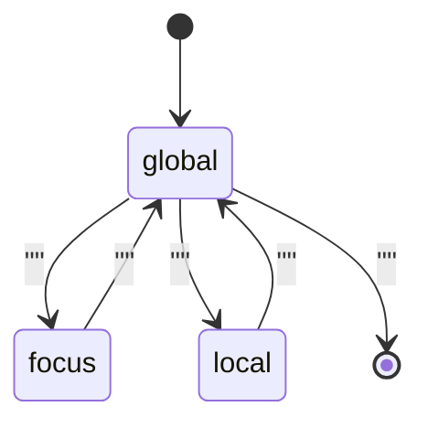

[논문 링크](https://arxiv.org/abs/2609.02737v1)
## 언어 모델이 스스로 어텐션을 통제한다: Declarative Attention

**TL;DR** — 기존의 희소 어텐션(sparse attention)은 매 디코딩 스텝마다 어떤 토큰이 중요한지 *외부에서 근사* 하느라 여전히 $O(N)$ 비용을 지불했다. 이 논문은 방향을 틀어, 모델이 Chain-of-Thought(CoT) 안에서 자신이 **어디를 볼지 직접 "선언"** 하게 한다. 추론 엔진은 이 선언을 도구 호출(tool call)처럼 파싱해 KV 캐시 읽기를 대부분 생략한다. 학습 없이(zero-shot) Gemma-4-31B에서 디코딩 어텐션 비용 **52.0%** 절감, 정확도 하락은 **1.27pp** 에 불과하다 (근거: §1, §5.1).

---

## Key Numbers (요약)

- **Params**: 31B (Gemma-4-31B) / 27B (Qwen-3.6-27B) | **Context**: 최대 244K tokens (네이티브 256K − 8K 생성 − 4K 프롬프트) (근거: §4, Appx D.1)
- **Architecture**: Dense 하이브리드 — 전역 어텐션(global) + SWA(Gemma, window 1024) 또는 GDN(Qwen) (근거: Appx B)
- **Positional**: 논문에 명시되지 않음(제품 기본값 유지) | **Attention**: Full causal global + Sliding Window / Linear(GDN)
- **Pretrain Data**: N/A (기존 오프더쉘프 모델 사용, 추가 학습 없음) (근거: §4)
- **Train Compute**: 0 FLOPs (zero-shot 프롬프팅만 사용) (근거: §1, §5.2)
- **Serving**: roofline 기준 디코딩 wall-time **269.1 ms → 192.3 ms** (Gemma, **0.71×**) / **306.2 ms → 237.3 ms** (Qwen, **0.77×**) (근거: Tab. 3)
- **KV-Cache**: Gemma-4-31B 전역 레이어 10개 × KV **81,920 B/token**; Qwen-3.6-27B 16개 × **65,536 B/token** (bf16) (근거: Tab. 4)
- **Cost**: 별도 달러/토큰 환산은 미제시 — 대신 roofline wall-time 절감률(0.71×/0.77×)로 보고 (근거: §5.4)

$$
\text{KV-Cache(GB)} \approx
\frac{2 \cdot L \cdot H \cdot d_\text{head} \cdot \text{seq} \cdot \text{batch} \cdot \text{bytes/elt}}{10^9}
$$

> 용어: **TPOT = Time Per Output Token**. (필요 시 "TBT=TPOT"로 병기) — 본 논문은 TPOT 대신 "디코딩 스텝당 읽는 KV 바이트"를 줄이는 방식으로 접근한다.

---

## 핵심 아이디어

트랜스포머는 디코딩 스텝마다 선행하는 **모든 토큰** 에 어텐션을 계산하므로, 장문 컨텍스트에서 KV 캐시 메모리 접근 지연이 디코딩 시간을 지배한다. 예컨대 1M 토큰 컨텍스트의 Qwen-3.5-397B-A17B는 스텝마다 약 **15 GB** 의 KV 캐시를 읽어야 하는데, 이는 17B 활성 파라미터를 로드하는 것과 맞먹는 메모리 대역폭 요구량이다 (근거: §1).

하지만 실제 어텐션 점수는 소수의 토큰에 집중되며, 진짜 어텐션 행렬은 **계산 전에는 알 수 없다** (근거: §1). 기존 접근은 크게 두 갈래다.

- **정적 휴리스틱**(recency, 과거 어텐션 크기): 미래 질의에 필요한 토큰을 예측 못 해 장문 성능이 떨어진다 (근거: §1).
- **경량 스캔**(QUEST, DeepSeek Sparse Attention 등): 매 스텝 KV를 가볍게 스캔해 마스크를 근사하지만, 상수만 줄일 뿐 여전히 **$O(N)$** 이다 (근거: §1, Appx A.1).

이 논문의 핵심 통찰은 한 줄의 질문에서 출발한다. *"모델은 어차피 어느 부분이 중요한지 이미 알고 있지 않을까?"* 최근 연구는 모델이 미래 토큰에 대한 정보를 히든 스테이트에 인코딩하고, CoT 프롬프팅이 이 잠재 계산을 해석 가능한 텍스트로 표면화함을 보였다 (근거: §1). 이를 *무엇을 생각할지* 에서 *어디를 볼지* 로 확장한 것이 **Declarative Attention(DA)** 이다.

> **중심 가설**: 저자들은 모델이 CoT 안에서 자신의 어텐션 범위를 명시적으로 선언하게 함으로써, 외부 스코어러 없이도 $O(N)$ 선택 비용을 제거하고 장문 추론의 KV 읽기 비용을 크게 줄일 수 있다고 가정한다.

---

## 배경: 그들이 해결한 문제

연구 공백은 명확하다. 희소 어텐션의 결정적 한계는 **"어텐션 점수를 모른 채로 어텐션 대상을 골라야 한다"** 는 순환 논리였다 (근거: §1). 두 갈래 기존 연구 모두 이를 우회하기 위해 *선택 비용* 을 지불했다.

1. **동적 희소 어텐션(디코딩)** — 매 스텝 전체 컨텍스트의 싼 대체재(surrogate)를 스캔해 top-$k$ 토큰을 고른다. 상수를 줄여도 복잡도는 $O(N)$ 이다 (근거: Appx A.1).
2. **KV 캐시 eviction** — 불필요한 KV를 영구 제거한다. 다만 나중에 필요한 토큰이 이미 버려졌을 위험을 안고, 그 오차는 복구 불가능하다 (근거: Appx A.2).

논문 출판 시점(2026년 9월)의 SOTA는 이 방향이 산업 규모로 확산된 상태였다. DeepSeek-V3.2의 DSA가 학습된 경량 인덱서로 매 스텝 토큰을 선별했고, 1년 사이 GLM-5, Qwen3.8-Flash-Next(QSA), MiniMax-M3(MSA) 등 오픈 프론티어 모델로 퍼졌다 (근거: Appx A.1). 그럼에도 이들은 모두 **매 스텝 $O(N)$ 스캔** 을 유지했다. DA가 노리는 지점은 바로 이 잔여 비용이다.

또 하나 중요한 배경은 **"주의 비용이 지배하는 서빙 체제"** 다. 대규모 배치·장문 서빙에서 FFN은 컴퓨트 바운드로, 어텐션 KV 읽기는 메모리 바운드로 수렴한다. 문맥이 길어질수록 어텐션 roofline wall-time은 컨텍스트 길이와 디코딩 스텝 수의 곱으로 커져 FFN을 압도한다 (근거: §3, Appx C.7).

---

## 새로운 접근법: Declarative Attention

DA는 학습·파인튜닝·보조 스코어러 없이, **하나의 고정 프롬프트** 로 오프더쉘프 모델에서 어텐션 범위를 이끌어낸다. 생성은 세 가지 모드로 분할된다 (근거: §2).

| 모드 | 볼 수 있는 것 | 용도 | 주의 비용 |
|---|---|---|---|
| `<global>` | 모든 컨텍스트 세그먼트 | 탐색(navigation) — 다음에 볼 세그먼트를 찾기 | $O(N)$ (전체) |
| `<focus magic_chunks="K">` | 명명된 세그먼트 K만 | 특정 영역에서 값을 그대로 추출 | $O(1)$ |
| `<local>` | 컨텍스트 세그먼트 없음(지금까지의 응답만) | 추출한 값을 종합해 답 도출 | $O(1)$ |

핵심 설계 요소는 셋이다.

- **스캐폴드(scaffold) + 컨텍스트 분리**: 시스템 지시·질문·지시문(스캐폴드)은 모든 모드에서 항상 보이고, 변동되는 컨텍스트만 상태 머신이 가린다 (근거: §2.1).
- **매직 청크(magic chunk)**: 컨텍스트를 ~2048 토큰 단위로 분할하고, 이를 *시뮬레이션된 도구 사용 대화*(`get_magic_chunk` 호출 → `Magic Chunk N` 응답)로 포장한다. 세그먼트 경계를 사후학습에서 익숙한 user/assistant/tool 특수 토큰 위에 올려, 모델이 임의 구분자보다 훨씬 안정적으로 추적하게 한다 (근거: §2.2).
- **DA 상태 머신**: 디코딩 스트림에서 태그 전환을 파싱해 매 스텝 KV 캐시 블록 테이블을 재작성한다. 마스크는 블록 단위(16~32 토큰)로 반올림되어 FlashAttention 같은 기존 커널이 그대로 동작한다 (근거: §2.3, Appx B).

---

## 작동 원리: 구체적인 예시로 살펴보기

논문의 예시를 빌려 보자. 질문이 *"Acme Corp이 창립된 지 몇 년 뒤에 상장했는가?"* 라고 하자 (근거: §2). 문서는 7개의 매직 청크로 나뉘어 있고, 창립 연도는 청크 2, 상장 연도는 청크 7에 있다.

**1단계 — `<global>` (탐색)**: 모델은 전체 컨텍스트를 훑으며 "창립 연도는 청크 2, 상장 연도는 청크 7에 있을 것"이라고 파악한다.

```text
<global>
I need the founding year and the IPO year. The company history in Magic Chunk 2
should state the founding.
</global>
```

**2단계 — `<focus magic_chunks="2">` (추출)**: 청크 2만 남기고 나머지 세그먼트는 마스킹된다.

```text
<focus magic_chunks="2">"Acme Corp was founded in 2003 in San Jose."</focus>
```

**3단계 — `<global>` → `<focus magic_chunks="7">`**: 상장 연도를 찾으러 다시 탐색 후 청크 7에 집중.

```text
<focus magic_chunks="7">"Acme Corp went public on the NYSE in 2011."</focus>
```

**4단계 — `<local>` (종합)**: 컨텍스트를 전혀 보지 않고, 방금 추출한 값만으로 계산한다.

```text
<local>2011 - 2003 = 8 years.</local>
<answer>8 years</answer>
```

상태 머신 관점에서 이 흐름은 아래와 같다.



**"비밀 병기"는 어텐션 마스크 그 자체다.** 논문은 이를 격리하기 위해 `DA-nm`(DA와 동일한 프롬프트 템플릿이지만 **완전 인과 어텐션**)이라는 어블레이션을 둔다. 두 비교가 이를 증명한다 (근거: §5.1, Fig. 2, Tab. 2).

| 지표 | Vanilla | DA-nm (마스크 없음) | DA (마스크) | 마스크의 순효과 |
|---|---|---|---|---|
| Attended tokens (Gemma, M/sample) | 13.43 | 22.31 | 6.45 | DA-nm 대비 **−71.1%** |
| Attended tokens (Qwen, M/sample) | 22.54 | 29.02 | 15.52 | DA-nm 대비 **−46.5%** |
| Accuracy (Gemma, %) | 87.01 | 87.01 | 85.74 | DA-nm 대비 **−1.27pp** |

청크드 프롬프트 포맷 자체는 거의 무손실(Gemma 87.01→87.01%)이지만, DA 프로토콜이 유도하는 *더 긴 생성* 때문에 attended token은 오히려 vanilla보다 **66.2%(Gemma)/28.8%(Qwen)** 높아진다 (근거: §5.1). 마스크가 이 오버헤드를 순이익으로 뒤집는다. 즉 절감의 근원은 **프롬프팅 포맷이 아니라 마스크** 임을 정확히 분리해 냈다.

---

## 성능 검증: 주요 결과

평가는 RULER·LongBench v1/v2·LooGLE·ZeroSCROLLS에서 뽑은 **15개 장문 소스**, 컨텍스트 최대 244K 토큰, Gemma-4·Qwen-3.5/3.6 두 패밀리 6개 모델에서 진행했다 (근거: §4, Tab. 1). 정답 판정은 LLM-as-a-judge(로컬 Qwen-3.5-4B)를 사용했고, 프론티어 Gemini-3.1-Pro와 **98.53%** 일치($\kappa=0.940$, $r=0.992$)하여 신뢰성이 검증됐다 (근거: Appx D.2, Tab. 9).

### 헤드라인: 비용은 크게 줄고, 정확도는 살짝만 떨어진다

| 모델 | Accuracy (Vanilla → DA) | Attended tokens (Vanilla → DA) | 절감률 |
|---|---|---|---|
| Gemma-4-31B | 87.01% → 85.74% (**−1.27pp**) | 13.43M → 6.45M | **−52.0%** |
| Qwen-3.6-27B | 85.31% → 82.56% (**−2.75pp**) | 22.54M → 15.52M | **−31.1%** |

(근거: §5.1, Tab. 2)

단일 스팬 과제에서의 손실(Gemma −0.78pp, Qwen −2.34pp)보다 다중 스팬 추론에서의 손실(Gemma −2.28pp, Qwen −3.59pp)이 크다 (근거: §5.1). 반대로 가장 큰 단일 과제 이득은 Qwen의 `code_repo`(**+5.6pp**)와 Gemma의 `longdep_qa`(**+3.1pp**)다 (근거: §5.1). 절대 토큰 절감은 가장 긴 컨텍스트에서 극대화되어, `code_repo`에서 Gemma **41.8M**, Qwen **52.0M** 토큰을 아낀다 (근거: §5.1).

### 확장성: 모델이 커질수록 정확도 격차가 줄어든다

DA의 상대 정확도는 모델 규모에 따라 단조 증가한다. Gemma는 E4B에서 **29%** → 31B에서 **99%**, Qwen은 4B에서 **64%** → 27B에서 **97%** (vanilla 대비) (근거: §5.2, Fig. 3a). 이는 DA가 프로토콜 준수(파싱 가능한 태그, 유효한 청크 참조)와 정보 제약 하 추론이라는 **두 가지 능력을 동시에** 요구하기 때문으로 해석된다 (근거: §5.2). 실제로 `<focus>` 파싱 성공률은 E4B의 **58%** 에서 최대 모델의 **99%** 로 상승한다 (근거: §6.2, Fig. 6a).

### 컨텍스트가 길수록 절감액이 커진다

컨텍스트 길이별 비닝에서 DA의 상대 정확도는 32K까지 vanilla와 **~1pp** 차이를 유지하다, 가장 긴 구간(64–256K)에서 약 **96%** 로 살짝 내려간다. 이 하락은 마스크 없는 `DA-nm` 라인에는 나타나지 않아, 장문 정확도 비용이 청크드 포맷이 아니라 **마스크** 에서 온다는 걸 다시 확인시킨다 (근거: §5.3, Fig. 4a). 절대 절감액은 짧은 구간 **약 1M** → 가장 긴 구간 **약 21M** 토큰으로 급증한다 (근거: §5.3, Fig. 4b). 즉 DA의 이득은 장문 디코딩이 가장 비싼 지점에서 정확히 극대화된다.

### 왜 절감이 통하지 않는가: 모드 믹스

`<global>` 은 생성 토큰의 약 **27%** 만 차지하고, `<focus>` + `<local>` 이 나머지 **73%** 를 맡는다 (근거: §6.1, Fig. 5a). 이 두 싼 모드는 스텝당 vanilla 대비 **76~99%** 의 어텐션을 아낀다 (근거: §6.1, Fig. 5b). 다만 `<global>` 비중은 컨텍스트가 길어지며 최장 구간에서 **약 45%** 까지 올라가 총 절감을 상한선으로 묶는다 (근거: §6.1). Qwen은 이 경향이 더 심해 최장 구간에서 `<global>` 이 **55%** 까지 치솟아 총 절감이 Gemma보다 작다 (근거: Appx E, Fig. 9).

### SOTA 비교 (동일 세팅 필수)

| Benchmark | Metric | Setting (ctx/temp/top-p/stop) | Model | Size | 결과 (Vanilla → DA) | Δ |
|---|---:|---|---|---:|---|---:|
| LBv2/code_repo | acc | 244K / 0.7 / 0.80 / `<answer>` | DA (Qwen) | 27B | 72.2 → **77.8** | **+5.6** |
| LooGLE/longdep_qa | acc | 244K / 1.0 / 0.95 / `<answer>` | DA (Gemma) | 31B | 65.6 → **68.8** | **+3.1** |
| LBv2/multidoc_qa | acc | 244K / 0.7 / 0.80 / `<answer>` | DA (Qwen) | 27B | 96.9 → 89.8 | −7.1 |
| LooGLE/shortdep_cloze | acc | 244K / 0.7 / 0.80 / `<answer>` | DA (Qwen) | 27B | 73.4 → 68.8 | −4.6 |
| LooGLE/summarization | acc | 244K / 0.7 / 0.80 / `<answer>` | DA (Qwen) | 27B | 70.3 → 65.6 | −4.7 |

> 샘플링 설정: Gemma-4는 temp 1.0 / top-p 0.95 / top-k 64, Qwen은 temp 0.7 / top-p 0.80 / top-k 20 / presence penalty 1.5 (근거: Appx D.3). 컨텍스트 상한 244K, 최대 생성 8K (근거: Appx D.1).

---

## Compute & Cost (공통)

- **Train**: steps 0 × bs 0 — 훈련 없음. zero-shot 프롬프팅만으로 달성 (근거: §1, §5.2).
- **HW**: NVIDIA B200 (bf16, HBM BW 8 TB/s, dense 2.25 PFLOPS), vLLM 커스텀 통합 (근거: §4, §5.4).
- **Roofline 디코딩 wall-time** (MFU 40%, MBU 70%, 응답당 평균) (근거: Tab. 3, Tab. 5):

| 모델 | Vanilla | DA | 절감 |
|---|---|---|---|
| Gemma-4-31B | 269.1 ms | 192.3 ms | **0.71×** |
| Qwen-3.6-27B | 306.2 ms | 237.3 ms | **0.77×** |

- **절감의 성격**: vanilla에서 전역 KV 읽기가 디코딩 시간의 **73%(Gemma)/86%(Qwen)** 를 차지하며, 마스크가 줄이는 것은 오직 이 항목이다. 매트멀(compute-bound)과 로컬 읽기(SWA/GDN)는 오히려 DA의 추가 디코딩 스텝(35%/31% 증가) 때문에 소폭 늘어난다 (근거: §5.4, Tab. 3).
- **로컬 플로어의 한계**: Qwen은 GDN 상태가 작아(DA 어텐션 시간의 5%) 전역 절감이 거의 그대로 통과하지만, Gemma는 60개 중 50개 레이어가 SWA라 로컬 읽기가 DA 어텐션 시간의 **42%** 를 차지해 총 절감을 제한한다 (근거: §5.4).
- **비용(달러) 환산**: 논문은 달러/토큰 대신 roofline wall-time 절감률로 보고하며, 달러 환산은 미제시 (근거: §5.4).

---

## 우리의 관점: 강점, 한계, 그리고 이 연구가 중요한 이유

### 강점

**1. 선택 비용 자체를 제거했다.** 기존 희소 어텐션이 매 스텝 $O(N)$ 스캔으로 남긴 상수 비용을, `<focus>` 태그를 파싱하는 $O(1)$ 로 대체했다 (근거: Appx A.1). 이는 "무엇을 계산할지"를 텍스트로 표면화한 CoT의 원리를 "어디를 볼지"로 확장한, 개념적으로 깔끔한 이동이다.

**2. 가역적이고 파괴적이지 않다.** eviction과 달리 DA는 KV를 영구 삭제하지 않고 마스킹만 한다. `<focus>` 뒤에 `<global>` 이 오면 언제든 전체를 다시 볼 수 있어, eviction이 감수해야 하는 *복구 불가능한 오차* 를 원천 차단한다 (근거: Appx A.2).

**3. zero-shot이 곧 하한(lower bound)이다.** 모든 결과가 파라미터 업데이트 없이 프롬프팅만으로 나왔으므로, 이는 하한이며 후처리 학습으로 개선될 여지가 크다는 프레이밍이 설득력 있다 (근거: §1, §8.2). 실제로 규모에 따라 정확도 격차가 수렴하는 증거(29%→99%)가 이를 뒷받침한다 (근거: §5.2).

**4. 해석 가능성(legibility)이 부가가치다.** 어텐션 계획이 사람이 읽을 수 있는 텍스트로 드러난다. KV 읽기를 구동하는 토큰이 곧 감사 가능한 토큰이라는 점에서 효율과 감독(oversight)을 동시에 얻는다 (근거: §8.4).

### 한계 (저자가 인정한 것 + 우리가 보는 잠재 한계)

**1. 더 긴 생성이 상쇄 요인이다.** DA는 vanilla보다 약 **15~35%** 더 많은 디코딩 스텝을 쓴다 (근거: Fig. 2). 특히 Qwen은 일부 소스에서 attended token이 vanilla보다 *올라가기도* 한다 (근거: §5.1). 생성이 늘면 FFN(컴퓨트) 비용도 같이 늘어나므로, 절감의 순효과는 어텐션이 지배적인 체제에서만 성립한다 (근거: §3).

**2. thinking 모드에서 실패한다.** 예비 실험에서 모델들이 thinking 태그 안에서는 DA 프로토콜을 따르지 못해, 모든 실험을 비사고(non-thinking) 모드로 한정했다 (근거: §4, §8.2). 추론이 가장 긴 체제에서 DA 절감을 못 쓰는 것은 실질적 제약이다.

**3. `<global>` 모드가 상한선이다.** 전역 스텝은 여전히 전체 어텐션 비용을 지불하며 DA attended token의 **80% 이상** 을 차지한다 (근거: §8.2). 컨텍스트가 길수록 이 비중이 커져 총 절감을 압박한다 (근거: §6.1).

**4. 인위적 세그먼트 의존성.** 고정 컨텍스트 벤치마크에서는 컨텍스트를 강제로 ~2K 청크로 잘라야 했고, 표가 청크 경계에 걸리면 정확도가 붕괴한다(예: `structured_data` −21pp) (근거: Appx D.4, Tab. 10). 에이전트처럼 자연 경계(턴, 도구 응답)가 있는 실제 배포에서는 덜 문제일 수 있으나, 아직 검증되지 않았다.

**5. roofline은 이론 상한이다.** 0.71×/0.77×는 포화된 단일 가속기에서의 천장 추정이며, 실측 wall-clock이 아니다. 프리필도 제외됐다 (근거: §5.4, Appx C.8).

### 왜 중요한가

이 연구의 진짜 기여는 **"어텐션 선택을 내부 활성화로부터 근사하는 일"을 "모델이 말로 선언하는 일"로 대체** 함으로써, 희소 어텐션에 *system-2* 라는 새 축을 연 데 있다 (근거: §8.4). 모델 스케일이 커질수록, 컨텍스트가 길어질수록 유리해지는 두 경향이 모두 산업의 진행 방향과 일치한다 (근거: §5.2, §5.3). 나아가 저자는 1M 컨텍스트에서도 어텐션이 디코딩의 **94~99%** 를 차지함을 보여, KV 읽기 비용이 아직도 핵심 병목임을 재확인했다 (근거: Appx C.10, Tab. 7).

---

## 다음 단계는?: 앞으로의 길

저자가 제시한 방향과 우리의 제안을 함께 정리한다.

1. **후처리 학습(RL/SFT)으로 전략 최적화.** CoT가 SFT·RL로 최적화됐듯, DA도 *정확도 + 어텐션 효율* 을 동시에 보상하는 강화학습으로 "더 적은 `<global>`, 더 알맞은 분해"를 가르칠 수 있다 (근거: §8.2, §8.4).
2. **에이전트 컨텍스트로의 전이.** 도구 호출·사용자 턴·검색 결과라는 *자연스러운 세그먼트* 가 이미 존재하는 에이전트 설정이 DA에 더 잘 맞을 가능성이 높다 (근거: §8.2).
3. **`<global>` 비용을 인컨텍스트 인덱스로.** 탐색에는 전체 충실도가 필요 없으므로, 세그먼트별 짧은 설명(인덱스)만 훑게 하면 전역 모드의 $O(N)$ 을 획기적으로 줄일 수 있다 (근거: §8.2).
4. **기존 기법과의 시너지.** 경량 스캔 희소 어텐션은 DA의 `<global>` 단계를, speculative decoding은 추가 디코딩 스텝을 상쇄한다 — DA 마스크는 모드 안에서 고정이므로 드래프팅이 단일 마스크 아래 진행돼 결합이 용이하다 (근거: §8.3).
5. **가역적 컨텍스트 압축 / KV 오프로딩.** DA는 주의 대상이 스팬 경계에서만 바뀌고 그 전환이 텍스트로 미리 선언되므로, 포커스 밖 세그먼트를 호스트 메모리로 내렸다가 선언 즉시 프리페치하는 "system-2 KV 오프로딩"의 정확한 액세스 패턴을 제공한다 (근거: §8.4).
6. **우리의 제안**: thinking 모드 호환은 반드시 풀어야 할 숙제다. 저자 스스로 "도구 선언으로 노출하면 해결될 것"이라 하지만, 검증이 필요하다. 또한 `DA-nm` 이 vanilla 대비 attended token을 크게 부풀리는(66.2%) 현상은 생성 제어가 미흡하면 절감이 쉽게 무너질 수 있음을 경고한다.

---

## Repro Checklist (공통)

- [x] 코드/Commit/License — vLLM 커스텀 통합(커널·스케줄러 무수정) 상세히 기술 (근거: Appx B). 단, 공개 저장소/라이선스 여부는 본문에 미명시.
- [x] 데이터 스냅샷·필터링 — 15개 소스, 길이 필터(244K/116K), 소스당 최대 128개, 고정 시드 (근거: §4, Appx D.1).
- [x] 하이퍼파라미터/시드/스케줄 — 샘플링 파라미터(Gemma/Qwen별) 명시, 최대 생성 8K (근거: Appx D.3).
- [x] 하드웨어/드라이버/라이브러리 — B200, bf16, vLLM + 커스텀 DA 훅 (근거: §4).
- [x] 평가 스크립트 & exact prompts — DA/Vanilla 지시문, 루브릭 생성, 판정 프롬프트 전문 공개 (근거: Appx F).
