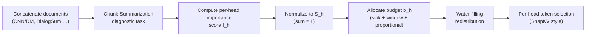

[Paper](https://arxiv.org/abs/2609.03235v1)
## SGD-KV: Finding 'heads that are good at summarizing' cuts the 1M-token KV cache by up to 75%

> **TL;DR** — Attention heads do not all do the same job. **SGD-KV** pinpoints the **summarization heads** — the ones responsible for the high-level information compression called 'summarization' — with a diagnostic task, then hands out the KV cache budget in proportion to their scores. At contexts of up to 1 million (1M) tokens it cuts KV cache memory by up to **75%** while beating existing head-level compression methods.

---

## Core idea

Long-context inference in large language models (LLMs) runs into a memory bottleneck: the **KV cache**. This cache grows **linearly** with context length and, as the million-token era opens with models like Qwen2.5-1M and Gemini 2.5, it has become a genuinely critical obstacle (source: §1).

Most prior compression methods leaned on simple **retrieval-based heuristics** such as "which tokens received a lot of attention" (source: §2). The authors go one step further and import an insight from interpretability research: **each head serves a distinct function**. In addition to the "retrieval heads" and "induction heads" found by earlier work, this paper proposes a new functional class — **summarization heads** — responsible for **hierarchical information aggregation** (source: §1, §2).

The core claim can be summarized as follows:

> **The authors hypothesize that once the summarization-specialized heads are pinpointed accurately, simply giving those heads a larger share of the KV budget yields a better efficiency–accuracy tradeoff than allocations built around plain retrieval heads.**

To realize this, they propose the three-stage framework **SGD-KV (Summarization-Guided KV cache compression)**: ① a **chunk-summarization diagnostic task** that measures summarization ability, ② a method that derives each head's **summarization score** from it, and ③ an allocation algorithm that splits the budget proportionally to the scores and redistributes it via **water-filling** (source: §3).

---

## Background: the problem they set out to solve

### The problem: the KV cache grows linearly with context

In transformer inference, the KV cache stores the Key/Value vectors of earlier tokens for reuse. Its size is roughly

$$
\text{KV-Cache(GB)} \approx \frac{2 \cdot L \cdot H \cdot d_\text{head} \cdot \text{seq} \cdot \text{batch} \cdot \text{bytes/elt}}{10^9}
$$

that is, proportional to **number of layers $L$ × number of KV heads $H$ × sequence length $\text{seq}$**. As the sequence lengthens, memory rises in a straight line and quickly exhausts GPU memory in scenarios that need hundreds of thousands to a million tokens — long conversations, multi-document analysis (source: §1).

### Limits of prior approaches: they looked at "numbers," not "function"

Related work has largely run along two tracks (source: §2).

| Direction | Representative method | Idea | Limitation |
|---|---|---|---|
| **Token-level eviction** | StreamingLLM, H2O | Drop less important tokens using recency and cumulative attention scores | Knows nothing about a head's **function** |
| **Head-level budget allocation** | PyramidKV, AdaKV, HeadKV | Distribute the cache budget differently across layers and heads | Still governed by **attention score patterns**; ignores semantic role |

In particular, HeadKV relies on "retrieval-reasoning (R2) heads" and DuoAttention on a binary split into "retrieval vs. streaming heads," yet both stay trapped inside a diagnostic framework built on **retrieval** (source: §2). The authors' critique is sharp: multi-document analysis and long-form dialogue demand **hierarchical information aggregation**, not simple pattern matching, and retrieval-centric diagnostics miss the heads behind such high-level cognitive functions (source: §1).

### The gap this paper fills

Interpretability research has shown that "heads specialize," but its findings reached efficiency (compression) work only in the form of retrieval heads. This paper **identifies the heads responsible for high-level aggregation through a summarization-based diagnostic task and, for the first time, connects that functional insight directly to KV cache compression strategies** (source: §2). That is precisely the research gap this work explicitly fills.

---

## The new approach: SGD-KV

SGD-KV consists of three modules. The overall flow is as follows.



### 1) The chunk-summarization task (§3.1)

To measure summarization ability, the authors designed a diagnostic task that forces **multi-stage understanding** that simple pattern matching cannot solve.

1. **Sample construction**: several documents from short-text summarization datasets (CNN/DailyMail, DialogSum, etc.) are concatenated into a long context, and the **boundary** of each source document is recorded.
2. **A two-stage question**:
   - **Chunk Identification**: predict how many semantically distinct **chunks** the concatenated documents contain.
   - **Keyword Extraction**: produce a **keyword list** that captures the core meaning of each chunk.

This design forces the model to first grasp the document structure at a high level and then distill each segment's semantic essence, which strongly exposes which heads carry out hierarchical aggregation (source: §3.1, Fig. 1).

### 2) Computing the summarization score (§3.2)

Only valid responses (samples that produced correct chunk boundaries and keywords) are kept, and each head $h$'s importance score is then measured with attention.

$$
I_h = \frac{1}{c}\sum_{m=1}^{c}\frac{1}{|K_m|}\sum_{j\in K_m}\max_n A_h(p^o_j,\, p^i_{j,n})
$$

- $c$: the number of chunks in the sample; $K_m$: the keyword set of chunk $m$
- $p^o_j$: the output position of generated keyword token $j$; $p^i_{j,n}$: the $n$-th position where the same keyword appears in the input text
- $\max_n$: picks the **strongest attention link** between a generated keyword and the input source tokens, capturing "the ability to precisely point at and aggregate core information."

The final summarization score is $I_h$ averaged over all valid samples (source: §3.2, Eq. 1).

### 3) KV cache budget allocation (§3.3, Appx. A.1)

After the scores are normalized so they sum to 1 across all heads ($S_h$), the **sink tokens ($b_\text{sink}$)** and the **recent window ($b_\text{window}$)** are always preserved at a fixed size, reflecting that a real user instruction typically sits at the **start/end** of the input. The remaining compressible middle section $M = C - b_\text{sink} - b_\text{window}$ is split in proportion to the scores (source: §3.3):

$$
b_h = (S_h \cdot L \cdot H \cdot R) \cdot M + b_\text{sink} + b_\text{window}
$$

($L$: number of layers, $H$: number of KV heads, $R$: overall budget ratio). On top of this comes a redistribution inspired by **water-filling**. When a head with an extreme score would end up with $b_h > M$, the surplus budget $E$ is redistributed to heads whose scores are high but still have room (source: Appx. A.1, Alg. 1). Finally, within each head's allocation $b_h$, the tokens to keep are chosen by the same **cumulative attention scores** that SnapKV uses (source: §3.3).

---

## How it works: walking through a concrete example

Words only get you so far, so let's trace the whole process on a tiny toy example.

**① Sample construction** — concatenate three distinct documents.

| chunk | Source document | Example content |
|---|---|---|
| 1 | News (CNN/DM) | "Messi scores the winner… team wins 2-1" |
| 2 | Dialogue (DialogSum) | "Reservation at 7 PM… table for 4" |
| 3 | Diary (SAMSum) | "Rain today, so the Seoul walk is cancelled" |

**② Diagnostic question** — the model is asked: "Into how many chunks do the concatenated documents split semantically? Extract the core keywords of each chunk."

**③ A correct response** would be:

```
3 chunks
1) "Messi", "goal", "2-1"
2) "reservation", "7 PM", "4 people"
3) "rain", "Seoul", "cancel"
```

**④ Score computation** — look at how strongly a given head $h$ attends from the generated keyword "Messi" (output position $p^o_j$) back to "Messi" in the input source text (position $p^i_{j,n}$). Averaging over the keywords across all three chunks yields that head's $I_h$. A head that summarizes well should show attention that "points precisely at each chunk's key words," so its $I_h$ is high (source: Eq. 1).

**⑤ Budget allocation** — say $C=1000$ tokens, sink $=100$, and window $=100$, so $M=800$. At a total budget of 25% ($R=0.25$), high-scoring heads keep more tokens from the middle section and low-scoring heads keep fewer. Surplus budget is redistributed by water-filling (source: §3.3, Appx. A.1).

**⑥ Token selection** — within each head's allocated budget, keep the tokens with the highest cumulative attention scores (core information) first (source: §3.3).

One implementation detail here: Qwen2.5-7B-Instruct-1M has **28** attention heads but only **4** KV heads (GQA, group size 7). The 28 per-head scores are folded into 4 KV-head scores via **max-pooling within each group** (source: Appx. A.7). The paper goes further and reports that the variant that aggregates by multiplying attention scores by summarization scores (**Ipt., Max**) worked best (source: Appx. A.7, Tab. 5).

---

## Evaluation: key results

### Experimental setup

- **Models**: two kinds — the small, non-reasoning LLM **Qwen2.5-7B-Instruct-1M** (28 layers, 4 KV heads) and the large, reasoning LLM **Qwen3-32B** (source: §4).
- **Important caveat**: because the Qwen2.5-7B-Instruct-1M checkpoint released on HF performs poorly on multi-turn conversation (MRCR), the authors ran **additional fine-tuning**. Data: synthetic MRCR 10K + GraphWalks 20K + BABILong 25K, plus Gutenberg 10K + Llama-Nemotron 10K as regularization. Full-parameter FT with LlamaFactory, LR $1.0\times10^{-5}$, warmup 0.1, batch 128, 2 epochs (source: Appx. A.2).
- **Benchmarks**: MRCR (multi-turn coreference resolution), ETHIC (high-information coverage), BABILong (source: §4, Appx. A.5).

### MRCR: the gap widens at long contexts

**Qwen2.5-7B-Instruct-1M, 25% KV budget** (source: Tab. 1):

| Method | 64k | 128k | 256k | 512k | 1M |
|---|---:|---:|---:|---:|---:|
| FullKV | 95.01 | 96.38 | 88.6 | 63.84 | 43.29 |
| DuoAttention | 85.80 | 89.82 | 73.78 | 39.10 | 24.73 |
| HeadKV | 68.52 | 74.81 | 66.98 | 44.36 | 28.90 |
| **SGD-KV** | **85.09** | **87.19** | **83.29** | **48.86** | **34.16** |

Key point: **from 128K onward**, SGD-KV overtakes DuoAttention and beats HeadKV by a wide margin across every length. At 1M tokens in particular, it leads HeadKV (28.90) by **+5.26pt** and DuoAttention (24.73) by **+9.43pt** (source: Tab. 1, §4). This supports the claim that the value of "sophisticated head prioritization" grows as the context lengthens.

On **Qwen3-32B**, SGD-KV and HeadKV together clearly outpace DuoAttention, but the edge between SGD-KV and HeadKV alternates by length (8k: 77.05 vs 78.16; 64k: 40.13 vs 34.90). This grounds the conclusion that "finer-grained budget allocation beats binary classification on reasoning tasks," not that SGD-KV holds an absolute edge over HeadKV (source: Tab. 1, §4).

### ETHIC: nearly matching FullKV

**Average accuracy (mean of AT/OG/RC)** (source: Tab. 2):

| Method | Qwen2.5-7B-1M | Qwen3-32B |
|---|---:|---:|
| FullKV | 21.65 | 28.53 |
| DuoAttention | 19.51 | 24.49 |
| HeadKV | 20.87 | 28.19 |
| **SGD-KV** | **21.34** | **28.38** |

On Qwen3-32B, SGD-KV reaches almost the same level as FullKV (28.53) with **only 25% of the KV cache** (28.38, a 0.15pt gap), narrowing the difference more effectively than any other method (source: Tab. 2, §4).

### BABILong: effectively tied with FullKV

On BABILong, which tests retrieval and reasoning, SGD-KV also holds nearly the same level as FullKV across every length (e.g., 94.2 vs 94.6 at 1M) (source: Appx. A.5, Tab. 4).

### Ablation: what if there is no query? The summarization prompt acts as a proxy

The token selection stage picks important tokens using the cumulative attention of the last 128 tokens (including the real question). The authors tested three choices for this "observation window" (source: §5, Tab. 3):

| Condition | Description | Result |
|---|---|---|
| Query-Aware (default) | Last 128 tokens (including the real question) | Baseline |
| Query-Unaware | Excludes the question; 128 tokens from the preceding context | Large drop in performance |
| Proxy-Query | A fixed prompt: "split the preceding text into chunks and extract keywords" | **Recovers most of the drop** |

Under Query-Unaware, SGD-KV plunges from 85.09 to 70.94 at 64k, but Proxy-Query recovers most of it, reaching 82.62. In other words, **the summarization prompt works as an effective proxy query even when the real user question is unknown** — a practically valuable finding (source: §5, Tab. 3). Across all three conditions SGD-KV consistently beats HeadKV.

### Ablation: evidence that score distribution really matters (Appx. A.7)

| Variant | FullKV head ratio | 8k | 128k | 512k |
|---|---|---:|---:|---:|
| SGD-KV | 3.57% | 91.30 | 87.19 | 48.86 |
| SGD-KV (Reverse, allocation inverted) | 0% | 47.21 | 8.21 | 8.61 |
| SGD-KV (thr, zero out below average) | 16.96% | 95.51 | 86.24 | 32.22 |
| SGD-KV (Ipt., max) | 3.57% | 95.5 | 91.16 | **57.23** |

- **Reverse**: handing the budget out in reverse makes performance collapse **even with 3× the KV cache** — strong evidence for the validity of score-based allocation (source: Tab. 5).
- **thr**: zeroing out low-scoring heads helps up to 64k but collapses beyond 128k, suggesting that "even relatively low-scoring heads still matter at extreme lengths" (source: Appx. A.7).
- **Ipt., max**: multiplying attention scores by summarization scores before the GQA aggregation is best across the whole 8k–512k range (57.23 at 512k, +8.37pt over SGD-KV's 48.86) (source: Appx. A.7, Tab. 5).

### Stability of head identification

Across two disjoint 100-sample subsets of the Dolly data, the top-k head IoU is **>0.9**, so identification is highly stable. It also shows high IoU across datasets (Dolly↔DialogSum↔SAMSum), indicating generalization. Compared with retrieval/R2 heads, the top 20% overlaps, but in the **20–60% band it picks clearly different** heads, showing that summarization heads capture a distinct pattern beyond simple retrieval (source: Appx. A.3, Fig. 2).

---

## Our take: strengths, limits, and why this study matters

### Strengths

1. **A functional turn** — guiding compression by "the semantic role a head plays" rather than "attention numbers" is a clean bridge between interpretability and efficiency. Capturing the high-level aggregation heads that retrieval diagnostics miss is the key differentiator (source: §2).
2. **No training required + generalization** — compression itself needs no extra learning, and head identification stays stable (IoU > 0.9) even when the dataset changes (source: Appx. A.3).
3. **The proxy-query finding** — the result that a summarization prompt can stand in when the real question is unknown (pre-compression, prompt caching, etc.) has high practical value (source: §5).
4. **Solid ablations** — reverse allocation, thresholding, and GQA aggregation are all systematically tested, convincingly showing that "score distribution is what drives performance" (source: Appx. A.7).

### Limits and criticism

1. **Fine-tuning confound** — the Qwen2.5-7B-1M results come from a **re-fine-tuned model** (source: Appx. A.2). "SGD-KV's superiority" and "the effect of fine-tuning" are entangled, so whether the same gains appear on the original checkpoint is unclear.
2. **"No accuracy loss" is an overstatement** — the abstract says "without compromising model accuracy," yet at 1M in MRCR a **~9pt gap** remains: FullKV 43.29 vs SGD-KV 34.16 (source: Tab. 1). The gap nearly vanishes on ETHIC, but on MRCR real accuracy is lost.
3. **The edge over HeadKV on Qwen3-32B is unclear** — the lead alternates by length, so any claim of absolute SOTA on the large model is limited (source: Tab. 1).
4. **No measured system metrics** — the paper only reports accuracy vs. budget; there are no end-to-end measurements like **TTFT, TPOT (tokens/s), or VRAM**. Whether "a 75% memory cut" translates into real inference-latency gains needs separate verification.
5. **A workshop paper's limits** — it appeared at the NeurIPS 2025 *Efficient Reasoning* workshop, so the scale and depth of validation are still early-stage (source: §1 fn.).

### Why it still matters

This study's real value lies not in specific numbers but in **pointing a direction**. By showing that "abstract reasoning roles (summarization) can also be identified and exploited," it opens a new horizon — interpretability-driven efficiency — for the million-token era (source: §6). From retrieval to summarization, from tokens to functions — it is worth reading for raising KV cache compression by one level of abstraction.

---

## What's next: the road ahead

The authors explicitly stress that "identifying and exploiting summarization heads is the road to more efficient and interpretable models" (source: §6). Building on that, here are sensible next steps given the limits above.

- **Scale and architecture generalization**: verify that summarization heads appear consistently in larger models and other architectures (MLP-MoE, mixed head configurations).
- **Make token selection summarization-aware too**: today only the head budgets are set by summarization scores, while token selection still uses the SnapKV-style heuristic. Reflecting summarization scores in token-level selection as well (the Ipt. direction in Appx. A.7) should bring further gains.
- **Add measured metrics**: prove "memory savings = real latency reduction" with end-to-end measurements such as TTFT/TPOT/VRAM/token throughput.
- **Online, dynamic identification**: instead of fixed offline scores, adjust head budgets dynamically according to the prompt.
- **Fair reproduction**: report performance on the original (non-fine-tuned) checkpoint separately, isolating the method's own contribution.

---

### Summary

| Item | Content |
|---|---|
| Problem | KV cache memory balloons linearly at 1M-token contexts |
| Idea | Find the attention heads specialized for "summarization" with a diagnostic task and allocate budgets differentially |
| Method | Chunk-Summarization task → summarization score → proportional allocation + water-filling |
| Models | Qwen2.5-7B-Instruct-1M (28 heads/4 KV heads, GQA), Qwen3-32B |
| Effect | KV cache cut by up to **75%**, SOTA on MRCR at 128K+, near-FullKV on ETHIC |
| Key finding | The summarization prompt works as a proxy query; the Reverse experiment validates score-based allocation |
