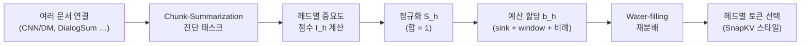

[논문 링크](https://arxiv.org/abs/2609.03235v1)
# SGD-KV: '요약을 잘하는 헤드'를 찾아 1M 토큰의 KV 캐시를 75%까지 줄인다

> **TL;DR** — 어텐션 헤드는 모두 같은 일을 하지 않는다. '요약'이라는 고차원 정보 압축을 담당하는 **summarization heads** 를 진단 태스크로 찾아내고, 그 점수에 비례해 KV 캐시 예산을 나눠주는 **SGD-KV** 가 최대 100만(1M) 토큰 컨텍스트에서 KV 캐시 메모리를 최대 **75%** 줄이면서도 기존 헤드 단위 압축 기법들을 압도한다.

---

## 핵심 아이디어

대형 언어 모델(LLM)의 긴 컨텍스트 추론은 **KV 캐시** 라는 메모리 병목에 막힌다. 컨텍스트 길이에 **선형** 으로 커지는 이 캐시는, Qwen2.5-1M·Gemini 2.5처럼 백만 토큰 시대가 열리면서 사실상 치명적인 장애물이 됐다 (근거: §1).

기존 압축 기법들은 대부분 "어떤 토큰이 어텐션을 많이 받았는가" 같은 단순한 **retrieval 기반 휴리스틱** 에 의존했다 (근거: §2). 저자들은 여기서 한 발 더 나아가, **헤드마다 맡은 기능이 다르다** 는 해석가능성(interpretability) 연구의 통찰을 가져온다. 기존 연구가 찾아낸 "retrieval heads", "induction heads"에 더해, 이 논문은 **계층적 정보 종합(hierarchical information aggregation)** 을 담당하는 **summarization heads(요약 헤드)** 라는 새로운 기능적 클래스를 제안한다 (근거: §1, §2).

핵심 주장은 이렇게 요약할 수 있다:

> **저자들은 "요약에 특화된 헤드를 정확히 찾아내면, 그 헤드에 더 많은 KV 예산을 주는 것만으로도 단순 검색 헤드 위주 분배보다 더 나은 효율-정확도 트레이드오프를 얻을 수 있다"고 가정한다.**

이를 실현하기 위해 저자들은 ① 요약 능력을 측정하는 **chunk-summarization 진단 태스크**, ② 이로부터 각 헤드의 **summarization score** 를 계산하는 방법, ③ 점수에 비례해 예산을 나누고 **water-filling** 으로 재분배하는 할당 알고리즘, 이렇게 3단계 프레임워크 **SGD-KV(Summarization-Guided KV cache compression)** 를 제안한다 (근거: §3).

---

## 배경: 그들이 해결한 문제

### 문제: KV 캐시는 컨텍스트와 함께 선형으로 불어난다

트랜스포머 추론에서 KV 캐시는 이전 토큰들의 Key/Value 벡터를 저장해 두었다가 재사용한다. 그 크기는 대략

$$
\text{KV-Cache(GB)} \approx \frac{2 \cdot L \cdot H \cdot d_\text{head} \cdot \text{seq} \cdot \text{batch} \cdot \text{bytes/elt}}{10^9}
$$

로, **레이어 수 $L$ × KV 헤드 수 $H$ × 시퀀스 길이 $\text{seq}$** 에 비례한다. 시퀀스가 길어질수록 메모리가 직선으로 늘어나, 긴 대화·멀티 도큐먼트 분석처럼 수십만~백만 토큰이 필요한 시나리오에서 GPU 메모리를 금방 고갈시킨다 (근거: §1).

### 기존 접근의 한계: "기능"이 아니라 "수치"만 봤다

관련 연구는 크게 두 갈래로 진행돼 왔다 (근거: §2).

| 방향 | 대표 기법 | 아이디어 | 한계 |
|---|---|---|---|
| **토큰 단위 eviction** | StreamingLLM, H2O | recency·누적 어텐션 점수로 덜 중요한 토큰 제거 | 헤드의 **기능** 을 전혀 모름 |
| **헤드 단위 예산 할당** | PyramidKV, AdaKV, HeadKV | 레이어·헤드별로 캐시 예산을 다르게 분배 | 여전히 **어텐션 수치 패턴** 이 기준, 의미적 역할 무시 |

특히 HeadKV는 "retrieval-reasoning(R2) heads"를, DuoAttention은 "retrieval vs. streaming heads"의 이진 분류를 쓰지만, 모두 **검색(retrieval)** 이라는 진단 프레임워크 안에 갇혀 있다 (근거: §2). 저자들의 진단은 날카롭다: 멀티 도큐먼트 분석이나 장문 대화는 단순 패턴 매칭이 아니라 **계층적 정보 종합** 을 요구하는데, retrieval 중심 진단은 이런 고차원 인지 기능을 담당하는 헤드를 놓친다는 것이다 (근거: §1).

### 이 논문이 채우는 공백

해석가능성 연구는 "헤드는 전문화된다"는 사실을 보여줬지만, 그 발견이 효율화(압축)로 이어진 적은 retrieval heads에 국한됐다. 이 논문은 **요약 기반 진단 태스크로 고차원 종합을 담당하는 헤드를 식별하고, 처음으로 그 기능적 통찰을 KV 캐시 압축 전략에 직접 연결** 한다 (근거: §2). 이것이 바로 이 연구가 명시적으로 메우는 연구 공백이다.

---

## 새로운 접근법: SGD-KV

SGD-KV는 3개의 모듈로 구성된다. 전체 흐름은 다음과 같다.



### 1) Chunk-Summarization 태스크 (§3.1)

요약 능력을 재기 위해 저자들은 단순 패턴 매칭으로는 풀 수 없는 **다단계 이해** 를 강제하는 진단 태스크를 설계했다.

1. **샘플 구성**: 짧은 텍스트 요약 데이터셋(CNN/DailyMail, DialogSum 등)의 여러 문서를 이어 붙여 긴 컨텍스트를 만들고, 각 원본 문서의 **경계(boundary)** 를 기록해 둔다.
2. **2단계 질문**:
   - **Chunk Identification(청크 식별)**: 이어진 문서 안에 의미적으로 구분되는 **chunk가 몇 개** 인지 맞춘다.
   - **Keyword Extraction(키워드 추출)**: 각 chunk의 핵심 의미를 담는 **키워드 목록** 을 생성한다.

이 설계는 모델이 먼저 문서 구조를 고수준에서 파악한 뒤, 각 구간의 의미적 본질을 압축(distill)하도록 강제한다. 그래서 계층적 종합을 담당하는 헤드가 무엇인지 강하게 드러난다 (근거: §3.1, Fig. 1).

### 2) Summarization Score 계산 (§3.2)

유효한 응답(올바른 chunk 경계·키워드를 생성한 샘플)만 골라, 각 헤드 $h$ 의 중요도 점수를 어텐션으로 측정한다.

$$
I_h = \frac{1}{c}\sum_{m=1}^{c}\frac{1}{|K_m|}\sum_{j\in K_m}\max_n A_h(p^o_j,\, p^i_{j,n})
$$

- $c$: 샘플의 chunk 수, $K_m$: chunk $m$ 의 키워드 집합
- $p^o_j$: 생성된 키워드 토큰 $j$ 의 출력 위치, $p^i_{j,n}$: 같은 키워드가 입력 텍스트에서 등장한 $n$ 번째 위치
- $\max_n$: 생성 키워드 → 입력 원문 토큰 간 **가장 강한 어텐션 연결** 을 골라, "핵심 정보를 정확히 짚어내고 종합하는 능력"을 포착한다.

최종 summarization score는 유효 샘플 전체에 걸친 평균 $I_h$ 이다 (근거: §3.2, Eq. 1).

### 3) KV 캐시 예산 할당 (§3.3, Appx. A.1)

점수를 전 헤드에 걸쳐 합이 1이 되도록 정규화한 뒤($S_h$), 실제 사용자의 지시문이 보통 입력의 **처음/끝** 에 온다는 점을 반영해 **sink 토큰($b_\text{sink}$)** 과 **최근 윈도우($b_\text{window}$)** 는 항상 고정 보존한다. 나머지 압축 가능한 중간 구간 $M = C - b_\text{sink} - b_\text{window}$ 를 점수에 비례해 나눈다 (근거: §3.3):

$$
b_h = (S_h \cdot L \cdot H \cdot R) \cdot M + b_\text{sink} + b_\text{window}
$$

($L$: 레이어 수, $H$: KV 헤드 수, $R$: 전체 예산 비율). 여기에 **water-filling(물 채우기)** 영감의 재분배를 더한다. 점수가 극단적으로 높은 헤드가 $b_h > M$ 이 되어 넘치는 예산 $E$ 를, 점수가 높지만 아직 여유가 있는 헤드들에게 재분배한다 (근거: Appx. A.1, Alg. 1). 마지막으로, 각 헤드에 할당된 $b_h$ 안에서는 SnapKV와 동일한 **누적 어텐션 점수** 기반으로 보관할 토큰을 고른다 (근거: §3.3).

---

## 작동 원리: 구체적인 예시로 살펴보기

말로만은 와닿지 않으니, 아주 작은 장난감 예시로 전 과정을 따라가 보자.

**① 샘플 구성** — 서로 다른 3개 문서를 이어 붙인다.

| chunk | 원본 문서 | 내용 예시 |
|---|---|---|
| 1 | 뉴스(CNN/DM) | "메시가 결승골… 팀 2-1 승리" |
| 2 | 대화(DialogSum) | "저녁 7시에 예약… 4명 자리" |
| 3 | 일기(SAMSum) | "오늘 비 와서 서울 산책 취소" |

**② 진단 질문** — 모델에게 묻는다: "이어붙인 문서는 의미적으로 몇 개의 chunk로 나뉘는가? 각 chunk의 핵심 키워드를 뽑아라."

**③ 올바른 응답** 이라면:

```
청크 3개
1) "메시", "골", "2-1"
2) "예약", "7시", "4명"
3) "비", "서울", "취소"
```

**④ 점수 계산** — 어떤 헤드 $h$ 가, 생성된 키워드 "메시"(출력 위치 $p^o_j$)로부터 입력 원문 속 "메시"(위치 $p^i_{j,n}$)로 **얼마나 강하게 어텐션** 을 주는지 본다. 세 chunk 전체의 키워드에 대해 평균을 내면 그 헤드의 $I_h$ 가 된다. 요약을 잘하는 헤드라면, "각 chunk의 핵심 단어를 정확히 가리키는" 어텐션을 보일 것이므로 $I_h$ 가 높다 (근거: Eq. 1).

**⑤ 예산 분배** — 예를 들어 $C=1000$ 토큰, sink $=100$, window $=100$ 이면 $M=800$. 전체 예산 25%($R=0.25$)라면, 점수가 높은 헤드는 중간 구간에서 더 많은 토큰을 보관하고, 점수가 낮은 헤드는 적게 보관한다. 넘치는 예산은 water-filling으로 재분배된다 (근거: §3.3, Appx. A.1).

**⑥ 토큰 선택** — 각 헤드가 받은 예산 안에서, 누적 어텐션 점수가 높은 토큰(핵심 정보)부터 남긴다 (근거: §3.3).

여기서 한 가지 구현 디테일: Qwen2.5-7B-Instruct-1M은 어텐션 헤드가 **28개** 지만 KV 헤드는 **4개** (GQA, 그룹 크기 7)다. 헤드별 점수 28개는 **그룹 내 max-pooling** 으로 KV 헤드 4개의 점수로 합쳐진다 (근거: Appx. A.7). 논문은 여기서 더 나아가, 어텐션 점수에 요약 점수를 곱해 집계하는 변형(**Ipt., Max**)이 가장 좋았다고 보고한다 (근거: Appx. A.7, Tab. 5).

---

## 성능 검증: 주요 결과

### 실험 세팅

- **모델**: 비추론 소형 LLM **Qwen2.5-7B-Instruct-1M**(28 레이어, KV 헤드 4개)과 추론형 대형 LLM **Qwen3-32B** 두 종 (근거: §4).
- **중요 전제**: HF에 공개된 Qwen2.5-7B-Instruct-1M 체크포인트가 다중 턴 대화(MRCR)에서 성능이 좋지 않아, 저자들은 **추가 파인튜닝** 을 수행했다. 데이터는 합성 MRCR 10K + GraphWalks 20K + BABILong 25K, 정규화용 Gutenberg 10K + Llama-Nemotron 10K. LlamaFactory로 full-parameter FT, LR $1.0\times10^{-5}$, warmup 0.1, batch 128, 2 epoch (근거: Appx. A.2).
- **벤치마크**: MRCR(다중 턴 공참조 해석), ETHIC(고정보 커버리지), BABILong (근거: §4, Appx. A.5).

### MRCR: 장문에서 격차가 벌어진다

**Qwen2.5-7B-Instruct-1M, KV 예산 25%** (근거: Tab. 1):

| Method | 64k | 128k | 256k | 512k | 1M |
|---|---:|---:|---:|---:|---:|
| FullKV | 95.01 | 96.38 | 88.6 | 63.84 | 43.29 |
| DuoAttention | 85.80 | 89.82 | 73.78 | 39.10 | 24.73 |
| HeadKV | 68.52 | 74.81 | 66.98 | 44.36 | 28.90 |
| **SGD-KV** | **85.09** | **87.19** | **83.29** | **48.86** | **34.16** |

핵심 포인트: **128K 이후** 부터 SGD-KV가 DuoAttention을 추월하고, 전 구간에서 HeadKV를 큰 폭으로 이긴다. 특히 1M 토큰에서는 HeadKV(28.90) 대비 **+5.26pt**, DuoAttention(24.73) 대비 **+9.43pt** 우위다 (근거: Tab. 1, §4). 컨텍스트가 길어질수록 "정교한 헤드 우선순위"의 가치가 커진다는 주장을 뒷받침한다.

**Qwen3-32B** 에서는 SGD-KV와 HeadKV가 함께 DuoAttention을 크게 앞서지만, SGD-KV↔HeadKV 간 우위는 구간에 따라 엇갈린다(8k: 77.05 vs 78.16, 64k: 40.13 vs 34.90). 이는 "이진 분류보다 세밀한 예산 할당이 추론 과제에 낫다"는 결론의 근거이지, HeadKV 대비 절대적 우위의 근거는 아니다 (근거: Tab. 1, §4).

### ETHIC: FullKV에 거의 근접

**평균 정확도(AT/OG/RC 평균)** (근거: Tab. 2):

| Method | Qwen2.5-7B-1M | Qwen3-32B |
|---|---:|---:|
| FullKV | 21.65 | 28.53 |
| DuoAttention | 19.51 | 24.49 |
| HeadKV | 20.87 | 28.19 |
| **SGD-KV** | **21.34** | **28.38** |

Qwen3-32B에서 SGD-KV는 **25% KV 캐시만으로** FullKV(28.53)와 거의 동률(28.38, 차이 0.15pt)을 보이며, 어떤 기법보다 격차를 효과적으로 좁혔다 (근거: Tab. 2, §4).

### BABILong: FullKV와 사실상 동률

검색·추론을 시험하는 BABILong에서도 SGD-KV는 전 길이에 걸쳐 FullKV와 거의 같은 수준을 유지한다(예: 1M에서 94.2 vs 94.6) (근거: Appx. A.5, Tab. 4).

### Ablation: 쿼리가 없다면? → 요약 프롬프트가 대리자 역할

토큰 선택 단계는 마지막 128토큰(실제 질문 포함)의 누적 어텐션으로 중요 토큰을 고른다. 저자들은 이 "관찰 윈도우"의 선택지를 3가지로 나눠 실험했다 (근거: §5, Tab. 3):

| 조건 | 설명 | 결과 |
|---|---|---|
| Query-Aware (기본) | 마지막 128토큰(실제 질문 포함) | 기준 |
| Query-Unaware | 질문 제외, 앞 문맥의 128토큰 | 큰 성능 하락 |
| Proxy-Query | "앞 텍스트를 청크로 나누고 키워드를 뽑아라"라는 고정 프롬프트 | **하락을 대부분 회복** |

Query-Unaware에서 SGD-KV는 64k 기준 85.09→70.94로 급락하지만, Proxy-Query는 82.62로 대부분 회복한다. 즉 **요약 프롬프트는 실제 사용자 질문을 모르는 상황에서도 효과적인 대리(proxy) 쿼리** 로 작동한다는, 실용적으로 값진 발견이다 (근거: §5, Tab. 3). 세 조건 모두에서 SGD-KV는 HeadKV를 일관되게 앞선다.

### Ablation: 점수 분배가 정말 중요하다는 증거 (Appx. A.7)

| 변형 | FullKV 헤드 비율 | 8k | 128k | 512k |
|---|---|---:|---:|---:|
| SGD-KV | 3.57% | 91.30 | 87.19 | 48.86 |
| SGD-KV (Reverse, 분배 역전) | 0% | 47.21 | 8.21 | 8.61 |
| SGD-KV (thr, 평균 이하 0으로) | 16.96% | 95.51 | 86.24 | 32.22 |
| SGD-KV (Ipt., max) | 3.57% | 95.5 | 91.16 | **57.23** |

- **Reverse**: 예산을 거꾸로 주면 **3배의 KV 캐시를 써도** 성능이 급락한다 → 점수 분배의 유효성을 강력히 입증 (근거: Tab. 5).
- **thr**: 저점수 헤드를 0으로 밀면 64k까지는 오르지만 128k 이후 급락 → "상대적으로 낮은 점수의 헤드도 초장문에서 여전히 중요"함을 시사 (근거: Appx. A.7).
- **Ipt., max**: 어텐션 점수에 요약 점수를 곱해 GQA 집계하는 방식이 8k~512k 전 구간 최고 성능(512k에서 57.23, SGD-KV 48.86 대비 +8.37pt) (근거: Appx. A.7, Tab. 5).

### 헤드 식별의 안정성

Dolly 데이터의 두 disjoint 100-샘플 서브셋 간 top-k 헤드 IoU가 **>0.9** 로, 식별이 매우 안정적이다. 교차 데이터셋(Dolly↔DialogSum↔SAMSum)에서도 높은 IoU를 보여 일반화된다. 다만 retrieval/R2 헤드와 비교하면, 상위 20%는 겹치지만 **20~60% 구간에서는 확연히 다른** 헤드를 골라내, 요약 헤드가 단순 검색 너머의 고유 패턴을 포착함을 보인다 (근거: Appx. A.3, Fig. 2).

---

## 우리의 관점: 강점, 한계, 그리고 이 연구가 중요한 이유

### 강점

1. **기능적(functional) 접근의 전환** — "어텐션 수치"가 아니라 "헤드가 맡은 의미적 역할"로 압축을 가이드한 것은 해석가능성과 효율화를 잇는 깔끔한 연결이다. retrieval 진단이 놓친 고차원 종합 헤드를 포착했다는 점이 핵심 차별점이다 (근거: §2).
2. **훈련 불필요 + 일반화** — 압축 자체는 추가 학습이 없고, 헤드 식별은 데이터셋을 바꿔도 안정적(IoU > 0.9)이다 (근거: Appx. A.3).
3. **Proxy-query 발견** — 실제 질문을 모르는 시나리오(사전 압축, 프롬프트 캐싱 등)에서 요약 프롬프트가 대리자 역할을 한다는 결과는 실용 가치가 높다 (근거: §5).
4. **탄탄한 Ablation** — Reverse 분배, threshold, GQA 집계까지 체계적으로 검증해 "점수 분배가 성능의 원인"임을 설득력 있게 증명했다 (근거: Appx. A.7).

### 한계와 비판

1. **파인튜닝 교란 요인** — Qwen2.5-7B-1M 결과는 **재파인튜닝된 모델** 위에서 얻은 것이다 (근거: Appx. A.2). "SGD-KV의 우수성"과 "파인튜닝의 효과"가 뒤섞여 있어, 원본 체크포인트에서도 동일한 이득이 나오는지는 불명확하다.
2. **"정확도 저하 없음"은 과장** — 초록은 "without compromising model accuracy"라고 쓰지만, MRCR 1M에서 FullKV 43.29 대비 SGD-KV 34.16으로 **약 9pt 격차** 가 남는다 (근거: Tab. 1). ETHIC에서야 격차가 거의 없지만, MRCR에서는 실제 정확도 손실이 존재한다.
3. **Qwen3-32B에서 HeadKV 대비 우위가 불명확** — 구간에 따라 엇갈려, 대형 모델에서의 절대적 SOTA 주장은 제한적이다 (근거: Tab. 1).
4. **실측 시스템 지표 부재** — 논문은 정확도 vs 예산만 보고할 뿐, 실제 **TTFT·TPOT(tokens/s)·VRAM** 같은 end-to-end 측정이 없다. "메모리 75% 절감"이 실제 추론 지연시간 개선으로 이어지는지는 별도 검증이 필요하다.
5. **워크숍 논문의 한계** — NeurIPS 2025 *Efficient Reasoning 워크숍* 논문으로, 규모와 검증의 깊이가 아직 초기 단계다 (근거: §1 각주).

### 그래도 중요한 이유

이 연구의 진짜 가치는 특정 수치가 아니라 **방향 제시**에 있다. "추상적 추론 역할(요약)도 식별·활용될 수 있다"는 것을 보여줌으로써, 백만 토큰 시대에 해석가능성 기반 효율화라는 새 지평을 연다 (근거: §6). retrieval에서 요약으로, 토큰에서 기능으로 — KV 캐시 압축의 초점을 한 단계 추상화시켰다는 점에서 읽을 가치가 있다.

---

## 다음 단계는?: 앞으로의 길

저자들은 명시적으로 "요약 헤드의 식별·활용이 더 효율적이고 해석 가능한 모델로 가는 길"임을 강조한다 (근거: §6). 여기에 더해, 위 한계를 감안한 합리적인 다음 단계를 제안한다.

- **규모·구조 일반화**: 요약 헤드가 더 큰 모델, 다른 아키텍처(MLP-MoE, 혼합 헤드 구성)에서도 일관되게 출현하는지 검증.
- **토큰 선택까지 요약-aware하게**: 현재는 헤드 예산만 요약 점수로 정하고, 토큰 선택은 SnapKV식 휴리스틱이다. 토큰 단위 선택에도 요약 점수를 반영하면(Appx. A.7의 Ipt. 방향) 추가 이득이 예상된다.
- **실측 지표 보강**: TTFT/TPOT/VRAM/토큰 처리량 등 end-to-end 측정으로 "메모리 절감 = 실제 지연 감소"를 입증.
- **온라인·동적 식별**: 고정된 오프라인 점수 대신, 프롬프트에 따라 헤드 예산을 동적으로 조정하는 방향.
- **공정한 재현**: 원본(비파인튜닝) 체크포인트에서의 성능을 분리 보고해, 방법 자체의 기여를 격리.

---

### 요약

| 항목 | 내용 |
|---|---|
| 문제 | 1M 토큰 컨텍스트에서 KV 캐시 메모리가 선형 폭증 |
| 아이디어 | "요약"에 특화된 어텐션 헤드를 진단 태스크로 찾아 예산을 차등 분배 |
| 방법 | Chunk-Summarization 태스크 → summarization score → 비례 할당 + water-filling |
| 모델 | Qwen2.5-7B-Instruct-1M(28 헤드/4 KV 헤드, GQA), Qwen3-32B |
| 효과 | KV 캐시 최대 **75%** 절감, 128K+ MRCR에서 SOTA, ETHIC에서 FullKV 근접 |
| 핵심 발견 | 요약 프롬프트가 proxy query로 작동, Reverse 실험으로 점수 분배 유효성 입증 |
