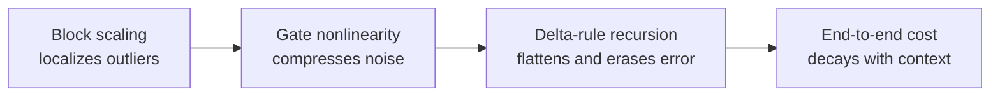

[Paper](https://arxiv.org/abs/2609.04098)
## The Recurrent Half Is the Easy-to-Quantize Half: Why Gated DeltaNet Survives at 4 Bits

**TL;DR** — The 48 recurrent **Gated DeltaNet (GDN)** layers of a hybrid 27B LLM (Qwen3.8-27B) have until now been protected at 8–16 bits, on the intuition that "error accumulates across the context." This paper shows that intuition is **exactly backwards**. `Minima`, which quantizes **all 496 layers — GDN gates included — to NVFP4 W4A4**, matches BF16 within seed noise on 6 benchmarks (5-task average −0.52) while also being the smallest (17.5 GiB) and the fastest at prefill (+14–19%). On top of that, a four-stage mechanistic study delivers an architecture-level account of **why** — block scaling localizes outliers, gate nonlinearity compresses noise, and the delta rule actively erases state error.

---

## Core idea

The paper's central claim fits in one sentence.

> The GDN gate projections (`a`, `b`) that the community has guarded at high precision because it considered them "fragile" are in fact **the safest projections — the ones the architecture already protects on its own**. The recurrent layers are therefore not something to protect but something to **quantize wholesale to 4 bits**.

The authors don't stop at "we tried it and it worked." They explain **why** it works through a four-stage chain: captured activation statistics → per-projection sensitivity replay → FP32 lockstep recursion → position-wise PPL decomposition (source: §5). The result is not a bare quantization recipe but a **mechanistic account of the quantizability of the linear-attention operator class** (source: §8).

---

## Background: the problem they solve

### Where two trends collide

Serving cost has made **W4A4 (4-bit weights and activations) inference** a practical target. NVFP4 — an E2M1 4-bit value, an E4M3 scale per 16-element block, and a per-tensor FP32 scale — runs **natively** on current accelerators (source: §1). In parallel, frontier open models are going increasingly **hybrid**. Qwen3.8-27B has **48 GDN** layers out of 64; only 16 are full attention (source: §1, §2).

But these two trends had not yet met. **Every public 4-bit build** the authors surveyed — and Qwen's own FP8 release — quantizes the MLP aggressively while **protecting the GDN blocks**. In particular, the gate `a`, which controls decay, and the projection `b`, which controls write strength, were left at 8–16 bits (source: §1).

### The intuition behind the protection — and its refutation

The implicit logic of protecting them is natural. Since GDN's state updates recursively,

$$
S_t = \alpha_t S_{t-1} + \beta_t\, k_t\, (v_t - S_{t-1}^\top k_t)^\top, \qquad o_t = S_t^\top\,(q_t/\sqrt{K})
$$

the state $S_t$ spans tens of thousands of tokens. Per-step quantization error, the reasoning goes, will therefore **compound** — and gate error will compound fastest of all (source: §1).

This paper's experiments show the intuition is **reversed for this architecture**. Gate error instead produces the smallest output error, and over a 32K context the state error does not accumulate; it holds a **flat plateau** (source: §5.3).

---

## The new approach: Minima

`Minima` quantizes **all 496 linear layers** of Qwen3.8-27B (GDN 240 + attention 64 + MLP 192) with llm-compressor's NVFP4 W4A4. Only `lm_head`, embeddings, convolutions, and norms are excluded. Calibration runs on a fixed 128-sample × 32K-token set, and the model is served after the global-scale harmonization of §6 (source: §3).

It is compared against two public NVFP4 checkpoints.

- **Unsloth (Dynamic v3)** and **RadixArk (ModelOpt)**: keep GDN and attention at FP8 W8A8, `a`/`b` in BF16, and quantize **only the MLP** to NVFP4.
- **Minima + scales**: Minima plus calibrated FP8 KV-cache scales (§7). This is the actual public checkpoint.

There is one decisive difference. **Only Minima takes the GDN blocks down to 4 bits (5.5B parameters, roughly 23% of decode weight bytes)** (source: §4).

---

## How it works: a concrete walkthrough

Let's follow the four-stage mechanism chain the authors lay out. Every experiment captures the real inputs to the 48 GDN layers while a BF16 model reads eight 32K-token documents, reimplements a single GDN layer in isolation (validated to a relative difference of 6×10⁻³ against the reference implementation), and then injects exactly the 4-bit rounding error via **fake quantization** — quantize → dequantize → continue in high precision (source: §5).

### Stage 1 — The input is not the problem (block scaling localizes outliers)

The simplest hypothesis is that "GDN receives an easier input distribution than attention." **It doesn't.** GDN's projections read the same residual stream as attention (source: §5.1, Table 2). At mid layers, `max/RMS = 63.5`, kurtosis ≈ 1,560, hot channels reach 100× the median, and 10–32% of 16-element blocks are dominated by a single value (32.1% for `out_proj`).

Yet the actual per-token A4 quantization error is **uniform at 7.5–9.2%** across every layer role. The reason is NVFP4's **16-element block scaling**. Because a block's maximum sets that block's scale, an outlier only degrades **its 15 neighbors within its own block**. What is more, the structural bound `max/RMS ≤ √16 = 4` within a block keeps a block from becoming excessively "one-hot" (source: §2). Error is flat across the entire 32K window, independent of position. Robustness, in other words, comes not from **clean data but from what the layer does with the error** (source: §5.1).

### Stage 2 — The protected projections are the safest (gate nonlinearity is the shield)

Each captured layer was quantized **one projection at a time** and replayed (96 replays × 8K tokens), measuring the change in the layer output $y$ (source: §5.2, Table 3). The results overturn the community's precision map.

| variant | GEMM error | 1−α error | β error | state error | output y error |
|---|---:|---:|---:|---:|---:|
| `a` : W4A4 | 11.0% | 7.5% | — | 3.6% | **2.1%** |
| `b` : W4A4 | 8.5% | — | 5.2% | 3.2% | **2.6%** |
| `qkv` : W4A4 | 10.6% | — | — | 12.1% | 10.4% |
| `out` : W4A4 | 12.7% | — | — | 0% | 12.7% |
| `all` : W4A4 | — | 7.5% | 5.2% | 12.6% | 19.2% |

(source: Table 3)

The gate projections `a` and `b` carry the **largest GEMM errors, 11.0% and 8.5%**, yet move the output $y$ the **least — 2.1% and 2.6%**. The shield is the gates' parameterization (source: §2, Eq.1):

$$
g_t = -\exp(A_{\log})\,\mathrm{softplus}(a_t + dt_bias), \quad \alpha_t = e^{g_t} \in (0,1), \quad \beta_t = \sigma(b_t) \in (0,1)
$$

Concretely: even when `a`'s pre-activation carries ~11% error, softplus and exponential compress it down to 7.5% error in $1-\alpha$ and 5.2% in $\beta$. And the recursion (§5.3) survives both. The error Minima actually carries comes not from the gates but from three ordinary GEMMs — `out` (12.7%), `qkv` (10.4%), and `z` (9.9%).

One more thing: the five projections' errors are statistically **independent**, so a root-sum-of-squares estimate from single-projection errors (19.4%) matches the measured value when everything is quantized at once (19.2%). And in every projection, weight error exceeds activation error (source: §5.2).

### Stage 3 — The recursion bounds the noise and then erases it

Does the 12.6% state error from Table 3 grow over a long context? The authors ran one clean trajectory and 11 perturbed trajectories on identical inputs in **lockstep FP32** over 32K tokens (source: §5.3, Fig. 1a). The result is striking.

- State error `relS` is **12.96% at token 256 and 12.31% at token 32,768** — essentially flat. Plateau value 12.6%, peak 14.9%.
- The recursion immediately reaches an equilibrium in which "forgetting and injection balance," and **holds it across the entire window**.

More interesting still is the **forgetting rate**. Inject a single 1% state impulse at $t=1{,}024$: it decays to $1/e$ in **80–1,382 steps**, and to $1/10$ in **~2,200–2,900 steps**. Yet the horizon $1/(1-\alpha)$ implied by these same layers' decays reaches **44K–62K tokens** (source: §5.3, Fig. 1b). The recursion, in other words, erases error far faster than the decay gates alone can explain.

The secret lies in the **delta rule itself**. The write in Eq.(2) does not blindly accumulate $v_t$; it **overwrites with $v_t$ whatever the state predicted along the current key direction $k_t$**. So with every new token, past error is **deleted key by key**. This is not mere decay — it is active erasure (source: §5.3).

Synthetic-noise experiments also pin down the real vulnerability. The state is extremely sensitive to relative noise applied **directly** to $\alpha$. Since $\alpha \approx 1$, a small $\delta\alpha$ is an enormous relative change in the horizon $1/(1-\alpha)$ — **0.1% multiplicative noise produces 22% state error** (source: §5.3, Table 6). But when `a` is quantized, an 11% GEMM error stays a 3.6% state error, because the noise rides the **pre-activation** of Eq.(1) and softplus and exp compress it before it ever reaches the horizon. That is, the **log-space gate parameterization chosen for training stability makes the gates quantization-proof at serving time**. $\beta$ noise is outright harmless (1% noise → 0.4% state error), because the write is self-correcting (source: §5.3).

### Stage 4 — End to end, the context washes the error away

If the mechanism holds, the served model's quantization gap should **not grow** with position. Decomposing the 32K PPL's token-wise NLL by position (source: §5.4, Fig. 2, Table 4):

- The weight-quantization gap (Minima − BF16) is **+0.081 nats** in the first half, **+0.011 nats** in the second, and **−0.053 nats over the final 2K tokens (Minima is better than BF16)**.
- The 4-bit cost is a **per-token effect at short context**, which the filled state absorbs.

The FP8-KV cost, by contrast, shows the **exact opposite** pattern — small, rising with position, and ~3× larger in Minima. That is the signature of an attention-path effect, not a weight effect. §7 removes it with calibrated scales.

---

## Empirical validation: key results

All numbers are measured in a single serving regime (FP8 KV, vLLM 0.27.1, TP=1, one RTX PRO 6000, GPU utilization 0.85) (source: §3).

| Metric | BF16 | **Minima** | Unsloth | RadixArk |
|---|---:|---:|---:|---:|
| PPL @4K / @32K ↓ | 6.95 / 10.35 | 7.67 / 10.84 | 7.16 / 9.91 | 7.35 / 9.95 |
| MMLU-Pro (%) | 80.4 | 79.7 | 78.9 | 79.1 |
| GSM8K (%) | 95.5 | 95.5 | 95.4 | 95.7 |
| AIME'25 (%) | 86.7 | 86.7 | 87.5 | 84.2 |
| GPQA-Diamond (%) | 86.5 | 85.1 | 85.0 | 85.4 |
| LiveCodeBench v6 (%) | 79.0 | 78.5 | 79.9 | 79.6 |
| 5-task avg / Δ | 85.62 | 85.10 / **−0.52** | 85.34 / −0.28 | 84.80 / −0.82 |
| Weight VRAM (GiB) | 50.13 | **17.53** | 20.23 | 18.83 |
| Decode tok/s @32 | 621 | 1,154 | 1,132 | 1,174 |
| TTFT @32K (s) | 6.90 | **4.03** | 4.49 | 4.39 |

(source: Table 1, Table 5)

**Three observations.**

1. **Accuracy matches within seed noise.** The three quantization recipes' 5-task averages span 0.54 points — less than a single AIME problem (3.3 points). Even the largest single-task gap (RadixArk's AIME −2.5) sits inside BF16's own seed variance (83.3–93.3). Minima, even after taking all of GDN to 4 bits, **reproduces BF16's AIME'25 score exactly (26/30 on all four seeds)**. Generation behavior is unchanged too — mean AIME generation tokens of 14,531 vs 14,532, so it does not "think longer," and it actually hits the 32K cap slightly less often (source: §4).

2. **4-bit GDN is a measurable efficiency win.** Minima is 2.9× smaller than BF16 in VRAM/disk and 7–13% smaller than the community builds. On a single card it posts the largest KV budget (1.81M cacheable tokens) and the fastest prefill (TTFT 6.90s→4.03s @32K; +14–19% on 8K prompt throughput). Decode is weight-bandwidth-dominated, so all three quantized models land within 4% (source: §4).

3. **PPL is the honest residual.** Only PPL ranks the recipes: Unsloth < RadixArk < Minima. That is because the community recipes "quantized less and paid for that headroom with 1.3–2.7 GiB of weights." Minima's PPL gap versus BF16 is +0.72 at 4K and +0.49 at 32K — **it shrinks rather than grows**, and it never shows up in any task score (source: §4).

### Key Numbers (summary)

- **Params**: 27B (Qwen3.8-27B) | **Context**: 64K validated | **Hidden**: 5120
- **Architecture**: Hybrid — 48 GDN + 16 attention (64 layers), GDN state $K{=}V{=}128$
- **Quantization**: NVFP4 W4A4 (E2M1 value + E4M3 scale per 16-element block + per-tensor FP32 scale)
- **Quantized scope**: 496 linear layers (GDN 240 = 5×48, attention 64 = 4×16, MLP 192 = 3×64)
- **Serving**: TTFT @32K 4.03 s (BF16 6.90 s) | TPOT @32 ≈ 26.9 ms/token (BF16 49.5) | Decode @32 = 1,154 tok/s (BF16 621)
- **VRAM**: weights 17.53 GiB (BF16 50.13 GiB) | KV cache 1.81M cacheable tokens/card
- **HW**: 1× RTX PRO 6000 (96GB, SM120), TP=1, vLLM 0.27.1
- **Cost**: `$`/1M tokens and energy kWh not reported in the paper

$$
\text{KV-Cache(GB)} \approx
\frac{2 \cdot L \cdot H \cdot d_\text{head} \cdot \text{seq} \cdot \text{batch} \cdot \text{bytes/elt}}{10^9}
$$

> Terminology: **TPOT = Time Per Output Token** (also written "TBT = TPOT" where needed).

---

## Our take: strengths, limitations, and why it matters

### Strengths — past "it works" to "why it works"

The paper's real value lies less in the quantization recipe itself than in the **precision of the mechanistic account behind it**. The synthesis goes like this (source: §5.4):

> Block scaling localizes the residual stream's outliers (§5.1); gate nonlinearity compresses what reaches the control signals (§5.2); delta-rule recursion traps the remaining noise on a plateau and actively erases it (§5.3); so the end-to-end cost shrinks with context (§5.4).

No luck or fine-tuning is involved. The answer is the **gating and correction structure of the architecture itself**. The twist — "the projections the community protects are exactly the ones the architecture already protects" — is crisp and convincing.

A second strength is the **honesty of fixing the measurement pipeline** (source: §6). The global-scale mismatch they found and repaired (per-module calibration vs the fused serving GEMM) was silently poisoning the gates and even produced **falsely better** 32K PPL — the poisoned model degraded to AIME 80.8 while its PPL@32K "improved" to 6.86. This is a trap that applies to **any hybrid NVFP4 deployment that quantizes GDN**. The calibrated FP8 KV scales (§7) recovering 83% of the PPL penalty with no serving cost is a practical dividend as well.

### Limitations — the honest scope

Limitations the authors explicitly acknowledge (source: §9):

- **Scope of evidence.** A single model family and size (Qwen3.8-27B), a single quantization format (NVFP4), up to 32K PPL / 64K retrieval. 128K+ is extrapolation. The bounded-error mechanism predicts longer contexts but is not verified.
- **Conditions of the gate-shield argument.** The §5.3 conclusion rests on the log-space softplus/exponential parameterization. Recurrent mixers whose decay is **linearly parameterized** may not get the same benefit (0.1% direct noise hurts the state).
- **Decode overhead.** Despite having fewer weight bytes, Minima decodes 2–4% slower than RadixArk — a kernel-level issue of small-batch NVFP4 activation quantization, not a property of the recipe itself.
- **Concurrent work.** QUASAR[1]'s QAT checkpoints were not benchmarked because they shipped too late. The authors argue their results show that "no training is needed — calibration-only PTQ reaches BF16-level task accuracy" (source: §8).

Two potential limitations of our own: experiments run on a single GPU (TP=1) only, so how the fused-GEMM scale issue manifests under multi-GPU / tensor-parallel serving remains open, and **total-cost-of-ownership metrics** such as `$`/1M token or energy are absent.

### Why this research matters

- **Practically**: it hands you a one-line recipe — "quantize everything, ship KV scales." Quantize the recurrent half of a hybrid model rather than protecting it is guidance that inverts established practice.
- **Conceptually**: it is arguably the first study to give a **mechanistic explanation of the quantizability of the linear-attention operator class**. Replacing the intuition that "error compounds" with "the delta rule actively erases" deserves to be a reference point for follow-up work.
- **As an engineering warning**: the fused-GEMM global-scale mismatch, composite serving paths, and the invalidation of raw-completion harnesses for thinking models are quiet traps that wreck reproduction and evaluation — a valuable contribution in itself (source: §6).

---

## What's next: the road ahead

1. **Extend the scope.** Stress tests at 128K+ long context, hybrid models of other sizes and families, and generalization to formats beyond NVFP4 (FP6, MXFP) are the immediate follow-ups (source: §9).
2. **Test parameterization generality.** Whether other recurrent mixers with linearly parameterized decay (the Mamba family, and so on) enjoy the gate-shield benefit is the key question. If they do not, that side may still need protection (source: §9).
3. **Push toward lower bits.** The authors' group's concurrent work already brings the full model (embeddings, LM head, and the multi-token-prediction head included) to NVFP4, and takes the MLP down to a 3-bit codebook plus a distillation-healed low-rank residual — with GDN/attention built on this paper's 4-bit results. It reports 12.3 GiB loading (a 4.1× reduction from 50.1 GiB) and 1,200+ tok/s at 128-way concurrency (source: §8).
4. **Reinforce the TCO angle.** Backing the "smallest and fastest prefill" claim with `$`/1M token and energy/carbon metrics would speak more directly to real deployment decisions.

**One-line conclusion:** the recurrent half of a hybrid LLM survives 4-bit quantization because it erases error rather than accumulating it. The guidance for practitioners is short — *the recurrent half is the easy half. Quantize it.* (source: §10)

---

## Reference: reproduction checklist

- [ ] Code/checkpoints: <https://huggingface.co/minima-ai/mnma_qwen3.8_27b_nvfp4> | vLLM 0.27.1, llm-compressor
- [ ] Calibration: fixed 128-sample × 32K-token, fused-GEMM global-scale harmonization applied (§6)
- [ ] Serving: text-only extraction, FP8 KV, TP=1, GPU util 0.85, 32K generation cap
- [ ] Evaluation: chat-template harness (thinking disabled), per-sample validity gates, 4-seed pass@1 for AIME/GPQA
- [ ] PPL@32K compared only after fixing a single serving path and window protocol (beware of context inversion, §6)
