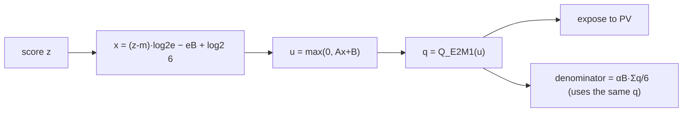

[Paper](https://arxiv.org/abs/2609.04105v1)
## Why Don't FP4 Tensor Cores Make Attention Faster? Blackwell FlashAttention-4, Solved with Direct-P and Quantized Backprop

**TL;DR** — Blackwell's FP4 tensor cores handle matrix multiplication far faster than BF16, but attention does not automatically inherit that benefit, because a "middle operation" — **softmax** — sits between the *two matrix multiplications*. This paper shortens the critical path with **Direct-P**, which reframes softmax probability generation not as a sequential "accurate exponential → round" path but as a problem of **directly classifying scores into E2M1 codes**, achieving up to **2.13×** forward throughput over BF16 on an NVIDIA GB200 (source: §Abstract). For training, backward reuses the quantization state that forward produced to speed a single step of an 8B model by up to **1.14×**, but lowering P/V to MXFP4 makes **every trajectory diverge**, so P/V must be kept in FP8 (source: §7.6).

---

## Core idea

The paper's central claim fits in one sentence.

> Attention's bottleneck is no longer the matrix multiplications but the **softmax middle stage that turns scores into probabilities**, and fixing it requires not *more accurate approximations* but **removing work from the critical path**. FP4 probabilities should therefore be produced by **"code classification" rather than "compute the exponential, then round"**, and the normalization should use the very rounded values that PV actually consumes (source: §3, §4).

The core insight boils down to two *linked* problems (source: §3).

1. **A timing problem** — P is produced *inside* the kernel, so the first valid PV operation must wait on the sequential chain `S → max → scale → probability → E2M1 pack → expose`. FP4 makes QK and PV fast but does not accelerate *score reduction, exponentiation, synchronization, or scale exposure*.
2. **A numeric-range problem** — softmax probabilities live in a range that is *awkward* to carry in a 4-bit payload with a block scale. Preserving the range is expensive; cheapening it underflows whole blocks to zero.

The paper's attitude is to not hide the fact that "the fastest FP4 operating point accepts larger error" and to **measure the speed–accuracy tradeoff honestly** (source: §5.1, §8.5).

---

## Background: the problem they set out to solve

### Attention is "two matrix multiplications + one softmax"

Attention is built from queries $Q$, keys $K$, and values $V$:

$$
S = QK^T / \sqrt{d}, \qquad P = \mathrm{softmax}(S), \qquad O = PV \tag{1}
$$

That is, a softmax sits between the two matrix multiplications, the **QK product and the PV product**. FlashAttention evaluates these quadratic-size matrices $S$ and $P$ **tile by tile** instead of storing them in HBM (source: §1). FlashAttention-4 (FA4) re-targeted that tiled algorithm at Blackwell's **asynchronous matrix hardware** (source: §1).

### On Blackwell, FP4 only accelerates matrix multiplication

Blackwell's FP4 matrix multiplication is much faster than BF16. But softmax must still reduce each tile of scores, evaluate the exponential, build a scaled tile of probabilities, and get it ready for the second product. **The faster the matrix multiplication gets, the more this middle stage becomes the bottleneck** (source: §1).

The key observation the authors cite is this: "removing work that happens *after* the publication does not reduce latency. You must remove work that happens *before* the first valid P tile" (source: §3.1).

### Two FP4 formats and their tradeoffs

FP4 uses an E2M1 (2 exponent bits, 1 mantissa bit) payload. Ignoring the sign, the representable magnitudes are:

$$
F_{E2M1} = \{0,\ \tfrac12,\ 1,\ \tfrac32,\ 2,\ 3,\ 4,\ 6\} \tag{10}
$$

**How this payload is scaled** is what separates the formats (source: §3.2, Table 2):

| Format | Block | Scale | Strength | Role in this paper |
|---|---|---|---|---|
| **NVFP4** | 16 values | E4M3 (fine-grained local batch) | accurate local fit | Q, K |
| **MXFP4** | 32 values | E8M0 (power-of-two amplitudes) | wide exponent range | P, V |

The key difference is **range**. When NVFP4's E4M3 scale rounds to zero, the whole block vanishes (underflow). MXFP4's E8M0 has power-of-two amplitudes, so even tiny probability blocks can be represented without a separate row shift (source: §3.2). Running precision diagnostics on Gaussian softmax probabilities in Table 3, the authors show that **stabilized NVFP4 gives the highest fidelity but needs a per-row range correction, while MXFP4 gives power-of-two scales that align exactly with the N32 production fragments but lays down probabilities more coarsely** (source: §3.2).

So Direct-P chooses **NVFP4 for Q/K and MXFP4 for P/V**.

---

## The new approach: Direct-P

Direct-P's boundary is **narrow and precise**. It keeps the *external schedule* that HAO AI Lab's FP4 FA4 implementation provides (two-query pipeline, TMEM lifetime, issue protocol) **as is**, and changes only the segment between **"a finished FP32 tile of scores" and "a legal FP4 probability operand for PV to consume"** (source: §4.1, Table 4).

Direct-P consists of three linked choices (source: §4.1):

1. **Map normalized scores directly to an E2M1 payload** → shortens the critical path (fixes the timing problem)
2. **Compute the normalization denominator from the very rounded payload that PV consumes** → the numerator and denominator describe a single approximation operator (numeric consistency)
3. **Apply range guards only on layers with extreme logits** → most layers keep the shiftless path

### Fix 1: classify scores directly into E2M1 codes

The standard path computes a relatively accurate exponential and then rounds to one of the 8 E2M1 magnitudes. **That intermediate precision never reaches PV.** Direct-P inverts this, treating probability generation as a *code-classification problem*: it only decides **which E2M1 bin each normalized score falls into** (source: §4.2).

The E2M1 positive codes change value at seven rounding boundaries $\{\frac14,\frac34,\frac54,\frac74,\frac52,\frac72,5\}$. The authors therefore fit an affine classifier in *value space*:

$$
\hat u(x) = \max(0,\, Ax + B), \qquad \hat q(x) = Q_{E2M1}(\hat u(x)) \tag{17}
$$

The fitting objective is not the accuracy of the real-valued exponential but the **E2M1 code-match rate**. The score transform and the $e_B$ and $\log_2 6$ terms are folded into packed FMA coefficients (source: §4.2). The general `fast` fit uses $A{=}1.50,\ B{=}1.20$; the Wan-model activation evaluation uses $A{=}1.60,\ B{=}0.95$ (source: §4.2). Two-lane FMAs (FFMA2) and the native conversion (F2FP) emit the E2M1 payload, and selected locations can use Blackwell's native base-2 exponent instruction `EX2` (source: §4.2).

### Fix 2: normalize the "represented probabilities"

If the numerator (the output) uses rounded FP4 probabilities, then using an independently approximated FP32 sum of exponentials as the denominator mixes two different operators. Direct-P accumulates the denominator **from the same codes and block scale that PV actually consumes** (source: §4.3):

$$
\tilde N_{iB} = \frac{\alpha_B}{6}\sum_{j\in B} q_{ij}\hat V_j, \qquad \tilde L_{iB} = \frac{\alpha_B}{6}\sum_{j\in B} q_{ij}, \qquad \tilde O_i = \frac{\sum_B \tilde N_{iB}}{\sum_B \tilde L_{iB}} \tag{19--21}
$$

In other words, the numerator and denominator describe **exactly the same represented operator**. Four packed payload words are reduced with byte permutes and DP4A (4-way integer dot product) (source: §4.3).

### Fix 3: guard only the extreme-logit layers

The fast shiftless path stays finite on synthetic grids and on most layers, but some late Wan layers see BF16 logits exceeding 500, even 1000. Scanning and reloading every score would erase the speed advantage. So **only those layers** are routed through Algorithm 3 (source: §4.4).

The real cause of the original layer-39 failure was not a missed anchor: the expression $(s/6)\sum_i c_i$ produced a **subnormal intermediate** at E8M0 code 1 and was flushed to zero. Algorithm 3 re-associates it as $s\,(\sum_i c_i/6)$, resolving it without a second scan, a new barrier, or a stable-softmax fallback (source: §4.4).

### Two operating points

| Policy | K/V stages | Anchor | Native EX2 | Denominator | Goal |
|---|---|---|---|---|---|
| **fast** | 12 | none by default | 0 on GB200 | producer | minimum latency |
| **accurate** | 13 | 32 fixed rows | ~25% | corrected WG | high fidelity |

(source: Table 5)

---

## How it works: a concrete example

Let's trace the core algorithm through one small example (source: §4.2, Algorithm 2). For clarity, we assume a block of 4 keys.

### Standard path vs. Direct-P path

The standard path is serial:

Direct-P compresses that chain into **a single classification**:

### A worked numeric example

For the 4 keys of one query row, suppose the exponents of the scores normalized by subtracting the row max $m$ are:

| Key $j$ | $\exp(z_j - m)$ (exact) | Target E2M1 code $q_j$ | Represented probability $q_j/6$ |
|---:|---:|---:|---:|
| 1 | $1.000$ | $6$ | $1.000$ |
| 2 | $0.667$ | $4$ | $0.667$ |
| 3 | $0.333$ | $2$ | $0.333$ |
| 4 | $0.167$ | $1$ | $0.167$ |

Here the probabilities land exactly on the E2M1 grid, so the **error is 0**. The block magnitude is $\alpha_B = 1$ ($e_B = 0$) and the reconstruction step is $\delta_B = 1/6$.

The standard path computes $\exp$ accurately and then rounds to obtain $q$; Direct-P instead forms $x = (z_j - m)\log_2 e + \log_2 6$, pushes it through the affine map $u = \max(0, Ax+B)$, and **directly** emits $q = Q_{E2M1}(u)$. The "accurate exponential" intermediate never reaches PV anyway, so Direct-P simply never builds it (source: §4.2).

The denominator also accumulates with the same $q$: $\sum_j q_j = 6 + 4 + 2 + 1 = 13$, hence $\tilde L = 13/6$. This matches the exact denominator $\sum \exp = 1 + 2/3 + 1/3 + 1/6 = 13/6$. **Because the numerator and denominator use the same rounded values, the approximate operator is a single internally consistent operator** (source: §4.3).

### Why the critical path shrinks

The crux is that in HAO's two-query schedule, PV must wait until **two adjacent N32 fragments (i.e., K64)** are complete (source: §2.5). Direct-P reduces the *upstream work* needed to produce those two fragments, so the first legal K64 operand appears sooner. Conversely, removing any amount of work that happens *after* that exposure does not reduce latency (source: §3.1, §8.3).

---

## Performance validation: key results

The results split into two branches: **forward inference** and **causal training**. Forward trades error for speed; training decides whether that error breaks convergence.

### Forward: up to 2.13×, with honest error accounting

Across 9 GB200 D128 shapes, `fast` is **2.023× faster on a geometric mean** than HAO BF16 and peaks at **2998 TFLOP/s**; `accurate` reaches 1.669× and 2416 TFLOP/s (source: §6.1). At S32768/H24, `fast` runs 4.400448 ms (2998 TFLOP/s), beating HAO's published 2018 TFLOP/s on B200 and 2677 TFLOP/s on GB300 (source: §6.1).

The price of speed is **error**. HAO NV/FP8 has a mean cosine of **0.9899**, versus **0.9438** for `fast` and **0.9517** for `accurate` (source: §6.1). Figure 3 shows this tradeoff: FP8 PV needs no E2M1 payload or block-scale page and is more accurate, while all-FP4 is faster but pays a larger error.

On B300 (SM103), D128 latency drops a further **5.6–7.7%** in the S4096–S8192 range. The standard S8192/H64 shape hits **3116 TFLOP/s** and the wave-aligned S9472/H64 shape hits **3159 TFLOP/s** (source: §6.1).

### How error propagates in real models

The practical question is how operator error propagates to the end of a model. On ViT at S4096, `fast` **keeps BF16 top-1 accuracy (88.5%)** with a 95.5% prediction-agreement rate, while `accurate` achieves 89.0% and 98.5% (source: §6.3, Table 8). Of 2272 classification examples, `fast` changes 32 predictions, and 31 of those are concentrated in the **bottom quartile of the BF16 top-2 logit margin** — only low-confidence predictions move (source: §6.3).

On Wan2.1 video diffusion, `fast` is **1.75×** faster at 1.3B and **2.09×** faster at 14B. Over 20 steps, though, the 14B cosine decays to 0.8496 — more accumulated drift than HAO NV/NV (0.9036). The error is bounded, but it does accumulate (source: §6.4, Table 9).

On ViT-MAE image reconstruction, `fast` lands at PSNR **−0.020±0.026 dB** and reconstruction cosine **0.99973**, staying close to BF16 even after all 12 layers. The residual only becomes visible when amplified 8× (source: §6.5, Table 10).

### Training: backward reuses forward's quantization

Training adds three constraints: causal masking, GQA, and recovering gradients without materializing the $S\times S$ matrix (source: §7). Forward stores the NVFP4 Q/K payload bytes, block scales, and the LSE normalizer; backward **reconstructs** the probabilities by recomputing $QK^T$ from those (source: §7.1).

The results are split by measurement boundary (source: §7.3–7.7):

| Boundary | BF16 | Quantized path | Speedup |
|---|---:|---:|---:|
| Isolated D128 causal backward (reconstruction core) | 0.501 ms | 0.356 ms | **1.405×** |
| + E5M2 dO / statistics emitters | 0.501 ms | 0.508 ms | 0.986× |
| Backward only, incl. projections | 1.572 ms | 1.397 ms | **1.125×** |
| Forward + backward, incl. projections | 2.656 ms | 2.133 ms | **1.245×** |
| 8B full update B1 | 260.313 ms | 239.985 ms | 1.085× |
| 8B full update B2 | 464.245 ms | 415.532 ms | 1.117× |
| 8B full update B4 | 854.516 ms | 751.722 ms | **1.137×** |

(source: Table 12–14)

The lesson is clear here. The reconstruction core alone shows a flashy 1.405×, but **the E5M2 dO and row-statistics emitters that training safety demands swallow almost all of that saving** (0.986×). That is why one "fast backward kernel" cannot predict end-to-end gains (source: §7.3).

The 8B full update gains more as the GPU fills up: B1 1.09× → B4 1.14×. On the FP8 P/V path, B4 throughput rises from **19,173 → 21,795 tokens/s** and FLOP utilization from **41.12% → 46.74%** (source: §7.5).

### Training stability picks FP8 P/V

MXFP4 P/V was fast in the forward pass. But in long training, **every tested MXFP4 P/V trajectory diverges**. In the 4-arm cross diagnosis (projection format × P/V format), the two MXFP4 arms split from the FP8 control by update 500 (131.1M tokens): loss **7.97** vs. **5.41**, with pre-clipping gradient norms spiking into the **millions** (source: §7.6, Appendix G.8). The two FP8 arms, meanwhile, descend without divergence through the shared observation horizon of 55.5B tokens.

**The training path therefore keeps P/V in FP8** — rather than running "fully FP4 training," it takes the gains that come from handing forward quantization to backward, conceding numeric ground only on P/V (source: §8.6).

### Matched distributed training: 100B tokens

On 64 GPUs with global batch 1024 and a 100B-token schedule, the BF16 and FP8 paths complete the same course on **identical data coordinates**. Final training loss is **2.3095 (BF16) vs. 2.3613 (FP8)**; held-out validation at the same update is **2.3048 vs. 2.3948** (gap **0.0900**) (source: §7.7).

Throughput rises **1.112×**, from a median **21,853 → 24,303 tokens/s/GPU** over 874 aligned observations (source: §7.7, Figure 11). The FP8 trajectory is **stable and descending but not numerically identical to BF16** — and since this gap changes both projection and attention, it cannot be attributed to attention alone (source: §7.7).

### Hardware diagnosis: the real bottleneck isn't arithmetic

Three hardware conclusions are backed by measurements (source: §8, Table 15):

1. **TMEM ownership caps the overlap.** Two FP32 score banks plus two FP32 output accumulators occupy all $4\times128 = 512$ columns. Cutting shared memory from 209,920 to 163,840 bytes did not raise CTA occupancy (source: §8.1).
2. **Low tensor activity is a symptom of "not ready."** Even executing the same 98,304 tensor instructions, the real probability path keeps tensor-pipe activity at just **18.8%** (source: §8.2).
3. **Faster arithmetic doesn't speed up the whole kernel.** A fixed-P diagnostic that removes almost all probability generation cuts latency by only **5.23%** (source: §8.3).

### Key Numbers (summary)

- **Params**: 8.03B (Llama-3.1 style, 32 layers, 32 Q-heads / 8 KV-heads / D128) — for the training experiments
- **Context/Seq**: S4096 (training), S7680 (Wan inference), up to S32768 (benchmarks)
- **Architecture**: FlashAttention-4 attention kernel (tiled + online softmax), GQA 32:8
- **Positional**: RoPE (applied at the projection-inclusive boundary) | **Attention**: Flash/online softmax, two-query two-CTA schedule
- **Forward performance**: GB200 `fast` 2998 TFLOP/s (geometric-mean 2.023× over BF16, up to 2.13×) | B300 S8192/H64 3116, S9472/H64 3159 TFLOP/s
- **Forward error**: `fast` cosine 0.9438 / rel-L2 0.3366, `accurate` 0.9517 / 0.3272 (vs. HAO NV/FP8 0.9899)
- **Training speedup**: 8B full update B4 1.137× (FP8 P/V), attention incl. projections 1.245×, distributed throughput 1.112×
- **Training scale**: 64 GPUs, global batch 1024, 100B tokens completed, validation gap +0.0900
- **HW**: GB200 (SM100, 152 SMs) / B300 (SM103, 148 SMs), TMEM 256 KB/SM (identical)
- **Cost / Energy**: `$`/1M tokens, kWh/1M tokens — not reported in the paper

$$
\text{KV-Cache(GB)} \approx
\frac{2 \cdot L \cdot H \cdot d_\text{head} \cdot \text{seq} \cdot \text{batch} \cdot \text{bytes/elt}}{10^9}
$$

> Terminology: **TPOT = Time Per Output Token** (written alongside as "TBT = TPOT" where relevant). Because this is a kernel/operator-level study, the paper reports performance in **TFLOP/s, ms, and tokens/s** rather than TPOT/TTFT.

### SOTA comparison (same setting, forward D128)

| Shape | Provider | Time (ms) | TFLOP/s | cosine | rel-L2 | vs BF16 |
|---|---:|---:|---:|---:|---:|---:|
| H24/S4096 | TK NV/MX fast (GB200) | 0.0922 | 2237 | 0.9438 | 0.3363 | ~2.02× |
| H24/S4096 | HAO NV/FP8 (GB300) | — | 2046 | 0.9899 | — | — |
| H24/S32768 | TK NV/MX fast (GB200) | 4.4004 | 2998 | 0.9429 | 0.3389 | 2.13× |
| H24/S32768 | HAO NV/FP8 (GB300) | — | 2677 | 0.9899 | — | — |
| H64/S8192 | TK NV/MX fast (B300) | 0.7057 | 3116 | 0.9441 | 0.3349 | 2.125× |

(source: Table 7, Figure 4)

---

## Our take: strengths, limitations, and why it matters

### Strengths — honest boundary separation and a sharp view of the critical path

The paper's greatest strength is being explicit about **what it does not claim**. By separating measurement boundaries cell by cell — forward kernel / isolated backward / attention incl. projections / full 8B update / distributed trajectory — it forecloses the "fast kernel = fast model" simplification from the start (source: §5, Table 6). The fact that the backward reconstruction core's 1.405× is eaten by the E5M2 emitters down to 0.986×, for example, would never have surfaced without that separation (source: §7.3).

The second is the crisp framing of **"work on the critical path" vs. "work after it."** The measurement that a fixed-P diagnostic leaves only 5.23% shows that the next bottleneck for FP4 attention is not *a more accurate polynomial approximation* but **a larger overlap window** (source: §8.3, §8.4). This is data that breaks the naive expectation of "just make the arithmetic faster."

Third is the **scientific value of the divergence experiments**. Showing that MXFP4 P/V is fast in forward but diverges in training — and using a factorial design that crosses it with both projection formats to pin the *common factor on the P/V representation* — is, together with the lesson "don't mistake a fast timing bracket for a convergence result," a very valuable result (source: §7.6, Appendix G.8).

### Limitations — an honest scope

Limitations the authors explicitly acknowledge (source: §8.5):

- **Boundary of the evidence.** Training comparisons run **one trajectory per route**, so run-to-run variance and statistical equivalence cannot be estimated. Projection precision (E4M3 vs. NVFP4) is also a separate boundary, so the 0.0900 validation gap cannot be attributed to attention alone.
- **Shape dependence.** The hardware conclusions are limited to D128. D64 uses entirely different tile sizes, CTA ownership, and TMEM overlap strategies and should not be extrapolated (source: §8.5, Appendix A.6).
- **Fully FP4 training remains incomplete.** P/V and backward still concede to FP8. The fully FP4 training path merely proposes UE5M3 block scales as separate research and does not evaluate them here (source: §8.6).

Adding a potential limitation: this is a **single-author technical report**, and whether `fast`'s ~0.34 relative-L2 level of error stays harmless on real downstream tasks has only been verified on a limited set of fixed inputs for ViT/BERT/Wan. The margin mechanism — "31 of 2272 examples fall in the low-margin quartile" — is persuasive, but the sample is too small to establish universal inference or training safety (source: §6.3).

### Why this work matters

- **Practically**: it shows that when you "make attention fast with FP4," the bottleneck is not the matrix multiplication but the softmax middle stage — and it supplies both the fix (code classification + represented normalization + selective guards) and its cost (error).
- **As an engineering warning**: the two 256× scale bugs (the LSE lift `+8` and the dO epilogue `1/256` correction) and the E4M3 issue of rounding 97% of dO to zero are traps anyone implementing low-precision attention training will step on (source: Appendix G.2).
- **As a hardware pointer**: "one more allocatable score bank," "K32 scaled-FP4 PV," and "scales outside TMEM" are concrete candidates derived from the measured dependencies (source: §8.4).

---

## What's next: the road ahead

1. **Fully FP4 training.** A separate study shows that UE5M3 (unsigned E5M3) block scales keep the E2M1 payload while providing a far wider scale range, enabling stable FP4 language-model pretraining. Applying this to the P/V product and the backward gradient product is a promising path to fully FP4 training, but it needs an efficient hardware implementation (source: §8.6, [6]).
2. **Widen the overlap window.** Once Direct-P shortens probability generation, the measured conclusion is that **a larger allocatable overlap window** is worth more than *yet another polynomial approximation*. A score destination that "the next QK can use while PV is still consuming" is the leading candidate design (source: §8.4).
3. **Shape generalization.** D64 and other regimes need their own tile, ownership, and overlap strategies, so the D128 schedule should not be extrapolated. Extending to those shapes is follow-up work (source: §8.5).
4. **Statistical robustness.** The single-trajectory distributed experiments should be extended to multiple seeds to quantify the run-to-run variance of the 0.0900 validation gap and whether the FP8 path is statistically equivalent (source: §8.5).

**Bottom line:** on Blackwell, FP4 makes matrix multiplication 4× faster, but attention's bottleneck has already shifted to the softmax side. Direct-P shortens the critical path with the idea "don't compute an accurate exponential — classify the E2M1 code directly," gaining over 2× forward throughput; for training, it takes the gains of handing forward quantization to backward while showing that P/V must remain in FP8. **The point is not arithmetic speed but the overlap window** (source: §8.6).

---

## Reference: reproduction checklist

- [ ] Code/commits/license: `github.com/MrHuff/fp4-fa4` (TK forward/backward kernels, CuTe-DSL comparison kernels, experiment setup, evidence artifacts)
- [ ] Generate measurement graphs: `python3 tools/plan_fa4_measurements.py list` / `print --family noncausal-forward|downstream|...`
- [ ] Required operand contract: `--nv-qk-fold-k64-scales both --nv-qk-fold-scale-select mse` (K64 Q/K scale folding); `accurate` additionally requires a fixed 32-row K/V permutation
- [ ] Hardware/software: GB200 (SM100)/B300 (SM103), CUDA 13.0, CUTLASS DSL, seed 20260814
- [ ] Evaluation metrics: cosine / relative-L2 / RMSE, 300 ms warm-up + 3000 ms median window (some B300 runs use repeated windows)
- [ ] Training setup: fused AdamW, dense cross entropy (CCE disabled, `torch.compile`), B∈{1,2,4}, S4096, 10 warm-up + 21 measurement steps
- [ ] Distributed: 64 GPUs, global batch 1024 (local 4 × 4 accum), 100B tokens, checkpoint resume supported
- [ ] Evidence integrity: JSON manifest + SHA256 receipts (`receipts/…json`), W&B history frozen read-only

<!-- verbatim-tables -->

## Tables from the paper

> Tables converted mechanically from the arXiv e-print LaTeX source. The numbers are the paper's own and did not pass through a model.

**Table 1. Selected B300 D64 format diagnostics. NV/MX is the retained finite route. NV/NV timings are shown only to explain the rejected control and must not be treated as production performance when the status is non-finite.**

| $H$ | $S$ | NV/MX ms | NV/MX TFLOP/s | NV/MX Cosine | NV/MX Rel.-$L_2$ | raw NV/NV ms | raw NV/NV Cosine | raw NV/NV Rel.-$L_2$ | Status |
|---|---|---|---|---|---|---|---|---|---|
| 12 | 4096 | 0.066528 | 775 | 0.955818 | 0.295719 | 0.070464 | 0.962281 | 0.278304 | finite |
| 24 | 4096 | 0.093248 | 1105 | 0.955551 | 0.296653 | 0.099296 | 0.962063 | 0.279040 | finite |
| 24 | 32768 | 4.601808 | 1434 | 0.956089 | 0.295010 | 4.842496 | 0.962065 | 0.279155 | finite |
| 32 | 2048 | 0.039872 | 862 | 0.954553 | 0.299511 | 0.039968 | 0.961772 | 0.280428 | finite |
| 32 | 32768 | 6.115360 | 1438 | 0.957303 | 0.291325 | 6.465520 | -- | -- | non-finite |
| 64 | 1024 | 0.025568 | 672 | 0.952035 | 0.306387 | 0.025632 | 0.960558 | 0.286304 | finite |
| 64 | 4096 | 0.207840 | 1323 | 0.955838 | 0.295956 | 0.218176 | 0.962128 | 0.278683 | finite |
| 64 | 32768 | 12.223360 | 1439 | 0.957248 | 0.291501 | 12.919808 | 0.962800 | 0.276050 | finite |

**Table 2. Shiftless TK NV/NV failure on model activations. Overflow is the fraction of N32 P scales above E4M3's maximum before encoding.**

| Task | Failed sample | Non-finite rows | Shiftless overflow (%) | Shiftless max | Stable overflow (%) | Stable max |
|---|---|---|---|---|---|---|
| ViT S256 | 1 | 2,560 | 8.146 | 1.828e+37 | 0.000 | 0.166667 |
| ViT S1024 | 1 | 127,950 | 8.137 | 5.332e+37 | 0.000 | 0.166667 |
| ViT S4096 | 1 | 539,442 | 7.511 | 5.669e+37 | 0.000 | 0.166667 |
| BERT MLM S256 | 1 | 167 | 1.721 | 5.279e+04 | 0.000 | 0.166667 |
| BERT MLM S512 | 1 | 49,613 | 1.063 | 5.655e+04 | 0.000 | 0.166667 |
| BERT SST-2 S256 | 1 | 21,717 | 1.465 | 4.493e+03 | 0.000 | 0.166667 |

**Table 3. Measured TK NV/MX tuning points on B300. Every row reports speed and error from the same output.**

| Variant | Grid | EX2 density | Time (ms) | TFLOP/s | Cosine | Rel.-$L_2$ | RMSE |
|---|---|---|---|---|---|---|---|
| B300 compatibility | 152 | 0 | 0.123872 | 1664 | 0.943964 | 0.335825 | 0.008716 |
| B300 density 0 | 148 | 0 | 0.093216 | 2212 | 0.943964 | 0.335825 | 0.008716 |
| B300 density 1 | 148 | 1 | 0.097248 | 2120 | 0.947037 | 0.325258 | 0.008442 |
| B300 density 2 | 148 | 2 | 0.097280 | 2119 | 0.950069 | 0.314812 | 0.008171 |
| B300 density 4 | 148 | 4 | 0.111584 | 1848 | 0.956047 | 0.294037 | 0.007632 |

**Table 4. Major rejected directions. A timing tie is not promoted when it adds synchronization, storage, or numerical risk.**

| Direction | Intended benefit | Observed failure mechanism |
|---|---|---|
| Half-tile QK/PV | Larger tensor work and easier overlap | Delayed first publication and increased live tensor-memory pressure; did not beat N32 production with K64 consumption. |
| Deeper dynamic scheduler | Exploit QK running one logical step ahead | Polls, proxy signals, and policy branches added control work without creating a legal score destination. |
| Full or QK-only two-CTA | Accelerate QK and increase occupancy | Cluster-wide readiness and scale lifetime coordination overwhelmed QK savings; QK-only did not remove single-CTA P/PV ownership. |
| Extra barriers or offload WG | Remove full-CTA rendezvous | Duplicate score loads and handoff mailboxes cost more than the hidden work; concurrent TMEM writes produced invalid output. |
| Alternate TMEM layouts | Add a second useful score/P slot | Two 128-column scores plus two 128-column outputs already consume 512 columns. Scale compression freed fragments, not another legal 128-column bank. |
| BF16/FP16 partial accumulator | Halve output columns | Local scaled-FP4 tensor instructions accumulate into FP32 TMEM; casting between issues did not change the accumulator contract. |

**Table 5. Major rejected directions (continued).**

| Direction | Intended benefit | Observed failure mechanism |
|---|---|---|
| Initial NVFP4 projection path | Extend FP4 tensor throughput across the learned attention projections | Isolated D128 attribution found much larger projection error than E4M3 around an otherwise faithful attention core. We dropped that implementation, not the format: later distributed experiments use NVFP4 projections as the higher-throughput arm. This result says nothing about NVFP4 Q/K inside attention. |
| Raw FP4 or coarse 2-D scales | Remove scale pages | Raw E2M1 loses the four-times-class block-scaled primitive. A single 32$\times$32 scale cannot be applied after a reduction whose block product scales vary with K. |
| Direct code classifier | Eliminate packed conversion | Threshold trees, integer conversion, LUT access, LOP3, and PRMT packing generated more SASS than packed FFMA2 plus native F2FP. |
| Intermediate NV/MX policy | Add an anchor without the correction warpgroup | At S4096/H24 it measured 0.094560 ms, slower than fast, while its 0.356700 relative-$L_2$ was worse than both fast and accurate. Its long-ViT agreement only tied accurate, leaving no Pareto value. |
| Quadratic/cubic throughput path | Improve code fit | A Q0 quadratic raised static FFMA2 count from 128 to 160, measured 0.097888 ms, and reduced cosine on its test. |
| Sampled max/denominator | Shorten P preparation | Eight-of-32 samples saved less than 0.5$\,\mu\mathrm{s}$\ with substantial error; fewer samples were unstable. |
| Structured sparse PV | Increase tensor throughput | Blackwell's sparse FP4 path uses logical K128, losing the early K64 handoff; value-aware selection added too many instructions. |
| Tail interleaving | Pull Q3 work under Q2/PV latency | Added 1.4--3.2$\,\mu\mathrm{s}$; the contiguous Q2-then-Q3 schedule was locally better. |
| Streaming denominator | Hide exact denominator reduction | Preserved output exactly but slowed the clean fast build by 2.11% and 1.83%. |

**Table 6. Complete fixed-schedule format matrix. Each row reports latency and output error together; no timing is paired with accuracy from another run.**

| Shape | Provider | Time (ms) | Speedup | Cosine | Relative-$L_2$ | RMSE |
|---|---|---|---|---|---|---|
| B1/S256/H16 | TK NV/NV fixed schedule | 0.010560 | 1.165$\times$ | 0.952388 | 0.320599 | 0.032716 |
|  | TK MX/NV fixed schedule | 0.010528 | 1.169$\times$ | 0.948314 | 0.320161 | 0.032672 |
|  | TK NV/MX fixed schedule | 0.010880 | 1.131$\times$ | 0.929613 | 0.373055 | 0.038069 |
|  | TK MX/MX fixed schedule | 0.010528 | 1.169$\times$ | 0.924689 | 0.380760 | 0.038856 |
|  | HAO NV/NV | 0.014336 | 0.858$\times$ | 0.982173 | 0.188921 | 0.019279 |
|  | HAO BF16 | 0.012304 | 1.000$\times$ | 1.000000 | 0.000000 | 0.000000 |
| B1/S1024/H24 | TK NV/NV fixed schedule | 0.018240 | 1.245$\times$ | 0.960499 | 0.285533 | 0.014735 |
|  | TK MX/NV fixed schedule | 0.018176 | 1.249$\times$ | 0.953730 | 0.301114 | 0.015539 |
|  | TK NV/MX fixed schedule | 0.018432 | 1.232$\times$ | 0.946337 | 0.323387 | 0.016688 |
|  | TK MX/MX fixed schedule | 0.018432 | 1.232$\times$ | 0.937614 | 0.350956 | 0.018111 |
|  | HAO NV/NV | 0.033152 | 0.685$\times$ | 0.981844 | 0.190610 | 0.009836 |
|  | HAO BF16 | 0.022704 | 1.000$\times$ | 1.000000 | 0.000000 | 0.000000 |
| B1/S2048/H24 | TK NV/NV fixed schedule | 0.041248 | 1.492$\times$ | 0.961651 | 0.281034 | 0.010218 |
|  | TK MX/NV fixed schedule | 0.041632 | 1.478$\times$ | 0.954486 | 0.298556 | 0.010855 |
|  | TK NV/MX fixed schedule | 0.042080 | 1.463$\times$ | 0.948649 | 0.317135 | 0.011531 |
|  | TK MX/MX fixed schedule | 0.041280 | 1.491$\times$ | 0.939444 | 0.347612 | 0.012639 |
|  | HAO NV/NV | 0.072112 | 0.854$\times$ | 0.981680 | 0.191501 | 0.006963 |
|  | HAO BF16 | 0.061552 | 1.000$\times$ | 1.000000 | 0.000000 | 0.000000 |
| B1/S4096/H24 | TK NV/NV fixed schedule | 0.104000 | 1.585$\times$ | 0.962721 | 0.276316 | 0.007167 |
|  | TK MX/NV fixed schedule | 0.102688 | 1.605$\times$ | 0.955444 | 0.295344 | 0.007660 |
|  | TK NV/MX fixed schedule | 0.104032 | 1.584$\times$ | 0.950622 | 0.311853 | 0.008088 |
|  | TK MX/MX fixed schedule | 0.102976 | 1.600$\times$ | 0.941142 | 0.343985 | 0.008922 |
|  | HAO NV/NV | 0.192512 | 0.856$\times$ | 0.981894 | 0.190474 | 0.004940 |
|  | HAO BF16 | 0.164800 | 1.000$\times$ | 1.000000 | 0.000000 | 0.000000 |
| B1/S4096/H64 | TK NV/NV fixed schedule | 0.227328 | 1.631$\times$ | 0.962449 | 0.277441 | 0.007171 |
|  | TK MX/NV fixed schedule | 0.235616 | 1.573$\times$ | 0.955133 | 0.296365 | 0.007660 |
|  | TK NV/MX fixed schedule | 0.232128 | 1.597$\times$ | 0.950186 | 0.313010 | 0.008090 |
|  | TK MX/MX fixed schedule | 0.234112 | 1.583$\times$ | 0.940680 | 0.345061 | 0.008918 |
|  | HAO NV/NV | 0.438192 | 0.846$\times$ | 0.981743 | 0.191187 | 0.004941 |
|  | HAO BF16 | 0.370688 | 1.000$\times$ | 1.000000 | 0.000000 | 0.000000 |
| B1/S8192/H64 | TK NV/NV fixed schedule | 0.861792 | 1.870$\times$ | 0.962801 | 0.276083 | 0.005045 |
|  | TK MX/NV fixed schedule | 0.905248 | 1.780$\times$ | 0.955295 | 0.295814 | 0.005405 |
|  | TK NV/MX fixed schedule | 0.888832 | 1.813$\times$ | 0.950828 | 0.311299 | 0.005688 |
|  | TK MX/MX fixed schedule | 0.903488 | 1.784$\times$ | 0.941102 | 0.344364 | 0.006292 |
|  | HAO NV/NV | 1.693696 | 0.951$\times$ | 0.981700 | 0.191467 | 0.003499 |
|  | HAO BF16 | 1.611488 | 1.000$\times$ | 1.000000 | 0.000000 | 0.000000 |

**Table 7. Accuracy-matched B300 control. Superscript p marks HAO-published cross-run values.**

| Provider | Time (ms) | TFLOP/s | Cosine | Relative-$L_2$ |
|---|---|---|---|---|
| TK NV/MX fast | 4.481 | 2945 | 0.9429 | 0.3389 |
| TK NV/FP8 optimized | 7.584 | 1740 | 0.9573 | 0.2913 |
| TK NV/FP8 exact | 8.854 | 1490 | 0.9897 | 0.1433 |
| HAO NV/FP8p | 4.929 | 2677 | 0.9899 | -- |
| HAO BF16p | 8.607 | 1533 | 1.0000 | -- |

**Table 8. Internal backward version map.**

| Label | Main purpose | Outcome |
|---|---|---|
| v416 | D64 native owner schedule | Like-for-like parity with the generated native-exponential reference; used in early 1.2B integration. |
| v454/v482 | D128 B1/B2 ownership, rounded-P reuse, and early tensor-memory release | 1.21--1.24$\times$ faster than the matched generated reference. |
| v501 | Corrected LSE lift, shape-specific clearing, and represented E4M3 gradient operands | Finite short-run systems prototype and basis of the historical 8B bracket. |
| v503 | Common-row MXFP4 V approximation in backward | Faster than the first MX attempt and tied end to end; the complete recipe failed its observed distributed numerical gate, but the consumer was not isolated as the cause. |
| v506/v507 | Direct shared-MX producer and exact four-anchor consumer | Numerically useful controls, but too slow for the production gate. |
| v509 | Exact forward NVFP4 score reconstruction with E5M2 dO | Retained quantized causal-backward implementation; exact-batch B1/B2/B4 binaries are validated for the Llama-style D128 shape. |

**Table 9. Historical isolated D64 causal backward on GB200. The low-precision route is a generated CuTe kernel; both columns include required output clears.**

| Sequence | Exact BF16 | Low precision | Speedup |
|---|---|---|---|
| 512 | 111.456 $\mu$s | 102.176 $\mu$s | 1.091$\times$ |
| 1024 | 149.504 $\mu$s | 138.560 $\mu$s | 1.079$\times$ |
| 2048 | 203.808 $\mu$s | 189.632 $\mu$s | 1.075$\times$ |
| 4096 | 347.104 $\mu$s | 319.808 $\mu$s | 1.085$\times$ |
| 8192 | 879.168 $\mu$s | 770.848 $\mu$s | 1.141$\times$ |
| 16384 | 2765.984 $\mu$s | 2621.376 $\mu$s | 1.055$\times$ |

**Table 10. Historical isolated D128 causal backward at S4096/Hq32/Hkv8 on GB200. The native column is the v454/v482 predecessor family.**

| Shape | Generated reference | Native schedule | Speedup |
|---|---|---|---|
| B1/D128 | 381.376 $\mu$s | 315.360 $\mu$s | 1.209$\times$ |
| B2/D128, rotation A | 620.032 $\mu$s | 514.272 $\mu$s | 1.206$\times$ |
| B2/D128, rotation B | 639.328 $\mu$s | 515.040 $\mu$s | 1.241$\times$ |

**Table 11. Historical saturated single-GPU brackets. Each speedup is valid within its row group but must not be transferred to the final training recipe.**

| Model/shape | Attention route | Update time | Versus BF16 |
|---|---|---|---|
| 1.2B, B16/S4096 | BF16 FA4 | 673.396 ms | 1.000$\times$ |
|  | NVFP4-QK + FP8-PV | 615.682 ms | 1.094$\times$ |
|  | NVFP4-QK + MXFP4-PV | 614.842 ms | 1.095$\times$ |
| 8B, B2/S4096 | BF16 FA4 | 489.821 ms | 1.000$\times$ |
|  | NVFP4-QK + FP8-PV | 434.014 ms | 1.129$\times$ |
|  | NVFP4-QK + dual-published MXFP4-PV | 435.992 ms | 1.124$\times$ |

**Table 12. Initial frozen rolling-log cutoff, retained for provenance. Jobs began at different times, so these are status observations rather than aligned loss or throughput comparisons.**

| Projections | Forward P/V | Update | Tokens | Loss | Grad norm | Status |
|---|---|---|---|---|---|---|
| E4M3 | FP8 | 10,381 | 2.721B | 2.9743 | 0.2197 | working at cutoff |
| E4M3 | MXFP4 | 10,075 | 2.641B | 8.8265 | 358,400 | diverged |
| NVFP4 | FP8 | 10,884 | 2.853B | 3.1637 | 0.2051 | working at cutoff |
| NVFP4 | MXFP4 | 11,061 | 2.900B | 8.4801 | 3,915,776 | diverged |

**Table 13. Reader's guide to the main notation and Blackwell hardware terms.**

| Term | Meaning |
|---|---|
| $B,S,H,H_q,H_{kv},D$ | Batch size, sequence length, head count, query-head count, key/value-head count, and per-head dimension. |
| Shape shorthand | Compact labels append each value: B1/S4096/H24/D128 means batch 1, sequence length 4096, 24 heads, and head dimension 128. |
| FP32, BF16, FP8, FP4 | 32-, 16-, 8-, and 4-bit floating-point families. Smaller formats increase matrix throughput but need explicit scaling. |
| NVFP4 and MXFP4 | The two block-scaled FP4 families used here. NVFP4 uses fine-grained data-dependent scales; MXFP4 shares one power-of-two scale across each 32-value block. |
| SM and CTA | A graphics processing unit (GPU) contains streaming multiprocessors (SMs). A cooperative thread array (CTA) is a CUDA thread block scheduled on an SM. |
| TMEM | Tensor memory: Blackwell's on-chip accumulator scratchpad for asynchronous matrix operations. |
| TMA and MMA | The Tensor Memory Accelerator (TMA) moves tiles; a matrix multiply--accumulate (MMA) instruction performs the tensor-core product. |

**Table 14. Block-scaled FP4 formats used in this work.**

| Format | Block | Encoded scale | Main strength | Role in this work |
|---|---|---|---|---|
| NVFP4 | 16 | E4M3, optional tensor scale | fine local placement | signed Q and K |
| MXFP4 | 32 | E8M0 amplitude, power of two | wide exponent range | P and V operands |

**Table 15. Probability-format range at D128. ``Zero scales'' is the fraction of blocks whose scale encodes as zero; ``lost mass'' is exact probability mass mapped to zero. This is a numerical diagnostic, not a kernel timing.**

| $S$ | Format | Zero scales | Zero payload | Lost mass | $P$ rel.-$L_2$ | $PV$ cosine | $PV$ rel.-$L_2$ |
|---|---|---|---|---|---|---|---|
| 1024 | NVFP4 G=1 | 0.706299 | 0.831829 | 0.683773 | 1.715156 | 0.700819 | 1.685442 |
| 1024 | NVFP4 G=448 | 0.000000 | 0.155418 | 0.029314 | 0.114408 | 0.993854 | 0.113687 |
| 1024 | MXFP4 | 0.000000 | 0.188683 | 0.040178 | 0.146380 | 0.989846 | 0.144944 |
| 4096 | NVFP4 G=1 | 0.996063 | 0.999438 | 0.994332 | 13.815642 | 0.217328 | 13.876892 |
| 4096 | NVFP4 G=448 | 0.000000 | 0.156454 | 0.029760 | 0.114091 | 0.993747 | 0.114582 |
| 4096 | MXFP4 | 0.000000 | 0.189755 | 0.040494 | 0.147209 | 0.989338 | 0.148716 |
| 8192 | NVFP4 G=1 | 0.999634 | 0.999977 | 0.999284 | 12.467307 | 0.096774 | 12.389232 |
| 8192 | NVFP4 G=448 | 0.000000 | 0.160613 | 0.030691 | 0.114725 | 0.993841 | 0.113660 |
| 8192 | MXFP4 | 0.000000 | 0.194189 | 0.041630 | 0.147318 | 0.989660 | 0.146237 |

**Table 16. Inherited structure and changes made in this work.**

| Component | Inherited from HAO | This work |
|---|---|---|
| CTA and TMEM | Two query stages, two score banks, two FP32 output banks, one ordered MMA issuer. | Retained. |
| P publication | N32 producer quarters, first-half and tail barriers, score/P overlay. | Retained; less work before each event. |
| Formats | Full-FP4 comparator: NVFP4 Q/K/P/V with stabilized P. | NVFP4 Q/K, MXFP4 P/V. |
| P arithmetic | Exponential evaluation followed by block-scale quantization. | Direct log-score-to-E2M1 map with selective hardware exponentials. |
| Normalization | Denominator accumulated from floating exponential values. | Denominator accumulated from the represented P consumed by PV. |

**Table 17. Retained policies. Both use NVFP4 QK, MXFP4 P/V, K64 PV issue, and the two-query HAO layout.**

| Policy | K/V stages | Anchor | Native EX2 | Denominator | Goal |
|---|---|---|---|---|---|
| fast | 12 | none by default | 0 on GB200 | producer | minimum latency |
| accurate | 13 | 32 fixed rows | about 25% | correction WG | higher fidelity |

**Table 18. Measurement boundaries used in the paper.**

| Boundary | Included work | Supported conclusion |
|---|---|---|
| Noncausal forward kernel | QK, online softmax, P publication, PV, and output epilogue | Forward latency and output error. |
| Causal backward kernel | Probability reconstruction and attention gradients; operands are prepared before timing | Backward latency and gradient correctness. |
| Projection-inclusive attention | QKV projection, rotary embedding, operand publication, attention, output projection, and gradients | Whether the attention gain survives its immediate producers and consumers. |
| Single-GPU 8B update | Complete model forward, loss, backward, and optimizer | End-to-end step time at a fixed local batch. |
| Distributed trajectory | Data loading, communication, checkpointing, and validation | Observed training stability, loss, and sustained throughput. |

**Table 19. Primary forward comparison across Blackwell systems. Bold marks independently confirmed B300 results above 3 PFLOP/s. Published HAO columns provide cross-run context. ``ms / TF'' means milliseconds and TFLOP/s; TK error is cosine / relative-$L_2$ against BF16.**

| Shape | TK GB200 ms / TF | TK B300 ms / TF | HAO GB300 NV/FP8 TF / cos. | B300 $\Delta$t | TK B300 cosine / rel.-$L_2$ |
|---|---|---|---|---|---|
| D128/H24/S4096 | 0.092160 / 2237 | 0.087008 / 2369 | 2046 / 0.9898 | -5.59% | 0.9438 / 0.3363 |
| D128/H64/S4096 | 0.202752 / 2711 | 0.189536 / 2901 | -- | -6.52% | 0.9440 / 0.3355 |
| D128/H64/S6144 | 0.452848 / 2731 | 0.418107 / 2958 | -- | -7.67% | 0.9432 / 0.3381 |
| D128/H64/S8192 | 0.758336 / 2900 | **0.705684 / 3116** | -- | -6.94% | 0.944063--0.944113 / 0.334931--0.335152 |
| D128/H64/S9472 | -- | **0.930724 / 3159** | -- | -- | 0.943960--0.944056 / 0.335198--0.335473 |
| D128/H24/S32768 | 4.400448 / 2998 | 4.480736 / 2945 | 2677 / 0.9899 | +1.82% | 0.9429 / 0.3389 |

**Table 20. Downstream fixed-input trade-off. Task score is provider / BF16 accuracy; final error is cosine / relative-$L_2$ against BF16. Speedup belongs to the physical attention shape, not the complete model. HAO NV/NV is the identical-input control because no NV/FP8 task evaluation is published.**

| Task | Provider | Speedup | Task score / BF16 (%) | Final cos. / rel.-$L_2$ | $\Delta$MLM loss |
|---|---|---|---|---|---|
| ViT S256 | TK NV/MX fast | 1.169$\times$ | 98.80 / 98.90 | 0.9987 / 0.0514 | -- |
| ViT S256 | TK NV/MX accurate | 1.007$\times$ | 98.70 / 98.90 | 0.9990 / 0.0452 | -- |
| ViT S256 | HAO NV/NV | 0.858$\times$ | 98.70 / 98.90 | 0.9997 / 0.0238 | -- |
| ViT S1024 | TK NV/MX fast | 1.344$\times$ | 95.00 / 96.50 | 0.9971 / 0.0768 | -- |
| ViT S1024 | TK NV/MX accurate | 1.198$\times$ | 97.00 / 96.50 | 0.9984 / 0.0564 | -- |
| ViT S1024 | HAO NV/NV | 0.685$\times$ | 97.00 / 96.50 | 0.9995 / 0.0324 | -- |
| ViT S4096 | TK NV/MX fast | 1.783$\times$ | 88.50 / 88.50 | 0.9887 / 0.1509 | -- |
| ViT S4096 | TK NV/MX accurate | 1.490$\times$ | 89.00 / 88.50 | 0.9989 / 0.0479 | -- |
| ViT S4096 | HAO NV/NV | 0.856$\times$ | 88.00 / 88.50 | 0.9992 / 0.0396 | -- |
| BERT SST-2 S256 | TK NV/MX fast | 1.169$\times$ | 92.32 / 92.43 | 0.9963 / 0.0870 | -- |
| BERT SST-2 S256 | TK NV/MX accurate | 1.007$\times$ | 92.09 / 92.43 | 0.9967 / 0.0815 | -- |
| BERT SST-2 S256 | HAO NV/NV | 0.858$\times$ | 92.20 / 92.43 | 0.9991 / 0.0431 | -- |
| BERT MLM S256 | TK NV/MX fast | 1.169$\times$ | 61.26 / 61.74 | 0.9968 / 0.0796 | +0.035 |
| BERT MLM S256 | TK NV/MX accurate | 1.007$\times$ | 61.36 / 61.74 | 0.9971 / 0.0758 | +0.028 |
| BERT MLM S256 | HAO NV/NV | 0.858$\times$ | 61.60 / 61.74 | 0.9983 / 0.0577 | +0.016 |
| BERT MLM S512 | TK NV/MX fast | 1.344$\times$ | 61.10 / 61.79 | 0.9969 / 0.0782 | +0.037 |
| BERT MLM S512 | TK NV/MX accurate | 1.198$\times$ | 61.36 / 61.79 | 0.9971 / 0.0761 | +0.040 |
| BERT MLM S512 | HAO NV/NV | 0.685$\times$ | 61.28 / 61.79 | 0.9982 / 0.0604 | +0.028 |

**Table 21. Wan2.1 quality and warmed GB200 kernel speed at S7680/D128. Speedup is relative to HAO CuTe-DSL BF16. Quality is cosine / relative-$L_2$ of the final latent against the paired BF16 run.**

| Model | Method | Time (ms) | Speedup | 1 step | 4 steps | 20 steps |
|---|---|---|---|---|---|---|
| Wan2.1-1.3B | HAO CuTe BF16 | 0.2888 | 1.00$\times$ | 1.0000 / 0.0000 | 1.0000 / 0.0000 | 1.0000 / 0.0000 |
| Wan2.1-1.3B | TK NV/MX fast | 0.1653 | 1.75$\times$ | 0.9870 / 0.1803 | 0.9671 / 0.2611 | 0.9136 / 0.4163 |
| Wan2.1-1.3B | TK NV/MX accurate | 0.1961 | 1.47$\times$ | 0.9862 / 0.1721 | 0.9654 / 0.2637 | 0.9060 / 0.4323 |
| Wan2.1-1.3B | HAO NV/NV | 0.3466 | 0.83$\times$ | 0.9878 / 0.1751 | 0.9711 / 0.2405 | 0.9389 / 0.3463 |
| Wan2.1-1.3B | HAO NV/FP8 | 0.2888 | 1.00$\times$ | 0.9936 / 0.1184 | 0.9767 / 0.2158 | 0.9530 / 0.3066 |
| Wan2.1-14B | HAO CuTe BF16 | 0.8882 | 1.00$\times$ | 1.0000 / 0.0000 | 1.0000 / 0.0000 | 1.0000 / 0.0000 |
| Wan2.1-14B | TK NV/MX fast | 0.4250 | 2.09$\times$ | 0.9938 / 0.1179 | 0.9338 / 0.3589 | 0.8496 / 0.5337 |
| Wan2.1-14B | TK NV/MX accurate | 0.5072 | 1.75$\times$ | 0.9879 / 0.1563 | 0.9243 / 0.3946 | 0.8447 / 0.5500 |
| Wan2.1-14B | HAO NV/NV | 0.9073 | 0.98$\times$ | 0.9908 / 0.1358 | 0.9327 / 0.3640 | 0.9036 / 0.4435 |
| Wan2.1-14B | HAO NV/FP8 | 0.7516 | 1.18$\times$ | 0.9893 / 0.1464 | 0.9229 / 0.3877 | 0.8398 / 0.5669 |

**Table 22. Paired ViT-MAE reconstruction. PSNR $\Delta$ is FP4 minus BF16 with a paired 95% interval. Reconstruction and layer cells are cosine / relative-$L_2$ against BF16.**

| Provider | S256 speedup | PSNR (dB) | PSNR $\Delta$ (dB) | MSE $\Delta$ (%) | Reconstruction | Mean layer |
|---|---|---|---|---|---|---|
| BF16 | 1.000$\times$ | 23.917 | -- | +0.00 | 1.00000 / 0.0000 | 1.0000 / 0.0000 |
| HAO NV/FP8 | 0.999$\times$ | 23.910 | -0.007 $\pm$ 0.012 | +0.16 | 0.99995 / 0.0089 | 0.9938 / 0.1046 |
| HAO NV/NV | 0.858$\times$ | 23.906 | -0.010 $\pm$ 0.015 | +0.07 | 0.99992 / 0.0113 | 0.9868 / 0.1589 |
| TK NV/MX accurate | 1.007$\times$ | 23.893 | -0.024 $\pm$ 0.021 | +0.25 | 0.99978 / 0.0184 | 0.9676 / 0.2616 |
| TK NV/MX fast | 1.169$\times$ | 23.896 | -0.020 $\pm$ 0.026 | +0.29 | 0.99973 / 0.0203 | 0.9600 / 0.2928 |

**Table 23. Precision contract for causal training. Learned projections and attention operands are separate boundaries.**

| Part of the model | Representation | Reason |
|---|---|---|
| Learned QKV and output projections | E4M3 control or NVFP4 throughput arm; FP32 accumulation | Separates projection error from the attention-format comparison. |
| Forward score product | NVFP4 Q and K | Reuses two-dimensional scales over 16-value blocks along the inner dimension (row-by-K16). |
| Forward value product | FP8 P and V | Retained training route; the MXFP4 alternative is faster in isolation but diverges in the observed distributed experiments. |
| Probability reconstruction in backward | Saved NVFP4 Q/K, block and global scales, and LSE | Reconstructs the same represented probability used by forward without storing an $S\times S$ matrix. |
| Backward gradient products | E4M3 Q/K/V/P/dS; E5M2 dO | E4M3 supplies precision; E5M2 supplies the range needed for the small output gradient dO. |
| Gradient outputs | FP32 accumulation, BF16 dQ/dK/dV | Keeps accumulation and optimizer-facing gradients stable. |

**Table 24. Isolated D128 causal backward at B1/S4096. Latency is the median of warmed runs; speedup is BF16 latency divided by the latency in each row.**

| Route | Latency (ms) | Speedup |
|---|---|---|
| BF16 FA4 backward | 0.501 | 1.000$\times$ |
| Saved-Q/K reconstruction core | 0.356 | 1.405$\times$ |
| Core + E5M2 dO/statistics publisher | 0.508 | 0.986$\times$ |

**Table 25. Projection-inclusive attention on one GB200. Backward-only runs the same prepared forward outside the timing interval; the second row times both forward and backward. Values are medians of warmed runs.**

| Boundary | BF16 (ms) | Quantized route (ms) | Speedup |
|---|---|---|---|
| Backward only | 1.572 | 1.397 | 1.125$\times$ |
| Forward + backward | 2.656 | 2.133 | 1.245$\times$ |

**Table 26. Complete 8B updates at S4096 on one GB200. Each P/V route has its own adjacent BF16 timing bracket. Times are medians in milliseconds.**

| Local batch | FP8 P/V bracket BF16 | FP8 P/V bracket Low precision | FP8 P/V bracket Speedup | MXFP4 P/V bracket BF16 | MXFP4 P/V bracket Low precision | MXFP4 P/V bracket Speedup |
|---|---|---|---|---|---|---|
| B1 | 260.313 | 239.985 | 1.085$\times$ | 261.133 | 239.250 | 1.091$\times$ |
| B2 | 464.245 | 415.532 | 1.117$\times$ | 463.814 | 415.408 | 1.117$\times$ |
| B4 | 854.516 | 751.722 | 1.137$\times$ | 857.226 | 751.597 | 1.141$\times$ |

**Table 27. Hardware takeaways and the evidence that supports them.**

| Takeaway | Supporting evidence |
|---|---|
| Tensor-memory ownership limits overlap | Two FP32 score banks and two FP32 output accumulators use all $4\times128=512$ tensor-memory columns; reducing shared-memory use did not increase CTA residency or reduce latency. |
| Readiness stalls leave matrix throughput unused | A matched diagnostic kept the same 98,304 tensor instructions but reached only 18.8% tensor-pipe activity with the real probability path. |
| Probability arithmetic is no longer the main gap | A fixed-P diagnostic that removes nearly all probability construction improved latency by only 5.23%. |

**Table 28. Matched historical profile with identical tensor work. This diagnostic predates the final Direct-P binary and is used only to identify the stall mechanism.**

| Probability path | Dynamic instructions | Tensor instructions | Tensor active |
|---|---|---|---|
| Real probability construction | 54.6 million | 98,304 | 18.8% |
| Fixed probability | 11.9 million | 98,304 | 26.6% |

**Table 29. Final-kernel ceilings relative to the 0.092448-ms valid record. These rows deliberately remove required work and do not compute valid attention.**

| Diagnostic | Time (ms) | Gap from 0.092448 ms |
|---|---|---|
| Simplified score packing | 0.091168 | 1.280$\,\mu\mathrm{s}$\ (1.38%) |
| Keep row maximum, pack raw scores | 0.090112 | 2.336$\,\mu\mathrm{s}$\ (2.53%) |
| Use a fixed probability tile | 0.087616 | 4.832$\,\mu\mathrm{s}$\ (5.23%) |

**Table 30. Hardware properties relevant to the measured kernels. TMEM capacity does not increase from GB200 to the tested B300.**

| Property | GB200 / SM100 | B300 / SM103 |
|---|---|---|
| Visible SMs in this study | 152 | 148 |
| Maximum reported clock | 2062 MHz | 2032 MHz |
| TMEM per SM | 256 KB | 256 KB |
| Key exponential rate | 16 ops/clock/SM | 32 ops/clock/SM |
| Dense NVFP4 GPU class | 1.0$\times$ | 1.5$\times$ |
| Fused TMEM load and reduction | no | yes |

> Figures in this post are taken from the original arXiv:2609.04105 (CC BY 4.0). Only size and format were changed.
