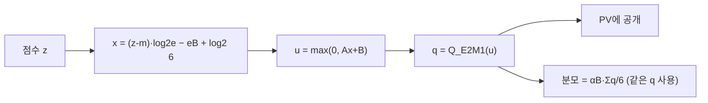

[논문 링크](https://arxiv.org/abs/2609.04105v1)
## FP4 텐서 코어가 빨라도 어텐션은 왜 안 빨라지는가: Direct-P와 양자화된 역전파로 푼 Blackwell FlashAttention-4

**TL;DR** — Blackwell의 FP4 텐서 코어는 행렬곱을 BF16보다 훨씬 빨리 처리하지만, 어텐션은 *행렬곱 두 개* 사이에 **softmax** 라는 "중간 작업"이 끼어 있어서 그 혜택이 자동으로 전파되지 않는다. 이 논문은 softmax 확률 생성을 **"정확한 지수함수 → 반올림"의 순차 경로가 아니라, 점수를 E2M1 코드로 직접 분류하는 문제**로 재정의한 **Direct-P** 로 임계 경로(critical path)를 줄여, NVIDIA GB200에서 BF16 대비 **최대 2.13배** 의 forward 처리량을 달성한다(근거: §Abstract). 나아가 학습에서는 forward가 만들어둔 양자화 상태를 backward가 그대로 재사용해 8B 모델 한 스텝을 **최대 1.14배** 가속하지만, P/V를 MXFP4로 내리면 **모든 궤적이 발산**하여 FP8로 남겨야 함을 보여준다(근거: §7.6).

---

## 핵심 아이디어

이 논문의 중심 주장은 한 문장으로 정리된다.

> 어텐션의 병목은 이제 행렬곱이 아니라 **"점수(score)를 확률(probability)로 바꾸는 소프트맥스 중간 단계"** 이며, 이를 고치려면 *더 정확한 근사* 가 아니라 **임계 경로에서 일을 빼내는 것** 이 필요하다. 따라서 FP4 확률을 **"지수 계산 후 반올림"이 아닌 "코드 분류"** 로 생산하고, 정규화도 PV가 실제로 소비하는 그 반올림된 값을 그대로 사용해야 한다(근거: §3, §4).

핵심 통찰은 두 개의 *링크된* 문제로 요약된다(근거: §3).

1. **타이밍 문제** — P는 커널 *내부에서* 생산되므로, 첫 번째 유효한 PV 연산은 `S → 최댓값 → 스케일 → 확률 → E2M1 팩 → 공개` 라는 순차 사슬을 기다려야 한다. FP4는 QK와 PV는 빠르게 하지만 *점수 축소·지수·동기화·스케일 공개* 는 가속하지 못한다.
2. **수치 범위 문제** — softmax 확률은 4비트 페이로드와 블록 스케일로 담기에 *어색한* 범위를 갖는다. 범위를 살리면 비싸지고, 싸게 하면 언더플로로 블록 전체가 0으로 사라진다.

저자들은 "가장 빠른 FP4 포인트가 더 큰 오차를 감수한다"는 사실을 감추지 않고, **속도–정확도 트레이드오프를 정직하게 측정** 한다는 점이 이 논문의 태도다(근거: §5.1, §8.5).

---

## 배경: 그들이 해결한 문제

### 어텐션은 "행렬곱 두 개 + softmax 하나"

어텐션은 쿼리 $Q$, 키 $K$, 밸류 $V$ 로 구성된다:

$$
S = QK^T / \sqrt{d}, \qquad P = \mathrm{softmax}(S), \qquad O = PV \tag{1}
$$

즉 **QK 곱과 PV 곱** 두 행렬곱 사이에 softmax가 끼어 있다. FlashAttention은 이 $S$ 와 $P$ 라는 이차 크기의 행렬을 HBM에 저장하지 않고 **타일 단위** 로 평가하는 알고리즘이다(근거: §1). FlashAttention-4(FA4)는 이 타일 알고리즘을 Blackwell의 **비동기 행렬 하드웨어** 에 맞게 재설계했다(근거: §1).

### Blackwell에서 FP4는 행렬곱만 가속한다

Blackwell의 FP4 행렬곱은 BF16보다 훨씬 빠르다. 하지만 softmax는 여전히 각 점수 타일을 축소하고, 지수함수를 평가하고, 스케일된 확률 타일을 만들고, 그것을 두 번째 곱에 넘길 준비를 해야 한다. **행렬곱이 빨라질수록 이 중간 단계가 병목이 된다**(근거: §1).

저자들이 인용한 핵심 관찰은 이것이다: "공개(publication) *이후* 의 일을 제거해도 지연 시간은 줄지 않는다. **첫 번째 유효한 P 타일 이전의 일을 제거해야** 지연이 줄어든다"(근거: §3.1).

### 두 가지 FP4 포맷과 그 트레이드오프

FP4는 E2M1(지수 2비트, 가수 1비트) 페이로드를 사용한다. 부호를 무시하면 표현 가능한 크기는:

$$
F_{E2M1} = \{0,\ \tfrac12,\ 1,\ \tfrac32,\ 2,\ 3,\ 4,\ 6\} \tag{10}
$$

이 페이로드를 **어떻게 스케일링하느냐** 가 포맷을 가른다(근거: §3.2, Table 2):

| 포맷 | 블록 | 스케일 | 강점 | 이 논문에서의 역할 |
|---|---|---|---|---|
| **NVFP4** | 16값 | E4M3 (미세한 국소 배치) | 지역적 배치가 정밀 | Q, K |
| **MXFP4** | 32값 | E8M0 (2의 거듭제곱 진폭) | 넓은 지수 범위 | P, V |

핵심 차이는 **범위** 다. NVFP4의 E4M3 스케일이 0으로 반올림되면 블록 전체가 사라진다(언더플로). MXFP4의 E8M0은 2의 거듭제곱 진폭이라 극소 확률 블록도 별도의 행 이동 없이 표현할 수 있다(근거: §3.2). 저자들은 Table 3에서 Gaussian softmax 확률로 정밀 진단을 돌려, **stabilized NVFP4가 가장 높은 충실도를 주지만 행 단위 범위 보정이 필요하고, MXFP4는 N32 생산 조각과 정확히 정렬되는 2의 거듭제곱 스케일을 주지만 확률을 더 거칠게 놓는다** 는 것을 보인다(근거: §3.2).

그래서 Direct-P는 **Q/K는 NVFP4, P/V는 MXFP4** 를 선택한다.

---

## 새로운 접근법: Direct-P

Direct-P의 경계는 **좁고 정확** 하다. HAO AI Lab의 FP4 FA4 구현이 제공하는 *외부 스케줄* (two-query 파이프라인, TMEM 수명주기, 발행 프로토콜)은 **그대로 두고**, 오직 **"완성된 FP32 점수 조각 → PV가 소비하는 합법적인 FP4 확률 피연산자"** 사이의 구간만 바꾼다(근거: §4.1, Table 4).

Direct-P는 세 가지 연결된 선택으로 구성된다(근거: §4.1):

1. **정규화된 점수를 E2M1 페이로드에 직접 매핑** → 임계 경로 단축 (타이밍 문제 해결)
2. **정규화 분모를 PV가 소비하는 그 반올림된 페이로드로부터 계산** → 분자·분모가 하나의 근사 연산자를 기술 (수치 일관성)
3. **극단 로짓을 가진 레이어에만 범위 가드 적용** → 대부분 레이어는 shiftless 경로 유지

### 수정 1: 점수를 E2M1 코드로 직접 분류하라

표준 경로는 상대적으로 정확한 지수함수를 계산한 뒤 8개 E2M1 크기로 반올림한다. **그 중간 정밀도는 PV에 도달하지 않는다.** Direct-P는 이를 뒤집어, 확률 생성을 *코드 분류 문제* 로 취급한다: 각 정규화된 점수가 **어느 E2M1 구간(bin)에 들어가는지** 만 결정한다(근거: §4.2).

E2M1 양수 코드는 7개의 반올림 경계 $\{\frac14,\frac34,\frac54,\frac74,\frac52,\frac72,5\}$ 에서 값이 바뀐다. 따라서 저자들은 *값 공간* 에서 아핀 분류기를 피팅한다:

$$
\hat u(x) = \max(0,\, Ax + B), \qquad \hat q(x) = Q_{E2M1}(\hat u(x)) \tag{17}
$$

피팅 목표는 실수 지수의 정확도가 아니라 **E2M1 코드 일치율** 이다. 점수 변환·$e_B$·$\log_2 6$ 항은 패킹된 FMA 계수에 접어넣는다(근거: §4.2). 일반적 `fast` 피팅은 $A{=}1.50,\ B{=}1.20$, Wan 모델 활성화 평가는 $A{=}1.60,\ B{=}0.95$ 를 쓴다(근거: §4.2). 두 레인 FMA(FFMA2)와 네이티브 변환(F2FP)이 E2M1 페이로드를 방출하고, 선택된 일부 위치는 Blackwell의 기본 2 밑 지수 명령 `EX2` 를 쓸 수 있다(근거: §4.2).

### 수정 2: "표현된 확률"을 정규화하라

분자(출력)가 반올림된 FP4 확률을 쓴다면, **독립적으로 근사한 FP32 지수 합** 을 분모로 쓰면 서로 다른 연산자를 섞는 꼴이 된다. Direct-P는 분모를 **PV가 실제 소비하는 그 코드와 블록 스케일로부터** 누적한다(근거: §4.3):

$$
\tilde N_{iB} = \frac{\alpha_B}{6}\sum_{j\in B} q_{ij}\hat V_j, \qquad \tilde L_{iB} = \frac{\alpha_B}{6}\sum_{j\in B} q_{ij}, \qquad \tilde O_i = \frac{\sum_B \tilde N_{iB}}{\sum_B \tilde L_{iB}} \tag{19--21}
$$

즉 분자와 분모가 **정확히 같은 표현된 연산자** 를 기술한다. 네 개의 패킹된 페이로드 워드는 바이트 순열과 DP4A(4-way 정수 내적)로 축소한다(근거: §4.3).

### 수정 3: 극단 로짓 레이어에만 가드를 걸어라

빠른 shiftless 경로는 합성 그리드와 대부분 레이어에서 유한하지만, 일부 후반 Wan 레이어는 BF16 로짓이 500, 심지어 1000을 넘는다. 모든 점수를 스캔·재로드하면 속도 이점이 사라진다. 그래서 **그 레이어들만** Algorithm 3으로 라우팅한다(근거: §4.4).

원래 layer-39 실패의 진짜 원인은 앵커를 놓친 것이 아니라, 표현식 $(s/6)\sum_i c_i$ 가 E8M0 코드 1에서 **비정규(subnormal) 중간값** 을 만들어 0으로 플러시(flush)된 것이다. Algorithm 3은 이를 $s\,(\sum_i c_i/6)$ 로 재결합해, 두 번째 스캔·새 배리어·stable-softmax 폴백 없이 해결한다(근거: §4.4).

### 두 가지 운영점

| 정책 | K/V 단계 | 앵커 | 네이티브 EX2 | 분모 | 목표 |
|---|---|---|---|---|---|
| **fast** | 12 | 기본 없음 | GB200에서 0 | 생산자 | 최소 지연 |
| **accurate** | 13 | 32 고정 행 | 약 25% | 보정 WG | 높은 충실도 |

(근거: Table 5)

---

## 작동 원리: 구체적인 예시로 살펴보기

핵심 알고리즘의 흐름을 하나의 작은 예로 따라가 보자(근거: §4.2 Algorithm 2). 이해를 위해 키 4개짜리 블록을 가정한다.

### 표준 경로 vs Direct-P 경로

표준 경로는 직렬적이다:

Direct-P는 이 사슬을 **한 번의 분류** 로 압축한다:

### 수치 예시

한 쿼리 행의 키 4개에 대해, 행 최댓값 $m$ 을 뺀 정규화 점수의 지수가 다음과 같다고 하자:

| 키 $j$ | $\exp(z_j - m)$ (정확값) | 목표 E2M1 코드 $q_j$ | 표현된 확률 $q_j/6$ |
|---:|---:|---:|---:|
| 1 | $1.000$ | $6$ | $1.000$ |
| 2 | $0.667$ | $4$ | $0.667$ |
| 3 | $0.333$ | $2$ | $0.333$ |
| 4 | $0.167$ | $1$ | $0.167$ |

이 경우 확률이 E2M1 격자에 정확히 올라타서 **오차가 0** 이다. 블록 진폭은 $\alpha_B = 1$ ($e_B = 0$), 재구성 스텝 $\delta_B = 1/6$ 이다.

표준 경로는 $\exp$ 를 정확히 계산한 뒤 반올림해서 $q$ 를 얻지만, Direct-P는 $x = (z_j - m)\log_2 e + \log_2 6$ 을 만들고 아핀 $u = \max(0, Ax+B)$ 를 통과시켜 **바로** $q = Q_{E2M1}(u)$ 를 방출한다. "정확한 지수" 라는 중간값은 어차피 PV에 도달하지 않으므로 아예 만들지 않는 것이다(근거: §4.2).

분모도 같은 $q$ 로 누적한다: $\sum_j q_j = 6 + 4 + 2 + 1 = 13$, 따라서 $\tilde L = 13/6$. 정확 분모 $\sum \exp = 1 + 2/3 + 1/3 + 1/6 = 13/6$ 와 일치한다. **분자와 분모가 같은 반올림 값을 쓰므로, 근사 연산자는 내적으로 일관된 하나의 연산자** 가 된다(근거: §4.3).

### 왜 임계 경로가 줄어드는가

핵심은 HAO의 two-query 스케줄에서 PV가 **두 개의 인접한 N32 조각(즉 K64)** 이 완성될 때까지 기다려야 한다는 점이다(근거: §2.5). Direct-P는 이 두 조각을 만드는 *사전 작업* 을 줄여, 첫 번째 합법적인 K64 피연산자가 더 빨리 나오게 한다. 반대로 "공개 이후"의 일을 아무리 제거해도 지연은 줄지 않는다(근거: §3.1, §8.3).

---

## 성능 검증: 주요 결과

결과는 크게 **forward 추론** 과 **causal 학습** 의 두 갈래다. forward는 속도를 위해 오차를 교환하고, 학습은 그 오차가 수렴을 깨는지를 판가름한다.

### Forward: 최대 2.13배, 그리고 정직한 오차

9개 GB200 D128 행에서 `fast` 는 HAO BF16 대비 **기하평균 2.023배** 빠르고 최대 **2998 TFLOP/s** 를 기록한다. `accurate` 는 1.669배·2416 TFLOP/s 다(근거: §6.1). S32768/H24에서 `fast` 는 4.400448 ms (2998 TFLOP/s), HAO의 공개 B200 2018 / GB300 2677 TFLOP/s 를 웃돈다(근거: §6.1).

속도의 대가는 **오차** 다. HAO NV/FP8의 평균 cosine은 **0.9899** 인 반면 `fast` 는 **0.9438**, `accurate` 는 **0.9517** 이다(근거: §6.1). Figure 3은 이 트레이드오프를 보여준다: FP8 PV는 E2M1 페이로드와 블록 스케일 페이지가 필요 없어 더 정확하고, 전체 FP4는 더 빠르되 더 큰 오차를 감수한다.

B300(SM103)은 D128 지연을 S4096–S8192 구간에서 **5.6–7.7%** 더 줄인다. 표준 S8192/H64는 **3116 TFLOP/s**, wave-aligned S9472/H64는 **3159 TFLOP/s** 를 기록한다(근거: §6.1).

### 오차는 실제 모델에서 어떻게 번지는가

operator 오차가 모델 끝까지 어떻게 전파되는지가 실질 질문이다. ViT S4096에서 `fast` 는 **BF16 top-1 정확도(88.5%)를 그대로 유지** 하며 예측 일치율 95.5%, `accurate` 는 89.0%·98.5%를 달성한다(근거: §6.3, Table 8). 2272개 분류 예제 중 `fast` 가 바꾼 예측은 32개, 그중 31개가 **BF16 top-2 로짓 마진의 최하위 사분위** 에 몰려 있다 — 즉 확신 없는 예측만 흔들린다(근거: §6.3).

Wan2.1 비디오 확산에서는 `fast` 가 1.3B에서 **1.75배**, 14B에서 **2.09배** 빠르다. 다만 20단계까지 쌓이면 14B의 cosine이 0.8496까지 떨어져, HAO NV/NV(0.9036)보다 드리프트가 더 누적된다 — 유한하지만 오차가 쌓인다(근거: §6.4, Table 9).

ViT-MAE 이미지 재구성에서 `fast` 는 PSNR **−0.020±0.026 dB**, 재구성 cosine **0.99973** 로, 12개 레이어를 모두 통과한 뒤에도 BF16에 거의 붙어 있다. 잔차는 8배 증폭해야 비로소 보인다(근거: §6.5, Table 10).

### 학습: forward의 양자화를 backward가 재사용한다

학습은 세 가지 제약을 더한다: 인과 마스킹, GQA, 그리고 $S\times S$ 행렬을 물질화하지 않고 기울기를 복구해야 한다(근거: §7). forward는 NVFP4 Q/K 페이로드 바이트·블록 스케일·LSE 정규화기를 저장하고, backward는 그것들로부터 $QK^T$ 를 재계산해 확률을 **재구성** 한다(근거: §7.1).

측정 경계별로 결과를 나눈다(근거: §7.3–7.7):

| 경계 | BF16 | 양자화 경로 | 속도 향상 |
|---|---:|---:|---:|
| 분리된 D128 인과 backward (재구성 코어) | 0.501 ms | 0.356 ms | **1.405배** |
| + E5M2 dO/통계 발행자 | 0.501 ms | 0.508 ms | 0.986배 |
| 투영 포함 backward만 | 1.572 ms | 1.397 ms | **1.125배** |
| 투영 포함 forward+backward | 2.656 ms | 2.133 ms | **1.245배** |
| 8B 전체 업데이트 B1 | 260.313 ms | 239.985 ms | 1.085배 |
| 8B 전체 업데이트 B2 | 464.245 ms | 415.532 ms | 1.117배 |
| 8B 전체 업데이트 B4 | 854.516 ms | 751.722 ms | **1.137배** |

(근거: Table 12–14)

여기서 교훈이 명확하다. 재구성 코어만 보면 1.405배라는 화려한 숫자가 나오지만, **학습에 안전한 E5M2 dO와 행 통계 발행자가 그 절약을 거의 전부 삼킨다** (0.986배). "빠른 backward 커널" 하나가 종단 간 이득을 예측하지 못하는 이유다(근거: §7.3).

8B 전체 업데이트는 GPU가 잘 차오를수록 이득이 커진다: B1 1.09배 → B4 1.14배. FP8 P/V 경로의 B4 처리량은 **19,173 → 21,795 tokens/s**, FLOP 활용률은 **41.12% → 46.74%** 로 상승한다(근거: §7.5).

### 학습 안정성이 FP8 P/V를 선택한다

forward에서 MXFP4 P/V는 빨랐다. 하지만 긴 학습에서 **테스트된 모든 MXFP4 P/V 궤적이 발산한다**. 4-arm 교차 진단(투영 포맷 × P/V 포맷)에서 두 MXFP4 arm은 update 500(1억 3110만 토큰) 시점에 loss **7.97** vs FP8 컨트롤 **5.41** 로 갈라지고, pre-clipping 기울기 놈은 **수백만** 까지 치솟는다(근거: §7.6, Appendix G.8). 반면 두 FP8 arm은 공통 관측 지평 555억 토큰까지 비발산으로 하강한다.

따라서 **학습 경로는 P/V를 FP8로 남긴다** — "완전 FP4 학습"이 아니라 forward 양자화를 backward에 넘기는 데서 오는 이득을 취하되, P/V에는 수치적 양보를 한다(근거: §8.6).

### 매칭된 분산 학습: 100B 토큰

64 GPU, global batch 1024, 1000억 토큰 스케줄을 BF16과 FP8 경로가 **같은 데이터 좌표** 로 완주한다. 마지막 학습 리포트에서 loss는 **2.3095 (BF16) vs 2.3613 (FP8)**, 같은 update의 held-out 검증은 **2.3048 vs 2.3948** (갭 **0.0900**)이다(근거: §7.7).

처리량은 874개 정렬된 관측에서 중앙값 **21,853 → 24,303 tokens/s/GPU** 로 **1.112배** 상승한다(근거: §7.7, Figure 11). FP8 궤적은 **안정적이고 하강하지만 BF16과 수치적으로 동일하지는 않다** — 이 격차는 투영과 어텐션을 *둘 다* 바꾸므로 어텐션 단독에 귀속시킬 수 없다(근거: §7.7).

### 하드웨어 진단: 진짜 병목은 산술이 아니다

세 가지 하드웨어 결론이 실측으로 뒷받침된다(근거: §8, Table 15):

1. **TMEM 소유권이 오버랩을 가둔다.** 두 FP32 점수 뱅크 + 두 FP32 출력 누산기가 $4\times128 = 512$ 컬럼을 전부 점유한다. 공유 메모리를 209,920 → 163,840 바이트로 줄여도 CTA 상주성(occupancy)이 늘지 않았다(근거: §8.1).
2. **낮은 텐서 활동은 "준비 안 됨"의 증상.** 같은 98,304개의 텐서 명령을 실행해도 실제 확률 경로로는 텐서 파이프 활동이 **18.8%** 에 그쳤다(근거: §8.2).
3. **산술을 빨리 해도 커널 전체가 안 빨라진다.** 확률 생성을 거의 전부 제거한 fixed-P 진단도 지연을 **단 5.23%** 만 줄였다(근거: §8.3).

### Key Numbers (요약)

- **Params**: 8.03B (Llama-3.1 스타일, 32 레이어, 32 Q헤드 / 8 KV헤드 / D128) — 학습 실험 기준
- **Context/Seq**: S4096 (학습), S7680 (Wan 추론), 최대 S32768 (벤치마크)
- **Architecture**: FlashAttention-4 어텐션 커널 (타일화 + online softmax), GQA 32:8
- **Positional**: RoPE (투영 포함 경계에서 적용) | **Attention**: Flash/online softmax, two-query two-CTA 스케줄
- **Forward 성능**: GB200 `fast` 2998 TFLOP/s (BF16 대비 기하평균 2.023배, 최대 2.13배) | B300 S8192/H64 3116, S9472/H64 3159 TFLOP/s
- **Forward 오차**: `fast` cosine 0.9438 / rel-L2 0.3366, `accurate` 0.9517 / 0.3272 (vs HAO NV/FP8 0.9899)
- **학습 가속**: 8B 전체 업데이트 B4 1.137배 (FP8 P/V), 투영 포함 어텐션 1.245배, 분산 처리량 1.112배
- **학습 규모**: 64 GPU, global batch 1024, 100B 토큰 완주, 검증 갭 +0.0900
- **HW**: GB200 (SM100, 152 SM) / B300 (SM103, 148 SM), TMEM 256 KB/SM (동일)
- **Cost / Energy**: $/1M tokens, kWh/1M tokens — 논문에 미보고

$$
\text{KV-Cache(GB)} \approx
\frac{2 \cdot L \cdot H \cdot d_\text{head} \cdot \text{seq} \cdot \text{batch} \cdot \text{bytes/elt}}{10^9}
$$

> 용어: **TPOT = Time Per Output Token** (필요 시 "TBT = TPOT"로 병기). 본 논문은 커널/연산자 레벨 연구라 TPOT·TTFT 대신 **TFLOP/s·ms·tokens/s** 로 성능을 보고한다.

### SOTA 비교 (동일 세팅, forward D128)

| Shape | Provider | 시간(ms) | TFLOP/s | cosine | rel-L2 | vs BF16 |
|---|---:|---:|---:|---:|---:|---:|
| H24/S4096 | TK NV/MX fast (GB200) | 0.0922 | 2237 | 0.9438 | 0.3363 | ~2.02배 |
| H24/S4096 | HAO NV/FP8 (GB300) | — | 2046 | 0.9899 | — | — |
| H24/S32768 | TK NV/MX fast (GB200) | 4.4004 | 2998 | 0.9429 | 0.3389 | 2.13배 |
| H24/S32768 | HAO NV/FP8 (GB300) | — | 2677 | 0.9899 | — | — |
| H64/S8192 | TK NV/MX fast (B300) | 0.7057 | 3116 | 0.9441 | 0.3349 | 2.125배 |

(근거: Table 7, Figure 4)

---

## 우리의 관점: 강점, 한계, 그리고 이 연구가 중요한 이유

### 강점 — 경계를 나누는 정직함과, 임계 경로를 보는 정확함

이 논문의 가장 큰 강점은 **무엇을 주장하지 않는지를 명확히 하는 것** 이다. 측정 경계를 forward 커널 / 분리된 backward / 투영 포함 어텐션 / 8B 전체 업데이트 / 분산 궤적으로 **칸칸이 분리** 해, "빠른 커널 = 빠른 모델"이라는 단순화를 원천 차단한다(근거: §5, Table 6). 예컨대 backward 재구성 코어의 1.405배가 E5M2 발행자에게 먹혀 0.986배가 된다는 사실은, 경계를 나누지 않았다면 절대 드러나지 않았을 것이다(근거: §7.3).

두 번째는 **"임계 경로 위의 일" vs "그 이후의 일"** 이라는 선명한 프레이밍이다. fixed-P 진단이 5.23%만 남긴다는 실측은, FP4 어텐션의 다음 병목이 *더 정확한 다항식 근사* 가 아니라 **더 큰 오버랩 창** 임을 보여준다(근거: §8.3, §8.4). 이는 "산술을 더 빨리 하면 된다"라는 순진한 기대를 데이터로 부순다.

셋째, **발산 실험의 과학적 가치** 다. MXFP4 P/V가 forward에서는 빨랐지만 학습에서 발산한다는, 그리고 그 사실을 두 투영 포맷과 교차시켜 *공통 요인이 P/V 표현임* 을 요인설계로 좁힌 것은, "빠른 타이밍 브래킷을 수렴 결과로 오독하지 말라"는 교훈과 함께 매우 귀한 결과다(근거: §7.6, Appendix G.8).

### 한계 — 정직한 범위

저자들이 명시적으로 인정한 한계(근거: §8.5):

- **증거의 경계.** 학습 비교는 라우트당 **궤적 1개** 라 run-to-run 변동성이나 통계적 동등성을 추정하지 못한다. 투영 정밀도(E4M3 vs NVFP4)도 별도 경계라, 검증 갭 0.0900이 어텐션 단독에서 온 것인지 귀속할 수 없다.
- **형태 의존성.** 하드웨어 결론은 D128에 국한된다. D64는 타일 크기·CTA 소유권·TMEM 오버랩 전략이 완전히 다르며, 유추해서는 안 된다(근거: §8.5, Appendix A.6).
- **완전 FP4 학습의 미완.** P/V와 backward는 여전히 FP8로 양보한다. 완전 FP4 학습 경로는 UE5M3 블록 스케일을 별도 연구로 제안할 뿐 이 논문에서 평가하지 않는다(근거: §8.6).

잠재적 한계로 덧붙이자면, 이는 **단일 저자의 기술 보고서(technical report)** 로, `fast` 의 상대-L2 0.34 수준 오차가 실제 다운스트림 태스크에서 어디까지 무해한지는 ViT/BERT/Wan의 제한된 고정입력 평가로만 검증되었다. "2272 예제 중 31개가 저마진 사분위"라는 margin 메커니즘은 설득력 있지만, 보편적 추론·학습 안전성을 확립하기엔 표본이 작다(근거: §6.3).

### 이 연구가 중요한 이유

- **실용적으로**: "FP4로 어텐션을 빠르게" 할 때 병목이 행렬곱이 아니라 softmax 중간 단계임을 보이고, 그 해법(코드 분류 + 표현된 정규화 + 선택적 가드)과 그 비용(오차)까지 함께 제시한다.
- **엔지니어링 경고로**: 두 개의 256배 스케일 버그(LSE lift `+8`, dO epilogue `1/256` 보정)와 E4M3가 dO의 97%를 0으로 반올림하는 문제는, 저정밀 어텐션 학습을 구현하는 누구나 밟을 함정이다(근거: Appendix G.2).
- **하드웨어 방향으로**: "또 하나의 할당 가능한 점수 뱅크", "K32 scaled-FP4 PV", "TMEM 밖의 스케일" 이라는 구체적 후보를 측정된 의존성에서 도출했다(근거: §8.4).

---

## 다음 단계는?: 앞으로의 길

1. **완전 FP4 학습.** UE5M3(unsigned E5M3) 블록 스케일이 E2M1 페이로드를 유지하면서 훨씬 넓은 스케일 범위를 제공해, 안정적인 FP4 언어모델 사전학습을 가능케 했다는 별도 연구가 있다. 이를 P/V 곱과 backward 기울기 곱에 적용하는 것이 완전 FP4 학습으로 가는 유망한 경로지만, 효율적 하드웨어 구현이 필요하다(근거: §8.6, [6]).
2. **오버랩 창 확대.** Direct-P가 확률 생성을 단축시킨 뒤에는, *또 하나의 다항식 근사* 보다 **더 큰 할당 가능한 오버랩 창** 이 더 가치 있다는 것이 실측 결론이다. "PV가 여전히 소비 중인데 다음 QK가 쓸 수 있는" 점수 목적지가 핵심 후보 설계다(근거: §8.4).
3. **형태 일반화.** D64 및 다른 regime은 자체 타일·소유권·오버랩 전략이 필요하므로, D128 일정을 유추해서는 안 된다. 이들 형태로의 확장이 후속 과제다(근거: §8.5).
4. **통계적 강건성.** 궤적당 1개의 분산 실험을 여러 시드로 확장해, 검증 갭 0.0900의 run-to-run 분산과 FP8 경로의 통계적 동등성 여부를 정량화할 필요가 있다(근거: §8.5).

**한 줄 결론:** Blackwell에서 FP4는 행렬곱을 4배 빠르게 하지만, 어텐션의 병목은 이미 softmax 쪽으로 옮겨가 있다. Direct-P는 "정확한 지수를 계산하지 말고 E2M1 코드를 직접 분류하라"는 발상으로 임계 경로를 줄여 2배 이상의 forward 처리량을 얻었고, 학습에서는 forward의 양자화를 backward에 넘기는 것으로 이득을 취하되 P/V는 FP8로 남겨야 함을 보였다. **요점은 산술 속도가 아니라 오버랩 창이다**(근거: §8.6).

---

## 참고: 재현 체크리스트

- [ ] 코드/커밋/라이선스: `github.com/MrHuff/fp4-fa4` (TK forward/backward 커널, CuTe-DSL 비교 커널, 실험 설정, 증거 아티팩트)
- [ ] 측정 그래프 생성: `python3 tools/plan_fa4_measurements.py list` / `print --family noncausal-forward|downstream|...`
- [ ] 필수 피연산자 계약: `--nv-qk-fold-k64-scales both --nv-qk-fold-scale-select mse` (K64 Q/K 스케일 접기); `accurate` 는 추가로 고정 32행 K/V 순열 필요
- [ ] 하드웨어/소프트웨어: GB200(SM100)/B300(SM103), CUDA 13.0, CUTLASS DSL, seed 20260814
- [ ] 평가 지표: cosine / relative-L2 / RMSE, 300 ms 워밍업 + 3000 ms 중앙값 윈도우 (B300 일부는 반복 윈도우)
- [ ] 학습 설정: fused AdamW, dense cross entropy (CCE 비활성, `torch.compile`), B∈{1,2,4}, S4096, 10 워밍업 + 21 측정
- [ ] 분산: 64 GPU, global batch 1024 (local 4 × 4 accum), 100B 토큰, checkpoint resume 지원
- [ ] 증거 무결성: JSON manifest + SHA256 리시트 (`receipts/…json`), W&B 히스토리는 읽기 전용 동결

<!-- verbatim-tables -->

## 논문 원문의 표

> arXiv e-print 의 LaTeX 원본에서 기계적으로 옮긴 표입니다. 숫자는 논문의 값이며 모델을 거치지 않았습니다.

**표 1. Selected B300 D64 format diagnostics. NV/MX is the retained finite route. NV/NV timings are shown only to explain the rejected control and must not be treated as production performance when the status is non-finite.**

| $H$ | $S$ | NV/MX ms | NV/MX TFLOP/s | NV/MX Cosine | NV/MX Rel.-$L_2$ | raw NV/NV ms | raw NV/NV Cosine | raw NV/NV Rel.-$L_2$ | Status |
|---|---|---|---|---|---|---|---|---|---|
| generated/b300_d64_rows.tex |  |  |  |  |  |  |  |  |  |

**표 2. Shiftless TK NV/NV failure on model activations. Overflow is the fraction of N32 P scales above E4M3's maximum before encoding.**

| Task | Failed sample | Non-finite rows | Shiftless overflow (%) | Shiftless max | Stable overflow (%) | Stable max |
|---|---|---|---|---|---|---|
| generated/downstream_nvnv_failure_rows.tex |  |  |  |  |  |  |

**표 3. Measured TK NV/MX tuning points on B300. Every row reports speed and error from the same output.**

| Variant | Grid | EX2 density | Time (ms) | TFLOP/s | Cosine | Rel.-$L_2$ | RMSE |
|---|---|---|---|---|---|---|---|
| generated/b300_tuning_rows.tex |  |  |  |  |  |  |  |

**표 4. Major rejected directions. A timing tie is not promoted when it adds synchronization, storage, or numerical risk.**

| Direction | Intended benefit | Observed failure mechanism |
|---|---|---|
| Half-tile QK/PV | Larger tensor work and easier overlap | Delayed first publication and increased live tensor-memory pressure; did not beat N32 production with K64 consumption. |
| Deeper dynamic scheduler | Exploit QK running one logical step ahead | Polls, proxy signals, and policy branches added control work without creating a legal score destination. |
| Full or QK-only two-CTA | Accelerate QK and increase occupancy | Cluster-wide readiness and scale lifetime coordination overwhelmed QK savings; QK-only did not remove single-CTA P/PV ownership. |
| Extra barriers or offload WG | Remove full-CTA rendezvous | Duplicate score loads and handoff mailboxes cost more than the hidden work; concurrent TMEM writes produced invalid output. |
| Alternate TMEM layouts | Add a second useful score/P slot | Two 128-column scores plus two 128-column outputs already consume 512 columns. Scale compression freed fragments, not another legal 128-column bank. |
| BF16/FP16 partial accumulator | Halve output columns | Local scaled-FP4 tensor instructions accumulate into FP32 TMEM; casting between issues did not change the accumulator contract. |

**표 5. Major rejected directions (continued).**

| Direction | Intended benefit | Observed failure mechanism |
|---|---|---|
| Initial NVFP4 projection path | Extend FP4 tensor throughput across the learned attention projections | Isolated D128 attribution found much larger projection error than E4M3 around an otherwise faithful attention core. We dropped that implementation, not the format: later distributed experiments use NVFP4 projections as the higher-throughput arm. This result says nothing about NVFP4 Q/K inside attention. |
| Raw FP4 or coarse 2-D scales | Remove scale pages | Raw E2M1 loses the four-times-class block-scaled primitive. A single 32$\times$32 scale cannot be applied after a reduction whose block product scales vary with K. |
| Direct code classifier | Eliminate packed conversion | Threshold trees, integer conversion, LUT access, LOP3, and PRMT packing generated more SASS than packed FFMA2 plus native F2FP. |
| Intermediate NV/MX policy | Add an anchor without the correction warpgroup | At S4096/H24 it measured 0.094560 ms, slower than fast, while its 0.356700 relative-$L_2$ was worse than both fast and accurate. Its long-ViT agreement only tied accurate, leaving no Pareto value. |
| Quadratic/cubic throughput path | Improve code fit | A Q0 quadratic raised static FFMA2 count from 128 to 160, measured 0.097888 ms, and reduced cosine on its test. |
| Sampled max/denominator | Shorten P preparation | Eight-of-32 samples saved less than 0.5\us\ with substantial error; fewer samples were unstable. |
| Structured sparse PV | Increase tensor throughput | Blackwell's sparse FP4 path uses logical K128, losing the early K64 handoff; value-aware selection added too many instructions. |
| Tail interleaving | Pull Q3 work under Q2/PV latency | Added 1.4--3.2\us; the contiguous Q2-then-Q3 schedule was locally better. |
| Streaming denominator | Hide exact denominator reduction | Preserved output exactly but slowed the clean fast build by 2.11% and 1.83%. |

**표 6. Complete fixed-schedule format matrix. Each row reports latency and output error together; no timing is paired with accuracy from another run.**

| Shape | Provider | Time (ms) | Speedup | Cosine | Relative-$L_2$ | RMSE |
|---|---|---|---|---|---|---|
| generated/full_format_rows.tex |  |  |  |  |  |  |

**표 7. Accuracy-matched B300 control. Superscript p marks HAO-published cross-run values.**

| Provider | Time (ms) | TFLOP/s | Cosine | Relative-$L_2$ |
|---|---|---|---|---|
| generated/accuracy_matched_rows.tex |  |  |  |  |

**표 8. Internal backward version map.**

| Label | Main purpose | Outcome |
|---|---|---|
| v416 | D64 native owner schedule | Like-for-like parity with the generated native-exponential reference; used in early 1.2B integration. |
| v454/v482 | D128 B1/B2 ownership, rounded-P reuse, and early tensor-memory release | 1.21--1.24$\times$ faster than the matched generated reference. |
| v501 | Corrected LSE lift, shape-specific clearing, and represented E4M3 gradient operands | Finite short-run systems prototype and basis of the historical 8B bracket. |
| v503 | Common-row MXFP4 V approximation in backward | Faster than the first MX attempt and tied end to end; the complete recipe failed its observed distributed numerical gate, but the consumer was not isolated as the cause. |
| v506/v507 | Direct shared-MX producer and exact four-anchor consumer | Numerically useful controls, but too slow for the production gate. |
| v509 | Exact forward NVFP4 score reconstruction with E5M2 dO | Retained quantized causal-backward implementation; exact-batch B1/B2/B4 binaries are validated for the Llama-style D128 shape. |

**표 9. Historical isolated D64 causal backward on GB200. The low-precision route is a generated CuTe kernel; both columns include required output clears.**

| Sequence | Exact BF16 | Low precision | Speedup |
|---|---|---|---|
| 512 | 111.456 $\mu$s | 102.176 $\mu$s | 1.091$\times$ |
| 1024 | 149.504 $\mu$s | 138.560 $\mu$s | 1.079$\times$ |
| 2048 | 203.808 $\mu$s | 189.632 $\mu$s | 1.075$\times$ |
| 4096 | 347.104 $\mu$s | 319.808 $\mu$s | 1.085$\times$ |
| 8192 | 879.168 $\mu$s | 770.848 $\mu$s | 1.141$\times$ |
| 16384 | 2765.984 $\mu$s | 2621.376 $\mu$s | 1.055$\times$ |

**표 10. Historical isolated D128 causal backward at S4096/Hq32/Hkv8 on GB200. The native column is the v454/v482 predecessor family.**

| Shape | Generated reference | Native schedule | Speedup |
|---|---|---|---|
| B1/D128 | 381.376 $\mu$s | 315.360 $\mu$s | 1.209$\times$ |
| B2/D128, rotation A | 620.032 $\mu$s | 514.272 $\mu$s | 1.206$\times$ |
| B2/D128, rotation B | 639.328 $\mu$s | 515.040 $\mu$s | 1.241$\times$ |

**표 11. Historical saturated single-GPU brackets. Each speedup is valid within its row group but must not be transferred to the final training recipe.**

| Model/shape | Attention route | Update time | Versus BF16 |
|---|---|---|---|
| 1.2B, B16/S4096 | BF16 FA4 | 673.396 ms | 1.000$\times$ |
|  | NVFP4-QK + FP8-PV | 615.682 ms | 1.094$\times$ |
|  | NVFP4-QK + MXFP4-PV | 614.842 ms | 1.095$\times$ |
| 8B, B2/S4096 | BF16 FA4 | 489.821 ms | 1.000$\times$ |
|  | NVFP4-QK + FP8-PV | 434.014 ms | 1.129$\times$ |
|  | NVFP4-QK + dual-published MXFP4-PV | 435.992 ms | 1.124$\times$ |

**표 12. Initial frozen rolling-log cutoff, retained for provenance. Jobs began at different times, so these are status observations rather than aligned loss or throughput comparisons.**

| Projections | Forward P/V | Update | Tokens | Loss | Grad norm | Status |
|---|---|---|---|---|---|---|
| E4M3 | FP8 | 10,381 | 2.721B | 2.9743 | 0.2197 | working at cutoff |
| E4M3 | MXFP4 | 10,075 | 2.641B | 8.8265 | 358,400 | diverged |
| NVFP4 | FP8 | 10,884 | 2.853B | 3.1637 | 0.2051 | working at cutoff |
| NVFP4 | MXFP4 | 11,061 | 2.900B | 8.4801 | 3,915,776 | diverged |

**표 13. Reader's guide to the main notation and Blackwell hardware terms.**

| Term | Meaning |
|---|---|
| $B,S,H,H_q,H_{kv},D$ | Batch size, sequence length, head count, query-head count, key/value-head count, and per-head dimension. |
| Shape shorthand | Compact labels append each value: B1/S4096/H24/D128 means batch 1, sequence length 4096, 24 heads, and head dimension 128. |
| FP32, BF16, FP8, FP4 | 32-, 16-, 8-, and 4-bit floating-point families. Smaller formats increase matrix throughput but need explicit scaling. |
| NVFP4 and MXFP4 | The two block-scaled FP4 families used here. NVFP4 uses fine-grained data-dependent scales; MXFP4 shares one power-of-two scale across each 32-value block. |
| SM and CTA | A graphics processing unit (GPU) contains streaming multiprocessors (SMs). A cooperative thread array (CTA) is a CUDA thread block scheduled on an SM. |
| TMEM | Tensor memory: Blackwell's on-chip accumulator scratchpad for asynchronous matrix operations. |
| TMA and MMA | The Tensor Memory Accelerator (TMA) moves tiles; a matrix multiply--accumulate (MMA) instruction performs the tensor-core product. |

**표 14. Block-scaled FP4 formats used in this work.**

| Format | Block | Encoded scale | Main strength | Role in this work |
|---|---|---|---|---|
| NVFP4 | 16 | E4M3, optional tensor scale | fine local placement | signed Q and K |
| MXFP4 | 32 | E8M0 amplitude, power of two | wide exponent range | P and V operands |

**표 15. Probability-format range at D128. ``Zero scales'' is the fraction of blocks whose scale encodes as zero; ``lost mass'' is exact probability mass mapped to zero. This is a numerical diagnostic, not a kernel timing.**

| $S$ | Format | Zero scales | Zero payload | Lost mass | $P$ rel.-$L_2$ | $PV$ cosine | $PV$ rel.-$L_2$ |
|---|---|---|---|---|---|---|---|
| generated/p_range_rows.tex |  |  |  |  |  |  |  |

**표 16. Inherited structure and changes made in this work.**

| Component | Inherited from HAO | This work |
|---|---|---|
| CTA and TMEM | Two query stages, two score banks, two FP32 output banks, one ordered MMA issuer. | Retained. |
| P publication | N32 producer quarters, first-half and tail barriers, score/P overlay. | Retained; less work before each event. |
| Formats | Full-FP4 comparator: NVFP4 Q/K/P/V with stabilized P. | NVFP4 Q/K, MXFP4 P/V. |
| P arithmetic | Exponential evaluation followed by block-scale quantization. | Direct log-score-to-E2M1 map with selective hardware exponentials. |
| Normalization | Denominator accumulated from floating exponential values. | Denominator accumulated from the represented P consumed by PV. |

**표 17. Retained policies. Both use NVFP4 QK, MXFP4 P/V, K64 PV issue, and the two-query HAO layout.**

| Policy | K/V stages | Anchor | Native EX2 | Denominator | Goal |
|---|---|---|---|---|---|
| fast | 12 | none by default | 0 on GB200 | producer | minimum latency |
| accurate | 13 | 32 fixed rows | about 25% | correction WG | higher fidelity |

**표 18. Measurement boundaries used in the paper.**

| Boundary | Included work | Supported conclusion |
|---|---|---|
| Noncausal forward kernel | QK, online softmax, P publication, PV, and output epilogue | Forward latency and output error. |
| Causal backward kernel | Probability reconstruction and attention gradients; operands are prepared before timing | Backward latency and gradient correctness. |
| Projection-inclusive attention | QKV projection, rotary embedding, operand publication, attention, output projection, and gradients | Whether the attention gain survives its immediate producers and consumers. |
| Single-GPU 8B update | Complete model forward, loss, backward, and optimizer | End-to-end step time at a fixed local batch. |
| Distributed trajectory | Data loading, communication, checkpointing, and validation | Observed training stability, loss, and sustained throughput. |

**표 19. Primary forward comparison across Blackwell systems. Bold marks independently confirmed B300 results above 3 PFLOP/s. Published HAO columns provide cross-run context. ``ms / TF'' means milliseconds and TFLOP/s; TK error is cosine / relative-$L_2$ against BF16.**

| Shape | TK GB200 ms / TF | TK B300 ms / TF | HAO GB300 NV/FP8 TF / cos. | B300 $\Delta$t | TK B300 cosine / rel.-$L_2$ |
|---|---|---|---|---|---|
| generated/primary_cross_generation_d128_rows.tex |  |  |  |  |  |

**표 20. Downstream fixed-input trade-off. Task score is provider / BF16 accuracy; final error is cosine / relative-$L_2$ against BF16. Speedup belongs to the physical attention shape, not the complete model. HAO NV/NV is the identical-input control because no NV/FP8 task evaluation is published.**

| Task | Provider | Speedup | Task score / BF16 (%) | Final cos. / rel.-$L_2$ | $\Delta$MLM loss |
|---|---|---|---|---|---|
| generated/downstream_main_rows.tex |  |  |  |  |  |

**표 21. Wan2.1 quality and warmed GB200 kernel speed at S7680/D128. Speedup is relative to HAO CuTe-DSL BF16. Quality is cosine / relative-$L_2$ of the final latent against the paired BF16 run.**

| Model | Method | Time (ms) | Speedup | 1 step | 4 steps | 20 steps |
|---|---|---|---|---|---|---|
| generated/wan_quality_speed_rows.tex |  |  |  |  |  |  |

**표 22. Paired ViT-MAE reconstruction. PSNR $\Delta$ is FP4 minus BF16 with a paired 95% interval. Reconstruction and layer cells are cosine / relative-$L_2$ against BF16.**

| Provider | S256 speedup | PSNR (dB) | PSNR $\Delta$ (dB) | MSE $\Delta$ (%) | Reconstruction | Mean layer |
|---|---|---|---|---|---|---|
| generated/reconstruction_rows.tex |  |  |  |  |  |  |

**표 23. Hardware takeaways and the evidence that supports them.**

| Takeaway | Supporting evidence |
|---|---|
| Tensor-memory ownership limits overlap | Two FP32 score banks and two FP32 output accumulators use all $4\times128=512$ tensor-memory columns; reducing shared-memory use did not increase CTA residency or reduce latency. |
| Readiness stalls leave matrix throughput unused | A matched diagnostic kept the same 98,304 tensor instructions but reached only 18.8% tensor-pipe activity with the real probability path. |
| Probability arithmetic is no longer the main gap | A fixed-P diagnostic that removes nearly all probability construction improved latency by only 5.23%. |

**표 24. Matched historical profile with identical tensor work. This diagnostic predates the final Direct-P binary and is used only to identify the stall mechanism.**

| Probability path | Dynamic instructions | Tensor instructions | Tensor active |
|---|---|---|---|
| Real probability construction | 54.6 million | 98,304 | 18.8% |
| Fixed probability | 11.9 million | 98,304 | 26.6% |

**표 25. Final-kernel ceilings relative to the 0.092448-ms valid record. These rows deliberately remove required work and do not compute valid attention.**

| Diagnostic | Time (ms) | Gap from 0.092448 ms |
|---|---|---|
| Simplified score packing | 0.091168 | 1.280\us\ (1.38%) |
| Keep row maximum, pack raw scores | 0.090112 | 2.336\us\ (2.53%) |
| Use a fixed probability tile | 0.087616 | 4.832\us\ (5.23%) |

**표 26. Hardware properties relevant to the measured kernels. TMEM capacity does not increase from GB200 to the tested B300.**

| Property | GB200 / SM100 | B300 / SM103 |
|---|---|---|
| Visible SMs in this study | 152 | 148 |
| Maximum reported clock | 2062 MHz | 2032 MHz |
| TMEM per SM | 256 KB | 256 KB |
| Key exponential rate | 16 ops/clock/SM | 32 ops/clock/SM |
| Dense NVFP4 GPU class | 1.0$\times$ | 1.5$\times$ |
| Fused TMEM load and reduction | no | yes |

**표 27. Precision contract for causal training. Learned projections and attention operands are separate boundaries.**

| Part of the model | Representation | Reason |
|---|---|---|
| Learned QKV and output projections | E4M3 control or NVFP4 throughput arm; FP32 accumulation | Separates projection error from the attention-format comparison. |
| Forward score product | NVFP4 Q and K | Reuses two-dimensional scales over 16-value blocks along the inner dimension (row-by-K16). |
| Forward value product | FP8 P and V | Retained training route; the MXFP4 alternative is faster in isolation but diverges in the observed distributed experiments. |
| Probability reconstruction in backward | Saved NVFP4 Q/K, block and global scales, and LSE | Reconstructs the same represented probability used by forward without storing an $S\times S$ matrix. |
| Backward gradient products | E4M3 Q/K/V/P/dS; E5M2 dO | E4M3 supplies precision; E5M2 supplies the range needed for the small output gradient dO. |
| Gradient outputs | FP32 accumulation, BF16 dQ/dK/dV | Keeps accumulation and optimizer-facing gradients stable. |

**표 28. Isolated D128 causal backward at B1/S4096. Latency is the median of warmed runs; speedup is BF16 latency divided by the latency in each row.**

| Route | Latency (ms) | Speedup |
|---|---|---|
| BF16 FA4 backward | 0.501 | 1.000$\times$ |
| Saved-Q/K reconstruction core | 0.356 | 1.405$\times$ |
| Core + E5M2 dO/statistics publisher | 0.508 | 0.986$\times$ |

**표 29. Projection-inclusive attention on one GB200. Backward-only runs the same prepared forward outside the timing interval; the second row times both forward and backward. Values are medians of warmed runs.**

| Boundary | BF16 (ms) | Quantized route (ms) | Speedup |
|---|---|---|---|
| Backward only | 1.572 | 1.397 | 1.125$\times$ |
| Forward + backward | 2.656 | 2.133 | 1.245$\times$ |

**표 30. Complete 8B updates at S4096 on one GB200. Each P/V route has its own adjacent BF16 timing bracket. Times are medians in milliseconds.**

| Local batch | FP8 P/V bracket BF16 | FP8 P/V bracket Low precision | FP8 P/V bracket Speedup | MXFP4 P/V bracket BF16 | MXFP4 P/V bracket Low precision | MXFP4 P/V bracket Speedup |
|---|---|---|---|---|---|---|
| B1 | 260.313 | 239.985 | 1.085$\times$ | 261.133 | 239.250 | 1.091$\times$ |
| B2 | 464.245 | 415.532 | 1.117$\times$ | 463.814 | 415.408 | 1.117$\times$ |
| B4 | 854.516 | 751.722 | 1.137$\times$ | 857.226 | 751.597 | 1.141$\times$ |

> 이 글의 그림은 arXiv:2609.04105 원본에서 가져왔습니다 (CC BY 4.0). 크기와 형식만 바꿨습니다.
