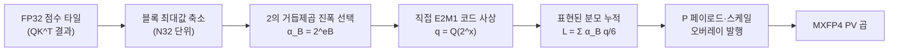

[논문 링크](https://arxiv.org/abs/2609.04105v1)
# Direct-P: FP4 어텐션의 진짜 병목은 '행렬 곱'이 아니라 '소프트맥스 변환'이었다

> **TL;DR** — Blackwell의 FP4 텐서 코어는 행렬 곱을 BF16 대비 최대 4배 빠르게 만들지만, 어텐션의 두 행렬 곱($QK^T$, $PV$) 사이에 끼어 있는 **소프트맥스 변환** 은 전혀 빨라지지 않는다. 이 논문은 점수를 **지수 함수를 거치지 않고 곧바로 FP4(E2M1) 확률 코드로 사상** 하는 **Direct-P** 로 이 병목을 우회해, GB200에서 BF16 포워드 대비 최대 **2.13배** 처리량(최대 2998 TFLOP/s)을 달성하고, 훈련에서는 포워드의 양자화 상태를 백워드로 그대로 넘겨 8B 모델 업데이트를 최대 **1.14배** 가속한다.

---

## 핵심 아이디어

어텐션은 두 번의 행렬 곱과 그 사이의 소프트맥스로 구성된다 (근거: §1):

$$
S = QK^T / \sqrt{d}, \quad P = \text{softmax}(S), \quad O = PV
$$

NVIDIA Blackwell은 **FP4(E2M1 페이로드)** 행렬 곱을 BF16보다 훨씬 빠르게 실행하지만, 그 사이의 "점수 축소 → 지수 계산 → 확률 타일 구성 → 두 번째 곱 준비" 과정은 가속되지 않는다 (근거: §1). 행렬 곱이 빨라질수록 이 **중간 단계가 병목** 이 된다는 것이 논문의 출발점이다 (근거: Abstract).

저자(Robert Hu, Graphcore Research)는 **HAO AI Lab** 이 만든 두 쿼리(two-query) Blackwell 파이프라인 스케줄을 그대로 물려받고, 그중 **확률 경로(probability path)만 교체** 하는 좁은 범위의 공략을 택했다 (근거: §2.3, §4.1). 핵심 주장은 이렇게 요약된다:

> **저자들은 Direct-P를 사용함으로써, 지수 함수 기반의 고정밀 확률 계산을 직접적인 E2M1 코드 분류로 대체해, 점수 행렬 곱과 값 행렬 곱 사이의 직렬 임계 경로를 단축함으로써, BF16 대비 2배 이상의 FP4 어텐션 포워드 처리량을 달성할 수 있다고 가정한다.** (근거: §4, §6.1)

이를 위해 Direct-P는 세 가지 연결된 선택을 한다 (근거: §4.1): ① 정규화된 점수를 PV가 소비하는 **E2M1 코드로 직접 사상**, ② 분모(normalizer)를 **PV가 실제로 소비하는 반올림된 페이로드** 로부터 계산, ③ 극단적 로짓을 가진 레이어에만 **범위 가드** 적용.

---

## 배경: 그들이 해결한 문제

### 문제 1: FP4가 소프트맥스 사이의 작업을 가속하지 못한다

Blackwell은 FP4 행렬 곱을 빠르게 처리하지만, 소프트맥스는 여전히 **각 점수 타일을 축소** 하고 **지수를 계산** 하고 **스케일된 확률 타일을 구성** 해야 한다 (근거: §1). FlashAttention은 이 방정식을 타일 단위로 평가해 $S \times S$ 크기의 점수/확률 행렬을 HBM에 저장하지 않도록 하지만(근거: §2.1, [3]), 그 대가로 **점수 타일이 확률로 변환되기 전까지 $PV$를 시작할 수 없다** 는 엄격한 의존성이 생긴다 (근거: §2.1).

### 문제 2: P는 임계 경로 위에 있다

타일드 어텐션에서 확률 $P$는 입력으로 로드되는 게 아니라 **커널 내부에서 생성** 된다. 따라서 첫 번째 유효한 FP4 $PV$ 명령은 아래 직렬 체인을 기다려야 한다 (근거: §3.1):

$$
S \to \text{maximum} \to \text{scale} \to \text{probability} \to \text{E2M1 pack} \to \text{publish}
$$

FP4는 $QK^T$와 $PV$는 가속하지만, **점수 축소·지수 계산·동기화·스케일 발행** 은 가속하지 못한다 (근거: §3.1). 즉, 첫 번째 합법적 P 타일이 만들어지기 **전에** 제거한 작업만 지연시간을 줄인다.

### 문제 3: FP4 확률은 '범위'와 '값싼 스케일'을 동시에 원한다

FP4 포맷은 **부호 있는 E2M1 페이로드** 를 쓰는데, 음수가 아닌 크기 값은 8개뿐이다 (근거: §3.2, Eq. 10):

$$
\mathcal{F}_{\text{E2M1}} = \left\{ 0,\ \tfrac{1}{2},\ 1,\ \tfrac{3}{2},\ 2,\ 3,\ 4,\ 6 \right\}
$$

NVFP4(블록 16, E4M3 스케일)는 **미세한 국소 배치** 에 강하지만, E4M3 스케일이 0으로 반올림되면 **블록 전체가 소멸** 하고, 행 단위 안정화(stabilizer)가 필요하다. MXFP4(블록 32, E8M0 스케일)는 **2의 거듭제곱 진폭** 으로 넓은 지수 범위를 제공하지만 확률을 더 거칠게 배치한다 (근거: §3.2, Tab. 2). Direct-P는 **MXFP4를 택하고 그 오퍼랜드의 생성·정규화 방식을 재설계** 한다 (근거: §3.2).

### 이 논문이 채우는 공백

기존 HAO 구현은 NVFP4 $QK$에 BF16/FP8 $PV$, 또는 NVFP4 전구간(stabilized)을 지원했다 (근거: §2.2). 하지만 **"FP4 전구간 포워드가 정말 BF16보다 빨라질 수 있는가"** 에 대한 답은 명확하지 않았다. 이 논문은 Q, K, P, V 네 오퍼랜드가 모두 FP4인 "full-FP4" 어텐션이 **어떤 정확도 손실을 감수하면 얼마나 빨라지는지** 를 처음으로 체계적으로 측정·설계한다 (근거: §1, §4).

---

## 새로운 접근법: Direct-P

Direct-P는 HAO의 외부 스케줄(두 쿼리 스테이지, 두 점수 뱅크, 하나의 순서화된 MMA 발행기)을 유지한 채, **"완성된 FP32 점수 조각 → 합법적 FP4 확률 오퍼랜드"** 구간만 교체한다 (근거: §4.1, Tab. 4). 전체 흐름은 다음과 같다:

### Fix 1: 점수를 E2M1 코드로 직접 사상 (§4.2)

기존 방식은 비교적 정확한 지수를 계산한 뒤 8개 E2M1 크기로 반올림한다. 그런데 그 중간 정밀도는 어차피 $PV$에 전달되지 않는다. Direct-P는 확률 생성을 **코드 분류 문제** 로 바꾼다 (근거: §4.2):

$$
x_{ij} = (z_{ij} - m_i)\log_2 e - e_B + \log_2 6, \quad q_{ij} = \mathcal{Q}_{\text{E2M1}}\!\left(2^{x_{ij}}\right)
$$

여기서 $m_i$는 행 기준값, $e_B$는 블록 진폭 $\alpha_B = 2^{e_B}$의 지수, $q_{ij}$는 PV가 소비하는 코드다. 정확한 FP32 $2^x$를 계산해 정밀도를 버리는 대신, **아핀 분류기** 하나로 7개 반올림 경계를 맞춘다 (근거: §4.2, Eq. 17):

$$
\hat{u}(x) = \max(0,\, Ax + B), \quad \hat{q}(x) = \mathcal{Q}_{\text{E2M1}}\!\left(\hat{u}(x)\right)
$$

계수는 E2M1 코드 일치율을 최대화하도록 피팅되며, fast는 $A = 1.50, B = 1.20$, Wan(비디오 모델)은 $A = 1.60, B = 0.95$ 를 쓴다 (근거: §4.2). 압축된 2레인 FMA(`FFMA2`) + 네이티브 변환 명령(`F2FP`) 두 개로 점수 쌍을 처리하며, 선택적으로 Blackwell의 base-two 지수 명령 `EX2` 를 섞는다 (근거: §4.2, Alg. 2).

### Fix 2: PV가 실제로 소비하는 확률로 정규화 (§4.3)

분자에는 반올림된 FP4 확률을 쓰면서 분모만 독립적으로 근사한 FP32 지수합을 쓰면 **두 연산자가 서로 다른 것** 이 된다. Direct-P는 분모를 PV가 소비하는 **정확한 코드·블록 스케일** 로부터 누적한다 (근거: §4.3, Eq. 19–21):

$$
\tilde{N}_{iB} = \frac{\alpha_B}{6}\sum_{j\in B} q_{ij}\hat{V}_j, \qquad
\tilde{L}_{iB} = \frac{\alpha_B}{6}\sum_{j\in B} q_{ij}, \qquad
\tilde{O}_i = \frac{\sum_B \tilde{N}_{iB}}{\sum_B \tilde{L}_{iB}}
$$

여기서 $\hat{V}_j$는 자체 $1/6$ 보정을 포함한 재구성된 MXFP4 값이다. 4개의 압축 페이로드 워드는 바이트 순열·캐리 없는 바이트 덧셈·4-way 정수 내적(`DP4A`)으로 축소된다 (근거: §4.3).

### Fix 3: 극단적 로짓만 가드 (§4.4)

fast 경로는 대부분 레이어에서 유한하지만, 일부 후반 Wan 레이어는 BF16 로짓이 **500~1000을 초과** 한다. 모든 점수를 스캔하면 속도 이점이 사라지므로, 이 레이어만 **샘플 앵커 + E8M0 바이트 플로어** 가드를 가진 경로(Alg. 3)로 라우팅한다 (근거: §4.4). 실제로 14B 모델의 레이어-39 실패는 앵커 미스가 아니라 **서브노멀 중간값** 이 E8M0 코드 1에서 0으로 플러시된 것이었고, 평가 순서를 $(\alpha'_B/6) c_B$ 대신 $\alpha'_B (c_B/6)$ 로 재연관해 해결했다 (근거: §4.4, §6.4).

---

## 작동 원리: 구체적인 예시로 살펴보기

한 쿼리 행이 4개의 키를 본다고 하자. 점수 벡터 $z$와 행 최대값 $m$이 주어졌을 때 (근거: §4.2, Eq. 14–15):

$$
z = [\,2.0,\ 0.5,\ -0.5,\ -3.0\,], \qquad m = 2.0
$$

**① 정규화 및 로그 변환** — $z - m = [0.0, -1.5, -2.5, -5.0]$. 최대값의 진폭은 $\alpha_B = 1$ 이므로 $e_B = 0$, $\log_2 6 \approx 2.585$, $\log_2 e \approx 1.4427$:

$$
x = (z - m)\log_2 e + \log_2 6 = [\,2.585,\ 0.421,\ -1.022,\ -4.628\,]
$$

**② 코드 사상** — $2^x = [\,6.0,\ 1.34,\ 0.49,\ 0.040\,]$ 을 E2M1 코드 집합 $\{0, \tfrac12, 1, \tfrac32, 2, 3, 4, 6\}$ 에 반올림하면:

$$
q = [\,6,\ 1.5,\ 0.5,\ 0\,]
$$

**③ 표현된 확률과 분모** — $p = \alpha_B q / 6 = [\,1.0,\ 0.25,\ 0.083,\ 0\,]$, 분모는 $\sum_j q_{ij} = 8$ 이다. 정확한 소프트맥스가 $[0.762,\ 0.170,\ 0.062,\ 0.005]$ 를 주는 반면, Direct-P는 **지수 함수를 한 번도 평가하지 않고** $[0.750,\ 0.188,\ 0.062,\ 0]$ 를 얻는다 (근거: §4.2–4.3).

핵심은 "분자와 분모가 **하나의 근사 연산자** 를 기술한다"는 것, 그리고 이 과정이 **아핀 FMA + 네이티브 변환 두 명령** 으로 끝난다는 것이다. 정확한 지수 경로(A.1, Eq. 30의 `z→m→e^{z-m}→a_B→s(E4M3)→E2M1`)는 S4096/H24에서 약 **0.1884 ms** 였던 반면, Direct-P는 같은 지점을 훨씬 짧게 통과한다 (근거: Appx. A.1, §6.1).

---

## 성능 검증: 주요 결과

### 측정 경계를 철저히 분리한다

이 논문의 가장 돋보이는 방법론적 특징은 **"측정 경계"의 엄격한 분리** 다. 커널 속도·프로젝션 포함 어텐션·전체 모델 업데이트·분산 훈련 궤적을 각각 다른 경계로 보고, "빠른 유한 타이밍"을 "수렴 결과"로 오독하지 않도록 명시한다 (근거: §5, Tab. 6).

### 운영자(operator) 성능: 2.13배, 최대 2998 TFLOP/s

GB200 D128 9개 shape에서 **fast** 는 BF16 대비 기하평균 **2.023배**, 피크 **2998 TFLOP/s** (S32768/H24, 4.40 ms). **accurate** 는 1.669배·2416 TFLOP/s (근거: §6.1, Tab. 7). B300(SM103)에서는 S8192/H64에서 **3116 TFLOP/s**, 파동 정렬된 S9472/H64에서 **3159 TFLOP/s** 를 기록했다 (근거: §6.1).

### 정확도는 속도와 교환된다

| 제공자(경로) | 코사인(cos) | 상대 L2 | 비고 |
|---|---:|---:|---|
| HAO NV/FP8 | **0.9899** | – | 가장 정확, BF16 대비 1.0× 내외 |
| TK NV/MX **fast** | 0.9438 | 0.3366 | 가장 빠름 |
| TK NV/MX **accurate** | 0.9517 | 0.3272 | 중간 |

FP8 $PV$ 경로는 E2M1 페이로드와 블록 스케일 페이지를 피하므로 더 정확하지만 FP4 가속을 포기한다 (근거: §6.1, Tab. 7). 즉 Direct-P의 속도는 **더 낮은 운영자 충실도(fidelity)를 받아들이는 대가** 로 얻어진다 (근거: §6.1, Appx. C).

### 하류 과제에서 오차가 감쇠한다

- **ViT S4096**: fast는 BF16과 동일한 top-1 **88.5%** (예측 일치율 95.5%), accurate는 **89.0%** (98.5%). 운영자 코사인 0.944 → 레이어 평균 코사인 **0.9961** 로, 잔차·정규화·후반 혼합이 운영자 오차를 감쇠시킨다 (근거: §6.3, Tab. 8).
- **예측 변동은 마진 최하위 4분위에 집중**: 2272개 분류 예시 중 fast가 바꾼 32개 예측 중 31개가 BF16 top-2 로짓 마진 최하위 구간에 있다 (근거: §6.3).
- **Wan2.1 비디오 디퓨전**: 1.3B 모델에서 **1.75배**, 14B에서 **2.09배** (fast). 단, 20스텝에서 드리프트가 누적되어 14B는 코사인 0.8496/상대L2 0.5337 로, NV/NV(0.9036/0.4435)보다 벌어진다 (근거: §6.4, Tab. 9). 가드 레이어는 개별 21–23% 느리지만 전체 레이어의 3/30·4/40뿐이라 가중치는 2.2–2.3% 상승에 그친다 (근거: §6.4).

### 훈련: 포워드의 양자화를 백워드로 그대로 넘긴다

포워드가 저장한 NVFP4 Q/K 페이로드·블록 스케일·행별 LSE(log-sum-exp)를 백워드가 재사용해 $QK^T$ 를 재구성하고 확률을 복원한다 (근거: §7.1). 단계별 가속은:

| 경계 | BF16 | 양자화 경로 | 속도 향상 |
|---|---:|---:|---:|
| 분리된 D128 백워드(코어만) | 0.501 ms | 0.356 ms | **1.405×** |
| + E5M2 dO/통계 발행자 | 0.501 ms | 0.508 ms | 0.986× |
| 프로젝션 포함 어텐션(순방향+역방향) | 2.656 ms | 2.133 ms | **1.245×** |
| 8B 전체 업데이트(B4/S4096) | 854.5 ms | 751.7 ms | **1.141×** |

중요한 교훈은 **분리된 백워드 커널의 1.405배가 end-to-end를 예측하지 못한다** 는 점이다. E5M2 dO·행 통계 발행자가 코어의 절약분을 거의 모두 소모했기 때문이다 (근거: §7.3, Tab. 12). 전체 업데이트는 GPU가 잘 채워질수록 커져 B1 1.09× → B4 1.14×, B4 처리량은 **19,173 → 21,795 tokens/s/GPU**, 모델 FLOP 활용률은 **41.12% → 46.74%** (근거: §7.5, Tab. 14).

### 훈련 안정성이 FP8 P/V를 선택하게 했다

역설적으로, **MXFP4 P/V는 포워드에서는 더 빠르지만 장기 훈련에서 발산** 한다. 두 MXFP4 arm은 약 0.1B 토큰 지점에서 FP8 대조군과 갈라지기 시작해, 1B 토큰 부근에서 loss 7.97 대 FP8의 5.41, pre-clipping 그래디언트 노름이 **수백만** 에 이른다 (근거: §7.6, Appx. G.8, Fig. 15). 반면 FP8 P/V 경로는 **100B 토큰 스케줄을 완주** 하고, BF16 대비 검증 loss 격차는 **0.090** (2.3048 vs 2.3948)로 안정적으로 하강한다 (근거: §7.7). 분산 처리량 중앙값은 21,853 → 24,303 tokens/s/GPU, 비율 **1.112×** (근거: §7.7, Fig. 11).

---

## 우리의 관점: 강점, 한계, 그리고 이 연구가 중요한 이유

### 강점

1. **병목의 정확한 재진단** — "FP4가 어텐션을 느리게 하는가"가 아니라 "**행렬 곱 사이의 작업** 이 병목"임을 정확히 짚었다. fixed-P 진단(확률 생성 대부분 제거)이 지연시간을 **5.23%만** 줄인다는 사실은, Direct-P가 이미 노출된 확률 비용을 거의 제거했음을 역설적으로 입증한다 (근거: §8.2, Tab. 17).
2. **하드웨어 수준의 통찰** — 512 TMEM 컬럼이 두 점수 뱅크 + 두 출력 뱅크로 **전부 소유** 되어 있어, 다음 QK가 PV 소비를 기다리는 **저장소-소유권 의존성** 이 근본 한계라는 진단은 단순 벤치마크를 넘어 하드웨어 설계 시사점까지 이어진다 (근거: §8.1, Fig. 12).
3. **측정의 정직성** — 부정적 실험(rejected directions)을 대대적으로 공개하고(Appx. B, G), MXFP4 훈련 발산을 숨기지 않고 "FP8 선택"의 근거로 삼았다 (근거: §7.6). "빠른 유한 타이밍 ≠ 수렴"을 반복 강조하는 태도가 돋보인다.
4. **재현성 인프라** — JSON 매니페스트·SHA256 영수증·컴파일 타임 계약까지 커밋해, 표가 손으로 옮겨 적힌 것이 아님을 보증한다 (근거: §5.5, Appx. E).

### 한계와 비판

1. **상대 오차가 결코 작지 않다** — fast의 운영자 상대-L2가 **0.3366** (정확한 softmax 대비)에 달한다 (근거: Tab. 7). ViT처럼 감쇠하는 과제도 있지만, Wan 20스텝처럼 **누적 드리프트** 가 커지는 경우가 존재한다 (근거: §6.4).
2. **full-FP4라는 표현은 좁은 의미** — 이는 어텐션 내부 Q/K/P/V 네 오퍼랜드만 가리킬 뿐, 전체 모델의 FP4화가 아니다. 학습된 프로젝션은 별도 정밀도 경계이며, 훈련에서 P/V는 결국 FP8로 양보했다 (근거: §1, §7.1, §8.6).
3. **형상 특이성** — 하드웨어 결론은 D128에 국한된다. D64는 전혀 다른 타일·소유권 체계라 "유추로 상속하면 안 된다"고 저자 스스로 명시한다 (근거: §8.5).
4. **통계적 강건성 부족** — 경로당 궤적이 하나라 run-to-run 변동성을 추정하지 못한다 (근거: §7.7, §8.5). 단일 저자 기술 보고서라는 점도 동료 검토의 깊이에 한계를 남긴다.
5. **"정확도 보존"의 뉘앙스** — 포워드 속도 향상의 상당 부분은 FP8 P/V보다 낮은 충실도를 받아들인 대가다. HAO NV/FP8의 코사인 0.9899에 맞추려면 exact FP8 경로가 1490 TFLOP/s로 느려진다 (근거: Appx. C, Tab. 24).

### 그래도 중요한 이유

이 연구의 진짜 기여는 "행렬 곱을 더 빠르게"가 아니라 **"그 사이를 더 얇게"** 를 문제 삼았다는 점이다. 저자의 결론이 단호하다: **"더 빠른 행렬 산술만으로는 충분하지 않다. D128에서 텐서 메모리 소유권과 오퍼랜드 준비성(readiness)이 QK·소프트맥스·PV의 중첩 가능량을 제한한다. 저정밀도 어텐션은 더 빠른 텐서 코어만큼이나 더 큰 할당 가능한 중첩 윈도우를 필요로 한다"** (근거: §8.6). 이는 FP4 가속이 "곱하기 문제"가 아니라 "스케줄링·소유권 문제"임을 설득력 있게 보여준다.

---

## 다음 단계는?: 앞으로의 길

저자가 명시한 후속 방향과, 위 한계를 감안한 합리적 확장은 다음과 같다.

- **UE5M3 블록 스케일로 완전한 FP4 훈련** — 무부호 E5M3(UE5M3) 블록 스케일은 E2M1 페이로드를 유지하면서 훨씬 넓은 스케일 범위를 제공해, 별도 연구에서 안정적인 FP4 LM 사전학습을 가능케 했다 ([6]). 이를 P/V 곱과 백워드 그래디언트 곱에 적용하면 **완전 FP4 어텐션 훈련 경로** 로 가는 유망한 길이지만, 효율적 하드웨어 구현이 전제다 (근거: §8.6).
- **하드웨어/커널 변경 가설** — ① PV가 현재 오버레이를 소비하는 동안 다음 QK가 쓸 수 있는 **추가 점수 뱅크**, ② K64 대신 각 32-컬럼 확률 완료를 즉시 소비하는 **K32 scaled-FP4 PV**, ③ 스케일 페이지를 TMEM 밖으로 옮기는 **스케일 외부화**, ④ 호환 수명주기를 가진 **더 넓은 타일** (근거: §8.4).
- **형상 일반화 검증** — D64, 더 높은 헤드 수, 멀티 CTA 체제에서 동일한 결론이 유지되는지 별도 검증이 필요하다 (근거: §8.5).
- **통계적 강건성 보강** — 경로당 다중 시드로 run-to-run 변동성과 "발산의 공통 원인" 주장을 정식화하는 후속 연구가 필요하다 (근거: §8.5, Appx. G.8).
- **공정한 재현** — 원본(비파인튜닝) 경로와 파인튜닝 효과를 분리 보고해, 방법 자체의 기여를 격리하는 방향.

---

### 요약

| 항목 | 내용 |
|---|---|
| 문제 | Blackwell FP4가 행렬 곱은 가속하지만 소프트맥스 변환이 병목 |
| 아이디어 | 점수를 지수 함수 없이 E2M1 코드로 직접 사상 + 표현된 확률로 정규화 |
| 방법 | Direct-P (NVFP4 Q/K, MXFP4 P/V, 아핀 분류기, 샘플 가드) + 양자화 인지 백워드 |
| 하드웨어 | NVIDIA GB200(SM100), B300(SM103); TMEM 256 KB/SM, 512 컬럼 |
| 포워드 | BF16 대비 최대 **2.13×**, 피크 **2998 TFLOP/s** (GB200), **3159 TFLOP/s** (B300) |
| 훈련 | 8B 업데이트 최대 **1.14×**, 100B 토큰 분산 훈련에서 FP8 P/V 안정 (MXFP4는 발산) |
| 핵심 통찰 | TMEM 소유권·오퍼랜드 준비성이 중첩을 제한 — "곱하기보다 스케줄링"이 병목 |
