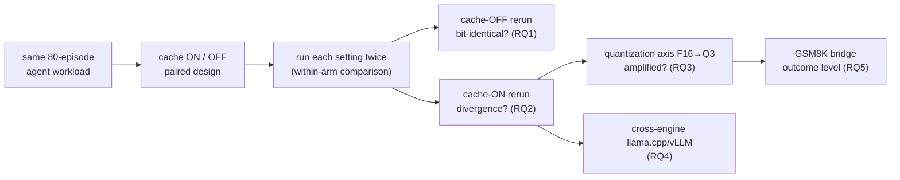

[Paper](https://arxiv.org/abs/2609.04748v1)
## Same Request, Different Answer: Prefix Caching Makes Serving Non-Reproducible, and Quantization Amplifies It

> **TL;DR** — Prefix caching is billed as a "transparent optimization," but it is not transparent. With caching off, repeated runs of the same workload are **bit-identical across all 10 configurations × 80 episodes = 800 runs** (source: Tab. 2); with caching on, agent trajectories change in **36.2% of episodes at 16 bits and 75.0% under 4-bit quantization** (source: §IV-D). Yet average accuracy does not move — this is not "degradation" but "instability," and the two call for different responses (source: §IV-F, §V).

---

## Core Idea

Prefix caching is a technique that, when consecutive requests share a prefix of tokens, reuses already-computed Key/Value tensors to avoid recomputing them. Every major serving stack ships it, and most **enable it by default** (source: §I). In long-running agent pipelines it delivers well-documented gains: **41–80% lower cost and 13–31% shorter TTFT** (source: §I, [4]).

This optimization rests on an implicit promise: that reusing computation already performed is an implementation detail invisible above the serving layer. **Send the same request with the same sampling parameters, and the same answer should come back whether the cache is warm or cold** (source: §I). The paper's central claim is that this promise breaks — and that it is the first to measure precisely how much it breaks.

> **The authors claim that "by enabling prefix caching, reused KVs change the floating-point accumulation order and flip token decisions across decision boundaries, so the server's output becomes a function not of 'the request alone' but of 'the server's own recent history (the cache state)', and this divergence is amplified the coarser the weight quantization gets."** (source: §I, §IV-D)

Prior work had already shown that, in single-turn arithmetic, the FP16 cache and recomputation paths are not numerically equivalent ([7]), and that merely switching backends can swing benchmark scores by up to 16.6 points ([8]). But neither measured, under controlled conditions, **how often this optimization goes wrong in the very workload it was built to accelerate: multi-turn agents** (source: §I). That is precisely the gap this paper fills.

---

## Background: The Problem They Address

### The problem: cache hits change floating-point operation order

The path that reads cached Key/Values and the path that recomputes them differ in the **order** in which floating-point accumulation is carried out in attention. But floating-point addition is **non-associative**. So the two paths produce numbers that differ subtly in the **low-order bits** of the logits (source: §I, §IV-B).

In most cases this difference is invisible. But **every so often it pushes a token's probability across a decision boundary**, and the sampled token changes as a result (source: §I). In a single turn that is a curiosity; in an agent loop that token can become **part of a tool call**, the tool call determines the next observation, and the observation determines the rest of the episode (source: §I).

### Where related work falls short: it knows "that" it is a problem, not "how much"

Related work falls into three strands (source: §II).

| Direction | Representative work | What it showed | What it missed |
|---|---|---|---|
| **Deterministic inference** | Thinking Machines [11], SGLang [12] | Reduction-order variation between prefill and cache is a source of nondeterminism | Proposes fixes such as batch-invariant kernels, but **the magnitude under default settings** is unmeasured |
| **Numerical non-equivalence** | Chodavarapu & Xu [7] | Cached and recomputed decoding differ numerically in FP16 | Single-turn arithmetic only, **no quantization factor** |
| **Backend variation** | Pape et al. [8] | Changing only the backend moves scores by up to 16.6 points | **Blames prefix caching without isolating it** as the cause |

In particular, [7] reported a directional **systematic bias**, and SGLang's determinism-mode benchmarks were run **with the radix cache disabled** (source: §II-B). In other words, the industry has been issuing the guidance "use caching aggressively" without measuring its behavioral consequence — reproducibility (source: §II-A). This paper is that measurement.

### The gap this paper fills

This paper measures caching directly on the workload it accelerates — **multi-turn agent tool use** — while holding every other source of nondeterminism fixed through batch size 1, serial requests, a fixed seed, and greedy decoding. On top of that it adds, for the first time, a **quantization axis** and **two independently implemented serving engines** (source: §I).

---

## The Approach: A Paired, Cache-Controlled Measurement Design

This paper's contribution is not a new model or algorithm but a **measurement methodology**. The core of the design is a **paired design** that varies "only the cache setting," plus a **within-arm (against-itself) comparison** that runs each setting **twice** (source: §III-B).

### Experiment protocol (§III-B)

- **Model × quantization**: Qwen2.5-7B (F16/Q8_0/Q4_K_M/Q3_K_M), Llama-3.1-8B (Q8_0/Q4_K_M/Q3_K_M), Qwen2.5-14B (Q4_K_M) — **10 configurations** total (source: Tab. 2).
- **Engines**: two of them, llama.cpp (b10434, commit `7e4c0a9`, GGUF) and vLLM 0.11.0 (PyTorch 2.8.0+cu128, transformers 4.57) (source: §III-B).
- **Decoding fixed**: greedy, temperature 0, seed fixed at 42, the same seed applied to every request (source: §III-B).
- **Batch size 1 + serial requests**: continuous batching is itself a source of nondeterminism, so it is eliminated entirely (source: §III-B).
- **KV cache precision**: fixed at 16-bit FP across all arms — arms serving quantized weights still keep the same cache precision (source: §III-B).
- **Hardware**: NVIDIA RTX 4090 (24 GB, compute capability 8.9), Ubuntu 24.04, CUDA 12.6 (source: §III-B).

Two properties of the design carry the argument. First, **each configuration is run through twice in full**, comparing an arm with itself. The within-arm comparison of cache-disabled arms is a **validity check**: if differences show up there, some nondeterminism escaped our control (source: §III-B). Second, the cache setting is **verified at the server rather than assumed**. llama.cpp records, per response, "how many prompt tokens were served from cache," so cache exposure becomes a **measured, per-request variable** (source: §III-B).

### Workloads (§III-C)

- **Primary workload**: the multi-turn base category of the Berkeley Function Calling Leaderboard (BFCL), where an agent calls tools in a stateful API simulation environment and is scored by comparing the final environment state and call sequence against the reference. Episodes are selected by a **fixed rule (the first 80 in ascending identifier order)**. About 10 requests per episode on average (7–13 depending on the configuration), and contexts grow to several thousand tokens (source: §III-C).
- **Secondary workload**: GSM8K single-turn arithmetic — a link to earlier single-turn work and an outcome measure whose accuracy does not hit the floor (89–93%) (source: §III-C).

The overall flow is as follows.

---

## How It Works: A Concrete Walkthrough

Since prose does not quite land, let us walk through "why the cache changes the answer" on a very small example.

### ① Floating-point addition depends on order

Because floating-point approximates to finite precision, adding the same numbers yields different results depending on the **order in which they are grouped** (source: §I).

$$
(0.1 + 0.2) + 0.3 \;\neq\; 0.1 + (0.2 + 0.3)
$$

FP16 (half precision) has only about three significant digits, so this non-associativity shows up readily in the **low-order bits of the logits**. Prefix caching changes exactly this accumulation order: the recomputation path adds keys/values in a specific tile order, while the cache-hit path reads an already-stored **partial sum** and continues from it (source: §I, §IV-B).

### ② Low-order bit differences flip tokens

Suppose the logits of two competing tokens, A and B, are nearly tied.

| Path | logit(A) | logit(B) | argmax |
|---|---|---|---|
| Recompute (cold) | 0.5012 | 0.5010 | **A** |
| Cache hit (warm) | 0.5009 | 0.5011 | **B** |

The difference sits in the fourth decimal place — completely invisible, yet it flips the **argmax (the highest-probability token)** (source: §I, §IV-B). Most tokens survive because their margins are large, but every time a "near tie" appears, there is a chance to cross a decision boundary.

### ③ In an agent loop, one token changes the whole episode

In a single turn it would end as "the answer's wording came out slightly different." But in an agent loop that token can become part of a **tool call**:

1. The changed token → **a different tool call** (e.g., `get_weather("Seoul")` → `get_weather("Suwon")`)
2. A different tool call → **a different observation** comes back
3. A different observation → **every later turn changes**

Because an episode chains about 10 requests, a single token changed early propagates through the remaining turns. That is how "per-request divergence looks small but composes into something large at the episode level" (source: §IV-B).

The mechanism itself is not new. The contribution is its **magnitude and causal decomposition**. In particular, §IV-D explains "why quantization amplifies" through the margin structure: coarser quantization **compresses the gap between competing tokens' logits**, so the candidates sit closer together and a smaller numerical perturbation suffices to invert their order (source: §IV-D).

---

## Evaluation: Key Results

### RQ1 — With the cache off, output is bit-identical (§IV-A)

For every configuration, the 80-episode workload was run **twice** with caching disabled, comparing per-request token identifiers. **Not a single episode differed** (source: §IV-A). Across both engines and every format from F16 to 3-bit k-quantization, the second run reproduced the first exactly. Across the 10 configurations that is **0/800 episodes**, pinning the ceiling on any other source of nondeterminism at **0.5%** (95% CI) (source: §IV-A, Tab. 2).

What this result permits matters: under these conditions (greedy + fixed seed + batch 1 + serial), **the serving stack is a deterministic function of its input**. So none of the divergence observed from here on can be blamed on sampling, the scheduler, batch composition, or engine noise (source: §IV-A).

### RQ2 — With the cache on, output diverges, and the culprit is a "second cache layer" (§IV-B, §IV-C)

The **cross-arm comparison (cache ON vs. OFF)** shows that enabling the cache changes agent trajectories in **36.2%–91.2% of episodes depending on the configuration** (source: §IV-B, Tab. 2). Divergence starts early: the median index of the first diverging request is **the 1st–4th of roughly 10**, and the median index of the first diverging token within that request is **3.5–17** (source: §IV-B).

The surprise comes out in the **run-to-run comparison**. Re-running the cache-ON arm against itself splits 8.8%–77.5% of episodes, and the cause is a **second layer, distinct from the prefix cache this paper studies: llama.cpp's server-level host-memory prompt cache** (source: §IV-B, §IV-C). This layer is enabled by default at 8192 MiB; it was introduced in October 2025, so evaluations before that were unaffected while evaluations after it were **silently contaminated** (source: §IV-C).

Turning off that one layer brings repeated cache-ON runs into agreement on **79/80 episodes**. In short: **"the cache path is reproducible; what is not reproducible is the state that the path reads"** (source: §IV-C).

**Three experiments to isolate the cause** (all on Qwen2.5-7B @ Q4_K_M, llama.cpp) (source: §IV-C):

| Experiment | Variable | Result |
|---|---|---|
| **Execution-order crossover** | Whether a cache-OFF pass is interleaved | Order matters only while the prompt-cache layer is active (38.8% → 77.5%); when inactive, it stays at 1.2% |
| **Single-flag toggle** | Host prompt cache ON/OFF | Inactive 1/80 (1.2%, CI 0.2–6.8) vs. default 31/80 (38.8%, CI 28.8–49.7) — **one flag is worth 37.5 pp** |
| **Cache-state restoration** | 40 items × 4 runs (2 recompute + 2 cached) | Recompute path reproduces 40/40 and cache path 40/40, yet the two paths disagree with each other in **14/40** |

The third experiment is decisive. When the state is restored to a known point, **each of the two paths reproduces perfectly on its own, but they differ from each other**. Divergence is thus a function of **cache state**, not residual randomness inside a path (source: §IV-C). Figure 1 summarizes it: cache-OFF re-runs 0.0%, cache-ON re-runs (second layer off) 1.2%, cache-ON re-runs (default) 38.8%, and cache-ON vs. OFF (within one run) 81.2% (source: Fig. 1).

### RQ3 — Quantization amplifies divergence (§IV-D)

For Qwen2.5-7B on llama.cpp, the cross-arm divergence rate rises monotonically as quantization gets coarser (source: Tab. 2, Fig. 2):

| Format | F16 | Q8_0 | Q4_K_M | Q3_K_M |
|---|---:|---:|---:|---:|
| Cross-arm divergence | 36.2% | 61.3% | 75.0% | 77.5% |
| Controlled-setting remeasurement | 40.0% | — | 81.2% | 77.5% |

The trend test (Cochran–Armitage) gives **z = 5.68, p = 1.3×10⁻⁸**, strong monotonicity (source: §IV-D). Llama-3.1-8B goes the same way — Q8_0 55.0% → Q4_K_M 70.0% → Q3_K_M 68.8% (source: Tab. 2). Two points of interpretation:

- **Quantization is a multiplier, not the cause**: divergence already sits at 36.2% at 16 bits, so the effect exists without quantization (source: §IV-D).
- **The amplification saturates at the coarsest settings**: Q4_K_M and Q3_K_M are within a few points of each other, and their confidence intervals overlap. At 4 bits and below, quantization error already constrains the output enough that the cache path's extra perturbation has less room to flip the argmax (source: §IV-D).

### RQ4 — The two engines point the same way (§IV-E)

On the independently implemented vLLM, too, the cache-OFF arm is bit-identical and the cache-ON arm is not — but the magnitudes differ substantially: at 16 bits vLLM's run-to-run divergence is 8.8% (llama.cpp 20.0%), while its cross-arm divergence is actually higher, 62.5% (source: §IV-E, Tab. 2). That combination suggests "vLLM's cache path is highly self-consistent, yet it mostly differs from its own recomputation baseline." Differences in block-reuse policy, kernel selection, or whether chunked prefill is used could be responsible, but the authors state that they **measure only and do not decompose the cause** (source: §IV-E).

One disclosure about vLLM: its completions endpoint **leaves the cached-token field null**, so cache exposure cannot be read from the response alone. Checking the engine logs shows the hit rate rising from 87.1% to 99.1% (226 observations), confirming the cache is actually in play (source: §IV-E).

### RQ5 — Individual answers flip, but average accuracy does not move (§IV-F)

On the GSM8K bridge, each item was served four times (2 recompute + 2 cache hits). **In every configuration each path is perfectly deterministic internally** (cold 200/200, warm 200/200), yet divergence between the two paths climbs from **F16 3.5% → Q8_0 44.5% → Q4_K_M 41.5% → Q3_K_M 48.0%** (source: Tab. 3). Aggregated over 5 configurations and 1300 items, answer flips attributable to the cache path number **20** (source: §IV-F).

The decisive pattern is the direction: of the 20 flips, **13 favor the cache path and 7 favor recomputation** — under the exact McNemar test **p = 0.26**, and no individual configuration comes anywhere close to significance (source: §IV-F). That is, **individual answers flip in both directions while average accuracy (89–93%) stays put**. At the observed discordant rate of 1.54%, the power to detect a **1 pp net accuracy shift is 81%**, so the evidence supports "instability," not "degradation" (source: §IV-F).

The authors report one more trap: the scorer used at collection time accepted only the answer format the prompt demanded, yet the model answered **11–38%** of the responses correctly in a different form and was marked wrong for the format alone. That inflated the flip count about fourfold; it was resolved by re-deriving answers from the stored response text with numeric comparison (source: §IV-F).

---

## Our Take: Strengths, Limitations, and Why This Matters

### Strengths

1. **It measured "how much"** — that floating-point addition is non-associative was already known, but "36.2–91.2% of agent trajectories change" does not follow from it. Quantifying the magnitude with a controlled paired design is the essential contribution (source: §I, §IV-B).
2. **It decomposed the causes precisely** — it ruled out execution order, showed that **a single flag — the second cache layer (the prompt cache) — explains 37.5 pp**, and with the state-restoration experiment pinned down the nature of a system that is "deterministic yet not reproducible" (source: §IV-C).
3. **First to establish the interaction with quantization** — the claim that "coarser quantization amplifies divergence" is established with a monotonic trend test (z=5.68, p=1.3×10⁻⁸) (source: §IV-D).
4. **Methodological honesty** — it notes that Wilson intervals can be anticonservative because of cache-state dependence, runs a moving-block bootstrap alongside, and discloses both the raw and the corrected figures rather than hiding anything (source: §III-E, §IV-F). It also uses the benchmark's own scorer unmodified, keeping the scores independent of the instrumentation (source: §III-E).

### Limitations and critique

1. **Limited external validity** — it is confined to open-weight models of 7–14B parameters, a single consumer GPU (RTX 4090), and two English benchmarks. Frontier-scale models, hosted endpoints, and multi-tenant load (where other users' traffic pollutes the cache) could differ; the authors state that they only expect the direction to be "more history dependence" without measuring it (source: §VI).
2. **No agent-outcome-level conclusions** — BFCL success rates at this model scale sit on the floor at 1.2%–18.8%, so no conclusion can be drawn about agent task **success rates**. The outcome-level conclusion rests entirely on single-turn GSM8K (source: §IV-F, §VI).
3. **Unresolved variables on the vLLM path** — run-to-run divergence between the two vLLM sessions disagrees (8.8% vs. 27.5%), and the cause (launch script, GPU memory fraction, machine/driver version) could not be isolated. vLLM establishes only the direction; llama.cpp pins down the magnitude (source: §IV-C).
4. **A single-author technical report** — the work of one independent researcher at the IEEE Access submission stage, so the depth and scale of peer review are limited (source: §I footnote, §VI).

### Why it still matters

The real value of this work is that it nails down with data the proposition that "**cached serving is not on average bad — it is just not reproducible**." Those are different problems demanding different responses: the former calls for correction, the latter for **disclosure** (source: §VII). That serving history produces perturbations **far larger** than the "few-point differences" that benchmark evaluations routinely handle — a majority of trajectories changing — is a fundamental warning to current evaluation and reproducibility practices (source: §V-B).

---

## Next Steps: The Road Ahead

The author's stated immediate recommendations, together with reasonable extensions given the limitations, are as follows.

- **Configuration-level disclosure (immediate, low cost)** — evaluation and deployment records should state, alongside the decoding parameters, the **serving engine, version, and whether prefix caching was enabled** (source: §V-B, §VII).
- **Per-request logging of cache exposure** — llama.cpp reports cached tokens per request, but vLLM 0.11.0 leaves it null. If engines reported cache exposure consistently, non-reproducibility would at least be detectable after the fact (source: §V-A).
- **Extend determinism modes to cover cached execution** — modes that span cached execution, like SGLang's determinism mode, already exist ([12]); this paper measured how large the gap is under default settings (source: §VII).
- **Generalize across scale and environments** — verify whether the same history dependence holds and amplifies at frontier scale, on hosted endpoints, and under multi-tenant load (source: §VI).
- **Resolve the open cause decomposition** — isolate the cause of vLLM's session-to-session disagreement (launch script/memory fraction/driver) and the effect of block reuse and chunked prefill on divergence rates (source: §IV-E).
- **Guide reproducible workflows** — establish practical guidance for workflows that need repeated runs, while keeping a path to reproducibility that does not require "turning the cache off" (fixed cache settings + resetting state at run boundaries) (source: §V-A).

---

### Summary

| Item | Content |
|---|---|
| Problem | Prefix caching changes floating-point accumulation order and makes serving output non-reproducible |
| Idea | A paired design differing only in the cache setting, plus within-arm repetition, measures the magnitude, cause, and quantization interaction of the divergence |
| Method | BFCL multi-turn agent (80 episodes) + GSM8K bridge, greedy / seed 42 / batch 1 / serial, KV fixed at 16 bits |
| Models/engines | Qwen2.5-7B·14B, Llama-3.1-8B (F16–Q3_K_M), llama.cpp + vLLM 0.11.0, RTX 4090 |
| Key numbers | Cache-off 0/800 bit-identical; cross-arm divergence 36.2% (F16) → 75.0% (Q4); the second cache layer explains 37.5 pp of run-to-run divergence |
| Outcome level | 20 answer flips (13 vs. 7, McNemar p=0.26); average accuracy unchanged → instability, not degradation |
| Recommendation | State the serving engine, version, and cache settings in evaluations, and log per-request cache exposure |
