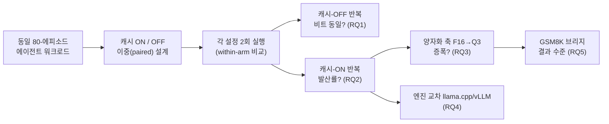

[논문 링크](https://arxiv.org/abs/2609.04748v1)
## 같은 요청, 다른 답: 프리픽스 캐시가 서빙을 비재현적으로 만들고, 양자화가 이를 증폭시킨다

> **TL;DR** — 프리픽스 캐시는 "투명한 최적화"로 여겨지지만 투명하지 않다. 캐시를 끄면 동일 워크로드의 반복 실행이 **10개 설정 × 80에피소드 = 800개 전부 비트 단위로 동일** 하게 재현되는 반면 (근거: Tab. 2), 캐시를 켜면 에이전트의 궤적이 **16비트에서 36.2%, 4비트 양자화에서 75.0%** 나 바뀐다 (근거: §IV-D). 그런데 평균 정확도는 움직이지 않는다 — 이것은 "열화(degradation)"가 아니라 "불안정성(instability)"이며, 둘은 다른 대응을 요구한다 (근거: §IV-F, §V).

---

## 핵심 아이디어

프리픽스 캐시는 연속된 요청이 앞부분 토큰을 공유할 때, 이미 계산해 둔 Key/Value 텐서를 재사용해 재계산을 피하는 기법이다. 모든 주요 서빙 스택이 이 기능을 탑재하고 대부분 **기본값으로 켜 두며** (근거: §I), 장기 실행 에이전트 파이프라인에서는 **비용 41~80% 절감, TTFT 13~31% 단축** 이라는 잘 문서화된 이득이 있다 (근거: §I, [4]).

이 최적화는 "이미 수행한 연산을 재사용하는 것은 서빙 계층 위에서는 보이지 않는 구현 디테일"이라는 암묵적 약속을 전제한다. **같은 요청과 같은 샘플링 파라미터를 보냈으면 캐시가 따뜻하든 차갑든 같은 답이 돌아와야 한다** 는 것이다 (근거: §I). 이 논문의 핵심 주장은 그 약속이 깨진다는 것, 그리고 그 깨짐의 크기를 처음으로 정밀 측정했다는 것이다.

> **저자들은 "프리픽스 캐시를 활성화함으로써, 재사용된 KV가 부동소수점 누적 순서를 바꿔 토큰 결정 경계를 뒤집게 만들고, 그 결과 서버 출력이 '요청 단독'이 아니라 '서버 자신의 최근 이력(캐시 상태)'의 함수가 되며, 이 발산은 가중치 양자화가 거칠어질수록 증폭된다"고 주장한다.** (근거: §I, §IV-D)

기존 연구는 이미 단일 턴 산술에서 FP16 캐시/재계산 경로가 수치적으로 동등하지 않음을 보였고([7]), 백엔드 선택만으로 벤치마크 점수가 최대 16.6pt 흔들린다는 것도 보고했다([8]). 그러나 둘 다 **"이 최적화가 원래 가속하려던 워크로드(멀티 턴 에이전트)에서 얼마나 자주 문제가 되는지"** 를 통제된 조건으로 측정하지는 못했다 (근거: §I). 바로 그 공백을 이 논문이 메운다.

---

## 배경: 그들이 해결한 문제

### 문제: 캐시 히트는 부동소수점 연산 순서를 바꾼다

캐시된 Key/Value를 읽는 경로와 재계산하는 경로는 어텐션에서 부동소수점 누적이 수행되는 **순서** 가 다르다. 그런데 부동소수점 덧셈은 **결합법칙이 성립하지 않는다(non-associative)** . 그래서 두 경로는 로짓의 **저차 비트(low-order bits)** 에서 미세하게 다른 숫자를 만든다 (근거: §I, §IV-B).

대부분의 경우 이 차이는 보이지 않는다. 하지만 **가끔 토큰 확률을 결정 경계 너머로 밀어버리고**, 그 결과 샘플링된 토큰이 바뀐다 (근거: §I). 단일 턴에서는 호기심거리에 그치지만, 에이전트 루프에서는 그 토큰이 **툴 호출의 일부** 가 될 수 있고, 툴 호출은 다음 관측(observation)을, 다음 관측은 그 뒤의 에피소드 전체를 결정한다 (근거: §I).

### 관련 연구의 한계: "그것이 문제다"는 알지만 "얼마나"는 모른다

관련 연구는 세 갈래로 정리된다 (근거: §II).

| 방향 | 대표 사례 | 무엇을 밝혔나 | 무엇이 빠졌나 |
|---|---|---|---|
| **결정론 추론** | Thinking Machines [11], SGLang [12] | 프리필/캐시 간 reduction-order 변이가 비결정론의 원인 | 배치-불변 커널 등 수정을 제안하되, **기본 설정에서의 크기** 는 미측정 |
| **수치 비동등성** | Chodavarapu & Xu [7] | FP16에서 캐시/재계산 디코딩이 수치적으로 다름 | 단일 턴 산술만, **양자화 요인 없음** |
| **백엔드 변이** | Pape et al. [8] | 백엔드만 바꿔도 점수 최대 16.6pt 이동 | 프리픽스 캐시를 원인으로 **지목만 하고 분리 못함** |

특히 [7]은 방향성 있는 **체계적 정확도 편향(systematic bias)** 을 보고했고, SGLang의 결정론 모드 벤치마크는 **radix cache를 꺼 둔 채** 돌렸다 (근거: §II-B). 즉 업계는 "캐시를 공격적으로 쓰라"는 지침을, 그 행동적 결과(재현성)를 측정하지 않은 채 내려왔다 (근거: §II-A). 이 논문은 그 측정이다.

### 이 논문이 채우는 공백

이 논문은 **캐시를 가속 대상 워크로드(멀티 턴 에이전트 툴 사용)에서 직접, 배치 크기 1·직렬 요청·고정 시드·greedy 디코딩으로 다른 모든 비결정론 원인을 통제한 채** 측정한다. 여기에 **양자화 축(quantization axis)** 과 **두 개의 독립 서빙 엔진** 을 처음으로 추가한다 (근거: §I).

---

## 새로운 접근법: 이중(paired) 캐시-통제 측정 설계

이 논문은 새 모델이나 새 알고리즘이 아니라 **측정 방법론** 을 기여한다. 설계의 핵심은 "오직 캐시 설정만 다르게" 만드는 **이중(paired) 설계** 와, 각 설정을 **두 번** 돌리는 **within-arm(자기 자신 대비) 비교** 이다 (근거: §III-B).

### 실험 프로토콜 (§III-B)

- **모델 × 양자화**: Qwen2.5-7B(F16/Q8_0/Q4_K_M/Q3_K_M), Llama-3.1-8B(Q8_0/Q4_K_M/Q3_K_M), Qwen2.5-14B(Q4_K_M) — 총 **10개 설정** (근거: Tab. 2).
- **엔진**: llama.cpp(b10434, commit `7e4c0a9`, GGUF)와 vLLM 0.11.0(PyTorch 2.8.0+cu128, transformers 4.57) 두 개 (근거: §III-B).
- **디코딩 고정**: greedy, 온도 0, 시드 42 고정, 모든 요청에 동일 시드 (근거: §III-B).
- **배치 크기 1 + 직렬 요청**: 연속 배칭(continuous batching) 자체가 비결정론 원인이므로 아예 제거 (근거: §III-B).
- **KV 캐시 정밀도**: 모든 arm에서 16비트 FP 고정 — 양자화된 가중치를 서빙하는 arm에서도 캐시 정밀도는 동일하게 유지 (근거: §III-B).
- **하드웨어**: NVIDIA RTX 4090(24 GB, compute capability 8.9), Ubuntu 24.04, CUDA 12.6 (근거: §III-B).

두 가지 설계 속성이 논거를 떠받친다. 첫째, **각 설정을 두 번 전체 실행** 해 "같은 arm을 자기 자신과 비교"한다. 캐시-비활성화 arm의 within-arm 비교는 **내적 타당성 검증 장치** 이다 — 여기서 차이가 나면 우리가 통제 못 한 비결정론이 있다는 뜻이기 때문이다 (근거: §III-B). 둘째, 캐시 설정은 **가정이 아니라 서버에서 검증** 한다. llama.cpp는 응답마다 "몇 개의 프롬프트 토큰이 캐시에서 서빙됐는지"를 기록하므로, 캐시 노출이 **측정된 요청별 변수** 가 된다 (근거: §III-B).

### 워크로드 (§III-C)

- **주 워크로드**: Berkeley Function Calling Leaderboard(BFCL)의 멀티 턴 베이스 카테고리 — 상태 있는 API 시뮬레이션 환경에서 에이전트가 툴을 호출하고, 최종 환경 상태·호출 시퀀스를 참조와 비교해 점수를 매긴다. 에피소드는 **고정 규칙(오름차순 식별자로 앞 80개)** 으로 선택. 에피소드당 평균 약 10개 요청(설정에 따라 7~13개), 컨텍스트는 수천 토큰까지 자란다 (근거: §III-C).
- **부 워크로드**: GSM8K 단일 턴 산술 — 사전 단일 턴 연구와의 연결고리이자, 정확도가 바닥에 붙지 않는(89~93%) 결과 측정 수단 (근거: §III-C).

전체 흐름은 다음과 같다.

---

## 작동 원리: 구체적인 예시로 살펴보기

말로는 와닿지 않으니, "캐시가 왜 답을 바꾸는지"를 아주 작은 예시로 따라가 보자.

### ① 부동소수점 덧셈은 순서에 따라 다르다

부동소수점은 유한한 자릿수로 근사하기 때문에, 같은 숫자들을 더해도 **묶는 순서** 에 따라 결과가 달라진다 (근거: §I).

$$
(0.1 + 0.2) + 0.3 \;\neq\; 0.1 + (0.2 + 0.3)
$$

FP16(절반 정밀도)은 유효숫자가 약 3자리 정도에 불과해, 이 비결합성이 **로짓의 저차 비트** 에 쉽게 나타난다. 프리픽스 캐시는 정확히 이 누적 순서를 바꾼다: 재계산 경로는 키/밸류를 특정 타일 순서로 더하고, 캐시 히트 경로는 이미 저장된 **부분합(partial sum)** 을 읽어 이어 붙인다 (근거: §I, §IV-B).

### ② 저차 비트 차이가 토큰을 뒤집는다

두 경쟁 토큰 A, B의 로짓이 거의 동률이라고 하자.

| 경로 | 로짓(A) | 로짓(B) | argmax |
|---|---|---|---|
| 재계산(cold) | 0.5012 | 0.5010 | **A** |
| 캐시 히트(warm) | 0.5009 | 0.5011 | **B** |

차이는 소수점 아래 넷째 자리 — 완전히 눈에 보이지 않지만, **argmax(가장 높은 확률의 토큰)** 를 뒤집는다 (근거: §I, §IV-B). 대부분의 토큰은 마진이 커서 무사하지만, "거의 동률"인 토큰이 등장할 때마다 결정 경계를 넘을 기회가 생긴다.

### ③ 에이전트 루프에서는 한 토큰이 에피소드 전체를 바꾼다

단일 턴이면 "답의 철자가 살짝 달라졌다"고 끝난다. 하지만 에이전트 루프에서는 그 토큰이 **툴 호출** 의 일부가 될 수 있다:

1. 변경된 토큰 → **다른 툴 호출** (예: `get_weather("서울")` → `get_weather("수원")`)
2. 다른 툴 호출 → **다른 관측(observation)** 이 반환됨
3. 다른 관측 → **그 뒤의 모든 턴이 달라짐**

에피소드는 약 10개 요청을 사슬처럼 잇기 때문에, 앞 단계에서 바뀐 토큰 하나가 나머지 턴 전체로 전파된다. 그래서 "요청 단위 발산률은 작아 보이는데 에피소드 단위로는 크게 합성"되는 것이다 (근거: §IV-B).

이 메커니즘 자체는 새로운 게 아니다. 논문의 기여는 그 **크기와 원인 분리** 이다. 특히 "양자화가 왜 증폭하는가"는 §IV-D에서 margin 구조로 설명한다: 거친 양자화는 경쟁 토큰 로짓 간 **간격(gap)을 압축** 하므로, 후보들이 더 가까이 붙어 더 작은 수치 섭동으로도 순서가 뒤집힌다 (근거: §IV-D).

---

## 성능 검증: 주요 결과

### RQ1 — 캐시를 끄면 비트 단위로 동일하다 (§IV-A)

모든 설정에서 80-에피소드 워크로드를 캐시 비활성화 상태로 **두 번** 실행하고 요청 단위로 토큰 식별자를 비교했다. **단 한 에피소드도 다르지 않았다** (근거: §IV-A). 두 엔진, F16부터 3비트 k-양자화까지 전 포맷에서 두 번째 실행이 첫 번째를 정확히 재현했다. 10개 설정을 합치면 **0/800 에피소드**, 즉 다른 비결정론 원인의 상한이 **0.5%** (95% CI)로 묶인다 (근거: §IV-A, Tab. 2).

이 결과가 허용하는 것은 중요하다: 이 조건(greedy + 고정 시드 + 배치 1 + 직렬)에서 **서빙 스택은 입력의 결정론적 함수** 이다. 따라서 이후 관측되는 모든 발산은 샘플링·스케줄러·배치 조성·엔진 노이즈 탓이 될 수 없다 (근거: §IV-A).

### RQ2 — 캐시를 켜면 발산하고, 그 이유는 "제2의 캐시 레이어"다 (§IV-B, §IV-C)

**교차-arm 비교(캐시 ON vs OFF)** 를 보면, 캐시 활성화가 에이전트 궤적을 **설정에 따라 36.2%~91.2%** 의 에피소드에서 바꾼다 (근거: §IV-B, Tab. 2). 발산은 초기에 시작된다: 첫 번째로 달라지는 요청의 중앙값 인덱스는 **약 10개 중 1~4번째**, 그 요청 안에서 첫 번째로 달라지는 토큰의 중앙값 인덱스는 **3.5~17번째** 이다 (근거: §IV-B).

놀라운 발견은 **재실행(run-to-run)** 비교에서 드러난다. 캐시-ON arm을 자기 자신과 다시 돌리면 8.8%~77.5%가 갈라지는데, 이는 **llama.cpp의 서버 수준 호스트-메모리 프롬프트 캐시** 라는, 논문이 연구하는 프리픽스 캐시와는 **별개의 제2 레이어** 때문이다 (근거: §IV-B, §IV-C). 이 레이어는 8192 MiB로 기본 활성화돼 있고, 2025년 10월에 도입돼 그 이전 평가에는 영향이 없었지만 그 이후 평가는 **조용히 오염** 됐다 (근거: §IV-C).

이 레이어 하나만 끄면, 반복 실행한 캐시-ON arm은 **79/80 에피소드에서 일치** 한다. 즉 **"캐시 경로는 재현 가능하고, 재현 불가능한 것은 그 경로가 읽는 상태(state)다"** (근거: §IV-C).

**원인 분리를 위한 세 실험** (모두 Qwen2.5-7B @ Q4_K_M, llama.cpp) (근거: §IV-C):

| 실험 | 변수 | 결과 |
|---|---|---|
| **실행 순서 교차** | 캐시-OFF 패스 삽입 여부 | 프롬프트 캐시 레이어가 활성일 때만 순서가 작용 (38.8% → 77.5%); 비활성이면 1.2% 그대로 |
| **단일 플래그 변동** | 호스트 프롬프트 캐시 ON/OFF | 비활성 1/80(1.2%, CI 0.2~6.8) vs 기본 31/80(38.8%, CI 28.8~49.7) — **한 플래그가 37.5pp 차이** |
| **캐시 상태 복원** | 40개 항목 × 4회(재계산 2회 + 캐시 2회) | 재계산 경로 40/40, 캐시 경로 40/40 재현, 그러나 두 경로는 서로 **14/40에서 불일치** |

세 번째 실험이 결정적이다. 상태를 알려진 지점으로 되돌리면 **두 경로 각각은 완벽히 재현되면서도 서로는 다르다**. 발산은 경로 내 잔여 무작위성이 아니라 **캐시 상태의 함수** 라는 뜻이다 (근거: §IV-C). Figure 1이 이를 요약한다: 캐시-OFF 재실행 0.0%, 캐시-ON 재실행(제2 레이어 끔) 1.2%, 캐시-ON 재실행(기본) 38.8%, 캐시-ON vs OFF(동일 실행 내) 81.2% (근거: Fig. 1).

### RQ3 — 양자화가 발산을 증폭시킨다 (§IV-D)

Qwen2.5-7B, llama.cpp의 교차-arm 발산률은 양자화가 거칠어질수록 단조 증가한다 (근거: Tab. 2, Fig. 2):

| 포맷 | F16 | Q8_0 | Q4_K_M | Q3_K_M |
|---|---:|---:|---:|---:|
| 교차-arm 발산률 | 36.2% | 61.3% | 75.0% | 77.5% |
| 통제 설정 재측정 | 40.0% | — | 81.2% | 77.5% |

추세 검정(Cochran–Armitage) 결과 **z = 5.68, p = 1.3×10⁻⁸** 로 강한 단조성 (근거: §IV-D). Llama-3.1-8B도 Q8_0 55.0% → Q4_K_M 70.0% → Q3_K_M 68.8%로 같은 방향이다 (근거: Tab. 2). 두 가지 해석 포인트:

- **양자화는 원인이 아니라 배수(multiplier)다**: 16비트에서도 이미 36.2%의 발산이 존재하므로, 양자화 없이도 효과는 있다 (근거: §IV-D).
- **증폭은 가장 거친 설정에서 포화한다**: Q4_K_M과 Q3_K_M은 몇 포인트 안에 있고 신뢰구간이 겹친다. 4비트 이하에서는 양자화 오차가 이미 출력을 충분히 제약해, 캐시 경로의 추가 섭동이 argmax를 바꿀 여지가 줄어든다 (근거: §IV-D).

### RQ4 — 두 엔진이 같은 방향을 가리킨다 (§IV-E)

독립적으로 구현된 vLLM에서도 캐시-OFF arm은 비트 동일하고, 캐시-ON arm은 그렇지 않다. 다만 크기는 상당히 다르다: vLLM 16비트의 재실행 발산은 8.8% (llama.cpp 20.0%)인 반면, 교차-arm은 62.5%로 오히려 높다 (근거: §IV-E, Tab. 2). 이 조합은 "vLLM의 캐시 경로는 자기 일관성이 높으면서도 자신의 재계산 기준선과는 대부분 다르다"는 의미다. 블록 재사용 정책·커널 선택·청크 프리필 여부의 차이가 그 원인일 수 있으나, 저자들은 **측정만 하고 원인 분리는 하지 않는다** 고 명시한다 (근거: §IV-E).

vLLM에 대한 한 가지 공개: completions 엔드포인트가 **cached-token 필드를 null로 남겨** 캐시 노출을 응답만으로는 알 수 없다. 엔진 로그로 확인하면 히트율이 87.1% → 99.1% (226개 관측)로 상승해 캐시가 실제로 작동 중임이 보인다 (근거: §IV-E).

### RQ5 — 개별 정답은 뒤집히지만 평균 정확도는 움직이지 않는다 (§IV-F)

GSM8K 브리지에서 각 항목을 4회(재계산 2회 + 캐시 히트 2회) 서빙했다. **모든 설정에서 각 경로는 내부적으로 완벽히 결정론적**(cold 200/200, warm 200/200)이면서도, 두 경로 간 발산률은 **F16 3.5% → Q8_0 44.5% → Q4_K_M 41.5% → Q3_K_M 48.0%** 로 치솟는다 (근거: Tab. 3). 5개 설정 · 1300개 항목을 합치면, 캐시 경로에 귀속되는 정답 뒤집힘이 **20건** 발생한다 (근거: §IV-F).

결정적 패턴은 방향이다: 20건 중 **13건은 캐시 경로에 유리, 7건은 재계산에 유리** — 정확한 McNemar 검정에서 **p = 0.26**, 어떤 개별 설정도 유의성에 근접하지 않는다 (근거: §IV-F). 즉 **개별 항목의 정답은 양방향으로 바뀌는데 평균 정확도(89~93%)는 그대로다**. 관측된 discordant rate 1.54%에서, **1pp의 순 정확도 이동을 잡아낼 검정력은 81%** 이므로, 효과는 "열화"가 아니라 "불안정성"임이 지지된다 (근거: §IV-F).

저자들은 또 하나의 함정을 보고한다: 수집 시점 스코어러는 프롬프트가 요구한 답 형식만 정답으로 인정했는데, 모델이 **11~38%** 의 응답을 다른 형태로 맞게 답해 형식 때문에만 오답 처리됐다. 이는 뒤집힘 수를 약 4배 부풀렸고, 저장된 응답 텍스트에서 답을 수치 비교로 재도출해 해결했다 (근거: §IV-F).

---

## 우리의 관점: 강점, 한계, 그리고 이 연구가 중요한 이유

### 강점

1. **"얼마나"를 측정했다** — "부동소수점 덧셈은 비결합적"이라는 것은 알려진 사실이지만, 그로부터 "에이전트 궤적의 36.2~91.2%가 바뀐다"가 따라 나오지는 않는다. 통제된 paired 설계로 크기를 정량화한 것이 본질적 기여다 (근거: §I, §IV-B).
2. **원인을 정밀 분리했다** — 실행 순서를 배제하고, 제2 캐시 레이어(프롬프트 캐시)라는 **단일 플래그가 37.5pp를 설명** 함을 보였으며, 상태 복원 실험으로 "결정론적이되 재현 불가능한" 시스템의 성격을 정확히 규명했다 (근거: §IV-C).
3. **양자화와의 상호작용을 최초로 규명** — "거친 양자화가 발산을 증폭시킨다"는 명제를 단조 추세 검정(z=5.68, p=1.3×10⁻⁸)으로 확립했다 (근거: §IV-D).
4. **방법론적 정직성** — 캐시 상태 의존성 때문에 Wilson 구간이 반보수적일 수 있음을 지적하고 moving-block bootstrap을 병행하며, 결과를 은폐하지 않고 원본/보정 수치를 모두 공개한다 (근거: §III-E, §IV-F). 벤치마크 자체 스코어러를 수정 없이 써서 점수가 계측과 독립적이게 했다 (근거: §III-E).

### 한계와 비판

1. **외적 타당성 제약** — 7~14B 파라미터의 오픈웨이트 모델, 단일 소비자용 GPU(RTX 4090), 영어 벤치마크 2개에 국한된다. 프런티어 규모, 호스팅 엔드포인트, 멀티 테넌트 부하(타 사용자 트래픽이 캐시를 오염시키는 상황)에서는 다를 수 있으며, 저자들은 그 방향이 "더 많은 이력 의존성"일 것이라고 예상할 뿐 측정하지 않았다고 명시한다 (근거: §VI).
2. **에이전트 결과 수준 결론 부재** — 이 규모 모델의 BFCL 성공률은 1.2%~18.8%로 바닥에 붙어 있어, 에이전트 작업 **성공률** 에 대한 결론은 내리지 못한다. 결과 수준 결론은 GSM8K 단일 턴에 전적으로 의존한다 (근거: §IV-F, §VI).
3. **vLLM 경로의 미해결 변수** — vLLM 두 세션 간 재실행 발산률이 8.8% vs 27.5%로 불일치하며, 원인(런치 스크립트, GPU 메모리 분수, 머신/드라이버 버전)을 분리하지 못했다. vLLM은 방향만 확립하고 크기는 llama.cpp로 고정한다 (근거: §IV-C).
4. **단일 저자 기술 보고서** — IEEE Access 제출 단계의 독립 연구자 단독 저작으로, 동료 검토의 깊이와 규모가 제한적이다 (근거: §I 각주, §VI).

### 그래도 중요한 이유

이 연구의 진짜 가치는 "**캐시된 서빙은 평균적으로 나쁘지 않다. 다만 재현 가능하지 않다**"는 명제를 데이터로 못 박았다는 데 있다. 둘은 다른 문제이고 다른 대응을 요구한다. 전자는 교정(correction)을, 후자는 **공개(disclosure)** 를 요구한다 (근거: §VII). 벤치마크 평가가 일상적으로 다루는 "몇 포인트 차이"보다 **훨씬 큰** 섭동(궤적이 과반 바뀜)이 서빙 이력에서 나온다는 사실은, 현재의 평가·재현성 관행에 대한 근본적인 경고다 (근거: §V-B).

---

## 다음 단계는?: 앞으로의 길

저자가 명시한 즉각적 권고와, 한계를 감안한 합리적 확장은 다음과 같다.

- **구성 수준 공개 (즉각, 저비용)** — 평가와 배포 기록은 디코딩 파라미터와 함께 **서빙 엔진·버전·프리픽스 캐시 활성화 여부** 를 명시해야 한다 (근거: §V-B, §VII).
- **캐시 노출의 요청별 기록** — llama.cpp는 요청마다 cached-token을 보고하지만 vLLM 0.11.0은 null이다. 엔진이 캐시 노출을 일관되게 보고하면 비재현성이 최소한 사후에 탐지 가능해진다 (근거: §V-A).
- **결정론 모드의 캐시 커버 확장** — SGLang의 결정론 모드처럼 캐시 실행까지 포괄하는 모드가 이미 존재하며([12]), 기본 설정에서의 갭 크기를 이 논문이 측정했다 (근거: §VII).
- **스케일·환경 일반화** — 프런티어 규모 모델, 호스팅 엔드포인트, 멀티 테넌트 로드에서 동일한 이력 의존성이 유지·증폭되는지 검증 (근거: §VI).
- **미해결 원인 분리** — vLLM 세션 간 불일치의 원인(런치 스크립트/메모리 분수/드라이버)과, 블록 재사용·청크 프리필이 발산률에 미치는 영향 규명 (근거: §IV-E).
- **재현 가능한 워크플로 가이드** — "캐시를 끄지 않고" 재현성을 얻는 경로(캐시 설정 고정 + 실행 경계에서 상태 리셋)는 유지한 채, 반복 실행이 필요한 워크플로의 실무 지침 정립 (근거: §V-A).

---

### 요약

| 항목 | 내용 |
|---|---|
| 문제 | 프리픽스 캐시가 부동소수점 누적 순서를 바꿔 서빙 출력을 비재현적으로 만듦 |
| 아이디어 | 캐시 설정만 다른 paired 설계 + within-arm 반복으로 발산의 크기·원인·양자화 상호작용을 측정 |
| 방법 | BFCL 멀티 턴 에이전트(80에피소드) + GSM8K 브리지, greedy/시드 42/배치 1/직렬, KV 16비트 고정 |
| 모델/엔진 | Qwen2.5-7B·14B, Llama-3.1-8B (F16~Q3_K_M), llama.cpp + vLLM 0.11.0, RTX 4090 |
| 핵심 수치 | 캐시-OFF 0/800 비트 동일; 교차-arm 발산 36.2%(F16) → 75.0%(Q4); 제2 캐시 레이어가 재실행 발산의 37.5pp 설명 |
| 결과 수준 | 정답 뒤집힘 20건(13 vs 7, McNemar p=0.26), 평균 정확도 불변 → 불안정성이지 열화가 아님 |
| 권고 | 서빙 엔진·버전·캐시 설정을 평가에 명시하고, 요청별 캐시 노출을 기록하라 |
