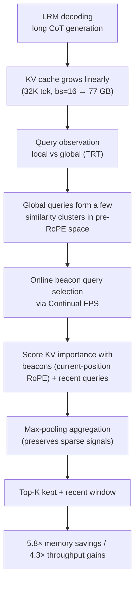

[Paper](https://arxiv.org/abs/2609.04971v1)
## Catch the Moment a Model "Revisits Its Thoughts": How BeaconKV Compresses Reasoning KV Caches 5.8× with Beacon Queries

> **TL;DR** — The KV cache of a Large Reasoning Model (LRM) grows linearly as it produces longer Chains-of-Thought (CoT). When Qwen3-4B generates 32K tokens at batch size 16, the KV cache alone exceeds **77 GB**, approaching the 80 GB GPU limit (source: §1). Existing compression methods predict future important tokens from **recent queries**, but this assumption breaks down during reasoning because of a phenomenon called Thought Revisiting Token (TRT), in which the model **re-reads distant past context (problem definition, solution plan)** (source: §3). Building on the geometric insight that the **global queries** behind TRT form a few clusters in embedding space, BeaconKV selects a **beacon query** to represent each cluster online via Continual FPS and compresses the KV cache accordingly. This achieves **up to 5.8× memory savings (77.0 → 13.3 GB)** and **4.3× throughput gains (82.3 → 356.4 tokens/s)**, while improving accuracy by up to **31.7 pp** over RPC and R-KV (source: §5.4, Fig. 8).

---

## Core Idea

The paper's central claim can be summarized in a single sentence.

> **The authors hypothesize that, by exploiting the observation that "global queries (TRT) cluster into a few similarity clusters in pre-RoPE query space" and keeping a small number of beacon queries that represent each cluster, the KV pairs that will be re-read in the future can be predicted without the full query history, thereby overcoming the "premature eviction" limitation of existing recent-query-based compression to achieve up to 5.8× memory savings and 4.3× throughput gains.** (source: §3.2, §4, §5.4)

Existing KV cache compression methods (RPC, R-KV) assume that **the recent queries at eviction time** are a reliable proxy for future attention patterns (source: §1, §2.2). The paper's core contribution is to demonstrate that this assumption **does not hold in long-horizon reasoning**, and to use instead **the geometric structure of query space**. In other words, "which tokens matter" is judged not by temporal recency but by the **representativeness of query direction** (source: §3.2, §4.2).

Three connected design choices underpin this idea (source: §4):

1. **Beacon query**: the cluster representative of the global queries that cause TRT. Together with recent queries, it forms the observation query set.
2. **Continual FPS**: an online selection algorithm that, without storing the full query history, keeps only geometrically diverse queries in a bounded buffer.
3. **Max-pooling scoring**: an aggregation scheme that preserves sparse but high-intensity TRT signals instead of diluting them with averaging.

---

## Background: The Problem They Set Out to Solve

### Problem 1: CoT inflates the KV cache linearly

LRMs deliberately generate **reasoning trajectories of tens of thousands of tokens** instead of simple short answers (source: §1). Because autoregressive decoding in Transformers must cache the Key/Value pairs of every previously generated token, the cache size scales **linearly** with sequence length (source: §2.1). In standard form:

$$
\text{KV-Cache(GB)} \approx
\frac{2 \cdot L \cdot H \cdot d_\text{head} \cdot \text{seq} \cdot \text{batch} \cdot \text{bytes/elt}}{10^9}
$$

Here $L$ is the number of layers, $H$ the number of KV heads, and $d_\text{head}$ the head dimension. The concrete case in the paper is that **Qwen3-4B generating 32K tokens at batch size 16 exceeds 77 GB in KV cache alone**, nearly exhausting a single 80 GB GPU (source: §1). Looking at the actual average output lengths on reasoning benchmarks, AIME24 reaches **about 13.4K–14.7K tokens per model** and LiveCodeBench **about 11.7K–14.1K tokens**, confirming that the pressure is real (source: Tab. 6, App A.2).

### Problem 2: "Recent queries" cannot predict the future

Recent attention-based eviction methods score each KV pair by the attention weights induced by the recent observation query set $Q_{obs}$ once the cache reaches the budget $B_{KV}$, keeping only the top-$B_{KV}$ (source: §2.2).

$$
s^{max}_j = \max_{\tau \in T^{obs}} w_{\tau,j},\qquad s^{mean}_j = \frac{1}{N_{obs}}\sum_{\tau \in T^{obs}} w_{\tau,j}
$$

The key assumption is that **recent queries represent the attention patterns of future decoding**. But because tokens are **generated on the fly** during LRM reasoning, which tokens will become important in the future is inherently hard to predict (source: §1).

### Problem 3: TRT — the model re-reads its past "solution plan"

Through an analysis of attention dynamics, the paper discovers a phenomenon it calls **Thought Revisiting Token (TRT)**. Certain decoding steps generate **global queries that redirect attention to distant early context (problem constraints, high-level solution plan)** across the reasoning trajectory, unlike **local queries** that focus only on nearby keys (source: §3.1). In Fig. 1(a), most queries (tokens 1066–1092) focus on a local window (roughly tokens 900–1092), whereas tokens 1068 and 1090 redirect attention to the **early segment of roughly tokens 100–450** (source: Fig. 1).

Global queries are not confined to a single layer or head but appear **sporadically and unpredictably across many layers and heads** (source: §3.1, Fig. 3). As a result, methods that rely only on recent queries **permanently evict** distant KV pairs that future TRT would revive, degrading reasoning quality under a limited memory budget (source: §3.1).

### The gap this paper fills

Related work falls broadly into four strands: attention-score-based eviction (SnapKV, RPC, R-KV, H2O, etc.), sparse attention (Quest, Minference, etc.), reasoning-length control (DEER, SEAL, InftyThink), and memory-augmented architectures (Titans, GNM) (source: §6). Yet even **reasoning-specific** eviction methods share the common assumption of "recent queries = a proxy for the future," and fail to handle the long-range dependency pattern of TRT. This paper fills that gap **without training (training-free)**, using only the geometry of query space (source: §1, §6).

---

## The New Approach: BeaconKV

BeaconKV is a **training-free** KV cache compression framework (source: §4). Its key insight is that "the context that is decisive for reasoning is re-read by **global queries that cluster in pre-RoPE query space**." It therefore adds **beacon queries** to the standard "recent query" baseline, proactively capturing future attention shifts (source: §4).

### 4.1 Periodic KV eviction (§4.1)

Eviction is triggered when the cache reaches the budget $B^{max}_{KV}$. Existing methods build the observation query set only from **the most recent 32 tokens or so**, giving low scores to distant tokens that are not currently attended to. BeaconKV extends the observation window to **geometric reference points from the past (beacons)** (source: §4.1, Fig. 5).

### 4.2 Selecting beacon queries with Continual FPS (§4.2)

The observation query set consists of two components:

- **Recent queries ($Q^{pre}_{recent}$)**: preserve local coherence.
- **Beacon queries ($Q^{pre}_{beacon}$)**: representatives of the global query clusters.

Beacons are selected by applying cosine-similarity-based Farthest Point Sampling (FPS) to **all pre-RoPE queries generated so far**. The reason for using the state **before** RoPE is applied is to rule out positional effects and capture purely geometric similarity (source: §4.2, App D.1).

**Naive FPS is memory-intensive.** Under GQA, query states are plentiful, so storing the full history reproduces the LRM's memory bottleneck. That is why the paper introduces an online algorithm called **Continual FPS** (source: §4.2): each attention head maintains a bounded buffer, and when the buffer reaches its maximum capacity $B^{max}_{Q}$, it is reduced via FPS to the minimum size $B^{min}_{Q}$.

$$
Q^{pre}_{obs} \leftarrow \text{FPS}\left(Q^{pre}_{obs},\ B^{min}_{Q}\right)
$$

This "fill-and-compress" scheme continuously represents the span of the reasoning trajectory **without unbounded memory growth** (source: §4.2). In Fig. 7, Continual FPS matches the accuracy of ideal offline selection methods such as K-Means Centroids, Centroid-Nearest, and Naive FPS while substantially lowering peak GPU memory (source: Fig. 7).

### 4.3 Attention-based scoring with beacon queries (§4.3)

At eviction time, BeaconKV goes through two steps.

1. **Query alignment**: beacon queries rotate RoPE to match **the current decoding step $t$**, simulating "where would a TRT read right now," while recent queries keep **their original generation position $\tau$** to preserve local signals (source: §4.3).
2. **Max-pooling aggregation**: for each head group $g$ under GQA, the observation queries and heads are aggregated with **max-pooling**. Because TRT is a **sparse but high-intensity** signal triggered by a specific global query, averaging dilutes it into background noise; the max preserves a KV pair as long as a single beacon judges it important (source: §4.3).

$$
\text{Score}[j] = \max_{h \in g}\, \max_{q \in Q_{obs}} W[h,q,j]
$$

Prefix tokens and recent tokens are then always kept, and the remaining budget is filled with the top-scoring KV pairs (source: §4.3, Alg. 2).

---

## How It Works: A Concrete Walkthrough

### ① Why FPS picks "cluster representatives"

FPS is a greedy algorithm that repeatedly picks the query that is **least similar to the representatives already chosen** (source: App D.1). It starts with the query having the lowest average cosine similarity to the rest (the least redundant), then adds the query whose **nearest-neighbor similarity $S_j$** to the current set is lowest.

$$
S_j = \max_{k \in I_{comp}} \cos(q_j, q_k),\qquad r = \arg\min_{j \notin I_{comp}} S_j
$$

Think of this in terms of 2D direction vectors (for unit vectors, cosine similarity equals the dot product). Suppose the queries cluster in three directions:

| Cluster | Direction | Meaning | Query count |
|---|:---:|---|---:|
| Local | $0^\circ$ | Current computation context | Many (dense) |
| Global 1 | $90^\circ$ | Problem constraints | Few |
| Global 2 | $180^\circ$ | High-level solution plan | Few |

With budget $m=3$, FPS starts at $180^\circ$ (the direction with the lowest average similarity, opposite the other clusters), then picks $90^\circ$, which has $\cos = 0$ with $180^\circ$, and finally $0^\circ$, the farthest from both global directions. The result is **$\{180^\circ, 90^\circ, 0^\circ\}$ — exactly one from each cluster**. Beacon queries thus represent "sparse but decisive" global clusters without missing them (source: §3.2, §4.2).

### ② A concrete flow of how beacons prevent eviction

Consider the attention scores as an example. Suppose a certain KV pair (an early solution-plan token) is largely ignored by the current local queries, but a single beacon query attends to it strongly.

| Observation query | Attention weight (for that KV pair) |
|---|---:|
| Recent query 1 | 0.01 |
| Recent query 2 | 0.02 |
| Beacon (global) | **0.85** |

With mean-pooling the score would be flattened to $\approx 0.29$ and the pair could be evicted, but max-pooling preserves **0.85**, so this KV pair survives (source: §4.3, Tab. 2). The full pipeline is shown below.

### ③ Why "Initial+Recent" is not enough

One might object: "why not just store the early queries?" The paper answers by constructing an **Initial+Recent** baseline (scoring with early queries plus recent queries). The result is that BeaconKV substantially outperforms it across all models and tasks — for instance, on Qwen3-4B AIME24, BeaconKV scores **33.33%** vs Initial+Recent's **19.58%** (budget 1024) (source: Tab. 3). Because early queries are a **fixed, limited history**, they fail to capture the diverse global revisiting patterns that emerge over long reasoning, whereas Continual FPS keeps extracting diverse beacons from the evolving query history (source: §5.3).

---

## Performance Evaluation: Key Results

**Setup**: 4 open-source LRMs (R1-Distill-Qwen-7B, R1-Distill-Llama-8B, Qwen3-4B, Qwen3-14B) × 4 benchmarks (AIME24, MATH-500, GPQA-Diamond, LiveCodeBench). Maximum generation of 32,768 tokens, top-p $0.95$, temperature $0.6$. AIME24 is averaged over 8 runs and the rest over 4, reporting pass@1 (source: §5.1).

### Accuracy: the gap is largest at low budgets (§5.2)

According to Fig. 8, BeaconKV achieves **the highest accuracy at the same budget**, with the largest advantage at low budgets. The maximum accuracy gain is **+31.7 pp on Qwen3-14B AIME24 at budget 1024**, achieved relative to existing compression methods (source: §5.2, Fig. 8).

### Efficiency: 5.8× memory savings, 4.3× throughput gains (§5.4)

Measured on Qwen3-4B with 32K generation on a single NVIDIA A100 80 GB (source: Tab. 4).

| Method | Budget | Batch | Throughput (tokens/s) | Decoding latency (s) | Peak memory (GB) | LiveCodeBench Acc (%) |
|---|---|---:|---:|---:|---:|---:|
| Full KV | – | 14 | 82.3 | 5573.4 | 77.0 | 54.4 |
| **BeaconKV** | 2K | 14 | **356.4** | **1287.3** | **13.3** | 51.1 |
| RPC | 2K | 192 | 725.4 | 8672.5 | 79.0 | 44.8 |
| **BeaconKV** | 2K | 192 | 704.8 | 8926.9 | 79.3 | **51.1** |
| RPC | 1K | 320 | 1380.8 | 7593.7 | 72.0 | 29.9 |
| **BeaconKV** | 1K | 320 | 1345.9 | 7790.9 | 72.5 | **42.2** |

Full KV shows a severe bottleneck on long decoding and cannot scale beyond batch size 14 with **77.0 GB** of peak memory. BeaconKV (budget 2K) reduces this to **13.3 GB (5.8×)**, achieving **82.3 → 356.4 tokens/s (4.3×)** throughput and **5573.4 → 1287.3 s** latency (source: §5.4).

**At the same budget, it only wins on accuracy**: at budget 2K (batch 192), BeaconKV matches RPC's throughput and memory while gaining **+6.3 pp** on LiveCodeBench accuracy; at budget 1K (batch 320) it gains **+12.3 pp** (source: §5.4). Against SnapKV, BeaconKV also reaches **42.2%** (SnapKV 30.9%, RPC 29.9%), leading substantially on accuracy at similar throughput and memory (source: Tab. 5, App A.1).

### Ablation: the rationale for three design choices (§5.3)

1. **Beacon vs recent query allocation** (Tab. 1, Qwen3-4B AIME24, budget 2048): over-allocating to beacons loses short-term context and hurts both latency and accuracy — (1,31) gives accuracy **63.5%** but latency **10871.3 s**. The balanced allocation (16,16) is optimal at **64.6%** accuracy and **4355.7 s** latency (source: Tab. 1).

2. **Max vs Mean aggregation** (Tab. 2, R1-Distill-Qwen-7B AIME24): Max dominates across all budgets, with the gap widening at lower budgets — at budget 256, Max scores **23.3** vs Mean's **18.8** (source: Tab. 2).

3. **Continual FPS's contribution** (Tab. 3): BeaconKV consistently beats Initial+Recent, which simply preserves early queries, showing that the key is not "preserving the starting point" but **dynamically capturing evolving global patterns** (source: §5.3).

---

## Our Take: Strengths, Limitations, and Why This Work Matters

### Strengths

1. **It starts from well-motivated observations** — the paper demonstrates the TRT phenomenon from multiple angles (attention distance distribution in Fig. 1, layer- and head-wise distribution in Fig. 3, cosine similarity and PCA in Fig. 4) before designing the method. It rests on "measured patterns," not "plausible intuition" (source: §3).
2. **It requires no training** — learning-based methods such as TRIM-KV, LightThinker, and Fast KVzip need task-specific fine-tuning and generalize poorly across domains. BeaconKV uses only the intrinsic structure of query embeddings, so it **applies to any LRM out of the box** (source: §6, §4).
3. **A clear principle of geometric representativeness** — it replaces the temporal assumption that "important tokens = recent tokens" with the spatial assumption that "important tokens = tokens re-read by the representatives of global clusters." Continual FPS realizes this principle within a memory bound (source: §4.2).
4. **System efficiency and accuracy are verified together** — by reporting accuracy (Fig. 8) alongside throughput, memory, and latency (Tabs. 4, 5), it shows the method is not merely "accurate."

### Limitations and critique

1. **Evaluation is limited to reasoning tasks** — as the authors acknowledge, generalization to **non-reasoning** workloads such as long-document retrieval, summarization, and general long-form generation is unverified (source: App C). If TRT is specific to reasoning, BeaconKV's advantage may shrink on non-reasoning tasks.
2. **No analysis of hyperparameter sensitivity** — the number of beacons (max 32, min 16), the number of recent queries (16), and the budget were only used with fixed settings. The optimal values may differ per model and task, but a systematic sensitivity analysis is left as future work (source: App C).
3. **Read the "5.8×" caveat** — the 5.8× memory saving comes from BeaconKV 2K (batch 14, 51.1%) vs Full KV (batch 14, 54.4%), but this comes with a **3.3 pp drop** in accuracy. "Near-lossless accuracy" only holds at certain budgets; the lower the budget, the more absolute accuracy falls relative to Full KV (source: Tab. 4, Fig. 8).
4. **Scoring overhead** — beacon-based scoring slightly increases decoding latency relative to RPC (7593.7 → 7790.9 s at 1K, batch 320). It is small in absolute terms, but it is exactly the cost the authors describe as "a small price for the accuracy gain" (source: App A.1).
5. **No direct comparison with learning-based methods** — the main baselines are limited to training-free methods such as SnapKV, RPC, and R-KV. There is no accuracy comparison against TRIM-KV, Fast KVzip, and the like (source: §5.1, §6).

### Why it still matters

The real bottleneck in LRM serving is **memory, not compute**. When serving tens of thousands of CoT tokens in batches, the KV cache exhausts the GPU first. BeaconKV's real contribution is that it attacks this bottleneck with the behavioral rationale of **"what the model actually re-reads."** By demonstrating the collapse of the recent-query assumption and replacing it with query-space geometry, it offers **measurable, principled** progress in LRM-specific KV compression (source: §3, §7).

---

## What's Next?: The Road Ahead

Given the directions and limitations stated by the authors, sensible extensions are as follows.

- **Verify generalization to non-reasoning workloads** — measure whether TRT exists in long-document retrieval, summarization, and general generation, and whether BeaconKV's advantage holds (source: App C).
- **Adaptive compression** — a strategy that, instead of fixing the number of beacons and the budget, adjusts them dynamically to the characteristics of the reasoning trajectory during decoding (source: App C).
- **Hyperparameter sensitivity analysis** — systematize the optimal per-model, per-task values and the robustness of the number of beacons, number of recent queries, and budget (source: App C).
- **Fair comparison with learning-based methods** — direct accuracy and efficiency comparison with TRIM-KV, Fast KVzip, etc. at the same budget.
- **Scaling to larger models and multi-GPU setups** — the current evaluation is limited to models up to 14B on a single A100 80 GB. Continual FPS's overhead and benefits should be verified on tens-of-billions LRMs and tensor-parallel environments (source: §5.4).
- **Combining with sparse attention** — beacon queries could be reused not only for KV eviction but also for deciding "where to look" in sparse attention (source: §6).

---

### Summary

| Item | Summary |
|---|---|
| Problem | Long CoT in LRMs grows the KV cache linearly (32K tok, bs=16 → 77 GB); existing recent-query compression prematurely evicts important distant tokens due to TRT |
| Observation | Global queries (TRT) form a few similarity clusters in pre-RoPE query space |
| Idea | Score KV importance with beacon queries representing each cluster (selected by Continual FPS) plus recent queries, aggregated with max-pooling |
| Nature | Training-free, architecture-agnostic |
| Models/Benchmarks | R1-Distill-Qwen-7B·Llama-8B, Qwen3-4B·14B × AIME24·MATH-500·GPQA-Diamond·LiveCodeBench |
| Key numbers | 5.8× memory savings (77.0→13.3 GB), 4.3× throughput gain (82.3→356.4 tok/s), up to +31.7 pp (accuracy) |
| Limitations | Non-reasoning workloads unverified, hyperparameter sensitivity unanalyzed, no comparison with learning-based methods |