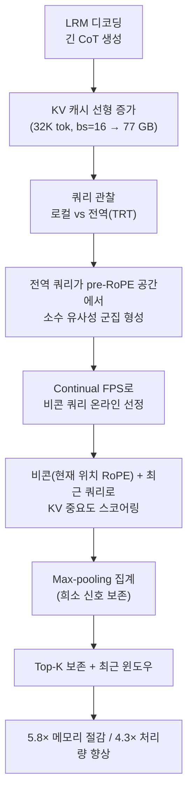

[논문 링크](https://arxiv.org/abs/2609.04971v1)
# 모델이 '생각을 다시 꺼내 보는' 순간을 잡아라: BeaconKV가 비콘 쿼리로 추론 KV 캐시를 5.8배 압축하는 법

> **TL;DR** — Large Reasoning Model(LRM)은 긴 Chain-of-Thought(CoT)를 생성할수록 KV 캐시가 선형으로 불어나, Qwen3-4B가 32K 토큰을 배치 크기 16으로 생성하면 KV 캐시만 **77 GB** 를 넘어 80 GB GPU 한계에 닿는다 (근거: §1). 기존 압축 기법들은 **최근 쿼리(recent queries)** 로 미래의 중요 토큰을 예측하는데, 추론 중에는 모델이 **멀리 떨어진 과거 맥락(문제 정의·풀이 계획)을 다시 읽는 Thought Revisiting Token(TRT)** 이라는 현상 때문에 이 가정이 무너진다 (근거: §3). BeaconKV는 TRT를 유발하는 **전역 쿼리(global query)** 가 임베딩 공간에서 소수의 군집을 이룬다는 기하학적 통찰을 바탕으로, 각 군집을 대표하는 **비콘 쿼리(beacon query)** 를 Continual FPS로 온라인 선정해 KV 캐시를 압축한다. 그 결과 **최대 5.8× 메모리 절감(77.0 → 13.3 GB)**, **4.3× 처리량 향상(82.3 → 356.4 tokens/s)** 을 달성하면서, RPC·R-KV 대비 최대 **31.7 pp** 의 정확도 향상을 얻는다 (근거: §5.4, Fig. 8).

---

## 핵심 아이디어

이 논문의 중심 주장은 한 문장으로 정리된다.

> **저자들은 "전역 쿼리(TRT)가 pre-RoPE 쿼리 공간에서 소수의 유사성 군집으로 뭉친다"는 관찰을 활용해, 각 군집을 대표하는 소수의 비콘 쿼리를 유지함으로써, 미래에 다시 읽힐 KV 쌍을 전체 쿼리 이력 없이 예측할 수 있고, 이로써 기존 최근-쿼리 기반 압축의 '조기 퇴출(premature eviction)' 한계를 극복해 최대 5.8× 메모리 절감과 4.3× 처리량 향상을 얻을 수 있다고 가정한다.** (근거: §3.2, §4, §5.4)

기존 KV 캐시 압축 기법(RPC, R-KV)은 **퇴출 시점의 최근 쿼리** 가 미래 어텐션 패턴의 신뢰할 만한 대리(proxy)라고 가정한다 (근거: §1, §2.2). 이 논문의 핵심 기여는 이 가정이 **장기 추론(long-horizon reasoning)에서 성립하지 않음** 을 실증하고, 그 대안으로 **쿼리 공간의 기하학적 구조** 를 활용한다는 점이다. 즉, "어떤 토큰이 중요할지"를 시간상 가까움(recency)이 아니라 **쿼리 방향의 대표성(representativeness)** 으로 판단한다 (근거: §3.2, §4.2).

세 가지 연결된 선택이 이 아이디어를 떠받친다 (근거: §4):

1. **비콘 쿼리**: TRT를 유발하는 전역 쿼리들의 군집 대표. 최근 쿼리와 함께 관찰 쿼리 집합(observation query set)을 구성한다.
2. **Continual FPS**: 전체 쿼리 이력을 저장하지 않고, 유계 버퍼에서 기하학적으로 다양한 쿼리만 유지하는 온라인 선정 알고리즘.
3. **Max-pooling 스코어링**: 희소하지만 고강도의 TRT 신호를 평균으로 희석하지 않고 보존하는 집계 방식.

---

## 배경: 그들이 해결한 문제

### 문제 1: CoT가 KV 캐시를 선형으로 부풀린다

LRM은 단순한 짧은 답 대신 **수만 토큰에 달하는 추론 궤적** 을 의도적으로 생성한다 (근거: §1). 트랜스포머의 자기회귀 디코딩은 이전에 생성된 모든 토큰의 Key/Value 쌍을 캐시해야 하므로, 캐시 크기는 시퀀스 길이에 **선형 비례** 한다 (근거: §2.1). 표준 공식으로 나타내면 다음과 같다.

$$
\text{KV-Cache(GB)} \approx
\frac{2 \cdot L \cdot H \cdot d_\text{head} \cdot \text{seq} \cdot \text{batch} \cdot \text{bytes/elt}}{10^9}
$$

여기서 $L$ 은 레이어 수, $H$ 는 KV 헤드 수, $d_\text{head}$ 는 헤드 차원이다. 논문이 제시한 구체 사례는 **Qwen3-4B가 32K 토큰을 배치 크기 16으로 생성하면 KV 캐시만 77 GB를 초과** 하여 단일 80 GB GPU를 거의 소진시킨다는 것이다 (근거: §1). 추론 벤치마크에서 실제 평균 출력 길이를 보면, AIME24는 모델당 **약 13.4K~14.7K 토큰**, LiveCodeBench는 **약 11.7K~14.1K 토큰** 에 달해 그 압박이 현실적임을 확인할 수 있다 (근거: Tab. 6, App A.2).

### 문제 2: '최근 쿼리'는 미래를 예측하지 못한다

최근의 어텐션 기반 퇴출 기법들은 캐시가 예산 $B_{KV}$ 에 도달하면, 최근 관찰 쿼리 집합 $Q_{obs}$ 가 유도하는 어텐션 가중치로 각 KV 쌍의 중요도를 점수화하고 top-$B_{KV}$ 만 남긴다 (근거: §2.2).

$$
s^{max}_j = \max_{\tau \in T^{obs}} w_{\tau,j},\qquad s^{mean}_j = \frac{1}{N_{obs}}\sum_{\tau \in T^{obs}} w_{\tau,j}
$$

핵심 가정은 **최근 쿼리가 미래 디코딩의 어텐션 패턴을 대표한다** 는 것이다. 그런데 LRM 추론에서는 토큰이 **실시간으로 생성** 되기 때문에, 미래에 어떤 토큰이 중요해질지가 본질적으로 예측하기 어렵다 (근거: §1).

### 문제 3: TRT — 모델은 과거의 '풀이 계획'을 다시 읽는다

이 논문은 어텐션 역학 분석에서 **Thought Revisiting Token(TRT)** 이라는 현상을 발견한다. 특정 디코딩 단계는 주변 키에만 집중하는 **로컬 쿼리** 와 달리, 추론 궤적을 가로질러 **멀리 떨어진 초기 맥락(문제 제약조건, 고수준 풀이 계획)으로 주의를 돌리는** 전역 쿼리를 생성한다 (근거: §3.1). Fig. 1(a)에서 대부분의 쿼리(토큰 1066~1092)가 로컬 윈도우(약 토큰 900~1092)에 집중하는 반면, 토큰 1068·1090은 **약 토큰 100~450의 초기 구간** 으로 주의를 재지향한다 (근거: Fig. 1).

전역 쿼리는 단일 레이어·헤드에 국한되지 않고 **여러 레이어와 헤드에 걸쳐 산발적·비예측적으로** 나타난다 (근거: §3.1, Fig. 3). 이 때문에 최근 쿼리에만 의존하는 기법은 미래 TRT가 되살릴 멀리 떨어진 KV 쌍을 **영구적으로 퇴출** 시켜, 제한된 메모리 예산에서 추론 품질을 떨어뜨린다 (근거: §3.1).

### 이 논문이 채우는 공백

관련 연구는 크게 네 갈래다: 어텐션 점수 기반 퇴출(SnapKV, RPC, R-KV, H2O 등), 희소 어텐션(Quest, Minference 등), 추론 길이 제어(DEER, SEAL, InftyThink), 메모리 증강 아키텍처(Titans, GNM) (근거: §6). 그러나 **추론 특화** 퇴출 기법조차 "최근 쿼리 = 미래 대리"라는 공통 가정을 공유하며, TRT라는 장기 의존성 패턴을 다루지 못한다. 이 논문은 **훈련 없이(training-free)** 쿼리 공간의 기하학만으로 이 공백을 메운다 (근거: §1, §6).

---

## 새로운 접근법: BeaconKV

BeaconKV는 **훈련이 필요 없는(training-free)** KV 캐시 압축 프레임워크다 (근거: §4). 핵심 통찰은 "추론에 결정적인 맥락은 **pre-RoPE 쿼리 공간에서 군집을 이루는 전역 쿼리** 에 의해 다시 읽힌다"는 것이다. 따라서 표준 '최근 쿼리' 기준선에 **비콘 쿼리** 를 추가해 미래의 어텐션 이동을 선제적으로 포착한다 (근거: §4).

### 4.1 주기적 KV 퇴출 (§4.1)

캐시가 예산 $B^{max}_{KV}$ 에 도달하면 퇴출을 수행한다. 기존 기법은 관찰 쿼리 집합을 **최근 32토큰 등** 으로만 구성해, 현재 주목받지 않는 먼 토큰에 낮은 점수를 줘버린다. BeaconKV는 관찰 윈도우를 **과거의 기하학적 기준점(비콘)** 까지 확장한다 (근거: §4.1, Fig. 5).

### 4.2 Continual FPS로 비콘 쿼리 선정 (§4.2)

관찰 쿼리 집합은 두 구성요소로 이뤄진다:

- **최근 쿼리($Q^{pre}_{recent}$)**: 로컬 일관성 유지.
- **비콘 쿼리($Q^{pre}_{beacon}$)**: 전역 쿼리 군집 대표.

비콘은 지금까지 생성된 **pre-RoPE 쿼리 전체** 에 코사인 유사도 기반 Farthest Point Sampling(FPS)을 적용해 선정한다. RoPE 적용 **전** 의 상태를 쓰는 이유는 위치 효과를 배제하고 순수한 기하학적 유사성을 잡기 위함이다 (근거: §4.2, App D.1).

**Naive FPS는 메모리 집약적** 이다. GQA에서는 쿼리 상태가 많아, 전체 이력을 저장하면 LRM의 메모리 병목을 그대로 재현한다. 그래서 **Continual FPS** 라는 온라인 알고리즘을 도입한다 (근거: §4.2): 각 어텐션 헤드가 유계 버퍼를 유지하다가, 버퍼가 최대 용량 $B^{max}_{Q}$ 에 도달하면 FPS로 최소 크기 $B^{min}_{Q}$ 까지 축소한다.

$$
Q^{pre}_{obs} \leftarrow \text{FPS}\left(Q^{pre}_{obs},\ B^{min}_{Q}\right)
$$

이 "채우고 압축(fill-and-compress)" 방식은 추론 궤적의 범위를 **무한 메모리 성장 없이** 지속적으로 대표한다 (근거: §4.2). Fig. 7에서 Continual FPS는 K-Means Centroids, Centroid-Nearest, Naive FPS 같은 이상적 오프라인 선정과 **정확도는 비슷하면서** 피크 GPU 메모리를 크게 낮춘다 (근거: Fig. 7).

### 4.3 비콘 쿼리를 이용한 어텐션 기반 스코어링 (§4.3)

퇴출 시점에 BeaconKV는 두 단계를 거친다.

1. **쿼리 정렬(alignment)**: 비콘 쿼리는 RoPE를 **현재 디코딩 단계 $t$ 에 맞춰 회전** 시켜 "지금 TRT가 발생한다면 어디를 읽을까"를 시뮬레이션하고, 최근 쿼리는 **원래 생성 위치 $\tau$** 를 유지해 로컬 신호를 보존한다 (근거: §4.3).
2. **Max-pooling 집계**: GQA의 헤드 그룹 $g$ 에 대해 관찰 쿼리·헤드 전체를 **max-pooling** 으로 집계한다. TRT는 특정 전역 쿼리에 의해 촉발되는 **희소하지만 고강도** 신호이므로, 평균은 이를 배경 잡음에 희석시킨다. max는 단 하나의 비콘이 중요하다고 판단하면 그 KV 쌍을 보존한다 (근거: §4.3).

$$
\text{Score}[j] = \max_{h \in g}\, \max_{q \in Q_{obs}} W[h,q,j]
$$

그 뒤 prefix 토큰과 최근 토큰은 항상 보존하고, 나머지 예산을 top-score KV 쌍으로 채운다 (근거: §4.3, Alg. 2).

---

## 작동 원리: 구체적인 예시로 살펴보기

### ① FPS가 '군집 대표'를 고르는 이유

FPS는 "이미 고른 대표들과 **가장 유사하지 않은** 쿼리"를 반복적으로 선택하는 그리디 알고리즘이다 (근거: App D.1). 먼저 전체와 평균 코사인 유사도가 가장 낮은(가장 덜 중복된) 쿼리로 시작하고, 이후엔 현재 집합과의 **최근접 유사도 $S_j$** 가 가장 낮은 쿼리를 추가한다.

$$
S_j = \max_{k \in I_{comp}} \cos(q_j, q_k),\qquad r = \arg\min_{j \notin I_{comp}} S_j
$$

이를 2차원 방향 벡터(단위 벡터면 코사인 유사도 = 내적)로 상상해 보자. 쿼리들이 세 방향으로 뭉쳐 있다고 하자:

| 군집 | 방향 | 의미 | 쿼리 수 |
|---|:---:|---|---:|
| 로컬 | $0^\circ$ | 현재 계산 맥락 | 다수(밀집) |
| 전역 1 | $90^\circ$ | 문제 제약조건 | 소수 |
| 전역 2 | $180^\circ$ | 고수준 풀이 계획 | 소수 |

예산 $m=3$ 으로 FPS를 돌리면, 평균 유사도가 가장 낮은 $180^\circ$ (다른 군집과 반대 방향)에서 시작해, 다음으로 $180^\circ$ 와 $\cos = 0$ 인 $90^\circ$ , 마지막으로 두 전역 방향과 가장 먼 $0^\circ$ 를 고른다. 결과는 **$\{180^\circ, 90^\circ, 0^\circ\}$ — 각 군집에서 정확히 하나씩** 이다. 이렇게 비콘 쿼리는 "희소하지만 결정적인" 전역 군집을 놓치지 않고 대표한다 (근거: §3.2, §4.2).

### ② 비콘이 퇴출을 막는 구체적 흐름

어텐션 스코어를 예시로 보자. 어떤 KV 쌍(초기 풀이 계획 토큰)이 현재 로컬 쿼리들에게는 거의 무시되지만, 비콘 쿼리 하나가 강하게 주목한다고 하자.

| 관찰 쿼리 | 어텐션 가중치(해당 KV 쌍) |
|---|---:|
| 최근 쿼리 1 | 0.01 |
| 최근 쿼리 2 | 0.02 |
| 비콘(전역) | **0.85** |

mean-pooling이면 점수는 $\approx 0.29$ 로 뭉개져 퇴출될 수 있지만, max-pooling은 **0.85** 를 보존해 이 KV 쌍이 살아남는다 (근거: §4.3, Tab. 2). 전체 파이프라인은 아래와 같다.

### ③ 왜 'Initial+Recent'로는 부족한가

"초반 쿼리를 저장해 두면 되지 않나"라는 반론이 가능하다. 논문은 **Initial+Recent**(초기 쿼리 + 최근 쿼리로 스코어링) 기준선을 만들어 답한다. 결과는 BeaconKV가 모든 모델·과제에서 이를 크게 앞선다는 것이다 — 예컨대 Qwen3-4B AIME24에서 BeaconKV **33.33%** vs Initial+Recent **19.58%** (예산 1024) (근거: Tab. 3). 초기 쿼리는 **고정된 제한된 이력** 이라 장기 추론에서 새롭게 등장하는 다양한 전역 회귀 패턴을 잡지 못하는 반면, Continual FPS는 진화하는 쿼리 이력에서 지속적으로 다양한 비콘을 뽑아낸다 (근거: §5.3).

---

## 성능 검증: 주요 결과

**설정**: 4개 오픈소스 LRM(R1-Distill-Qwen-7B, R1-Distill-Llama-8B, Qwen3-4B, Qwen3-14B) × 4개 벤치마크(AIME24, MATH-500, GPQA-Diamond, LiveCodeBench). 최대 생성 토큰 32,768, Top-p $0.95$, 온도 $0.6$. AIME24는 8회, 나머지는 4회 실행 평균 pass@1 (근거: §5.1).

### 정확도: 저예산 구간에서 격차가 가장 크다 (§5.2)

Fig. 8에 따르면 BeaconKV는 **동일 예산에서 가장 높은 정확도** 를 보이며, 특히 저예산 구간에서 이점이 크다. 최대 정확도 향상은 **Qwen3-14B의 AIME24, 예산 1024에서 +31.7 pp** 로, 기존 압축 기법 대비 달성된다 (근거: §5.2, Fig. 8).

### 효율: 메모리 5.8× 절감, 처리량 4.3× 향상 (§5.4)

Qwen3-4B, 32K 생성, 단일 NVIDIA A100 80 GB에서의 측정이다 (근거: Tab. 4).

| Method | 예산 | 배치 | 처리량 (tokens/s) | 디코딩 지연 (s) | 피크 메모리 (GB) | LiveCodeBench Acc (%) |
|---|---|---:|---:|---:|---:|---:|
| Full KV | – | 14 | 82.3 | 5573.4 | 77.0 | 54.4 |
| **BeaconKV** | 2K | 14 | **356.4** | **1287.3** | **13.3** | 51.1 |
| RPC | 2K | 192 | 725.4 | 8672.5 | 79.0 | 44.8 |
| **BeaconKV** | 2K | 192 | 704.8 | 8926.9 | 79.3 | **51.1** |
| RPC | 1K | 320 | 1380.8 | 7593.7 | 72.0 | 29.9 |
| **BeaconKV** | 1K | 320 | 1345.9 | 7790.9 | 72.5 | **42.2** |

Full KV는 긴 디코딩에서 심각한 병목을 보여 배치 크기 14에서 **77.0 GB** 피크 메모리로 더 이상 확장되지 못한다. BeaconKV(예산 2K)는 이를 **13.3 GB(5.8×)** 로 낮춰 처리량 **82.3 → 356.4 tokens/s(4.3×)** , 지연 **5573.4 → 1287.3 s** 를 달성한다 (근거: §5.4).

**동일 예산에서는 정확도만 이긴다**: 예산 2K(배치 192)에서 BeaconKV는 RPC와 처리량·메모리가 거의 같으면서 LiveCodeBench 정확도 **+6.3 pp**, 예산 1K(배치 320)에서는 **+12.3 pp** 를 얻는다 (근거: §5.4). SnapKV와의 비교에서도 BeaconKV는 **42.2%** (SnapKV 30.9%, RPC 29.9%)로, 유사한 처리량·메모리에서 정확도만 크게 앞선다 (근거: Tab. 5, App A.1).

### 어블레이션: 세 가지 설계 선택의 근거 (§5.3)

1. **비콘 vs 최근 쿼리 배분**(Tab. 1, Qwen3-4B AIME24, 예산 2048): 비콘에 과배분하면 단기 맥락을 잃어 지연·정확도가 모두 나빠진다 — (1,31)은 정확도 **63.5%** 이나 지연 **10871.3 s**. 균형 배분 (16,16)이 정확도 **64.6%** 와 지연 **4355.7 s** 로 최적이다 (근거: Tab. 1).

2. **Max vs Mean 집계**(Tab. 2, R1-Distill-Qwen-7B AIME24): Max가 전 구간에서 우세하며, 저예산일수록 격차가 크다 — 예산 256에서 Max **23.3** vs Mean **18.8** (근거: Tab. 2).

3. **Continual FPS의 기여**(Tab. 3): 단순히 초기 쿼리를 보존하는 Initial+Recent 대비 BeaconKV가 일관되게 우월하며, 이는 "시작 지점 보존"이 아니라 **진화하는 전역 패턴의 동적 포착** 이 핵심임을 보여준다 (근거: §5.3).

---

## 우리의 관점: 강점, 한계, 그리고 이 연구가 중요한 이유

### 강점

1. **잘 동기화된 관찰에서 출발한다** — TRT라는 현상을 어텐션 거리 분포(Fig. 1), 레이어·헤드별 분포(Fig. 3), 코사인 유사도·PCA(Fig. 4)로 다각도로 실증한 뒤 방법을 설계했다. "그럴듯한 직관"이 아니라 "측정된 패턴"에 기반한다 (근거: §3).
2. **훈련이 필요 없다** — TRIM-KV, LightThinker, Fast KVzip 같은 학습 기반 기법은 과제별 파인튜닝이 필요하고 도메인 일반화가 제한적이다. BeaconKV는 쿼리 임베딩의 고유 구조만 사용해 **어떤 LRM에도 즉시 적용** 된다 (근거: §6, §4).
3. **기하학적 대표성이라는 명료한 원리** — "중요 토큰 = 최근 토큰"이라는 시간 가정을 "중요 토큰 = 전역 군집의 대표가 다시 읽는 토큰"이라는 공간 가정으로 대체했다. Continual FPS는 이 원리를 메모리 유계로 실현한다 (근거: §4.2).
4. **시스템 효율과 정확도를 함께 검증** — 정확도(Fig. 8)와 처리량·메모리·지연(Tab. 4, 5)을 모두 보고해, "정확도만 좋은" 기법이 아님을 보였다.

### 한계와 비판

1. **평가 범위가 추론 과제에 국한** — 저자들도 인정하듯, 장문 검색·요약·일반 장문 생성 같은 **비추론** 워크로드에서의 일반화는 검증되지 않았다 (근거: App C). TRT가 추론 고유의 현상이라면, 비추론 과제에서 BeaconKV의 이점은 줄어들 수 있다.
2. **하이퍼파라미터 민감도 미분석** — 비콘 수(최대 32·최소 16), 최근 쿼리 수(16), 예산 등이 고정 설정으로만 쓰였다. 최적값이 모델·과제별로 달라질 수 있는데, 체계적 감도 분석은 미래 과제로 남겨뒀다 (근거: App C).
3. **'5.8×'의 함정을 읽을 것** — 5.8× 메모리 절감은 Full KV(배치 14, 54.4%) 대비 BeaconKV 2K(배치 14, 51.1%)에서 나오지만, 이때 정확도는 **3.3 pp 하락** 한다. "정확도 거의 보존"은 특정 예산에서 성립하며, 저예산일수록 절대 정확도는 Full KV 대비 떨어진다 (근거: Tab. 4, Fig. 8).
4. **스코어링 오버헤드** — 비콘 기반 스코어링은 RPC 대비 디코딩 지연을 소폭 증가시킨다(1K·배치 320에서 7593.7 → 7790.9 s). 절대적으로는 작지만, 저자들이 "정확도 향상 대비 작은 대가"라고 표현한 그 비용이다 (근거: App A.1).
5. **학습 기반 기법과의 직접 비교 부재** — 메인 기준선은 SnapKV, RPC, R-KV 등 훈련-프리 기법에 국한된다. TRIM-KV, Fast KVzip 등과의 정확도 비교가 없다 (근거: §5.1, §6).

### 그래도 중요한 이유

LRM 서빙의 실제 병목은 **연산이 아니라 메모리** 이다. 수만 토큰의 CoT를 배치로 서빙할 때 KV 캐시가 GPU를 먼저 소진시킨다. BeaconKV의 진짜 기여는 이 병목을 **"모델이 실제로 다시 읽는 것"** 이라는 행동적 근거로 풀었다는 데 있다. 최근-쿼리 가정의 붕괴를 실증하고, 쿼리 공간의 기하학으로 이를 대체했다는 점에서, LRM 특화 KV 압축에 **측정 가능하고 원리 있는** 진전을 제공한다 (근거: §3, §7).

---

## 다음 단계는?: 앞으로의 길

저자가 명시한 방향과 한계를 감안한 합리적 확장은 다음과 같다.

- **비추론 워크로드 일반화 검증** — 장문 검색·요약·일반 생성에서 TRT가 존재하는지, BeaconKV의 이점이 유지되는지 측정 (근거: App C).
- **적응형 압축** — 비콘 수와 예산을 고정하지 않고, 디코딩 중 추론 궤적 특성에 맞춰 동적으로 조절하는 전략 (근거: App C).
- **하이퍼파라미터 감도 분석** — 비콘 수·최근 쿼리 수·예산의 모델·과제별 최적값과 견고성(robustness) 체계화 (근거: App C).
- **학습 기반 기법과의 공정 비교** — TRIM-KV, Fast KVzip 등과 동일 예산에서의 정확도·효율 직접 비교.
- **더 큰 모델·멀티 GPU 확장** — 현재 평가는 최대 14B, 단일 A100 80 GB에 국한. 수십 B급 LRM과 텐서 병렬 환경에서 Continual FPS의 오버헤드와 이점을 확인할 필요가 있다 (근거: §5.4).
- **희소 어텐션과의 결합** — 비콘 쿼리는 KV 퇴출뿐 아니라, 희소 어텐션의 "어디를 볼지"를 결정하는 데도 재사용될 여지가 있다 (근거: §6).

---

### 요약

| 항목 | 내용 |
|---|---|
| 문제 | LRM의 긴 CoT로 KV 캐시가 선형 증가(32K tok, bs=16 → 77 GB), 기존 최근-쿼리 압축은 TRT로 인해 중요한 먼 토큰을 조기 퇴출 |
| 관찰 | 전역 쿼리(TRT)가 pre-RoPE 쿼리 공간에서 소수 유사성 군집 형성 |
| 아이디어 | 각 군집을 대표하는 비콘 쿼리(Continual FPS 선정) + 최근 쿼리로 KV 중요도 스코어링, Max-pooling 집계 |
| 성격 | 훈련 불요(training-free), 아키텍처 불변 |
| 모델/벤치 | R1-Distill-Qwen-7B·Llama-8B, Qwen3-4B·14B × AIME24·MATH-500·GPQA-Diamond·LiveCodeBench |
| 핵심 수치 | 메모리 5.8× 절감(77.0→13.3 GB), 처리량 4.3× 향상(82.3→356.4 tok/s), 최대 +31.7 pp(정확도) |
| 한계 | 비추론 워크로드 미검증, 하이퍼파라미터 민감도 미분석, 학습 기반 기법과 미비교 |
