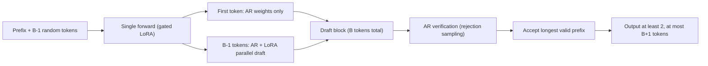

[Paper](https://arxiv.org/abs/2609.04010v1)
## Uno: AR and Diffusion in One Model — Lossless Parallel Generation for LLM Acceleration

**TL;DR** — LLMs are slow because next-token prediction (NTP) can emit only one token at a time by its very sequential structure. Uno plants **AR weights that own quality** and **lightweight LoRA diffusion weights that own speed** into a single architecture; the diffusion path drafts token blocks in parallel, and the AR path verifies them via rejection sampling. With neither a separate draft model nor a lossy AR→diffusion conversion, it achieves **lossless** acceleration that exactly preserves the AR distribution. In practice it delivers **up to 3×** speedup over the base AR model and still **up to 2×** at the largest batch sizes, while beating open d-LLMs (26B DiffusionGemma) and proprietary models (Mercury 2) on agentic, coding, and long-form reasoning benchmarks (source: Abstract).

---

## Core Idea

The paper starts from one crisp observation. Language is full of **predictable collocations and formulaic expressions** like "the cat → caught → the mouse," which leaves room to sample several tokens at once as a block (source: §1). Yet a standard AR LLM cannot exploit this redundancy at all. Because decoding tends to become **memory-bound** — especially in long contexts, where time is spent moving model weights and KV states while the GPU sits idle (source: §1).

The two existing remedies each carry decisive limitations (source: §1):

- **Speculative decoding** uses a small draft model to produce candidate tokens that a larger model verifies, but it requires **training and maintaining a separate draft model**, and its performance hinges on that model's alignment (source: §1).
- **Diffusion LLMs (d-LLMs)** natively support parallel generation, but they are **lower in quality than AR models (lossy)**, and their speed edge **disappears at large batch sizes** (source: §1).

Uno's core idea is simple: **"define a high-quality AR distribution, then learn to sample multiple tokens in parallel from that same distribution"** (source: §1). To do this, it decouples two sets of weights within a single model:

- **AR weights** $$ \theta_{\mathrm{AR}} $$ — determine response quality. Trained with standard NTP.
- **Diffusion weights** $$ \theta_{\Delta} $$ — in the form of a LoRA adapter. Trained with **Diffusion Distillation** to generate token blocks in parallel.

At generation time the two paths draft together, and **only the AR weights** verify. Because this sampler preserves the AR distribution exactly in a mathematical sense, you gain speed with no loss of quality (source: §3, §4).

---

## Background: The Problem They Set Out to Solve

The core research gap the authors identify can be summarized as follows (source: §1, §6).

**1) AR sequentiality is intrinsic.** Because the NTP objective forces the model to predict only "the next single token," producing an output of length $$ L $$ requires $$ L $$ sequential decoding decisions (source: §2.1). The longer the reasoning trace, the greater the serving latency, and even RL post-training — whose runtime is dominated by rollout generation — is slowed down (source: §1).

**2) Speculative decoding carries the burden of a separate model.** Methods such as EAGLE-3 (0.40B drafter) and DFlash (1.05B drafter) are lossless, but the drafter's depth, hidden dimension, MLP expansion, number of heads, parameter sharing, and KV projections all have to be designed, and **keeping separate KV caches for drafting and verification** inflates peak memory (source: §6).

**3) d-LLMs are lossy and do not scale with batch.** Nemotron-Labs-Diffusion (14B) and DiffusionGemma (26B-A4B) are fast at low batch sizes but lower in quality than AR, and **at large batch sizes they become slower than their own parent AR models** (source: §5.1). Because both modify the base AR parameters, they are **lossy** (source: §5.1).

**4) Self-speculative decoding (TiDAR et al.) is also lossy.** A single model drafts in diffusion mode and verifies in AR mode, but doing so requires **modifying the base AR model's weights**, so the original distribution is not preserved (source: §6).

To compress these four strands into one sentence, the paper's diagnosis is that there had been no method that was **lossless, required no separate draft model, and kept its speedup at every batch size**. And it appends one more important practical point: in today's LLM applications, dominated by agentic workloads, **batch-1 latency represents only a narrow operating regime**, and one can overestimate speedups that vanish under concurrency (source: §1). This is why the authors run every evaluation at **real serving batch sizes**.

---

## New Approach: Diffusion-Augmented LLM (Uno)

Uno **augments** each layer of a standard AR model with **separate diffusion weights**. The name, Uno, reflects that AR and diffusion weights are unified into a single architecture (source: §1).

### 1) Two Paths: AR Weights and Diffusion Weights (§3.1)

- **AR weights** $$ \theta_{\mathrm{AR}} $$ are trained with the standard recipe of pre-training → SFT → RL post-training (source: §3.1).
- **Diffusion weights** $$ \theta_{\Delta} $$ are **rank-128 LoRA adapters (LoRA-$$ \alpha = 256 $$)** attached to each AR weight matrix (source: §5.1). The diffusion path drafts with $$ \theta_{\mathrm{AR}} + \theta_{\Delta} $$, whereas the verification path uses only $$ \theta_{\mathrm{AR}} $$. The two distributions are **coupled** through shared base parameters, which lets rejection sampling work well (source: §3.1).

Key design difference: unlike existing d-LLMs, which predict "the clean token at the same position," Uno's LLM **keeps the NTP parameterization intact** — the logits at each position predict the **next** token (source: §3.1). This makes it fully compatible with the AR model's training pipeline.

### 2) Diffusion Distillation: Mimicking the AR Distribution in a Single Step (§3.2)

The goal of training the diffusion weights is simple: **have the diffusion path draft in parallel the token blocks that the AR model would generate sequentially**. The training objective is a weighted sum of two terms (source: Eq. 4):

$$
\mathcal{L}(\theta_{\Delta}; \theta_{\mathrm{AR}}, \alpha, \beta) = \mathbb{E}\left[\alpha\, \mathcal{L}_{\mathrm{DCD}} + \beta\, \mathcal{L}_{\mathrm{TV}}\right]
$$

- **$$ \mathcal{L}_{\mathrm{DCD}} $$ (One-step Distillation)** — DCD (Discrete Consistency Distillation) compressed into **a single step**. The student ($$ \theta_{\mathrm{AR}}+\theta_{\Delta} $$) is matched to the teacher ($$ \theta_{\mathrm{AR}} $$) by KL divergence so that it maps directly from the fully corrupted input $$ \mathbf{z}_1 $$ to the clean sequence $$ \mathbf{x} $$. This design removes the cost of repeatedly generating and storing intermediate PF-ODE states at LLM scale (source: §3.2).
- **$$ \mathcal{L}_{\mathrm{TV}} $$ (Total Variation)** — directly minimizes the block-wise total variation (TV) distance between the diffusion and AR distributions so that rejection sampling accepts longer prefixes (source: §3.2).

Two technical tricks make this training practical (source: §3.2):

- **Block Diffusion** — instead of restoring a long sequence all at once, split it into $$ N $$ blocks of size $$ B $$ and one-step denoise **block by block**.
- **Gated LoRA** — turn the LoRA off at clean token positions (teacher logits) and on only at noisy token positions (student logits), so that teacher and student are computed in **a single forward pass** (source: §3.2).

### 3) $$ \Psi $$-Spec Sampler: Parallel Draft + AR Verify (§4)

At generation time, the algorithm has three steps (source: Alg. 1):

1. **Draft** — append $$ B-1 $$ random tokens (uniform prior) after the partially generated prefix. In a single forward pass, the first clean position computes logits with **AR weights only**, and the remaining noisy positions compute logits with **AR+LoRA**, sampling the block in parallel (source: §4.1).
2. **Verify** — the AR weights compute the distribution $$ \mathbf{p} $$ of the draft sequence and, via the rejection sampling of standard speculative decoding, accept **the longest valid prefix** (source: §4.2).
3. **Return** — always emit at least 2 tokens (the first token, which is always accepted, plus a replacement token), and up to $$ B+1 $$ tokens when everything is accepted.

The sampler comes in two configurations: a **linear sampler** ($$ B=4 $$, optimized for system throughput) and a **tree sampler** ($$ (B,K,V)=(16,32,32) $$, optimized for single-user throughput) (source: §4.1). The tree sampler branches top-$$ K $$ candidates at each position and keeps only the top $$ V $$ prefixes, exploiting idle compute to raise single-request throughput (source: §4.1).

---

## How It Works: A Concrete Walkthrough

Follow the linear sampler with block size $$ B=4 $$ through a scenario where the prefix is "the cat" (2 tokens).

**Step 1 — Initialize a noisy block.** Draw $$ B-1 = 3 $$ random tokens from a uniform distribution and append them after the prefix. The model input is now `[cat (clean), ·, ·, ·]`.

**Step 2 — Draft with a single forward pass.** Thanks to the gated LoRA, one forward pass yields two kinds of logits:

- At the first clean position, "cat," the **AR weights alone** produce the next-token distribution, from which we sample, say, `chased`. Because this token matches the verification distribution exactly, it is **always accepted** (source: §4.2).
- At the remaining 3 noisy positions, **AR+LoRA** produce the clean-token distribution, from which we **in parallel** sample, say, `[the, mouse, .]`.

That is, one forward pass produces the draft block `[chased, the, mouse, .]` — the first token from the AR path and the rest from the diffusion path (source: §4.1).

**Step 3 — AR verification (rejection sampling).** The AR model now computes a probability $$ \mathbf{p}_i $$ for each of `[chased, the, mouse, .]`, compares it with the draft probability $$ \mathbf{q}_i $$, and checks token by token that $$ r_i \leq \min(1, \mathbf{p}_i / \mathbf{q}_i) $$ (source: Alg. 1). If `the` is rejected, a new token is resampled from the residual distribution at that position.

**Harvesting the result.** The output of this single step (1 draft forward + 1 verify forward, 2 in total) is:

- at least **2** tokens even with an immediate rejection (the always-accepted `chased` + a replacement token),
- **5** tokens when everything is accepted ($$ B+1 $$).

So the **tokens per forward pass (TPF)** is bounded by $$ 1 \leq \mathrm{TPF} \leq (B+1)/2 = 2.5 $$ (source: §4.2). A pure AR model emits 1 token per forward pass, so with $$ B=4 $$ the theoretical maximum is 2.5×, and in practice it lands below that depending on the acceptance rate.

The full pipeline is summarized in the diagram below:

**Wait — why is it lossless?** Because the rejection sampling at the verification stage uses the same correction rule as standard speculative decoding, the final output follows the distribution defined by $$ \theta_{\mathrm{AR}} $$ exactly, no matter what the draft path produces (source: §4.2). Even a terrible drafter does not break quality — it only lowers the acceptance rate (and hence speed). And here the value of the LoRA parameterization becomes clear: since the draft distribution **shares base parameters** with the verification distribution, it starts with a far higher acceptance rate than a separate draft model would (source: §3.1).

---

## Empirical Validation: Key Results

Uno is validated in two configurations: an 8B Uno **trained from scratch** on proprietary data, and Uno-Qwen, which **augments the open-weight Qwen3-8B** (source: §5).

### Uno (8B) — Surpassing Open d-LLMs and Proprietary Models

The 8B dense Uno **outperforms** the open d-LLMs DiffusionGemma (26B-A4B) and Nemotron-Labs-Diffusion (14B) as well as the proprietary d-LLM Mercury 2 **on every agentic, coding, and long-form reasoning benchmark** (source: Tab. 1):

| Benchmark (metric) | Uno (8B) | Mercury 2 | DiffusionGemma (26B-A4B) | Nemotron-Labs (14B) |
|---|---:|---:|---:|---:|
| SWE-bench Verified (pass@1) | **68.4** | — | 18.7 | 0.8 |
| τ² Telecom (pass@1) | **90.1** | 71 | 68.1 | 14.3 |
| Terminal-Bench v2.1 | **39.6** | 27 | 14.7 | 4.5 |
| AA-LCR (long-form reasoning) | **68.0** | 36 | 19.7 | 7.3 |
| GPQA-Diamond | **77.1** | 77 | 70.7 | 40.4 |
| AIME-25 | **90.7** | — | 74.3 | 40.0 |

It is nearly a clean sweep, with one exception: on **AA-Omniscience**, Uno (14.3) trails Mercury 2 (20). The authors interpret this as likely stemming from differences in model size and training data (source: §5.1).

The lead in **throughput** is equally clear (source: Tab. 1, Tab. 5):

| Model | System throughput (tok/s) | Per-request throughput (tok/s) |
|---|---:|---:|
| **Uno (8B)** | **5255** | 383 |
| Base AR | 3577 | 176 |
| Mercury 2 | 1197 | 769 |
| DiffusionGemma | 1136 | 836 |
| Nemotron-Labs-Diffusion | 2794 | 290 |

Uno's system throughput is **~4.6×** that of Mercury 2 (which runs on faster Blackwell GPUs) and **1.5×** that of the base AR (batch 64). Its per-request throughput is **~2.2×** that of the base AR (batch 1) (source: §5.1). Notably, DiffusionGemma is slower than Uno at large batch even though it sacrifices structure for strided attention (1 global + 5 local sliding) (source: §5.1).

### Uno-Qwen — Pareto-Dominating Lossless Speculative Decoding

Uno-Qwen, which augments Qwen3-8B, **beats the lossless speculative decoding methods EAGLE-3 and DFlash at every batch size** (source: Fig. 2, Tab. 2).

| Metric ($$ \tau = 1 $$) | Uno-Qwen | EAGLE-3 | DFlash |
|---|---:|---:|---:|
| System throughput (tok/s, B=4) | **5733** | 4944 | 5351 |
| Per-request throughput (tok/s, batch 1) | **445** | 284 | 370 |
| Tokens/step $$ \tau $$ (system) | **3.89** | 2.08 | 2.07 |
| Tokens/step $$ \tau $$ (per request) | **5.97** | 3.48 | 2.74 |
| Peak memory (GiB) | **122.2** | 130.0 | 130.1 |
| Additional parameters (B) | **0.35** | 0.40 | 1.05 |

It wins on all three axes (source: Tab. 2):

- **Speed** — system throughput **1.6×** the base AR (5733 vs 3662 tok/s) and per-request throughput **2.5×** (445 vs 176 tok/s).
- **Memory** — because Uno's draft and verify **share a single KV cache**, its peak memory is the lowest at 122.2 GiB. EAGLE-3 and DFlash exceed 130 GiB due to their separate caches (source: §5.2).
- **Parameter efficiency** — just 0.35B additional parameters, about a third of DFlash (1.05B). What is more, DFlash's training context grows to $$ B \cdot L $$ with block size $$ B $$, whereas Uno's is always fixed at $$ 2 \cdot L $$, so **training is far cheaper too** (source: §5.2).

### Accelerating RL Post-Training

This is one of the most surprising findings. If the diffusion weights are trained right after SFT and **only the AR weights are updated** during RL, the draft distribution should in theory drift from the verification distribution and the acceptance rate should drop. In practice, however, **the speedup held throughout RL training**: even after RL, the diffusion adapter from the SFT checkpoint saw TPF drop only from **2.25 → 2.10 (a 6% decrease)** (source: §3.3, Tab. 6). This yielded **up to 40% end-to-end RL training speedup** (math & code experts). For tool-use and retrieval experts the gain was small, because tool calls dominate runtime (source: §5.1).

### Ablations — The Secret Weapons Are the TV Loss and the Block Curriculum

Ablations on Uno-Qwen (1 epoch, B=16) are as follows (source: Appx):

- **Loss terms**: $$ \mathcal{L}_{\mathrm{TV}} $$ alone (TPF 2.39) > $$ 0.01\cdot \mathcal{L}_{\mathrm{DCD}}+\mathcal{L}_{\mathrm{TV}} $$ (2.40) > $$ \mathcal{L}_{\mathrm{DCD}}+\mathcal{L}_{\mathrm{TV}} $$ (2.23) ≈ $$ \mathcal{L}_{\mathrm{DCD}} $$ alone (2.22). The KL (DCD) term is naturally about 10× larger than the TV term, so the KL weight has to be lowered to 0.01 for the TV effect to survive (source: Appx).
- **LoRA rank**: raising it from 128 to 256 moves TPF from 2.39 → 2.47 (parameters 349M → 698M) (source: Appx).
- **Where LoRA is applied**: spreading it across all projections (Q, K, V, O + MLP gate/up/down) is better than concentrating it on a specific subset. Q-projection-only is the worst at TPF 2.14 (source: Appx).
- **Block curriculum**: gradually growing the block size 2→4→6→8→12→16 (TPF 2.71) beats fixing it at 16 from the start (2.65) (source: Appx).

---

## Our Take: Strengths, Limitations, and Why It Matters

### Strengths

- **A conceptually clean separation.** Quality (AR weights) and speed (diffusion weights) are decoupled inside one model. Because the drafter necessarily **shares base parameters** with the verification model, the design burden and alignment problems of a separate draft model disappear at the source (source: §6).
- **Lossless rigor.** Because verification uses standard rejection sampling as is, the final output exactly preserves the AR distribution. The authors even show, through reproduction experiments, that the contemporary I-DLM (R-ISD) is **not truly lossless** because its verification is inconsistent with greedy drafting — underscoring the rigor of their own sampler (source: Appx).
- **Speed that survives large batches.** By overcoming the fatal weakness of d-LLMs (vanishing at large batch), it becomes practically usable for both serving and RL rollouts (source: §1).
- **A low barrier to entry.** Simply attaching a LoRA to open-weight Qwen3-8B and training on OpenThoughts 14.7B tokens (32 hours on 32 H200s) already yields lossless acceleration. The AR weights are **never touched**, so the original quality is kept intact (source: §5.2).

### Limitations

- **The gap between the headline and the tables.** The conclusion claims "up to 2× at the largest batch," but in the actual 1K/8K test table, system throughput is **~1.5×** the base AR (5255 vs 3577) (source: §7 vs Tab. 5). "Up to 3×" is likewise the value under the most favorable conditions (per-request, tree sampler) — closer to an upper bound than a representative figure.
- **Inference-time scaling is left unfinished.** Increasing the number of denoising steps $$ T $$ beyond the draft tokens $$ B $$ could raise quality, which would require disabling AR verification — but this quality-compute trade-off is not explored systematically and is left as future work (source: §4.3).
- **The ceiling of two forwards per draft+verify step.** Because each step uses two forward passes, a structural upper bound remains until an efficient quadratic-sampling kernel (draft + verify in a single forward) arrives (source: §6).
- **Inherent limits of the evaluation data.** Uno (8B) is pre-trained on private data, making reproduction difficult, and the detailed RL results are only said to be "released in a future revision" (source: §5.1). There are also subtle fairness concerns that reach even **the baselines' chat templates**, as in the comparison against DFlash's thinking mode (source: Appx).

### Why It Matters

This paper presents a design that merges the two competing "acceleration races" — speculative decoding and diffusion LLMs — into one. If existing d-LLMs embody the trade-off of **buying speed by selling quality**, Uno opens a path that **keeps quality intact and gains speed alone** (source: §7). In particular, the call to "evaluate acceleration at real serving batches, not batch 1" is itself an important methodological contribution to an LLM industry now dominated by agentic workloads (source: §1).

---

## What's Next?: The Road Ahead

The future work the authors explicitly leave behind, plus the sensible follow-ups implied by the limitations, is as follows (source: §4.3, §6, §7).

- **Quantifying inference-time scaling** — systematically explore when increasing only the number of denoising steps (without lengthening the context) surpasses AR quality, and where the threshold for disabling AR verification lies (source: §4.3).
- **Quadratic sampling kernels** — develop an efficient kernel that merges draft and verify into a single forward pass, breaking through the structural speed ceiling (source: §6).
- **Combining with MTP** — multi-token prediction heads such as Medusa are complementary to Uno, and combining them has room to push the acceptance rate higher (source: §6).
- **Precise reporting of the RL speedup** — spell out the detailed conditions behind the "up to 40%" figure and how to improve the regimes where the gain is small, such as tool-use and retrieval experts (source: §5.1).
- **Stronger open reproducibility** — since the 8B Uno is trained on private data, refining the open-weight path (Uno-Qwen) could deliver more tangible value to the community (source: §5.2).

In summary, Uno breaks the implicit assumption that "**a fast d-LLM and an accurate AR LLM must be separate models**" and presents an elegant design that **delegates quality and speed to different weights within one model**. By pushing lossless parallel generation all the way to real serving batch sizes, it deserves credit for opening a new axis in making AR LLM inference more efficient.

<!-- verbatim-tables -->

## Tables from the paper

> Tables converted mechanically from the arXiv e-print LaTeX source. The numbers are the paper's own and did not pass through a model.

**Table 1. Accuracy and TPF of , , Mercury 2, and on agentic and non-agentic benchmarks. Mercury 2 results are from Artificial Analysis. Results for and are computed from their open-source checkpoints (tab:checkpoints). For , subscripts report ``TPF$_1$ / TPF$_2$,'' where TPF$_1$ uses the system-throughput-optimal Linear sampler with $B=4$, and TPF$_2$ uses $(B,K,V)=(16,32,32)$, optimized for per-request throughput. $^*$Reported by Artificial Analysis's live tracker on August 30, 2026.**

|  | {zaibluefg } | {Mercury 2} | {{Diffusion}-{Gemma}} | {{Nemotron-Labs}-{Diffusion}} |
|---|---|---|---|---|
| *Model size* | $(8B)$ | N/A | $(26B-A4B)$ | $(14B)$ |
| *Agentic Tool Use* |  |  |  |  |
| \quad $\tau^3$ Banking | $25.8_{1.8/2.7}$ | $9_{\text{n/a}}$ | -- | -- |
| \quad $\tau^2$ Telecom | $90.1_{1.7/2.1}$ | $71_{\text{n/a}}$ | $68.1_{18.8}$ | $14.3_{4.8}$ |
| \quad $\tau^2$ Retail | $67.1_{1.8/2.4}$ | -- | $65.5_{23.7}$ | $5.6_{3.1}$ |
| \quad Terminal-Bench v2.1 | $**39.6_{2.1/2.7}$ | $27_{\text{n/a}}$ | $14.7_{14.1}$ | $4.5_{7.5}$ |
| *Agentic Coding* |  |  |  |  |
| \quad SWE-bench Verified | $68.4_{2.2/3.1}$ | -- | $18.7_{5.6}$ | $0.8_{1.5}$ |
| *Long-Context Reasoning* |  |  |  |  |
| \quad AA-LCR | $68.0_{1.8/2.6}$ | $36_{\text{n/a}}$ | $19.7_{10.8}$ | $7.3_{1.1}$ |
| *Science and Knowledge* |  |  |  |  |
| \quad Humanity's Last Exam | $18.6_{1.8/2.8}$ | ${16}_{\text{n/a}}$ | $9.2_{14.1}$ | $2.6_{7.2}$ |
| \quad GPQA-Diamond | $77.1_{2.0/4.2}$ | $77_{\text{n/a}}$ | $70.7_{11.9}$ | $40.4_{7.6}$ |
| \quad AA-Omniscience | $14.3_{1.7/3.1}$ | $20_{\text{n/a}}$ | $17.7_{9.9}$ | $11.0_{11.1}$ |
| *Math* |  |  |  |  |
| \quad GSM8K | $95.4_{1.9/2.7}$ | -- | $95.1_{28.9}$ | $93.1_{6.1}$ |
| \quad MATH500 | $98.9_{1.9/2.4}$ | -- | $92.4_{24.1}$ | $89.2_{5.6}$ |
| \quad AIME-24 | $93.0_{1.9/2.5}$ | -- | $73.7_{16.9}$ | $56.7_{4.9}$ |
| \quad AIME-25 | $90.7_{1.8/2.4}$ | -- | $74.3_{18.9}$ | $40.0_{4.5}$ |
| \quad AIME-26 | $86.3_{1.8/2.4}$ | -- | $70.7_{17.8}$ | $46.7_{4.8}$ |
| *Coding* |  |  |  |  |
| \quad MBPP | $84.1_{1.8/2.4}$ | -- | $80.1_{15.5}$ | $73.8_{5.3}$ |
| \quad HumanEval | $95.2_{1.9/3.4}$ | -- | $95.1_{28.2}$ | $84.8_{7.5}$ |
| Avg. TPF | 1.9 / 2.7 |  | 17.56 | 5.41 |
| System Throughput | **5255** | $1197^*$ | 1136 | 2794 |
| Per-request Throughput | 405 | $769^*$ | **836** | 290 |

**Table 2. Acceptance lengths ($\tau$), throughput (1K/8K test), peak memory usage, and additional parameter counts for , , and at sampling $\temp=1$. We report the $\tau$ values that maximize system and per-request throughput.**

|  | System Throughput Optimal \$B$=$4$ | System Throughput Optimal EAGLE-3\$B$=$4$ | System Throughput Optimal DFlash\$B$=$4$ | Per-request Throughput Optimal zaibluefg \$B$=$16$, $V$=$32$ | Per-request Throughput Optimal EAGLE-3\$B$=$8$, $V$=$60$ | Per-request Throughput Optimal DFlash\$B$=$16$ |
|---|---|---|---|---|---|---|
| *Math* |  |  |  |  |  |  |
| \quad GSM8K | **3.99** | 2.26 | 2.47 | **6.29** | 3.83 | 3.38 |
| \quad MATH500 | **4.11** | 2.14 | 2.28 | **6.89** | 3.52 | 3.24 |
| \quad AIME-24 | **4.08** | 2.11 | 1.96 | **6.83** | 3.41 | 2.76 |
| \quad AIME-25 | **4.11** | 2.13 | 1.90 | **6.81** | 3.46 | 2.56 |
| \quad AIME-26 | **4.08** | 2.13 | 1.93 | **6.71** | 3.49 | 2.57 |
| *Coding* |  |  |  |  |  |  |
| \quad HumanEval | **3.83** | 2.12 | 2.35 | **5.63** | 3.71 | 3.03 |
| \quad MBPP | **3.87** | 2.16 | 2.22 | **5.87** | 3.65 | 3.04 |
| \quad LCBv6 | **3.77** | 2.04 | 1.76 | **5.34** | 3.45 | 2.22 |
| *Science and Knowledge* |  |  |  |  |  |  |
| \quad GPQA | **3.79** | 1.99 | 1.98 | **5.49** | 3.25 | 2.57 |
| \quad GPQA-Diamond | **3.78** | 1.98 | 1.92 | **5.49** | 3.19 | 2.50 |
| \quad MMLU-Pro | **3.84** | 2.03 | 2.11 | **5.70** | 3.31 | 2.80 |
| *Instruction Following* |  |  |  |  |  |  |
| \quad IFEval | **3.48** | 1.91 | 1.92 | **4.58** | 3.49 | 2.26 |
| {$\tps$} | **3.89** | 2.08 | 2.07 | **5.97** | 3.48 | 2.74 |
| {Throughput (Toks / sec; $\uparrow$)} | **5733** | 4944 | 5351 | **445** | 284 | 370 |
| {Peak Memory (GiB; $\downarrow$)} | **122.2** | 130.0 | 130.1 | **118.0** | 129.4 | 129.8 |
| {Additional Params (B; $\downarrow$)} | **0.35** | 0.40 | 1.05 | **0.35** | 0.40 | 1.05 |

**Table 3. Benchmark accuracy (ACC) and TPF for our {zaibluefg lossless} method, , and {\color[RGB]{250,142,142} lossy} diffusion methods. Entries are reported as $ACC_{TPF}$. For , TPF uses $\temp=0$ and the tree sampler with $(B,K,V)=(16,32,60)$. Lossy speedups are taken from the respective papers, except for Fast-dLLM v2 and SDAR, which we evaluated using the provided checkpoints. Accuracy drops relative to the corresponding parent AR model are shaded in red by severity. Jacobi ForcingJ uses separate math and coding models trained from Qwen2.5-Math-7B-Instruct and Qwen2.5-Coder-7B-Instruct, respectively. F Fast-dLLM v2 uses Qwen2.5-7B-Instruct.**

| Benchmark | {zaibluefg } | {\color[RGB]{250,142,142} Lossy} Speedup Methods SDAR | {\color[RGB]{250,142,142} Lossy} Speedup Methods TiDAR (Trust Diff) | {\color[RGB]{250,142,142} Lossy} Speedup Methods OPDLM | {\color[RGB]{250,142,142} Lossy} Speedup Methods I-DLM | {\color[RGB]{250,142,142} Lossy} Speedup Methods Jacobi Forcing (MR)J | {\color[RGB]{250,142,142} Lossy} Speedup Methods Fast- dLLM v2F | {\color[RGB]{250,142,142} Lossy} Speedup Methods FLARE (AR Trust)L | {\color[RGB]{250,142,142} Lossy} Speedup Methods LLaDA2.1- Flash (S Mode) |
|---|---|---|---|---|---|---|---|---|---|
| *Model size* | $8B$ | $8B$ | $8B$ | $8B$ | $8B$ | $7B$ | $7B$ | $9B$ | $100B$-$A5B$ |
| *Parent AR* | Qwen3-8B |  |  |  |  | Qwen2.5-7B Family |  | Qwen3.5-9B |  |
| *Math* |  |  |  |  |  |  |  |  |  |
| \quad GSM8K | $96.1_{3.56}$ | $91.4_{2.3}$ | $80.4_{7.1}$ | $87.1_{1}$ | 55{$95.0$} | 50{$91.4_{4.0}$} | $83.7_{3.0}$ | $93.3$ | -- |
| \quad MATH500 | $96.4_{3.92}$ | $72.0_{2.8}$ | -- | $71.2_{1}$ | $96.8$ | -- | $61.1_{2.1}$ | 70{$95.2$} | -- |
| \quad AIME-24 | $76.7_{4.01}$ | $10.0_{2.8}$ | -- | $14.7_{1}$ | $69.6$ | -- | $6.67_{2.7}$ | $63.3$ | -- |
| \quad AIME-25 | $76.7_{3.96}$ | $10.0_{2.6}$ | -- | $12.4_{1}$ | $60.8$ | -- | $0.0_{2.6}$ | $54.4$ | $63.3_{5.4}$ |
| \quad AIME-26 | $73.3_{4.05}$ | -- | -- | -- | -- | -- | -- | -- | -- |
| *Coding* |  |  |  |  |  |  |  |  |  |
| \quad HumanEval | $94.8_{3.67}$ | $75.6_{2.8}$ | $57.9_{7.3}$ | $59.8_{1}$ | 75{$93.3_{2.6}$} | $83.5_{4.1}$ | $63.4_{2.5}$ | $92.1$ | -- |
| \quad MBPP | $89.0_{4.21}$ | $68.1_{1.5}$ | $65.4_{10.0}$ | $48.7_{1}$ | $92.2$ | $70.4_{2.8}$ | $63.0_{4.5}$ | $91.1$ | -- |
| \quad LCBv6 | $51.4_{3.75}$ | $16.6$ | -- | $9.7_{1}$ | $45.7$ | -- | $10.0_{1.7}$ | $49.7$ | $44.1_{6.5}$ |
| *Science and Knowledge* |  |  |  |  |  |  |  |  |  |
| \quad GPQA | $58.0_{4.10}$ | -- | -- | -- | $54.9$ | -- | 80{$31.9$} | -- | -- |
| \quad GPQA-D | $60.9_{4.01}$ | $40.2$ | -- | $36.1_{1}$ | $55.6$ | -- | $21.7_{2.2}$ | $71.2$ | $66.7_{4.0}$ |
| \quad MMLU-Pro | $74.8_{3.61}$ | $56.9_{1.6}$ | -- | $53.7_{1}$ | 85{$73.1$} | -- | -- | $77.4$ | $75.3_{4.4}$ |
| *Instruction Following* |  |  |  |  |  |  |  |  |  |
| \quad IFEval | $86.5_{2.49}$ | $61.4_{1.5}$ | -- | $50.1_{1}$ | 90{$84.7$} | -- | $61.4_{1.5}$ | $71.4$ | $83.4_{2.2}$ |

**Table 4. Benchmarks used in our evaluation. ``Generations'' denotes the number of responses sampled per example when computing average pass@1.**

| **Benchmark** | **Generations** | **Description** |
|---|---|---|
| 3{@l}{*Agentic*} |  |  |
| \quad $\tau^2$-Bench | 3 | Multi-turn tool-use tasks in which an agent interacts with a simulated user and domain APIs while following domain-specific policies. |
| \quad Terminal-Bench v2.1 | 3 | Realistic and complex tasks that autonomous agents complete in command-line container environments. |
| \quad SWE-bench Verified | 3 | Human-validated software-engineering tasks requiring agents to resolve real GitHub issues by modifying their associated repositories. |
| 3{@l}{*Long-Context Reasoning*} |  |  |
| \quad AA-LCR | 3 | Open-answer questions requiring information extraction, synthesis, and reasoning over long documents such as reports and legal texts. |
| 3{@l}{*Science and Knowledge*} |  |  |
| \quad AA-Omniscience | 1 | Closed-book questions measuring factual recall and calibration across a broad range of economically relevant domains. |
| \quad Humanity's Last Exam | 1 | Difficult expert-level questions spanning mathematics, the sciences, the humanities, and other academic disciplines. |
| \quad GPQA-Diamond | 5 | Expert-validated, graduate-level multiple-choice questions in biology, physics, and chemistry. |
| 3{@l}{*Math*} |  |  |
| \quad GSM8K | 2 | Grade-school mathematics word problems requiring multi-step arithmetic reasoning. |
| \quad MATH500 | 2 | A 500-problem subset of MATH covering competition-level mathematical reasoning with free-form answers. |
| \quad AIME 2024--2026 | 10 | Integer-answer problems from the 2024, 2025, and 2026 American Invitational Mathematics Examinations. |
| 3{@l}{*Coding*} |  |  |
| \quad MBPP | 2 | Short Python program-synthesis problems specified through natural-language descriptions and test cases. |
| \quad HumanEval | 2 | Hand-written Python function-completion problems evaluated using executable unit tests. |
| 3{@l}{*Instruction Following*} |  |  |
| \quad IFEval | 2 | Verifiable instruction-following tasks that test compliance with explicit, objectively checkable constraints. |

**Table 5. Open-source model checkpoints used in our evaluations.**

| Model | Checkpoint |
|---|---|
|  | https://huggingface.co/google/diffusiongemma-26B-A4B-it |
|  | https://huggingface.co/nvidia/Nemotron-Labs-Diffusion-14B |
|  | https://huggingface.co/AngelSlim/Qwen3-8B_eagle3 |
|  | https://huggingface.co/z-lab/Qwen3-8B-DFlash-b16 |
| Fast-dLLM v2 | https://huggingface.co/Efficient-Large-Model/Fast_dLLM_v2_7B |
| SDAR | https://huggingface.co/JetLM/SDAR-8B-Chat-b16 |

**Table 6. We report TPFs for a subset of the evaluations using different sampler configurations for the model. Among all configurations, the Linear sampler with $B=4$ achieves the highest system throughput at a batch size of 64, while the Tree sampler with $(B,K,V)=(16,32,32)$ achieves the highest per-user throughput (batch size 1).**

| Dataset | Linear B4 | Linear B8 | Linear B16 | Tree B16,K32,V32 | Tree B16,K64,V64 | Tree B16,K64,V32 |
|---|---|---|---|---|---|---|
| GSM8K | 1.9 | 2.3 | 2.4 | 2.7 | 2.6 | 2.8 |
| AIME-24 | 1.8 | 2.1 | 2.2 | 2.5 | 2.5 | 2.4 |
| AIME-25 | 1.8 | 2.2 | 2.3 | 2.4 | 2.6 | 2.6 |
| AIME-26 | 1.8 | 2.1 | 2.1 | 2.4 | 2.5 | 2.4 |
| MATH500 | 1.8 | 2.1 | 2.2 | 2.4 | 2.5 | 2.5 |
| HumanEval | 1.8 | 2.6 | 2.8 | 3.4 | 2.5 | 3.4 |
| AA-LCR | 1.8 | 2.1 | 2.2 | 2.6 | 2.5 | 2.4 |
| TPF | 1.8 | 2.2 | 2.3 | 2.6 | 2.5 | 2.6 |
| Highest Sys. Throughput | **5190** | 5034 | 3445 | 2665 | 1573 | 2709 |
| Highest Per-req. Throughput | 275 | 319 | 345 | **379** | 339 | 371 |

**Table 7. DG, Uno, NLD, Mercury2. $^*$As reported by Artificial Analysis' live tracker on August 30, 2026.**

| Method | Max. Sys. Throughput (toks / sec) | Max. Per-req. Throughput (toks / sec) |
|---|---|---|
| (Ours) | 5255 | 383 |
| AR (Ours) | 3577 | 176 |
|  | 1136 | 836 |
|  | 2794 | 290 |
| Mercury-2 | 1197$^*$ | 769$^*$ |

**Table 8. TPFs for the SFT checkpoint and its RL-post-trained counterpart, evaluated using the diffusion weights trained for the SFT checkpoint. **Even after extensive RL post-training, the SFT diffusion adapters retained their speedup**, with only a $6%$ reduction in TPFs.**

|  | {SFT} | {Post-Trained} |
|---|---|---|
| *Math* |  |  |
| \quad GSM8K | $2.66$ | $1.95$ |
| \quad MATH500 | $2.27$ | $1.93$ |
| \quad AIME-24 | $2.17$ | $1.93$ |
| \quad AIME-25 | $2.26$ | $1.97$ |
| \quad AIME-26 | $2.22$ | $1.83$ |
| *Coding* |  |  |
| \quad HumanEval | $1.97$ | $2.34$ |
| \quad MBPP | $2.35$ | $2.19$ |
| *Science and Knowledge* |  |  |
| \quad GPQA-Diamond | $2.03$ | $1.97$ |
| *Instruction Following* |  |  |
| \quad IFEval | $2.12$ | $2.50$ |
| *Other Benchmarks* |  |  |
| \quad HLE | $2.14$ | $2.15$ |
| \quad AA-Omniscience | $2.57$ | $2.34$ |
| {TPF} | ${2.25}$ | ${2.10}$ |

> Figures in this post are taken from the original arXiv:2609.04010 (CC BY 4.0). Only size and format were changed.
