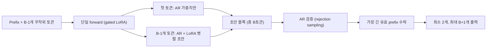

[논문 링크](https://arxiv.org/abs/2609.04010v1)
## Uno: AR과 Diffusion을 하나의 모델에 — 무손실 병렬 생성을 통한 LLM 가속

**TL;DR** — LLM이 느린 이유는 next-token prediction(NTP)이 한 번에 토큰 하나씩만 내놓는 순차 구조 때문이다. Uno는 하나의 아키텍처에 **품질을 책임지는 AR 가중치** 와 **속도를 책임지는 경량 LoRA diffusion 가중치** 를 함께 심고, diffusion 경로가 토큰 블록을 병렬로 초안(draft)하면 AR 경로가 rejection sampling으로 검증한다. 별도의 드래프트 모델도, 손실 있는 AR→diffusion 변환도 없이 **AR 분포를 정확히 보존하는(무손실)** 가속을 얻는다. 결과적으로 베이스 AR 모델 대비 **최대 3배**, 가장 큰 배치 크기에서도 **최대 2배** 의 속도 향상을 달성했고, 오픈 d-LLM(26B DiffusionGemma)과 독점 모델(Mercury 2)을 에이전틱·코딩·장문 추론 벤치마크에서 압도했다 (근거: Abstract).

---

## 핵심 아이디어

이 논문의 출발점은 한 가지 명료한 관찰이다. 언어에는 "고양이가 → 쥐를 → 잡았다"처럼 **예측 가능한 연어(collocation)와 정형화된 표현** 이 넘쳐서, 토큰 여러 개를 블록으로 한꺼번에 뽑아낼 수 있는 여지가 있다 (근거: §1). 그런데 표준 AR LLM은 이 중복성을 전혀 활용하지 못한다. 디코딩이 **메모리 바운드(memory-bound)** 가 되기 쉬운 탓에, 특히 긴 컨텍스트에서 모델 가중치와 KV 상태를 옮기는 데 시간이 걸리고 GPU는 놀게 된다 (근거: §1).

기존의 두 가지 해법은 각각 결정적 한계를 안고 있다 (근거: §1):

- **Speculative decoding** 은 작은 드래프트 모델로 후보 토큰을 만들고 큰 모델이 검증하지만, **별도의 드래프트 모델을 학습·유지** 해야 하고 그 정합(alignment)에 성능이 좌우된다 (근거: §1).
- **Diffusion LLM(d-LLM)** 은 병렬 생성을 네이티브로 지원하지만, AR 모델 대비 **품질이 떨어지고(손실)**, 그 속도 이점도 **큰 배치 크기에서 사라진다** (근거: §1).

Uno의 핵심 아이디어는 단순하다: **"고품질 AR 분포를 정의한 뒤, 그 동일한 분포에서 여러 토큰을 병렬로 샘플링하는 법을 배우자"** (근거: §1). 이를 위해 한 모델 안에 두 벌의 가중치를 분리(decouple)한다:

- **AR 가중치** $ \theta_{\mathrm{AR}} $ — 응답 품질을 결정. 표준 NTP로 학습.
- **Diffusion 가중치** $ \theta_{\Delta} $ — LoRA 어댑터 형태. **Diffusion Distillation** 으로 학습해 토큰 블록을 병렬 생성.

생성 시점에는 두 경로가 함께 초안을 만들고, **AR 가중치만** 이 검증한다. 이 sampler는 AR 분포를 수학적으로 정확히 보존하므로, 품질 손실 없이 속도만 얻는다 (근거: §3, §4).

---

## 배경: 그들이 해결한 문제

저자들이 지목하는 핵심 연구 공백은 다음과 같이 정리된다 (근거: §1, §6).

**1) AR의 순차성은 본질적이다.** NTP 목적 함수는 "다음 토큰 하나"만 예측하도록 강제하므로, 출력 길이 $ L $ 을 만들려면 $ L $ 번의 순차 디코딩 결정이 필요하다 (근거: §2.1). 추론 추론(reasoning trace)이 길어질수록 서빙 지연이 늘고, 롤아웃 생성이 런타임을 지배하는 RL 포스트트레이닝까지 느려진다 (근거: §1).

**2) Speculative decoding은 별도 모델의 짐을 진다.** EAGLE-3(0.40B 드래프터)나 DFlash(1.05B 드래프터) 같은 방법은 무손실이지만, 드래프터의 깊이·hidden 차원·MLP 확장·헤드 수·파라미터 공유·KV 투영 등을 모두 설계해야 하고, **드래프트와 검증용 KV 캐시를 각각 따로** 유지해 피크 메모리가 커진다 (근거: §6).

**3) d-LLM은 손실이고 배치 확장이 안 된다.** Nemotron-Labs-Diffusion(14B)과 DiffusionGemma(26B-A4B)는 저배치에서는 빠르지만 품질이 AR보다 낮고, **큰 배치에서는 자기 부모 AR 모델보다도 느려진다** (근거: §5.1). 이 둘은 베이스 AR 파라미터를 수정하므로 **손실(lossy)** 이다 (근거: §5.1).

**4) Self-speculative decoding(TiDAR 등)도 손실이다.** 단일 모델이 diffusion 모드로 초안하고 AR 모드로 검증하지만, 이를 위해 **베이스 AR 모델의 가중치를 수정** 하므로 원본 분포를 보존하지 못한다 (근거: §6).

이 네 흐름을 한 문장으로 요약하면, **"무손실(lossless)이면서 별도 드래프트 모델이 필요 없고, 모든 배치 크기에서 속도 향상이 유지되는" 방법이 없었다** 는 것이 이 논문의 진단이다. 그리고 여기서 중요한 실무적 지적이 하나 더 붙는다: 에이전틱 워크로드가 지배하는 현재 LLM 애플리케이션에서 **배치 1 지연 시간은 좁은 운용 구간만을 대표** 하며, 동시성 아래에서 사라지는 속도 향상을 과대평가할 수 있다는 것이다 (근거: §1). 그래서 저자들은 모든 평가를 **실제 서빙 배치 크기** 에서 수행한다.

---

## 새로운 접근법: Diffusion-Augmented LLM (Uno)

Uno는 표준 AR 모델의 각 레이어에 **별도의 diffusion 가중치를 증강(augment)** 하는 방식이다. 이름은 AR과 diffusion 가중치를 **하나(unify)** 의 아키텍처에 통합했다는 뜻에서 Uno다 (근거: §1).

### 1) 두 개의 경로: AR 가중치와 Diffusion 가중치 (§3.1)

- **AR 가중치** $ \theta_{\mathrm{AR}} $ 는 Pre-training → SFT → RL 포스트트레이닝이라는 표준 레시피 그대로 학습한다 (근거: §3.1).
- **Diffusion 가중치** $ \theta_{\Delta} $ 는 각 AR 가중치 행렬에 붙는 **rank-128 LoRA 어댑터(LoRA-$ \alpha = 256 $)** 다 (근거: §5.1). 즉 diffusion 경로는 $ \theta_{\mathrm{AR}} + \theta_{\Delta} $ 로 초안을 만들고, 검증 경로는 $ \theta_{\mathrm{AR}} $ 만 쓴다. 두 분포는 공유된 베이스 파라미터로 **밀착(coupled)** 되어 rejection sampling이 잘 작동한다 (근거: §3.1).

핵심 설계 차이점: 기존 d-LLM이 "같은 위치의 클린 토큰"을 예측하는 것과 달리, Uno의 LLM은 **NTP 파라미터화를 그대로 유지** 한다 — 각 위치의 로짓이 **다음** 토큰을 예측한다 (근거: §3.1). 이 때문에 AR 모델의 학습 파이프라인과 완전히 호환된다.

### 2) Diffusion Distillation: 단 한 단계로 AR 분포를 흉내내기 (§3.2)

Diffusion 가중치를 학습하는 목표는 단순하다: **AR 모델이 순차적으로 생성할 토큰 블록을, diffusion 경로가 병렬로 초안하도록** 만드는 것. 학습 목적 함수는 두 항의 가중합이다 (근거: Eq. 4):

$$
\mathcal{L}(\theta_{\Delta}; \theta_{\mathrm{AR}}, \alpha, \beta) = \mathbb{E}\left[\alpha\, \mathcal{L}_{\mathrm{DCD}} + \beta\, \mathcal{L}_{\mathrm{TV}}\right]
$$

- **$ \mathcal{L}_{\mathrm{DCD}} $ (One-step Distillation)** — DCD(Discrete Consistency Distillation)를 **한 단계** 로 압축. 완전히 손상된 입력 $ \mathbf{z}_1 $ 에서 클린 시퀀스 $ \mathbf{x} $ 로 바로 매핑하도록 student($ \theta_{\mathrm{AR}}+\theta_{\Delta} $)를 teacher($ \theta_{\mathrm{AR}} $)에 KL divergence로 정합한다. LLM 스케일에서 중간 PF-ODE 상태를 반복 생성·저장하는 비용을 없애기 위한 설계다 (근거: §3.2).
- **$ \mathcal{L}_{\mathrm{TV}} $ (Total Variation)** — rejection sampling이 더 긴 prefix를 수락하도록, diffusion 분포와 AR 분포의 블록별 총변동(TV) 거리를 직접 최소화한다 (근거: §3.2).

두 가지 기술 트릭이 이 학습을 실용화한다 (근거: §3.2):

- **Block Diffusion** — 긴 시퀀스를 $ N $ 개의 크기-$ B $ 블록으로 쪼개 한 번에 복원하지 않고, **블록 단위** 로 원스텝 디노이징한다.
- **Gated LoRA** — 클린 토큰 위치에서는 LoRA를 끄고(teacher 로짓), 노이즈 토큰 위치에서만 켜서(student 로짓) **단일 forward** 로 teacher와 student를 동시에 계산한다 (근거: §3.2).

### 3) $ \Psi $-Spec Sampler: 병렬 초안 + AR 검증 (§4)

생성 시점의 알고리즘은 세 단계다 (근거: Alg. 1):

1. **Draft** — 부분 생성된 prefix 뒤에 $ B-1 $ 개의 무작위 토큰(균등 사전분포)을 붙인다. 단일 forward에서, 첫 클린 위치는 **AR 가중치만**, 나머지 노이즈 위치는 **AR+LoRA** 로 로짓을 계산해 블록을 병렬 샘플링한다 (근거: §4.1).
2. **Verify** — AR 가중치가 드래프트 시퀀스의 분포 $ \mathbf{p} $ 를 계산하고, 표준 speculative decoding의 rejection sampling으로 **가장 긴 유효 prefix** 를 수락한다 (근거: §4.2).
3. **Return** — 항상 최소 2개 토큰(항상 수락되는 첫 토큰 + 교체 토큰)을 내놓고, 전부 수락되면 $ B+1 $ 개까지 낸다.

이 sampler는 **Linear sampler**($ B=4 $, 시스템 처리량 최적화)와 **Tree sampler**($ (B,K,V)=(16,32,32) $, 단일 사용자 처리량 최적화) 두 가지 구성을 제공한다 (근거: §4.1). Tree sampler는 각 위치에서 top-$ K $ 후보를 뻗고 상위 $ V $ 개 prefix만 남겨, 유휴 컴퓨트를 활용해 단일 요청 처리량을 끌어올린다 (근거: §4.1).

---

## 작동 원리: 구체적인 예시로 살펴보기

블록 크기 $ B=4 $ 인 Linear sampler로, prefix가 "고양이가" (2토큰)인 상황을 따라가 보자.

**Step 1 — 노이즈 블록 초기화.** prefix 뒤에 $ B-1 = 3 $ 개의 무작위 토큰을 균등 분포에서 뽑아 붙인다. 이제 모델 입력은 `[고양이가(클린), ·, ·, ·]` 이다.

**Step 2 — 단일 forward로 초안 생성.** gated LoRA 덕에 한 번의 forward로 두 종류의 로짓이 나온다:

- 첫 번째 클린 위치 "가"에서는 **AR 가중치만** 으로 다음 토큰 분포를 구해, 예를 들어 `쥐를` 을 샘플링한다. 이 토큰은 검증 분포와 정확히 일치하므로 **항상 수락** 된다 (근거: §4.2).
- 나머지 3개 노이즈 위치에서는 **AR+LoRA** 로 클린 토큰 분포를 구해, 예를 들어 `[잡아, 먹, 었]` 을 **병렬** 샘플링한다.

즉 한 번의 forward로 초안 블록 `[쥐를, 잡아, 먹, 었]` 이 만들어진다. 여기서 첫 토큰은 AR 경로, 나머지는 diffusion 경로가 만든 것이다 (근거: §4.1).

**Step 3 — AR 검증(rejection sampling).** 이제 AR 모델이 `[쥐를, 잡아, 먹, 었]` 각각에 대한 확률 $ \mathbf{p}_i $ 를 계산하고, 드래프트 확률 $ \mathbf{q}_i $ 와 비교해 토큰별로 $ r_i \leq \min(1, \mathbf{p}_i / \mathbf{q}_i) $ 를 검사한다 (근거: Alg. 1). 만약 `잡아` 에서 거부되면, 그 위치의 잔차 분포에서 새 토큰을 다시 샘플링한다.

**결과의 수확.** 이 한 스텝(드래프트 forward 1회 + 검증 forward 1회, 총 2회)의 출력은:

- 즉시 거부되어도 **2개** 토큰(항상 수락된 `쥐를` + 교체 토큰),
- 전부 수락되면 **5개** 토큰($ B+1 $).

따라서 **forward pass당 토큰 수(TPF)** 는 $ 1 \leq \mathrm{TPF} \leq (B+1)/2 = 2.5 $ 로 제한된다 (근거: §4.2). 순수 AR 모델은 forward마다 1토큰이니, $ B=4 $ 에서는 이론상 최대 2.5배, 실제로는 수락률에 따라 그 아래가 된다.

전체 파이프라인을 그림으로 정리하면 다음과 같다:

**잠깐, lossless가 왜 성립하나?** 검증 단계의 rejection sampling이 표준 speculative decoding과 동일한 수정 규칙을 쓰기 때문에, 드래프트 경로가 무엇을 내놓든 최종 출력은 $ \theta_{\mathrm{AR}} $ 이 정의하는 분포를 정확히 따른다 (근거: §4.2). 드래프터가 형편없어도 품질은 무너지지 않고, 단지 수락률(속도)만 떨어질 뿐이다. 그리고 여기서 LoRA 파라미터화의 진가가 드러난다: 드래프트 분포가 검증 분포와 **베이스 파라미터를 공유** 하므로, 별도 드래프트 모델보다 훨씬 높은 수락률로 시작한다 (근거: §3.1).

---

## 성능 검증: 주요 결과

Uno는 두 가지 설정으로 검증된다: 자체 데이터로 **처음부터 학습** 한 8B Uno, 그리고 오픈 가중치 **Qwen3-8B를 증강** 한 Uno-Qwen (근거: §5).

### Uno(8B) — 오픈 d-LLM과 독점 모델을 넘어서다

8B dense Uno는 오픈 d-LLM인 DiffusionGemma(26B-A4B)와 Nemotron-Labs-Diffusion(14B), 그리고 독점 d-LLM인 Mercury 2를 **모든 에이전틱·코딩·장문 추론 벤치마크에서 능가** 한다 (근거: Tab. 1):

| 벤치마크 (지표) | Uno (8B) | Mercury 2 | DiffusionGemma (26B-A4B) | Nemotron-Labs (14B) |
|---|---:|---:|---:|---:|
| SWE-bench Verified (pass@1) | **68.4** | — | 18.7 | 0.8 |
| τ² Telecom (pass@1) | **90.1** | 71 | 68.1 | 14.3 |
| Terminal-Bench v2.1 | **39.6** | 27 | 14.7 | 4.5 |
| AA-LCR (장문 추론) | **68.0** | 36 | 19.7 | 7.3 |
| GPQA-Diamond | **77.1** | 77 | 70.7 | 40.4 |
| AIME-25 | **90.7** | — | 74.3 | 40.0 |

거의 전 분야 압승이지만, 예외가 하나 있다: **AA-Omniscience** 에서 Uno(14.3)는 Mercury 2(20)에 뒤진다. 저자들은 모델 크기와 학습 데이터 차이 때문일 수 있다고 해석한다 (근거: §5.1).

**처리량** 에서도 우위가 뚜렷하다 (근거: Tab. 1, Tab. 5):

| 모델 | 시스템 처리량 (tok/s) | 요청당 처리량 (tok/s) |
|---|---:|---:|
| **Uno (8B)** | **5255** | 383 |
| 베이스 AR | 3577 | 176 |
| Mercury 2 | 1197 | 769 |
| DiffusionGemma | 1136 | 836 |
| Nemotron-Labs-Diffusion | 2794 | 290 |

Uno의 시스템 처리량은 Mercury 2(더 빠른 Blackwell GPU에서 구동) 대비 **약 4.6배**, 베이스 AR 대비 **1.5배**(배치 64)다. 요청당 처리량은 베이스 AR 대비 **약 2.2배**(배치 1)다 (근거: §5.1). 특기할 것은 DiffusionGemma가 strided attention(전역 1 + 로컬 슬라이딩 5)으로 구조를 희생하면서도 큰 배치에서 Uno보다 느리다는 점이다 (근거: §5.1).

### Uno-Qwen — 무손실 Speculative Decoding을 파레토 지배

Qwen3-8B를 증강한 Uno-Qwen은 **무손실 speculative decoding인 EAGLE-3와 DFlash를 모든 배치 크기에서 앞선다** (근거: Fig. 2, Tab. 2).

| 지표 ($ \tau = 1 $) | Uno-Qwen | EAGLE-3 | DFlash |
|---|---:|---:|---:|
| 시스템 처리량 (tok/s, B=4) | **5733** | 4944 | 5351 |
| 요청당 처리량 (tok/s, 배치1) | **445** | 284 | 370 |
| 토큰/스텝 $ \tau $ (시스템) | **3.89** | 2.08 | 2.07 |
| 토큰/스텝 $ \tau $ (요청당) | **5.97** | 3.48 | 2.74 |
| 피크 메모리 (GiB) | **122.2** | 130.0 | 130.1 |
| 추가 파라미터 (B) | **0.35** | 0.40 | 1.05 |

세 가지 축에서 모두 앞선다 (근거: Tab. 2):

- **속도** — 베이스 AR 대비 시스템 처리량 **1.6배**(5733 vs 3662 tok/s), 요청당 처리량 **2.5배**(445 vs 176 tok/s).
- **메모리** — Uno는 draft/verify가 **단일 KV 캐시를 공유** 하므로 피크 메모리가 122.2 GiB로 가장 낮다. EAGLE-3와 DFlash는 별도 캐시 탓에 130 GiB를 넘는다 (근거: §5.2).
- **파라미터 효율** — 추가 파라미터 0.35B로 DFlash(1.05B)의 1/3 수준이다. 게다가 DFlash는 블록 크기 $ B $ 에 대해 학습 컨텍스트가 $ B \cdot L $ 로 늘지만, Uno는 항상 $ 2 \cdot L $ 로 고정이라 **학습 비용도 훨씬 싸다** (근거: §5.2).

### RL 포스트트레이닝 가속

가장 놀라운 발견 중 하나다. Diffusion 가중치를 SFT 직후에 학습하고 RL 단계에서는 **AR 가중치만 갱신** 하면, 이론상 드래프트 분포가 검증 분포에서 이탈해 수락률이 떨어져야 한다. 그러나 실제로는 **속도 향상이 RL 훈련 중에도 유지** 되었고, SFT 체크포인트의 diffusion 어댑터는 RL 이후에도 TPF가 **2.25 → 2.10(6% 감소)** 에 그쳤다 (근거: §3.3, Tab. 6). 이를 통해 **최대 40%의 엔드투엔드 RL 학습 속도 향상** (수학·코드 전문가)을 얻었다. 도구 사용·검색 전문가는 도구 호출이 런타임을 지배해 이득이 작았다 (근거: §5.1).

### Ablation — 비밀 병기는 TV 손실과 블록 커리큘럼

Uno-Qwen(1 에포크, B=16) 기준 ablation은 다음과 같다 (근거: Appx):

- **손실 항**: $ \mathcal{L}_{\mathrm{TV}} $ 단독(TPF 2.39) > $ 0.01\cdot \mathcal{L}_{\mathrm{DCD}}+\mathcal{L}_{\mathrm{TV}} $(2.40) > $ \mathcal{L}_{\mathrm{DCD}}+\mathcal{L}_{\mathrm{TV}} $(2.23) ≈ $ \mathcal{L}_{\mathrm{DCD}} $ 단독(2.22). KL(DCD) 항이 TV 항보다 자연적으로 10배쯤 커서, KL 가중치를 0.01로 낮춰야 TV 효과가 살아난다 (근거: Appx).
- **LoRA rank**: 128 → 256으로 올리면 TPF 2.39 → 2.47 (파라미터 349M → 698M) (근거: Appx).
- **LoRA 적용 위치**: 모든 투영(Q,K,V,O + MLP gate/up/down)에 분산하는 게 특정 서브셋에 몰아넣는 것보다 낫다. Q 투영 단독은 TPF 2.14로 최악 (근거: Appx).
- **블록 커리큘럼**: 블록 크기를 2→4→6→8→12→16으로 점진 확대(TPF 2.71)가 처음부터 16 고정(2.65)보다 낫다 (근거: Appx).

---

## 우리의 관점: 강점, 한계, 그리고 이 연구가 중요한 이유

### 강점

- **개념적으로 깔끔한 분리.** 품질(AR 가중치)과 속도(diffusion 가중치)를 한 모델 안에서 분리했다. 드래프터가 무조건 검증 모델과 **베이스 파라미터를 공유** 하므로, 별도 드래프트 모델의 설계 부담과 정합 문제가 원천적으로 사라진다 (근거: §6).
- **무손실의 엄밀성.** 검증이 표준 rejection sampling을 그대로 쓰므로 최종 출력이 AR 분포를 정확히 보존한다. 저자들은 심지어 동시대 연구인 I-DLM(R-ISD)이 greedy 드래프팅과 불일치하는 검증 때문에 **사실상 무손실이 아님** 을 재현 실험으로 입증하며, 자사 sampler의 엄밀성을 강조한다 (근거: Appx).
- **대규모 배치에서도 살아남는 속도.** d-LLM의 치명적 약점(큰 배치에서 소멸)을 극복해, 서빙과 RL 롤아웃 양쪽에 쓸 수 있다는 실용성이 크다 (근거: §1).
- **낮은 진입 장벽.** 오픈 가중치 Qwen3-8B에 LoRA만 붙여 OpenThoughts 14.7B 토큰(32×H200에서 32시간)으로 학습했을 뿐인데 무손실 가속이 나온다. AR 가중치는 **전혀 건드리지 않고** 원본 품질을 그대로 쓴다 (근거: §5.2).

### 한계

- **헤드라인과 표의 괴리.** 결론은 "가장 큰 배치에서 최대 2배"라고 쓰지만, 실제 1K/8K 테스트 표에서는 시스템 처리량이 베이스 AR 대비 **약 1.5배**(5255 vs 3577)다 (근거: §7 vs Tab. 5). "최대 3배" 역시 가장 유리한 조건(요청당·트리 sampler)의 값으로, 대표치라기보다 상한에 가깝다.
- **추론 시간 스케일링은 미완.** 디노이징 스텝 $ T $ 를 드래프트 토큰 $ B $ 보다 늘리면 품질이 올라갈 수 있고, 이 경우 AR 검증을 꺼야 하는데, 이 품질-계산 트레이드오프를 체계적으로 탐구하지 않고 미래 과제로 남겼다 (근거: §4.3).
- **드래프트+검증 2회 forward의 한계.** 각 스텝이 두 번의 forward를 쓰므로, quadratic sampling(단일 forward로 초안+검증 통합)의 효율 커널이 나오기 전까지는 구조적 상한이 존재한다 (근거: §6).
- **평가 데이터의 내재적 한계.** Uno(8B)는 비공개 데이터로 사전학습되어 재현이 어렵고, RL 세부 결과는 "다음 개정에서 공개"라고만 언급되어 있다 (근거: §5.1). 또한 DFlash의 thinking 모드 비교처럼 **베이스라인의 chat template까지** 영향을 주는 미묘한 공정성 문제도 존재한다 (근거: Appx).

### 왜 중요한가

이 논문은 speculative decoding과 diffusion LLM이라는 두 갈래의 "가속 경쟁"을 하나로 합치는 설계를 제시했다. 기존 d-LLM이 **품질을 팔아 속도를 사는** trade-off였다면, Uno는 **품질을 그대로 둔 채 속도만 얻는** 길을 연 것이다 (근거: §7). 특히 "배치 1이 아니라 실제 서빙 배치에서 가속을 평가해야 한다"는 문제 제기는, 에이전틱 워크로드가 주류가 된 지금의 LLM 산업에서 그 자체로 중요한 방법론적 기여다 (근거: §1).

---

## 다음 단계는?: 앞으로의 길

저자들이 명시적으로 남긴 미래 과제와, 한계에서 읽히는 합리적 후속 방향은 다음과 같다 (근거: §4.3, §6, §7).

- **추론 시간 스케일링의 정량화** — 컨텍스트를 늘리지 않고 디노이징 스텝만 늘리는 방식이 언제 AR 품질을 넘어서는지, 그리고 AR 검증을 꺼야 하는 임계점을 체계적으로 탐구 (근거: §4.3).
- **Quadratic sampling 커널** — 드래프트와 검증을 단일 forward로 합치는 효율 커널을 개발해 구조적 속도 상한을 돌파 (근거: §6).
- **MTP와의 결합** — Medusa 같은 다중 토큰 예측 헤드는 Uno와 상호보완적이며, 결합 시 수락률을 더 끌어올릴 여지가 있다 (근거: §6).
- **RL 가속의 정밀 보고** — "최대 40%"라는 수치의 상세 조건과, 도구 사용·검색 전문가처럼 이득이 작은 영역에서의 개선 방안 (근거: §5.1).
- **오픈 재현성 강화** — 8B Uno는 비공개 데이터로 학습되어 있어, 오픈 가중치 기반(Uno-Qwen) 경로의 정교화가 커뮤니티에 더 실질적인 가치를 줄 수 있다 (근거: §5.2).

요약하면, Uno는 "**빠른 d-LLM과 정확한 AR LLM은 별개의 모델이어야 한다**"는 암묵적 전제를 깨고, **한 모델 안에서 품질과 속도를 서로 다른 가중치에 위임** 하는 우아한 설계를 제시한다. 무손실 병렬 생성을 현실의 서빙 배치까지 끌어올렸다는 점에서, AR LLM의 추론 효율화에 한 축을 새로 열었다고 평가할 만하다.

<!-- verbatim-tables -->

## 논문 원문의 표

> arXiv e-print 의 LaTeX 원본에서 기계적으로 옮긴 표입니다. 숫자는 논문의 값이며 모델을 거치지 않았습니다.

**표 1. Accuracy and TPF of Uno, Nemotron-Labs-Diffusion, Mercury 2, and DiffusionGemma on agentic and non-agentic benchmarks. Mercury 2 results are from Artificial Analysis. Results for Nemotron-Labs-Diffusion and DiffusionGemma are computed from their open-source checkpoints (tab:checkpoints). For Uno, subscripts report ``TPF$_1$ / TPF$_2$,'' where TPF$_1$ uses the system-throughput-optimal Linear sampler with $B=4$, and TPF$_2$ uses $(B,K,V)=(16,32,32)$, optimized for per-request throughput. $^*$Reported by Artificial Analysis's live tracker on August 30, 2026.**

|  | Uno | Mercury 2 | {Diffusion-Gemma} | {Nemotron-Labs-Diffusion} |
|---|---|---|---|---|
| *Model size* | $(8\mathrm{B})$ | N/A | $(26\mathrm{B}\text{-}\mathrm{A}4\mathrm{B})$ | $(14\mathrm{B})$ |
| *Agentic Tool Use* |  |  |  |  |
| $\tau^3$ Banking | $\mathbf{25.8}_{1.8/2.7}$ | $9_{{\text{N/A}}}$ | -- | -- |
| $\tau^2$ Telecom | $\mathbf{90.1}_{1.7/2.1}$ | $71_{{\text{N/A}}}$ | $68.1_{18.8}$ | $14.3_{4.8}$ |
| $\tau^2$ Retail | $\mathbf{67.1}_{1.8/2.4}$ | -- | $65.5_{23.7}$ | $5.6_{3.1}$ |
| Terminal-Bench v2.1 | $\textbf{39.6}_{2.1/2.7}$ | $27_{{\text{N/A}}}$ | $14.7_{14.1}$ | $4.5_{7.5}$ |
| *Agentic Coding* |  |  |  |  |
| SWE-bench Verified | $\mathbf{68.4}_{2.2/3.1}$ | -- | $18.7_{5.6}$ | $0.8_{1.5}$ |
| *Long-Context Reasoning* |  |  |  |  |
| AA-LCR | $\mathbf{68.0}_{1.8/2.6}$ | $36_{{\text{N/A}}}$ | $19.7_{10.8}$ | $7.3_{1.1}$ |
| *Science and Knowledge* |  |  |  |  |
| Humanity's Last Exam | $\mathbf{18.6}_{1.8/2.8}$ | ${16}_{{\text{N/A}}}$ | $9.2_{14.1}$ | $2.6_{7.2}$ |
| GPQA-Diamond | $\mathbf{77.1}_{2.0/4.2}$ | $77_{{\text{N/A}}}$ | $70.7_{11.9}$ | $40.4_{7.6}$ |
| AA-Omniscience | $14.3_{1.7/3.1}$ | $\mathbf{20}_{{\text{N/A}}}$ | $17.7_{9.9}$ | $11.0_{11.1}$ |
| *Math* |  |  |  |  |
| GSM8K | $\mathbf{95.4}_{1.9/2.7}$ | -- | $95.1_{28.9}$ | $93.1_{6.1}$ |
| MATH500 | $\mathbf{98.9}_{1.9/2.4}$ | -- | $92.4_{24.1}$ | $89.2_{5.6}$ |
| AIME-24 | $\mathbf{93.0}_{1.9/2.5}$ | -- | $73.7_{16.9}$ | $56.7_{4.9}$ |
| AIME-25 | $\mathbf{90.7}_{1.8/2.4}$ | -- | $74.3_{18.9}$ | $40.0_{4.5}$ |
| AIME-26 | $\mathbf{86.3}_{1.8/2.4}$ | -- | $70.7_{17.8}$ | $46.7_{4.8}$ |
| *Coding* |  |  |  |  |
| MBPP | $\mathbf{84.1}_{1.8/2.4}$ | -- | $80.1_{15.5}$ | $73.8_{5.3}$ |
| HumanEval | $\mathbf{95.2}_{1.9/3.4}$ | -- | $95.1_{28.2}$ | $84.8_{7.5}$ |
| Avg. TPF | 1.9 / 2.7 | N/A | 17.56 | 5.41 |
| System Throughput | **5255** | $1197^*$ | 1136 | 2794 |
| Per-request Throughput | 405 | $769^*$ | **836** | 290 |

**표 2. Acceptance lengths ($\tau$), throughput (1K/8K test), peak memory usage, and additional parameter counts for Uno$_\text{Qwen}$, EAGLE-3, and DFlash at sampling $\text{temp}=1$. We report the $\tau$ values that maximize system and per-request throughput.**

|  | System Throughput Optimal Uno$_\text{{Qwen}}$ $B$=$4$ | System Throughput Optimal EAGLE-3 $B$=$4$ | System Throughput Optimal DFlash $B$=$4$ | Per-request Throughput Optimal Uno$_\text{{Qwen}}$ $B$=$16$, $V$=$32$ | Per-request Throughput Optimal EAGLE-3 $B$=$8$, $V$=$60$ | Per-request Throughput Optimal DFlash $B$=$16$ |
|---|---|---|---|---|---|---|
| *Math* |  |  |  |  |  |  |
| GSM8K | **3.99** | 2.26 | 2.47 | **6.29** | 3.83 | 3.38 |
| MATH500 | **4.11** | 2.14 | 2.28 | **6.89** | 3.52 | 3.24 |
| AIME-24 | **4.08** | 2.11 | 1.96 | **6.83** | 3.41 | 2.76 |
| AIME-25 | **4.11** | 2.13 | 1.90 | **6.81** | 3.46 | 2.56 |
| AIME-26 | **4.08** | 2.13 | 1.93 | **6.71** | 3.49 | 2.57 |
| *Coding* |  |  |  |  |  |  |
| HumanEval | **3.83** | 2.12 | 2.35 | **5.63** | 3.71 | 3.03 |
| MBPP | **3.87** | 2.16 | 2.22 | **5.87** | 3.65 | 3.04 |
| LCBv6 | **3.77** | 2.04 | 1.76 | **5.34** | 3.45 | 2.22 |
| *Science and Knowledge* |  |  |  |  |  |  |
| GPQA | **3.79** | 1.99 | 1.98 | **5.49** | 3.25 | 2.57 |
| GPQA-Diamond | **3.78** | 1.98 | 1.92 | **5.49** | 3.19 | 2.50 |
| MMLU-Pro | **3.84** | 2.03 | 2.11 | **5.70** | 3.31 | 2.80 |
| *Instruction Following* |  |  |  |  |  |  |
| IFEval | **3.48** | 1.91 | 1.92 | **4.58** | 3.49 | 2.26 |
| $\tau$ | **3.89** | 2.08 | 2.07 | **5.97** | 3.48 | 2.74 |
| Throughput (Toks / sec; $\uparrow$) | **5733** | 4944 | 5351 | **445** | 284 | 370 |
| Peak Memory (GiB; $\downarrow$) | **122.2** | 130.0 | 130.1 | **118.0** | 129.4 | 129.8 |
| Additional Params (B; $\downarrow$) | **0.35** | 0.40 | 1.05 | **0.35** | 0.40 | 1.05 |

**표 3. Benchmark accuracy (ACC) and TPF for our lossless method, Uno$_\text{{Qwen}}$, and lossy diffusion methods. Entries are reported as $\mathrm{ACC}_{\mathrm{TPF}}$. For Uno$_\text{{Qwen}}$, TPF uses $\text{temp}=0$ and the tree sampler with $(B,K,V)=(16,32,60)$. Lossy speedups are taken from the respective papers, except for Fast-dLLM v2 and SDAR, which we evaluated using the provided checkpoints. Accuracy drops relative to the corresponding parent AR model are shaded in red by severity. Jacobi ForcingJ uses separate math and coding models trained from Qwen2.5-Math-7B-Instruct and Qwen2.5-Coder-7B-Instruct, respectively. F Fast-dLLM v2 uses Qwen2.5-7B-Instruct.**

| Benchmark | Uno$_\text{Qwen}$ | Lossy Speedup Methods SDAR | Lossy Speedup Methods TiDAR (Trust Diff) | Lossy Speedup Methods OPDLM | Lossy Speedup Methods I-DLM | Lossy Speedup Methods Jacobi Forcing (MR)J | Lossy Speedup Methods Fast- dLLM v2F | Lossy Speedup Methods FLARE (AR Trust)L | Lossy Speedup Methods LLaDA2.1- Flash (S Mode) |
|---|---|---|---|---|---|---|---|---|---|
| *Model size* | $8\mathrm{B}$ | $8\mathrm{B}$ | $8\mathrm{B}$ | $8\mathrm{B}$ | $8\mathrm{B}$ | $7\mathrm{B}$ | $7\mathrm{B}$ | $9\mathrm{B}$ | $100\mathrm{B}$-$\mathrm{A}5\mathrm{B}$ |
| *Parent AR* | Qwen3-8B |  |  |  |  | Qwen2.5-7B Family |  | Qwen3.5-9B | N/A |
| *Math* |  |  |  |  |  |  |  |  |  |
| GSM8K | $96.1_{3.56}$ | $91.4_{2.3}$ | $80.4_{7.1}$ | $87.1_{1}$ | 55$95.0_{{\text{N/A}}{}}$ | 50$91.4_{4.0}$ | $83.7_{3.0}$ | $93.3_{{\text{N/A}}{}}$ | -- |
| MATH500 | $96.4_{3.92}$ | $72.0_{2.8}$ | -- | $71.2_{1}$ | $96.8_{{\text{N/A}}{}}$ | -- | $61.1_{2.1}$ | 70$95.2_{{\text{N/A}}{}}$ | -- |
| AIME-24 | $76.7_{4.01}$ | $10.0_{2.8}$ | -- | $14.7_{1}$ | $69.6_{{\text{N/A}}{}}$ | -- | $6.67_{2.7}$ | $63.3_{{\text{N/A}}{}}$ | -- |
| AIME-25 | $76.7_{3.96}$ | $10.0_{2.6}$ | -- | $12.4_{1}$ | $60.8_{{\text{N/A}}{}}$ | -- | $0.0_{2.6}$ | $54.4_{{\text{N/A}}{}}$ | $63.3_{5.4}$ |
| AIME-26 | $73.3_{4.05}$ | -- | -- | -- | -- | -- | -- | -- | -- |
| *Coding* |  |  |  |  |  |  |  |  |  |
| HumanEval | $94.8_{3.67}$ | $75.6_{2.8}$ | $57.9_{7.3}$ | $59.8_{1}$ | 75$93.3_{2.6}$ | $83.5_{4.1}$ | $63.4_{2.5}$ | $92.1_{{\text{N/A}}{}}$ | -- |
| MBPP | $89.0_{4.21}$ | $68.1_{1.5}$ | $65.4_{10.0}$ | $48.7_{1}$ | $92.2_{{\text{N/A}}{}}$ | $70.4_{2.8}$ | $63.0_{4.5}$ | $91.1_{{\text{N/A}}{}}$ | -- |
| LCBv6 | $51.4_{3.75}$ | $16.6$ | -- | $9.7_{1}$ | $45.7_{{\text{N/A}}{}}$ | -- | $10.0_{1.7}$ | $49.7_{{\text{N/A}}{}}$ | $44.1_{6.5}$ |
| *Science and Knowledge* |  |  |  |  |  |  |  |  |  |
| GPQA | $58.0_{4.10}$ | -- | -- | -- | $54.9_{{\text{N/A}}{}}$ | -- | 80$31.9_{{\text{N/A}}{}}$ | -- | -- |
| GPQA-D | $60.9_{4.01}$ | $40.2$ | -- | $36.1_{1}$ | $55.6_{{\text{N/A}}{}}$ | -- | $21.7_{2.2}$ | $71.2_{{\text{N/A}}{}}$ | $66.7_{4.0}$ |
| MMLU-Pro | $74.8_{3.61}$ | $56.9_{1.6}$ | -- | $53.7_{1}$ | 85$73.1_{{\text{N/A}}{}}$ | -- | -- | $77.4_{{\text{N/A}}{}}$ | $75.3_{4.4}$ |
| *Instruction Following* |  |  |  |  |  |  |  |  |  |
| IFEval | $86.5_{2.49}$ | $61.4_{1.5}$ | -- | $50.1_{1}$ | 90$84.7_{{\text{N/A}}{}}$ | -- | $61.4_{1.5}$ | $71.4_{{\text{N/A}}{}}$ | $83.4_{2.2}$ |

**표 4. Benchmarks used in our Uno evaluation. ``Generations'' denotes the number of responses sampled per example when computing average pass@1.**

| **Benchmark** | **Generations** | **Description** |
|---|---|---|
| 3@l*Agentic* |  |  |
| $\tau^2$-Bench | 3 | Multi-turn tool-use tasks in which an agent interacts with a simulated user and domain APIs while following domain-specific policies. |
| Terminal-Bench v2.1 | 3 | Realistic and complex tasks that autonomous agents complete in command-line container environments. |
| SWE-bench Verified | 3 | Human-validated software-engineering tasks requiring agents to resolve real GitHub issues by modifying their associated repositories. |
| 3@l*Long-Context Reasoning* |  |  |
| AA-LCR | 3 | Open-answer questions requiring information extraction, synthesis, and reasoning over long documents such as reports and legal texts. |
| 3@l*Science and Knowledge* |  |  |
| AA-Omniscience | 1 | Closed-book questions measuring factual recall and calibration across a broad range of economically relevant domains. |
| Humanity's Last Exam | 1 | Difficult expert-level questions spanning mathematics, the sciences, the humanities, and other academic disciplines. |
| GPQA-Diamond | 5 | Expert-validated, graduate-level multiple-choice questions in biology, physics, and chemistry. |
| 3@l*Math* |  |  |
| GSM8K | 2 | Grade-school mathematics word problems requiring multi-step arithmetic reasoning. |
| MATH500 | 2 | A 500-problem subset of MATH covering competition-level mathematical reasoning with free-form answers. |
| AIME 2024--2026 | 10 | Integer-answer problems from the 2024, 2025, and 2026 American Invitational Mathematics Examinations. |
| 3@l*Coding* |  |  |
| MBPP | 2 | Short Python program-synthesis problems specified through natural-language descriptions and test cases. |
| HumanEval | 2 | Hand-written Python function-completion problems evaluated using executable unit tests. |
| 3@l*Instruction Following* |  |  |
| IFEval | 2 | Verifiable instruction-following tasks that test compliance with explicit, objectively checkable constraints. |

**표 5. Open-source model checkpoints used in our evaluations.**

| Model | Checkpoint |
|---|---|
| DiffusionGemma | https://huggingface.co/google/diffusiongemma-26B-A4B-it |
| Nemotron-Labs-Diffusion | https://huggingface.co/nvidia/Nemotron-Labs-Diffusion-14B |
| EAGLE-3 | https://huggingface.co/AngelSlim/Qwen3-8B_eagle3 |
| DFlash | https://huggingface.co/z-lab/Qwen3-8B-DFlash-b16 |
| Fast-dLLM v2 | https://huggingface.co/Efficient-Large-Model/Fast_dLLM_v2_7B |
| SDAR | https://huggingface.co/JetLM/SDAR-8B-Chat-b16 |

**표 6. We report TPFs for a subset of the evaluations using different sampler configurations for the Uno model. Among all configurations, the Linear sampler with $B=4$ achieves the highest system throughput at a batch size of 64, while the Tree sampler with $(B,K,V)=(16,32,32)$ achieves the highest per-user throughput (batch size 1).**

| Dataset | Linear B4 | Linear B8 | Linear B16 | Tree B16,K32,V32 | Tree B16,K64,V64 | Tree B16,K64,V32 |
|---|---|---|---|---|---|---|
| GSM8K | 1.9 | 2.3 | 2.4 | 2.7 | 2.6 | 2.8 |
| AIME-24 | 1.8 | 2.1 | 2.2 | 2.5 | 2.5 | 2.4 |
| AIME-25 | 1.8 | 2.2 | 2.3 | 2.4 | 2.6 | 2.6 |
| AIME-26 | 1.8 | 2.1 | 2.1 | 2.4 | 2.5 | 2.4 |
| MATH500 | 1.8 | 2.1 | 2.2 | 2.4 | 2.5 | 2.5 |
| HumanEval | 1.8 | 2.6 | 2.8 | 3.4 | 2.5 | 3.4 |
| AA-LCR | 1.8 | 2.1 | 2.2 | 2.6 | 2.5 | 2.4 |
| TPF | 1.8 | 2.2 | 2.3 | 2.6 | 2.5 | 2.6 |
| Highest Sys. Throughput | **5190** | 5034 | 3445 | 2665 | 1573 | 2709 |
| Highest Per-req. Throughput | 275 | 319 | 345 | **379** | 339 | 371 |

**표 7. DG, Uno, NLD, Mercury2. $^*$As reported by Artificial Analysis' live tracker on August 30, 2026.**

| Method | Max. Sys. Throughput (toks / sec) | Max. Per-req. Throughput (toks / sec) |
|---|---|---|
| Uno (Ours) | 5255 | 383 |
| AR (Ours) | 3577 | 176 |
| DiffusionGemma | 1136 | 836 |
| Nemotron-Labs-Diffusion | 2794 | 290 |
| Mercury-2 | 1197$^*$ | 769$^*$ |

**표 8. TPFs for the SFT checkpoint and its RL-post-trained counterpart, evaluated using the diffusion weights trained for the SFT checkpoint. **Even after extensive RL post-training, the SFT diffusion adapters retained their speedup**, with only a $6\%$ reduction in TPFs.**

|  | SFT | Post-Trained |
|---|---|---|
| *Math* |  |  |
| GSM8K | $2.66$ | $1.95$ |
| MATH500 | $2.27$ | $1.93$ |
| AIME-24 | $2.17$ | $1.93$ |
| AIME-25 | $2.26$ | $1.97$ |
| AIME-26 | $2.22$ | $1.83$ |
| *Coding* |  |  |
| HumanEval | $1.97$ | $2.34$ |
| MBPP | $2.35$ | $2.19$ |
| *Science and Knowledge* |  |  |
| GPQA-Diamond | $2.03$ | $1.97$ |
| *Instruction Following* |  |  |
| IFEval | $2.12$ | $2.50$ |
| *Other Benchmarks* |  |  |
| HLE | $2.14$ | $2.15$ |
| AA-Omniscience | $2.57$ | $2.34$ |
| TPF | ${2.25}$ | ${2.10}$ |

> 이 글의 그림은 arXiv:2609.04010 원본에서 가져왔습니다 (CC BY 4.0). 크기와 형식만 바꿨습니다.
