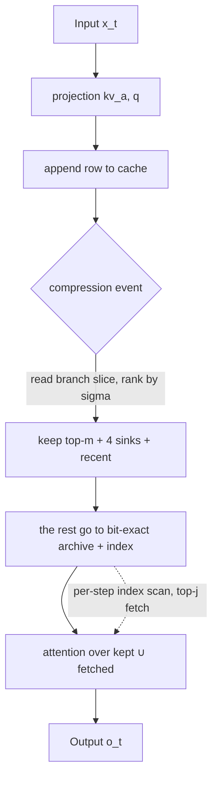

[Paper](https://arxiv.org/abs/2609.03949v1)
## VestigeKV: The Degenerate RoPE Branch Carries Its Own Cache Eviction Signal

## TL;DR

In **NoPE-MLA** models (Kimi Linear 48B), reading only **11%** of each row — the 64-dim **decoupled branch** that training has repurposed as a *salience channel*, a "vestige" of RoPE — yields a query-independent importance signal and achieves **8–32×** (up to **128×** with the retrieval tier) KV cache compression while maintaining retrieval performance. It is a **pure cache policy** that never touches weights, kernels, or compute (source: Abstract).

---

## Core idea

The KV cache grows linearly as generation proceeds, and in long-context and long-reasoning-chain settings this is exactly the bottleneck. Existing cache compression methods (H2O, SnapKV, StreamingLLM) all decide which tokens to keep by looking at **"already-observed attention."** But the real problem is this:

> The compression decision must be made **before the future queries that will read it even exist** (source: §2, Fig.1).

If a needle is buried deep in the document, that token's importance is assigned by a query that has not yet been born at compression time. Observed attention cannot possibly carry this information, and indeed H2O collapses to a **0.00** needle-retrieval rate on NoPE-MLA models (source: Tab.4).

VestigeKV's insight is simple. In **NoPE (No Positional Encoding)** models the attention score is a *single fixed bilinear form*, so a token's importance becomes **its own property, independent of any query**. And the channel carrying that signal already exists in the cache — the 64-dim decoupled branch that MLA introduced to route around RoPE has been repurposed as an **"importance channel"** under NoPE training (source: §3.2, Tab.1). The entire paper is the observation that merely reading this vestigial organ enables query-independent eviction.

---

## Background: the problem they solve

### Where do MLA and the decoupled branch come from

DeepSeek-V2's **MLA (Multi-head Latent Attention)** compresses KV into a low-rank latent to shrink the cache (source: §7). But RoPE's rotation $R_{t-u}$ does not commute with the up-projection, so it cannot pass through this low-rank bottleneck. DeepSeek-V2 therefore routed positional information through a **separate per-token, MQA-shared channel**. This is the 64-dim **decoupled branch** $r_u$ (source: §3.2).

Kimi Linear adopts **NoPE**, i.e. no positional encoding at all, so there is nothing left to rotate in this branch (no rotary call in the reference implementation, `skip_rope=True`). Yet training did not throw away this channel that had "lost its job."

### The collapse of observed-attention-based eviction

Existing methods all presuppose the query's existence (source: §7):

| Method | Mechanism | NoPE-MLA needle-retrieval rate (8×) |
|---|---:|---:|
| H2O | Accumulated past attention mass | 0.00 |
| SnapKV | Vote over the window just before generation | 0.33 |
| StreamingLLM | Pin attention sinks | 0.00 |
| **VestigeKV** | Branch-based query-independent eviction | **1.00** |

(source: Tab.4, L=8192, 24 trials)

The authors show this is an **informational, not budgetary, problem**. Even when H2O is handed half its budget as a recent window, the result is still **0.00** (source: Tab.4, "H2O+recent"). Because observed attention has no way to know about the existence of future queries.

### Theoretical foundation: the math of a position-free cache

Everything follows from a single structural fact. In NoPE, the cache row $\tilde{C}_u = [\hat{c}_u ; r_u]$ and the two maps that read it — the score $s_h(t,u)=\lambda\langle Q^h_t, \tilde{C}_u\rangle$ and the value $v^h_u = W^h_{UV}\hat{c}_u$ — all depend on $u$ **only through the row itself** (source: §3, Eq.1). Three pillars follow from this:

1. **Lemma 1 (commutativity)**: The NoPE-MLA attention output is a function of the *multiset* of cache rows. That is, the rows' **positions, ages, and order** are meaningless (source: §3).
2. **(a) A query-independent importance exists**: $\arg\max_u s_h(t,u) = \arg\max_u \langle A_h^\top x_t, x_u\rangle$ ($\mathrm{rank}\,A_h \le d_\text{head}$). The tokens that can win are extreme points of the hidden-state cloud, only **2.3–6.7%** of all tokens. Under RoPE the form changes with position, inflating this fraction to **10.2–46.8%** (source: §3(a), Tab.5).
3. **(c) Per-token certificate**: if a replacement row $C_{g(u)}$ satisfies $\lVert\tilde{C}_u - C_{g(u)}\rVert \le \varepsilon_u$, then for *any* future query $|\Delta s| \le \lambda\lVert Q\rVert\varepsilon_u$ — a bound uniform over queries holds (source: §3(c)).

And **Corollary 1 (rank stationarity)**: in NoPE, $s(q_t,u)$ contains neither $t$ nor the row's age, so a rank computed once **stays valid at every later step**. The eviction decision is *final*. Under RoPE the score oscillates across frequency bands so ranks flip over time, and a frozen rank inevitably goes stale (source: §3.1).

---

## New approach: VestigeKV

VestigeKV is a **cache policy that touches no weights, kernels, or compute**. Everything added to an existing MLA is just the orange cache-membership policy; remove it and you return exactly to vanilla MLA (source: Fig.2).

(diagram: a simplified rendering of Fig.2. Gray is existing computation, orange is the added policy.)

### 4.1 Eviction policy: the branch's high-frequency energy

For the branch vectors $r_{0:T}$ of a closed prefix block, the sequence-axis FFT $\mathcal{F}$ and a bandwidth $\kappa$ are used (source: §4.1, Eq.3):

$$
\sigma_u = \Big\lVert r_u - \big(\mathcal{F}^{-1}\mathbf{1}_{[0,\kappa)}\mathcal{F}r\big)_u \Big\rVert
$$

That is, the importance is the **high-frequency energy left after subtracting the low-frequency (low-pass) component** from the branch vector. The $\sigma$-top-m rows (+ 4 sinks + recent window) stay in the attended tier, and the rest go to the archive **bit-exact**. **No row is ever deleted** — the deployment invariant is a *partition* (source: §4.1).

### 4.2 Retrieval tier: an index with certificates

An evicted row $u$ leaves an index entry $(r_u, V_r^\top\hat{c}_u, \eta_u)$ (source: §4.2): the **exact** component of the branch latent, a rank-$r$ sketch of the content latent, and the sketch residual norm $\eta_u = \lVert(I - V_r V_r^\top)\hat{c}_u\rVert$. At every decode step (Eq.4):

$$
\text{score}(t,u) = \lambda q^{r\top}_t r_u + \lambda (V_r^\top q^{c'}_t)^\top(V_r^\top \hat{c}_u) + z\,\lambda\,\lVert(I - V_r V_r^\top)q^{c'}_t\rVert\,\eta_u / \sqrt{d_c - r}
$$

The first two terms are computable from the index alone; the third term is the **certificate magnitude**. Only the top-$j$ rows whose score exceeds the tier-1 maximum $s^\ast$ are fetched and joined into that query's softmax as exact copies (source: Fig.4).

The structure is sharpened by two lemmas (source: §4.2):

- **Lemma 2 (index certificate)**: for any future query and archive row, $s(t,u)$ is the sum of the three terms above, with residual $|\delta_{t,u}|\le\lambda\lVert(I-V_rV_r^\top)q^{c'}_t\rVert\eta_u$ — it follows from Cauchy–Schwarz and, because the form is fixed, holds for *every* query.
- **Lemma 3 (leakage bound)**: if every excluded row satisfies $s(t,u)\le s^\ast-\tau$, the total excluded softmax mass is at most $(T-|F|)e^{-\tau}$.

### 4.3 Why this is impossible under RoPE

Existing retrieval designs (ArkVale) score pages via bounding-sphere digests. But under RoPE, the same content at a different position is a different row (source: §4.3, Eq.5):

$$
\lVert R_u k - R_v k\rVert^2 = \sum_j 4\sin^2\frac{\theta_j(u-v)}{2}\,\lVert k^{(j)}\rVert^2
$$

So the radius $r$ inflates **proportionally to the norm of the fast-frequency components**, regardless of content consistency. The worst-layer retrieval rate collapses to **0.024** with heuristic radii and **0.014** with sound radii, whereas NoPE gives **0.67 / 0.97** (source: Tab.2). The looseness of the digest is a **structural** dilemma of RoPE — and NoPE removes it at the root.

---

## How it works: a concrete walkthrough

Let's walk through it with concrete numbers. A single Kimi Linear cache row is **576-dim** (content latent $\hat{c}_u$: 512-dim, RMSNormed so it only carries *direction* + branch $r_u$: 64-dim) (source: Fig.3). The cache is **8.1 KB** per token.

**Step 1 — verify the signal is really there.** Is the branch a genuine importance channel? The paper's measurements confirm it (source: Tab.1):

| Measurement | NoPE (Kimi) | RoPE (DSV2) |
|---|---:|---:|
| branch/content row-norm ratio (max) | **3.48×** | 1.01× |
| Score-variance share (11% of dims) | **67.6%** | (branch is position-only) |
| top-1 preservation — branch only | **0.9869** | — |
| top-1 preservation — content only | 0.0001 | — |

The **branch alone** determines a row's *magnitude*, not content (which, being RMSNormed, only carries direction). Branch-only preserves top-1 at **98.69%**, while content-only gives **0.01%**. This is direct evidence that training has inscribed importance into this channel.

**Step 2 — eviction.** When a block closes (e.g. $T=8192$ tokens), only each row's 64-dim branch slice is read. The sequence-axis FFT removes the low-frequency ($\kappa$) part, the high-frequency norm $\sigma_u$ is computed, and the top-$m$ are kept. At $32\times$ compression $m \approx 256$ rows, and the attended tier shrinks to **0.25 KB/token** (1/32 of the original 8.1 KB) (source: Abstract, §5.2). Only **11%** (64/576) of each row has been read.

**Step 3 — retrieval.** The remaining 7,936 rows are not deleted; they stay in a GPU-resident archive as $(r_u, V_r^\top\hat{c}_u, \eta_u)$ index entries. At each decode step the index is scanned, the (Eq.4) score is computed, and only the top-$j$ ($j=16$) rows exceeding the tier-1 maximum $s^\ast$ are fetched and joined into the softmax as exact copies. With $r=64$ (resident), the index scan costs **128 dims** (64+64) per row, and fetches are rare.

**The read budget is the whole performance story.** Decode attention is bandwidth-bound, so KV-path time is proportional to the bytes read per step (source: §3.2, Eq.2):

$$
\text{reads}(\rho,r) = \underbrace{\rho\cdot 576}_{\text{attended}} + \underbrace{(1-\rho)(64+r)}_{\text{index scan}} + \underbrace{f\cdot 576}_{\text{admitted}}
$$

Plugging in $\rho=1/32$, $r=64$, and the admitted fraction $f$ (**0.4–0.8%** in document decode), this is about **145/576 dims** = a **4.0×** reduction in KV-path reads (source: §3.2). The trigger term is under 1%.

---

## Performance verification: key results

**The primary metric is the needle-retrieval intact rate** ($\Delta$NLL < 1 nat). Because continuous loss (CE) cannot arbitrate retrieval — the recent-window floor matches the standard configuration on CE while degrading +15 nats on needles (source: §5, Tab.7).

**Tier-1 eviction (retrieval tier off).** VestigeKV reading only the branch has **zero gap** versus selection reading full rows (source: Tab.3):

| | 8k / 32× | 32k / 32× | 65k / 32× |
|---|---:|---:|---:|
| VestigeKV (11% read) | 0.92 | 0.92 | 0.92 |
| Full-row selection | 0.92 | 0.92 | 0.92 |

**Recovery via the retrieval tier** (source: Tab.6):

| | 32× | 128× |
|---|---:|---:|
| Eviction only | 0.88 | 0.67 |
| + retrieval tier | **1.00** | **1.00** |

The retrieval tier restores everything eviction lost while admitting only **0.5–2.6%** additional rows per query. At 8× it is lossless (1.00) from the start (source: Abstract, Tab.6).

**NoPE-exclusivity — the same operator's fate diverges** (source: Tab.5, same layer, 32×):

| | NoPE | RoPE |
|---|---:|---:|
| VestigeKV | **0.88** | 0.08 |
| full-row eviction | 0.83 | 0.42 |

The branch-width eviction experiment is consistent too. As it goes 4-dim → 64-dim, the rate rises monotonically from 0.42 → 0.88 at 32× (source: Tab.5). Meaning the signal really does ride on the branch.

**General-LM cost** is effectively lossless. In the standard configuration $\Delta$CE = **+0.0018 nats/token** @32× (about **0.0006 bits/byte**, assuming ~4-byte tokens) (source: Tab.7). Eviction alone is +0.0090 nats/token.

**The deployment path matches as well.** The serving engine (chunked prefill + streaming eviction + GPU-resident retrieval) matches the HF reference with a median $|\Delta$NLL| of $7.9\times10^{-3}$ under teacher-forced NLL (against a measured reproducibility floor of $6.8\times10^{-3}$) (source: §5.1). At 512× eviction alone keeps 6/12 needles, and the retrieval tier recovers **all** of the lost 6, making it 12/12. Bits-per-byte goes 0.5881 → 0.5885 (+0.0014 nats/token @32×), and MAUVE 0.999 → 0.962 (small N, stated) (source: §5.1).

---

## Our perspective: strengths, limitations, and why this work matters

### Strengths

- **Exceptionally strong measurement hygiene.** Every threshold was pre-registered and frozen before data, accompanied by gates validated on known-bad inputs, 20 archived verdicts, and 8 discarded paths (source: §6, Tab.9). Three pre-registered hypotheses were refuted and recorded by their own experiments.
- **It honestly marks the limits of the "free lunch."** It reports both the mathematical possibility of lossless merging (Proposition 1) and the empty set found on real corpora (source: §3(b), Appx.C). It never confuses possibility with measured results.
- **Theory and engineering are one body.** Commutativity (Lemma 1) → rank stationarity (Corollary 1) → index certificate (Lemma 2) → leakage bound (Lemma 3) all follow in a chain from the single fact of a "fixed bilinear form," and each maps to a real system component (selector, retrieval index, trigger).

### Limitations

- **Measured on a single model only.** Every measurement comes from Kimi Linear 48B. Kimi K3 is a Gated-MLA variant with the same 576-dim cache layout, so extension is *plausible* but unverified, and the authors make no claim about it (source: §8).
- **Restricted to the NoPE-MLA family.** The same selector ordering reproduces on a NoPE GQA hybrid (Granite-4.0-H), but the *eviction depth* does not. The depth claim is conditional on MLA (source: §8).
- **Retrieval is stochastic.** Row reachability is guaranteed constructively (the partition deletes nothing), but per-step lookups run at recall 0.9–1.0, end-to-end 1.00. The deterministic variant relies on CPU assistance. Pure deletion costs +15 nats (source: §8).
- **Contexts up to 65k.** Beyond that is extrapolation, and the standard long-context suite remains future work (source: §8).

### Why it matters

The paper's real contribution is not a particular compression technique but the observation that **"NoPE changes the algorithm design space itself."** In the appendix the authors lay out that several existing algorithms, once ported to NoPE-MLA, each acquire a hidden guarantee (source: Appx.C): H2O's statistics become stationary, SnapKV's voting horizon becomes infinite, Quest's page bounds become admissible, MatryoshkaKV's projection objective becomes clean, and KeepKV's merging gains an exactness certificate. VestigeKV is merely the first instance of these.

At the same time this is a warning. That **the same operator collapses to 0.08 under RoPE** means the "select by observed attention" practice accumulated in the RoPE era is no longer optimal when carried into NoPE. It squarely exposes a connection that has received little attention: the design language of cache compression depends on the architecture's positional-encoding choice.

---

## What's next?: the road ahead

The authors leave three prospects as "possibilities, not claims" (source: §9):

1. **Resurrecting the zero-miss trigger.** The current trigger, limited by the size of the sketch residual $\eta_u$, cannot give a full guarantee, but *training* $\eta_u$ *to be small* by widening the vestige and adding an auxiliary objective could bring back guaranteed-recall sparse attention.
2. **Realizing exact collapse.** Proposition 1's exact merging is empty on real corpora, but training position-independent latents for repeated spans could revive the merging class and shrink the cache to $O(\text{distinct content})$.
3. **Eviction-aware fine-tuning.** Under NoPE the query-independent selector is the *only stable objective*, so it is far more tractable than RoPE, where the signal moves with position.

All three prospects are **conditional on scale**. Since NoPE+MLA is measurably weaker in small models, none of them can be cheaply verified (source: §9).

The questions we would add are these. First, **measuring the retrieval tier's cost-benefit in wall-clock time** — the paper itself states that "fused-kernel wall clock was not measured" (source: §3.2). Whether the 4.0× reduction in KV-path reads actually shows up in tokens/second is unknown. Second, **whether NoPE is really the future default** — if so, VestigeKV's methodology is not a single-model trick but a candidate standard cache policy for next-generation long-context LLMs. Third, the fact that the depth mechanism remains open (source: §8) means we lack an understanding of why the branch signal is especially strong in deep layers, and pinning this down could push the compression ratio further.

**Conclusion.** What VestigeKV shows is that sometimes the best cache-compression signal is not designed from scratch but **found in an organ the architecture thought it had already discarded**. And that discovery holds not by accident — it is a structural gift granted by "rotation-free" math. The vestigial organ is itself the signal. (source: §10)

<!-- verbatim-tables -->

## Tables from the paper

> Tables converted mechanically from the arXiv e-print LaTeX source. The numbers are the paper's own and did not pass through a model.

**Table 1. Table 1**

| effect | attended tier $576\to18$ dims/token at $32\times$ (archive bit-exact, GPU-resident or host-offloaded) with retrieval 0.92 (8k--65k); lossless at $8\times$; with the recall tier, 1.00 at $128\times$ |
|---|---|
| selection cost | read 11% of each row once per compression event; one low-pass filter ($O(T\log T)$) $+$ top-$m$; decode path unchanged |
| model changes | none --- weights, kernels, arithmetic untouched; this is a cache *policy*: read `latent_cache[$\ldots$,512:]`, rank, free rows |
| recall tier (standard) | archived rows stay GPU-resident $+$ a $(64{+}r)$-dim index; per step, one index GEMV and $\le\!16$ rows admitted on trigger --- full attention reads drop from 576 to ${\sim}145$ dims/token --- $4.0\times$ on the KV path (Eq. ); host offload is the VRAM-bound variant |
| NoPE exclusivity | the signal is query-independent salience, which exists only when the score is one fixed bilinear form; measured 0.08 under RoPE |

**Table 2. The branch is the trained salience channel. Static rows from weights alone; behavioral rows from 512 real queries $\times$ 32 heads.**

| measurement | NoPE (Kimi) | RoPE (DSV2) |
|---|---|---|
| branch/content row norm (max) | 3.48$\times$ | 1.01$\times$ |
| score-variance share (11% of dims) | 67.6% | (branch is positional) |
| top-1 retention, branch only | 0.9869 | --- |
| top-1 retention, content only | 0.0001 | --- |
| normalization | content is RMSNormed; the branch is the row's only magnitude path |  |

**Table 3. Each ArkVale-style limitation, its mechanism, and the measured effect of removing rotation. Same digest protocol on both models (32-token pages, sphere digests per their Eq. 1--2); recall@8 pages of the true-argmax page, worst layer --- the tail-risk statistic that decides adoptability.**

| limitation | mechanism | RoPE | NoPE |
|---|---|---|---|
| digest looseness | Eq. : orbit-inflated radius | 1.78--1.86$\times$ spread | (removed) |
| worst-layer recall (heuristic $r$) | deep layers position-dominated | 0.024 | 0.67 |
| worst-layer recall (sound $r$) | sound radius unusable | 0.014 | 0.97 |
| per-step re-ranking | winner set sweeps with position | 10.2--46.8% union | 2.3--6.7% union |

**Table 4. Tier-1 ablation (recall tier off; not the deployed form). Branch-only selection (VestigeKV, reads 11% of each row) vs.\ full-row selection at matched budget.**

|  | $L{=}8192$ $32\times$ | $L{=}8192$ $64\times$ | $L{=}8192$ $128\times$ | $L{=}32768$ $32\times$ | $L{=}32768$ $64\times$ | $L{=}32768$ $128\times$ | $L{=}65536$ $32\times$ | $L{=}65536$ $64\times$ | $L{=}65536$ $128\times$ |
|---|---|---|---|---|---|---|---|---|---|
| VestigeKV | 0.88 | 0.75 | 0.67 | 0.92 | 0.83 | 0.83 | 0.92 | 0.75 | 0.58 |
| Full-row selection | 0.83 | --- | 0.67 | 0.92 | --- | 0.83 | 0.92 | --- | 0.58 |

**Table 5. Tier-1 ablation (recall tier off). Needle intact rate when compression precedes the query ($L{=}8192$, 24 trials; $L{=}32768$, 12 trials). The recent-window variant rules out a budgetary explanation for the collapse (Section ). These methods remain strong in their design setting (query present at compression); this is the other setting.**

|  | $8\times$ | $32\times$ | $128\times$ |
|---|---|---|---|
| H2O | 0.00 | 0.00 | 0.00 |
| SnapKV | 0.33 | 0.04 | 0.00 |
| H2O $+$ recent (half budget) | 0.00 | 0.00 | 0.00 |
| StreamingLLM | 0.00 | 0.00 | 0.00 |
| VestigeKV | 1.00 | 0.88 | 0.67 |
| H2O / SnapKV, $L{=}32768$ | --- | 0.00 / 0.00 | 0.00 / 0.00 |
| VestigeKV, $L{=}32768$ | --- | 0.92 | 0.83 |

**Table 6. Tier-1 ablation. Left: dual-arm acceptance, frozen before either arm ran: work on NoPE *and* fail on RoPE (DeepSeek-V2-Lite, matched layers, $32\times$). Right: branch-width ablation --- post-hoc PCA truncation before $\sigma$; monotone degradation below 32 dims.**

|  | NoPE | RoPE |
|---|---|---|
| VestigeKV | 0.88 | 0.08 |
| full-row eviction | 0.83 | 0.42 |
| top-1 union | 2.3--6.7% | 10.2--46.8% |

**Table 7. Left: end-to-end recovery ($L{=}8192$, 24 trials) --- the tier restores what eviction loses, admitting only 0.5--2.6% extra rows per query. Right: the index-rank knob --- a larger sketch cuts trigger rate and fetch volume while recall *rises* (tighter bounds rank better). Rows/query is a document-perplexity figure; retrieval-heavy steps legitimately fetch more (5--37 rows per layer at $r{=}192$ on needle contexts, recovery still 1.00).**

|  | $32\times$ | $128\times$ |
|---|---|---|
| eviction only | 0.88 | 0.67 |
| $+$ recall tier | 1.00 | 1.00 |

**Table 8. Tier-1 ablation. General language-modeling cost ($\Delta$CE, nats/token, held-out continuation, 6 docs). The standard configuration is effectively lossless (${\sim}0.0006$ bits/byte at $32\times$ for ${\sim}4$-byte tokens). The recent-only floor matches on CE while scoring $+15$ nats on needle --- continuation loss alone cannot arbitrate retrieval, which is why needle is the primary metric.**

| $\Delta$CE | $8\times$ | $32\times$ | $128\times$ |
|---|---|---|---|
| eviction $+$ recall tier (standard) | +0.0011 | +0.0018 | +0.0022 |
| eviction only | +0.0055 | +0.0090 | +0.0104 |
| recent-only floor | +0.0055 | +0.0093 | +0.0112 |
