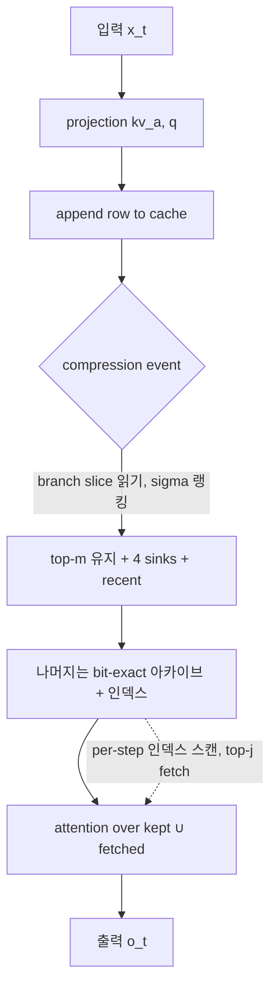

[논문 링크](https://arxiv.org/abs/2609.03949v1)
## VestigeKV: 퇴화한 RoPE 가지가 스스로 캐시 축출 신호를 품고 있다

## 한 줄 요약 (TL;DR)

**NoPE-MLA** 모델(Kimi Linear 48B)에서, 훈련이 *샐리언스 채널* 로 재용도한 64차원 **decoupled branch** — RoPE의 "퇴화 기관(vestige)" — 를 행의 **11%** 만 읽어 쿼리 독립적인 중요도 신호를 얻고, **8~32배**(회수 계층 포함 시 **128배**) KV 캐시 압축을 해내면서 검색 성능을 유지한다. 가중치·커널·연산은 전혀 건드리지 않는 **순수 캐시 정책** 이다 (근거: Abstract).

---

## 핵심 아이디어

KV 캐시는 생성이 진행될수록 선형으로 커지고, 장문 컨텍스트와 긴 추론 체인에서 이것이 곧 병목이 된다. 기존의 캐시 압축 기법(H2O, SnapKV, StreamingLLM)은 전부 **"이미 관찰된 어텐션"** 을 보고 어떤 토큰을 남길지 결정한다. 그런데 진짜 문제는 여기다:

> 압축 결정은 그것을 읽을 **미래의 쿼리가 존재하기 전에** 내려져야 한다 (근거: §2, Fig.1).

니들(needle)이 문서 깊숙한 곳에 박혀 있다면, 그 토큰의 중요도는 압축 시점에 아직 태어나지도 않은 쿼리가 부여하는 것이다. 관찰된 어텐션은 이 정보를 원천적으로 가질 수 없고, 실제로 H2O는 NoPE-MLA 모델에서 니들 검색률이 **0.00** 으로 붕괴한다 (근거: Tab.4).

VestigeKV의 통찰은 단순하다. **NoPE(No Positional Encoding)** 모델에서는 어텐션 점수가 *하나의 고정된 이중선형형식(bilinear form)* 이므로, 토큰의 중요도가 **쿼리와 무관하게 토큰 자신만의 속성** 이 된다. 그리고 그 신호를 담고 있는 채널이 이미 캐시 안에 존재한다 — MLA 아키텍처가 RoPE를 우회하기 위해 만든 64차원 decoupled branch가, NoPE 훈련 하에서 **"중요도 채널"** 로 재용도된 것이다 (근거: §3.2, Tab.1). 이 퇴화 기관을 읽는 것만으로 쿼리 독립적 축출이 가능하다는 것이 논문의 전부다.

---

## 배경: 그들이 해결한 문제

### MLA와 decoupled branch는 어디서 왔나

DeepSeek-V2의 **MLA(Multi-head Latent Attention)** 는 KV를 저차원 latent로 압축해 캐시를 줄인다 (근거: §7). 그런데 RoPE의 회전 연산 $R_{t-u}$ 는 up-projection과 교환되지 않아, 이 저차원 병목을 통과하지 못한다. 그래서 DeepSeek-V2는 위치 정보를 **별도의 per-token, MQA-공유 채널** 로 우회시켰다. 이것이 64차원 **decoupled branch** $r_u$ 이다 (근거: §3.2).

Kimi Linear는 **NoPE** 를 채택했다. 즉 위치 인코딩을 아예 쓰지 않으므로, 이 branch에는 더 이상 회전시킬 일이 없다 (참조 구현에 rotary 호출 없음, `skip_rope=True`). 그런데 훈련은 이 "일자리를 잃은" 채널을 버리지 않았다.

### 관찰된 어텐션 기반 축출의 붕괴

기존 기법들은 전부 쿼리 존재를 전제로 한다 (근거: §7):

| 기법 | 메커니즘 | NoPE-MLA 니들 검색률 (8×) |
|---|---:|---:|
| H2O | 과거 어텐션 질량 누적 | 0.00 |
| SnapKV | 생성 직전 윈도우 투표 | 0.33 |
| StreamingLLM | 어텐션 싱크 고정 | 0.00 |
| **VestigeKV** | branch 기반 쿼리 독립 축출 | **1.00** |

(근거: Tab.4, L=8192, 24 trials)

저자들은 이것이 **예산(budgetary) 문제가 아니라 정보(informational) 문제** 임을 보여준다. H2O에 최근 윈도우로 예산의 절반을 쥐여줘도 결과는 여전히 **0.00** 이다 (근거: Tab.4, "H2O+recent"). 관찰된 어텐션은 미래 쿼리의 존재를 알 도리가 없기 때문이다.

### 이론적 토대: 위치 없는 캐시의 수학

모든 것은 하나의 구조적 사실에서 나온다. NoPE에서 캐시 행 $\tilde{C}_u = [\hat{c}_u ; r_u]$ 와 그것을 읽는 두 맵 — 점수 $s_h(t,u)=\lambda\langle Q^h_t, \tilde{C}_u\rangle$ 와 값 $v^h_u = W^h_{UV}\hat{c}_u$ — 은 모두 $u$ 에 대해 **행 그 자체를 통해서만** 의존한다 (근거: §3, Eq.1). 여기서 세 기둥이 도출된다:

1. **Lemma 1 (교환성)**: NoPE-MLA 어텐션 출력은 캐시 행들의 *멀티셋* 에 대한 함수다. 즉 행의 **위치·나이·순서**가 무의미하다 (근거: §3).
2. **(a) 쿼리 독립적 중요도가 존재한다**: $\arg\max_u s_h(t,u) = \arg\max_u \langle A_h^\top x_t, x_u\rangle$ ($\mathrm{rank}\,A_h \le d_\text{head}$). 승자가 될 수 있는 토큰은 숨은 상태 구름의 극점으로, **전체 토큰의 2.3~6.7%** 에 불과하다. RoPE에서는 형태가 위치에 따라 변해 이 비율이 **10.2~46.8%** 로 부풀어 오른다 (근거: §3(a), Tab.5).
3. **(c) 토큰별 증명서**: 대체 행 $C_{g(u)}$ 가 $\lVert\tilde{C}_u - C_{g(u)}\rVert \le \varepsilon_u$ 를 만족하면, 미래의 *어떤* 쿼리에 대해서도 $|\Delta s| \le \lambda\lVert Q\rVert\varepsilon_u$ — 쿼리에 대해 균일한 경계가 성립한다 (근거: §3(c)).

그리고 **Corollary 1 (순위 정상성)**: NoPE에서 $s(q_t,u)$ 는 $t$ 도 행의 나이도 포함하지 않으므로, 한 번 계산된 순위는 **이후 모든 스텝에서 유효** 하다. 축출 결정은 *최종적* 이다. RoPE에서는 점수가 주파수 대역마다 진동해 순위가 시간에 따라 뒤집히므로, 얼어붙은 순위는 필연적으로 낡는다 (근거: §3.1).

---

## 새로운 접근법: VestigeKV

VestigeKV는 **가중치도, 커널도, 연산도 건드리지 않는 캐시 정책** 이다. 기존 MLA에 더해지는 것은 오직 주황색 캐시 멤버십 정책뿐이며, 이를 제거하면 정확히 기존 MLA로 복귀한다 (근거: Fig.2).

(그림: Fig.2를 단순화한 구조. 회색이 기존 연산, 주황색이 추가된 정책.)

### 4.1 축출 정책: branch의 고주파 에너지

닫힌 prefix 블록의 branch 벡터 $r_{0:T}$ 에 대해, 시퀀스 축 FFT $\mathcal{F}$ 와 대역폭 $\kappa$ 를 쓴다 (근거: §4.1, Eq.3):

$$
\sigma_u = \Big\lVert r_u - \big(\mathcal{F}^{-1}\mathbf{1}_{[0,\kappa)}\mathcal{F}r\big)_u \Big\rVert
$$

즉, branch 벡터에서 **저주파(저역통과) 성분을 빼고 남은 고주파 에너지** 를 중요도로 삼는다. $\sigma$-top-m 행(+ 4개의 싱크 + 최근 윈도우)을 attended tier에 남기고, 나머지는 **bit-exact 그대로** 아카이브로 보낸다. **어떤 행도 삭제되지 않는다** — 배포 불변식은 *파티션* 이다 (근거: §4.1).

### 4.2 회수 계층: 증명서가 붙은 인덱스

축출된 행 $u$ 는 인덱스 항목 $(r_u, V_r^\top\hat{c}_u, \eta_u)$ 를 남긴다 (근거: §4.2): branch 합의 **정확한** 성분, content 합의 rank-$r$ 스케치, 그리고 스케치 잔차 노름 $\eta_u = \lVert(I - V_r V_r^\top)\hat{c}_u\rVert$. 디코드 스텝마다 (Eq.4):

$$
\text{score}(t,u) = \lambda q^{r\top}_t r_u + \lambda (V_r^\top q^{c'}_t)^\top(V_r^\top \hat{c}_u) + z\,\lambda\,\lVert(I - V_r V_r^\top)q^{c'}_t\rVert\,\eta_u / \sqrt{d_c - r}
$$

첫 두 항은 인덱스만으로 계산 가능하고, 세 번째 항은 **증명서 규모** 다. tier-1 최대 점수 $s^\ast$ 를 넘는 top-$j$ 행만 페치해 그 쿼리의 softmax에 정확한 복사본으로 합류시킨다 (근거: Fig.4).

이 구조는 두 보조정리로 정밀해진다 (근거: §4.2):

- **Lemma 2 (인덱스 증명서)**: 어떤 미래 쿼리·아카이브 행에 대해서도 $s(t,u)$ 는 위 세 항의 합이며, 잔차 $|\delta_{t,u}|\le\lambda\lVert(I-V_rV_r^\top)q^{c'}_t\rVert\eta_u$ — Cauchy–Schwarz로부터 오고, 형태가 고정되어 있기에 *모든* 쿼리에 대해 성립한다.
- **Lemma 3 (누출 경계)**: 배제된 행이 모두 $s(t,u)\le s^\ast-\tau$ 를 만족하면, 총 배제 softmax 질량은 최대 $(T-|F|)e^{-\tau}$ 다.

### 4.3 RoPE 아래에서는 왜 이것이 불가능한가

기존 회수 설계(ArkVale)는 페이지를 경계구(bounding-sphere) 다이제스트로 점수화한다. 그런데 RoPE에서는 같은 내용이라도 위치가 다르면 행이 다르다 (근거: §4.3, Eq.5):

$$
\lVert R_u k - R_v k\rVert^2 = \sum_j 4\sin^2\frac{\theta_j(u-v)}{2}\,\lVert k^{(j)}\rVert^2
$$

따라서 반경 $r$ 은 내용의 일관성과 무관하게 **빠른 주파수 성분의 놈에 비례** 해 팽창한다. 최악 레이어 회수율은 heuristic 반경에서 **0.024**, sound 반경에서 **0.014** 로 붕괴하는 반면, NoPE에서는 **0.67 / 0.97** 이다 (근거: Tab.2). 다이제스트의 비조임(looseness)이 RoPE의 **구조적** 딜레마라는 것 — NoPE는 이를 뿌리에서 제거한다.

---

## 작동 원리: 구체적인 예시로 살펴보기

구체적으로 수치를 넣어 따라가 보자. Kimi Linear의 캐시 행 하나는 **576차원** (content latent $\hat{c}_u$: 512차원, RMSNorm되어 *방향만* 담음 + branch $r_u$: 64차원)이다 (근거: Fig.3). 토큰당 캐시는 **8.1 KB** 다.

**1단계 — 신호가 진짜 있는지 확인.** branch가 진짜 중요도 채널인가? 논문의 측정이 이를 확증한다 (근거: Tab.1):

| 측정 | NoPE (Kimi) | RoPE (DSV2) |
|---|---:|---:|
| branch/content 행 노름 비 (최대) | **3.48×** | 1.01× |
| 점수 분산 점유율 (11% 차원) | **67.6%** | (branch는 위치 전용) |
| top-1 보존율 — branch만 | **0.9869** | — |
| top-1 보존율 — content만 | 0.0001 | — |

행의 *크기* 를 결정하는 경로는 content(RMSNorm이라 방향만)가 아니라 **branch가 유일** 하다. branch만으로 top-1을 **98.69%** 보존하는데, content만으로는 **0.01%** 다. 훈련이 이 채널에 중요도를 새겨 넣었다는 직접 증거다.

**2단계 — 축출.** 블록이 닫히면(예: $T=8192$ 토큰) 각 행의 branch 64차원 슬라이스만 읽는다. 시퀀스 축 FFT로 저주파($\kappa$)를 제거한 고주파 노름 $\sigma_u$ 를 계산하고, top-$m$ 을 유지한다. $32\times$ 압축이면 $m \approx 256$ 행, attended tier는 **0.25 KB/token** (원래 8.1 KB의 1/32)으로 줄어든다 (근거: Abstract, §5.2). 이때 읽은 것은 행의 **11%** (64/576)뿐이다.

**3단계 — 회수.** 나머지 7936행은 삭제되지 않고 GPU-resident 아카이브에 $(r_u, V_r^\top\hat{c}_u, \eta_u)$ 인덱스로 남는다. 디코드 스텝마다 인덱스를 스캔해 (Eq.4)의 점수를 계산하고, tier-1 최대값 $s^\ast$ 를 넘는 top-$j$ ($j=16$) 행만 페치해 정확한 복사본으로 softmax에 합류시킨다. $r=64$ (resident) 기준 인덱스 스캔은 행당 **128차원** (64+64), 페치는 거의 없다.

**읽기 예산이 성능의 전부다.** 디코드 어텐션은 대역폭 바운드이므로, KV 경로 시간은 스텝당 읽는 바이트에 비례한다 (근거: §3.2, Eq.2):

$$
\text{reads}(\rho,r) = \underbrace{\rho\cdot 576}_{\text{attended}} + \underbrace{(1-\rho)(64+r)}_{\text{index scan}} + \underbrace{f\cdot 576}_{\text{admitted}}
$$

$\rho=1/32$, $r=64$ 에서 admitted fraction $f$ (문서 디코드에서 **0.4~0.8%**)를 넣으면 약 **145/576 차원** = KV 경로 읽기 **4.0배** 감소다 (근거: §3.2). 트리거 항은 1% 미만에 불과하다.

---

## 성능 검증: 주요 결과

**1차 지표는 니들 검색 intact rate** ($\Delta$NLL < 1 nat)다. 연속 손실(CE)은 회수를 중재하지 못하기 때문이다 — 최근-윈도우 floor는 CE에서 표준 구성과 맞먹으면서도 니들에서는 +15 nats 열화한다 (근거: §5, Tab.7).

**Tier-1 축출 (회수 계층 off).** branch만 읽은 VestigeKV가 전체 행을 읽는 선택과 **간극 0** 이다 (근거: Tab.3):

| | 8k / 32× | 32k / 32× | 65k / 32× |
|---|---:|---:|---:|
| VestigeKV (11% 읽기) | 0.92 | 0.92 | 0.92 |
| Full-row 선택 | 0.92 | 0.92 | 0.92 |

**회수 계층의 복원력** (근거: Tab.6):

| | 32× | 128× |
|---|---:|---:|
| 축출만 | 0.88 | 0.67 |
| + 회수 계층 | **1.00** | **1.00** |

회수 계층은 쿼리당 **0.5~2.6%** 의 행만 추가로 승인하면서 축출이 잃은 것을 전부 되살린다. 8×에서는 처음부터 무손실(1.00)이다 (근거: Abstract, Tab.6).

**NoPE 독점성 — 같은 연산자의 운명이 갈린다** (근거: Tab.5, 동일 레이어, 32×):

| | NoPE | RoPE |
|---|---:|---:|
| VestigeKV | **0.88** | 0.08 |
| full-row eviction | 0.83 | 0.42 |

branch 너비 축출 실험도 일관적이다. 4차원→64차원으로 갈수록 @32×에서 0.42→0.88 로 단조 증가한다 (근거: Tab.5). 신호가 정말로 branch에 실려 있다는 의미다.

**일반 LM 비용** 은 사실상 무손실이다. 표준 구성에서 $\Delta$CE = **+0.0018 nats/token** @32× (약 **0.0006 bits/byte**, ~4바이트 토큰 기준) (근거: Tab.7). 축출만 하면 +0.0090 nats/token.

**배포 경로에서도 동일하다.** 서빙 엔진(chunked prefill + 스트리밍 축출 + GPU-resident 회수)이 teacher-forced NLL에서 HF 참조와 중앙값 $|\Delta$NLL| $7.9\times10^{-3}$ 로 일치한다(측정된 재현성 floor $6.8\times10^{-3}$ 대비) (근거: §5.1). 512×에서 축출 암은 6/12 니들을 유지하고, 회수 계층이 잃은 6개를 **전부** 되찾아 12/12를 만든다. bits-per-byte는 0.5881 → 0.5885 (+0.0014 nats/token @32×), MAUVE는 0.999 → 0.962 (작은 N, 명시됨) (근거: §5.1).

---

## 우리의 관점: 강점, 한계, 그리고 이 연구가 중요한 이유

### 강점

- **측정 위생이 예외적으로 강하다.** 모든 임계값이 데이터 이전에 사전 등록·동결되었고, 알려진-불량 입력으로 검증된 게이트들과 20개의 아카이브 판정·8개의 폐기된 경로가 동반된다 (근거: §6, Tab.9). 세 개의 사전 등록 가설이 자체 실험으로 반증되어 기록되었다.
- **"공짜 점심"의 정직한 한계를 스스로 긋는다.** 무손실 병합(Proposition 1)의 수학적 가능성과 실제 코퍼스에서의 공집합을 동시에 보고한다 (근거: §3(b), Appx.C). 가능성과 측정치를 혼동하지 않는다.
- **이론-공학이 한 몸이다.** 교환성(Lemma 1) → 순위 정상성(Corollary 1) → 인덱스 증명서(Lemma 2) → 누출 경계(Lemma 3)가 전부 하나의 "고정 이중선형형식"이라는 사실에서 연쇄적으로 도출되고, 각각이 실제 시스템 컴포넌트(선택자, 회수 인덱스, 트리거)에 대응한다.

### 한계

- **단 하나의 모델에서만 측정.** 모든 측정은 Kimi Linear 48B에서 나왔다. Kimi K3는 같은 576차원 캐시 레이아웃을 가진 Gated-MLA 변형이라 확장이 *그럴듯* 하지만 검증되지 않았고, 저자도 아무 주장도 하지 않는다 (근거: §8).
- **NoPE-MLA 가족 한정.** 같은 선택자 순서는 NoPE GQA 하이브리드(Granite-4.0-H)에서 재현되지만, *축출 깊이*는 재현되지 않는다. 깊이 주장은 MLA에 조건부다 (근거: §8).
- **회수는 확률적이다.** 행 도달성은 구성적으로 보장되지만(파티션은 아무것도 삭제하지 않음), 스텝별 조회는 recall 0.9~1.0, end-to-end 1.00이다. 결정론적 변형은 CPU 보조뿐이다. 순수 삭제는 +15 nats 손실 (근거: §8).
- **컨텍스트 65k까지.** 그 이상은 외삽이며 표준 장문 스위트는 미래 작업으로 남았다 (근거: §8).

### 왜 중요한가

이 논문의 진짜 기여는 특정 압축 기법이 아니라 **"NoPE가 알고리즘 설계 공간 자체를 바꾼다"** 는 관찰이다. 저자들은 부록에서 기존 알고리즘 여럿이 NoPE-MLA로 이식되면 각각 숨은 보장을 획득한다는 점을 정리한다 (근거: Appx.C): H2O의 통계는 정상(stationary)이 되고, SnapKV의 투표 지평은 무한이 되고, Quest의 페이지 경계는 admissible이 되고, MatryoshkaKV의 투영 목적은 깨끗해지고, KeepKV의 병합은 정확성 증명서를 얻는다. VestigeKV는 그중 첫 번째 인스턴스일 뿐이다.

한편으로 이는 경고이기도 하다. **동일한 연산자가 RoPE에서 0.08로 붕괴한다** 는 것은, RoPE 시대에 축적된 "관찰된 어텐션으로 선택한다"는 관행이 NoPE로 넘어오면 더 이상 최적이 아니라는 뜻이다. 캐시 압축의 설계 언어가 아키텍처의 위치 인코딩 선택에 종속된다는, 지금까지 덜 주목받은 연결을 정면으로 드러낸다.

---

## 다음 단계는?: 앞으로의 길

저자들은 세 가지 전망을 "주장이 아닌 가능성"으로 남긴다 (근거: §9):

1. **제로-미스 트리거의 부활.** 현재 스케치 잔차 $\eta_u$ 가 크기에 트리거가 완전 보장이 되지 못하는데, vestige를 넓히고 보조 목적을 추가해 $\eta_u$ 를 *작게 만들도록 훈련*하면 보장-회수 희소 어텐션이 부활할 수 있다.
2. **정확한 붕괴의 실현.** Proposition 1의 정확 병합은 실제 코퍼스에서 공집합인데, 반복 스팬에 대해 위치-무관 latent로 훈련하면 병합 클래스가 살아나 캐시를 $O(\text{서로 다른 내용})$ 으로 줄일 수 있다.
3. **축출-인지 파인튜닝.** NoPE 아래에서는 쿼리 독립 선택자가 *유일하게 안정적인 목표* 이므로, RoPE(신호가 위치와 함께 움직임)보다 훨씬 다루기 쉽다.

세 전망 모두 **스케일에 조건부** 다. NoPE+MLA는 작은 모델에서 측정 가능하게 약하므로, 이 중 어느 것도 값싸게 검증되지 않는다는 단서가 붙는다 (근거: §9).

우리가 덧붙일 다음 질문은 이것이다. 첫째, **회수 계층의 비용 대비 절감을 벽시계 시간으로** 측정하는 일 — 논문 스스로 "fused-kernel wall clock은 미측정"이라고 밝힌다 (근거: §3.2). 4.0배의 KV 경로 읽기 감소가 실제 토큰/초에서 얼마나 실현되는지는 미지수다. 둘째, **NoPE가 정말 미래의 기본값인가** — 만약 그렇다면 VestigeKV의 방법론은 단일 모델의 트릭이 아니라, 차세대 장문 LLM의 표준 캐시 정책이 될 자격이 있다. 셋째, 깊이 메커니즘이 아직 열려 있다는 점은 (근거: §8), 왜 branch가 깊은 레이어에서 특히 신호가 강한지에 대한 이해가 부족하다는 뜻이며, 이것이 규명되면 압축비를 더 밀어올릴 여지가 있다.

**결론.** VestigeKV가 보여준 것은, 때로 최고의 캐시 압축 신호는 새로 설계하는 것이 아니라 **아키텍처가 이미 버렸다고 생각했던 기관에서 발견된다** 는 것이다. 그리고 그 발견이 유효한 이유는 우연이 아니라 — "회전이 없는" 수학이 부여한 구조적 선물이다. 퇴화 기관이 곧 신호다. (근거: §10)

<!-- verbatim-tables -->

## 논문 원문의 표

> arXiv e-print 의 LaTeX 원본에서 기계적으로 옮긴 표입니다. 숫자는 논문의 값이며 모델을 거치지 않았습니다.

**표 1. 표 1**

| effect | attended tier $576\to18$ dims/token at $32\times$ (archive bit-exact, GPU-resident or host-offloaded) with retrieval 0.92 (8k--65k); lossless at $8\times$; with the recall tier, 1.00 at $128\times$ |
|---|---|
| selection cost | read 11% of each row once per compression event; one low-pass filter ($O(T\log T)$) $+$ top-$m$; decode path unchanged |
| model changes | none --- weights, kernels, arithmetic untouched; this is a cache *policy*: read `latent_cache[$\ldots$,512:]`, rank, free rows |
| recall tier (standard) | archived rows stay GPU-resident $+$ a $(64{+}r)$-dim index; per step, one index GEMV and $\le\!16$ rows admitted on trigger --- full attention reads drop from 576 to ${\sim}145$ dims/token --- $4.0\times$ on the KV path (Eq. ); host offload is the VRAM-bound variant |
| NoPE exclusivity | the signal is query-independent salience, which exists only when the score is one fixed bilinear form; measured 0.08 under RoPE |

**표 2. The branch is the trained salience channel. Static rows from weights alone; behavioral rows from 512 real queries $\times$ 32 heads.**

| measurement | NoPE (Kimi) | RoPE (DSV2) |
|---|---|---|
| branch/content row norm (max) | 3.48$\times$ | 1.01$\times$ |
| score-variance share (11% of dims) | 67.6% | (branch is positional) |
| top-1 retention, branch only | 0.9869 | --- |
| top-1 retention, content only | 0.0001 | --- |
| normalization | content is RMSNormed; the branch is the row's only magnitude path |  |

**표 3. Each ArkVale-style limitation, its mechanism, and the measured effect of removing rotation. Same digest protocol on both models (32-token pages, sphere digests per their Eq. 1--2); recall@8 pages of the true-argmax page, worst layer --- the tail-risk statistic that decides adoptability.**

| limitation | mechanism | RoPE | NoPE |
|---|---|---|---|
| digest looseness | Eq. : orbit-inflated radius | 1.78--1.86$\times$ spread | (removed) |
| worst-layer recall (heuristic $r$) | deep layers position-dominated | 0.024 | 0.67 |
| worst-layer recall (sound $r$) | sound radius unusable | 0.014 | 0.97 |
| per-step re-ranking | winner set sweeps with position | 10.2--46.8% union | 2.3--6.7% union |

**표 4. Tier-1 ablation (recall tier off; not the deployed form). Branch-only selection (VestigeKV, reads 11% of each row) vs.\ full-row selection at matched budget.**

|  | $L{=}8192$ $32\times$ | $L{=}8192$ $64\times$ | $L{=}8192$ $128\times$ | $L{=}32768$ $32\times$ | $L{=}32768$ $64\times$ | $L{=}32768$ $128\times$ | $L{=}65536$ $32\times$ | $L{=}65536$ $64\times$ | $L{=}65536$ $128\times$ |
|---|---|---|---|---|---|---|---|---|---|
| VestigeKV | 0.88 | 0.75 | 0.67 | 0.92 | 0.83 | 0.83 | 0.92 | 0.75 | 0.58 |
| Full-row selection | 0.83 | --- | 0.67 | 0.92 | --- | 0.83 | 0.92 | --- | 0.58 |

**표 5. Tier-1 ablation (recall tier off). Needle intact rate when compression precedes the query ($L{=}8192$, 24 trials; $L{=}32768$, 12 trials). The recent-window variant rules out a budgetary explanation for the collapse (Section ). These methods remain strong in their design setting (query present at compression); this is the other setting.**

|  | $8\times$ | $32\times$ | $128\times$ |
|---|---|---|---|
| H2O | 0.00 | 0.00 | 0.00 |
| SnapKV | 0.33 | 0.04 | 0.00 |
| H2O $+$ recent (half budget) | 0.00 | 0.00 | 0.00 |
| StreamingLLM | 0.00 | 0.00 | 0.00 |
| VestigeKV | 1.00 | 0.88 | 0.67 |
| H2O / SnapKV, $L{=}32768$ | --- | 0.00 / 0.00 | 0.00 / 0.00 |
| VestigeKV, $L{=}32768$ | --- | 0.92 | 0.83 |

**표 6. Tier-1 ablation. Left: dual-arm acceptance, frozen before either arm ran: work on NoPE *and* fail on RoPE (DeepSeek-V2-Lite, matched layers, $32\times$). Right: branch-width ablation --- post-hoc PCA truncation before $\sigma$; monotone degradation below 32 dims.**

|  | NoPE | RoPE |
|---|---|---|
| VestigeKV | 0.88 | 0.08 |
| full-row eviction | 0.83 | 0.42 |
| top-1 union | 2.3--6.7% | 10.2--46.8% |

**표 7. Left: end-to-end recovery ($L{=}8192$, 24 trials) --- the tier restores what eviction loses, admitting only 0.5--2.6% extra rows per query. Right: the index-rank knob --- a larger sketch cuts trigger rate and fetch volume while recall *rises* (tighter bounds rank better). Rows/query is a document-perplexity figure; retrieval-heavy steps legitimately fetch more (5--37 rows per layer at $r{=}192$ on needle contexts, recovery still 1.00).**

|  | $32\times$ | $128\times$ |
|---|---|---|
| eviction only | 0.88 | 0.67 |
| $+$ recall tier | 1.00 | 1.00 |

**표 8. Tier-1 ablation. General language-modeling cost ($\Delta$CE, nats/token, held-out continuation, 6 docs). The standard configuration is effectively lossless (${\sim}0.0006$ bits/byte at $32\times$ for ${\sim}4$-byte tokens). The recent-only floor matches on CE while scoring $+15$ nats on needle --- continuation loss alone cannot arbitrate retrieval, which is why needle is the primary metric.**

| $\Delta$CE | $8\times$ | $32\times$ | $128\times$ |
|---|---|---|---|
| eviction $+$ recall tier (standard) | +0.0011 | +0.0018 | +0.0022 |
| eviction only | +0.0055 | +0.0090 | +0.0104 |
| recent-only floor | +0.0055 | +0.0093 | +0.0112 |
