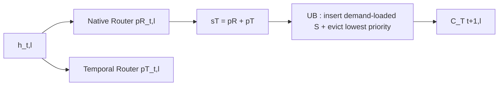

[Paper](https://arxiv.org/abs/2609.04895v1)
## Cache-Learning Routers: Cache-Aware Joint Router Adaptation for Memory-Constrained MoE Inference

## TL;DR

Starting from the observation that MoE's real bottleneck is not compute but expert-weight movement, this work proposes the **Temporal Router** and **Spatio-Temporal Router**, which learn the cache-residency priority itself via post-training while keeping the native Top-$K$ selection rule unchanged (source: §1). On Qwen3-30B-A3B-Instruct-2507, the Temporal-only mode achieves hit-rate gains of +10.46~+33.34 pp and traffic reductions of -28.0~-79.9% over classic replacement policies, with zero additional proactive loads ($P=0$ MB/token); the full mode records adjusted hit-rate gains of +1.15~+18.03 pp and per-token load reductions of -4.6~-53.3% over the strongest prefetch baseline, ProMoE (source: Tab.1, §4.2).

## Core Idea

The paper's central hypothesis can be summarized in one sentence.

> The authors hypothesize that jointly adapting lightweight auxiliary cache routers with the MoE backbone toward a cache-aware objective can reduce decode-phase expert-weight traffic beyond the limits of existing heuristic replacement and runtime-only prefetching, without changing the native Top-$K$ rule at inference (source: §1, §3.4).

The three original contributions can be distinguished as follows (source: §1).

1. **A new learning technique: formalizing cache management as a model-side post-training problem.** Without touching the scheduler, hardware, or overlap, it adds the cache-coverage losses $ \mathcal{L}_{T} $ / $ \mathcal{L}_{ST} $ to the language-modeling loss $ \mathcal{L}_{LM} $, reshaping even the native routing distribution $ p^{R}_{t,l} $ to be differentiable (source: §3.1, §3.4).
2. **A new architectural component: a stackable two-stage cache-routing stack.** The **Temporal Router** $ W^{T}_{l} $ for post-access retention is a standalone-deployable zero-proactive-load (unupdate-only, $P=0$) policy, while the **Spatio Router** $ W^{S}_{l} $ for pre-access refinement uses the causal-predecessor hidden state to correct the temporal carryover (source: §3.2, §3.3, Fig.1).
3. **Application of a new evaluation methodology: a proactive-load-aware metric system.** Beyond the hard hit rate $ Hit =1-D/A $, it adopts $ AdjHit=(A-D)/(A+P) $ and $ Load/token=(D+P)S_{exp}/T $ as primary metrics, exposing the trap of a raw 100.00% hit rate (source: §4.1, §4.2).

The authors' superiority argument is clear (source: §1, §6). First, heuristics cannot directly optimize the "resident experts that will be useful later." Second, recent spatio-temporal prefetchers view locality only as a runtime prediction and scheduling problem. Third, at inference this method adds only 25.2 M params on Qwen3 (0.083% overhead) and 4.4 M on GPT-OSS (0.021% overhead), far lighter than ProMoE's 96.0 M / 48.0 M (source: Tab.1).

## Background: The Problem They Tackle

### The Memory Gap in MoE Serving

Transformer-based MoE improves the capacity-compute trade-off by activating only $ K=|S_{t,l}| $ experts per token, but when the full expert set exceeds GPU memory, weights must be repeatedly transferred from slow memory at every decode step (source: §1, §2). Each MoE layer maintains a bounded GPU cache $ \mathcal{C}_{t,l}\subseteq \{1,\dots,N\}, |\mathcal{C}_{t,l}|=B $ of capacity $ B $, and $ S_{t,l}\setminus \mathcal{C}_{t,l} $ must be demand-loaded (source: §2). The paper splits this into two time points: post-access retention and pre-access refinement (source: §2, Fig.1).

### The State of the Art at Publication

The SOTA landscape the authors draw has three layers (source: §1, §6).

- **Classic replacement**: LRU, LFU, LRFU ($ \lambda =0.50 $). Training-free and free of charge, but they cannot learn task- or model-specific reuse (source: §4.1, §6).
- **MoE-specific caching and prefetching**: MoE-Infinity's activation-aware caching, ProMoE's hidden-state-based lookahead (lookahead 3), FineMoE's 1 K-entry expert-map search, SpecMD/Least-Stale, and Temporally Extended MoE's option-set persistence (source: §1, §4.1).
- **Spatio-temporal prefetching**: STEP's adaptive spatio-temporal prefetching, ST-MoE's profiled correlation + lightweight runtime prediction + reconfigurable hardware. Because results are reported as integrated runtime/hardware pipeline latency, direct comparison with scheduler-independent traffic metrics is impossible, so only qualitative comparison is made (source: §1, §4.1, §6).

Two gaps remain (source: §1). Heuristic and replay policies cannot directly optimize the future usefulness of resident experts. Spatio-temporal prefetchers treat locality as a runtime problem and leave no learned cache priority behind.

### Data, Models, and Training Setup (Module B/D View)

The backbones are two open sparse MoE models (source: §4.1). Qwen3-30B-A3B-Instruct-2507 has 48 layers, ~30.50 B total params, ~3.30 B active params, 128 routed experts per layer, and top-8 routing. GPT-OSS-20B has ~21.00 B params, ~3.60 B active params, 24 layers, 32 experts per layer, and top-4 routing.

The benchmarks are GSM8K (7,473 train / 1,319 test), MATH (7,500 train / 5,000 test), and CommonsenseQA (9,741 train / 1,221 validation; the 1,140 hidden-test labels are not public, so validation accuracy is reported) (source: §4.1). There are no separate tokenizer experiments: each backbone's chat template plus task-specific system instructions, greedy decoding, KV cache usage, a new-token cap of 512 tokens (GSM8K) / 1,024 tokens (MATH) / 64 tokens (CommonsenseQA), and a maximum sequence length of 512 tokens / 2,048 tokens (MATH) are used (source: §4.1). The language-modeling objective is the standard Causal LM $ \mathcal{L}_{LM} $ weighted with the cache loss (source: §3.2-§3.4).

The implementation resources are an 8-accelerator node with 140.00 GB device memory per accelerator (source: §4.1). The main Qwen3 setting uses a learning rate of $1.0\times10^{-5}$, cache size $B=20$ experts, and 4.0 epochs; GPT-OSS uses $5.0\times10^{-6}$, $B=8$ experts, and 4.0 epochs. Fused AdamW, cosine decay, 3.00% warmup, weight decay 0.10, grad-clip 1.00, per-device batch 1, grad-accum 8 steps, bfloat16+TF32+gradient checkpointing, with no LoRA or quantization, are used (source: §4.1). Evaluation is the arithmetic mean over a fixed set of 5 seeds, with fixed-epoch training on the full training split and no validation-based checkpoint selection (source: §4.1).

## The New Approach: Cache-Aware Joint Router Adaptation

### Unified Framework

Since all router outputs are normalized distributions over the same expert set, they are combined by equal-weight summation with no fusion parameters (source: §3.1). The soft surrogate of hard Top-$B$ membership, with temperature $ \tau $ (Qwen3 $ \tau =0.03 $, GPT-OSS $ \tau =0.05 $), is as follows (source: §3.1, §4.1).

$$
m_{e}(s)=\sigma\left(\frac{s_{e}-\theta_{B}(s)}{\tau}\right), \quad \theta_{B}(s)=\text{$B$-th maximum of $s$}
$$

$$
\ell_{cache}(s,q)=\sum_{e=1}^{N} q_{e}\,(1-m_{e}(s))
$$

Using the full target distribution $ q $ preserves the uncertainty near the routing boundary and provides dense supervision (source: §3.1). The actual physical cache updates are enforced by Alg.1/Alg.2 (source: §3.1).

### Temporal Router: Post-Access Retention

At each layer $ l $, the current hidden state $ h_{t,l} $ predicts the same-layer demand at the next decode step (source: §3.2).

$$
z^{T}_{t,l}=W^{T}_{l}h_{t,l},\quad p^{T}_{t,l}=\mathrm{softmax}(z^{T}_{t,l}), \quad s^{T}_{t,l}=p^{R}_{t,l}+p^{T}_{t,l}
$$

$$
\ell^{T}_{t,l}=\ell_{cache}(s^{T}_{t,l},p^{R}_{t+1,l}), \quad \mathcal{L}_{T}=\frac{1}{|\Omega_{T}|}\sum \ell^{T}_{t,l}, \quad \mathcal{L}=\mathcal{L}_{LM}+\lambda_{T}\mathcal{L}_{T}
$$

At inference, $ \mathcal{C}^{T}_{t,l} $ is used without proactive modification; only $ S_{t,l}=TopK(p^{R}_{t,l}) $ misses are demand-loaded, and the shared operator $ \mathcal{U}_{B} $ builds the next-token cache $ \mathcal{C}^{T}_{t+1,l}=\mathcal{U}_{B}(\mathcal{C}^{T}_{t,l},S_{t,l},s^{T}_{t,l}) $ (source: §3.2, Alg.1). Since the inserted experts are already available after access, the number of proactive transfers is 0 (source: §3.2).

### Spatio-Temporal Router: Pre-Access Refinement

Exploiting the causal Transformer execution, it uses the output of the predecessor $ \rho(t,l) $, which is already available before the target $(t,l)$ (source: §3.3).

$$
\rho(t,l)=\begin{cases}(t-1,L), & l=1 \\ (t,l-1), & l>1\end{cases}, \quad z^{S}_{t,l}=W^{S}_{l}h_{t,l}
$$

$$
a^{T}_{t,l}=p^{R}_{t-1,l}+p^{T}_{t-1,l}, \quad s^{ST}_{t,l}=a^{T}_{t,l}+p^{S}_{\rho(t,l)}
$$

$$
\ell^{ST}_{t,l}=\ell_{cache}(s^{ST}_{t,l},p^{R}_{t,l}), \quad \mathcal{L}=\mathcal{L}_{LM}+\lambda_{ST}\mathcal{L}_{ST}
$$

At inference, only the $ TopR(s^{ST}_{t,l}) $ candidates are examined, and a replacement happens only when a non-resident candidate outranks the lowest-priority resident; each insertion is charged as 1 full expert transfer (source: §3.3, Alg.2). $ R $ is not the number of loaded experts but the candidate-count cap, and it can be changed without retraining (source: §3.3). The main setting is $ R=15 $ experts (Qwen3, $B=20$ experts) / $ R=6 $ experts (GPT-OSS, $B=8$ experts), i.e., 75.00% of cache capacity (source: §4.1). Native selection, demand loading, and execution then follow, and the same temporal update closes $ \mathcal{C}^{T}_{t+1,l} $ (source: Alg.2).

Initialization copies $ W^{T}_{l}\leftarrow W^{R}_{l} $ and $ W^{S}_{l}\leftarrow W^{R}_{l+1} $ (with the wrap-around $ W^{S}_{L}\leftarrow W^{R}_{1} $) (source: §4.1). The cache-loss weight $ s_{w} $ collectively denotes $ \lambda_{T} $ / $ \lambda_{ST} $; it is fixed before downstream evaluation and shared across datasets, at $ s_{w}=0.10 $ for Qwen3 and $ s_{w}=0.01 $ for GPT-OSS (source: §4.1).

The training and deployment modes are as follows (source: §3.4). The main run jointly optimizes the backbone plus all auxiliary routers. The LM-only reference has no auxiliary routers, with $ s_{w}=0 $. The full mode trains the temporal and spatial routers together with $ \mathcal{L}_{ST} $ alone, without adding a separate $ \mathcal{L}_{T} $ term. Future and target native distributions are teacher-forced supervision only during training; inference uses only causal hidden states.

## How It Works: A Concrete Example

For a graduate-student reader, let us build a toy case with $ N=6 $ experts, $ B=2 $ experts, $ K=1 $ expert, and $ R=2 $ candidates (source: §2-§3, conceptual illustration). At layer $ l $ and token $ t $, suppose the native distribution is $ p^{R}_{t,l}=[0.05,0.05,0.60,0.10,0.10,0.10] $, so the Top-1 selection is $ S_{t,l}=\{3\} $. If the Temporal distribution is $ p^{T}_{t,l}=[0.05,0.50,0.05,0.05,0.30,0.05] $, the retention priority is $ s^{T}_{t,l}=p^{R}+p^{T}=[0.10,0.55,0.65,0.15,0.40,0.15] $. If the cache is $ \mathcal{C}^{T}_{t,l}=\{2,5\} $, then $ 3\notin \mathcal{C} $, so expert 3 is loaded and executed with 1 demand miss ($ D=1 $). Since $ \mathcal{U}_{B} $ must insert $ D=S\setminus \mathcal{C}^{+}=\{3\} $, it evicts the lowest-priority expert outside the protected set $ \mathcal{V}=\mathcal{C}^{+}\setminus S $. The resident scores under $ s^{T} $ are expert 2=0.55 and 5=0.40, so $ v=5 $ is evicted and $ \mathcal{C}^{T}_{t+1,l}=\{2,3\} $ (source: Alg.1). If the next-token target $ p^{R}_{t+1,l} $ places mass on expert 2, it hits. The loss $ \ell^{T}_{t,l} $ weight-sums $ (1-m_{e}(s^{T})) $ with $ q=p^{R}_{t+1,l} $, so rather than a Top-1 hard label, the entire distribution provides dense gradients even near the boundary (source: §3.2).

Now consider pre-access refinement in the full mode under the same setup. With the predecessor output $ p^{S}_{\rho}=[0.10,0.10,0.50,0.05,0.05,0.20] $ and carryover $ a^{T}_{t,l}=[0.10,0.55,0.20,0.15,0.40,0.15] $, we get $ s^{ST}=[0.20,0.65,0.70,0.20,0.45,0.35] $. Inspecting $ TopR=Top2=\{3,2\} $ in descending order, expert 3 is non-resident and 0.70>0.45 (the lowest resident, expert 5 at 0.45), so it is proactively inserted with 1 proactive load ($ P=1 $), giving $ \tilde{\mathcal{C}}^{ST}=\{2,3\} $ (source: Alg.2). The subsequent native selection $ \{3\} $ is already resident, so $ D=0 $. The hard hit rate jumps from 0.00% to 100.00%, but the adjusted hit rate stays at $ (A-D)/(A+P)= (1-0)/(1+1)=50.00 $%. This example captures the paper's core lesson: proactive insertion erases the demand miss but leaves a cost of $ P $ in both the denominator and the numerator (source: §4.1, §5).

Key terms: $ h_{t,l} $ is the $(t,l)$ hidden state, $ p^{R} $ the native router distribution, $ p^{T} $ / $ p^{S} $ the temporal and spatial auxiliary distributions, $ s $ the cache-priority sum, $ B $ the residency capacity (in experts), $ R $ the refinement candidate budget (in candidates), and $ s_{w} $ the cache-loss weight (source: §2-§4.1).

## Performance Validation: Key Results

### Core Metrics and Reported Benchmarks

The primary metrics are task accuracy (Exact Match / symbolic-numeric matching, in %), hard hit rate $ Hit $ (%), adjusted hit rate $ AdjHit $ (%), and expert-weight traffic $ Load/token $ (MB/token) (source: §4.1). Shared experts are excluded; only the decode phase is aggregated (prefill excluded); decode is initialized with the prefill cache; the trace-based simulator is synchronized with decode routing; and each demand miss or proactive insertion is charged as 1 full expert transfer (source: §4.1). Since the update-only mode has $ P=0 $, $ AdjHit=Hit $, so AdjHit is omitted (source: §4.1).

### The Success Evidence the Authors Emphasize Most

**In update-only retention**, the Temporal Router outperforms the LM-only classic policies on all 6 backbone-dataset combinations (source: Tab.1, §4.2). On Qwen3, versus the strongest classic hit rate: +10.46 pp (GSM8K, 62.67%→73.13%), +10.70 pp (MATH, 64.30%→75.00%), +33.34 pp (CommonsenseQA, 58.27%→91.61%); Load drops from 1,353.00→974.00 MB/token, 1,294.00→906.00 MB/token, and 1,512.00→304.00 MB/token. On GPT-OSS it also ranks first in update-only mode on all three tasks, with only 2.20 M additional params (source: Tab.1).

**In prefetch refinement**, the Spatio-Temporal Router is first in adjusted hit rate and lowest in Load on all three Qwen3 tasks (source: §4.2). Versus ProMoE: adjusted hit rate +4.65 pp (69.03% vs 64.38%, GSM8K) / +1.15 pp (MATH) / +18.03 pp (CommonsenseQA), and Load -318.00 MB/token (-17.75%) / -81.00 MB/token (-4.55%) / -1,068.00 MB/token (-53.32%). The 25.20 M additional params are about 26.25% of ProMoE's 96.00 M params (source: Tab.1). Accuracy remains broadly competitive at 83.40% (GSM8K) / 57.66% (MATH) / 84.11% (CommonsenseQA) (source: Tab.1).

### The Secret Weapon: What Breaks When You Remove What

The Qwen3/GSM8K ablations (Tab.2) decompose the mechanism (source: Tab.2, §5).

| Removed/replaced/scaled | Acc. (%) Δ | Hit (%) Δ | AdjHit (%) Δ | Load (MB/token) Δ | Mechanism interpretation |
|---|---|---|---|---|---|
| Temporal, joint $s_{w}=0.10$ → auxiliary-only | 85.44% (=0.00 pp) | 73.13%→63.01% (-10.12 pp) | – | 973.86→1,340.71 MB/token (+366.85 MB/token) | With the backbone and $W^{R}$ fixed, the executed Top-$K$ trajectory is unchanged, so priority learning alone cannot track the future distribution (source: Tab.2, §5) |
| Full, joint $s_{w}=0.10$ → auxiliary-only | 83.40%→85.44% (+2.04 pp recovery) | 90.62%→67.44% (-23.18 pp) | 69.03%→62.53% (-6.50 pp) | 1,474.00→1,747.59 MB/token (+273.59 MB/token) | Accuracy is preserved but the cache gains are marginal, proving the value of joint adaptation (source: §5) |
| Full → Spatio-only (removes $p^{T}$) | 83.40%→83.24% (-0.16 pp) | 90.62%→93.04% (+2.42 pp) | 69.03%→66.94% (-2.09 pp) | 1,474.00→1,665.51 MB/token (+191.51 MB/token) | Pre-coverage improves, but without temporal carryover every replacement is charged as a prefetch, degrading efficiency (source: §5) |
| Temporal $s_{w}$ 0.10→2.00 | 85.44%→74.60% (-10.84 pp) | 73.13%→88.44% (+15.31 pp) | – | 973.86→418.89 MB/token (-554.97 MB/token) | Excessive $s_{w}$ induces routing concentration, raising locality but crashing task quality—a quality-traffic trade-off (source: §5, Fig.2-3) |
| Full $s_{w}$ 0.10→2.00 | 83.40%→76.50% (-6.90 pp) | 90.62%→97.41% (+6.79 pp) | 69.03%→79.67% (+10.64 pp) | 1,474.00→900.91 MB/token (-573.09 MB/token) | After the regime where reduced demand offsets the proactive cost ($s_{w}\ge0.30$), the total shrinks but the accuracy loss grows (source: §5) |

Capacity $ B $ and budget $ R $ sensitivity are also decisive (source: Tab.3, §5). For Temporal, going from $ B $ 12→30 experts gives Hit 62.91%→80.00% and Load 1,344.00→725.00 MB/token. With $ B=20 $ experts fixed, raising $ R $ from 8→15→20 candidates increases Hit 81.84%→90.62%→93.49%, but AdjHit falls 74.51%→69.03%→57.93% and Load jumps from 1,015.00→1,474.00→2,461.00 MB/token. $ R=B $ is the over-prefetch point of highest raw hit and worst adjusted efficiency.

The expert-usage concentration analysis supports this (source: Fig.2-3, §5). For Temporal with $s_{w}$ 0.10→2.00, concentration increases: max expert frequency 6.82%→9.40%, top-8 mass 36.76%→48.56%, entropy 3.96→3.51, and the number of effective experts 53.41→34.54. Spatio-Temporal moves in the same direction, but the curves are gentler.

## Our Perspective: Strengths, Limitations, and Why This Work Matters

### Critical Comparison: Where It Wins and Where It Ties

The strongest superiority evidence is in the Qwen3 prefetch regime (source: §4.2). It ranks first in both adjusted hit and Load, beating FineMoE and ProMoE by a wide margin, especially on CommonsenseQA. Least-Stale (SpecMD) explodes to Load 5,496.00~5,667.00 MB/token, making it unpersuasive under scheduler-independent byte charging (source: Tab.1).

Conversely, on GPT-OSS the results are task-dependent (source: §4.2). First on CommonsenseQA, second on MATH, and on GSM8K it is near the bottom in adjusted efficiency yet highest in accuracy (64.52%). Temporally Extended MoE hits a 100.00% hard hit rate, but with adjusted hit rates of 49.58~62.61%, Load of 2,543.00~4,275.00 MB/token, and accuracy drops (e.g., Qwen3 MATH 51.04%), it ironically confirms the paper's warning that "a perfect raw hit rate is not evidence of efficiency" (source: Tab.1, §4.2, §5). It is also fairly disclosed that the classic-policy comparison is not over identical routing trajectories but a "full inference configuration" comparison: cache-aware configurations deliberately alter routing behavior, so this is not a same-trace comparison (source: §4.1).

### Limitations the Authors Acknowledge

In the Limitations section, the authors acknowledge the following (source: §7 Limitations).

- It is an algorithmic study, not an end-to-end serving stack; Load/token is simulated decode-phase transfer bytes (MB/token) and does not imply latency or throughput under scheduling, overlap, bandwidth, or batching.
- Since prefill traffic is excluded and decode is initialized with the prefill cache, this measures decode-phase efficiency rather than request-level efficiency and does not imply end-to-end speedups.
- The inference-time overhead is small, but post-training the entire backbone is required, and the auxiliary-only ablation cannot separate native-router adaptation from other backbone changes.
- The main benchmark uses a single cache capacity per backbone, capacity sensitivity is limited to Qwen3/GSM8K, and while Tab.1-2 report the same 5-seed means, Tab.3 is an inference-time $ R $ replay of the same checkpoint.
- It is limited to academic reasoning benchmarks and pure MoE; broader workloads, memory budgets, pretraining, and hybrid dense-sparse architectures remain unexplored.
- Cache-aware adaptation concentrates routing, raising locality but potentially hurting expert-parallel load balance.
- Baselines have different original task definitions and system assumptions, so they are reproduced under unified cache settings and aligned proactive-load charging; relative rankings may change under other memory hierarchies or runtime policies.

### Our Assessment of Potential Limitations

First, the generalization gap is large: long context, code, multilingual, and mixed batching, $ B $ extremes of memory budgets, and application at the pretraining stage are not validated (source: §7). Second, on cost and reproducibility: the one-time cost of full-backbone 4.0-epoch post-training is far heavier than adding 25.20 M inference-time params, and per the checklist, the release of code, commits, licenses, seeds, and hardware drivers is not specified in the paper (source: §4.1, §7). Third, the concentration-load-imbalance risk is not quantified: there are no load-balancing or latency experiments that distinguish whether the reduced effective-expert count is a cache-locality indicator or a precursor to collapse (source: Fig.3, §7). Fourth, there is no discussion of societal impact, leaving second-order effects unaddressed, such as the possibility that math and commonsense reasoning biases are amplified by a cache-friendly distribution.

Still, why this work matters is clear. It moves the MoE serving debate from "a smarter runtime" to "a more cache-friendly model," and it establishes a measurement norm that corrects prefetch hype through byte charging and adjusted hit rate rather than raw hit rate (source: §4-§6).

## What's Next? The Road Ahead

The follow-up tasks the authors themselves propose are broader workloads, memory budgets, pretraining settings, and hybrid-architecture extensions (source: §7). In light of the limitations, we propose four reasonable next steps.

1. **End-to-end validation**: mount the same byte trajectory onto a real offloading scheduler with overlap, batch size ($bs$), and $tp$/$pp$ configurations; report TTFT (ms), TPOT (ms/token), tokens/s, and peak VRAM (GB), and separate KV-cache (GB) from interference using the standard approximation below (source: §7).

$$
\text{KV-Cache(GB)}\approx \frac{2\cdot L\cdot H\cdot d_{head}\cdot \text{seq}\cdot \text{batch}\cdot \text{bytes/elt}}{10^{9}}
$$

2. **Separated attribution**: with a factorial design of $W^{R}$ frozen + backbone frozen, only $W^{R}$ trained, and only auxiliary routers trained, separate the source of the cache gains, and also measure expert-parallel imbalance (max/mean load ratio) (source: §5, §7).
3. **Adaptive budget**: instead of a fixed $ R $, use a dynamic $ R $ based on token difficulty or entropy, and $B$-conditional $ \tau $ / $s_{w}$ schedules, to extend the quality-traffic Pareto frontier (source: Tab.3, §5).
4. **Pretraining and hybrid architectures**: validate the transfer when the cache-aware objective is embedded in pretraining, using hybrid dense-sparse models and code or long-context corpora (source: §7).

---

**Reproduction checklist (common)**: The paper does not list links, commits, or licenses for the code (source: §4.1). The data uses the official splits of GSM8K/MATH/CommonsenseQA, but no snapshot, filtering, or license rules are separately specified (source: §4.1). Hyperparameters, seeds, and schedules specify the learning rate, $B$, $R$, $ \tau $, $s_{w}$, and the fixed 5-seed mean, but not the seed values, optimizer state, or driver versions (source: §4.1). Hardware lists 8 accelerators × 140.00 GB but omits the GPU model, CUDA, and library versions (source: §4.1). Evaluation specifies greedy decoding, token caps, and chat templates, but the exact prompts are given only at the level of task-specific system instructions, without an appendix (source: §4.1).

<!-- verbatim-tables -->

## Tables from the paper

> Tables converted mechanically from the arXiv e-print LaTeX source. The numbers are the paper's own and did not pass through a model.

**Table 1. Main results on Qwen3 and GPT-OSS. LRU, LFU, and LRFU use matched LM-only post-trained backbones (\(sw=0\)). Decision Availability is the earliest point at which all inputs to the cache decision are ready and, for prefetching, loading can begin; Prev. token offers more potential overlap than Prev. layer, while Curr. layer has no cross-layer lookahead. For our full mode, causal order includes the wrap-around from layer \(L\) of token \(t-1\) to layer 1 of token \(t\). Added Params. counts only new inference-time model parameters; external stores are excluded. Acc., Hit, and Adj. Hit are percentages; Load is MB per decode token. Values are five-seed means. Bold and underline mark the best and second-best results within each category, backbone, task, and metric.**

| **Method** | **Decision** **Availability** | **Model** | **Added** **Params.** | **GSM8K** Acc. | **GSM8K** Hit | **GSM8K** Adj. Hit | **GSM8K** Load | **MATH** Acc. | **MATH** Hit | **MATH** Adj. Hit | **MATH** Load | **CommonsenseQA** Acc. | **CommonsenseQA** Hit | **CommonsenseQA** Adj. Hit | **CommonsenseQA** Load |
|---|---|---|---|---|---|---|---|---|---|---|---|---|---|---|---|
| **Cache-Update Methods** |  |  |  |  |  |  |  |  |  |  |  |  |  |  |  |
| MoE / LRU | Prev. token | Qwen3 | -- | **85.44** | 61.19 | -- | 1407 | **58.22** | 64.30 | -- | 1294 | **87.39** | 56.44 | -- | 1579 |
|  |  | GPT-OSS | -- | 61.87 | 65.58 | -- | 1645 | **43.74** | 67.15 | -- | 1569 | 84.68 | 65.10 | -- | 1668 |
| MoE / LFU | Prev. token | Qwen3 | -- | **85.44** | 59.99 | -- | 1450 | **58.22** | 63.00 | -- | 1341 | **87.39** | 58.27 | -- | 1512 |
|  |  | GPT-OSS | -- | 61.87 | 68.63 | -- | 1460 | **43.74** | 65.37 | -- | 1654 | 84.68 | 69.29 | -- | 1467 |
| MoE / LRFU | Prev. token | Qwen3 | -- | **85.44** | 62.67 | -- | 1353 | **58.22** | 64.29 | -- | 1294 | **87.39** | 57.89 | -- | 1526 |
|  |  | GPT-OSS | -- | 61.87 | 69.55 | -- | 1435 | **43.74** | 68.66 | -- | 1497 | 84.68 | 68.34 | -- | 1513 |
| **Temporal Router** | Prev. token | Qwen3 | 12.6M | **85.44** | **73.13** | -- | **974** | 57.82 | **75.00** | -- | **906** | 86.16 | **91.61** | -- | **304** |
|  |  | GPT-OSS | 2.2M | **63.99** | **72.84** | -- | **1297** | **43.74** | **71.84** | -- | **1345** | **85.83** | **71.54** | -- | **1360** |
| **Prefetching Methods** |  |  |  |  |  |  |  |  |  |  |  |  |  |  |  |
| Least-Stale (SpecMD) | Prev. token | Qwen3 | -- | **85.44** | 68.52 | 31.12 | 5496 | **58.22** | 70.02 | 31.55 | 5505 | **87.39** | 67.56 | 30.17 | 5667 |
|  |  | GPT-OSS | -- | 61.87 | 70.07 | 35.59 | 6058 | **43.74** | 72.29 | 37.03 | 5873 | 84.68 | 71.51 | 36.91 | 5839 |
| ProMoE | Prev. layer | Qwen3 | 96.0M | **85.44** | 89.38 | 64.38 | 1792 | **58.22** | 88.09 | 64.21 | 1779 | **87.39** | 85.38 | 60.71 | 2003 |
|  |  | GPT-OSS | 48.0M | 61.87 | 93.54 | **67.94** | **2109** | **43.74** | 91.16 | **68.19** | **2032** | 84.68 | 92.95 | 67.78 | 2111 |
| FineMoE | Prev. layer | Qwen3 | -- | **85.44** | 76.67 | 54.84 | 2288 | **58.22** | 71.45 | 51.41 | 2447 | **87.39** | 74.08 | 51.40 | 2538 |
|  |  | GPT-OSS | -- | 61.87 | 85.63 | 65.02 | 2201 | **43.74** | 71.96 | 50.40 | 3384 | 84.68 | 75.49 | 53.08 | 3188 |
| Temporally- Extended MoE | Curr. layer | Qwen3 | 52.0M | 81.50 | 100.00 | 52.34 | 3299 | 51.04 | 100.00 | 49.58 | 3685 | 84.36 | 100.00 | 58.77 | 2543 |
|  |  | GPT-OSS | 23.0M | 60.27 | 100.00 | 52.78 | 4275 | 43.22 | 100.00 | 57.40 | 3546 | 64.29 | 100.00 | 62.61 | 2853 |
| **Spatio-Temporal Router** | Prev. layer | Qwen3 | 25.2M | 83.40 | 90.62 | **69.03** | **1474** | 57.66 | 88.40 | **65.36** | **1698** | 84.11 | 95.56 | **78.74** | **935** |
|  |  | GPT-OSS | 4.4M | **64.52** | 85.68 | 58.81 | 2951 | 42.46 | 89.12 | 63.53 | 2625 | 84.60 | 90.26 | **71.30** | **1736** |

**Table 2. Ablations on Qwen3/GSM8K. MoE/LRU is the LM-only reference (\(sw=0\)); auxiliary-only freezes the backbone. Temporal-only is the standard Temporal Router, whereas Spatio-only removes Temporal Router and performs only pre-access refinement. Rows denoted only by \(sw\) jointly update the backbone and auxiliary routers. Metrics are percentages except Load (MB/token); parentheses give changes from MoE/LRU. Values are five-seed means. Red marks higher hit or lower traffic; blue marks lower accuracy or higher traffic.**

| **Temporal Router** **Setting** | **Temporal Router** **Acc.** | **Temporal Router** **Hit** | **Temporal Router** **Load** | **Spatio-Temporal Router** **Setting** | **Spatio-Temporal Router** **Acc.** | **Spatio-Temporal Router** **Hit** | **Spatio-Temporal Router** **Adj. Hit** | **Spatio-Temporal Router** **Load** |
|---|---|---|---|---|---|---|---|---|
| MoE / LRU | 85.44 | 61.19 | 1406.50 | MoE / LRU | 85.44 | 61.19 | -- | 1406.50 |
| \(sw=0.1\) auxiliary only | 85.440.00 | 63.011.82 | 1340.7165.79 | \(sw=0.1\) auxiliary only | 85.440.00 | 67.446.25 | 62.531.34 | 1747.59341.09 |
| \(sw=0.1\) temporal only | 85.440.00 | 73.1311.94 | 973.86432.64 | \(sw=0.1\) spatio only | 83.242.20 | 93.0431.85 | 66.945.75 | 1665.51259.01 |
| \(sw=0.1\) | 85.440.00 | 73.1311.94 | 973.86432.64 | \(sw=0.1\) | 83.402.04 | 90.6229.43 | 69.037.84 | 1474.0067.50 |
| \(sw=0.3\) | 84.990.45 | 79.0217.83 | 760.30646.20 | \(sw=0.3\) | 83.471.97 | 93.6732.48 | 73.4212.23 | 1229.04177.46 |
| \(sw=0.5\) | 82.562.88 | 81.9820.79 | 653.07753.43 | \(sw=0.5\) | 81.803.64 | 95.0133.82 | 75.6614.47 | 1107.47299.03 |
| \(sw=1.0\) | 79.156.29 | 85.3124.12 | 532.33874.17 | \(sw=1.0\) | 81.354.09 | 96.3435.15 | 78.0016.81 | 985.16421.34 |
| \(sw=2.0\) | 74.6010.84 | 88.4427.25 | 418.89987.61 | \(sw=2.0\) | 76.508.94 | 97.4136.22 | 79.6718.48 | 900.91505.59 |

**Table 3. Sensitivity to cache capacity \(B\) and refinement candidate budget \(R\) (`replace_lowest`) on Qwen3/GSM8K; the main setting is \(B=20, R=15\). Each Spatio-Temporal cell lists \(R\) above Hit/Adj. Hit/Load. For each fixed \(B\), all \(R\) values replay the same checkpoint and share accuracy; Temporal Router has no \(R\). Metrics are percentages except Load (MB/token).**

| **\(B\)** | **Temporal Router** **Acc.** | **Temporal Router** **Hit** | **Temporal Router** **Load** | **Spatio-Temporal Router** **Acc.** | **Spatio-Temporal Router** **Low \(R\)** Hit / Adj. / Load | **Spatio-Temporal Router** **Mid \(R\)** Hit / Adj. / Load | **Spatio-Temporal Router** **Full \(R=B\)** Hit / Adj. / Load |
|---|---|---|---|---|---|---|---|
| 12 | 84.46 | 62.91 | 1344 | 85.44 | \(R=4\) 66.53 / 63.56 / 1382 | \(R=8\) 73.92 / 65.12 / 1435 | \(R=12\) 80.79 / 60.63 / 1901 |
| 20 | 85.44 | 73.13 | 974 | 83.40 | \(R=8\) 81.84 / 74.51 / 1015 | \(R=15\) 90.62 / 69.03 / 1474 | \(R=20\) 93.49 / 57.93 / 2461 |
| 30 | 85.37 | 80.00 | 725 | 83.85 | \(R=8\) 86.14 / 80.40 / 761 | \(R=20\) 95.11 / 71.14 / 1398 | \(R=30\) 97.23 / 53.39 / 3077 |
