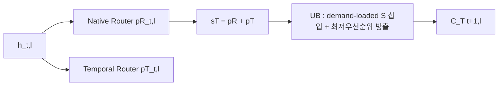

[논문 링크](https://arxiv.org/abs/2609.04895v1)
## 캐시를 배우는 라우터 : 메모리-제약 MoE 추론을 위한 Cache-Aware Joint Router Adaptation

## 한 줄 요약 (TL;DR)

MoE의 진짜 병목은 연산량이 아니라 전문가 가중치 이동량이다 라는 문제의식에서 출발해, 네이티브 Top- $K$ 선택 규칙은 그대로 두면서 캐시 상주 우선순위 자체를 포스트-트레이닝으로 학습하는 **Temporal Router** 와 **Spatio-Temporal Router** 를 제안한 연구이다 (근거: §1) . Qwen3-30B-A3B-Instruct-2507 기준 Temporal 단일 모드는 고전적 교체 정책 대비 적중률 +10.46~+33.34 %p , 트래픽 -28.0~-79.9 % 감소를 무추가 선행 로드( $P=0$ MB/token ) 로 달성했고, 전체 모드는 최강 프리페치 베이스라인 ProMoE 대비 조정 적중률 +1.15~+18.03 %p , 토큰당 로드 -4.6~-53.3 % 를 기록했다 (근거: Tab.1, §4.2) .

## 핵심 아이디어

이 논문의 중심 가설은 한 문장으로 이렇게 정리할 수 있다.

> 저자들은 경량 보조 캐시 라우터와 MoE 백본을 캐시-인식(cache-aware) 목적으로 공동 적응시킴으로써, 추론 시 네이티브 Top- $K$ 규칙을 바꾸지 않고도 기존 휴리스틱 교체·런타임 전용 프리페치의 한계를 넘어 디코드 단계 전문가-가중치 트래픽을 줄일 수 있다고 가정한다 (근거: §1, §3.4) .

독창적 기여 3가지를 구분하면 다음과 같다 (근거: §1) .

1. **새로운 학습 기법 : 캐시 관리를 모델-사이드 포스트-트레이닝 문제로 정식화** . 스케줄러·하드웨어·오버랩을 다루지 않고, 언어모델링 손실 $ \mathcal{L}_{LM} $ 에 캐시-커버리지 손실 $ \mathcal{L}_{T} $ / $ \mathcal{L}_{ST} $ 를 더해 네이티브 라우팅 분포 $ p^{R}_{t,l} $ 까지 미분 가능하게 재형성한다 (근거: §3.1, §3.4) .
2. **새로운 아키텍처 구성요소 : 적층 가능한 2단계 캐시-라우팅 스택** . 접근 후 유지용 **Temporal Router** $ W^{T}_{l} $ 는 단독 배포 가능한 무선행(unupdate-only, $P=0$ 건) 정책이고, 접근 전 정제용 **Spatio Router** $ W^{S}_{l} $ 는 인과적 전임자(causal predecessor) 은닉 상태로 시간적 캐리를 보정한다 (근거: §3.2, §3.3, Fig.1) .
3. **새로운 평가 방법론의 적용 : 선행 로드-인식(proactive-load-aware) 지표 체계** . 하드 적중률 $ Hit =1-D/A $ 뿐 아니라 $ AdjHit=(A-D)/(A+P) $ 와 $ Load/token=(D+P)S_{exp}/T $ 를 주 지표로 삼아, 원시 적중률 100.00 % 의 함정을 폭로한다 (근거: §4.1, §4.2) .

저자 관점의 우월성 논거는 명확하다 (근거: §1, §6) . 첫째, 휴리스틱은 “나중에 유용할 상주 전문가”를 직접 최적화할 수 없다 . 둘째, 최근 시공간 프리페처는 지역성을 런타임 예측·스케줄링 문제로만 본다 . 셋째, 본 방법은 추론 시 추가 파라미터가 Qwen3 기준 25.2 M (0.083 % overhead) , GPT-OSS 기준 4.4 M (0.021 % overhead) 에 불과해 ProMoE의 96.0 M / 48.0 M 보다 훨씬 가볍다 (근거: Tab.1) .

## 배경 : 그들이 해결한 문제

### MoE 서빙의 메모리 간극

Transformer 기반 MoE는 토큰당 $ K=|S_{t,l}| $ 개 전문가만 활성화해 용량-연산 트레이드오프를 개선하지만, 전체 전문가 집합이 GPU 메모리를 초과하면 디코드 때마다 느린 메모리에서 가중치를 반복 전송해야 한다 (근거: §1, §2) . 각 MoE 레이어는 용량 $ B $ 의 유계 GPU 캐시 $ \mathcal{C}_{t,l}\subseteq \{1,\dots,N\}, |\mathcal{C}_{t,l}|=B $ 를 유지하고, $ S_{t,l}\setminus \mathcal{C}_{t,l} $ 은 수요 로드(demand-load) 되어야 한다 (근거: §2) . 논문은 이를 두 시점으로 나눈다 : 접근 후 유지(post-access retention) 와 접근 전 정제(pre-access refinement) (근거: §2, Fig.1) .

### 출판 시점의 SOTA 상태

저자들이 그리는 SOTA 지형은 세 층이다 (근거: §1, §6) .

- **고전 교체** : LRU, LFU, LRFU ( $ \lambda =0.50 $ ) . 학습 불필요·무료이지만 과제·모델 특화 재사용을 학습할 수 없다 (근거: §4.1, §6) .
- **MoE 특화 캐싱·프리페칭** : MoE-Infinity의 활성화-인식 캐싱, ProMoE의 은닉 상태 기반 선행 인출(lookahead 3) , FineMoE의 1 K-entry expert-map 검색, SpecMD/Least-Stale, Temporally Extended MoE의 옵션-집합 지속성 (근거: §1, §4.1) .
- **시공간 프리페칭** : STEP의 적응형 시공간 프리페칭, ST-MoE의 프로파일 상관+경량 런타임 예측+재구성 하드웨어. 통합 런타임·하드웨어 파이프라인 지연(latency) 으로 보고되기에 스케줄러-독립 트래픽 지표와 직접 비교 불가로 정성 비교만 한다 (근거: §1, §4.1, §6) .

남은 공백은 두 가지이다 (근거: §1) . 휴리스틱·리플레이 정책은 상주 전문가의 미래 유용성을 직접 최적화하지 못한다 . 시공간 프리페처는 지역성을 런타임 문제로 취급해 학습된 캐시 우선순위를 남기지 않는다 .

### 데이터·모델·학습 설정 (Module B/D 관점)

백본은 개방형 희소 MoE 2종이다 (근거: §4.1) . Qwen3-30B-A3B-Instruct-2507은 48 레이어, 총 약 30.50 B Params , 활성 약 3.30 B Params , 레이어당 128 routed experts , top-8 라우팅이다 . GPT-OSS-20B는 약 21.00 B Params , 활성 약 3.60 B Params , 24 레이어, 레이어당 32 experts , top-4 라우팅이다 .

벤치마크는 GSM8K(학습 7,473 건 / 테스트 1,319 건) , MATH(학습 7,500 건 / 테스트 5,000 건) , CommonsenseQA(학습 9,741 건 / 검증 1,221 건, hidden-test 1,140 건은 레이블 비공개로 검증 정확도 보고) 이다 (근거: §4.1) . 별도 토크나이저 실험은 없고 각 백본의 채팅 템플릿+과제별 시스템 지시, 탐욕 디코딩(greedy decoding) , KV 캐시 사용, 신규 토큰 상한 512 토큰 (GSM8K) / 1,024 토큰 (MATH) / 64 토큰 (CommonsenseQA) , 최대 시퀀스 길이 512 토큰 / 2,048 토큰 (MATH) 이다 (근거: §4.1) . 언어모델링 목적식은 표준 Causal LM $ \mathcal{L}_{LM} $ 에 캐시 손실을 가중한 형태이다 (근거: §3.2-§3.4) .

구현 자원은 8-가속기 노드, 가속기당 140.00 GB device memory 이다 (근거: §4.1) . Qwen3 메인 설정은 학습률 $1.0\times10^{-5}$ , 캐시 크기 $B=20$ experts , 4.0 epochs 이고, GPT-OSS는 $5.0\times10^{-6}$ , $B=8$ experts , 4.0 epochs 이다 . fused AdamW, cosine decay, 3.00 % warmup, weight decay 0.10 , grad-clip 1.00 , per-device batch 1 , grad-accum 8 steps , bfloat16+TF32+gradient checkpointing, LoRA·양자화 미사용이다 (근거: §4.1) . 평가는 고정 5-시드 평균(arithmetic mean) , 검증 기반 체크포인트 선택 없이 전 학습 분할 고정 에포크 학습이다 (근거: §4.1) .

## 새로운 접근법 : Cache-Aware Joint Router Adaptation

### 통합 프레임워크

모든 라우터 출력은 동일 전문가 집합 위 정규분포이므로 등가중 합산으로 결합하고 융합 파라미터를 두지 않는다 (근거: §3.1) . 하드 Top- $B$ 소속의 소프트 서로게이트는 온도 $ \tau $ (Qwen3 $ \tau =0.03 $ , GPT-OSS $ \tau =0.05 $ ) 로 다음과 같다 (근거: §3.1, §4.1) .

$$
m_{e}(s)=\sigma\left(\frac{s_{e}-\theta_{B}(s)}{\tau}\right), \quad \theta_{B}(s)=\text{$s$의 $B$번째 최대값}
$$

$$
\ell_{cache}(s,q)=\sum_{e=1}^{N} q_{e}\,(1-m_{e}(s))
$$

풀 타깃 분포 $ q $ 를 써서 라우팅 경계 부근 불확실성을 보존하고 밀집 supervision을 얻는다 (근거: §3.1) . 실제 물리 캐시 입장은 Alg.1/Alg.2가 강제한다 (근거: §3.1) .

### Temporal Router : 접근 후 유지

각 레이어 $ l $ 에서 현재 은닉 상태 $ h_{t,l} $ 로 다음 디코드 스텝의 동층 수요를 예측한다 (근거: §3.2) .

$$
z^{T}_{t,l}=W^{T}_{l}h_{t,l},\quad p^{T}_{t,l}=\mathrm{softmax}(z^{T}_{t,l}), \quad s^{T}_{t,l}=p^{R}_{t,l}+p^{T}_{t,l}
$$

$$
\ell^{T}_{t,l}=\ell_{cache}(s^{T}_{t,l},p^{R}_{t+1,l}), \quad \mathcal{L}_{T}=\frac{1}{|\Omega_{T}|}\sum \ell^{T}_{t,l}, \quad \mathcal{L}=\mathcal{L}_{LM}+\lambda_{T}\mathcal{L}_{T}
$$

추론 시 $ \mathcal{C}^{T}_{t,l} $ 을 선행 수정 없이 쓰고, $ S_{t,l}=TopK(p^{R}_{t,l}) $ 미스만 수요 로드한 뒤 공유 연산자 $ \mathcal{U}_{B} $ 로 다음 토큰 캐시 $ \mathcal{C}^{T}_{t+1,l}=\mathcal{U}_{B}(\mathcal{C}^{T}_{t,l},S_{t,l},s^{T}_{t,l}) $ 를 만든다 (근거: §3.2, Alg.1) . 삽입되는 전문가는 이미 접근 후 가용하므로 선행 전송이 0 건이다 (근거: §3.2) .

### Spatio-Temporal Router : 접근 전 정제

인과적 Transformer 실행을 이용해 타깃 $(t,l)$ 이전에 이미 가용한 전임자 $ \rho(t,l) $ 출력을 쓴다 (근거: §3.3) .

$$
\rho(t,l)=\begin{cases}(t-1,L), & l=1 \\ (t,l-1), & l>1\end{cases}, \quad z^{S}_{t,l}=W^{S}_{l}h_{t,l}
$$

$$
a^{T}_{t,l}=p^{R}_{t-1,l}+p^{T}_{t-1,l}, \quad s^{ST}_{t,l}=a^{T}_{t,l}+p^{S}_{\rho(t,l)}
$$

$$
\ell^{ST}_{t,l}=\ell_{cache}(s^{ST}_{t,l},p^{R}_{t,l}), \quad \mathcal{L}=\mathcal{L}_{LM}+\lambda_{ST}\mathcal{L}_{ST}
$$

추론 시 $ TopR(s^{ST}_{t,l}) $ 후보만 검사해 비 상주 후보가 최저 우선순위 상주자보다 높을 때만 교체하며, 삽입마다 1 full expert transfer 로 과금한다 (근거: §3.3, Alg.2) . $ R $ 은 로드된 전문가 수가 아니라 후보 수 상한이며 재학습 없이 변경 가능하다 (근거: §3.3) . 메인 설정은 캐시 용량의 75.00 % 인 $ R=15 $ experts (Qwen3, $B=20$ experts) / $ R=6$ experts (GPT-OSS, $B=8$ experts) 이다 (근거: §4.1) . 이후 네이티브 선택·수요 로드·실행을 하고 동일한 시간적 업데이트로 $ \mathcal{C}^{T}_{t+1,l} $ 을 닫는다 (근거: Alg.2) .

초기화는 $ W^{T}_{l}\leftarrow W^{R}_{l} $ 복사, $ W^{S}_{l}\leftarrow W^{R}_{l+1} $ (단 $ W^{S}_{L}\leftarrow W^{R}_{1} $ 랩어라운드) 이다 (근거: §4.1) . 캐시 손실 가중 $ s_{w} $ 는 $ \lambda_{T} $ / $ \lambda_{ST} $ 를 통칭하며 Qwen3 $ s_{w}=0.10 $ , GPT-OSS $ s_{w}=0.01 $ 로 다운스트림 평가 전 고정·데이터셋 공유한다 (근거: §4.1) .

학습·배포 모드 정리는 이렇다 (근거: §3.4) . 메인 런은 백본+보조 라우터 전체를 공동 최적화한다 . LM-only 참조는 보조 라우터 없이 $ s_{w}=0 $ 이다 . 풀 모드는 $ \mathcal{L}_{ST} $ 만으로 시간·공간 라우터를 함께 학습하며 별도 $ \mathcal{L}_{T} $ 항을 더하지 않는다 . 미래·타깃 네이티브 분포는 학습 시에만 teacher-forced supervision이고 추론은 인과 은닉 상태만 쓴다 .

## 작동 원리 : 구체적인 예시로 살펴보기

대학원생 독자를 위해 $ N=6 $ experts , $ B=2 $ experts , $ K=1 $ expert , $ R=2 $ candidates 토이 케이스를 만들자 (근거: §2-§3 개념 예시화) . 레이어 $ l $ , 토큰 $ t $ 에서 네이티브 분포가 $ p^{R}_{t,l}=[0.05,0.05,0.60,0.10,0.10,0.10] $ 이라 Top-1 선택 $ S_{t,l}=\{3\} $ 이라 하자 . Temporal 분포가 $ p^{T}_{t,l}=[0.05,0.50,0.05,0.05,0.30,0.05] $ 이면 유지 우선순위 $ s^{T}_{t,l}=p^{R}+p^{T}=[0.10,0.55,0.65,0.15,0.40,0.15] $ 이다 . 캐시가 $ \mathcal{C}^{T}_{t,l}=\{2,5\} $ 였다면 $ 3\notin \mathcal{C} $ 이므로 1 demand miss ( $ D=1 $ 건) 로 전문가 3을 로드·실행한다 . $ \mathcal{U}_{B} $ 는 $ D=S\setminus \mathcal{C}^{+}=\{3\} $ 을 삽입해야 하므로 보호집합 $ \mathcal{V}=\mathcal{C}^{+}\setminus S $ 밖 최저 우선순위자를 방출한다 . $ s^{T} $ 기준 상주자 점수는 전문가 2=0.55, 5=0.40이므로 $ v=5 $ 를 내보내고 $ \mathcal{C}^{T}_{t+1,l}=\{2,3\} $ 이 된다 (근거: Alg.1) . 다음 토큰 타깃 $ p^{R}_{t+1,l} $ 이 전문가 2에 질량을 두면 히트한다 . 손실 $ \ell^{T}_{t,l} $ 은 $ q=p^{R}_{t+1,l} $ 로 $ (1-m_{e}(s^{T})) $ 를 가중합하므로, Top-1 하드 라벨이 아닌 분포 전체가 경계 부근까지 밀집 기울기를 준다 (근거: §3.2) .

같은 상황에서 풀 모드의 접근 전 정제를 보자 . 전임자 출력 $ p^{S}_{\rho}=[0.10,0.10,0.50,0.05,0.05,0.20] $ , 캐리오버 $ a^{T}_{t,l}=[0.10,0.55,0.20,0.15,0.40,0.15] $ 라면 $ s^{ST}=[0.20,0.65,0.70,0.20,0.45,0.35] $ 이다 . $ TopR=Top2=\{3,2\} $ 를 내림차순 검사하면 3은 비 상주·최저 상주자(5, 0.45) 보다 0.70>0.45이므로 1 proactive load ( $ P=1 $ 건) 로 선행 삽입돼 $ \tilde{\mathcal{C}}^{ST}=\{2,3\} $ 이 된다 (근거: Alg.2) . 뒤이은 네이티브 선택 $ \{3\} $ 은 이미 상주하므로 $ D=0 $ 건이다 . 하드 적중률은 0.00 % →100.00 % 로 뛰지만 조정 적중률은 $ (A-D)/(A+P)= (1-0)/(1+1)=50.00 $ % 에 머문다 . 이 예가 논문의 핵심 교훈을 보여준다 : 선행 삽입은 수요 미스를 지워도 $ P $ 건만큼 분모·분자에 비용을 남긴다 (근거: §4.1, §5) .

핵심 용어 정리 : $ h_{t,l} $ 은 $(t,l)$ 은닉 상태, $ p^{R} $ 는 네이티브 라우터 분포, $ p^{T} $ / $ p^{S} $ 는 시간·공간 보조 분포, $ s $ 는 캐시 우선순위 합, $ B $ 는 상주 용량(experts 단위) , $ R $ 은 정제 후보 예산(candidates 단위) , $ s_{w} $ 는 캐시 손실 가중이다 (근거: §2-§4.1) .

## 성능 검증 : 주요 결과

### 핵심 지표와 보고 벤치마크

주 지표는 과제 정확도(Exact Match / symbolic-numeric matching, 단위 % ) , 하드 적중률 $ Hit $ ( % ) , 조정 적중률 $ AdjHit $ ( % ) , 전문가-가중치 트래픽 $ Load/token $ (MB/token) 이다 (근거: §4.1) . 공유 전문가는 제외, 프리필 제외·디코드 단계만 집계, 프리필 캐시로 디코드 초기화, 트레이스-기반 시뮬레이터와 디코드 라우팅 동기화, 수요 미스·선행 삽입당 1 full expert transfer 과금이다 (근거: §4.1) . 업데이트-전용은 $ P=0 $ 건이므로 $ AdjHit=Hit $ 로 생략된다 (근거: §4.1) .

### 저자가 가장 강조하는 성공 증거

**업데이트-전용 유지** 에서 Temporal Router는 6개 백본-데이터셋 조합 모두에서 LM-only 고전 정책을 앞선다 (근거: Tab.1, §4.2) . Qwen3 기준 최강 고전 적중률 대비 +10.46 %p (GSM8K, 62.67 % →73.13 % ) , +10.70 %p (MATH, 64.30 % →75.00 % ) , +33.34 %p (CommonsenseQA, 58.27 % →91.61 % ) 이고, Load는 1,353.00→974.00 MB/token , 1,294.00→906.00 MB/token , 1,512.00→304.00 MB/token 으로 떨어진다 . GPT-OSS에서도 3개 과제 모두 업데이트-전용 1위이며 추가 파라미터는 2.20 M Params 에 불과하다 (근거: Tab.1) .

**프리페치 정제** 에서 Spatio-Temporal Router는 Qwen3 3개 과제 모두 조정 적중률 1위·Load 최저이다 (근거: §4.2) . ProMoE 대비 조정 적중률 +4.65 %p (69.03 % vs 64.38 % , GSM8K) / +1.15 %p (MATH) / +18.03 %p (CommonsenseQA) , Load -318.00 MB/token (-17.75 % ) / -81.00 MB/token (-4.55 % ) / -1,068.00 MB/token (-53.32 % ) 이다 . 추가 파라미터 25.20 M Params 는 ProMoE 96.00 M Params 의 약 26.25 % 수준이다 (근거: Tab.1) . 정확도는 83.40 % (GSM8K) / 57.66 % (MATH) / 84.11 % (CommonsenseQA) 로 대체로 경쟁력을 유지한다 (근거: Tab.1) .

### 비밀 병기 : 무엇을 빼면 무엇이 깨지나

Qwen3/GSM8K 애블레이션(Tab.2) 이 메커니즘을 분해한다 (근거: Tab.2, §5) .

| 제거/대체/스케일 | Acc. ( % ) Δ | Hit ( % ) Δ | AdjHit ( % ) Δ | Load (MB/token) Δ | 메커니즘 해석 |
|---|---|---|---|---|---|
| Temporal, joint $s_{w}=0.10$ → auxiliary-only | 85.44 % (=0.00 %p ) | 73.13 % →63.01 % (-10.12 %p ) | – | 973.86→1,340.71 MB/token (+366.85 MB/token) | 백본· $W^{R}$ 고정 시 실행 Top- $K$ 궤적이 그대로라 우선순위 학습만으로는 미래 분포를 못 따라간다 (근거: Tab.2, §5) |
| Full, joint $s_{w}=0.10$ → auxiliary-only | 83.40 % →85.44 % (+2.04 %p 회복) | 90.62 % →67.44 % (-23.18 %p ) | 69.03 % →62.53 % (-6.50 %p ) | 1,474.00→1,747.59 MB/token (+273.59 MB/token) | 정확도는 보존되지만 캐시 이득은 미미해 공동 적응의 가치가 입증된다 (근거: §5) |
| Full → Spatio-only ( $p^{T}$ 제거) | 83.40 % →83.24 % (-0.16 %p ) | 90.62 % →93.04 % (+2.42 %p ) | 69.03 % →66.94 % (-2.09 %p ) | 1,474.00→1,665.51 MB/token (+191.51 MB/token) | 사전 커버리지는 좋아지나 시간적 캐리오버 없이 모든 교체가 프리페치 과금으로 잡혀 효율이 악화된다 (근거: §5) |
| Temporal $s_{w}$ 0.10→2.00 | 85.44 % →74.60 % (-10.84 %p ) | 73.13 % →88.44 % (+15.31 %p ) | – | 973.86→418.89 MB/token (-554.97 MB/token) | 과도한 $s_{w}$ 는 라우팅 집중을 유발해 지역성은 오르나 과제 품질이 급락하는 품질-트래픽 트레이드오프를 만든다 (근거: §5, Fig.2-3) |
| Full $s_{w}$ 0.10→2.00 | 83.40 % →76.50 % (-6.90 %p ) | 90.62 % →97.41 % (+6.79 %p ) | 69.03 % →79.67 % (+10.64 %p ) | 1,474.00→900.91 MB/token (-573.09 MB/token) | 수요 감소가 선행 비용을 상쇄하는 구간( $s_{w}\ge0.30$ ) 이후 총량이 줄지만 정확도 손실이 커진다 (근거: §5) |

용량 $ B $ -예산 $ R $ 민감도도 결정적이다 (근거: Tab.3, §5) . Temporal은 $ B $ 12→30 experts 시 Hit 62.91 % →80.00 % , Load 1,344.00→725.00 MB/token 이다 . $ B=20 $ experts 고정 시 $ R $ 8→15→20 candidates 로 올리면 Hit 81.84 % →90.62 % →93.49 % 로 오르나 AdjHit 74.51 % →69.03 % →57.93 % 로 떨어지고 Load 1,015.00→1,474.00→2,461.00 MB/token 로 뛴다 . $ R=B $ 는 최고 원시 적중·최악 조정 효율의 과잉-프리페치점이다 .

전문가-사용 집중도 분석은 이를 뒷받침한다 (근거: Fig.2-3, §5) . Temporal $s_{w}$ 0.10→2.00 시 최대 전문가 빈도 6.82 % →9.40 % , top-8 질량 36.76 % →48.56 % , 엔트로피 3.96→3.51, 유효 전문가 수 53.41→34.54 experts 로 집중된다 . Spatio-Temporal도 동방향이나 곡선이 완만하다 .

## 우리의 관점 : 강점, 한계, 그리고 이 연구가 중요한 이유

### 비판적 비교 : 어디서 이기고 어디서 비기나

가장 강력한 우월성 증거는 Qwen3 프리페치 구간이다 (근거: §4.2) . 조정 적중·Load 모두 1위이며, 특히 CommonsenseQA에서 FineMoE·ProMoE를 큰 폭으로 앞선다 . Least-Stale(SpecMD) 은 Load 5,496.00~5,667.00 MB/token 로 폭증해 스케줄러-독립 바이트 과금 하에서는 설득력이 약하다 (근거: Tab.1) .

반대로 GPT-OSS에서는 과제-의존적이다 (근거: §4.2) . CommonsenseQA 1위, MATH 2위, GSM8K는 조정 효율 하위이면서 정확도는 최고(64.52 % ) 이다 . Temporally Extended MoE는 하드 적중률 100.00 % 를 찍지만 조정 적중률 49.58~62.61 % , Load 2,543.00~4,275.00 MB/token , 정확도 하락(예: Qwen3 MATH 51.04 % ) 으로 “완벽한 원시 적중률은 효율 증거가 아니다”라는 논문의 경고를 역설적으로 입증한다 (근거: Tab.1, §4.2, §5) . 고전 정책 비교가 동일 라우팅 궤적이 아닌 “완전 추론 구성” 비교인 점도 공정하게 밝혀져 있다 : 캐시-인식 구성은 라우팅 거동을 의도적으로 바꾸므로 동일 트레이스 비교가 아니다 (근거: §4.1) .

### 저자가 명시한 한계

저자는 Limitations에서 다음을 인정한다 (근거: §7 Limitations) .

- 알고리즘 연구이지 종단 서빙 스택이 아니며, Load/token은 시뮬레이션된 디코드-단계 전송 바이트(MB/token) 로 스케줄링·오버랩·대역폭·배칭에 따른 지연·처리량을 함의하지 않는다 .
- 프리필 트래픽 제외·프리필 캐시로 초기화이므로 요청-수준 효율이 아닌 디코드-단계 효율이며 종단 속도 향상을 의미하지 않는다 .
- 추론 시 오버헤드는 작지만 전체 백본 포스트-트레이닝이 필요하고, 보조-전용 애블레이션은 네이티브-라우터 적응을 다른 백본 변화와 분리하지 못한다 .
- 메인 벤치마크는 백본당 단일 캐시 용량이며 용량 민감도는 Qwen3/GSM8K에 한정되고, Tab.1-2는 동일 5-시드 평균이나 Tab.3은 동일 체크포인트의 추론 시 $ R $ 리플레이이다 .
- 학술 추론 벤치마크·순수 MoE에 한정되고, 더 넓은 워크로드·메모리 예산·프리트레이닝·하이브리드 밀집-희소 구조는 미탐색이다 .
- 캐시-인식 적응은 라우팅을 집중시켜 지역성은 높이나 전문가-병렬 로드 밸런스를 해칠 수 있다 .
- 베이스라인은 원래 과제 정의·시스템 가정이 달라 통합 캐시 설정·선행 로드 과금 정렬 하 재현이므로 다른 메모리 계층·런타임 정책에서 상대 순위가 바뀔 수 있다 .

### 잠재적 한계에 대한 우리의 판단

첫째, 일반화 간극이 크다 : 긴 컨텍스트·코드·다국어·혼합 배치, $ B $ 극소/극대 메모리 예산, 사전학습 단계 적용은 검증되지 않았다 (근거: §7) . 둘째, 비용-재현성 측면에서 전체-백본 4.0 epochs 포스트-트레이닝은 추론 파라미터 25.20 M Params 추가보다 훨씬 무거운 일회성 훈련 비용이며 체크리스트상 코드·커밋·라이선스·시드·하드웨어 드라이버 공개가 본문에 명시되지 않았다 (근거: §4.1, §7) . 셋째, 집중화-부하불균형 리스크는 정량화되지 않았다 : 유효 전문가 감소가 캐시 지역성 지표인지 붕괴(collapse) 전조인지 구분하는 로드-밸런싱·지연 실험이 없다 (근거: Fig.3, §7) . 넷째, 사회적 영향 논의가 없어, 수학·상식 추론 편향이 캐시-친화 분포로 증폭될 가능성 같은 2차 효과를 다루지 않는다 .

그럼에도 이 연구가 중요한 이유는 분명하다 . MoE 서빙 논의를 “더 똑똑한 런타임”에서 “더 캐시-친화적인 모델”로 옮겼고, 원시 적중률이 아닌 바이트 과금·조정 적중률로 프리페치 과장을 바로잡는 측정 규범을 제시했기 때문이다 (근거: §4-§6) .

## 다음 단계는? : 앞으로의 길

저자가 직접 제시하는 후속 과제는 넓은 워크로드·메모리 예산·프리트레이닝 설정·하이브리드 구조 확장이다 (근거: §7) . 한계에 비추어 합리적인 다음 단계 4가지를 제안한다 .

1. **종단 검증** : 동일 바이트 궤적을 실제 오프로딩 스케줄러·오버랩·배치( $bs$ ) · $tp$ / $pp$ 구성에 얹어 TTFT(ms) , TPOT(ms/token) , tokens/s , 피크 VRAM(GB) 을 보고하고, 아래 표준 근사로 KV-캐시(GB) 와 간섭을 분리하라 (근거: §7) .

$$
\text{KV-Cache(GB)}\approx \frac{2\cdot L\cdot H\cdot d_{head}\cdot \text{seq}\cdot \text{batch}\cdot \text{bytes/elt}}{10^{9}}
$$

2. **분리된 귀인(attribution)** : $W^{R}$ 동결+백본 동결, $W^{R}$ 만 학습, 보조 라우터만 학습의 요인 설계로 캐시 이득의 출처를 분리하고, 전문가-병렬 불균형(최대/평균 부하비) 을 함께 측정하라 (근거: §5, §7) .
3. **적응형 예산** : 고정 $ R $ 대신 토큰 난이도·엔트로피 기반 동적 $ R $ 와 $B$ -조건부 $ \tau $ / $s_{w}$ 스케줄로 품질-트래픽 파레토를 확장하라 (근거: Tab.3, §5) .
4. **사전학습·혼합 아키텍처** : 하이브리드 밀집-희소 모델과 코드·장문맥 코퍼스로 캐시-인식 목적식을 사전학습에 내장할 때의 전이(transfer) 를 검증하라 (근거: §7) .

---

**재현 체크리스트 (공통)** : 코드는 본문에 링크·커밋·라이선스 미기재이다 (근거: §4.1) . 데이터는 GSM8K/MATH/CommonsenseQA 공식 분할 사용이나 스냅샷·필터링·라이선스 규칙 별도 명시 없다 (근거: §4.1) . 하이퍼파라미터·시드·스케줄은 학습률· $B$ · $R$ · $ \tau $ · $s_{w}$ ·고정 5-시드 평균까지는 명시되나 시드 값·옵티마이저 상태·드라이버 버전은 없다 (근거: §4.1) . 하드웨어는 8-가속기×140.00 GB 외 GPU 기종·CUDA·라이브러리 버전 미기재이다 (근거: §4.1) . 평가는 탐욕 디코딩·토큰 상한·채팅 템플릿은 명시되나 exact prompt 전문은 부록 없이 과제별 시스템 지시 수준이다 (근거: §4.1) .

<!-- verbatim-tables -->

## 논문 원문의 표

> arXiv e-print 의 LaTeX 원본에서 기계적으로 옮긴 표입니다. 숫자는 논문의 값이며 모델을 거치지 않았습니다.

**표 1. Main results on Qwen3 and GPT-OSS. LRU, LFU, and LRFU use matched LM-only post-trained backbones (\(sw=0\)). Decision Availability is the earliest point at which all inputs to the cache decision are ready and, for prefetching, loading can begin; Prev. token offers more potential overlap than Prev. layer, while Curr. layer has no cross-layer lookahead. For our full mode, causal order includes the wrap-around from layer \(L\) of token \(t-1\) to layer 1 of token \(t\). Added Params. counts only new inference-time model parameters; external stores are excluded. Acc., Hit, and Adj. Hit are percentages; Load is MB per decode token. Values are five-seed means. Bold and underline mark the best and second-best results within each category, backbone, task, and metric.**

| **Method** | **Decision** **Availability** | **Model** | **Added** **Params.** | **GSM8K** Acc. | **GSM8K** Hit | **GSM8K** Adj. Hit | **GSM8K** Load | **MATH** Acc. | **MATH** Hit | **MATH** Adj. Hit | **MATH** Load | **CommonsenseQA** Acc. | **CommonsenseQA** Hit | **CommonsenseQA** Adj. Hit | **CommonsenseQA** Load |
|---|---|---|---|---|---|---|---|---|---|---|---|---|---|---|---|
| **Cache-Update Methods** |  |  |  |  |  |  |  |  |  |  |  |  |  |  |  |
| MoE / LRU | Prev. token | Qwen3 | -- | **85.44** | 61.19 | -- | 1407 | **58.22** | 64.30 | -- | 1294 | **87.39** | 56.44 | -- | 1579 |
|  |  | GPT-OSS | -- | 61.87 | 65.58 | -- | 1645 | **43.74** | 67.15 | -- | 1569 | 84.68 | 65.10 | -- | 1668 |
| MoE / LFU | Prev. token | Qwen3 | -- | **85.44** | 59.99 | -- | 1450 | **58.22** | 63.00 | -- | 1341 | **87.39** | 58.27 | -- | 1512 |
|  |  | GPT-OSS | -- | 61.87 | 68.63 | -- | 1460 | **43.74** | 65.37 | -- | 1654 | 84.68 | 69.29 | -- | 1467 |
| MoE / LRFU | Prev. token | Qwen3 | -- | **85.44** | 62.67 | -- | 1353 | **58.22** | 64.29 | -- | 1294 | **87.39** | 57.89 | -- | 1526 |
|  |  | GPT-OSS | -- | 61.87 | 69.55 | -- | 1435 | **43.74** | 68.66 | -- | 1497 | 84.68 | 68.34 | -- | 1513 |
| **Temporal Router** | Prev. token | Qwen3 | 12.6M | **85.44** | **73.13** | -- | **974** | 57.82 | **75.00** | -- | **906** | 86.16 | **91.61** | -- | **304** |
|  |  | GPT-OSS | 2.2M | **63.99** | **72.84** | -- | **1297** | **43.74** | **71.84** | -- | **1345** | **85.83** | **71.54** | -- | **1360** |
| **Prefetching Methods** |  |  |  |  |  |  |  |  |  |  |  |  |  |  |  |
| Least-Stale (SpecMD) | Prev. token | Qwen3 | -- | **85.44** | 68.52 | 31.12 | 5496 | **58.22** | 70.02 | 31.55 | 5505 | **87.39** | 67.56 | 30.17 | 5667 |
|  |  | GPT-OSS | -- | 61.87 | 70.07 | 35.59 | 6058 | **43.74** | 72.29 | 37.03 | 5873 | 84.68 | 71.51 | 36.91 | 5839 |
| ProMoE | Prev. layer | Qwen3 | 96.0M | **85.44** | 89.38 | 64.38 | 1792 | **58.22** | 88.09 | 64.21 | 1779 | **87.39** | 85.38 | 60.71 | 2003 |
|  |  | GPT-OSS | 48.0M | 61.87 | 93.54 | **67.94** | **2109** | **43.74** | 91.16 | **68.19** | **2032** | 84.68 | 92.95 | 67.78 | 2111 |
| FineMoE | Prev. layer | Qwen3 | -- | **85.44** | 76.67 | 54.84 | 2288 | **58.22** | 71.45 | 51.41 | 2447 | **87.39** | 74.08 | 51.40 | 2538 |
|  |  | GPT-OSS | -- | 61.87 | 85.63 | 65.02 | 2201 | **43.74** | 71.96 | 50.40 | 3384 | 84.68 | 75.49 | 53.08 | 3188 |
| Temporally- Extended MoE | Curr. layer | Qwen3 | 52.0M | 81.50 | 100.00 | 52.34 | 3299 | 51.04 | 100.00 | 49.58 | 3685 | 84.36 | 100.00 | 58.77 | 2543 |
|  |  | GPT-OSS | 23.0M | 60.27 | 100.00 | 52.78 | 4275 | 43.22 | 100.00 | 57.40 | 3546 | 64.29 | 100.00 | 62.61 | 2853 |
| **Spatio-Temporal Router** | Prev. layer | Qwen3 | 25.2M | 83.40 | 90.62 | **69.03** | **1474** | 57.66 | 88.40 | **65.36** | **1698** | 84.11 | 95.56 | **78.74** | **935** |
|  |  | GPT-OSS | 4.4M | **64.52** | 85.68 | 58.81 | 2951 | 42.46 | 89.12 | 63.53 | 2625 | 84.60 | 90.26 | **71.30** | **1736** |

**표 2. Ablations on Qwen3/GSM8K. MoE/LRU is the LM-only reference (\(sw=0\)); auxiliary-only freezes the backbone. Temporal-only is the standard Temporal Router, whereas Spatio-only removes Temporal Router and performs only pre-access refinement. Rows denoted only by \(sw\) jointly update the backbone and auxiliary routers. Metrics are percentages except Load (MB/token); parentheses give changes from MoE/LRU. Values are five-seed means. Red marks higher hit or lower traffic; blue marks lower accuracy or higher traffic.**

| 4{c@!\vrule width 0.5pt@}**Temporal Router** **Setting** | **Spatio-Temporal Router** **Acc.** | **Spatio-Temporal Router** **Hit** | **Spatio-Temporal Router** **Load** | **Spatio-Temporal Router** **Setting** | **Spatio-Temporal Router** **Acc.** | **Spatio-Temporal Router** **Hit** | **Spatio-Temporal Router** **Adj. Hit** | **Spatio-Temporal Router** **Load** |
|---|---|---|---|---|---|---|---|---|
| MoE / LRU | 85.44 | 61.19 | 1406.50 | MoE / LRU | 85.44 | 61.19 | -- | 1406.50 |
| \(sw=0.1\) auxiliary only | 85.440.00 | 63.011.82 | 1340.7165.79 | \(sw=0.1\) auxiliary only | 85.440.00 | 67.446.25 | 62.531.34 | 1747.59341.09 |
| \(sw=0.1\) temporal only | 85.440.00 | 73.1311.94 | 973.86432.64 | \(sw=0.1\) spatio only | 83.242.20 | 93.0431.85 | 66.945.75 | 1665.51259.01 |
| \(sw=0.1\) | 85.440.00 | 73.1311.94 | 973.86432.64 | \(sw=0.1\) | 83.402.04 | 90.6229.43 | 69.037.84 | 1474.0067.50 |
| \(sw=0.3\) | 84.990.45 | 79.0217.83 | 760.30646.20 | \(sw=0.3\) | 83.471.97 | 93.6732.48 | 73.4212.23 | 1229.04177.46 |
| \(sw=0.5\) | 82.562.88 | 81.9820.79 | 653.07753.43 | \(sw=0.5\) | 81.803.64 | 95.0133.82 | 75.6614.47 | 1107.47299.03 |
| \(sw=1.0\) | 79.156.29 | 85.3124.12 | 532.33874.17 | \(sw=1.0\) | 81.354.09 | 96.3435.15 | 78.0016.81 | 985.16421.34 |
| \(sw=2.0\) | 74.6010.84 | 88.4427.25 | 418.89987.61 | \(sw=2.0\) | 76.508.94 | 97.4136.22 | 79.6718.48 | 900.91505.59 |

**표 3. Sensitivity to cache capacity \(B\) and refinement candidate budget \(R\) (`replace_lowest`) on Qwen3/GSM8K; the main setting is \(B=20, R=15\). Each Spatio-Temporal cell lists \(R\) above Hit/Adj. Hit/Load. For each fixed \(B\), all \(R\) values replay the same checkpoint and share accuracy; Temporal Router has no \(R\). Metrics are percentages except Load (MB/token).**

| **\(B\)** | 3{c@!\vrule width 0.5pt@}**Temporal Router** **Acc.** | **Spatio-Temporal Router** **Hit** | **Spatio-Temporal Router** **Load** | **Spatio-Temporal Router** **Acc.** | **Spatio-Temporal Router** **Low \(R\)** Hit / Adj. / Load | **Spatio-Temporal Router** **Mid \(R\)** Hit / Adj. / Load | **Spatio-Temporal Router** **Full \(R=B\)** Hit / Adj. / Load |
|---|---|---|---|---|---|---|---|
| 12 | 84.46 | 62.91 | 1344 | 85.44 | \(R=4\) 66.53 / 63.56 / 1382 | \(R=8\) 73.92 / 65.12 / 1435 | \(R=12\) 80.79 / 60.63 / 1901 |
| 20 | 85.44 | 73.13 | 974 | 83.40 | \(R=8\) 81.84 / 74.51 / 1015 | \(R=15\) 90.62 / 69.03 / 1474 | \(R=20\) 93.49 / 57.93 / 2461 |
| 30 | 85.37 | 80.00 | 725 | 83.85 | \(R=8\) 86.14 / 80.40 / 761 | \(R=20\) 95.11 / 71.14 / 1398 | \(R=30\) 97.23 / 53.39 / 3077 |
