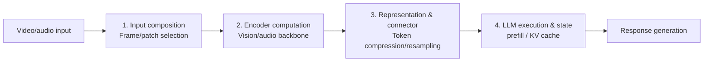

[Paper](https://arxiv.org/abs/2609.10355v1)
## Why Are Video LLMs Still So Expensive? — A Four-Stage Guide to Inference Efficiency Mechanisms

**TL;DR** — This paper classifies **125** VideoLLM inference efficiency studies published between late 2022 and August 2026 into **4 stages** of the encoder–connector–LLM pipeline, and performs controlled comparisons only under "the same host model · the same input protocol," concluding that accuracy is nearly preserved even when only about **25%** of visual tokens remain. (source: Abstract, §I)

## Core Idea

Video understanding has shifted from task-specific architectures to large-scale pretrained models, and VideoLLMs (video encoder + connector + LLM) have become the mainstream, but their cost grows explosively with the number of frames and the context length. (source: §I)

The central claim of this survey is simple. **Efficiency should be classified by which stage of the pipeline the cost is removed from, and numbers reported under different hosts and input conditions cannot be directly compared.** To this end, the authors establish two axes:

1. **A 4-stage taxonomy** — input composition → encoder computation → representation/connector → LLM execution & state. (source: Fig. 4)
2. **A controlled comparison protocol** — numbers are placed side by side only under "the same host + the same number of frames + the same evaluation harness"; otherwise they are treated merely as "indicative evidence." (source: §IV-A)

They also specify a system-level definition of "efficient": **reducing parameter count, per-input FLOPs, latency, and memory while maintaining accuracy.** (source: §I)

## Background: The Problem They Set Out to Solve

VideoLLMs share the standard **encoder–connector–LLM** architecture. (source: Fig. 2) The problem comes from three places:

- The vision encoder processes hundreds of frames per clip at high resolution, and (source: §I)
- The result floods the LLM context with tens of thousands of visual tokens, and (source: §III-B)
- As the context length $L$ grows, the prefill cost increases quadratically and KV cache memory increases linearly. (source: §III-B)

Such efficiency techniques are usually tied to a **single task** (captioning, QA, temporal grounding, etc.) and evaluated with **different metrics**, making it hard to judge "exactly where the cost goes, and which technique is most effective under a given constraint." (source: §I) Existing surveys were capability- and architecture-centric, covered only a single family of token compression, or omitted frame selection and encoder design. (source: §I) This paper pulls that fragmentation together with a video-focused lens.

## New Approach: A 4-Stage Pipeline Taxonomy + Controlled Comparison

This paper's "method" is not a new model but a **classification scheme and a comparison methodology**. It restricts VideoLLMs to the Embedder family (encoder–connector–LLM) and assigns each efficiency mechanism to the **pipeline stage where it removes cost**. (source: §III-A, §IV)

| Stage | Question | Representative method families |
|---|---|---|
| **1. Input composition** | Which frames/patches to encode? | Temporal sampling (TSN, AKS, FOCUS, TSPO), resolution/patch budgets (Q-Frame, LDDR) |
| **2. Encoder computation** | How to make feature extraction cheap? | Lightweight backbones (TSM, X3D, MViTv2, Hiera), state-space (VideoMamba), token merging (ToMe) |
| **3. Representation & connector** | How many tokens to feed the LLM? | Selection/merging (VisionZip, PruneVid, HoliTom), grid pooling (NVILA, STORM), resampling (LLaMA-VID, BLIP-3-Video) |
| **4. LLM execution & state** | How to reduce inside the LLM and the KV? | Decoder pruning (FastV, HieraVid), sparse attention (MMInference), KV compression/offloading (VidKV, ReTaKe, StreamMem) |

(source: Fig. 4, §IV-B–E)

The key design decision is the **principle of controlled comparison**. Accuracies from different hosts are never read as a 'ranking,' even when placed in the same table. Instead, numbers are compared in the same table only when the following conditions hold: (1) the same host LLM (mostly 7B–8B), (2) the same number of frames and input modality, (3) the same evaluation harness (e.g., LLaVA-OneVision-7B, 32 frames, LMMs-Eval). (source: §IV-A, Tab. V)

## How It Works: A Walkthrough with Concrete Examples

### 1) Where the Tokens Explode

A toy example assuming the standard CLIP ViT-L/14. (source: §III-B)

- Frame resolution $336 \times 336$, patch size $14 \times 14$ → patches per frame
  $$N_p = \frac{H}{P}\cdot\frac{W}{P} = 24 \times 24 = 576$$
- With 64 frames, the encoder output tokens are
  $$N_v^{enc} = T \cdot N_p = 64 \times 576 = 36{,}864$$
- The LLM context, adding the text prompt $N_t$, is
  $$L = N_t + N_{ev} + N_{ea}$$

That is, visual tokens vastly outnumber the few dozen prompt tokens: prefill attention cost grows as $FLOPs_{attn} \propto N d^2 + N^2 d$, and KV memory as $Mem_{KV} \propto 2B \cdot n_{layers} \cdot L \cdot d_{KV} \cdot b$. (source: §III-B)

### 2) What Each of the 4 Stages Saves

The key insight is that **each stage saves something different, and the stages interact with one another**. (source: §V)

- **Stage 1 (frame selection)** reduces $T$ *before* the encoder ever sees the frames, so it cuts encoder cost and LLM context simultaneously. However, frames discarded at this stage cannot be recovered. (source: §IV-B)
- **Stage 2 (encoder)** makes feature extraction itself cheaper. Lightweight backbones cover the low-compute regime, while pooled-attention transformers cover a wide accuracy range. (source: §IV-C, Fig. 5)
- **Stage 3 (connector)** reduces only the LLM input *after the encoding cost has already been paid*. Prefill cost drops, but the encoding cost of the remaining frames stays. (source: §IV-D)
- **Stage 4 (inside the LLM)** reduces prefill computation (decoder pruning) or decoding memory/latency (KV compression). The two mechanisms combine in a complementary way. (source: §IV-E)

The twist the authors emphasize is that **selection does not always happen 'upstream.'** Frame-Voyager and FlexSelect encode *all* candidate frames first and only then select, so they reduce the LLM context but save no encoder cost at all; Frame-Voyager was in fact **27.6% slower** than uniform sampling. (source: §IV-D, §V)

### 3) The "Secret Weapon" — Explicitly Model Temporal Redundancy

The clearest pattern in the controlled comparison (Tab. V) is this: at a 25% budget, most techniques stay within 1.5% of the baseline, but **at a 10% budget, the choice of technique becomes decisive**. (source: §IV-D, Tab. V)

| Method (10% budget) | MVBench | EgoSchema | Average (relative) |
|---|---|---|---|
| LLaVA-OV-7B (baseline) | 58.3 | 60.4 | 100% |
| VisionZip (spatial selection only) | 53.5 | 58.0 | 91.6% |
| PruneVid (temporal redundancy modeling) | 56.2 | 59.8 | 96.9% |
| HoliTom (holistic merging) | 57.3 | 61.2 | 99.1% |

(source: Tab. V)

Why the difference? Because VisionZip keeps only spatially "important" tokens, yet the key redundancy in video is **temporal redundancy across frames**. PruneVid and HoliTom explicitly merge this temporal redundancy, so they degrade much more gracefully at low budgets. (source: §IV-D) The same logic applies at the decoder stage: HieraVid holds a 0.2–2.1 point gap from the baseline at 24.5% FLOPs, outperforming FastV, which needs a larger budget (39.3% FLOPs). (source: §IV-E, Tab. VII)

## Performance Validation: Key Results

Since this is a survey, the results are **cross-validated insights** rather than "self-reported performance." The highlights:

**① The 25% rule.** Multiple method families keep nearly baseline accuracy with only about 25% of visual tokens — pixel-shuffle (InternVL2.5), pooling (PLLaVA), temporal compression (STORM), audio-guided pruning (DASH), and decoder hierarchy (HieraVid) alike. That said, these results come from different hosts, so they do not imply every model can safely drop 75%. (source: §V)

**② Diminishing returns in frame selection.** Under the same LLaVA-Video-7B · 64-frame protocol, query-aware selectors gain up to 5 points over uniform sampling on LongVideoBench, but the advantage nearly vanishes on Video-MME. The top performer was a policy (TSPO) with a mere **3.5M parameters**. (source: §IV-B, Tab. II)

**③ Strong 2025–2026 methods combine stages.** PruneVid, MeToM, FlashVID, HieraVid, and HoliTom reduce tokens both before and inside the LLM simultaneously. In such cases the end-to-end gain cannot be attributed to any single stage, and **only HoliTom reports an ablation that separates the two stages**. (source: §V)

**④ The retrieval–eviction trade-off in streaming.** ReKV's retrieval-based approach best preserves streaming accuracy but keeps peak GPU memory at the full-cache level, while hard-capped eviction (InfiniPot-V, StreamMem) gives up about 6 points (RVS-Ego) in exchange for lowering the memory ceiling by roughly 10 GB. (source: §IV-E, Tab. VI)

## Our Perspective: Strengths, Limitations, and Why This Work Matters

### Strengths

The real contribution of this survey is that it **places "comparability" at the center of its methodology**. When hundreds of papers report GFLOPs and accuracy under different hosts, frame counts, and modalities, the authors neither estimate nor convert numbers — they use **only explicitly reported values** and draw a boundary so that only matching tables are read as 'rankings'. (source: §IV-A) In particular, the remark that **"a single number like a 25% token retention rate says nothing about where the savings came from"** (§V) pinpoints exactly the question we must ask when reading efficiency papers.

### Limitations

As the authors themselves acknowledge, the comparison is inherently limited. (source: §IV-E)

- **Encoder FLOPs ≠ end-to-end efficiency.** An efficient Kinetics backbone is not guaranteed to be efficient for VideoLLM QA either. (source: §V)
- **Bias in accuracy metrics.** Nearly all comparisons collapse into a single multiple-choice QA task, and not a single captioning, retrieval, or temporal grounding metric appears in the tables. MCQ is often solvable with coarse object and scene cues, so a retention rate that is lossless on MCQ need not be lossless on generation tasks. (source: §V)
- **Lack of audiovisual evidence.** Audio encoder cost is frequently omitted, and modality ablations are rare, making it hard to separate the benefit and cost of audio-guided selection. (source: §V)
- **No energy reporting.** None of the surveyed methods reported energy consumption. (source: §IV-A)

### Why It Matters

This is a survey that asks "**what claims are verifiable**" rather than "what is new." Video LLM efficiency is now a field with new papers every month, and amid the chaos this survey provides the *baseline for designing the next experiment* — the same host, the same inputs, explicit FLOPs accounting boundaries, and including the selector's own cost. In particular, the observation that "reinvesting saved compute into more frames can actually let compression *raise* accuracy" (§V) reframes efficiency not as simple lossy compression but as **expanding temporal coverage**.

## What's Next?: The Road Ahead

The authors propose a three-pronged research agenda. (source: §V)

1. **Establish a common analysis protocol.** The same video, prompt, and modality, fixed resolution and decoding settings, a frozen host, and FLOPs accounting that includes the cost of the selection/allocation module itself. As a practical starting point, they propose the LLaVA-OneVision-7B · 32-frame · LMMs-Eval setup. (source: §V)
2. **Report per domain and task family.** Video-MME annotates content domains and lengths, yet mostly reports aggregate numbers. A budget validated on lecture videos and one validated on sports highlights should be kept separate. (source: §V)
3. **Learn when audio should intervene in compression.** OmniZip and DASH showed the promise of audio-guided compression, but speech can point to off-screen events and visible events can have no sound. The next step is **learned, query- and context-conditional cross-modal budget allocation**, and its cost accounting must include the audio encoder. (source: §V)

The authors expect that the LLM-side method family (KV eviction, quantization, sparse attention) will **grow the fastest**, since it has transferred almost unchanged from text LLMs, and once pre-LLM compression matures, the remaining cost is the decoding memory and cache growth of multi-turn and streaming. (source: §V) In addition, as decoder backbones diversify beyond dense transformers into Mamba–Transformer hybrids, preserving the information of removed tokens in the recurrent state is emerging as a new evaluation challenge. (source: §IV-E)

---

In summary, this survey draws a map of "how to make Video LLMs cheap" while honestly exposing **how trustworthy the numbers on that map are**. The question we should now ask when reading an efficiency paper is clear: not *"how many percent did it cut,"* but *"at which stage, under what host and input conditions, and counting the selector's own cost, was it cut."*

<!-- verbatim-tables -->

## Tables from the paper

> Tables converted mechanically from the arXiv e-print LaTeX source. The numbers are the paper's own and did not pass through a model.

**Table 1. VideoLLM benchmarks used in the comparisons of this survey. Mod.\ denotes the modalities provided beyond the question text (V=video, A=audio, T=transcript/subtitles). Dur.: short ($<$1 min), medium (1--10 min), long ($>$10 min). #V = Number of videos, #Q = Number of questions. Fmt.: MCQ = Multiple Choice Question, OE = Open Ended**

| **Benchmark** | **Mod.** | **Fmt.** | **Dur.** | **#V** | **#Q** |
|---|---|---|---|---|---|
| MVBench | V | MCQ | S | 3,641 | 4,000 |
| Video-MME | V+A+T | MCQ | S/M/L | 900 | 2,700 |
| EgoSchema | V | MCQ | M | 5,063 | 5,063 |
| LongVideoBench | V+T | MCQ | M/L | 3,763 | 6,678 |
| MLVU | V | MCQ | M/L | 1,730 | 3,102 |
| RVS-Ego / RVS-Movie | V | OE | L | 32 | 3,500 |

**Table 2. color-frameFrame samplers on **LLaVA-Video-7B** at a $\sim$64-frame budget. All rows share the same uniform baseline (LongVideoBench 58.9 / Video-MME 64.4) unless marked. $^\dagger$FOCUS reports a 32--64 frame budget, not a fixed 64. $^\ddagger$Own uniform-baseline reproduction differs from the shared one (EFS: 58.8/64.6).**

| **Method** | **Query-aware** | **Train-free** | **Frames** | **LongVideoBench** | **V-MME** |
|---|---|---|---|---|---|
| Uniform baseline | -- | -- | 64 | 58.9 | 64.4 |
| MaxInfo | no | yes | 64 | 61.5 | 64.2 |
| AKS | yes | yes | 64 | 62.7 | 65.3 |
| AdaRD-Key | yes | yes | 64 | 62.9 | -- |
| FOCUS | yes | yes | 32--64$^\dagger$ | 63.5 | 65.4 |
| EFS | yes | yes | 64 | 62.1$^\ddagger$ | 65.6$^\ddagger$ |
| QCA | yes | yes | 64 | 62.9 | 66.1 |
| TSPO | yes | no | 64 | 63.9 | 65.5 |

**Table 3. color-backboneVision Encoder efficiency methods. GFLOPs$\times$v gives inference GFLOPs per view times the number of temporal$\times$spatial views used for the reported accuracy, as stated by each paper; $^t$ marks papers reporting only the total across views (per-view cost not separately stated). Abbreviations: K-400/600 = Kinetics-400/600 , MiT = Moments in Time , AS = AudioSet , UCF = UCF101 , HMDB = HMDB51 .**

| **Method** | **Year** | **Params (B)** | **GFLOPs$\times$v** | **K-400** | **K-600** | **MiT** | **AS** | **UCF** | **HMDB** |
|---|---|---|---|---|---|---|---|---|---|
| TSM | 2019 | 0.024 | 65$\times$1 | 74.7 | — | — | — | 95.9 | 73.5 |
| MMV | 2020 | 0.094 | — | — | 70.5 | — | 30.9 | 95.2 | 75.0 |
| X3D | 2020 | 0.011 | 35.84$\times$10 | 78.4 | 81.9 | — | — | — | — |
| MoViNet | 2021 | 0.031 | 386$\times$1 | — | 84.8 | 39.9 | — | — | — |
| MViT | 2021 | 0.037 | 170$\times$5 | 80.2 | 83.4 | — | — | — | — |
| VATT | 2021 | 0.155 | 15 020$^t$ | 79.9 | 80.8 | 37.8 | 39.3 | — | — |
| MViTv2 | 2022 | 0.051 | 225$\times$5 | 82.9 | 85.5 | — | — | — | — |
| Video Swin | 2022 | 0.088 | 282$\times$12 | 82.7 | — | — | — | — | — |
| UniFormer | 2022 | 0.050 | 3108$^t$ | 83.0 | 84.9 | — | — | — | — |
| Hiera | 2023 | 0.213 | 413$\times$15 | 87.3 | — | — | — | — | — |
| UniFormerV2 | 2023 | 0.354 | 75 300$^t$ | 90.0 | 90.1 | 47.8 | — | — | — |
| VideoMamba | 2024 | 0.074 | 403$\times$12 | 82.4 | — | — | — | 88.2 | 60.8 |
| VideoMamba-ST | 2024 | 0.027 | 68$\times$15 | 77.7 | — | — | — | — | 75.7 |
| VideoMambaPro | 2025 | 0.072 | 4700$^t$ | 84.0 | — | — | — | 91.6 | 63.2 |

**Table 4. Reported performance of token reduction methods before and within the LLM. Groups follow the families in Figure ; joint methods may also act at other stages. $^h$ marks a plug-in host size. Retained budgets follow the source and may describe tokens, memory or audio rate. Hosts, inputs, protocols and baselines differ, so these rows are indicative and do not rank methods. NX-QA = NExT-QA, MSR = MSR-VTT-QA, MSVD = MSVD-QA, MVB = MVBench, VME = Video-MME w/o, ES = EgoSchema, ActNet = ActivityNet-QA. HyperCLOVA\textquotesingle s budget describes its documented audio compression; its QA score is a system-level result.**

| **Method** | **Year** | **Params (B)** | **LLM/host** | **Retained budget** | **NX-QA** | **MSR** | **MSVD** | **MVB** | **VME** | **ES** | **ActNet** |
|---|---|---|---|---|---|---|---|---|---|---|---|
| color-context{white*3a. Selection and merging of encoded representations*} |  |  |  |  |  |  |  |  |  |  |  |
| VisionZip | 2024 | 7$^h$ | Video-LLaVA | 6.6% | — | 52.1 | 63.5 | — | — | — | 43.0 |
| LLaVA-PruMerge | 2024 | 7$^h$ | Video-LLaVA | 256/img | — | 59.3 | 71.1 | — | — | — | 47.7 |
| Chat-UniVi | 2024 | 7 | Vicuna-1.5 | 44% | — | 55.0 | 69.3 | — | — | — | 46.1 |
| LongVU | 2024 | 7 | Qwen2 | 45% | — | — | — | 66.9 | 60.6 | 67.6 | — |
| PruneVid | 2025 | 7$^h$ | LLaVA-OV | 15--17% | — | — | — | 57.5 | 58.6 | 59.5 | — |
| HoliTom | 2025 | 7 | LLaVA-OV | 10% | — | — | — | 57.3 | 56.8 | 61.2 | — |
| FlashVID | 2026 | 7$^h$ | LLaVA-OV | 10% | — | — | — | 57.4 | 57.8 | 60.0 | — |
| EchoPrune | 2026 | 7$^h$ | LLaVA-OV | 10%/320f | — | — | — | — | 61.8 | 60.4 | — |
| FastVID | 2025 | 7$^h$ | LLaVA-OV | 25% | — | — | — | 56.3 | 58.0 | — | — |
| LLaVA-Scissor | 2025 | 7$^h$ | LLaVA-OV | 10% | 80.0 | — | — | 57.9 | 55.2 | 57.5 | 47.8 |
| VidCom2 | 2025 | 7$^h$ | LLaVA-OV | 25% | — | — | — | 57.2 | 58.6 | 59.7 | — |
| MMG-Vid | 2025 | 7$^h$ | LLaVA-OV | 25% | — | — | — | 56.7 | 58.6 | — | — |
| TS-LLaVA | 2024 | 7 | Vicuna-1.5 | 3456/50f | 66.5 | 65.1 | 79.0 | 45.5 | — | 50.2 | 56.7 |
| VideoChat-Flash | 2025 | 7 | Qwen2 | 16/frame | — | — | — | 74.0 | 65.3 | — | — |
| StreamingTOM | 2025 | 7 | LLaVA-OV | 25.5% | — | — | — | — | 59.9 | 63.7 | — |
| TimeChat-Online | 2025 | 7 | Qwen2.5-VL | $\sim$17% | — | — | — | — | 62.5 | — | — |
| OmniZip | 2025 | 7$^h$ | Qwen2.5-Omni | 35% | — | — | — | — | 66.1 | — | — |
| DASH | 2026 | 7 | Qwen2.5-Omni | 25% | — | — | — | — | 66.0 | — | — |
| color-context{white*3b. Grid pooling and downsampling*} |  |  |  |  |  |  |  |  |  |  |  |
| VideoLLaMA 2 | 2024 | 7$^h$ | Mistral | 50% | — | — | 70.9 | 54.6 | 47.9 | 51.7 | 50.2 |
| InternVL2.5 | 2024 | 8.1 | InternLM2.5 | 25% | — | — | — | 72.0 | 64.2 | — | — |
| PLLaVA | 2024 | 7 | LLaVA-NeXT | 25% | — | 62.0 | 76.6 | — | — | — | 56.3 |
| SF-LLaVA | 2024 | 7 | LLaVA-NeXT | 3680 total | 64.2 | 65.8 | 79.1 | — | — | 47.2 | 55.5 |
| STORM | 2025 | 7 | Qwen2 | 25% | — | — | — | 71.3 | 63.4 | — | — |
| NVILA | 2024 | 8 | Qwen2 | 1/8 | 82.2 | — | — | 68.1 | 64.2 | — | 60.9 |
| PVC | 2024 | 8 | InternLM2.5 | 64/frame | 82.0 | — | — | 73.8 | 64.1 | 59.6 | 57.1 |
| VideoScan | 2025 | 7 | LLaVA-Video | 1/frame | — | — | — | 48.9 | 53.7 | — | — |
| Baichuan-Omni | 2024 | 7 | own | 182--546/video | — | — | 72.2 | 60.9 | 58.2 | 58.8 | 58.6 |
| HyperCLOVA X 8B | 2026 | 8 | own | 1/s audio | — | — | — | — | 58.2 | — | — |
| color-context{white*3c. Latent resampling and compact representation construction*} |  |  |  |  |  |  |  |  |  |  |  |
| LLaMA-VID | 2023 | 7 | Vicuna | 2/frame | — | 57.7 | 69.7 | — | — | — | 47.4 |
| LLaVA-Mini | 2025 | 7 | Vicuna-1.5 | 1/frame | — | 59.5 | 70.9 | 44.5 | — | 51.2 | 53.5 |
| BLIP-3-Video | 2024 | 4 | Phi-3-Mini | 32/video | 76.4 | 60.0 | 77.7 | 54.9 | — | — | 55.7 |
| Quicksviewer | 2025 | 8 | Qwen2.5-7B | 64/cube | 77.5 | — | — | 55.6 | 56.9 | — | 47.6 |
| VidCompress | 2024 | 7 | Vicuna | 1/frame+QF | — | 57.7 | 68.9 | 46.9 | 43.0 | — | 48.3 |
| Oryx | 2024 | 7 | Qwen2 | 1/4--1/16 | 81.9 | — | — | 63.9 | 58.3 | — | — |
| FAVOR | 2023 | 7$^h$ | Vicuna | 160/25 s | 42.5 | — | — | — | — | — | — |
| video-SALMONN | 2024 | 7$^h$ | Vicuna-1.5 | 160/25 s | 42.5 | — | — | — | — | — | — |
| color-context{white*3d. Representation-memory compression and retrieval*} |  |  |  |  |  |  |  |  |  |  |  |
| MovieChat | 2024 | 7$^h$ | Vicuna | 576 mem | — | 52.7 | 75.2 | — | — | — | 45.7 |
| MA-LMM | 2024 | 7 | Vicuna | 32 mem | — | 48.5 | 60.6 | — | — | — | 49.8 |
| $\infty$-Video | 2025 | 7 | V-LLaMA/VC2 | — | 41.1 | — | — | — | 42.4 | 46.8 | — |
| Flash-VStream | 2025 | 7 | Qwen2 | 11.5K/stream | — | — | — | 65.4 | 61.2 | 68.2 | — |
| VideoLLaMB | 2025 | 7 | Vicuna-1.5 | 32 mem/seg | 71.1 | — | — | 52.5 | 41.4 | 53.8 | — |
| color-llm{black*4a. Decoder token pruning and merging*} |  |  |  |  |  |  |  |  |  |  |  |
| STTM | 2025 | 7$^h$ | LLaVA-OV | 50% | 80.4 | — | — | — | 60.7 | 61.7 | — |
| color-llm{black*4c. LLM-computed summary tokens*} |  |  |  |  |  |  |  |  |  |  |  |
| VoCo-LLaMA | 2024 | 7 | Vicuna | 2/frame | — | 61.1 | 72.3 | — | — | — | 47.9 |
| Video-XL | 2024 | 7 | Qwen2 | KV 1/16 | — | — | — | 55.3 | 55.5 | — | — |

**Table 5. Training-free reduction on a shared **LLaVA-OneVision-7B** host (32 frames, LMMs-Eval). HoliTom re-runs the upper blocks under one harness ; the lower block collects own-paper runs on the same host and frame count. FLOPs are relative LLM-prefill costs, except $^e$, which also includes vision encoding. Avg.\ is relative to the 58.4 baseline mean; $^p$ marks a paper-reported relative average against that paper's own baseline. $^m$ marks methods whose own MVBench baseline reproduction differs from the shared 58.3 (VidCom2 and FastVID report 56.9, MMG-Vid 57.6).**

| **Method** | **Tokens kept** | **FLOPs** | **MVBench** | **EgoSch.** | **LongVideoBench** | **V-MME w/o** | **Avg.\ %** |
|---|---|---|---|---|---|---|---|
| LLaVA-OV-7B (base) | 100% | 100% | 58.3 | 60.4 | 56.4 | 58.6 | 100 |
| DyCoke | 25% | 21.3% | 53.1 | 59.5 | 49.5 | 54.3 | 92.6 |
| VisionZip | 25% | 21.3% | 57.9 | 60.3 | 56.5 | 58.2 | 99.7 |
| PruneVid | 25% | 21.3% | 57.4 | 59.9 | 55.7 | 57.4 | 98.6 |
| FastVID$^m$ | 25% | 21.3% | 56.5 | --- | 56.3 | 58.0 | --- |
| HoliTom | 25% | 17.4% | 58.4 | 61.2 | 56.7 | 58.9 | 100.7 |
| VisionZip | 10% | 8.3% | 53.5 | 58.0 | 49.3 | 53.4 | 91.6 |
| PruneVid | 10% | 8.3% | 56.2 | 59.8 | 54.5 | 56.0 | 96.9 |
| FastVID$^m$ | 10% | 8.3% | 55.9 | --- | 56.3 | 57.3 | --- |
| HoliTom | 10% | 6.9% | 57.3 | 61.2 | 56.3 | 56.8 | 99.1 |
| FlashVID | 25% | --- | 58.0 | 60.4 | 56.8 | 59.2 | 100.3 |
| EarlyTom | 25% | 44.2%$^e$ | 57.4 | 60.5 | 56.3 | 58.5 | 99.7 |
| FlashVID | 10% | --- | 57.4 | 60.0 | 56.5 | 57.8 | 99.1 |
| EarlyTom | 10% | 39.0%$^e$ | 56.5 | 60.1 | 52.4 | 55.8 | 96.2 |
| VidCom2$^m$ | 25% | --- | 57.2 | 59.7 | 54.9 | 58.6 | 99.6$^p$ |
| MMG-Vid$^m$ | 25% | --- | 56.7 | --- | 56.6 | 58.6 | 99.5$^p$ |

**Table 6. Streaming memory systems, including representation memory and LLM KV state, under the two protocols the literature shares. **Top:** offline long-video QA on a shared **Qwen2-VL-7B** backbone against its full-KV baseline. Baseline reproductions drift with frame count (Video-MME w/o 63.3--63.9, MLVU 63.9--65.8, LongVideoBench 55.6--58.8); each method is judged against its own reproduction, so cross-row gaps within a point are not meaningful. **Bottom:** streaming QA on a shared **LLaVA-OneVision-7B** backbone (RVS-Ego / RVS-Movie ), reproduced under one protocol by StreamMem ; peak memory is for a 1-hour 0.5-FPS stream where reported.**

| *Offline long video, Qwen2-VL-7B* **Method** | *Offline long video, Qwen2-VL-7B* **KV budget** | *Offline long video, Qwen2-VL-7B* **V-MME w/o** | *Offline long video, Qwen2-VL-7B* **MLVU** | *Offline long video, Qwen2-VL-7B* **LongVideoBench** | *Offline long video, Qwen2-VL-7B* **EgoSch.** |
|---|---|---|---|---|---|
| Full KV cache (range of reproductions) | 100% | 63.3--63.9 | 63.9--65.8 | 55.6--58.8 | 65.2 |
| ReTaKe | $8\times$ compr. | 63.9 | 69.8 | 57.7 | --- |
| InfiniPot-V | 6K tokens | 62.8 | 65.8 | 58.4 | 65.6 |
| StreamMem | 6K tokens | 62.1 | 65.9 | --- | 67.2 |
| *Streaming QA, LLaVA-OneVision-7B (RVS-Ego / RVS-Movie), StreamMem reproduction* |  |  |  |  |  |
| **Method** | **Mechanism** | **RVS-Ego** | **RVS-Movie** | **Peak memory** |  |
| Full KV / backbone baseline | --- | 56.2--60.1 | 43.0--53.4 | 37.5 GB |  |
| ReKV | KV offload + retrieval | 63.7 | 54.4 | 38 GB$^{o}$ |  |
| Flash-VStream | learned fixed memory | 57.0 | 53.1 | --- |  |
| InfiniPot-V | capped KV eviction | 57.9 | 51.4 | 27.8 GB |  |
| StreamMem | query-agnostic KV memory | 57.6 | 52.7 | $<$28 GB$^{c}$ |  |

**Table 7. color-llmDecoder-layer visual-token pruning on a shared **LLaVA-Video-7B** backbone, as re-run by HieraVid at matched ${\sim}30\%$ token budgets (FastV runs at a larger $39.3\%$ FLOPs budget). ``FLOPs'' is prefilling FLOPs relative to the unpruned model; accuracy is %.**

| **Method** | **FLOPs** | **MVBench** | **NExT-QA** | **EgoSch.** | **VME w/o** | **VME w/** |
|---|---|---|---|---|---|---|
| LLaVA-Video (base) | 100% | 60.4 | 80.2 | 59.4 | 64.1 | 71.4 |
| FastV | 39.3% | 56.6 | 77.2 | 55.1 | 59.3 | 66.7 |
| FrameFusion | 23.8% | 56.7 | 78.8 | 56.8 | 61.9 | 70.1 |
| HieraVid | 24.5% | 58.3 | 79.9 | 59.2 | 62.3 | 70.8 |
