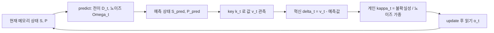

[논문 링크](https://arxiv.org/abs/2609.07816)
## 칼만 필터로 다시 쓴 선형 어텐션: Kalman Delta Networks

## 한 줄 요약 (TL;DR)

선형 어텐션(linear attention)의 고정 크기 recurrent memory 갱신을 **선형-가우시안 상태공간 모델** 로 재해석하고, 최적 추정기인 **칼만 필터(Kalman filter)** 의 공분산 추적을 도입해 "얼마나 강하게 덮어쓸지"를 불확실성(uncertainty) 기반으로 결정하는 **Kalman Delta Networks (KDN)** 를 제안한다. DeltaNet·Gated DeltaNet·KDA는 공분산을 생략한 고정 게인(fixed-gain) 특수 케이스로 환원되며, KDN은 750M/1.3B 사전학습에서 평가된 SOTA 선형 recurrent 믹서 전부를 PPL과 평균 정확도에서 앞선다 (근거: Abstract, §1).

## 핵심 아이디어

self-attention은 모든 과거 키-값 쌍을 그대로 보관하기 때문에 캐시가 컨텍스트 길이에 비례해 커지고 연산이 이차 복잡도가 된다. 선형 어텐션은 이 history를 고정 크기 상태 $S_t \in \mathbb{R}^{d_k \times d_v}$ 로 압축해 상수 메모리 디코딩과 스캔 병렬화를 얻지만, 대신 "온라인 메모리 관리 문제"를 떠안는다 (근거: §1). 각 토큰은 미래의 질의가 어떤 연상을 요구할지 모른 채 과거 요약을 편집해야 하며, 너무 약한 갱신은 낡은 정보를 남기고 너무 강한 갱신은 유용한 기억을 파괴한다.

기존 delta-rule 계열(DeltaNet, Gated DeltaNet, KDA)은 residual write 강도 $\beta_t$ 를 **현재 토큰 임베딩에서 직접 예측** 한다. 문제는 이들이 메모리 추정치에 대한 **신뢰도(confidence)를 추적하지 않는다** 는 점이다. 같은 크기의 residual이어도, 반복 관측으로 확증된 연상에 대한 residual과 처음 보는 key에 대한 residual은 다르게 다뤄야 하는데, 기존 모델은 이를 구분할 메커니즘이 없다 (근거: §1).

**KDN의 핵심 주장** 은 이것이다: recurrent 연상 메모리를 잠재(latent) 비정상(non-stationary) 키-값 맵의 선형-가우시안 상태공간 모델로 보고, 칼만 필터로 **메모리 평균뿐 아니라 그 공분산(불확실성)까지** 전파하면, 쓰기 강도가 "누적된 근거"와 "관측 신뢰도"에 따라 자동으로 조정된다는 것이다 (근거: §3). 불확실성이 곧 delta-rule 모델에서 빠져 있던 상태 변수다.

## 배경: 그들이 해결한 문제

선형 어텐션 계열의 발전은 "잊기(forgetting)"와 "쓰기(writing)"를 얼마나 정교하게 모델링하는지의 역사다 (근거: §2).

- **Linear attention**: `$S_t = S_{t-1} + k_t v_t^{\top}$` — 가산적 쓰기만 가능해 오래된 연상을 명시적으로 지울 수 없다.
- **DeltaNet**: `$S_t = S_{t-1} + \beta_t k_t (v_t - S_{t-1}^{\top} k_t)^{\top}$` — 현재 key에 대해 메모리가 예측한 값을 읽고 **잔차만** 쓰는 오류 보정 규칙. 단위 노름의 반복 key에 대해 $\beta_t = 1$ 이면 정확히 덮어쓴다.
- **Gated DeltaNet**: 스칼라 감쇠 $\alpha_t$ 를 추가해 방치된 연상을 기하급수적으로 소멸시킨다. 하지만 단일 스칼라라서 모든 key 채널이 같은 보존율을 공유한다.
- **KDA**: 스칼라 감쇠를 대각 전이 `$D_t = \text{diag}(\alpha_t)$` 로 바꿔 채널마다 다른 보존율을 허용한다. 이 계열에서 가장 표현력 있는 전이지만, 여전히 쓰기 강도 $\beta_t$ 는 토큰에서 예측된 스칼라 게이트다.

Mamba 계열은 `$h_t = A_t h_{t-1} + B_t x_t$` 의 선택적 SSM 재귀로, 제어 입력 `$B_t x_t$` 를 **직접 더한다** . 반면 delta-rule 믹서는 예측된 키-값 맵을 key 조건부 잔차로 **보정** 한다 (근거: §2). 이 둘은 서로 다른 렌즈(상태공간 동역학 vs 온라인 최적화)로 이해되어 왔고, 공통적으로 "쓰기 게인을 토큰에서 예측하되 근거를 추적하지 않는다"는 한계를 공유한다.

**연구 공백**: 이전 모델들은 transition(잊기)과 write(쓰기)가 결합되어 있으면서도, write 강도를 결정하는 신호가 "이 연상이 얼마나 반복 관측으로 뒷받침되는가"와 무관했다. 불확실성을 명시적 상태로 추적하는 메커니즘이 부재했다 (근거: §1, §6).

## 새로운 접근법: Kalman Delta Networks

### 1) Kalman Associative Memory — delta rule을 칼만 필터로

저자들은 메모리 `$S_t$` 를 잠재 연상 맵 `$\widetilde{S}_t$` 의 추정치로 본다. 각 토큰은 이 맵의 한 방향(key `$k_t$`)에서 잡음 낀 관측 `$v_t$` 를 제공한다 (근거: §3):

$$
\widetilde{S}_t = D_t \widetilde{S}_{t-1} + W_t, \qquad
v_t = \widetilde{S}_t^{\top} k_t + e_t
$$

여기서 `$D_t$` 는 전이(프로세스 모델, 즉 잊기의 형식적 대상), `$W_t \sim \mathcal{N}(0, \Omega_t)$` 는 프로세스 노이즈(감쇠로 설명 못 하는 드리프트), `$e_t \sim \mathcal{N}(0, r_t I)$` 는 관측 노이즈(토큰 값 중 "깨끗한 기억 대상이 아닌" 부분)다.

선형-가우시안 가정 하에서 평균제곱오차(MMSE) 기준 최적의 재귀 추정기는 칼만 필터이며, 그 갱신은 다음 예측-보정 구조를 띤다 (근거: Proposition 1, §3):

$$
\kappa_t = \frac{\widehat{P}_t k_t}{r_t + k_t^{\top}\widehat{P}_t k_t}, \qquad
S_t = \widehat{S}_t + \kappa_t\,(v_t - \widehat{S}_t^{\top} k_t)^{\top}
$$

여기서 `$\widehat{S}_t = D_t S_{t-1}$`, `$\widehat{P}_t = D_t P_{t-1} D_t^{\top} + \Omega_t$` 는 예측 단계, `$\kappa_t$` 는 칼만 게인, `$(v_t - \widehat{S}_t^{\top} k_t)$` 는 혁신(innovation)이다. 게인이 잔차(residual)를 가중하는 모습 그대로 **delta-rule의 residual write** 가 유지됨에 주목하자. 칼만 게인은 "메모리가 불확실하면( `$\widehat{P}_t$` 가 크면) 새 근거에 강하게, 반복 관측으로 확증된 연상은 보호"하도록 근거에 따라 조절된다 (근거: §3).

### 2) 기존 모델은 고정 게인 특수 케이스

예측 공분산을 등방(isotropic) 근사 `$\widehat{P}_t \approx \widehat{b}_t I$` 로 대체하면 칼만 게인이 스칼라 `$\beta_t k_t$` 로 붕괴한다 (근거: §3.3):

$$
\kappa_t \approx \frac{\widehat{b}_t}{r_t + \widehat{b}_t \lVert k_t \rVert^2}\, k_t \equiv \beta_t k_t
$$

즉 **DeltaNet( `$D_t = I$` ), Gated DeltaNet( `$D_t = \alpha_t I$` ), KDA( `$D_t = \text{diag}(\alpha_t)$` )는 전이만 다를 뿐, 공분산 재귀를 생략하고 게인을 토큰에서 직접 예측한 고정 게인 칼만 필터** 다. 이것이 이 논문의 가장 깔끔한 이론적 통찰이다: 잊기는 전이 모델의 "예측", 쓰기 강도는 공분산의 "신뢰도"라는 두 개념으로 분리된다.

### 3) 실용화: scan-compatible 두 근사

문제는 **정확한 칼만 갱신이 GPU 병렬 선형 어텐션과 맞지 않는다** 는 점이다. head마다 조밀한 `$d_k \times d_k$` 공분산을 추적해야 하고, 게인이 상태 의존적인 리카티(Riccati) 재귀를 따르기 때문이다 (근거: §4). 병렬 스캔은 `$S_t = A_t S_{t-1} + b_t$` 형태의 결합적(associative) 갱신을 요구한다.

이를 위해 저자들은 두 가지 스캔 호환 근사를 제시한다.

- **Diagonal KDN**: 공분산을 대각 패밀리로 제한하고, 각 토큰의 정확한(조밀한) 사후분포를 **온라인 평균장 변분 추론** (reverse KL 최소화)으로 대각 가우시안에 투영한다. 이 투영은 정확한 1단계 사후 평균을 보존하며, head당 `$O(d_k)$` 의 보조 상태를 유지한다 (근거: Proposition 2, §4.1).
- **Isotropic KDN**: 불확실성을 head당 **단일 스칼라** `$b_t$` 로 압축해 `$O(1)$` 보조 상태만 쓴다. 게인은 여전히 `$\kappa_t = \beta_t k_t$` 형태지만, `$\beta_t$` 가 전이·프로세스 노이즈·누적 근거로부터 도출된다 (근거: Proposition 4, §4.2).

핵심은 **불확실성 재귀가 뫼비우스(Möbius) 사상** 이라 `$2\times2$` 행렬 곱으로 표현 가능하고, 따라서 로그 깊이의 결합 스캔으로 병렬화된다는 점이다 (근거: §4.1):

$$
p_{t,i} = \frac{\alpha_{t,i}^2 p_{t-1,i} + \omega_{t,i}}{u_{t,i}\alpha_{t,i}^2 p_{t-1,i} + 1 + u_{t,i}\omega_{t,i}}
$$

## 작동 원리: 구체적인 예시로 살펴보기

먼저 전체 순환을 한 줄로 정리하면 아래와 같다.

**2차원 toy 예시로 게인의 직관을 잡아보자.** key 공간 `$d_k = 2$` 이고, 현재 key가 첫 번째 채널만 가리킨다고 하자: `$k_t = [1, 0]$`. 예측 불확실성이 `$\widehat{p}_t = [p_1, p_2]$` 라면 (근거: §4.1),

$$
\kappa_t = \frac{[p_1, 0]}{r_t + p_1}
$$

게인은 오직 채널 1에만 작용하고, 그 크기는 불확실성 `$p_1$` 과 관측 노이즈 `$r_t$` 의 상대 크기로 정해진다. `$p_1 \gg r_t$` (이 채널을 아직 잘 모름)이면 `$\kappa_1 \to 1$` 로 거의 완전히 덮어쓰고, `$p_1 \ll r_t$` (이미 확증됨)이면 `$\kappa_1 \to 0$` 으로 잡음 낀 관측을 무시한다. 기존 KDA의 `$\beta_t$` 는 이런 근거 반영 없이 토큰에서 한 번에 예측되므로, "처음 보는 key"와 "100번 본 key"를 구분하지 못한다.

**뫼비우스 스캔이 병렬화를 푼다.** 공분산 갱신은 아래 `$2\times2$` 행렬로 표현되며, 조성이 행렬 곱이 된다 (근거: §4.1):

$$
M_{t,i} = \begin{bmatrix} \alpha_{t,i}^2 & \omega_{t,i} \\ u_{t,i}\alpha_{t,i}^2 & 1 + u_{t,i}\omega_{t,i} \end{bmatrix}, \qquad p_{t,i} = \frac{n_{t,i}}{d_{t,i}},\ \begin{bmatrix}n_{t,i}\\d_{t,i}\end{bmatrix} = M_{t,i}\begin{bmatrix}n_{t-1,i}\\d_{t-1,i}\end{bmatrix}
$$

정확한 칼만 필터의 순차적 리카티 재귀와 달리, 이 결합 연산은 prefix 스캔으로 로그 병렬 깊이에 푼다. 실제 구현은 3-pass: chunk별 `$2\times2$` 요약 계산 → exclusive scan으로 chunk 진입 상태 → chunk 병렬 재생으로 게인 방출. 이후 메모리 갱신은 게인이 고정된 **입력 전용 비대칭 delta rule** 이 되어 compact-WY 커널로 처리된다 (근거: §4.1, Appx D).

**정보 스케일(information scale) `$\mu$`.** 대각 근사는 교차 채널 상관을 버리므로, 반복 key가 개별 채널에서 과신(overconfidence)해 **과도한 덮어쓰기** 를 유발할 수 있다. 저자들은 쓰기 후 정밀도 증가분에만 스케일 `$\mu > 0$` 을 곱해 미래의 쓰기를 약화시킨다 (근거: §4.1). `$\mu$` 는 현재 쓰기는 그대로 두고(게인이 쓰기 전에 계산됨) **미래 쓰기만 보호** 한다. 정규화된 조밀 key에 대해 `$\mu = d_k$` 가 각 채널 정보 희석(`$1/d_k$`)을 보정한다 (근거: Appx B).

## 성능 검증: 주요 결과

모든 실험은 FineWeb-Edu에서 **처음부터(from scratch)** 사전학습하며, 데이터·백본·최적화 레시피·평가 프로토콜을 고정하고 모델 용량만 맞춘 통제된 비교다 (근거: §5.1). 750M/50B와 1.3B/100B 두 스케일을 사용한다.

**언어 모델링과 상식 추론** (근거: Tab. 1). recurrent-only 750M에서 **Diagonal KDN** 은 WikiText PPL **18.64**, LAMBADA PPL **14.15**, 6-task 평균 정확도 **54.97%** 로 KDA(18.85/15.06/53.87)와 Mamba-3 MIMO(18.99/15.67/54.39)를 모두 앞선다. 1.3B에서도 Diagonal KDN이 **15.04/9.75/60.45%** 로 최고다. Isotropic KDN은 모든 스케일에서 두 번째 수준의 성능을 보이며, 특히 KDA와 거의 같은 비용 구조를 유지하면서도 개선을 얻는다는 점이 주목할 만하다.

**In-context retrieval** (근거: Tab. 2, 3). RULER needle-in-a-haystack에서 **Diagonal KDN은 두 스케일 모두 recurrent-only 중 최고 aggregate** 를 기록했다. 750M에서 S-NIAH-1을 8K까지 **100.0%** 로 유지했고, 다중 키(MK-NIAH-1)와 S-NIAH-3(간섭 유발)에서 두드러지게 강하다 — 이는 채널별 불확실성이 간섭 속에서 저장된 연상을 보호한다는 설계 의도와 일치한다 (근거: §5.2). 실세계 retrieval 6-task에서도 Diagonal KDN이 recurrent-only 최고 평균 **34.86%** (FDA·TriviaQA·DROP 선두)를 기록했다.

**Ablation** (근거: §5.3). 정보 스케일은 `$\mu = d_k$` 에서 평균 정확도가 정점(**54.97%**)이지만 LAMBADA PPL은 `$\mu = 4d_k$` 에서 가장 낮은 **13.91** 을 기록해, 효과가 소폭이고 지표 의존적이다. 관측·프로세스 노이즈를 고정하는 것은 일관된 개선을 주지 못했다. **효율 측면**에서는 Isotropic KDN이 KDA를 거의 그대로 추종하고, Diagonal KDN은 채널별 불확실성 스캔 비용이 추가되지만 GDN-2에 근접하며 선형 스케일링을 유지한다 (근거: Fig. 4). 긴 컨텍스트에서는 Mamba-3 SISO가 앞서고, full attention은 길이가 길어질수록 급격히 저하된다.

## 우리의 관점: 강점, 한계, 그리고 이 연구가 중요한 이유

**강점.** 가장 큰 기여는 개념적 통합이다. 흩어져 있던 DeltaNet/GDN/KDA를 "고정 게인 칼만 필터"라는 하나의 프레임으로 묶고, 여기에 빠져 있던 공분산(불확실성)을 첫 번째 시민으로 승격시켰다 (근거: §3.3). 이는 단순한 재명명이 아니라, 실제로 "쓰기 강도를 어떻게 결정할 것인가"라는 열린 질문에 원리적 답(근거 기반 게인)을 준다. 또한 정확한 칼만 필터의 병렬화 불가능 문제를 **뫼비우스 스캔** 이라는 우아한 수학적 장치로 해결한 점이 인상적이다 — 이론적으로 깨끗한 대상(칼만 필터)과 하드웨어 제약(GPU 병렬 스캔) 사이의 긴장을 정면으로 다뤘다 (근거: §4, Appx D).

**한계.** 저자들 스스로도 인정하듯, KDN은 칼만 연상 메모리의 "완전한 실현이 아니라 그 방향으로의 한 걸음"이다 (근거: §7). 정확한 필터링은 조밀 공분산과 리카티 갱신을 요구하는데, 등방·대각 근사는 이를 압축해 정보를 버린다. 또한 ablation에서 보듯 정보 스케일 `$\mu$` 의 효과는 소폭이고 지표 의존적이며, 노이즈 고정 실험도 뚜렷한 이득이 없어 "설계 원리가 실제 성능 향상의 진짜 원인인가"라는 질문이 완전히 해소되진 않는다 (근거: Tab. 4, 5). 실험 규모(최대 1.3B/100B)는 현재 프런티어 LLM 대비 작아, 이 이득이 스케일에서 지속될지는 미지수다. 아키텍처도 GDN-2의 백본을 차용한 것으로, 최적은 아니라고 명시한다 (근거: §5.1).

**왜 중요한가.** 긴 컨텍스트 추론이 실서비스의 핵심 비용이 된 지금, 고정 크기 recurrent memory는 KV 캐시 폭증에 대한 가장 유망한 대안 중 하나다. 이 논문은 그 메모리 설계에 "베이지안/상태추정"이라는 정량적 원리를 도입함으로써, 경험적으로 튜닝되던 delta-rule 계열에 이론적 기반을 부여했다. "불확실성 추적이 곧 쓰기 전략"이라는 통찰은 recurrent attention을 넘어, 메모리 압축을 쓰는 모든 아키텍처에 재사용 가능한 프레임이다.

## 다음 단계는?: 앞으로의 길

저자들이 제안하는 직접적인 후속은 **대각 감쇠에 Mamba-3의 감쇠 회전(damped rotation)을 결합** 해, 저장된 연상을 감쇠뿐 아니라 회전시킬 수 있게 하는 것이다 (근거: §7). 다만 더 풍부한 전이와 공분산 갱신을 스캔 효율적으로 만드는 문제는 여전히 열려 있다.

합리적 후속으로는 (1) 칼만 필터의 정보형(information form) 표현을 활용해 조밀 공분산의 결합 스캔을 근사하는 방향 — Preconditioned DeltaNet의 정적·고정 노이즈 한계를 넘어 학습된 확률 동역학까지 포함하는 것 (근거: §6), (2) `$\mu$` 의 지표 의존적 행동을 해소할 채널 적응형 정보 스케일, (3) 7B 이상 스케일에서 이득의 지속성 검증이 자연스럽게 이어진다. 궁극적으로는 "정확한 칼만 연상 메모리"와 "병렬 스캔" 사이의 남은 간극을 메우는 것이 이 연구가 던진 가장 흥미로운 열린 문제다.

<!-- verbatim-tables -->

## 논문 원문의 표

> arXiv e-print 의 LaTeX 원본에서 기계적으로 옮긴 표입니다. 숫자는 논문의 값이며 모델을 거치지 않았습니다.

**표 1. Language modeling and zero-shot commonsense reasoning. Best per column within each block in **bold**, second best underlined; light-blue rows denote our KDN variants.**

| Model | Perplexity $\downarrow$ Wiki. | Perplexity $\downarrow$ LMB. | Zero-shot accuracy (%) $\uparrow$ LMB. | Zero-shot accuracy (%) $\uparrow$ PIQA | Zero-shot accuracy (%) $\uparrow$ Hella. | Zero-shot accuracy (%) $\uparrow$ Wino. | Zero-shot accuracy (%) $\uparrow$ ARC-e | Zero-shot accuracy (%) $\uparrow$ ARC-c | Zero-shot accuracy (%) $\uparrow$ Avg. |
|---|---|---|---|---|---|---|---|---|---|
| *Recurrent-only, 750M parameters, 50B tokens* |  |  |  |  |  |  |  |  |  |
| DeltaNet | 19.78 | 20.17 | 38.77 | 69.10 | 48.04 | 51.93 | 65.49 | 33.28 | 51.10 |
| Gated DeltaNet | 19.50 | 18.08 | 40.23 | 69.91 | 50.22 | 55.64 | **68.10** | 32.17 | 52.71 |
| KDA | 18.85 | 15.06 | 44.34 | **70.95** | 51.23 | 54.93 | 67.72 | 34.04 | 53.87 |
| Mamba-3 (SISO) | 19.68 | 17.61 | 40.33 | 70.57 | 50.87 | 53.83 | 67.51 | 34.47 | 52.93 |
| Mamba-3 (MIMO) | 18.99 | 15.67 | 43.24 | 69.86 | **52.24** | 56.75 | 67.72 | **36.52** | 54.39 |
| GDN-2 | 21.20 | 17.88 | 41.18 | 70.08 | 46.90 | 54.54 | 64.27 | 31.74 | 51.45 |
| Isotropic KDN | **18.42** | 14.68 | 44.05 | **70.95** | 52.12 | 56.12 | 68.01 | 35.24 | 54.41 |
| Diagonal KDN | 18.64 | **14.15** | **45.66** | **70.95** | 51.91 | **57.70** | **68.10** | 35.49 | **54.97** |
| *Recurrent-only, 1.3B parameters, 100B tokens* |  |  |  |  |  |  |  |  |  |
| KDA | 15.40 | 10.09 | 51.15 | 74.16 | 60.61 | 60.54 | 73.48 | **41.72** | 60.28 |
| Mamba-3 (SISO) | 15.94 | 11.98 | 47.45 | 73.61 | 59.39 | 57.77 | 72.64 | 38.31 | 58.20 |
| Mamba-3 (MIMO) | 15.63 | 10.49 | 50.20 | 73.94 | **60.79** | 59.19 | 73.91 | 41.04 | 59.85 |
| GDN-2 | 16.15 | 11.29 | 49.45 | 72.63 | 57.80 | 59.19 | 72.73 | 39.25 | 58.51 |
| Isotropic KDN | 15.30 | 9.98 | 50.96 | 73.23 | 60.23 | **61.33** | **74.71** | 41.64 | 60.35 |
| Diagonal KDN | **15.04** | **9.75** | **51.87** | **74.21** | 60.68 | 60.62 | 73.70 | 41.64 | **60.45** |
| *Hybrid and attention-only, 1.3B parameters, 100B tokens* |  |  |  |  |  |  |  |  |  |
| Transformer (2K SWA) | 16.67 | 13.10 | 48.38 | 71.22 | 56.62 | 56.75 | 68.56 | 35.84 | 56.23 |
| KDA $+$ SWA | 15.08 | 10.81 | 51.23 | 72.14 | 60.33 | **61.64** | 72.77 | 41.55 | 59.94 |
| Mamba-3 (SISO) $+$ SWA | 15.87 | 11.38 | 50.46 | 72.80 | 59.59 | 59.27 | 72.73 | 40.10 | 59.16 |
| Mamba-3 (MIMO) $+$ SWA | 15.33 | 10.96 | 50.44 | 72.69 | 60.00 | 58.56 | 72.81 | 41.21 | 59.28 |
| GDN-2 $+$ SWA | 16.06 | 11.12 | 49.54 | 71.82 | 58.44 | 57.77 | 71.42 | 37.63 | 57.77 |
| Isotropic KDN $+$ SWA | **14.98** | 10.90 | 50.49 | 72.85 | 60.31 | 59.12 | 72.64 | 40.87 | 59.38 |
| Diagonal KDN $+$ SWA | 15.10 | **10.41** | **51.99** | **72.96** | **60.57** | 60.38 | **72.98** | **41.81** | **60.11** |

**표 2. In-context retrieval accuracy (%) on RULER single- and multi-key needle-in-a-haystack tasks . We use $25$-word context increments and deterministic random essay windows rather than $500$-word increments and fixed prefixes; every model receives the same $500$ samples per cell, with matched keys, values, and needle depths. Best per column within each block in **bold**, second best underlined.**

| Model | S-NIAH-1 1K | S-NIAH-1 2K | S-NIAH-1 4K | S-NIAH-1 8K | S-NIAH-2 1K | S-NIAH-2 2K | S-NIAH-2 4K | S-NIAH-2 8K | S-NIAH-3 1K | S-NIAH-3 2K | S-NIAH-3 4K | MK-NIAH-1 1K | MK-NIAH-1 2K | MK-NIAH-1 4K |
|---|---|---|---|---|---|---|---|---|---|---|---|---|---|---|
| *Recurrent-only, 750M parameters, 50B tokens* |  |  |  |  |  |  |  |  |  |  |  |  |  |  |
| DeltaNet | **100.0** | **100.0** | 99.6 | 99.6 | 97.0 | 87.0 | 45.4 | 15.4 | 72.0 | 49.2 | 17.6 | 27.2 | 27.4 | 22.6 |
| Gated DeltaNet | **100.0** | 99.8 | 99.2 | 87.8 | 93.2 | 56.2 | 27.2 | 13.8 | 71.8 | 23.8 | 6.6 | 29.8 | 25.4 | 20.2 |
| KDA | **100.0** | 99.8 | 99.2 | 82.6 | 96.4 | 89.8 | 63.2 | 26.0 | 68.8 | 43.6 | 13.6 | 32.6 | 29.8 | 24.2 |
| Mamba-3 (SISO) | **100.0** | 98.8 | 73.8 | 33.2 | 95.4 | 82.2 | 43.0 | 17.6 | 65.6 | 26.4 | 9.0 | 42.4 | 27.6 | 19.6 |
| Mamba-3 (MIMO) | **100.0** | 99.0 | 79.2 | 39.6 | 98.4 | **92.6** | 57.6 | 21.6 | 77.4 | 49.0 | 14.2 | **50.2** | 36.0 | 25.0 |
| GDN-2 | **100.0** | 99.8 | 90.2 | 47.2 | 95.0 | 74.6 | 36.0 | 12.6 | 64.6 | 31.0 | 9.2 | 27.8 | 25.6 | 22.0 |
| Isotropic KDN | **100.0** | **100.0** | 98.2 | 89.4 | 96.0 | 86.0 | 47.8 | 16.2 | 80.4 | 58.4 | 22.6 | 30.4 | 25.4 | 22.2 |
| Diagonal KDN | **100.0** | **100.0** | **100.0** | **100.0** | **98.6** | 91.4 | **71.2** | **29.0** | **84.2** | **71.0** | **32.2** | 41.0 | **36.4** | **29.6** |
| *Recurrent-only, 1.3B parameters, 100B tokens* |  |  |  |  |  |  |  |  |  |  |  |  |  |  |
| KDA | 99.8 | 99.2 | 66.6 | 30.2 | 98.0 | 95.0 | 62.2 | 23.6 | 92.6 | 77.2 | 43.2 | 47.4 | 38.8 | 26.6 |
| Mamba-3 (SISO) | **100.0** | 99.8 | 98.2 | 62.6 | 98.6 | 93.6 | 62.6 | 20.6 | 69.0 | 50.2 | 16.6 | 46.6 | 38.4 | 27.2 |
| Mamba-3 (MIMO) | 99.8 | 99.4 | 75.2 | 15.4 | **99.6** | **96.0** | 64.8 | 15.4 | 85.8 | 63.6 | 29.8 | 51.6 | 42.4 | 30.4 |
| GDN-2 | **100.0** | **100.0** | **100.0** | **99.8** | 98.6 | 92.4 | 67.4 | **28.0** | 88.0 | 64.4 | 29.4 | 50.6 | 44.0 | 31.4 |
| Isotropic KDN | **100.0** | **100.0** | **100.0** | 94.6 | 98.4 | 91.8 | 68.4 | 24.2 | 86.8 | 67.6 | 34.6 | 41.6 | 29.8 | 23.4 |
| Diagonal KDN | **100.0** | **100.0** | 99.8 | **99.8** | 98.6 | 95.6 | **74.6** | 25.8 | **96.4** | **88.6** | **48.6** | **62.2** | **47.4** | **33.8** |
| *Hybrid and attention-only, 1.3B parameters, 100B tokens* |  |  |  |  |  |  |  |  |  |  |  |  |  |  |
| Transformer (2K SWA) | **100.0** | **100.0** | **52.4** | 22.6 | **100.0** | **100.0** | **53.4** | 19.8 | 99.2 | 94.6 | 35.4 | 76.6 | 79.4 | 45.4 |
| KDA $+$ SWA | **100.0** | 87.8 | 47.4 | 21.2 | 99.8 | **100.0** | **53.4** | 25.4 | 99.2 | 97.0 | 48.6 | 86.0 | 83.0 | 44.2 |
| Mamba-3 (SISO) $+$ SWA | 99.4 | 73.8 | 29.4 | 15.0 | 99.6 | 99.2 | 52.2 | 21.8 | 96.4 | 86.2 | 43.4 | 74.8 | 76.0 | 39.0 |
| Mamba-3 (MIMO) $+$ SWA | **100.0** | 99.8 | 52.0 | 27.2 | 99.8 | 99.8 | 53.2 | 25.6 | 97.8 | 95.8 | 50.8 | 92.8 | 89.6 | 45.8 |
| GDN-2 $+$ SWA | **100.0** | **100.0** | **52.4** | **28.4** | **100.0** | 99.8 | **53.4** | **27.6** | 83.0 | 67.8 | 25.2 | 84.0 | 76.8 | 45.6 |
| Isotropic KDN $+$ SWA | **100.0** | **100.0** | **52.4** | **28.4** | **100.0** | **100.0** | **53.4** | **27.6** | **99.8** | 98.4 | 44.6 | 85.4 | 89.0 | **49.8** |
| Diagonal KDN $+$ SWA | **100.0** | 98.6 | 51.6 | 28.0 | **100.0** | 98.4 | **53.4** | 26.0 | **99.8** | **99.2** | **53.0** | **95.6** | **90.0** | 47.8 |

**표 3. Zero-shot accuracy (%) on real-world retrieval tasks with inputs limited to $2$K tokens. *Avg.* is the unweighted six-task mean. Best per column within each block in **bold**, second best underlined.**

| Model | SWDE | SQuAD | FDA | TriviaQA | NQ | DROP | Avg. |
|---|---|---|---|---|---|---|---|
| *Recurrent 1.3B / 100B* |  |  |  |  |  |  |  |
| KDA | 28.77 | **38.70** | 27.97 | 61.97 | **24.11** | 21.03 | 33.76 |
| Mamba-3 (SISO) | 26.34 | 36.35 | 22.52 | 60.90 | 21.98 | 20.89 | 31.50 |
| Mamba-3 (MIMO) | 24.93 | 36.71 | 25.25 | 61.02 | 23.50 | 21.99 | 32.23 |
| GDN-2 | 29.90 | 35.64 | 21.16 | 61.49 | 23.34 | 20.99 | 32.09 |
| Isotropic KDN | **33.08** | 36.71 | 22.98 | 62.09 | 22.14 | 23.38 | 33.40 |
| Diagonal KDN | 30.18 | 38.09 | **30.61** | **62.56** | 23.63 | **24.10** | **34.86** |
| *Hybrid 1.3B / 100B* |  |  |  |  |  |  |  |
| Transformer (2K SWA) | 36.08 | 42.43 | 52.68 | 62.09 | 25.40 | 21.47 | 40.02 |
| KDA $+$ SWA | 51.08 | 43.10 | 57.86 | 65.17 | 28.22 | **25.11** | 45.09 |
| Mamba-3 (SISO) $+$ SWA | 36.27 | 43.37 | 58.95 | 64.57 | 26.70 | 22.47 | 42.06 |
| Mamba-3 (MIMO) $+$ SWA | 42.55 | 43.33 | 64.85 | **65.88** | **28.44** | 23.53 | 44.76 |
| GDN-2 $+$ SWA | 47.80 | 42.73 | 63.22 | 62.38 | 26.10 | 23.19 | 44.24 |
| Isotropic KDN $+$ SWA | **53.98** | **43.60** | 63.12 | 65.52 | 26.89 | 22.52 | **45.94** |
| Diagonal KDN $+$ SWA | 48.08 | 43.50 | **66.58** | 64.93 | 27.72 | 22.52 | 45.55 |

**표 4. Mean effective write for the 750M Diagonal KDN ($d_k=128$). The first two columns use the matched random-initialization controls and checkpoints trained at each scale, evaluated on eight 2048-token sequences. The final column uses a separate 4096-token trajectory, changes only the runtime information scale of each trained checkpoint, and averages the resulting layer--head--token means across the four checkpoints; model weights are fixed, while downstream hidden states respond to the changed recurrence. Absolute levels should therefore be compared within, not across, these probe protocols. The intervention isolates the monotone protection effect from retraining compensation.**

| Information scale $\mu$ | Random init. | Trained at $\mu$ | Fixed-weight intervention |
|---|---|---|---|
| $1$ | 0.842 | 0.943 | 0.886 |
| $\sqrt{d_k}$ | 0.743 | 0.891 | 0.873 |
| $d_k$ | 0.630 | 0.826 | 0.862 |
| $4d_k$ | 0.580 | 0.805 | 0.857 |

> 이 글의 그림은 arXiv:2609.07816 원본에서 가져왔습니다 (CC BY 4.0). 크기와 형식만 바꿨습니다.
