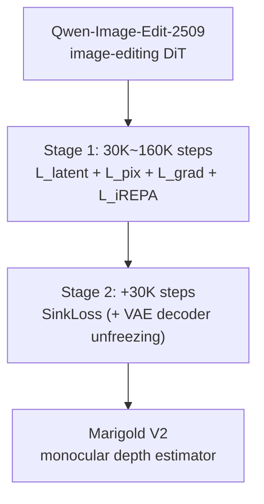

[Paper](https://arxiv.org/abs/2609.08084)
## Marigold V2: Reviving an Image-Editing Diffusion Transformer (DiT) as a Monocular Depth Estimator

## TL;DR

This study fine-tunes an **image-editing diffusion transformer (DiT)**, Qwen-Image-Edit-2509, with 4-bit QLoRA to achieve SOTA monocular depth estimation **in about a week on a single 32GB GPU**. The key is two new losses — **iREPA-depth**, which aligns with semantic features extracted from depth GT, and **SinkLoss** based on optimal transport (Sinkhorn) — which suppress flying-pixel artifacts while preserving fine details such as fur, foliage, and hair.

## Core Idea

Existing diffusion-based depth estimators suffer from two chronic problems: (1) depth estimators using a VAE **lose fine detail and over-smooth boundaries**, and (2) **noisy GT** exists on thin and transparent objects, making them hard to fit with pixel-wise losses (source: §Introduction, §Related Work).

The authors' solution extends the Marigold family's philosophy of "cheaply recycling generative models" into the DiT and image-editing paradigm, while adding two losses that each target one of the two problems above:

1. **iREPA-depth** — applies representation alignment in Stage 1, but aligns to DINOv3 features extracted from the **GT depth map** rather than from RGB (source: §Introduction).
2. **SinkLoss** — a loss that matches the **multiset** of depth values within each local block via optimal transport; because it does not enforce spatial alignment, it sidesteps noisy GT while producing sharp boundaries (source: §Method).

As a result, the proposed model improves **AbsRel by 16–26%** over the previous best on KITTI/ETH3D, and on ETH3D its AbsRel of **2.8** clearly beats the strongest competitor (3.8) (source: Abstract, Tab. depth comparison).

### Key Numbers at a Glance

| Item | Value |
|---|---|
| Backbone | Qwen-Image-Edit-2509 (image-editing DiT) |
| Fine-tuning | 4-bit quantization + QLoRA (rank-128 adapter) |
| Inference | Single step (rectified flow, $t{=}0.5$ fixed) |
| Depth representation | Affine-invariant log-depth (2–98 percentile clipping) |
| Training data | HyperSim(90%) + vKITTI(10%) ≈ 74K images |
| Training cost | Single 32GB GPU, Stage 1 160K steps ≈ 5 days + Stage 2 30K steps ≈ 1 day |
| Latency/memory (1024²) | 1.9 s / 16.9 GB |
| Latency/memory (2048²) | 9.6 s / 29.3 GB (competitors OOM) |
| ETH3D AbsRel | **2.8** (runner-up FE2E: 3.8) |

## Background: The Problem They Tackled

Monocular depth estimation recovers per-pixel depth from a single RGB image and is inherently ill-posed. Because any single 2D image is consistent with infinitely many 3D scene configurations, the model must reason about scene structure, material, and lighting beyond low-level appearance cues (source: §Introduction).

The SOTA landscape the authors identified splits into two broad families (source: §Related Work):

- **Discriminative family**: Depth Anything V2, MoGe, $\pi^3$, etc. However, they are structurally limited because GT depth data reaches only "million-scale," far behind the "billion-scale" data available to generative models. They also inherit weaknesses in handling sensor noise and non-Lambertian, transparent, and reflective surfaces.
- **Generative family**: the approach represented by Marigold, which recycles diffusion models as depth predictors. However, two problems remained: (a) **fine-detail loss and boundary over-smoothing** in VAE-based depth estimators, and (b) sharply rising recycling costs as the field moved to DiTs (e.g., DICEPTION costs 96 GPU-days, Lotus-2 needs 8 GPUs).

The **research gap** the authors targeted is clear: *"no method has solved, **simultaneously**, detail preservation and robust supervision against noisy and ambiguous GT within a single-step, VAE-based generative framework"* (source: §Related Work). Existing edge-aware losses, SharpDepth's distillation, InfiniDepth's arbitrary-resolution queries, and Lotus-2's predictor–sharpener structure all address only one of these two problems.

**Central hypothesis**: *The authors hypothesize that by recycling an image-editing DiT into a depth estimator via cheap QLoRA fine-tuning and applying GT-depth feature alignment (iREPA-depth) and a Sinkhorn matching loss (SinkLoss), SOTA accuracy can be achieved with just a single GPU and a few days of training, overcoming the two limitations of detail loss and noisy GT.*

## New Approach: Marigold V2 (Two-Stage Fine-Tuning Protocol)

Marigold V2's recipe is summarized by three novel contributions (source: §Introduction):

- **Marigold V2 protocol**: a lightweight fine-tuning recipe that turns an image-editing DiT into a depth (and other dense regression) estimator. With 4-bit quantization + QLoRA, it needs only **one consumer GPU + small data + a few days**.
- **iREPA-depth**: applies representation alignment unconventionally in Stage 1, aligning to the semantic and geometric features obtained by running the DINOv3 encoder on the **GT depth map**.
- **SinkLoss**: a new objective based on Sinkhorn matching that preserves semantic details such as fur, hair, and thin structures while sharpening boundaries.

The training pipeline is as follows (source: §Method).

### Depth Normalization (log-depth)

First, the metric depth $D$ is converted into an affine-invariant normalized log depth $d \in [-1,1]$:

$$d = 2\left( \frac{\log(D+\epsilon) - d_2}{d_{98} - d_2} - \frac{1}{2} \right)$$

Here, $d_i$ is the $i$-th percentile of $\log(D+\epsilon)$ computed over valid pixels; $d_2$ and $d_{98}$ are the 2% and 98% quantiles, used for robust clipping. This representation removes the global scale and shift ambiguity of monocular depth while preserving relative scene geometry. The normalized depth is replicated into a grayscale RGB image (identical values across the three channels) so it is compatible with the image-editing backbone (source: §Method).

### Single-Step Rectified-Flow Recycling

For VAE encoder $\mathcal{E}_{vae}$ and decoder $\mathcal{D}_{vae}$, RGB $I$ and depth $d$ are encoded into latents, a target velocity $v = z_I - z_d$ is defined, and the DiT $f_\theta$ with $t{=}0.5$ fixed is trained to regress it:

$$\mathcal{L}_{\mathrm{latent}} = \left\| f_\theta(z_I, t) - v \right\|_2^2$$

Since $t$ is fixed, the rectified-flow parameterization reduces to "direct latent regression without a trajectory to integrate." At inference, a single forward pass yields the depth latent (source: §Method):

$$\hat{z}_d = z_I - f_\theta(z_I, t), \qquad \hat{d} = \mathcal{D}_{vae}(\hat{z}_d)$$

While existing diffusion-based depth methods mostly supervise only in latent space, the authors added a pixel-space $L_1$ reconstruction loss $\mathcal{L}_{pix}$ and an $L_1$ spatial gradient loss $\mathcal{L}_{grad}$ to improve local reconstruction quality (source: §Method).

### Stage 1: iREPA-depth (Semantic Feature Alignment)

Pixel losses alone fail to preserve fine structure in semantically dense regions such as foliage, bushes, and repetitive patterns. The authors introduced the iREPA-depth regularizer, which aligns the DiT's internal representations to features obtained by running the DINOv3 encoder on the **GT depth map**. Depth-domain features provide more useful information for geometric reconstruction than features extracted from RGB, improving both AbsRel and $\delta_1$ (source: §Method, Tab. stage1 ablations). The total Stage 1 loss is:

$$\mathcal{L}_{\mathrm{DiT}} = \lambda_{\mathrm{latent}} \mathcal{L}_{\mathrm{latent}} + \lambda_{\mathrm{pix}} \mathcal{L}_{\mathrm{pix}} + \lambda_{\mathrm{grad}} \mathcal{L}_{\mathrm{grad}} + \lambda_{\mathrm{iREPA}} \mathcal{L}_{\mathrm{iREPA}}$$

### Stage 2: SinkLoss (Optimal-Transport-Based Boundary Refinement)

For thin and transparent objects, the GT itself can be riddled with noise. Even high-quality synthetic data such as HyperSim has inherently random foreground/background depth assignment at transparent and boundary pixels, due to V-Ray's quasi-Monte Carlo sampling (source: §Method, Fig. hypersim). Perfect pixel-wise matching is impossible — and even undesirable, since downstream tasks want consistent depth on the foreground object and a sharp transition to the background.

To this end, SinkLoss divides the image into $K \times K$ non-overlapping blocks, builds a cost matrix $C_{ij} = |\hat{d}_i - d_j|$ between predicted depths $\{\hat{d}_i\}$ and GT depths $\{d_j\}$ within each block, and then computes a **soft one-to-one assignment** via entropy-regularized optimal transport:

$$\mathbf{M} = \arg\min_{\mathbf{M}\in\mathcal{U}}\; \langle \mathbf{M}, \tilde{\mathbf{C}} \rangle - \tau\, H(\mathbf{M})$$

Here $\mathcal{U}$ is the transport polytope with uniform marginal $1/K^2$, $H(\mathbf{M})$ is the Shannon entropy, and $\tilde{\mathbf{C}}$ is the cost matrix with invalid pixels penalized by a large value $B$. $\mathbf{M}$ is obtained via Sinkhorn–Knopp iterations. The final loss is a weighted average of the transport cost over valid pairs:

$$\mathcal{L}_{\mathrm{SinkLoss}} = \frac{\sum_{ij} m_i m_j\, M_{ij}\, C_{ij}}{\sum_{ij} m_i m_j\, M_{ij}}$$

The authors used $K{=}5$, $\tau{=}0.1$, $B{=}10^6$, and 5 Sinkhorn iterations (source: §Method).

## How It Works: A Concrete Walkthrough

### Why SinkLoss Sidesteps Noisy GT (Toy Example)

Suppose a thin railing crosses a $2 \times 2$ block ($K{=}2$). Assume the normalized GT depth is mixed at the foreground/background boundary as follows:

- GT depth (in pixel order): $[0.2,\ 0.8,\ 0.8,\ 0.2]$
- Ideal prediction: $[0.25,\ 0.75,\ 0.75,\ 0.25]$ (clean boundary)

With **pixel-wise $L_1$**, residuals like $|0.25-0.2|$ accumulate at every pixel, pulling the model to reproduce the noisy GT and blurring the boundary. **SinkLoss**, by contrast, only requires that the "set of predicted values" and the "set of GT values" match within the block, up to a permutation. In the example above, the predicted multiset $\{0.25, 0.75, 0.75, 0.25\}$ has nearly the same distribution as the GT multiset $\{0.2, 0.8, 0.8, 0.2\}$, so the optimal transport cost is very small without penalizing spatial misalignment. As a result, the model is freed from "matching noisy pixel locations exactly" and instead outputs a "clean foreground/background depth distribution," producing sharp boundaries while reducing flying pixels (source: §Method).

### Why log-depth Dovetails with AbsRel

The authors give theoretical support for why the log-depth representation is optimal. When the relative error $\epsilon = (x_{\mathrm{pred}} - x_{\mathrm{gt}})/x_{\mathrm{gt}}$ is small, the log-depth difference equals the relative error to first order:

$$\log x_{\mathrm{pred}} - \log x_{\mathrm{gt}} = \log\!\left(1 + \frac{x_{\mathrm{pred}} - x_{\mathrm{gt}}}{x_{\mathrm{gt}}}\right) \approx \frac{x_{\mathrm{pred}} - x_{\mathrm{gt}}}{x_{\mathrm{gt}}} = \epsilon$$

In other words, the $L_1$ penalty on log depth matches the per-pixel **AbsRel** error to first order. Indeed, log depth achieves a mean AbsRel of **4.72**, better than linear depth (5.04) and inverse depth / disparity (5.28) (source: §Experiments, Tab. depth parameterization).

### Ablating the "Secret Weapon" (Stage 1 Ablations)

How important iREPA-depth is becomes clear in the Stage 1 ablations (source: Tab. stage1 ablations). In a controlled experiment at 30K steps:

| Setting | NYUv2 AbsRel↓ | ETH3D AbsRel↓ | DIODE AbsRel↓ |
|---|---|---|---|
| latent only | 4.53 | 4.25 | 6.82 |
| + pix/grad | 4.70 | 4.32 | 6.22 |
| + iREPA-RGB | 4.50 | 3.64 | 5.72 |
| + iREPA-depth | **4.36** | **3.62** | **5.55** |

iREPA-depth is best on all datasets. Interestingly, the AbsRel and $\delta_1$ gap narrows when training is extended to 160K steps — meaning that a substantial part of iREPA-depth's quantitative effect comes from **convergence acceleration**, and while the quantitative metrics become similar with longer training, the qualitative quality gains remain (source: §Experiments).

## Performance Evaluation: Key Results

### Zero-Shot Monocular Depth Estimation

The evaluation protocol follows Pixel-Perfect Depth (PPD): predictions are aligned to GT metric depth via RANSAC, then AbsRel(↓) and $\delta_1$(↑) are measured (source: §Experiments).

| Model | NYUv2 AbsRel↓ / δ₁↑ | KITTI AbsRel↓ / δ₁↑ | ETH3D AbsRel↓ / δ₁↑ | ScanNet AbsRel↓ / δ₁↑ | DIODE AbsRel↓ / δ₁↑ |
|---|---|---|---|---|---|
| **Marigold V2 (ours)** | **3.6 / 98.0** | **5.4 / 97.4** | **2.8 / 99.2** | **3.7 / 97.9** | **5.2 / 97.1** |
| FE2E | 3.8 / 97.6 | 6.5 / 96.0 | 3.8 / 98.7 | 4.3 / 97.1 | 5.6 / 96.4 |
| Lotus-2 | 3.7 / 97.6 | 6.7 / 94.1 | 4.1 / 98.6 | 4.0 / 97.2 | 6.5 / 95.5 |
| PPD (1024) | 4.1 / 97.7 | 7.0 / 95.5 | 4.3 / 98.0 | 4.6 / 97.2 | 6.8 / 95.9 |
| InfiniDepth | 4.3 / 97.6 | 8.7 / 92.3 | 6.1 / 95.4 | 4.7 / 96.9 | 6.4 / 95.8 |

Marigold V2 ranks **first on all 5 datasets**, and on ETH3D its AbsRel of **2.8** is about a 26% improvement over the strongest baseline (3.8) (source: Tab. depth comparison). One caveat: in this table, large discriminative models trained on 5M+ images, such as Depth Anything V2 (62M), MoGe, and $\pi^3$, are reference values excluded from the ranking (source: Tab. depth comparison note).

### Edge-Aware Evaluation

Beyond standard accuracy metrics, the authors introduce Soft Edge Error (SEE$_k$), which measures flying-pixel suppression at object boundaries in HyperSim (source: §Experiments).

| Model | SEE₃↓ | SEE₅↓ | SEE₇↓ |
|---|---|---|---|
| **Marigold V2 (ours)** | **0.352** | **0.333** | **0.320** |
| PPD | 0.404 | 0.385 | 0.371 |
| InfiniDepth | 0.470 | 0.451 | 0.436 |

Marigold V2 outperforms PPD and InfiniDepth, both specifically designed for detail preservation, on all SEE metrics (source: Tab. SEE metrics).

### Latency and Memory (Single 32GB GPU)

| Model | 1024² latency (s) / memory (GB) | 2048² latency (s) / memory (GB) |
|---|---|---|
| InfiniDepth | 0.2 / 1.9 | 1.2 / 3.4 |
| PPD | 1.4 / 5.6 | OOM |
| Lotus-2 | 8.9 / 26.1 | OOM |
| FE2E | 3.9 / 27.5 | OOM |
| **Marigold V2 (ours)** | **1.9 / 16.9** | **9.6 / 29.3** |

Marigold V2 is not the fastest (InfiniDepth is much faster and lighter), but it is the **only model that runs at 2048²**, with far better resolution scalability. Thanks to QLoRA-quantized weights and single-step inference, it needs no iterative sampling and no extra input tokens (source: Tab. latency comparison).

### Transfer to Other Dense Regression Tasks

The same recipe achieves SOTA beyond depth on other tasks as well (source: §Other Dense Regression Tasks):

- **Metric depth completion**: a rank-16 LoRA (21.2M parameters) on top of a frozen depth prior, with two scale-and-shift scalars adapted at test time over 100 Adam steps. Combined with high-resolution inference and 3×3 tiling, it achieves the **lowest RMSE on all 4 benchmarks** (source: Tab. depth completion).
- **See-through depth**: fine-tuning for 30K steps on LayeredDepth-Syn $l8$ to predict geometry behind glass improves AbsRel from **13.7 → 8.2** and $\delta_1$ from **84.0 → 92.7** (source: Tab. see-through).
- **Surface normal estimation**: roughly top-1 or top-2 on NYUv2/ScanNet/iBims-1/Sintel by MeanErr and $11.25^\circ$ thresholds (source: Tab. normals).
- **Albedo estimation**: on HyperSim, PSNR of **20.78** surpasses the previous best (19.28), and LPIPS of **0.195** is also the best (source: Tab. albedo).

## Our Take: Strengths, Limitations, and Why This Work Matters

### Strengths

- **Democratized cost**: where existing DiT recycling required 96 GPU-days (DICEPTION) or 8 GPUs (Lotus-2), this method needs only **a single 32GB GPU + about a week**. The message that "SOTA perception models can be distilled from open generative models in a few days" is practically compelling (source: §Related Work, §Conclusion).
- **Problem-oriented loss design**: iREPA-depth and SinkLoss each precisely target a different failure mode — "detail loss" and "noisy GT," respectively. The "permutation invariance within a block" idea behind SinkLoss is an elegant and principled solution to the noisy/ambiguous GT problem.
- **Proven transferability**: the same losses consistently improve SEE on other backbones such as Stable Diffusion V1.5 and FLUX.2 klein, showing the gains come from the recipe itself rather than "a lucky Qwen backbone" (source: Tab. backbone transfer).
- **Broad generalization**: that a single recipe works across depth, completion, see-through depth, normals, and albedo suggests a general principle applicable to dense regression as a whole.

### Limitations

- **No real time**: the large image-editing backbone rules out real-time use, and the authors explicitly acknowledge this (source: §Conclusion). 1.9 seconds at 1024² is too heavy for low-latency applications such as robotics.
- **Narrowing gap in quantitative metrics**: iREPA-depth's quantitative benefit shrinks at 160K steps, so much of its value lies in "convergence acceleration." With enough resources for long training, the quantitative justification for iREPA weakens (source: §Experiments).
- **Potential limitations**: ambiguity in reflective, motion-blurred, and defocused regions remains, and the authors mention uncertainty-aware and multi-layer extensions as future work (source: §Conclusion). Also, further validation seems needed on how robust hyperparameters like the block size $K{=}5$ of SinkLoss are across resolutions and scenes, and on whether the "match the set only" relaxation risks warping geometry in extreme cases.

### Why This Work Matters

The real contribution of this paper lies less in specific numbers than in demonstrating **"a methodology for cheaply transferring generative prior knowledge to dense regression."** The fact that a SOTA perception model can be built on a single GPU offers an alternative entry path for individual researchers and small labs blocked by the data barrier of large discriminative models.

## What's Next?: The Road Ahead

The directions the authors propose are uncertainty-aware and multi-layer extensions (source: §Conclusion). Building on the limitations, here are reasonable next steps:

1. **Lightweighting**: distill the DiT backbone into a small discriminative backbone via knowledge distillation to reach real-time performance. SinkLoss's "boundary sharpness" signal could serve as the distillation objective.
2. **Uncertainty/multi-resolution**: model the ambiguity of thin structures and reflective regions probabilistically to provide confidence maps useful for downstream tasks (novel-view synthesis, 3D reconstruction).
3. **Extending SinkLoss**: make the block size and tiling strategy adaptive to resolution, and systematize transfer to other dense regression tasks beyond normals and albedo (optical flow, segmentation).
4. **Releasing cost and reproducibility details**: to maximize reproducibility — the recipe's core strength — fully disclosing hyperparameters, seeds, and data filtering rules would lower the entry barrier for follow-up work.

---

### Reproduction Checklist (Summary)

- [ ] Code/commits/license: verify availability on the official website and open-source release (`hf.co/spaces/huawei-bayerlab/marigold-v2-web`)
- [ ] Backbone: Qwen-Image-Edit-2509 + 4-bit QLoRA (rank-128)
- [ ] Data: HyperSim (90%, 768×512) + vKITTI (10%, 1216×352), filtering invalid pixels >0.1%
- [ ] Hyperparameters: batch size 1, gradient clipping, $\lambda_{latent}{=}1.0,\ \lambda_{pix}{=}1.0,\ \lambda_{grad}{=}5.0,\ \lambda_{iREPA}{=}0.2$; Stage 2 $\lambda_{SinkLoss}{=}1.0$
- [ ] SinkLoss: $K{=}5,\ \tau{=}0.1,\ B{=}10^6$, 5 Sinkhorn iterations
- [ ] Evaluation: PPD protocol (RANSAC alignment); ETH3D uses a 1008×672 input upsampled to 2048×1360

<!-- verbatim-tables -->

## Tables from the paper

> Tables converted mechanically from the arXiv e-print LaTeX source. The numbers are the paper's own and did not pass through a model.

**Table 1. **Comparison of zero-shot affine-invariant monocular depth estimators on NYUv2, KITTI, ETH3D, ScanNet, and DIODE.** We report AbsRel ($\downarrow$) and $\delta_1$ ($\uparrow$). **Bold** indicates the best result and underlining the second-best result for each metric. Methods trained on more than 5M images are given in **gray** for reference and are excluded from ranking. Results for InfiniDepth, Lotus-2, FE2E, and our method are reproduced under the same evaluation protocol, while the remaining results are taken from the PPD paper. $^†ger$$\pi^3$ includes ScanNet in its training data; its ScanNet results are therefore not zero-shot.**

| Method | Training Data $\downarrow$ | NYUv2 AbsRel $\downarrow$ | NYUv2 $\delta_1$ $\uparrow$ | KITTI AbsRel $\downarrow$ | KITTI $\delta_1$ $\uparrow$ | ETH3D AbsRel $\downarrow$ | ETH3D $\delta_1$ $\uparrow$ | ScanNet AbsRel $\downarrow$ | ScanNet $\delta_1$ $\uparrow$ | DIODE AbsRel $\downarrow$ | DIODE $\delta_1$ $\uparrow$ |
|---|---|---|---|---|---|---|---|---|---|---|---|
| **Omnidata** (ICCV 2021) | 12.2M | 7.4 | 94.5 | 14.9 | 83.5 | 16.6 | 77.8 | 7.5 | 93.6 | - | - |
| **DepthAnything\ V2** (62M) (NeurIPS 2024) | 62.6M | 4.5 | 97.9 | 7.4 | 94.6 | 13.1 | 86.5 | 6.5 | 97.2 | 6.6 | 95.2 |
| **MoGe** (CVPR 2025) | 9M | 3.1 | 98.3 | 7.2 | 95.1 | 10.0 | 89.6 | 3.3 | 98.3 | 29.0 | 70.0 |
| **MoGe-2** (NeurIPS 2025) | 8.9M | 3.1 | 98.4 | 6.9 | 89.9 | 5.0 | 96.2 | 3.1 | 98.3 | 9.6 | 84.5 |
| **$\pi^3$**$^\dagger$ (ICLR 2026) | >9M | 2.9 | 98.7 | 5.9 | 96.7 | 2.9 | 98.9 | 2.1$^\dagger$ | 99.1$^\dagger$ | 4.4 | 96.8 |
| **DiverseDepth** (arXiv 2020) | 320K | 11.7 | 87.5 | 19.0 | 70.4 | 22.8 | 69.4 | 10.9 | 88.2 | - | - |
| **MiDaS** (TPAMI 2022) | 2M | 11.1 | 88.5 | 23.6 | 63.0 | 18.4 | 75.2 | 12.1 | 84.6 | - | - |
| **LeReS** (CVPR 2021) | 354K | 9.0 | 91.6 | 14.9 | 78.4 | 17.1 | 77.7 | 9.1 | 91.7 | - | - |
| **DPT** (ICCV 2021) | 1.4M | 9.8 | 90.3 | 10.0 | 90.1 | 7.8 | 94.6 | 8.2 | 93.4 | - | - |
| **HDN** (NeurIPS 2022) | 300K | 6.9 | 94.8 | 11.5 | 86.7 | 12.1 | 83.3 | 8.0 | 93.9 | - | - |
| **DepthAnything\ V2 (54K)** (NeurIPS 2024) | 54K | 5.4 | 97.2 | 8.6 | 92.8 | 12.3 | 88.4 | - | - | 8.8 | 93.7 |
| **Marigold Depth V1** (CVPR 2024) | 74K | 5.5 | 96.4 | 9.9 | 91.6 | 6.5 | 96.0 | 6.4 | 95.1 | 10.0 | 90.7 |
| **GeoWizard** (ECCV 2024) | 280K | 5.2 | 96.6 | 9.7 | 92.1 | 6.4 | 96.1 | 6.1 | 95.3 | 12.0 | 89.8 |
| **DepthFM** (AAAI 2025) | 63K | 5.5 | 96.3 | 8.9 | 91.3 | 5.8 | 96.2 | 6.3 | 95.4 | - | - |
| **GenPercept** (ICLR 2025) | 90K | 5.2 | 96.6 | 9.4 | 92.3 | 6.6 | 95.7 | 5.6 | 96.5 | - | - |
| **Lotus** (ICLR 2025) | 59K | 5.4 | 96.8 | 8.5 | 92.2 | 5.9 | 97.0 | 5.9 | 95.7 | 9.8 | 92.4 |
| **Lotus-2** (arXiv 2025) | 59K | 3.7 | 97.6 | 6.7 | 94.1 | 4.1 | 98.6 | 4.0 | 97.2 | 6.5 | 95.5 |
| **PPD (512)** (NeurIPS 2025) | 54K | 4.3 | 97.4 | 8.0 | 93.1 | 4.5 | 97.7 | 4.5 | 97.3 | 7.0 | 95.5 |
| **PPD (1024)** (NeurIPS 2025) | 125K | 4.1 | 97.7 | 7.0 | 95.5 | 4.3 | 98.0 | 4.6 | 97.2 | 6.8 | 95.9 |
| **InfiniDepth** (CVPR 2026) | 3.1M | 4.3 | 97.6 | 8.7 | 92.3 | 6.1 | 95.4 | 4.7 | 96.9 | 6.4 | 95.8 |
| **DepthMaster** (TCSVT 2026) | 74K | 4.8 | 97.0 | 9.1 | 91.1 | 5.4 | 97.4 | 5.8 | 95.6 | 8.0 | 94.3 |
| **FE2E** (CVPR 2026) | 71K | 3.8 | 97.6 | 6.5 | 96.0 | 3.8 | 98.7 | 4.3 | 97.1 | 5.6 | 96.4 |
| **Marigold V2\xspace (depth, ours)** | 74K | **3.6** | **98.0** | **5.4** | **97.4** | **2.8** | **99.2** | **3.7** | **97.9** | **5.2** | **97.1** |

**Table 2. **Edge-aware evaluation of affine-invariant monocular depth estimators on the HyperSim test set.** We report SEE3, SEE5 and SEE7 ($\downarrow$). **Bold** indicates the best result and underlining the second-best result for each metric, determined from unrounded values.**

| Method | SEE3 $(\downarrow)$ | SEE5 $(\downarrow)$ | SEE7 $(\downarrow)$ |
|---|---|---|---|
| **PPD** (NeurIPS 2025) | 0.404 | 0.385 | 0.371 |
| **InfiniDepth** (CVPR 2026) | 0.470 | 0.451 | 0.436 |
| \bf Marigold V2\xspace (depth, ours) | **0.352** | **0.333** | **0.320** |

**Table 3. **Ablation study on Stage 1.** AbsRel and $\delta_1$ comparison across datasets using different Stage 1 loss configurations.**

| $\mathcal{L}_{\mathrm{latent}}$ | $\mathcal{L}_{\mathrm{pix}}$ $\mathcal{L}_{\mathrm{grad}}$ | $\mathcal{L}_{\mathrm{iREPA}}^{\mathrm{rgb}}$ | $\mathcal{L}_{\mathrm{iREPA}}^{\mathrm{depth}}$ | NYUv2 AbsRel $\downarrow$ | NYUv2 $\delta_1$ $\uparrow$ | KITTI AbsRel $\downarrow$ | KITTI $\delta_1$ $\uparrow$ | ETH3D AbsRel $\downarrow$ | ETH3D $\delta_1$ $\uparrow$ | ScanNet AbsRel $\downarrow$ | ScanNet $\delta_1$ $\uparrow$ | DIODE AbsRel $\downarrow$ | DIODE $\delta_1$ $\uparrow$ |
|---|---|---|---|---|---|---|---|---|---|---|---|---|---|
| *Stage 1 ablations, 30K training steps* |  |  |  |  |  |  |  |  |  |  |  |  |  |
| ✓ | ✗ | ✗ | ✗ | 4.53 | 97.60 | 7.26 | 94.94 | 4.25 | 98.25 | 4.59 | 97.41 | 6.82 | 95.81 |
| ✓ | ✓ | ✗ | ✗ | 4.70 | 97.90 | 7.84 | 95.62 | 4.32 | 98.69 | 4.50 | **97.91** | 6.22 | 96.01 |
| ✓ | ✓ | ✓ | ✗ | 4.50 | 97.81 | 6.89 | 96.22 | 3.64 | 98.86 | 4.38 | 97.65 | 5.72 | 96.54 |
| ✓ | ✓ | ✗ | ✓ | **4.36** | **98.01** | **6.72** | **96.38** | **3.62** | **98.90** | **4.22** | **97.91** | **5.55** | **96.82** |
| grayblack *Stage 1, 160K training steps* |  |  |  |  |  |  |  |  |  |  |  |  |  |
| ✓ | ✓ | ✗ | ✗ | **3.62** | 98.01 | **5.27** | 97.39 | 2.84 | 99.08 | 3.84 | **97.88** | 5.16 | **97.07** |
| ✓ | ✓ | ✗ | ✓ | 3.68 | **98.03** | 5.30 | **97.43** | **2.68** | **99.18** | **3.81** | 97.82 | **5.02** | 97.02 |

**Table 4. **Impact of depth parameterizations.** Average AbsRel and $\delta_1$ across test sets under a common training and evaluation configuration.**

| Representation | AbsRel $\downarrow$ | $\delta_1$ $\uparrow$ |
|---|---|---|
| Linear Depth | 5.04 | 97.10 |
| Disparity | 5.28 | 97.15 |
| Log Depth | **4.72** | **97.71** |

**Table 5. **SinkLoss with other diffusion backbones.** SinkLoss transfers to Stable Diffusion and FLUX.2. AbsRel is averaged across five test datasets, while Soft Edge Error (SEE) metrics are computed on the HyperSim test set.**

| Model | $\mathcal{L}_\mathrm{SinkLoss}$ | AbsRel $\downarrow$ | SEE$_3$ $\downarrow$ | SEE$_5$ $\downarrow$ | SEE$_7$ $\downarrow$ |
|---|---|---|---|---|---|
| **Stable Diffusion V1.5** | ✗ | 7.51 | 0.553 | 0.531 | 0.514 |
|  | ✓ | **7.12** | **0.485** | **0.464** | **0.449** |
| grayblack **FLUX.2 klein** | ✗ | 4.88 | 0.491 | 0.472 | 0.457 |
|  | ✓ | **4.82** | **0.377** | **0.359** | **0.345** |
| grayblack **Qwen-Image-Edit-2509** | ✗ | **4.10** | 0.449 | 0.429 | 0.414 |
|  | ✓ | 4.12 | **0.352** | **0.333** | **0.320** |

**Table 6. **Latency and memory benchmarks.** Comparison between different models across resolutions on a single 32GB GPU.**

| Model | $1024 \times 1024$ Lat. (s) | $1024 \times 1024$ Mem. (GB) | $2048 \times 2048$ Lat. (s) | $2048 \times 2048$ Mem. (GB) |
|---|---|---|---|---|
| **InfiniDepth** (CVPR 2026) | 0.2 | 1.9 | 1.2 | 3.4 |
| **PPD** (NeurIPS 2025) | 1.4 | 5.6 | OOM | OOM |
| **Lotus-2** (w/o sharpener) | 1.1 | 26.1 | OOM | OOM |
| **Lotus-2** (arXiv 2025) | 8.9 | 26.1 | OOM | OOM |
| **FE2E** (CVPR 2026) | 3.9 | 27.5 | OOM | OOM |
| **Marigold V2\xspace (depth, ours)** | 1.9 | 16.9 | 9.6 | 29.3 |

**Table 7. **Zero-shot metric depth completion evaluation** using the sparse-guidance protocol of Marigold-DC at native ground-truth resolution. NYUv2 and iBims are evaluated on their full evaluation sets; KITTI-DC and DDAD use evenly-sampled subsets ($n{=}150$). **Bold** indicates the best result and underlining the second-best result for each metric.**

| Method | iBims-1 MAE | iBims-1 RMSE | iBims-1 AbsRel | iBims-1 $\delta_1$ | NYUv2 MAE | NYUv2 RMSE | NYUv2 AbsRel | NYUv2 $\delta_1$ | KITTI-DC ($n{=}150$) MAE | KITTI-DC ($n{=}150$) RMSE | KITTI-DC ($n{=}150$) AbsRel | KITTI-DC ($n{=}150$) $\delta_1$ | DDAD ($n{=}150$) MAE | DDAD ($n{=}150$) RMSE | DDAD ($n{=}150$) AbsRel | DDAD ($n{=}150$) $\delta_1$ |
|---|---|---|---|---|---|---|---|---|---|---|---|---|---|---|---|---|
| **Marigold-DC** (ICCV 2025) | 0.059 | 0.189 | 0.016 | 0.989 | 0.061 | 0.152 | 0.021 | 0.987 | 0.598 | 1.729 | 0.034 | 0.989 | 3.247 | 8.236 | 0.120 | 0.884 |
| **Marigold-SSD** (CVPRW 2026) | 0.060 | 0.185 | 0.016 | 0.990 | 0.069 | 0.162 | 0.025 | 0.986 | 0.456 | 1.527 | 0.026 | 0.992 | 2.080 | 6.585 | 0.072 | 0.949 |
| **CAPA** (arXiv 2026) | **0.030** | 0.135 | **0.008** | 0.994 | **0.044** | 0.117 | **0.015** | 0.992 | 0.341 | 1.382 | 0.016 | **0.994** | 1.294 | 6.007 | 0.032 | 0.978 |
| **LDCM** (ICLR 2026) | 0.038 | 0.152 | 0.010 | 0.993 | 0.048 | 0.126 | 0.016 | 0.991 | 0.324 | 1.452 | **0.015** | 0.993 | **1.097** | 6.012 | **0.022** | **0.981** |
| **Marigold V2\xspace (test-time LoRA, ours)** | 0.042 | 0.160 | 0.012 | 0.993 | 0.045 | 0.112 | **0.015** | 0.993 | 0.349 | 1.472 | 0.017 | **0.994** | 1.549 | 6.242 | 0.046 | 0.972 |
| **+ high-resolution inference** | 0.034 | 0.127 | 0.010 | **0.995** | **0.044** | **0.110** | **0.015** | **0.994** | 0.340 | 1.397 | 0.017 | **0.994** | 1.465 | 6.072 | 0.043 | 0.974 |
| **+ tiled local adaptation** | **0.030** | **0.122** | 0.009 | **0.995** | **0.044** | **0.110** | **0.015** | **0.994** | **0.318** | **1.333** | 0.016 | **0.994** | 1.226 | **5.323** | 0.038 | 0.976 |

**Table 8. **See-Through depth estimation.** Evaluation on the full LayeredDepth-Syn $l8$ validation set.**

| Checkpoint | AbsRel $\downarrow$ | $\delta_1$ $\uparrow$ |
|---|---|---|
| Marigold V2\xspace (depth, ours) | 13.66 | 83.96 |
| Marigold V2\xspace (see-through depth, ours) | **8.17** | **92.65** |
