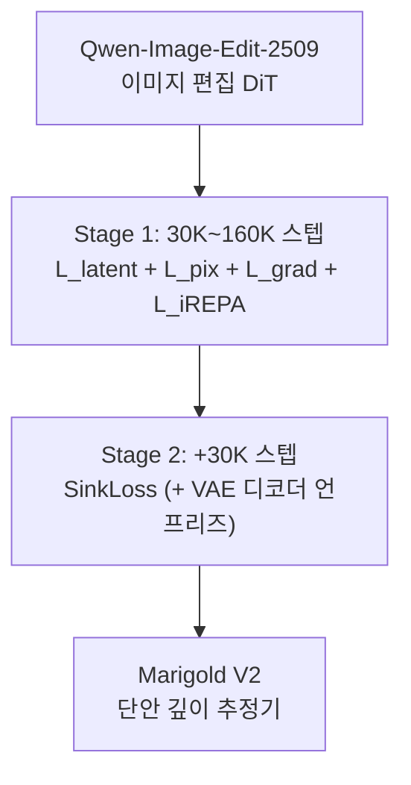

[논문 링크](https://arxiv.org/abs/2609.08084)
## Marigold V2: 이미지 편집 확산 트랜스포머(DiT)를 단안 깊이 추정기로 되살리기

## 한 줄 요약 (TL;DR)

Qwen-Image-Edit-2509라는 **이미지 편집용 확산 트랜스포머(DiT)**를 4-bit QLoRA로 파인튜닝해, **단일 32GB GPU에서 약 1주일 만에** 단안 깊이 추정 SOTA를 달성한 연구다. 핵심은 두 가지 새로운 손실 — 깊이 GT에서 뽑은 의미 특징과 정렬하는 **iREPA-depth**, 그리고 최적 수송(Sinkhorn) 기반의 **SinkLoss** — 이며, 털·잎사귀·머리카락 같은 미세 디테일까지 살리면서 비행 픽셀(flying pixel) 아티팩트를 억제한다.

## 핵심 아이디어

기존 확산 기반 깊이 추정기의 고질병은 두 가지다: (1) VAE를 쓰는 깊이 추정기가 **미세 디테일을 잃고 경계를 과도하게 부드럽게(over-smoothing)** 만드는 문제, (2) 얇고 투명한 물체에서 **잡음이 섞인 GT**가 존재해 픽셀 단위 손실로는 잘 맞출 수 없다는 문제다 (근거: §Introduction, §Related Work).

저자들의 해법은 "생성 모델을 값싸게 재활용한다"는 Marigold 패밀리의 철학을 DiT·이미지 편집 패러다임으로 확장하면서, 위 두 문제를 각각 공략하는 두 개의 손실을 얹는 것이다:

1. **iREPA-depth** — 표현 정렬(representation alignment)을 Stage 1에서 적용하되, RGB가 아니라 **GT 깊이 맵**에서 추출한 DINOv3 특징에 맞춘다 (근거: §Introduction).
2. **SinkLoss** — Stage 2에서 각 로컬 블록 내 깊이값의 **멀티셋(multiset)**을 최적 수송으로 맞추는 손실로, 공간 정렬을 강제하지 않아 잡음 GT를 피해가면서도 날카로운 경계를 만든다 (근거: §Method).

결과적으로 제안 모델은 KITTI/ETH3D에서 기존 최고 대비 **AbsRel 16–26% 개선**, ETH3D에서는 AbsRel **2.8**로 가장 강한 경쟁자(3.8)를 크게 앞선다 (근거: Abstract, Tab. depth comparison).

### 한눈에 보는 핵심 수치

| 항목 | 값 |
|---|---|
| 백본 | Qwen-Image-Edit-2509 (이미지 편집 DiT) |
| 파인튜닝 방식 | 4-bit 양자화 + QLoRA (rank-128 어댑터) |
| 추론 | 단일 스텝 (rectified flow, $t{=}0.5$ 고정) |
| 깊이 표현 | affine-invariant log-depth (2~98 백분위 클리핑) |
| 학습 데이터 | HyperSim(90%) + vKITTI(10%) ≈ 74K 이미지 |
| 학습 비용 | 단일 32GB GPU, Stage 1 160K 스텝 ≈ 5일 + Stage 2 30K 스텝 ≈ 1일 |
| 지연/메모리 (1024²) | 1.9 s / 16.9 GB |
| 지연/메모리 (2048²) | 9.6 s / 29.3 GB (경쟁 모델은 OOM) |
| ETH3D AbsRel | **2.8** (차상위 FE2E는 3.8) |

## 배경: 그들이 해결한 문제

단안 깊이 추정(monocular depth estimation)은 단일 RGB 이미지에서 픽셀별 깊이를 복원하는, 본질적으로 ill-posed 문제다. 하나의 2D 이미지는 무한히 많은 3D 장면 구성과 일치하기 때문에, 저수준 외관 단서를 넘어 장면 구조·재질·조명을 추론해야 한다 (근거: §Introduction).

저자들이 파악한 당시 최신 기술(SOTA)의 판도는 크게 두 갈래다 (근거: §Related Work):

- **판별(discriminative) 계열**: Depth Anything V2, MoGe, $\pi^3$ 등. 그러나 GT 깊이 데이터가 "백만(million) 규모"에 그쳐, 생성 모델이 가진 "십억(billion) 규모" 데이터에 크게 뒤진다는 구조적 한계가 있다. 또한 센서 노이즈와 비-램버시안·투명·반사 표면 처리의 약점을 그대로 물려받는다.
- **생성(generative) 계열**: Marigold로 대표되는, 확산 모델을 깊이 예측기로 재활용하는 접근. 그러나 (a) VAE 기반 깊이 추정기에서 **미세 디테일 손실·경계 과평활**, (b) DiT로 넘어오면서 재활용 비용이 급등(예: DICEPTION은 96 GPU-day, Lotus-2는 8 GPUs)하는 문제가 남아 있었다.

저자들이 뚫은 **연구 공백**은 명확하다: *"단일 스텝 VAE 기반 생성 프레임워크 안에서, 디테일 보존과 잡음·모호한 GT에 대한 견고한 지도(supervision)를 **동시에** 해결한 방법이 없다"* (근거: §Related Work). 기존 edge-aware loss, SharpDepth의 증류(distillation), InfiniDepth의 임의 해상도 쿼리, Lotus-2의 predictor–sharpener 구조는 모두 이 두 문제를 따로만 다뤘다.

**중심 가설**: *저자들은 이미지 편집 DiT를 값싼 QLoRA 파인튜닝으로 깊이 추정기에 재활용하고, GT-깊이 특징 정렬(iREPA-depth)과 Sinkhorn 매칭 손실(SinkLoss)을 적용함으로써, 단일 GPU·수일 학습만으로 디테일 손실과 잡음 GT라는 두 한계를 극복하는 SOTA 정확도를 달성할 수 있다고 가정한다.*

## 새로운 접근법: Marigold V2 (2-스테이지 파인튜닝 프로토콜)

Marigold V2의 레시피는 세 가지 신규 기여로 요약된다 (근거: §Introduction):

- **Marigold V2 프로토콜**: 이미지 편집 DiT를 깊이(및 기타 조밀 회귀) 추정기로 바꾸는 경량 파인튜닝. 4-bit 양자화 + QLoRA로 **소비자 GPU 1대 + 소규모 데이터 + 수일**이면 된다.
- **iREPA-depth**: 표현 정렬을 Stage 1에서 비관례적으로 적용. DINOv3 인코더를 **GT 깊이 맵**에 적용해 얻은 의미·기하 특징에 정렬시킨다.
- **SinkLoss**: Sinkhorn 매칭 기반의 새 목적 함수로, 경계 선명도를 높이면서 털·머리카락·얇은 구조물 같은 의미 디테일을 보존한다.

학습 파이프라인은 다음과 같다 (근거: §Method).

### 깊이 정규화 (log-depth)

먼저 메트릭 깊이 $D$를 affine-invariant한 정규화 로그 깊이 $d \in [-1,1]$로 변환한다:

$$d = 2\left( \frac{\log(D+\epsilon) - d_2}{d_{98} - d_2} - \frac{1}{2} \right)$$

여기서 $d_i$는 유효 픽셀에 대해 계산한 $\log(D+\epsilon)$의 $i$번째 백분위수, 즉 $d_2, d_{98}$는 각각 2%, 98% 분위수로 쓰여 견고한 클리핑을 한다. 이 표현은 단안 깊이의 전역 스케일·시프트 모호성을 제거하면서 상대적인 장면 기하를 보존한다. 이 정규화 깊이는 회색조 RGB 이미지로 복제되어(3채널 동일값) 이미지 편집 백본에 호환된다 (근거: §Method).

### 단일 스텝 rectified-flow 재활용

VAE 인코더 $\mathcal{E}_{vae}$, 디코더 $\mathcal{D}_{vae}$에 대해 RGB $I$와 깊이 $d$를 라텐트로 인코딩하고, 목표 속도(target velocity) $v = z_I - z_d$를 정의한 뒤, $t{=}0.5$로 고정된 DiT $f_\theta$가 이를 회귀하도록 학습한다:

$$\mathcal{L}_{\mathrm{latent}} = \left\| f_\theta(z_I, t) - v \right\|_2^2$$

$t$가 고정되므로 rectified-flow 파라미터화는 "적분할 궤적이 없는 직접 라텐트 회귀"로 축소된다. 추론 시 단일 순전파로 깊이 라텐트를 얻는다 (근거: §Method):

$$\hat{z}_d = z_I - f_\theta(z_I, t), \qquad \hat{d} = \mathcal{D}_{vae}(\hat{z}_d)$$

기존 확산 기반 깊이 방법이 주로 라텐트 공간에서만 지도했다면, 저자들은 여기에 픽셀 공간 손실 $L_1$ 재구성 $\mathcal{L}_{pix}$과 $L_1$ 공간 그래디언트 손실 $\mathcal{L}_{grad}$을 추가해 국소 재구성 품질을 높였다 (근거: §Method).

### Stage 1: iREPA-depth (의미 특징 정렬)

픽셀 손실만으로는 잎사귀·덤불·반복 패턴처럼 의미적으로 밀집한 영역의 미세 구조를 보존하지 못한다. 저자들은 DINOv3 인코더를 **GT 깊이 맵**에 적용해 얻은 특징에 DiT 내부 표현을 정렬하는 iREPA-depth 정규화를 도입했다. RGB에서 뽑은 특징보다 깊이 도메인 특징이 기하 재구성에 더 유용한 정보를 제공해 AbsRel·$\delta_1$ 모두 더 낫다 (근거: §Method, Tab. stage1 ablations). Stage 1 총 손실은:

$$\mathcal{L}_{\mathrm{DiT}} = \lambda_{\mathrm{latent}} \mathcal{L}_{\mathrm{latent}} + \lambda_{\mathrm{pix}} \mathcal{L}_{\mathrm{pix}} + \lambda_{\mathrm{grad}} \mathcal{L}_{\mathrm{grad}} + \lambda_{\mathrm{iREPA}} \mathcal{L}_{\mathrm{iREPA}}$$

### Stage 2: SinkLoss (최적 수송 기반 경계 정제)

얇고 투명한 물체는 GT 자체가 잡음투성이일 수 있다. HyperSim 같은 고품질 합성 데이터조차 V-Ray의 준-몬테카를로 샘플링 때문에 투명/경계 픽셀의 전경·배경 깊이 할당이 본질적으로 무작위다 (근거: §Method, Fig. hypersim). 픽셀 단위로 완벽히 맞추는 것은 불가능하고, 오히려 바람직하지도 않다 — 다운스트림 과제는 전경 객체 위에 일관된 깊이와 배경으로의 날카로운 전이를 원하기 때문이다.

이를 위해 SinkLoss는 이미지를 $K \times K$ 비중첩 블록으로 나누고, 각 블록 안에서 예측 깊이 $\{\hat{d}_i\}$와 GT 깊이 $\{d_j\}$ 사이의 비용 행렬 $C_{ij} = |\hat{d}_i - d_j|$를 만든 뒤, 엔트로피 정규화된 최적 수송으로 **소프트 일대일 할당**을 구한다:

$$\mathbf{M} = \arg\min_{\mathbf{M}\in\mathcal{U}}\; \langle \mathbf{M}, \tilde{\mathbf{C}} \rangle - \tau\, H(\mathbf{M})$$

여기서 $\mathcal{U}$는 균일 마지널(uniform marginal) $1/K^2$를 갖는 수송 폴리토프, $H(\mathbf{M})$는 섀넌 엔트로피, $\tilde{\mathbf{C}}$는 무효 픽셀을 큰 값 $B$로 페널티한 비용 행렬이다. $\mathbf{M}$은 Sinkhorn–Knopp 반복으로 구한다. 최종 손실은 유효 쌍에 대한 수송 비용의 가중 평균이다:

$$\mathcal{L}_{\mathrm{SinkLoss}} = \frac{\sum_{ij} m_i m_j\, M_{ij}\, C_{ij}}{\sum_{ij} m_i m_j\, M_{ij}}$$

저자들은 $K{=}5$, $\tau{=}0.1$, $B{=}10^6$, Sinkhorn 반복 5회를 사용했다 (근거: §Method).

## 작동 원리: 구체적인 예시로 살펴보기

### SinkLoss가 잡음 GT를 피해가는 이유 (장난감 예시)

$2 \times 2$ 블록($K{=}2$)에 얇은 난간 하나가 가로지른다고 하자. 정규화된 GT 깊이가 전경/배경 경계에서 섞여 다음과 같다고 가정한다:

- GT 깊이(픽셀 순서대로): $[0.2,\ 0.8,\ 0.8,\ 0.2]$
- 이상적 예측: $[0.25,\ 0.75,\ 0.75,\ 0.25]$ (깨끗한 경계)

**픽셀 단위 $L_1$** 이라면 모든 픽셀에서 $|0.25-0.2|$ 같은 잔차가 누적되고, 잡음 낀 GT를 재현하도록 모델이 끌려가 경계가 흐려진다. 반면 **SinkLoss**는 블록 내에서 "예측 값들의 집합"과 "GT 값들의 집합"이 순열(permutation)까지 같으면 된다는 조건만 건다. 위 예시에서 예측의 멀티셋 $\{0.25, 0.75, 0.75, 0.25\}$는 GT의 멀티셋 $\{0.2, 0.8, 0.8, 0.2\}$와 거의 같은 분포이므로, 최적 수송 비용은 공간 오정렬에 페널티를 주지 않고 아주 작아진다. 결과적으로 모델은 "잡음 낀 픽셀 위치를 정확히 맞추는 것"이 아니라 "깨끗한 전경/배경 깊이 분포"를 출력하도록 풀려나, 날카로운 경계를 만들면서도 비행 픽셀을 줄인다 (근거: §Method).

### log-depth가 AbsRel과 맞물리는 이유

저자들은 로그 깊이 표현이 최적임을 이론적으로 뒷받침한다. 상대 오차 $\epsilon = (x_{\mathrm{pred}} - x_{\mathrm{gt}})/x_{\mathrm{gt}}$가 작을 때, 로그 깊이 차이는 1차 근사에서 바로 상대 오차가 된다:

$$\log x_{\mathrm{pred}} - \log x_{\mathrm{gt}} = \log\!\left(1 + \frac{x_{\mathrm{pred}} - x_{\mathrm{gt}}}{x_{\mathrm{gt}}}\right) \approx \frac{x_{\mathrm{pred}} - x_{\mathrm{gt}}}{x_{\mathrm{gt}}} = \epsilon$$

즉 로그 깊이에 대한 $L_1$ 패널티는 1차 근사로 픽셀별 **AbsRel** 오차와 일치한다. 실제로 로그 깊이는 평균 AbsRel **4.72**로 선형 깊이(5.04)·역깊이(disparity, 5.28)보다 낫다 (근거: §Experiments, Tab. depth parameterization).

### '비밀 병기' 제거 실험 (Stage 1 어블레이션)

iREPA-depth가 얼마나 중요한지는 Stage 1 어블레이션에서 드러난다 (근거: Tab. stage1 ablations). 30K 스텝 통제 실험에서:

| 설정 | NYUv2 AbsRel↓ | ETH3D AbsRel↓ | DIODE AbsRel↓ |
|---|---|---|---|
| latent만 | 4.53 | 4.25 | 6.82 |
| + pix/grad | 4.70 | 4.32 | 6.22 |
| + iREPA-RGB | 4.50 | 3.64 | 5.72 |
| + iREPA-depth | **4.36** | **3.62** | **5.55** |

iREPA-depth가 모든 데이터셋에서 최고다. 흥미로운 점은 160K 스텝으로 늘리면 AbsRel·$\delta_1$ 격차가 좁혀진다는 것 — 즉 iREPA-depth의 정량 효과는 **수렴 가속(convergence acceleration)**에 상당 부분 기인하며, 장기 학습 시 정량 지표는 비슷해져도 정성적 품질 개선은 여전히 남는다 (근거: §Experiments).

## 성능 검증: 주요 결과

### 제로샷 단안 깊이 추정

평가 프로토콜은 Pixel-Perfect Depth(PPD)를 따르며, 예측을 GT 메트릭 깊이에 RANSAC으로 정렬한 뒤 AbsRel(↓)·$\delta_1$(↑)을 측정한다 (근거: §Experiments).

| 모델 | NYUv2 AbsRel↓ / δ₁↑ | KITTI AbsRel↓ / δ₁↑ | ETH3D AbsRel↓ / δ₁↑ | ScanNet AbsRel↓ / δ₁↑ | DIODE AbsRel↓ / δ₁↑ |
|---|---|---|---|---|---|
| **Marigold V2 (ours)** | **3.6 / 98.0** | **5.4 / 97.4** | **2.8 / 99.2** | **3.7 / 97.9** | **5.2 / 97.1** |
| FE2E | 3.8 / 97.6 | 6.5 / 96.0 | 3.8 / 98.7 | 4.3 / 97.1 | 5.6 / 96.4 |
| Lotus-2 | 3.7 / 97.6 | 6.7 / 94.1 | 4.1 / 98.6 | 4.0 / 97.2 | 6.5 / 95.5 |
| PPD (1024) | 4.1 / 97.7 | 7.0 / 95.5 | 4.3 / 98.0 | 4.6 / 97.2 | 6.8 / 95.9 |
| InfiniDepth | 4.3 / 97.6 | 8.7 / 92.3 | 6.1 / 95.4 | 4.7 / 96.9 | 6.4 / 95.8 |

Marigold V2는 **5개 데이터셋 전부에서 1위**를 기록했고, 특히 ETH3D에서는 AbsRel **2.8**로 가장 강한 베이스라인(3.8) 대비 약 26% 개선을 보인다 (근거: Tab. depth comparison). 주의할 점: 이 표에서 Depth Anything V2(62M), MoGe, $\pi^3$ 같은 5M+ 이미지로 학습한 대형 판별 모델들은 순위에서 제외된 참고(reference) 값이다 (근거: Tab. depth comparison 주석).

### 경계 품질(edge-aware) 평가

표준 정확도 지표 외에, 저자들은 HyperSim의 객체 경계에서 비행 픽셀 억제를 측정하는 Soft Edge Error(SEE$_k$)를 도입했다 (근거: §Experiments).

| 모델 | SEE₃↓ | SEE₅↓ | SEE₇↓ |
|---|---|---|---|
| **Marigold V2 (ours)** | **0.352** | **0.333** | **0.320** |
| PPD | 0.404 | 0.385 | 0.371 |
| InfiniDepth | 0.470 | 0.451 | 0.436 |

Marigold V2는 디테일 보존을 위해 특별히 설계된 PPD·InfiniDepth를 모든 SEE 지표에서 능가한다 (근거: Tab. SEE metrics).

### 지연시간·메모리 (단일 32GB GPU)

| 모델 | 1024² 지연(s) / 메모리(GB) | 2048² 지연(s) / 메모리(GB) |
|---|---|---|
| InfiniDepth | 0.2 / 1.9 | 1.2 / 3.4 |
| PPD | 1.4 / 5.6 | OOM |
| Lotus-2 | 8.9 / 26.1 | OOM |
| FE2E | 3.9 / 27.5 | OOM |
| **Marigold V2 (ours)** | **1.9 / 16.9** | **9.6 / 29.3** |

Marigold V2는 가장 빠르지는 않지만(InfiniDepth가 훨씬 빠르고 가볍다), 2048²에서도 **유일하게 동작**하며 해상도 확장성이 크게 낫다. QLoRA 양자화된 가중치와 단일 스텝 추론 덕에 반복 샘플링과 추가 입력 토큰이 필요 없다 (근거: Tab. latency comparison).

### 다른 조밀 회귀 과제로의 전이

동일한 레시피가 깊이를 넘어 다른 과제에도 SOTA를 달성했다 (근거: §Other Dense Regression Tasks):

- **메트릭 깊이 완성(depth completion)**: 얼어붙은 깊이 사전 위에 rank-16 LoRA(21.2M 파라미터) + 스케일·시프트 스칼라 2개를 테스트 타임에 100 Adam 스텝 적응. 고해상도 추론과 3×3 타일링을 더해 **4개 벤치마크 모두에서 최저 RMSE**를 기록 (근거: Tab. depth completion).
- **투시 깊이(see-through depth)**: 유리 뒤 기하를 예측하도록 LayeredDepth-Syn $l8$로 30K 스텝 파인튜닝해 AbsRel을 **13.7 → 8.2**, $\delta_1$을 **84.0 → 92.7**로 개선 (근거: Tab. see-through).
- **표면 노멀 추정**: NYUv2/ScanNet/iBims-1/Sintel에서 MeanErr·$11.25^\circ$ 기준 대체로 1~2위권 (근거: Tab. normals).
- **알베도 추정**: HyperSim에서 PSNR **20.78**로 기존 최고(19.28)를 앞서고 LPIPS도 **0.195**로 최고 (근거: Tab. albedo).

## 우리의 관점: 강점, 한계, 그리고 이 연구가 중요한 이유

### 강점

- **민주화된 비용**: 기존 DiT 재활용이 96 GPU-day(DICEPTION)나 8 GPUs(Lotus-2)를 요구한 반면, 이 방법은 **단일 32GB GPU + 약 1주일**이면 된다. "오픈 생성 모델에서 수일 만에 SOTA 지각 모델을 증류할 수 있다"는 메시지가 실용적으로 설득력 있다 (근거: §Related Work, §Conclusion).
- **문제 지향적 손실 설계**: iREPA-depth와 SinkLoss는 각각 "디테일 손실"과 "잡음 GT"라는 서로 다른 실패 모드를 정확히 겨냥한다. 특히 SinkLoss의 "블록 내 순열 불변" 아이디어는 잡음/모호한 GT 문제에 우아하고 원리적인 해법이다.
- **전이성 입증**: 동일 손실이 Stable Diffusion V1.5, FLUX.2 klein 같은 다른 백본에서도 SEE를 일관되게 개선해, 이득이 "Qwen 백본의 우연"이 아니라 레시피 자체에서 나온다는 것을 보여준다 (근거: Tab. backbone transfer).
- **광범위한 일반화**: 깊이·완성·투시 깊이·노멀·알베도에 걸쳐 한 레시피가 통한다는 것은 조밀 회귀 전반에 적용 가능한 일반 원리임을 시사한다.

### 한계

- **실시간 불가**: 큰 이미지 편집 백본은 실시간 사용을 배제한다. 저자 스스로 이를 명시적으로 인정한다 (근거: §Conclusion). 1024²에서 1.9초는 로보틱스 같은 저지연 응용에는 버겁다.
- **정량 지표에서의 격차 축소**: iREPA-depth의 정량 이점은 160K 스텝으로 가면 줄어들어, 그 가치의 상당 부분이 "수렴 가속"에 있다. 장기 학습이 가능한 자원이 있다면 iREPA의 정량적 정당화는 약해진다 (근거: §Experiments).
- **잠재적 한계**: 반사·모션 블러·디포커스 영역의 모호성은 여전히 남으며, 저자들도 불확실성 인식(uncertainty-aware)이나 다층(multi-layer) 확장을 미래 과제로 언급한다 (근거: §Conclusion). 또한 SinkLoss의 블록 크기 $K{=}5$ 같은 하이퍼파라미터가 해상도·장면에 따라 얼마나 견고한지, 그리고 "집합만 맞추면 된다"는 완화가 극단적인 경우 형상을 뒤틀 위험은 없는지 추가 검증이 필요해 보인다.

### 이 연구가 중요한 이유

이 논문의 진짜 기여는 특정 수치보다 **"생성 기반 사전 지식을 값싸게 조밀 회귀로 옮기는 방법론"**을 보여줬다는 데 있다. 단일 GPU로 SOTA 지각 모델을 만들 수 있다는 사실은, 대규모 판별 모델의 데이터 장벽에 막힌 개인 연구자·소규모 랩에게 대안적 진입 경로를 제시한다.

## 다음 단계는?: 앞으로의 길

저자들이 제안하는 방향은 불확실성 인식과 다층(multi-layer) 확장이다 (근거: §Conclusion). 한계에 비추어 합리적인 다음 단계를 덧붙이자면:

1. **경량화**: DiT 백본을 지식 증류로 소형 판별 백본에 옮겨 실시간 성능을 확보하는 방향. SinkLoss의 "경계 선명도" 신호를 증류 목표로 쓸 수 있다.
2. **불확실성/다중 해상도**: 얇은 구조물·반사 영역의 모호성을 확률적으로 모델링해 다운스트림(신규 시점 합성, 3D 재구성)에 유용한 신뢰도 맵을 제공.
3. **SinkLoss의 확장**: 블록 크기·타일링 전략을 해상도에 적응적으로 만들고, 노멀·알베도 외 다른 조밀 회귀(옵티컬 플로우, 세그멘테이션)로의 전이를 체계화.
4. **비용·재현성 공개**: 단일 GPU 레시피의 핵심 강점인 재현성을 최대화하기 위해, 하이퍼파라미터·시드·데이터 필터링 규칙의 완전한 공개가 후속 연구의 진입 장벽을 낮출 것이다.

---

### 재현 체크리스트 (요약)

- [ ] 코드/커밋/라이선스: 공식 웹사이트 및 오픈소스 공개 여부 확인 (`hf.co/spaces/huawei-bayerlab/marigold-v2-web`)
- [ ] 백본: Qwen-Image-Edit-2509 + 4-bit QLoRA (rank-128)
- [ ] 데이터: HyperSim(90%, 768×512) + vKITTI(10%, 1216×352), 무효 픽셀 >0.1% 필터링
- [ ] 하이퍼파라미터: batch size 1, gradient clipping, $\lambda_{latent}{=}1.0,\ \lambda_{pix}{=}1.0,\ \lambda_{grad}{=}5.0,\ \lambda_{iREPA}{=}0.2$; Stage 2 $\lambda_{SinkLoss}{=}1.0$
- [ ] SinkLoss: $K{=}5,\ \tau{=}0.1,\ B{=}10^6$, Sinkhorn 5회
- [ ] 평가: PPD 프로토콜(RANSAC 정렬), ETH3D는 1008×672 입력 후 2048×1360으로 업샘플

<!-- verbatim-tables -->

## 논문 원문의 표

> arXiv e-print 의 LaTeX 원본에서 기계적으로 옮긴 표입니다. 숫자는 논문의 값이며 모델을 거치지 않았습니다.

**표 1. **Comparison of zero-shot affine-invariant monocular depth estimators on NYUv2, KITTI, ETH3D, ScanNet, and DIODE.** We report AbsRel ($\downarrow$) and $\delta_1$ ($\uparrow$). **Bold** indicates the best result and underlining the second-best result for each metric. Methods trained on more than 5M images are given in **gray** for reference and are excluded from ranking. Results for InfiniDepth, Lotus-2, FE2E, and our method are reproduced under the same evaluation protocol, while the remaining results are taken from the PPD paper. $^†ger$$\pi^3$ includes ScanNet in its training data; its ScanNet results are therefore not zero-shot.**

| Method | Training Data $\downarrow$ | NYUv2 AbsRel $\downarrow$ | NYUv2 $\delta_1$ $\uparrow$ | KITTI AbsRel $\downarrow$ | KITTI $\delta_1$ $\uparrow$ | ETH3D AbsRel $\downarrow$ | ETH3D $\delta_1$ $\uparrow$ | ScanNet AbsRel $\downarrow$ | ScanNet $\delta_1$ $\uparrow$ | DIODE AbsRel $\downarrow$ | DIODE $\delta_1$ $\uparrow$ |
|---|---|---|---|---|---|---|---|---|---|---|---|
| **Omnidata** (ICCV 2021) | 12.2M | 7.4 | 94.5 | 14.9 | 83.5 | 16.6 | 77.8 | 7.5 | 93.6 | - | - |
| **DepthAnything\ V2** (62M) (NeurIPS 2024) | 62.6M | 4.5 | 97.9 | 7.4 | 94.6 | 13.1 | 86.5 | 6.5 | 97.2 | 6.6 | 95.2 |
| **MoGe** (CVPR 2025) | 9M | 3.1 | 98.3 | 7.2 | 95.1 | 10.0 | 89.6 | 3.3 | 98.3 | 29.0 | 70.0 |
| **MoGe-2** (NeurIPS 2025) | 8.9M | 3.1 | 98.4 | 6.9 | 89.9 | 5.0 | 96.2 | 3.1 | 98.3 | 9.6 | 84.5 |
| **$\pi^3$**$^\dagger$ (ICLR 2026) | >9M | 2.9 | 98.7 | 5.9 | 96.7 | 2.9 | 98.9 | 2.1$^\dagger$ | 99.1$^\dagger$ | 4.4 | 96.8 |
| **DiverseDepth** (arXiv 2020) | 320K | 11.7 | 87.5 | 19.0 | 70.4 | 22.8 | 69.4 | 10.9 | 88.2 | - | - |
| **MiDaS** (TPAMI 2022) | 2M | 11.1 | 88.5 | 23.6 | 63.0 | 18.4 | 75.2 | 12.1 | 84.6 | - | - |
| **LeReS** (CVPR 2021) | 354K | 9.0 | 91.6 | 14.9 | 78.4 | 17.1 | 77.7 | 9.1 | 91.7 | - | - |
| **DPT** (ICCV 2021) | 1.4M | 9.8 | 90.3 | 10.0 | 90.1 | 7.8 | 94.6 | 8.2 | 93.4 | - | - |
| **HDN** (NeurIPS 2022) | 300K | 6.9 | 94.8 | 11.5 | 86.7 | 12.1 | 83.3 | 8.0 | 93.9 | - | - |
| **DepthAnything\ V2 (54K)** (NeurIPS 2024) | 54K | 5.4 | 97.2 | 8.6 | 92.8 | 12.3 | 88.4 | - | - | 8.8 | 93.7 |
| **Marigold Depth V1** (CVPR 2024) | 74K | 5.5 | 96.4 | 9.9 | 91.6 | 6.5 | 96.0 | 6.4 | 95.1 | 10.0 | 90.7 |
| **GeoWizard** (ECCV 2024) | 280K | 5.2 | 96.6 | 9.7 | 92.1 | 6.4 | 96.1 | 6.1 | 95.3 | 12.0 | 89.8 |
| **DepthFM** (AAAI 2025) | 63K | 5.5 | 96.3 | 8.9 | 91.3 | 5.8 | 96.2 | 6.3 | 95.4 | - | - |
| **GenPercept** (ICLR 2025) | 90K | 5.2 | 96.6 | 9.4 | 92.3 | 6.6 | 95.7 | 5.6 | 96.5 | - | - |
| **Lotus** (ICLR 2025) | 59K | 5.4 | 96.8 | 8.5 | 92.2 | 5.9 | 97.0 | 5.9 | 95.7 | 9.8 | 92.4 |
| **Lotus-2** (arXiv 2025) | 59K | 3.7 | 97.6 | 6.7 | 94.1 | 4.1 | 98.6 | 4.0 | 97.2 | 6.5 | 95.5 |
| **PPD (512)** (NeurIPS 2025) | 54K | 4.3 | 97.4 | 8.0 | 93.1 | 4.5 | 97.7 | 4.5 | 97.3 | 7.0 | 95.5 |
| **PPD (1024)** (NeurIPS 2025) | 125K | 4.1 | 97.7 | 7.0 | 95.5 | 4.3 | 98.0 | 4.6 | 97.2 | 6.8 | 95.9 |
| **InfiniDepth** (CVPR 2026) | 3.1M | 4.3 | 97.6 | 8.7 | 92.3 | 6.1 | 95.4 | 4.7 | 96.9 | 6.4 | 95.8 |
| **DepthMaster** (TCSVT 2026) | 74K | 4.8 | 97.0 | 9.1 | 91.1 | 5.4 | 97.4 | 5.8 | 95.6 | 8.0 | 94.3 |
| **FE2E** (CVPR 2026) | 71K | 3.8 | 97.6 | 6.5 | 96.0 | 3.8 | 98.7 | 4.3 | 97.1 | 5.6 | 96.4 |
| **Marigold V2\xspace (depth, ours)** | 74K | **3.6** | **98.0** | **5.4** | **97.4** | **2.8** | **99.2** | **3.7** | **97.9** | **5.2** | **97.1** |

**표 2. **Edge-aware evaluation of affine-invariant monocular depth estimators on the HyperSim test set.** We report SEE3, SEE5 and SEE7 ($\downarrow$). **Bold** indicates the best result and underlining the second-best result for each metric, determined from unrounded values.**

| Method | SEE3 $(\downarrow)$ | SEE5 $(\downarrow)$ | SEE7 $(\downarrow)$ |
|---|---|---|---|
| **PPD** (NeurIPS 2025) | 0.404 | 0.385 | 0.371 |
| **InfiniDepth** (CVPR 2026) | 0.470 | 0.451 | 0.436 |
| \bf Marigold V2\xspace (depth, ours) | **0.352** | **0.333** | **0.320** |

**표 3. **Ablation study on Stage 1.** AbsRel and $\delta_1$ comparison across datasets using different Stage 1 loss configurations.**

| $\mathcal{L}_{\mathrm{latent}}$ | $\mathcal{L}_{\mathrm{pix}}$ $\mathcal{L}_{\mathrm{grad}}$ | $\mathcal{L}_{\mathrm{iREPA}}^{\mathrm{rgb}}$ | $\mathcal{L}_{\mathrm{iREPA}}^{\mathrm{depth}}$ | NYUv2 AbsRel $\downarrow$ | NYUv2 $\delta_1$ $\uparrow$ | KITTI AbsRel $\downarrow$ | KITTI $\delta_1$ $\uparrow$ | ETH3D AbsRel $\downarrow$ | ETH3D $\delta_1$ $\uparrow$ | ScanNet AbsRel $\downarrow$ | ScanNet $\delta_1$ $\uparrow$ | DIODE AbsRel $\downarrow$ | DIODE $\delta_1$ $\uparrow$ |
|---|---|---|---|---|---|---|---|---|---|---|---|---|---|
| *Stage 1 ablations, 30K training steps* |  |  |  |  |  |  |  |  |  |  |  |  |  |
| ✓ | ✗ | ✗ | ✗ | 4.53 | 97.60 | 7.26 | 94.94 | 4.25 | 98.25 | 4.59 | 97.41 | 6.82 | 95.81 |
| ✓ | ✓ | ✗ | ✗ | 4.70 | 97.90 | 7.84 | 95.62 | 4.32 | 98.69 | 4.50 | **97.91** | 6.22 | 96.01 |
| ✓ | ✓ | ✓ | ✗ | 4.50 | 97.81 | 6.89 | 96.22 | 3.64 | 98.86 | 4.38 | 97.65 | 5.72 | 96.54 |
| ✓ | ✓ | ✗ | ✓ | **4.36** | **98.01** | **6.72** | **96.38** | **3.62** | **98.90** | **4.22** | **97.91** | **5.55** | **96.82** |
| grayblack *Stage 1, 160K training steps* |  |  |  |  |  |  |  |  |  |  |  |  |  |
| ✓ | ✓ | ✗ | ✗ | **3.62** | 98.01 | **5.27** | 97.39 | 2.84 | 99.08 | 3.84 | **97.88** | 5.16 | **97.07** |
| ✓ | ✓ | ✗ | ✓ | 3.68 | **98.03** | 5.30 | **97.43** | **2.68** | **99.18** | **3.81** | 97.82 | **5.02** | 97.02 |

**표 4. **Impact of depth parameterizations.** Average AbsRel and $\delta_1$ across test sets under a common training and evaluation configuration.**

| Representation | AbsRel $\downarrow$ | $\delta_1$ $\uparrow$ |
|---|---|---|
| Linear Depth | 5.04 | 97.10 |
| Disparity | 5.28 | 97.15 |
| Log Depth | **4.72** | **97.71** |

**표 5. **SinkLoss with other diffusion backbones.** SinkLoss transfers to Stable Diffusion and FLUX.2. AbsRel is averaged across five test datasets, while Soft Edge Error (SEE) metrics are computed on the HyperSim test set.**

| Model | $\mathcal{L}_\mathrm{SinkLoss}$ | AbsRel $\downarrow$ | SEE$_3$ $\downarrow$ | SEE$_5$ $\downarrow$ | SEE$_7$ $\downarrow$ |
|---|---|---|---|---|---|
| **Stable Diffusion V1.5** | ✗ | 7.51 | 0.553 | 0.531 | 0.514 |
|  | ✓ | **7.12** | **0.485** | **0.464** | **0.449** |
| grayblack **FLUX.2 klein** | ✗ | 4.88 | 0.491 | 0.472 | 0.457 |
|  | ✓ | **4.82** | **0.377** | **0.359** | **0.345** |
| grayblack **Qwen-Image-Edit-2509** | ✗ | **4.10** | 0.449 | 0.429 | 0.414 |
|  | ✓ | 4.12 | **0.352** | **0.333** | **0.320** |

**표 6. **Latency and memory benchmarks.** Comparison between different models across resolutions on a single 32GB GPU.**

| Model | $1024 \times 1024$ Lat. (s) | $1024 \times 1024$ Mem. (GB) | $2048 \times 2048$ Lat. (s) | $2048 \times 2048$ Mem. (GB) |
|---|---|---|---|---|
| **InfiniDepth** (CVPR 2026) | 0.2 | 1.9 | 1.2 | 3.4 |
| **PPD** (NeurIPS 2025) | 1.4 | 5.6 | OOM | OOM |
| **Lotus-2** (w/o sharpener) | 1.1 | 26.1 | OOM | OOM |
| **Lotus-2** (arXiv 2025) | 8.9 | 26.1 | OOM | OOM |
| **FE2E** (CVPR 2026) | 3.9 | 27.5 | OOM | OOM |
| **Marigold V2\xspace (depth, ours)** | 1.9 | 16.9 | 9.6 | 29.3 |

**표 7. **Zero-shot metric depth completion evaluation** using the sparse-guidance protocol of Marigold-DC at native ground-truth resolution. NYUv2 and iBims are evaluated on their full evaluation sets; KITTI-DC and DDAD use evenly-sampled subsets ($n{=}150$). **Bold** indicates the best result and underlining the second-best result for each metric.**

| Method | iBims-1 MAE | iBims-1 RMSE | iBims-1 AbsRel | iBims-1 $\delta_1$ | NYUv2 MAE | NYUv2 RMSE | NYUv2 AbsRel | NYUv2 $\delta_1$ | KITTI-DC ($n{=}150$) MAE | KITTI-DC ($n{=}150$) RMSE | KITTI-DC ($n{=}150$) AbsRel | KITTI-DC ($n{=}150$) $\delta_1$ | DDAD ($n{=}150$) MAE | DDAD ($n{=}150$) RMSE | DDAD ($n{=}150$) AbsRel | DDAD ($n{=}150$) $\delta_1$ |
|---|---|---|---|---|---|---|---|---|---|---|---|---|---|---|---|---|
| **Marigold-DC** (ICCV 2025) | 0.059 | 0.189 | 0.016 | 0.989 | 0.061 | 0.152 | 0.021 | 0.987 | 0.598 | 1.729 | 0.034 | 0.989 | 3.247 | 8.236 | 0.120 | 0.884 |
| **Marigold-SSD** (CVPRW 2026) | 0.060 | 0.185 | 0.016 | 0.990 | 0.069 | 0.162 | 0.025 | 0.986 | 0.456 | 1.527 | 0.026 | 0.992 | 2.080 | 6.585 | 0.072 | 0.949 |
| **CAPA** (arXiv 2026) | **0.030** | 0.135 | **0.008** | 0.994 | **0.044** | 0.117 | **0.015** | 0.992 | 0.341 | 1.382 | 0.016 | **0.994** | 1.294 | 6.007 | 0.032 | 0.978 |
| **LDCM** (ICLR 2026) | 0.038 | 0.152 | 0.010 | 0.993 | 0.048 | 0.126 | 0.016 | 0.991 | 0.324 | 1.452 | **0.015** | 0.993 | **1.097** | 6.012 | **0.022** | **0.981** |
| **Marigold V2\xspace (test-time LoRA, ours)** | 0.042 | 0.160 | 0.012 | 0.993 | 0.045 | 0.112 | **0.015** | 0.993 | 0.349 | 1.472 | 0.017 | **0.994** | 1.549 | 6.242 | 0.046 | 0.972 |
| **+ high-resolution inference** | 0.034 | 0.127 | 0.010 | **0.995** | **0.044** | **0.110** | **0.015** | **0.994** | 0.340 | 1.397 | 0.017 | **0.994** | 1.465 | 6.072 | 0.043 | 0.974 |
| **+ tiled local adaptation** | **0.030** | **0.122** | 0.009 | **0.995** | **0.044** | **0.110** | **0.015** | **0.994** | **0.318** | **1.333** | 0.016 | **0.994** | 1.226 | **5.323** | 0.038 | 0.976 |

**표 8. **See-Through depth estimation.** Evaluation on the full LayeredDepth-Syn $l8$ validation set.**

| Checkpoint | AbsRel $\downarrow$ | $\delta_1$ $\uparrow$ |
|---|---|---|
| Marigold V2\xspace (depth, ours) | 13.66 | 83.96 |
| Marigold V2\xspace (see-through depth, ours) | **8.17** | **92.65** |
