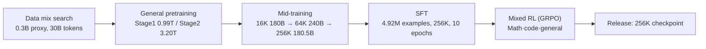

[Paper](https://arxiv.org/abs/2609.13356)
## ZGCM-1: How a 7B Dense Model Trades Blows with 235B Frontiers — A Fully Open, Ultra-Efficient Foundation Model Design Report

**TL;DR** — With a single 7.39B dense model, ZGCM-1 scores 75.0% on AIME 2026, 63.1% on WebWalkerQA, and 62.0% on Binary Function Search, breaking the conventional wisdom that "frontier reasoning is the exclusive province of tens of billions of parameters." The secret is not inflating parameters but a fully open recipe built on **a hybrid architecture of gated sliding-window attention + global attention** that cuts the KV cache by 6.4×, **FP8 + Muon + TWEO** that shortens pretraining by roughly 4.2×, and **MDP mid-training** that learns 256K long contexts.

---

## Core Idea

The paper's central claim can be summed up in a single sentence.

> **A compact model is inherently bound by its static parameter capacity, but it can transcend that limit through the dual engine of "deliberate internal thinking" and "active external seeking."**

In other words, a 7B model cannot memorize the entire web. Instead, it **reasons through long chains of thought and, when needed, directly invokes web, terminal, and binary-analysis tools to close the knowledge gap** (source: §Introduction). The problem is that this paradigm demands **ultra-long contexts of 256K** and **agentic multi-turn interactions**, which on their own are costs that academic compute budgets can hardly afford. So the authors build an **efficient, fully open, full-stack recipe** that binds model design, systems, algorithms, and data together in one package.

The two barriers the authors identify are as follows (source: §Introduction):

- **Scale Barrier** — Frontier-grade reasoning and deep agentic search have been seen as the preserve of multi-billion-parameter systems, excluding researchers with limited compute from training and exploration themselves.
- **Opacity Barrier** — Most competing models are released not as *fully open source* but only as *open weights*. Upstream filtering recipes, mid-training curricula, long-context schedules, and multi-turn agent traces all remain black boxes, making it impossible to systematically study learning dynamics and capacity limits.

ZGCM-1 attacks both barriers at once. Instead of inflating parameters, it boosts efficiency through the **co-design of architecture, precision, optimizer, and data curriculum**, and it opens up reproducibility by releasing **weights, checkpoints, code, data recipes, and even W&B logs** (source: §Abstract).

---

## Background: The Problem They Set Out to Solve

The reasoning abilities of frontier models are surging year after year. But most of those gains are concentrated in models with **tens to hundreds of billions of parameters** and **closed training recipes** (source: §Introduction). An academic researcher who wants to dig into "where does this ability come from" runs into two walls.

1. **No compute.** Training a 100B-class model from scratch and running inference at 256K context push KV-cache memory and throughput to grow geometrically.
2. **No recipe.** Even if you get the weights of an open-weight model, without knowing which data was fed, in what order, and with what hyperparameters, you cannot answer the question "would this also work at 7B?"

The paper's starting point is simple: **"If, even at 7B scale, we can match models tens of times larger on math, code, and agentic search, then let's release the entire methodology."** To that end, the authors designed the whole pipeline from architecture to data governance themselves and organized the **8 empirical findings** gained along the way into boxes scattered throughout the paper. These findings are effectively the paper's "hidden treasure."

---

## New Approach: Hybrid Attention + an Efficient Full-Stack Recipe

ZGCM-1's methodology splits into four main axes.

### 1) Architecture–System Co-Design — Gated Hybrid Attention + FP8 Muon

The model is a decoder-only Transformer using GQA, RMSNorm, SwiGLU, and RoPE. The core is a **5:1 hybrid backbone: 27 of the 32 layers use gated sliding-window attention (SWA, window size 128) and 5 use global attention** (source: §Architecture). Global layers are placed at layers 6, 12, 18, 24, and 30, giving a structure where a "5 local layers + 1 global layer" block repeats five times, followed by 2 local layers. QK normalization and Partial RoPE (rotation ratio 0.33) are added on top.

The experiment that settled this architecture's value is unambiguous. Training and comparing attention configurations on 10B tokens, **SWA 5:1 achieved the highest throughput at 9,566 tokens/s/GPU while matching full attention's loss (1.93)**. MLA dropped to 7,645 tokens/s/GPU with no loss improvement (source: Fig. architecture-experiments). As context grows from 4K to 256K, SWA 5:1's throughput advantage widens from **1.13× to 3.94×**, because longer contexts make full attention the bottleneck.

For training efficiency, the authors combined the **Muon optimizer + hybrid FP8 (E4M3 forward, E5M2 backward) + TWEO outlier normalization** (source: §Pre-Training). TWEO is the key mechanism that suppresses activation outliers to prevent numeric divergence in FP8 training, sustaining roughly 585 TFLOP/s/GPU on the 16K production run — about 60% BF16-equivalent MFU relative to the H100 BF16 peak (989 TFLOP/s).

### 2) Progressive Curriculum + MDP Mid-Training

Pretraining splits into **general pretraining (Stage 1: 0.99T tokens → Stage 2: 3.20T tokens)** and **mid-training (600.51B tokens)** (source: §Pre-Training). Mid-training progressively extends the context through **16K (180B) → 64K (240B) → 256K (180.51B)**, with each stage continuing to replay the previous stage's shorter sequences. The key idea here is **reconstructing interaction traces as state–action pairs of a Markov decision process (MDP)**, feeding both full-trajectory context and dense, step-by-step supervision of local decisions at the same time.

### 3) Execution–Verification Alignment + Mixed SFT

Post-training follows **SFT → mixed RL (GRPO)**. The SFT corpus contains 4,921,933 examples (96.46% general + 3.54% agentic), where **think (exposing the reasoning chain) and no-think (direct answers) examples are intentionally mixed** so that a single set of weights can dynamically toggle between "full thinking" and "direct answers" depending on the instruction (source: §Post-Training). RL combines GRPO with domain-specific rewards — binary correctness for math, test-pass rate for code — plus a length penalty.

### 4) AI-Native R&D

An **agent swarm commanded by researchers** ran the entire model-development lifecycle. Agents autonomously executed everything from data cleaning and cluster management to evaluation; in particular, **Atomic Capability Evaluation (ACE)** — a diagnostic benchmark organizing 2,503 probes into 18 categories and 183 atomic capabilities — finishes in just 2–3 minutes, rapidly localizing capability regressions on every ablation (source: §AI-Native R&D).

The full training recipe as a flow is as follows.

---

## How It Works: A Closer Look with Concrete Examples

### How Gated SWA Behaves

Given a normalized hidden state $h$, the gated SWA module computes the query, key, value, and gate projections in parallel. RMS normalization and Partial RoPE are applied to the query and key, and with $A_{\mathrm{SWA}}(q,k,v)$ denoting the GQA output within the 128-token window, the final output is as follows (source: §Architecture):

$$ \operatorname{GatedSWA}(h) = o_{\mathrm{proj}}\left( A_{\mathrm{SWA}}(q,k,v) \odot \sigma(g_{\mathrm{proj}}(h)) \right) $$

That is, **a learned sigmoid gate $\sigma(\cdot)$ modulates the local attention output element-wise** before the output projection. Global layers skip this gate and attend over the entire context. The gate learns to decide whether a token is sufficiently served by local information alone or should be suppressed.

**Let's understand this with a small example.** Suppose a mini SWA with window size 4 and the token sequence `["cat", "sat", "on", "the"]`. The local attention for the 4th token `the` sees only 4 tokens including itself. If this output vector is $[2.0,\ -0.5,\ 1.1]$, the gate $\sigma(g)$ multiplies by $[0.9,\ 0.1,\ 0.6]$, keeping the first and third dimensions while nearly removing the second. Unnecessary local signals are thereby filtered out, and when information beyond the window is needed, the global layers spaced 5 layers apart fill the gap.

### Why the KV Cache Shrinks by 6.4×

Autoregressive decoding is bound by memory bandwidth, so the KV-cache size directly determines throughput. The per-token KV bytes under GQA are roughly

$$ \text{KV-Cache(GB)} \approx \frac{2 \cdot L \cdot H \cdot d_\text{head} \cdot \text{seq} \cdot \text{batch} \cdot \text{bytes/elt}}{10^9} $$

where $L$ is the number of layers, $H$ is the number of KV heads (8), $d_\text{head}$ is the head dimension (128), and `bytes/elt` is 2 since it is bf16.

- **Full attention (32 global layers)**: every layer stores the full sequence, so per-token $2 \times 32 \times 8 \times 128 \times 2 = 131{,}072$ bytes = **128 KiB**.
- **Hybrid (5 global + 27 SWA)**: only the 5 global layers store the full sequence; SWA layers retain just the 128-token window. Per-token $2 \times 5 \times 8 \times 128 \times 2 = 20{,}480$ bytes = **20 KiB**.

At 256K (262,144 tokens), the former is 32.0 GiB and the latter is 5.0 GiB. **The 6.4× reduction** comes from here (source: Fig. architecture-experiments). Because the cache of fixed-window SWA layers is a constant independent of sequence length, the gap widens with longer contexts.

### The MDP Mid-Training Reconstruction

An agentic trace is usually a long trajectory like `user question → agent thought → tool call → observation → …`. Training on it as-is leaves supervision of intermediate decisions sparse. The authors reconstruct this trajectory into state–action transitions of the form **(state = preceding context, action = next token/tool call)**, densely supervising, step by step, why a given action is right in the current state (source: §Pre-Training). Thanks to this, once 256K long-context ability is built at the base (mid-training), a later SFT can elicit it from medium-length data alone — this is the core of **Finding 7**.

---

## Performance Verification: Key Results

### #1 at 7B Scale, Competitive with Frontiers

On the average of 14 reasoning benchmarks, ZGCM-1-7B ranks first among 7B–8B scale models (source: Fig. homepage-evaluation-overview). Key numbers follow (source: Tab. posttraining-thinking-7b-comparison).

| Benchmark | ZGCM-1-7B | Best competitor (7B-class) | Notes |
|---|---:|---:|---|
| MATH-500 | **97.13** | 96.32 | Best |
| AIME 2026 | **75.00** | 71.67 | Best |
| HMMT 2025 | **70.42** | 61.50 | Best |
| HMMT 2026 | **59.48** | 51.52 | Best |
| AGIEval SAT Math | **99.09** | 99.09 | Joint best |
| HumanEval+ | **90.24** | 89.90 | Best |
| MMLU | 73.88 | 85.40 (Qwen3-8B) | Lower |
| GPQA-Diamond | 47.87 | 60.10 | Lower |
| IFEval | 75.42 | 88.20 | Lower |

The pattern is stark: **a commanding lead on math, reasoning, and code, but on pure knowledge (MMLU, GPQA) and instruction following (IFEval), the parameter limits of a dense 7B show up plainly.** This aligns exactly with the "limit of static parameter capacity" the authors themselves concede.

### Agentic Search: On Par with a Model 32× Larger

On web-based deep research, ZGCM-1-7B reaches **WebWalkerQA 63.09%**, on par with Kimi-K2 (63.00%) and above the 235B-class Qwen3-235B-A22B (59.60%). **BrowseComp 19.43%** far surpasses GPT-4o (1.9%), DeepSeek-R1 (2.0%), and Qwen3-235B-A22B (2.3%) (source: Tab. posttraining-agentic-comparison). GAIA text-only sits at 42.52%.

Binary Function Search is even more striking. Given a stripped ELF binary and only a behavioral description, the model must locate the exact entry address of a target function; ZGCM-1-7B scores **62.00%**, approaching GLM-5.1 (66.00%) and beating DeepSeek-R1 (36.00%) and GPT-4o (18.00%) by a wide margin. Same-scale Qwen3-8B manages just 12.00% (source: Tab. binary-search).

### Efficiency: The Power of a 4.2× Product

The 16K pretraining time-to-loss speedup decomposes into a product of four factors (source: §Pre-Training).

$$ 1.4\times \text{(SWA)} \times 1.5\times \text{(FP8 system)} \times 1.8\times \text{(Muon)} \times 1.1\times \text{(Pre-LN)} \approx 4.2\times $$

The fact that this is not a single factor but the **cumulative effect of architecture, precision, optimizer, and normalization** speaks to the paper's system-design philosophy.

---

## Our Perspective: Strengths, Limitations, and Why This Work Matters

### Strengths

- **Honest benchmarking.** In 7B-class comparisons it shows SOTA, and it lays even its shortcomings in knowledge and instruction following plainly on the table. The stance of explicitly stating that the claim of "competing with models tens of times larger" holds only along the specific axis of agentic search earns trust.
- **Quantified efficiency.** 4.2× is presented not as a bare claim but as the decomposition $1.4\times 1.5\times 1.8\times 1.1$, letting each factor's contribution be independently verified and reproduced.
- **Fully open.** Beyond weights, staged checkpoints, code, data recipes, and logs are all public, effectively tearing down the "opacity barrier."
- **The 8 findings** are the paper's greatest asset. In particular, "quality over quantity in SFT" (Finding 4), "non-monotonic utility of long CoT" (Finding 5), and "long-context mid-training bypasses ultra-long SFT" (Finding 7) are practical knowledge other teams can adopt directly.

### Limitations

- **The parameter-capacity wall.** The deficit on closed (recall) knowledge tasks is structural. MMLU 73.88 and GPQA 47.87 trail even Qwen3-8B (85.40, 59.09). There is a distinction between gaps that thinking and search can close and those they cannot.
- **Instruction following vs. reasoning verbosity.** Strong reasoning supervision can hurt strict instruction following like IFEval (IFEval 75.42). The authors say calibration mitigates it, but the tradeoff in real use remains.
- **General SWE/terminal agency is immature.** Completion rates on unstructured long-horizon tasks like SWE-bench Verified and Terminal-Bench 2.0 are still low. The strengths concentrate in "structured" agentic environments (web research, binary analysis).
- **Environment/protocol fragility.** It depends on schema alignment and stable feedback, so it is vulnerable to observation noise and tool-format drift.

### Why It Matters

The paper's real significance is not the headline "a 7B beat the frontier." It lies in **"certain advanced capabilities are reachable without hundreds of billions of parameters, and the entire recipe is public."** Labs with limited compute can now run their own experiments on these checkpoints and data — how long context shapes reasoning, and where agentic ability comes from.

---

## What's Next?: The Road Ahead

The authors propose four directions (source: §Conclusion).

1. **Scaling up to sparse MoE.** Port the hybrid SWA, Muon, and MDP recipe onto an MoE backbone to grow parameter capacity and domain specialization while keeping inference FLOPs low.
2. **End-to-end interactive agentic RL.** Move beyond token-level SFT and outcome-based rewards toward multi-turn interactive reinforcement learning inside real sandboxes (terminal, web, compiler).
3. **Autonomous dynamic knowledge retrieval.** Integrate retrieval into pretraining representations so the model triggers a search subroutine on its own when parameter uncertainty is detected.
4. **Self-evolving AI4AI.** Extend the agent harness beyond cluster telemetry, data curation, and atomic evaluation to autonomous hypothesis formation, automatic kernel optimization, and closed-loop synthetic environment design.

From our perspective, one more point: **Finding 7 carries big implications.** The discovery that SFT needs only medium-length data once long-context ability is built during mid-training means **the cost of ultra-long SFT data can be structurally eliminated**. Combined with the MoE expansion, the triad of long context + agentic + low cost could well become the standard recipe for next-generation open-source models.

---

<!-- verbatim-tables -->

## Tables from the paper

> Tables converted mechanically from the arXiv e-print LaTeX source. The numbers are the paper's own and did not pass through a model.

**Table 1. Composition of our supervised fine-tuning corpus.**

| Component | Row share | Primary role |
|---|---|---|
| General data | 96.46% | Instruction following, knowledge, mathematics, science, code, dialogue, and reasoning |
| Agentic data | 3.54% | Deep research, software engineering, and terminal interaction through structured tools |
| Total | 100.00% | All supervised fine-tuning data |

**Table 2. Thinking-mode benchmark results (%) for ZGCM-1-7B and comparable-scale models. Dark blue cells in bold indicate the best result; light blue cells indicate the second-best result.**

| Benchmark | ZGCM-1 7B | DeepSeek-R1 0528-Qwen3 8B | MiniCPM 4.1-8B | Qwen3 8B | Olmo-3-7B Think | MiMo-7B RL | Open Thinker 3-7B |
|---|---|---|---|---|---|---|---|
| **Reasoning & General** |  |  |  |  |  |  |  |
| MATH-500 | 97.13 | 96.32 | 95.60 | 96.20 | 95.10 | 96.20 | 88.40 |
| AIME 2024 | 80.62 | 83.33 | 83.33 | 80.00 | 71.60 | 66.67 | 43.33 |
| AIME 2025 | 73.33 | 75.21 | 73.33 | 63.33 | 64.60 | 53.33 | 43.33 |
| AIME 2026 | 75.00 | 69.17 | 71.67 | 66.67 | 66.16 | 56.67 | 40.00 |
| HMMT 2025 | 70.42 | 61.50 | 52.50 | 43.33 | 43.89 | 40.00 | 23.33 |
| HMMT 2026 | 59.48 | 51.52 | 46.21 | 45.45 | 43.94 | 39.39 | 21.21 |
| AGIEval SAT Math | 99.09 | 91.14 | 98.98 | 99.09 | 90.45 | 58.64 | 68.64 |
| AQuA-RAT | 90.57 | 90.88 | 91.39 | 92.62 | 90.98 | 91.80 | 81.15 |
| HARDMath-mini | 56.34 | 61.92 | 51.89 | 63.31 | 58.90 | 37.41 | 37.45 |
| IMO-AnswerBench | 53.00 | 55.00 | 54.25 | 45.00 | 45.25 | 41.50 | 26.00 |
| MATH-P-Hard | 79.21 | 82.53 | 84.41 | 82.08 | 77.42 | 78.14 | 59.50 |
| OlympiadBench | 76.06 | 74.75 | 82.75 | 82.47 | 69.55 | 74.89 | 56.37 |
| ARC-AGI-1 | 3.50 | 1.69 | 2.58 | 3.00 | 3.25 | 0.50 | 1.50 |
| miniF2F | 2.87 | 5.12 | 0.00 | 2.87 | 3.28 | 1.23 | 1.23 |
| **Code** |  |  |  |  |  |  |  |
| HumanEval+ | 90.24 | 88.87 | 89.63 | 80.20 | 89.90 | 88.95 | 87.40 |
| MBPP+ | 63.23 | 65.54 | 63.96 | 69.10 | 64.70 | 63.96 | 61.40 |
| LiveCodeBench v6 | 46.86 | 53.57 | 52.14 | 52.20 | 49.26 | 47.42 | 42.43 |
| **Knowledge** |  |  |  |  |  |  |  |
| MMLU | 73.88 | 82.09 | 83.51 | 85.40 | 77.80 | 78.39 | 77.40 |
| GPQA-Diamond | 47.87 | 60.10 | 47.98 | 59.09 | 49.94 | 54.40 | 53.70 |
| **Instruction Following** |  |  |  |  |  |  |  |
| IFEval | 75.42 | 72.37 | 73.24 | 87.40 | 88.20 | 61.00 | 51.70 |

**Table 3. Web-environment deep-research results (%). Dark blue cells in bold indicate the best result; light blue cells indicate the second-best result. Dashes denote unavailable reported results.**

| Model / System | WebWalkerQA | BrowseComp | GAIA text-only |
|---|---|---|---|
| *Our Model* |  |  |  |
| **ZGCM-1-7B** | 63.09 | 19.43 | 42.52 |
| *Open-source Research Agent* |  |  |  |
| WebDancer-32B | 38.40 | 2.50 | 40.70 |
| *Open-weight Models with Tools* |  |  |  |
| Qwen3-235B-A22B | 59.60 | 2.30 | 45.60 |
| Kimi-K2 | 63.00 | 14.10 | 57.30 |
| DeepSeek-R1 | 10.00 | 2.00 | 31.10 |
| QwQ-32B | 4.30 | 0.50 | 22.30 |
| *Proprietary Models with Tools* |  |  |  |
| GPT-4o | 33.80 | 1.90 | 34.60 |
| GPT-5 | -- | 54.90 | 76.40 |
| Claude 4 Sonnet | 61.70 | 12.20 | 68.30 |

**Table 4. Binary Function Search results on 50 tasks. Valid submissions counts answers in the required format; Correct counts exact oracle matches; Accuracy is Correct/50. The dark blue cell in bold and the light blue cell indicate the best and second-best accuracy.**

| Model / System | Valid submissions | Correct | Accuracy (%) |
|---|---|---|---|
| *Larger frontier models* |  |  |  |
| DeepSeek-V4 Flash | 50/50 | 38/50 | 76.00 |
| Qwen3.5-397B-A17B | 50/50 | 38/50 | 76.00 |
| GLM-5.1 | 50/50 | 33/50 | 66.00 |
| **ZGCM-1-7B** | 50/50 | 31/50 | **62.00** |
| Kimi-K2 | 50/50 | 31/50 | 62.00 |
| DeepSeek-R1 | 46/50 | 18/50 | 36.00 |
| GPT-4o | 50/50 | 9/50 | 18.00 |
| *Comparable-scale models* |  |  |  |
| **ZGCM-1-7B** | 50/50 | 31/50 | 62.00 |
| Qwen3-8B | 50/50 | 6/50 | 12.00 |

**Table 5. Levels of AI autonomy in R&D workflows. The levels describe autonomy rather than productivity gains or output quality. L5 provides a reference for full autonomy, rather than an assertion of demonstrated capability.**

| **Level** | **Name** | **Defining criterion** |
|---|---|---|
| L1 | Basic Assistance | Humans direct and execute the workflow; AI assists with individual steps. |
| L2 | Partial Automation | AI executes predefined workflows; humans specify procedures and handle exceptions. |
| L3 | Conditional Autonomy | AI adapts and manages routine workflows; consequential decisions require human approval. |
| L4 | High Autonomy | AI independently plans, executes, and iterates within human-defined objectives and constraints. |
| L5 | Full Autonomy | AI also identifies research objectives and coordinates sustained improvement across R&D stages without routine human direction. |

**Table 6. Distributed-training configurations on H100 GPUs. TP = tensor parallelism, PP = pipeline parallelism, CP = context parallelism, DP = data parallelism, MBS = micro-batch size, GBS = global batch size.**

| **Stage** | **Context** | **TP/PP/CP/DP** | **MBS/GBS** | **Recompute** | **LR** | **RoPE base** | **Notes** |
|---|---|---|---|---|---|---|---|
| General pre-training | 16K | 2/1/1/96 | 1/768 | None | $2\times10^{-4}$ | 5M | ${\sim}$60% BF16-eq.\ MFU ($\approx$585 TFLOP/s/GPU) |
| Staged (step 1) | 64K | 2/1/4/24 | 1/192 | Selective | $1\times10^{-4}$ | 5M | 10B tokens |
| Direct 256K | 256K | 2/2/4/12 | 1/48 | Full | $1\times10^{-4}$ | 10M | 30B tokens; 203 TFLOP/s/GPU |
| Staged (step 2) | 256K | 2/2/4/12 | 1/48 | Full | $1\times10^{-4}$ | 10M | 20B tokens; 204 TFLOP/s/GPU |

**Table 7. Five-checkpoint window averages during General Pre-Training. Higher is better.**

| **Benchmark** | **Capability** | **Early** | **Around 1.0T** | **Around 2.5T** | **Final** |
|---|---|---|---|---|---|
|  |  | **(0.04T--0.07T)** | **(0.91T--1.16T)** | **(2.29T--2.79T)** | **(3.67T--4.18T)** |
| MMLU | Knowledge | 26.37 | 48.32 | 56.94 | 59.52 |
| OpenBookQA | QA | 24.80 | 60.80 | 72.40 | 78.80 |
| CSQA | QA | 19.02 | 57.70 | 64.26 | 67.87 |
| HumanEval | Code | 13.66 | 28.29 | 36.46 | 43.54 |
| GSM8K | Math | 11.52 | 38.64 | 57.12 | 59.09 |
| Minerva Math | Math | 6.80 | 20.40 | 32.80 | 38.40 |
| GSM-Symbolic | Math | 1.20 | 25.60 | 49.20 | 64.00 |
| ARC-Challenge | Reasoning | 24.96 | 56.07 | 69.74 | 75.90 |
| HellaSwag | Reasoning | 24.56 | 42.75 | 52.69 | 57.15 |
| PIQA | Reasoning | 53.80 | 64.78 | 69.78 | 74.89 |
| WinoGrande | Reasoning | 50.71 | 65.98 | 66.14 | 68.98 |

**Table 8. Bits per byte (BPB) after 10B training tokens. Lower is better.**

| **Benchmark** | **Random** | **Curriculum** |
|---|---|---|
| Coding | 1.99 | **0.81** |
| Math | 0.97 | **0.94** |
| MMLU | **1.03** | 1.12 |
| ARC | **1.05** | 1.09 |
| HellaSwag | **1.05** | 1.08 |

> Figures in this post are taken from the original arXiv:2609.13356 (CC BY 4.0). Only size and format were changed.
