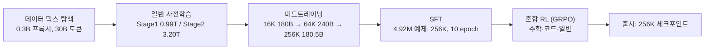

[논문 링크](https://arxiv.org/abs/2609.13356)
## ZGCM-1: 7B 밀집 모델이 235B 프런티어와 겨루는 법 — 완전 개방형·초고효율 파운데이션 모델 설계 보고서

**TL;DR** — ZGCM-1은 7.39B 밀집(dense) 모델 하나로 AIME 2026 75.0%, WebWalkerQA 63.1%, Binary Function Search 62.0%를 기록하며, "프런티어 추론은 수백억 파라미터의 전유물"이라는 통념을 깬다. 비결은 파라미터를 키우는 대신 **게이트형 슬라이딩-윈도우 어텐션 + 전역 어텐션의 하이브리드 구조**로 KV 캐시를 6.4배 줄이고, **FP8 + Muon + TWEO**로 사전학습 시간을 약 4.2배 단축한 뒤, **MDP 미드트레이닝**으로 256K 장문맥을 학습한 완전 개방형 레시피에 있다.

---

## 핵심 아이디어

이 논문의 중심 주장은 단 한 문장으로 요약된다.

> **콤팩트 모델은 정적 파라미터 용량에 본질적으로 갇혀 있지만, '의도적 내적 사고(deliberate internal thinking)'와 '능동적 외부 탐색(active external seeking)'이라는 이중 엔진으로 그 한계를 뛰어넘을 수 있다.**

다시 말해 7B 모델은 웹을 통째로 암기할 수 없다. 대신 **긴 사고 사슬(Chain-of-Thought)로 추론하고, 필요할 때 웹·터미널·바이너리 분석 도구를 직접 호출해 지식 격차를 메운다**는 것이다 (근거: §Introduction). 문제는 이 패러다임이 **256K라는 초장문맥**과 **에이전틱(agentic) 다중 턴 상호작용**을 요구한다는 점인데, 그 자체가 학계의 컴퓨트 예산으로는 감당하기 어려운 비용이다. 그래서 저자들은 모델 설계·시스템·알고리즘·데이터를 한꺼번에 묶은 **고효율 개방형 풀스택 레시피**를 만든다.

저자들이 식별한 두 개의 장벽은 다음과 같다 (근거: §Introduction):

- **규모 장벽(Scale Barrier)** — 프런티어급 추론과 심층 에이전틱 탐색은 수백억 파라미터 시스템의 전유물로 여겨져, 컴퓨트가 부족한 연구자는 훈련·탐색 자체에서 배제되어 왔다.
- **불투명성 장벽(Opacity Barrier)** — 대부분의 경쟁 모델은 *완전 오픈소스*가 아니라 *오픈 웨이트*로만 공개된다. 업스트림 필터링 레시피, 미드트레이닝 커리큘럼, 장문맥 스케줄, 다중 턴 에이전트 트레이스가 모두 블랙박스로 남아, 학습 동역학과 용량 한계를 체계적으로 연구할 수 없다.

ZGCM-1은 이 두 장벽을 동시에 공략한다. 파라미터를 불리는 대신 **구조·정밀도·옵티마이저·데이터 커리큘럼의 공동 설계(co-design)**로 효율을 끌어올리고, **가중치·체크포인트·코드·데이터 레시피·W&B 로그까지 전부 공개**해 재현 가능성을 열었다 (근거: §Abstract).

---

## 배경: 그들이 해결한 문제

프런티어 모델의 추론 능력은 해마다 급등하고 있다. 하지만 그 성과는 대부분 **수백억~수천억 파라미터** 모델과 **비공개 훈련 레시피**에 집중되어 있다 (근거: §Introduction). 학계 연구자가 "이 능력이 어디서 오는지"를 파고들려 해도 두 가지 벽에 부딪힌다.

1. **컴퓨트가 없다.** 100B급 모델을 처음부터 훈련하고, 256K 컨텍스트에서 추론하려면 KV 캐시 메모리와 처리량이 기하급수로 늘어난다.
2. **레시피가 없다.** 오픈 웨이트 모델의 가중치는 받아도, 어떤 데이터를 어떤 순서로 어떤 하이퍼파라미터로 먹였는지가 없으면 "7B에서도 될까?"라는 질문에 답할 수 없다.

이 논문의 출발점은 단순하다. **"7B 규모에서도 수학·코드·에이전틱 탐색에서 수십 배 큰 모델과 견줄 수 있다면, 그 방법론을 전부 공개하자."** 이를 위해 저자들은 아키텍처부터 데이터 거버넌스까지 전 과정을 직접 설계하고, 그 과정에서 얻은 **8개의 실증적 발견(finding)**을 논문 곳곳에 박스로 정리했다. 이 발견들이 사실상 이 논문의 '숨은 보물'이다.

---

## 새로운 접근법: 하이브리드 어텐션 + 고효율 풀스택 레시피

ZGCM-1의 방법론은 크게 네 축으로 나뉜다.

### 1) 구조·시스템 공동 설계 — 게이트형 하이브리드 어텐션 + FP8 Muon

모델은 디코더 전용 Transformer로, GQA·RMSNorm·SwiGLU·RoPE를 쓴다. 핵심은 **32개 레이어 중 27개는 게이트형 슬라이딩-윈도우 어텐션(SWA, 창 크기 128), 5개는 전역 어텐션**이라는 5:1 하이브리드 백본이다 (근거: §Architecture). 전역 레이어는 6·12·18·24·30번 레이어에 배치되어, "국소 레이어 5개 + 전역 레이어 1개" 블록이 다섯 번 반복되고 뒤에 국소 레이어 2개가 붙는 구조다. 여기에 QK 정규화와 Partial RoPE(회전 비율 0.33)를 더했다.

이 구조의 가치를 결정한 실험은 명확하다. 어텐션 구성을 10B 토큰으로 훈련해 비교한 결과, **SWA 5:1은 처리량 9,566 tokens/s/GPU로 최고치를 기록하면서도 손실(1.93)은 풀 어텐션과 동등**했다. MLA는 처리량이 7,645 tokens/s/GPU로 크게 떨어지면서도 손실 개선은 없었다 (근거: Fig. architecture-experiments). 컨텍스트가 4K에서 256K로 길어질수록 SWA 5:1의 처리량 우위는 **1.13배 → 3.94배**로 벌어진다. 장문맥일수록 풀 어텐션이 병목이 되기 때문이다.

학습 효율 측면에선 **Muon 옵티마이저 + 하이브리드 FP8(E4M3 정방향, E5M2 역방향) + TWEO 이상치 정규화**를 결합했다 (근거: §Pre-Training). TWEO는 활성화의 극단값을 억제해 FP8 훈련의 수치 발산을 막는 핵심 장치로, 16K 생산 실행에서 약 585 TFLOP/s/GPU — H100 BF16 피크(989 TFLOP/s) 대비 약 60%의 BF16 환산 MFU — 를 지속했다.

### 2) 프로그레시브 커리큘럼 + MDP 미드트레이닝

사전학습은 **일반 사전학습(Stage 1: 0.99T 토큰 → Stage 2: 3.20T 토큰)**과 **미드트레이닝(600.51B 토큰)**으로 나뉜다 (근거: §Pre-Training). 미드트레이닝은 컨텍스트를 **16K(180B) → 64K(240B) → 256K(180.51B)**로 점진 확장하면서, 각 단계가 이전 단계의 짧은 시퀀스를 계속 리플레이한다. 여기서 핵심 아이디어는 **상호작용 트레이스를 마르코프 결정 과정(MDP)의 상태-행동 쌍으로 재구성**해, 전체 궤적 컨텍스트와 지역적 의사결정에 대한 밀집 단계별 지도를 동시에 공급한다는 점이다.

### 3) 실행-검증 정렬 + 혼합 SFT

포스트트레이닝은 **SFT → 혼합 RL(GRPO)** 순서다. SFT 코퍼스는 4,921,933개 예제(일반 96.46% + 에이전틱 3.54%)로, **think(추론 사슬 노출)와 no-think(즉답) 예제를 의도적으로 섞어** 단일 가중치가 지시에 따라 '완전 사고'와 '즉답'을 동적으로 오가게 한다 (근거: §Post-Training). RL은 수학(정답 이진 보상)·코드(통과 테스트 비율) 등 도메인별 보상에 GRPO와 길이 패널티를 결합했다.

### 4) AI-네이티브 R&D

모델 개발 수명주기 전반을 **연구자가 지휘하는 에이전트 군(swarm)**이 수행했다. 데이터 정제, 클러스터 관리, 평가까지 에이전트가 자율 실행하며, 특히 **Atomic Capability Evaluation(ACE)** — 2,503개 프로브를 18개 카테고리·183개 원자 능력으로 조직한 진단 벤치마크 — 는 2~3분 만에 완주해 애블레이션 때마다 능력 회귀를 빠르게 국소화한다 (근거: §AI-Native R&D).

전체 훈련 레시피를 흐름으로 그리면 다음과 같다.

---

## 작동 원리: 구체적인 예시로 살펴보기

### 게이트형 SWA의 동작

정규화된 은닉 상태 $h$가 들어오면, 게이트형 SWA 모듈은 쿼리·키·밸류·게이트 투영을 병렬로 만든다. 쿼리와 키에는 RMS 정규화와 Partial RoPE가 적용되고, 128-토큰 창 안의 GQA 출력을 $A_{\mathrm{SWA}}(q,k,v)$라 하면 최종 출력은 다음과 같다 (근거: §Architecture).

$$ \operatorname{GatedSWA}(h) = o_{\mathrm{proj}}\left( A_{\mathrm{SWA}}(q,k,v) \odot \sigma(g_{\mathrm{proj}}(h)) \right) $$

즉 **학습된 시그모이드 게이트 $\sigma(\cdot)$가 국소 어텐션 출력을 요소별로 조절**한 뒤 출력 투영을 거친다. 전역 레이어는 이 게이트를 생략하고 전체 컨텍스트를 본다. 게이트는 "이 토큰이 국소 정보만으로 충분한지, 아니면 억제해야 하는지"를 학습으로 판단한다.

**작은 예시로 이해해보자.** 창 크기가 4인 미니 SWA를 가정하고, 토큰 시퀀스가 `["cat", "sat", "on", "the"]`라고 하자. 4번째 토큰 `the`의 국소 어텐션은 자기 자신을 포함한 4개 토큰만 본다. 이 출력 벡터가 $[2.0,\ -0.5,\ 1.1]$이라면, 게이트 $\sigma(g)$가 $[0.9,\ 0.1,\ 0.6]$을 곱해 첫 번째·세 번째 차원은 살리고 두 번째 차원은 거의 제거한다. 결과적으로 불필요한 국소 신호는 걸러지고, 창을 넘어선 정보가 필요하면 5개 레이어 간격으로 배치된 전역 레이어가 그 격차를 메운다.

### KV 캐시가 6.4배 줄어드는 이유

자기회귀 디코딩은 메모리 대역폭에 묶여 있으므로, KV 캐시 크기가 곧 처리량을 좌우한다. GQA 기준 per-token KV 바이트는 대략

$$ \text{KV-Cache(GB)} \approx \frac{2 \cdot L \cdot H \cdot d_\text{head} \cdot \text{seq} \cdot \text{batch} \cdot \text{bytes/elt}}{10^9} $$

로 표현된다. 여기서 $L$은 레이어 수, $H$는 KV 헤드 수(8), $d_\text{head}$는 헤드 차원(128), `bytes/elt`는 bf16이므로 2다.

- **풀 어텐션(32 전역 레이어)**: 모든 레이어가 전체 시퀀스를 저장하므로 per-token $2 \times 32 \times 8 \times 128 \times 2 = 131{,}072$ 바이트 = **128 KiB**.
- **하이브리드(5 전역 + 27 SWA)**: 전역 레이어 5개만 전체 시퀀스를 저장하고, SWA 레이어는 128-토큰 창만 유지한다. per-token $2 \times 5 \times 8 \times 128 \times 2 = 20{,}480$ 바이트 = **20 KiB**.

256K(262,144 토큰)에서 전자는 32.0 GiB, 후자는 5.0 GiB다. **6.4배 감소**가 여기서 나온다 (근거: Fig. architecture-experiments). 창이 고정된 SWA 레이어의 캐시는 시퀀스 길이와 무관한 상수라서, 장문맥일수록 격차가 더 벌어진다.

### MDP 미드트레이닝의 재구성

에이전틱 트레이스는 보통 `사용자 질문 → 에이전트 사고 → 도구 호출 → 관측 → …`의 긴 궤적이다. 이를 그대로 학습하면 중간 의사결정에 대한 지도가 희박해진다. 저자들은 이 궤적을 **(상태 = 이전 컨텍스트, 행동 = 다음 토큰/도구 호출)** 형태의 상태-행동 전이로 재구성해, "현재 상태에서 왜 이 행동이 옳은가"를 단계별로 조밀하게 지도한다 (근거: §Pre-Training). 덕분에 256K 장문맥 능력을 밑단(미드트레이닝)에서 다져놓으면, 나중에 SFT는 중간 길이 데이터만으로도 그 능력을 끌어낼 수 있다는 것이 **Finding 7**의 핵심이다.

---

## 성능 검증: 주요 결과

### 7B 스케일 내 1위, 프런티어와도 경쟁

14개 추론 벤치마크 평균에서 ZGCM-1-7B는 7B~8B 스케일 모델 중 1위를 차지한다 (근거: Fig. homepage-evaluation-overview). 주요 수치는 다음과 같다 (근거: Tab. posttraining-thinking-7b-comparison).

| 벤치마크 | ZGCM-1-7B | 최고 경쟁(7B급) | 비고 |
|---|---:|---:|---|
| MATH-500 | **97.13** | 96.32 | 최고 |
| AIME 2026 | **75.00** | 71.67 | 최고 |
| HMMT 2025 | **70.42** | 61.50 | 최고 |
| HMMT 2026 | **59.48** | 51.52 | 최고 |
| AGIEval SAT Math | **99.09** | 99.09 | 공동 최고 |
| HumanEval+ | **90.24** | 89.90 | 최고 |
| MMLU | 73.88 | 85.40 (Qwen3-8B) | 열위 |
| GPQA-Diamond | 47.87 | 60.10 | 열위 |
| IFEval | 75.42 | 88.20 | 열위 |

패턴이 또렷하다. **수학·추론·코드에서는 압도적 우위, 그러나 순수 지식(MMLU·GPQA)과 지시 준수(IFEval)에서는 밀집 7B의 파라미터 한계가 그대로 드러난다.** 이는 저자들이 스스로 인정한 "정적 파라미터 용량의 한계"와 정확히 일치한다.

### 에이전틱 탐색: 32배 큰 모델과 동급

웹 기반 딥 리서치에서 ZGCM-1-7B는 **WebWalkerQA 63.09%** 로 Kimi-K2(63.00%)와 동급이고, 235B급 Qwen3-235B-A22B(59.60%)를 넘는다. **BrowseComp 19.43%** 는 GPT-4o(1.9%)·DeepSeek-R1(2.0%)·Qwen3-235B-A22B(2.3%)를 크게 앞선다 (근거: Tab. posttraining-agentic-comparison). GAIA text-only는 42.52%다.

바이너리 함수 탐색(Binary Function Search)은 더 극적이다. 스트립된 ELF 바이너리에서 행동 설명만으로 목표 함수의 정확한 진입 주소를 찾는 과제에서, ZGCM-1-7B는 **62.00%** 로 GLM-5.1(66.00%)에 근접하고 DeepSeek-R1(36.00%)·GPT-4o(18.00%)를 크게 이긴다. 같은 스케일의 Qwen3-8B는 12.00%에 그친다 (근거: Tab. binary-search).

### 효율성: 4.2배라는 곱셈의 힘

16K 사전학습 시간-대-손실(time-to-loss) 가속은 네 요인의 곱으로 분해된다 (근거: §Pre-Training).

$$ 1.4\times \text{(SWA)} \times 1.5\times \text{(FP8 시스템)} \times 1.8\times \text{(Muon)} \times 1.1\times \text{(Pre-LN)} \approx 4.2\times $$

단일 요인이 아니라 **구조·정밀도·옵티마이저·정규화의 누적 효과**라는 점이 이 논문의 시스템 설계 철학을 대변한다.

---

## 우리의 관점: 강점, 한계, 그리고 이 연구가 중요한 이유

### 강점

- **정직한 벤치마킹.** 7B급 비교에서는 SOTA, 지식·지시 준수에서는 뒤처지는 부분까지 표에 그대로 드러낸다. "수십 배 큰 모델과 경쟁"이라는 주장이 **에이전틱 탐색이라는 특정 축**에서만 성립함을 스스로 명시하는 태도가 신뢰를 준다.
- **효율의 정량화.** 4.2배를 단순 주장이 아니라 $1.4\times 1.5\times 1.8\times 1.1$의 분해로 제시해, 각 요인의 기여를 독립적으로 검증·재현할 수 있게 했다.
- **완전 개방.** 가중치뿐 아니라 단계별 체크포인트·코드·데이터 레시피·로그까지 공개해, "불투명성 장벽"을 실질적으로 허문다.
- **8개의 발견(Finding)** 이 곧 이 논문의 최대 자산이다. 특히 "SFT에서 양보다 질"(Finding 4), "긴 CoT의 비단조적 효용"(Finding 5), "장문맥 미드트레이닝이 초장문 SFT를 우회"(Finding 7)는 다른 팀이 바로 차용할 수 있는 실용 지식이다.

### 한계

- **파라미터 용량의 벽.** 폐쇄형(recall) 지식 과제에서의 열위는 구조적이다. MMLU 73.88, GPQA 47.87은 Qwen3-8B(85.40, 59.09)에도 밀린다. 사고·탐색으로 메울 수 있는 격차와 그렇지 않은 격차가 구분된다.
- **지시 준수 vs 추론 장황성.** 강한 추론 지도는 IFEval 같은 엄격 지시 준수를 해칠 수 있다(IFEval 75.42). 저자들은 캘리브레이션으로 완화했다고 하나, 실사용에서의 트레이드오프는 남는다.
- **일반 SWE·터미널 에이전시는 미숙.** SWE-bench Verified나 Terminal-Bench 2.0 같은 비구조적 장기 과제에서 완료율이 여전히 낮다. 강점이 "구조화된" 에이전틱 환경(웹 리서치·바이너리 분석)에 집중되어 있다.
- **환경·프로토콜 취약성.** 스키마 정렬과 안정적 피드백에 의존해, 관측 노이즈나 도구 포맷 편차에 약하다.

### 왜 중요한가

이 논문의 진짜 의의는 "7B가 프런티어를 이겼다"는 헤드라인이 아니다. **"수백억 파라미터 없이도 특정 고급 능력에 도달 가능하며, 그 레시피를 전부 공개했다"**는 데 있다. 컴퓨트가 부족한 연구실도 이 체크포인트와 데이터를 기반으로 "장문맥이 추론에 어떻게 작용하는지", "에이전틱 능력은 어디서 오는지"를 직접 실험할 수 있게 된 것이다.

---

## 다음 단계는?: 앞으로의 길

저자들이 제시한 방향은 넷이다 (근거: §Conclusion).

1. **희소 MoE로의 확장.** 하이브리드 SWA·Muon·MDP 레시피를 MoE 백본에 이식해, 추론 FLOPs는 낮게 유지하면서 파라미터 용량과 도메인 특화를 확장.
2. **종단 간 상호작용 에이전틱 RL.** 토큰 단위 SFT·결과 기반 보상에서 벗어나, 실제 샌드박스(터미널·웹·컴파일러) 안에서의 다중 턴 대화형 강화학습으로 전환.
3. **자율 동적 지식 검색.** 파라미터 불확실성이 감지되면 모델이 스스로 검색 서브루틴을 트리거하도록 사전학습 표현과 검색을 통합.
4. **자기진화형 AI4AI.** 에이전트 하네스를 클러스터 원격측정·데이터 큐레이션·원자 평가를 넘어, 자율 가설 수립·커널 자동 최적화·폐루프 합성 환경 설계까지 확장.

우리의 관점에서 한 가지 더 덧붙이자면, **Finding 7이 암시하는 바가 크다.** 장문맥 능력을 미드트레이닝에서 다져두면 SFT는 중간 길이 데이터로 충분하다는 발견은, 곧 **"초장문 SFT 데이터의 비용"을 구조적으로 없앨 수 있다**는 뜻이다. 이것이 MoE 확장과 결합되면, 장문맥 + 에이전틱 + 저비용이라는 삼박자가 다음 세대 오픈소스 모델의 표준 레시피가 될 가능성이 높다.

---

<!-- verbatim-tables -->

## 논문 원문의 표

> arXiv e-print 의 LaTeX 원본에서 기계적으로 옮긴 표입니다. 숫자는 논문의 값이며 모델을 거치지 않았습니다.

**표 1. Composition of our supervised fine-tuning corpus.**

| Component | Row share | Primary role |
|---|---|---|
| General data | 96.46% | Instruction following, knowledge, mathematics, science, code, dialogue, and reasoning |
| Agentic data | 3.54% | Deep research, software engineering, and terminal interaction through structured tools |
| Total | 100.00% | All supervised fine-tuning data |

**표 2. Thinking-mode benchmark results (%) for ZGCM-1-7B and comparable-scale models. Dark blue cells in bold indicate the best result; light blue cells indicate the second-best result.**

| Benchmark | ZGCM-1 7B | DeepSeek-R1 0528-Qwen3 8B | MiniCPM 4.1-8B | Qwen3 8B | Olmo-3-7B Think | MiMo-7B RL | Open Thinker 3-7B |
|---|---|---|---|---|---|---|---|
| **Reasoning & General** |  |  |  |  |  |  |  |
| MATH-500 | 97.13 | 96.32 | 95.60 | 96.20 | 95.10 | 96.20 | 88.40 |
| AIME 2024 | 80.62 | 83.33 | 83.33 | 80.00 | 71.60 | 66.67 | 43.33 |
| AIME 2025 | 73.33 | 75.21 | 73.33 | 63.33 | 64.60 | 53.33 | 43.33 |
| AIME 2026 | 75.00 | 69.17 | 71.67 | 66.67 | 66.16 | 56.67 | 40.00 |
| HMMT 2025 | 70.42 | 61.50 | 52.50 | 43.33 | 43.89 | 40.00 | 23.33 |
| HMMT 2026 | 59.48 | 51.52 | 46.21 | 45.45 | 43.94 | 39.39 | 21.21 |
| AGIEval SAT Math | 99.09 | 91.14 | 98.98 | 99.09 | 90.45 | 58.64 | 68.64 |
| AQuA-RAT | 90.57 | 90.88 | 91.39 | 92.62 | 90.98 | 91.80 | 81.15 |
| HARDMath-mini | 56.34 | 61.92 | 51.89 | 63.31 | 58.90 | 37.41 | 37.45 |
| IMO-AnswerBench | 53.00 | 55.00 | 54.25 | 45.00 | 45.25 | 41.50 | 26.00 |
| MATH-P-Hard | 79.21 | 82.53 | 84.41 | 82.08 | 77.42 | 78.14 | 59.50 |
| OlympiadBench | 76.06 | 74.75 | 82.75 | 82.47 | 69.55 | 74.89 | 56.37 |
| ARC-AGI-1 | 3.50 | 1.69 | 2.58 | 3.00 | 3.25 | 0.50 | 1.50 |
| miniF2F | 2.87 | 5.12 | 0.00 | 2.87 | 3.28 | 1.23 | 1.23 |
| **Code** |  |  |  |  |  |  |  |
| HumanEval+ | 90.24 | 88.87 | 89.63 | 80.20 | 89.90 | 88.95 | 87.40 |
| MBPP+ | 63.23 | 65.54 | 63.96 | 69.10 | 64.70 | 63.96 | 61.40 |
| LiveCodeBench v6 | 46.86 | 53.57 | 52.14 | 52.20 | 49.26 | 47.42 | 42.43 |
| **Knowledge** |  |  |  |  |  |  |  |
| MMLU | 73.88 | 82.09 | 83.51 | 85.40 | 77.80 | 78.39 | 77.40 |
| GPQA-Diamond | 47.87 | 60.10 | 47.98 | 59.09 | 49.94 | 54.40 | 53.70 |
| **Instruction Following** |  |  |  |  |  |  |  |
| IFEval | 75.42 | 72.37 | 73.24 | 87.40 | 88.20 | 61.00 | 51.70 |

**표 3. Web-environment deep-research results (%). Dark blue cells in bold indicate the best result; light blue cells indicate the second-best result. Dashes denote unavailable reported results.**

| Model / System | WebWalkerQA | BrowseComp | GAIA text-only |
|---|---|---|---|
| *Our Model* |  |  |  |
| **ZGCM-1-7B** | 63.09 | 19.43 | 42.52 |
| *Open-source Research Agent* |  |  |  |
| WebDancer-32B | 38.40 | 2.50 | 40.70 |
| *Open-weight Models with Tools* |  |  |  |
| Qwen3-235B-A22B | 59.60 | 2.30 | 45.60 |
| Kimi-K2 | 63.00 | 14.10 | 57.30 |
| DeepSeek-R1 | 10.00 | 2.00 | 31.10 |
| QwQ-32B | 4.30 | 0.50 | 22.30 |
| *Proprietary Models with Tools* |  |  |  |
| GPT-4o | 33.80 | 1.90 | 34.60 |
| GPT-5 | -- | 54.90 | 76.40 |
| Claude 4 Sonnet | 61.70 | 12.20 | 68.30 |

**표 4. Binary Function Search results on 50 tasks. Valid submissions counts answers in the required format; Correct counts exact oracle matches; Accuracy is Correct/50. The dark blue cell in bold and the light blue cell indicate the best and second-best accuracy.**

| Model / System | Valid submissions | Correct | Accuracy (%) |
|---|---|---|---|
| *Larger frontier models* |  |  |  |
| DeepSeek-V4 Flash | 50/50 | 38/50 | 76.00 |
| Qwen3.5-397B-A17B | 50/50 | 38/50 | 76.00 |
| GLM-5.1 | 50/50 | 33/50 | 66.00 |
| **ZGCM-1-7B** | 50/50 | 31/50 | **62.00** |
| Kimi-K2 | 50/50 | 31/50 | 62.00 |
| DeepSeek-R1 | 46/50 | 18/50 | 36.00 |
| GPT-4o | 50/50 | 9/50 | 18.00 |
| *Comparable-scale models* |  |  |  |
| **ZGCM-1-7B** | 50/50 | 31/50 | 62.00 |
| Qwen3-8B | 50/50 | 6/50 | 12.00 |

**표 5. Levels of AI autonomy in R&D workflows. The levels describe autonomy rather than productivity gains or output quality. L5 provides a reference for full autonomy, rather than an assertion of demonstrated capability.**

| **Level** | **Name** | **Defining criterion** |
|---|---|---|
| L1 | Basic Assistance | Humans direct and execute the workflow; AI assists with individual steps. |
| L2 | Partial Automation | AI executes predefined workflows; humans specify procedures and handle exceptions. |
| L3 | Conditional Autonomy | AI adapts and manages routine workflows; consequential decisions require human approval. |
| L4 | High Autonomy | AI independently plans, executes, and iterates within human-defined objectives and constraints. |
| L5 | Full Autonomy | AI also identifies research objectives and coordinates sustained improvement across R&D stages without routine human direction. |

**표 6. Distributed-training configurations on H100 GPUs. TP = tensor parallelism, PP = pipeline parallelism, CP = context parallelism, DP = data parallelism, MBS = micro-batch size, GBS = global batch size.**

| **Stage** | **Context** | **TP/PP/CP/DP** | **MBS/GBS** | **Recompute** | **LR** | **RoPE base** | **Notes** |
|---|---|---|---|---|---|---|---|
| General pre-training | 16K | 2/1/1/96 | 1/768 | None | $2\times10^{-4}$ | 5M | ${\sim}$60% BF16-eq.\ MFU ($\approx$585 TFLOP/s/GPU) |
| Staged (step 1) | 64K | 2/1/4/24 | 1/192 | Selective | $1\times10^{-4}$ | 5M | 10B tokens |
| Direct 256K | 256K | 2/2/4/12 | 1/48 | Full | $1\times10^{-4}$ | 10M | 30B tokens; 203 TFLOP/s/GPU |
| Staged (step 2) | 256K | 2/2/4/12 | 1/48 | Full | $1\times10^{-4}$ | 10M | 20B tokens; 204 TFLOP/s/GPU |

**표 7. Five-checkpoint window averages during General Pre-Training. Higher is better.**

| **Benchmark** | **Capability** | **Early** | **Around 1.0T** | **Around 2.5T** | **Final** |
|---|---|---|---|---|---|
|  |  | **(0.04T--0.07T)** | **(0.91T--1.16T)** | **(2.29T--2.79T)** | **(3.67T--4.18T)** |
| MMLU | Knowledge | 26.37 | 48.32 | 56.94 | 59.52 |
| OpenBookQA | QA | 24.80 | 60.80 | 72.40 | 78.80 |
| CSQA | QA | 19.02 | 57.70 | 64.26 | 67.87 |
| HumanEval | Code | 13.66 | 28.29 | 36.46 | 43.54 |
| GSM8K | Math | 11.52 | 38.64 | 57.12 | 59.09 |
| Minerva Math | Math | 6.80 | 20.40 | 32.80 | 38.40 |
| GSM-Symbolic | Math | 1.20 | 25.60 | 49.20 | 64.00 |
| ARC-Challenge | Reasoning | 24.96 | 56.07 | 69.74 | 75.90 |
| HellaSwag | Reasoning | 24.56 | 42.75 | 52.69 | 57.15 |
| PIQA | Reasoning | 53.80 | 64.78 | 69.78 | 74.89 |
| WinoGrande | Reasoning | 50.71 | 65.98 | 66.14 | 68.98 |

**표 8. Bits per byte (BPB) after 10B training tokens. Lower is better.**

| **Benchmark** | **Random** | **Curriculum** |
|---|---|---|
| Coding | 1.99 | **0.81** |
| Math | 0.97 | **0.94** |
| MMLU | **1.03** | 1.12 |
| ARC | **1.05** | 1.09 |
| HellaSwag | **1.05** | 1.08 |

> 이 글의 그림은 arXiv:2609.13356 원본에서 가져왔습니다 (CC BY 4.0). 크기와 형식만 바꿨습니다.
