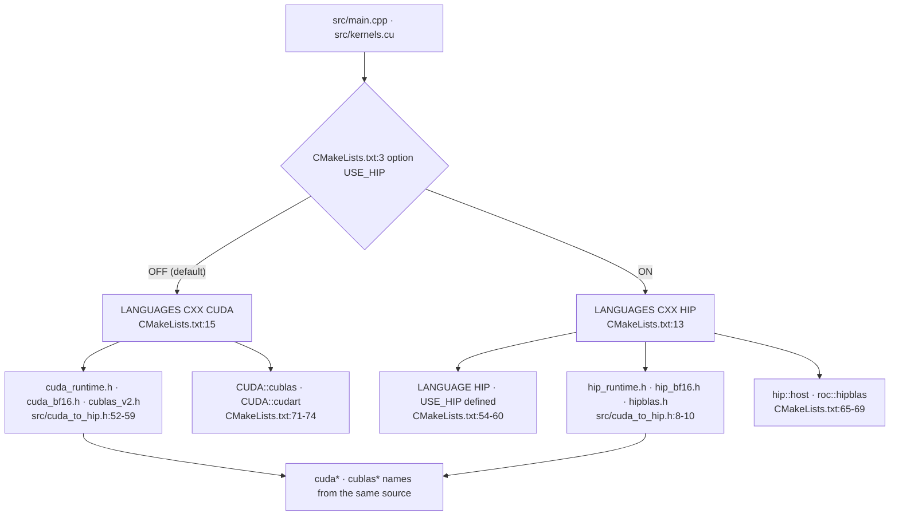

Every path and line number in this article points to the tree at the fixed
revision `e25bf1994efa90bc98b721ba7c527402f86fbeaf`. The notation is
`file:start-end`, and references are source quotations, not execution results.
This series was written in an environment without an NVIDIA GPU or CUDA
toolchain, so no build or execution was performed. Every claim below is
therefore supported only by source citations, not by execution verification, and
kernel execution time, throughput, and memory usage are not measured.

## The Question of This Chapter

What exactly is built as the product in this repository, and where does a single
execution begin? The code scope is six files: `CMakeLists.txt`, `build.sh`,
`run.sh`, `test.sh`, `full_test.sh`, and `src/cuda_to_hip.h`. The minimum
evidence is 4 code citations, 0 tests, and 0 runs. Since there are no tests, all
verification in this chapter is done solely through source citations. As the
first part, it does not depend on any preceding part.

This chapter owns the terminology of translation units and the dual backend.
Weight loading and buffer sizes/aliases belong to Part 2; prefill's kernel order
and parallel reduction to Part 3; cuBLAS transpose and layout to Part 4; the
decode-family kernel variants to Part 5; the consumption of `pagedAttentionKernel`
and `WARP_FULL_MASK` to Part 6; and the lifecycle of slots and the queue to
Part 7. This chapter only draws those boundaries and does not enter the interior
of each topic.

## The Two Translation Units Built as the Product

`CMakeLists.txt` defines a single executable.
`add_executable(tiny-vllm src/main.cpp src/kernels.cu)` specifies that target and
its translation units ([`CMakeLists.txt:49-52`](https://github.com/jmaczan/tiny-vllm/blob/e25bf1994efa90bc98b721ba7c527402f86fbeaf/CMakeLists.txt#L49-L52)). In other words, the product
binary `tiny-vllm` is produced by compiling only two files, `src/main.cpp` and
`src/kernels.cu`.

The division of labor between the two translation units is confirmed in the
source. `src/main.cpp` holds the host-side entry point and orchestration:
`main` ([`src/main.cpp:555-556`](https://github.com/jmaczan/tiny-vllm/blob/e25bf1994efa90bc98b721ba7c527402f86fbeaf/src/main.cpp#L555-L556)), weight loading `loadWeights`
([`src/main.cpp:79-147`](https://github.com/jmaczan/tiny-vllm/blob/e25bf1994efa90bc98b721ba7c527402f86fbeaf/src/main.cpp#L79-L147)), the prompt-streaming `prefill`
([`src/main.cpp:150-553`](https://github.com/jmaczan/tiny-vllm/blob/e25bf1994efa90bc98b721ba7c527402f86fbeaf/src/main.cpp#L150-L553)), and the `main` body including the decode loop
([`src/main.cpp:555-1044`](https://github.com/jmaczan/tiny-vllm/blob/e25bf1994efa90bc98b721ba7c527402f86fbeaf/src/main.cpp#L555-L1044)). `src/kernels.cu` holds the device kernels. There are
exactly 11 `__global__` definitions, split into 7 prefill-family kernels
([`src/kernels.cu:32`](https://github.com/jmaczan/tiny-vllm/blob/e25bf1994efa90bc98b721ba7c527402f86fbeaf/src/kernels.cu#L32), `55`, `173`, `224`, `257`, `311`, `331`) and 4
decode-family kernels ([`src/kernels.cu:347`](https://github.com/jmaczan/tiny-vllm/blob/e25bf1994efa90bc98b721ba7c527402f86fbeaf/src/kernels.cu#L347), `371`, `408`, `461`).

Headers are not counted as translation units. `CMakeLists.txt` adds `src` and
`include` as include paths ([`CMakeLists.txt:62-63`](https://github.com/jmaczan/tiny-vllm/blob/e25bf1994efa90bc98b721ba7c527402f86fbeaf/CMakeLists.txt#L62-L63)). Through those paths
`src/main.cpp` pulls in three headers: `cuda_to_hip.h` ([`src/main.cpp:4`](https://github.com/jmaczan/tiny-vllm/blob/e25bf1994efa90bc98b721ba7c527402f86fbeaf/src/main.cpp#L4)),
`json.hpp` ([`src/main.cpp:7`](https://github.com/jmaczan/tiny-vllm/blob/e25bf1994efa90bc98b721ba7c527402f86fbeaf/src/main.cpp#L7)), and `kernels.cuh` ([`src/main.cpp:8`](https://github.com/jmaczan/tiny-vllm/blob/e25bf1994efa90bc98b721ba7c527402f86fbeaf/src/main.cpp#L8)). Of these,
`json.hpp` is not product source but a third-party single header
(`JSON for Modern C++` 3.12.0, MIT, Niels Lohmann) brought in through the include
path. Its version and license are embedded in the header itself
([`include/json.hpp:6-7`](https://github.com/jmaczan/tiny-vllm/blob/e25bf1994efa90bc98b721ba7c527402f86fbeaf/include/json.hpp#L6-L7), [`include/json.hpp:68-70`](https://github.com/jmaczan/tiny-vllm/blob/e25bf1994efa90bc98b721ba7c527402f86fbeaf/include/json.hpp#L68-L70)), and its use in product code
is confined to a single place, safetensors header parsing: the alias declaration
([`src/main.cpp:10`](https://github.com/jmaczan/tiny-vllm/blob/e25bf1994efa90bc98b721ba7c527402f86fbeaf/src/main.cpp#L10)), the JSON parsing ([`src/main.cpp:104`](https://github.com/jmaczan/tiny-vllm/blob/e25bf1994efa90bc98b721ba7c527402f86fbeaf/src/main.cpp#L104)), and the tensor
traversal ([`src/main.cpp:106`](https://github.com/jmaczan/tiny-vllm/blob/e25bf1994efa90bc98b721ba7c527402f86fbeaf/src/main.cpp#L106)). Although this file accounts for about 92% of the
analyzed source bytes, it is not a compiled translation unit, so it is excluded
from the product size.

The following table lays out what is a product translation unit and what is a
dependency of it.

<!-- visual: product-translation-units supports: [product-translation-units] -->
| Path | Status in the product | Evidence |
| --- | --- | --- |
| `src/main.cpp` | Product translation unit. Holds the host entry point and orchestration | [`CMakeLists.txt:49-52`](https://github.com/jmaczan/tiny-vllm/blob/e25bf1994efa90bc98b721ba7c527402f86fbeaf/CMakeLists.txt#L49-L52), [`src/main.cpp:555-1044`](https://github.com/jmaczan/tiny-vllm/blob/e25bf1994efa90bc98b721ba7c527402f86fbeaf/src/main.cpp#L555-L1044) |
| `src/kernels.cu` | Product translation unit. Defines 11 `__global__` kernels | [`CMakeLists.txt:49-52`](https://github.com/jmaczan/tiny-vllm/blob/e25bf1994efa90bc98b721ba7c527402f86fbeaf/CMakeLists.txt#L49-L52), [`src/kernels.cu:32-523`](https://github.com/jmaczan/tiny-vllm/blob/e25bf1994efa90bc98b721ba7c527402f86fbeaf/src/kernels.cu#L32-L523) |
| `include/json.hpp` | Not a product translation unit. A single-header dependency brought in through the `include` path | [`CMakeLists.txt:62-63`](https://github.com/jmaczan/tiny-vllm/blob/e25bf1994efa90bc98b721ba7c527402f86fbeaf/CMakeLists.txt#L62-L63), [`src/main.cpp:7`](https://github.com/jmaczan/tiny-vllm/blob/e25bf1994efa90bc98b721ba7c527402f86fbeaf/src/main.cpp#L7) |

The required claim this table answers is `product-translation-units`. The table
answers both elements.

- The product binary is made from only two translation units, `src/main.cpp` and
  `src/kernels.cu` ([`CMakeLists.txt:49-52`](https://github.com/jmaczan/tiny-vllm/blob/e25bf1994efa90bc98b721ba7c527402f86fbeaf/CMakeLists.txt#L49-L52)).
- `include/json.hpp` is not product code but a single-header dependency brought
  in through the include path ([`CMakeLists.txt:62-63`](https://github.com/jmaczan/tiny-vllm/blob/e25bf1994efa90bc98b721ba7c527402f86fbeaf/CMakeLists.txt#L62-L63), [`src/main.cpp:7`](https://github.com/jmaczan/tiny-vllm/blob/e25bf1994efa90bc98b721ba7c527402f86fbeaf/src/main.cpp#L7)).

## Same Source, Two Backends

`CMakeLists.txt` defines an option that defaults to off,
`option(USE_HIP "Build with HIP for AMD GPUs" OFF)` ([`CMakeLists.txt:3`](https://github.com/jmaczan/tiny-vllm/blob/e25bf1994efa90bc98b721ba7c527402f86fbeaf/CMakeLists.txt#L3)). This
single option divides the language, toolchain, and link targets wholesale.

- Language. If `USE_HIP`, then `project(tiny-vllm LANGUAGES CXX HIP)`
  ([`CMakeLists.txt:13`](https://github.com/jmaczan/tiny-vllm/blob/e25bf1994efa90bc98b721ba7c527402f86fbeaf/CMakeLists.txt#L13)); otherwise `LANGUAGES CXX CUDA` ([`CMakeLists.txt:15`](https://github.com/jmaczan/tiny-vllm/blob/e25bf1994efa90bc98b721ba7c527402f86fbeaf/CMakeLists.txt#L15)).
- Compiler. If not HIP, it specifies the `nvcc` path ([`CMakeLists.txt:5-8`](https://github.com/jmaczan/tiny-vllm/blob/e25bf1994efa90bc98b721ba7c527402f86fbeaf/CMakeLists.txt#L5-L8)).
- CUDA standard and architecture. Only when not HIP does it set
  `CMAKE_CUDA_STANDARD 17` and `CMAKE_CUDA_ARCHITECTURES 120`
  ([`CMakeLists.txt:21-25`](https://github.com/jmaczan/tiny-vllm/blob/e25bf1994efa90bc98b721ba7c527402f86fbeaf/CMakeLists.txt#L21-L25)).
- Compile flags. It keeps separate Release/DEBUG flags per backend
  ([`CMakeLists.txt:32-38`](https://github.com/jmaczan/tiny-vllm/blob/e25bf1994efa90bc98b721ba7c527402f86fbeaf/CMakeLists.txt#L32-L38)).
- Dependency packages. If HIP, `hipblas` and `hip` ([`CMakeLists.txt:42-44`](https://github.com/jmaczan/tiny-vllm/blob/e25bf1994efa90bc98b721ba7c527402f86fbeaf/CMakeLists.txt#L42-L44));
  otherwise `CUDAToolkit` ([`CMakeLists.txt:46`](https://github.com/jmaczan/tiny-vllm/blob/e25bf1994efa90bc98b721ba7c527402f86fbeaf/CMakeLists.txt#L46)).
- Translation unit language. If HIP, it compiles `main.cpp` and `kernels.cu` as
  HIP and defines the `USE_HIP` macro ([`CMakeLists.txt:54-60`](https://github.com/jmaczan/tiny-vllm/blob/e25bf1994efa90bc98b721ba7c527402f86fbeaf/CMakeLists.txt#L54-L60)).
- Link. If HIP, `hip::host` and `roc::hipblas` ([`CMakeLists.txt:65-69`](https://github.com/jmaczan/tiny-vllm/blob/e25bf1994efa90bc98b721ba7c527402f86fbeaf/CMakeLists.txt#L65-L69));
  otherwise `CUDA::cublas` and `CUDA::cudart` ([`CMakeLists.txt:71-74`](https://github.com/jmaczan/tiny-vllm/blob/e25bf1994efa90bc98b721ba7c527402f86fbeaf/CMakeLists.txt#L71-L74)).

The reason the source tolerates both backends is `src/cuda_to_hip.h`. This header
branches on a single condition,
`#if defined(USE_HIP) || defined(__HIP_PLATFORM_AMD__)` ([`src/cuda_to_hip.h:6`](https://github.com/jmaczan/tiny-vllm/blob/e25bf1994efa90bc98b721ba7c527402f86fbeaf/src/cuda_to_hip.h#L6)).
On the HIP side it pulls in `hip_runtime.h`, `hip_bf16.h`, and `hipblas.h`
([`src/cuda_to_hip.h:8-10`](https://github.com/jmaczan/tiny-vllm/blob/e25bf1994efa90bc98b721ba7c527402f86fbeaf/src/cuda_to_hip.h#L8-L10)), maps the bfloat16 type from `__nv_bfloat16` to
`__hip_bfloat16` ([`src/cuda_to_hip.h:13-14`](https://github.com/jmaczan/tiny-vllm/blob/e25bf1994efa90bc98b721ba7c527402f86fbeaf/src/cuda_to_hip.h#L13-L14)), and rewrites runtime names such as
`cudaMalloc` and `cudaMemcpy`, and BLAS names such as `cublasCreate` and
`cublasGemmEx`, into macros ([`src/cuda_to_hip.h:17-31`](https://github.com/jmaczan/tiny-vllm/blob/e25bf1994efa90bc98b721ba7c527402f86fbeaf/src/cuda_to_hip.h#L17-L31),
[`src/cuda_to_hip.h:33-46`](https://github.com/jmaczan/tiny-vllm/blob/e25bf1994efa90bc98b721ba7c527402f86fbeaf/src/cuda_to_hip.h#L33-L46)). On the CUDA side it uses the standard headers as is
([`src/cuda_to_hip.h:52-59`](https://github.com/jmaczan/tiny-vllm/blob/e25bf1994efa90bc98b721ba7c527402f86fbeaf/src/cuda_to_hip.h#L52-L59)). [`src/main.cpp:4`](https://github.com/jmaczan/tiny-vllm/blob/e25bf1994efa90bc98b721ba7c527402f86fbeaf/src/main.cpp#L4) and [`src/kernels.cu:1`](https://github.com/jmaczan/tiny-vllm/blob/e25bf1994efa90bc98b721ba7c527402f86fbeaf/src/kernels.cu#L1) are the
points that include this header. `src/kernels.cuh` also defines the bfloat16
alias once more on its own ([`src/kernels.cuh:3-9`](https://github.com/jmaczan/tiny-vllm/blob/e25bf1994efa90bc98b721ba7c527402f86fbeaf/src/kernels.cuh#L3-L9)).

What diverges here is not only names but the width of the warp shuffle mask. HIP
requires a 64-bit mask, so `WARP_FULL_MASK` is defined as
`0xffffffffffffffffULL`, while under CUDA it is the 32-bit `0xffffffff`
([`src/cuda_to_hip.h:48-50`](https://github.com/jmaczan/tiny-vllm/blob/e25bf1994efa90bc98b721ba7c527402f86fbeaf/src/cuda_to_hip.h#L48-L50), [`src/cuda_to_hip.h:58-59`](https://github.com/jmaczan/tiny-vllm/blob/e25bf1994efa90bc98b721ba7c527402f86fbeaf/src/cuda_to_hip.h#L58-L59)). The only place that
actually consumes this constant is the five shuffle lines inside
`pagedAttentionKernel` ([`src/kernels.cu:489-493`](https://github.com/jmaczan/tiny-vllm/blob/e25bf1994efa90bc98b721ba7c527402f86fbeaf/src/kernels.cu#L489-L493)). The behavior of that kernel is
owned by Part 6.

The following diagram shows which branch the same source takes to reach the two
backends.

<!-- visual: dual-backend-branch supports: [dual-backend-branch] -->

The required claim of the diagram is `dual-backend-branch`. This figure answers
two elements: that the `USE_HIP` option routes the same CUDA source through the
hipcc/hipBLAS path, and that `src/cuda_to_hip.h` is a shim that absorbs the
bfloat16 type difference.

## The Canonical Execution Path

The execution path the repository defines for itself is four shell scripts.
`full_test.sh` passes a hardcoded sequence of token IDs to `./test.sh` on
standard input ([`full_test.sh:1`](https://github.com/jmaczan/tiny-vllm/blob/e25bf1994efa90bc98b721ba7c527402f86fbeaf/full_test.sh#L1)). That sequence is 42 token IDs in the form of
the Llama-3 chat template. `test.sh` is two lines: it first calls `./build.sh`
and immediately calls `./run.sh` ([`test.sh:1-2`](https://github.com/jmaczan/tiny-vllm/blob/e25bf1994efa90bc98b721ba7c527402f86fbeaf/test.sh#L1-L2)). `build.sh` deletes and
recreates `build/` and builds with `cmake .. -G Ninja && ninja` ([`build.sh:1-3`](https://github.com/jmaczan/tiny-vllm/blob/e25bf1994efa90bc98b721ba7c527402f86fbeaf/build.sh#L1-L3)).
`run.sh` runs `./build/tiny-vllm` ([`run.sh:1`](https://github.com/jmaczan/tiny-vllm/blob/e25bf1994efa90bc98b721ba7c527402f86fbeaf/run.sh#L1)).

Thus the canonical path goes through a clean build every time. The artifact is
`build/tiny-vllm`, and execution happens via a relative path from the working
directory. Whether the standard input passed by `full_test.sh` actually reaches
the model is examined separately below in "Where Does the Input Come From?".

## Where Does main Begin?

The C++ entry point is `main` ([`src/main.cpp:555-556`](https://github.com/jmaczan/tiny-vllm/blob/e25bf1994efa90bc98b721ba7c527402f86fbeaf/src/main.cpp#L555-L556)). Its first action is
creating the cuBLAS handle, and it does `return 1` on failure
([`src/main.cpp:557-563`](https://github.com/jmaczan/tiny-vllm/blob/e25bf1994efa90bc98b721ba7c527402f86fbeaf/src/main.cpp#L557-L563)). Immediately it loads the weights with `loadWeights`
([`src/main.cpp:566-569`](https://github.com/jmaczan/tiny-vllm/blob/e25bf1994efa90bc98b721ba7c527402f86fbeaf/src/main.cpp#L566-L569)), initializes the RoPE frequency table
([`src/main.cpp:572`](https://github.com/jmaczan/tiny-vllm/blob/e25bf1994efa90bc98b721ba7c527402f86fbeaf/src/main.cpp#L572)), then sets up the paged KV cache allocator
([`src/main.cpp:574-581`](https://github.com/jmaczan/tiny-vllm/blob/e25bf1994efa90bc98b721ba7c527402f86fbeaf/src/main.cpp#L574-L581)). Next it prepares the request queue
([`src/main.cpp:583-594`](https://github.com/jmaczan/tiny-vllm/blob/e25bf1994efa90bc98b721ba7c527402f86fbeaf/src/main.cpp#L583-L594)) and the slot/batch state ([`src/main.cpp:597-610`](https://github.com/jmaczan/tiny-vllm/blob/e25bf1994efa90bc98b721ba7c527402f86fbeaf/src/main.cpp#L597-L610)), and
allocates the compute buffers ([`src/main.cpp:617-693`](https://github.com/jmaczan/tiny-vllm/blob/e25bf1994efa90bc98b721ba7c527402f86fbeaf/src/main.cpp#L617-L693)). The initial prefill loop
fills empty slots with prompts from the queue ([`src/main.cpp:695-708`](https://github.com/jmaczan/tiny-vllm/blob/e25bf1994efa90bc98b721ba7c527402f86fbeaf/src/main.cpp#L695-L708)), after
which the `while (true)` decode loop runs ([`src/main.cpp:720-1039`](https://github.com/jmaczan/tiny-vllm/blob/e25bf1994efa90bc98b721ba7c527402f86fbeaf/src/main.cpp#L720-L1039)). The loop's
only break is when all active slots have disappeared while the queue is empty
([`src/main.cpp:738-746`](https://github.com/jmaczan/tiny-vllm/blob/e25bf1994efa90bc98b721ba7c527402f86fbeaf/src/main.cpp#L738-L746)). After the break it prints `Ok bye!`, cleans up the
handle, and does `return 0` ([`src/main.cpp:1040-1044`](https://github.com/jmaczan/tiny-vllm/blob/e25bf1994efa90bc98b721ba7c527402f86fbeaf/src/main.cpp#L1040-L1044)).

There are only four host functions. They are `checkGPUStatus`
([`src/main.cpp:40-62`](https://github.com/jmaczan/tiny-vllm/blob/e25bf1994efa90bc98b721ba7c527402f86fbeaf/src/main.cpp#L40-L62)), `loadWeights` ([`src/main.cpp:79-147`](https://github.com/jmaczan/tiny-vllm/blob/e25bf1994efa90bc98b721ba7c527402f86fbeaf/src/main.cpp#L79-L147)), `prefill`
([`src/main.cpp:150-553`](https://github.com/jmaczan/tiny-vllm/blob/e25bf1994efa90bc98b721ba7c527402f86fbeaf/src/main.cpp#L150-L553)), and `main` ([`src/main.cpp:555-1044`](https://github.com/jmaczan/tiny-vllm/blob/e25bf1994efa90bc98b721ba7c527402f86fbeaf/src/main.cpp#L555-L1044)). Since the entire
model forward pass and paged KV cache management live inside `prefill` and
`main`, this series partitions parts by runtime path rather than by directory.
This chapter looks only as far as the entrance of that path.

## Where Does the Input Come From?

The signature of `main` is `int main(int argc, char *argv[])`
([`src/main.cpp:555`](https://github.com/jmaczan/tiny-vllm/blob/e25bf1994efa90bc98b721ba7c527402f86fbeaf/src/main.cpp#L555)). However, nowhere in the body does it read `argc` or
`argv`, nor does it read standard input (`std::cin`, `scanf`, `getline`). The
sequence of token IDs that `full_test.sh` passes on standard input never reaches
the product.

The actual prompts are hardcoded in the code. `main` pushes four token ID
vectors in chat-template form onto `queue` ([`src/main.cpp:583-594`](https://github.com/jmaczan/tiny-vllm/blob/e25bf1994efa90bc98b721ba7c527402f86fbeaf/src/main.cpp#L583-L594)). Comments
label each prompt as "What is 2+2?" (length 17), "Name a color." (length 14),
"Say hello." (length 13), and "Capital of France?" (length 14)
([`src/main.cpp:583`](https://github.com/jmaczan/tiny-vllm/blob/e25bf1994efa90bc98b721ba7c527402f86fbeaf/src/main.cpp#L583), [`src/main.cpp:587`](https://github.com/jmaczan/tiny-vllm/blob/e25bf1994efa90bc98b721ba7c527402f86fbeaf/src/main.cpp#L587), [`src/main.cpp:590`](https://github.com/jmaczan/tiny-vllm/blob/e25bf1994efa90bc98b721ba7c527402f86fbeaf/src/main.cpp#L590),
[`src/main.cpp:593`](https://github.com/jmaczan/tiny-vllm/blob/e25bf1994efa90bc98b721ba7c527402f86fbeaf/src/main.cpp#L593)). The path too is hardcoded as a string rather than an
argument: `loadWeights` opens `model.safetensors` in the working directory
([`src/main.cpp:87`](https://github.com/jmaczan/tiny-vllm/blob/e25bf1994efa90bc98b721ba7c527402f86fbeaf/src/main.cpp#L87)).

## What This Chapter Does Not Cover

- Weight loading and GPU buffer sizes/aliases: Part 2.
- prefill's kernel call order and parallel reduction: Part 3.
- cuBLAS transpose flags and column/row-major layout: Part 4.
- decode-family kernel variants: Part 5.
- Consumption of `WARP_FULL_MASK` (`pagedAttentionKernel`): Part 6. This chapter
  covers only the point where `src/cuda_to_hip.h` defines the constant.
- The lifecycle of slots and the queue, and the termination condition: Part 7.
- Actual build/execution and numerical verification: not performed in this
  chapter.

## Limitations of This Chapter

- This series was written in an environment without an NVIDIA GPU and CUDA
  toolchain, so no build or execution was performed. Both the `full_test.sh`
  path and the `main` initialization order are source citations and were not
  confirmed by execution.
- The minimum evidence for this chapter is 4 code citations, 0 tests, and 0
  runs. Kernel execution time, throughput, and memory usage are not measured,
  and this chapter contains no performance figures that could be read as
  measured values.
- The shell scripts were only cited, not executed. The `cmake`, `ninja`, and
  CUDA/HIP toolchain that `build.sh` requires are not present in this
  environment.
- The HIP branch of `src/cuda_to_hip.h` was not compiled. Whether the macro
  mappings hold in a real hipBLAS/HIP runtime is not something this chapter
  verifies.
- The fact that `full_test.sh`'s standard input is ignored in `main` is a static
  claim based on source search. Whether some other path reads standard input was
  not confirmed by execution.
- Although `include/json.hpp` accounts for the majority of the analyzed source
  bytes, it is a third-party vendored header and is excluded from this series'
  analysis scope.

## Sources

- [`CMakeLists.txt:1-75`](https://github.com/jmaczan/tiny-vllm/blob/e25bf1994efa90bc98b721ba7c527402f86fbeaf/CMakeLists.txt#L1-L75) — language and backend branching, translation units,
  include paths, linking.
- [`build.sh:1-3`](https://github.com/jmaczan/tiny-vllm/blob/e25bf1994efa90bc98b721ba7c527402f86fbeaf/build.sh#L1-L3), [`run.sh:1`](https://github.com/jmaczan/tiny-vllm/blob/e25bf1994efa90bc98b721ba7c527402f86fbeaf/run.sh#L1), [`test.sh:1-2`](https://github.com/jmaczan/tiny-vllm/blob/e25bf1994efa90bc98b721ba7c527402f86fbeaf/test.sh#L1-L2), [`full_test.sh:1`](https://github.com/jmaczan/tiny-vllm/blob/e25bf1994efa90bc98b721ba7c527402f86fbeaf/full_test.sh#L1) — execution path.
- [`src/cuda_to_hip.h:1-61`](https://github.com/jmaczan/tiny-vllm/blob/e25bf1994efa90bc98b721ba7c527402f86fbeaf/src/cuda_to_hip.h#L1-L61) — bfloat16, runtime, and BLAS shim and
  `WARP_FULL_MASK`.
- [`src/kernels.cuh:1-28`](https://github.com/jmaczan/tiny-vllm/blob/e25bf1994efa90bc98b721ba7c527402f86fbeaf/src/kernels.cuh#L1-L28) — kernel declarations and the bfloat16 alias.
- [`src/main.cpp:1-10`](https://github.com/jmaczan/tiny-vllm/blob/e25bf1994efa90bc98b721ba7c527402f86fbeaf/src/main.cpp#L1-L10) — the include block.
- [`src/main.cpp:40-62`](https://github.com/jmaczan/tiny-vllm/blob/e25bf1994efa90bc98b721ba7c527402f86fbeaf/src/main.cpp#L40-L62), `79-147`, `150-553`, `555-1044` — the four host
  functions.
- [`src/main.cpp:583-594`](https://github.com/jmaczan/tiny-vllm/blob/e25bf1994efa90bc98b721ba7c527402f86fbeaf/src/main.cpp#L583-L594) — the hardcoded prompt queue.
- [`src/main.cpp:720-746`](https://github.com/jmaczan/tiny-vllm/blob/e25bf1994efa90bc98b721ba7c527402f86fbeaf/src/main.cpp#L720-L746), `1040-1044` — the decode loop's break and normal
  termination.
- [`src/kernels.cu:32-523`](https://github.com/jmaczan/tiny-vllm/blob/e25bf1994efa90bc98b721ba7c527402f86fbeaf/src/kernels.cu#L32-L523) — the 11 `__global__` kernels.
- [`include/json.hpp:6-7`](https://github.com/jmaczan/tiny-vllm/blob/e25bf1994efa90bc98b721ba7c527402f86fbeaf/include/json.hpp#L6-L7), `68-70` — the vendored header's SPDX license and
  version.
