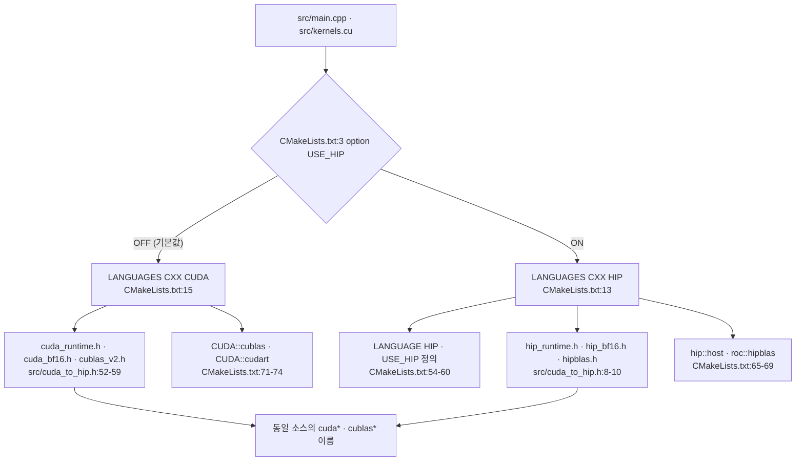

이 글의 모든 경로와 줄 번호는 고정 revision
`e25bf1994efa90bc98b721ba7c527402f86fbeaf` 의 트리를 가리킨다. 표기는
`파일:시작-끝` 형식이며, 실행 결과가 아니라 소스 인용이다. 이 시리즈는
NVIDIA GPU 와 CUDA 툴체인이 없는 환경에서 작성되어 어떤 빌드도 실행도 하지
않았다. 따라서 아래의 모든 주장은 실행 검증이 아니라 소스 인용으로만
뒷받침되며, 커널 실행 시간·처리량·메모리 사용량은 측정하지 않는다.

## 이 장의 질문

이 저장소에서 제품으로 빌드되는 것은 정확히 무엇이고, 한 번의 실행은 어디서
시작하는가. 코드 범위는 여섯 파일이다: `CMakeLists.txt`, `build.sh`, `run.sh`,
`test.sh`, `full_test.sh`, `src/cuda_to_hip.h`. 최소 근거는 코드 인용 4건,
테스트 0건, 실행 0건이다. 테스트가 없으므로 이 장의 검증은 소스 인용으로만
이뤄진다. 첫 편이므로 선행 편에 의존하지 않는다.

이 장은 번역 단위와 이중 백엔드 용어의 소유 편이다. 가중치 적재와 버퍼
크기·별칭은 2편이, prefill 의 커널 순서와 병렬 리덕션은 3편이, cuBLAS 의
전치·레이아웃은 4편이, decode 계열 커널 변형은 5편이, `pagedAttentionKernel`
과 `WARP_FULL_MASK` 의 소비는 6편이, 슬롯·큐의 수명주기는 7편이 맡는다. 이
장은 그 경계를 그을 뿐 각 주제의 내부로 들어가지 않는다.

## 제품으로 빌드되는 두 번역 단위

`CMakeLists.txt` 는 실행 파일 하나를 정의한다.
`add_executable(tiny-vllm src/main.cpp src/kernels.cu)` 가 그 대상과 번역
단위를 규정한다([`CMakeLists.txt:49-52`](https://github.com/jmaczan/tiny-vllm/blob/e25bf1994efa90bc98b721ba7c527402f86fbeaf/CMakeLists.txt#L49-L52)). 즉 제품 바이너리 `tiny-vllm` 은
`src/main.cpp` 와 `src/kernels.cu` 두 파일만 컴파일해 만들어진다.

두 번역 단위의 분담은 소스에서 확인된다. `src/main.cpp` 는 호스트 쪽
진입점과 오케스트레이션을 담는다: `main`([`src/main.cpp:555-556`](https://github.com/jmaczan/tiny-vllm/blob/e25bf1994efa90bc98b721ba7c527402f86fbeaf/src/main.cpp#L555-L556)), 가중치 적재
`loadWeights`([`src/main.cpp:79-147`](https://github.com/jmaczan/tiny-vllm/blob/e25bf1994efa90bc98b721ba7c527402f86fbeaf/src/main.cpp#L79-L147)), 프롬프트를 흘리는
`prefill`([`src/main.cpp:150-553`](https://github.com/jmaczan/tiny-vllm/blob/e25bf1994efa90bc98b721ba7c527402f86fbeaf/src/main.cpp#L150-L553)), 그리고 decode 루프를 포함한 `main`
본문([`src/main.cpp:555-1044`](https://github.com/jmaczan/tiny-vllm/blob/e25bf1994efa90bc98b721ba7c527402f86fbeaf/src/main.cpp#L555-L1044))이다. `src/kernels.cu` 는 디바이스 커널을
담는다. `__global__` 정의가 정확히 11개 있고, prefill 계열 7개
([`src/kernels.cu:32`](https://github.com/jmaczan/tiny-vllm/blob/e25bf1994efa90bc98b721ba7c527402f86fbeaf/src/kernels.cu#L32), `55`, `173`, `224`, `257`, `311`, `331`)와 decode 계열
4개([`src/kernels.cu:347`](https://github.com/jmaczan/tiny-vllm/blob/e25bf1994efa90bc98b721ba7c527402f86fbeaf/src/kernels.cu#L347), `371`, `408`, `461`)로 나뉜다.

헤더는 번역 단위로 세지 않는다. `CMakeLists.txt` 는 include 경로로 `src` 와
`include` 를 추가한다([`CMakeLists.txt:62-63`](https://github.com/jmaczan/tiny-vllm/blob/e25bf1994efa90bc98b721ba7c527402f86fbeaf/CMakeLists.txt#L62-L63)). `src/main.cpp` 는 그 경로를
통해 세 헤더를 끌어온다: `cuda_to_hip.h`([`src/main.cpp:4`](https://github.com/jmaczan/tiny-vllm/blob/e25bf1994efa90bc98b721ba7c527402f86fbeaf/src/main.cpp#L4)),
`json.hpp`([`src/main.cpp:7`](https://github.com/jmaczan/tiny-vllm/blob/e25bf1994efa90bc98b721ba7c527402f86fbeaf/src/main.cpp#L7)), `kernels.cuh`([`src/main.cpp:8`](https://github.com/jmaczan/tiny-vllm/blob/e25bf1994efa90bc98b721ba7c527402f86fbeaf/src/main.cpp#L8)). 이 중
`json.hpp` 는 제품 소스가 아니라 include 경로로 들어오는 제3자 단일
헤더(`JSON for Modern C++` 3.12.0, MIT, Niels Lohmann)다. 그 버전과 라이선스는
헤더 자체에 박혀 있고([`include/json.hpp:6-7`](https://github.com/jmaczan/tiny-vllm/blob/e25bf1994efa90bc98b721ba7c527402f86fbeaf/include/json.hpp#L6-L7), [`include/json.hpp:68-70`](https://github.com/jmaczan/tiny-vllm/blob/e25bf1994efa90bc98b721ba7c527402f86fbeaf/include/json.hpp#L68-L70)), 제품
코드에서의 사용은 safetensors 헤더 파싱 한 곳뿐이다: 별칭 선언
([`src/main.cpp:10`](https://github.com/jmaczan/tiny-vllm/blob/e25bf1994efa90bc98b721ba7c527402f86fbeaf/src/main.cpp#L10)), JSON 파싱([`src/main.cpp:104`](https://github.com/jmaczan/tiny-vllm/blob/e25bf1994efa90bc98b721ba7c527402f86fbeaf/src/main.cpp#L104)), 텐서 순회
([`src/main.cpp:106`](https://github.com/jmaczan/tiny-vllm/blob/e25bf1994efa90bc98b721ba7c527402f86fbeaf/src/main.cpp#L106)). 이 파일은 분석 대상 소스 바이트의 약 92% 를 차지하지만
컴파일되는 번역 단위가 아니므로 제품 규모에서 제외한다.

다음 표는 무엇이 제품 번역 단위이고 무엇이 그 의존인지 정리한다.

<!-- visual: product-translation-units supports: [product-translation-units] -->
| 경로 | 제품에서의 지위 | 근거 |
| --- | --- | --- |
| `src/main.cpp` | 제품 번역 단위. 호스트 진입점과 오케스트레이션을 담는다 | [`CMakeLists.txt:49-52`](https://github.com/jmaczan/tiny-vllm/blob/e25bf1994efa90bc98b721ba7c527402f86fbeaf/CMakeLists.txt#L49-L52), [`src/main.cpp:555-1044`](https://github.com/jmaczan/tiny-vllm/blob/e25bf1994efa90bc98b721ba7c527402f86fbeaf/src/main.cpp#L555-L1044) |
| `src/kernels.cu` | 제품 번역 단위. `__global__` 커널 11개를 정의한다 | [`CMakeLists.txt:49-52`](https://github.com/jmaczan/tiny-vllm/blob/e25bf1994efa90bc98b721ba7c527402f86fbeaf/CMakeLists.txt#L49-L52), [`src/kernels.cu:32-523`](https://github.com/jmaczan/tiny-vllm/blob/e25bf1994efa90bc98b721ba7c527402f86fbeaf/src/kernels.cu#L32-L523) |
| `include/json.hpp` | 제품 번역 단위가 아님. `include` 경로로 들어오는 단일 헤더 의존 | [`CMakeLists.txt:62-63`](https://github.com/jmaczan/tiny-vllm/blob/e25bf1994efa90bc98b721ba7c527402f86fbeaf/CMakeLists.txt#L62-L63), [`src/main.cpp:7`](https://github.com/jmaczan/tiny-vllm/blob/e25bf1994efa90bc98b721ba7c527402f86fbeaf/src/main.cpp#L7) |

표가 답하는 필수 주장은 `product-translation-units` 다. 두 요소를 모두 이
표가 답한다.

- 제품 바이너리는 `src/main.cpp` 와 `src/kernels.cu` 두 번역 단위로만
  만들어진다([`CMakeLists.txt:49-52`](https://github.com/jmaczan/tiny-vllm/blob/e25bf1994efa90bc98b721ba7c527402f86fbeaf/CMakeLists.txt#L49-L52)).
- `include/json.hpp` 는 제품 코드가 아니라 include 경로로 들어오는 단일
  헤더 의존이다([`CMakeLists.txt:62-63`](https://github.com/jmaczan/tiny-vllm/blob/e25bf1994efa90bc98b721ba7c527402f86fbeaf/CMakeLists.txt#L62-L63), [`src/main.cpp:7`](https://github.com/jmaczan/tiny-vllm/blob/e25bf1994efa90bc98b721ba7c527402f86fbeaf/src/main.cpp#L7)).

## 같은 소스, 두 백엔드

`CMakeLists.txt` 는 `option(USE_HIP "Build with HIP for AMD GPUs" OFF)` 로
기본값이 꺼진 옵션을 둔다([`CMakeLists.txt:3`](https://github.com/jmaczan/tiny-vllm/blob/e25bf1994efa90bc98b721ba7c527402f86fbeaf/CMakeLists.txt#L3)). 이 옵션 하나가 언어·툴체인·링크
대상을 통째로 가른다.

- 언어. `USE_HIP` 면 `project(tiny-vllm LANGUAGES CXX HIP)`
  ([`CMakeLists.txt:13`](https://github.com/jmaczan/tiny-vllm/blob/e25bf1994efa90bc98b721ba7c527402f86fbeaf/CMakeLists.txt#L13)), 아니면 `LANGUAGES CXX CUDA` 다([`CMakeLists.txt:15`](https://github.com/jmaczan/tiny-vllm/blob/e25bf1994efa90bc98b721ba7c527402f86fbeaf/CMakeLists.txt#L15)).
- 컴파일러. HIP 이 아니면 `nvcc` 경로를 지정한다([`CMakeLists.txt:5-8`](https://github.com/jmaczan/tiny-vllm/blob/e25bf1994efa90bc98b721ba7c527402f86fbeaf/CMakeLists.txt#L5-L8)).
- CUDA 표준·아키텍처. HIP 이 아닐 때만 `CMAKE_CUDA_STANDARD 17` 과
  `CMAKE_CUDA_ARCHITECTURES 120` 을 정한다([`CMakeLists.txt:21-25`](https://github.com/jmaczan/tiny-vllm/blob/e25bf1994efa90bc98b721ba7c527402f86fbeaf/CMakeLists.txt#L21-L25)).
- 컴파일 플래그. 백엔드별로 Release/DEBUG 플래그를 따로 둔다
  ([`CMakeLists.txt:32-38`](https://github.com/jmaczan/tiny-vllm/blob/e25bf1994efa90bc98b721ba7c527402f86fbeaf/CMakeLists.txt#L32-L38)).
- 의존 패키지. HIP 이면 `hipblas`·`hip`([`CMakeLists.txt:42-44`](https://github.com/jmaczan/tiny-vllm/blob/e25bf1994efa90bc98b721ba7c527402f86fbeaf/CMakeLists.txt#L42-L44)), 아니면
  `CUDAToolkit` 이다([`CMakeLists.txt:46`](https://github.com/jmaczan/tiny-vllm/blob/e25bf1994efa90bc98b721ba7c527402f86fbeaf/CMakeLists.txt#L46)).
- 번역 단위 언어. HIP 이면 `main.cpp`·`kernels.cu` 를 HIP 으로 컴파일하고
  `USE_HIP` 매크로를 정의한다([`CMakeLists.txt:54-60`](https://github.com/jmaczan/tiny-vllm/blob/e25bf1994efa90bc98b721ba7c527402f86fbeaf/CMakeLists.txt#L54-L60)).
- 링크. HIP 이면 `hip::host`·`roc::hipblas`([`CMakeLists.txt:65-69`](https://github.com/jmaczan/tiny-vllm/blob/e25bf1994efa90bc98b721ba7c527402f86fbeaf/CMakeLists.txt#L65-L69)), 아니면
  `CUDA::cublas`·`CUDA::cudart` 다([`CMakeLists.txt:71-74`](https://github.com/jmaczan/tiny-vllm/blob/e25bf1994efa90bc98b721ba7c527402f86fbeaf/CMakeLists.txt#L71-L74)).

소스가 두 백엔드를 모두 견디는 이유는 `src/cuda_to_hip.h` 다. 이 헤더는
`#if defined(USE_HIP) || defined(__HIP_PLATFORM_AMD__)` 한 조건으로
갈린다([`src/cuda_to_hip.h:6`](https://github.com/jmaczan/tiny-vllm/blob/e25bf1994efa90bc98b721ba7c527402f86fbeaf/src/cuda_to_hip.h#L6)). HIP 쪽에서는
`hip_runtime.h`·`hip_bf16.h`·`hipblas.h` 를 끌어오고
([`src/cuda_to_hip.h:8-10`](https://github.com/jmaczan/tiny-vllm/blob/e25bf1994efa90bc98b721ba7c527402f86fbeaf/src/cuda_to_hip.h#L8-L10)), bfloat16 타입을 `__nv_bfloat16` 에서
`__hip_bfloat16` 으로 매핑하며([`src/cuda_to_hip.h:13-14`](https://github.com/jmaczan/tiny-vllm/blob/e25bf1994efa90bc98b721ba7c527402f86fbeaf/src/cuda_to_hip.h#L13-L14)), `cudaMalloc`·
`cudaMemcpy` 같은 런타임 이름과 `cublasCreate`·`cublasGemmEx` 같은 BLAS
이름을 매크로로 바꾼다([`src/cuda_to_hip.h:17-31`](https://github.com/jmaczan/tiny-vllm/blob/e25bf1994efa90bc98b721ba7c527402f86fbeaf/src/cuda_to_hip.h#L17-L31), [`src/cuda_to_hip.h:33-46`](https://github.com/jmaczan/tiny-vllm/blob/e25bf1994efa90bc98b721ba7c527402f86fbeaf/src/cuda_to_hip.h#L33-L46)).
CUDA 쪽에서는 표준 헤더를 그대로 쓴다([`src/cuda_to_hip.h:52-59`](https://github.com/jmaczan/tiny-vllm/blob/e25bf1994efa90bc98b721ba7c527402f86fbeaf/src/cuda_to_hip.h#L52-L59)).
[`src/main.cpp:4`](https://github.com/jmaczan/tiny-vllm/blob/e25bf1994efa90bc98b721ba7c527402f86fbeaf/src/main.cpp#L4) 와 [`src/kernels.cu:1`](https://github.com/jmaczan/tiny-vllm/blob/e25bf1994efa90bc98b721ba7c527402f86fbeaf/src/kernels.cu#L1) 이 이 헤더를 include 하는 지점이다.
`src/kernels.cuh` 도 bfloat16 별칭을 자체적으로 한 번 더 둔다
([`src/kernels.cuh:3-9`](https://github.com/jmaczan/tiny-vllm/blob/e25bf1994efa90bc98b721ba7c527402f86fbeaf/src/kernels.cuh#L3-L9)).

여기서 갈리는 것은 이름뿐 아니라 warp shuffle 마스크의 폭이다. HIP 은 64비트
마스크를 요구하므로 `WARP_FULL_MASK` 를 `0xffffffffffffffffULL` 로, CUDA
에서는 32비트 `0xffffffff` 로 정의한다([`src/cuda_to_hip.h:48-50`](https://github.com/jmaczan/tiny-vllm/blob/e25bf1994efa90bc98b721ba7c527402f86fbeaf/src/cuda_to_hip.h#L48-L50),
[`src/cuda_to_hip.h:58-59`](https://github.com/jmaczan/tiny-vllm/blob/e25bf1994efa90bc98b721ba7c527402f86fbeaf/src/cuda_to_hip.h#L58-L59)). 이 상수를 실제로 소비하는 곳은
`pagedAttentionKernel` 내부의 shuffle 다섯 줄이다
([`src/kernels.cu:489-493`](https://github.com/jmaczan/tiny-vllm/blob/e25bf1994efa90bc98b721ba7c527402f86fbeaf/src/kernels.cu#L489-L493)). 그 커널의 동작은 6편이 소유한다.

다음 다이어그램은 같은 소스가 어느 분기를 거쳐 두 백엔드로 가는지 보인다.

<!-- visual: dual-backend-branch supports: [dual-backend-branch] -->

다이어그램의 필수 주장은 `dual-backend-branch` 다. `USE_HIP` 옵션이 같은
CUDA 소스를 hipcc/hipBLAS 경로로 돌리고, `src/cuda_to_hip.h` 가 bfloat16 타입
차이를 흡수하는 shim 이라는 두 요소를 이 그림이 답한다.

## 대표 실행 경로

저장소가 스스로 규정한 실행 경로는 셸 스크립트 네 개다. `full_test.sh` 는
하드코딩된 토큰 ID 열을 표준 입력으로 `./test.sh` 에 넘긴다([`full_test.sh:1`](https://github.com/jmaczan/tiny-vllm/blob/e25bf1994efa90bc98b721ba7c527402f86fbeaf/full_test.sh#L1)).
그 열은 Llama-3 채팅 템플릿 형태의 토큰 ID 42개다. `test.sh` 는 두 줄로, 먼저
`./build.sh` 를 부르고 곧바로 `./run.sh` 를 부른다([`test.sh:1-2`](https://github.com/jmaczan/tiny-vllm/blob/e25bf1994efa90bc98b721ba7c527402f86fbeaf/test.sh#L1-L2)). `build.sh`
는 `build/` 를 지우고 다시 만들고 `cmake .. -G Ninja && ninja` 로
빌드한다([`build.sh:1-3`](https://github.com/jmaczan/tiny-vllm/blob/e25bf1994efa90bc98b721ba7c527402f86fbeaf/build.sh#L1-L3)). `run.sh` 는 `./build/tiny-vllm` 을
실행한다([`run.sh:1`](https://github.com/jmaczan/tiny-vllm/blob/e25bf1994efa90bc98b721ba7c527402f86fbeaf/run.sh#L1)).

따라서 대표 경로는 매번 클린 빌드를 거친다. 산출물은 `build/tiny-vllm` 이고,
실행은 작업 디렉터리에서 상대 경로로 이뤄진다. `full_test.sh` 가 넘긴 표준
입력이 실제로 모델에 도달하는지는 아래 "입력은 어디서 오는가"에서 따로 본다.

## main 은 어디서 시작하는가

C++ 진입점은 `main` 이다([`src/main.cpp:555-556`](https://github.com/jmaczan/tiny-vllm/blob/e25bf1994efa90bc98b721ba7c527402f86fbeaf/src/main.cpp#L555-L556)). 첫 행위는 cuBLAS 핸들
생성이고 실패하면 `return 1` 한다([`src/main.cpp:557-563`](https://github.com/jmaczan/tiny-vllm/blob/e25bf1994efa90bc98b721ba7c527402f86fbeaf/src/main.cpp#L557-L563)). 곧바로 `loadWeights`
로 가중치를 올리고([`src/main.cpp:566-569`](https://github.com/jmaczan/tiny-vllm/blob/e25bf1994efa90bc98b721ba7c527402f86fbeaf/src/main.cpp#L566-L569)), RoPE 주파수 테이블을 초기화한
뒤([`src/main.cpp:572`](https://github.com/jmaczan/tiny-vllm/blob/e25bf1994efa90bc98b721ba7c527402f86fbeaf/src/main.cpp#L572)), paged KV cache 할당자를 세운다([`src/main.cpp:574-581`](https://github.com/jmaczan/tiny-vllm/blob/e25bf1994efa90bc98b721ba7c527402f86fbeaf/src/main.cpp#L574-L581)).
이어 요청 큐([`src/main.cpp:583-594`](https://github.com/jmaczan/tiny-vllm/blob/e25bf1994efa90bc98b721ba7c527402f86fbeaf/src/main.cpp#L583-L594))와 슬롯·배치 상태([`src/main.cpp:597-610`](https://github.com/jmaczan/tiny-vllm/blob/e25bf1994efa90bc98b721ba7c527402f86fbeaf/src/main.cpp#L597-L610))를
준비하고, 연산 버퍼를 잡는다([`src/main.cpp:617-693`](https://github.com/jmaczan/tiny-vllm/blob/e25bf1994efa90bc98b721ba7c527402f86fbeaf/src/main.cpp#L617-L693)). 초기 prefill 루프가 빈
슬롯을 큐의 프롬프트로 채우고([`src/main.cpp:695-708`](https://github.com/jmaczan/tiny-vllm/blob/e25bf1994efa90bc98b721ba7c527402f86fbeaf/src/main.cpp#L695-L708)), 그 뒤 `while (true)`
decode 루프가 돈다([`src/main.cpp:720-1039`](https://github.com/jmaczan/tiny-vllm/blob/e25bf1994efa90bc98b721ba7c527402f86fbeaf/src/main.cpp#L720-L1039)). 이 루프의 유일한 break 는 큐가
빈 상태에서 활성 슬롯이 모두 사라졌을 때다([`src/main.cpp:738-746`](https://github.com/jmaczan/tiny-vllm/blob/e25bf1994efa90bc98b721ba7c527402f86fbeaf/src/main.cpp#L738-L746)). break
뒤에는 `Ok bye!` 를 출력하고 핸들을 정리한 뒤 `return 0`
한다([`src/main.cpp:1040-1044`](https://github.com/jmaczan/tiny-vllm/blob/e25bf1994efa90bc98b721ba7c527402f86fbeaf/src/main.cpp#L1040-L1044)).

호스트 함수는 네 개뿐이다. `checkGPUStatus`([`src/main.cpp:40-62`](https://github.com/jmaczan/tiny-vllm/blob/e25bf1994efa90bc98b721ba7c527402f86fbeaf/src/main.cpp#L40-L62)),
`loadWeights`([`src/main.cpp:79-147`](https://github.com/jmaczan/tiny-vllm/blob/e25bf1994efa90bc98b721ba7c527402f86fbeaf/src/main.cpp#L79-L147)), `prefill`([`src/main.cpp:150-553`](https://github.com/jmaczan/tiny-vllm/blob/e25bf1994efa90bc98b721ba7c527402f86fbeaf/src/main.cpp#L150-L553)),
`main`([`src/main.cpp:555-1044`](https://github.com/jmaczan/tiny-vllm/blob/e25bf1994efa90bc98b721ba7c527402f86fbeaf/src/main.cpp#L555-L1044))이다. 모델 forward 전체와 paged KV cache 관리가
`prefill` 과 `main` 안에 들어 있으므로, 이 시리즈의 편 분할은 디렉터리가
아니라 런타임 경로를 따른다. 이 장은 그 경로의 입구까지만 본다.

## 입력은 어디서 오는가

`main` 의 시그니처는 `int main(int argc, char *argv[])` 다
([`src/main.cpp:555`](https://github.com/jmaczan/tiny-vllm/blob/e25bf1994efa90bc98b721ba7c527402f86fbeaf/src/main.cpp#L555)). 그러나 본문 어디에서도 `argc`·`argv` 를 읽지 않고, 표준
입력(`std::cin`·`scanf`·`getline`)도 읽지 않는다. `full_test.sh` 가 표준
입력으로 넘긴 토큰 ID 열은 제품에 도달하지 않는다.

실제 프롬프트는 코드에 박혀 있다. `main` 은 채팅 템플릿 형태의 토큰 ID 벡터
네 개를 `queue` 에 push 한다([`src/main.cpp:583-594`](https://github.com/jmaczan/tiny-vllm/blob/e25bf1994efa90bc98b721ba7c527402f86fbeaf/src/main.cpp#L583-L594)). 주석이 각 프롬프트를
"What is 2+2?"(길이 17), "Name a color."(길이 14), "Say hello."(길이 13),
"Capital of France?"(길이 14)로 표시한다([`src/main.cpp:583`](https://github.com/jmaczan/tiny-vllm/blob/e25bf1994efa90bc98b721ba7c527402f86fbeaf/src/main.cpp#L583),
[`src/main.cpp:587`](https://github.com/jmaczan/tiny-vllm/blob/e25bf1994efa90bc98b721ba7c527402f86fbeaf/src/main.cpp#L587), [`src/main.cpp:590`](https://github.com/jmaczan/tiny-vllm/blob/e25bf1994efa90bc98b721ba7c527402f86fbeaf/src/main.cpp#L590), [`src/main.cpp:593`](https://github.com/jmaczan/tiny-vllm/blob/e25bf1994efa90bc98b721ba7c527402f86fbeaf/src/main.cpp#L593)). 경로도 인자가
아니라 문자열로 박혀 있다: `loadWeights` 는 작업 디렉터리의 `model.safetensors`
를 연다([`src/main.cpp:87`](https://github.com/jmaczan/tiny-vllm/blob/e25bf1994efa90bc98b721ba7c527402f86fbeaf/src/main.cpp#L87)).

## 이 장이 다루지 않는 것

- 가중치 적재와 GPU 버퍼 크기·별칭: 2편.
- prefill 의 커널 호출 순서와 병렬 리덕션: 3편.
- cuBLAS 전치 플래그와 열-행 우선 레이아웃: 4편.
- decode 계열 커널 변형: 5편.
- `WARP_FULL_MASK` 의 소비(`pagedAttentionKernel`): 6편. 이 장은
  `src/cuda_to_hip.h` 가 상수를 정의하는 지점까지만 다룬다.
- 슬롯·큐의 수명주기와 종료 조건: 7편.
- 실제 빌드·실행과 수치 검증: 이 장은 수행하지 않는다.

## 이 장의 한계

- 이 시리즈는 NVIDIA GPU 와 CUDA 툴체인이 없는 환경에서 작성되어 어떤
  빌드·실행도 하지 않았다. `full_test.sh` 경로와 `main` 초기화 순서는 모두
  소스 인용이며, 실행으로 확인되지 않았다.
- 이 장의 최소 근거는 코드 인용 4건, 테스트 0건, 실행 0건이다. 커널 실행
  시간·처리량·메모리 사용량은 측정하지 않으며, 이 장에는 측정값으로 읽힐 수
  있는 성능 수치가 없다.
- 셸 스크립트는 본문만 인용했고 실행하지 않았다. `build.sh` 가 요구하는
  `cmake`·`ninja`·CUDA/HIP 툴체인은 이 환경에 없다.
- `src/cuda_to_hip.h` 의 HIP 분기는 컴파일되지 않았다. 매크로 매핑이 실제
  hipBLAS·HIP 런타임에서 성립하는지는 검증 대상이 아니다.
- `full_test.sh` 의 표준 입력이 `main` 에서 무시된다는 사실은 소스 검색에
  근거한 정적 주장이다. 표준 입력을 읽는 다른 경로가 있는지는 실행으로
  확인하지 않았다.
- `include/json.hpp` 는 분석 대상 소스 바이트의 대부분을 차지하지만 제3자
  vendored 헤더라 이 시리즈의 분석 범위에서 제외한다.

## 출처

- [`CMakeLists.txt:1-75`](https://github.com/jmaczan/tiny-vllm/blob/e25bf1994efa90bc98b721ba7c527402f86fbeaf/CMakeLists.txt#L1-L75) — 언어·백엔드 분기, 번역 단위, include 경로, 링크.
- [`build.sh:1-3`](https://github.com/jmaczan/tiny-vllm/blob/e25bf1994efa90bc98b721ba7c527402f86fbeaf/build.sh#L1-L3), [`run.sh:1`](https://github.com/jmaczan/tiny-vllm/blob/e25bf1994efa90bc98b721ba7c527402f86fbeaf/run.sh#L1), [`test.sh:1-2`](https://github.com/jmaczan/tiny-vllm/blob/e25bf1994efa90bc98b721ba7c527402f86fbeaf/test.sh#L1-L2), [`full_test.sh:1`](https://github.com/jmaczan/tiny-vllm/blob/e25bf1994efa90bc98b721ba7c527402f86fbeaf/full_test.sh#L1) — 실행 경로.
- [`src/cuda_to_hip.h:1-61`](https://github.com/jmaczan/tiny-vllm/blob/e25bf1994efa90bc98b721ba7c527402f86fbeaf/src/cuda_to_hip.h#L1-L61) — bfloat16·런타임·BLAS shim 과 `WARP_FULL_MASK`.
- [`src/kernels.cuh:1-28`](https://github.com/jmaczan/tiny-vllm/blob/e25bf1994efa90bc98b721ba7c527402f86fbeaf/src/kernels.cuh#L1-L28) — 커널 선언과 bfloat16 별칭.
- [`src/main.cpp:1-10`](https://github.com/jmaczan/tiny-vllm/blob/e25bf1994efa90bc98b721ba7c527402f86fbeaf/src/main.cpp#L1-L10) — include 블록.
- [`src/main.cpp:40-62`](https://github.com/jmaczan/tiny-vllm/blob/e25bf1994efa90bc98b721ba7c527402f86fbeaf/src/main.cpp#L40-L62), `79-147`, `150-553`, `555-1044` — 호스트 함수 네 개.
- [`src/main.cpp:583-594`](https://github.com/jmaczan/tiny-vllm/blob/e25bf1994efa90bc98b721ba7c527402f86fbeaf/src/main.cpp#L583-L594) — 하드코딩 프롬프트 큐.
- [`src/main.cpp:720-746`](https://github.com/jmaczan/tiny-vllm/blob/e25bf1994efa90bc98b721ba7c527402f86fbeaf/src/main.cpp#L720-L746), `1040-1044` — decode 루프의 break 와 정상 종료.
- [`src/kernels.cu:32-523`](https://github.com/jmaczan/tiny-vllm/blob/e25bf1994efa90bc98b721ba7c527402f86fbeaf/src/kernels.cu#L32-L523) — `__global__` 커널 11개.
- [`include/json.hpp:6-7`](https://github.com/jmaczan/tiny-vllm/blob/e25bf1994efa90bc98b721ba7c527402f86fbeaf/include/json.hpp#L6-L7), `68-70` — vendored 헤더의 SPDX 라이선스와 버전.
